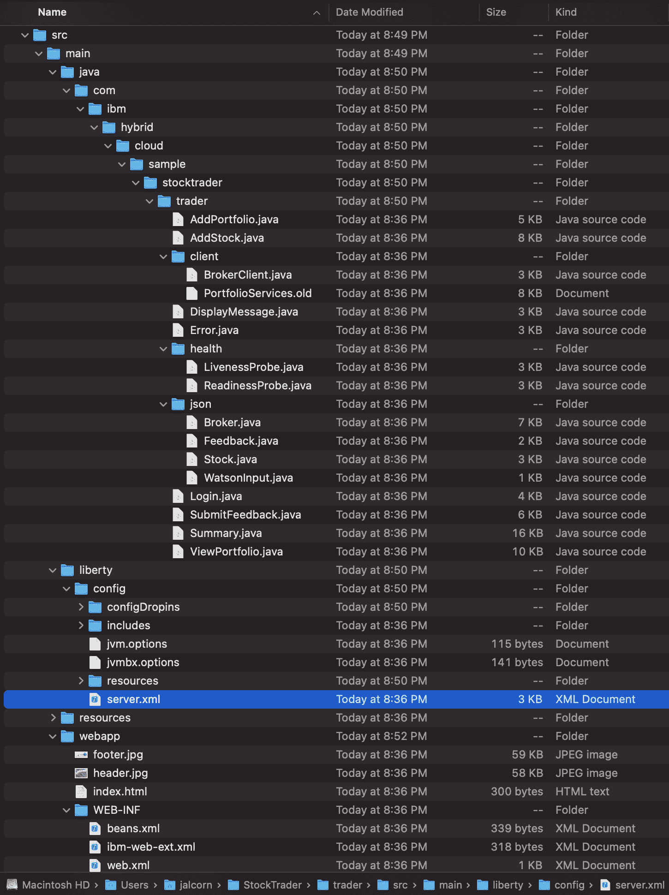
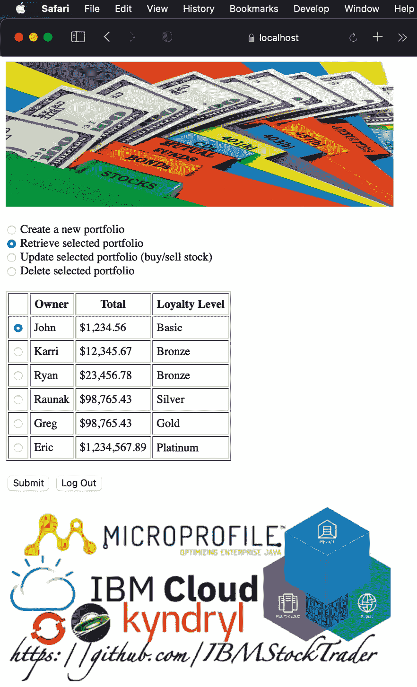
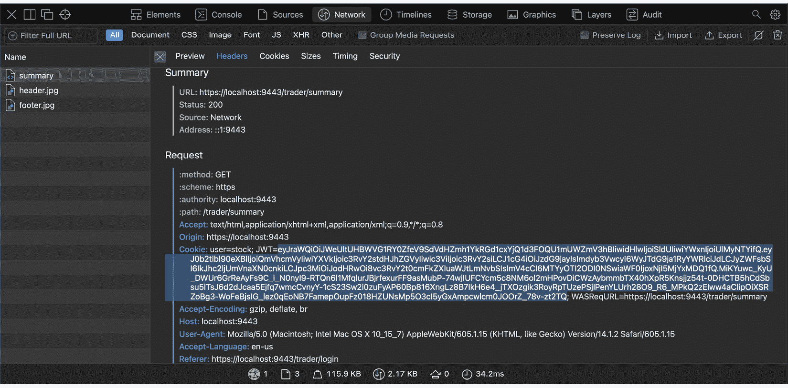
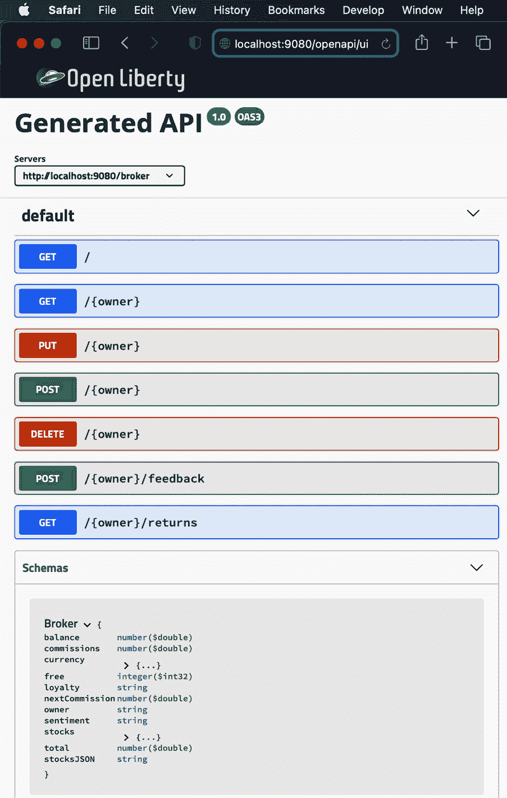
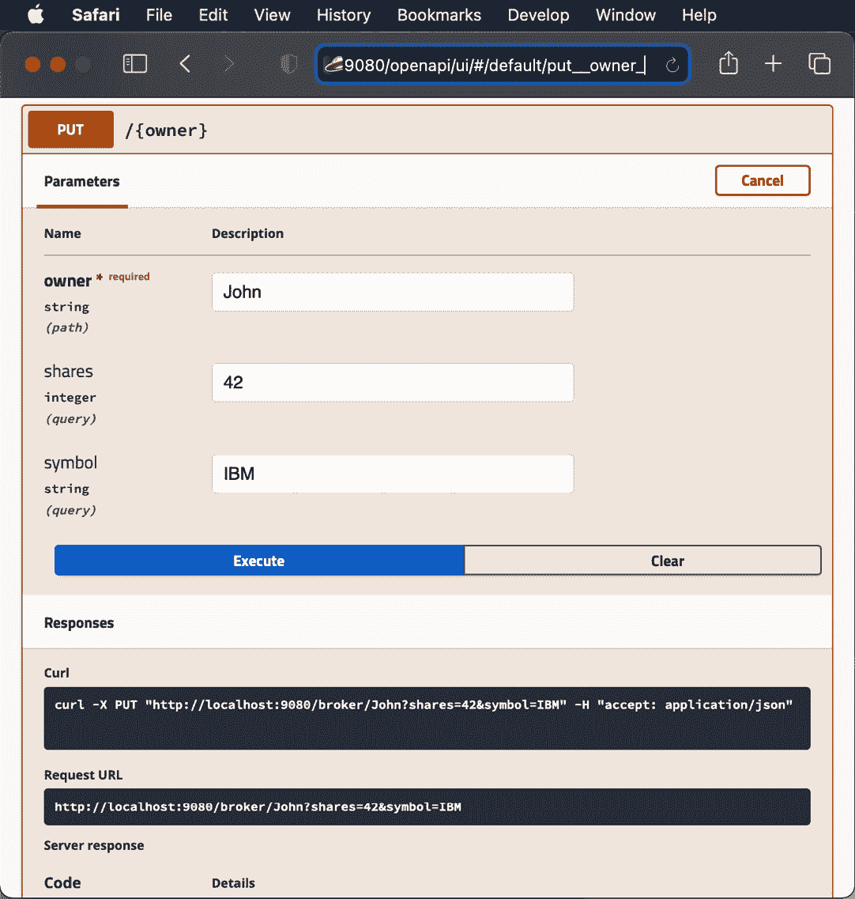

# 第八章：构建和测试您的云原生应用

在前面的章节中，我们单独研究了各种 MicroProfile 技术。现在，让我们回到我们的示例应用，即**IBM 股票交易者**，它首次在*第三章*中介绍，*介绍 IBM 股票交易者云原生应用*，看看这些技术如何在各个微服务中使用。在本章中，我们将重点关注如何构建这些微服务，如何构建每个微服务的容器镜像并将它们推送到镜像库，如何对它们进行单元测试，以及各种 MicroProfile 特性的使用。

在本章中，我们将涵盖以下主要主题：

+   编译股票交易微服务

+   构建股票交易容器镜像

+   测试股票交易微服务

+   股票交易对 MicroProfile 的使用

到本章结束时，你将熟悉如何构建此类云原生应用的各个部分，如何尝试每个部分，以及如何展示它们的用法。

# 技术要求

要构建和测试本节中描述的微服务，你需要安装以下工具：

+   **Java 开发工具包**（**JDK**） – Java 8 或更高版本：[`ibm.biz/GetSemeru`](http://ibm.biz/GetSemeru)

+   Apache Maven：[`maven.apache.org`](https://maven.apache.org)

+   一个 Git 客户端：[`git-scm.com`](https://git-scm.com)

+   一个 Docker 客户端：[`www.docker.com/products`](https://www.docker.com/products)

# 编译股票交易微服务

在本节中，我们将探讨如何为每个微服务创建源代码的本地副本，以及如何编译它并将它打包成一个可以部署到应用服务器的存档。

## GitHub

一个名为*IBMStockTrader*的公共 GitHub 组织，位于[`github.com/IBMStockTrader`](https://github.com/IBMStockTrader)，包含应用中由十几个微服务组成的每个微服务的仓库。

让我们专注于`trader`仓库，并克隆其内容：

```java
jalcorn@Johns-MBP-8 StockTrader % git clone   https://github.com/IBMStockTrader/trader
Cloning into 'trader'...
remote: Enumerating objects: 2840, done.
remote: Counting objects: 100% (247/247), done.
remote: Compressing objects: 100% (132/132), done.
remote: Total 2840 (delta 58), reused 0 (delta 0), pack-  reused 2593
Receiving objects: 100% (2840/2840), 28.25 MiB | 322.00   KiB/s, done.
Resolving deltas: 100% (1049/1049), done.
jalcorn@Johns-MBP-8 StockTrader % cd trader
jalcorn@Johns-MBP-8 trader % ls
BUILD.md             Jenkinsfile             lab
CONTRIBUTING.md      Jenkinsfiledemo         manifest.yml
Dockerfile           LICENSE                 manifests
Dockerfile-build     README.md           pipeline-template.yaml
Dockerfile-lang      build_parameters.sh     pom.xml
Dockerfile-tools     chart                   src
Dockerfile.basicregistry cli-config.yml
jalcorn@Johns-MBP-8 trader %
```

这里最重要的文件是`Dockerfile`和`pom.xml`（我们将在稍后讨论这两个文件），以及`src`目录，它包含所有源代码。这包括 Java 代码（位于`src/main/java` – 每个股票交易微服务都在`com.ibm.hybrid.cloud.sample.stocktrader`下的子包中），Web 工件（位于`src/main/webapp`），以及 Open Liberty 配置（位于`src/main/liberty/config` – 我们将在*构建股票交易容器镜像*部分进一步讨论）。应用中的所有微服务都遵循相同的结构。让我们看看`src`目录的内容：



图 8.1 – IBMStockTrader Git 仓库中的源代码布局

现在我们已经看到了每个 Git 仓库中的源代码结构，让我们看看如何使用 *Maven* 来构建它并将结果打包以部署到 Open Liberty 应用程序服务器的 Docker 容器。

## Maven

`pom.xml` 文件告诉 Maven 要构建什么以及如何构建。以下是步骤：

1.  首先，您需要在 `pom.xml` 文件中包含以下段落，以便 `org.eclipse.microprofile.*` 包的使用可以编译：

    ```java
            <dependency>
               <groupId>org.eclipse.microprofile</groupId>
               <artifactId>microprofile</artifactId>
               <version>4.0.1</version>
               <type>pom</type>
               <scope>provided</scope>
            </dependency>
    ```

    这是将所有 MicroProfile 4 功能放在编译时类路径上的 *总依赖项*。如果您愿意，也可以只选择特定的 MicroProfile 功能；例如，要将仅 *MicroProfile Health* 放在编译时类路径上，您需要指定 `org.eclipse.microprofile.health`。

    注意 `<scope>provided</scope>` 行 - 这告诉 Maven，尽管它应该将这些 JAR 文件添加到编译时类路径，但它不应该将这些 JAR 文件捆绑在构建的 WAR 文件中。托管 WAR 文件的应用服务器（在我们的例子中是 Open Liberty）提供了这些 JAR 文件，在应用程序内部有额外的副本可能会导致类加载器问题，所以我们告诉它 `provided` 以避免这种情况。

1.  接下来，让我们使用 Maven 构建我们的 `Trader` 微服务。大多数现代系统通过 `brew install maven` 来安装它。请注意，Maven 也依赖于 Java，您需要设置 `JAVA_HOME` 环境变量以指向您的 Java 安装。让我们使用 `mvn compile` 来编译我们的代码：

    ```java
    jalcorn@Johns-MBP-8 trader % mvn compile
    [INFO] Scanning for projects...
    [INFO] 
    [INFO] --------< com.stocktrader:trader >-------------
    [INFO] Building StockTrader - trader 1.0-SNAPSHOT
    [INFO] ----------------[ war ]-----------------------
    [INFO] --- maven-resources-plugin:2.6:resources   (default-resources) @ trader ---
    [INFO] Using 'UTF-8' encoding to copy filtered   resources.
    [INFO] Copying 1 resource
    [INFO] 
    [INFO] --- maven-compiler-plugin:3.1:compile (default-  compile) @ trader ---
    [INFO] Changes detected - recompiling the module!
    [INFO] Compiling 15 source files to /Users/jalcorn   StockTrader/trader/target/classes
    [INFO] -----------------------------------------------
    [INFO] BUILD SUCCESS
    [INFO] -----------------------------------------------
    [INFO] Total time:  1.913 s
    [INFO] Finished at: 2021-05-09T12:26:19-05:00
    [INFO] -----------------------------------------------
    jalcorn@Johns-MBP-8 trader %
    ```

    如您所见，编译所有代码只需几秒钟的时间。当然，如果发生任何编译错误，它们将在运行时显示。

1.  接下来，让我们通过 `mvn package` 打包 WAR 文件。为了节省空间，一些输出页被省略了，但这里显示了重要的部分：

    ```java
    mvn package, which takes about half a minute due to starting and stopping the Open Liberty server, actually does run the compile as well, so you would only use the command mvn compile directly when wanting a very fast way to check for compile errors.
    ```

1.  最后，我们可以通过命令 `mvn verify` 运行一些基本的集成测试。

    这将执行 `src/test/java` 下可能存在的任何测试类（强烈推荐，以尽早发现问题），例如我们位于 `src/test/java/com/ibm/hybrid/cloud/sample/stocktrader/trader/test` 下的 `HealthEndpointIT.java` 和 `HomePageIT.java`：

    ```java
    404 errors, as tests sometimes start trying to hit URLs before the server is fully started; that's why it retries up to *5* times before giving up.
    ```

现在我们已经看到了如何编译、打包和测试我们的代码，接下来让我们看看如何容器化它并测试容器。

# 构建股票交易者容器镜像

如前所述，我们使用 *Open Liberty* 作为托管大多数股票交易者微服务应用程序服务器的服务器。我们使用 *Docker* 来生成最终在 Kubernetes 集群（如 *OpenShift Container Platform* 集群）中运行的容器镜像。

以下小节将描述我们如何配置服务器，以及如何将其打包成容器镜像。

## Open Liberty

市场上有许多符合 MicroProfile 规范的 Java 应用程序服务器。作为提醒，从*第三章*，“介绍 IBM 股票交易云原生应用程序”，大多数股票交易微服务（交易员、经纪人、经纪人-查询、投资组合、账户、交易历史、消息传递、通知-Slack、收集器、循环器）都是基于开源的 Open Liberty 应用程序服务器。为了多样性，还有三个基于不同服务器的其他微服务：

+   股票报价，运行在红帽的**Quarkus**上。

+   通知-Twitter，运行在**传统 WebSphere 应用程序服务器**（**tWAS**）上。

+   Tradr 是唯一的非 Java 微服务，它用 Node.js 编写。

但在这里，我们将关注在 Open Liberty 上运行的那些。

配置 Open Liberty 服务器的最重要的文件是`server.xml`文件。它定义了应在服务器中启用的功能以及每个功能的配置。您可以通过在`server.xml`中列出`microProfile-4.1`功能来启用所有 MicroProfile 4.1 功能，如下所示：

```java
    <featureManager>
        <feature>microProfile-4.1</feature>
    </featureManager>
```

否则，就像 Maven 依赖项一样，如果您更喜欢启用较少的功能，例如，如果您只想启用*MicroProfile Health*和*MicroProfile Metrics*，您可以像下面这样单独列出它们：

```java
    <featureManager>
        <feature>mpHealth-3.1</feature>
        <feature>mpMetrics-3.1</feature>
    </featureManager>
```

除了您启用的功能外，其中一些支持配置段。许多 Java 企业版资源都在此配置，例如以下内容：

+   用于与关系数据库（如 IBM DB2）通信的 JDBC 数据源。

+   用于与消息系统（如 IBM MQ）通信的 JMS ActivationSpecs。

+   CloudantDatabase 用于与 NoSQL 数据存储（如 IBM Cloudant）通信。

对于特定的 MicroProfile 功能，以下是股票交易微服务如何配置*MicroProfile JWT*和*MicroProfile Metrics*功能：

```java
    <mpJwt id="stockTraderJWT" audiences="${JWT_AUDIENCE}"       issuer="${JWT_ISSUER}" keyName="jwtSigner"         ignoreApplicationAuthMethod="false" expiry="12h"           sslRef="defaultSSLConfig"/>
    <mpMetrics authentication="false"/>
```

这些功能已在之前的章节中讨论过，所以这里不再重复。但需要注意的是，我们引用的是环境变量，如`${JWT_ISSUER}`，而不是硬编码这些值；这样，如果我们想修改这些值，我们就不必重新构建容器镜像——相反，我们只需更新 Kubernetes *ConfigMap*或*Secret*中的值，然后我们的操作员将为*Deployment*配置`.yaml`文件，以获取和传递适当的环境变量值。

除了 `server.xml` 文件外，`src/main/liberty/config` 目录中的其他 Open Liberty 特定文件包括 `jvm.options`（用于传递 JVM 系统属性等），以及你的密钥库和/或信任库文件（例如 `src/main/liberty/config/resources/security` 目录中的 `key.p12` 和 `trust.p12`）。这些文件按照与 Open Liberty 服务器所需的相同目录结构排列，这样我们就可以将整个目录复制到 Docker 容器中 Open Liberty 的适当位置，正如我们将在下一节中看到的。

## Docker

一旦准备好所有需要成为 Docker 容器镜像一部分的输入文件，你就可以使用 `Dockerfile` 来指定你想要复制到哪里的文件。你还可以运行除了 `COPY` 以外的命令，例如设置文件权限或在容器中安装额外的工具：

1.  首先，让我们看一下 Trader 微服务的 `Dockerfile`：

    ```java
    docker pull of the image before running a build, to ensure you have the latest (as Docker would think you already have an image with such a tag, even though the one you have locally might be many months old). For example, do the following:

    ```

    kernel-slim 镜像，这意味着除了内核之外，镜像中不包含任何其他功能，以减小镜像大小。下一重要行表示我们想要将 `src/main/liberty/config` 目录复制到容器镜像中的 `/config` 目录。实际上，这个 `/config` 目录在 Open Liberty 中是一个指向 `/opt/ol/wlp/usr/servers/defaultServer` 的软链接（或在商业 WebSphere Liberty 中指向 `/opt/ibm/wlp/usr/servers/defaultServer`，你将通过 `FROM ibmcom/websphere-liberty:kernel-java11-openj9-ubi` 获取它）。我们复制整个目录（及其子目录），而不是为每个文件单独进行 `COPY`，以减少最终 Docker 镜像中的层数。

    ```java

    ```

1.  接下来，我们运行一个名为 `features.sh` 的脚本，该脚本下载我们在上一步中复制到 Docker 镜像中的 `server.xml` 中指定的所有功能。如果我们没有使用 `kernel-slim` 镜像，而是使用了 `full` 镜像，这一步就不需要了。注意我们希望在将 Maven 生成的 WAR 文件复制到容器之前运行此步骤，这样我们就不需要每次对应用程序进行小改动时都重新运行这个耗时的步骤。

1.  接下来，我们将我们的 WAR 文件（或消息微服务通过 `ear` 文件复制，因为它有一个 EJB - 一个消息驱动 Bean）复制到容器中。注意 `--chown 1001:0`，这告诉它文件应由哪个用户和组拥有 - 没有这个，服务器不会以 root 身份运行，因此没有权限访问文件。

1.  最后，我们运行 `configure.sh` 脚本，它对文件权限进行一些进一步的调整，并构建共享类缓存以改善性能。

1.  现在我们运行构建过程，这将执行 `Dockerfile` 的每一行：

    ```java
    jalcorn@Johns-MBP-8 trader % docker build -t trader .[+] Building 45.7s (10/10) FINISHED 
     => [internal] load build definition from Dockerfile 0.0s
     => => transferring dockerfile: 37B 0.0s
     => [internal] load .dockerignore 0.0s
     => => transferring context: 2B 0.0s
     => [internal] load metadata for docker.io/openliberty /open-liberty:k  0.0s
     => [1/5] FROM docker.io/openliberty/open-liberty:kernel-slim-java11-  0.0s
     => [internal] load build context 0.3s
     => => transferring context: 11.41MB 0.2s
     => CACHED [2/5] COPY --chown=1001:0 src/main/liberty/config /config   0.0s
     => CACHED [3/5] RUN features.sh 0.0s
     => [4/5] COPY --chown=1001:0 target/TraderUI.war /config/apps/Trader  0.1s
     => [5/5] RUN configure.sh 44.8s
     => exporting to image 0.4s
     => => exporting layers 0.4s
     => => writing image sha256:d0a03e6e7fd2873a8361aa9c9c   ad22dd614686778  0.0s
     => => naming to docker.io/library/trader 0.0s
    jalcorn@Johns-MBP-8 trader %
    ```

1.  现在我们已经生成了一个 Docker 镜像，我们可以将其推送到镜像仓库，以便你的操作员可以在 Kubernetes 环境中（如 **OpenShift 容器平台**（**OCP**））访问和使用。例如，这里我们将其推送到 Docker Hub：

    ```java
    jalcorn@Johns-MBP-8 trader % docker tag trader:latest ibmstocktrader/trader:latest
    jalcorn@Johns-MBP-8 trader % docker push ibmstocktrader/trader:latest
    The push refers to repository [docker.io/ibmstocktrader/trader]
    c139b5a83739: Pushing   13.9MB/62.74MB
    dae5b07894dc: Pushing  2.888MB/11.4MB
    0b797df05047: Pushing  5.893MB/69.17MB
    7daae910987c: Pushed 
    3efa9ea44ae4: Layer already exists 
    7d02e9817200: Layer already exists 
    267522994240: Layer already exists 
    0db07c8859ff: Layer already exists 
    2b4eefc8e725: Layer already exists 
    8a9f64ec0b16: Layer already exists 
    9b61e11e8907: Layer already exists 
    09b9a9d4c9f4: Layer already exists 
    83713a30b4bb: Layer already exists 
    1e8cd6732429: Layer already exists 
    476579af086a: Layer already exists
    jalcorn@Johns-MBP-8 trader %
    ```

既然我们已经构建了 *Trader* 微服务，那么就重复上述步骤来为 *Stock Quote* 微服务执行，我们稍后在本章中也会用到它。作为一个快速回顾，运行以下命令：

+   `git clone https://github.com/IBMStockTrader/stock-quote`

+   `cd stock-quote`

+   `mvn package`

+   `docker build -t stock-quote .`

在下一节中，我们将探讨如何测试我们刚刚构建的容器镜像。

# 测试股票交易微服务

现在我们已经学会了如何构建我们的微服务，在将它们部署到 OpenShift 环境之前，下一步重要的步骤是首先对它们进行一些单元测试，以确保它们按预期工作。

## 测试前端微服务

我们可以通过在笔记本电脑上使用本地安装的 Docker 来执行此类单元测试。让我们运行我们刚刚为 Trader 构建的 Docker 容器，并尝试一下：

```java
jalcorn@Johns-MBP-8 portfolio % docker run -p 9443:9443 -e JWT_AUDIENCE=test -e JWT_ISSUER=test -e TEST_MODE=true trader:latest
Launching defaultServer (Open Liberty 21.0.0.4/wlp-1.0.51.cl210420210407-0944) on Eclipse OpenJ9 VM, version 11.0.11+9 (en_US)
[AUDIT] CWWKE0001I: The server defaultServer has been launched.
<snip>
[INFO] SRVE0169I: Loading Web Module: Trader UI.
[INFO] SRVE0250I: Web Module Trader UI has been bound to default_host.
[AUDIT] CWWKT0016I: Web application available (default_host): http://5708495d563b:9080/trader/
[AUDIT] CWWKZ0001I: Application TraderUI started in 5.701 seconds.
[AUDIT] CWWKF0012I: The server installed the following features: [appSecurity-2.0, appSecurity-3.0, cdi-2.0, distributedMap-1.0, el-3.0, federatedRegistry-1.0, jaxrs-2.1, jaxrsClient-2.1, jndi-1.0, json-1.0, jsonb-1.0, jsonp-1.1, jsp-2.3, jwt-1.0, jwtSso-1.0, ldapRegistry-3.0, microProfile-4.0, monitor-1.0, mpConfig-2.0, mpFaultTolerance-3.0, mpHealth-3.0, mpJwt-1.2, mpMetrics-3.0, mpOpenAPI-2.0, mpOpenTracing-2.0, mpRestClient-2.0, oauth-2.0, openidConnectClient-1.0, opentracing-2.0, servlet-4.0, ssl-1.0, transportSecurity-1.0].
[INFO] CWWKF0008I: Feature update completed in 8.604 seconds.
[AUDIT] CWWKF0011I: The defaultServer server is ready to run a smarter planet. The defaultServer server started in 9.631 seconds.
```

这个 `docker run` 命令启动了容器，告诉它暴露其端口 `9443`（Open Liberty 的默认 HTTPS 端口），并传递了一些环境变量。

注意

环境变量 `TEST_MODE` 用于简化测试 Trader 微服务，它通常需要连接到代理微服务。它有一个选项可以绕过这一点，并使用硬编码的数据进行工作。

现在我们已经启动了容器，让我们在浏览器中访问 `https://localhost:9443/trader`。登录后（作为 `stock`/`trader`），我们可以看到硬编码的 `TEST_MODE` 数据：

![图 8.2 – 通过 docker run 测试 Trader UI 微服务]



图 8.2 – 通过 docker run 测试 Trader UI 微服务

恭喜你，你已经在容器中成功测试了 *Trader* 微服务！

## 测试后端微服务

在浏览器中测试前端微服务相当简单，因为网络浏览器会为你处理登录 Cookie，但当涉及到测试后端微服务之一时，由于使用了用于单点登录（SSO）的 **JSON Web Token**（JWT），这会变得稍微困难一些。*股票报价* 微服务就是这样一个后端微服务的例子，它使用 **MicroProfile JWT** 来确保在成功通过登录挑战并返回 JWT 之前，不允许任何调用者进入。

通过 `docker run -p 9080:9080 -e JWT_AUDIENCE=test -e JWT_ISSUER=test stock-quote:latest` 启动我们之前构建的股票报价微服务的 Docker 容器。和之前一样，这暴露了一个端口，以便我们可以与之通信；在这种情况下，它是端口 `9080`，用于标准的（未加密的）HTTP 访问。

然而，直接调用由股票报价微服务公开的 REST API，通过运行如 `curl http://localhost:9080/stock-quote/TEST` 这样的命令，将会因为缺少 SSO 凭据而返回 `401` 错误。

注意

`TEST` 是另一个特殊值，它返回硬编码的数据，绕过调用互联网以获取实际股票报价的过程。

我们可以通过使用我们的前端交易员微服务进行登录，然后在浏览器内集成的 Web 检查器中查找 JWT cookie 的值来解决此问题。这将在每个浏览器中略有不同；在我的情况下，我正在使用 Mac 上的 Safari，并从菜单栏中选择**开发** | **显示 Web 检查器**。然后我只需找到**摘要**请求（这是显示所有投资组合的 servlet）并将其**JWT** cookie 的值复制到剪贴板：



图 8.3 – 从 Web 检查器获取 JWT 值

然后将这个长字符串粘贴到`curl`中的`Authorization`头中，如下所示：

```java
jalcorn@Johns-MBP-8 StockTrader % curl -H "Authorization: eyJraWQiOiJWeUltUHBWVG1RY0ZfeV9SdVdHZmh1YkRGd1cxYjQ1d3FO QU1mUWZmV3hBIiwidHlwIjoiSldUIiwiYWxnIjoiUlMyNTYifQ.eyJ0b2tlbl 90eXBlIjoiQmVhcmVyIiwiYXVkIjoic3RvY2stdHJhZGVyIiwic3ViIjoic3R vY2siLCJ1cG4iOiJzdG9jayIsImdyb3VwcyI6WyJTdG9ja1RyYWRlciJdLCJy ZWFsbSI6IkJhc2ljUmVnaXN0cnkiLCJpc3MiOiJodHRwOi8vc3RvY2stdHJhZG VyLmlibS5jb20iLCJleHAiOjE2MjIxNTA0MDUsImlhdCI6MTYyMjE0MzIwNX0.k2z65b36MJU4fhpqq7S66pYV8rwZalT3aQK-hoOnINeVarg6k3AHIP6lN_ZHsT KX5W4b8q81o5gC0KSdEFN6VSi3qdC7a02aotICbuuZh459F7IuPOC5rWbwrUa kznNxh2I7s8Nurhcb2_UDq1WM0POyZYMpuDokys-CeH5w3QyLZ7tx_IS6czU9 yh17bX4pp3eNH0JLCZybB_i-rBHh8cwzKLk3q73CvPhHJ2jw_zw79viaSUs WOeIkF21S-iB2v4PYw7nTz54pp02pu_eHi8W-hRCebN0O7xsG_JNZUPEgloN b9O8b0d_7V8qyKD5m_YpSh45y_CZ9j82i_Ho_9A " http://localhost:90 80/stock-quote/TEST 
{"date":"2021-05-10","price":123.45,"symbol":
"TEST","time":0}% jalcorn@Johns-MBP-8 StockTrader %
```

如您所见，我们从我们后端股票报价微服务的快速单元测试中得到了`123.45`的股票价格。请注意，JWT 会自动过期，所以过一段时间后，如果您的`curl`调用开始被拒绝，您将不得不再次这样做以获取一个新的 JWT。当然，也有 GUI REST 测试客户端可以简化如何将凭证传递给后端服务这一常见问题。

现在我们已经看到了如何构建和测试每个微服务的容器的方法，让我们更深入地探讨在股票交易员应用程序中使用 MicroProfile 4.1 特性的情况。

# 在股票交易员中使用 MicroProfile 特性

让我们从了解哪些股票交易员微服务使用了哪些 MicroProfile 特性开始。请注意，一个微服务可以从给定的 MicroProfile 特性中受益有两种方式——隐式或显式：

+   在隐式情况下，只需在您的`server.xml`文件中列出该特性即可获得价值；例如，您可以通过启用`mpHealth-3.1`特性来获得就绪和存活探针的默认实现。

+   在显式情况下，您直接针对该特性提供的 API 进行编码，例如通过在您的 Java 类中针对`org.eclipse.microprofile.health`包中的类来编写自己的自定义逻辑，以确定您的微服务是否健康。

在以下表中，我们可以看到哪些微服务使用了哪些特性，其中*not*表示完全不使用，*dash*表示隐式使用，*checkmark*表示显式使用：


表 8.1 – 每个股票交易员微服务中的 MicroProfile 使用情况

注意，基于 tWAS 的 Notification-Twitter 和基于 Node.js 的 Tradr 没有被列出（因为它们不在 MicroProfile 兼容的服务器上运行），以及消息微服务只是一个没有 HTTP 端点的 MDB，所以大多数 MicroProfile 特性不适用于它。此外，在股票交易员中，我们倾向于使用（基于 Istio 的）*OpenShift 服务网格*通过`.yaml`文件来定义我们的容错策略，而不是直接编码到 mpFaultTolerance 特性中。

## MicroProfile 特性的隐式使用

MicroProfile 为那些正在现代化为 MicroProfile 兼容应用程序服务器的应用程序提供了显著的好处，即使这些应用程序没有更新到各种 MicroProfile 功能的 API。这在某些情况下可能很有用，例如，当你从传统的 WebSphere 应用程序服务器现代化到 Open Liberty 时，但不想进行大量的代码更新。在以下子节中，我们将检查哪些 MicroProfile 功能可以提供这样的隐式好处。

### MicroProfile 健康检查

如前所述，你只需在`server.xml`文件中启用`mpHealth-3.1`功能，就可以获得 Kubernetes 启动、就绪和存活探测的自动实现。请注意，启动探测在 Kubernetes 中相对较新，是在版本 1.16 中添加的，对应于 OpenShift 版本 4.3。MicroProfile 对这些探测的支持是在版本 4.1 中添加的，这是包含 MicroProfile Health 版本 3.1 的第一个版本。

如果你的应用程序启动时间较长（例如，如果它从数据库加载并缓存大量数据），启动探测非常有用。

就绪探测非常重要，这样工作就不会被路由到尚未真正准备好处理此类请求的新启动 Pod。

默认的就绪实现将在服务器及其所有应用程序完全启动之前返回`false`，然后将继续返回`true`，直到收到服务器停止的信号（例如，当*HorizontalPodAutoscaler*减少部署的 Pod 数量时）。这也是默认的启动探测实现——所以，如果你提供了自己的显式实现，你从启动探测中获得的额外价值，将超出默认就绪探测实现所提供的内容。

默认的存活实现只要服务器能够处理传入的 HTTP 请求就会返回`true`。这通常情况下是成立的，除非 Web 容器中的所有线程都挂起/正在使用，或者发生了像`OutOfMemoryError`这样的严重问题。Kubernetes 会自动杀死任何连续多次失败存活探测的 Pod，并启动一个新的 Pod 来替换它。

这里是直接在我们的容器上调用启动、就绪和存活探测的结果：

```java
jalcorn@Johns-MBP-8 StockTrader % curl http://localhost:9080/health/started 
{"checks":[],"status":"UP"}
% jalcorn@Johns-MBP-8 StockTrader % curl http://localhost:9080/health/ready
{"checks":[],"status":"UP"}% 
jalcorn@Johns-MBP-8 StockTrader % curl http://localhost:9080/health/live 
{"checks":[],"status":"UP"}% 
jalcorn@Johns-MBP-8 StockTrader %
```

### MicroProfile 度量指标

有三种类型的度量指标：基础、供应商和应用。前两种类型将自动对定期抓取`/metrics`端点（如*Prometheus*）的任何人可用，只需在`server.xml`文件中启用`mpMetrics-3.0`功能即可。第三种类型仅在应用程序编码为注释或来自`org.eclipse.microprofile.metrics`包的显式 API 调用时才可用。

基础指标由 MicroProfile Metrics 规范定义，通常包括与堆大小、垃圾收集和线程计数相关的 JVM 级别指标，以及各种计数器和计时器。供应商指标因每个应用程序服务器而异，包括 JDBC 和 JMS 连接池使用以及其他应用程序服务器为你管理的事情。让我们看看从我们的运行 Stock Quote 容器中可用的几个基础和供应商指标（完整集合将占用许多页面）：

```java
jalcorn@Johns-MBP-8 StockTrader % curl http://localhost:9080/metrics
# TYPE base_classloader_loadedClasses_count gauge
# HELP base_classloader_loadedClasses_count Displays the number of classes that are currently loaded in the Java virtual machine.
base_classloader_loadedClasses_count 12491
# TYPE base_thread_count gauge
# HELP base_thread_count Displays the current number of live threads including both daemon and non-daemon threads.
base_thread_count 53
# TYPE base_memory_usedHeap_bytes gauge
# HELP base_memory_usedHeap_bytes Displays the amount of used heap memory in bytes.
base_memory_usedHeap_bytes 6.675884E7
# TYPE vendor_servlet_request_total counter
# HELP vendor_servlet_request_total The number of visits to this servlet since the start of the server.
vendor_servlet_request_total{servlet="StockQuote_com_ibm_hybrid_cloud_sample_stocktrader_stockquote_StockQuote"} 1
# TYPE vendor_threadpool_size gauge
# HELP vendor_threadpool_size The size of the thread pool.
vendor_threadpool_size{pool="Default_Executor"} 8
# TYPE vendor_servlet_responseTime_total_seconds gauge
# HELP vendor_servlet_responseTime_total_seconds The total response time of this servlet since the start of the server.
vendor_servlet_responseTime_total_seconds{servlet="StockQuote_com_ibm_hybrid_cloud_sample_stocktrader_stockquote_StockQuote"} 0.9500412
jalcorn@Johns-MBP-8 StockTrader %
```

### MicroProfile OpenTracing

与可观察性相关的另一个功能是 MicroProfile OpenTracing。通过启用`mpOpenTracing-2.0`功能，它将自动为任何 JAX-RS 操作生成跟踪跨度。这些跟踪跨度被发送到任何已注册的跟踪器，例如 Jaeger。如果你已经注册了 Jaeger 跟踪器，你应该在你的容器输出中看到以下内容，表明跟踪跨度正在每个 JAX-RS 操作上发送：

```java
[INFO] Initialized tracer=JaegerTracer(version=Java-1.5.0, serviceName=StockQuote, reporter=CompositeReporter(reporters=[RemoteReporter(sender=UdpSender(host=localhost, port=6831), closeEnqueueTimeout=1000), LoggingReporter(logger=org.slf4j.impl.JDK14LoggerAdapter(io.jaegertracing.internal.reporters.LoggingReporter))]), sampler=RemoteControlledSampler (maxOperations=2000, manager=HttpSamplingManager(hostPort=localhost:5778), sampler=ProbabilisticSampler(tags={sampler.type=probabilistic, sampler.param=0.001})), tags={hostname=5f0 6cf0b9a96, jaeger.version=Java-1.5.0, ip=172.17.0.2}, zipkinSharedRpcSpan=false, expandExceptionLogs=false, useTraceId128Bit=false)
[INFO] CWMOT1001I: A JaegerTracer instance was created for the StockQuote application.  Tracing information is sent to localhost:6831.
```

MicroProfile Open Tracing 的另一个重要功能是，一个*跨度*可以链接到所需数量的调用，因此，而不是只看到一个跨度显示 A 调用了 B，另一个跨度显示 B 调用了 C，一个跨度可以包含从 A 到 B 再到 C 的调用路径，包括它们发生的时间、每个部分花费的时间以及更多。能够看到例如包含交易员调用经纪人调用投资组合调用股票报价的跨度，对于那些想要了解所有这些各种微服务在运行时如何组合在一起以及它们是否按预期执行的人来说是有价值的。

### MicroProfile OpenAPI

MicroProfile OpenAPI 功能相当酷，因为它会通过在`server.xml`文件中启用`mpOpenAPI-2.0`功能来生成关于你的 JAX-RS 类的文档。如果有人想知道你的微服务提供了哪些操作，他们只需执行`curl http://localhost:9080/openapi`来获取一个`.yaml`文件，该文件解释了每个可用的操作、它们的输入参数以及它们返回的数据结构。

Open Liberty 提供的一个很好的额外功能是能够生成一个人类友好的网页渲染信息（有时这被称为 Swagger UI）。只需在浏览器中输入`http://localhost:9080/openapi/ui`即可查看 HTML 渲染。让我们看看我们的 Broker 微服务的 HTML 渲染：

![图 8.4 – MicroProfile OpenAPI UI]



图 8.4 – MicroProfile OpenAPI UI

在这里我们可以看到，这些操作返回了一个`Broker` JSON 对象。

我们还可以深入到其中一个操作中，查看其详细信息 – 让我们选择用于更新股票交易的**PUT**操作：




图 8.5 – MicroProfile OpenAPI UI 中的操作详情

现在，我们可以看到预期的路径和查询参数，甚至可以点击表单中每个字段输入的`curl`命令，以及调用操作的结果。

### MicroProfile JWT

MicroProfile 提供的最后一个具有隐含价值的特性是 MicroProfile JWT。只需在`server.xml`文件中启用`mpJWT-1.2`功能（以及`server.xml`文件中的几个其他段落、WAR 文件的`web.xml`中的一个段落，以及`keystore/truststore`中的签名密钥），就可以使应用服务器拒绝任何没有在 Authorization HTTP 头或 cookie 中包含所需 JWT 的调用。

这是一个非常强大的功能，因为它提供了很好的单点登录执行，而无需编辑任何 Java 代码。如果有人试图调用你的微服务而没有附加适当的 JWT，它将因`403`错误而被拒绝：

```java
jalcorn@Johns-MBP-8 StockTrader % 
curl -I http://localhost:9080/broker
HTTP/1.1 403 Forbidden
X-Powered-By: Servlet/4.0
Content-Type: text/html;charset=ISO-8859-1
$WSEP: 
Content-Language: en-US
Connection: Close
Date: Tue, 11 May 2021 05:27:45 GMT
jalcorn@Johns-MBP-8 StockTrader %
```

当这种情况发生时，你将看到以下消息被你的容器记录：

```java
[ERROR] CWWKS5522E: The MicroProfile JWT feature cannot perform authentication because a MicroProfile JWT cannot be found in the request.
```

在不进行任何 Java 编码的情况下，获得如此强大的安全执行功能，是 MicroProfile 提供的一个非常好的特性！

# 摘要

你现在应该对如何构建和单元测试 Stock Trader 应用程序中的任何微服务有了一定的了解。你也应该现在对如何容器化这些微服务，然后运行这些容器并调用这些微服务感到舒适。

注意，通常情况下，你不会像本章所介绍的那样手动从命令提示符中运行这些构建步骤，而是会有一个 DevOps 管道为你运行这些步骤，例如，当你向 Git 仓库提交更改时，会自动通过 webhook 启动。例如，请参阅关于 Trader 微服务的此类 CI/CD 管道的这篇博客文章，它还执行了各种安全和合规性检查：[`medium.com/cloud-engagement-hub/are-your-ci-cd-processes-compliant-cee6db1cf82a`](https://medium.com/cloud-engagement-hub/are-your-ci-cd-processes-compliant-cee6db1cf82a)。但是，了解如何手动操作是很有好处的，而不是让它看起来像某种神奇、神秘的事情发生，以便你的容器镜像在镜像仓库中构建并可用。

我们还介绍了 Stock Trader 如何从许多 MicroProfile 功能中受益，即使它没有明确编码到这些功能中。将现代化为 MicroProfile 兼容的应用服务器可以“免费”提供这些好处，而无需你的开发人员花费时间修改他们的代码，这是参与此类应用程序现代化努力的强大动力。

在下一章中，我们将探讨如何通过其操作员将此应用程序部署到 OpenShift 集群，并探讨我们如何使用它来执行一些*Day 2*操作。
