# 第四章：应用结构型设计模式

每个软件都有一个目的或换句话说，它应该满足的预期行为。虽然前一章详细描述了创建型设计模式，但本章将专注于为创建的对象设计可维护和灵活的源代码。结构型模式试图阐明创建实例之间的关系，不仅是为了维护应用程序，也是为了容易理解其目的。让我们深入了解，并开始检查以下主题：

+   使用适配器模式实现不兼容对象协作

+   使用桥接模式解耦并独立开发对象

+   使用组合模式以相同的方式处理对象

+   通过使用装饰器模式扩展对象功能

+   使用外观模式简化通信

+   使用条件选择所需对象与过滤器模式

+   使用享元模式在应用程序中共享对象

+   使用前端控制器模式处理请求

+   使用标记模式识别实例

+   使用模块模式探索模块的概念

+   使用代理模式为对象提供一个占位符

+   使用双生模式在 Java 中探索多重继承

到本章结束时，您将牢固地理解如何围绕创建的实例构建代码库。

# 技术要求

您可以在 GitHub 上找到本章的代码文件：[`github.com/PacktPublishing/Practical-Design-Patterns-for-Java-Developers/tree/main/Chapter04`](https://github.com/PacktPublishing/Practical-Design-Patterns-for-Java-Developers/tree/main/Chapter04)。

# 使用适配器模式实现不兼容对象协作

适配器模式的主要目标是连接源类接口到客户端期望的另一个接口。适配器模式允许类在没有不兼容抽象或实现的情况下协同工作。它被认为是最常见的模式之一，也是**四人帮**（**GoF**）设计模式之一。

## 动机

适配器模式也被称为**包装器**。适配器封装了适配者（连接类）的行为，并允许通过一个已存在的接口来访问适配者，而不进行修改。通常，适配者使用不兼容的接口，适配器将这种行为合并并提供对所需功能的透明访问。

## 在 JDK 中找到它

`java.base`模块提供了适配器模式的多种实现。`java.util`包中的`Collections`实用类提供了一个`list`方法，该方法接受一个`Enumeration`接口，并将结果适配为`ArrayList`实例。

## 示例代码

适配器模式可以以多种方式实现。其中一种在以下车辆示例中考虑（*示例 4.1*）：

```java
public static void main(String[] args) {
    System.out.println("Adapter Pattern: engines");
    var electricEngine = new ElectricEngine();
    var enginePetrol = new PetrolEngine();
    var vehicleElectric = new Vehicle(electricEngine);
    var vehiclePetrol = new Vehicle(enginePetrol);
    vehicleElectric.drive();
    vehicleElectric.refuel();
    vehiclePetrol.drive();
    vehiclePetrol.refuel();
}
```

这里是输出：

```java
Adapter Pattern: engines
...
Vehicle, stop
Vehicle needs recharge
ElectricEngine, check plug
ElectricEngine, recharging
...
Vehicle needs petrol
PetrolEngine, tank
```

示例 4.1 – 尽管每种类型的车辆都共享类似的逻辑，但加油方法的操作因引擎类型而异

这些引擎共享一些类似的功能和特性，但并非全部。它们彼此之间非常不同（*图 4**.1*）：

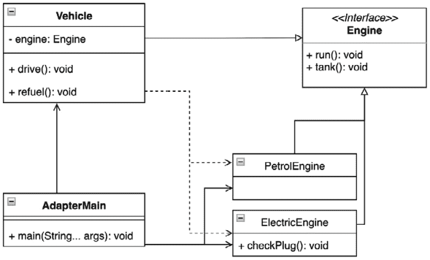

图 4.1 – 强调引擎类型差异的 UML 类图

在此示例中，`Vehicle`类及其实例扮演适配器的角色。在`drive`方法的情况下，两种马达的行为相似。`tank`方法的执行是一个不同的场景，因为车辆适配器需要知道确切的引擎类型才能正确执行`refuel`方法（*示例 4.2*）：

```java
class Vehicle {
    private final Engine engine;
  ...
    void refuel(){
        System.out.println("Vehicle, stop");
        switch (engine){
            case ElectricEngine de -> {
                System.out.println("Vehicle needs diesel");
                de.checkPlug();
                de.tank();
            }
            case PetrolEngine pe -> {
                System.out.println("Vehicle needs petrol");
                pe.tank();
            }
            default -> throw new IllegalStateException
               ("Vehicle has no engine");
        }
        engine.tank();
    }
}
```

示例 4.2 – `Vehicle`实例根据其类型使用引擎，该类型由模式匹配功能识别

新的语言特性，如`switch`语句增强，非常有用，因为不需要保留适配器的确切实例引用。`sealed`类通过保护其意图，例如通过避免不想要的扩展，来强制执行所需的目的并提高可维护性。

考虑的两种引擎类型仍然可以实施类似抽象，以保持引擎的概念（*示例 4.3*）：

```java
sealed interface Engine permits ElectricEngine,
    PetrolEngine  {
    void run();
    void tank();
}
```

示例 4.3 – `Engine`接口只允许某些类实现其方法

`Vehicle`适配器提供了处理不同引擎实现所需逻辑的必要逻辑。`ElectricEngine`实现提供了一个额外的`checkPlug`方法（*示例 4.4*）：

```java
final class ElectricEngine implements Engine{
    @Override
    public void run() {
        System.out.println("ElectricEngine, run");
    }
    @Override
    public void tank() {
        System.out.println("ElectricEngine, recharging");
    }
    public void checkPlug(){
        System.out.println("ElectricEngine, check plug");
    }
}
```

示例 4.4 – `ElectricEngine`实现了与通用`Engine`概念不共享的附加逻辑

## 结论

适配器结构设计模式在开发中有一个合理的位置，因为它代表了一种连接不同功能并通过类似接口控制它们的可维护方式。适配器被适当封装，甚至可以更加抽象。新的`sealed`类支持可维护性和清晰性的模式概念。使用适配器模式的后果可能是适配器需要承诺特定的适配器或接口。适配器可以作为子类扩展一些适配器功能。当需要实现额外的第三方库或 API 时，适配器模式值得考虑。它提供了一个透明且解耦的方式来与库交互，遵循 SOLID 原则。解决方案也可以轻松重构。

对适配器模式的这种分析展示了使用不兼容 API 的方法。接下来，让我们研究如何使用不同的可替换实现。

# 使用桥接模式解耦并独立开发对象

此模式的目的是将抽象与其实现分离，以便两者可以独立更改。桥接模式由 GoF 描述。

## 动机

桥接模式是优先考虑组合而非继承。实现细节从层次结构移动到另一个具有独立层次结构的对象。桥接模式使用封装和聚合，并且可能使用继承将责任分离到不同的类中。

## 在 JDK 中找到它

桥接模式的使用可以在`java.util.logging`包和`Logger`类的实现中找到。该类位于`java.logging`模块中。它实现了`Filter`接口。该接口用于在标准日志级别之外获得对记录内容的额外控制。

## 样本代码

让我们看看两种类型车辆的例子：一辆跑车和一辆皮卡。这些车辆在发动机类型上有所不同：汽油和柴油。目的是为了强制对`Vehicle`和`Engine`抽象源代码进行独立开发。示例案例创建了车辆并执行了`drive`和`stop`方法（*示例 4.5*）：

```java
public static void main(String[] args) {
    System.out.println("Pattern Bridge, vehicle
        engines...");
    Vehicle sportVehicle = new SportVehicle(new
        PetrolEngine(), 911);
    Vehicle pickupVehicle = new PickupVehicle(new
        DieselEngine(), 300);
    sportVehicle.drive();
    sportVehicle.stop();
    pickupVehicle.drive();
    pickupVehicle.stop();
}
```

下面是输出：

```java
Pattern Bridge, vehicle engines...
SportVehicle, starting engine
PetrolEngine, on
SportVehicle, engine started, hp:911
SportVehicle, stopping engine
PetrolEngine, self check
PetrolEngine, off
SportVehicle, engine stopped
PickupVehicle, starting engine
DieselEngine, on
PickupVehicle, engine started, hp:300
PickupVehicle, stopping engine
DieselEngine, off
PickupVehicle, engine stopped
```

示例 4.5 – 车辆使用不同的发动机；由于桥接模式的隔离，它们可以独立开发

每个车辆都扩展了运行发动机并封装基本功能的`Vehicle`抽象类。车辆抽象使用的`Engine`接口扮演了桥接的角色，如下面的图所示（*图 4**.2*）：

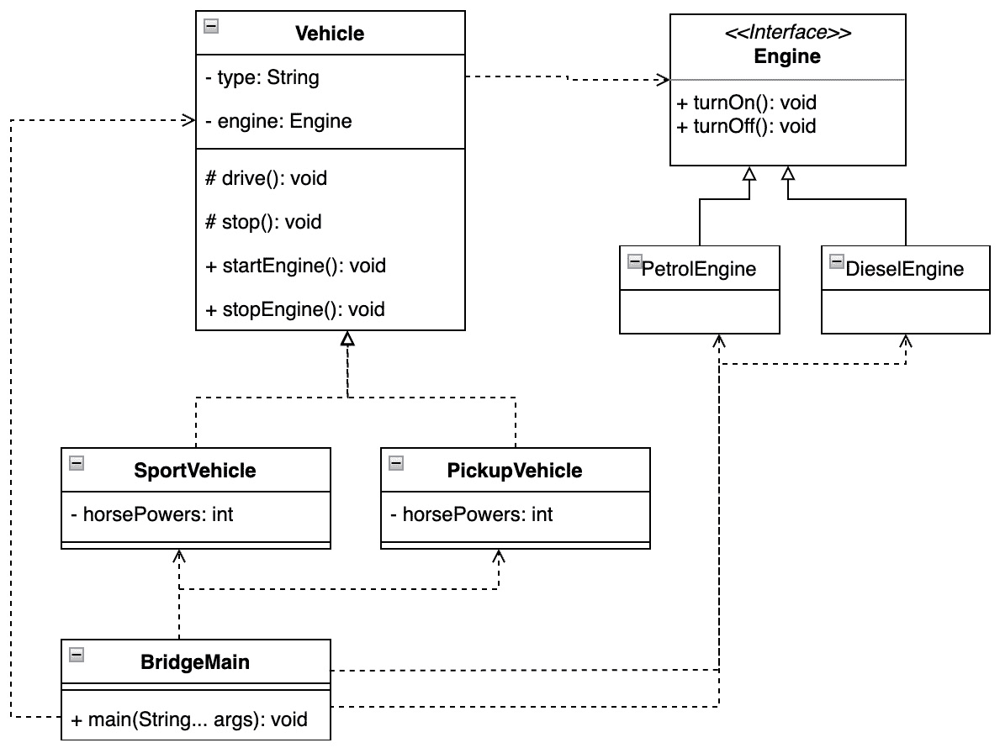

图 4.2 – UML 类图显示了如何通过 Engine 接口桥接对特定实现的访问

发动机已经表现出不同的行为，由于桥接，它们可能会继续发展（*示例 4.6*）：

```java
class DieselEngine implements Engine{
        ...
    @Override
    public void turnOff() {...}
}
class PetrolEngine implements Engine{
        ...
    @Override
    public void turnOff() {
       selfCheck();
       ...
    }
    private void selfCheck(){ ...}
}
```

示例 4.6 – 发动机在实现上有所不同

车辆抽象没有任何发动机实现细节，这些细节可能在类层次结构中有所不同。车辆只需要依赖于提供的接口。

## 结论

当应用程序源代码需要减少对特定实现类的绑定时，桥接模式是一个很好的考虑方案。由于桥接模式，关于特定实现的决定可以推迟到运行时。桥接模式通过责任分离和封装来鼓励 SOLID 设计原则。实现可以自由地通过应用程序源代码进行测试和共享。需要记住的是，不要向桥接实现添加不希望的责任，并在出现这种情况时考虑设计模式的替代方法。

桥接模式可以为实现细节的更好组合打开大门，我们将在下一个模式中探讨。

# 使用组合模式以相同方式处理对象

组合模式是一个在以树结构排列对象的同时统一处理对象的显著解决方案，这简化了对实例的访问。对它的需求自然来自工业界，该模式很快就被 GoF 识别并描述。

## 动机

围绕底层业务逻辑对对象进行分组是一种强大的方法。组合设计模式概述了实现这种状态的方法。由于每个组员都受到统一对待，因此可以创建层次树结构和部分-整体层次结构。它有助于建立应用程序的逻辑关系和所需对象的组合。

## 在 JDK 中找到它

在 JDK 中，组合模式可以在 `java.base` 模块、`java.util` 包和 `Properties` 类中找到。`Properties` 类通过其 `Hashtable` 实现实现了 `Map` 接口，并且还包含一个 `ConcurrentHashMap` 实例来内部存储属性值。尽管由于 `Hashtable` 实现的原因，`Properties` 类的 `put` 操作保持同步，但 `get` 操作并不同步，因为将其读取到并发映射中很简单。

## 示例代码

要探索组合模式的力量，可以考虑实现 `Vehicle` 接口的 `SportVehicle` 类。众所周知，每辆车都是部件的集合，每个部件都是更小部件的分组（*图 4**.3*）：

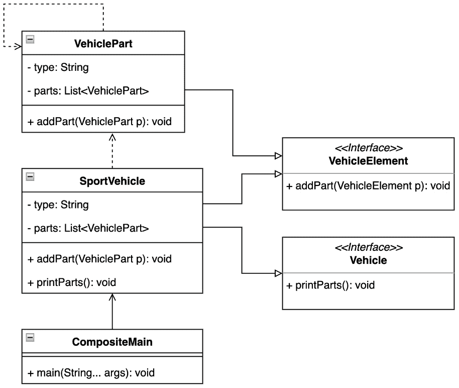

图 4.3 – UML 类图显示了 SportVehicle 是如何由 VehiclePart 类型组成的

当车辆制造过程开始时，组合模式提供了一组完整的部件，这些部件最终都会出现在结果中（*示例 4.7*）：

```java
public static void main(String[] args) {
    System.out.println("Pattern Composite, vehicle
        parts...");
    var fastVehicle = new SportVehicle("sport");
    var engine = new VehiclePart("fast-engine");
    engine.addPart(new VehiclePart("cylinder-head"));
    var brakes = new VehiclePart("super-brakes");
    var transmission = new VehiclePart("automatic-
        transmission");
    fastVehicle.addPart(engine);
    fastVehicle.addPart(brakes);
    fastVehicle.addPart(transmission);
    fastVehicle.printParts();
}
```

这里是输出：

```java
Pattern Composite, vehicle parts...
SportCar, type'sport', parts:'
[{type='fast-engine', parts=[{type='cylinder-head',
  parts=[]}]},
{type='super-brakes', parts=[]},
{type='automatic-transmission', parts=[]}]'
```

示例 4.7 – 检查 SportVehicle 实例的组合

## 结论

组合模式允许以细粒度详细表示类的组合。它通过创建部分-整体层次结构来考虑组合的较小部分。虽然这提供了优势，因为每个部分都受到统一对待，但它可能导致忽略部分之间的差异。另一方面，组合模式以透明的方式将所有涉及的部分组合在一起。

让我们现在看看如何在不改变 API 的情况下，通过附加额外的功能来扩展单个对象。

# 通过使用装饰器模式扩展对象功能

装饰器模式通过将对象放入装饰器中，提供了向对象添加新功能的能力，因此装饰后的实例提供了扩展功能。装饰器模式的实现相对简单且在 Python 和 Kotlin 等语言中具有动态性。另一方面，Java 通过可见性和新增强功能提供了源代码的更多稳定性和可维护性，这非常有价值。装饰器模式是由 GoF 确定并描述的。

## 动机

使用装饰器模式，你可以动态地为对象附加额外的职责。装饰器为扩展类的功能提供了一个灵活的替代子类的方法。装饰器可以静态或动态地添加，而不会改变对象当前的行为。

## 在 JDK 中查找

装饰器模式的使用可以在 Java 集合框架、`java.base` 模块和 `java.util` 包中找到。`Collection` 类包含了使用装饰器模式的不同方式。例如，`unmodifiableCollection` 方法将请求的集合包装成一个不可修改的集合，该集合由一个 `UnmodifiableCollection` 实例表示，该实例作为提供集合类型的装饰器，类似于以 `unmodifiable...` 开头的方法。另一个例子是 `Collections` 工具类中以 `synchronized...` 开头的方法。

## 样本代码

当你考虑之前的车辆示例时，装饰器模式可以被视为调校过的车辆。标准的 `SportVehicle` 类就是这样。它实现了 `Vehicle` 接口以执行标准功能。应用设计师后来决定改进当前状态，并创建了一个 `TunedVehicleDecorator` 类来包装标准车辆，而不必改变之前的函数（*图 4**.4*）：

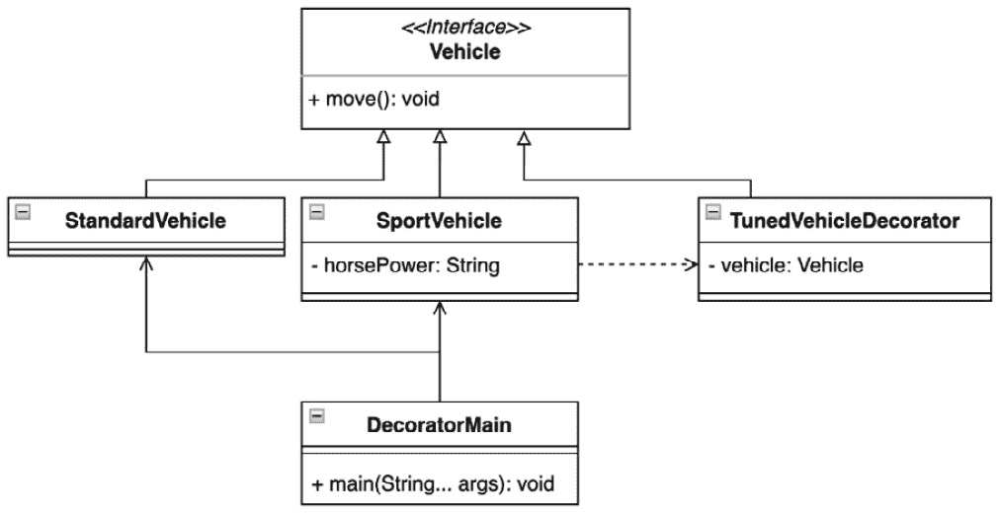

图 4.4 – UML 类图突出了 SportVehicle 和 TunedVehicleDecorator 类型之间的关系

所考虑的车辆都公开了类似的 API 来执行它们的实现（*示例 4.8*）：

```java
public static void main(String[] args) {
    System.out.println("Pattern Decorator, vehicle 1");
    Vehicle standardVehicle = new StandardVehicle();
    Vehicle vehicleToBeTuned = new StandardVehicle();
    Vehicle tunedVehicle = new SportVehicle
        (vehicleToBeTuned, 200);
    System.out.println("Drive a standard vehicle");
    standardVehicle.move();
    System.out.println("Drive a tuned vehicle");
    tunedVehicle.move();
}
```

这里是输出：

```java
Pattern Decorator, tuned vehicle
Drive a standard vehicle
Vehicle, move
Drive a tuned vehicle
SportVehicle, activate horse power:200
TunedVehicleDecorator, turbo on
Vehicle, move
```

示例 4.8 – 调校汽车抽象通过增加更多马力（200）扩展了 SportVehicle 类型的功能

装饰器模式可以通过多种方式引入。在所提供的示例中，`TunedVehicleDecorator` 是一个抽象类，它持有对车辆的引用。`SportVehicle` 实例扩展了新实现的功能（*示例 4.9*）：

```java
sealed abstract class TunedVehicleDecorator implements
    Vehicle permits SportVehicle {
    private final Vehicle vehicle;
    TunedVehicleDecorator(Vehicle vehicle) {
        this.vehicle = vehicle;
    }
    @Override
    public void move() {
        System.out.println("TunedVehicleDecorator,
           turbo on");
        vehicle.move();
    }
}
final class SportVehicle extends TunedVehicleDecorator {
    private final int horsePower;
    public SportVehicle(Vehicle vehicle, int horsePower) {
        super(vehicle);
        this.horsePower = horsePower;
    }
    @Override
    public void move() {
        System.out.println("SportVehicle, activate horse
            power:" + horsePower);
        super.move();
    }
}
```

示例 4.9 – 装饰器包装了 Vehicle 实例并扩展了其功能

## 结论

在应用开发过程中的许多情况下，类装饰可以非常有用。装饰器模式可以用来迁移应用逻辑，其中之前的功能应该保持隐藏或应避免不想要的子类化。示例展示了密封类如何有助于代码的可维护性和可理解性。装饰器不仅有助于添加新功能，还有助于移除过时的功能。装饰器模式是一种在不破坏当前接口的情况下修改对象的可透明方式。

有时使用装饰器模式与我们将要检查的另一个设计模式（外观模式）一起使用是有意义的。

# 使用外观模式简化通信

门面模式为一系列底层子系统提供了一个统一的接口。换句话说，门面定义了一个高级接口，便于使用。门面模式由 GoF 描述。

## 动机

随着子系统的演变，它们通常变得更加复杂。大多数模式在使用时会导致类变得更小，从而使子系统更易于重用和定制，但也使得所有客户端与之交互变得更加困难。门面模式提供了一个简单的默认视图，这对于大多数客户端来说已经足够好。只有需要更多定制的客户端才需要超越门面模式。

## 在 JDK 中找到它

Java 集合框架位于 `java.base` 模块中，`java.util` 已经被提及多次。它是 JDK 中广泛使用的一部分，尤其是在内部逻辑实现方面。例如 `List`、`Set`、`Queue`、`Map` 和 `Enumeration` 等接口可以被视为特定实现的门面。让我们更详细地回顾一下 `List` 接口。它由常用的 `ArrayList` 或 `LinkedList` 类以及其他类实现。实现的具体细节有所不同，其中一些在 *第二章* 《发现 Java 平台设计模式》中提到（*表 2.3*、*2.4* 和 *2.5*）。

## 示例代码

门面模式是软件工程中常用的一种设计模式，且易于展示。考虑一个司机获得驾驶执照的情况，该执照使他们有权驾驶汽油和柴油汽车，当然，也可以为他们加油。司机作为奖励获得这两种类型（*示例 4.10*）：

```java
public static void main(String[] args) {
    System.out.println("Pattern Facade, vehicle types");
    List<Vehicle> vehicles = Arrays.asList(new
        DieselVehicle(), new PetrolVehicle());
    for (var vehicle: vehicles){
        vehicle.start();
        vehicle.refuel();
    }
}
```

这是输出结果：

```java
Pattern Facade, vehicle types
DieselVehicle, engine warm up
DieselVehicle, engine start
DieselVehicle, refuel diesel
PetrolVehicle, engine start
PetrolVehicle, refuel petrol
```

示例 4.10 – 门面模式促进标准化控制接口

整合车辆类型对代码结构有积极的影响，易于实现（*图 4**.5*）：

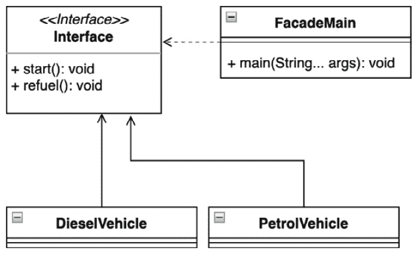

图 4.5 – 门面模式在车辆实现中的 UML 类图

## 结论

大量使用门面模式使其在任何应用开发阶段都成为考虑的好候选。它不仅促进了接口分离原则，还促进了整个 SOLID 概念。它有助于实现内部依赖关系，同时保持可定制性和可维护性。门面有助于引入松散耦合，并分离客户端，迫使移除不情愿的依赖。门面模式自然支持源代码的水平扩展。尽管门面模式提供了很多好处，但由未维护的源代码引起的误用可能会变成不受欢迎的状态。解决方案是重新评估当前实现，并根据 SOLID 原则进行改进。

接下来，我们将探讨如何根据规则从集合中选择正确的对象。

# 使用过滤模式通过条件选择所需对象

过滤模式——有时也称为标准模式——是一种设计模式，它允许客户端使用不同的标准或规则来过滤一组对象，并通过逻辑运算分别将它们链接起来。

## 动机

过滤模式有助于简化代码库，使其像使用子类型而不是参数化（泛型）的可扩展类结构的容器对象一样工作。它允许客户端轻松扩展并公开容器类似对象的过滤能力。不同的过滤条件可以动态添加或删除，而无需通知客户端。

## 在 JDK 中找到它

让我们将过滤器视为一个具有单个函数和逻辑布尔结果的接口。过滤模式的一个很好的例子是 `Predicate` 类，它在 `java.base` 模块和 `java.util.function` 包中找到。`Predicate` 表示一个布尔函数，并打算用于 *Java Stream API*（之前在 *第二章*，*发现 Java 平台设计模式*）中，更具体地说是在 `filter` 方法中，该方法接受一个谓词并返回一个布尔值。

## 样本代码

使用过滤模式的一个很好的例子是一个需要选择车辆中所需传感器的应用程序。如今，每辆车都包含大量的传感器，因此客户端可能难以单独研究每一个（*示例 4.11*）：

```java
private static final List<Sensor> vehicleSensors = new
    ArrayList<>();
static {
    vehicleSensors.add(new Sensor("fuel", true));
    vehicleSensors.add(new Sensor("fuel", false));
    vehicleSensors.add(new Sensor("speed", false));
    vehicleSensors.add(new Sensor("speed", true));
}
public static void main(String[] args) {
    ...
    Rule analog = new RuleAnalog();
    Rule speedSensor = new RuleType("speed");
    ...
    var analogAndSpeedSensors = new RuleAnd(analog,
        speedSensor);
    var analogOrSpeedSensors = new RuleOr(analog,
        speedSensor);
    System.out.println("analogAndSpeedSensors=" +
        analogAndSpeedSensors.validateSensors
            (vehicleSensors));
    System.out.println("analogOrSpeedSensors=" +
          analogOrSpeedSensors.validateSensors
              (vehicleSensors));
}
```

这是输出：

```java
Pattern Filter, vehicle sensors
AnalogSensors: [Sensor[type=fuel, analog=true],
    Sensor[type=speed, analog=true]]
SpeedSensors: [Sensor[type=speed, analog=false],
    Sensor[type=speed, analog=true]]
analogAndSpeedSensors=[Sensor[type=speed, analog=true]]
analogOrSpeedSensors=[Sensor[type=fuel, analog=true],
    Sensor[type=speed, analog=true], Sensor[type=speed,
        analog=false]]
```

示例 4.11 – 使用过滤模式简单且透明地将特定车辆传感器组链接起来

让我们画一个例子（*图 4**.6*）：

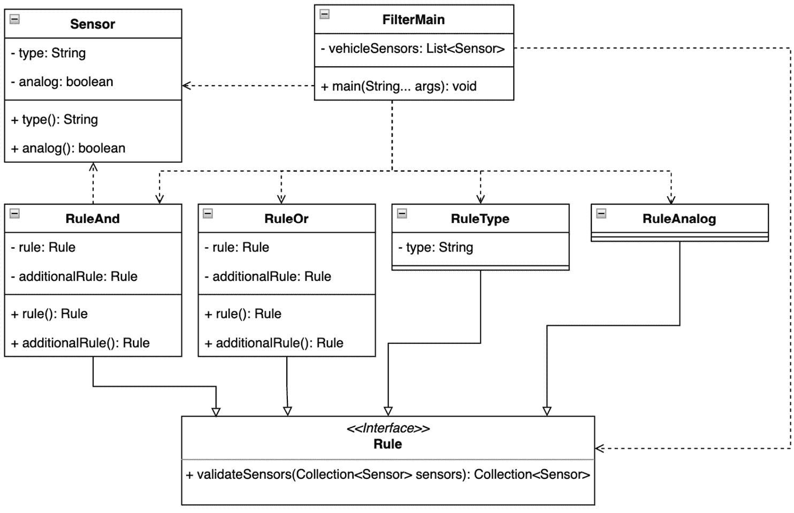

图 4.6 – 容器用于选择合适的传感器实例的可能规则的 UML 类图

`Rule` 接口满足功能接口的期望，因为它只包含一个方法，`validateSensors`。这也意味着编译器将 `Rule` 接口像其他注解功能接口一样处理和优化。每个规则都可以包含一个特定的实现（*示例 4.12*）：

```java
@FunctionalInterface
interface Rule {
    Collection<Sensor> validateSensors(Collection<Sensor>
        sensors);
}
class RuleAnalog implements Rule {
    @Override
    public Collection<Sensor> validateSensors
        (Collection<Sensor> sensors) {
        return sensors.stream()
                .filter(Sensor::analog)
                .collect(Collectors.toList());
    }
}
record RuleAnd(Rule rule, Rule additionalRule) implements
    Rule {
    @Override
    public Collection<Sensor> validateSensors
        (Collection<Sensor> sensors) {
        Collection<Sensor> initRule = rule.validateSensors
            (sensors);
        return additionalRule.validateSensors(initRule);
    }
}
```

示例 4.12 – 规则可以包含简单的逻辑，如 RuleAnalog，或与决策过程中运行的其他规则相关的复杂逻辑，如 RuleAnd

样本应用程序可以通过一个透明定义的接口轻松地扩展以包含任何额外的、更复杂的规则。

## 结论

在 Java 堆中连接不同的请求类型或数据库结果的地方可能需要过滤或更好地选择正确的实例。过滤模式已经展示了其灵活性，以及每个规则可以独立开发，即在不涉及他人的情况下优化，这使得它成为客户端需要与容器结构一起工作时的一个合适候选。

下一个模式代表了一种通过共享实例来减少内存占用的一种可能方式。

# 使用享元模式在应用程序中动态共享对象

享元模式通过尽可能多地与相似对象共享来最小化内存使用或计算成本。享元模式由 GoF 作者组描述。

## 动机

当一个新开发的应用程序使用许多客户端不需要的对象时，内存维护成本可能很高，这不仅因为实例数量庞大，还因为新对象的创建。在许多情况下，这些对象组可以成功地被相对较少的实例所替代。这些实例可以在所需的客户端之间透明地共享。这将减轻垃圾收集算法的压力。此外，当实例使用此类通信类型时，应用程序可以减少打开套接字的数量。

## 在 JDK 中找到它

享元模式在 JDK 中很容易找到。对许多人来说可能并不明显。例如，在原始包装类型的实现中，`java.base`模块和`java.lang`包使用这种模式来减少内存开销。当应用程序需要处理许多重复值时，模式特别有用。例如，`Integer`、`Byte`和`Character`类提供了一个`valueOf`方法，其实现使用内部缓存来存储重复元素。

## 示例代码

让我们考察一个例子，其中车库持续出租特定类型的车辆。车库中包含一些可以出租的车辆。每个车辆默认已经准备好了车辆文件。当需要另一辆车时，新的文件会按需放入系统中（*示例 4.13*）：

```java
public static void main(String[] args) {
    System.out.println("Pattern Flyweight, sharing
        templates");
    Vehicle car1 = VehicleGarage.borrow("sport");
    car1.move();
    Vehicle car2 = VehicleGarage.borrow("sport");
    System.out.println("Similar template:" +
        (car1.equals(car2)));
}
```

这里是输出结果：

```java
Pattern Flyweight, sharing vehicles
VehicleGarage, borrowed type:sport
Vehicle, type:'sport-car', confirmed
VehicleGarage, borrowed type:sport
Similar template: true
```

示例 4.13 – 使用享元模式共享模板是透明的，并且不会污染内存

我们下一个示例（*示例 4.14*）的核心是实现`VehicleGarage`，它包含用于存储注册模板的缓存：

```java
class VehicleGarage {
    private static final Map<String, Vehicle> vehicleByType
        = new HashMap<>();
    static {
        vehicleByType.put("common", new VehicleType
            ("common-car"));
        vehicleByType.put("sport", new VehicleType("sport-
            car"));
    }
    private VehicleGarage() {
    }
    static Vehicle borrow(String type){
        Vehicle v = vehicleByType.get(type);
        if(v == null){
            v =  new VehicleType(type);
            vehicleByType.put(type, v);
        }
        System.out.println("VehicleGarage, borrowed type:"
            + type);
        return v;
    }
}
```

示例 4.14 – VehicleGarage 实现允许你按需添加缺失的类型以控制模板大小

以下示例图显示客户端没有意识到`VehicleType`类，因为它不是必需的（*图 4**.7*）：

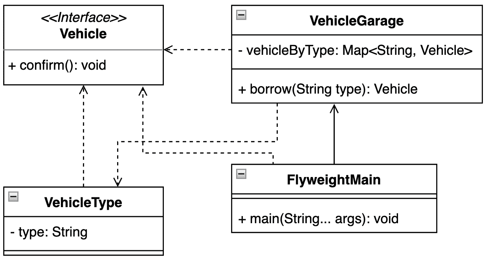

图 4.7 – UML 类图显示了 VehicleGarage 需要哪些类

## 结论

享元模式的大优点是能够管理大量对所需对象的请求。它按需实例化对象，并允许你控制现有实例。应用程序不需要依赖于对象的标识（`hashCode`和`equals`）。享元模式提供了一种透明的方式来访问对象及其实现强制执行 SOLID 设计概念和 DRY 方法。

下一个部分将描述如何以受控的方式合并传入的请求。

# 使用前端控制器模式处理请求

该模式的目标是为大多数客户端需求创建一个通用服务。该模式定义了一个程序，允许将认证、安全、自定义操作和日志记录等公共功能封装在单个位置。

## 动机

这种模式在 Web 应用程序中很常见。它实现了并定义了控制器使用的标准处理器。评估所有传入请求的有效性是处理器的责任，尽管处理器本身可能在运行时以多种形式存在。代码封装在一个地方，并由客户端引用。

## 在 JDK 中找到它

前端控制器模式的使用可以在`jdk.httpserver`模块、`sun.net.httpserver`包和`HttpServer`抽象类中找到。该类实现了接受`HttpHandler`接口的`createContext`抽象方法。处理器实例通过执行处理器方法参与 HTTP 请求处理。JDK 18 的发布附带了对底层`HttpServer`实现的`SimpleFileServer`包装器，也可以作为独立的命令`jwebserver`（*JEP-408: 简单* *Web 服务器*）。

## 示例代码

让我们创建一个简单的理论示例，不专注于解析网络请求（**示例 4.15**）：

```java
public static void main(String[] args) {
    System.out.println("Pattern FrontController, vehicle
        system");
    var vehicleController = new VehicleController();
    vehicleController.processRequest("engine");
    vehicleController.authorize();
    vehicleController.processRequest("engine");
    vehicleController.processRequest("brakes");
}
```

这里是输出：

```java
Pattern FrontController, vehicle system
VehicleController, log:'engine'
VehicleController, is authorized
VehicleController, not authorized request:'engine'
VehicleController, authorization
VehicleController, log:'engine'
VehicleController, is authorized
EngineUnit, start
VehicleController, log:'brakes'
VehicleController, is authorized
BrakesUnit, activated
```

示例 4.15 – 车辆系统使用前端控制器模式处理传入的命令

想象一下，车辆中包含一个控制器，该控制器负责控制制动器和电机单元。所有传入的命令都在这个控制器中处理（**图 4.8**.8）：

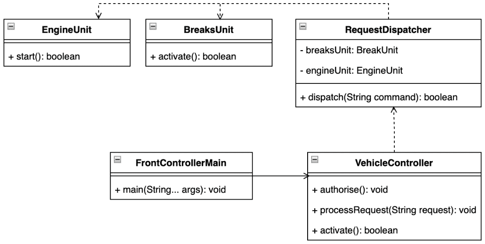

图 4.8 – 前端控制器模式强制控制器和调度器的松耦合

`VehicleController`对象需要一个特定处理器的实例。处理器由`RequestDispatcher`类的实例定义（**示例 4.16**）：

```java
record RequestDispatcher(BrakesUnit brakesUnit, EngineUnit
    engineUnit) {
    void dispatch(String command) {
        switch (command.toLowerCase()) {
            case "engine" -> engineUnit.start();
            case "brakes" -> brakesUnit.activate();
            default -> throw new IllegalArgumentException
                ("not implemented:" + command);
        }
    }
}
class VehicleController {
    private final RequestDispatcher dispatcher;
    ...
    void processRequest(String request) {
        logRequest(request);
        if (isAuthorized()) {
            dispatcher.dispatch(request);
        } else {
            System.out.printf("""
                VehicleController, not authorized request:
                    '%s'%n""", request);
        }
    }
}
```

示例 4.16 – 请求处理器表示`RequestDispatcher`实例需要注入到`VehicleController`

`BrakesUnit`和`EngineUnit`类都与处理或控制逻辑分离，可以独立开发。

## 结论

前端控制器模式的主要用途在于 Web 框架中，除了封装请求处理请求和增加不同类型处理器的可移植性。这些工具只需要在运行时正确注册并运行。根据实现，该模式支持动态处理行为，而不需要在运行时替换类。前端控制器模式引入了一种集中机制来处理传入的信息。

软件设计有时需要为类组传播特定信息。为此，标记是一个值得考虑的好方法。让我们在下一节深入探讨。

# 使用标记模式识别实例

这种模式在运行时识别特定实例以进行特定处理时极为有用，例如在实例可用时触发所需操作。

## 动机

标记接口模式代表一个空接口。这种接口用于在运行时识别一组特殊的类。正因为如此，标记模式有时被称为标记，因为它的唯一目的是区分一种特殊的实例。因此，应用程序提供了在运行时对这些情况使用特殊处理的可能。逻辑可以分离并适当封装。由于注解代表一种特殊的接口形式，Java 以两种方式实现标记接口——一个类可以继承接口或被注解。

## 在 JDK 中查找

在`java.base`模块中可以找到一个更清晰的 JDK 中使用标记接口的例子。`java.io`包定义了`Serializable`接口，而`java.lang`包提供了`Cloneable`接口。这两个接口都没有实现任何方法，它们都用于通知运行时进行特殊处理。`Serializable`接口在序列化和反序列化过程中非常重要（`writeObject`和`readObject`方法），在遍历对象图时，每个嵌套字段都需要一个接口实现来获取实例的状态。以类似的方式，`Cloneable`接口通知 JVM 正在使用`Object.clone()`方法，并且它可以创建对象的字段到字段的复制。了解字段差异是很好的。原始类型提供值，但只有对象引用。这意味着对象需要一个`Cloneable`接口的实现来提供复制。

## 示例代码

让我们举一个简单的现实世界例子，其中一辆车包含多个传感器（*图 4.9*）：

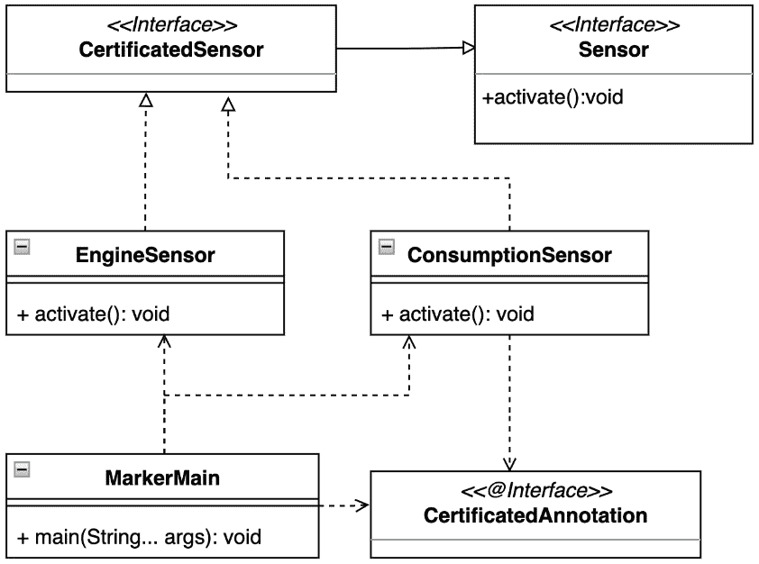

图 4.9 – 使用标记接口模式的认证传感器标签（CertifiedSensor 和 CertifiedAnnotation）的 UML 类图

车辆控制器需要识别那些被认证用于提供特定信息的特殊传感器组（*示例 4.17*）：

```java
public static void main(String[] args) {
    System.out.println("Pattern Marker, sensor
        identification");
    var sensors = Arrays
            .asList(new BrakesSensor(), new EngineSensor()
                    , new ConsumptionSensor());
    sensors.forEach(sensor -> {
        if(sensor.getClass().isAnnotationPresent
            (CertifiedAnnotation.class)){
            System.out.println("Sensor with Marker
                annotation:" + sensor);
        } else {
            switch (sensor){
                case CertifiedSensor cs -> System.out.
                    println("Sensor with Marker interface:
                        " + cs);
                case Sensor s -> System.out.println
                    ("Sensor without identification:"+ s);
            }
        }
    });
}
```

这里是输出：

```java
Pattern Marker, sensor identification
Sensor without identification:BrakesSensor[]
Sensor with Marker interface:chapter04.marker
  .EngineSensor@776ec8df
Sensor with Marker annotation:chapter04.marker
  .ConsumptionSensor@30dae81
```

示例 4.17 – 使用 switch 模式匹配结构的传感器识别的标记接口模式

这个例子介绍了两种类型的模式使用。它定义了`CertifiedAnnotation`和`CertifiedSensor`接口。

为了在实现过程中对所有的传感器种类进行分组，使用了`Sensor`接口（*示例 4.18*）：

```java
@Retention(RetentionPolicy.RUNTIME)
@interface CertifiedAnnotation {}
public interface CertifiedSensor extends Sensor {}
public interface Sensor {
    void activate();
}
```

示例 4.18 – 标签接口 CertifiedAnnotation 和 CertifiedSensor 的实现，以及带有方法的传感器抽象

使用标签是微不足道的。一个类必须被注解或继承标记接口（*示例 4.19*）：

```java
@CertifiedAnnotation
class ConsumptionSensor implements Sensor {
    @Override
    public void activate() {...}
}
final class EngineSensor implements CertifiedSensor {
    @Override
    public void activate() {...}
}
```

示例 4.19 – 用于传感器识别的标记使用

## 结论

标记接口模式在运行时可以是一个强大的工具，但必须明智地使用，因为它可能有一些缺点。一是使用标记模式的目的可能会被遗忘，或者随着应用程序的发展可能会变得过时。二是特殊处理逻辑的实现。分发此类逻辑可能会对应用程序行为产生负面影响。另一方面，标记接口可以简化应用程序逻辑，在许多情况下，接口比注解更可追踪，因此更受欢迎。

让我们在下一个模式中介绍车辆单元的模块化。

# 使用模块模式探索模块的概念

此模式实现了模块化编程定义的软件模块概念。当编程语言没有直接支持此类概念或应用程序需要它时，会使用此模式。

## 动机

这种模式可以根据应用需求以多种方式实现。模块模式将应用程序功能组合精确地封装或集中到模块中。Java 平台已经通过 Jigsaw 项目实现了模块概念的基本支持，自 JDK 9 发布以来即可使用，但也可以尝试以类似的方式程序性地创建它，尽管不是完全独立，因为源代码可以影响其模块化方法。

## 在 JDK 中查找

在 JDK 中可以找到的模块模式的最佳示例是 Java 平台模块。这个概念在*第二章*中进行了详细讨论，即《发现 Java 平台设计模式》，在*掌握 Java 模块系统*部分。

## 样本代码

让我们想象一个需要具有独立刹车和发动机系统的车辆。这在很大程度上符合现实世界的情况。每个模块将独立运行，并且在运行时只有一个提供者。在车辆可以使用之前，两个模块都需要被激活（*示例 4.20*）：

```java
class ModuleMain {
    ...
    private static void initModules() {
        brakesModule = BrakesModule.getInstance();
        engineModule = EngineModule.getInstance();
        engineModule.init();
    }
    ...
    public static void main(String[] args) {
        initModules();
        printStatus();
    }
}
```

这是输出：

```java
BrakesModule, unit:BrakesModule@5ca881b5
EngineModule, unit:EngineModule@4517d9a3
EngineModule, init
BrakesModule, ready:false
EngineModule, ready:true
```

示例 4.20 – 客户端函数 initModules 在封装中正确激活模块

以下图表强调了模块的分离，尽管程序性方法允许共享或实现共享抽象（*图 4.10*）：

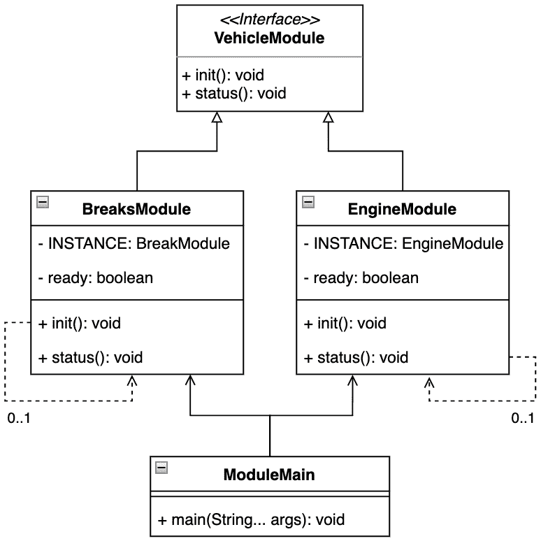

图 4.10 – UML 类图，展示了通过提供的 VehicleModule 接口实现的模式实现

每个模块都表示为一个单例实例，以确保只有一个实例提供对模块功能的透明网关：

```java
class EngineModule implements VehicleModule {
    private static volatile EngineModule INSTANCE;
    static EngineModule getInstance() {
       ...
        return INSTANCE;
    }
    private boolean ready;
     ...
    @Override
    public void init() {...}
    @Override
    public void status() {...}
}
```

示例 4.21 – EngineModule 和 BrakesModule 的示例实现以单例形式表示，具有相似的结构

## 结论

模块模式以非常透明的方式为源代码引入结构。每个模块可以独立开发，不受影响。由于程序性解决方案可能无法完全强制源代码隔离，因此有必要明智地扩展模块。另一个缺点可能是模块初始化，因为单例可能不是一个可接受解决方案。另一方面，模块模式提供了一种以所有 SOLID 概念为前提开发源代码的工作流程。

关于使用代理而不是模块和实现，让我们在下一节深入探讨。

# 使用代理模式为对象提供一个占位符

代理模式被认为是一个占位符，用于管理对另一个对象的访问以控制它。该模式也被称为代理。代理模式由 GoF 描述。

## 动机

在其最一般的形式中，代理是一个充当客户端接口的类。代理被认为是一个包装器或代理对象，由客户端使用。客户端通过相同的接口访问实际对象，而实际实现则在客户端背后保持隐藏。由于代理模式，客户端和实现之间的通信保持透明。

通过使用代理，客户端可以访问实际对象，或者它可以提供额外的逻辑。

## 在 JDK 中查找

代理设计模式在 JDK 中也有其位置。最著名的是公共 `Proxy` 类，您可以在 `java.base` 模块的 `java.reflect` 包中找到它。`Proxy` 类提供了几个静态方法用于创建用于方法调用的对象。

## 示例代码

给定的示例可以被视为车辆的遥控器。一个控制器，由代理设计模式表示，提供了与真实车辆完全相同的功能，同时也管理着真实车辆实例之间的连接（*示例 4.22*）：

```java
public static void main(String[] args) {
    System.out.println("Pattern Proxy, remote vehicle
        controller");
    Vehicle vehicle = new VehicleProxy();
    vehicle.move();
    vehicle.move();
}
```

这是输出：

```java
Pattern Proxy, remote vehicle controller
VehicleProxy, real vehicle connected
VehicleReal, move
VehicleReal, move
```

示例 4.22 – VehicleProxy 实例像真实车辆一样工作

实际车辆实现由 `Vehicle` 接口提供的通用抽象定义（*图 4**.11*）：

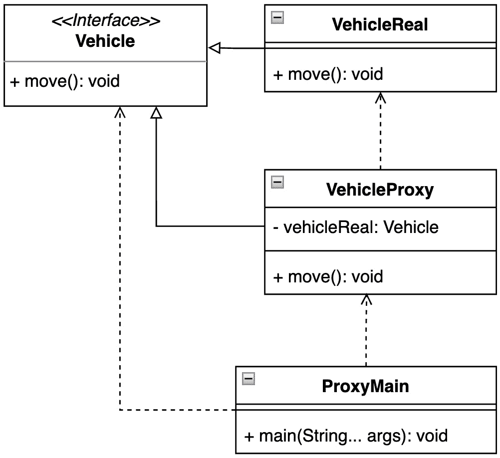

图 4.11 – 车辆代理的示例可以用 UML 类图表示

这允许无缝地扩展受控车辆类型，如图 4.23 中代理模式实现所示：

```java
class VehicleProxy implements Vehicle{
    private Vehicle vehicleReal;
    @Override
    public void move() {
        if(vehicleReal == null){
            System.out.println("VehicleProxy, real vehicle
                connected");
            vehicleReal = new VehicleReal();
        }
        vehicleReal.move();
    }
}
```

示例 4.23 – VehicleProxy 类包含对实际 Vehicle 实例的引用

## 结论

代理设计模式为源代码带来了许多优势，例如，实现可以在运行时替换。除了用于完全控制对实际实例的访问外，它还可以用于延迟初始化，就像我们在*示例 4.23*中看到的那样。代理在驱动实现或网络连接中有其合法的位置，因为它自然地强制执行不仅记录的可能性，而且通过接口和其他 SOLID 原则的隔离来实现代码分离。当应用程序需要 I/O 操作时，考虑这一点是有用的。

Java 作为一种语言不支持多重继承，但仍然可以实现。让我们在下一节中看看如何实现。

# 使用双重模式在 Java 中探索多重继承

该模式允许您组合那些倾向于一起使用的对象的功能，这是没有多重继承支持的语言中常用的范式。

## 动机

双重模式在 Java 中提供了实现多重继承的可能性。多重继承不是一个受支持的概念，因为它可能导致编译器不一致，即所谓的菱形问题。菱形问题定义了一个通过类抽象的状态，编译器可能会出现不一致。这种状态是由于多个抽象类信息不足造成的。编译器没有足够的信息来确定应该执行哪些方法。

## 示例代码

该模式不受平台支持，并且很少在开发中需要。因此，根据描述，这种模式很可能不存在于已发布的 JDK 中。然而，让我们通过一个可能的例子来更好地理解这个模式。想象一下车辆初始化序列。在初始化过程中，发动机和制动单元需要一起初始化。换句话说，当发动机被初始化时，制动也必须被初始化，反之亦然（*示例 4.24*）：

```java
public static void main(String[] args) {
        System.out.println("Pattern Twin, vehicle
            initiation sequence");
        var vehicleBrakes1  = new VehicleBrakes();
        var vehicleEngine1 = new VehicleEngine();
        vehicleBrakes1.setEngine(vehicleEngine1);
        vehicleEngine1.setBrakes(vehicleBrakes1);
        vehicleEngine1.init();
    }
```

这里是输出：

```java
Pattern Twin, vehicle initiation sequence
AbstractVehiclePart, constructor
AbstractVehiclePart, constructor
VehicleBrakes, initiated
VehicleEngine, initiated
```

示例 4.24 – 双重模式保证了两个单元总是被初始化

以下图表显示了单元之间的紧密耦合：

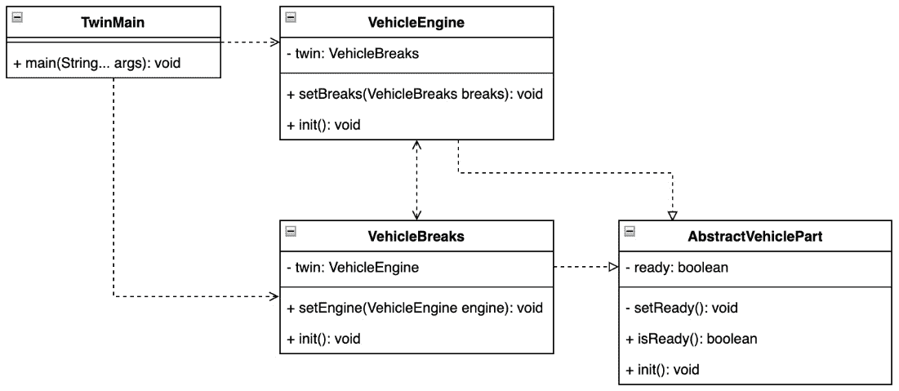

图 4.12 – 考虑的两个单元，VehicleEngine 和 VehicleBrakes，非常紧密地耦合

这种耦合也转化为一个对未来的开发非常脆弱的代码库（*示例 4.25*）：

```java
public class VehicleBrakes extends AbstractVehiclePart {
    private VehicleEngine twin;
    VehicleBrakes() {
    }
    void setEngine(VehicleEngine engine) {
        this.twin = engine;
    }
    @Override
    void init() {
        if (twin.isReady()) {
            setReady();
        } else {
            setReady();
            twin.init();
        }
        System.out.println("VehicleBrakes, initiated");
    }
}
```

示例 4.25 – VehicleBrakes 类实现与其孪生对象 VehicleEngine 之间的紧密耦合

## 结论

双重模式可以用来在 Java 中实现多重继承。它必须被明智地使用，因为一个逻辑上未写出的要求是保证考虑中的对象完全分离。换句话说，双重设计模式允许孪生对象作为一个具有扩展功能和特性的单一实例来运行。

# 摘要

对结构模式的知识以及新增的 Java 语法增强不仅提高了可维护性，还强制执行了所有之前学习的面向对象概念，并提高了对代码行为潜在偏差（如异常、意外崩溃或逻辑问题）的响应能力。

通过本章中的示例，我们建立了坚实的基础，学习了如何使用适配器模式在互不兼容的对象之间建立协作，以及如何使用桥接模式透明地分离一个对象的实现与其抽象。组合模式提供了一种将对象组织并包装成围绕底层业务逻辑的树结构的方法。我们研究了通过使用装饰器模式扩展对象功能的可能性。门面模式提供了一种简化对象间通信的方法，随后是过滤器模式，它允许我们仅选择我们想要的实例。我们学习了如何使用享元设计模式来复用已创建的运行时实例，以及通过前端控制器模式处理传入信息的方法，这样客户端只能对有效的请求做出响应。我们发现如何使用标记模式以独特的方式让客户端处理一组特定的对象。我们探讨了通过实现模块模式模块化代码库的可能性。我们看到了如何使用代理模式让客户端在不了解其实施细节的情况下间接控制对象，以及如何使用双生模式在 Java 中实现多重继承，尽管该语言不支持它。

通过对创建型和结构设计模式的知识积累，底层源代码结构得到了良好的组织，并便于持续的应用开发。下一章将探讨行为设计模式，这些模式有助于组织目标实例之间的通信和责任。

# 问题

1.  结构设计模式解决了哪些挑战？

1.  四人帮描述了哪些结构设计模式？

1.  哪种设计模式适用于创建相关对象的树结构？

1.  哪种结构设计模式可以在运行时识别一个对象？

1.  哪种设计模式可以用于间接访问对象，同时具有与对象本身相同的功能？

1.  哪种设计模式促进了逻辑与其抽象的分离？

# 进一步阅读

+   Erich Gamma、Richard Helm、Ralph Johnson 和 John Vlissides 所著的 *《设计模式：可复用面向对象软件元素》*，Addison-Wesley，1995 年

+   Robert C. Martin 所著的 *《设计原则与设计模式》*，Object Mentor，2000 年

+   *JSR-376: Java 平台模块* *系统*, [`openjdk.java.net/projects/jigsaw/spec/`](https://openjdk.java.net/projects/jigsaw/spec/)

+   *JSR-408: 简单 Web* *服务器*, [`openjdk.org/jeps/408`](https://openjdk.org/jeps/408)

+   *《代码整洁之道》* by Robert C. Martin, Pearson Education, Inc, 2009

+   *《有效 Java – 第三版》* by Joshua Bloch, Addison-Wesley, 2018

+   *《双胞胎 – 多重继承建模设计模式》* by Hanspeter Mössenböck, 林茨大学，系统软件研究所，1999, [`ssw.jku.at/Research/Papers/Moe99/Paper.pdf`](https://ssw.jku.at/Research/Papers/Moe99/Paper.pdf)
