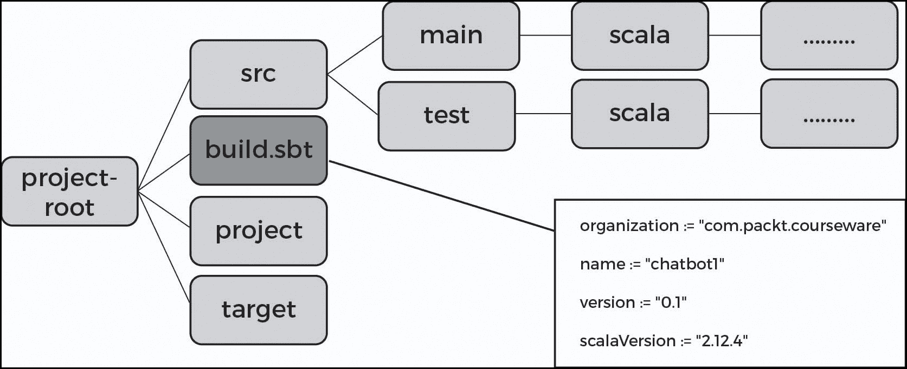
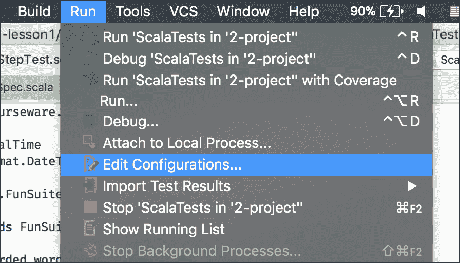
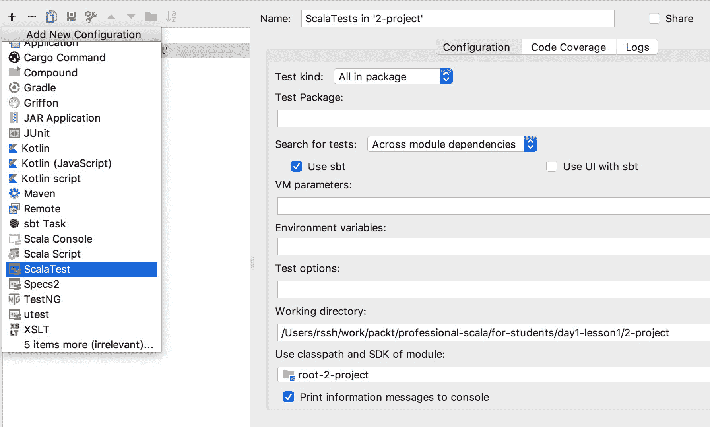

# 第一章：设置开发环境

在我们开始编写本书中的各种程序之前，让我们先简单谈谈 Scala 语言本身。为什么它是必要的，是什么让它变得独特？语言最重要的方面是什么？

Scala 是由 Martin Odersky 在 2001 年在洛桑联邦理工学院（EPFL）创建的。这是 Pascal 语言（在 1990 年代末广泛使用）被创建的同一个实验室。

Scala 是 'Scalable Language' 的缩写——一种可扩展的语言，也就是说，它允许你编写具有巨大功能复杂性的复杂系统。如 Scala 的主页所述：" *Scala 将面向对象和函数式编程结合在一个简洁、高级的语言中。*"

### 注意

你可以在这里访问 Scala 的官方网站：[`www.scala-lang.org/`](https://www.scala-lang.org/)

到本章结束时，你将能够：

+   识别 Scala 项目的结构

+   识别 Scala 的 sbt 工具（交互式构建工具）的使用，用于构建和运行你的项目

+   识别如何使用 IDE

+   实现与简单聊天机器人的交互

Scala 是建立在 JVM 平台之上的（Scala 程序被编译为使用 JVM 字节码）。

现在，该语言被用作许多领域中最受欢迎的平台之一，例如高负载软实时应用、数据科学工具包的广告服务器。

Scala 的一些特性如下：

+   一个高级类型系统，这使得 Scala 相比于大多数其他工业编程语言更优越（但同时也更复杂）。

+   静态类型，它允许你在编译时检查错误，以安全的方式编写代码。

在本章中，我们将学习 Scala 的基础知识，例如简单的 Scala 程序是什么样的，以及典型的开发者流程是什么。开发的一个重要部分是与工具的交互——构建工具、依赖提取器、IDE 等，这些工具与语言一起形成了工具生态系统。我们将使用主流工具构建一个简单的程序。

# 简单程序

在本节中，我们将介绍基本 Scala 程序的结构。我们将介绍包、导入和对象等定义。我们还将探讨 Scala 程序的 main 方法。

让我们在 Scala 中创建最简单的程序。我们将实现一个在屏幕上打印 "Hello World" 的程序。该程序的结构如下定义：

```java
package com.packt.courseware
import scala.io.StdIn
object Chatbot1
{
   def main(args: Array[String]):Unit =  {
     // do something
   }
}
```

## 定义：包、导入和对象

如果你查看前面的代码，第一行是一个包名。在我们的例子中，这是 `com.packt.courseware`。

所有编译单元都组织到包中。包可以嵌套，形成代码对象的分层命名空间。

当一个编译单元没有包声明时，它属于所谓的 ' `default`' 包。默认包中的模块不能从另一个包导入。

通常，Scala 项目的源目录组织方式与包相同。这并非强制要求，但已成为一个经验法则。一些工具（如 IDE）使用这些约定作为默认项目设置。

现在我们将看看 `import` 语句。

### 对象定义

这里，我们定义了对象 `Chatbot1.`。

如果你熟悉传统的类，因为它们是用 Java 实现的，你可以查看具有一个默认实例的类对象，即对象是单例模式的实现：在 JVM 层面上，对象定义创建了一个类和一个预定义的该类实例。

### 主要方法

最后，`main` 方法是程序的入口点。它必须接受一个字符串数组（命令行参数）并返回一个单位。

历史上，Scala 中使用 `main` 方法名称。这是因为 Java 语言遵循相同的传统，从 C 语言中继承了入口方法的名称，而 C 语言又从 BCPL 中继承了这一传统。

方法定义如下：

```java
         package com.packt.couserware
    object X  { def f() = { … } }
```

## 在 `main` 方法内

`main` 方法是任何 Scala 程序的一个基本部分。程序的执行首先从 `main` 方法开始。

让我们看看 `main` 方法内部：

```java
def main(args: Array[String]): Unit = {
val name = StdIn.readLine("Hi! What is your name?")
println(s" $name, tell me something interesting, say 'bye' to end the talk")
var timeToBye = false  
while (!timeToBye)timeToBye = StdIn.readLine(">") 
match {case "bye" => println("ok, bye")
                             truecase  _      => println("interesting...")false}
}
```

在这里，我们使用名称 `name` 定义了一个不可变值，它保存了从 `stdin` 的用户输入。Scala 是一种静态类型语言，因此该值是 `String` 类型。

如我们所见，值的类型没有明确写出，而是从其上下文中自动推断出来的。

在下一行，使用“字符串插值”运算符打印值：在一个以 `s` 为前缀的字符串中，所有 `${}` 括号内的表达式都会被这些表达式的值替换，并转换为字符串。对于简单的标识符，我们可以省略 `{}` 括号，例如，在 `s"x=$y"` 的字符串插值中，y 的值将被替换为 `$y`。

`var timeToBye` 是一个具有 `Boolean` 类型的可变变量。与值不同，可变变量可以被赋值多次。

看向前面的循环，我们可以看到程序试图成为一个好的倾听者，对任何消息都回答 `interesting`，除了 `bye`。

case 语句的结果被分配给 `timeToBye`，并在 `while` 循环条件中进行检查。

Scala 作为一种多范式语言，既有可变变量也有不可变变量。对于几乎任何任务，我们都可以选择多种实现方式。

如果存在指南，我们应该在哪里使用可变变量，在哪里使用不可变变量？

通常，关于不可变变量的推理更简单。通常的经验法则是尽可能使用不可变值，将可变变量留给性能关键部分和状态检查语言结构（如 while 循环）。

在我们的小型示例中，我们可以通过在 `while` 中放置循环退出条件的表达式来消除可变标志。结果代码更小，更容易阅读，但添加新功能变得更加困难。然而，有一个可能性——使用 `recursive` 函数而不是循环语言结构。

现在，让我们给我们的 `chatbot` 添加一些功能：当用户询问 `time` 时，`chatbot` 应该报告当前时间。

要做到这一点，我们必须使用 Java API 检索当前时间，并使用字符串插值显示时间的输出。

例如，使用 `java.time.LocalTime.` 的 `now` 方法。

用于显示此内容的代码将是 `println("time is ${java.time.LocalTime.now()}").`

以下是这个功能的代码，但我们将在设置我们将要使用的开发环境之后实际实现它：

```java
package com.packt.coursewarepackage com.packt.courseware

import scala.io.StdIn

object Chatbot1 {

  def main(args: Array[String]): Unit = {
    val name = StdIn.readLine("Hi! What is your name?")
    println(s" $name, tell me something interesting, say 'bye' to end the talk")
    var timeToBye = false
    while (!timeToBye)
       timeToBye = StdIn.readLine(">") match {
         case "bye" => println("ok, bye")
         true
         case "time" => println(s"time is ${java.time.LocalTime.now()}")
         true
         case _ => println("interesting...")
         false
       }
}

}
```

# Scala 项目的结构

让我们看看我们的 `chatbot` 程序在一个完整的可运行项目中。让我们导航到我们的代码补充中的 `/day1-lesson1/1-project` 目录。

### 注意

代码可在以下链接的 Github 上找到：[`github.com/TrainingByPackt/Professional-Scala`](https://github.com/TrainingByPackt/Professional-Scala)



上述图表是 Scala 项目的典型目录结构。如果您熟悉 Java 工具生态系统，您将注意到 `maven` 项目布局之间的相似性。

在 `src` 中，我们可以看到项目源代码（`main` 和 `test`）。`target` 是创建输出工件的地方，而 `project` 则用作内部构建项目的地方。我们将在稍后介绍所有这些概念。

```java
organization := "com.packt.courseware"name := "chatbot1"version := "0.1-SNAPSHOT"
scalaVersion := "2.12.4"
```

任何项目的头部都是其 `build.sbt` 文件。它由以下代码组成：

其中的文本是一个普通的 Scala 代码片段。

`organization`、`name` 和 `version` 是 `sbt.key` 的实例。从这个角度来看，`:=` 是在 `keys` 上定义的二进制运算符。在 Scala 中，任何具有两个参数的方法都可以使用二进制运算符的语法使用。`:=` 是一个有效的方法名。

`build.sbt` 由 `sbt` 工具解释。

### 注意

`sbt` – 当 `sbt` 由 Mark Harrah 创建时，其原始名称的意图是 ' `Simple Build Tool`'。后来，作者决定避免这种解释，并保留了原样。您可以在以下链接中了解 `sbt` 的详细信息：[`www.scala-sbt.org/1.x/docs/index.html`](https://www.scala-sbt.org/1.x/docs/index.html)。

## 基本 sbt 命令

我们现在将讨论基本的 `sbt` 命令。

`sbt compile` 应该编译项目，并位于其目标编译的 Java 类中。

`sbt run` 执行项目的 `main` 函数。因此，我们可以尝试与我们的 `chatbot` 进行交互：

```java
rssh3:1-project rssh$ sbt run
[info] Loading global plugins from /Users/rssh/.sbt/0.13/plugins
[info] Set current project to chatbot1 (in build file:/Users/rssh/work/packt/professional-scala/Lesson 1/1-project/)
[info] Running com.packt.courseware.Chatbot1
Hi! What is your name? Jon
  Jon, tell me something interesting, say 'bye' to end the talk
```

```java
>qqq
interesting..
>ddd
interesting...
>bye
ok, bye
 [success] Total time: 19 s, completed Dec 1, 2017 7:18:42 AM
```

代码的输出如下：

`sbt package` 准备输出工件。运行后，它将创建一个名为 `target/chatbot1_2.12-0.1-SNAPSHOT.jar` 的文件。

`chatbot1` 是我们项目的名称；`0.1-SNAPSHOT – version. 2.12` 是 Scala 编译器的版本。

Scala 仅在次要版本范围内保证二进制兼容性。如果由于某种原因，项目仍然使用`scala-2.11`，那么它必须使用为`scala-2.11`创建的库。另一方面，对于具有许多依赖项的项目，升级到下一个编译器版本可能是一个漫长的过程。为了允许同一库在不同的`scalaVersions`中存在于仓库中，我们需要在 jar 文件中有一个适当的后缀。

`sbt publish-local` – 将工件发布到本地仓库。

现在我们来看一下我们的示例项目和`sbt`工具。

## 活动：使用`sbt`执行基本操作：构建、运行、打包

1.  如果之前未安装，请在您的计算机上安装 sbt。

1.  通过在`1-project`（`build.sbt`所在目录）的根目录中输入`sbt console`来启动`sbt`控制台。

1.  在`sbt`控制台中输入`compile`命令来编译代码。

1.  在`sbt`控制台中输入`sbt run`命令来运行程序。

1.  当运行此操作时，对机器人说`bye`，然后返回控制台。

1.  通过在`sbt`控制台中输入`package`来打包程序。

## IDE

开发者工具箱的另一部分是 IDE 工具（集成开发环境）。对于我们的书籍，我们将使用带有 Scala 插件的 IntelliJ IDEA 社区版。这不是唯一的选择：其他替代方案包括基于 IBM Eclipse 的 scala-ide 和 Ensime ([`ensime.github.io/`](http://ensime.github.io/))，它将 IDE 功能带到任何可编程文本编辑器，从 vi 到 emacs。

所有工具都支持从`build.sbt`导入项目布局。

## 活动：在 IDE 中加载和运行示例项目

1.  导入我们的项目：

    +   前往`File` -> `Import` -> 导航到`build.sbt`

1.  在 IDE 中打开程序：

    +   启动 IDEA

    +   按`Open`

    +   选择`day1-lesson1/1-project/build.sbt`

1.  在询问是否将其作为文件或项目打开的对话框窗口中，选择`project`。

1.  在项目结构的左侧部分，展开`src`条目。

1.  点击`main.`

1.  确保您可以看到代码中指定的`main`。

1.  确保项目可以通过`sbt`控制台编译和运行。

要从 IDE 运行我们的项目，我们应该编辑项目的配置（菜单：`Build`/ `Edit configuration`或`Run`/ `Edit` configuration，具体取决于您使用的 IDEA 版本）。

**从 IDE 运行项目：**

1.  选择`Run`/`Edit Configuration.`

1.  选择`Application`。

1.  设置应用程序的名称。在我们的例子中，使用`Chatbot1`。

1.  设置`Main`类的名称。在我们的例子中，它必须是`com.packt.courseware.Chatbot1`。

1.  实际运行应用程序：选择 Run，然后从下拉菜单中选择 Chatbot1。

## REPL

我们将经常使用的另一个工具是 REPL（读取评估打印循环）。它通常用于快速评估 Scala 表达式。

从`sbt`，我们可以通过`sbt console`命令进入 REPL 模式。让我们尝试一些简单的表达式。

现在，我们将看看如何评估表达式。按照以下步骤进行操作：

1.  打开`sbt`工具。

1.  通过输入以下命令打开`REPL`：

    ```java
    sbt console
    ```

1.  输入以下表达式并按*Enter*：

    +   `2 + 2`

    +   `"2" + 2`

    +   `2 + "2"`

    +   `(1 to 8).sum`

    +   `java.time.LocalTime.now()`

请注意，我们可以在 IDE 中通过创建特殊文件类型：Scala 工作表来拥有一个交互式的 Scala `playboard`。这很有用，但主要是为了演示目的。

## 从我们的聊天机器人程序中获取时间请求

现在，让我们回到我们的任务：修改`chatbot`程序，使其能够根据`time`的使用回复当前时间。让我们学习如何做到这一点：

**完成步骤**

1.  检查`time`是否与声明匹配：

    ```java
    case "time" =>
    ```

1.  使用 Java API 检索当前时间。使用`java.time.LocalTime`的`now`方法：

    ```java
         java.time.LocalTime.now()
    ```

1.  使用字符串插值器显示时间的输出，如下所示：

    ```java
    println("time is ${java.time.LocalTime.now()}")
    ```

`main`方法将如下所示：

```java
def main(args: Array[String]): Unit = {
val name = StdIn.readLine("Hi! What is your name?")
println(s" $name, tell me something interesting, say 'bay' to end the talk")
var timeToBye = false
while (!timeToBye)timeToBye = StdIn.readLine(">") 
match {case "bye" => println("ok, bye")truecase "time" => 
println(s"time is ${java.time.LocalTime.now()}")truecase _ => 
println("interesting...")false}
}
```

在我们准备和打包我们的工件之后，我们还需要运行它们。

在这本书中，我们将使用从未打包的源代码通过`sbt`（就像 Ruby 应用程序的早期日子一样）运行的运行系统，假设源代码和`sbt`工具可以从生产环境中访问。使用这种方式，我们可以使用针对源代码的构建工具命令，例如`sbt run`。在现实生活中，为生产打包要复杂得多。

做这件事的流行方法如下：

+   准备一个包含所有依赖项的胖 jar（这有一个`sbt`插件，可以在以下链接找到：[`github.com/sbt/sbt-assembly`](https://github.com/sbt/sbt-assembly)）。

+   准备一个本地系统包（包括 jar、依赖项、自定义布局等）。还有一个`sbt`插件可以创建本地系统包，可以在以下链接找到：[`github.com/sbt/sbt-native-packager`](https://github.com/sbt/sbt-native-packager)。

# 基本语法

现在我们可以使用 REPL，让我们了解 Scala 的基本语法。现在，我们不需要详细了解它，但让我们通过使用示例来熟悉它。

### 注意

对于正式的详细描述，请参阅 SLS：Scala 语言规范，在这里：[`scala-lang.org/files/archive/spec/2.12/`](http://scala-lang.org/files/archive/spec/2.12/)。

## 定义的基本语法

Scala 编译单元 – 这是在一个实体（模板实体）内部的一组定义，该实体可以是对象、类或特质。我们将在稍后详细讨论 Scala 语言的面向对象部分。现在，让我们看看基本语法。让我们在 REPL 中定义一些类：

```java
> class X {  def f():Int = 1 }
> Class X defined  // answer in REPL
```

实体内部的定义可以是嵌套实体、函数或值：

```java
> def f():Int = 1
```

在这里，函数`f`被定义为返回`1`。我们将在第三章中详细讨论这个函数。现在，让我们保持顶层视图：

```java
> val x = 1
```

在这里，值`x`被定义为值`1`：

```java
> var y = 2
```

在这里，可变变量`y`被定义为值`2`。

其他高级实体包括对象和特质。我们可以通过编写对象或特质定义来创建对象：

```java
>  object O {  def f():Int =1  }
>  trait O {  def f():Int =1  }

```

我们将在下一章讨论类、对象和特质。

现在，让我们看看如何在 REPL 中定义一个名为 ZeroPoint 的对象。

**完成步骤：**

1.  在`sbt`中输入以下命令以打开 REPL：

    ```java
    sbt console
    ```

1.  在 REPL 中输入以下命令：

    ```java
    >  object ZeroPoint {
    >     val x:Int = 0
    >     val y:Int = 0
    > }
    ```

## 表达式的基语法

Scala 是一种基于表达式的语言，这意味着一切（在函数和值/变量定义的右侧）都是表达式。

一些基本表达式包括：

+   基本表达式：常量或值/变量名。

+   函数调用：这些可以是：

    +   常规函数调用`f(x, y)`。

    +   运算符调用语法：

    +   二进制：`x + y`.

    ### 注意

    任何带有参数的方法都可以用作二元运算符。一组预定义的二元运算符类似于 Java：

+   一元：`!x`

+   构造函数：`new x`创建类 x 的一个实例。

+   不可变变量的赋值：

    +   `y = 3`：将值`3`赋给`y`。

    +   `x = 3`：这是一个编译器错误，无法赋值。

+   块：

    ```java
    { A; B }
    ```

    块表达式的值是最后一个表达式。注意，如果`A`和`B`位于不同的行上，则可以省略`;`。此语法的语法如下所示：

    ```java
    {
       A
       B
    }
    ```

上述语法将产生与 `{ A; B }` 相同的输出。

+   控制结构

    +   `if`语句：

        ```java
               >  if (1 == 1)  "A"  else "B"
               - let's eval one in REPL
        ```

    +   match/case 表达式：

        ```java
            >  x match {
                 case "Jon"  =>  doSomethingSpecialForJon()
                 case "Joe" =>   doSomethingSpecialForJoe()
                 case   _   => doForAll()
              }
        ```

    +   循环：

    +   `while`/`do`

        ```java
             var i=0
              var s=0
              while(i < 10) {
                  s = s+i
                  i = i +1
              }
        ```

    +   `Do`/`while`

    +   `Foreach`，`for`

高阶函数的快捷方式将在第四章*Scala 集合*中详细描述。

我们将查看定义一个打印屏幕上内容并调用主函数的主函数。

1.  你应该已经打开了`project1`。如果没有，请将其导入 IDE。

1.  在对象定义内插入新方法。

1.  在`main`方法中插入调用。

完整的方法可能看起来像这样：

```java
  object Chatbot1 {def printHello():Unit = {
println("Hello")}def main(args: Array[String]): Unit = {
printHello() … // unchanged code here
     }
}
```

# 单元测试

在任何大于算术运算的程序中，程序员应该在可能的情况下确保新更改不会破坏旧功能。

最常见的做法是单元测试，这是程序员在开发过程中并行测试代码功能，通过创建测试代码来验证代码是否真正满足他们的要求。

本节的主题将介绍 Scala 中的单元测试工具。

## 向我们的项目添加测试

让我们在我们的小程序中添加测试。我们将在 IDE 中导入`<for-students/lesson1/2-project>`。

这是 Scala 项目的目录结构。为了添加测试，我们应该做以下操作：

+   将测试依赖项添加到`build.sbt`

+   在源测试目录中编写测试

为了添加依赖项，让我们在我们的`build.sbt`中添加以下行：

```java
libraryDependencies += "org.scalatest" %% "scalatest" % "3.0.4" % "test"
```

这是一个 Scala DSL（领域特定语言）中的表达式，这意味着我们应该将 `scalatest` 添加到我们的库依赖集合中。运算符 `%%` 和 `%` 用于形成发布的工件名称和分类器。你可以参考 `sbt` 文档以获取更多详细信息：[`www.scala-sbt.org/1.x/docs/Library-Dependencies.html`](http://www.scala-sbt.org/1.x/docs/Library-Dependencies.html)。

在编译之前，`sbt` 将从公共仓库（Maven central）下载 `scalatest`，在运行测试时，它将 `scalatest` 添加到类路径中。

我们现在将从命令行运行 `sbt` 测试。

1.  在命令行环境中，导航到项目的根目录并选择以下测试：

    ```java
      Lesson 1/2-project
    ```

1.  如果你正在使用 Unix/Linux 机器，并且你的代码位于家目录的 `courses/pactscala` 中，那么运行以下命令：

    ```java
     > cd  ~/courses/packscala/Lesson 1/2-project
    ```

1.  运行以下命令：`

    ```java
        > sbt test
    ```

1.  你将得到预期的输出，其中包括以下字符串：

    ```java
    [info] ExampleSpec:
    [info] - example test should pass
    [info] StepTest:
    [info] - step of unparded word must be interesting
    ```

我们现在将展示如何在 IDEA IDE 中运行 `sbt` 测试。

我们现在将在 IDEA IDE 中运行 sbt 测试。

1.  在 IDE 中打开项目。

1.  导航到 **运行**/**编辑配置**：

1.  选择 `sbt test` 作为配置。

    +   选择复选框 **使用 sbt**：

    

1.  选择 **运行 sbt-test**。

## 在测试内部

现在，让我们看看一个简单的测试：

```java
package com.packt.courseware.l1
import org.scalatest.FunSuite

class ExampleSpec extends FunSuite {

  test("example test  should pass") {
     assert(1==1)
  }

}
```

这里，我们定义了一个继承自 scalatest FunSuite 的类。

当 `FunSuite` 类初始化并添加到测试集合中时，名为 `example test should pass` 的测试将被调用，并作为参数断言一个表达式。现在这看起来像是魔法，但我们将向你展示如何在下一章中构建这样的 DSL。

让我们借助 `sbt` 运行我们的测试：

```java
sbt test
```

此命令将运行所有测试并评估测试表达式。

现在，我们将添加另一个测试。

1.  在同一文件中添加一个额外的测试：`src/test/scala/com/packt/courseware/l1/ExampleSpec.scala in 2-project`

1.  我们编写了一个 `trivial` 测试，它断言一个 `false` 表达式：

    ```java
          test("trivial")  {
                assert(false)
           }
    ```

1.  运行测试并查看错误报告。

1.  在 assert 中的表达式取反，以便测试通过：

    ```java
          test("trivial")  {
                assert(true)
           }
    ```

1.  再次运行 `sbt` 测试以确保所有测试都通过。

## 运行 Chatbot 的测试

记住，当我们编写 `chatbot` 时，我们想要测试一个功能。我们的原始程序只有一个函数（`main`），它包含所有逻辑，不能分割成可测试的部分。

让我们看看版本 2。

### 注意

请将 `Lesson 1/2-project` 导入到你的 IDE 中。

```java
package com.packt.courseware.l1

import java.time.LocalTime
import java.time.format.DateTimeFormatter
import scala.io.StdIn

case class LineProcessResult(answer:String,timeToBye:Boolean)

object Chatbot2 {

  def main(args: Array[String]): Unit = {
    val name = StdIn.readLine("Hi! What is your name? ")
    println(s" $name, tell me something interesting, say 'bye' to end the talk")

    var c = LineProcessResult("",false)
    while(!c.timeToBye){
      c = step(StdIn.readLine(">"))
      println(c.answer)
    }

  }

  def step(input:String): LineProcessResult = {
    input match {
      case "bye" => LineProcessResult("ok, bye", true)
      case "time" => LineProcessResult(LocalTime.now().format(DateTimeFormatter.ofPattern("HH:mm:ss")),false)
      case _ => LineProcessResult("interesting...", false)
    }
  }

}
```

这里，我们看到了一些新的结构：

`LineProcessingResult` 是一个案例类，其中存储了处理某一行（即，`chatbot` 答案和退出标志）的结果。

类名前的单词 `case` 是什么意思？

`case`类可以参与模式匹配（虽然我们调用一个`case`），通常用于数据对象。我们将在下一章中查看`case`类。重要的是要注意，可以使用`LineProcessingResult(x,y)`语法（即不使用`new`）以及传递给`case`类构造函数的参数（`answers`和`timeToBye`）来创建`case`类的实例，这些参数自动成为`case`类的实例变量。

处理单行功能封装在`step`方法中，我们可以对其进行测试。

`Step`从方法参数接收输入，而不是从`System.in`接收，这使得测试更加容易。在直接测试`main`方法的情况下，我们需要在`test`之前替换`System.in`，并在测试完成后返回一个。

好的，让我们专注于第一个测试：

```java
package com.packt.courseware.l1

import org.scalatest.FunSuite

class StepTestSpec extends FunSuite {

  test("step of unparded word must be interesting") {
    val r = Chatbot2.step("qqqq")
    assert(! r.timeToBye)
    assert(r.answer == "interesting...")
  }

}
```

以相同的方式编写第二个测试将是一个简单的任务。我们将在接下来的练习中查看这一点。

现在，让我们添加第二个测试，它检查 bye。

1.  在我们的项目中向`StepTestSpec`类添加第二个测试：

    ```java
    test("after bye, timeToBye should be set to true")
    {

    }
    ```

1.  在这个测试中：

    +   使用`bye`作为参数调用`step`函数：

        ```java
        val r = Chatbot2.step("bye")
        ```

    +   检查在此调用之后，返回类中的`timeToQuit`是否设置为`true`：

        ```java
        assert(! r.timeToBye)
        ```

1.  整个代码应该如下所示：

    ```java
    test("after bye, timeToBye should be set to true") {  
    val r = Chatbot2.step("bye")
    assert(! r.timeToBye)

    ```

1.  运行`sbt test.`。

编写时间查询的测试将是一个更复杂的任务。

请注意，我们无法使用具体的时间值运行测试，但至少我们可以确保机器人答案不能被解析回时间格式。

那么，我们怎样才能检查行答案并尝试将其转换回时间？解决方案如下所示：

```java
test("local time must be parser") {
val r = Chatbot2.step("time")
val formatter = DateTimeFormatter.ofPattern("HH:mm:ss")
val t = LocalTime.parse(r.answer,formatter)// assertion is not necessary
}
```

注意，不需要断言。如果时间不满足给定的格式，则将抛出异常。

将功能时间和效果时间分开测试是一种好习惯。为此，我们需要通过自己的提供者替换系统时间的提供者。

这将是下一章的第一个实际任务。

现在，让我们将日期命令添加到我们的聊天机器人程序中。

1.  将以下代码添加到匹配语句中，以便检查`date`命令，该命令应以`DD:MM:YYYY`格式输出本地日期：

    ```java
      case "date" => LineProcessResult(LocalDate.now().format(DateTimeFormatter.ofPattern("dd:YYYY-MM")),false)
    ```

1.  为此函数添加一个测试用例。

1.  生成的代码将如下所示：

    ```java
    test("local date must be parser") {
    val r = Chatbot2.step("date")
    val formatter = DateTimeFormatter.ofPattern("dd:MM-YYYY")
    val t = LocalDate.parse(r.answer,formatter)// assertion is not necessary
    }
    ```

# 摘要

我们已经到达了本章的结尾。在本章中，我们学习了设置开发环境的各个方面。我们涵盖了 Scala 项目的结构，并确定了使用`sbt`构建和运行项目的方法。我们还涵盖了 REPL，它是运行 Scala 代码的命令行界面。我们还介绍了如何在 IDEA IDE 中开发和运行代码。最后，我们实现了与我们的简单`chatbot`应用程序的交互。

在下一章中，我们将涵盖 Scala 程序的结构，并深入探讨 Scala 中的面向对象特性，例如类、对象和特质。我们还将涵盖调用函数的语法和各种参数传递模型。
