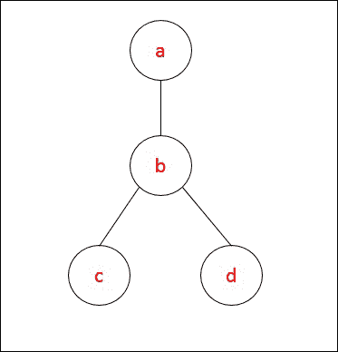

# 第八章。领域特定语言

在上一章中，我们介绍了函数式编程的核心概念，如纯函数、不可变性和高阶函数。我们介绍了一些在大型函数式程序中普遍存在的模式。最后，我们介绍了两个流行的函数式编程库 Cats 和 Doobie，并使用它们编写了一些有趣的程序。

在本章中，我们将介绍 Scala 如何通过提供一些有趣的语言特性来编写强大的 DSLs。我们将简要地看看 DSLs 的一般概念。我们还将介绍一个你如果打算专业地使用 Scala 的话很可能要使用的 DSL。最后，你将实现你自己的 DSL。

本章展示了 Scala 如何通过提供一些有趣的语言特性，使得编写强大的领域特定语言（DSLs）成为可能。

到本章结束时，你将能够：

+   识别领域特定语言（DSLs）的使用

+   使用 DSL `ScalaTest`，一个流行的 Scala 测试库

+   在 Scala 中设计你自己的 DSLs

+   识别本书之外将有用的额外库和工具

# DSLs 和 DSL 类型

领域特定语言，正如其名所示，是一种针对特定领域专门化的语言。与之相对的是像 Scala 这样的语言，它是一种通用语言，因为它适用于广泛的领域。

通过限制领域，你希望创建一个不那么全面但更适合解决领域内特定问题集的语言。一个构建良好的 DSL 将使解决领域内的问题变得容易，并使用户难以出错。DSLs 形态各异，大小不一，但你可以大致将它们分为两组：外部 DSLs 和内部 DSLs。

## 外部 DSLs

外部 DSLs 是在宿主语言之外编写的（用于实现 DSL 的语言称为宿主语言）。这意味着你将不得不解析文本、评估它等等，就像你正在创建一种通用编程语言一样。我们不会创建外部 DSL，因此我们不会进一步深入探讨这个主题。

外部领域特定语言的一个例子是 `DOT`，它用于描述图。下面是一个简单的 `DOT` 程序示例，它生成了你在这里看到的图：



下面是实现上述图的代码：

```java
graph graphname {
   a -- b -- c;
   b -- d;
}
```

因此，`DOT` 专门用于描述图的领域。

### 注意

关于 `DOT` 的更多信息，请参阅 [`en.wikipedia.org/wiki/DOT_(graph_description_language)`](https://en.wikipedia.org/wiki/DOT_(graph_description_language))。

## 内部 DSLs

内部 DSLs 嵌入在宿主语言中，可以分为两组：

+   **浅显的：**操作直接使用宿主语言的操作（例如，`+` 使用 Scala 的 `+`）。

+   **深**：您构建抽象语法树 (AST) 并像使用外部 DSL 一样评估它。

在本章中，我们将编写一个内部浅 DSL，这在我的经验中，也是你在使用各种 Scala 库时最常遇到的一种 DSL 类型。

`ScalaTest` 是一个非常流行的 Scala 测试库。它提供了一套不同的 DSLs 用于编写测试规范。我们将在下一节深入探讨 `ScalaTest`。

现在，你对 DSLs 是什么以及它们如何被分组为内部/外部和浅/深有了非常基本的了解。在下一节中，我们将探讨 `ScalaTest` 以及该库如何使用 DSLs 使编写测试规范变得容易。

# ScalaTest – 一个流行的 DSL

### 注意

`ScalaTest` 在 第一章 中介绍，*设置开发环境*，但由于我们将在本次讲座中广泛使用它，我们在这里稍作回顾，并确保每个人都拥有一个可工作的 `ScalaTest` 环境。

在本节中，我们将探讨一个用于测试 Scala 程序的流行库，`ScalaTest`，并了解该库如何使用 DSLs 允许用户以各种风格编写可读的测试。

研究 `ScalaTest` 的目的是双重的。首先，`ScalaTest` 是 Scala 项目的广泛使用的测试库，因此当你使用 Scala 进行专业开发时，你很可能会用到它。其次，它是一个很好的示例，展示了如何使用 DSLs 使代码更易读。

到本节结束时，你应该能够：

+   识别如何在您的项目中使用 `ScalaTest`

+   识别 `ScalaTest` 提供的各种风格，并能够选择与你项目相关的风格

+   使用 `FlatSpec` 风格编写 `ScalaTest` 测试

## 将 ScalaTest 添加到您的项目中

`ScalaTest` 与其他 Scala 库一样，您只需将其作为项目依赖项添加即可。由于我们在本书中使用 SBT，因此我们将使用它作为示例。创建一个新的 SBT 项目，包含以下 `build.sbt` 文件：

```java
name := "Lession2-ScalaTest"
scalaVersion := "2.12.4"
libraryDependencies += "org.scalatest" %% "scalatest" % "3.0.4" % "test"
```

### 注意

如需了解如何在外部使用它的更多信息，请参阅文档中的安装部分 ([`www.scalatest.org/install`](http://www.scalatest.org/install))。

创建一个简单的测试并将其放置在你的 `src/test/scala/com/example/ExampleSpec.scala` 项目中：

```java
package com.example

import collection.mutable.Stack
import org.scalatest._

class ExampleSpec extends FlatSpec with Matchers {
  "A Stack" should "pop values in last-in-first-out order" in {
    val stack = new Stack[Int]
    stack.push(1)
    stack.push(2)
    stack.pop() should be (2)
    stack.pop() should be (1)
  }
}
```

为了验证您的设置是否正确，在项目根目录中启动一个 SBT 会话，并运行以下命令：

```java
test:compile                     # to compile your tests
test                             # to run your test-suite
testOnly com.example.ExampleSpec # To run just that test
```

您应该看到以下类似的输出：

```java
testOnly com.example.ExampleSpec
[info] ExampleSpec:
[info] A Stack
[info] - should pop values in last-in-first-out order
[info] Run completed in 282 milliseconds.
[info] Total number of tests run: 1
[info] Suites: completed 1, aborted 0
[info] Tests: succeeded 1, failed 0, canceled 0, ignored 0, pending 0
[info] All tests passed.
[success] Total time: 6 s, completed Dec 4, 2017 9:50:04 PM
```

由于我们将在下一节中使用 `ScalaTest` 编写一些测试，因此确保你有一个正确配置的 SBT 项目，你可以用它来进行练习非常重要。请按照以下步骤操作：

1.  使用之前的 `build.sbt` 定义创建一个新的 SBT 项目。

1.  在 `src/test/scala/com/example/ExampleSpec.scala` 创建一个新的测试文件，并包含之前的内容。

1.  使用 `sbt test` 命令运行测试，并确保它已经检测到测试并且它们通过。

你已经看到了如何将 `ScalaTest` 添加到你的 Scala 项目中，以及如何使用 SBT 运行测试。你现在应该有一个正确配置的 Scala 项目，你可以用它来完成本章剩余的练习。在下一节中，我们将探讨你可以使用 `ScalaTest` 编写的各种测试风格。

## ScalaTest 风格概述

ScalaTest 提供了不同的风格供你在编写测试时使用。使用哪种风格取决于你团队的经验和偏好。

在本节中，我们将查看一些不同的风格，以便你可以了解你更喜欢哪种风格：

+   **FunSuite** 是一个简单且大多数人都会熟悉的风格：

    ```java
    describe("A Set") {

      describe("(when empty)") {
        it("should have size 0") {

          assert(Set.empty.size == 0)

        }

      }

    }
    ```

+   **FlatSpec** 与 `FunSuite` 非常相似，但它通过强迫你以更像规格的方式命名测试来更多地关注行为驱动设计（BDD）：

    ```java
    "An empty Set" should "have size 0" in {

        assert(Set.empty.size == 0)

    }
    ```

+   **FunSpec** 是编写规格式测试的一个很好的通用风格：

    ```java
    describe("A Set") {

      describe("(when empty)") {

        it("should have size 0") {

          assert(Set.empty.size == 0)

        }

      }

    }
    ```

+   **FreeSpec** 专注于规格式测试，但不对你的测试施加任何结构：

    ```java
    "A Set" - {

      "(when empty)" - {

        "should have size 0" in {

          assert(Set.empty.size == 0)

        }

      }

    }
    ```

+   **PropSpec** 是如果你只想用属性检查来编写测试的话：

    ```java
    property("An empty Set should have size 0") {

        assert(Set.empty.size == 0)

    }
    ```

+   **FeatureSpec** 主要用于验收测试：

    ```java
    class TVSetSpec extends FeatureSpec with GivenWhenThen {

      info("As a TV set owner")

      info("I want to be able to turn the TV on and off")

      feature("TV power button") {
        scenario("User presses power button when TV is off") {

          Given("a TV set that is switched off")

          val tv = new TVSet
          assert(!tv.isOn)

          When("the power button is pressed")

          tv.pressPowerButton()

          Then("the TV should switch on")

          assert(tv.isOn)

        }

      }

    }
    ```

示例：`FunSuite`

让我们看看上一节中创建的测试用例：

```java
package com.example

import collection.mutable.Stack
import org.scalatest._

class ExampleSpec extends FlatSpec with Matchers {
 "A Stack" should "pop values in last-in-first-out order" in {
   val stack = new Stack[Int]
   stack.push(1)
   stack.push(2)
   stack.pop() should be (2)
   stack.pop() should be (1)
}
}
```

这里有两个内部 DSLs 在使用中。第一个用于以可读的形式 `"X" should "Y" in { <code> }"` 编写你的测试规格。这种风格是通过扩展 `FlatSpec` 来提供的。另一个 DSL 用于以 `<expression> should be <expression>` 的形式编写你的断言，这是通过扩展 `Matchers` 来提供的。

DSLs 是通过类和扩展方法的组合来实现的，但当我们实现自己的小 DSL 时，我们将在下一节中更详细地探讨这一点。

## 活动：实现 ScalaTest 风格

最好的方法是使用它们来感受不同的风格。从上一列表中选择三种风格，并将以下测试转换为这些风格。

1.  继续使用你在上一活动中创建的 Scala 项目。

1.  为你选择的每个风格创建一个文件。如果你选择了 `FunSpec`，那么创建一个 `FunSpecExample.scala` 文件。

1.  对于每种风格，将以下测试转换为使用该风格的测试：

    ```java
    import collection.mutable.Stack
    import org.scalatest._

    class ExampleSpec extends FlatSpec with Matchers {
     "A Stack" should "pop values in last-in-first-out order" in {
       val stack = new Stack[Int]
       stack.push(1)
       stack.push(2)
       stack.pop() should be (2)
       stack.pop() should be (1)
     }
    }
    ```

你已经看到了 `ScalaTest` 提供的不同风格，并且对它们之间的区别有了大致的了解。

`ScalaTest` 是一个使用 DSLs（领域特定语言）来使编写可读性很高的测试成为可能的测试库。我们已经看到了如何将其添加到自己的 Scala 项目中，我们概述了它支持的不同风格，并且我们已经使用不同的风格编写了一些测试。在下一节中，我们将探讨 Scala 提供的使编写 Scala 中的 DSLs 成为可能的功能。

# 编写 DSLs 的语言特性

在本节中，我们将探讨 Scala 的特性，这些特性使得编写小型 DSL 变得容易：

+   方法调用的灵活语法

+   按名参数

+   扩展方法和`Value`类

在创建我们的 Scala DSL 时，我们将在下一节中使用所有这些特性。

## 方法调用的灵活语法

Scala 具有灵活的方法调用语法，在某些情况下，调用方法时可以省略点（`.`）和括号（`()`）。

规则是这样的：

+   对于阶数为`0`的方法，意味着它们不接受任何参数，可以省略括号并使用后缀表示法。

+   对于阶数为`1`或更多的方法，意味着它们接受一个或多个参数，可以编写使用中缀表示法的方法。

这里是一个在调用`filter`时使用中缀表示法的示例：

```java
List.range(0, 10).filter(_ > 5)
List.range(0, 10) filter (_ > 5)
```

这里是一个在调用`toUpperCase`时省略括号的示例：

```java
"Professional Scala".toUpperCase()
"Professional Scala".toUpperCase
```

这允许你编写看起来更像散文的代码，当你创建自己的 DSL 时，这是一个很好的选项。

## 按名参数

按名参数使得可以指定传递给函数的参数不应在实际上使用之前进行评估：

```java
def whileLoop(condition: => Boolean)(body: => Unit): Unit =
 if (condition) {
   body
   whileLoop(condition)(body)
 }

var i = 2

whileLoop (i > 0) {
 println(i)
 i -= 1
}  // prints 2 1
```

注意，`condition`和`body`参数类型前面都带有`=>`。这就是指定一个参数为按名参数的方式。

当我们在本章后面编写自己的 DSL 时，我们将使用按名参数来允许用户为测试用例编写`… in { … code … }`块。

### 注意

重要的是要注意，按名参数每次被引用时都会被评估。

## 扩展方法和值类

扩展方法是一种向已存在的 Scala 类添加新方法的技术。`Value`类是 Scala 的一个特性，它使得在不产生任何分配开销的情况下创建扩展方法成为可能。

这里是一个添加扩展方法到`String`的`Value`类的示例：

```java
implicit class StringExtensions(val self: String) extends AnyVal {
 def repeat(count: Int): String =
  List.range(0, count).map(_ => self).fold("")(_ + _)
}
```

根据这个定义，将会有从`String`到`StringExtension`的隐式转换，这使得你可以在字符串上调用`repeat`，就像它一直存在一样（注意后缀表示法的使用）：

```java
"Professional Scala" repeat 5
```

当我们在本章后面编写自己的 DSL 时，我们将使用扩展方法和值类来为`String`添加`should`方法。

我们已经看到了 Scala 的特性如何使得在 Scala 中编写内部领域特定语言（DSL）成为可能。现在我们将看到如何编写自定义的 DSL。

# 编写小型 DSL

在本节中，我们将重新实现一些`FlatSpec` `ScalaTest` DSL，以便了解如何在 Scala 中实现 DSL。

首先，我们将看看在 Scala 中使用案例类来建模测试用例的简单方法。然后，我们将看看如何创建一个用于创建这些测试用例的小型 DSL。

## 建模测试用例

在我们能够创建 DSL 之前，我们需要有一个为它创建的东西。在我们的例子中，我们想要创建一个用于指定测试的 DSL，因此让我们看看我们如何使用 Scala 中的案例类来建模测试：

```java
sealed trait TestResult
case class TestFailure(message: String) extends TestResult
case object TestSuccess extends TestResult
```

我们将创建一个代数数据类型，它表示运行测试用例的结果。结果可以是包含有关失败信息的失败，或者是一个简单的`TestSuccess`，表示测试通过：

```java
case class TestCase(description: TestDescription, run: () => TestResult)
case class TestDescription(name: String, specification: String)
```

然后，我们定义两个简单的案例类。`TestDescription`包含测试用例的描述，而`TestCase`具有这样的描述和一个`run`函数，可以用来调用测试用例。

使用这个简单的模型，我们可以描述一个测试用例，如下所示：

```java
TestCase(
    TestDescription("A stack", "pop values in last-in-first-out order"),
   TestResult.wrap({
        val stack = new Stack[Int]
        stack.push(1)
        stack.push(2)
        assert(stack.pop() == 2, "should be (2)")
        assert(stack.pop() == 1, "should be (1)")
    })
)
```

这里，`TestResult.wrap`是一个具有签名`def wrap(body: => Unit): () => TestResult`的方法。

现在，这看起来与我们在上一节中使用`FlatSpec` DSL 编写的良好测试用例完全不同，所以让我们看看我们如何创建一个创建类似之前`TestCase`的 DSL。

## `TestCase` DSL

我们将首先查看 DSL 中允许编写测试规范的部分，即 DSL 中显示的部分：

```java
"A Stack (with one item)" should "be non-empty" in { … code … }
```

从上一节中，应该很清楚这是使用`String`上的后缀方法`should`，使用中缀表示法调用的。所以，我们将向`String`添加一个扩展方法，使用之前的小型 DSL 来创建`TestDescription`：

```java
implicit class StringExtension(val name: String) extends AnyVal {
 def should(specification: String): TestDescription =
   TestDescription(name, specification)
}
```

在作用域内有这个隐式值类的情况下，我们可以使用以下语法创建一个`TestDescription`：

```java
"A Stack (with one item)" should "be non-empty"
// Returns TestDescription("A Stack (with one item)","be non-empty")
```

这将我们的`TestCase`创建简化为以下内容。

```java
TestCase(
    "A Stack (with one item)" should "be non-empty"
    TestResult.wrap({
        val stack = new Stack[Int]
        stack.push(1)
        stack.push(2)
        assert(stack.pop() == 2, "should be (2)")
        assert(stack.pop() == 1, "should be (1)")
    })
)
```

这稍微好一些，但远非理想。让我们继续。现在，让我们专注于 DSL 的剩余部分，即允许编写实际测试用例的部分。这是 DSL 中显示的部分：

```java
"A Stack (with one item)" should "be non-empty" in { … code … }
```

再次，在上一节中，我们看到了我们可以在 Scala 中使用中缀表示法和按名参数来编写这样的表达式。现在，为了允许使用 DSL 创建`TestCase`实例，我们必须向`TestDescription`添加一个方法，如下所示：

```java
def in(body: => Unit): TestCase = TestCase(this, TestResult.wrap(body))
```

使用这个方法，我们现在可以使用以下语法来编写我们的测试用例：

```java
"A Stack (with one item)" should "be non-empty" in {
    val stack = new Stack[Int]
    stack.push(1)
    stack.push(2)
    assert(stack.pop() == 2, "should be (2)")
    assert(stack.pop() == 1, "should be (1)")
}
```

然后，我们就完成了创建我们的小型领域特定语言（DSL）来编写测试用例规范的过程。

我们在这里并不是试图创建一个功能齐全的测试库，但能够运行测试会很有趣，所以让我们看看如何实现测试运行器。

由于我们已经使用 Scala 类来模拟测试用例，因此创建一个运行测试并打印出一份简洁报告的测试运行器相当简单。

你已经看到了如何使用 Scala 的一些特性来非常容易地编写一个用于创建测试用例的 DSL。通过使用方法调用的灵活语法、按名参数和扩展方法（通过值类），你成功地创建了一个内部 DSL，使得可以将以下表达式：

```java
TestCase(
    TestDescription("A stack", "pop values in last-in-first-out order"),
    TestResult.wrap({
        val stack = new Stack[Int]
        stack.push(1)
        stack.push(2)
        assert(stack.pop() == 2, "should be (2)")
        assert(stack.pop() == 1, "should be (1)")
    })
)
```

转换为以下：

```java
"A Stack" should "pop values in last-in-first-out order" in {
    val stack = new Stack[Int]
   stack.push(1)
    stack.push(2)
    assert(stack.pop() == 2, "should be (2)")
    assert(stack.pop() == 1, "should be (1)")
}
```

## 活动：创建一个用于指定断言的 DSL

我们的 DSL 使得编写`TestCase`实例变得容易。然而，我们测试用例中的断言看起来并不美观。创建一个用于指定断言的 DSL。它应该支持以下语法：

```java
expected(2) from stack.pop()
```

**提示**：

首先，通过使用案例类来模拟断言：

```java
case class AssertionA => A)
case class ExpectedA
```

### 注意

您可以在本章的 `dsl/src/main/scala/com/example/Assertion.scala` 代码中看到最终结果，并在 `dsl/src/main/scala/com/example/Assertion.scala/Main.scala` 中查看其用法。

完整的代码应如下所示：

```java
package com.example
case class AssertionA => A) {
 def run(): Unit = {
 val result = value()
 assert(expected.expected == result, s"Failed asserting that ${expected.expected} == $result")
 }
}
case class ExpectedA {
 def from(expression: => A): Assertion[A] = Assertion(
 this,
 () => expression
 )
}
object Assertion {
 def expectedA: Expected[A] = Expected(x)
}

```

# 除此之外

本节将帮助您更好地了解 Scala 生态系统，并在本书结束后指导您自学，以便您可以继续提高您的 Scala 技能。

## 各种 Scala 库

本主题的目的是简要介绍几个不同的 Scala 库，用于解决不同领域的问题，以便您可以在本书之后研究那些对您感兴趣的内容。

### Akka

我们将要查看的第一个库是 Scala 生态系统中最受欢迎的库之一。它已经存在很长时间了——该库的第一个公开发布是在 2010 年——并且被许多大型组织在生产环境中使用。

它的主要抽象是 `Actor` 和 `Streams`：

+   `Actor` 是一种不依赖锁来模拟并发的途径。如果您阅读过关于编程语言 `Erlang` 的内容，您可能已经听说过它们。Actor 是一个可以接收并响应消息、生成新的 `actors` 并向其他 `actors` 发送消息的实体。因此，您将程序建模为一组通过发送消息相互通信的 `actors`。

    ### 注意

    您可以在以下链接中找到有关 `Actors` 的更多信息：[`doc.akka.io/docs/akka/current/guide/actors-intro.html?language=scala`](https://doc.akka.io/docs/akka/current/guide/actors-intro.html?language=scala)

+   如果您必须处理流式数据，可以使用 Akka `Streams` 将您的程序建模为从源到汇流的数据转换。

    ### 注意

    您可以在以下链接中了解更多关于 `Streams` 的信息：[`doc.akka.io/docs/akka/current/stream/stream-introduction.html?language=scala`](https://doc.akka.io/docs/akka/current/stream/stream-introduction.html?language=scala)。

+   如果您想在 Scala 中构建分布式系统，强烈建议使用 Akka。

    ### 注意

    您可以在其网站上了解更多关于 Akka 的信息：[`akka.io/`](https://akka.io/)。

### Apache Spark

Apache Spark 是一个用于处理大型 Scala 数据集的库。Apache Spark 最初于 2009 年在加州大学伯克利分校开发，2013 年捐赠给 Apache 软件基金会，现在是一个拥有超过 1000 位贡献者的顶级 Apache 项目。

您可以使用 Java、Scala、Python 和 R 编写 Spark 程序。您可以使用 Spark API 编写自己的自定义数据分析程序，或者您可以使用高级 API 之一：Spark SQL 用于 SQL 和结构化数据处理，MLlib 用于机器学习，GraphX 用于图处理，以及 Spark Streaming。

如果您对大数据处理感兴趣，请查看 Spark。

### 注意

您可以在其网站上了解更多关于 Spark 的信息：[`spark.apache.org/`](https://spark.apache.org/)。

### Shapeless

Shapeless 是一个 Scala 的类型类和依赖类型基于的泛型编程库。它最初由 Miles Sabin 于 2011 年编写，现在被许多公司用来编写类型安全的代码。它也被许多库内部使用。

Shapeless 的一个主要特性是它使得自动推导类型类成为可能。

使用 Shapeless，您可以让编译器检查那些您可能认为不可能检查的事情。一些例子包括：

+   异构列表，即每个元素可以是不同类型的列表，Scala 编译器跟踪这些类型

+   让编译器检查集合的长度是否符合要求

在本节中，我们看到了三个不同的 Scala 库，这些库可以用于解决以下领域的问题：

+   分布式编程

+   大数据处理

+   泛型编程

## 揭示未覆盖的语言特性

本主题的目的是简要向您介绍一些我们没有覆盖的语言特性，并告诉您如果想要了解更多关于这些主题的信息，应该去哪里。这些特性包括：

+   宏

+   反射

### 宏

宏是一种编程语言特性，它使得编写以其参数的 AST（抽象语法树）作为输入并产生新 AST 的函数成为可能，从而有效地允许您编写生成其他程序的程序。

宏有多种形状和大小。在本节中，我们将探讨如何在 Scala 中使用宏。Scala 2.10 中包含了 Scala 宏的实验性支持，并且从那时起，它们在每次发布中都得到了改进。

### 注意

您可以在 Scala 文档网站上找到关于宏的官方文档，链接如下：[`docs.scala-lang.org/overviews/macros/overview.html.`](https://docs.scala-lang.org/overviews/macros/overview.html.)

### 定义宏

定义宏是定义为 Scala 函数的宏，这些函数引用宏实现。让我们看看一个非常简单的宏，它接受一个`String`并返回该字符串的大写版本：

```java
object Macros {

 def uppercaseImpl(c: Context)(strExpr: c.Expr[String]): c.Expr[String] = {
   import c.universe._
   val Literal(Constant(str: String)) = strExpr.tree
   c.ExprString
 }

 def uppercase(strExpr: String): String = macro uppercaseImpl
}
```

`uppercase`方法是宏向宏的用户公开的方式。实际的宏实现是`uppercaseImpl`，它有两个参数列表。第一个参数包含一个参数，即`Context`，它包含编译器在宏调用点的收集信息。第二个参数包含宏被调用时使用的类型为`String`的表达式的 Scala 抽象语法树。让我们看看如何调用这个宏：

```java
val x = Macros.uppercase("testing")
println(x)
```

这看起来非常像正常的 Scala 方法调用；然而，参数的大写操作是在编译时发生的。

注意，这里实现的宏只与`String`字面量一起工作；如果您用其他任何东西调用它，您将使编译器崩溃。

### 隐式宏

隐式宏使得在隐式方法的实现中引用宏成为可能。这种用法的一个例子是编写可以生成给定类型类实例的宏，给定任何类型`T`：

```java
trait Showable[T] { def show(x: T): String }
```

然后，而不是为所有类型编写单独的类型类实例，如下所示：

```java
final case class Person(name: String)

object Person {
 implicit val showable: Showable[Person] = new Showable[Person]{
   def show(x: Person) = s"Person(name=${x.name})"
 }
}
```

你可以定义一个隐式宏，它可以生成任何给定类型`T`的类型类实例，如下所示：

```java
object Showable {
 implicit def materializeShowable[T]: Showable[T] = macro ...
}
```

### Quasiquotes

你可以使用 Scala 强大的字符串插值功能，在字符串内部编写 AST，这样你就不必手动构建 AST。也就是说，你可以编写以下内容：

```java
q"List(10)"
```

而不是编写以下内容：

```java
List(Literal(Constant(10)))))
```

### 反射

你很可能在其他编程语言中使用了反射，例如 Java 或 Python。反射使得程序能够检查并有时修改自身。你可以将宏视为编译时反射，而我们将要查看的反射则是运行时反射。

使用运行时反射，你可以：

+   检查对象的类型

+   实例化新对象

+   访问或调用对象的成员

让我们看看如何检查运行时类型的示例：

```java
import scala.reflect.runtime.{universe => ru}

def getTypeTagT: ru.TypeTag = ru.typeTag[T]

getTypeTag(List(1,2,3)).tpe.decls
 .filter(_.name.toString.length < 5)
 .foreach(d => println(s"${d.name} : ${d.typeSignature}"))
```

此示例使用`scala.reflect.runtime.universe`实现了一个方法，对于给定类型`T`的对象，该方法将获取该类型的`TypeTag`。有了`TypeTag`，我们可以通过`tpe`访问`Type`，然后通过`decls`获取类型的成员列表。示例随后过滤掉任何名称少于五个字符的成员，并打印它们的`name`和`type`。

### `注意`

`反射在某些情况下可能会产生不可忽视的运行时开销。如果你在性能敏感的地方使用它，请确保对结果进行基准测试。`

`在本小节中，我们简要介绍了两个有趣的 Scala 语言特性，并提供了多个链接，以便你在本书之后进一步学习这些特性，从而提高你的 Scala 技能。`

## `资源更新`

`在本小节中，我们将探讨如何保持对 Scala 编程语言及其生态系统发展的最新了解。`

### `Scala 改进过程`

`Scala 改进过程（SIP）和 Scala 平台过程（SPP）分别是 Scala 编程语言和 Scala 标准库变更的方式。如果你想对其中任何一个进行更改，你可以提出一个更改提案，该提案将被审查并可能被接受。`

### `注意`

`你可以在以下位置找到所有当前 SIPs 的列表：[`docs.scala-lang.org/sips/all.html`](https://docs.scala-lang.org/sips/all.html)。`

### `Scala Times`

`Scala Times 是一份每周通讯，其中包含关于 Scala 的有趣博客文章，并对上周发布的各种 Scala 库进行了简要回顾。`

### `注意`

`你可以在这里了解更多信息并订阅通讯：[`scalatimes.com/`](http://scalatimes.com/)`

``# 摘要    在本章中，我们介绍了 Scala 如何通过提供一些有趣的语言特性，使得编写强大的领域特定语言（DSLs）成为可能。我们简要地看了看在一般意义上 DSL 是什么。我们还介绍了一个你如果打算在 Scala 专业领域工作，很可能要使用的 DSL。最后，我们实现了我们自己的 DSL。    现在我们来到了这本书的结尾。在这本书中，我们涵盖了 Scala 语言的所有专业概念，从设置开发环境到编写你自己的自定义 DSLs。我们介绍了 Scala 语言中的面向对象和函数式编程方面。我们还介绍了一些在 Scala 中使用的有用库，例如`Cats`和`Doobie`。最后，我们介绍了可以帮助你保持行业前沿的额外资源和工具。``
