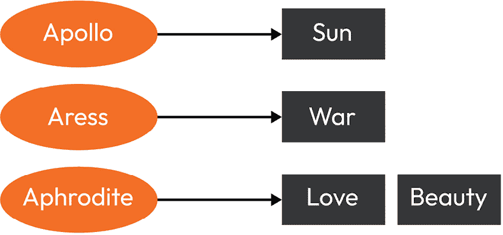
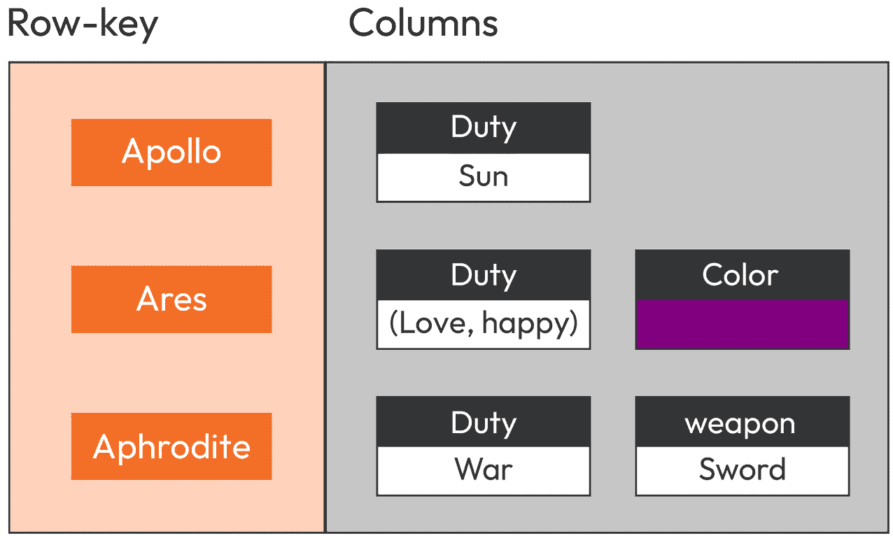
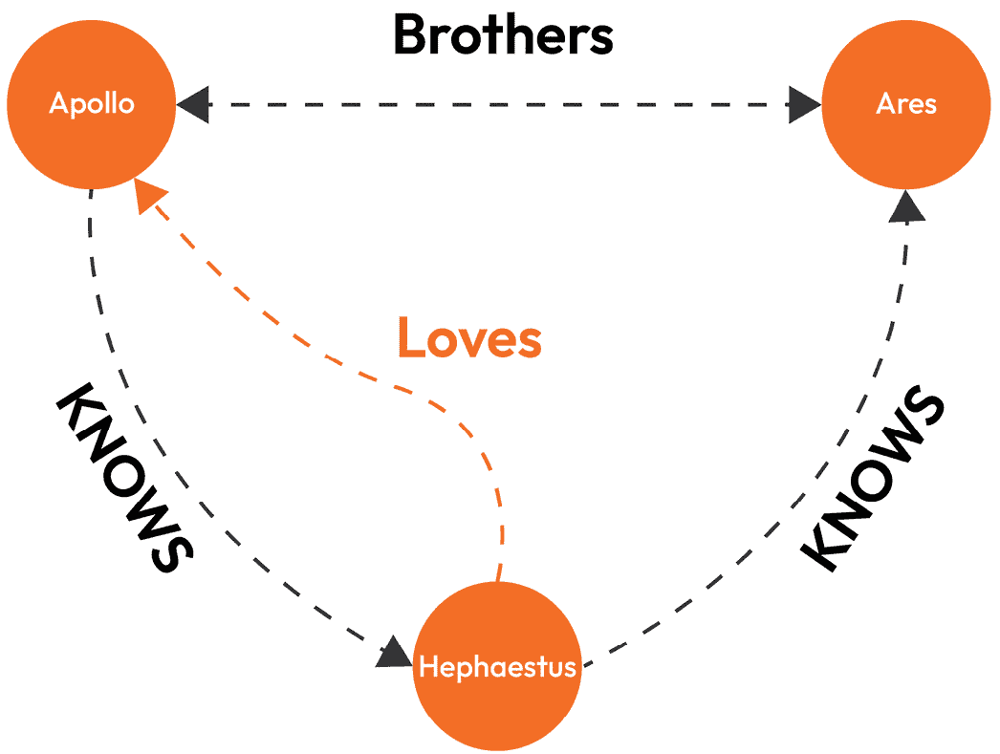
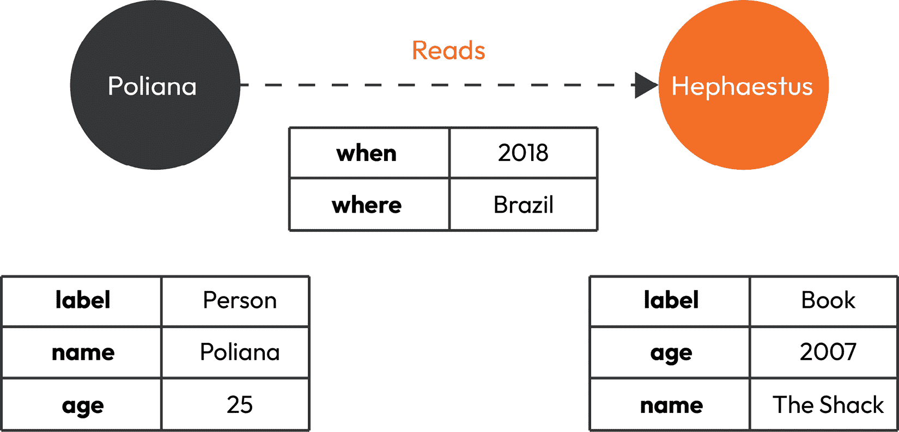
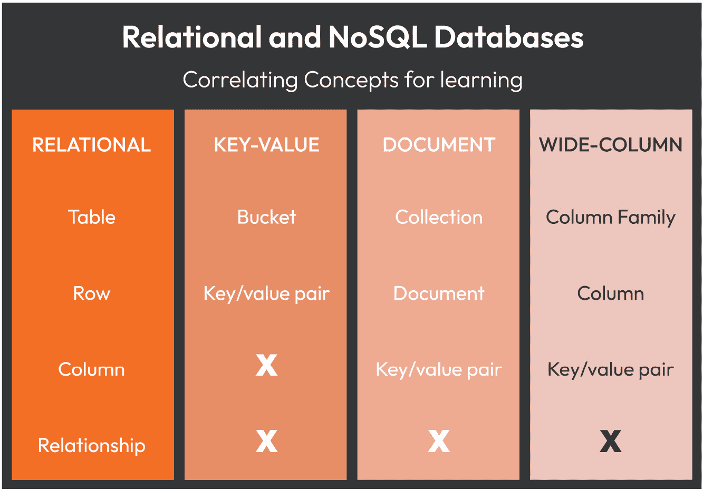

# 第二章：探索多种数据库风味

随着系统的演变，尤其是在微服务架构中，实施一种多语言持久化策略来满足解耦和独立服务的个别需求变得必要。这涉及到检查存储数据的各种选项，包括关系型、NoSQL 和新 SQL 数据库在内的**数据库管理系统**（**DBMSs**）。为了防止过度设计架构设计，考虑每种数据库类型的应用用例场景是很重要的。

在本章中，我们将深入研究传统关系型数据库和较新的非关系型数据库的特点和优势。我们还将更详细地探讨 NewSQL 数据库及其在市场中的位置。

在深入研究应用程序细节之前，我们将首先熟悉我们可以采用作为解决方案持久化策略的多种存储解决方案。以下主题将涵盖：

+   回顾关系型数据库

+   深入了解非关系型数据库

+   NewSQL 数据库 – 努力从两个世界中获取最佳

# 回顾关系型数据库

关系型数据库已经是一种超过 50 年的数据存储信任解决方案，在全球范围内被广泛采用。用户从使用关系型数据库中获得的最优点之一是能够使用**结构化查询语言**（**SQL**）。

SQL 是一种由多个供应商支持的标准化查询语言，这意味着 SQL 代码是可移植的，相同的 SQL 代码在许多数据库系统上只需稍作修改或无需修改即可工作。这是一种确保供应商锁定的方式。除此之外，SQL 还有助于减少学习新语言或 API（如 Java 的 JDBC 或 JPA）的认知负担。

现在，当我们提到 DBMS 时，除了大量工具和资源外，关系型数据库还遵循**ACID**原则（**原子性、一致性、隔离性和持久性**），确保数据事务的可靠性和完整性。这些特性使关系型数据库成为大量用例的可靠选择。关系型数据库已经显示出极高的成熟度，带来了几个成功案例，这些案例不仅涵盖了基础知识，还包括提供备份工具、数据可视化等其他功能。事实上，当习惯于使用 SQL 数据库的人转向关注 NoSQL 存储解决方案时，他们会错过所有支持他们日常任务的各种辅助工具和数千种工具。

在 Java 中，我们有 JDBC，这是一种我们可以学习一次并在任何地方编写/应用的语言。关系型数据库引擎是透明的；因此，JDBC 和 JPA 将是相同的。

这些持久化技术的本质特征是与数据事务相关的属性：**原子性、一致性、隔离性和持久性**（**ACID**）。符合 ACID 属性的事务具有以下方面：

+   **原子性**：事务是一个原子单元。要么所有数据库操作作为一个单元发生，要么不发生；这是一个“全有或全无”的操作。这导致防止了部分数据更新和潜在的数据不一致。

+   **一致性**：当事务**开始**和**结束**时，数据库应处于一致状态。事务应遵循每个数据库约束和规则，以确保充分的一致性。

+   **隔离性**：一个事务不应不利或意外地影响另一个操作。例如，一个表插入将生成一个表行 ID，该 ID 被第二个操作使用。然而，我们不希望两个操作同时更改相同的行。

+   **持久性**：事务完成后，一旦提交，更改将永久保留。这确保了即使在意外故障的情况下，数据的一致性。

正如我们将在接下来的章节中学习的，Java 应用程序有多种不同的策略与数据库集成。存在几种与数据集成相关的设计模式，可用于设计应用程序，从底层数据库的低度解耦到高度解耦。我们应该担心抽象能力和在切换到另一个数据存储解决方案时的低努力程度的原因是，尽管关系数据库非常成熟，但它们并不适合每个用例。例如，数据模式灵活性、面对大量读写操作时的可扩展性、大型数据集上的查询性能，以及在数据建模期间处理层次结构和其他复杂关系等特点，通常在 NoSQL 数据库上比在关系数据库上更强。现在，我们应该更好地了解多种类型的 NoSQL 数据库及其特性。

# 深入了解非关系型数据库（NoSQL）

**NoSQL**数据库提供了存储和检索非结构化数据（非关系型）的机制，与关系数据库中使用的表格关系形成鲜明对比。与关系数据库相比，NoSQL 数据库具有更好的性能和高度的可扩展性。它们在金融和流媒体等几个行业中越来越受欢迎。由于这种使用量的增加，用户和数据库供应商的数量正在增长。

与关系数据库的 ACID 原则相对比，在 NoSQL 世界中，关键特性是**BASE**（**基本可用性、软状态和最终一致性**）。每个细节如下：

+   **基本可用性**：高程度的复制确保即使发生多次故障，数据仍然可用。

+   **软状态**：没有要求具有写入一致性，也没有保证复制的数据将在节点之间保持一致性。与传统的关系数据库不同，更改可以在没有直接用户输入的情况下发生。

+   **最终一致性**：当检索数据（读取时间）时，一致性可以延迟处理。换句话说，数据最终将是一致的，这样所有节点都将具有相同的数据，但不必同时具有。

有许多 NoSQL 数据库类型，每种类型都是为处理特定的工作负载和数据建模需求而设计的。为了最好地定义要使用哪种 NoSQL 存储类型，我们现在将深入探讨，以获得对键值、文档、列族和图数据库类型的更清晰的认识。

在对多种 NoSQL 风味有了广泛了解之后，您可以参考本节末尾提供的**图 2.5**，以了解如何在关系数据库和某些 NoSQL 存储风味之间比较概念。

## NoSQL 数据库类型 – 键值

这些是 NoSQL 世界中最简单的存储类型。数据以键值对集合的形式存储，这种方式优化了存储大量数据并有效地通过键进行数据搜索。这种数据库类型具有类似于`java.util.Map` API 的结构，其中值映射到键。

例如，如果使用这种范例来存储关于希腊神话人物的信息并将它们与它们的特征关联起来，数据关联将表示如下：



图 2.1 – 键值存储数据库表示

在前面的图中，表示了三个希腊神话人物以及它们与特征的关联。在这个例子中，值**太阳**有一个键**阿波罗**，而键**阿芙罗狄蒂**可以用来指代**爱情**和**美丽**。

目前市场上，这种方法的流行实现包括**Amazon** **DynamoDB**、**Hazelcast**和**Redis**数据库，后两者是开源技术。每个供应商都带来了自己独特的优势；DynamoDB 可以作为一项完全托管的服务使用，这意味着亚马逊负责运行该服务所需的所有基础设施和维护。Redis 是一种支持 pub/sub 消息和缓存功能的内存数据库解决方案。最后，Hazelcast 支持 MapReduce 编程模型以执行分布式数据处理任务，以及跨语言支持，包括 Java、.NET 和 Python。

在这种数据库类型中，有一些新的概念需要了解，例如桶和键值对。尽管不是每个方面都可行，但对于那些习惯于传统 SQL 世界的人来说，两个世界的概念之间有相关性，这有助于他们理解。

总结一下，键值 NoSQL 是一种可以将数据作为键值对集合存储的数据库，并且优化了存储大量数据以及通过键高效检索数据。它以其易于使用和理解而闻名，以及其水平可扩展性，这使得它成为需要高读写吞吐量的应用程序的良好选择。

即使有多个好处，在数据建模和查询方面，键值数据库可能不如其他类型的 NoSQL 数据库灵活。它们不支持复杂查询，并且没有丰富的数据模型，因此可能不适合需要复杂数据操作的应用程序。此外，键值数据库不支持事务，这可能会限制某些用例。

现在，让我们来看看文档数据库类型及其特征。

## NoSQL 数据库类型 – 文档

NoSQL 文档存储类型旨在以最小定义的结构存储、检索和管理文档，例如 XML 和 JSON 格式。换句话说，没有预定义结构的文档是一种可能由多种不同类型的数据字段组成的模型，包括其他文档内的文档。数据结构看起来像以下代码结构中的 JSON：

```java
{    "name":"Diana",
    "duty":["Hunt","Moon","Nature"],
    "age":1000,
    "siblings":{
        "Apollo":"brother"
    }
}
```

上述 JSON 结构显示了一个存储有关名为 Diana 的神话人物数据的文档。这个相同的结构可以存储不同类型的数据，如字符串、数字、列表和其他复杂对象。与其他类型一样，这是一个灵活的选项，可以以分层格式存储数据，*无需事先指定模式*。具体来说，文档 NoSQL 数据库选项易于使用且需要最少的设置，这使得它成为快速原型设计和快速开发应用程序的良好选择。另一方面，它通常缺乏事务支持，并且不像传统关系数据库提供的复杂多表连接功能那样提供复杂的查询功能。

**Amazon SimpleDB**、**Apache CouchDB**和**MongoDB**都是流行的 NoSQL 文档类型存储解决方案。前者是亚马逊网络服务提供的一项完全管理的数据库服务，而后者都是开源解决方案。所有三种选项都提供了使用 Java 与数据库交互的 API。

在了解了更多关于键值和文档类型之后，让我们继续了解下一个：广度列数据库。

## NoSQL 数据库类型 – 广度列/列族

广度列（也称为列族）模型因 Google 的 BigTable 论文而流行，它是一种用于结构化数据的分布式存储系统，并且具有高可扩展性和大存储容量。这些数据库针对存储大量具有灵活模式的结构化、半结构化和非结构化数据进行了优化，并支持高并发级别。

与其他类型不同，此类数据库中的数据是按列而不是按行存储的，这允许更灵活和可扩展的数据模型。单个列族中存储的数据可以是不同类型和结构，如图 *2.2* 所示：



图 2.2 – NoSQL 列族类型表示

与其他 NoSQL 类型相比，这些数据由于不是存储在传统的基于行的格式中，因此查询可能更加困难。此外，增加的模式灵活性也代表了数据模型设计和数据管理等任务复杂性的增加。

在引擎选项方面，**HBase** 和 **Cassandra** 都是开源的、分布式、宽列 NoSQL 数据库，设计重点是处理大量数据。**Scylla** 也是一个分布式宽列数据库，但设计为 Cassandra 的直接替代品，并针对性能进行了优化。

总之，宽列 NoSQL 数据库是存储和管理大量数据、具有灵活模式的强大工具，非常适合需要高可用性和水平扩展存储的分布式应用程序。然而，与其他 NoSQL 数据库相比，它们可能更难查询。

在我们进入下一节之前，我们将讨论最后一种 NoSQL 数据库类型，这在某些场景下可以特别有用，以补充宽列数据库：图数据库。

## NoSQL 数据库类型 – 图

图 NoSQL 数据库类型针对存储和查询具有复杂关系的数据进行了优化。在此方法中，数据表示为图，其中节点表示实体，边表示这些实体之间的关系。观察 *图 2.3* 中的图结构，用于语义查询，以及通过节点、边和属性进行的数据表示：



图 2.3 – NoSQL 图类型表示

在开发将与图数据库一起工作的应用程序时，需要注意的关键概念如下：

+   **顶点**/**Vertice**：也称为图中的**节点**。它存储实体或对象数据，就像传统的关系数据库中的表一样，或者像文档型 NoSQL 数据库中的文档一样。

+   **边缘**：用于建立两个顶点之间关系的一个元素。

+   **属性**：一个键值对，用于存储关于图中的边或顶点元素的元数据。

+   **图**：表示实体之间关系的顶点和边的集合。

在图中，边可以是定向的或非定向的，节点之间的关系可以存在方向，实际上，这是图结构中的一个基本概念。如果考虑现实世界，我们可以将其与好莱坞明星进行比较，例如，有些人认识一个演员，但演员并不了解所有他们的粉丝。这种关联的元数据作为图边方向（关系）的一部分存储。在*图 2*.*4*中，请注意关联方向和类型被明确定义：



图 2.4 – NoSQL 图类型数据模型方向表示

*图 2*.*4*显示了从顶点**Poliana**到顶点**Hephaestus**的方向关联。关联还有自己的数据，例如在这种情况下的时间**when**和地点**where**。在查询图时，方向尤其相关，因为你不能从**Hephaestus**查询到**Poliana** – 只能是相反的方向。

图 NoSQL 数据库解决方案非常适合需要快速查询高度互联数据的场景，例如社交网络、推荐引擎和欺诈检测系统。尽管它们可以存储和检索大量数据，但在大量具有灵活模式的结构化和非结构化数据的情况下，列族类型可能更适合。此外，复杂的查询可能需要遍历图以找到所需的数据片段。

有几个图数据库引擎可供选择，包括**Neo4j**、**InfoGrid**、**Sones**和**HyperGraphDB**。这些引擎各自提供自己独特的一套特性和功能，正确的选择将取决于应用程序的具体需求。

我们已经探讨了关系数据库和 NoSQL 数据库，这是今天用于使用固定模式存储和查询结构化数据以及存储和查询大量结构化/半结构化/非结构化数据的两种主要数据库存储范式。

在进入下一节之前，这里有一个最后的提示，帮助你将你已熟悉的概念与你迄今为止所展示的概念联系起来：



图 2.5 – 如何在不同数据库风味之间建立概念关系以用于学习目的

在本章的下最后一个部分，我们将检查一类较新的数据库：NewSQL 数据库。

# NewSQL 数据库 – 努力从两个世界中获取最佳

NewSQL 数据库是一种混合数据库类型，结合了关系型和 NoSQL 世界的最佳特性，能够在具有固定模式的结构化数据存储和查询的同时，也提供 NoSQL 数据库的可扩展性和灵活性特性。NewSQL 被视为解决关系型和 NoSQL 范式局限性的方法，为现代应用提供更灵活和可扩展的解决方案。NewSQL 旨在统一 SQL 和 NoSQL 世界的最佳特性。我们已经学习了两种一致性模型：关系数据库提供的 ACID（原子性、一致性、隔离性和持久性）和 NoSQL 的 BASE。NewSQL 试图在保持 ACID 原则保证的同时提供横向可扩展性。换句话说，它试图在 SQL 的保证下提供 NoSQL 的高可扩展性、灵活性和性能。另一个积极方面是能够使用 SQL 作为查询语言。

NewSQL 看起来是一个有希望的解决方案，我们可以在撰写本文时观察到几家相关公司向市场提供企业级解决方案。值得一提的是，这些公司拥有大量关于开发和运营需求的专业知识。

以下是一些 NewSQL 数据库的例子：

+   **VoltDB**

+   **ClustrixDB**

+   **CockroachDB**

注意到 NewSQL 技术领域并非同质化，每种解决方案都带来自己的优势和劣势。

重要提示

NewSQL 使用 SQL，但通常不支持 100%的 SQL。

尽管这个范式给人一种印象，似乎可以一次性解决 CAP 定理提出的问题，但我们应该警告您，它并不能。此外，通常，混合选项会带来两者的最佳和最坏方面。

# 摘要

数据库选项有多种类型，理解每种类型的权衡至关重要。每个数据目标都有特定的行为，例如 SQL 拥有标准、成熟度、多种工具和专业知识等优势。然而，实现横向扩展相当困难。

NoSQL 旨在提高横向可扩展性；然而，这以牺牲比关系型数据库所知更少的致性为代价。

最后，NewSQL 试图将两个世界融合在一起，带来两者的好处，但在两个领域都存在不足。

在下一章中，我们将介绍更多关于技术和它们的架构以及策略，以及如何处理它们。
