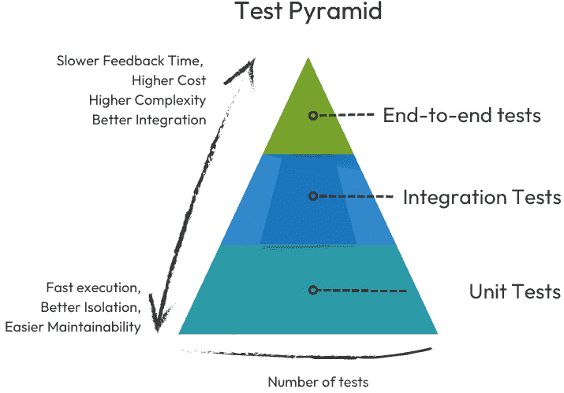
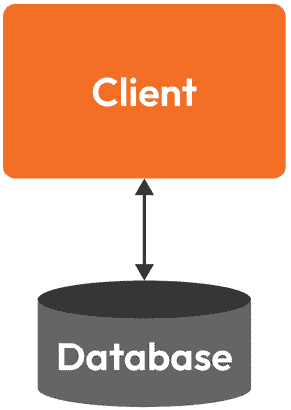
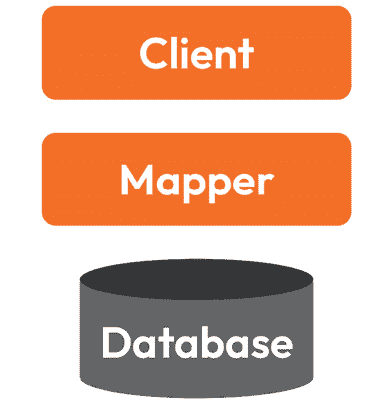
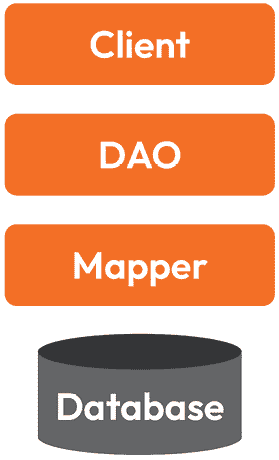
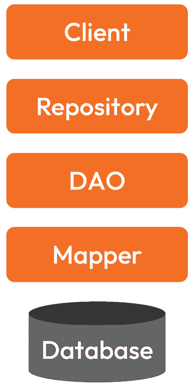

# 第四章：云原生应用程序中的数据管理设计模式

无论选择单体架构还是微服务架构的原则，我们当然应该期望通过引入另一种软件设计模式——**分层架构**软件设计模式来提高每个服务的质量。最近，云原生这个词变得相当流行，并且讨论很多，它描述了一组通过使用容器、编排和自动化来优化云应用程序的最佳实践。

这种方法建议在独立的层中设计和服务组织，每一层拥有特定的责任和明确的接口。更好的抽象和隔离特性的潜在保证是所需额外源代码及其聚合代码设计复杂性的回报。

在探索分层架构模式对健康应用程序至关重要的原因时，特别是关于持久性集成和数据操作，本章将准备并引导你完成服务设计转型的旅程。你将从熟悉一组关键的应用层设计策略开始，这些策略将技术性地解释和演示一个无结构的应用程序，没有任何抽象级别，如何被转换成一个优雅设计的由适当层组成的服务，这些层能够提供良好的分离和隔离，以区分持久性实现的技术细节和业务环境。

在对每一层设计策略的比较分析中，我们将讨论错误地将核心理念推向极端所带来的利弊。在上述坚实的背景之上，你将通过详细的代码示例了解每一层存在的*原因*，并能够确定*何时*利用它们提供的绝佳机会。

持久性解决方案的质量正是本章动机的核心。由于前几章侧重于更广泛的解决方案架构、集成和部署模型，我们应该更深入地研究实现单个服务。我们需要考虑将数据相关模式与其他流行实践（如**领域驱动设计**（**DDD**））相结合的强大成果。最后，但同样重要的是，我们必须讨论框架的质量；毕竟，大多数 Java 解决方案都强烈依赖于框架。我们必须，并且在本章中，我们将揭示实际的框架实现策略，直至评估某些框架特性（如作为反射或无反射技术构建）的影响。

内容将在以下部分进行分解和讨论：

+   将设计模式应用于 Java 持久层

+   探索 Java 映射景观——评估框架权衡

+   视图层与底层之间的数据传输

# 技术要求

+   Java 17

+   Maven

+   Git 客户端

+   一个 GitHub 账户

展示的代码示例可在[`github.com/PacktPublishing/Persistence-Best-Practices-for-Java-Applications/`](https://github.com/PacktPublishing/Persistence-Best-Practices-for-Java-Applications/)找到。

# 应用到 Java 持久化层的设计模式

我们作为软件工程师，经常讨论和采用分层架构解决方案，但为什么？为什么我们应该考虑使用这种代码风格？它有哪些相关的权衡？为了更好地理解代码设计模式，我们将通过一个简单任务的场景来展示：从数据库中存储和检索数据——更具体地说，是一个管理书籍及其相关数据的图书馆系统。乍一看，我们的任务看起来相当直接，对吧？让我们开始吧。

首先，我们看到需要创建一个实体，一个`Book`类，我们可以用它来处理图书馆的领域——我们的业务领域。我们可以假设的第一个特征是，我们的`Book`实体应该具有`title`（标题）、`author`（作者）、`publisher`（出版社）和`genre`（类型）这些属性。

以下代码示例表示所描述的`Book`类。请注意，所有字段都被设置为`final`以实现不可变性的假设。为了使开发者能够创建此类实例，`Book`类提供了一个`constructor`方法和一个`builder`类（*为了简洁已省略*）：

```java
public class Book {    private final String title;
    private final String author;
    private final String publisher;
    private final String genre;
    // constructor method
    // builder inner class
}
```

第一个实体`Book`被实现为一个不可变类。

实例变量被设置为`final`。因此，在对象初始化后无法更改它们的值。请注意，也没有 setter 方法。如果您对内部类的详细实现感兴趣，请参阅`Book`类的实现（[`github.com/architects4j/mastering-java-persistence-book-samples/blob/e594bb17eab3dc97665b495b4245312bfd0f421b/chapter-04/src/main/java/dev/a4j/mastering/data/Book.java#L14-L66`](https://github.com/architects4j/mastering-java-persistence-book-samples/blob/e594bb17eab3dc97665b495b4245312bfd0f421b/chapter-04/src/main/java/dev/a4j/mastering/data/Book.java#L14-L66)）。

为了模拟从数据库到数据库的序列化，我们将使用类型为`Map`的`Map`内存对象`db`：`Map<String, Map<String, Object>> db`：

```java
import java.util.HashMap;import java.util.Map;
import java.util.Objects;
import java.util.Optional;
public enum Database {
    INSTANCE;
    private Map<String, Map<String, Object>> db = new
      HashMap<>();
    public Optional<Map<String, Object>> findById(String id) {
        Objects.requireNonNull(id, "id is required");
        return Optional.ofNullable(db.get(id));
    }
    public Map<String, Object> insert(String id,
      Map<String, Object> entry) {
        Objects.requireNonNull(id, "id is required");
        Objects.requireNonNull(entry, "entry is required");
        db.put(id, entry);
        return entry;
    }
    public void delete(String id) {
        Objects.requireNonNull(id, "id is required");
        db.remove(id);
    }
    public Map<String, Object> update(String id,
      Map<String, Object> entry) {
        Objects.requireNonNull(id, "id is required");
        Objects.requireNonNull(entry, "entry is required");
        if (findById(id).isEmpty()) {
            throw new IllegalArgumentException("The
              database cannot be updated");
        }
        return entry;
    }
}
```

内存数据库并不复杂，也不涵盖任何并发情况，但它简单，可以更多地关注层。

注意

核心示例的目标是评估数据库层，如 JDBC，因此我们不会涵盖竞争条件和其他**现实生活中的**挑战。

为了保持我们对实体映射和代码设计的关注，我们的模拟内存`数据库`仅支持四个**创建、读取、更新和删除**（**CRUD**）操作。

在继续实现的过程中，下一步将是实现每个 CRUD 数据库操作。记住，在我们场景的起点，我们目前是*没有分层*的生活；因此，我们所有的方法都应该位于同一个类中。

接下来，我们将查看我们提到的非结构化方法，然后是它与使用**数据映射器**、**数据访问对象（DAO**）、**仓库**和**活动****记录**模式实现的相同解决方案的比较。

## 非结构化代码

我们场景的旅程始于设计一个单层应用程序。这个层是应用程序将依赖它来使用插入书籍、将书籍的底层表示作为数据库模型从/转换为 Java 域对象以及允许查询书籍实例的操作来操作书籍数据。嗯，有一个好消息：我们所有需要的都在一个集中的地方/文件中。当最终需要维护请求来定位和修改数据库模型的字段或更新实体的方法逻辑时，不应该有任何惊喜或痛苦——它们位于同一个地方。

随着这个应用程序的功能增长和类的长度增加，越来越难以识别哪些代码在做什么。正如我们在现实世界应用程序中反复注意到的那样，不幸的是，这种复杂性最终肯定会导致不必要的代码重复。这对于具有许多实体类的应用程序尤其如此。

回到代码，接下来是一个代码实现，它实例化了一个新的书籍对象，并使用我们自制的数据库客户端来操作书籍数据：

1.  使用 CDI 机制和其构造方法实例化 Java 的域对象`Book`。

1.  对象的属性映射到它们各自的数据库模型属性。

1.  使用 CDI 创建或检索`database`客户端实例。

1.  使用`database`客户端的 API 保存书籍；持久化的信息由实际的 Java 模型属性引用加上手动设置的数据库表示`entry`组成。

1.  通过其 ID - `title` - 从数据库检索书籍信息，并存储在类型为`Map`的数据库模型表示中 - *不是*类*类型* `Book`。

1.  使用构建器，从检索到的数据中创建了一个`Book`对象实例：

```java
Book book = BookSupplier.INSTANCE.get(); // 1// – - 2 – -
Map<String, Object> entry = new HashMap<>();
entry.put("title", book.getTitle());
entry.put("author", book.getAuthor());
entry.put("publisher", book.getPublisher());
entry.put("genre", book.getGenre());
// - - - -
Database database = Database.INSTANCE; // 3
database.insert(book.getTitle(), entry); //4
Map<String, Object> map = database.findById(book.getTitle())
                .orElseThrow(); // 5
Book entity = Book.builder()
        .title((String) map.get("title"))
        .author((String) map.get("author"))
        .publisher((String) map.get("publisher"))
        .genre((String) map.get("genre"))
        .build(); // 6
System.out.println("the entity result: " + entity);
```

有些人可能会觉得这段代码很容易处理。然而，也容易预测其对长期支持的影响。更多的代码使得维护更容易出错，结果是现在代表*风险*的应用程序，不仅对组织的正常运作，而且对*业务*，更不用说多方面的技术影响。

作为软件开发者，我们可能都遇到过（甚至是我们自己设计的）由于设计选择不当而变得越来越难以维护和修改的系统。罗伯特·马丁（又称 Uncle Bob），在他的一个演讲中，将软件“腐烂设计”的四个迹象命名为：刚性、脆弱性、不可移动性和粘滞性。这四个迹象的解释如下：

+   **刚性**：软件改变的倾向

+   **脆弱性**：软件每次更改时在许多地方崩溃的趋势

+   **不可移动性**：无法从其他项目中重用软件

+   **粘滞性**：当我们需要修改代码时，API 使得代码更难以破解

记得我们提到过，在之前的库示例中可能会出现重复吗？这是因为改变代码比复制它更困难。可预测的结果违反了**单一职责**原则（**SOLID**设计原则之一）和复杂的测试场景。毕竟，你怎么能坚持测试金字塔的测试实践（见*图 4.1*）？



图 4.1 – 测试金字塔

注意

我们可以在讨论中的代码设计和无结构的单体（见*构建进化式架构*）之间绘制一条比较线；两者都有向增加复杂性和难以移动的架构发展的趋势——就像一个“大泥球”。

当谈到持久性时，还有一些其他的事情需要考虑，我们想强调：

+   你选择的设计将影响在数据库范式之间更改时所需的努力程度。例如，更改持久性提供者（如从 SQL 切换到 NoSQL）可能是一项艰巨的任务。

+   如果你寻求采用金字塔测试方法的好习惯，层与层之间的高耦合使得与集成测试相比，准确编写适当数量的单元测试变得困难。记住，使用脚本或小型工具进行持久性存储在短期内可能是值得的；问题是，它也可能在长期内变成一场噩梦。

+   使用更多层可能会有优势。例如，你将能够将业务逻辑从技术特定性中抽象出来。除了常见的**模型-视图-控制器**（**MVC**）基本层之外，还可以考虑在模型和数据库之间添加一个额外的抽象层，尤其是在使用三层架构时。

与具有三个独立层的 MVC 不同，在不规则的代码设计中，客户端可以直接访问数据库。这并不是关于这是一个好方案还是坏方案的问题，而是关于突出权衡。这种方法在创建简单/快速的迁移脚本或其他不会长期存在或预期不会增长的代码时可能是有用的。以下图表说明了这种设计：



图 4.2 – 非结构化代码设计中的客户端-数据库集成

如前所述，这个模型很简单，但随着解决方案规模的扩大，我们可能会遇到包括在数据库和业务实体之间转换的样板代码在内的重复代码。为了解决这些问题，我们将创建一个第一层来集中映射转换在一个地方，并在客户端和数据库之间建立边界。

## 数据映射模式

下一步是创建客户端应用程序和数据库之间的第一层。这个层是一个很好的机会来减少样板代码，从而最小化错误——代码越少，错误越少。在先前的示例应用程序中，你可能已经注意到映射域和操作数据的整个操作是单个块的一部分，这可能会使其难以阅读、维护和测试。

在书籍《Just Enough Software Architecture: A Risk-Driven Approach》中，我们了解到考虑这些威胁对设计能力的重要性，并使用三种武器来对抗复杂性和风险：分区、知识和*抽象*。

在这个例子中，我们将使用抽象来隐藏技术细节，并将它们集中在单个位置。以下是我们可以这样做的方法：让我们引入我们的*危险*层。虽然一层可以帮助隔离和抽象功能，但它也增加了更多的代码。这是我们做出的权衡。

数据库和 Java 领域模型之间的转换也应该发生，并且随着实体的增加，它将变得更加频繁。在这个第一步中，让我们使用数据映射模式在抽象层中抽象这个转换过程。

`BookMapper`类将集中化转换行为在单个位置：层。从现在起，如果转换中存在错误，这是检查任何实体或数据库相关代码更改的类：

```java
class BookMapper {    private Database database = Database.INSTANCE;
    public Optional<Book> findById(String id) {
        Objects.requireNonNull(id, "id is required");
        return database.findById(id)
                .map(entity());
    }
    private Function<Map<String, Object>, Book> entity() {
        return (map) ->
            Book.builder()
                    .title((String) map.get("title"))
                    .author((String) map.get("author"))
                    .publisher((String)
                      map.get("publisher"))
                    .genre((String) map.get("genre"))
                    .build();
    }
    private Function<Book, Map<String, Object>> database() {
        return (book) -> {
            Map<String, Object> entry = new HashMap<>();
            entry.put("title", book.getTitle());
            entry.put("author", book.getAuthor());
            entry.put("publisher", book.getPublisher());
            entry.put("genre", book.getGenre());
            return entry;
        };
    }
}
```

如前所述，`BookMapper`集中化数据库模型和应用实体模型的映射操作。市场上存在几个有效的框架可以执行此类映射任务，例如流行的选项`BookMapper`有一个更直接的方法：它使用 Java 函数来封装和执行这些转换。

信息 - Java 函数

Java 函数是一种封装代码片段的方法，可以在整个应用程序中重复使用。它们使用`public static`关键字定义，后跟返回类型、函数名和括号内的参数列表。函数可以使代码更加组织化，更容易阅读，并通过消除重复编写相同代码的需要来节省时间。

看看我们如何使用`BookMapper`操作：

```java
Book book = BookSupplier.INSTANCE.get();BookMapper mapper = new BookMapper();
mapper.insert(book);
Book entity =
  mapper.findById(book.getTitle()).orElseThrow();
System.out.println("the entity result: " + entity);
```

之前的示例代码通过使用 `Mapper` 类引入了转换过程。通过这样做，我们将转换操作从该方法中抽象出来，移动到 `BookMapper` 类。由于封装，*客户端不知道翻译过程是如何进行的* – 太棒了！

虽然这是一个积极的步骤，但仍然需要改进，因为客户端仍然负责调用转换操作。虽然我们可以测试转换过程，但客户端与技术之间的高度耦合仍然是一个担忧。

为了解决这些问题，我们的下一个设计包括添加一个 *映射层*，这将减少客户端和数据库之间的摩擦。这个映射器将被反复使用，使其成为 JPA 或 Hibernate 等框架操作的好候选。

总体而言，引入这个映射层将帮助我们提高解决方案的灵活性和可维护性，同时减少复杂性（见 *图 4**.3*）：



图 4.3 – 映射层 – 代码设计现在有一个额外的抽象层

虽然映射层确实使客户端的工作变得更简单，但它仍然要求客户端对数据库细节有所了解。这可能是个问题，因为它在实现映射器和其操作时可能会引发错误。如果我们能找到一种方法来降低这种风险怎么办？关于创建一个新层，但这次让它作用于整个数据库操作呢？

让我们介绍 DAO 模式！它将使我们能够减轻客户端的负担，并最大限度地减少实现错误的可能性。

## DAO 模式

DAO 模式是一种将应用/业务层与持久化层分离的结构方式。其主要目标是抽象整个数据库操作从 API 中。

通过将所有操作封装在一个类或接口中，API 可以在需要时随时更新，而不会影响持久化数据实现。这在长期系统中特别有用，因为 DAO 实现可能需要更改。

`BookDAO` 引入了插入和检索 `Book` 的合约。作为此接口的客户，你不需要了解其内部工作方式。这使得代码更安全，因为将数据库过程集中在一个地方。现在 `BookDAO` 将是处理数据库映射器的人：

```java
public interface BookDAO {    Optional<Book> findById(String id);
    void insert(Book book);
    void update(Book book);
    void deleteByTitle(String title);
}
```

DAO 具有命令式风格，这意味着具体操作由客户端定义。例如，如果你正在使用 API 并想更新一本书，你必须确保这本书存在；否则，你会抛出异常。如果你熟悉从之前的 Java EE 中的 JPA，你可能会考虑在这个项目中将 `EntityManager` 抽象化。在这个例子中，我们将在 DAO 层中使用映射操作：

```java
public class BookMemory implements BookDAO {//..
    @Override
    public void update(Book book) {
     mapper.update(book);
    }
//…
}
```

DAO 模式由微软在 Visual Basic 中推广，后来通过 Sun 组织在 Java 中推广。它也在早期的《核心 J2EE 模式》一书中提到。它包括方法的名称，但目标是使用抽象来隔离数据库，所以无论你使用 SQL、NoSQL 还是任何服务，都无关紧要。

从权衡的角度来看，我们得到了隔离和更好的可维护性，并且如果需要，我们可以通过模拟 DAO 来测试服务单元。但是，请记住，因为它通常是一个命令式 API，所以确保客户端在使用正确的方法（例如更新或插入）在正确的情况下取决于客户端：

```java
Book book = BookSupplier.INSTANCE.get();BookDAO dao = new BookMemory();
dao.insert(book);
Book entity = dao.findById(book.getTitle()) .orElseThrow();
System.out.println("the entity result: " + entity);
```

使用 DAO 模式，从现在开始，一个消费`BookDAO`的图书客户端与图书交互时，无需意识到数据库转换过程。

通过抽象数据库操作，我们的客户甚至不需要了解映射操作，我们可以在持久化方面隔离一些事情。然而，客户仍然需要意识到数据操作。*图 4.4*显示了客户端被移动或进一步抽象，远离数据库的新层：



图 4.4 – 使用 DAO 模式进行的前置设计为数据库集成带来了更多的抽象

从客户端的角度来看，与客户端必须处理整个流程（包括数据库和实体模型转换，以及数据操作本身）的初始阶段相比，这是一个改进。但是，如果客户端尝试插入两次或更新不存在的信息，我们仍然会得到抛出的异常。这可能是一些情况下没有意义的数据库细节。那么，我们如何去除这些细节并更多地关注业务呢？这就是我们在下一节中通过存储库模式和**领域驱动设计**（**DDD**）实践要探讨的内容。

## 由 DDD 推动的存储库模式

存储库是 DDD 中的一个模式，它侧重于业务视角，并抽象出存储和基础设施细节。作为使用此 API 的客户端，我们不需要担心任何实现细节。主要关注的是**通用语言**。

DDD 和通用语言

在 DDD 中，“通用语言”的概念指的是一个共享语言，开发团队的所有成员都使用它来沟通领域模型。这种语言通过确保每个人使用相同的术语来指代相同的概念，有助于提高沟通并减少误解。它是 DDD 过程中的一个重要部分，应该在软件项目的开发过程中得到培养和改进。

回到我们的图书示例，让我们首先创建一个接口来处理`Library`图书集合。`Library`应该能够保存图书，通过标题查找图书，并在适当的时候注销图书。

`Library`合约将完成这项工作，客户端甚至不知道实现是否会实际插入或更新一本书。客户端的需求是保存一本书；从技术角度来看，如果它是一本书，则进行插入，如果它已经存在，则进行更新。`Library`接口将如下所示：

```java
public interface Library {    Book register(Book book);
    Optional<Book> findByTitle(String title);
    void unregister(Book book);
}
```

接口合约使用一种通用的语言，这种语言更接近业务语言，并包含与其操作相关的方 法。作为一个客户端，我不想关心数据是如何存储的或它从哪里来。如果你是 Java 开发者，你可能熟悉实现仓库模式的框架，例如使用`save`方法来执行数据库操作。

这个框架允许使用 DDD 实践吗？

一些框架使用仓库接口方法，但并非所有框架都遵循 DDD 实践。你可以很容易地检查一个框架是否遵循 DDD 实践：查找插入和更新方法，例如在 Quarkus 框架和 JPA 与 PanacheRepository 中。

DAO 模式和仓库模式实现之间的主要区别是客户端和数据库之间的距离，通常称为邻近性。虽然 DAO 暴露了持久层的功能，但仓库倾向于具有面向业务的功能暴露。

我们的`Library`实现将使用在`BookDAO`类上实现的 DAO 层。我们的`DAO`已经准备好了映射转换操作和数据库操作。以下代码通过`register`方法展示了如何使用 DAO 的`insert`和`update`方法：

```java
public class LibraryMemory implements Library {    private final BookDAO dao;
    public LibraryMemory(BookDAO dao) {
        this.dao = dao;
    }
    @Override
    public Book register(Book book) {
        Objects.requireNonNull(book, "book is required");
        if(dao.findByTitle(book.getTitle()).isPresent()) {
            dao.update(book);
        } else {
            dao.insert(book);
        }
        return book;
    }
    @Override
    public Book unregister(Book book) {
        Objects.requireNonNull(book, "book is required");
        dao.deleteByTitle(book.getTitle());
        return book;
    }
    @Override
    public Optional<Book> findByTitle(String title) {
        Objects.requireNonNull(title, "title is required");
        return dao.findByTitle(title);
    }
}
```

现在，让我们看看客户端代码。从客户端的角度来看，我们可以在注册一本书时注意到主要的抽象——名为`register`的业务导向操作通过将更新或插入的技术决策委托给底层实现而简化。

框架和映射模式

有几个框架可供使用，以帮助简化 Java 开发者实现映射层的工作。一些例子包括 Spring Data、Micronaut、Quarkus 以及 Jakarta Data 规范。

以下展示了仓库客户端实现注册一本书的过程：

```java
Book book = BookSupplier.INSTANCE.get();Library library = new LibraryMemory(new BookMemory());
library.register(book);
Optional<Book> entity =
  library.findByTitle(book.getTitle());
System.out.println("the entity result: " + entity);
```

通过将前面的仓库作为客户端，无需实现任何有关从何处获取这些数据的细节。这简化了并专注于业务需求——注册一本书和通过其标题查找它。然而，这也带来了一定的代价。即使在使用框架的情况下，增加更多层也有其权衡，例如增加 CPU 消耗和更多位置，这些都可能是最终出现 bug 的潜在原因。以下图示显示我们在数据库和业务域之间添加了另一个层：



图 4.5 – 使用仓库模式的预先设计

再次，我们必须面对软件设计的困境——在这里没有正确或错误答案，只有权衡。一方面，我们可以尽可能地将数据库移开，简化客户端实现。另一方面，我们可能走得太远，在试图简化事情的同时，最终导致实体和数据库操作紧密集成。

在这次旅程的下一站和最后一站，我们将讨论活动记录模式。

## 活动记录模式

活动记录是一种减少在模型中使用数据库操作复杂性的方法。马丁·福勒在他的 2003 年著作《企业应用架构模式》中定义了它。接下来是我们的下一个目的地——我们将结合实体及其数据库操作。

这种模式背后的想法是通过在 Java 中使用继承来拥有一个扩展`Model`类的实体。这给实体带来了像拥有超能力的模型一样的数据库能力：

```java
public class Book extends Model {    private final String title;
    private final String author;
    private final String publisher;
    private final String genre;
}
```

但是，权力越大，责任越大。这种模式的主要好处之一是简单性。如果你从 MVC 的角度来看，模型将同时持有与业务相关的逻辑和数据操作逻辑。在我们的代码示例中，`Book`类能够执行多个数据库操作，例如插入、更新、删除和按 ID 查找。以下代码显示了客户端的实现代码，它可以创建书籍并使用`insert`方法：

```java
Book book = ...;book.insert();
Book model = Book.findById(book.getId());
```

这种模式在某些情况下是有意义的，尤其是在简单的应用程序中。但就像其他任何解决方案一样，这并不是万能的。这种模式有其自己的担忧，比如违反 SOLID 的单一职责原则。一些 Java 框架依赖于这种模式，例如与 Quarkus 一起使用的 Panache、ActiveJDBC 和 ActiveJPA。

讨论层和抽象可能是一个相当大的话题，因为你的决定可能会产生积极和消极的后果。

现在我们已经看到了设计持久性集成层的不同方法，我们将继续分析框架在底层是如何工作的，并了解在选择持久性框架技术时，哪些特性可以被赋予更高的权重。

# 探索 Java 映射领域——评估框架权衡

你现在可以理解使用层的动机了。我们有一个成熟的 Java 生态系统，不需要手动做所有事情，这真是太好了——*多亏了框架*。由于框架众多，我们可以根据 API 可用性、邻近性和运行时对它们进行分类。

+   **可用性**：在查看框架时，评估其 API 的可用性是一个需要考虑的项目。例如，你可以问这样一个问题：“*我们能在多少种不同的数据库中使用相同的 API？这是否* *可能？*”

    +   **无偏见 API**: 一个 API 可以与多个数据库供应商、类型或范式一起使用。这种积极的一面是，无偏见 API 减少了认知负荷，因为您不需要为每个不同的数据库集成学习新的 API。然而，您可能会失去特定的数据库行为或需要更长的时间才能收到功能更新和错误修复。

    +   **特定 API**: 无偏见 API 的对立面是每个数据库都需要一个专门的 API——换句话说，每个数据库一个 API。提供不断更新的版本以支持用户与目标数据库提供商的最新版本集成。幸运的是，它可能具有更少的层和更好的性能；不幸的是，当处理多语言持久性时，认知负荷可能更难管理。

+   **邻近性**: 框架与数据库存储引擎有多接近？

    +   **通信**: 更接近数据库，远离领域模型；这使数据驱动设计成为可能，但可能会有更多的样板代码。

    +   **映射**: 更接近模型，远离数据库；这使 DDD 成为可能并减少了样板代码，但远离数据库可能会导致忽略数据库侧的最佳实践。

+   **运行时**: 这主要影响依赖于注解使用的映射框架。

    +   **反射**: 这个框架探索 Java 中的反射，这允许有更多的灵活性和运行时插件的多样性。然而，启动时间较慢，应用程序消耗大量内存来执行读取元数据的进程。

    +   **无反射**: 这种类型的框架避免了反射，使启动更快、更经济。然而，元数据处理发生在构建时间而不是运行时，导致构建和打包过程更长，框架在实时探索时灵活性较低。

总之，有各种各样的 Java 映射框架可供选择，每个框架在 API 可用性、与数据库实现细节的邻近性和运行时能力方面都有自己的权衡。考虑您项目的具体需求并选择最适合这些需求的框架是很重要的。

现在我们已经将我们的“一站式”类拆分，简化了客户端实现，减少了开发错误的可能性，并认可了从市场上众多选项中我们可以选择的框架类型，我们如果不讨论从数据角度出发的视图和控制器层（MVC 的视图和控制器层），就无法继续前进。在下一节中，我们将探讨在使用**数据传输对象**（**DTOs**）时，如何处理视图层和底层之间传输的数据。

# 视图层和底层之间的数据传输

在本章中，我们讨论了应用层对于开发的重要性以及它们如何影响项目的可维护性和复杂性。我们还探讨了应用程序的模型及其在 MVC 架构中与数据库的关系。但是等等……当涉及到视图和控制器（MVC）时，对数据库集成及其性能是否有潜在的影响？

答案是*是的*。让我们更深入地看看从表示层到底层的数据传输如何对你的解决方案产生益处或影响。

大多数时候，当开发人员决定在客户端使用数据模型时，可能会出现以下挑战：

+   以`Book`为例——可以直接影响视图层并需要对其进行修改。

+   `Library`示例，暴露敏感数据，如书籍的*价格*，将不是一件好事。在更具体的场景中，假设你正在开发一个社交媒体 API 的客户端消费者——通过 ID 查找用户并暴露所有非敏感和敏感信息，包括用户的密码等，将是不被接受的！强烈建议*只分享必要的信息——不是所有信息都应该对*客户端*可见。

+   **代码演变和版本控制**：在典型场景中，代码的一部分是不断演变的，而另一部分，即*遗留*部分，必须得到维护。在这种情况下，如果新的功能需要修改视图层内部使用的模型，可能会破坏这个集成中的遗留模型部分。

+   为了处理旧代码和当前代码之间的模型差异，一种方法是用**版本控制**。通过为视图（即客户端）中使用的模型类进行版本控制，使得通过不同的类提供相同的模型成为可能，并能够创建不同的视图，每个视图都有其相应的适配器。

考虑到这种方法中存在的问题，结论是，通过表示层传递信息的解决方案是将模型与视图和控制器分离。这时，DTO 模式就派上用场了。

回顾 DTOs

DTO 是一种设计模式，它促进了系统层或组件之间的数据传输。它可以用来解耦表示层和业务逻辑，增加应用程序的灵活性和可维护性。这些简单的对象包含数据但没有关联的业务逻辑——它们是数据在视图中显示的简单表示。

DTOs 代表实际领域模型的不同视图。例如，一个 DTO 可以只包含需要展示的信息所需的基本信息子集。总之，DTO 模式具有以下优点：由于业务逻辑和数据库逻辑之间的分离，实现了*模型简化*；由于数据库调用次数减少，提高了*性能*；通过防止通过暴露敏感属性泄露数据，增强了*安全性*。

然而，也可能看到潜在的缺点，例如随着层数和类数量的增加导致的*更高复杂性*，由于对模型信息的访问受限导致的*降低灵活性*（可能需要但未公开），以及由于在 DTO 和模型之间的映射上增加的处理导致的*降低性能*。

必须牢记，隔离是关键，过多的代码会增加复杂性并影响性能。

创建 DTO 可能意味着大量的工作，尤其是在手动实现时。幸运的是，如果您认为 DTO 模式适合您的项目，市场上有一些框架可以使您的生活更加轻松。例如，模型映射器([`modelmapper.org/`](http://modelmapper.org/))和 MapStruct([`mapstruct.org/`](https://mapstruct.org/))可以促进并加快实现过程。

我们不会深入探讨表示层和 DTO 模式。不过，我们想提醒您，也要对视图空间保持谨慎，因为关注的点不仅仅是*持久性*——一个例子就是可视化。

# 摘要

层层叠叠，更多层——有时，它们是出色的盟友，帮助分担责任，减少和集中开发错误风险，并促进采用 SOLID 的单职责原则。然而，过多的层可能会适得其反，增加代码设计的复杂性。何时应该添加或移除新层？答案将隐藏在每个应用程序的上下文挑战、技术需求和业务需求中。

通过代码演示的旅程，我们探索了多种模式，从无结构、零层应用设计到多种多层级设计采用和面向业务简化技术。在这段旅程中，我们了解了在软件应用程序中将数据库从客户端抽象出来的层的使用优势和劣势。

此外，我们明确指出，对于开发人员和架构师来说，持久层还有更多需要关注的地方，并且我们将在层视图上可视化和交互数据的方式也应被视为一个可能受到我们如何设计持久性解决方案影响的层。

理解应用程序的需求和上下文是确定应用于数据库集成最佳模式的关键，以及最佳的成本效益抽象和隔离水平。有了这些，我们就准备好了解和探索通过 Jakarta EE 和 MicroProfile 规范提供的 Java 企业标准。在下一章中，我们将向您介绍两个与持久性相关的规范，这些规范可以解决迄今为止提到的多个挑战，并深入探讨探索企业级和微服务 Java 应用程序空间的力量。

# 第二部分：Jakarta EE、MicroProfile、现代持久化技术及其权衡

在本书的这一部分，我们探讨了 Jakarta EE、MicroProfile 和现代持久化技术的交汇点。我们深入分析了不同持久化方法所涉及的权衡，为在 Java 持久化动态环境中航行的开发者提供了宝贵的见解和实用的指导。

本部分包含以下章节：

+   *第五章**，Jakarta EE 和 JPA：现状分析*

+   *第六章**，Java 中的 NoSQL 揭秘：一统天下的 API*

+   *第七章**，jOOQ 采纳指南之缺失部分*

+   *第八章**，使用 Eclipse Store 的超快内存持久化*
