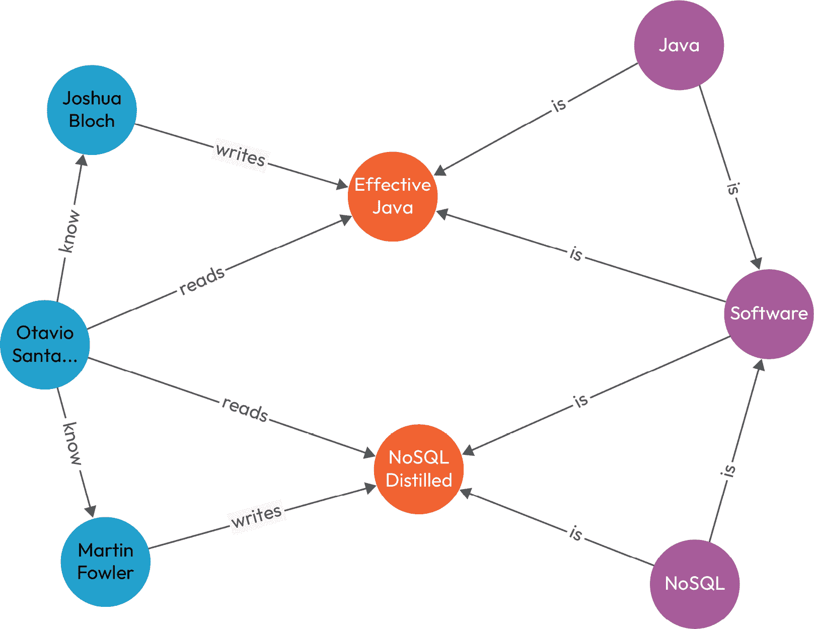

# 第六章：Java 中的 NoSQL 揭秘 – 一个 API 统治一切

最近 NoSQL 数据库获得了显著的关注度，本章将探讨它们为什么值得更多的关注。随着软件的发展和多样化的需求增加，NoSQL 数据库提供了一条更容易成功的途径。使用 Jakarta 标准，这种持久化类型在各个领域都有帮助，包括更传统的领域如金融。NoSQL 数据库提供灵活的数据建模、水平扩展和更好的性能，以及其他优势。因此，它们适合管理大量结构化或非结构化数据，并已成为现代应用的热门选择。本章将指导我们如何使用 Java 操作 NoSQL 数据库，帮助开发者利用其功能和能力。

本章我们将涵盖以下主题：

+   理解 NoSQL 数据库的权衡

+   使用**Jakarta** **NoSQL** (**JNoSQL**)消费 NoSQL 数据库

+   图形数据库

# 技术要求

以下为本章所需内容：

+   Java 17

+   Git

+   Maven

+   Docker

+   任何首选的 IDE

+   本章的代码可以在[`github.com/PacktPublishing/Persistence-Best-Practices-for-Java-Applications/tree/main/chapter-06`](https://github.com/PacktPublishing/Persistence-Best-Practices-for-Java-Applications/tree/main/chapter-06)找到。

# 理解 NoSQL 数据库的权衡

NoSQL 数据库很受欢迎，包括顶级数据库引擎提供的几个持久化解决方案。我们必须记住，NoSQL 数据库并没有消除对关系数据库的需求。

SQL 数据库对于大多数企业解决方案来说仍然至关重要。人们通常从这里开始学习编程，关于这个主题有大量的文章和书籍。

此外，使用 SQL 的产品成熟度非常广泛！这些产品可以帮助你完成关键任务，例如备份、迁移和查询分析。

目标不是让你对使用 NoSQL 失去动力。然而，一旦你成为高级工程师，请记住 Neal Ford 在《软件架构基础：工程方法》中提到的软件架构的第二定律：一切皆有权衡！

考虑这一点，让我们继续讨论 NoSQL 数据库。

# 使用 JNoSQL 消费 NoSQL 数据库

我们很幸运在 Java 平台上拥有几个解决方案和成功案例。因此，下一步是尽快在技术成熟后创建一个标准 API。

JNoSQL 规范旨在简化 Java 和 NoSQL 数据库之间的通信。

标准化多个 NoSQL 数据库的行为和接口的好处是代码的可移植性和易于集成。我们通常谈论切换数据库，这是真的。然而，最大的优势是使每个人都能更容易地参与项目。当需要时，可以自然地切换数据库。


图 6.1：NoSQL 数据库 – 文档类型

使用标准 API 的好处很大；此外，您可以使用特定的行为，例如 Cassandra 的**CQL**（Cassandra 查询语言）和 ArangoDB 的**AQL**（ArangoDB 查询语言）。


图 6.2：NoSQL 数据库 – 单 API 的文档类型

这是 JNoSQL 的主要原则，即在 Java 和 NoSQL 数据库方面简化并使您和您组织的日常生活更加轻松。在规范方面，您可以探索您的实体；例如，使用 JPA，您可以使用注解来操作多种 NoSQL 数据库类型，如文档、列、图和键值。看看相同的注解如何在多个文档数据库中工作：


图 6.3：JNoSQL 的多数据库集成抽象

该规范支持最流行的 NoSQL 类型：键值、文档、宽列或其他列类型，以及图。

## 键值数据库

从最简单的一个开始：键值。这种 NoSQL 解决方案的味道有一个类似于映射的结构。因此，您通常可以从键中找到信息，而值是一个 blob。每个供应商都有不同的序列化和存储值的方式，例如文本、JSON 或二进制 JSON。

使用图书馆系统，我们可以使用这个数据库来保存用户设置信息；因此，我们将创建一个`User`实体来保存语言和分类。

为了提供一个此模型的示例，我们将遵循一个简单的 Java SE 应用程序与 JNoSQL。我们将使用最流行的键值数据库解决方案：Redis。

定义生产中的 Redis 配置需要一本书；我们将本地安装此示例，但请记住，在生产环境中工作，请查阅 Redis 文档以获取更多详细信息。现在，一旦您已配置 Docker，请运行以下命令：

```java
docker run --name redis-instance -p 6379:6379 -d redis
```

服务器正在运行；下一步是向我们的项目中添加依赖项。此示例使用 Maven 项目，因此我们将添加映射依赖项和 Redis 驱动程序：

```java
<dependency>    <groupId>org.eclipse.jnosql.mapping</groupId>
    <artifactId>jnosql-mapping-key-value</artifactId>
    <version>${jnosql.version}</version>
</dependency>
<dependency>
    <groupId>org.eclipse.jnosql.communication</groupId>
    <artifactId>jnosql-redis-driver</artifactId>
    <version>${jnosql.version}</version>
</dependency>
```

准备好依赖项后，下一步是使用注解创建`User`实体，以映射到键值数据库。它需要一个注解来定义为一个 JNoSQL 实体和键，您将在其中设置`Entity`和`Id`注解，分别：

```java
@Entitypublic class User {
    @Id
    private String userName;
    private String name;
    private Set<String> languages;
    private Set<String> categories;
  //...
}
```

在定义`User`实体类和`userName`字段时，分别使用`Entity`和`Id`注解。

让我们执行它。`KeyValueTemplate`是我们用于操作键值数据库的实例；这是映射通信的最低级别：

```java
public static void main(String[] args) {    User otavio = User.builder().userName("otaviojava")
            .name("Otavio Santana")
            .category("Technology")
            .category("Philosophy")
            .category("History")
            .language("English")
            .language("Portuguese")
            .language("French").build();
    try (SeContainer container =
      SeContainerInitializer.newInstance().initialize()) {
        KeyValueTemplate template =
          container.select(KeyValueTemplate.class).get();
        User userSaved = template.put(otavio);
        System.out.println("User saved: " + userSaved);
        Optional<User> user = template.get("otaviojava",
          User.class);
        System.out.println("Entity found: " + user);
        template.delete("otaviojava");
    }
}
```

这种数据库类型的查询有限制，但功能强大。**生存时间**（**TTL**）是用于定义数据库中信息过期时间的功能：

```java
public static void main(String[] args) throws  InterruptedException {
    User poliana = User.builder()
            .userName("poly")
            .name("Poliana Santana")
            .category("Philosophy")
            .category("History")
            .language("English")
            .language("Portuguese")
            .build();
    try (SeContainer container = SeContainerInitializer
      .newInstance().initialize()) {
        KeyValueTemplate template = container
          .select(KeyValueTemplate.class).get();
        template.put(poliana, Duration.ofSeconds(1));
        System.out.println("The key return: " +
          template.get("poly", User.class));
        TimeUnit.SECONDS.sleep(2L);
        System.out.println("Entity after expired: " +
          template.get("poly", User.class));
        template.delete("poly");
    }
}
```

但等等，配置在哪里？JNoSQL 实现使用 Eclipse MicroProfile 配置来保留良好的软件实践，例如十二因素应用。

在这个示例中，我们将属性放在`property`文件中，但我们可以覆盖系统环境或包含更多配置，例如用户名和密码：

```java
jnosql.keyvalue.database=developersjnosql.redis.port=6379
jnosql.redis.host=localhost
```

当你想快速读写实体时，键值是一个强大的盟友。这些解决方案通常在内存中工作，并使用快照来避免服务器宕机时的数据丢失。

就像任何技术解决方案一样，需要考虑权衡。例如，虽然可以使用 ID 检索信息并将值作为唯一的 blob 返回，但这种方法在所有情况下可能并不理想。因此，让我们探索下一类解决方案来解决这个问题。

## 列数据库

以下数据库类型是宽列类型，它遵循与键值相同的原理，但与唯一的 blob 不同，你可以将信息拆分为小的列。

这个 NoSQL 数据库也被称为二维键值存储。最流行的实现是 Apache Cassandra；本节将介绍 Java 和 Apache Cassandra 之间的集成。

如前所述，我们不会涵盖在生产环境中运行的建议；目前，我们将运行单个实例以进行测试目的：

```java
docker run -d --name cassandra-instance -p 9042:9042 cassandra
```

小贴士

当使用 Docker 运行 Cassandra 实例时，请不要在生产环境中以这种方式运行。此配置最适合您的测试环境。对于生产使用，请访问 Apache 网站上的 Apache Cassandra 文档。

我们将遵循相同的配置理念，因此我们将使用 Java 和 Maven 项目。在 Java 方面，第一步是为 Maven 项目添加依赖项：

```java
<dependency>    <groupId>org.eclipse.jnosql.mapping</groupId>
    <artifactId>jnosql-cassandra-extension</artifactId>
    <version>${jnosql.version}</version>
</dependency>
```

这个依赖项看起来不同，因为它是一个 Cassandra 扩展；它是列 API 加上特定于 Cassandra 的行为，例如 CQL。如果你愿意，你可以像我们使用 Redis 一样使用它，但不能轻松地使用 Cassandra 特定的行为：

```java
<dependency>    <groupId>org.eclipse.jnosql.communication</groupId>
    <artifactId>jnosql-cassandra-driver</artifactId>
    <version>${jnosql.version}</version>
</dependency>
<dependency>
    <groupId>org.eclipse.jnosql.mapping</groupId>
    <artifactId>jnosql-mapping-column</artifactId>
    <version>${project.version}</version>
</dependency>
```

这个 NoSQL 数据库的工作方式与 SQL 不同。实际上，反规范化是你的最佳朋友。

首先，可视化模型。然后，创建它。我们希望跟踪和查看具有特定 ID 的用户租借书籍的记录：

```java
@Entity("rental")public class RentalBook {
    @Id("id")
    private UUID id;
    @Column
    private LocalDate date;
    @Column
    @UDT("user")
    private User user;
    @Column
    @UDT("book")
    private Set<Book> books = new HashSet<>();
}
@Entity
public class User {
    @Column
    private String username;
    @Column
    private String name;
}
@Entity
public class Book {
    @Column
    private UUID id;
    @Column
    private String title;
}
```

模型就到这里；从 ID，我们可以返回书籍租借的记录。我们正在复制诸如书籍标题和用户姓名等信息，以避免任何连接或更多过程，但一旦字段被更新，我们需要在后台运行一个事件来更新它。

`User`和`Book`实体是用户定义的类型，其中我们可以向单个列添加多个值。

尽管有 JPA，JNoSQL 必须使用`Column`或`Id`注解定义每个要存储的字段。

让我们执行代码，因为我们本质上可以使用与键值相同的原理和行为。我们还可以在查询中选择要返回的字段，而不是总是返回所有内容：

```java
try(SeContainer container =  SeContainerInitializer.newInstance().initialize()) {
        RentalBook otavio = RentalBook.builder()
                .id(UUID.randomUUID())
                .date(LocalDate.now())
                .user(User.of("otaviojava", "Otavio
                   Santana"))
                .book(Book.of(UUID.randomUUID(), "Clean
                   Code"))
                .book(Book.of(UUID.randomUUID(), "Effective
                   Java"))
                .build();
        RentalBook karina = RentalBook.builder()
                .id(UUID.randomUUID())
                .date(LocalDate.now())
                .user(User.of("kvarel4", "Karina Varela"))
                .book(Book.of(UUID.randomUUID(), "Clean
                Arch"))
                .build();
        ColumnTemplate template =  container
          .select(CassandraTemplate.class).get();
        template.insert(List.of(otavio, karina),
          Duration.ofDays(600L));
        ColumnQuery query = ColumnQuery.select("id",
          "date").from("rental")
                .where("id").eq(karina.getId()).build();
        System.out.println("Executing query using API: ");
        template.select(query).forEach(System.out::println);
        System.out.println("Executing query using text: ");
        template.query("select * from rental")
          .forEach(System.out::println);
    }
```

Cassandra 不是无模式的，尽管在使用它之前你需要创建模式。在本地运行查询是可以的，但在生产环境中不要使用它。这是因为它在生产环境中启动和运行需要时间。以下代码显示了使用 Cassandra 的配置：

```java
jnosql.column.database=libraryjnosql.cassandra.query.1=CREATE KEYSPACE IF NOT EXISTS library WITH replication = {'class': 'SimpleStrategy', 'replication_factor' : 3};
jnosql.cassandra.query.2=CREATE TYPE IF NOT EXISTS library.user (username text, name text);
jnosql.cassandra.query.3=CREATE TYPE IF NOT EXISTS library.book (id uuid, title text );
jnosql.cassandra.query.4=CREATE COLUMNFAMILY IF NOT EXISTS library.rental (id uuid PRIMARY KEY, date text, user user, books frozen<set<book>>);
```

与键值对相比，宽列模型在模型中具有更多的灵活性。但我们仍然有搜索非 ID 字段的问题；我们如何解决这个问题？让我们继续到下一个数据库类型来回答这个问题。

小贴士

Cassandra 有一个二级索引，允许在键之外进行查询。请注意，使用它有几个影响。

## 文档数据库

我们第三种 NoSQL 类型可以搜索 ID 之外的字段；好消息！文档 NoSQL 类型具有 XML 或 JSON 结构。搜索 ID 仍然是更有效的方式，但能够通过其他字段搜索信息使模型更具灵活性，并使探索数据库中的信息更容易。

对于这个示例，我们将使用 MongoDB 进行实现。我们将本地运行单个节点。请注意，在生产环境中运行时；但现在，我们将从 Docker 镜像中运行它：

```java
docker run -d --name mongodb-instance -p 27017:27017 mongo
```

作为 Maven 依赖项，我们将添加 MongoDB 扩展：

```java
<dependency>    <groupId>org.eclipse.jnosql.mapping</groupId>
    <artifactId>jnosql-mongodb-extension</artifactId>
    <version>${jnosql.version}</version>
</dependency>
```

在这个示例中，我们将展示商店内的图书项。该模型与宽列类似，因为它是由查询驱动的，但这次我们有更多的灵活性来搜索。该模型遵循 DDD 原则，其中`Book`作为实体，`Author`作为值对象：

```java
@Entitypublic class Book {
    @Id
    private String id;
    @Column
    private String title;
    @Column
    private List<String> categories;
    @Column
    private Set<String> languages;
    @Column
    private Author author;
 }
 @Entity
public record Author(@Column("nickname") String nickname,
  @Column("name") String name, @Column("profile") String
     profile) {
    public static AuthorBuilder builder() {
        return new AuthorBuilder();
    }
}
```

小贴士

如果你正在使用不可变值对象，它是一个使用 Java 的最新功能：记录的绝佳候选者。

模型已经准备好探索；因此，我们将它在 Java SE 上运行，并探索`DocumentTemplate`，它遵循与之前数据库版本相同的原理——作为 Java 和数据库之间的桥梁：

```java
try (SeContainer container =  SeContainerInitializer.newInstance().initialize()) {
    Author otavio = Author.builder()
      .nickname("otaviojava").name("Otavio Santana")
        .profile("@otaviojava").build();
    Book cassandra = Book.builder()
            .title("Apache Cassandra Horizontal scalability
              for Java applications")
            .category("database").category("technology")
            .language("Portuguese").language("English")
            .author(otavio).build();
    DocumentTemplate template = container
      .select(DocumentTemplate.class).get();
    template.insert(cassandra);
    System.out.println("The database found: " +
      template.find(Book.class, cassandra.getId()));
    template.delete(Book.class, cassandra.getId());
}
```

文档的力量与关系数据库相似，但我们没有像 SQL 和 JOIN 那样的强大事务。即使有这种限制，我们也可以从任何字段对元素进行排序：

```java
try (SeContainer container =  SeContainerInitializer.newInstance().initialize()) {
    Author neal = Author.builder()
      .nickname("neal").name("Neal Ford")
         .profile("@neal4d").build();
    Book evolutionary = Book.builder()
            .title("Building Evolutionary Architectures:
              Support Constant Change")
            .category("architecture")
            .category("technology")
            .language("Portuguese").language("English")
            .author(neal).build();
//...
    DocumentTemplate template = container
      .select(DocumentTemplate.class).get();
    template.insert(evolutionary);
    DocumentQuery query = DocumentQuery
       .select().from("Book")
                    .where("author.nickname").eq("neal")
                    .orderBy("title").asc().build();
    System.out.println("The query by API");
    template.select(query).forEach(System.out::println);
}
```

运行示例的属性将遵循相同的核心思想，以利用十二因素应用：

```java
jnosql.document.database=libraryjnosql.mongodb.host=localhost:27017
```

文档 NoSQL 类型在查询中的灵活性非常好！但实体之间的关系呢？这种查询在某些时候是需要的，那么我们如何解决这个问题？让我们看看最后一种 NoSQL 类型并找出答案。

## 图数据库

如果你正在寻找关系，你来到了正确的位置！让我们来谈谈图数据库。图数据库是一个具有图结构的强大引擎，它根据顶点和边保存信息，其中边是一个用于保存关系信息的对象。

使用边，你可以定义关系的方向和属性；它甚至比关系数据库更强大。

让我们创建一个简单的推荐引擎，其中包含一个可以读写并能遇见人的角色。



图 6.4：人与书之间的关系

首先要确保我们至少有一个实例正在运行；记住，这并不是在生产环境中运行的正确方式：

```java
docker run --publish=7474:7474 --publish=7687:7687 --env NEO4J_AUTH=neo4j/admin neo4j
```

我们将有两个实体：`Book`和`Person`。一个人可以写 N 本书，读 N 本书，遇到 N 个人。当我们有多个 N-to-N 关系时，树形层次结构和元关系表明这是一个图数据库：

```java
@Entitypublic class Book {
    @Id
    private Long id;
    @Column
    private String name;
}
@Entity
public class Person {
    @Id
    private Long id;
    @Column
    private String name;
    @Column
    private String profile;
}
@Entity
public class Category {
    @Id
    private Long id;
    @Column
    private String name;
}
```

该图还有一个`GraphTemplate`实例，您可以使用它来操作图数据库。

此示例将使用`LibraryGraph`来操作该系统上的所有操作。准备好随着它变大而重构它，主要是因为它打破了单一责任**SOLID**原则。

需要记住的主要点是开发者的核心原则，即使代码易于维护和阅读；不幸的是，我们还没有像 SQL 那样拥有一套完整的已建立的最佳实践来处理 NoSQL：

```java
@ApplicationScopedclass LibraryGraph {
    @Inject
    private GraphTemplate template;
    public Book save(Book book) {
        Objects.requireNonNull(book, "book is required");
        return template.getTraversalVertex()
          .hasLabel(Book.class)
                .has("name", book.getName())
                .<Book>next()
                .orElseGet(() -> template.insert(book));
    }
    public Category save(Category category) {
        Objects.requireNonNull(category, "category is
          required");
        return template.getTraversalVertex()
          .hasLabel(Category.class)
                .has("name", category.getName())
                .<Category>next()
                .orElseGet(() ->
                   template.insert(category));
    }
//...
}
```

最后一步是运行它。在插入实体和关系时，查询和操作之间存在微小的差异。我们可以使用 Neo4j 实现以下图。

JNoSQL 使用 Apache TinkerPop 作为通信层，我们可以通过 Gremlin 进行查询搜索。这打开了一个无限可能的世界：

```java
try (SeContainer container =  SeContainerInitializer.newInstance().initialize()) {
    LibraryGraph graph = container
      .select(LibraryGraph.class).get();
    Category software = graph
      .save(Category.of("Software"));
    Category java = graph.save(Category.of("Java"));
    Person joshua = graph.save(Person.of("Joshua Bloch",
      "@joshbloch"));
    graph.is(java, software);
    graph.write(joshua, effectiveJava);
     List<String> softwareCategories =
       graph.getSubCategories();
    List<String> softwareBooks = graph.getSoftwareBooks();
    List<String> softwareNoSQLBooks =
      graph.getSoftwareNoSQL();
    Set<Category> categories = graph.getCategories(otavio);
    Set<String> suggestions = graph.getFollow(otavio);
   }
```

图数据库具有利用关系的广泛能力，但这也带来了性能上的代价。数据库扩展很困难，并且比键值数据库慢。

# 摘要

我们已经完成了对 NoSQL 类型的旅程，我们查看的是从最不灵活到最不可扩展的类型。注意建模至关重要，因为它与 SQL 数据库不同，并且是 NoSQL 数据库初学者的常见陷阱。

我们向您介绍了 JNoSQL Java API 标准，它简化了 Java 应用程序与 NoSQL 数据库的集成。我们将在关于多语言持久性的章节中讨论 Jakarta 和数据持久层。在下一章中，我们将介绍使用 jOOQ 的关系数据库。
