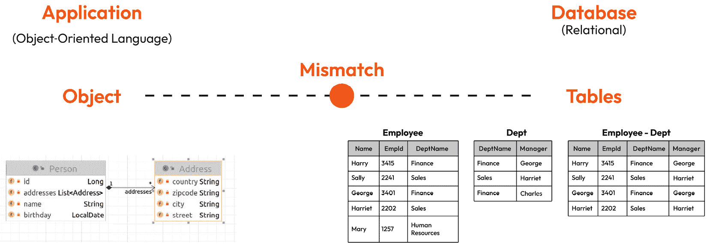
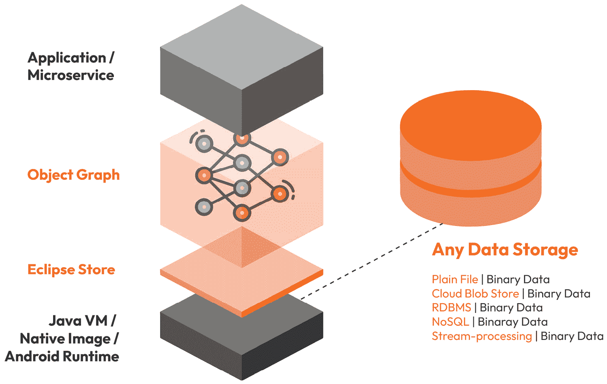
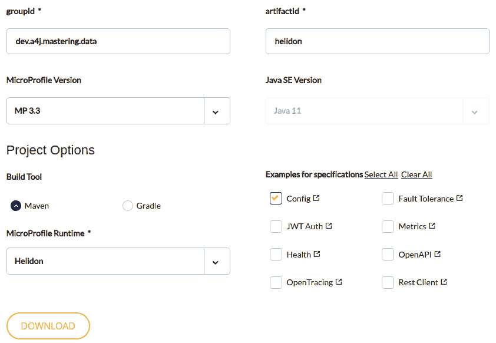

# 第八章：使用 Eclipse Store 的超快内存持久化

NoSQL 和 SQL 数据库在处理其目标用例时可以非常出色且强大。然而，寻求最佳性能的用户需要意识到其他可能影响应用程序在处理效率、速度甚至代码设计方面的因素。在这方面，可以提前提到一个例子：这些数据库解决方案中的大多数将需要在数据库模式与应用程序数据模型之间进行某种类型的映射。正如你可以想象的那样，映射需要在应用程序和数据库之间数据流动的每次都发生。这种被称为**对象关系阻抗不匹配**的特性，有很高的潜力影响我们之前提到的几乎所有数据库类型——SQL 和 NoSQL。

在本章中，我们将讨论另一种数据库范式，即内存数据库。除了显著的性能提升外，这绝对是在处理数据处理、Web 和移动应用、缓存和实时分析等用例时可以利用的数据库类型。对于此类场景，高性能的数据存储解决方案、低延迟的数据访问和实时数据处理似乎是有希望的替代方案，因为它们允许提供超快的持久化解决方案。

我们将使用**Eclipse Store**，一个高性能、轻量级的内存持久化解决方案，来探索上述概念。这个数据库的一个要点是更快，消除额外处理，减少代码大小和复杂性，尤其是在与 SQL 数据库和 Hibernate/JPA 集成相比时。

在本章中，我们将涵盖以下主要内容：

+   为什么每个数据库操作都会秘密地增加延迟？我们将了解对象关系阻抗不匹配是什么以及它如何影响持久化性能。

+   什么是内存持久化存储，它与其他数据库类型有何不同？

+   探索 Eclipse Store。

+   Eclipse Store 与 Jakarta/MicroProfile。

# 技术要求

以下为本章的技术要求：

+   Java 17

+   Git

+   Maven

+   任何首选 IDE

本章的源代码可在[`github.com/PacktPublishing/Persistence-Best-Practices-for-Java-Applications/tree/main/chapter-08`](https://github.com/PacktPublishing/Persistence-Best-Practices-for-Java-Applications/tree/main/chapter-08)找到。

# 对象关系阻抗不匹配解释

作为 Java 开发者，我们知道面向对象编程（**OOP**）范式的力量——它允许我们根据多态性、封装、继承、接口、创建自定义类型等探索多个模式。我们非常喜欢它！主要是因为我们可以将这些方法与设计模式结合起来，创建干净且易于阅读的代码。

不幸的是，许多这些面向对象的概念和行为在数据库端不可用，这种特性被称为**阻抗不匹配**。

**对象-关系映射**（**ORM**）阻抗不匹配是在将数据在面向对象语言和**关系数据库管理系统**（**RDBMS**）之间映射时发生的一种特定类型的阻抗不匹配。

如 Java、Python 和 C#这样的面向对象（OOP）语言使用对象来表示和操作数据，而关系数据库使用表来存储和管理数据。ORM 是一种技术，通过将对象映射到数据库表以及反向映射来弥合这两种不同范式之间的差距。



图 8.1 – 数据库模式上 Java 对象模型等价映射的示例

ORM 阻抗不匹配发生的原因是对象和表具有不同的属性和结构。例如，对象可以具有复杂的数据类型、继承和多态，而表由简单的行和列组成。此外，对象可以与其他实体有关系，而表则行与行之间存在关系。

为了减轻这种阻抗不匹配并提高开发效率，ORM 工具提供了映射策略，允许开发人员将对象映射到表以及反向映射。这些策略可以包括 ORM 模式，如表继承、关联映射和延迟加载。

尽管有这些策略，但由于查询语言、性能问题和可扩展性问题，ORM 阻抗不匹配仍然可能发生。因此，开发人员需要了解使用 ORM 工具所涉及的限制和权衡，并在必要时考虑替代解决方案。

在映射处理方面，另一个需要强调的事项是它使用映射器。这个映射器在每次应用程序-数据库交互中使用，负责将实体转换为/从实体转换，并且需要大量的 CPU 资源，这可能会导致比执行的查询本身更重。

这个映射器具有一种在范式之间通信的明亮机制。即使有缓存和最先进的性能提升技术，这个过程在许多应用程序中也可能是一个噩梦。

我们可以采用的一种技术来克服这个挑战，并避免在每次数据库操作上都进行额外的 Java 处理，就是 Eclipse Store。让我们深入了解这个内存数据库是什么，它是如何工作的，以及如何开始使用它。

Eclipse Store 是一种基于 Java 的开源内存数据存储技术，它提供了一种新的对象持久化方法。

与依赖于 ORM 将对象映射到关系表的传统数据库不同，Eclipse Store 的内部机制定位并使用堆上的 Java 对象。它可以直接从内存中获取信息，消除映射或序列化的需要。这种方法由于避免了 ORM 阻抗不匹配并减少了昂贵的数据库访问需求，从而实现了更快的应用程序性能。

Eclipse Store 10 年前作为 MicroStream 的一个闭源项目开始。最近，MicroStream 开源了，并成为两个 Eclipse 项目，其中一个是 Eclipse Store。

Eclipse Store 提供了一个 Java API，允许开发者直接在内存中存储、加载和操作 Java 对象，无需访问单独的数据库。数据可以选择外部持久化，在这种情况下，它以压缩的二进制格式存储，从而允许高效地使用内存资源。这种方法消除了 ORM 的需求，ORM 可能耗时且资源密集，尤其是对于复杂的对象层次结构。

Eclipse Store 主要在内存中运行；因此，它可以提供对数据的超快读写访问，使其非常适合高性能数据处理应用，如实时分析、金融交易和游戏。

除了其速度和性能优势外，Eclipse Store 还提供了高度的可灵活性和可扩展性。它支持分布式数据结构，允许数据跨多个节点分布，并与其他数据库或数据源集成。

总体而言，Eclipse Store 为传统基于 ORM 的数据库提供了一个有吸引力的替代方案，为需要超快数据处理的程序提供了更快的性能和更低的复杂性。



图 8.2 – Eclipse Store 架构概述

使用 Eclipse Store 作为内存数据存储解决方案的应用程序可以依赖以下功能：

+   **快速性能**：快速高效地集成，依赖于快速读写操作，无需 ORM 工具的额外开销。

+   **内存存储**：快速访问数据，因为它直接从内存堆中获取。

+   **易于使用**：由于该技术旨在简单易用，具有熟悉的 Java 语法和可选的注解，因此开发者可以快速上手，轻松定义和持久化数据。

+   **无外部依赖**：使用它非常简单，因为您唯一需要的依赖项就是 Eclipse Store（它基本上依赖于一个日志库）。您不应担心库冲突或兼容性问题。

+   **轻量级**：一种不需要大量资源或配置的数据存储解决方案，易于设置和部署。

+   **灵活性**：从所有数据类型（非常少数例外）中选择，并在各种应用规模中使用它——从小型项目到企业级系统。

+   **开源**：Eclipse Store 提供多种类型，其中之一是免费开源项目，这意味着无限使用和定制，以满足您的特定需求。

+   **高可用性**：使用时，它提供内置的高可用性和冗余功能，确保您的数据始终可用且受保护。

+   **可伸缩性**：轻松添加更多节点或资源来处理不断增长的数据量，因为数据库是从零开始设计的，以满足这些目标。

在以下章节中，我们将深入探讨这个强大且灵活的内存数据管理和持久化解决方案，它可以帮助开发者构建快速高效的应用程序。让我们了解 Eclipse Store 的基本知识，通过代码示例，并理解如何使用现代、云原生、内存中、开源的解决方案创建一个超快的应用程序。

# 内存持久化存储 – Eclipse Store

Eclipse Store 是一种数据存储解决方案，由于去除了映射过程、查询的解析操作，避免了传统查询执行的缺点，并使用独特且先进的序列化过程，因此运行速度快。Eclipse Store 估计 90%的查询时间基于这些操作。

基准测试（[`eclipsestore.io/`](https://eclipsestore.io/)）显示的结果可以比使用 JPA 的 SQL 数据库快**1,000 倍**。从开发者的角度来看，积极的一面是学习曲线短，安装和使用简单。

要开始，第一步是安装 Eclipse Store，这就像在应用程序的 Maven 配置中添加一个依赖项一样简单。

该解决方案的一些关键点包括使用纯 Java 实现闪电般的内存数据处理，具有微秒级查询时间、低延迟数据访问和处理海量数据负载的能力。这种方法可以实现显著的 CPU 功率节省，减少二氧化碳排放，并降低数据中心成本。

内存是易失的；因此，为了作为持久存储，数据必须存储在其他地方。Eclipse Store 的默认存储目标是文件系统，在本地文件夹中。这是一个不错的起点，但考虑到生产需求，你可能希望将数据保存在不同的位置。好消息是你可以从超过 15 个不同的选项中进行选择：存储目标（[`docs.microstream.one/manual/storage/storage-targets/index.html`](https://docs.microstream.one/manual/storage/storage-targets/index.html)）从关系型数据库到 NoSQL 数据库，以及 blob 服务。例如，MariaDB、PostgreSQL、Redis 和 Amazon S3。

使用这项技术解锁的另一个可能性，你可能也会喜欢，那就是你现在可以按照业务需求创建自定义的图结构，并使用纯 Java 进行查询（无需使用 SQL 等！），这降低了开发者的认知负荷。

您可以使用 Eclipse Store 与多种运行时技术一起使用，例如 Helidon、Spring 和 Quarkus。在这本书中，我们解释了如何仅依靠 CDI 来使用它；换句话说，您将学习如何在不考虑它将要集成的供应商或平台的情况下使用这项技术。一旦我们仅使用 Java 标准 API 掌握基础知识，我们就应该能够开始尝试不同的 Jakarta EE 和 MicroProfile 供应商，例如 Helidon、Wildfly 和 Payara。

在我们的上下文中，CDI 充当我们企业架构组件之间的粘合剂。因此，它是使您能够将 Eclipse Store 作为库、组件、模块等注入的机制。现在让我们开始了解如何使用内存数据库存储和 CDI 持久化和管理数据。

## 存储和管理内存中数据的基本方法

为了进一步解释 Eclipse Store，让我们看看它是如何工作的：我们将使用 Java SE 和 CDI 创建我们的第一个示例。这个示例的目标是展示如何为汽车创建一个平滑的 CRUD 流程，其中每辆汽车都应该将其型号、制造商和年份作为属性。

首先，使用`maven-archetype-quickstart`创建一个简单的 Maven 项目。安装 Eclipse Store 很简单；您只需要将其依赖项添加到 Maven 项目中。以下是一个`pom.xml`的示例：

```java
<dependency>    <groupId>one.microstream</groupId>
    <artifactId>eclipse-store-integrations-cdi</artifactId>
    <version>07.00.00-MS-GA</version>
</dependency>
<dependency>
    <groupId>org.jboss.weld.se</groupId>
    <artifactId>weld-se-shaded</artifactId>
    <version>3.1.9.Final</version>
</dependency>
<dependency>
    <groupId>io.smallrye.config</groupId>
    <artifactId>smallrye-config</artifactId>
    <version>2.7.0</version>
</dependency>
```

依赖项设置完成后，我们就可以开始编码了。以下 Java 类，`Car`实体，是我们的数据模型。根据 Eclipse Store 的建议，属性应该定义为`final`，从而产生一个不可变类：

```java
public class Car {    private final String plate;
    private final Year year;
    private final String make;
    private final String model;
    // add getters and setters
// they are removed here for brevity
}
```

下一步是创建一个图形或结构来存储数据并提供给我们。为了表示汽车集合，我们将创建一个`Garage`存储库，所有数据操作都应该在这里发生。

您可以自由地操作汽车的数据或创建任何其他新的数据结构；您使用纯 Java 编写代码，并将其留给 Eclipse Store 来处理其余部分。我们唯一必须使用的组件是识别这个`Garage`作为一个结构。为此，使用`@Storage`注解对其进行注解。

`@Storage`注解表示将由 Eclipse Store 处理的图形的根对象。在这种情况下，`Garage`是我们的根对象：

```java
@Storagepublic class Garage {
    private List<Car> cars;
    public Garage() {
        this.cars = new ArrayList<>();
    }
    public void add(Car car) {
        this.cars.add(car);
    }
    public List<Car> getCars() {
        return this.cars.stream()
          .collect(Collectors.toUnmodifiableList());
    }
    public Optional<Car> findByModel(String model) {
        return this.cars.stream().filter(c ->
          c.getModel().equals(model))
                .findFirst();
    }
}
```

这个示例涵盖了所有必要的代码和依赖项，使我们能够使用`Garage`通过型号添加和查找汽车。而且它只使用 Java SE，没有特定的运行时！

接下来，我们将介绍第二个示例，重点关注服务层，在那里我们将实现实体数据在移动到存储之前的验证。这种验证相当直接；我们将检查`car`是否为`null`。

为了操作`cars`数据，我们需要在`CarService`中有一个`Garage`的实例。为了使用 CDI 为我们提供这个类的实例，我们可以使用 CDI 的`@Inject`注解。

当执行数据库操作时，我们可能希望它在事务中发生，对吧？是的，在关系型数据库中可能如此。在这里，我们依赖于`@Store`注解来配置哪些方法应该允许更改数据结构。观察以下`public` `void add` **(Car car)** 方法及其注解：

```java
@ApplicationScopedpublic class CarService {
    @Inject
    private Garage garage;
    @Store
    public void add(Car car) {
        Objects.requireNonNull(car, "car is required");
        this.garage.add(car);
    }
    public List<Car> getCars() {
        return this.garage.getCars();
    }
    public Optional<Car> findByModel(String model) {
        Objects.requireNonNull(model, "model is required");
        return this.garage.findByModel(model);
    }
}
```

太好了，到目前为止我们已经有足够的代码来测试它并享受乐趣了，所以让我们执行它！为了消费我们的`CarService` API，我们需要一个新的类，我们可以称之为`App`，以及一个`public static void main(final String[] args)`方法。在下面展示的代码的前几行中，请注意以下内容：

+   获取所有车辆列表的服务 API，`service.getCars()`

+   由服务 API 调用的搜索操作，`service.findByModel("Corolla")`

当第一次运行代码时，你会在输出日志中观察到检索到的车辆列表将是空的；然而，当你再次运行它时，你可以看到数据：

```java
public static void main(final String[] args) {    try (SeContainer container =
      SeContainerInitializer.newInstance().initialize()) {
        final CarService service =
          container.select(CarService.class).get();
        System.out.println("The current car list: " +
          service.getCars());
        Optional<Car> model =
          service.findByModel("Corolla");
        System.out.println("Entity found: " + model);
        Car dodge = Car.builder()
                .make("Dodge")
                .model("Wagon")
                .year(Year.of(1993))
                .plate("JN8AE2KP7D9956349").build();
        Car ford = Car.builder()
                .make("Ford")
                .model("F250")
                .year(Year.of(2005))
                .plate("WBANE73577B200053").build();
        Car honda = Car.builder()
                .make("Honda")
                .model("S2000")
                .year(Year.of(2005))
                .plate("WBANE73577B200053").build();
        Car toyota = Car.builder()
                .make("Toyota")
                .model("Corolla")
                .year(Year.of(2005))
                .plate("WBANE73577B200053").build();
        service.add(ford);
        service.add(honda);
        service.add(toyota);
        service.add(dodge);
    }
    System.exit(0);
}
```

如果你尝试运行此代码几次，你可能会注意到在第三次尝试左右，看起来项目正在重复！这是我们的`list`对象的行为，这可以通过将其结构更新为`Set`而不是`List`并确保`Car`实体适当地实现了 equals 和 hashcode 来解决。

应用程序的`properties`文件保存了引擎中使用的*目录*和*线程数*的设置配置。通过与*Eclipse MicroProfile Configuration*（[`download.eclipse.org/microprofile/microprofile-config-3.0/microprofile-config-spec-3.0.html`](https://download.eclipse.org/microprofile/microprofile-config-3.0/microprofile-config-spec-3.0.html)）的集成，可以简化外部化配置。我们在上一章关于 JNoSQL 的章节中看到了类似的配置方法，因为它依赖于相同的底层配置机制：

```java
one.Eclipse Store.storage.directory=target/dataone.Eclipse Store.channel.count=4
```

很简单，对吧？在我们继续前进之前，让我们了解之前列出的第二个设置的重要性，`one.Eclipse Store.channel.count`。这个内存解决方案可以通过多种方式微调，其中之一是调整引擎可以用来执行 I/O 操作的数量（线程）。这个配置应该始终配置为等于 2n 的值。

使用基于规范的策略外部化配置简化了服务维护。在更改应用程序实现时，这应该需要非常少的努力，正如我们在创建基于此示例代码的微服务时将在下一节中看到的那样。简化维护的原因是所选的内存数据库存储，Eclipse Store，使用 CDI，这恰好也是 MicroProfile 和 Jakarta EE 的核心引擎。

在探索如何配置和实现依赖于内存数据存储的服务之后，我们将接下来看到如何将代码示例作为微服务的一部分进行迁移。

# 使用 Jakarta EE 和 MicroProfile 的内存数据存储

多亏了 MicroProfile 和 Jakarta EE 规范中的引擎，我们可以非常容易地选择最适合应用程序目标的一个。在 *第五章* 中，我们讨论了这两个规范以及为什么它们对 Java 社区至关重要：

1.  要开始，您可以访问 MicroProfile 网站 ([`start.microprofile.io/`](https://start.microprofile.io/)) 和入门项目。它就像 Spring 初始化器一样，用于基于 Spring 的应用程序。

1.  一旦进入页面，请确认 MicroProfile 版本 3.3 可用，并选择一个选项。确保勾选 **Config** 复选框以节省时间并获得一些自动生成的基本文件。

1.  对于这个例子，我们将使用 **Helidon** 运行时。



图 8.3 – MicroProfile 入门网站

1.  接下来，我们只需将 Eclipse Store 依赖项添加到 `pom.xml` 应用程序中，因为 Eclipse MicroProfile 实现已经提供了 **config** 和 CDI：

    ```java
    <dependency>    <groupId>one.microstream</groupId>    <artifactId>eclipse-store-integrations-cdi</artifactId>    <version>07.00.00-MS-GA</version></dependency>
    ```

1.  接下来，使用古老的程序员技术…复制和粘贴！您可以将前一个项目的依赖项配置复制到您的新基于 MicroProfile 的项目中。

现在，我们需要能够修改一个实体，例如 `Car` 实体。由于实体是不可变的，创建新实例必须通过其构造方法来完成。这种良好实践不是数据存储解决方案 Eclipse Store 所要求的，但它是用于 REST 端点的实体的一种好方法。

在 `Car` 类中，识别并使用来自 JSON 绑定规范的 `@JsonCreator` 和 `@JsonProperty` 注解来注释其构造方法，这些规范可以在 [`jakarta.ee/specifications/jsonb/2.0/`](https://jakarta.ee/specifications/jsonb/2.0/) 找到。请注意，这些不是 Eclipse Store 所要求的注解。

1.  将 `Year` 类型更改为 `Integer`，以避免创建一个用于序列化和反序列化数据的自定义接口：

    ```java
    public class Car {    private final String plate;    private final Integer year;    private final String make;    private final String model;    @JsonbCreator    public Car(@JsonbProperty("plate") String plate,               @JsonbProperty("year") Integer year,               @JsonbProperty("make") String make,               @JsonbProperty("model") String model) {        this.plate = plate;        this.year = year;        this.make = make;        this.model = model;    }}
    ```

我们正在将 `Car` 实体构建为一个不可变类；因此，其字段是最终的，并且可以通过构造方法上的注入来设置。为了帮助我们实现这个目标，我们将使用一个与 JSONB 兼容的实现。

1.  添加 `@JsonbCreator` 注解，将这个类转换为 API 的合格 Bean，并且使得 `@JsonProperty` 注解可以将相应的参数与定义的 JSON 属性链接起来。

*注意*

一旦通过 JSON 完成创建过程，我们就可以删除 CarBuilder。

我们将创建一个资源，我们将看到路径和 URL。我们将通过 URL 暴露我们创建的所有服务，因此我们需要通过查找型号并插入一辆车来列出汽车：

```java
@ApplicationScoped@Path("garage")
public class GarageResource {
    @Inject
    private CarService service;
    @GET
    public List<Car> getCars() {
        return this.service.getCars();
    }
    @Path("{model}")
    @GET
    public Car findByModel(@PathParam("model") String
      model) {
        return this.service.findByModel(model)
                .orElseThrow(() -> new
                  WebApplicationException(NOT_FOUND));
    }
    @POST
    public Car add(Car car) {
        this.service.add(car);
        return car;
    }
}
```

我们的资源类已经准备好在我们的微服务中使用。正如你所看到的，我们正在注入`CarService`并使用这个集成来连接到这个`GarageResource`，我们可以通过 HTTP 请求来探索它。

我们已经准备好了所有代码；让我们构建并执行应用程序：

```java
 mvn clean packagejava -jar target/garage.jar
```

当服务启动后，我们可以通过创建一个消耗此服务的客户端前端或使用 HTTP 客户端 UI 来探索它。我们将使用`curl`运行我们的示例。我们将创建三辆车，然后从服务中返回它们：

```java
curl --location --request POST 'http://localhost:8080/garage' \--header 'Content-Type: application/json' \
--data-raw '{"make": "Dodge", "model": "Wagon", "year": 1993, "plate": "JN8AE2KP7D9956349"}'
curl --location --request POST 'http://localhost:8080/garage' \
--header 'Content-Type: application/json' \
--data-raw '{"make": "Ford", "model": "F250", "year": 2005, "plate": "WBANE73577B200053"}'
curl --location --request POST 'http://localhost:8080/garage' \
--header 'Content-Type: application/json' \
--data-raw '{"make": "Honda", "model": "S2000", "year": 2005, "plate": "WBANE73577B200053"}'
curl --location --request POST 'http://localhost:8080/garage' \
--header 'Content-Type: application/json' \
--data-raw '{"make": "Toyota", "model": "Corolla", "year": 2005, "plate": "WBANE73577B200053"}'
curl --location --request GET 'http://localhost:8080/garage/Corolla'
curl --location --request GET 'http://localhost:8080/garage'
```

这是一个使用 curl 程序发出的示例 HTTP 请求；请随意使用你想要的任何 HTTP 客户端，例如 Postman。

我们还需要将 Eclipse Store 设置附加到这个应用程序中。另一个要点是我们更新了`ApplicationPath`注解为`"/"`。此外，我们添加了`Garage`资源，但在这里不会提供全部细节；请查看仓库以获取所有详细信息。

# 摘要

Eclipse Store 带来了新的持久化视角；你可以通过减少映射器进程来提高性能。它不仅影响应用程序的响应时间，还影响云成本，因为它需要更少的机器，从而降低了基础设施成本。

本章探讨了 Java SE 和微服务中 CDI 的集成，以及使用 MicroProfile。我们看到了几个数据库和持久化解决方案的力量，但我们如何将它们合并？你将在下一章中找到答案，关于多语言持久化。

# 第三部分：持久化的架构视角

在本书的这一部分，我们从架构的角度探讨了持久化，探讨了与设计和实现健壮和可扩展持久化解决方案相关的各种主题。本节深入探讨了与现代 Java 解决方案中持久化相关的架构考虑和挑战，从多语言持久化到现代化策略。

这部分包含以下章节：

+   *第九章**，持久化实践：探索多语言持久化*

+   *第十章**，构建分布式系统：挑战和反模式*

+   *第十一章**，现代化策略和数据集成*

+   *第十二章**，现代 Java 解决方案中持久化的最终考虑*
