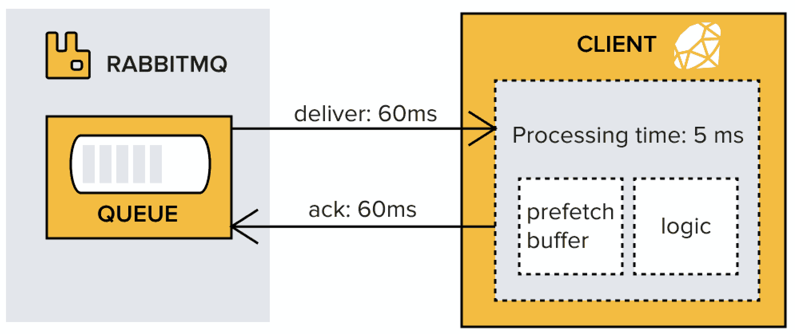
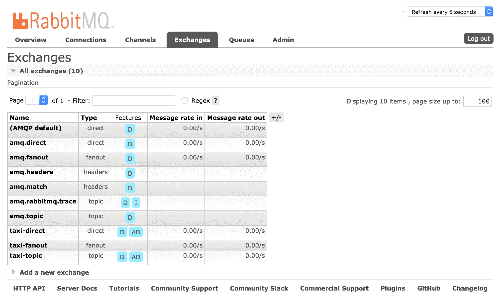

# 第三章：向多个出租车司机发送消息

第二章，*创建出租车应用程序*，包含了如何连接到并从 RabbitMQ 接收消息的信息。本章演示了设置预取值，该值指定同时发送给消费者的消息数量。它还涵盖了消费者可以手动确认消息或接收无需确认的消息，前者允许零消息损失的设计。

**完整汽车**（**CC**）团队请求一个新功能，因为后台希望能够一次性向所有出租车发送信息消息。这是一个介绍扇出交换的绝佳机会，该交换将消息路由到所有绑定到它们的队列，而不考虑路由键。

本章将涵盖以下主题：

+   与通道和队列一起工作

+   指定消费者预取计数

+   确认消息

+   向所有队列发布

# 技术要求

本章的代码文件可以在 GitHub 上找到，网址为[`github.com/PacktPublishing/RabbitMQ-Essentials-Second-Edition/tree/master/Chapter03`](https://github.com/PacktPublishing/RabbitMQ-Essentials-Second-Edition/tree/master/Chapter03)。

# 与通道和队列一起工作

CC 的驱动程序和客户正在享受在*第二章*，*创建出租车应用程序*中推出的**请求出租车**功能。首先，解释了向直接交换发布客户订购单辆出租车的消息，然后提供了实现主题交换的说明，客户在订购具有特定要求的出租车时使用该交换。在这两种情况下，消费者绑定到用于消费特定队列的通道。如果该通道关闭，消费者将停止接收消息。因为通道不能重新打开，必须从头开始创建，所以如果出现任何问题，必须重新建立通道及其消费。

让我们回顾一下关于 RabbitMQ 中消费者和队列的一些重要点：

+   队列可以有多个消费者（除非使用了独占标签）。

+   每个通道可以有多个消费者。

+   每个消费者都会使用服务器资源，因此最好确保不要使用过多的消费者。

+   通道是全双工的，这意味着一个通道可以用于发布和消费消息。

RabbitMQ 代理可以处理的通道或消费者数量没有逻辑限制。然而，有一些限制因素，例如可用内存、代理 CPU 功率和网络带宽。

由于每个通道都会动员内存并消耗 CPU 功率，因此在某些环境中可能需要考虑限制通道或消费者的数量。管理员可以通过使用`channel_max`参数来配置每个连接的最大通道数。

现在是时候探讨如何通过设置预取计数来最大限度地利用消费者了。

# 指定消费者预取计数

可以通过**预取**计数值来指定同时发送给消费者的消息数量。预取计数值用于尽可能多地从消费者那里获取信息。

如果预取计数太小，可能会对 RabbitMQ 的性能产生负面影响，因为平台通常在等待发送更多消息的权限。以下图表显示了一个长时间空闲的示例。示例中预取设置为 1，这意味着 RabbitMQ 将在消息交付、处理和确认完成后才会发送下一条消息。

在示例中，处理时间仅为 5 毫秒，往返时间为 125 毫秒（60 毫秒 + 60 毫秒 + 5 毫秒）：



图 3.1：往返时间为 125 毫秒，处理时间仅为 5 毫秒

较大的预取计数会使 RabbitMQ 从单个队列向单个消费者发送许多消息。如果所有消息都发送给单个消费者，它可能会超负荷工作，并使其他消费者处于空闲状态。以下图表显示了消费者在接收大量消息的同时，其他消费者处于空闲状态：


图 3.2：消费者处于空闲状态

在*第二章*，*创建出租车应用程序*中，使用 Ruby 创建了一个连接、通道和消费者。以下代码块展示了如何在 Ruby 中配置预取值：

```java
require "bunny"
connection = Bunny.new ENV["RABBITMQ_URI"]

connection.start
channel = connection.create_channel 
channel.prefetch(1)
```

注意，示例显示了单个 `(1)` 位置的预取值。这意味着只有一条消息会被发送给消费者，直到消费者对其进行**确认/拒绝确认**。默认的 RabbitMQ 预取设置提供了无限缓冲区，以便尽可能多地发送给准备接受消息的消费者。在消费者端，客户端库会缓存消息直到处理完毕。预取设置限制了客户端在确认之前能够接收的消息数量，使它们对其他消费者不可见，并从队列中移除。

RabbitMQ 支持基于通道级别、基于消息的预取计数，而不是基于连接或字节大小的预取。

接下来，我们将探讨如何设置正确的预取值。

## 设置正确的预取值

在一个或几个快速处理消息的消费者场景中，建议一次性预取许多消息，以使客户端尽可能忙碌。可以通过将总往返时间除以每条消息的处理时间来得到估计的预取值——如果处理时间保持不变且网络行为稳定。

在有多个消费者且处理时间较短的情况下，建议使用较低的预取值。如果预取值设置得太低，消费者大部分时间都会处于空闲状态，等待消息的到来。另一方面，如果预取值过高，一个消费者可能会非常忙碌，而其他消费者则处于空闲状态。

一个典型的错误是允许无限制的预取，其中一个客户端接收所有消息，导致高内存消耗和崩溃，这会导致所有消息重新投递。

在有多个消费者和/或较长的消息处理时间的情况下，建议将预取值设置为 1（1），以均匀地将消息分配给所有消费者。

如果客户端设置为自动确认消息，预取设置将没有效果。

如*第二章*中所述，*创建出租车应用程序*，消费者可以向代理确认消息的投递。现在是时候探讨如何实现这一点了。

# 确认消息

在代理和消费者之间传输的消息可能会在连接失败的情况下丢失，并且重要消息可能需要重新传输。确认让服务器和客户端知道何时重新传输消息。

确认消息投递有两种可能的方式——一旦消费者收到消息（自动确认，auto-ack），以及当消费者发送回确认（显式/手动确认）。在需要高消息速度、连接可靠且丢失消息不是问题的情况下，最好使用自动确认。

与自动确认相比，在消息上使用手动确认可能会对系统性能产生影响。如果目标是快速吞吐量，应禁用手动确认，并改用自动确认。

在 CC 的情况下，消息丢失的风险是不可接受的，因此前面的代码已被修改为将确认设置为`手动`，从而可以确定何时确认消息：

```java
queue.subscribe(block: true, manual_ack: true) 
```

消息在完全处理完毕后也必须进行确认：

```java
channel.acknowledge(delivery_info.delivery_tag, false)
```

如所示，手动确认的方法需要两个参数——第一个是`投递标签`，第二个在需要同时确认多个消息时是必需的。投递标签是服务器用于标识投递的通道特定数字。消费者必须在接收消息的同一通道上确认消息至关重要，因为如果不这样做，将会引发错误。

修改代码并运行应用程序后，ack 列的比率显示为非零。这是因为现在使用了手动确认，并且 RabbitMQ 客户端现在通过有线向代理发送 ack 消息。这会在带宽使用和总体性能方面产生成本；然而，如果优先考虑的是确保消息处理成功而不是速度，这是完全可以接受的。

如果存在消息处理可能失败且代理最终需要重新投递的风险，请使用手动确认。除非消息被拒绝或通道关闭，否则未确认消息的重传不会立即发生。

CC 与 RabbitMQ 的旅程变得越来越激动人心，这使得团队请求一个新功能，可以直接向所有出租车司机发送重要信息。让我们看看如何实现这个新功能！

# 发布到所有队列

拿到新的功能请求后，CC 编程团队提出了以下图中所示的新整体消息架构。后台应用将连接到 RabbitMQ，以便向所有出租车司机发布信息消息：


图 3.3：架构中的后台应用

为了推广这个功能，一种方法可能是使用已经存在的主题消息并创建一个所有司机都会订阅的特殊主题。然而，AMQP 协议提供了一个更干净、更简单的方法——fanout 交换。

## Fanout 交换

Fanout 交换接收所有传入的消息并将它们发送到所有绑定到它的队列。一个易于理解的例子是当消息需要在许多参与者之间传播时，例如在聊天中（然而，对于纯聊天应用可能还有更好的选择）。

其他例子包括以下内容：

+   从体育新闻到移动客户端的得分板或排行榜更新，或其他全球事件

+   在分布式系统中广播各种状态和配置更新

如以下图所示，fanout 交换将接收到的每个消息的副本路由到所有绑定到它的队列。这种模式与 CC 在新功能中追求的公共广播行为完美匹配，即向所有司机发送单个消息的选项：


图 3.4：fanout 交换路由到所有绑定队列

是时候将 fanout 交换添加到 CC 的应用中了。

## 绑定到 fanout

后台应该能够向所有出租车司机发布单个消息。这条消息可以包括当前的交通信息或晚上将发生的派对信息。因为这种新的广播系统将很少使用，CC 团队对高效连接管理的关注不如对主应用那么大。事实上，对于 fanout 交换的每次交互，连接和断开连接都是可以的，因为如果 RabbitMQ 代理出现暂时性问题，后台应用的重试最终会成功。

要开始在后台使用新的 fanout 交换，必须执行两个步骤：首先，在应用启动时声明 fanout 交换，然后当用户登录时将队列绑定到它。

以下示例中的第五个数字显示了添加到后台服务以在此新交换机上发布消息的代码：

```java
# 1\. Require client library
require "bunny"

# 2\. Read RABBITMQ_URI from ENV
connection = Bunny.new ENV["RABBITMQ_URI"]

# 3\. Communication session with RabbitMQ
connection.start
channel = connection.create_channel

# 4\. Declare queues for taxis
queue1 = channel.queue("taxi-inbox.1", durable: true)

queue2 = channel.queue("taxi-inbox.2", durable: true)

# 5\. Declare a fanout exchange
exchange = channel.fanout("taxi-fanout")

# 6\. Bind the queue 
queue1.bind(exchange, routing_key: "")
queue2.bind(exchange, routing_key: "")

# 7\. Publish a message
exchange.publish("Hello everybody! This is an information message from the crew!", key: "")

# 8\. Close the connection
connection.close 
```

这段代码中的逻辑应该感觉熟悉。在绑定队列时，使用空字符串作为路由键。这个值并不真正重要，因为扇出交换机不关心路由键。

注意，`exchange` 在使用之前被声明。这避免了依赖于交换机的隐式存在。如果不这样做，就意味着主应用程序必须运行一次来创建交换机，然后后台服务才能使用它。由于交换机声明是幂等的，它可以在任何时候声明。

特别注意可能使用不同默认值的 AMQP 客户端库；最好是明确指定所有值。

由于出租车收件箱队列仅包括信息消息，因此不使用与直接和主题交换示例中相同的队列。相反，声明了两个新的队列（`taxi-inbox.1` 和 `taxi-inbox.2`），并将它们绑定到交换机上。

除非有强有力的保证交换机或队列将预先存在，否则假设它不存在并声明它。安全总是比后悔好，尤其是在 AMQP 鼓励这样做并提供必要的手段时。

在此代码到位后，后台应用程序现在可以向所有司机发送公共信息消息。这是一个巨大的成功，再次强化了 CC 部署 RabbitMQ 并在此基础上构建的决定。现在，让我们运行应用程序。

## 运行应用程序

在运行应用程序时没有值得注意的特别之处；来自后台的消息成功流向司机的收件箱队列，唯一可见的变化是新建的司机扇出交换机。

这在以下屏幕截图所示的管理控制台中是可见的：



图 3.5：用户队列的扇出交换机在管理控制台中可见

在这一点上，查看任何特定队列的绑定是有趣的。为此，点击“队列”选项卡，然后向下滚动并点击“绑定”以显示隐藏的窗口。

这将显示以下截图中的内容，其中每个队列都有多个绑定——一个用于用户到出租车消息功能，一个用于主题消息，最后一个用于公共广播功能：


图 3.6：每个出租车队列有多个绑定

在结束之前，让我们暂停一下，享受一下现在有一个成功跨平台出租车请求集成的现实。对于在消息系统方面有一点经验的人来说，这可能并不重要；然而，这简直是一个小小的奇迹。多亏了 AMQP 和 RabbitMQ，消息代理可以被任何其他基于 AMQP 的消息代理所取代，并且可以在任何选择的编程语言中添加更多服务。

# 摘要

本章讨论了消费者的预取和手动确认。介绍了 fanout 交换，以便能够向所有活跃队列广播单个消息。接下来，CC 对其 RabbitMQ 系统有新的计划——他们希望能够以平稳的方式清理旧消息并调整消息投递。他们还希望能够从后台服务向个别司机发送消息。

继续阅读下一章，了解 CC 正在做什么！
