# 第二章. 保护网络服务的重要性

看你；你已经到达了第二章；恭喜！这一章非常重要，因为它与软件中隐含的一个概念有关，那就是**安全**。这一点非常重要，因为软件被公司和像我们这样的人使用。有时，我们通过软件分享非常重要的机密信息，这就是为什么这个话题对每个人来说都如此重要。

在本章中，我们将向您介绍与计算机系统安全管理相关的基本方面。

我们将探索和实施不同的安全机制及其可用场景。

此外，你还将学习如何使用协议分析器。这将使我们能够展示攻击是如何进行的，并确定当攻击达到目标时，即在我们的信息中，这种攻击的影响。你还将能够想象出更多在 Web 服务中实施安全性的选项。

因为一切都需要实践，你将通过一个简单的代码示例来学习身份验证和授权之间的区别。准备好一个有趣且实用的主题。

本章我们将涵盖以下内容：

+   理解安全管理的重要性

+   探索和实施不同的安全机制

+   使用协议分析器截获请求

+   理解身份验证和授权之间的区别

# 安全的重要性

安全管理是设计应用程序时需要考虑的主要方面之一。

无论怎样，组织的功能和信息都不能没有任何限制地暴露给所有用户。考虑一下人力资源管理系统的情况，它可以让你查询员工的工资，例如：如果公司经理需要知道他们员工之一的工资，这并不是什么重要的事情。然而，在同样的背景下，想象一下，如果其中一名员工想知道他们同事的工资；如果对这个信息的访问是完全开放的，这可能会在薪酬不同的员工之间产生问题。

一个更加关键的例子可能是银行 XYZ 在客户或第三方通过 ATM 向其账户存款时，增加银行余额的情况。IT 经理设想这种功能可能会很常见，并决定将其作为一项网络服务来实现。目前，这项功能仅限于使用该网络服务的应用程序登录的银行用户。假设 IT 经理对未来的愿景成真，现在这项功能需要从 ATM 实现；迅速提出这一需求表明这种功能已经实现，并且可以通过调用网络服务来使用。到目前为止，可能没有安全漏洞，因为 ATM 很可能有一个控制系统来控制访问，因此操作系统对网络服务功能的访问也是间接控制的。

现在，假设公司 ABC 希望有一种类似的功能，通过向其员工的银行账户增加一个*x*金额来认可他们对公司的某种贡献。网络服务的功能会发生什么变化？你认为你还能再次信任处理其自身安全方案的应用程序来控制对其功能的访问吗？即使我们信任这个机制，如果请求被嗅探器截获怎么办？那么，任何知道如何执行请求的人都可以增加余额。当这些问题得到回答时，它们以一种相当逻辑的方式抛出。公开这些场景现在听起来相当合理，因此验证用户有权访问此功能的网络服务应该是可以信赖的，并且在这种情况下，应该被委托管理安全系统。无论是来自组织本身还是来自外部机构，都必须存在安全控制，以便公开像我们刚才概述的敏感功能。

当通过网络服务共享现有信息或功能时，众所周知，我们并不依赖于编程语言、架构或系统平台来交互。这给了我们灵活性，并使我们免于重写现有功能。进一步来说，我们应该理解这些特性对数据机密性有影响，因为我们将要与实体或系统共享信息和/或功能。这样，我们可以实现业务目标，并肯定防止入侵者读取我们的信息；或者更糟糕的是，未经授权的第三方能够访问我们服务公开的功能。因此，对这些功能的访问必须严格分析，并且我们公开的服务必须得到正确保障。

# 安全管理选项

Java 提供了一些安全管理选项。目前，我们将解释其中的一些，并演示如何实现它们。所有认证方法实际上都是基于从客户端到服务器的凭证传递。有几种方法可以执行此操作，它们包括：

+   基本认证

+   摘要认证

+   客户端证书认证

+   使用 API 密钥

使用 Java 构建的应用程序中的安全管理，包括具有 RESTful Web 服务的应用程序，始终依赖于 JAAS。

**Java 认证和授权服务**（**JAAS**）是 Java 平台企业版的一部分的框架。因此，它是处理 Java 应用程序安全性的默认标准；它允许你实现授权，并允许对应用程序进行认证控制，以保护属于应用程序的资源。如果你想了解更多关于 JAAS 的信息，你可以查看以下链接：

[`docs.oracle.com/javase/7/docs/technotes/guides/security/jaas/tutorials/GeneralAcnOnly.html`](http://docs.oracle.com/javase/7/docs/technotes/guides/security/jaas/tutorials/GeneralAcnOnly.html)

如果你不想使用 JAAS，当然始终可以创建自己的实现来处理安全，但这会很困难。所以，我们为什么不节省一些时间，精力和平静，通过实现这项有用的技术呢？建议尽可能使用标准实现。在我们的开发练习中，我们将使用 JAAS 进行前三种认证方法。

## 授权和认证

当你使用这些术语时，很容易混淆，但在有安全系统方法的情况下，它们有不同的含义。为了澄清这些术语，我们将在本节中解释它们。

### 认证

简而言之，这个术语指的是*你是谁*。这是通过用户的*用户名*和*密码*来识别用户的过程。当我们使用这个概念时，我们试图确保用户的身份，并验证用户声称的身份。此外，它与用户拥有的访问权限无关。

安全研究已经指定了一个应该验证的因素列表，以实现积极的认证。这个列表包含三个元素，其中使用其中两个是非常常见的，但最好我们使用所有这些。以下元素如下：

+   **知识因素**：这个元素意味着用户*知道*的东西，例如，密码，通行短语或个人识别码（PIN）。另一个例子是挑战响应，用户必须回答一个问题，软件令牌或作为软件令牌的手机的电话。

+   **拥有因素**：这是用户*拥有*的东西，例如，一个手环（在物理认证的情况下），身份证，安全令牌，或者内置硬件令牌的手机。

+   **内在因素**：这是用户*是*或*做*的某事，例如指纹或视网膜图案、DNA 序列、签名、面部、声音、独特的生物电信号或其他生物识别标识符。

### 授权

简而言之，这个术语指的是*你能做什么*。它是指授予用户执行或拥有某物的权限的过程。当我们谈论软件时，我们有一个系统管理员负责定义用户可以访问的系统以及使用权限（例如访问哪些文件目录、访问期限、分配的存储空间数量等等）。

授权通常被视为系统管理员设置权限的初始设置以及当用户获取访问权限时检查已设置的权限值。

## 访问控制

认证和授权的一个非常常见的用途是访问控制。一个仅应由授权用户使用的计算机系统必须尝试检测并拒绝未经授权的用户。通过持续进行认证过程以建立用户身份并具有一定程度的信心，同时授予该身份指定的权限来控制访问。让我们举一些在不同场景中涉及认证的访问控制示例，如下所示：

+   当承包商首次到达房屋进行工作时要求出示照片 ID

+   实施验证码作为验证用户是人类而不是计算机程序的一种方式

+   当使用在手机等网络设备上获得的**一次性密码**（**OTP**）作为认证密码/PIN

+   一个使用盲凭证以认证到另一个程序的计算机程序

+   当你用护照进入一个国家

+   当你登录到计算机

+   当一项服务使用确认电子邮件来验证电子邮件地址的所有权

+   使用互联网银行系统

+   当你从 ATM 机取款

有时，访问的便利性会与访问检查的严格性相权衡。例如，一笔小额交易通常不需要经过认证的人的签名作为交易授权的证明。

然而，安全专家认为，不可能绝对确定用户的身份。只能应用一套测试，如果通过，则已事先宣布为确认身份的最低标准。问题在于如何确定哪些测试足够；这取决于公司来确定这一套。

### 传输层安全性

在本节中，我们强调 TLS 的一些主要特性：

+   它的前身是**安全套接字层**（**SSL**）

+   它是一个加密协议

+   它提供互联网上的安全通信

+   它通过 X.509 证书（非对称加密）验证对方

+   它允许客户端-服务器应用程序通过网络进行通信，并防止窃听和篡改

+   TLS 通常在传输层协议之上实现。

+   它封装了特定于应用程序的协议，如 HTTP、FTP、SMTP、NNTP 和 XMPP。

+   TLS 的使用应委托给其他部门，尤其是在执行凭证、更新、删除以及任何类型的价值交易时。

+   在现代硬件上，TLS 的开销非常低，只是略微增加了延迟，但这为最终用户提供了更多的安全性。

## 通过提供用户凭证进行基本身份验证

可能，基本身份验证是所有类型应用程序中最常用的技术之一。在用户获得应用程序功能之前，会被要求输入用户名和密码。这两个信息都会被验证，以确认凭证是否正确（它们属于应用程序用户）。我们 99% 确定您至少执行过这种技术一次，可能是通过定制机制，或者如果您使用过 JEE 平台，可能通过 JAAS。这种控制被称为 **基本身份验证**。

这种安全实现的 主要问题是凭证以明文方式从客户端传播到服务器。这种方式下，任何嗅探器都可以读取通过网络发送的数据包。我们将通过一个名为 Wireshark 的工具来考虑一个示例；它是一个协议分析器，将展示这个问题。对于安装，我们可以访问链接 [`www.wireshark.org/download.html`](http://www.wireshark.org/download.html)。

安装相当简单（一路点击 **下一步**）。因此，我们不会展示这些步骤的截图。

现在，我们将修改来自 第一章，*设置环境* 的项目，其中用户尝试调用 Web 服务的任何功能。用户将被要求输入用户名和密码；一旦这些信息得到验证，用户将能够访问 Web 服务的功能。

为了有一个可工作的示例，让我们启动我们的应用程序服务器 JBoss AS 7；然后，转到 `bin` 目录并执行文件 `add-user.bat`（UNIX 用户的 `.sh` 文件）。最后，我们将创建一个新用户，如下所示：

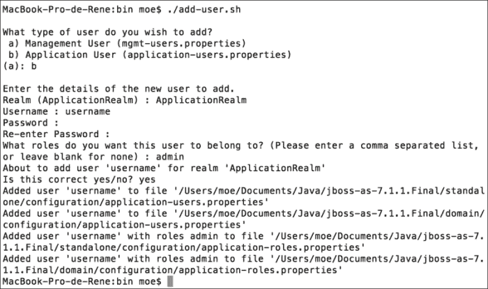

这里最重要的是，您应该在第一个问题中选择 `应用程序用户` 并为其分配一个 `管理员` 角色。这将与 `web.xml` 文件中定义的信息相匹配，这将在我们实现应用程序内的安全措施时进行解释。结果，我们将在 `JBOSS_HOME/standalone/configuration/application - users.properties` 文件中有一个新用户。

JBoss 已经设置了一个默认的安全域，称为`other`；此域使用我们之前提到的文件中存储的信息进行身份验证。现在，我们将配置应用程序在`resteasy-examples`项目的`WEB-INF`文件夹内使用此安全域。让我们创建一个名为`jboss-web.xml`的文件，其内容如下：

```java
<?xml version="1.0" encoding="UTF-8"?>
<jboss-web>
  <security-domain>other</security-domain>
</jboss-web>
```

好的，让我们配置`web.xml`文件以聚合安全约束。在下面的代码块中，您将看到需要加粗的内容：

```java
<?xml version="1.0" encoding="UTF-8"?>
<web-app version="3.0" 

  xsi:schemaLocation="http://java.sun.com/xml/ns/javaee 
  http://java.sun.com/xml/ns/javaee/web-app_3_0.xsd">
 <!-- Roles -->
 <security-role>
 <description>Any rol </description>
 <role-name>*</role-name>
 </security-role>

 <!-- Resource / Role Mapping -->
 <security-constraint>
 <display-name>Area secured</display-name>
 <web-resource-collection>
 <web-resource-name>protected_resources</web-resource-name>
 <url-pattern>/services/*</url-pattern>
 <http-method>GET</http-method>
 <http-method>POST</http-method>
 </web-resource-collection>
 <auth-constraint>
 <description>User with any role</description>
 <role-name>*</role-name>
 </auth-constraint>
 </security-constraint>

 <login-config>
 <auth-method>BASIC</auth-method>
 </login-config>
</web-app>
```

从终端，让我们转到`resteasy-examples`项目的家目录并执行`mvn jboss-as:redeploy`。现在，我们将像在第一章中那样测试我们的 Web 服务，使用 SOAP UI。我们将使用`POST`方法向 URL`http://localhost:8080/resteasy-examples/services/person/`发送以下 XML：

```java
<person><name>Rene</name><lastname>Enriquez</lastname></person>
```

我们获得以下响应：

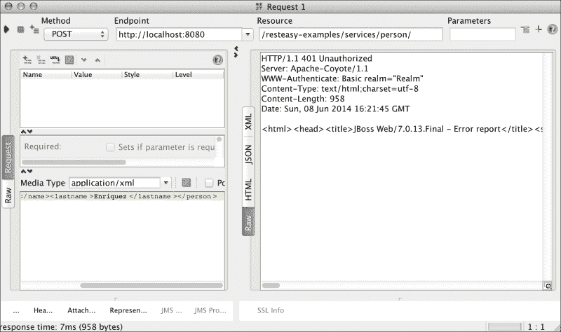

SOAP UI 显示我们 HTTP 401 错误，这意味着请求未被授权。这是因为我们没有向服务器提供凭证就执行了请求。为了做到这一点，我们必须点击位于 SOAP UI 左下角的(**…**)按钮，并输入我们刚刚创建的用户凭证，如下面的截图所示：

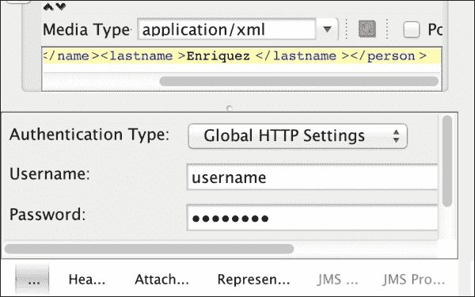

现在是时候启用我们的流量分析器了。让我们启动 Wireshark 并将其设置为分析环回地址内的流量。从**主**菜单导航到**捕获** | **接口**。

选择**lo0**选项，如下面的截图所示，然后点击**开始**按钮。这样，所有通过地址 127.0.0.1 或其等效的 localhost 的流量都将被拦截以供我们分析。

此外，在`Filter`字段中，我们只需输入`http`以拦截 HTTP 请求和响应，如下面的截图所示：

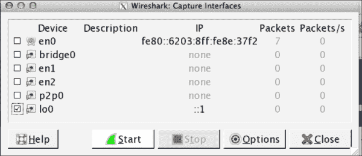

看看下面的截图：

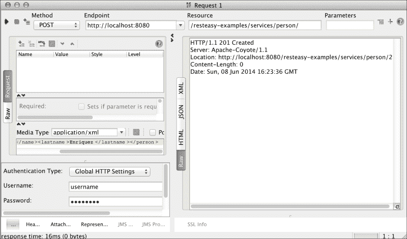

完成这些操作后，我们将从 SOAP UI 执行请求操作。再次，SOAP UI 显示 HTTP 201 消息；这次，请求被成功处理。您可以在 Wireshark 中看到以下信息列：

+   **否**：此列以独特的方式标识请求或响应

+   **时间**：此列标识执行操作的时间

+   **源**：此列标识请求/响应的起始地址

+   **目标**：此列标识执行 HTTP 请求/响应的目标 IP 地址

+   **协议**：此列标识执行请求/响应的协议

+   **长度**：此列标识请求/响应的长度

+   **信息**：此列标识与请求/响应相关的信息

现在，是时候在 Wireshark 上观察信息流量了，如下所示：

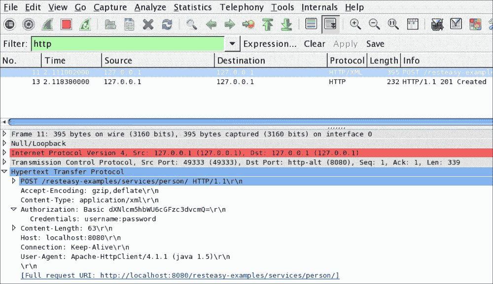

注意 Wireshark 如何显示我们正在使用 HTTP 协议和 XML 字符串（协议）对目标地址`127.0.0.1`（目的地）执行 POST（信息）操作。此外，您还可以读取用户名和密码。因此，这种方法对于安全实现来说并不非常安全，因为任何人都可以访问这些信息并执行钓鱼攻击。

您可以在此 URL 找到本章的源代码：

[`github.com/restful-java-web-services-security/source-code/tree/master/chapter02/basic-authentication`](https://github.com/restful-java-web-services-security/source-code/tree/master/chapter02/basic-authentication)

## 摘要访问认证

这种认证方法使用散列函数在将密码发送到服务器之前加密用户输入的密码。这显然比基本认证方法更安全，在基本认证方法中，用户的密码以明文形式传输，容易被拦截者读取。为了克服这些缺点，摘要 MD5 认证对用户名、应用安全域和密码的值组合应用一个函数。结果，我们得到一个几乎无法被入侵者解读的加密字符串。

为了更好地理解这个过程，我们将向您展示一个从维基百科提取的简单解释。

### 带有解释的示例

*以下示例最初在 RFC 2617 中给出，此处扩展以显示每个请求和响应预期的完整文本。请注意，此处仅涵盖`auth`（认证）保护代码的质量——在撰写本文时，只有 Opera 和 Konqueror 网络浏览器已知支持`auth-int`（具有完整性保护的认证）。尽管规范提到了 HTTP 版本 1.1，但该方案可以成功添加到版本 1.0 服务器，如下所示。*

*这种典型的事务包括以下步骤：*

*客户端请求需要认证的页面，但没有提供用户名和密码。通常，这是因为用户只是输入了地址或跟随了一个链接到该页面。*

*服务器以 401“未经授权”的响应代码响应，提供认证域和一个随机生成的、一次性使用的值，称为`nonce`。*

*在此阶段，浏览器将向用户展示认证域（通常是正在访问的计算机或系统的描述）并提示输入用户名和密码。用户可能会选择在此处取消。*

*一旦提供了用户名和密码，客户端将重新发送相同的请求，但添加一个包含响应代码的认证头。*

*在此示例中，服务器接受认证并返回页面。如果用户名无效和/或密码不正确，服务器可能会返回 *401* 响应代码，客户端将再次提示用户。*

### 注意

客户端可能已经拥有所需的用户名和密码，无需再次提示用户，例如，如果它们之前已被网络浏览器存储。

如果你想了解更多关于此机制的信息，你可以通过以下链接访问维基百科上的完整文章 [`en.wikipedia.org/wiki/Digest_access_authentication`](http://en.wikipedia.org/wiki/Digest_access_authentication)。

你还可以阅读规范 RFC 2617，它可在 [`www.ietf.org/rfc/rfc2617.txt`](https://www.ietf.org/rfc/rfc2617.txt) 找到。

现在，让我们在我们的示例中测试此机制。

为了启动，我们必须确保环境变量 `JAVA_HOME` 已经设置并添加到 `PATH` 变量中。因此，你可以在终端中键入以下命令来确认：

```java
java -version

```

这将显示以下截图中的信息：

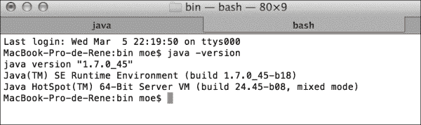

此命令显示了我们的电脑上安装的 Java 版本。如果你获得的是错误信息而不是之前的输出，你应该创建环境变量 `JAVA_HOME`，将其添加到 `PATH` 变量中，并重复验证。

现在，为了执行我们之前解释的内容，我们需要为我们的示例用户生成一个密码。我们必须使用我们之前讨论的参数——用户名、域和密码来生成密码。让我们从终端进入 `JBOSS_HOME/modules/org/picketbox/main/` 目录，并键入以下命令：

`java -cp picketbox-4.0.7.Final.jar org.jboss.security.auth.callback.RFC2617Digest username MyRealmName password`

我们将获得以下结果：

```java
RFC2617 A1 hash: 8355c2bc1aab3025c8522bd53639c168

```

通过这个过程，我们获得加密的密码，并将其用于我们的密码存储文件（`JBOSS_HOME/standalone/configuration/application-users.properties` 文件）。我们必须替换文件中的密码，它将被用于用户 `username`。我们必须替换它，因为旧密码不包含应用程序的域名称信息。作为替代，你可以使用 `add-user.sh` 文件创建新用户；你只需在请求时提供域信息即可。

为了使我们的应用工作，我们只需要在 `web.xml` 文件中做一点修改。我们必须修改 `auth-method` 标签，将值 `FORM` 更改为 `DIGEST`，并按以下方式设置应用程序域名称：

```java
<login-config>

  <auth-method>DIGEST</auth-method>

  <realm-name>MyRealmName</realm-name>  
</login-config>
```

现在，让我们在 JBoss 中创建一个新的安全域，以便我们可以管理 `DIGEST` 认证机制。在 `JBOSS_HOME/standalone/configuration/standalone.xml` 文件的 `<security-domains>` 部分，让我们添加以下条目：

```java
<security-domain name="domainDigest" cache-type="default"> <authentication>
    <login-module code="UsersRoles" flag="required"> <module-option name="usersProperties" value="${jboss.server.config.dir}/application-users.properties"/> <module-option name="rolesProperties" value="${jboss.server.config.dir}/application-roles.properties"/> <module-option name="hashAlgorithm" value="MD5"/> <module-option name="hashEncoding" value="RFC2617"/>
      <module-option name="hashUserPassword" value="false"/>
      <module-option name="hashStorePassword" value="true"/>
      <module-option name="passwordIsA1Hash" value="true"/> 
      <module-option name="storeDigestCallback" value="org.jboss.security.auth.callback.RFC2617Digest"/> </login-module>
  </authentication>
</security-domain>
```

最后，在应用中，请将文件 `jboss-web.xml` 中的安全域名进行更改，如下所示：

```java
<?xml version="1.0" encoding="UTF-8"?>
<jboss-web>
  <security-domain>java:/jaas/domainDigest</security-domain>
</jboss-web>
```

我们将在`web.xml`文件中将认证方法从`BASIC`更改为`DIGEST`。同时，我们将输入安全域的名称。所有这些更改都必须在以下方式中应用于`login-config`标签：

```java
<login-config>
  <auth-method>DIGEST</auth-method>
  <realm-name>MyRealmName</realm-name
</login-config>
```

现在，重新启动应用程序服务器，并在 JBoss 上重新部署应用程序。为此，请在终端命令行中执行以下命令：

```java
mvn jboss-as:redeploy
```

让我们启用通过 Wireshark 捕获流量，并再次使用 SOAP UI 测试 Web 服务。首先，我们应该将字段`Authentication Type`从全局 HTTP 设置更改为**SPNEGO/Kerberos**。一个非常实用的技巧是告诉 SOAP UI 不要使用基本认证方法。一旦我们执行请求，Wireshark 将告诉我们以下截图中的消息：

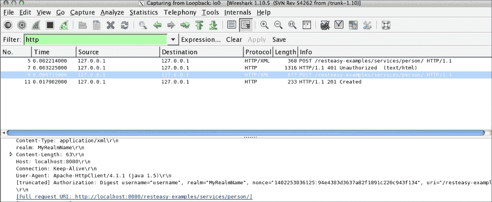

如截图所示，让我们首先确认在认证方法中执行了之前描述的所有步骤。让我们使用 Wireshark 的**No**字段进行跟踪：

在第 5 步，执行请求。

在第 7 步，服务器返回一个带有生成的`nonce`值的错误消息代码 HTTP 401。`nonce`值有助于防止重放攻击。

在第 9 步，再次执行请求。这次，包含了用于认证所需的信息，并且所有这些信息都按照我们之前描述的方式加密。

最后，在第 11 步，我们获得了表示请求已成功执行的响应。

如你所注意到的，这是一种更安全的认证方法，主要在不需要通过 TLS/SSL 加密的全传输安全开销时使用。

你可以在以下 URL 找到本章的源代码：

[`github.com/restful-java-web-services-security/source-code/tree/master/chapter02/digest-authentication`](https://github.com/restful-java-web-services-security/source-code/tree/master/chapter02/digest-authentication)

## 证书认证

这是一个通过证书在服务器和客户端之间建立信任协议的机制。它们必须由一个为确保提供的用于认证的证书是合法的机构签署，这被称为 CA。

让我们想象一个使用这种安全机制的程序。当客户端尝试访问受保护资源时，它不是提供用户名或密码，而是向服务器展示证书。这是包含用于认证的用户信息的证书；换句话说，除了唯一的私钥和公钥对之外，还有凭证。服务器通过 CA 确定用户是否合法。然后，它验证用户是否有权访问资源。此外，你应该知道，这种认证机制必须使用 HTTPS 作为通信协议，因为我们没有安全的通道，任何人都可以窃取客户端的身份。

现在，我们将展示如何在我们的示例中完成这项操作。

在我们的示例中，我们将自己变成 CA；它们通常是像 VERISIGN 这样的公司。然而，由于我们想为您节省费用，我们将这样做。我们首先需要为 CA（即我们自己）生成一个密钥，并将为应用程序服务器和用户签名证书。由于本书的目的是解释这种方法是如何工作的，而不是如何生成证书，因此我们不会包括生成证书所需的所有步骤，但我们将它们包含在以下 GitHub 链接中：

[`github.com/restful-java-web-services-security/source-code/tree/master/chapter02/client-cert-authentication`](https://github.com/restful-java-web-services-security/source-code/tree/master/chapter02/client-cert-authentication)

好的，让我们开始。首先，将 `server.keystore` 和 `server.truststore` 文件复制到文件夹目录 `JBOSS_HOME/standalone/configuration/`。您可以使用以下链接从 GitHub 下载这些文件：

[`github.com/restful-java-web-services-security/source-code/tree/master/chapter02/client-cert-authentication/certificates`](https://github.com/restful-java-web-services-security/source-code/tree/master/chapter02/client-cert-authentication/certificates)

现在，正如我们之前提到的，这种安全机制要求我们的应用程序服务器使用 HTTPS 作为通信协议。因此，我们必须启用 HTTPS。让我们在 `standalone.xml` 文件中添加一个连接器；查找以下行：

```java
<connector name="http"
```

添加以下代码块：

```java
<connector name="https" protocol="HTTP/1.1" scheme="https" socket-binding="https" secure="true">
  <ssl password="changeit" 
certificate-key-file="${jboss.server.config.dir}/server.keystore" 
verify-client="want" 
ca-certificate-file="${jboss.server.config.dir}/server.truststore"/>

</connector>
```

接下来，我们添加安全域，如下所示：

```java
<security-domain name="RequireCertificateDomain">
                    <authentication>
    <login-module code="CertificateRoles" flag="required">
                            <module-option name="securityDomain" value="RequireCertificateDomain"/>
                            <module-option name="verifier" value="org.jboss.security.auth.certs.AnyCertVerifier"/>
                            <module-option name="usersProperties" value="${jboss.server.config.dir}/my-users.properties"/>
                            <module-option name="rolesProperties" value="${jboss.server.config.dir}/my-roles.properties"/>
                        </login-module>
  </authentication>
  <jsse keystore-password="changeit" keystore-url="file:${jboss.server.config.dir}/server.keystore" 
                        truststore-password="changeit" truststore-url="file:${jboss.server.config.dir}/server.truststore"/>
                </security-domain>
```

如您所见，我们需要两个文件：`my-users.properties` 和 `my-roles.properties`；这两个文件都是空的，位于 `JBOSS_HOME/standalone/configuration` 路径。

我们将在 `web.xml` 文件中按照以下方式添加 `<user-data-constraint>` 标签：

```java
<security-constraint>
...<user-data-constraint>

  <transport-guarantee>CONFIDENTIAL</transport-guarantee>
  </user-data-constraint>
</security-constraint>
```

然后，将身份验证方法更改为 `CLIENT-CERT`，如下所示：

```java
  <login-config>
    <auth-method>CLIENT-CERT</auth-method>
  </login-config>
```

最后，按照以下方式更改 `jboss-web.xml` 文件中的安全域：

```java
<?xml version="1.0" encoding="UTF-8"?>
<jboss-web>
  <security-domain>RequireCertificateDomain</security-domain>
</jboss-web>
```

现在，重新启动应用程序服务器，并使用 Maven 以下命令重新部署应用程序：

```java
mvn jboss-as:redeploy
```

为了测试这种身份验证方法，我们首先必须在 SOAP UI 中进行一些配置。首先，让我们转到安装目录，找到文件 `vmoptions.txt`，并添加以下行：

```java
-Dsun.security.ssl.allowUnsafeRenegotiation=true

```

现在，我们将更改 SOAP UI 的 SSL 设置。为此，您必须从主菜单导航到 **文件** | **首选项**。

从弹出窗口中，选择 **SSL 设置** 选项卡并输入以下截图所示的值：

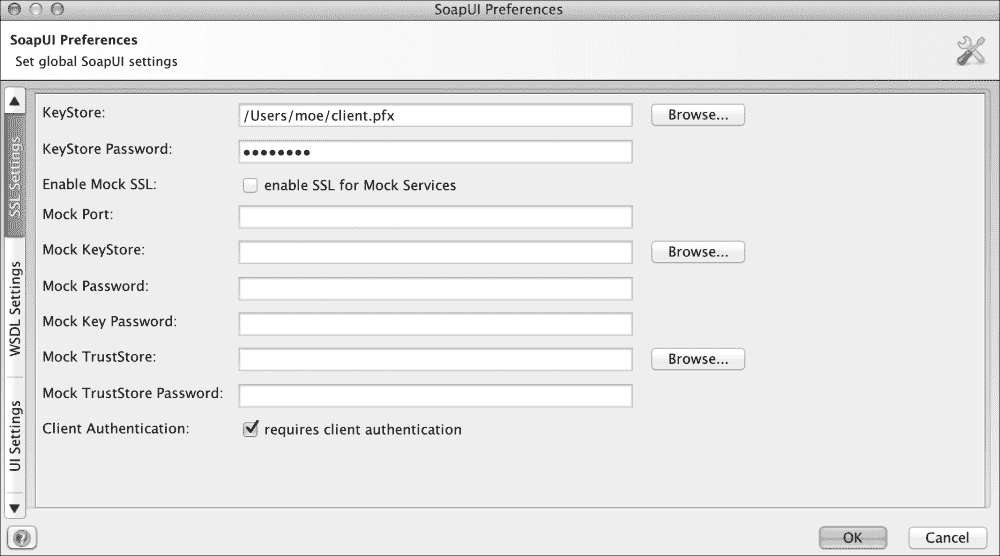

**KeyStore** 是您应该已将 `.pfx` 文件复制到的位置。请注意 **KeyStore 密码** 为 `changeit` 并检查 **需要客户端身份验证** 选项。

现在，我们将测试我们刚才所做的修改；因此，让我们启用流量分析器并再次使用 SOAP UI 执行请求。Wireshark 将显示以下截图中的信息：

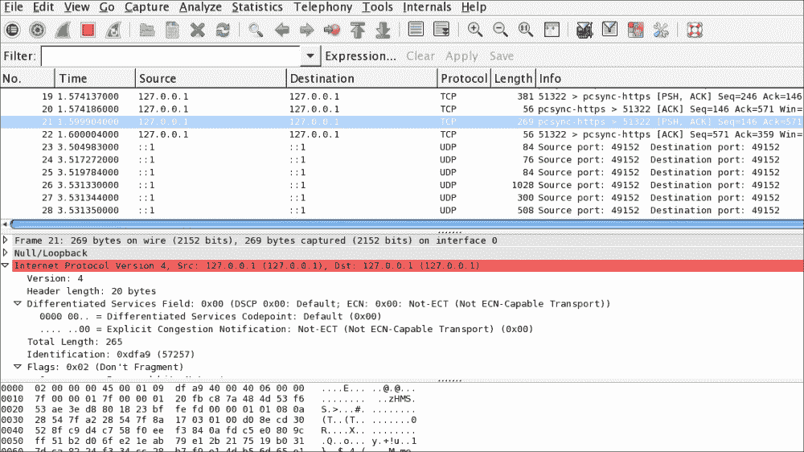

如您所见，所有信息都已加密，无法被解读。因此，如果数据包在网络中传输并被截获，信息就不会受到攻击。

您可以在以下 URL 找到本节的源代码：

[`github.com/restful-java-web-services-security/source-code/tree/master/chapter02/client-cert-authentication/resteasy-examples`](https://github.com/restful-java-web-services-security/source-code/tree/master/chapter02/client-cert-authentication/resteasy-examples)

# API 密钥

随着云计算的出现，想象将许多云中可用的应用程序集成的应用程序并不困难。现在，很容易看到应用程序是如何与 Flickr、Facebook、Twitter、Tumblr 等互动的。

为了启用这些集成，已经开发了一种新的认证机制，使用 API 密钥。这种方法主要用于我们需要从另一个应用程序进行认证，但我们不想访问另一个应用程序中托管的私有用户数据时。相反，如果您想访问这些信息，您必须使用 OAuth。如果您对此感兴趣，请不要担心，我们将在本书的后面部分研究这项神奇的技术。

我们想了解 API 密钥是如何工作的，所以让我们以 Flickr 为例。这里重要的是要理解 API 密钥是如何工作的，因为同样的概念可以应用于像 Google、Facebook 这样的公司。对于那些不熟悉 Flickr 的人来说，它是一个云应用程序，我们可以在这里存储我们的照片、图像、屏幕截图或类似文件。

要开始使用这种认证模型，我们首先获取一个 API 密钥；在我们的 Flickr 示例中，您可以使用以下链接来完成此操作：

[`www.flickr.com/services/developer/api/`](https://www.flickr.com/services/developer/api/)

当我们请求我们的 API 密钥时，我们需要输入将要创建的应用程序的名称以及我们将使用该 API 密钥的方式。一旦我们输入所需的信息并提交，Flickr 将向我们提供几个值；它们是一个秘密和一个密钥。这两个值在下面的屏幕截图中显示：

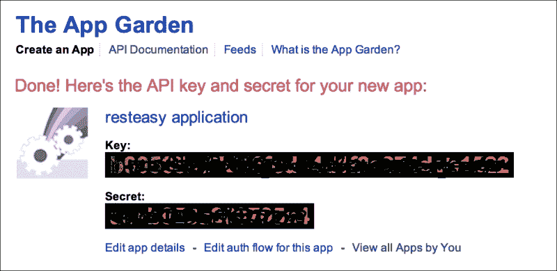

我们创建的每个应用程序都是 Flickr App Garden 的一部分。App Garden 不过是所有 Flickr 成员创建的所有应用程序的集合。

请记住，在创建 API 密钥时，我们是有意识地接受提供者的某些使用条款。这些条款清楚地说明了我们可以做什么以及不能做什么；例如，Flickr 表示：

*a. 您必须：*

*请遵守 Flickr 社区指南[www.flickr.com/guidelines.gne](http://www.flickr.com/guidelines.gne)，Flickr 的使用条款[`www.flickr.com/terms.gne`](http://www.flickr.com/terms.gne)，以及 Yahoo!服务条款[`docs.yahoo.com/info/terms/`](http://docs.yahoo.com/info/terms/)。*

*…*

*b. 您不得：*

*在所有旨在复制或尝试取代 Flickr.com 基本用户体验的应用程序中使用 Flickr API*

*…*

因此，通过要求用户接受使用条款，API 密钥提供者防止了其 API 的滥用。因此，如果有人开始不尊重协议，提供者将收回 API 密钥。Flickr 有一套大量的方法，我们可以在我们的应用程序中使用；我们将尝试其中之一来展示它们是如何工作的：

`flickr.photos.getRecent`方法列出了 Flickr 上最近发布的所有照片，我们可以按照以下方式调用它：

`https://www.flickr.com/services/rest?method=flickr.photos.getRecent&;&api+key=[your_api_key_from_flicker]`

让我们使用我们刚才生成的密钥，并使用浏览器执行以下请求：

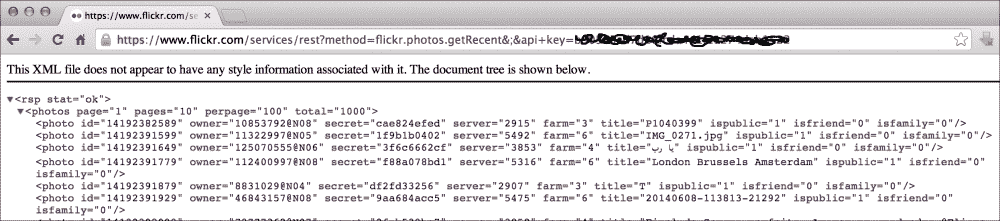

首先，注意信息是如何通过安全通道（HTTPS）传输的。然后，在收到请求后，Flickr 通过读取属于用户的 API 密钥与密钥对应的秘密密钥中的信息来验证用户。一旦这些验证成功，服务器将响应发送给客户端。因此，我们获得了包含 Flickr 上最近发布的所有照片的响应。正如你所注意到的，通过这种方式，你可以轻松地使用提供者的 API 创建应用程序。此外，提供者将允许你进行身份验证、访问公共信息，并负责跟踪使用 API 密钥所进行的 API 调用量或数量，以确保使用符合协议。

# 摘要

在本章中，我们探讨了所有可能的身份验证模型。我们将在下一章使用它们，并将它们应用到我们刚刚创建的网络服务功能中。

即使你在任何示例中遇到困难，你也可以继续到下一章。为了更好地理解，我们将一步一步、更深入地探讨我们如何利用每个可用的身份验证模型。

正如你所意识到的那样，选择正确的安全管理非常重要，否则信息会暴露，并且很容易被第三方拦截和使用。

最后，在本章中，我们回顾了身份验证和授权之间的区别。这两个概念都非常重要，在安全术语的背景下绝对不能忽视。

现在，我们将邀请你加入我们，继续确保我们的网络服务安全。
