# 第三章。使用 RESTEasy 进行安全管理

欢迎来到第三章。我们希望您正在与我们一起享受并学习。在本章中，您将更深入地参与安全管理。您还将与一些更高级的安全概念一起工作。

使用 RESTful Web 服务构建的应用程序中的安全管理可能比我们在上一章中审查的更细粒度。如果我们围绕认证和授权主题思考，我们描述了前者；授权被搁置了。这是因为我们想在本章中缓慢且非常详细地处理它。

本章涵盖的主题包括：

+   在应用程序中实现与认证和授权相关的安全限制

+   实现细粒度安全

+   使用注解来获得对资源访问控制的更多粒度

# 细粒度和粗粒度安全

我们可以管理的有两个级别的安全：**细粒度**和**粗粒度**。

当我们在安全性的上下文中提到粗粒度一词时，我们指的是通常在应用程序中处理在较高层次的安全系统。例如，在第二章《确保 Web 服务的重要性》中，任何角色的用户都可以使用服务，这是一个完美的粗粒度示例，因为当安全限制允许用户访问而无需担心角色或更具体的认证用户特征时，就会使用粗粒度选项。这意味着为了让系统允许访问功能，我们只需验证用户身份；换句话说，它验证了用户。然而，在现实生活中，仅仅有一个认证的应用程序用户是不够的。还必须确保用户有权使用某些功能。我们可以通过细粒度控制来实现这一点。验证用户分配的权限以访问功能意味着使用授权控制。

为了以实际的方式展示这些概念，我们将使用上一章中创建的应用程序。您可以在以下 URL 下访问源代码，位于基本认证部分：

[`github.com/restful-java-web-services-security/source-code/tree/master/chapter02/basic-authentication`](https://github.com/restful-java-web-services-security/source-code/tree/master/chapter02/basic-authentication)

让我们开始吧；假设我们只想让具有`administrator`角色的用户能够使用我们应用程序中的功能。首先要做的事情是修改`web.xml`文件并添加以下约束。注意这些更改是如何以粗体显示的：

```java
<?xml version="1.0" encoding="UTF-8"?>
<web-app version="3.0" 

  xsi:schemaLocation="http://java.sun.com/xml/ns/javaee 
  http://java.sun.com/xml/ns/javaee/web-app_3_0.xsd">

  <security-role>
 <description>Application roles</description>
 <role-name>administrator</role-name>
  </security-role>
  <security-constraint>
    <display-name>Area secured</display-name>
    <web-resource-collection>
      <web-resource-name>protected_resources</web-resource-name>
      <url-pattern>/services/*</url-pattern>
    </web-resource-collection>
    <auth-constraint>
 <description>User with administrator role</description>
 <role-name>administrator</role-name>
    </auth-constraint>
  </security-constraint>
  <login-config>
    <auth-method>BASIC</auth-method>
  </login-config>
</web-app>
```

现在，让我们尝试使用我们刚刚创建的用户（`username`）发出请求。当您收到`403 Forbidden`错误时，您可能会感到惊讶。

注意，如果您尝试使用无效凭据发出请求，您将收到错误 `HTTP/1.1 401 未授权`。错误非常明确；访问未授权。这意味着我们发送了无效凭据，因此用户无法进行身份验证。我们刚刚收到的错误是 `HTTP/1.1 403 禁止访问`，这表明用户已成功登录，但没有权限使用他们所需的功能。这将在以下屏幕截图中演示：

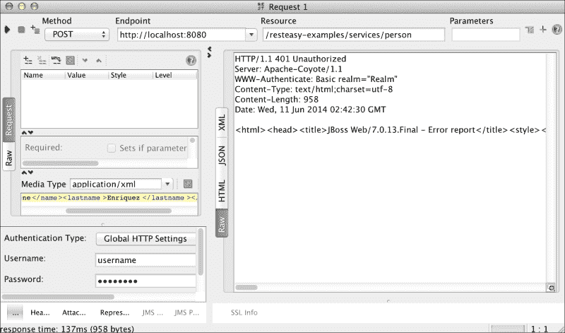

现在，让我们使用 `JBOSS_HOME/standalone/bin/adduser.sh` 文件创建一个新的用户，并赋予其 `administrator` 角色。按照以下屏幕截图所示输入所需信息：

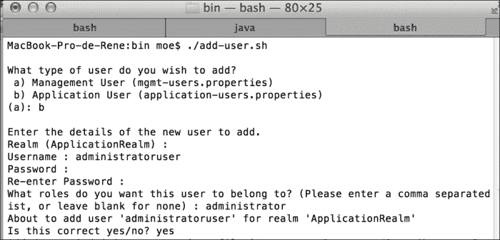

当我们在 SoapUI 中更改凭据时，请求的结果是成功的，如下面的屏幕截图所示：

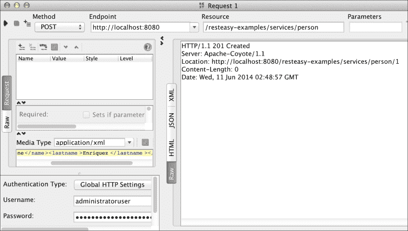

如您所见，我们使用了一个额外的控制，其中我们仅限制了具有分配给他们的 `administrator` 角色的已认证用户；他们能够使用 Web 服务功能。在管理现实世界应用程序的安全性时，使用这类控制非常常见。由于我们已经实现了更详细的控制级别，平台为我们提供了实施更细粒度控制的机会，例如我们现在将要看到的。

## 保护 HTTP 方法

JAAS 的一项好处是我们甚至可以在 HTTP 方法的级别上控制。因此，我们可以实施安全控制，仅允许具有特定角色的用户使用某些方法，以方便我们；例如，一个角色用于保存信息，另一个用于删除信息，其他角色用于读取信息，等等。

要实现这类控制，我们有必要了解应用程序中 HTTP 方法的功能。在我们的例子中，我们已经知道为了保存信息，应用程序始终使用 `HTTP POST` 方法。同样，当我们想要读取信息时，应用程序使用 `HTTP GET` 方法。因此，我们将修改我们的示例，以便只有具有 `administrator` 角色的用户能够使用 `savePerson` (`HTTP POST`) 方法。同时，只有具有 `reader` 角色的用户能够使用 `findById` (`HTTP GET`) 方法来读取信息。

以此为目标，我们将按如下方式修改我们的 `web.xml` 文件：

```java
<?xml version="1.0" encoding="UTF-8"?>
<web-app version="3.0" 

xsi:schemaLocation="http://java.sun.com/xml/ns/javaee 
  http://java.sun.com/xml/ns/javaee/web-app_3_0.xsd">
  <!-- Roles -->
  <security-role>
    <description>Role for save information</description>
    <role-name>administrator</role-name>
  </security-role>
  <security-role>
    <description>Role for read information</description>
    <role-name>reader</role-name>
  </security-role>

  <!-- Resource / Role Mapping -->
  <security-constraint>
    <display-name>Administrator area</display-name>
    <web-resource-collection>
  <web-resource-name>protected_resources</web-resource-name>
      <url-pattern>/services/*</url-pattern>
      <http-method>POST</http-method>
    </web-resource-collection>
    <auth-constraint>
    <description>User with administrator role</description>
      <role-name>administrator</role-name>
    </auth-constraint>
  </security-constraint>
  <security-constraint>
    <display-name>Reader area</display-name>
    <web-resource-collection>
  <web-resource-name>protected_resources</web-resource-name>
      <url-pattern>/services/*</url-pattern>
      <http-method>GET</http-method>
    </web-resource-collection>
    <auth-constraint>
      <description>User with reader role</description>
      <role-name>reader</role-name>
    </auth-constraint>
  </security-constraint>

  <login-config>
    <auth-method>BASIC</auth-method>
  </login-config>
</web-app>
```

在我们继续之前，我们必须使用 `JBOSS_HOME/standalone/bin/adduser.sh` 脚本创建一个新的用户（`readeruser`）并赋予其 `reader` 角色。

现在，让我们使用 SoapUI 测试角色及其权限。

### HTTP 方法 – POST

我们将使用没有所需权限的角色来测试 `POST` 方法。您将看到权限错误信息。

角色：Reader

当使用此角色时，此方法不允许。这将在以下屏幕截图中演示：

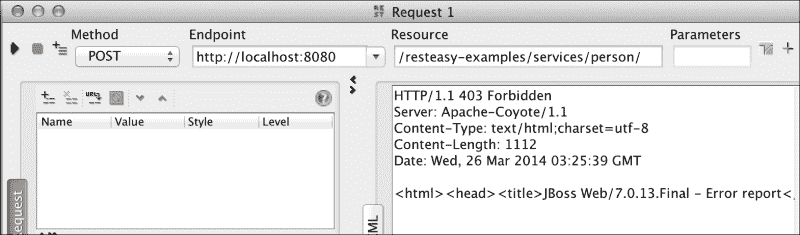

角色：管理员

使用这个角色，你可以成功执行方法。这在下述屏幕截图中有演示：

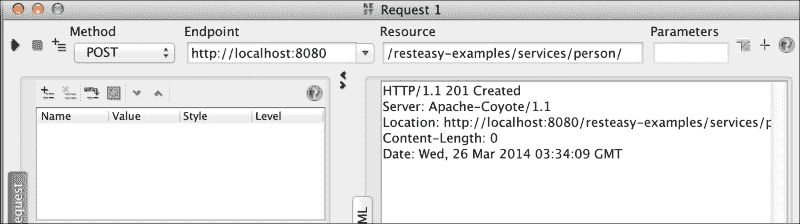

### HTTP 方法 – GET

现在，我们将使用具有使用 GET 方法所需权限的用户。使用这个角色执行应该是成功的。

角色：阅读者

现在，使用这个角色执行是成功的。这在下述屏幕截图中有演示：

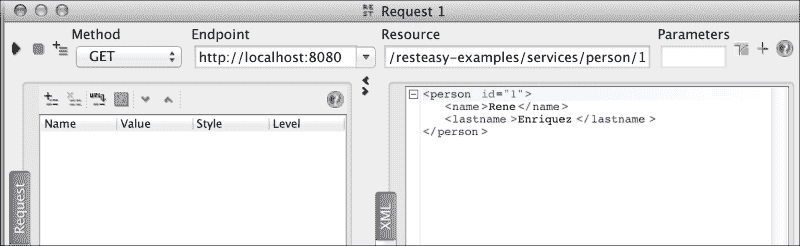

角色：管理员

管理员角色没有访问这个方法的权限。这在下述屏幕截图中有演示：

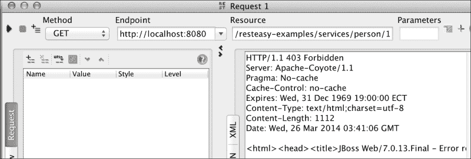

可以将相同的角色考虑用于 URL 模式。在我们的例子中，我们在`/services/*`模式上应用了限制。然而，你可以在更深的级别应用它，例如`/services/person/*`。我们的意思是，如果我们有另一个在 URL`/services/other-service/`下公开的服务，我们可以设置它，使得一个角色可以访问路径`/services/person/*`下的服务，并在路径`/services/other-service/*`下有不同的访问级别。这个例子相当简单，并被作为基本示例提供给读者。

在应用所有更改后，我们在`web.xml`文件中列出的所有方法上设置了安全。然而，我们必须问自己一个问题；那些未被包括的方法会发生什么？

OWASP（开放 Web 应用程序安全项目），一个致力于发现和修复软件中安全漏洞的非营利组织，已经就这个问题写了一篇论文，其名称如下：

*通过 HTTP 动词篡改绕过 Web 身份验证和授权：如何无意中允许攻击者完全访问你的 Web 应用程序。*

如果你想查看完整的文档，你可以通过访问以下链接来完成：

[`dl.packetstormsecurity.net/papers/web/Bypassing_VBAAC_with_HTTP_Verb_Tampering.pdf`](http://dl.packetstormsecurity.net/papers/web/Bypassing_VBAAC_with_HTTP_Verb_Tampering.pdf)

OWASP 在上述文档中所描述的是简单的。它表明，如果我们不采取某些预防措施，JEE 会在`web.xml`配置文件中暴露潜在的安全漏洞，因为文件中未列出的所有方法都可以无限制地使用。这意味着一个未在应用程序中认证的用户可以调用任何其他 HTTP 方法。

OWASP 在早先的文章中陈述了以下内容：

*不幸的是，几乎所有这种机制的实现都在一个意外和不安全的战争中运行。它们不是拒绝规则中未指定的方法，而是允许任何未列出的方法。讽刺的是，通过在规则中列出具体方法，开发者实际上允许比他们意图更多的访问。*

为了更好地理解这一点，让我们用一个类比来关注。

假设您有一个用于编写书籍的 Web 应用程序，该应用程序处理两个角色——一个用于能够编写书籍页面的作者，另一个用于只能阅读书籍并添加带注释的笔记的审阅者。现在，假设一个用户不小心得到了您应用程序的 URL。这个用户没有任何凭证可以提供，显然，用户甚至不应该能够访问应用程序。然而，OWASP 展示的问题实际上并不是做看似明显的事情，而是实际上允许具有足够权限执行任何操作（如删除）的未认证用户访问应用程序。

让我们通过一个例子来看看这个不便之处，然后我们将实施 OWASP 的建议来解决它。

让我们在 `PersonService` 类中创建一个新的方法；这次我们将使用 `web.xml` 文件中未列出的一种方法。最常用的方法之一是 `HTTP DELETE`；它的功能是使用其 ID 从内存中删除一个条目。这将把记录的 ID 作为参数放在 URL 中，因此请求的 URL 将看起来像以下这样：

`http://localhost:8080/resteasy-examples/services/person/[ID]`

方法实现应该看起来像以下这样：

```java
@DELETE
@Path("{id}")
public Response delete(@PathParam("id") int id) {
  Person person = dataInMemory.get(id);
if (person == null) {
  // There is no person with this ID
throw new WebApplicationException(Response.Status.NOT_FOUND);
  }
  dataInMemory.remove(id);
  return Response.status(Status.GONE).build();
}
```

为了测试该方法，我们首先必须通过 SoapUI 创建几个注册项，同样使用 `HTTP POST` 方法和一个如下所示的字符串：

```java
<person><name>Rene</name><lastname>Enriquez</lastname></person>
```

现在，在 SoapUI 中选择 `DELETE` 方法，移除我们用于身份验证的凭证信息，并使用其中一个项目 ID 执行请求，如下面的截图所示：

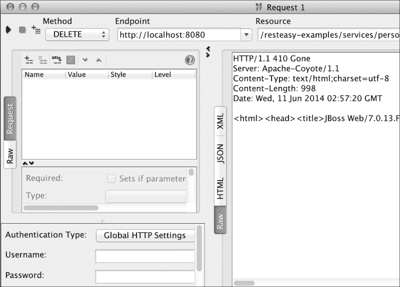

如您所见，该条目已被移除，服务器返回了消息 `HTTP/1.1 410 Gone`。这表明资源已不再可用。正如您所注意到的，当我们没有指定该方法默认应该受到保护时，它会被标记为可用。在我们的例子中，任何不需要进行身份验证的用户都可以删除我们的应用程序资源。

为了克服这个缺点，OWASP 建议在 `web.xml` 文件中添加另一个安全约束。这个新的安全约束不应该在其内部列出任何 HTTP 方法，这意味着拒绝所有 HTTP 方法的访问，如下面的代码所示：

```java
<security-constraint>
  <display-name>For any user</display-name>
  <web-resource-collection>
  <web-resource-name>protected_resources</web-resource-name>
    <url-pattern>/services/*</url-pattern>
  </web-resource-collection>
  <auth-constraint>
    <description>User with any role</description>
    <role-name>*</role-name>
  </auth-constraint>
</security-constraint> 
```

此外，我们还需要添加一个新的角色，以便在应用程序中确定已认证的用户，如下面的代码所示：

```java
<security-role>
    <description>Any role</description>
    <role-name>*</role-name>
  </security-role>
```

现在，我们从 SoapUI 运行请求，我们可以看到错误消息 `HTTP/1.1 401 Unauthorized`。这表明您无法执行请求，因为用户尚未认证，这反过来意味着未认证的用户不能使用 `DELETE` 或任何其他方法。

## 通过注解实现细粒度安全实现

The `web.xml` file, the file that allows all security settings, is not the only way in which you can achieve fine-grained security implementation; the platform also offers the possibility of using annotations for security checks. To do this, there are three options that can be chosen depending on your needs, listed as follows:

+   `@RolesAllowed`

+   `@DenyAll`

+   `@PermitAll`

### The @RolesAllowed annotation

The `@RolesAllowed` annotation can be applied at the method or class level. With this annotation, you can define a set of roles that are allowed to use the annotated resource. As a parameter annotation, let's write all allowed roles. For this example, we will modify our `web.xml` file as follows:

```java
<?xml version="1.0" encoding="UTF-8"?>
<web-app version="3.0" 

xsi:schemaLocation="http://java.sun.com/xml/ns/javaee 
  http://java.sun.com/xml/ns/javaee/web-app_3_0.xsd">
  <!-- Roles -->
 <context-param>
 <param-name>resteasy.role.based.security</param-name>
 <param-value>true</param-value>
 </context-param>
  <security-role>
    <description>Any role</description>
    <role-name>*</role-name>
  </security-role>
  <!-- Resource / Role Mapping -->
  <security-constraint>
  <display-name>Area for authenticated users</display-name>
    <web-resource-collection>
  <web-resource-name>protected_resources</web-resource-name>
      <url-pattern>/services/*</url-pattern>
    </web-resource-collection>
    <auth-constraint>
      <description>User with any role</description>
      <role-name>*</role-name>
    </auth-constraint>
  </security-constraint>
  <login-config>
    <auth-method>BASIC</auth-method>
  </login-config>
</web-app>
```

在 `PersonService` 类中，让我们在每个我们希望能够执行方法的角色上使用注解，如下所示：

```java
  @RolesAllowed({ "reader", "administrator" })
  @POST
  @Consumes("application/xml")
  public Response savePerson(Person person) {...

  @RolesAllowed({ "administrator" })
  @GET
  @Path("{id}")
  @Produces("application/xml")
  public Person findById(@PathParam("id") int id) {...
```

现在是时候通过 SoapUI 进行测试了。

#### The savePerson method

现在，我们将使用管理员角色测试 `PersonService` 类的 `savePerson` 方法，如下截图所示：

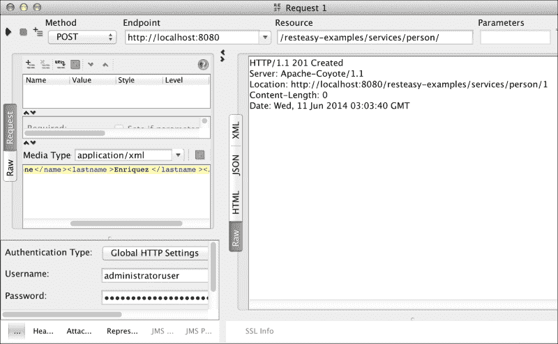

执行成功，如前一个截图所示。原因是我们在 `@RolesAllowed` 注解中包括了这两个角色。此外，我们还将使用 `reader` 角色进行测试，以确保执行成功，如下截图所示：

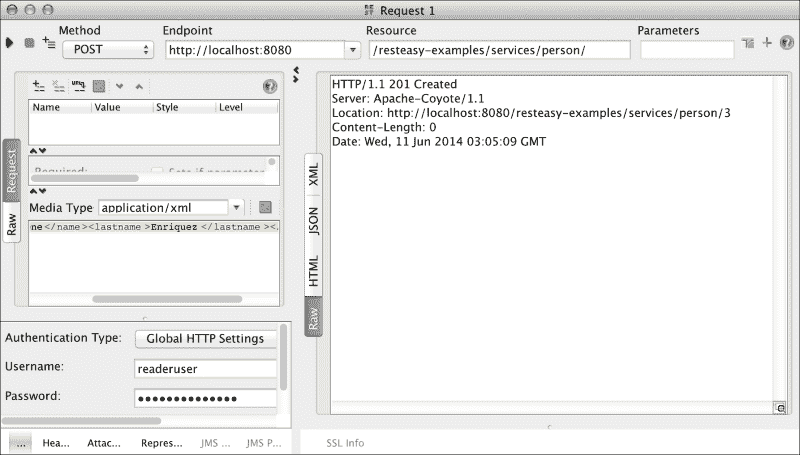

如您所见，当我们使用 `@RolesAllowed` 注解时，我们授予了特定角色的权限。对于此方法，我们使用了 `administrator` 和 `reader`。

#### The findById method

我们现在将使用管理员角色测试 `findById` 方法，如下截图所示：

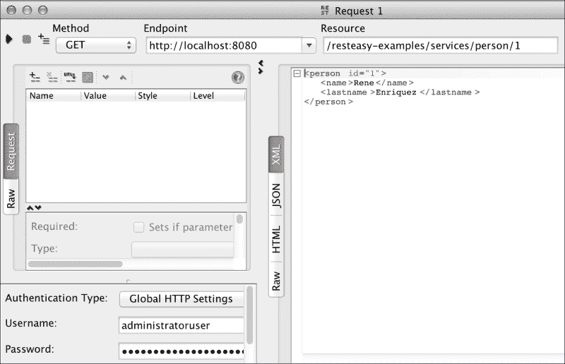

截图显示执行成功，因为 `@RolesAllowed` 注解包括了管理员。由于我们没有包括 `reader` 角色，下一次执行不应被授权。现在让我们立即进行测试，如下截图所示：

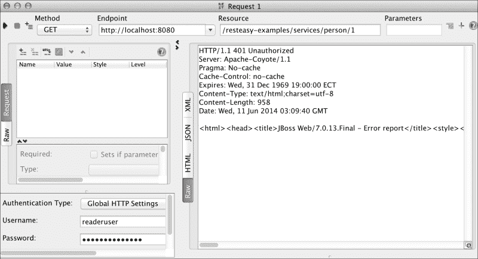

再次强调，我们使用了 `@RolesAllowed` 注解在方法级别上授予权限，但这次我们只指定了一个角色，`administrator`。

本章的所有源代码都可以在以下网址找到：

[`github.com/restful-java-web-services-security/source-code/tree/master/chapter03`](https://github.com/restful-java-web-services-security/source-code/tree/master/chapter03)

### The @DenyAll annotation

The `@DenyAll` annotation allows us to define operations that cannot be invoked regardless of whether the user is authenticated or the roles are related to the user. The specification defines this annotation as follows:

*指定不允许任何安全角色调用指定的方法（即方法应从 J2EE 容器中排除执行）。*

### The @PermitAll annotation

当我们使用`@PermitAll`注解时，我们告诉容器，被注解的资源（一个方法或类的所有方法）可以被任何已登录到应用程序的用户调用。这意味着只需要用户进行身份验证；不需要分配任何特定角色。

从这三个注解中，无疑最常用的是第一个（`@RolesAllowed`）；其他注解不常使用，因为`@PermitAll`可以很容易地在`web.xml`文件中替换，而`@DenyAll`只能在少数场景中使用。

## 精细粒度安全性的程序实现

除了提供我们已看到的选项用于安全管理之外，RESTEasy 还以编程方式提供了一种额外的访问控制机制。

在 Web 服务的操作中，你可以向方法添加一个额外的参数。这允许访问安全上下文，而不会改变客户端调用方法或方法执行的动作。参数必须以以下方式包含：

```java
@GET...
@Consumes("text/xml")
public returnType methodName(@Context SecurityContext secContext, …) {...
```

假设在我们这个例子中，在`savePerson`方法中，我们想要访问这个功能。我们需要的唯一更改如下代码片段所示。

之前，该方法只使用一个参数，如下所示代码所示：

```java
@POST
@Consumes("application/xml")
public Response savePerson(Person person) {
  int id = dataInMemory.size() + 1;
  person.setId(id);
  dataInMemory.put(id, person);
  return Response.created(URI.create("/person/" + id)).build();
}
```

现在，该方法有另一个参数，如下所示代码所示：

```java
@POST
@Consumes("application/xml")
public Response savePerson(@Context SecurityContext secContext, Person person) {
  int id = dataInMemory.size() + 1;
  person.setId(id);
  dataInMemory.put(id, person);
  return Response.created(URI.create("/person/" + id)).build();
}
```

接口`javax.ws.rs.core.SecurityContext`提供了以下三个有趣的功能：

+   `isUserInRole()`

+   `getUserPrincipal()`

+   `isSecure()`

方法`isUserInRole()`的功能与注解`@RolesAllowed`类似；其目标是执行检查以确定登录用户是否属于指定的角色，如下所示：

```java
@POST
@Consumes("application/xml")
public Response savePerson(@Context SecurityContext secContext, Person person) {
  boolean isInDesiredRole = 	secContext.isUserInRole ("NameOfDesiredRole");
  int id = dataInMemory.size() + 1;
  person.setId(id);
  dataInMemory.put(id, person);
  return Response.created(URI.create("/person/" + id)).build();
}
```

`getUserPrincipal()`方法获取应用程序中的主要用户，换句话说，就是登录用户。你可以通过此用户获取代表它的信息，如用户名；这在需要生成审计跟踪的场景中总是很有用。

最后，方法`isSecure()`确定调用是否是通过安全的通信方式进行的，例如你是否正在使用 HTTPS。

如你所知，HTTP 和 HTTPS 是交换信息的协议；前者通常用于分享不敏感信息时，后者通常用于信息敏感且我们需要安全通道时。

让我们想象一下 ABC 银行的门户网站，特别是显示有关服务和与银行业务相关的信息的主页，这些信息可以通过 HTTP 进行管理。我们无法使用 HTTP 协议管理与账户或货币转账相关的网页；这是因为信息没有得到保护。通过 HTTPS 协议，我们可以加密信息；当信息被像 Wireshark 这样的流量分析器截获时，它无法被解释。

您可以通过将更改应用到项目中以启用 HTTPS 来测试此功能，正如我们在第二章*确保 Web 服务安全的重要性*中向您展示的那样。

当您使用 HTTP 调用此方法时，结果将是错误的，但使用 HTTPS 调用相同方法时，它将是正确的。

我们刚才分析的三种方法在我们想要实现细粒度安全检查时非常有用。例如，当我们想要实现审计时，我们可以确定是否使用安全的传输协议（如 HTTPS）执行了某个操作；此外，我们还可以发现有关执行操作的用户的信息。

# 摘要

在实现应用程序安全时，我们的需求可能相当多样化。在本章中，我们看到了 JAX-RS 如何提供处理安全的机制，从相当基本的模型（粗粒度）到更复杂的模型（细粒度），在细粒度模型中，您可以执行更彻底的控制，包括程序性控制和通过配置文件的控制。

当然，始终建议将这些检查保留在配置文件，如`web.xml`中。由于您将控制集中在一个地方，这有助于维护。当在源代码级别处理安全时，这种情况不会发生，因为当有许多类是项目的一部分时，如果需要对当前功能进行某种形式的修改，任务会变得复杂。

现在，您应该为下一章做好准备，我们将讨论 OAuth。这是一个非常激动人心的主题，因为这个协议在互联网应用程序中被广泛接受和使用。全球互联网的摇滚明星公司，如 Google、Twitter 和 Facebook 等，都取得了巨大的成功。
