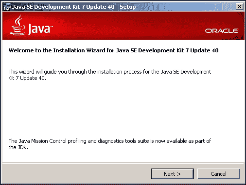
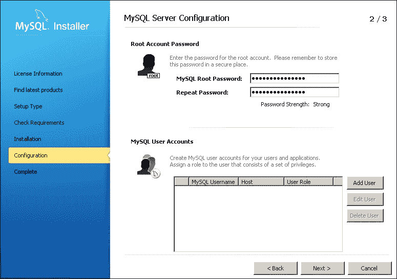

# 第一章. 开始使用 Dropwizard

Dropwizard 是一个开源的 Java 框架，用于快速开发 RESTful Web 服务，它将您所需的一切整合在一起。您可以使用一个生产就绪的应用程序，利用 **Jetty**、**Jersey**、**Jackson**、**JDBI** 和 **Hibernate**，以及 Dropwizard 包含的大量其他库，无论是核心库还是模块库。这解决了在从头开始构建 Web 服务应用程序时手动添加、配置和连接大量不同库的问题。可以这样想：您将需要 Jersey 来公开 Web 服务，一些其他库用于数据库交互，以及额外的库用于验证和身份验证，更不用说依赖项管理、打包和分发的开销了。

在本书的各个章节中，我们将使用 Dropwizard 和其组件来构建一个示例应用程序——即一个电话簿应用程序，它公开了一组 RESTful Web 服务，这些服务有助于存储和管理联系人。它的工作方式几乎与您手机内置的电话簿应用程序或任何其他联系人管理应用程序相同。

# 使用 Dropwizard 开发 Web 服务

我们将使用 Jersey 来构建我们的 Web 服务。Jersey 是 **JAX-RS** 标准（JSR 311）的参考实现，即 Java API for RESTful Web Services。JAX-RS 利用注解，简化了 Web 服务应用程序的开发。

我们将构建的 Web 服务将生成 JSON 输出。Dropwizard 包含 Jackson，这是一个快速、可配置的 JSON 处理器，并由 Jersey 用于将普通的 Java 对象转换为 JSON 表示形式。

我们的应用程序将使用数据库来存储数据。为了满足我们的数据库交互需求，我们将使用 JDBI。JDBI 是一个库，它将使我们能够轻松地创建 DAO 接口。数据访问对象将允许我们通过将 Java 方法映射到 SQL 查询和语句来执行数据库操作。JDBI 作为 Dropwizard 模块提供，使我们能够轻松快速地构建数据访问对象。

Dropwizard 包含验证、监控和测试模块，我们将使用这些模块来确保我们的服务在生产环境中表现正确。我们将集成 Dropwizard 的验证机制，确保在尝试提供服务之前，每个对我们的 Web 服务的请求都是有效的。

# 准备开发环境

在我们开始创建 Dropwizard 应用程序之前，我们需要设置我们的开发环境，这至少包括 **Java (JDK 7**)、**Maven** 和 **MySQL**。

## 准备工作

Maven 是 Java 项目的构建管理器。我们将使用它来创建和构建我们的项目。我们的应用程序的依赖项（对 Dropwizard 模块的依赖）将由 Maven 管理；我们只需在我们的项目配置文件中添加适当的条目即可。

我们需要一个数据库，因此我们将使用 MySQL 来满足本书的需求。MySQL 是最流行的开源关系型数据库管理系统——是网络应用程序的常见选择。在整个安装过程中，你将被提示创建或配置环境变量的值。这个过程因操作系统而异，并且超出了本书的范围。

## 如何操作…

我们将查看你需要下载和安装的所有组件。

### 下载和安装 Java

1.  从[`www.oracle.com/technetwork/java/javase/downloads/jdk7-downloads-1880260.html`](http://www.oracle.com/technetwork/java/javase/downloads/jdk7-downloads-1880260.html)下载 Java 7 JDK。

1.  由于有许多安装包可用，你需要根据你的操作系统和平台选择合适的安装包。

1.  下载完成后，通过运行你下载的安装程序来安装 JDK，如下面的截图所示。目前不需要使用与默认设置不同的设置。经过几个步骤后，安装将完成。

1.  安装成功后，将`JAVA_HOME`环境变量设置为 Java 安装路径。在 Windows 中，这可能类似于`C:\Program Files\Java\jdk1.7.0_40\`。

### 下载和安装 Maven

1.  Maven 安装相当简单。只需从[`maven.apache.org/download.cgi`](http://maven.apache.org/download.cgi)下载 Maven 二进制文件，并将包的内容提取到你的选择目录中。

1.  修改`PATH`环境变量，添加以`\bin`结尾的 Maven 目录，例如`C:\apache-maven-3.0.5\bin`，这样在命令行或终端中使用时，`mvn`可执行文件将在所有目录中可用。

### 下载和安装 MySQL

1.  从[`dev.mysql.com/downloads/mysql/#downloads`](http://dev.mysql.com/downloads/mysql/#downloads)下载适用于你操作系统的**MySQL Community Server**安装程序。

1.  运行安装程序并选择安装 MySQL。保持建议的默认安装设置。

1.  在某个时候，你将被提示提供**MySQL Root 密码**。这是 root 用户的密码，具有完全访问权限。输入你选择的密码，然后点击**下一步 >**按钮。安装将很快完成。

1.  请选择一个你容易记住的密码，因为你将在稍后阶段需要提供它。

## 它是如何工作的…

我们刚刚完成了构建 Dropwizard 应用程序所需软件包的安装。我们将使用 Maven 来创建应用程序的结构，该应用程序将使用 MySQL 作为其数据的持久存储。

我们将创建一个 Maven 项目，并在其 **项目对象模型** (POM) 文件中包含应用将使用的 Dropwizard 组件的引用（依赖项）。Maven 将自动下载并使它们在整个项目中可用。
