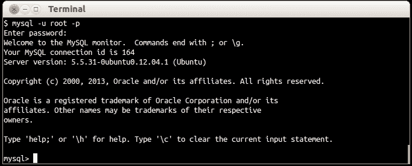
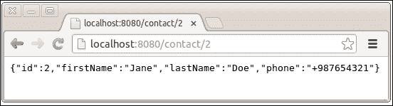
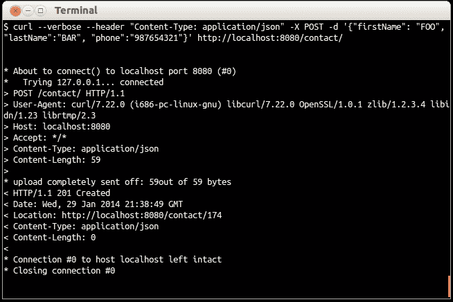

# 第六章。使用数据库

我们的应用程序正在稳步增长。我们现在需要一个地方来存储我们将要管理的联系信息，以及一个高效的方式来做到这一点。我们将使用 MySQL 服务器，其安装已在本书的第一章中概述，来满足我们的数据存储需求。Dropwizard 提供了我们与之交互所需的一切。

# 准备数据库

是时候使用我们的应用程序实际存储和检索数据了。我们将创建应用程序与 MySQL 数据库之间的连接。

我们需要一个实际的数据库来连接和查询。由于我们已经安装了 MySQL，我们也可以使用 `mysql` 命令行客户端来创建数据库并在其中创建一些表。

## 准备工作

通过在终端中执行以下命令来启动 `mysql` 客户端：

```java
$ mysql -u root -p

```

如以下截图所示，MySQL 壳将提示您提供密码，这是您在安装 MySQL 时设置的 MySQL root 用户的密码：



## 如何操作...

让我们按照以下步骤准备我们应用程序的数据库：

1.  通过运行以下查询来创建数据库 phonebook：

    ```java
    > CREATE DATABASE `phonebook`;

    ```

1.  我们需要一个额外的 MySQL 用户，具有对新创建的数据库的完全访问权限。使用以下命令创建用户并授予适当的访问权限：

    ```java
    > CREATE USER 'phonebookuser'@'localhost' IDENTIFIED BY'phonebookpassword';
    > GRANT ALL ON phonebook.* TO 'phonebookuser'@'localhost';

    ```

1.  使用 `USE` 命令选择 `phonebook` 数据库：

    ```java
    > USE `phonebook`;

    ```

1.  创建一个联系表来存储一些联系信息。

    ```java
    > CREATE TABLE IF NOT EXISTS `contact` (
     `id` int(11) NOT NULL AUTO_INCREMENT,
     `firstName` varchar(255) NOT NULL,
     `lastName` varchar(255) NOT NULL,
     `phone` varchar(30) NOT NULL,
     PRIMARY KEY (`id`)
     ) 
     ENGINE=InnoDB 
     DEFAULT CHARSET=utf8 
     AUTO_INCREMENT=1 ;

    ```

1.  在联系表中添加一些测试数据：

    ```java
    > INSERT INTO `contact` VALUES (NUL L, 'John', 'Doe', '+123456789'), (NULL, 'Jane', 'Doe', '+987654321');

    ```

## 它是如何工作的...

我们刚刚设置了数据库。通过我们运行的查询，我们创建了一个数据库、一个数据库用户以及一个用于存储联系信息的表。我们的应用程序将更新以存储和检索此表中的信息。

# 与数据库交互

现在我们已经有了数据库和数据。然而，为了能够连接到数据库，我们需要在项目中包含 `mysql jdbc` 连接器。此外，我们还需要 `dropwizard-jdbi` 模块，它将允许我们创建数据库连接和 **数据访问对象** (**DAO**)，通过它我们将查询数据库，利用 JDBI 项目提供的 API ([`jdbi.org/`](http://jdbi.org/))。

## 准备工作

让我们看看为了实现这一点需要什么。首先，在 `pom.xml` 的 `<dependencies>` 部分中添加以下依赖项：

```java
<dependency><groupId>mysql</groupId><artifactId>mysql-connector-java</artifactId><version>5.1.6</version></dependency><dependency><groupId>io.dropwizard</groupId><artifactId>dropwizard-jdbi</artifactId><version>0.7.0-SNAPSHOT</version></dependency>
```

我们现在已准备好继续并更新我们的应用程序。我们将使用 JDBI 的 SQL 对象 API 映射方法来预定义 SQL 语句。

## 如何操作...

让我们看看如何通过以下步骤通过我们的应用程序连接和交互数据库：

1.  创建一个新的包，`com.dwbook.phonebook.dao`，并在其中创建一个 `ContactDAO` 接口，代码如下：

    ```java
    package com.dwbook.phonebook.dao;public interface ContactDAO { }
    ```

1.  添加`#getContactById()`方法，这将允许我们查询数据库，并在给定 ID 时检索联系人列表或特定联系人。使用`@SqlQuery`注解指定当方法被调用时将执行的 SQL 查询。你需要导入`org.skife.jdbi.v2.sqlobject.*`和`com.dwbook.phonebook.representations.Contact`。

    ```java
    @SqlQuery("select * from contact where id = :id")Contact getContactById(@Bind("id") int id);
    ```

1.  创建一个`com.dwbook.phonebook.dao.mappers`包和`ContactMapper`类，该类实现了映射方法，如下面的代码片段所示。映射器类简化了将`resultset`数据库行映射到对象的过程。你需要导入`java.sql.ResultSet`、`java.sql.SQLException`、`org.skife.jdbi.v2.StatementContext`、`org.skife.jdbi.v2.tweak.ResultSetMapper`和`com.dwbook.phonebook.representations.Contact`。

    ```java
    public class ContactMapper implements ResultSetMapper<Contact> {public Contact map(int index, ResultSet r,StatementContext ctx)throws SQLException {return new Contact(r.getInt("id"), r.getString("firstName"),r.getString("lastName"),r.getString("phone"));}}
    ```

1.  在`ContactDAO`中，通过添加`@Mapper`注解到`#getContactById()`方法上（在`@SqlQuery`注解之前），注册你的映射器。导入`com.dwbook.phonebook.dao.mappers.ContactMapper`和`org.skife.jdbi.v2.sqlobject.customizers.Mapper`类。

    ```java
    @Mapper(ContactMapper.class)@SqlQuery("select * from contact where id = :id")Contact getContactById(@Bind("id") int id);
    ```

1.  在`config.yaml`配置文件中，添加数据库部分，包含建立数据库连接所需的最小属性集（根据`YAML`语法缩进）。

    ```java
    database:driverClass: com.mysql.jdbc.Driveruser: phonebookuserpassword: phonebookpasswordurl: jdbc:mysql://localhost/phonebook
    ```

1.  在`PhonebookConfiguration`类中添加数据库属性，并为其创建一个 getter 方法。首先导入`io.dropwizard.db.DataSourceFactory`类。

    ```java
         @JsonProperty
         private DataSourceFactory database = new DataSourceFactory();

          public DataSourceFactory getDataSourceFactory() {
              return database;
        }
    ```

1.  修改`App`类中的`run`方法，以创建一个`DBIFactory`类，该类将用于构建`DBI`实例，然后我们将将其作为参数传递给`ContactResource`。你需要导入`org.skife.jdbi.v2.DBI`和`io.dropwizard.jdbi.DBIFactory`。

    ```java
      @Override
      public void run(PhonebookConfiguration c, Environment e)throws Exception {
        LOGGER.info("Method App#run() called");
        for (int i=0; i < c.getMessageRepetitions(); i++) {
          System.out.println(c.getMessage());
        }
        System.out.println(c.getAdditionalMessage());

        // Create a DBI factory and build a JDBI instance
        final DBIFactory factory = new DBIFactory();
        final DBI jdbi = factory
          .build(e, c.getDataSourceFactory(), "mysql");
        // Add the resource to the environment
        e.jersey().register(new ContactResource(jdbi));
      }
    ```

1.  在上一步中，我们将`jdbi`实例作为参数传递给`ContactResource`构造函数。然而，构造函数`ContactResource(DBI)`（目前）不存在，因此我们需要创建它。我们将在资源类中添加一个私有的`final ContactDAO`成员，使用`onDemand`方法，并使用 JDBI 来实例化它。你还需要添加`DBI`和`ContactDAO`的必要导入。

    ```java
    private final ContactDAO contactDao;public ContactResource(DBI jdbi) {contactDao = jdbi.onDemand(ContactDAO.class);}
    ```

1.  使用`contactDao`对象修改`ContactResource#getContact()`方法类，使其从数据库返回实际的联系人。

    ```java
      @GET
      @Path("/{id}")
      public Response getContact(@PathParam("id") int id) {
        // retrieve information about the contact with theprovided id
        Contact contact = contactDao.getContactById(id);
        return Response
          .ok(contact)
          .build();
      }
    ```

1.  重新构建并运行应用程序，提供更新的配置文件作为参数。

1.  打开你的浏览器并转到`http://localho``st:8080/contact/1`。你会看到我们插入到联系人表中的第一行的 JSON 表示，即`id`等于`1`的`John Doe`。看看下面的截图，它概述了这一点：

    分别，以下截图显示了`http://localhost:8080/contact/2`的输出：

    

1.  现在，让我们在我们的 DAO 中添加创建、更新和删除联系人的方法。对于插入新条目，添加`#createContact()`方法。

    ```java
      @GetGeneratedKeys
      @SqlUpdate("insert into contact (id, firstName, lastName, phone) values (NULL, :firstName, :lastName, :phone)")
      int createContact(@Bind("firstName") String firstName, @Bind("lastName") String lastName, @Bind("phone") String phone);
    ```

    ### 注意

    注意，由于我们正在更新数据库而不是查询它（即检索信息），我们使用`@SqlUpdate`注解而不是在`#getContact()`方法中使用的`@SqlQuery`注解来为 SQL 查询进行注解。此外，使用`@GetGeneratedKeys`注解来检索新插入行的主键值；在这种情况下，`id`字段的值。

1.  为了更新现有条目，添加`#updateContact()`方法：

    ```java
    @SqlUpdate("update contact set firstName = :firstName, lastName = :lastName, phone = :phone where id = :id")
    void updateContact(@Bind("id") int id, @Bind("firstName") String firstName, @Bind("lastName") String lastName,@Bind("phone") String phone);
    ```

1.  为了删除现有条目，添加`#deleteContact()`方法：

    ```java
    @SqlUpdate("delete from contact where id = :id")
    void deleteContact(@Bind("id") int id);
    ```

1.  现在我们已经设置了数据库方法，让我们在`Resource`类中使用它们，以便实际上可以插入、更新和删除联系人。修改`ContactResource#createContact()`方法，以便在数据库中插入新的联系人，检索其`id`，并使用它来构造其 URI，将其作为参数传递给`Response#created()`方法。为此，我们首先需要导入`java.net.URI`和`java.net.URISyntaxException`：

    ```java
      @POST
      public Response createContact(Contact contact) throws URISyntaxException {
        // store the new contact
        int newContactId = contactDao.createContact(contact.getFirstName(), contact.getLastName(), contact.getPhone());
        return Response.created(new URI(String.valueOf(newContactId))).build();
      }
    ```

1.  以类似的方式，更新`ContactResource#deleteContact()`方法，以便确实可以删除联系人：

    ```java
      @DELETE
      @Path("/{id}")
      public Response deleteContact(@PathParam("id") int id) {
        // delete the contact with the provided id
        contactDao.deleteContact(id);
        return Response.noContent().build();
      }
    ```

1.  最后，让我们也更新`ContactResource#updateContact()`方法，以便我们的应用程序可以在处理相关 HTTP 请求的同时更新现有联系人：

    ```java
      @PUT
      @Path("/{id}")
      public Response updateContact(@PathParam("id") int id, Contact contact) {
        // update the contact with the provided ID
        contactDao.updateContact(id, contact.getFirstName(),
          contact.getLastName(), contact.getPhone());
        return Response.ok(
          new Contact(id, contact.getFirstName(), contact.getLastName(),
              contact.getPhone())).build();
      }
    ```

## 它是如何工作的…

多亏了 JDBI，我们的电话簿应用程序现在可以与数据库交互，检索、存储、更新和删除联系人。

通过执行带有`curl`的 HTTP POST 请求来创建一个新的联系人：

```java
$ curl --verbose --header "Content-Type: application/json" -X POST -d '{"firstName": "FOO", "lastName":"BAR
", "phone":"987654321"}' 
http://localhost:8080/contact/

```

联系人被创建，插入行的主键值，即联系人`id`，为`174`，如以下截图所示（`Location`响应头）：



JDBI 的 SQL 对象 API 简化了`DAO`的创建。我们在上面创建了`DAO`接口，我们可以使用`@SqlQuery`注解将普通的、参数化的 SQL 查询映射到特定的方法；请注意，除了对象映射器之外，不需要额外的实现。

由于我们从数据库中检索数据并返回一个`Contact`实例，我们需要创建一个`Mapper`类，这是一个实现了`org.skife.jdbi.v2.tweak.ResultSetMapper<T>`接口的`Contact`类的类。它的实现相当简单直接。我们使用`#getLong()`和`#getString()`方法以及列名从数据库`ResultSet`对象中获取的值创建了一个`Contact`对象。

我们使用`jdbi`在资源类中使用`DBI#onDemand()`方法创建我们的`DAO`实例。然而，为了做到这一点，我们必须创建一个`DBI`工厂并在注册资源之前构建`DBI`实例。再次强调，这很简单，只需要在`App#run()`方法中进行一些小的修改。

`DBI`工厂需要数据库连接设置来构建`DBI`实例。退一步说，我们的配置类已经更新，以读取和公开`DatabaseConfiguration`设置，这些设置在应用程序配置文件的数据库部分声明，即`config.yaml`。

## 还有更多...

JDBI 将自己标识为 Java 的 SQL 便捷库。我们使用了 JDBI SQL 对象 API，其中特定方法映射到特定的 SQL 语句。然而，这并不是使用 JDBI 与数据库交互的唯一方式。JDBI 还公开了另一个 API，即流畅风格 API。

### JDBI 流畅风格 API

流畅风格 API 允许我们打开并使用数据库句柄，在需要时即时创建和执行 SQL 查询，而不是使用 SQL 对象 API 使用的预定义 SQL 语句。

通常，你应该使用的 API 类型取决于你的个人喜好，你甚至可以将两种 API 混合使用。

### `@MapResultAsBean`注解

在这个例子中，我们实现了一个映射器，并使用`@Mapper`注解将 SQL 查询的结果映射到`Contact`实例。另一种方法可以使用`MapResultAsBean`注解。

```java
@MapResultAsBean
@SqlQuery("select * from contact where id = :id")
Contact getContactById(@Bind("id") int id);
```

在这个例子中，通过注解`#getContactById()`，我们将 SQL 查询的结果直接映射到`Contact`实例，而不需要实现自定义映射器。不过，为了使这可行，`Contact`类应该更新为设置器（即`setFirstName(String firstName){ .. }`）。因此，必须从每个成员变量的声明中移除`final`关键字。
