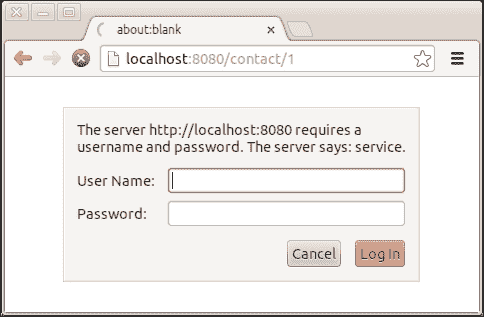
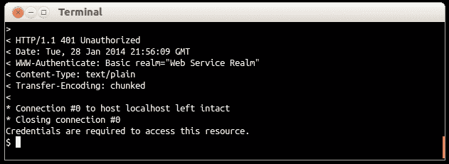

# 第九章. 认证

认证是验证访问应用程序的用户确实是他/她所声称的那个人，并且他/她被允许访问和使用我们的应用程序的过程。在本章中，我们将了解如何使用认证机制来保护我们的网络服务。

# 构建基本的 HTTP 认证器

我们的网络服务现在具有允许任何人使用 HTTP 客户端创建和检索联系人的功能。我们需要以某种方式保护我们的网络服务并认证调用它的用户。最常用的认证方式是基本的 HTTP 认证，它需要一个基本的凭证集：用户名和密码。

## 准备工作

在我们继续保护我们的网络服务之前，我们需要将`dropwizard-auth`依赖项添加到我们的项目中，将以下内容添加到我们的`pom.xml`文件的依赖项部分：

```java
<dependency>
  <groupId>io.dropwizard</groupId>
  <artifactId>dropwizard-auth</artifactId>
  <version>0.7.0-SNAPSHOT</version>
</dependency>
```

## 如何操作…

让我们看看构建认证机制并保护我们的方法需要什么；执行以下步骤：

1.  在`com.dwbook.phonebook`包中创建一个名为`PhonebookAuthenticator`的新类；在这里，我们将构建我们服务的安全机制。该类需要实现`Authenticator<C, P>`接口及其`#authenticate()`方法。认证器的第一个参数是`Authentication`方法，而第二个参数是`#authenticate()`方法的返回类型。

    ```java
      package com.dwbook.phonebook;import com.google.common.base.Optional;
      import io.dropwizard.auth.AuthenticationException;
      import io.dropwizard.auth.Authenticator;
      import io.dropwizard.auth.basic.BasicCredentials;
      public class PhonebookAuthenticator implementsAuthenticator<BasicCredentials, Boolean> {
        public Optional<Boolean> authenticate(BasicCredentials c) throws AuthenticationException {
          if (c.getUsername().equals("john_doe") && c.getPassword().equals("secret")) {
          return Optional.of(true);
          }
          return Optional.absent();
        }
      }
    ```

1.  通过将您刚刚构建的认证器添加到 Dropwizard 环境中，并使用`JerseyEnvironment#register()`方法传递一个`BasicAuthProvider`实例来启用您刚刚构建的认证器。`BasicAuthProvider`的构造函数接受一个用于输入的认证器实例和认证域。您还需要导入`io.dropwizard.auth.basic.BasicAuthProvider`。

    ```java
      // Register the authenticator with the environment
      e.jersey().register(new BasicAuthProvider<Boolean>(
        new PhonebookAuthenticator(), "Web Service Realm"));
    ```

1.  现在，您可以通过修改`ContactResource`类方法的声明，期望一个带有`@Auth`注解（导入`io.dropwizard.auth.Auth`）的`Boolean`变量作为参数来保护网络服务端点。包含此注解参数将触发认证过程。

    ```java
    public Response getContact(@PathParam("id") int id, @Auth Boolean isAuthenticated) { … }

    public Response createContact(Contact contact, @Auth   Boolean isAuthenticated) throws URISyntaxException { … }

    public Response deleteContact(@PathParam("id") int id, @Auth Boolean isAuthenticated) { … }
    public Response updateContact(@PathParam("id") int id, Contact contact, @Auth Boolean isAuthenticated) { … }
    ```

1.  构建并启动应用程序，然后尝试访问`ContactResource`类的任何端点，例如`http://localhost:8080/contact/1`，尝试显示 ID 等于 1 的联系人。您将看到一个消息，表明服务器需要用户名和密码。

## 它是如何工作的…

`dropwizard-auth`模块包含了我们保护服务所需的一切。我们只需要实现一个认证器并将其注册到 Dropwizard 环境中。

然后，当我们为一个方法的输入参数使用`@Auth`注解时，我们表示访问我们服务的用户必须经过认证。每次对包含`@Auth`注解的变量的方法执行 HTTP 请求时，认证提供者都会拦截它，请求用户名和密码。然后，这些凭证被传递给我们的认证器，认证器负责确定它们是否有效。无论认证结果如何，即`#authenticate()`方法的返回值，它都会注入到被`@Auth`注解的变量中。如果认证失败或没有提供凭证，请求将被阻止，响应是一个**HTTP/1.1 401 Unauthorized**错误。您可以在以下屏幕截图中看到执行 HTTP 请求后收到的响应，请求使用 cURL 执行，但没有提供凭证：



我们的认证器类需要是一个实现了`Authenticator<C, P>`接口的类，其中`C`是我们可能用来认证用户的凭证集合，而`P`是认证结果类型。在我们的例子中，我们使用了`BasicCredentials`作为凭证存储，这是`BasicAuthProvider`提供的。在`#authenticate()`方法中，我们执行所有必要的任务以认证用户。我们实现了检查用户名是否为`john_doe`，这是通过密码`secret`识别的。这是一个例子；下一个菜谱将说明如何认证用户，当他们的详细信息（用户名和密码）存储在数据库中时。

## 还有更多…

如您可能已经注意到的，我们的认证器的`#authenticate()`方法的返回类型是`Optional`。这是一个 Guava 类型，它允许我们防止空指针异常。在某些情况下，`#authenticate()`方法应该返回空值，因此我们返回`Optional.absent()`，而不是简单地返回 null（如果处理不当可能会引起问题）。

这样的情况是我们需要向我们要保护的方法提供一个经过认证的主体的实例（可能包含用户名、姓名、电子邮件等），而不是像在这个例子中那样只是一个`boolean`参数。

### 设置客户端的凭证

我们已经保护了我们的网络服务，特别是`ContactResource`类的端点。我们的客户端也需要更新，以便能够访问这些受保护的资源。

要做到这一点，我们需要修改`App#run()`方法。在`client`对象实例化后，使用`#addFilter()`方法，添加`HTTPBasicAuthFilter`（导入`com.sun.jersey.api.client.filter.HTTPBasicAuthFilter`），并提供正确的用户名和密码。

```java
final Client client = new JerseyClientBuilder().using(environment).build();client.addFilter(new HTTPBasicAuthFilter("john_doe", "secret"));
```

`#addFilter()` 方法用于向 `client` 对象添加额外的处理指令。也就是说，我们 Jersey 客户端执行的每一个请求都必须在我们添加的过滤器处理之后才能最终执行。在这种情况下，我们使用 `#addFilter()` 方法来为每个发出的 HTTP 请求添加适当的 `BasicAuth` 头部。

### 可选认证

有许多情况下认证应该是可选的。想想一个为用户提供个性化信息的服务，当没有用户登录时返回默认消息。为了声明可选认证，我们应该在 `@Auth` 注解中提供 `required=false` 参数，如下面的代码所示：

```java
@Auth(required=false)
```

### 认证方案

我们在应用程序中使用了基本的 HTTP 认证；然而，这并不是唯一可用的认证方案。例如，一些 Web 服务使用 API 密钥认证。在这种情况下，认证器应该检查 HTTP 请求的头部，验证传输的 API 密钥的有效性。然而，这样做将需要使用自定义认证提供者。无论如何，使用哪种认证方法取决于您的应用程序需求。

# 使用数据库中存储的凭据验证用户

在前面的菜谱中，我们使用一组硬编码的用户名和密码来验证用户的身份。然而，在大多数现实世界的案例中，您需要使用存储在数据库中，或者更具体地说，在包含用户信息的表中存储的凭据来识别用户并验证他们的身份。

## 准备工作

让我们先在数据库中创建一个表，用于存储用户数据。

启动 MySQL 客户端，登录后，在电话簿数据库中执行以下查询：

```java
CREATE TABLE IF NOT EXISTS `users` (
  `username` varchar(20) NOT NULL,
  `password` varchar(255) NOT NULL,
  PRIMARY KEY (`username`)
) ENGINE=InnoDB DEFAULT CHARSET=utf8 AUTO_INCREMENT=1 ;
```

现在让我们通过运行以下查询将用户添加到数据库中：

```java
INSERT INTO `users` VALUES ('wsuser', 'wspassword');
```

## 如何操作…

我们将修改我们的认证提供者，以便在数据库中检查当前用户的凭据。让我们看看如何：

1.  由于我们将与数据库交互以验证用户，我们需要一个 DAO。因此，在 `com.dwbook.phonebook.dao` 包中创建 `UserDAO` 接口。

    ```java
      package com.dwbook.phonebook.dao;
      import org.skife.jdbi.v2.sqlobject.*;
      public interface UserDAO {
        @SqlQuery("select count(*) from users where username = :username and password = :password")
        int getUser(@Bind("username") String username, @Bind("password") String password);
      }
    ```

1.  修改 `PhonebookAuthenticator`，添加一个 `UserDAO` 实例作为成员变量，创建一个构造函数使用 `jdbi` 初始化 DAO 实例，并最终通过利用 `UserDAO` 实例通过查询数据库来验证用户数据来修改认证方法。

    ```java
      import org.skife.jdbi.v2.DBI;
      import com.dwbook.phonebook.dao.UserDAO;
      import com.google.common.base.Optional;
      import io.dropwizard.auth.AuthenticationException;
      import io.dropwizard.auth.Authenticator;
      import io.dropwizard.auth.basic.BasicCredentials;

      public class PhonebookAuthenticator implements Authenticator<BasicCredentials, Boolean> {
        private final UserDAO userDao;

        public PhonebookAuthenticator(DBI jdbi) {
          userDao = jdbi.onDemand(UserDAO.class);
        }

        public Optional<Boolean> authenticate(BasicCredentials c) throws AuthenticationException {
          boolean validUser = (userDao.getUser(c.getUsername(), c.getPassword()) == 1);
          if (validUser) {
            return Optional.of(true);
          }
          return Optional.absent();
        }
      }
    ```

1.  在 `App#run()` 方法中，修改我们的认证器的注册，以便将其现有的 `jdbi` 实例传递给其构造函数。

    ```java
    // Register the authenticator with the environment
    e.jersey().register(new BasicAuthProvider<Boolean>(
      new PhonebookAuthenticator(jdbi), "Web Service Realm"));
    ```

您现在可以重新构建、运行并测试应用程序。这次，当请求时，您需要提供存储在数据库中的用户名和密码设置，而不是硬编码的。

## 它是如何工作的…

在对受保护资源执行每个请求时，我们的应用程序都会将用户的凭据与数据库进行比对。为此，我们创建了一个简单的 DAO，它只有一个查询，实际上会计算与提供的用户名和密码匹配的行数。当然，这可能是 0（当用户名/密码集不正确时）或 1（当提供了正确的凭据集时）。这就是我们在认证器的`#authenticate()`方法中检查的内容。

## 更多内容...

在这个菜谱中，我们将密码以纯文本形式存储在数据库中。这通常不是正确的做法；密码应该始终加密或散列，而不是以明文形式存储，以最大限度地减少可能入侵或未经授权访问的影响。

### 缓存

为了提高我们应用程序的性能，我们可以缓存数据库凭据。Dropwizard 提供了`CachingAuthenticator`类，我们可以用它来处理这个问题。这个概念很简单；我们使用`CachingAuthenticator#wrap()`方法围绕我们的认证器构建一个包装器，并将其注册到环境中。我们还将定义一组缓存指令，例如，要缓存多少条记录以及缓存多长时间，使用 Guava 的`CacheBuilderSpec`。对于这个例子，我们需要导入`io.dropwizard.auth.CachingAuthenticator`和`com.google.common.cache.CacheBuilderSpec`。

```java
// Authenticator, with caching support (CachingAuthenticator)
CachingAuthenticator<BasicCredentials, Boolean> authenticator = new CachingAuthenticator<BasicCredentials, Boolean>(
e.metrics(), 
new PhonebookAuthenticator(jdbi), 
CacheBuilderSpec.parse("maximumSize=10000, expireAfterAccess=10m"));

// Register the authenticator with the environment
e.jersey().register(new BasicAuthProvider<Boolean>(
authenticator, "Web Service Realm"));

// Register the authenticator with the environment
e.jersey().register(new BasicAuthProvider<Boolean>(
authenticator, "Web Service Realm"));
```

前面的代码片段中的关键语句是`CacheBuilderSpec.parse("maximumSize=10000, expireAfterAccess=10m"));`。通过这个语句，我们配置包装器缓存`10000`个主体（`maximumSize`属性），即用户名/密码集合，并且每个都缓存 10 分钟。`CacheBuilderSpec#parse()`方法用于通过解析字符串来构建一个`CacheBuilderSpec`实例。这是为了我们的方便，允许我们将缓存配置外部化，而不是解析一个静态字符串，我们可以解析配置设置文件中定义的属性。
