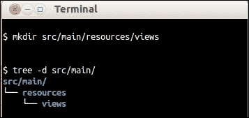
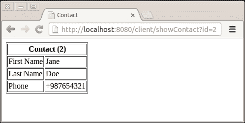

# 第十章。用户界面 – 视图

我们的 web 服务客户端获取有关联系人的信息，并将其以纯文本形式呈现给用户。我们将使用 Mustache，这是一个作为 `dropwizard-views-mustache` 模块一部分的模板引擎，来创建 HTML 视图。

# 为 web 服务客户端构建用户界面

我们将为 web 服务客户端构建一个用户界面，该界面由一个用于在表格中渲染联系人详细信息的 HTML 页面组成。

## 准备工作

毫不奇怪，我们首先需要做的是在我们的 `pom.xml` 文件中添加 `dropwizard-views` 和 `dropwizard-assets` 依赖项：

```java
<dependency><groupId>io.dropwizard</groupId><artifactId>dropwizard-views-mustache</artifactId><version>0.7.0-SNAPSHOT</version></dependency>
<dependency><groupId>io.dropwizard</groupId><artifactId>dropwizard-assets</artifactId><version>0.7.0-SNAPSHOT</version></dependency>
```

此外，我们还需要创建一个文件夹来存储我们的模板文件。根据以下截图创建 `[ProjectRoot]/src/main/resources/views` 文件夹：



## 如何做到这一点…

1.  通过在 `App` 类的 `#initialize()` 方法中将 `Views` 包添加到应用程序的引导中，启用 `Views` 包。在初始化阶段（即 `#initialize()` 方法执行时），我们可以使用引导对象将额外的模块注册到我们的应用程序中，例如包或命令。这必须在服务实际启动之前完成（即在 `#run()` 方法被调用之前）。您需要导入 `io.dropwizard.views.ViewBundle`：

    ```java
    @Override
    public void initialize(Bootstrap<PhonebookConfiguration> b) {
          b.addBundle(new ViewBundle());
        }
    ```

1.  创建一个名为 `com.dwbook.phonebook.views` 的新包，并在其中创建 `ContactView` 类。该类必须扩展 `View`，其构造函数将期望一个 `Contact` 实例。您还必须调用超类构造函数，指定此类的模板文件（在这种情况下，`contact.mustache`，它存储在我们之前创建的目录中）。您可以使用绝对路径引用 `view` 文件，其中根目录是 `[ProjectRoot]/src/main/resources/views` 文件夹。需要一个获取联系人对象的 getter，以便它可以由模板引擎访问：

    ```java
      package com.dwbook.phonebook.views;

      import com.dwbook.phonebook.representations.Contact;
      import io.dropwizard.views.View;

      public class ContactView extends View {
        private final Contact contact;

        public ContactView(Contact contact) {
          super("/views/contact.mustache");
          this.contact = contact;
        }

        public Contact getContact() {
          return contact;
        }
      }
    ```

1.  现在，让我们创建我们的模板，`contact.moustache`，它将是一个纯 HTML 文件，用于渲染一个包含联系人详细信息的表格。请记住将其存储在我们最初创建的 `views` 文件夹中。看看下面的代码片段：

    ```java
        <html>
          <head>
            <title>Contact</title>
          </head>
          <body>
            <table border="1">
              <tr>
                <th colspan="2">Contact ({{contact.id}})</th>
              </tr>
              <tr>
                <td>First Name</td>
                <td>{{contact.firstName}}</td>
              </tr>
              <tr>
                <td>Last Name</td>
                <td>{{contact.lastName}}</td>
              </tr>
              <tr>
                <td>Phone</td>
                <td>{{contact.phone}}</td>
              </tr>
            </table>
          </body>
        </html>
    ```

    Mustache 标签，即双大括号包裹的文本，将在运行时自动替换为联系人对象属性的值。Mustache 提供了许多可以在模板中使用的标签类型，例如 `条件` 和 `循环`。您可以参考 [`mustache.github.io/mustache.5.html`](http://mustache.github.io/mustache.5.html) 获取关于 Mustache 标签类型和高级使用的详细信息。

1.  让我们现在修改 `ClientResource` 类，通过更改 `@Produces` 注解，使其使用 `View` 类生成 HTML 而不是纯文本：

    ```java
    @Produces(MediaType.TEXT_HTML)
    ```

1.  修改 `#showContact` 方法，使其返回一个使用通过 Jersey 客户端获取的联系人表示初始化的 `ContactView` 实例。首先导入 `com.dwbook.phonebook.views.ContactView`：

    ```java
      @GET
      @Path("showContact")
      public ContactView showContact(@QueryParam("id") int id) {
          WebResource contactResource = client.resource("http://localhost:8080/contact/"+id);
          Contact c = contactResource.get(Contact.class);
          return new ContactView(c);
      }
    ```

## 它是如何工作的…

让我们测试 UI。重新构建应用程序，运行它，并将您的浏览器指向`http://localhost:8080/client/showContact?id=2`。现在，我们看到的不是客户端的纯文本响应，而是一个 HTML 表格，显示了 ID 等于 2 的联系人详细信息，如下面的截图所示：



当我们访问客户端的 URL 时，它会通过调用适当的服务来获取数据。然后，数据作为`Contact`实例传递给扩展了 View 的`ContactView`类，该类使用模板引擎解析指定的模板文件`contact.mustache`，并生成 HTML 标记。文件扩展名指示应使用的模板引擎。

## 更多内容…

Mustache 不是唯一由 Dropwizard 支持的模板引擎；还有 Freemarker。我们选择 Mustache 而不是 Freemarker 来展示 Dropwizard 的模板功能，因为 Mustache 是一种更无逻辑、更中立的编程语言，并且为许多编程语言提供了实现。

另一方面，Freemarker 与 Java 绑定，具有更多的编程能力，并且可以执行更复杂的任务，例如清理生成的输出。

如果我们在上一个示例中使用 Freemarker 而不是 Mustache，模板的主要表格将如下所示：

```java
<table border="1">
<tr>
  <th colspan="2">Contact (${contact.id})</th>
</tr>
<tr>
  <td>First Name</td>
  <td>${contact.firstName?html}</td>
</tr>
<tr>
  <td>Last Name</td>
  <td>{contact.lastName?html}</td>
</tr>
<tr>
  <td>Phone</td>
  <td>${contact.phone?html}</td>
</tr>
</table>
```

如您所见，这两个模板引擎的语法相似。请注意，虽然 Mustache 默认会转义变量，但在 Freemarker 中，您必须指示处理器通过在变量后添加`?html`后缀来清理输出。

### 提供静态资源

有时候，除了基于 HTML 的视图外，您还需要提供静态资源，例如 CSS 样式表、JavaScript 文件或任何可能由您的应用程序使用的其他文件。

要这样做，您可以在`#bootstrap()`方法上添加一个`AssetsBundle`实例，指定可以提供静态文件的文件夹以及该文件夹将被映射到的 URI。我们首先需要导入`io.dropwizard.assets.AssetsBundle`并相应地修改`pom.xml`文件，声明对 dropwizard-assets 组件的依赖。

例如，如果你想提供名为`stylesheet.css`的静态样式表文件，你必须将其存储在`src/main/java/resources/assets`下。

```java
b.addBundle(new AssetsBundle());
```

`stylesheet.css`文件现在可以通过`http://localhost:8080/assets/stylesheet.css` URL 访问。
