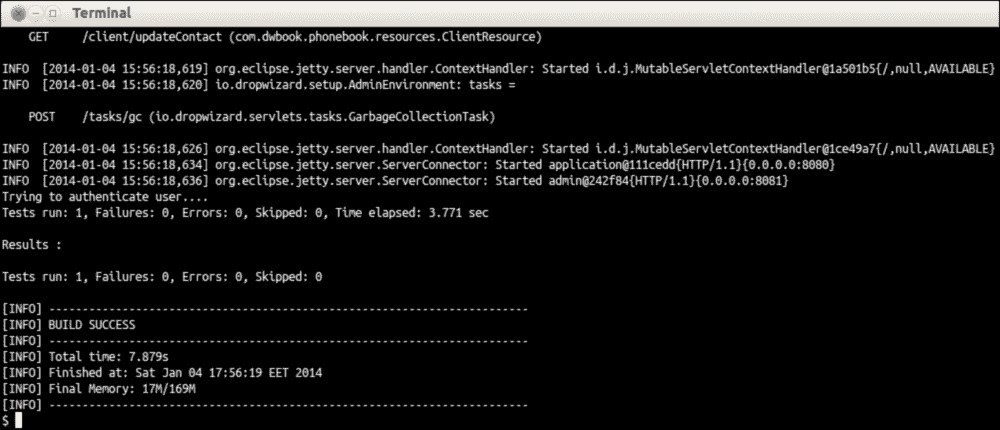
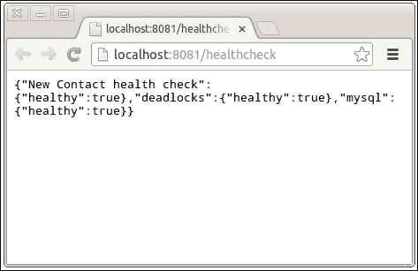

# 附录 A. 测试 Dropwizard 应用程序

我们的应用程序已经准备好了。然而，如果我们尊重其稳定性，我们必须确保我们至少用单元测试覆盖了其最重要的方面。您可能熟悉单元测试和 JUnit，但 Dropwizard 在这方面走得更远。

`dropwizard-testing` 模块包含了您创建应用程序测试所需的一切，例如 JUnit 和 FEST 断言，从小的单元测试到更大的、完整的测试。

# 为应用程序创建完整的测试

让我们为我们的应用程序创建一个完整、完全自动化的集成测试。这个测试应该像手动测试一样启动我们的应用程序，并对应用程序的服务执行一些 HTTP 请求，以检查应用程序的响应。

## 准备工作

当我们首次使用 Maven 在第二章中创建我们的项目时，*创建 Dropwizard 应用程序*，JUnit 依赖项已自动添加到我们的 `pom.xml` 文件中。我们将用 Dropwizard 的测试模块替换它，所以让我们将其删除。在 `pom.xml` 文件中定位并删除以下依赖项：

```java
<dependency>
<groupId>junit</groupId>
<artifactId>junit</artifactId>
<version>3.8.1</version>
<scope>test</scope>
</dependency>
```

我们将需要 `dropwizard-testing` 和 `hamcrest-all` 模块，所以将它们两个都包含在您的 `pom.xml` 文件中：

```java
<dependency><groupId>io.dropwizard</groupId><artifactId>dropwizard-testing</artifactId><version>0.7.0-SNAPSHOT</version></dependency><dependency><groupId>org.hamcrest</groupId><artifactId>hamcrest-all</artifactId><version>1.3</version></dependency>
```

## 如何操作…

您的项目已经有一个测试文件夹。在生成默认工件期间，Maven 创建了 `src/main/java`（我们的应用程序源代码所在的位置）和 `src/test/java` 作为单元测试的占位符。让我们看看我们需要放置什么来构建我们的测试：

1.  在 `src/test/java/com/dwbook/phonebook` 文件夹中创建一个新的测试类，`ApplicationTest`，继承自 `ResourceTest` 基类。这个类需要有两个方法；`#setUp()`，在其中我们将准备我们的模拟对象并添加所需的资源和服务提供者到内存中的 Jersey 服务器，以及 `#createAndRetrieveContact()`，在其中我们将执行实际的测试：

    ```java
    package com.dwbook.phonebook;

    import static org.fest.assertions.api.Assertions.assertThat;

    import javax.ws.rs.core.MediaType;

    import org.junit.Before;
    import org.junit.ClassRule;
    import org.junit.Test;
    import com.dwbook.phonebook.representations.Contact;
    import com.sun.jersey.api.client.Client;
    import com.sun.jersey.api.client.ClientResponse;
    import com.sun.jersey.api.client.WebResource;
    import com.sun.jersey.api.client.filter.HTTPBasicAuthFilter;

    import io.dropwizard.testing.junit.DropwizardAppRule;

    public class ApplicationTest {

      private Client client;

      private Contact contactForTest = new Contact(0, "Jane", "Doe", "+987654321");

        @ClassRule
        public static final DropwizardAppRule<PhonebookConfiguration> RULE =
                new DropwizardAppRule<PhonebookConfiguration>(App.class, "config.yaml");

        @Before
        public void setUp() {
          client = new Client();
            // Set the credentials to be used by the client
            client.addFilter(new HTTPBasicAuthFilter("wsuser", "wsp1"));
        }

        @Test
        public void createAndRetrieveContact() {
          // Create a new contact by performing the appropriate http request (POST)
            WebResource contactResource = client.resource("http://localhost:8080/contact");
        ClientResponse response = contactResource
          .type(MediaType.APPLICATION_JSON)
          .post(ClientResponse.class, contactForTest);
        // Check that the response has the appropriate response code (201)
            assertThat(response.getStatus()).isEqualTo(201);

            // Retrieve the newly created contact
            String newContactURL = response.getHeaders().get("Location").get(0);
            WebResource newContactResource = client.resource(newContactURL);
            Contact contact = newContactResource.get(Contact.class);
            // Check that it has the same properties as the initial one
            assertThat(contact.getFirstName()).isEqualTo(contactForTest.getFirstName());
            assertThat(contact.getLastName()).isEqualTo(contactForTest.getLastName());
            assertThat(contact.getPhone()).isEqualTo(contactForTest.getPhone());
        }
    }
    ```

1.  我们的测试将在我们发出 `mvn` 打包命令时运行，但它们也可以通过 `mvn` 的 `test` 命令按需执行。现在，让我们通过发出以下命令在干净的应用程序环境中运行测试：

    ```java
    $ mvn clean test

    ```

    您将看到 Maven 会清理我们的目标目录，启动应用程序，然后成功运行我们的测试。

    

## 它是如何工作的…

首先，我们定义了我们的测试数据；即我们打算创建的 `Contact` 实例。

我们初始化了一个 `DropwizardAppRule<PhonebookConfiguration>` 实例，该实例被描述为在测试类开始和结束时启动和停止应用程序的 JUnit 规则，允许测试框架以您通常进行手动测试的方式启动应用程序。为此，我们不仅需要指定我们应用程序的主类，还需要指定要使用的配置文件。

在`#setUp()`方法中，我们实例化了一个 REST 客户端来帮助我们向应用程序发送 HTTP 请求，并且由于我们的网络服务需要认证，我们还应用了必要的 HTTP 基本认证过滤器。

`#createAndRetrieveContact()`方法封装了实际的测试。使用 REST 客户端，我们执行一个 HTTP POST 请求来创建一个新的联系人。在这样一个请求之后，我们期望得到一个带有`code 201 – Created`响应的 HTTP 响应。我们使用由**Fixtures for Easy Software Testing**（**FEST**）库提供的`assertThat()`和`isEqual()`辅助方法来测试响应代码是否是我们期望的。正如 FEST 项目主页上所述（[`code.google.com/p/fest/`](http://code.google.com/p/fest/))）：

> "FEST 是一组库，在 Apache 2.0 许可下发布，其使命是简化软件测试。它由各种模块组成，可以与 TestNG 或 JUnit 一起使用。"

## 还有更多…

我们刚刚展示了如何使用 Dropwizard 测试模块通过启动一个连接到实际数据库的实际服务器来执行集成测试。尽管这个模块不仅限于集成测试。它由 JUnit 支持，你可以用它来进行较小的（但关键的）到较大的单元测试，也可以用于测试实体的正确序列化和反序列化。

# 添加健康检查

健康检查是我们应用程序的运行时测试。我们将创建一个使用 Jersey 客户端测试创建新联系人的健康检查。

健康检查结果可以通过我们应用程序的管理端口访问，默认端口为 8081。

## 如何做…

要添加健康检查，请执行以下步骤：

1.  创建一个名为`com.dwbook.phonebook.health`的新包，并在其中创建一个名为`NewContactHealthCheck`的类：

    ```java
    import javax.ws.rs.core.MediaType;
    import com.codahale.metrics.health.HealthCheck;
    import com.dwbook.phonebook.representations.Contact;
    import com.sun.jersey.api.client.*;

        public class NewContactHealthCheck extends HealthCheck {
          private final Client client;

          public NewContactHealthCheck(Client client) {
          super();
          this.client = client;
        }

        @Override
        protected Result check() throws Exception {
          WebResource contactResource = client
            .resource("http://localhost:8080/contact");
          ClientResponse response = contactResource.type(
            MediaType.APPLICATION_JSON).post(
              ClientResponse.class,
              new Contact(0, "Health Check First Name",
                "Health Check Last Name", "00000000"));
                if (response.getStatus() == 201) {
                  return Result.healthy();
                } else {
                  return Result.unhealthy("New Contact cannot be created!");
          }
        }
      }
    ```

1.  通过在`App`类的`#run()`方法中使用`HealthCheckRegistry#register()`方法将健康检查注册到 Dropwizard 环境中。你首先需要导入`com.dwbook.phonebook.health.NewContactHealthCheck`。可以通过`Environment#healthChecks()`方法访问`HealthCheckRegistry`：

    ```java
      // Add health checks
      e.healthChecks().register("New Contact health check", new NewContactHealthCheck(client));
    ```

1.  在构建并启动你的应用程序后，使用浏览器导航到`http://localhost:8081/healthcheck`：



定义的健康检查的结果以 JSON 格式呈现。如果刚刚创建的自定义健康检查或其他任何健康检查失败，它将被标记为`"healthy": false`，让你知道你的应用程序面临运行时问题。

## 它是如何工作的…

我们使用与我们的`client`类完全相同的代码来创建一个健康检查；也就是说，这是一个运行时测试，通过向`ContactResource`类的适当端点执行 HTTP POST 请求来确认可以创建新的联系人。这个健康检查让我们对我们的网络服务功能有了所需的信心。

创建一个健康检查所需的一切就是一个扩展`HealthCheck`类并实现`#check()`方法的类。在类的构造函数中，我们调用父类的构造函数，指定我们的检查名称——即用于识别我们的健康检查的那个名称。

在`#check()`方法中，我们实际上执行了一个检查。我们检查一切是否如预期那样。如果是这样，我们返回`Result.healthy()`，否则我们返回`Result.unhealthy()`，表示有问题发生。
