# 第一章. 使用 RESTful Web 服务入门

欢迎阅读这本关于如何使用 Scala 创建 REST 服务的书籍。在这本书中，我将介绍几个不同的基于 Scala 的框架，并展示如何使用它们创建 RESTful 服务。每个框架都有其创建 REST 服务的特定方式；有些更注重函数式编程，而有些则提供了丰富的**领域特定语言**（**DSL**）。阅读完这本书并完成示例后，您将能够选择最适合您和您特定问题的方法。

在本书中，我们将讨论以下 Scala 框架：

+   **Akka HTTP / DSL**：Akka HTTP 是在 Akka Streams 之上构建的一个新的 REST 框架。它提供了一个基于 Spray 的基于 DSL 的方法。Spray 是 Scala 世界中最好的 REST 框架之一，其最新版本将在 Akka HTTP 之上运行。我们将探索这个 DSL 的功能，并展示如何使用它来创建 REST 服务。

+   **Unfiltered**：Unfiltered 是一个小巧的 REST 框架，它提供了一种非常结构化的创建 REST 服务的方法。这个框架提供了对 HTTP 请求所有部分的直接访问，并且不对您如何处理 REST 服务做出假设。这使您能够完全控制请求的处理方式和响应的生成。

+   **Play 2**：Play 2 是最受欢迎的 Scala 框架之一，它提供了创建完整 Web 应用程序的功能。Play 2 还提供了创建标准 REST 服务的强大支持。我们将专注于 Play 2 的 REST 特定功能。

+   **Finagle**和**Finch**：Finagle 和 Finch 都来自 Twitter 团队。使用 Finagle 和 Finch，您可以使用干净、函数式编程的方法创建 REST 服务。

+   **Scalatra**：我们将讨论的最后一个是 Scalatra 框架。Scalatra 是一个轻量级框架，基于更为人所知的 Sinatra 框架，使用它来创建 REST 服务非常简单。

除了这些框架之外，本书的最后一章还将提供一些关于如何处理高级主题（如 HATEOAS、链接和 JSON 处理）的指导。

在本章中，我们不会探索任何框架，而是将使用本章来介绍一些概念并设置一些工具：

+   我们首先需要确保您能够运行本书提供的所有示例，因此我们将向您展示如何获取代码并设置 SBT 和 IDE

+   我们还将简要介绍 RESTful 服务是什么。

+   最后，我们将查看我们将使用不同 Scala 框架实现的服务的 API。

对于 REST 有很多不同的定义，所以在我们深入技术细节之前，让我们先看看本书中我们将使用的 REST 定义。

# REST 框架简介

在这本书中，当我们谈论 REST 时，我们谈论的是 Roy Fielding 的论文中描述的 REST（[`www.ics.uci.edu/~fielding/pubs/dissertation/top.htm`](https://www.ics.uci.edu/~fielding/pubs/dissertation/top.htm)）。基本上，REST 是一种软件架构风格，遵循这些指南时，可以用来创建性能优良、可靠和可维护的服务。为了更好地理解 REST 是什么，一个好的起点是考虑一个服务必须遵循的约束，以成为 RESTful 的。在他的论文中，Roy Fielding 定义了以下一组约束：

+   **客户端-服务器**：这个约束意味着客户端和服务器通过一个标准化的接口相互分离。这种方法的优点是客户端不需要担心持久性、数据库、消息传递、可扩展性和其他服务器端概念；相反，它们可以专注于面向用户的功能。另一个优点是客户端和服务器可以独立开发，因为它们之间唯一的依赖关系是标准化的合同。请注意，如果您需要客户端和服务器之间非常严格的合同，基于 WSDL/SOAP 的服务可能比采用 RESTful 方法更好。

+   **无状态**：除了有独立的客户端和服务器之外，这两个组件之间的通信必须是状态无关的。这意味着客户端发送的每个请求都应该包含服务器所需的所有信息。请注意，对于认证，服务器可以暂时在持久存储中存储一些会话/用户信息，但所有真实的应用程序状态都应该存储在客户端。这种方法的一个大优点是，通过仅添加更多实例，可以非常容易地水平扩展服务器。

+   **可缓存**：在 RESTful 架构中，客户端被允许缓存响应。由服务器端决定哪些响应可以被缓存以及缓存多长时间。这个约束的目的是通过避免发送那些响应将保持不变的请求，来最小化客户端和服务器之间的交互。这当然提高了客户端的性能并减少了带宽。

+   **分层系统**：这个约束描述了在 RESTful 架构中，可以创建一个分层系统，其中每一层都有其特定的功能。例如，在客户端和服务器之间，可能会有防火墙、负载均衡器、反向代理等等。然而，客户端却不会注意到这些不同的层。

+   **统一接口**：在所有约束中，这可能是最有趣的一个。这个约束定义了统一接口（客户端和服务器之间的合同）应该看起来像什么。这个约束本身由以下四个部分组成：

    +   **资源的标识**：在请求中，每个资源都应该有唯一的标识。通常，这是通过一种 URI 形式来完成的。请注意，资源的技术表示并不重要。通过 URI 标识的资源可以用 JSON、CSV、XML 和 PDF 表示，同时仍然是同一资源。

    +   **通过这些表示形式操作资源**：当客户端拥有资源的表示形式（例如，JSON 消息）时，客户端可以通过更新表示形式并将其发送到服务器来修改这个资源。

    +   **自描述消息**：客户端和服务器之间发送的每条消息都应该自描述。客户端不需要知道其他任何信息就能解析和处理消息。它应该能够从消息中确切地了解它可以对资源做什么。

    +   **超媒体作为应用状态引擎**：这个限制条件，也称为**HATEOAS**，意味着 API 的用户事先不需要知道它可以用特定的资源做什么。通过在资源中使用链接和定义媒体类型，客户端可以探索和学习它可以在资源上执行的操作。

    +   **按需代码**：按需代码是唯一可选的限制条件。当与其他限制条件进行比较时，它与其他限制条件也略有不同。这个限制条件背后的想法是，服务器可以通过传输可执行代码暂时扩展客户端的功能。在实践中，这个限制条件并不常见；大多数 RESTful 服务处理的是发送静态响应，而不是可执行代码。

重要的是要注意，这些限制条件并没有说任何关于实现技术的事情。

### 小贴士

经常在讨论 REST 时，人们会立即关注 HTTP 和 JSON。RESTful 架构并不强迫你采用这些技术。另一方面，大多数情况下，RESTful 架构是在 HTTP 之上实现的，目前使用 JSON 作为消息格式。在这本书中，我们也将关注使用 HTTP 和 JSON 来实现 RESTful 服务。

这里提到的限制条件概述了服务应该如何行动才能被认为是 RESTful 的。然而，在创建服务时，通常很难遵守所有这些限制条件，在某些情况下，并非所有限制条件都可能非常有用，或者可能非常难以实现。许多人注意到了这一点，几年前，Richardson 的成熟度模型（[`martinfowler.com/articles/richardsonMaturityModel.html`](http://martinfowler.com/articles/richardsonMaturityModel.html)）提出了一种更实际的 REST 观点。

在 Richardson 的成熟度模型中，您不必遵循所有约束才能被认为是 RESTful；相反，定义了多个成熟度级别，以表明您的服务有多 RESTful。级别越高，您的服务就越成熟，这将导致服务更易于维护、更易于扩展和更易于使用。此模型定义了以下级别：

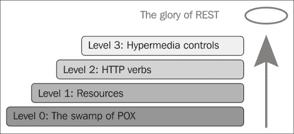

级别是这样描述的：

+   第 0 级描述了您仅向单个 HTTP 端点发送 XML 或 JSON 对象的情况。基本上，您没有做 REST，而是在 HTTP 上做 RPC。

+   第 1 级通过使用分而治之来处理复杂性，将大型服务端点分解成多个资源

+   第 2 级引入了一套标准的动词，以便我们可以以相同的方式处理类似的情况，消除不必要的差异

+   第 3 级引入了可发现性，提供了一种使协议更易于文档化的方法

在本书中，我们将主要关注在第 2 级支持 REST。因此，我们将使用定义良好的资源，并使用适当的 HTTP 动词来指示我们对资源要做什么。

在本书的第七章中，我们将讨论 HATEOAS，这可以帮助我们达到成熟度第 3 级。

现在我们已经解决了理论问题，让我们获取代码，设置您最喜欢的 IDE，并定义我们将要实现的 REST 服务的 API。

# 获取源代码

获取本书代码的方法有几个。我们在本书网站上提供了一个下载链接（[`www.packtpub.com/books/content/support/23321`](https://www.packtpub.com/books/content/support/23321)），您可以从那里下载 GitHub（[`github.com/josdirksen/rest-with-scala/archive/master.zip`](https://github.com/josdirksen/rest-with-scala/archive/master.zip)）上的最新源代码的 ZIP 文件，或者更好的是，直接使用 Git 克隆源代码库。

## 下载 ZIP 文件

如果您已下载 ZIP 文件，只需将其解压到您选择的目录：

```java
Joss-MacBook-Pro:Downloads jos$ unzip rest-with-scala-master.zip

```

## 使用 Git 克隆仓库

如果您已经安装了 Git，克隆仓库也非常简单。如果您还没有安装 Git，请按照[`git-scm.com/book/en/v2/Getting-Started-Installing-Git`](https://git-scm.com/book/en/v2/Getting-Started-Installing-Git)中的说明操作。

一旦安装了 Git，只需运行以下命令：

```java
Joss-MacBook-Pro:git jos$ git clone https://github.com/josdirksen/rest-with-scala
Cloning into 'rest-with-scala'...
remote: Counting objects: 4, done.
remote: Compressing objects: 100% (3/3), done.
remote: Total 4 (delta 0), reused 0 (delta 0), pack-reused 0
Unpacking objects: 100% (4/4), done.
Checking connectivity... done.

```

到目前为止，您已将源代码放在您选择的目录中。接下来，我们需要确保我们可以下载所有框架的依赖项并运行示例。为此，我们将使用 SBT（更多信息可以在[`www.scala-sbt.org/`](http://www.scala-sbt.org/)找到），这是 Scala 项目的最常用构建工具。

# 设置 Scala 和 SBT 以运行示例

要运行本书中提供的示例，我们需要安装 Scala 和 SBT。根据你的操作系统，需要采取不同的步骤。

## 安装 Java

在我们安装 SBT 和 Scala 之前，我们首先需要安装 Java。Scala 至少需要 Java 运行时版本 1.6 或更高。如果你还没有在你的系统上安装 Java，请按照 [`www.oracle.com/technetwork/java/javase/downloads/jdk8-downloads-2133151.html`](http://www.oracle.com/technetwork/java/javase/downloads/jdk8-downloads-2133151.html) 上的说明操作。

## 安装 Scala 和 SBT

一旦安装了 Java，安装 Scala 和 SBT 就同样简单。要安装 Scala，只需访问 [`www.scala-lang.org/download/`](http://www.scala-lang.org/download/) 并下载适合你系统的二进制文件。要安装 SBT，可以遵循 [`www.scala-sbt.org/download.html`](http://www.scala-sbt.org/download.html) 上的说明。

要检查是否已安装所有内容，请在终端中运行以下命令：

```java
Joss-MacBook-Pro:~ jos$ java -version
java version "1.8.0_40"
Java(TM) SE Runtime Environment (build 1.8.0_40-b27)
Java HotSpot(TM) 64-Bit Server VM (build 25.40-b25, mixed mode)
Joss-MacBook-Pro:~ jos$ scala -version
Scala code runner version 2.11.6 -- Copyright 2002-2013, LAMP/EPFL
Joss-MacBook-Pro:~ jos$ sbt -v
[process_args] java_version = '1.8.0_40'
# Executing command line:
java
-Xms1024m
-Xmx1024m
-XX:ReservedCodeCacheSize=128m
-XX:MaxMetaspaceSize=256m
-jar
/usr/local/Cellar/sbt/0.13.8/libexec/sbt-launch.jar

[info] Set current project to jos (in build file:/Users/jos/)

```

要退出 SBT，按 *Ctrl* + *C*。

## 运行示例

现在你已经安装了 Java、Scala 和 SBT，我们可以运行示例。当然，你也可以从你的 IDE 中运行示例（参见下一节关于如何设置 IntelliJ IDEA 和 Eclipse），但通常直接使用 SBT 也很简单。要运行示例，请按照以下步骤操作：

1.  打开一个终端并转到你提取源 ZIP 文件或克隆存储库的目录。

1.  为了测试配置，我们创建了一个简单的 `HelloWorld` 示例。从控制台执行 `sbt runCH01-HelloWorld`：

    ```java
    Joss-MacBook-Pro:rest-with-scala jos$ sbt runCH01-HelloWorld
    [info] Loading project definition from /Users/jos/dev/git/rest-with-scala/project
    [info] Set current project to rest-with-scala (in build file:/Users/jos/dev/git/rest-with-scala/)
    [info] Compiling 2 Scala sources to /Users/jos/dev/git/rest-with-scala/chapter-01/target/scala-2.11/classes...
    [info] Running org.restwithscala.chapter1.HelloWorld
    SBT successfully ran HelloWorld, configuration seems ok!
    Press <enter> to exit.

    [success] Total time: 18 s, completed Jun 13, 2015 2:34:41 PM
    Joss-MacBook-Pro:rest-with-scala jos$

    ```

1.  当加载各种依赖项时，你可能会看到很多输出，但过一段时间后，你应该会看到消息，“SBT 成功运行 HelloWorld，配置看起来正常！”

1.  本书中的所有示例都等待用户输入以终止。所以，一旦你玩完示例，只需按 *Enter* 键即可终止正在运行的程序。

在每一章中，我们将看到需要执行的 `sbt` 命令。如果你想了解可以运行的所有示例，也可以运行 `sbt` `alias` 命令，它将生成以下输出：

```java
Joss-MacBook-Pro:rest-with-scala jos$ sbt alias
[info] Loading project definition from /Users/jos/dev/git/rest-with-scala/project
[info] Set current project to rest-with-scala (in build file:/Users/jos/dev/git/rest-with-scala/)
 runCH01-HelloWorld = ; chapter01/runCH01HelloWorld
 runCH01-EchoServer = ; chapter01/runCH01EchoServer

```

除了直接从命令行运行示例外，还可以从 IDE 中运行它们。在下一节中，我们将了解如何将示例导入 IntelliJ IDEA 和 Eclipse。

# 设置 IDE

安装了 SBT 和 Scala 后，你就有了一切运行示例所需的东西。然而，有时直接从 IDE 中玩转和实验示例会更简单。Scala 工作中最受欢迎的两个 IDE 是 IntelliJ IDEA 和 Eclipse。它们都有出色的 Scala 插件和优秀的 SBT 支持。

## 配置 IntelliJ IDEA

IntelliJ 提供了其 IDE 的社区版和商业版，两者都可以用来运行和玩转本书中的示例。以下步骤适用于社区版，但也可以以相同的方式应用于商业版本：

1.  首件事是下载 IDE。您可以从 [`www.jetbrains.com/idea/download/`](https://www.jetbrains.com/idea/download/) 下载适用于您的操作系统的版本。下载后，运行安装程序并启动 IDE。当您第一次运行 IntelliJ 时，会询问您是否要安装特色插件。Scala 就是其中之一：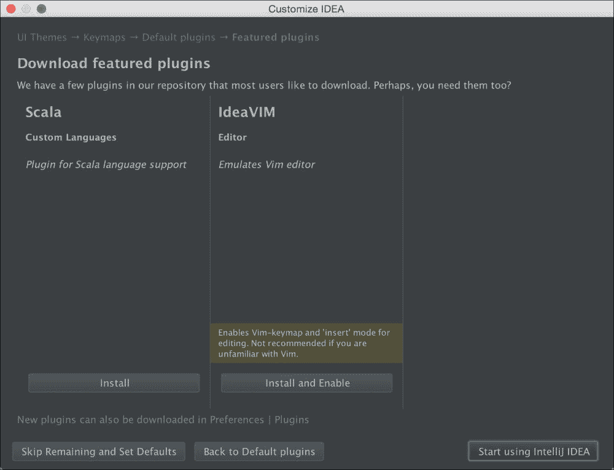

1.  从这里，点击**Scala**列下方的**安装**来在 IntelliJ 中安装 Scala 支持。安装完成后，点击**开始使用 IntelliJ IDEA**。IntelliJ 启动后，你会看到一个屏幕，你可以从这里导入现有项目：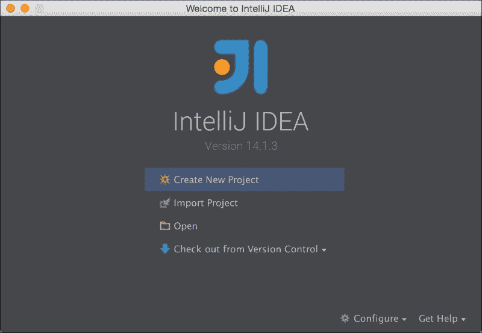

1.  从这里，选择**导入项目**，在打开的屏幕上，导航到我们提取下载源代码的目录，选择该目录，然后点击**确定**。在打开的屏幕上，选择**从外部模型导入项目**单选按钮，然后选择**SBT**。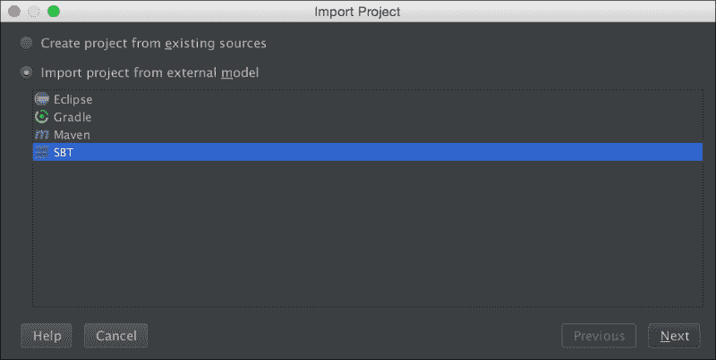

1.  现在点击**下一步**并填写打开的屏幕：

    1.  选中**下载源代码和文档**复选框。

    1.  对于**项目 SDK**，点击**新建**，选择**JDK**，并导航到您安装 JDK 1.8 的目录。

    1.  最后，点击**完成**。

IntelliJ 现在将导入所有项目并下载所有必需的依赖项。完成后，你会看到一个类似这样的屏幕，其中显示了所有项目，可以直接从 IDE 中运行示例：

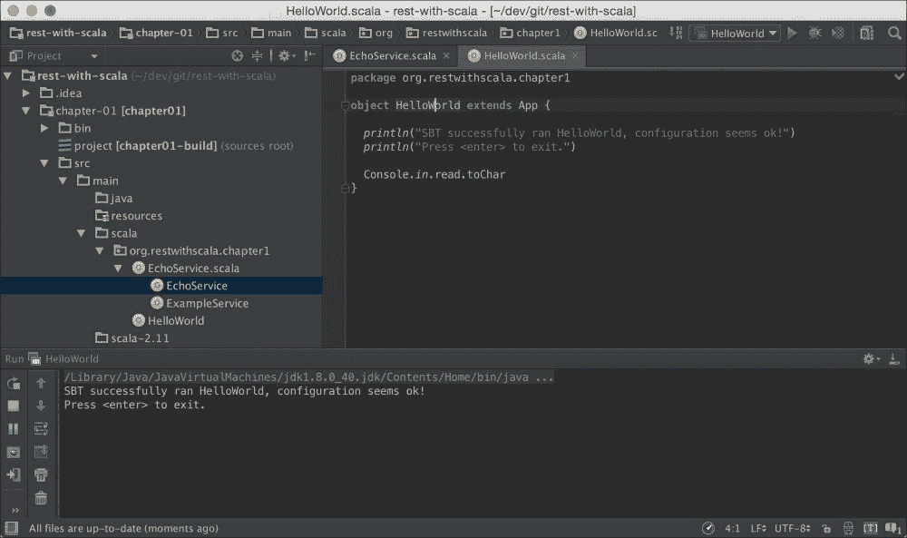

使用具有出色 Scala 支持的 IntelliJ IDEA 的替代方案是 Eclipse。

## 设置 Eclipse

Scala 社区提供了一个包含您开发 Scala 所需一切内容的 Eclipse 打包版本。

1.  要安装此版本的 Eclipse，首先从他们的下载网站 [`scala-ide.org/download/sdk.html`](http://scala-ide.org/download/sdk.html) 下载适用于您的操作系统的版本。

1.  下载完成后，将存档解压到您选择的目录，启动 Eclipse，选择存储文件的地点。启动后，您将看到一个空白的编辑器：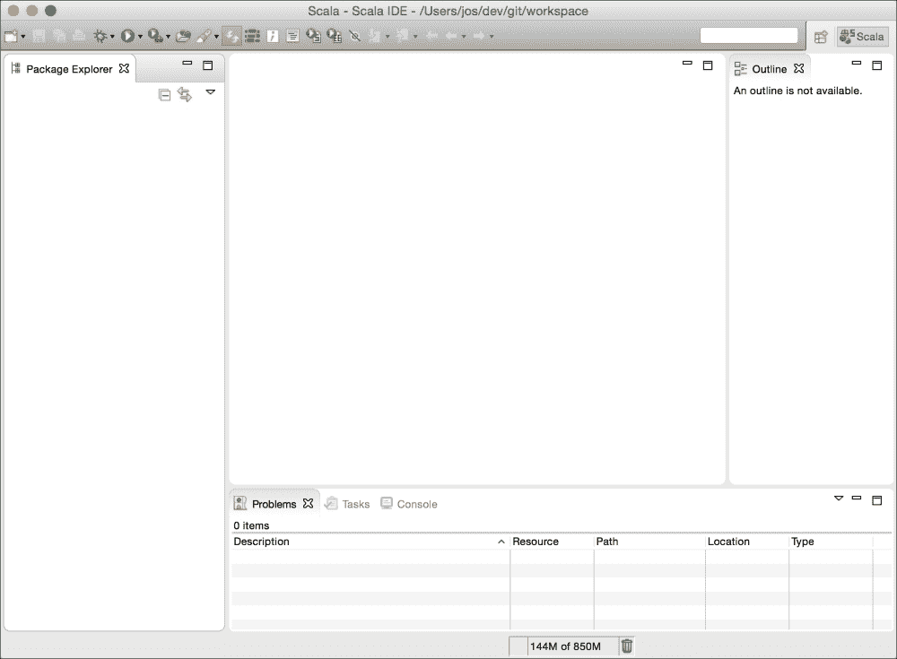

1.  在我们可以导入项目之前，我们必须首先创建所需的 Eclipse 项目配置。为此，打开一个终端并导航到您提取或克隆源代码的目录。从该目录运行 `sbt eclipse`：

    ```java
    Joss-MacBook-Pro:rest-with-scala jos$ sbt eclipse
    [info] Loading project definition from /Users/jos/dev/git/rest-with-scala/project
    [info] Updating {file:/Users/jos/dev/git/rest-with-scala/project/}rest-with-scala-build...
    [info] Resolving org.fusesource.jansi#jansi;1.4 ...
    [info] Done updating.
    [info] Set current project to rest-with-scala (in build file:/Users/jos/dev/git/rest-with-scala/)
    [info] About to create Eclipse project files for your project(s).
    [info] Successfully created Eclipse project files for project(s):
    [info] chapter-01

    ```

1.  现在我们可以导入项目了。从菜单中选择**文件** | **导入**，然后选择将**现有项目导入工作空间**。在下一屏幕上，选择包含源代码的目录作为根目录，Eclipse 应该会显示所有项目：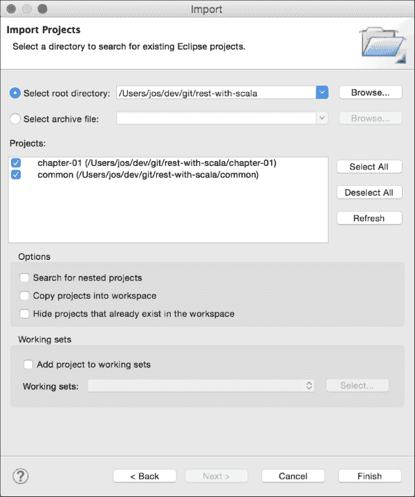

1.  现在点击**完成**，项目将被导入。现在您可以直接从 Eclipse 中编辑和运行示例。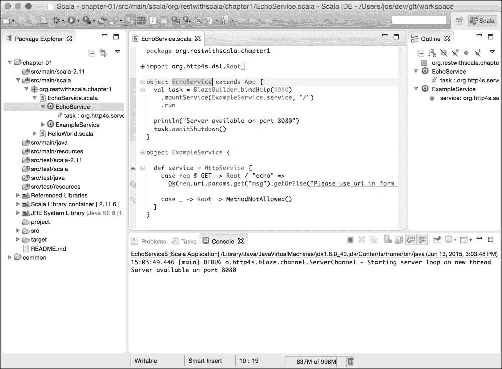

# 测试 REST API

在我们查看将要创建的服务 API 之前，我们先快速了解一下如何测试你的 REST API。当然，我们可以在 Scala 中创建一个 REST 客户端并使用它，但由于 REST 服务的最大优势之一是它们可以被人类阅读和理解，我们将使用一个简单的基于浏览器的（在这种情况下是 Chrome）REST 客户端，称为**Postman**。请注意，你当然也可以使用不同的 REST 客户端。我们选择 Postman 的原因是，使用 Postman，创建不同类型的请求非常容易；它支持 HATEOAS，并且还允许我们共享请求，因此你不必手动创建它们。

## 安装 Postman

Postman 作为一个 Chrome 插件运行，所以为了使用这个 REST 客户端，你需要使用 Chrome。一旦你启动了 Chrome，在浏览器中打开 URL，[`chrome.google.com/webstore/detail/postman-rest-client/fdmmgilgnpjigdojojpjoooidkmcomcm?hl=en`](https://chrome.google.com/webstore/detail/postman-rest-client/fdmmgilgnpjigdojojpjoooidkmcomcm?hl=en)（或者直接在 Google 上搜索 Chrome Postman）。

### 小贴士

注意，Postman 有两个版本：一个简单的 Chrome 插件，在撰写本文时，版本为 0.8.4.14，以及一个 Chrome 应用，目前版本为 3.0.0.6。对于这本书，我们将使用更简单的 Chrome 插件，所以请确保你在浏览器中安装了 0.8.4.14。

安装完成后，通过访问`chrome://apps`并选择应用程序或点击屏幕右上角新添加的按钮来打开此应用。当你打开这个插件时，你应该会看到以下窗口：

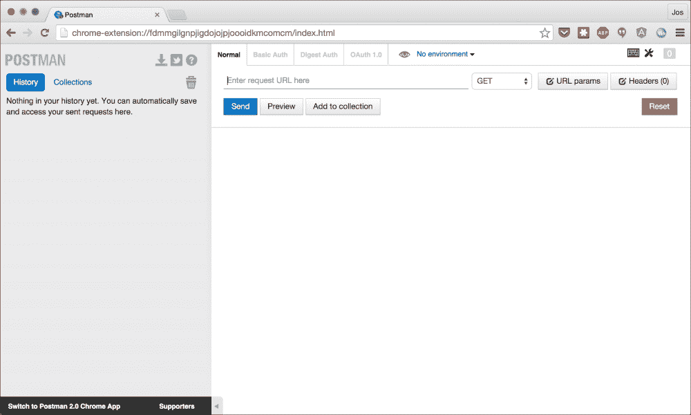

Postman 的一个有趣方面是你可以非常容易地共享 REST 查询。在本章的资源中，你可以找到一个名为`common`的目录。

## 导入请求集合

在这个目录中，有一些文件包含每个单独章节的请求。例如，对于这个章节，这些请求包含在文件`ch01_requests.json`中。每个文件都包含你可以用来测试本书中 REST 框架的多个请求。要导入所有这些请求，请按照以下步骤操作：

1.  在屏幕的左侧，点击**集合**标签。

1.  在此标签的右侧，会出现两个图标。点击右侧的图标，称为**导入集合**。

1.  在弹出的屏幕上，点击**选择文件**，导航到`common`目录，并选择所有`ch0#_requests.json`文件然后打开它们。

现在，你将有一系列集合，每个章节一个，你可以在这里找到不同章节的示例请求。

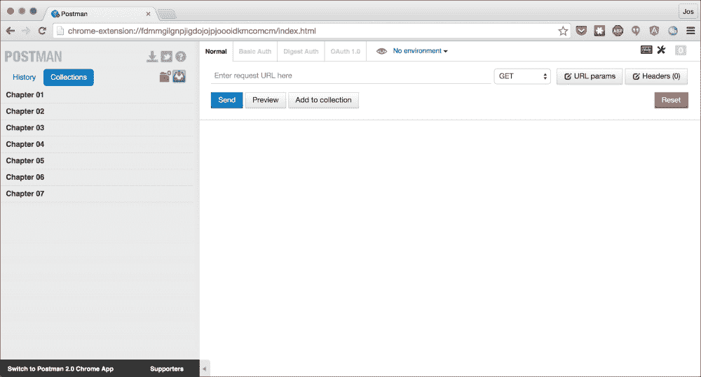

要运行一个请求，只需点击一个集合。这将显示该章节的所有请求。点击一个请求。现在点击**发送**按钮将请求发送到服务器。在接下来的章节中，我们将看到你可以使用哪个请求来测试特定 Scala REST 框架的功能。

## 测试 REST 服务

到目前为止，我们已经安装了 Scala 和 SBT，并可以使用 Postman 作为 REST 客户端。最后一步是查看一切是否正常工作。为此，我们将启动一个非常简单的 HTTP 服务，该服务会回显特定的请求参数。

### 小贴士

对于这个例子，我们使用了 HTTP4S。这是一个基本的 HTTP 服务器，允许您快速创建 HTTP 服务。如果您感兴趣，您可以在[`http4s.org/`](http://http4s.org/)找到更多关于这个库的信息。我们简单 echo 服务的源代码可以在`chapter-01/src/main/scala`目录中找到。

要运行此示例，我们需要采取几个步骤：

1.  首先，打开一个控制台窗口，转到您下载和提取源代码或克隆 Git 存储库的目录。

1.  从那个目录中，运行`sbt runCH01-EchoServer`命令。这将启动 echo 服务：

    ```java
    Joss-MacBook-Pro:rest-with-scala jos$ sbt runCH01-EchoServer
    [info] Loading project definition from /Users/jos/dev/git/rest-with-scala/project
    [info] Set current project to rest-with-scala (in build file:/Users/jos/dev/git/rest-with-scala/)
    [info] Running org.restwithscala.chapter1.EchoService
    11:31:24.624 [run-main-0] DEBUG o.http4s.blaze.channel.ServerChannel - Starting server loop on new thread
    Server available on port 8080

    ```

    ### 小贴士

    **下载示例代码**

    您可以从您在[`www.packtpub.com`](http://www.packtpub.com)的账户下载示例代码文件，以获取您购买的所有 Packt Publishing 书籍。如果您在其他地方购买了这本书，您可以访问[`www.packtpub.com/support`](http://www.packtpub.com/support)并注册，以便将文件直接通过电子邮件发送给您。

1.  现在我们已经启动了服务器，打开您的 Chrome 浏览器，然后从那里打开 Postman（记住，可以使用添加的按钮或`chrome://apps` URL）。在集合列表中，点击标记为**Echo 'hello'**的请求。这将打开请求。您现在可以通过点击**发送**按钮来运行此请求。如果一切配置正确，结果将类似于以下内容：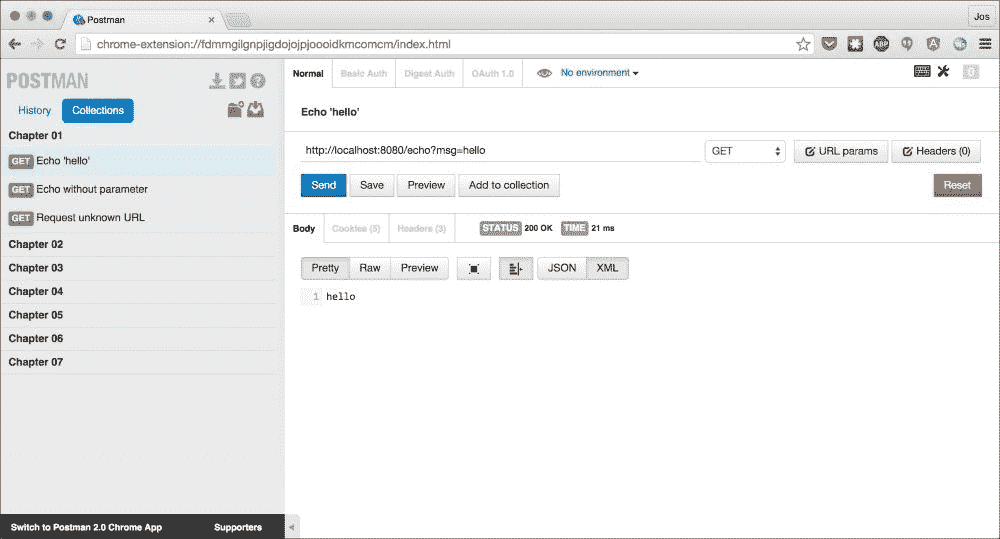

1.  通过更改`msg request`参数的值，您可以测试服务器是否真的在回显用户的输入。

1.  此集合中还有一些其他请求，展示了我们当前服务器的一些功能。您可以检查当请求参数被省略时以及当调用未知 URL 时会发生什么。

到目前为止，本章剩下的唯一事情是查看我们将在即将到来的章节中概述的不同框架创建的 API。

# REST 服务和模型

为了展示本书中各种框架的特点以及它们以不同方式解决问题的方法，我们将定义一个简单的 API，我们将使用 REST 框架来实现它。对于本书，我们将实现一个简单的待办事项列表 API。

## API 描述

我们想要创建一个 RESTful API，所以最重要的部分是从可以通過此 API 管理的资源描述开始。对于此 API，我们定义以下资源：

| 实体 | 描述 |
| --- | --- |

| 任务 | 任务是需要完成的事情。任务的 JSON 看起来类似于以下内容：

```java
{
  "id": long,
  "title": string,
  "content": string,
  "notes": [noteList],
  "status": Status,
     "assignedTo": Person,
}
```

|

| 项目 | 一个项目将允许我们将任务分组在一起，并且通过将人员分配到项目，我们可以确定谁可以处理特定的任务：

```java
{
  "id": string,
  "title": string,
  "tasks": [task],
  "members": [person],
  "updated": datetime
}
```

|

| 人员 | 人员是可以完成任务并在完成后关闭任务的人。人员只能完成分配给他的任务，或者当他属于任务所属的项目时：

```java
{
  "id": string,
  "name": string
}
```

|

| 注意 | 可以给任务添加备注，以提供有关如何执行任务的额外信息：

```java
{
  "id": string,
  "text": string,
}
```

|

在这里不深入细节，我们希望在 API 中支持以下功能：

+   **CRUD 功能**：我们希望支持一些基本的 CRUD 操作。应该能够执行以下操作：

    +   创建、更新和删除新的任务、项目、人员和备注。

    +   获取任务、项目、人员和备注的列表。

    +   在任务列表中进行搜索。

    +   给任务添加备注。还应该能够更新和删除现有的备注。

+   **高级功能**：除了标准的 CRUD-like 功能外，我们还想提供一些更高级的功能：

    +   将任务分配给特定项目

    +   将人员分配给任务

    +   将人员分配给项目

    +   将任务从一个项目移动到另一个项目

注意，我们不会为每个框架实现所有功能。我们将主要使用此 API 来解释我们如何使用各种 REST 框架。

# 摘要

第一章节到此结束。在本章中，我们介绍了 REST 是什么，以及我们将努力达到的 Robertsons 成熟度模型级别（第 2 级）。我们将在最后一章解释 HATEOAS。到目前为止，你应该已经安装了 Scala 和 SBT，并且应该能够使用 SBT 运行本书中的所有示例，并使用 Postman 中提供的请求进行测试。我们还看到了如何使用 IDE 来与代码互动。最后，我们介绍了将在接下来的章节中实现的高级 API。

在下一章中，我们将深入了解我们将要探索的第一个 Scala 框架。第一个是 Finch，它是一个建立在网络库 Finagle 之上的 REST 库。这两个都是最初由 Twitter 创建的。
