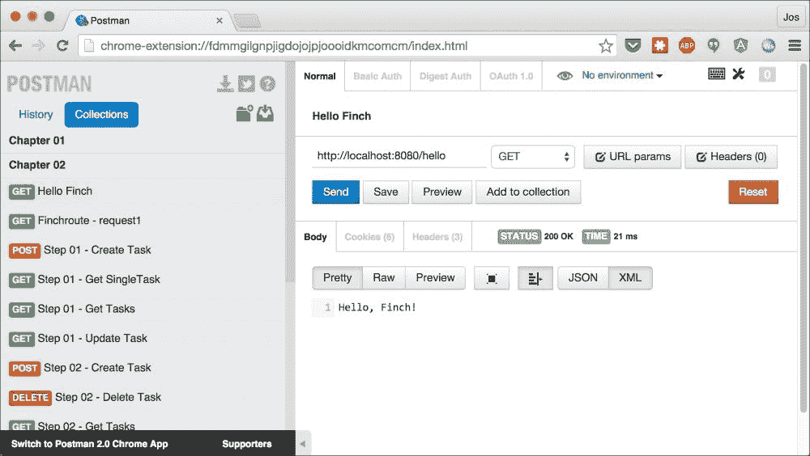
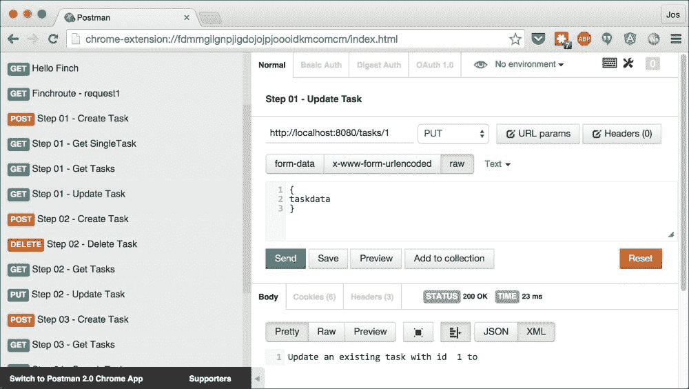
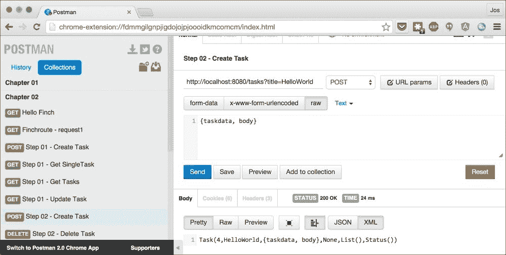
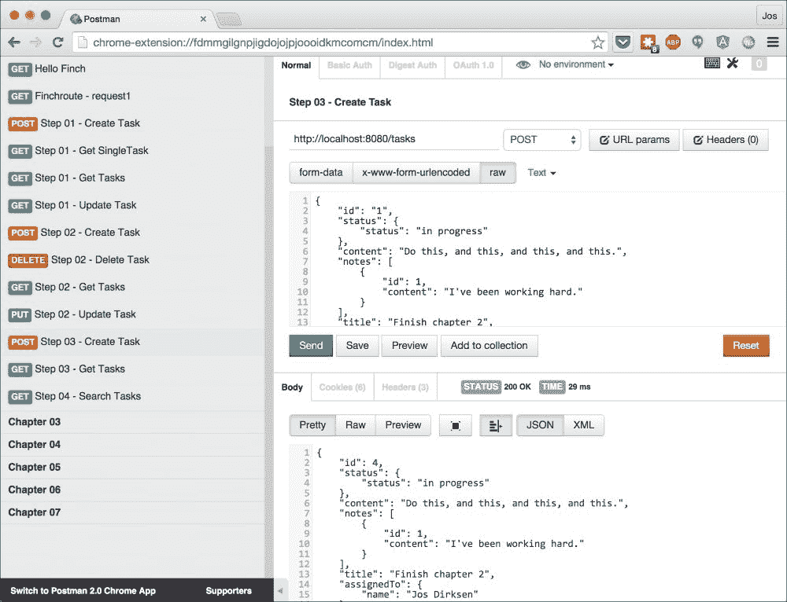
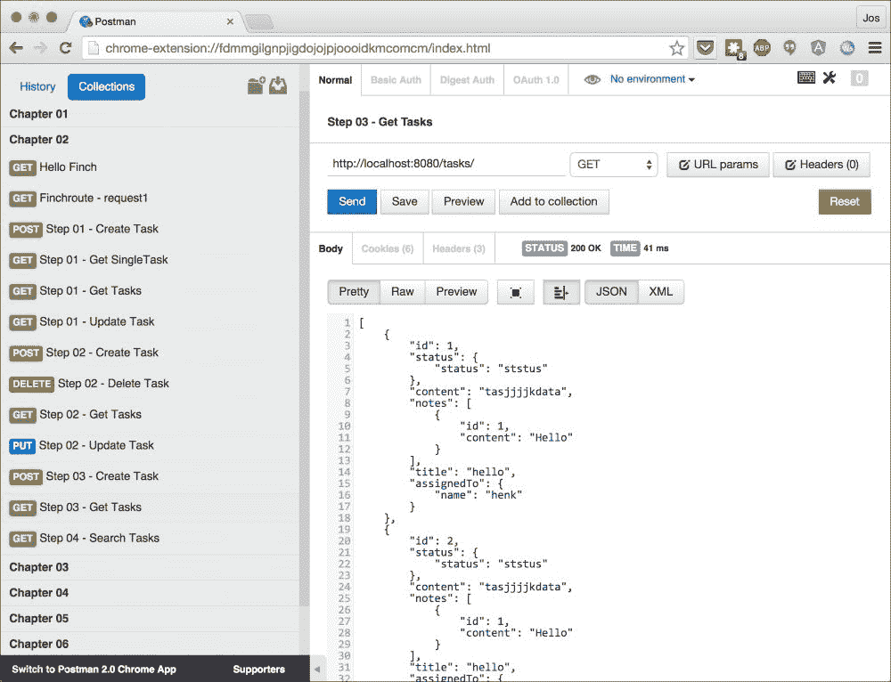
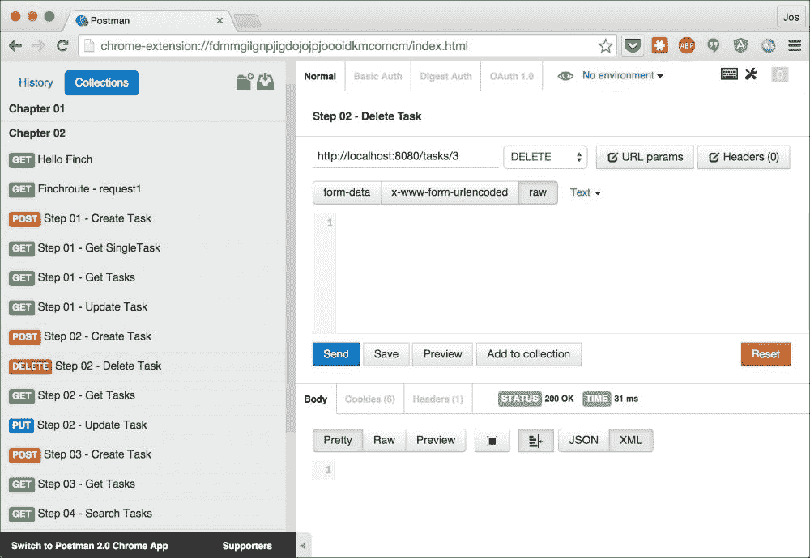
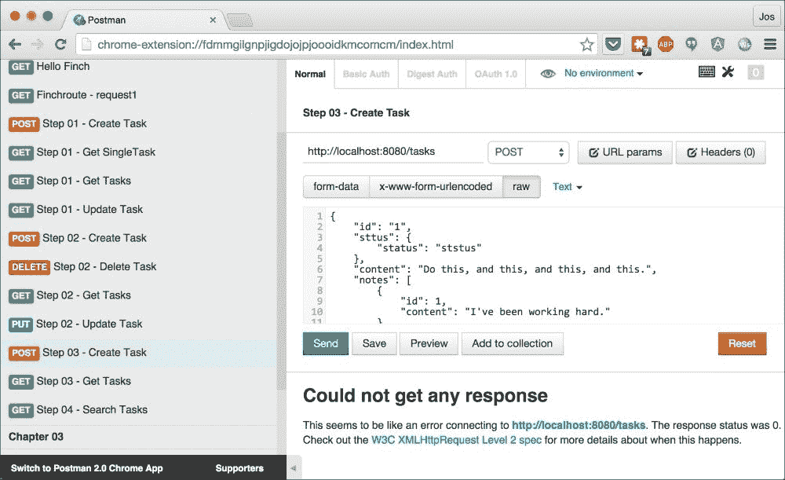
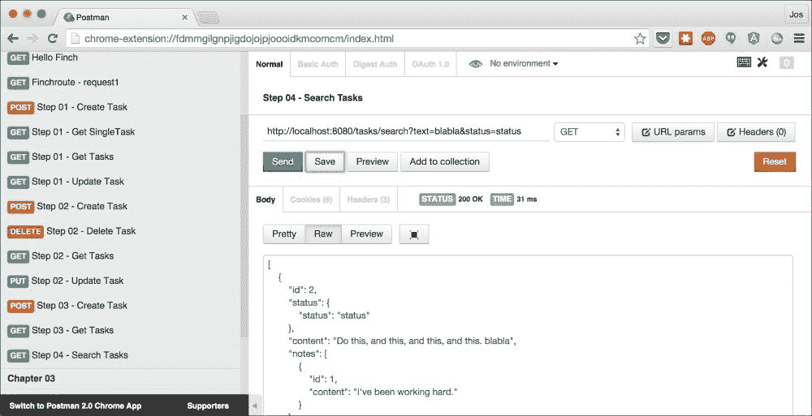
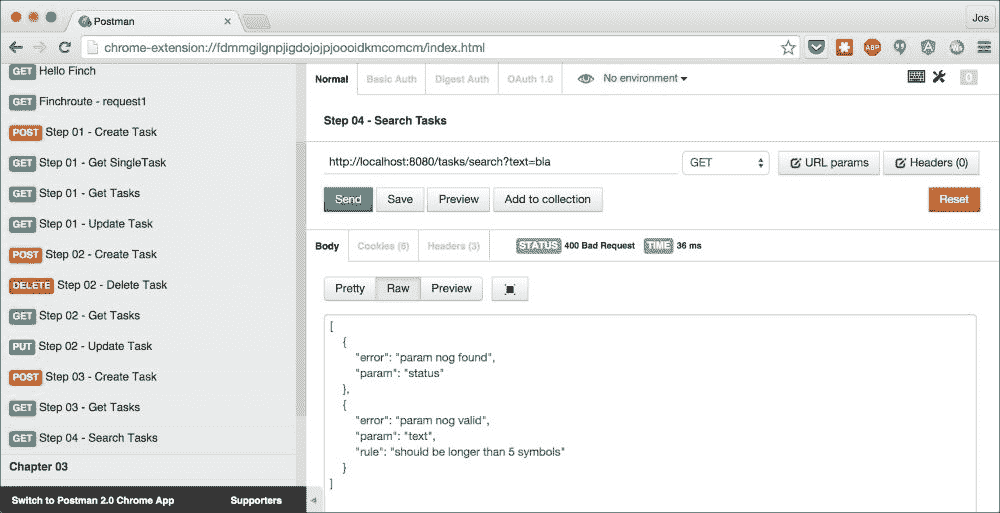
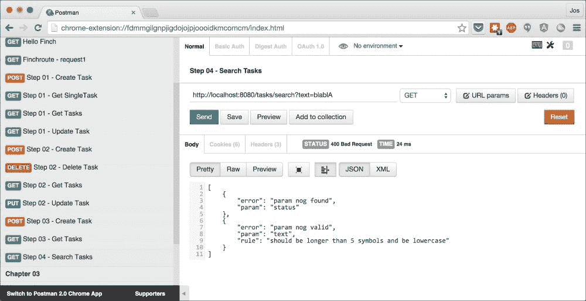

# 第二章.使用 Finagle 和 Finch 的函数式 REST 服务

在本章中，我们将向您展示如何使用 Finagle 和 Finch 库创建 REST 服务。我们将使用以下示例集来完成这项工作：

+   **您的第一个 Finagle 和 Finch 服务**：在本节中，我们将创建一个最小的 REST 服务，它将简单地返回一个字符串。

+   **HTTP 动词和 URL 匹配**：任何 REST 服务的一个重要部分是如何处理各种 URL 路径和不同的 HTTP 动词。在本部分中，我们将向您展示 Finch 如何通过使用匹配器和提取器来支持这一点。

+   **使用 RequestReaders 处理传入请求**：当创建 REST 服务时，通常需要从传入的 HTTP 请求中获取信息。Finch 使用`RequestReader`实例从请求中访问信息，这部分我们将进行解释。

+   **JSON 支持**：REST 服务通常使用 JSON 来表示资源。Finch 支持多个不同的 JSON 库。在本部分中，我们将探讨其中一个 JSON 库以及如何在 Finch 服务中使用它。

+   **请求验证和自定义响应**：本章的最后部分处理验证传入请求和创建自定义响应。Finch 使用`RequestReader`实例和验证规则，提供了一种非常优雅的方式来检查传入请求是否有效，并且可以进一步处理。

在我们开始查看代码之前，让我们快速了解一下 Finagle 和 Finch 对库的作用。

# Finagle 和 Finch 简介

Finagle 和 Finch 实际上是两个不同的框架。Finagle 是一个由 Twitter 创建的 RPC 框架，你可以用它轻松创建不同类型的服务。在其网站([`github.com/twitter/finagle`](https://github.com/twitter/finagle))上，Finagle 背后的团队这样解释它：

> *"Finagle 是一个用于 JVM 的可扩展 RPC 系统，用于构建高并发服务器。Finagle 为几种协议实现了统一的客户端和服务器 API，并设计用于高性能和高并发。Finagle 的大部分代码与协议无关，简化了新协议的实现。"*

因此，虽然 Finagle 提供了创建高度可扩展服务所需的基础设施，但它并不直接支持特定协议。这正是 Finch 发挥作用的地方。

Finch([`github.com/finagle/finch`](https://github.com/finagle/finch))在 Finagle 之上提供了一个 HTTP REST 层。在其网站上，您可以找到一个很好的引言，总结了 Finch 的目标：

> *"Finch 是在[`twitter.github.io/finagle`](http://twitter.github.io/finagle)之上的一个薄层纯函数基本块，用于构建可组合的 REST API。其使命是提供尽可能接近裸金属 Finagle API 的简单且健壮的 REST API 原语。"*

在本章中，我们只将讨论 Finch。请注意，尽管如此，Finch 提供的大部分概念都是基于底层 Finagle 理念的。Finch 提供了一套非常棒的基于 REST 的函数集，使得与 Finagle 一起工作变得非常简单和直观。

# 构建您的第一个 Finagle 和 Finch REST 服务

让我们从构建一个最小的 Finch REST 服务开始。我们首先需要确保我们拥有正确的依赖项。正如我们在上一章中提到的，我们使用 SBT 来管理我们的依赖项。各种章节的所有依赖项都可以在您提取源代码的位置的 `project` 目录下的 `Dependencies.scala` 文件中找到。对于本章中我们将看到的 Finch 示例，我们使用以下依赖项：

```java
  lazy val finchVersion = "0.7.0"

  val backendDeps = Seq(
    "com.github.finagle" %% "finch-core" % finchVersion
  )
```

本书使用单个 SBT 文件（位于根目录的 `build.sbt`）来处理所有章节，并采用多模块方法。深入探讨多模块设置超出了本书的范围。如果您想了解更多关于我们如何使用 SBT 来管理和定义各种模块的信息，请查看 `build.sbt` 文件。

现在我们已经加载了库依赖项，我们可以开始编写我们的第一个 Finch 服务。接下来的代码片段（源代码可以在 `chapter-02/src/main/scala/org/restwithscala/chapter2/gettingstarted/HelloFinch.scala` 找到）展示了一个最小的 Finch 服务，它只响应一个 `Hello, Finch!` 消息：

```java
package org.restwithscala.chapter2.gettingstarted

import io.finch.route._
import com.twitter.finagle.Httpx

object HelloFinch extends App {

  Httpx.serve(":8080", (Get / "hello" /> "Hello, Finch!").toService)

  println("Press <enter> to exit.")
  Console.in.read.toChar
}
```

当此服务在 URL 路径 `hello` 上收到 `GET` 请求时，它将响应 `Hello, Finch!` 消息。Finch 通过从路由（下一节将详细介绍路由）创建一个服务（使用 `toService` 函数）并使用 `Httpx.serve` 函数托管创建的服务来实现这一点。要运行此示例，请在您提取源代码的目录中打开一个终端窗口。在那个目录中，运行 `sbt runCH02-HelloFinch` 命令：

```java
$ sbt runCH02-HelloFinch
[info] Loading project definition from /Users/jos/dev/git/rest-with-scala/project
[info] Set current project to rest-with-scala (in build file:/Users/jos/dev/git/rest-with-scala/)
[info] Running org.restwithscala.chapter2.gettingstarted.HelloFinch 
Jun 26, 2015 9:38:00 AM com.twitter.finagle.Init$$anonfun$1 apply$mcV$sp
INFO: Finagle version 6.25.0 (rev=78909170b7cc97044481274e297805d770465110) built at 20150423-135046
Press <enter> to exit.

```

到目前为止，我们有一个运行在端口 `8080` 上的 HTTP 服务器。当我们调用 `http://localhost:8080/hello` 时，此服务器将响应 `Hello, Finch!` 消息。为了测试此服务，我们已在 Postman 中提供了一个 HTTP 请求（请参阅上一章了解如何安装 Postman 和加载请求）。您可以使用 `GET Hello Finch` 请求来测试我们刚刚创建的 Finch 服务：



# HTTP 动词和 URL 匹配

每个 REST 框架的一个重要部分是能够轻松匹配 HTTP 动词和 URL 的各种路径段。在本节中，我们将查看 Finch 提供给我们的工具。让我们先从启动服务开始。要运行此服务，您可以从源代码目录使用 `sbt runCH02-runCH02Step1` 命令：

```java
$ sbt runCH02-runCH02Step1
[info] Loading project definition from /Users/jos/dev/git/rest-with-scala/project
[info] Set current project to rest-with-scala (in build file:/Users/jos/dev/git/rest-with-scala/)
[info] Running org.restwithscala.chapter2.steps.FinchStep1 
Jun 26, 2015 10:19:11 AM com.twitter.finagle.Init$$anonfun$1 apply$mcV$sp
INFO: Finagle version 6.25.0 (rev=78909170b7cc97044481274e297805d770465110) built at 20150423-135046
Press <enter> to exit.

```

一旦服务器启动，您就可以再次使用 Postman 向此服务发送请求，使用来自 **第二章** 集合的请求。此服务对每个请求只返回一个简单的文本消息：



现在，让我们看看一些代码，看看如何使用 Finch (`chapter-02/src/main/scala/org/restwithscala/chapter2/steps/FinchStep1.scala`) 来实现这一点：

```java
package org.restwithscala.chapter2.steps

import com.twitter.finagle.Httpx
import io.finch.request._
import io.finch.route._
import io.finch.{Endpoint => _}

object FinchStep1 extends App {

  // handle a single post using a RequestReader
  val taskCreateAPI = Post / "tasks" /> (
    for {
      bodyContent <- body
    } yield s"created task with: $bodyContent")

  // Use matchers and extractors to determine which route to call
  // For more examples, see the source file.
  val taskAPI = Get / "tasks" />
            "Get a list of all the tasks" | Get / "tasks" / long />
            ( id => s"Get a single task with id: $id" ) | Put / "tasks" / long />
            ( id => s"Update an existing task with id  $id to " ) | Delete / "tasks" / long />
            ( id => s"Delete an existing task with $id" )

  // a simple server that combines the two routes
  val server = Httpx.serve(":8080", 
            (taskAPI :+: taskCreateAPI).toService )

  println("Press <enter> to exit.")
  Console.in.read.toChar

  server.close()
}
```

在此代码片段中，我们创建了一些 `Router` 实例来处理我们从 Postman 发送的请求。让我们先看看 `taskAPI` 路由器的一个路由，`Get / "tasks" / long /> (id => s"Get a single task with id: $id")`。以下表格解释了路由的各个部分：

| 部分 | 描述 |
| --- | --- |
| `Get` | 在编写路由器时，通常你做的第一件事是确定你想要匹配哪个 HTTP 动词。在这种情况下，这个路由将只匹配 `GET` 动词。除了 `Get` 匹配器之外，Finch 还提供了其他匹配器，如 `Post`、`Patch`、`Delete`、`Head`、`Options`、`Put`、`Connect` 和 `Trace`。 |
| `"tasks"` | 路由的下一部分是一个匹配器，用于匹配 URL 路径段。在这种情况下，我们匹配 URL，`http://localhost:8080/tasks`。Finch 将使用隐式转换将此字符串对象转换为 finch `Matcher` 对象。Finch 还提供了两个通配符匹配器：`*` 和 `**`。`*` 匹配器允许单个路径段有任意值，而 `**` 匹配器允许多个路径段有任意值。 |
| `long` | 路由的下一部分被称为 **提取器**。使用提取器，你可以将 URL 的一部分转换为值，然后可以使用它来创建响应（例如，使用提取的 ID 从数据库中检索对象）。`long` 提取器，正如其名称所暗示的，将匹配的路径段转换为长整型值。Finch 还提供了 int、string 和 boolean 提取器。 |
| `long => B` | 路由的最后一部分用于创建响应消息。Finch 提供了不同的方式来创建响应，我们将在本章的其他部分展示。在这种情况下，我们需要向 Finch 提供一个函数，该函数将转换我们提取的长整型值，并返回一个 Finch 可以转换为响应的值（你将在后面了解更多）。在这个例子中，我们只返回一个字符串。 |

如果你仔细查看源代码，你可能已经注意到 Finch 使用自定义运算符来组合路由的各个部分。让我们更仔细地看看这些运算符。在 Finch 中，我们得到以下运算符（在 Finch 术语中也称为 **组合器**）：

+   `/` 或 `andThen`：使用这个组合器，你可以顺序地组合各种匹配器和提取器。每当第一部分匹配时，就会调用下一个，例如，`Get / "path" / long`。

+   `|` 或 `orElse`：这个组合器允许你将两个路由器（或其部分）组合在一起，只要它们是同一类型。因此，我们可以使用 `(Get | Post)` 来创建一个匹配器，该匹配器匹配 `GET` 和 `POST` HTTP 动词。在代码示例中，我们也使用了它来组合所有返回简单字符串给 `taskAPI` 路由器的路由。

+   `/>` 或 `map`：使用这个组合器，我们将请求和从路径中提取的任何值传递给一个函数以进行进一步处理。调用函数的结果作为 HTTP 响应返回。正如您将在本章的其余部分看到的那样，有不同方式处理 HTTP 请求并创建响应。

+   `:+:`: 最终组合器允许您将不同类型的两个路由器组合在一起。在示例中，我们有两个路由器：`taskAPI`，它返回一个简单的字符串，以及 `taskCreateAPI`，它使用 `RequestReader` 对象（通过 `body` 函数）来创建响应。由于结果是通过两种不同的方法创建的，所以我们不能使用 `|` 来组合它们，而是使用 `:+:` 组合器。

到目前为止，我们每次收到请求时都只是返回简单的字符串。在下一节中，我们将探讨如何使用 `RequestReader` 实例将传入的 HTTP 请求转换为案例类，并使用这些案例类来创建 HTTP 响应。

# 使用 RequestReaders 处理传入请求

到目前为止，我们对传入的请求还没有做任何事情。在前面的示例中，我们只是返回了一个字符串，而没有使用请求中的任何信息。Finch 提供了一个非常棒的模型，使用 **Reader monad**，您可以使用它轻松地将传入请求的信息组合起来以实例化新对象。

### 注意

Reader monad 是一个标准的函数式设计模式，它允许您定义所有访问相同值的函数。关于 Reader monad 的工作原理的精彩解释可以在 [`eed3si9n.com/learning-scalaz/Monad+transformers.html`](http://eed3si9n.com/learning-scalaz/Monad+transformers.html) 找到。

让我们看看一些使用 `RequestReader` 处理传入请求的代码（完整的源代码可以在 `FinchStep2.scala` 文件中找到）：

```java
object FinchStep2 extends App {

  val matchTask: Matcher = "tasks"
  val matchTaskId = matchTask / long

  // handle a single post using a RequestReader
  val taskCreateAPI =
        Get / matchTask /> GetAllTasks() :+:
       Post / matchTask /> CreateNewTask() :+:
     Delete / matchTaskId /> DeleteTask :+:
        Get / matchTaskId /> GetTask :+:
        Put / matchTaskId /> UpdateTask

  val taskAPI = ...

  val server = Httpx.serve(":8080", 
                          (taskAPI :+: taskCreateAPI).toService )

  println("Press <enter> to exit.")
  Console.in.read.toChar

  server.close()

  sealed trait BaseTask {

    def getRequestToTaskReader(id: Long): RequestReader[Task] = {
      ( RequestReader.value(id) :: 
        param("title") :: 
        body :: 
        RequestReader.value(None:Option[Person]) ::
        RequestReader.value(List.empty[Note]) ::
        RequestReader.value(Status(""))
        ).as[Task]
    }
  }

  case class CreateNewTask() extends Service[Request, String] 
                                                   with BaseTask {

    def apply(req: Request): Future[String] = {
      val p = for {
        task <- getRequestToTaskReader(-1)(req)
        stored <- TaskService.insert(task)
      } yield stored

      p.map(_.toString)
    }
  }

  case class DeleteTask(id: Long) 
                          extends Service[Request, HttpResponse] {

    def apply(req: Request): Future[HttpResponse] = 
      TaskService.delete(id).map {
        case Some(task) => Ok()
        case None => NotFound()
      }
  }

  case class GetAllTasks() extends Service[Request, HttpResponse] {

    def apply(req: Request): Future[HttpResponse] = {
      for {
        tasks <- TaskService.all
      } yield Ok(tasks.mkString(":"))
    }
  }

  case class GetTask(taskId: Long) 
                           extends Service[Request, HttpResponse] {
    def apply(req: Request): Future[HttpResponse] = {
      TaskService.select(taskId).map {
        case Some(task) => Ok(task.toString)
        case None => NotFound()
      }
    }
  }

  case class UpdateTask(taskId: Long) 
             extends Service[Request, HttpResponse] with BaseTask {
    def apply(req: Request): Future[HttpResponse] =
      for {
        task <- getRequestToTaskReader(taskId)(req)
        stored <- TaskService.update(task)
      } yield stored match {
        case Some(task) => Ok(task.toString)
        case None => NotFound()
      }
  }
}
```

在此代码中，我们看到一些新事物。我们不是直接返回一个字符串值，而是使用一个从 `Service` 扩展的案例类来处理 HTTP 请求并创建响应。您也可以直接从 SBT 运行此服务。运行 `sbt runCH02-runCH02Step2` 命令将启动服务：

```java
$ sbt runCH02-runCH02Step2
[info] Loading project definition from /Users/jos/dev/git/rest-with-scala/project
[info] Set current project to rest-with-scala (in build file:/Users/jos/dev/git/rest-with-scala/)
[info] Compiling 1 Scala source to /Users/jos/dev/git/rest-with-scala/chapter-02/target/scala-2.11/classes...
[info] Running org.restwithscala.chapter2.steps.FinchStep2 
Jun 27, 2015 10:26:49 AM com.twitter.finagle.Init$$anonfun$1 apply$mcV$sp
INFO: Finagle version 6.25.0 (rev=78909170b7cc97044481274e297805d770465110) built at 20150423-135046
Press <enter> to exit.

```

您可以使用 Postman 再次测试此服务。让我们先测试一下我们是否可以创建一个新的任务。为此，打开 Postman 并执行请求 **步骤 02 – 创建任务**：



我们收到的响应开始看起来像真实数据。我们在 `body` 中输入的文本以及 `title` 请求参数都被使用了。

让我们详细查看我们用来创建新任务的路由器，以了解它是如何工作的：

```java
  val matchTask: Matcher = "tasks"
  val taskCreateAPI = Post / matchTask /> CreateNewTask()

  ...

  sealed trait BaseTask {

    def getRequestToTaskReader(id: Long): RequestReader[Task] = {
      ( RequestReader.value(id) :: 
        param("title") :: 
        body :: 
        RequestReader.value(None:Option[Person]) ::
        RequestReader.value(List.empty[Note]) ::
        RequestReader.value(Status(""))
        ).as[Task]
    }
  }

  case class CreateNewTask() extends Service[Request, String] 
                                                   with BaseTask {

    override def apply(req: Request): Future[String] = {
      val p = for {
        task <- getRequestToTaskReader(-1)(req)
        stored <- TaskService.insert(task)
      } yield stored

      p.map(_.toString)
    }
  }
```

在这个代码片段的顶部，你可以看到我们是如何定义处理我们刚刚通过 Postman 发起的创建任务请求的路由器的。每当有 `POST` 请求发送到 `tasks` URL 时，这个路由器会匹配并将请求映射到 `/>` 组合符右侧的函数。然而，这一次，我们并没有映射到一个返回字符串的函数，而是映射到一个扩展自 `Service` 的案例类。在我们的类中，我们必须实现从抽象 `Service` 类中继承的 `def apply(request: Req): Future[Rep]` 函数。在这个特定的例子中，我们为这个服务指定了类型参数为 `Request` 和 `String`，因此 `apply` 函数应该将传入的 `Request` 实例转换为一个 `Future[String]` 对象。

### 提示

作为第一个类型参数，你通常指定 `Request`（除非你在处理请求之前应用了过滤器，正如我们将在本章的最后部分解释的那样），第二个类型参数应该是 Finch 可以自动转换为 HTTP 响应的类型。为了自动转换，Finch 会查找作用域中的隐式 `EncodeResponse[A]` 类型类。默认情况下，Finch 会将字符串转换为 HTTP 响应。它还支持多个 JSON 库，其中案例类会自动转换为带有 JSON 体的 HTTP 响应。

在这个路由的服务的实现中，我们采取了一些步骤：

1.  首先，我们调用在基类中定义的 `getRequestToTaskReader` 函数，并传入我们想要创建的任务的 ID。由于我们正在创建一个新的任务，我们只需指定 `-1` 作为 ID，让后端生成一个真实的 ID。这个调用的结果是 `RequestReader[Task]` 实例，它可以把一个请求转换为一个 `Task` 类。

1.  我们随后直接在返回的 `RequestReader[Task]` 实例上调用传入的 `apply` 函数。这个调用返回一个 `Future[Task]` 对象，我们随后在 `for` 语句中进一步处理它。

1.  当步骤 2 中的 `future` 解析时，我们就可以访问到一个任务。我们使用 `TaskService.insert` 方法存储这个任务。这个调用同样返回一个 `Future`。

1.  最后，我们返回存储的 `Task` 对象，作为一个 `Future[Task]` 实例。

1.  服务的最后一步是将 `Future[Task]` 对象转换为 `Future[String]` 对象，我们只是通过一个简单的 `map` 函数来完成这个操作。我们需要这样做的原因是 Finch 不知道如何自动将 `Task` 对象转换为 HTTP 响应。

在我们进入下一节之前，让我们更仔细地看看我们用来将 `Request` 对象转换为 `Task` 对象的 `RequestReader[Task]` 实例：

```java
    def getRequestToTaskReader(id: Long): RequestReader[Task] = {
      ( RequestReader.value(id) :: 
        param("title") :: 
        body :: 
        RequestReader.value(Option.empty[Person]) ::
        RequestReader.value(List.empty[Note]) ::
        RequestReader.value(Status(""))
        ).as[Task]
    }
```

在这个函数中，我们使用`::`组合子将各种`RequestReader`（`body`、`param`和`RequestReader.value`）组合起来（我们将在下一节中详细解释`body`、`param`和`RequestReader.value`）。当我们向这个函数的结果传递一个`Request`时，每个`RequestReader`都会对请求执行。所有这些单独步骤的结果将使用`as[A]`函数组合（你也可以使用`asTuple`来收集结果）。Finch 标准支持转换为 int、long、float、double 和 boolean，还允许你转换为 case 类。在最后一种情况下，你必须确保来自单个`RequestReader`的结果与你的 case 类的构造函数匹配。在这个例子中，`Task`被定义为如下：

```java
case class Task(id: Long, title: String, content: String, 
                assignedTo: Option[Person], notes: List[Note],
                status: Status)
```

这与单个`RequestReader`的结果相匹配。如果你想要转换到不支持的数据类型，你可以非常简单地编写自己的，只需确保它在作用域内：

```java
implicit val moneyDecoder: DecodeRequest[Money] = 
         DecodeRequest(s => Try(new Money(s.toDouble)))
```

在到目前为止的示例代码中，我们只使用了几个`RequestReader`：`param`和`body`。Finch 提供了一些其他读者，你可以使用它们来访问 HTTP 请求中的信息：

| 读取器 | 描述 |
| --- | --- |
| `param(name)` | 这将返回请求参数作为字符串，当参数找不到时抛出`NotPresent`异常。 |
| `paramOption(name)` | 这将返回请求参数作为`Option[String]`对象。这个调用总是会成功。 |
| `paramsNonEmpty(name)` | 这将返回一个多值参数作为`Seq[String]`对象。如果参数找不到，将抛出`NotPresent`异常。 |
| `params(name)` | 这将返回一个多值参数（例如，`?id=1,2,3&b=1&b=2`）作为`Seq[String]`对象。如果参数找不到，将返回一个空列表。 |
| `header(name)` | 这将返回一个指定名称的请求头作为字符串，当头找不到时抛出`NotPresent`异常。 |
| `headerOption(name)` | 这返回一个指定名称的请求头作为`Option[String]`对象。这个调用总是会成功。 |
| `cookie(name)` | 这从请求中获取一个`Cookie`对象。如果指定的 cookie 不存在，将抛出`NotPresent`异常。 |
| `cookieOption(name)` | 这从请求中获取一个`Cookie`对象。这个调用总是会成功。 |
| `body` | 这将返回请求体名称作为字符串，当没有请求体时抛出`NotPresent`异常。 |
| `bodyOption` | 这将返回请求体作为`Option[String]`对象。这个调用总是会成功。 |
| `binaryBody` | 这将返回请求体名称作为`Array[Byte]`对象，当没有请求体时抛出`NotPresent`异常。 |
| `binaryBodyOption` | 这将返回请求体作为`Option[Array[Byte]]`对象。这个调用总是会成功。 |
| `fileUpload` | 这个`RequestReader`从请求中读取上传（multipart/form）参数，当上传找不到时抛出`NotPresent`异常。 |
| `fileUploadOption` | 这个 `RequestReader` 从请求中读取一个上传（一个多部分/表单）参数。这个调用总是会成功。 |

如您从表中看到的，已经有很多种 `RequestReader` 类型可用，在大多数情况下，这应该足以满足您的需求。如果 `RequestReader` 对象不提供所需的功能，还有一些辅助函数可供您使用，以创建您自己的自定义 `RequestReader`：

| 函数 | 描述 |
| --- | --- |
| `valueA:``RequestReader[A]` | 此函数创建一个 `RequestReader` 实例，该实例始终成功并返回指定的值。 |
| `exceptionA:``RequestReader[A]` | 此函数创建一个 `RequestReader` 实例，该实例始终失败并带有指定的异常。 |
| `constA:``RequestReader[A]` | 这个 `RequestReader` 将仅返回指定的值。 |
| `applyA:``RequestReader[A]` | 此函数返回一个 `RequestReader` 实例，该实例应用提供的函数。 |

`RequestReader` 中还有一部分我们尚未讨论。当 `RequestReader` 失败时会发生什么？Finch 有一个非常优雅的机制来处理这些验证错误。我们将在本章的最后部分回到这一点。

# JSON 支持

到目前为止，我们只是使用纯字符串作为响应。在本节中，我们将扩展前面的示例并添加 JSON 支持，并展示您如何在处理请求时控制应使用哪个 HTTP 响应代码。由于 Finch 已经支持许多 JSON 库，因此使用 JSON 与 Finch 非常简单：

+   Argonaut ([`argonaut.io/`](http://argonaut.io/)).

+   Jackson ([`github.com/FasterXML/Jackson`](https://github.com/FasterXML/Jackson))

+   Json4s ([`json4s.org/`](http://json4s.org/))

## Argonaut

在本节中，我们将探讨如何使用 Argonaut 库自动将我们的模型（我们的案例类）转换为 JSON。如果您想使用其他库之一，它们的工作方式几乎相同。

我们首先将查看我们的服务应该为这个场景处理请求和响应消息。首先，使用`sbt runCH02-runCH02Step3`命令启动服务器：

```java
$ sbt runCH02-runCH02Step3
[info] Loading project definition from /Users/jos/dev/git/rest-with-scala/project
[info] Set current project to rest-with-scala (in build file:/Users/jos/dev/git/rest-with-scala/)
[info] Running org.restwithscala.chapter2.steps.FinchStep3 
Jun 27, 2015 1:58:20 PM com.twitter.finagle.Init$$anonfun$1 apply$mcV$sp
INFO: Finagle version 6.25.0 (rev=78909170b7cc97044481274e297805d770465110) built at 20150423-135046
Press <enter> to exit.

```

当服务器启动时，打开 Postman 并从**第二章**集合中选择请求**步骤 03 – 创建任务**。当您发送此请求时，服务器将将其解析为案例类，存储它，并将存储的任务再次作为 JSON 返回。



如果您发送消息几次，您会注意到响应的 ID 会增加。原因是我们为新建的任务生成一个新的 ID，所以请忽略来自 JSON 消息的 ID。

一旦创建了多个新任务，您也可以使用**步骤 03 – 获取任务**请求来获取所有存储的任务：



当你存储了一定数量的消息后，你也可以使用 API 来删除任务。点击**步骤 02 – 删除任务**，将 URL 更改为你想删除的 ID（例如，`http://localhost:8080/tasks/3`）：



如果你想删除的任务 ID 存在，它将返回**200 Ok**，如果 ID 不存在，你将看到**404 Not Found**。

为了使这个功能正常工作，我们首先需要获取所需的 Argonaut 依赖项。为此，我们需要更改我们的 SBT 构建中的依赖项，如下所示：

```java
  lazy val finchVersion = "0.7.0"

  val backendDeps = Seq(
    "com.github.finagle" %% "finch-core" % finchVersion,
    "com.github.finagle" %% "finch-argonaut" % finchVersion
  )
```

## Jackson 和 Json4s

对于 Jackson 和 Json4s，你使用`finch-jackson`和`finch-json4s`模块。

为了自动将我们的 case classes 转换为 JSON 以及从 JSON 转换回来，我们需要告诉 Argonaut 如何将这些 case classes 转换为 JSON 以及反过来。在我们的例子中，我们已经在`chapter2`包对象中完成了这个操作（位于`package.scala`文件中）：

```java
implicit def personDecoding: DecodeJson[Person] = jdecode1L(Person.apply)("name")

implicit def personEncoding: EncodeJson[Person] = jencode1L((u: Person) => (u.name))("name")

implicit def statusDecoding: DecodeJson[Status] = jdecode1L(Status.apply)("status")

implicit def statusEncoding: EncodeJson[Status] = jencode1L((u: Status) => (u.status))("status")

implicit def noteDecoding: DecodeJson[Note] = jdecode2L(Note.apply)("id", "content")

implicit def noteEncoding: EncodeJson[Note] = jencode2L((u: Note) => (u.id, u.content))("id", "content")

implicit def taskDecoding: DecodeJson[Task] = jdecode6L(Task.apply)
    ("id", "title", "content", "assignedTo", "notes", "status") 
implicit def taskEncoding: EncodeJson[Task] = jencode6L( (u: Task) => (u.id, u.title, u.content,
                u.assignedTo, u.notes, u.status))
  ("id", "title", "content", "assignedTo", "notes", "status" )
```

对于我们想要支持的每个 case class，我们需要一组隐式值。为了从 JSON 转换，我们需要一个`DecodeJson[A]`实例，为了转换为 JSON，需要一个`EncodeJson[A]`实例。Argonaut 已经提供了一些辅助方法，你可以使用这些方法轻松地创建这些实例，我们在前面的例子中已经使用了这些方法。例如，使用`jdecode2L`（其中的`2`代表两个参数），我们将两个 JSON 值转换为 case class，而使用`jencode2L`，我们将 case class 的两个参数转换为 JSON。要了解更多关于 Argonaut 的信息，你可以查看其网站[`argonaut.io/`](http://argonaut.io/)；处理自动转换的部分（如这里所述）可以在[`argonaut.io/doc/codec/`](http://argonaut.io/doc/codec/)找到。

现在我们已经定义了 JSON 和我们所使用的 case classes 之间的映射，我们可以看看这如何改变我们的实现。在下面的代码片段中，我们看到处理**创建任务**、**删除任务**和**获取任务**请求的代码：

```java
val matchTask: Matcher = "tasks"
val matchTaskId = matchTask / long

val taskCreateAPI =
        Get / matchTask /> GetAllTasks() :+:
       Post / matchTask /> CreateNewTask() :+:
     Delete / matchTaskId /> DeleteTask 

  ...

  case class CreateNewTask() extends Service[Request, HttpResponse] {

    def apply(req: Request): Future[HttpResponse] = {
      for {
        task <- body.as[Task].apply(req)
        stored <- TaskService.insert(task)
      } yield Ok(stored)
    }
  }

  case class DeleteTask(id: Long) 
           extends Service[Request, HttpResponse] {
    def apply(req: Request): Future[HttpResponse] =
                                       TaskService.delete(id).map {
      case Some(task) => Ok()
      case None => NotFound()
    }
  }

  case class GetAllTasks() extends Service[Request, HttpResponse] {
    def apply(req: Request): Future[HttpResponse] = {
      for {
        tasks <- TaskService.all
      } yield Ok(tasks)
    }
  }
```

首先，我们将查看`CreateNewTask`类。正如你所见，由于我们不再需要显式定义如何将传入的请求转换为一个`Task`，代码已经变得简单多了。这次，在`CreateNewTask`服务的`apply`函数中，我们只需要使用正文、`RequestReader`，并使用`as[Task]`自动将提供的请求转换为`Task`。这之所以可行，是因为我们隐式地定义了一个`DecodeJson[Task]`实例。一旦从`Request`创建出`Task`，我们就将其传递给`TaskService`以存储它。`TaskService`返回一个`Future[Task]`，其中包含存储的`Task`（这将填充正确的 ID）。最后，我们返回带有存储的`Task`作为参数的`Ok`。Finch 将这个`Ok`对象转换为带有代码 200 的`HttpResponse`，并使用隐式的`EncodeJson[Task]`实例将提供的`Task`转换为 JSON。我们将在下一节更详细地看看如何构建和自定义 HTTP 响应。`GetAllTasks()`类基本上以相同的方式工作。它从`TaskService`实例检索一个`Future[Seq[Task]]`对象，Finch 以及隐式定义的对象，并且知道如何将这个任务序列转换为正确的 JSON 消息。

在我们进入下一节之前，让我们快速看一下`DeleteTask`类。正如你在代码中所见，这个 case 类有一个额外的参数。这个参数将包含由映射到这个`Service`的`router`中的`long`提取器提取的长值。如果你在`router`中有多个提取器，你的 case 类应该有相同数量的参数。

# 请求验证和自定义响应

到目前为止，我们还没有查看当我们的某个 RequestReader 无法读取所需信息时会发生什么。一个头可能缺失，一个参数可能格式不正确，或者一个 cookie 不存在。例如，如果你将**步骤 03 – 创建任务**请求中的 JSON 字段的某些名称重命名，并发出请求，它将静默失败：



然而，Finch 提供了一种优雅的方式来处理所有来自 RequestReaders 的异常。首先，我们将看看我们想要达到的结果。首先，启动另一个类似于这样的`sbt`项目：

```java
$ sbt runCH02-runCH02Step4
[info] Loading project definition from /Users/jos/dev/git/rest-with-scala/project
[info] Set current project to rest-with-scala (in build file:/Users/jos/dev/git/rest-with-scala/)
[info] Compiling 1 Scala source to /Users/jos/dev/git/rest-with-scala/chapter-02/target/scala-2.11/classes...
[info] Running org.restwithscala.chapter2.steps.FinchStep4 
Jun 28, 2015 2:10:12 PM com.twitter.finagle.Init$$anonfun$1 apply$mcV$sp
INFO: Finagle version 6.25.0 (rev=78909170b7cc97044481274e297805d770465110) built at 20150423-135046
Press <enter> to exit.

```

打开 Postman 并使用**步骤 03 – 创建任务**来创建一些数据库中的任务。对于这个示例，我们添加了一个可以通过**步骤 04 – 搜索任务**请求访问的搜索功能。



为了展示验证是如何工作的，我们在请求参数中添加了一些规则。`status`请求参数是必需的，当使用`text`参数时，其值应该至少有五个字符。为了测试这是如何工作的，你可以移除`status`参数，或者将`text`参数的值更改为小于五个字符的内容。下面的截图显示了产生的错误消息：



下面的代码片段显示了用于搜索数据库和展示我们必须对我们的应用程序进行哪些更改以获得这些验证结果的 case class：

```java
// uses the following route
// Get / matchTask / "search" /> SearchTasks()

case class SearchParams(status: String, text: Option[String])

case class SearchTasks() extends Service[Request, HttpResponse] {

    def getSearchParams: RequestReader[SearchParams] = (
          param("status") ::
          paramOption("text").should(beLongerThan(5))
        ).as[SearchParams]

    def apply(req: Request): Future[HttpResponse] = {
      (for {
        searchParams <- getSearchParams(req)
        tasks <- TaskService.search
                   (searchParams.status, searchParams.text)
      } yield Ok(tasks)).handle({case t: Throwable => 
                                         BadRequest(errorToJson(t))})
    }

    def errorToJson(t: Throwable):Json = t match {

      case NotPresent(ParamItem(param)) =>
        Json("error" -> Json.jString("param not found"), 
                                     "param" -> Json.jString(param))
      case NotValid(ParamItem(param), rule) =>
        Json("error" -> Json.jString("param not valid"), 
                                     "param" -> Json.jString(param), 
                                     "rule" -> Json.jString(rule))
      case RequestErrors(errors) =>
                          Json.array(errors.map(errorToJson(_)):_*)
      case error:Throwable => Json("error" -> 
                          Json.jString(error.toString))
    }
  }
```

当一个请求传递到这个`Service`时，会调用`apply`函数。在这个函数中，我们将请求传递给一个类似于下面的`RequestReader[SearchParams]`对象：

```java
    def getSearchParams: RequestReader[SearchParams] = (
          param("status") ::
          paramOption("text").should(beLongerThan(5))
        ).as[SearchParams]
```

当这个`RequestReader`被一个请求调用时，它将首先尝试获取`status`参数。如果这个参数找不到，将会抛出一个`NotPresent`异常。然而，这并不会停止请求的处理，`RequestReader`会获取`text`参数的值。如果`text`参数可用，它应该至少有五个字符长（注意，我们还有一个`shouldNot`函数，用于当你想要检查一个规则不适用时）。如果不是，将会抛出一个`NotValid`异常。在前面的例子中，如果发生这种情况，请求的处理将会停止，并且服务不会返回任何响应。为了处理这些异常，我们需要在`Future[HttpResponse]`实例（或`RequestReader()`函数返回的`Future`）上调用`handle`函数。

### 注意

当你开始自己使用 Finch 时，你可能会注意到它不使用 Scala 的标准`scala.concurrent.Future`类，而是使用`com.twitter.util.Future`中定义的`Future`。原因在于 Finch（以及 Finch 内部使用的 Finagle，它是一个 Twitter 项目），Twitter 的 Future 有很多额外的功能。例如，下一节中讨论的`handle`函数是 Twitter `Future`对象上的标准函数。然而，我们在这本书中使用的`TaskService`使用标准的 Scala `Future`对象。为了确保我们能够轻松地在 Scala `Future`和 Twitter `Future`对象之间进行交互，我们创建了一些隐式转换。如果你对它们的外观感兴趣，你可以在`src/main/scala/org/restwithscala/chapter2/package.scala`文件中找到这些隐式转换。

`handle`函数接受一个部分函数，在这个场景中，它应该返回一个`HttpResponse`实例。正如你在代码中看到的，我们只是将验证相关的异常转换为 JSON 对象，并包装在`BadRequest`类中。

在示例中，我们展示了我们使用了 `beLongerThan` 规则。Finch 提供了一些标准规则，您可以使用这些规则来检查特定 `RequestReader` 的结果是否有效：

| 规则 | 描述 |
| --- | --- |
| `beLessThan(n: Int)` | 这检查数值是否小于指定的整数。 |
| `beGreaterThan(n: Int` | 这检查数值是否大于指定的整数。 |
| `beShorterThan(n: Int)` | 这检查字符串的长度是否小于指定的整数。 |
| `beLongerThan(n: Int)` | 这检查字符串的长度是否大于指定的整数。 |
| `and` | 这将两个规则组合在一起。两个规则都必须是有效的。 |
| `or` | 这将两个规则组合在一起。其中必须有一个规则是有效的。 |

创建自定义验证规则非常简单。例如，以下代码创建了一个新规则，用于检查字符串是否包含任何大写字母：

```java
    val shouldBeLowerCase = ValidationRuleString {!_.exists((c: Char) => c.isUpper) }

    def getSearchParams: RequestReader[SearchParams] = (
          param("status") ::
          paramOption("text").should(beLongerThan(5) and shouldBeLowerCase)
        ).as[SearchParams]
```

当我们现在运行查询时，如果我们使用大写字母作为 `text` 参数，我们也会收到一条消息：



在我们进入下一章之前，我们将更详细地研究最后一部分，即如何创建 HTTP 响应。我们已经通过 `Ok`、`BadRequest` 和 `NotFound` 情况类看到了一些这方面的内容。Finch 还提供了一些额外的函数来进一步自定义 HTTP 响应消息。您可以使用以下函数来创建响应：

| 函数 | 描述 |
| --- | --- |
| `withHeaders(headers: (String, String)*)` | 这会将提供的头添加到响应中。 |
| `withCookies(cookies: Cookie*)` | 这会将提供的 cookie 添加到响应中。 |
| `withContentType(contentType: Option[String])` | 这将响应的内容类型设置为指定的 `Option[String]` 值。 |
| `withCharset(charset: Option[String])` | 这将响应的字符集设置为提供的 `Option[String]` 对象。 |

例如，如果我们想创建一个具有自定义字符集、自定义内容类型、一些自定义头和字符串体的 `Ok` 响应，我们会这样做：

```java
  Ok.withCharset(Some("UTF-8"))
    .withContentType(Some("text/plain"))
    .withHeaders(("header1" -> "header1Value"),
                 ("header2" -> "header2Value"))("body")
```

# 摘要

在本章中，我们介绍了 Finch 框架。使用 Finch 框架，您可以使用函数式方法创建 REST 服务。请求处理是通过将请求映射到 `Service` 来完成的；使用 `RequestReader` 验证和解析请求；所有部分都是可组合的，可以从简单部分创建复杂的路由、请求读取器、规则和服务。

在下一章中，我们将深入研究一个采用不同方法的 Scala REST 框架。我们将探讨 Unfiltered，它使用基于模式匹配的方法来定义 REST 服务。
