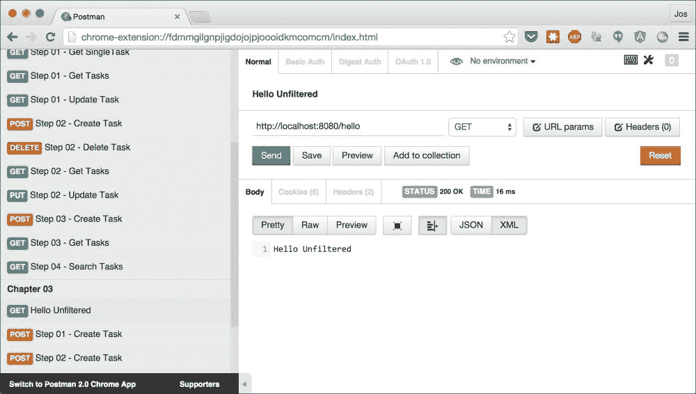
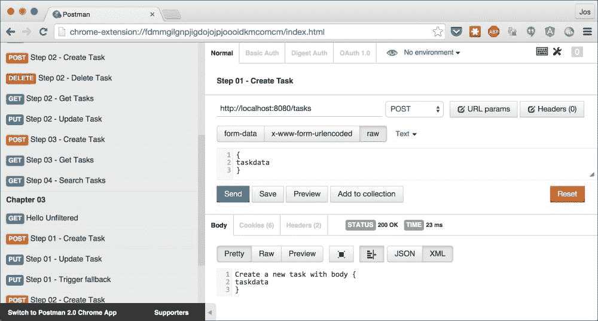
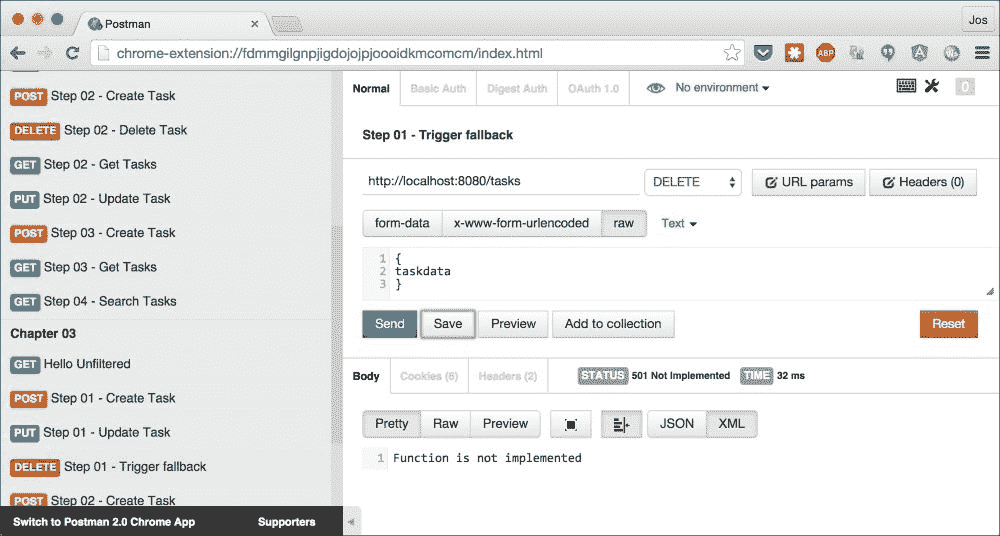
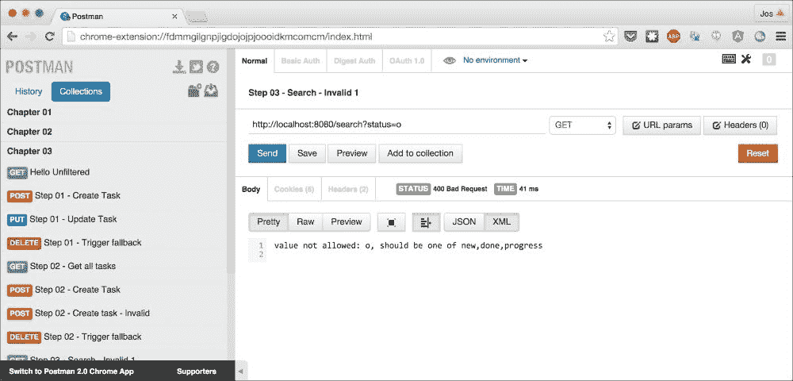
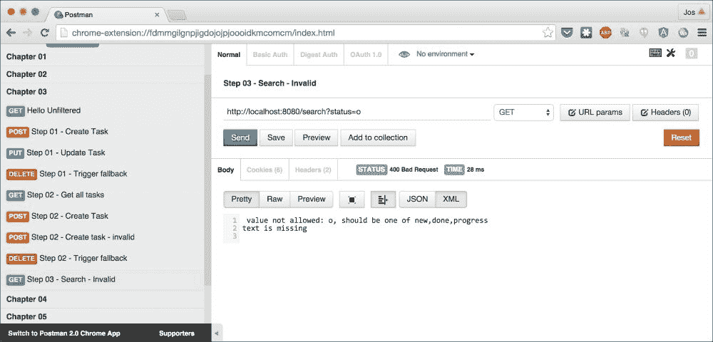

# 第三章。使用 Unfiltered 的 REST 服务模式匹配方法

在本章中，我们将介绍一个名为**Unfiltered**的轻量级 REST 框架。使用 Unfiltered，您可以使用标准的 Scala 模式匹配来完全控制如何处理 HTTP 请求和创建 HTTP 响应。在本章中，我们将探讨以下主题：

+   为基于 Unfiltered 的 REST 服务设置基本框架

+   使用匹配器和提取器处理传入的 HTTP 请求

+   以同步和异步方式处理请求

+   使用提取器和指令转换和验证传入的请求和参数

+   自定义响应代码和响应格式

# 什么是 Unfiltered

Unfiltered 是一个易于使用的轻量级 REST 框架，它提供了一组您可以使用来创建自己的 REST 服务的构造。为此，Unfiltered 使用 Scala 模式匹配，以及一组匹配器和提取器。Unfiltered 有趣的部分之一是它让您完全控制如何处理请求和定义响应。除非您告诉它，否则框架本身不会添加任何标题，也不会对内容类型或响应代码做出假设。

Unfiltered 已经存在了几年，并被许多公司使用。其中一些最知名的是以下两个：

+   **Remember the Milk**: Remember the Milk 是众所周知的待办事项应用之一。它使用 Unfiltered 来处理所有其公开 API。

+   **Meetup**: 使用 Meetup，有共同兴趣的人们可以聚集在一起分享知识和安排聚会。Meetup 使用 Unfiltered 来提供其实时 API。

关于 Unfiltered 的更多信息以及文档，您可以查看网站[`unfiltered.databinder.net/`](http://unfiltered.databinder.net/)。

# 您的第一个 Unfiltered 服务

就像我们在上一章中所做的那样，我们将从创建最基础的 Unfiltered REST 服务开始。本章中使用的示例和框架的依赖项可以在`Dependencies.scala`文件中找到，该文件位于`project`目录中。对于本章中解释的 Unfiltered 示例，我们使用以下 SBT 依赖项：

```java
  lazy val unfilteredVersion = "0.8.4"
  val backendDeps = Seq(
    "net.databinder" %% "unfiltered-filter" % unfilteredVersion,
    "net.databinder" %% "unfiltered-jetty" % unfilteredVersion
  )
```

要与 Unfiltered 一起工作，我们至少需要`unfiltered-filter`模块，它包含我们创建路由和处理请求和响应所需的核心类。我们还需要定义我们想要使用哪种类型的服务器来运行 Unfiltered。在这种情况下，我们在嵌入的 Jetty([`www.eclipse.org/jetty/`](http://www.eclipse.org/jetty/))实例上运行 Unfiltered。

在这些依赖项就绪后，我们可以创建一个最小的 Unfiltered 服务。您可以在本章的源文件中找到此服务的代码，该文件位于`HelloUnfiltered.scala`，它位于本章的源文件中：

```java
package org.restwithscala.chapter3.gettingstarted

import unfiltered.request._
import unfiltered.response._

object HelloUnfiltered extends App {

  // explicitly set the thread name. If not, the server can't be 
  // stopped easily when started from an IDE
  Thread.currentThread().setName("swj");

  // Start a minimalistic server
  val echo = unfiltered.filter.Planify {
    case GET(Path("/hello")) => ResponseString("Hello Unfiltered")
  }
  unfiltered.jetty.Server.http(8080).plan(echo).run()

  println("Press <enter> to exit.")
  Console.in.read.toChar

}
```

我们在这里做的是创建一个简单的路由，它响应 `/hello` 路径上的 `GET` 请求。当 Unfiltered 收到这个请求时，它将使用 `ResponseString` 对象创建响应来返回 `Hello Unfiltered` 响应（我们将在稍后讨论这个问题）。这个路由绑定到一个运行在端口 `8080` 上的 Jetty 服务器。

### 小贴士

你可能已经注意到了这个例子开头奇怪的 `Thread.currentThread().setName` 调用。我们这样做的原因是为了避免 Unfiltered 以守护进程模式启动。Unfiltered 尝试检测我们是否是从 SBT 启动或正常运行；如果是通过 SBT 运行，它允许我们只需按下一个键（我们想要的操作）来停止服务器。如果不是，它将在后台运行，并需要一个关闭钩子来停止服务器。它是通过检查当前线程的名称来做到这一点的。如果名称是 `main`，它将以守护进程模式运行 Unfiltered，如果名称是其他内容，它将正常运行，这允许我们轻松地停止服务器。所以通过将主线程的名称设置为其他内容，我们也可以在从 IDE 运行时获得这种良好的关闭行为。

此外，我们还需要为 Jetty 设置日志记录，Jetty 是 Unfiltered 所使用的引擎。Jetty 在其默认配置中具有一些繁多的日志记录。为了将 Jetty 的日志记录最小化，只记录有用的信息，我们需要添加一个 `logback.xml` 配置文件：

```java
<configuration>

    <appender name="STDOUT" class="ch.qos.logback.core.ConsoleAppender">
        <encoder>
            <pattern> %d{HH:mm:ss.SSS}[%thread]%-5level%logger{36}-%msg%n
            </pattern>
        </encoder>
    </appender>

    <root level="INFO">
        <appender-ref ref="STDOUT"/>
    </root>
</configuration>
```

现在，让我们启动服务器并使用 Postman 调用 Unfiltered 服务。要启动这个示例，从源代码的根目录运行 `sbt runCH03-HelloUnfiltered`：

```java
$ sbt runCH03-HelloUnfiltered
[info] Loading project definition from /Users/jos/dev/git/rest-with-scala/project
[info] Set current project to rest-with-scala (in build file:/Users/jos/dev/git/rest-with-scala/)
[info] Running org.restwithscala.chapter3.gettingstarted.HelloUnfiltered 
10:04:32.108 [swj] INFO  org.eclipse.jetty.server.Server - jetty-8.1.13.v20130916
10:04:32.178 [swj] INFO  o.e.jetty.server.AbstractConnector - Started SocketConnector@0.0.0.0:8080
Embedded server listening at
 http://0.0.0.0:8080
Press any key to stop.

```

打开 Postman，点击集合名称 **第三章**，然后打开第一个请求。一旦你点击 **发送**，你应该会看到服务器返回的响应，**Hello Unfiltered**：



在下一节中，我们将更详细地看看 Unfiltered 是如何使用模式匹配将传入的请求映射到函数的。

# HTTP 动词和 URL 匹配

Unfiltered 使用标准的 Scala 模式匹配来确定如何处理特定的请求。以下代码显示了 Unfiltered 为许多简单的 REST 调用提供匹配器的方式：

```java
package org.restwithscala.chapter3.steps

import unfiltered.request._
import unfiltered.response._

object Step1 extends App {

Thread.currentThread().setName("swj");

  object api extends unfiltered.filter.Plan {
    def intent = taskApi.onPass(fallback)

    def taskApi = unfiltered.filter.Intent {
      case GET(Path("/tasks")) 
            => ResponseString(s"Get all tasks" )
      case GET(Path(Seg("tasks" :: id :: Nil))) 
            => ResponseString(s"Get a single task with id: $id" )
      case DELETE(Path(Seg("tasks" :: id :: Nil)))   
           => ResponseString
                     (s"Delete an existing task with id $id")

      case req @ Path("/tasks") => req match {
        case POST(_) 
          => ResponseString(s"Create a new" +
                           s" task with body ${Body.string(req)}")
        case PUT(_) 
          => ResponseString(s"Update a new task with" +
                            s" body ${Body.string(req)}")
        case _ => Pass
      }
      case _ => Pass
    }

    def fallback = unfiltered.filter.Intent {
      case _ => NotImplemented ~> 
                ResponseString("Function is not implemented")
    }
  }

  unfiltered.jetty.Server.http(8080).plan(api).run()

  println("Press <enter> to exit.")
  Console.in.read.toChar

}
```

在这个代码片段中有很多东西可以看，所以让我们从开始的地方开始。要在 Unfiltered 中创建一个 REST API，我们需要创建一个 `Plan` 对象。一个 `Plan` 描述了如何响应特定的请求。有两种不同的方式来创建这样的 `Plan`。你可以直接传递一个部分函数到 `unfiltered.filter.Planify`，就像我们在本章前面的入门示例中所做的那样，或者显式地扩展 `unfiltered.filter.Plan` 并设置 `intent val` 为你的路由配置。在本章的其余部分，我们将使用后一种方法，因为它允许我们以简单的方式组合 API 部分。让我们从 `taskApi` 实例的第一个匹配器集合开始：

```java
      case GET(Path("/tasks")) 
            => ResponseString(s"Get all tasks" )
      case GET(Path(Seg("tasks" :: id :: Nil))) 
            => ResponseString(s"Get a single task with id: $id" )
      case DELETE(Path(Seg("tasks" :: id :: Nil))) 
            => ResponseString(s"Delete an existing task with id $id")
```

如您所见，我们使用了 Scala 的标准模式匹配。这些模式将与当前的 `HttpRequest` 实例进行匹配，并使用 Unfiltered 提供的多个匹配器：

| 匹配器 | 描述 |
| --- | --- |
| `GET` 和其他 HTTP 动词。 | 使用此匹配器，我们可以匹配请求的 HTTP 动词。Unfiltered 为此提供了以下标准匹配器：`GET`、`POST`、`PUT`、`DELETE`、`HEAD`、`CONNECT`、`OPTIONS`、`TRACE`、`PATCH`、`LINK` 和 `UNLINK`。如果您有需要匹配其他动词的边缘情况，您可以轻松创建自己的匹配器，例如：`object WOW extends Method("WOW")` |
| `Path` | 我们接下来看到的匹配器是 `Path` 匹配器。使用此匹配器，您可以检查是否匹配完整的 URL 路径。因此，在前面的示例中，第一个模式仅在精确的 `/tasks` 路径被调用时匹配。 |
| `Seq` | 如果您想提取路径段或更灵活地在多个路径段上进行匹配，您可以使用 `Seq` 匹配器。此匹配器将检查请求所发生的 URL，将其拆分为路径段，并检查单个路径段是否匹配或提取路径段以进行进一步处理。 |

因此，在我们的 API 中：

+   第一个案例匹配 `/tasks` 路径上的 `GET` 请求。

+   第二个案例匹配 `/tasks/:id` 路径上的 `GET` 请求。ID 将传递到处理此案例的函数中。

+   第三个案例与第二个案例相同，但这次是为 `DELETE` 请求。 |

除了本例中显示的匹配器之外，Unfiltered 还提供了以下功能：

| 匹配器 | 描述 |
| --- | --- |
| `HTTP` 和 `HTTPS` | 这两个匹配器允许您检查请求是否通过 HTTP 或 HTTPS 连接接收。 |

| `Json`/`JavaScript`/`XML` 等 | Unfiltered 还允许您检查请求的 `Accepts` 标头。例如，当 `Accepts` 标头为 `application/json` 或请求的 URL 有 `.js` 扩展名（没有 `Accepts` 标头）时，JSON 匹配器将匹配。Unfiltered 为此类型提供了以下标准匹配器：`Json`、`JavaScript`、`AppJavaScript`、`Jsonp`、`Xml`、`Html` 和 `Csv`。如果您想指定新的内容类型匹配器，可以这样做：

```java
object Custom extends Accepting {
 val contentType = "application/vnd+company.category"
 val ext = "json"
}

```

|

| `HTTP_1_0`/`HTTP_1_1` | 检查是否使用了 HTTP 版本 1.0 或 HTTP 版本 1.1 的协议。 |
| --- | --- |
| `Mime` | 此匹配器允许您检查请求是否符合特定的 MIME 类型。 |
| 任何标题 | Unfiltered 还提供了一组其他 HTTP 标头的匹配器和提取器。这里列出的太多，无法一一列举；要获取完整概述，请查看 Unfiltered 源代码中的 `headers.scala` 文件中的对象。 |
| `Params` | 使用此匹配器提取器，您可以匹配特定的请求参数。我们将在下一节中展示此提取器的示例。 |
| `RemoteAddr` | 特定匹配器，用于检查 `XForwaredFor` 标头是否包含受信任的地址。 |

让我们回顾一下示例，特别是对`/tasks` URL 上的`PUT`和`POST`调用。对于这两个路由，我们使用了另一种方法：

```java
   case req @ Path("/tasks") => req match {
        case POST(_) 
          => ResponseString(s"Create a new" +
                            s" task with body ${Body.string(req)}")
        case PUT(_) 
          => ResponseString(s"Update a new task with" +
                            s" body ${Body.string(req)}")
        case _ => Pass
      }
```

在这里，我们首先匹配`Path("/tasks")`路由，然后使用匹配的请求来确定对不同动词的处理。这是处理可以使用相同 URL 进行调用的多个动词的便捷方式。

在这种情况下，我们可以处理`POST`和`PUT`调用，并忽略任何其他调用，通过返回`Pass`。当我们返回`Pass`时，我们只是告诉 Unfiltered，这个意图无法处理请求。当 Unfiltered 无法匹配当前意图的请求时，它将尝试下一个。我们在示例中使用了这种方法：

```java
  object api extends unfiltered.filter.Plan {
    def intent = taskApi.onPass(fallback)

    def taskApi = unfiltered.filter.Intent { ... }
    def fallback = unfiltered.filter.Intent {
      case _ => NotImplemented ~> 
                ResponseString("Function is not implemented")
    }
```

在我们的`计划`中，我们定义了两个意图：一个处理我们的 API，即`taskAPI`意图，另一个在`taskAPI`意图不匹配时可以作为后备，命名为`fallback`（我们将在本章后面详细解释这一点）。`fallback`意图返回带有消息的 HTTP 代码`NotImplemented`。通过调用`taskApi.onPass(fallback)`，我们告诉 Unfiltered，当`taskAPI`意图返回`Pass`结果时，它应该尝试`fallback`意图。`fallback`意图还可以配置`onPass`结果，这样，你可以轻松地链式和组合 API。

要测试此服务，请使用`sbt runCH03-runCH03Step1`命令启动它：

```java
$ sbt runCH03-runCH03Step1
[info] Loading project definition from /Users/jos/dev/git/rest-with-scala/project
[info] Set current project to rest-with-scala (in build file:/Users/jos/dev/git/rest-with-scala/)
[info] Running org.restwithscala.chapter3.steps.Step1 
15:06:36.085 [swj] INFO  org.eclipse.jetty.server.Server - jetty-8.1.13.v20130916
15:06:36.160 [swj] INFO  o.e.jetty.server.AbstractConnector - Started SocketConnector@0.0.0.0:8080
Embedded server listening at
 http://0.0.0.0:8080
Press any key to stop.

```

Postman 中的**第三章**集合为您提供了许多可以用来测试此服务器的请求。例如，创建新任务的调用看起来像这样：



当我们访问`fallback`路由时，我们看到以下截图：



到目前为止，我们只关注了路由和请求匹配。在下一节中，我们将探讨如何访问请求参数并使用 Scala 的`Future`对象创建异步响应。

# 提取请求参数和使用未来进行异步响应

现在我们已经了解了基础知识，让我们看看我们需要做什么来将传入的请求参数和正文转换为我们的领域模型（我们的案例类）。在本节中，我们将采取以下步骤：

1.  将传入的请求转换为`Task`案例类。

1.  将转换后的`Task`存储在我们的虚拟`TaskService`中。

1.  `TaskService`对象返回`Future[Task]`；我们将更改 Unfiltered 配置以开始异步处理请求。

让我们从第一部分开始，看看路由配置以及如何将传入的请求转换为`Task`案例类。此示例的完整源代码可以在`rest-with-scala/chapter-03/src/main/scala/org/restwithscala/chapter3/steps/`目录下的`Step2.scala`文件中找到。

让我们先展示完整的代码，然后我们将更详细地查看各个部分。请注意，我们在这里只实现了完整任务 API 的一部分：

```java
object Step2 extends App {

  implicit def ec = ExecutionContext.Implicits.global

  @io.netty.channel.ChannelHandler.Sharable
  object api extends future.Plan with ServerErrorResponse {

    implicit def executionContext = ec

    def intent =  {
      case GET(Path("/tasks")) => Future 
       {ResponseString(s"Get all tasks" )}
      case GET(Path(Seg("tasks" :: id :: Nil))) => Future 
       {ResponseString(s"Get a single task with id: $id" )}
      case DELETE(Path(Seg("tasks" :: id :: Nil))) => Future
       {ResponseString(s"Delete an existing task with id $id")}

      case req @ Path("/tasks")) => req match {
        case POST(_) => 
         handleCreateTask(req).map(ResponseString(_))
        case PUT(_) => 
           handleCreateTask(req).map(ResponseString(_))
        case _ => Future {Pass}
      }

      case _ => Future{Pass}
    }
  }
  @io.netty.channel.ChannelHandler.Sharable
  object fallback extends future.Plan with ServerErrorResponse {
    implicit def executionContext = ec
    def intent =  {
      case _ => Future {NotImplemented ~> 
               ResponseString("Function is not implemented")}
    }
  }

  def handleCreateTask(req: HttpRequest[Any]): Future[String] = {
    val task = requestToTask(TaskService.nextTaskId(), req)
    val inserted = task map(TaskService.insert(_).map(_.toString))

    inserted.getOrElse(Future{"Error inserting"})
  }

  def paramExtractor(param: String): Extract[String] = {
     new ExtractString
  }

  def requestToTask(id: Long, req: HttpRequest[Any])
                                         : Option[Task] = {
    val title = paramExtractor("title")

    req match {
      case Params(title(param)) => Some(Task(
        id, param, Body.string(req),
        None, List.empty[Note], Status("")))

      case _ => None
    }
  }

  unfiltered.netty.Server.http(8080)
         .handler(api)
         .handler(fallback).run
  dispatch.Http.shutdown()
}
```

我们将更详细地探讨的第一部分是如何将一个传入的请求转换为`Task`案例类。

## 将请求转换为 Task 类

以下代码片段展示了我们如何使用 Unfiltered 将请求转换为`Task`案例类：

```java
def paramExtractor(param: String): Extract[String] = {
   new ExtractString
}

def requestToTask(id: Long, req: HttpRequest[Any]): Option[Task] = {
  val title = paramExtractor("title")

  req match {
    case Params(title(param)) => Some(Task(
      id,
      param,
      Body.string(req),
      None,
      List.empty[Note],
    Status("")))

    case _ => None
  }
}
```

我们定义了一个名为`requestToTask`的函数，该函数将传入的`HttpRequest`和一个 ID 转换为`Task`。在这个函数中，我们采取的第一步是创建一个基于多个标准 Unfiltered 构建的自定义提取器：

```java
def paramExtractor(param: String): Extract[String] = {
   new ExtractString
}
```

在这个函数中，我们通过扩展 Unfiltered 提供的`Extract`类来创建一个自定义提取器。这个类有一个带有两个参数的构造函数。第一个参数是我们想要提取的参数名称，第二个参数是一个具有`Seq[String] => Option[T]`签名的函数。第二个参数可以用来提供一组断言，Unfiltered 使用这些断言来检查值是否可用，并且格式是否正确。在这种情况下，我们使用了 Unfiltered 提供的两个断言。`Params.first`返回具有提供名称的第一个参数值或`None`，而`Params.nonempty`如果`Params.first`的结果为空，则返回`None`，如果不为空，则返回`Some[String]`。正如你所见，我们可以使用`~>`运算符来链接断言（这个运算符只是`andThen`函数的语法糖）。

我们现在可以在我们的模式匹配逻辑中使用这个提取器：

```java
  req match {
    case Params(title(param)) => ...
```

这意味着这个模式只有在提供的参数中有一个名为`title`且不为空的情况下才会匹配。Unfiltered 默认提供以下构建块，您可以在创建新的匹配器和提取器时使用：

| 断言 | 描述 |
| --- | --- |
| `even` | 如果参数值可以转换为整数并且结果是偶数，它将返回参数值。 |
| `odd` | 如果参数值可以转换为整数并且结果是奇数，它将返回参数值。 |
| `nonempty` | 如果参数值不为空，则返回参数值。 |
| `first` | 这返回参数的第一个值。例如，在`?id=10&id=20`的情况下，它将返回`10`。 |
| `int` | 如果参数值可以转换为整数，它将返回整数值。 |
| `long` | 如果参数值可以转换为长整型，它将返回长整数值。 |
| `float` | 如果参数值可以转换为浮点数，它将返回浮点数值。 |
| `double` | 如果参数值可以转换为双精度浮点数，它将返回双精度浮点数值。 |
| `trimmed` | 这将使用`String.trim`来修剪参数值。 |
| `~>` | 这创建了一组断言，例如，`first ~> nonempty ~> trimmed`。 |

在这一点上，我们检查是否有一个非空的标题参数，如果有，我们就将传入的请求转换为`Task`。

### 提示

Unfiltered 还提供了一种您可以同时使用多个提取器的方法。使用`&`匹配器，您可以组合两个提取器。模式只有在`&`两边的匹配都成功时才会匹配。例如，我们可以检查参数是否包含非空标题和一个整数值，如下所示：

```java
val title = new ExtractString
val amount  = new ExtractString
```

然后用模式使用它，如下所示：

```java
case Params(title(titleValue) & amount(amountValue))
```

我们将在本章后面的验证部分看到更多关于此的内容。

要最终将请求转换为`Task`，我们只需直接调用构造函数，如下所示：

```java
    case Params(title(param)) => Some(Task(
      id,
      param,
      Body.string(req),
      None,
      List.empty[Note],
    Status("")))
```

现在我们可以将请求转换为`Task`，让我们看看我们如何从我们的路由调用它并将其存储。

## 在 TaskService 中存储请求

要将请求存储在`TaskService`中，我们必须调用`TaskService.insert`函数。我们使用以下代码来完成：

```java
  case req @ Path("/tasks") => req match {
    case POST(_) => handleCreateTask(req).map(ResponseString(_))
    case PUT(_) => handleCreateTask(req).map(ResponseString(_))
    case _ => Future {Pass}
  }

  ...

  def handleCreateTask(req: HttpRequest[Any]): Future[String] = {
    val task = requestToTask(TaskService.nextTaskId(), req)
    val insertedTask = task 
           map(TaskService.insert(_).map(_.toString))

    insertedTask.getOrElse(Future{"Error inserting"})
  }
```

当我们在`/tasks`上接收到`POST`或`PUT`请求时，我们将请求传递给`handleCreateTask`函数。在这个函数中，我们使用之前讨论的代码将请求转换为`Task`，并使用`TaskService.insert`函数将其存储。目前，如果我们成功转换并存储了`Task`，我们将只返回创建的`Task`的`toString`。如果出现问题，我们将返回一个简单的错误消息，也是一个字符串。然后我们使用`ResponseString`函数返回创建的`Task`或错误消息。

`handleCreateTask`函数返回一个`Future[String]`对象，所以我们必须确保我们的 Unfiltered 配置可以处理未来。

## 配置 Unfiltered 以与未来一起工作

将配置从同步模型更改为异步模型非常简单。我们首先需要做的是将底层服务器从 Jetty 更改为 Netty。我们需要这样做是因为异步功能建立在 Netty 之上，因此不会与 Jetty 一起工作。要使用 Netty，我们需要将以下两个依赖项添加到我们的 SBT 配置中：

```java
    "net.databinder" %% "unfiltered-netty" % "0.8.4"
    "net.databinder" %% "unfiltered-netty-server" % "0.8.4"
```

接下来，我们需要更改我们创建 API 的方式：

```java
  implicit def ec = ExecutionContext.Implicits.global

  @io.netty.channel.ChannelHandler.Sharable
  object api extends future.Plan with ServerErrorResponse {

    def executionContext = ec

    def intent =  ..

  }
```

我们不是从`unfiltered.filter.Plan`扩展，而是从`future.Plan`（带有`ServerErrorResponse`，您可以用它以通用方式处理异常）。如果我们使用未来，我们还需要定义我们想要使用的执行上下文。这是 Unfiltered 用来异步运行未来的。在这种情况下，我们只是使用默认的全局执行上下文。请注意，我们需要在我们的 API 上添加`io.netty.channel.ChannelHandler.Sharable`注解。如果我们不这样做，Netty 将阻止任何传入的请求，并且同一时间只有一个线程可以访问 API。由于我们将我们的服务移至 Netty，我们还需要以稍微不同的方式启动服务器：

```java
  unfiltered.netty.Server.http(8080)
      .handler(api)
      .handler(fallback).run
  dispatch.Http.shutdown()
```

我们需要采取的最后一步是与未来一起工作，确保所有我们的模式匹配案例也返回一个`Future`对象。我们只需通过将响应包装在`Future`中即可完成此操作：

```java
      case GET(Path("/tasks")) => Future 
       {ResponseString(s"Get all tasks" )}
      case GET(Path(Seg("tasks" :: id :: Nil))) => Future 
       {ResponseString(s"Get a single task with id: $id" )}
      case DELETE(Path(Seg("tasks" :: id :: Nil))) => Future
       {ResponseString(s"Delete an existing task with id $id")}

      case req @ Path("/tasks")) => req match {
        case POST(_) => 
         handleCreateTask(req).map(ResponseString(_))
        case PUT(_) => handleCreateTask(req).map(ResponseString(_))
        case _ => Future {Pass}
      }

      case _ => Future{Pass}
```

大多数响应都明确地封装在 `Future` 对象中。对于 `handleCreateTask` 函数，我们已接收到一个 `Future[String]` 对象，因此只需使用 `map` 并通过一个 `ResponseString` 实例将其转换为正确的类型即可。

对于所有示例，我们还提供了一组您可以用来测试此 REST API 的样本请求。您可以在 Postman 的 **第三章** 收集中找到这些请求。最有趣的请求是 **步骤 02 – 创建任务**、**步骤 02 – 创建任务 – 无效** 和 **步骤 02 – 触发回退**。

# 为参数处理添加验证

到目前为止，我们还没有真正验证传入的请求。我们只是检查是否提供了参数，如果没有，就完全拒绝请求。这可行，但验证输入参数的方式相当繁琐。幸运的是，Unfiltered 通过使用称为指令的东西提供了一种替代的验证方式。使用指令，您告诉 Unfiltered 您期望什么，例如，一个可以转换为 int 的参数，Unfiltered 将获取该值或返回适当的响应消息。换句话说，使用指令，您定义了一组请求必须满足的标准。

## 介绍指令

在我们查看如何在我们的场景中使用指令之前，让我们看看您如何在代码中使用指令：

```java
import unfiltered.directives._, Directives._

val intent = { Directive.Intent {
  case Path("/") =>
    for {
      _ <- Accepts.Json
      _ <- GET
      amount <- data.as.Option[Int].named("amount") } yield JsonContent ~> ResponseString(
          """{ "response": "Ok" }""")
}
```

在这个意图中，我们使用 `Directive.Intent` 来表示我们想要创建一个使用指令处理请求的意图。在这个示例中，`Accepts.Json`、`GET` 和 `data.as.Option[Int].named("amount")` 都是指令。当其中一个指令失败时，会自动返回适当的错误响应。使用指令，您几乎可以将您的匹配器和提取器逻辑移动到一组指令中。

默认情况下，Unfiltered 包含一系列指令，当它们不匹配时将自动返回响应：

| 指令 | 描述 |
| --- | --- |
| `GET`、`POST` 以及其他 HTTP 动词 | 您可以匹配所有方法。如果方法不匹配，将返回 `MethodNotAllowed` 响应。 |
| `Accepts.Json` | 所有 `Accepts.Accepting` 定义都受支持。如果其中之一失败，您将收到 `NotAcceptable` 响应。 |
| `QueryParams` | 从请求中获取所有查询参数。 |
| `Params` | 您可以检查单个参数是否可用。如果没有，将返回 `BadRequest` 响应。 |
| `data.as` | `data.as` 指令允许您获取一个参数并将其转换为特定值。它提供标准指令以将参数转换为：BigDecimal、BigInt、Double、Float、Int、Long 和 String。除此之外，它还允许您指定一个值是可选的还是必需的。 |

让我们更详细地看看 `data.as` 指令，因为当尝试验证输入时，这是最有趣的一个。要使用此指令，我们首先定义一个隐式函数，如下所示：

```java
implicit val intValue =
  data.as.String ~> data.as.Int.fail { (k,v) =>
    BadRequest ~> ResponseString(
      s"'$v' is not a valid int for $k"
    )
}
```

并像这样从 `for` 推导中使用它：

```java
 ...
 for {
  value <- data.as.Int.named("amount")
 } yield {...}
```

如果请求参数中存在名为`amount`的参数并且可以转换为整数，我们将检索该值。如果不存在，则不会发生任何操作，如果无法转换为整数，将返回指定的`BadRequest`消息。我们也可以通过请求`data.as.Option[Int]`来将其设置为`Optional`。将值作为选项是很好的，但有时你想要确保特定的查询参数始终存在。为此，我们可以使用`Required`。要使用`Required`，我们首先必须添加另一个`implicit`函数来定义当缺少必需字段时会发生什么：

```java
implicit def required[T] = data.Requiring[T].fail(name =>
  BadRequest ~> ResponseString(name + " is missing\n")
)
```

这意味着当缺少`Required`字段时，我们会返回一个指定响应的`BadRequest`消息。要使用`Required`字段，我们只需将`data.as.Int`更改为`data.as.Required[Int]`：

```java
...
 for {
  value <- data.as.Required[Int].named("amount")
 } yield {...}
```

现在，Unfiltered 将首先检查字段是否存在，如果存在，将检查它是否可以转换为整数。当其中一个检查失败时，将返回正确的响应消息。

## 将搜索功能添加到我们的 API

现在，让我们继续我们的示例。对于这个场景，我们将在我们的 API 中添加一个`search`函数。这个`search`函数将允许你根据任务的状态和文本进行搜索，并返回匹配的任务列表。在我们深入到各个部分之前，让我们先看看完整的代码：

```java
package org.restwithscala.chapter3.steps

import org.restwithscala.common.model._
import org.restwithscala.common.service.TaskService
import unfiltered.directives.{Directive => UDirective, ResponseJoiner, data}
import unfiltered.request._
import unfiltered.response._
import unfiltered.netty._
import scala.concurrent.{ExecutionContext}
import scala.concurrent.Future
import scalaz._
import scalaz.std.scalaFuture._

object Step3 extends App {

  /**
   * Object holds all the implicit conversions used by Unfiltered to
   * process the incoming requests.
   */
  object Conversions {

  case class BadParam(msg: String) extends ResponseJoiner(msg)(
    msgs =>
      BadRequest ~> ResponseString(msgs.mkString("","\n","\n"))
  )

    implicit def requiredJoin[T] = data.Requiring[T].fail(name =>
      BadParam(name + " is missing")
    )

    implicit val toStringInterpreter = data.as.String

    val allowedStatus = Seq("new", "done", "progress")
    val inStatus = data.ConditionalString).fail(
      (k, v) => BadParam(s" value not allowed: $v, should be one of ${allowedStatus.mkString(",")} ")
    )
  }

  Thread.currentThread().setName("swj");
  implicit def ec = ExecutionContext.Implicits.global

  // This plan contains the complete API. Works asynchronously
  // directives by default don't work with futures. Using the d2
  // directives, we can wrap the existing directives and use the
  // async plan.
  @io.netty.channel.ChannelHandler.Sharable
  object api extends async.Plan with ServerErrorResponse {

    // Import the required d2 directives so we can work
    // with futures and directives together. We also bring
    // the implicit directive conversions into scope.
    val D = d2.Directives[Future]
    import D._
    import D.ops._
    import Conversions._

    // maps the requests so that we can use directives with the
    // async intent. In this case we pass on the complete request
    // to the partial function
    val MappedAsyncIntent = d2.Async.Mapping[Any, HttpRequest[Any]] {
      case req: HttpRequest[Any] => req
    }

    // d2 provides a function to convert standard Unfiltered
    // directives to d2 directives. This implicit conversion
    // makes using this easier by adding a toD2 function to
    // the standard directives.
    implicit class toD2T, L, R {
      def toD2 = fromUnfilteredDirective(s)
    }

    // our plan requires an execution context,
    def executionContext = ec
    def intent = MappedAsyncIntent {
      case Path("/search") => handleSearchSingleError
    }

    def handleSearchSingleError = for {
      status <- inStatus.named("status").toD2
      text1 <- data.as.Required[String].named("text").toD2
      tasks <- TaskService
               .search(status.get,Some(text1)).successValue
    } yield {Ok ~> ResponseString(tasks.toString()) }
  }
  unfiltered.netty.Server.http(8080).handler(api).run
  dispatch.Http.shutdown()
}
```

代码很多，其中一些可能看起来有点奇怪。在接下来的章节中，我们将看到为什么我们这样做。

## 指令和与未来的协作

在我们深入研究指令之前，你可能注意到一些关于 d2 的额外代码。对于这个示例，我们需要使用来自[`github.com/shiplog/directives2/`](https://github.com/shiplog/directives2/)的`Directives2`库，以便我们可以正确地结合使用未来和指令。标准的指令，如 Unfiltered 提供的，不支持异步计划，并且只允许你使用同步的 Jetty 方法。通过`Directives2`指令，我们可以与未来一起工作，并使用 Unfiltered 提供的可用的异步计划之一。

然而，为了使这一切正常工作，我们需要一些粘合代码。以下是对之前步骤所做的更改，以便指令可以很好地与未来一起工作：

从`future.Plan`迁移到`async.Plan`：

```java
@io.netty.channel.ChannelHandler.Sharable
  object api extends async.Plan with ServerErrorResponse {
```

d2 指令支持`async.Plan`类，但不支持`future.Plan`。幸运的是，这并没有改变我们其余的代码。下一步是导入 d2 类和对象：

```java
    val D = d2.Directives[Future]
    import D._
    import D.ops._
    import Conversions._
```

通过这些导入，我们获得了将未来作为指令进行操作的能力，并允许我们将标准的 Unfiltered 指令转换为 d2 指令。下一步是使用`d2.Async.Mapping`对象将我们的新异步指令粘接到我们的`async.Plan`：

```java
    val MappedAsyncIntent = d2.Async.Mapping[Any, HttpRequest[Any]] {
      case req: HttpRequest[Any] => req
    }
```

在这个设置中，我们将接收到的任何请求传递给一个部分函数，我们定义如下：

```java
    def intent = MappedAsyncIntent {
      case Path("/search") => handleSearchSingleError
    }
```

现在每当我们在`/search`路径上收到请求时，我们将其传递给`handleSearchSingleError`函数。我们做的最后一步是创建一个简单的辅助方法，将我们的标准指令转换为 d2 指令：

```java
    implicit class toD2T, L, R {
      def toD2 = fromUnfilteredDirective(s)
    }
```

当这个`隐式`作用域有效时，我们只需在我们的常规指令上调用`toD2`，这样它们就可以与来自 d2 库的指令正确地协同工作。

## 添加验证到请求参数

现在我们已经处理完 d2 相关的内容，让我们看看我们验证的定义。我们已经在`Conversions`对象中隐式地定义了所有我们的指令：

```java
  object Conversions {

    case class BadParam(msg: String) extends ResponseJoiner(msg)(
      msgs =>
        BadRequest ~> ResponseString(msgs.mkString("","\n","\n"))
    )

    implicit def required[T] = data.Requiring[T].fail(name =>
      BadParam(name + " is missing")
    )

    implicit val toStringInterpreter = data.as.String

    val allowedStatus = Seq("new", "done", "progress")
    val inStatus = data.ConditionalString).fail(
      (k, v) => BadParam(s" value not allowed: $v, should
                be one of ${allowedStatus.mkString(",")} ")
    )
  }
```

在这里，我们定义了三个隐式值——`required`检查一个值是否存在，`toStringInterpreter`尝试将参数转换为字符串，而`inStatus`检查一个字符串是否是特定值集合中的一个。如果其中任何一个失败，`fail`函数将被调用并返回一个错误。然而，在这里，我们并没有直接将错误作为`HttpResponse`返回，而是将其作为`BadParam`类返回。这个`BadParam`案例类作为错误收集器，允许以标准方式报告一个或多个错误。在下一节中，我们将回到这一点。现在，我们只报告我们看到的第一个错误。我们通过设置一个这样的`for`理解来实现这一点：

```java
    def handleSearchSingleError = for {
      status <- inStatus.named("status").toD2
      text1 <- data.as.Required[String].named("text").toD2
      tasks <- TaskService
               .search(status.get,Some(text1)).successValue
    } yield {Ok ~> ResponseString(tasks.toString()) }
```

这个`for`理解工作得就像任何正常的`for`理解一样。首先，我们检查状态查询参数是否有效。如果是，我们获取文本值，然后我们使用这两个值在`TaskService`中搜索，最后将`TaskService`的结果作为字符串返回。这里的一个评论是我们对`Future`返回的`successValue`函数的调用。这是一个 d2 特定的调用，它将`Future`转换为指令。

让我们打开 Postman，首先使用无效的状态发送一个请求：



如您所见，错误消息显示了我们的期望。然而，如您可能已经注意到的，我们也没有输入文本值，但错误消息没有显示这一点。原因是我们的`for`理解在第一个错误处停止。

幸运的是，Unfiltered 提供了一种合并错误的方法。我们只需将我们的`for`循环更改为以下内容：

```java
    def handleSearchCombinedError = for {
      (status, text) <- (
             (data.as.Required[String].named("status")) &
             (data.as.Required[String].named("text"))
            ).toD2
      tasks <- TaskService.search(status,Some(text)).successValue
    } yield {
        Ok ~> ResponseString(tasks.toString())
```

通过使用`&`运算符，我们可以组合指令。现在，组合指令的每个部分都将使用`BadParam`案例类记录其错误，这将响应它收集的所有错误。您可以在以下屏幕截图中看到这是如何工作的：



# 摘要

在本章中，我们了解了 Unfiltered 的一些最重要的方面。你学习了如何处理请求，使用匹配器和提取器来路由请求，以及如何访问参数和路径段。你还了解到 Unfiltered 提供了不同的处理模型，即同步和异步，以及如何在 Jetty 或 Netty 之上运行你的服务。在最后一节中，我们探讨了如何在 Unfiltered 中使用指令以更强大的方式提取参数，以及在使用异步方式时需要采取的额外步骤。

总的来说，正如你所见，Unfiltered 是一个非常灵活的框架，易于扩展，并让你完全控制响应-请求周期。
