# 第五章。使用 Akka HTTP DSL 定义 REST 服务

在本章中，我们将探讨 Scala 空间中最受欢迎的 REST 框架之一的后续者，称为 **Spray**。Spray 已经存在了几年，并提供了一个非常广泛的 **领域特定语言**（**DSL**），你可以使用它来定义你的 REST 服务。Spray 本身不再积极开发，并已合并到 Typesafe 提供的 Akka HTTP 创举中。然而，DSL 结构和创建 REST 服务的方式并没有发生太大的变化。因此，在本章中，我们将探讨 Akka HTTP DSL 提供的以下功能：

+   第一个基于 DSL 的服务

+   通过指令处理动词和路径

+   异常处理

+   验证和 JSON 支持

在下一节中，我们将首先深入探讨这个领域特定语言（DSL）包含的内容以及 Akka HTTP 项目的背景历史。

# 什么是 Akka HTTP？

Akka HTTP 是 Akka 库和框架集的一部分。Akka 本身是一个非常著名的演员框架，用于创建高度可扩展、分布式和健壮的应用程序。Akka HTTP 是建立在 Akka 框架之上的，1.0 版本于 2015 年夏季发布。你可以以两种不同的方式使用 Akka HTTP。你可以使用低级 API 并直接与反应式流一起工作来处理原始 HTTP 信息，或者你可以使用高级 API 并使用高级 DSL 来处理你的请求。在本章中，我们将使用后一种方法。

你可能会认为 Akka HTTP 不是一个非常成熟的框架，因为 1.0 版本最近才发布。但这并不是事实。Akka HTTP DSL 是基于广为人知的 Spray 框架，这个框架已经存在了几年。Spray 的发展已经停止，并继续在 Akka HTTP DSL 项目中发展。因此，对于那些有 Spray 经验的人来说，DSL 将看起来几乎一样，你将能够识别出所有来自 Spray 的标准结构。

# 创建一个基于 DSL 的简单服务

在本书中的每个框架中，我们都会创建一个简单的入门级服务。因此，对于 Akka HTTP，我们也做了同样的事情。在我们查看代码之前，让我们先启动服务并使用 Postman 发送一个请求。要启动服务，请在命令行中运行 `sbt runCH05-HelloAkka-DSL` 命令：

```java
$ sbt runCH05-HelloAkka-DSL
[info] Loading project definition from /Users/jos/dev/git/rest-with-scala/project
[info] Set current project to rest-with-scala (in build file:/Users/jos/dev/git/rest-with-scala/)
[info] Running org.restwithscala.chapter5.gettingstarted.HelloDSL 
Press <enter> to exit.

```

打开 Postman，从 **第五章** 集合中运行 `Hello Akka-DSL` 命令。服务器将响应一条简单的消息：

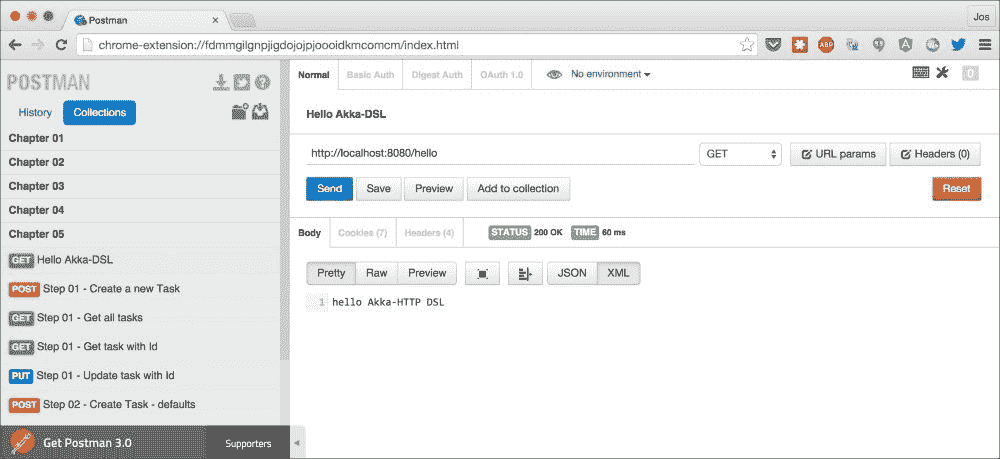

要创建这个示例，我们当然需要导入外部依赖项。对于这个示例，使用了以下 `sbt` 依赖项：

```java
  lazy val akkaHttpVersion = "1.0"

  val backendDeps = Seq (
    "com.typesafe.akka" %% "akka-stream-experimental" % akkaHttpVersion,
    "com.typesafe.akka" %% "akka-http-core-experimental" % akkaHttpVersion,
    "com.typesafe.akka" %% "akka-http-experimental" % akkaHttpVersion,
    "com.typesafe.akka" %% "akka-http-spray-json-experimental" % akkaHttpVersion
  )
```

注意，依赖项的名称中仍然带有实验性的标签。这意味着实现可能会改变，并且在此阶段，还没有来自 Typesafe 的官方支持。因此，未来可能会有一些变化，这些变化可能不是二进制兼容的。Typesafe 本身将其定义为：

> *"这个 Akka 模块被标记为实验性，这意味着它处于早期访问模式，这也意味着它不受商业支持。实验性模块不必遵守小版本之间保持二进制兼容性的规则。在不通知的情况下，可能会在次要版本中引入破坏 API 的变化，因为我们根据您的反馈进行精简和简化。实验性模块可能在主要版本中删除，而无需提前弃用。"*

因此，在这个阶段，可能明智的做法是不要立即将所有现有的 Spray 代码转换为这个代码库，而是等待它们走出实验阶段。

在这些依赖项就绪后，我们可以创建我们的简单服务：

```java
import akka.actor.ActorSystem
import akka.stream.ActorMaterializer
import akka.http.scaladsl.Http
import akka.http.scaladsl.server.Directives._

object HelloDSL extends App {
  // used to run the actors
  implicit val system = ActorSystem("my-system")
  // materializes underlying flow definition into a set of actors
  implicit val materializer = ActorMaterializer()

  val route =
    path("hello") {
      get {
        complete {
          "hello Akka-HTTP DSL"
        }
      }
    }

  // start the server
  val bindingFuture = Http().bindAndHandle(route, "localhost", 8080)

  // wait for the user to stop the server
  println("Press <enter> to exit.")
  Console.in.read.toChar

  // gracefully shut down the server
  import system.dispatcher
  bindingFuture
    .flatMap(_.unbind())
    .onComplete(_ => system.shutdown())
}
```

在这个服务中，我们首先定义两个隐式值。隐式的`ActorSystem`是必需的，用于定义将要用于异步运行请求各种处理步骤的 actor 系统。Akka HTTP 会将我们创建的 DSL 转换为流定义（这是 Akka Streams 的一个构造），这个流可以看作是一个请求从开始到结束所采取步骤的蓝图。隐式的`ActorMaterializer`会将这个流转换为一组 Akka actors，以便多个请求可以并发执行而不会相互干扰，这些 actors 运行在隐式定义的`ActorSystem`上。

定义了隐式值之后，我们可以定义路由：

```java
  val route =
    path("hello") {
      get {
        complete {
          "hello Akka-HTTP DSL"
        }
      }
    }
```

每个请求都会通过这个路由，当匹配时，其内层路由会被执行。所以在这种情况下，以下步骤被执行：

1.  首先，检查提供的 URL 路径。在这种情况下，如果路径匹配`hello`，则执行路径函数的内层路由（这被称为**指令**）。

1.  Akka HTTP 接下来检查的是动词是否匹配。在这个例子中，我们检查`GET`动词。

1.  最终的内层路由通过调用 complete 来完成请求。当调用 complete 时，提供的块的结果作为响应返回。在这个例子中，我们只返回一个字符串。

在这个 hello world 示例的最后一段代码中，当按下键时，会关闭服务器。关闭服务器是通过以下代码完成的：

```java
  import system.dispatcher
  bindingFuture
    .flatMap(_.unbind())
    .onComplete(_ => system.shutdown())
```

这种关闭服务器的方式可能看起来很复杂，但当你查看类型时，实际上它非常简单。我们在`bindingFuture`实例（类型为`Future[ServerBinding]`）上调用`flatMap`，所以当`Future`准备好（服务器成功启动）时，我们在`ServerBinding`实例上调用 unbind。由于我们调用了`flatMap`，这本身也返回一个`Future`，它被扁平化。当这个最后的`Future`解决时，我们关闭 Akka 系统以干净地关闭一切。

我们将在其他示例中使用相同的方式来启动和停止服务。

# 使用路径和指令进行工作

我们将要查看的第一个例子是我们 API 的第一个简单实现。我们目前不会返回真实对象或 JSON，而是一对字符串。这一步的代码如下：

```java
  val route =
    // handle the /tasks part of the request
    path("tasks") {
      get {
        complete { "Return all the tasks" }
      } ~
      post {
        complete { s"Create a new task" }
      } // any other request is also rejected.
    } ~ { // we handle the "/tasks/id separately"
      path("tasks" / IntNumber) {
        task => {
          entity(as[String]) { body => {
            put { complete { 
        s"Update an existing task with id: $task and body: $body" } }
          } ~
            get { complete { 
        s"Get an existing task with id : $task and body: $body" } }
          } ~ {
            // We can manually add this rejection.
            reject(MethodRejection(HttpMethods.GET),
                   MethodRejection(HttpMethods.PUT))
          }
        }
      }
    }
```

这段代码与我们在前面的例子中看到的代码看起来并没有太大的不同。我们通过使用`path`、`get`、`post`和`put`等指令来定义路由，并通过使用`complete`函数来返回值。然而，我们确实使用了一些新的概念。在我们解释代码和 Akka HTTP 提供的概念之前，首先让我们发起一些请求。为此，启动本节示例：

```java
$ sbt runCH05-runCH05Step1
[info] Loading project definition from /Users/jos/dev/git/rest-with-scala/project
[info] Set current project to rest-with-scala (in build file:/Users/jos/dev/git/rest-with-scala/)
[info] Compiling 3 Scala sources to /Users/jos/dev/git/rest-with-scala/chapter-05/target/scala-2.11/classes...
[info] Running org.restwithscala.chapter5.steps.AkkaHttpDSLStep1 
Press <enter> to exit.

```

在您的浏览器中打开 Postman，首先执行**步骤 01 - 更新具有 id 的任务**请求：

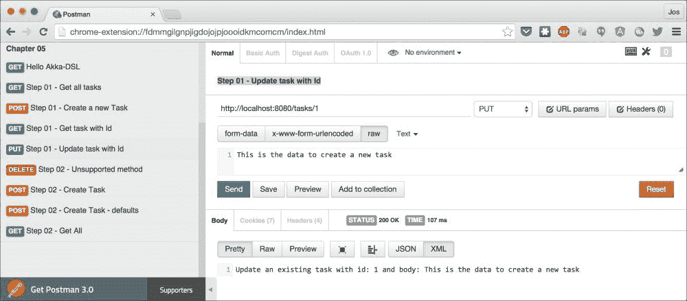

正如您所看到的，我们返回一个简单的响应，显示了发送到服务器的数据。另一个有趣的例子是当我们发送一个无效请求时——**步骤 01 - 无效请求**：

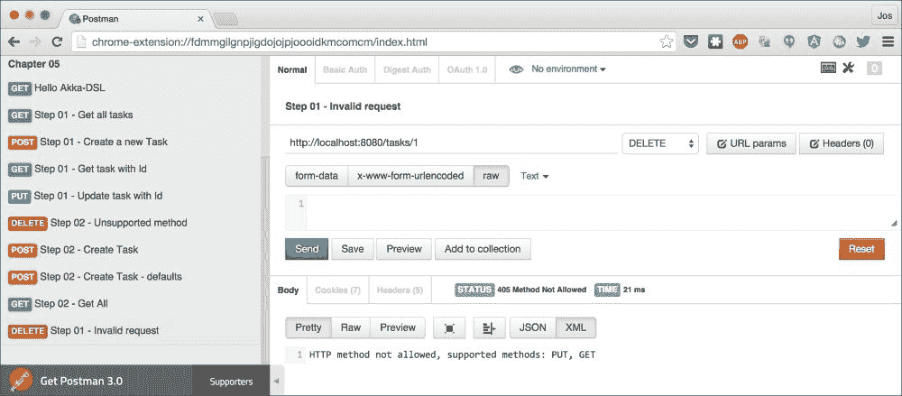

在这里，您可以看到我们可以轻松地向用户提供有关如何使用我们服务的额外信息。

让我们更仔细地看看本节开头我们看到的代码的第二部分：

```java
path("tasks" / IntNumber) {
        task => {
          entity(as[String]) { body => {
            put { complete { 
        s"Update an existing task with id: $task and body: $body" } }
          } ~
            get { complete { 
        s"Get an existing task with id : $task and body: $body" } }
          } 
        }
      }
    }
```

在这里，我们再次看到了熟悉的`path`、`get`和`put`指令，我们还使用了额外的指令来从请求中获取更多信息。我们使用`IntNumber`路径匹配器将路径的一部分转换为整数，并使用`entity(as[String])`提取器将请求体作为字符串提取出来（我们将在本章末尾使用相同的方法处理 JSON 输入时看到更多关于这个指令的内容）。不过，让我们先更仔细地看看`path`指令。

在这个例子中，我们已经使用了三个不同的路径匹配器。我们使用字符串值来匹配 URL 的一部分，使用`/`匹配器来表示我们期望一个正斜杠，以及使用`IntNumber`路径匹配器来匹配和提取一个数字。除了这些之外，您还可以使用以下表格中解释的匹配器：

| 路径匹配器 | 描述 |
| --- | --- |
| `"/hello"` | 这个匹配器匹配 URL 的一部分，并且消耗它。这里没有提取任何内容。 |
| `"[a-b]"r` | 您也可以使用这个匹配器指定一个最多有一个捕获组的正则表达式。捕获组将被提取。 |
| `Map[String, T]` | 使用这个匹配器，您可以根据匹配`Map("path1" -> 1, "path2" -> 2, "path3" -> 3)`的路径提取一个值。 |
| `Slash (or /)` | 这个匹配器匹配单个正斜杠。 |
| `Segment` | 如果路径以路径段（而不是正斜杠）开头，则匹配。当前路径段作为字符串被提取。 |
| `PathEnd` | 这个匹配器匹配路径的末尾，不提取任何内容。 |
| `Rest` | 这个匹配器匹配路径的其余部分，并将其作为字符串返回。 |
| `RestPath` | 这个匹配器匹配路径的其余部分，并将其作为路径返回。 |
| `IntNumber` | 这个匹配器匹配可以转换为整数的数字。匹配到的整数将被提取。 |
| `LongNumber` | 这个匹配器匹配可以转换为长整数的数字，并提取匹配到的长整数。 |
| `HexIntNumber` | 这个操作符匹配可以转换为整数的十六进制数字，并提取匹配的整数。 |
| `HexLongNumber` | 这个操作符匹配可以转换为长整数的十六进制数字，并提取匹配的长整数。 |
| `DoubleNumber` | 这个操作符匹配可以转换为双精度数的数字，并提取匹配的双精度数。 |
| `JavaUUID` | 这个操作符匹配并提取`java.util.JavaUUID`对象的字符串表示形式。结果是`.java.util.JavaUUID`实例。 |
| `Neutral` | 这个操作符匹配一切，不消耗任何内容。 |
| `Segments` | 这个操作符与`Segment`匹配器相同，但这次匹配所有剩余的段，并返回这些段作为一个`List[String]`对象。 |
| `separateOnSlashes` | 这个操作符创建一个匹配器，将斜杠解释为路径段分隔符。 |
| `provide` | 这个匹配器总是匹配并提取提供的元组值。 |
| `~` | 这个操作符允许你连接两个匹配器，例如 `"hello" ~ "world"` 等同于 `"helloworld"`。 |
| `&#124;` | 这个操作符将两个匹配器组合在一起。当左侧的匹配器无法匹配时，才会评估右侧的匹配器。 |
| 后缀: `?` | `?`后缀使匹配器可选，并且总是匹配。提取值的结果是`Option[T]`对象。 |
| 前缀: `!` | 这个前缀反转了匹配器。 |
| 后缀: `.repeat` | 使用`repeat`，你可以创建一个匹配器，使其重复指定的次数。 |
| `transform, flatMap, map` | 这些操作符允许你自定义匹配器并创建自己的自定义逻辑。 |

所以即使在`path`指令中，你也能提取出很多信息并应用多个匹配器。除了`path`指令之外，还有很多其他的指令。我们已经看到在这个例子中提取的实体是这样使用的：

```java
entity(as[String]) { body => {
            put { complete { 
        s"Update an existing task with id: $task and body: $body" } }
     }
```

当你使用提取器时，提取的值会被作为参数传递给内部路由（在这个代码片段中是`body`）。Akka HTTP 附带了许多你可以用来从请求中获取值的提取器。下表显示了最有用的几个：

| 指令 | 描述 |
| --- | --- |
| `cookie("name")` | 这个操作符提取指定名称的 cookie，并返回一个`HttpCookiePair`实例。还有一个`Option`变体——`optionalCookie`。 |
| `entity(as[T])` | 这个操作符将请求实体反序列化为指定的类型（更多信息，请参阅关于 JSON 的部分）。 |
| `extractClientIp` | 这个操作符从 X-Forwarded-或 Remote-Addressor X-Real-IP 头中提取客户端的 IP，作为一个`RemoteAddress`。 |
| `extractCredentials` | 这个操作符从授权头中获取`Option[HttpCredentials]`。 |
| `extractExecutionContext` | 这个操作符提供了对 Akka `ExecutionContext`实例的访问。 |
| `extractMaterializer` | 这个操作符提供了对 Akka `Materializer`的访问。 |
| `extractHost` | 这获取主机请求头部值的`hostname`部分作为字符串。 |
| `extractMethod` | 这提取请求方法作为`HttpMethod`。 |
| `extractRequest` | 这提供了对当前`HttpRequest`的访问。 |
| `extractScheme` | 这从请求中返回 URI 方案（如`http`、`https`等）作为字符串。 |
| `extractUnmatchedPath` | 这提取当前点未匹配的路径部分作为`Uri.Path`。 |
| `extractUri` | 这通过`Uri`访问请求的完整 URI。 |
| `formFields` | 这从 HTML 表单中提取字段。有关更多信息，请参阅路径匹配器部分。 |
| `headerValueByName` | 这提取具有给定名称的第一个 HTTP 请求头部的值，并将其作为字符串返回。您也可以通过使用`OptionalHeaderValueByName`来获取`Option[String]`。 |
| `headerValueByType [T]` | 您也可以使用此指令提取头并将其自动转换为特定类型。对于这个，还有一个`Option`变体——`OptionalHeaderValueByType`。 |
| `parameterMap` | 这从请求中获取所有参数作为`Map[String, String]`。如果存在具有相同名称的多个参数，则仅返回最后一个。 |
| `parameterMultiMap` | 这从请求中获取所有参数作为`Map[String, List[String]]`。如果存在具有相同名称的多个参数，则所有参数都将返回。 |
| `parameterSeq` | 这按顺序提取所有参数作为元组的`Seq[(String, String)]`。 |
| `provide("value")` | 这将提供的值注入到内部路由中。还有一个`tprovide`函数，它可以注入一个元组。 |

大多数这些提取器相当直观。例如，当您想要提取特定的 HTTP 头时，您可以编写如下路由：

```java
val exampleHeaderRoute = path("example") {
  (headerValueByName("my-custom-header")) { header => {
      complete(s"Extracted header value: $header")
    }
  }
}
```

现在，让我们回到我们的示例，再次看看我们路由的一个非常简单的部分：

```java
      get {
        complete { "Return all the tasks" }
      }
```

到目前为止，我们只看到了少量 Akka 指令。我们查看了上表中可能的提取器，以及匹配路径部分和特定 HTTP 动词的简单指令。除此之外，Akka HTTP 提供了大量指令，远远超过我们在这单章中可以解释的数量。在下面的表中，我们将列出我们认为最重要的、最灵活的指令，供您在路由中使用：

| 指令 | 描述 |
| --- | --- |
| `conditional` | 这提供了对按[`tools.ietf.org/html/draft-ietf-httpbis-p4-conditional-26`](http://tools.ietf.org/html/draft-ietf-httpbis-p4-conditional-26)指定的条件请求的支持。 |
| `decodeRequest / encodeRequest` | 这压缩和解压缩使用 gzip 或 deflate 压缩发送的请求。 |
| `decodeRequestWith / encodeRequestWith` | 这使用指定的编码器和解码器压缩和解压缩请求。 |
| `get / delete / post / put / head / options / patch` | 当指定的 HTTP 动词匹配时，将执行此指令的内部路由。 |
| `host` | 只有当在此指令中指定的主机与提供的匹配时，才会运行内部路由。您可以使用字符串或正则表达式。 |
| `method(httpMethod)` | 检查请求是否与指定的 `HttpMethod` 匹配。 |
| `onComplete(future)` | 当提供的 `Future` 完成时，将运行内部路由。 |
| `onSuccess` | 当提供的 `Future` 成功完成时，将运行内部路由。 |
| `overrideMethodWithParameter` | 这将传入请求的 `HttpMethod` 改变传入请求的方法（HTTP 动词）。 |
| `pass` | 总是将请求传递到内部路由。 |
| `path` | 如果提供的路径匹配，则将请求传递到内部路由（您将在下一个示例中了解更多关于它的信息）。 |
| `pathEnd` | 只有当其完整路径匹配时，才会传递请求。 |
| `pathEndOrSingleSlash` | 如果其完整路径匹配或仅剩单个斜杠，则仅传递请求。 |
| `pathPrefix` | 这匹配路径的第一部分。自动添加前导斜杠。如果您只想测试而不消耗路径，请使用 `pathPrefixTest`。如果您不想使用前导斜杠，可以使用 `rawPrefix` 和 `rawPrefixTest`。 |
| `pathSingleSlash` | 只有当路径包含单个斜杠时，才会运行内部路由。 |
| `pathSuffix` | 这检查当前路径的末尾，如果匹配，则运行内部路由。如果您只想测试而不消耗路径，请使用 `pathSuffixTest` 指令。 |
| `requestEncodedWith` | 检查请求编码是否与指定的 `HttpEncoding` 匹配。 |
| `requestEntityEmpty` | 如果请求不包含正文，则匹配此条件。 |
| `requestEntityPresent` | 如果请求包含正文，则匹配此条件。 |
| `scheme("http")` | 这检查请求的方案。如果方案匹配，请求将被传递到内部路由。 |
| `validate` | 这允许您测试任意条件。 |

在我们继续下一个示例之前，我们将快速查看本节开头看到的最后一个内部路由：

```java
{
// We can manually add this rejection.
reject(MethodRejection(HttpMethods.GET),
   MethodRejection(HttpMethods.PUT))
}
```

使用此内部路由，我们通知 Akka HTTP 内部路由拒绝请求。在这种情况下，我们拒绝请求是因为 `HttpMethod`（动词）与我们能够处理的任何内容都不匹配。当您拒绝请求时，Akka HTTP 将检查是否有任何可能匹配的路由，如果没有，将拒绝转换为 HTTP 错误消息。此外，在本章中，我们还将更详细地了解 Akka HTTP 如何与拒绝和异常处理交互。

# 处理请求参数和自定义响应

在本节中，我们将更深入地探讨如何从请求中提取查询参数以及如何自定义发送给客户端的响应。在本节中，我们将更详细地了解以下请求的实现方式：

+   **创建任务**：我们将使用一组查询参数创建一个新任务

+   **获取所有任务**：我们将返回所有已创建的任务

+   **获取任务**：我们将根据提供的 ID 返回一个特定的任务

对于这些请求中的每一个，我们首先将展示从 Postman 的调用，然后展示如何使用 Akka HTTP 实现。首先，使用`sbt runCH05-runCH05Step2`命令启动正确的服务器：

```java
$ sbt runCH05-runCH05Step2
[info] Loading project definition from /Users/jos/dev/git/rest-with-scala/project
[info] Set current project to rest-with-scala (in build file:/Users/jos/dev/git/rest-with-scala/)
[info] Compiling 1 Scala source to /Users/jos/dev/git/rest-with-scala/chapter-05/target/scala-2.11/classes...
[info] Running org.restwithscala.chapter5.steps.AkkaHttpDSLStep2 
Press <enter> to exit.

```

现在打开 Postman 并执行**步骤 02 - 创建任务**请求：

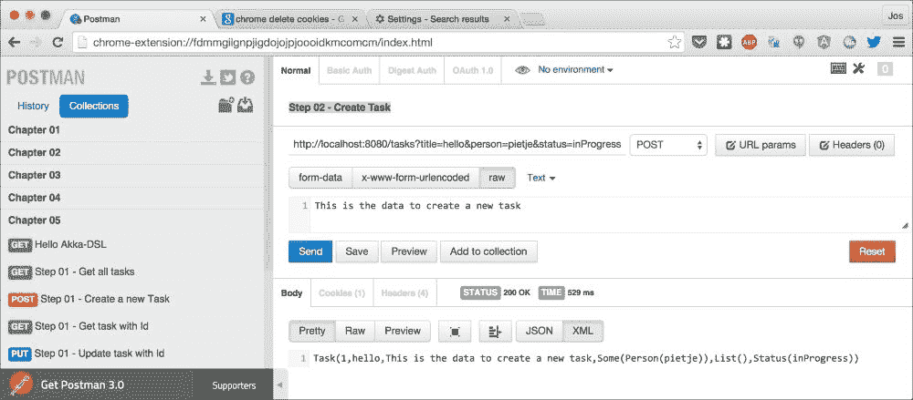

在响应中，您可以看到我们返回了添加的任务的字符串表示形式，并且任务的内容基于 URL 中的查询参数。为了实现这一点，我们实现了以下路由：

```java
        ((post) & 
        (parameters("title", "person".?, "status" ? "new"))) { 
                                 (title, assignedTo, status) => {
          (entity(as[String])) { body => {
            complete {
              val createdTask = TaskService.insert(
                 Task(-1, 
                      title,
                      body,
                      assignedTo.map(Person(_)),
                      List.empty, Status(status)))
              createdTask.map(_.toString)
            }
           }
          }
        }
      }
```

在此路由中，我们首先通过使用`&`符号组合两个指令，即`post`指令和`parameters`指令。这意味着在执行内部路由之前，这两个指令都应该匹配。您还可以使用`|`符号，这意味着左边的指令或右边的指令应该匹配（`put` `|` `post`）。参数与正文一起使用，通过`TaskService`对象创建`Task`实例。然后，将生成的`Future[Task]`转换为`Future[String]`并返回。由于我们尚未告诉 Akka HTTP 如何处理`Task`类，因此我们需要手动将`Task`转换为字符串（您将在稍后了解更多关于它的信息）。如果您查看参数指令，您不仅会认出原始请求中的查询参数，还会看到许多修饰符。以下项目符号解释了参数指令的工作原理：

+   `"title"`：这提取参数的值作为字符串。这表示此查询参数是必需的。

+   `"person".?`：通过使用`.?`后缀，您使值可选。此结果为`Option[String]`。

+   `"status" ? "new"`：这检索参数，如果找不到，则使用默认值（在这种情况下为`"new"`）。结果是字符串。

+   `"status" ! "new"`：这要求查询参数的名称为`"status"`的值为`"new"`。

+   `"number".as[Int]`：这尝试将参数转换为指定的类型。

+   `"title.*"`：这从标题参数中提取多个实例到`Iterable[String]`。

+   `"number".as[Int].*`：这与前面的函数相同，但适用于类型。

因此，对于我们的示例，我们需要一个`title`参数，一个可选的`person`参数，以及一个可选的`status`参数，其默认值为`"new"`。使用这些结构，从请求的查询参数中提取正确的值变得非常容易。

现在，让我们更仔细地看看我们从这个示例中发送的响应。我们使用之前看到的 `complete` 指令，并仅返回一个 `Future[String]` 实例。由于它是一个字符串，Akka HTTP 知道如何将其序列化为 HTTP 响应。我们使用相同的方法来处理获取所有任务请求。从 Postman 开始，在你创建了一些任务之后，执行 **步骤 02 - 获取所有** 请求：

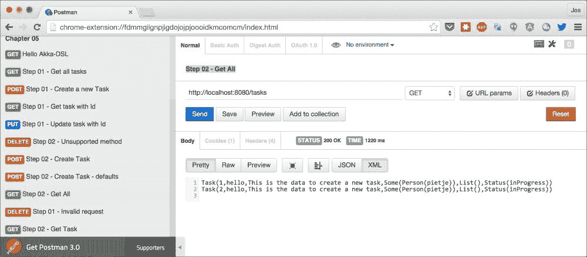

你会看到返回了你创建的任务列表。再次强调，这非常简单：

```java
complete {
  // our TaskService returns a Future[List[String]]. We map // this to a single Future[String] instance that can be returned // automatically by Akka HTTP
  TaskService.all.map(_.foldLeft("")((z, b) => z + b.toString + "\n"))
}
```

我们调用 `TaskService` 对象，它返回一个 `Future[List[Task]]` 实例。由于我们尚未告诉 Akka HTTP 如何处理此类型，我们手动将其转换为正确的类型，并使用 `complete` 发送响应。到目前为止，我们只看到了 `complete` 的使用。在大多数情况下，Akka HTTP 提供的默认行为已经足够好，然而，你还可以以不同的方式自定义 Akka HTTP 发送的响应。

再次打开 Postman，使用 **步骤 02 - 创建任务** 选项创建多个任务，这次执行 **步骤 02 – 获取任务无效** 请求以获取单个请求。此请求将尝试获取 ID 为 100 的请求，该请求无效（除非你添加了 100 个任务）。结果看起来类似于以下内容：

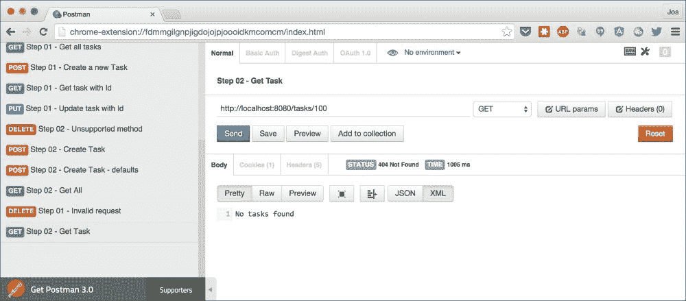

如你所见，这次我们得到了一个 **404** 消息，带有自定义错误消息。如果你请求一个可用的任务（使用步骤 **02 – 获取任务** 请求），你会看到以下内容：

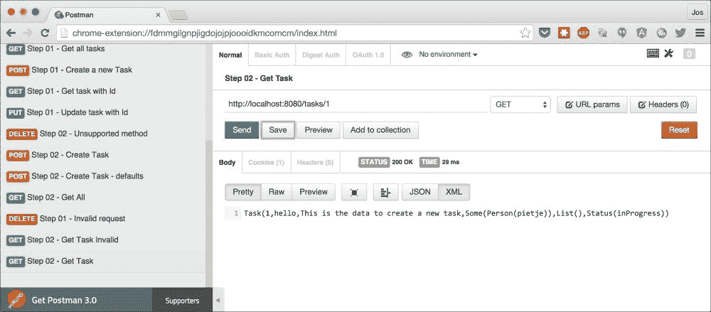

对于其余部分，这两个请求并没有太多特别之处。然而，如果你查看 **Cookies** 和 **Headers** 选项卡，你可能会注意到我们在那里得到了额外的结果。如果你打开这些选项卡，你会注意到一个带有 `world` 值的自定义 hello cookie，在 **Headers** 选项卡中，我们添加了一个名为 **helloheader** 的自定义头。

为了完成这个任务，我们使用了几个标准的 Akka HTTP 功能。以下代码片段显示了如何实现这一点：

```java
val sampleHeader: HttpHeader = 
          (HttpHeader.parse("helloheader","hellovalue") match {
    case ParsingResult.Ok(header, _) => Some(header)
    case ParsingResult.Error(_) => None
}).get
...

implicit val StringMarshaller: ToEntityMarshaller[Task] =
    Marshaller.opaque { s =>
           HttpEntity(ContentType(`text/plain`), s.toString) }
...

get {
  ( setCookie(HttpCookie(name = "hello", value = "world")) &
    respondWithHeader(sampleHeader)
    ) {
    onComplete(TaskService.select(task)) {
      case Success(Some(value)) => complete(value)
      case Success(None) => complete(StatusCodes.NotFound, 
                                         "No tasks found")
      case Failure(ex)  => complete(StatusCodes.InternalServerError,
                              s"An error occurred: ${ex.getMessage}")
    }
  }
}
```

在这个代码片段中，我们使用了 Akka HTTP 提供的一些指令，可以用来自定义对请求的响应。使用 `setCookie` 和 `respndWithHeader` 指令，我们添加了自定义的 cookie 和头信息。在这个指令的内部路由中，我们使用 `onComplete` 指令来确定如何处理 `TaskService.select` 函数的响应。如果 `Future` 成功返回 `Some[Task]`，我们以这个 `Task` 作为响应。如果没有找到 `Task`，我们返回 `404`（`NotFound` 状态码）。最后，如果 `Future` 无法成功完成，我们以 `InternalServerError` 作为响应。您可能会注意到，这次我们没有将 `Task` 转换为字符串，而是直接返回它。这是因为我们同时也定义了一个隐式的，`ToEntityMarshaller[Task]`。这个 marshaller 允许 Akka HTTP 将 `Task` case 类转换为 `HTTPEntity` 实例，Akka HTTP 知道如何将其序列化为 `HttpResponse`。

除了这里显示的指令之外，Akka HTTP 还提供了一些其他指令和函数，您可以使用它们来自定义响应。以下表格显示了与自定义响应相关的指令：

| 指令 | 描述 |
| --- | --- |
| `complete` | 这使用提供的参数完成请求。 |
| `completeOrRecoverWith` | 这返回提供的 `Future` 对象的结果。如果 `Future` 失败，则提取异常并运行内部路由。 |
| `completeWith` | 这提取一个可以调用来完成请求的函数。 |
| `getFromBrowseableDirectories` | 这将给定目录的内容作为文件系统浏览器提供服务。 |
| `getFromBrowseableDirectory` | 这将给定目录的内容作为文件系统浏览器提供服务。 |
| `getFromDirectory` | 这与一个 `GET` 请求匹配并返回特定目录中文件的內容。 |
| `getFromFile` | 这与一个 `GET` 请求匹配并返回文件的內容。 |
| `getFromResource` | 这与一个 `GET` 请求匹配并返回类路径资源的內容。 |
| `getFromResourceDirectory` | 这与一个 `GET` 请求匹配并返回指定类路径目录中类路径资源的內容。 |
| `listDirectoryContents` | 这与一个 `GET` 请求匹配并返回特定目录的內容。 |

| `redirect` | 这发送一个重定向响应。还有更具体的指令：

+   `redirectToNoTrailingSlashIfPresent`

+   `redirectToTrailingSlashIfMissing`

|

| `respondWithHeader` | 这在响应对象上设置一个特定的头。您也可以使用 `responseWithHeaders` 指令一次性添加多个头。这个指令会覆盖已设置的头。如果您不想覆盖现有的头，请使用以下指令：

+   `respondWithDefaultHeaders`

+   `respondWithDefaultHeader`

|

| `setCookie, deleteCookie` | 这添加或删除一个 cookie。 |
| --- | --- |
| `overrideStatusCode` | 这设置了响应的 HTTP 状态码。Akka HTTP 提供了一个`StatusCode`对象，你可以使用它来访问所有可用的响应码。 |

如果这些指令还不够，你也可以选择简单地返回一个`HttpResponse`对象。Akka HTTP 提供了一个用于此目的的`HttpResponse`案例类，你可以这样使用：

```java
final case class HttpResponse(status: StatusCode = StatusCodes.OK,
                 headers: immutable.Seq[HttpHeader] = Nil,
                 entity: ResponseEntity = HttpEntity.Empty,
                 protocol: HttpProtocol = HttpProtocols.`HTTP/1.1`)
```

到目前为止，在本章中，我们看到了如何访问和提取请求信息以及设置和自定义响应的方式。在本章的最后几页，我们将探讨从 Akka HTTP 处理错误和异常情况的不同方法。

# 异常处理和拒绝

在本节中，我们将探讨 Akka HTTP 如何处理异常和拒绝。在我们查看代码之前，我们再次使用 Postman 来展示我们想要实现的目标。让我们从如何处理拒绝开始。拒绝是功能错误，它们要么由指令抛出，要么你可以自己抛出。在这个例子中，我们在创建任务请求中添加了一些验证。所以运行`sbt runCH05-runCH05Step3`，打开 Postman，并执行请求，**步骤 03 - 拒绝处理**：

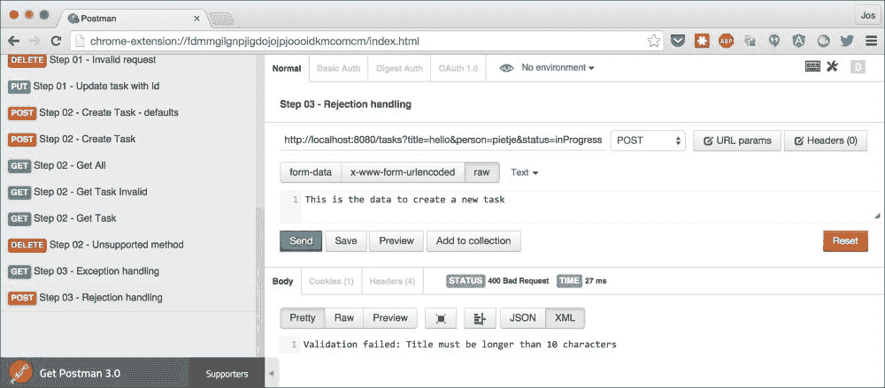

如您从响应中可以看到，我们想要创建的任务标题至少需要 10 个字符。展示如何添加此验证并配置拒绝处理器的代码如下：

```java
handleRejections(customRejectionHandler) {
  ((post) & (parameters("title", "person".?, "status" ? "new"))) { 
         (title, assignedTo, status) => { 
    (entity(as[String])) { body => {
      (validate(title.length > 10, 
            "Title must be longer than 10 characters") &
        validate(List("new", "done", "in progress").contains(status),  
            "Status must be either 'new', 'done' or 'in progress'") &
        validate(body.length > 0, 
            "Title must be longer than 10 characters")
        ) {
        complete {
TaskService.insert(Task(-1, title, body, 
                    assignedTo.map(Person(_)),
                    List.empty, Status(status)))

        }
      }
    }
    }
  }
  }
}
```

在此代码中，我们使用`validate`指令来检查传入的参数。如果其中一个验证失败，请求将因`ValidationRejection`结果而被拒绝。我们已经用`handleRejections`指令包装了这个路由，所以这个路由的所有拒绝都将被这个处理器捕获。以下代码片段展示了这个处理器的外观：

```java
  val customRejectionHandler =
    RejectionHandler.newBuilder()
      .handle {
      case ValidationRejection(cause, exception) =>
        complete(HttpResponse(StatusCodes.BadRequest, entity = 
                 s"Validation failed: $cause"))
    }.result()
```

当你想创建一个拒绝处理器时，最简单的方法是使用`RejectionHandler.newBuilder`对象。此对象为你提供了一些可以调用的函数来定义此处理器的行为。我们这里使用的`handle`函数允许我们处理单个拒绝，我们使用它来在发生`ValidationRejection`时响应 400 错误请求。任何其他拒绝都会沿着路由向上冒泡。除了`handle`之外，你也可以使用`handleAll`来同时处理同一拒绝的多个实例。最后，还有一个特定的`handleNotFound`函数，你可以用它来定义当资源未找到时的行为。

异常处理的工作方式几乎相同。再次打开 Postman 并使用**步骤 03 - 异常处理**请求来触发异常：

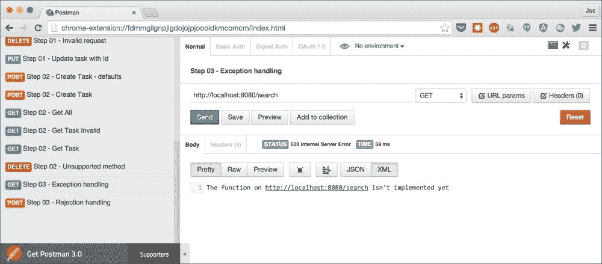

在这种情况下，我们返回一个内部服务器错误。以下代码片段展示了如何使用 Akka HTTP 来完成这个操作：

```java
val customExceptionHandler = ExceptionHandler {
  case _: IllegalArgumentException =>
    // you can easily access any request parameter here using extractors.
    extractUri { uri =>
      complete(HttpResponse(StatusCodes.InternalServerError, entity = s"The function on $uri isn't implemented yet"))
    }
}
...
path("search") {
  handleExceptions(customExceptionHandler) {
      failWith(IllegalArgumentException("Search call not implemented"))
  }
}
```

如您所见，使用异常处理程序与之前讨论的拒绝处理程序没有太大区别。这次，我们定义了一个`ExceptionHandler`，并使用`handleExceptions`指令将其连接到路由的特定部分。对于`ExceptionHandler`，我们只提供了一个部分函数，其中我们指定要捕获的异常。

### 小贴士

在本节中，我们明确使用了`handleExceptions`和`handleRejections`函数来定义用于部分路由的处理程序。如果您想创建一个匹配完整请求的自定义处理程序，您也可以将处理程序定义为隐式。这样，它们将用于路由产生的所有拒绝和异常。值得注意的是，您不一定必须匹配所有拒绝和异常。如果您没有匹配特定的异常或拒绝，它将冒泡到路由中的更高一级，最终将到达 Akka HTTP 提供的默认处理程序。

在这个示例中，我们迄今为止已经看到了`handleRejections`和`handleExceptions`指令；还有一些其他与拒绝和异常相关的指令和函数可用。以下表格列出了所有这些：

| 指令 | 描述 |
| --- | --- |
| `handleRejection` | 这个指令使用提供的`RejectionHandler`处理当前集合的拒绝。 |
| `handleException` | 这个指令使用提供的`ExceptionHandler`处理从内部路由抛出的异常。 |
| `cancelRejection` | 这允许您取消来自内部路由的拒绝。您也可以使用`cancelRejections`指令取消多个拒绝。 |
| `failWith` | 这个指令引发指定的异常；这应该代替抛出异常使用。 |
| `recoverRejections` | 这个指令和`RecoverRejectionsWith`允许您处理拒绝并将它们转换为正常的结果。 |
| `reject` | 这个指令使用指定的拒绝拒绝请求。 |

使用这些指令以及全局拒绝和异常处理程序，您应该能够干净地处理 REST 服务中的故障情况。

在关于 Akka HTTP 的讨论的最后主题中，我们将快速向您展示如何向您的服务添加 JSON 支持。

# 添加 JSON 支持

作为最后一步，我们将向我们的 Akka HTTP REST 服务添加 JSON 支持。添加后，我们将能够向我们的服务发送 JSON，Akka HTTP 将自动将其转换为我们所使用的案例类。我们需要做的第一件事是添加一个额外的 SBT 依赖项：

```java
val backendDeps = Seq (
  "com.typesafe.akka" %% "akka-stream-experimental" % akkaHttpVersion,
  "com.typesafe.akka" %% "akka-http-core-experimental" % akkaHttpVersion,
  "com.typesafe.akka" %% "akka-http-experimental" % akkaHttpVersion,
  "com.typesafe.akka" %% "akka-http-spray-json-experimental" % akkaHttpVersion
)
```

一旦添加，我们需要通知 Akka HTTP 我们的哪些案例类应该被序列化和反序列化为 JSON。通常的做法是定义一个特定的特质，其中包含 Akka HTTP 需要的隐式。对于我们的示例，我们定义这个特质如下：

```java
trait AkkaJSONProtocol extends DefaultJsonProtocol {
  implicit val statusFormat = jsonFormat1(Status.apply)
  implicit val noteFormat = jsonFormat2(Note.apply)
  implicit val personFormat = jsonFormat1(Person.apply)
  implicit val taskFormat = jsonFormat6(Task.apply)
}
```

这段代码相当直观。我们在这里定义了哪些案例类应该被序列化和反序列化为 JSON。接下来，我们需要确保我们导入了 Akka HTTP 的 JSON 库：

```java
import akka.http.scaladsl.marshallers.sprayjson.SprayJsonSupport._
import akka.http.scaladsl.marshallers.sprayjson.SprayJsonSupport
```

最后，确保我们在应用程序中扩展这个特质：

```java
object AkkaHttpDSLStep4 extends App with AkkaJSONProtocol
```

在这个阶段，我们可以移除本章前面定义的自定义序列化器，并让所有的方法直接返回`Task`实例，而不是将`Task`实例转换为字符串。例如，要检索所有当前存储的任务，我们只需这样做：

```java
path("tasks") {
  get {
    complete {
      TaskService.all
    }
  }
}
```

要将传入的 JSON 转换为`Task`对象，我们需要使用`entity`指令。添加`Task`对象的代码现在变为这样：

```java
post {
   (entity(as[Task])) { task => {
      complete {
        TaskService.insert(task)
      }
    }
  }
}
```

执行这些步骤后，我们可以在 Postman 中查看它是否工作。在 Postman 中打开请求，**04 - 创建任务**，并运行它：

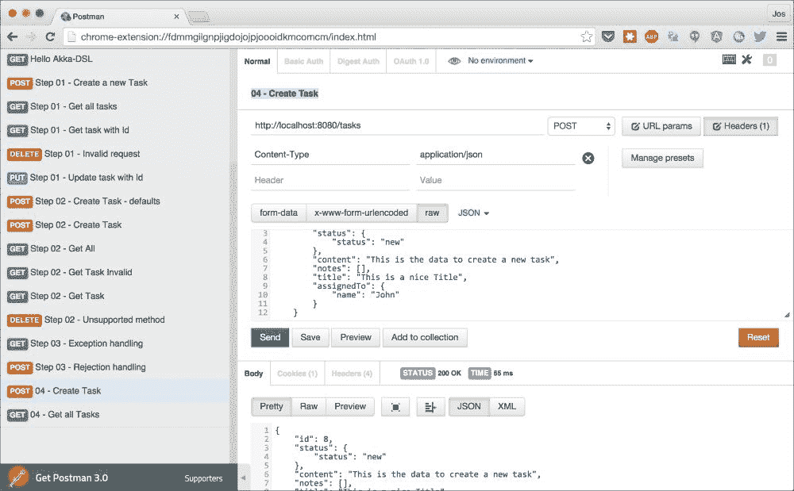

在这里，我们可以看到发送的 JSON 正在被服务器处理，并且成功添加。现在重复几次这个操作，然后使用**04 - 获取所有任务**请求来查看我们是否可以检索已添加的所有任务的列表：

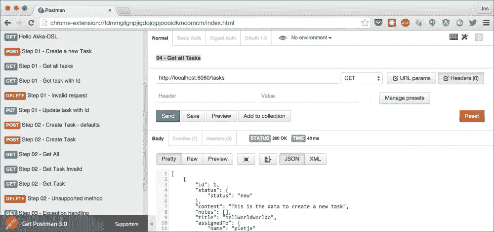

# 摘要

在本章中，我们探讨了 Akka HTTP 提供的几乎所有功能。你学习了如何使用可用的指令来匹配特定的请求属性并从请求的头部、参数和体中提取信息。除了处理传入请求的指令外，Akka HTTP 还提供了创建和自定义发送回客户端的响应的指令。如果在处理请求时发生错误，Akka HTTP 提供了标准的异常和拒绝处理器。你还学习了如何通过添加自定义处理器来覆盖默认行为。最后，本章还展示了添加 JSON 支持以及自动将你的类序列化和反序列化到 JSON 是多么容易。

在下一章中，我们将探讨本书中将要讨论的最终 REST 框架，**Play 2**。
