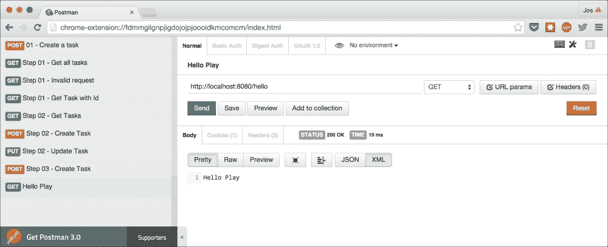
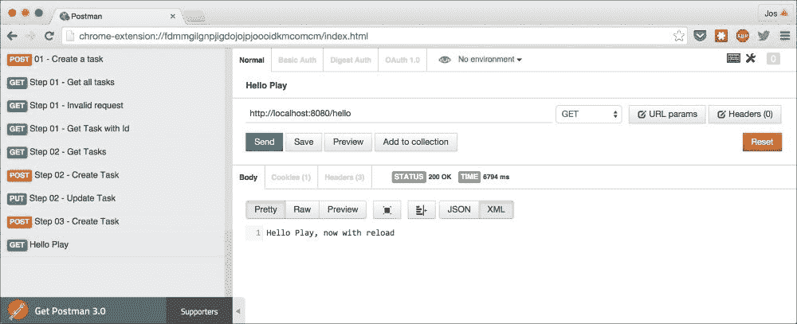
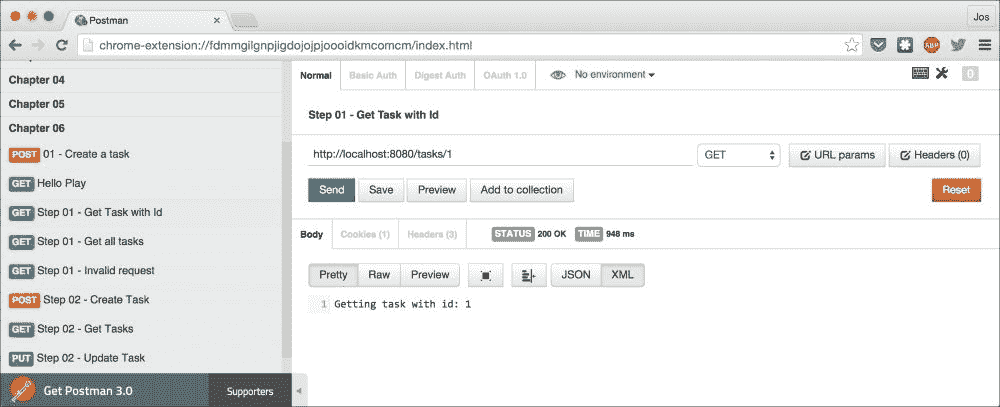
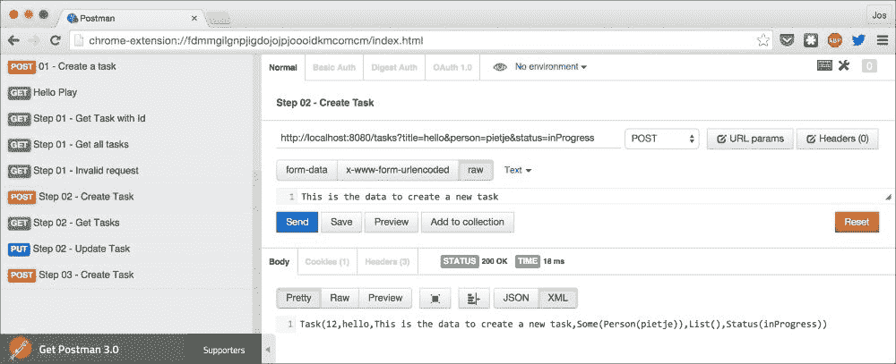
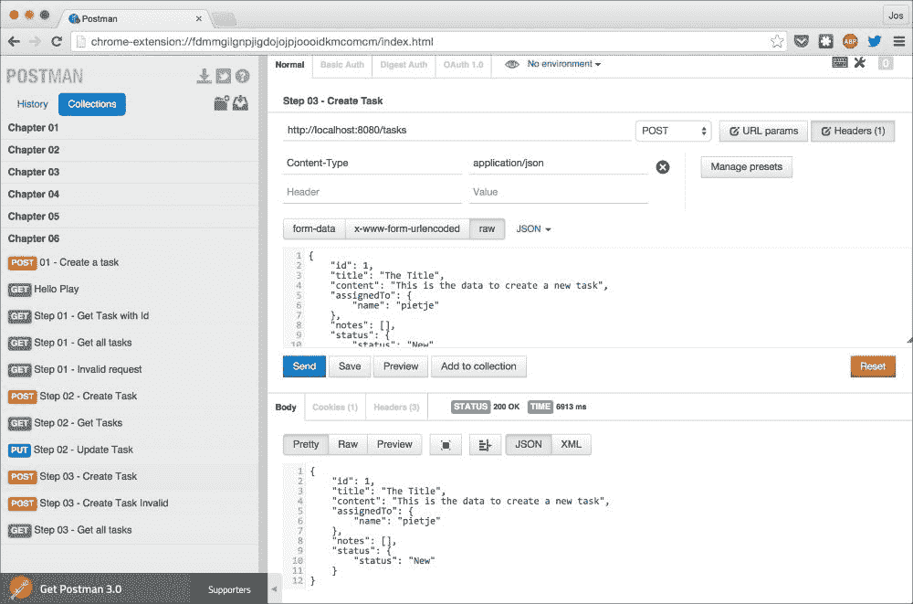
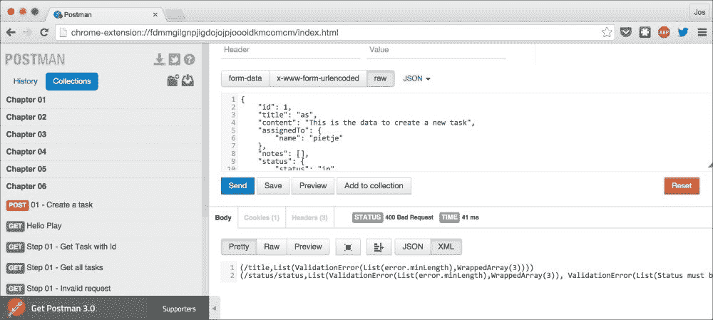
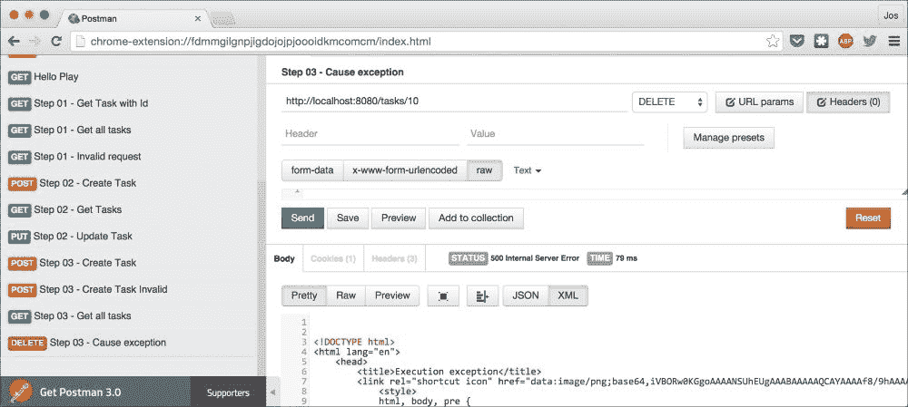
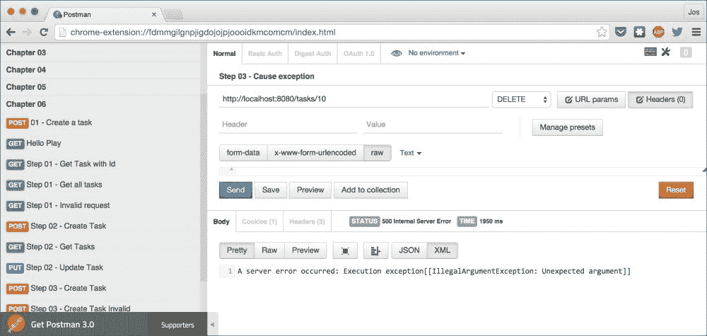

# 第六章. 使用 Play 2 框架创建 REST 服务

对于本书中的最后一个 REST 框架，我们将探讨 Play 2。Play 2 是一个现代 Web 框架，可以用来创建完整的应用程序。该框架提供的部分工具允许你快速轻松地创建 REST 服务。在本章中，我们将专注于这部分。

在本章中，我们将讨论以下主题：

+   使用路由文件进行路由匹配

+   处理传入的 HTTP 请求并自定义响应

+   添加 JSON 支持、自定义验证和错误处理

首先，让我们了解一下 Play 2 框架是什么，以及你可以在哪里找到有关它的更多信息。

# Play 2 框架简介

Play 2 框架是 Scala 生态系统中最知名和最广泛使用的 Web 框架之一。它提供了一个非常友好的开发方式来创建 Web 应用程序和 REST 服务。Play 2 的一些最有趣的功能包括：

+   **自动重新加载更改**：在创建 Play 2 应用程序时，你不需要在代码更改后重新启动应用程序。只需重新发送请求，Play 2 将自动重新加载更改。

+   **可扩展性**：Play 2 基于 Akka。通过 Akka 框架，它提供了一个简单的方式来向上和向外扩展。

+   **强大的工具支持**：Play 2 基于 SBT，这是 Scala 的标准构建工具。通过一个 SBT 插件，你可以轻松启动、重新加载和分发你的 Play 2 应用程序。

尽管 Play 2 并非专门构建为 REST 框架，但我们可以使用其部分功能轻松创建 REST 应用程序，同时还能利用 Play 2 的特性。

# 使用 Play 2 的 Hello World

要在 Play 2 中创建一个简单的 Hello World REST 服务，我们首先需要正确设置 SBT 项目。Play 2 使用一个 SBT 插件来运行一个 HTTP 服务器，你可以使用它来访问你的 REST 服务。我们需要做的第一件事是将此插件添加到 `plugins.sbt` 文件中（该文件位于 `project` 目录中）：

```java
addSbtPlugin("com.typesafe.play" % "sbt-plugin" % "2.4.0")
```

接下来，我们定义依赖关系，以便我们可以创建一个基于 Play 2 的 REST 服务。对于 Play 2，我们使用以下依赖项：

```java
lazy val playVersion = "2.4.0"

val backendDeps = Seq (
  "com.typesafe.play" %% "play" % playVersion,
  "com.typesafe.play" %% "play-docs" % playVersion
)
```

我们还需要在 SBT 配置（`build.sbt`）中添加一个步骤，以便能够运行本章中的示例：

```java
addCommandAlias("runCH06-HelloPlay", "; chapter06/run -Dhttp.port=8080  -Dplay.http.router=hello.Routes")

addCommandAlias("runCH06-runCH06Step1", "; chapter06/run -Dhttp.port=8080  -Dplay.http.router=step01.Routes")

addCommandAlias("runCH06-runCH06Step2", "; chapter06/run -Dhttp.port=8080  -Dplay.http.router=step02.Routes")

addCommandAlias("runCH06-runCH06Step3", "; chapter06/run -Dhttp.port=8080  -Dplay.http.router=step03.Routes")

import PlayKeys._
lazy val chapter06 = (project in file ("chapter-06"))
  .enablePlugins(PlayScala)
  .dependsOn(common)
  .settings(commonSettings: _*)
  .settings(
    name := "chapter-06",
    libraryDependencies := DependenciesChapter6.backendDeps
  )
```

这里的重要部分是 `addCommandAlias` 和 `enablePlugins` 函数。通过 `addCommandAlias` 函数，我们定义 Play 2 应该监听哪个端口以及应该使用哪种路由配置（更多内容请参阅 *使用路由文件* 部分）。第一个 `addCommandAlias` 函数定义我们将使用 `hello.Routes` 文件并在端口 `8080` 上监听。为了能够在开发期间运行 Play 2，我们还需要将之前定义的插件添加到这个项目中。我们通过 `enablePlugins(PlayScala)` 调用来实现这一点。

现在，让我们更仔细地看看我们用来定义这个 Hello World 示例路由的`hello.routes`文件。您可以在`routes`目录中找到此文件。`hello.routes`文件的内容看起来类似于以下内容：

```java
GET     /hello                       controllers.Hello.helloWorld
```

这意味着一个匹配`/hello`路径的`GET`请求将调用由`controllers.Hello.helloWorld`定义的操作。这个操作定义在`Hello.scala`文件中，Play 2 默认将其存储在`app`目录下：

```java
package controllers

import play.api.mvc._

object Hello extends Controller {

  def helloWorld = Action {

    Ok("Hello Play")
  }

}
```

现在通过调用`sbt runCH06-HelloPlay`启动项目：

```java
Joss-MacBook-Pro:rest-with-scala jos$ sbt runCH06-HelloPlay
[info] Loading project definition from /Users/jos/dev/git/rest-with-scala/project
[info] Set current project to rest-with-scala (in build file:/Users/jos/dev/git/rest-with-scala/)

--- (Running the application, auto-reloading is enabled) ---

[info] p.a.l.c.ActorSystemProvider - Starting application default Akka system: application
[info] p.c.s.NettyServer$ - Listening for HTTP on /0:0:0:0:0:0:0:0:8080

(Server started, use Ctrl+D to stop and go back to the console...)

```

到目前为止，Play 2 已经开始，我们可以在端口`8080`上访问我们的 REST 服务。请注意，这次我们没有创建自己的自定义启动器，而是使用了 Play 2 提供的。要停止此服务器，您可以按*Ctrl* + *D*。

### 小贴士

当我们像本章中这样做来启动 Play 2 时，我们是在开发模式下启动 Play 2。在开发模式下，Play 2 将自动重新加载服务器更改，并在出现问题时提供详细的错误消息。然而，您不应该在开发模式下运行生产 Play 2 应用程序。开发模式下的性能比生产模式差，并且通过详细的错误消息，大量内部状态被暴露给客户端，这在生产环境中是不希望看到的。

因此，当您完成开发，并开始性能测试或部署应用程序到生产环境时，您应该以生产模式启动 Play 2。有关如何操作的说明可以在 Play 2 网站上找到，网址为[`www.playframework.com/documentation/2.4.x/Production`](https://www.playframework.com/documentation/2.4.x/Production)。

为了测试是否一切正常工作，打开 Postman 并执行`Chapter 6`文件夹中的**Hello Play**请求：



响应正如您可能预期的那样。对`/hello`发出的`GET`请求仅返回`Hello Play`值。Play 2 的一个非常好的特点是您可以在不重新启动服务器的情况下更改代码。作为一个例子，将`Hello`控制器中的响应消息更改为以下内容：

```java
def helloWorld = Action {

  Ok("Hello Play, now with reload!")
}
```

保存文件，不要停止或重新启动 Play 2 服务器；相反，打开 Postman 并再次执行相同的请求：



如您所见，服务器现在返回了更新的字符串值，而无需您重新启动服务器。

在下一节中，我们将更深入地探索路由文件。

# 与路由文件一起工作

在上一节中，我们看到了一个非常小的路由文件；它只包含一行，处理了到`/hello`路径的`GET`请求。对于这个例子，我们将使用以下路由文件（`routes`文件夹中的`step01.routes`）：

```java
POST     /tasks       controllers.Step1.createTask
GET      /tasks       controllers.Step1.getTasks
GET      /tasks/:id   controllers.Step1.getTask(id: Long)
DELETE   /tasks/:id   controllers.Step1.deleteTask(id: Long)
PUT      /tasks/:id   controllers.Step1.updateTask(id: Long)

GET         /*path    controllers.Step1.notImplemented(path: String)
POST        /*path    controllers.Step1.notImplemented(path: String)
PUT         /*path    controllers.Step1.notImplemented(path: String)
DELETE      /*path    controllers.Step1.notImplemented(path: String)
```

在这个路由文件中，我们定义了多个不同的 HTTP 动词、路径和要执行的操作。如果我们查看每一行，我们首先看到我们想要匹配的 HTTP 动词。你可以使用 Play 2 的这组 HTTP 动词：`GET`、`POST`、`PUT`、`PATCH`、`DELETE`、`HEAD`和`OPTIONS`。接下来，我们看到我们想要匹配的路径。Play 2 在该位置提供了一些不同的构造可以使用：

| 路径构造 | 描述 |
| --- | --- |
| `/tasks` | 这与路径匹配，但不提取任何信息。 |
| `/tasks/:id` | 这与路径匹配并提取一个段，该段以提供的名称（在这种情况下为`id`）传递给操作。 |
| `/*path` | Play 2 也支持通配符。使用`*`，你可以匹配一个路径，该路径被提取，分配给提供的名称（在这种情况下为`path`），并传递给操作。 |
| `/$id<[0-9]+>` | 如果你以`$`开始路径，Play 2 将其解释为正则表达式。匹配项被提取，分配给名称（在这种情况下为`id`），并传递给操作。 |

你可以看到，响应代码是**404 Not Found**，这是由于我们控制器中的`NotFound("…")`函数的结果。

在下面的代码片段中，我们展示了提供从路由文件引用操作的控制器：

```java
package controllers

import play.api.mvc._

object Step1 extends Controller {

  def createTask = Action { request =>
    val body: Option[String] = request.body.asText
    Ok(s"Create a task with body: 
         ${body.getOrElse("No body provided")}")
  }

  def getTasks = Action {
    Ok("Getting all tasks")
  }

  def getTask(id: Long) = Action {
    Ok(s"Getting task with id: $id")
  }

  def deleteTask(id: Long) = Action {
    Ok(s"Delete task with id: $id")
  }

  def updateTask(id: Long) = Action { request =>
    val body: Option[String] = request.body.asText
    Ok(s"Update a task with body: 
         ${body.getOrElse("No body provided")}")
  }

  def notImplemented(path: String) = Action {
    NotFound(s"Specified route not found: $path")
  }
}
```

在我们在这个`Controller`中定义的操作中，我们没有做任何特别的事情。我们只是指定 HTTP 状态，它以`Ok`、`NotFound`或`BadRequest`的形式存在，并将体设置为发送回客户端。Play 2 为所有定义的 HTTP 代码提供标准结果。查看`play.api.mvc.Results`对象以获取所有可能性。

现在打开 Postman，我们将测试我们刚刚实现的一些路由。使用`sbt runCH06-runCH06Step1`命令启动 Play 2 服务：

```java
$ sbt runCH06-runCH06Step1
[info] Loading project definition from /Users/jos/dev/git/rest-with-scala/project
[info] Set current project to rest-with-scala (in build file:/Users/jos/dev/git/rest-with-scala/)

--- (Running the application, auto-reloading is enabled) ---

[info] p.a.l.c.ActorSystemProvider - Starting application default Akka system: application
[info] p.c.s.NettyServer$ - Listening for HTTP on /0:0:0:0:0:0:0:0:8080

(Server started, use Ctrl+D to stop and go back to the console...)

```

在 Postman 中，从`第六章`文件夹中执行**步骤 01 – 通过 ID 获取任务**请求：



在响应中，你可以看到 ID 是从 URL 路径中提取出来的。如果你指定了一个无法转换为长整型的值，则路由不会匹配，操作也不会执行。在这个请求的响应代码中，你可以看到**200 OK**，这反映了我们在控制器中使用的`Ok("…")`函数。接下来，让我们执行一个与通配符匹配器匹配的请求，即**步骤 01 - 无效**请求：


路由文件中每一行的最后一部分是要调用的操作名称（参见下一代码片段）。当我们提取一个值时，我们也可以指定我们期望的类型（我们将在下一节中看到更多关于这一点），例如，`controllers.Step1.getTask(id: Long)`将提取的`id`转换为`Long`，如果我们没有指定任何内容，它将以`String`的形式传递给操作。

在下一节中，我们将扩展这个示例并添加对`Future`的支持。我们还将查看传入请求的更多细节以及你可以自定义响应的方式。

# 添加 Future 支持和输出编写器

在本节中，我们将在上一节中创建的非常简单的服务中添加更多功能。我们将添加使用请求参数创建任务的功能，并连接我们的通用 `TaskService`。首先，我们查看路由文件（`step02.routes`）：

```java
POST   /tasks            controllers.Step2.createTask(
                              title: String, person: Option[String],
                              status: String ?="New")
GET    /tasks            controllers.Step2.getTasks
GET    /tasks/:id        controllers.Step2.getTask(id: Long)
DELETE /tasks/:id        controllers.Step2.deleteTask(id: Long)
PUT    /tasks/:id        controllers.Step2.updateTask(
                              id: Long, title: String, 
                              person: Option[String],
                              status: String ?="New")
```

在这里没有太多变化，除了我们现在向 `Controller` 类中定义的操作传递更多的参数。如果你仔细看看第一行，你可以看到我们传递了多个参数。到目前为止，我们只看到了从 URL 路径中提取的参数。如果 Play 2 在 `Action` 方法的签名中遇到它不知道的参数，它假设这个参数是以请求参数的形式传入的。所以在这个第一个路由的情况下，我们期望有一个 `title` 参数，一个可选的 `person` 参数和一个 `status` 参数。`title` 参数是必需的，`person` 参数是可选的，对于 `status` 参数，我们使用 `?=` 语法设置了一个默认值。在接下来的段落中，我们将看看这些路由是如何映射到 `Step2` 控制器中定义的操作的。

在我们查看操作之前，我们先快速看一下几个 `Writeable` 隐式值：

```java
object Step2 extends Controller {

  // simple implicit to convert our tasks to a simple string for now
  implicit def wTask: Writeable[Task] = 
       Writeable(_.toString.getBytes, Some("application/text"))
  implicit def wListTask: Writeable[List[Task]] =
       Writeable(_.mkString("\n").getBytes, Some("application/text"))
```

Play 2 使用一个 `Writeable` 对象来确定如何将某些类型转换为 HTTP 响应。在上一个示例中，我们只是将每个任务转换为字符串并返回。我们需要在每个操作中这样做。通过定义一个 `Writeable[Task]` 对象（以及一个 `Writeable[List[Task]]` 用于 `Tasks` 的列表），我们只需返回一个 `Ok(task)`，Play 2 将检查作用域内是否有该类型的隐式 `Writeable`，并使用它将 `Task` 转换为它理解的输出（一个 `Array[Byte]` 实例）。在下面的代码片段中，我们可以看到我们只是返回一个 `Task`，而不是在 `Action` 块中将其转换：

```java
  def createTask(title: String, person: Option[String], 
                 status: String) = Action.async { request =>

    val body: Option[String] = request.body.asText

    val createdTask = TaskService.insert(Task(
      -1,
      title,
      body.getOrElse("No body provided"),
      person.map(Person(_)),
      List[Note](),
      MStatus(status)))

    createdTask.map(Ok(_))
  }
```

当我们使用所需的参数进行 `POST` 请求时，会调用 `createTask` 操作。在这个函数中，我们只是使用提供的信息和请求的主体来创建和存储一个新的 `Task` 实例。如果你查看 `TaskService.insert` 的签名，你可以看到这个函数返回一个 `Future[Task]` 实例。如果你使用 `Action {...}` 函数，你会得到一个编译错误信息，因为我们想返回一个 `Result[Future[Task]]` 实例，而 Play 2 不理解这个实例。这个问题很容易解决。我们只需要使用 `Action.async {…}` 而不是 `Action {…}`。现在我们只需返回一个 `Future[T]`，Play 2 就会知道该怎么做（只要作用域内有隐式 `Writeable[T]`）。

在我们继续进行下一个操作之前，我们将更仔细地查看在这个示例中使用的请求对象。如果你在你的操作块中添加 `request =>`，你可以访问传入的请求。在这个操作中，我们使用它来访问主体，但这个对象允许访问更多的请求信息。最重要的信息列在这里：

| 属性 | 描述 |
| --- | --- |
| `id` | 这是请求的 ID。当应用程序启动时，第一个请求的 ID 从 1 开始，并且随着每个请求的增加而递增。此对象类型为长整型。 |

| `tags` | 此属性包含有关路由的信息，并返回一个 `Map[String, String]`。此信息看起来类似于以下内容：

```java
Map(ROUTE_COMMENTS -> this is a comment,
    ROUTE_PATTERN -> /tasks,
    ROUTE_CONTROLLER -> controllers.Step2,
    ROUTE_ACTION_METHOD -> createTask,
    ROUTE_VERB -> POST)
```

|

| `uri` | 这包含请求的完整 URI。这是路径和查询字符串的组合。此类型为字符串。 |
| --- | --- |
| `path` | 这是 URI 的路径部分。这返回一个字符串 |
| `method` | 这是用于发出请求的方法部分（动词）。这是一个字符串。 |
| `version` | 这是此请求的 HTTP 版本。这也以字符串形式返回。 |
| `queryString` | 这是以 `Map[String, Seq[String]]` 对象形式解析的查询字符串，其中包含查询参数。如果您想访问原始查询字符串，可以使用 `rawQueryString` 属性。 |
| `headers` | 这访问请求中提供的所有头信息。此对象类型为 `Headers`。 |
| `remoteAddress` | 这返回客户端地址作为字符串。 |
| `secure` | 如果客户端使用了 HTTPS，则此属性为 true；否则为 false。 |
| `host` | 这是 URI 的主机部分，作为字符串。 |
| `domain` | URI 的域名部分，作为字符串。 |
| `cookies` | 请求中发送的 cookie。此对象类型为 `Cookies`。 |

除了这些之外，`request` 对象还提供了一些额外的属性来访问特定的头信息：`acceptLanguages`、`acceptedTypes`、`mediaType`、`contentType` 和 `charSet`。

现在我们已经看到了我们可以对传入的请求做什么，在接下来的代码片段中，我们将看看我们如何可以自定义发送回客户端的响应：

```java
  def getTasks = Action.async {
    TaskService.all.map(
      Ok(_)
        .as("application/text")
        .withCookies(new Cookie("play","cookie"))
        .withHeaders(("header1" -> "header1value")))
  }
```

在此片段中，我们调用 `TaskService.all` 函数，该函数返回一个 `Future[List[Task]]` 对象。由于我们已为 `List[Task]` 定义了 `Writeable`，我们所需做的只是将 `Future[List[Task]]` 转换为 `Future[Result]`，我们通过调用 `map` 并返回 `Ok(_)` 来实现这一点。当我们返回结果时，我们使用一些额外的函数来自定义结果。我们使用 `as` 来设置结果的 `content-type`，并通过 `withCookies` 和 `withHeaders` 添加自定义的 cookie 和头信息。Play 2 为此提供了以下函数：

| 函数 | 描述 |
| --- | --- |
| `withHeaders` | 这会将提供的 `(String, String)` 元组作为头信息添加到响应中。 |
| `withCookies` | 这会将提供的 `Cookies` 实例添加到响应中。 |
| `discardingCookies` | 使用此函数也可以从响应中删除特定的 cookie。所有与提供的 `DiscardingCookies` 匹配的 cookie 都将被删除。 |
| `as` | 这会将结果的 `content-type` 设置为提供的字符串值。 |

以下代码片段显示了我们在这一步实现的最后几个操作：

```java
  def getTask(id: Long) = Action.async {
    val task = TaskService.select(id);
    task.map({
      case Some(task) => Ok(task)
      case None => NotFound("")
    })
  }

  def updateTask(id: Long, title: String, 
                 person: Option[String], 
                 status: String) = Action.async { request =>
    val body: Option[String] = request.body.asText

    val updatedTask = TaskService.update(id, Task(
      id,
      title,
      body.getOrElse("No body provided"),
      person.map(Person(_)),
      List[Note](),
      MStatus(status)))

    updatedTask.map({
      case Some(task) => Ok(task)
      case None => NotFound("")
    })
  }
```

如您所见，这两个最后的动作与我们之前看到的非常相似。我们只是映射 `Future` 并在包含的选项上使用模式匹配来返回 `Ok`（200）或 `NotFound`（404）。

现在我们已经探讨了完整的示例，我们将检查它在 Postman 中的样子。首先通过运行 `sbt runCH06-runCH06Step2` 启动此步骤的示例：

```java
$ sbt runCH06-runCH06Step2
[info] Loading project definition from /Users/jos/dev/git/rest-with-scala/project
[info] Set current project to rest-with-scala (in build file:/Users/jos/dev/git/rest-with-scala/)

--- (Running the application, auto-reloading is enabled) ---

[info] p.a.l.c.ActorSystemProvider - Starting application default Akka system: application
[info] p.c.s.NettyServer$ - Listening for HTTP on /0:0:0:0:0:0:0:0:8080

(Server started, use Ctrl+D to stop and go back to the console...)

```

一旦启动，首先执行 **步骤 02 - 创建任务** 请求几次：



如您所见，`Task` 是异步创建的，并且创建的 `Task` 被返回。现在当我们运行 **步骤 02 – 获取所有任务** 请求时，您应该看到所有请求的列表，通过换行符分隔：


在下一节中，我们将向您展示如何添加 JSON 序列化和错误处理。

# 添加 JSON 序列化、验证和错误处理

正如我们看到的其他框架一样，REST 框架的一个重要特性是对 JSON 的支持。在 Play 2 中，添加 JSON 非常简单。只需定义以下隐式参数即可：

```java
implicit val fmtNote = Json.format[Note]
implicit val fmtPerson = Json.format[Person]
implicit val fmtMStatus = Json.format[MStatus]
implicit val fmtTask = Json.format[Task]
```

在作用域内使用这些隐式参数，我们可以通过以下两个函数将相关的 case 类转换为和从 JSON：

+   `Json.toJson(obj)`：这会将提供的 `obj` 实例转换为 JSON。如果我们已经为该 case 类定义了 `Format` 对象，就像我们之前做的那样，这将起作用。

+   `request.body.asJson.map(_.as[Task])`：从 JSON 转换为 case 类与直接转换一样简单。使用 `asJson` 将传入的体转换为 `JsValue`，然后使用 `as` 将其转换为支持的 case 类。

虽然这种方法对于简单场景效果很好，但它不允许你在创建 case 对象之前验证输入值。如果你想在解析传入的 JSON 时添加验证，你必须明确写出特定的 JSON 字段是如何映射到 case 类的属性的。

为了从和到 JSON 转换，我们需要为每个类定义一个 `Reads[T]` 和一个 `Writes[T]` 对象。`Reads` 对象定义了我们将如何从传入的 JSON 转换为 case 类，而 `Writes` 定义了相反的过程。如果 `to` 和 `from` 是对称的，你也可以使用单个 `Format` 隐式参数而不是分别定义 `Reads` 和 `Writes`（注意，这不能用于只有一个参数的 case 类）。如果我们查看 `Note` case 类的映射，我们可以使用 `Format` 方法：

```java
implicit def notesFormat: Format[Note] = (
   (JsPath \ "id").format[Long] and
   (JsPath \ "content").format[String])
     (Note.apply, unlift(Note.unapply))
```

在此代码片段中，我们将 case 类的第一个参数映射到 `id` JSON 字段作为长整型，第二个参数映射到具有名称内容的字符串。对于 `Status` case 类，我们定义了单独的 `Writes` 和 `Reads` 并添加了验证：

```java
implicit def statusReads: Reads[MStatus] =
   ((JsPath \ "status").read(
     minLengthString andKeep
       filter(ValidationError("Status must be either New,
                               In Progress or Closed"))
         ((b: String) => List("New", "In Progress",
                              "Closed").contains(b))
   ))
   .map(MStatus(_))

 implicit def statusWrites: Writes[MStatus] = ((JsPath \ 
           "status").write[String])
           .contramap((_.status))
```

注意，在导入时，我们将我们的`Status`案例类别别名为`MStatus`，以避免与 Play 2 提供的`Status`发生命名冲突。在`statusReads`定义中，你可以看到我们将传入的状态 JSON 字段映射到我们的案例类。我们还为此属性添加了两个验证检查。它需要至少有`3`个字符的长度（`minLength`），并且我们使用自定义过滤器检查`status`的值是否为`New`、`In Progress`或`Closed`之一。对于写入 JSON，我们创建了一个简单的`Writes[MStatus]`实例。

在`Task`的`Reads`中，我们还添加了一些简单的验证：

```java
implicit def taskReads: Reads[Task] = (
     (JsPath \ "id").read[Long] and
       (JsPath \ "title").read(minLengthString
                          andKeep maxLengthString) and
       (JsPath \ "content").read[String] and(JsPath \ "assignedTo").readNullable[Person] and
       (JsPath \ "notes").read[List[Note]] and
       (JsPath \ "status").read[MStatus])(Task.apply _)
```

我们希望标题至少有三个字符，最大长度为 10。注意，我们在这个`Reads`定义中使用了`readNullable`。使用`readNullable`，我们得到一个`Option[T]`对象，这意味着 JSON 字段也是可选的。以下表格显示了你可以进行的不同验证检查：

| 验证 | 描述 |
| --- | --- |
| `max` | 这检查一个数字 JSON 属性的值是否超过最大值。 |
| `min` | 这检查数字 JSON 属性的最小值。 |
| `filterNot` | 这检查是否满足自定义谓词。如果谓词返回 true，将创建一个验证错误。 |
| `filter` | 这检查是否满足自定义谓词。如果谓词返回 false，将创建一个验证错误。 |
| `maxLength` | 这检查字符串 JSON 属性的最大长度。 |
| `minLength` | 这检查字符串 JSON 属性的最小长度。 |
| `pattern` | 这检查 JSON 属性是否与提供的正则表达式匹配。 |
| `email` | 这检查 JSON 属性是否是电子邮件地址。 |

你也可以将多个检查添加到单个 JSON 属性中。使用`andKeep`和`keepAnd`（这两个函数在语义上略有不同，但与验证一起使用时，它们以完全相同的方式工作），两个检查都必须成功，而使用`or`，至少有一个检查必须成功。

现在我们已经定义了如何将数据转换为 JSON 以及从 JSON 转换回来，让我们看看如何在我们的操作中使用它：

```java
  def createTask = Action.async { request =>

    val body: Option[JsResult[Task]] = 
             request.body.asJson.map(_.validate[Task])

    // option defines whether we have a Json body or not.
    body match {
      case Some(task) =>
        // jsResult defines whether we have failures.
        task match {
          case JsSuccess(task, _) => TaskService.insert(task).
                          map(b => Ok(Json.toJson(b)))
          case JsError(errors) =>
                         Future{BadRequest(errors.mkString("\n"))}
        }
      case None => Future{BadRequest("Body can't be parsed to JSON")}
    }
  }
```

在这个代码片段中，我们首先使用`asJson`函数将传入请求的主体转换为 JSON。这返回一个`Option[JsValue]`对象，我们使用`validate`函数将其映射到`Option[JsResult[Task]]]`实例。如果我们的选项是`None`，这意味着我们无法解析传入的 JSON，我们将返回一个`BadRequest`结果。如果我们有验证错误，我们得到一个`JsError`并响应一个显示错误的`BadRequest`；如果验证顺利，我们得到一个`JsSuccess`并将`Task`添加到`TaskService`，它响应`Ok`。

现在打开 Postman 检查生成的 JSON 看起来像什么。首先添加几个`Tasks`，使用**步骤 03 – 创建任务**请求：



在此请求中使用的 JSON 符合我们添加的验证，因此请求处理时没有错误。如果你执行**步骤 03 – 创建无效任务**请求，你会看到验证被触发并返回一个错误请求：



到目前为止，在本章中，我们只处理了功能错误。数据错误导致返回`BadRequest`，而找不到`Task`则返回`Not Found`响应。Play 2 还提供了一种处理意外错误的方法。在下一节中，我们将向您展示如何向您的 Play 2 服务添加自定义错误处理器以处理未处理的异常。

首先，让我们看看当发生异常时 Play 2 的默认行为是什么。为此，我们将`Delete`操作更改为以下内容：

```java
  def deleteTask(id: Long) = Action.async {
    val task = TaskService.delete(id);

    // assume this task does something unexpected and throws 
    // an exception.
    throw new IllegalArgumentException("Unexpected argument");

    task.map({
      case Some(task) => Ok(task)
      case None => NotFound("")
    })
  }
```

当我们调用此操作时，结果如下：



Play 2 响应一个`500 内部服务器`错误以及大量解释错误的 HTML（注意：在生产模式下运行时，你会看到一个略有不同的错误，但仍然是 HTML 格式）。虽然这对于开发 Web 应用程序来说很好，但在创建 REST 服务时并不那么有用。为了自定义错误处理，我们必须向 Play 2 提供一个`HttpErrorHandler`的实现。我们可以从头开始实现此接口，但一个更简单的方法是扩展 Play 2 提供的默认错误处理器（`DefaultErrorHandler`）。我们将使用的处理器如下所示：

```java
class ErrorHandler @Inject() (env: Environment,
                              config: Configuration,
                              sourceMapper: OptionalSourceMapper,
                              router: Provider[Router]
                              ) extends DefaultHttpErrorHandler(env, config, sourceMapper, router) {

  override def onDevServerError(request: RequestHeader, 
                             exception: UsefulException) = {
    Future.successful(
      InternalServerError("A server error occurred: " + 
                           exception.getMessage)
    )
  }

  override def onProdServerError(request: RequestHeader, 
                               exception: UsefulException) = {
    Future.successful(
      InternalServerError("A server error occurred: " + 
                           exception.getMessage)
    )
  }
}
```

可以重写以下函数来定义自定义的错误处理：

| 函数 | 描述 |
| --- | --- |
| `onClientError` | 当 4xx 范围内的错误发生时调用此函数。根据错误的类型，默认处理器会委托给以下三个函数之一。 |
| `onBadRequest` | 当发起一个错误请求（400）时调用此函数。 |
| `onForbidden` | 当请求一个禁止访问的资源（403）时调用此函数。 |
| `onNotFound` | 当找不到资源（404）时调用此函数。 |
| `onServerError` | 当发生服务器错误时调用此函数。此函数将委托给以下两个函数之一。 |
| `onDevServerError` | 在开发模式下，当发生服务器错误时调用此函数。 |
| `onProdServerError` | 在生产模式下，当发生服务器错误时调用此函数。 |

现在我们将在发起导致内部服务器错误的请求时获得一个更简单的错误消息：



到目前为止，我们已经讨论了 Play 2 框架最重要的功能。

# 摘要

在本章中，我们向您介绍了 Play 2 的主要功能（至少是那些与 REST 部分相关的）。我们从一个简单的服务开始，介绍了路由文件、控制器和动作。之后，我们探讨了如何从请求中检索信息、解析路径段以及访问查询参数。Play 2 还使得对动作的响应进行自定义变得简单。它为所有可能的 HTTP 响应代码提供了标准的情况类，并提供了添加头和 cookie 到响应的附加功能。Play 2 通过 `async` 函数支持与未来的协同工作。这样我们就可以像处理普通对象一样处理未来。最后，我们探讨了 JSON 支持和验证。当将 JSON 转换为情况类时，您还可以添加验证，以检查提供的值在创建情况类之前是否有效。

通过本章关于 Play 2 的讨论，我们完成了本书中介绍的不同 REST 框架的讨论。在本书的最后一章中，我们将探讨一些高级 REST 框架功能，例如 HATEOAS、身份验证和客户端支持。
