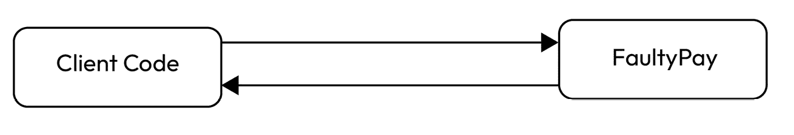
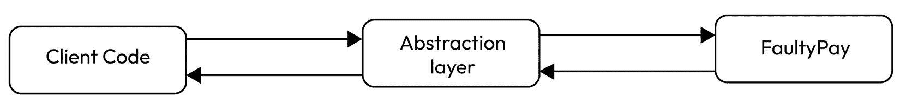
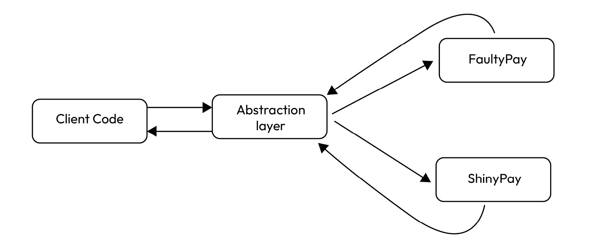
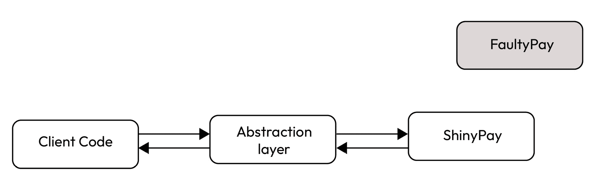
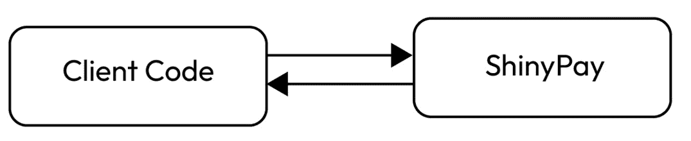
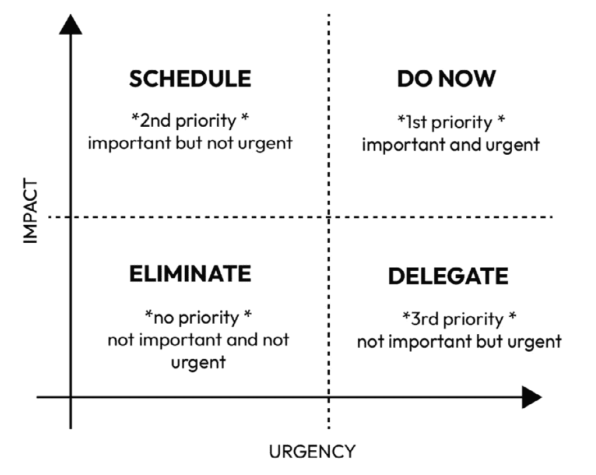

# 第一章：什么是重构？

想象一下。这是你在新工作的第一天，你充满了兴奋和渴望展示你的技能。你的新同事们很愉快相处，公司看起来也不错，你迫不及待地想要开始。你的“入职伙伴”开始向你展示你将在接下来的几个月甚至几年里工作的项目。其背后的概念很有前景，公司本身也很稳定。然而，代码库却是一个庞大而混乱的混乱——就像一团冒着烟的、纠缠在一起的意大利面。好吧，也许你不需要想象它。很可能你之前已经遇到过这种情况。也许你现在正经历着它。

当你打开你的集成开发环境（IDE）时，你会看到许多具有非常相似名称的模块。一旦你进入一个模块，你会遇到令人畏惧的大量类，其中一些类运行数百行。这些类通常包含具有模糊名称的方法，例如“`manageThis`”或“`processThat`”，并且它们往往带有过多的参数。简而言之，这不是一个有助于理解你新项目内部运作的环境。准备好迎接几周——甚至几个月——的挑战性工作，因为项目的代码库和架构远非最佳。缺乏文档或糟糕的代码注释在处理现有代码问题时会使事情更加困难。然而，如果代码本身写得很好，并且遵循良好的架构实践，它可以弥补文档的不足（这绝对不是什么可取之处）并最小化过度注释的需求（我们将在书中深入探讨这一点）。

让我明确一点：这并不是在责怪。我们中的每一个人——通过“我们”，我指的是一个我可能称之为“软件开发社区”的大群体——都有一种稍微不同的方式来解决同一个问题。每个人，至少在他们的一生中，都曾想过“我会做得更好”。但再次强调，我们中的每一个人都知道——或者将会知道——这很大程度上是关于环境。如果某个模块或代码片段完成得快但质量差，很可能是因为有人要求它快速完成。有时，我们会遇到有人给出相互矛盾的要求，或者由于内部或外部事件的发生而改变优先级。这个请求可能是因为一个有效的商业原因、一个关键的安全问题，或者他们认为重要的任何其他原因。没有人是懒惰的；（几乎）没有人工作得差。这只是环境问题。我们都感受到了那种压力。

属于“重构”这一广泛范畴的技术和概念有助于防止你陷入那种情况，确保你的代码不会变成那盘意大利面。这些技术和，更重要的是，与重构相关的思维方式，还可以帮助你改进现有的代码库，优雅地应对你所面临的困境，而不会感到不知所措。在本章中，我们将探讨重构的含义，以及实际上它可能有多么难以捉摸。我将尝试根据我的经验，讲述重构背后的动机——这些动机可能对你来说很熟悉。然后，我将给你一些建议，关于如何组织你的重构会话以及如何优先处理代码中需要修复的各个部分。

但让我们从慢一点开始，试图就本书标题所涉及的术语达成一致。

在本章中，我们将涵盖以下主题：

+   我们所说的重构是什么意思？

+   为什么你应该考虑重构

+   你应该在何时重构

+   你应该重构什么

# 我们所说的重构是什么意思？

如果我们给重构下一个严格的定义，我们可能会遇到一些麻烦，因为它的含义经常被不同地解读。无论如何，最常见的含义与代码重写相关。代码重构是指在不改变其行为的前提下，对现有代码进行重构和改进的过程。代码被重写，以便更容易理解和修改。

我们也可以给重构下一个“递归”的定义：一系列不改变软件行为的重构。

让我再强调一遍，因为这非常重要：软件将返回与之前完全相同的结果，不多也不少。它只是会被以不同的方式编写。你主要（也许唯一）要实现的目标是使你的代码更容易理解，而这是一项非常重要但难度很大的任务。

重构也可以与另外几个概念相关联。

它可以被视为一种迭代改进软件系统设计的方式。随着系统的演变，其设计可能会退化并变得过时，导致诸如复杂性增加、可维护性降低和灵活性降低等问题。重构通过逐步改变系统的设计来帮助解决这些问题，从而提高其整体质量和可维护性。此外，重构还可以作为一种发现系统潜在设计的技术。通过识别代码中的模式和共性，开发者可以深入了解系统的设计，并确定改进的区域。我们将在下一段中深入探讨这一概念。

## 重构与清洁代码

重构也与清洁代码的概念紧密相关。我们将在下一章详细介绍，但我们可以简要地说，清洁代码指的是易于阅读、理解和*维护*的代码。重构是开发者确保其代码保持清洁的主要方式之一。通过不断通过重构改进代码的设计，开发者可以消除代码异味（代码异味是源代码中潜在问题的迹象——我们将在本书稍后深入探讨这一点）并提高代码库的整体质量。重构有助于保持代码库的*可维护性和可扩展性*，降低问题的风险。重构有助于确保代码库与清洁代码的原则保持一致。当你的代码不够清洁时——我们将在下一章中看到这意味着什么——你所要做的就是停下来重构。

## 关于重构的误解

有许多概念可能类似于重构，但并不等同于重构。探索这些概念有助于更好地理解重构。

重构不是关于优化。然而，重构后的代码可能会有更好的性能。

让我更详细地解释一下。重构的主要目的是使你的代码更容易阅读，而不是——例如——减少其圈复杂度。（圈复杂度是一种衡量程序流程复杂度的方法。它计算代码中的不同路径或决策点的数量。复杂性越高，代码就越复杂。它是衡量代码可维护性和发现需要简化或额外测试的区域的有用工具。）这与目的正好相反！提高代码的性能可能会降低其可读性……但这没关系，因为目的不同。重构是一回事；提高性能是另一回事。尽管如此，这也意味着更易读的代码在某些情况下也可能是更高效的。

这里有一个非常简单的例子。

假设你有一个这个（非常老式）的方法：

```java
public static int sumArray(int[] arr) {
    int sum = 0;
    for (int i : arr) {
    sum += i;
    }
    return sum;
}
```

如你很容易看到的，这个方法只是接受一个`int`元素的数组并将它们相加，逐个扫描数组中的元素。我们可以尝试通过编写以下代码来使这个方法更快，而不改变其行为：

```java
public static int sumArray(int[] arr) {
    int sum = 0;
    int i = 0;
    int len = arr.length;
    while (i < len - 1) {
    sum += arr[i++] + arr[i++];
    }
    if (i == len - 1) {
    sum += arr[i];
    }
    return sum;
}
```

重构后的方法使用`while`循环而不是`for`循环，并在每次迭代中增加循环计数器 2。这使得方法能够一次处理数组中的两个元素，从而有效地减少了求和数组所需的迭代次数。这确实更有效率，但肯定不是更易读的。我们达到了优化的目标，但我们并没有重构代码。我们如何达到这两个目标呢？例如，使用一个简单的一行代码，如下所示：

```java
public static int sumArray(int[] array) {
    return IntStream.of(array).parallel().sum();
}
```

此方法使用 Java 8 的 Stream API 中的`IntStream`类对数组的元素执行并行求和操作。`parallel()`方法启用并行处理，允许多个线程同时处理数组的不同部分。然后`sum()`方法计算数组中所有元素的总和。

重构不是“修复 bug”。这就像我们刚才看到的复杂性问题：你可以通过重构一段代码来修复一个 bug，但这几乎是一个意外。或者，更好的说法是，这就像一石二鸟：如果你能修复一个 bug 并且重构一段代码，那将是一个巨大的胜利！但记住——通常建议不要在单个代码更改中混合不同的代码操作，尽管这经常发生。

重构实际上可以*帮助*你解决 bug，但我们会稍后讨论。

最重要的是，重构不是“添加功能”。当你向你的软件添加功能时，你不应该更改现有代码，而只是添加功能。相反，当你重构时，你的北极星不应该是为了改变现有的行为。作为一名软件专业人士，你可能会发现自己在这两个层面之间切换。重要的是你要意识到你在做什么：你更好地组织代码，然后添加新功能；一旦新功能经过测试并证明可以正常工作，你就可以再次重构；依此类推。这就像你戴着两顶帽子（使用 Kent Beck 的比喻）并且不断交换它们：你可以，你也应该，但记住你每次戴的是哪一顶。

在某些情况下，可能会来自业务的压力，要求优先考虑添加新功能而不是为重构分配时间，这可能被视为没有立即价值或仅仅服务于 IT 部门。因此，尝试在功能发布中秘密地整合重构任务可能会导致角色模糊。这意味着你并没有保持不同的焦点或责任（你不是*戴着两顶帽子*），从而产生目标混合。

现在我们对重构的含义有了更多或更少的了解，我们准备了解其背后的原因。

# 你为什么应该考虑重构

我们刚刚看到，重构与清洁代码的概念高度相关。因此，我们可以这样说，重构代码最重要的收获之一是提高其可读性。换句话说，重构使你的代码更容易理解。

即使编写代码的主要目的是告诉机器按照你想要的方式执行你想要的操作，精确到每个细节，但有时我们容易忘记的是：你不仅要让计算机理解，首先你必须让人类理解，尤其是你未来的自己！在我的经验中，我发现自己很多次在看着自己可能只是几周前写的代码时，会问：“为什么？！”

虽然这看起来可能很简单甚至有些天真，但由于急于让我们的程序工作，编写可读代码的想法往往被忽视。虽然这确实很重要，但我们还必须记住，作为软件专业人士，我们工作中很大一部分是致力于维护。根据我的经验，从头开始一个项目的机会很少；大多数情况下，我们必须继承他人的代码并对其进行维护或扩展。通过优先考虑可读性，我们可以从许多方面受益。

虽然编写易于未来理解代码很重要，但将复杂且难以阅读的代码转换为清晰和有组织的代码也很有帮助。就像印第安纳·琼斯或劳拉·克劳馥一样，开发者经常需要深入他们正在工作的项目，以理解程序员祖先的意图。然而，如果代码难以阅读，这可能会变得更具挑战性。通过重构代码，你可以对自己的代码功能有信心。

另一个拥有可读代码的好理由是当代码打算开源时。无论是由于对与开源项目协作的个人兴趣，还是公司的策略或将其用作专业形象展示，在这些情况下，拥有可读代码变得尤为重要。

另一个可读代码有价值的情况是当你的代码接受同行评审或用于培训初级团队成员时。在这种情况下，拥有易于遵循和理解的代码有助于确保团队内部的有效协作和知识转移。

我也喜欢可读的代码，因为我记忆力非常差。我无法在脑海中保留超过一定量的信息；实际上，我也不想这么做。如果你能像阅读散文一样简单地通过阅读代码来检索信息，那就没有必要了。要求我的未来自我或同事回忆那些可以轻易包含在代码中的细节是不公平的，比如为什么采取特定的方法，为什么从特定位置获取某些信息，或者为什么选择一个解决方案而不是另一个。当我处理遗留代码时，我最常问自己的问题是：“这是错误还是故意的？”；可读的代码（结合正确的测试量、代码注释和编码标准，但我们会稍后讨论）是消除疑虑的正确选择。

有许多技术可以使代码更易于阅读，我们将在本书的后面部分详细讨论它们。首先，我想强调的是：可读性可能是一个非常主观的东西。对我来说可读的，可能对我的队友来说不可读。有些人喜欢一行代码，而有些人喜欢在一个方法中隔离几行代码。你可能更喜欢明确每个变量的类型；我更喜欢使用`var`关键字。我的建议很简单：与你的队友交谈并达成妥协。从讨论中排除客观改进（例如，用流代替经典循环）并就一般的“代码风格”水平达成一致（你可以使用编码标准文档或为你的 IDE 使用独特的格式化工具，但我们将在后面深入探讨这个问题）。保持项目所有类中的代码一致性是很重要的。

## 改进你的软件设计

重构有助于你改进软件的设计。如果你不这么做，设计将会（不会太慢地）退化；例如，将新功能放在哪里或如何实现它们将变得更加困难。重构就像在确保了新功能后对项目进行一次“整理”。如果你不这么做，你可能会陷入陷阱，其中之一就是几乎每个软件公司都存在的古老怪物。减少重复代码不仅仅是“正确做事”的问题（即使正确做事应该是规范），但它有一个直接的好处：当你必须修改那段代码时，你只需修改一次。当我说这个非常基本的概念并不总是受到尊重时，请相信我。在这里，我将引用马丁·福勒在其著作《重构：现有代码的设计改进》中的一段话：“通过消除重复，你确保代码只说一次，并且只说一次，这是良好设计的本质。”

如果代码设计或实现得不好，你将不得不做额外的工作来添加功能、修复错误或提高性能：这额外的工作是由于所谓的**技术债务**。技术债务发生在你在设计或实现选择中优先考虑速度而不是长期利益时。就像贷款一样，它会随着时间的推移积累利息，使得以后维护和改进软件变得更加困难。持续的重构可以改进设计和质量；更好的设计可以减少技术债务。

## 可维护性和可扩展性

正如我们之前所说，软件开发很大程度上关乎可维护性。如果重构能帮助你保持良好的设计，那就是对每一块代码的功能和放置新代码的位置有清晰的理解。在这种情况下，可维护性得到了提升：通过改进代码组织和结构，随着时间的推移，更容易识别和修复问题或添加新功能。如果你关心你的软件，并在认为必要时进行重构（参见下一小节），随之而来的良好设计将帮助你扩展你的代码。虽然提高性能不是重构的主要原因，但它通常会成为一项不错的额外收益。例如，如果某个功能被正确地隔离，那么它可能更容易并行化或将其移除并放入另一个服务中，使用远程调用来获取其信息。

## 理解、避免和修复错误

良好的设计意味着你的代码的每一部分只做一件事，而且做得很好。但有时事情可能会变得混乱；错误就在眼前。当你与错误作斗争时，首先要做的事情之一是了解发生了什么以及在哪里。重构有助于理解代码（因为你必须在不改变外部行为的情况下稍微重写或重构它），因此你会更好地了解代码。如果你了解并理解你的代码，那么发现错误或实施修复就会更快。

让我给你一些建议：尽量在你的项目中避免有“受限区域”。在这种情况下，“受限区域”指的是一个库、模块或代码库的另一个部分，你依赖并理解其目的，但因为你害怕触摸它而觉得它非常脆弱。你知道它做什么，但不知道它是如何做到的。它就像一个混乱，你公司里没有人愿意处理。系统越复杂、越老，参与工作的人越多，理解代码库就越困难。有时这些受限区域是不可避免的，尤其是如果之前的开发者没有留下任何文档。如果你有一些这样的区域，那并不是什么大问题，但最好尽可能地最小化它们。重构可以帮助，但需要满足某些条件，例如拥有良好的测试覆盖率（但我们稍后再谈）。

## 更快的开发

所有这些考虑都让我们得出一个结论：重构有助于更快地完成任务。这听起来可能有点反直觉，但如果你稍微思考一下，就会变得非常清晰。拥有设计良好、无错误、易于理解的软件意味着保持良好的软件质量。当然，拥有高质量软件的主要目标是更快地添加功能、快速扩展以及快速修复错误。

请记住，编写软件是一门手艺。作为软件开发者，我们就像工匠，塑造和塑造我们的应用程序，设计和组装我们的服务。尽管我们不使用像锤子和扳手这样的物理工具，但我们仍然是工匠。主要区别在于我们创造的是灵活和适应性强的。我们有能力回顾我们的工作，对其进行改进，并使其更容易适应变化。通过这样做，我们可以在需要扩展我们的工作时，建立一个坚实的基础。

如果没有适当的设计，工程任务就会变成一个无休止的快速修复和黑客攻击的循环。如果你继续以这种方式处理项目，依赖一个又一个的临时解决方案，那么项目变得难以管理只是时间问题。

如果你的经理更关注进度和截止日期，而不是技术方面或整体质量（是的，这种情况可能发生），强调重构可以加快开发速度作为关键优势，可以成为一个有说服力的卖点。

# 你应该在何时重构

到目前为止，我们对重构有了清晰的理解，以及为什么它具有如此重大的重要性，或者我甚至可以说，它在我们的日常工作中至关重要。你可能想知道何时是进行这项活动的适当时间。在决定重构的时间时，需要考虑几个因素。重构可能会消耗时间，这是众所周知的，那么我们如何有效地将其融入我们的工作流程中？执行这项活动的最佳时间是什么时候？

让我从一些基于我们经验的基本建议开始：每次有机会时，做一些小的重构总是一个好主意，即使这意味着将其整合到你的当前任务中。例如，在运行测试或执行静态代码分析时，你可能会遇到一个名为 *x* 的变量。这个名字并没有传达太多意义，对吧？所以，你可能会花一些时间去试图弄清楚这个变量代表什么，结果发现它包含了一个用户的姓名。你费了很大劲去解读它，但为什么别人也要做同样的事情？为什么你 3 周后再次查看代码时还要经历同样的麻烦？只需花一点时间将变量重命名为 `username`。这是一个简单且几乎不费力的任务（你的 IDE 可以做到这一点），可以节省他人的时间和精力。我总是试图保持这种心态，这与我“懒惰”的态度相符，即以最小的努力实现最大的成果。

## “三法则”

**三一律规则**建议代码不应超过两次重复，一旦发生第三次重复，应将其提取为可重用的模块或函数。这个原则最初由谁提出并不清楚，因为它已被各种软件开发人员和团队广泛使用和改编多年（它被马丁·福勒普及，他将其归功于唐·罗伯茨）。更有效的方式是将其表述为“三振出局，然后重构”。

## 为平滑功能实现做准备的重构

当向你的代码库添加新功能时，进行**准备重构**通常很有帮助。这意味着花时间分析代码库中受新功能影响的部分，并在之前进行必要的更改。我将借用马丁·福勒关于准备重构的出色类比：就像在刷墙时，先封好电源插座、门框和踢脚线。封口本身不是刷墙，但它使刷墙过程更快、更简单。

在准备重构的分析阶段，你可能会注意到一些地方，代码的微小改动可以带来速度或效率的显著提升。例如，你可能会意识到使用方法参数而不是字面量或使用类层次结构而不是`switch`语句可以提高代码的灵活性和适应性。通过重构进行这些改动，你可以使代码在未来更容易接受变化，从而总体上使开发更加容易。

## 为错误修复的重构

这一点往往被忽视，但修复一个错误可以提供一个重构的绝佳机会。这是因为与错误修复相关的重构很大一部分是为了提高代码的可读性。通过使代码更易于理解，你可以更快地识别错误的根本原因并更有效地修复它。错误一直存在，但由于代码的可读性不足而未被发现。因此，在修复错误时花时间重构以防止未来再次发生是一个好习惯。

重要提示

让我更清晰地说明：重构和错误修复是两回事。首先修复错误，然后专注于改进代码是很重要的。它们可能是相关的，但却是独立的步骤，一个不自动包含另一个。

## 理解重构

你不需要一个错误来让你的代码更干净、更易于理解；你可以在试图理解代码的同时重构代码——我们都有过这样的经历——记住你两个月前试图做什么。我会多次重复这个概念，因为我认为这是我们工作中最重要的概念之一：编写代码不仅仅是与一组机器对话；更多的是与我们的未来自己和同事对话。马丁·福勒将这种技术称为**理解重构**。这个想法可以比作整理自己的衣柜，目标是清楚地看到所有可用的服装选项，以便选择最合适的搭配。同样，理解重构涉及简化代码以提高其可读性和可理解性。

## “童子军规则”

然后是我的一个最喜欢的与软件工程相关的概念，这个概念是从露营世界借用的，并且也应该应用于现实生活中。让你的代码比找到它时更好；至少，让它保持和原来一样干净。不要让它变得更糟。就像当你去露营或在绿色田野上野餐时，你必须认为那片绿色田野不是你的——你只是在借用它；不要留下你的垃圾。如果你发现一些垃圾，花点时间捡起来。

回到我们的世界，如果你发现一些代码——比如说——是可以理解的，但你认为可以工作得更好（例如，参数化一个函数或使用具有更好签名的另一个库方法），那么请不要忽视这个问题并修复它。捡起你沿途发现的那些小垃圾。同时，记住你当时在做其他事情；你的任务不是捡垃圾，而是享受户外的一天（只是为了继续这个愉快的比喻）。所以，在你的实际任务和这个垃圾清理重构之间找到一个平衡；我发现有时候有用的一种方法就是记下有人会清理那块代码：你如何做（一个 Jira 任务，一个`git pull`请求，在你的显示器上的便利贴）取决于你的团队如何工作。但这是那种你会发现非常有用，我可以说，几乎是改变思维的微小步骤重构。

## 计划重构

在这个时候，可能会觉得重构必须是你作为软件开发者的日常活动之一，一种“机会主义”的活动；当然，它确实是。你应该将重构代码作为你日常活动的一部分。编写软件可以看作是在功能之上添加功能，从而产生一个永无止境的功能堆栈和，因此，代码模块，但开发者知道，大多数时候，仅仅更改现有代码来添加新功能会更容易。你不应该认为软件是“完成的”；它是活生生的，并且一直在变化。当软件长时间保持不变时，可能存在一个问题：它可能太难更改或扩展（没有进行足够的重构），或者可能已经被其他东西所取代（因此，我的建议是……放弃它）。

我在这里试图说明的是，并不总是可能第一次就写出优秀的代码；有时你必须停下来，重新审视你所做的，然后……尝试做得更好。有时，你可能甚至需要计划进行重构，因为你理解对现有代码库的更改太难了；这个概念与我们之前提到的预备重构类似，但它是一个升级，因为你计划了重构。你应该很少这样做，因为这意味着你没有将小的重构纳入你的日常活动中，但它可能发生。在这种情况下，要仔细计划：有时，例如，使用单独的分支或提交来处理新功能和重构可能更好；有人说这会将重构与其目的分开。我这里没有特别的建议：只是做最适合你团队的事情。

## 长期重构和“抽象分支”

尽管大多数重构任务可以在几分钟或几小时内完成，但某些活动可能需要几周的时间才能完成。这些通常包括将特定逻辑隔离到单独的组件中或用另一个库替换一个库的任务。为了解决这些更复杂的问题，团队在接近已被确定为需要改进的“危险区域”时，建立一种在重构的实践可能是有帮助的。实现这一目标的一个有用技术被称为**抽象分支**，它可以用来以渐进和可控的方式更改库或服务调用。

抽象分支包括五个阶段。

假设你需要替换你几年前集成到系统中的过时的 `FaultyPay` 支付服务。自然地，你不想在过渡过程中给你的客户带来任何问题或不便。在这里，你可以看到客户端代码和 `FaultyPay` 服务之间存在调用和响应：



图 1.1 – 一种非常基本的情况：我们的客户端代码调用遗留系统并得到响应

在你确定了要替换的服务后，你构建一个抽象层，以允许被替换的系统与请求该服务的实体之间继续通信。这个抽象层充当契约，暴露功能同时隐藏实现细节：



图 1.2 – 抽象层，通常由 Java 接口表示，被插入到客户端代码和需要消除的组件之间

然后，开始系统地构建替换系统（我们将它称为`ShinyPay`），并在完成每个重建的功能后，将其逐步集成到抽象层。重要的是要记住，在这个过程中，所有流量——无论是新系统还是旧系统的——都将通过抽象层。还应注意，你也可以选择（如果可能——这并不总是可能的）一次迁移一个功能：



图 1.3 – 一旦准备好的替换组件，就可以连接到抽象层

抽象层还可以用于微调服务，例如仅将部分流量或特定功能定向到新组件（功能切换）。也可能一次迁移一个方法。重要的是确保遗留系统和新的系统都遵守相同的契约。

在这一点上，旧系统中的代码（在我们的例子中是`FaultyPay`）变得过时，因此你可以删除它：



图 1.4 – 之前的实现（FaultyPay）已从系统中断开；所有流量和功能现在都仅指向新的实现（ShinyPay）

一旦所有遗留代码都被移除，你可以选择拆除抽象层。或者，你也可以选择保留这一层以实现可扩展性或未来保障：



图 1.5 – 我们已经回到了理想的情况，但有了我们的新组件！如果我们小心、熟练且幸运，没有人会注意到任何东西（这意味着没有中断）

这种方法具有几个明显的优点。除了能够实现持续集成中大型功能无缝迁移的主要优点外，使用抽象分支技术的几个额外好处还包括：

+   发布计划完全独立于架构变更，这使得根据需要暂停和恢复迁移过程变得容易且成本低廉。这是因为新的实现由系统保护，可以快速适应紧急请求或来自领导团队或客户服务部门的优先功能，或修复错误。相比之下，当使用标准功能分支时，恢复已暂停的迁移可能更具挑战性。

+   合并冲突的可能性也仅限于抽象层，这可以显著减少可能出现的冲突范围。如果没有抽象层，一个在功能分支中长时间停留的代码库重构可能会产生广泛的各种合并冲突，这些冲突可能难以完全解决。

+   你不必完全切换到新系统，而可以选择在需要时开启或关闭新功能。这些“特定开关”被称为**功能开关**。功能开关，也称为功能标志或功能切换，是一种允许开发者在运行时启用或禁用应用程序中特定功能或功能的技术，而无需修改代码库。通过使用功能开关，开发者可以向用户子集发布新功能，在生产环境中测试它们，或根据某些条件或用户群体启用/禁用功能。这种方法提供了灵活性，允许逐步推出，并减少了部署新功能相关的风险。

## 代码审查中的重构

**代码审查**是审查源代码的过程。通常由其他熟悉编程语言和项目要求的开发者或同行进行。我们将在*第八章*中详细讨论代码审查。

代码审查的目的是确保代码以清晰、简洁和高效的方式编写，并且符合项目的要求和编码标准。代码审查有助于识别和修复潜在的错误或安全问题，以及提高代码的整体质量和可维护性。

在代码审查过程中，审查者逐行检查代码，并提供关于代码结构、语法错误、性能和可读性等方面的问题反馈。审查还可能涉及改进讨论、对代码功能设计和设计的提问和澄清。代码审查是软件开发过程中的重要部分，通常在代码合并到主代码库或发布给客户之前进行。

马丁·福勒建议代码审查是进行重构的好时机。如果你想理解别人的代码（正如我们之前所说的），最好的方式就是重构它。否则，你可能只能得到一些零散的信息，并给出模糊的反馈。重构可以帮助你获得更清晰的画面。顺便说一句，有一种叫做**结对编程**（以及一种叫做**团队编程**）的东西，它将代码审查提升到了一个新的水平。我们将在本书的后面更多地讨论这个问题。

# 你应该重构什么

有时在我的职业生涯中，我们会遇到需要对我的项目不同部分进行修改的情况。可能是因为某些部分工作不正常，或者是我没有完全理解的部分，或者仅仅是能够改进的地方。决定哪些部分需要关注和优先处理是很重要的。在某些情况下，甚至可能更好让事情保持原样，不做任何修改。

在重构方面没有固定的规则，但只要稍加思考，你就可以制定出一个符合你特定需求的稳固计划。记住——在我们这个职业和生活中，我们经常不得不做出妥协。

最近，我在加里·凯勒的书籍《最重要的事》(*Bard Press*, *2013*)中遇到了一个有用的概念。虽然它不是专门与软件开发相关的，但它可以应用于我们的需求。这个想法是这样的：“你能做哪一件事情，通过做这件事，其他所有事情都会变得更容易或不再必要？”虽然这是一个广泛的问题，有很多含义我们在这里无法讨论，但它可以成为决定我们如何处理代码库的有用起点。这种方法在重构代码时特别有帮助。所以，当你开始一个新的任务或功能时，看看你的代码，问问自己是否有任何改进，可以使整个项目的工作变得容易得多或完全不再必要。

问题是关注你能做什么，这迫使你从可操作的角度去思考。这并不是关于在满足某些条件时你会做什么，而是关于你现在能做什么。通过确定那一件可以使其他所有事情都变得更容易或不再必要的事情，我们可以将我们的努力集中在最关键的当前任务上。这就像将我们工作的本质提炼到核心：做最必要的最小工作以达到最大的影响。这种方法在软件开发中尤其有价值，因为通常有很多不同的领域可以从重构或改进中受益，但我们需要优先考虑并集中我们的努力以达到最大的影响。

让我给你举一个例子来说明这一点。想象一下，你在一家人气旺盛的旅行社工作，但面临着处理多个旅游提供商及其解决方案的复杂生态系统的挑战。问题是，有一些过时的代码导致问题，预订过程偶尔会失败。系统技术上没有错误，但它是过时的，难以维护，缺乏适当的文档（一句话：它的*遗留性*），而且肯定无法应对预期的流量激增。我们真的需要重构它，否则公司将无法应对即将到来的新客户。同时，有一个内部团队负责管理网站内容，他们正在与一个每月只使用两次的工具作斗争。这个工具极其复杂且不实用，甚至简单的任务也会变得耗时。我们绝对必须重构这个工具，使其对团队更友好。虽然这两个问题都很重要，但很明显，遗留代码和预订流程的第一个问题应该首先解决，因为旅游预订是公司的核心业务，而且那些人将能够自由地处理其他事情。

无论如何，让我们面对现实——重构遗留代码可能会让人感到不知所措，尤其是在时间和资源紧张的情况下。虽然“一事一做”规则是一种绝佳的方法，但它也相当宽泛。所以，让我给你展示一些更精确的方法，可以帮助你决定哪些代码库的部分最需要你的关注。

## 影响分析

**影响分析**就像软件重构中的侦探工作。它全部关乎于弄清楚代码库中某一部分的变更将如何影响系统的其他部分。

因此，首先，开发者需要确定需要重构或更新的代码模块。然后，他们调查这些模块与其他软件部分（如外部库、用户界面和接口）之间的联系和关系。

通过理解这些依赖关系，开发者可以很好地了解变更将如何在整个系统中产生连锁反应。他们可以确定可能特别难以更改的区域，并采取措施减少出现错误或其他问题的可能性。

基本上，影响分析是软件重构工具箱中的关键工具。它帮助开发者以更深思熟虑和谨慎的方式做出更改，从而使代码在长期内保持稳定且易于维护。

进行影响分析涉及彻底评估对系统或项目进行变更的潜在影响。以下是步骤分解：

1.  **准备**：定义变更，明确说明你想要做什么。收集关于提议变更的数据。

1.  **识别受影响区域和依赖关系**：头脑风暴系统哪些部分会受到变更的影响，以及变更将如何影响系统中的其他组件。

1.  **识别每个领域的受影响元素**：评估更改将如何影响功能、性能、安全性和其他方面。识别可能由更改引起的风险和问题。

1.  **评估**：进行评估时，团队会识别出所提议更改的正面和负面影响。

1.  **处理负面后果**：对负面影响的更清晰理解后，团队现在可以专注于解决这些问题。他们有机会与团队成员和利益相关者协商，讨论是否应该继续更改。此外，在这种情况下进行回归测试变得至关重要。

## 风险评估

**风险评估**是一种说法，即“找出可能出错的事情”。在软件重构中，这涉及到在做出更改之前，对代码库进行严格的审视并识别潜在的风险。

在评估风险时，开发者会考虑一系列因素，包括代码的复杂性、引入错误的可能性和可能出现的问题的潜在影响。可能对数据（某些代码可能处理关键信息，如个人或财务数据）产生影响，可能出现的停机时间（某些代码在出现问题时可能会使整个系统或某些核心功能崩溃），业务问题（如果某些代码损坏可能会导致财务问题或合同违规），或安全漏洞。他们还可能考虑重构项目的可用时间和资源以及可能对用户和利益相关者产生的影响。

一旦识别出风险，开发者可以采取措施来减轻它们。例如，他们可能会创建测试用例以确保重构后的代码按预期工作，或者他们可能会分小步骤进行更改以减少出错的可能性。我们将在本书的后面更深入地讨论测试覆盖率。

总体而言，风险评估是软件重构的重要部分，因为它帮助开发者做出明智的决定，关于如何继续进行。通过花时间考虑潜在的风险并相应地制定计划，他们可以确保重构项目成功，并且代码库在长时间内保持稳定和可维护。

## 价值评估

**价值评估**在软件重构中，就是确定特定的重构项目是否值得投入所需的时间和资源来完成。

在评估价值时，开发者会考虑各种因素，例如代码库的当前状态、重构的潜在好处以及涉及的成本和风险。他们还可能考虑用户反馈、性能指标和利益相关者的需求等因素。

一旦对重构项目的潜在价值进行了评估，开发者可以决定是否继续推进。在某些情况下，潜在的利益可能不足以抵消成本，项目可能会被搁置或推迟。在其他情况下，利益可能足够显著，足以证明投资的合理性，项目可能会继续进行。

价值评估是软件重构的一个重要部分，因为它有助于开发者优先考虑他们的努力并就如何分配资源做出战略决策。通过关注具有高潜在价值的项目并避免那些潜在价值较低的项目，开发者可以确保他们最有效地利用他们的时间和资源。

## 优先级矩阵

**优先级矩阵**（也称为**艾森豪威尔矩阵**）是软件重构中用于帮助开发者优先考虑他们的努力并就哪些重构项目优先处理做出明智决策的工具。它通常涉及一个矩阵，其中两个轴分别代表分配给项目的紧迫程度和潜在的系统影响。

每个项目都是基于这两个因素进行评估，然后相应地绘制在矩阵上。那些需要最少努力且具有最大潜在影响的项目被认为是最高优先级，而那些需要更多努力且潜在影响较低的项目被认为是低优先级。

使用优先级矩阵可以帮助开发者根据每个项目的潜在利益和成本，做出关于先处理哪些项目的战略决策。通过首先关注最高优先级的项目，开发者可以最有效地利用他们的时间和资源，并确保他们正在解决代码库中最关键的问题：



图 1.6 – 你应该将你的活动放入优先级矩阵中，以选择正确的执行优先级

应将更高优先级分配给那些具有高紧迫性和影响的活动。对于那些不紧迫且不会产生影响的活动的优先级应较低（或完全没有重要性）。

## 进一步考虑

在进行重构时，还有更多的事情需要考虑。我这里只是简单地记下来，以防万一，但说实话，这可能会超出本章的范围。一旦你确定了代码库中需要优先重构的部分，下一步就是制定一个详细计划，包括项目的范围、目标、步骤和时间表。向所有相关人员传达这个计划也很关键，比如你的团队、经理、客户和用户。你需要解释为什么你要重构，你将做什么，你将如何做，以及何时完成。在整个重构过程中设定明确的期望并管理它们是很重要的。

最后一步是以纪律和勤奋执行计划。坚持最佳实践，如进行小而频繁的更改，在每个更改前后运行测试，提交并记录每个更改，以及审查和验证每个更改。关注重构如何影响代码质量、系统性能和用户反馈。衡量结果，并将它们与你的目标和期望进行比较。

## 重构还是重写？

关于这个问题，有各种各样的观点，我观察到这是团队成员和同事之间发生争执的常见原因。事实是，没有简单的答案。这只是那些有很多相互矛盾观点的事情之一，很难确定该相信什么。但我会尽我所能与你分享一些这些观点，并给出一些建议，无论它们的价值如何。

有时候，重构代码根本无法证明其合理性。可能是因为它充满了太多的错误，设计过于复杂，理解起来几乎是不可能的。处理它就像蒙着眼睛解决魔方——或者，引用我的一位前同事的话，就像在附近吹风扇时数钱。在这种情况下，从头开始重写可能是更好的选择，这也是许多软件开发者觉得很有趣的事情。毕竟，创造新事物通常比采取仍然与之前所做事情相关的小步骤更舒适。

另一方面，我们常常陷入想要重写一切的陷阱，认为现有的东西都很糟糕，而实际上，我们可能并没有付出足够的努力去完全理解它。记住美国开发者乔尔·斯波尔斯基提出的编程基本规则之一是很重要的：*阅读代码比编写代码更难*。让我们不要立即贬低我们在代码库中遇到的遗留代码，这些代码通常不是我们写的（当然，我们自己的代码是漂亮的）。遗留代码有历史；它已经经过彻底测试，并与所有必要的用例集成，并且通常表现出良好的性能。我们应该尊重遗留代码。

这是一个非常复杂的决定，正如我所说的，没有普遍的规则。也许，可以采用的一个非常简单的规则是尝试评估重写和重构代码的成本（无论是时间还是复杂度），并选择对你来说看起来最好的选项。请注意，我并没有说“成本更低的选项”，因为这通常是一种投资。另一件有用的事情可能是将检查的部分分解成更小的部分（古老的“分而治之”方法），并选择只重构（或重写）那部分，以免“陷入困境”太长时间。

如果你决定重写一段代码、一个模块或整个组件，让我给你一条衷心的建议：不要过于执着于已经完成的工作。让我解释一下。当然，尝试理解代码的功能和构成逻辑流程的各个步骤是有用的。同样有用的是了解用户当前的行为和当前实施的业务案例。然而，我经常发现当前存在的东西并不符合用户的真实需求；也许它从未符合过，或者随着时间的推移需求发生了变化。也许一半的软件现在根本不再需要。因此，阅读现有内容并尝试以更好的方式或不同的方式重写它是可以的，但通常这个逆向工程过程可能相当复杂、耗时，尤其是容易出错。相反，尝试确定用户的需求，可能需要产品负责人的帮助（要知道产品负责人是什么，你可以参考[`www.scrum.org/resources/what-is-a-product-owner`](https://www.scrum.org/resources/what-is-a-product-owner))。

这实际上可能会遇到一些阻力，这取决于你所工作的公司的心态。很多时候，我被告知：它必须和以前一样有相同的逻辑，但必须工作得更好。这显然是一种很好的保护自己的方式，但它几乎从未导致有效的结果。这迫使工程师进行大量的逆向工程工作，鉴于（通常是）不断变化的需求，这可能部分是无效的；它不允许团队（无论是所谓的科技部分还是所谓的产品部分，假设这种区分有意义）专注于单个功能的重要性，以便优先考虑活动并可能避免不必要的活动。因此，我建议你始终从需求开始——从为什么，而不是如何开始。在考虑如何到达那里之前，先考虑目标。

# 摘要

本章深入探讨了重构的概念及其难以捉摸的本质。它分析了重构的潜在动机，并提供了关于组织有效的重构会议以及优先考虑代码中需要关注的各个不同区域的见解。此外，它强调了将重构无缝集成到日常活动中的重要性。总之，本章提供了一个全面的总结，并介绍了一系列成功将重构融入专业日常工作的技术。

在即将到来的章节中，我们将讨论一系列被认为是软件专业人士在工作中应采纳的“良好习惯”的推荐实践。

# 进一步阅读

+   *马丁·福勒*，《重构》，*Addison-Wesley Professional*

+   **你应该如何优先考虑哪些遗留代码应该首先重构**？ [`www.linkedin.com/advice/0/how-do-you-prioritize-which-legacy-code-refactor`](https://www.linkedin.com/advice/0/how-do-you-prioritize-which-legacy-code-refactor)

+   **重构与重写：决定如何处理问题软件** [`www.techtarget.com/searchapparchitecture/tip/Refactor-vs-rewrite-Deciding-what-to-do-with-problem-software`](https://www.techtarget.com/searchapparchitecture/tip/Refactor-vs-rewrite-Deciding-what-to-do-with-problem-software)

+   **《你永远不应该做的事情，第一部分》** [`www.joelonsoftware.com/2000/04/06/things-you-should-never-do-part-i/`](https://www.joelonsoftware.com/2000/04/06/things-you-should-never-do-part-i/)

+   **功能切换（又称功能** **标志**）** [`martinfowler.com/articles/feature-toggles.html`](https://martinfowler.com/articles/feature-toggles.html)

+   **BranchByAbstraction** [`martinfowler.com/bliki/BranchByAbstraction.html`](https://martinfowler.com/bliki/BranchByAbstraction.html)
