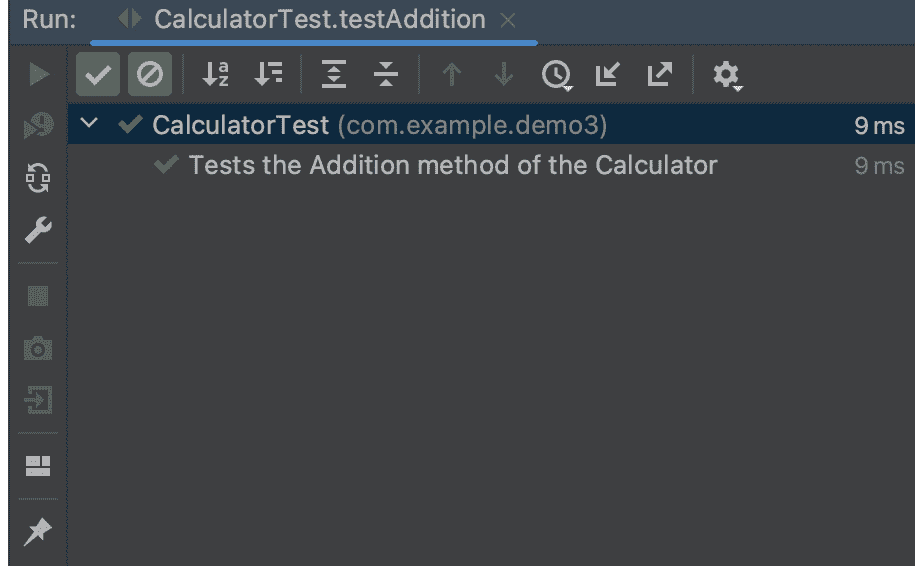
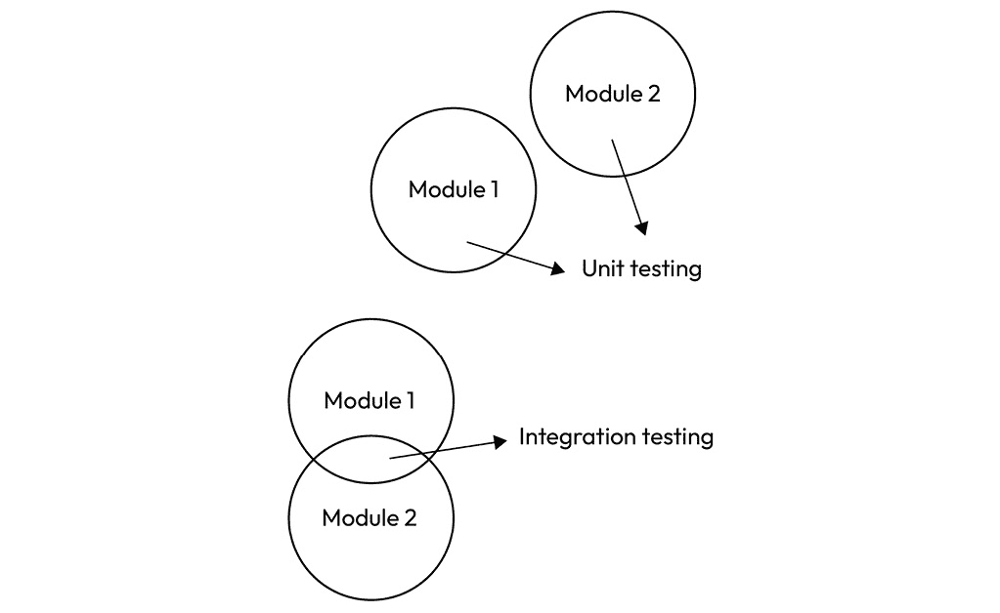
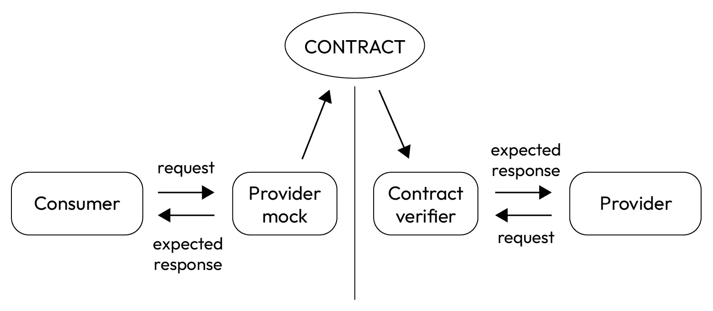
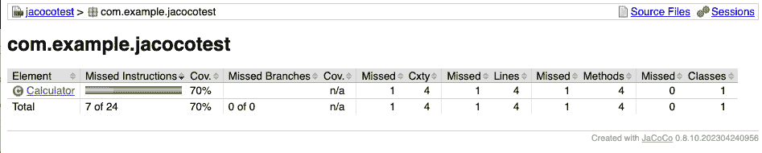
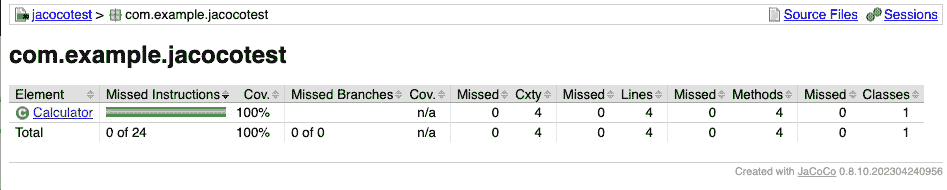
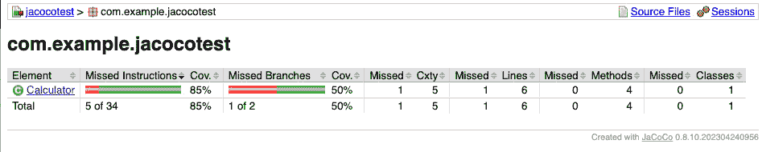
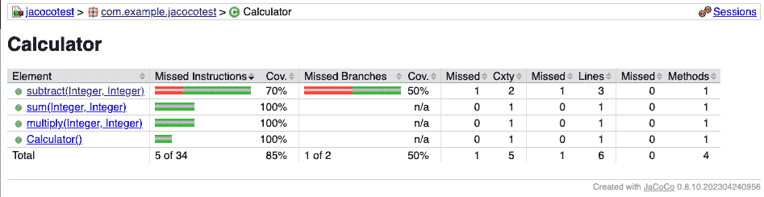
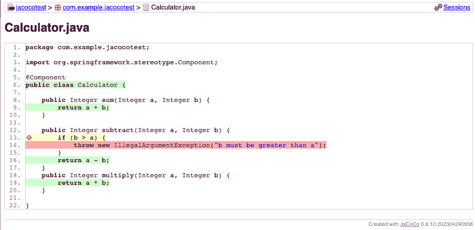
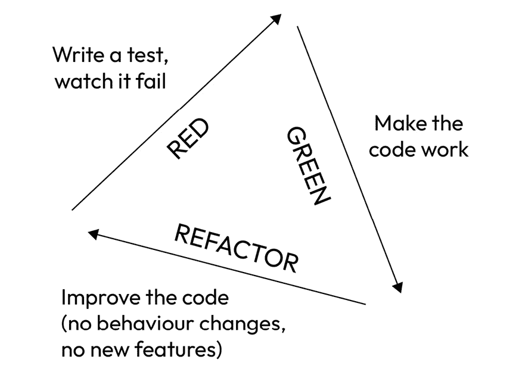

# 第四章：测试

当我们谈论重构时，正如我们已经提到的，我们本质上是指以更好的方式（“更好”可以有各种含义）重写代码，而不改变其行为。这一点至关重要，而我们还没有深入探讨。为了确保行为不会改变，并且通常来说，为了以高水平的信心进行每一次重构，有必要有一套足够的测试来覆盖。

这听起来可能很显然，但测试不过是一种验证某些软件功能（无论是代码片段、模块还是整个架构）是否符合一系列要求的方式。在实践中，我们说的是：“*检查我的代码，给定输入 X，产生输出 Y*。”它可能比这更复杂，但为了现在，我们就用这个解释来解决问题。

可以有各种类型的测试，以及不同的编写方法，正如我们在本章的进程中将会看到的。但在讨论“如何”之前，我们将探讨为什么测试是必要的，尤其是在重构方面。在重构的背景下，我会说测试是一个基本条件。

幸运的是，有一些方法和工具可以帮助我们，比如著名的**JUnit 框架**。在方法方面，当然值得提到**测试驱动开发**（**TDD**），它**服务于**重构，同时**使用**重构——你将会明白我为什么说这句话有点晦涩。但为了真正安全，还必须确保大多数实现的功能都经过了严格的测试；为此，我们也有工具可以节省我们不少麻烦。

在本章中，我们将涵盖以下主题：

+   为什么你应该测试，以及为什么你应该经常进行测试

+   单元测试

+   集成测试

+   合同测试

+   确保安全——检查和改进你的测试覆盖率

+   测试驱动开发

然而，在所有事情之前，正如西蒙·辛克的一本著名书籍所建议的，让我们从“为什么”开始。

# 为什么你应该经常进行测试

如前所述，测试是软件工程师工作的一个基本部分。这是我们都可以同意的——我会说这几乎是直观的——但让我们试着深入挖掘，真正理解为什么测试我们的代码（以及我们的代码与其他代码和系统交互）是至关重要的。我即将提出的理由不一定按照重要性排序，它们可能不是唯一的。我在分享在我经验中被认为是重要的东西。

## 识别和修复缺陷

让我们从最明显的动机开始。测试你的软件可以让你识别缺陷（错误）、错误和故障。在这方面，我们在“进一步阅读”部分包含了一篇文章，解释了这些术语之间的区别，这些术语经常被互换使用。这些问题可以以各种形式出现，如功能缺陷、性能瓶颈、安全漏洞或可用性问题。如果这些问题未得到解决，可能会产生严重后果，导致系统故障、数据泄露、用户不满和昂贵的返工。

通过在整个开发周期中进行全面的测试，开发者可以早期检测和解决这些问题。这种主动的测试方法允许他们在问题升级为更严重的问题之前，确定并纠正潜在问题，从而最大限度地减少最终产品中关键缺陷的风险。

早期识别和解决错误的一个主要好处是预防下游的复杂问题。随着开发的进行，软件的复杂性通常会增加，这使得识别和修复缺陷变得更加具有挑战性。在初始阶段未被注意到的错误，随着新功能的添加可能会累积，导致一系列相互关联的问题，这些问题难以解决且耗时。

此外，在开发的后期阶段或更糟糕的是在软件发布后解决错误，可能会显著影响项目的进度和预算。在生产阶段修复缺陷的成本通常远高于开发阶段。此外，紧急的错误修复可能需要中断常规的开发活动，导致交付新功能或更新的延迟（我都能看到你点头和叹气）。

简而言之，测试越多，越早进行（也就是说，在编写软件的同时测试小块软件——我们稍后会看到我们如何在这种活动中得到帮助），效果越好。稍微横向思考一下，预测潜在问题既带来财务效益（成本效益），又降低风险，尤其是在软件领域，即使是微小的缺陷也可能导致重大损害（例如，考虑医疗保健、金融或航空航天等行业）。

## 确保质量和可靠性

测试是软件开发过程中的一个关键方面，它不仅限于简单地识别错误和缺陷。它涉及对软件进行系统性和全面的检查，以确保它符合所需的质量标准并按预期运行。这个过程对于交付可靠、稳定和高质量的产品，满足用户的需求和期望至关重要。

当软件经过彻底测试时，它将在各个维度上受到严格的审查。**功能测试**验证软件的功能和特性是否正确运行，并符合指定的要求。另一方面，**非功能测试**评估性能、安全性、可用性和兼容性等方面，以确保软件在这些领域达到预期的水平。

通过对软件进行一系列测试，开发者可以确信应用程序在正常条件下能够平稳运行，并且能够处理具有挑战性的场景而不会出现意外的崩溃或故障。这在关键任务系统中尤为重要，因为任何不可预见的问题都可能导致严重后果。

当谈到质量和可靠性时，值得定义一些我经常听到被错误使用——有时我自己也使用——的术语。让我们定义一下性能测试、负载测试和压力测试是什么：

+   **性能测试**：这些测试旨在评估系统或软件在特定条件下的速度、响应性和整体效率。它们旨在评估系统在正常情况下的表现。

+   **负载测试**：负载测试是为了评估系统处理特定负载或用户活动的能力。目标是确定系统的容量并识别在预期负载下的任何性能瓶颈。它们是性能测试的一个子集。

+   **压力测试**：压力测试涉及将系统或软件推到其正常操作极限之外。目的是检查系统在极端条件下的表现，例如高用户流量、大量数据或资源有限。目标是识别系统稳定性和弹性的潜在弱点或故障。压力测试还用于确定环境规模（例如，你需要设置一个新的层级，并且事先知道你需要多少资源）或简单地了解极限在哪里，以便提前知道何时以及如何扩展。

有一个非常常见的工具，用于性能测试，你可能知道，叫做`jmeter-java-dsl`，你可以选择用 Java 编写性能测试，利用 IDE 的自动完成和内联文档。要开始，你可以在*进一步阅读*部分找到一个很好的资源。

虽然 JMeter 仍然是流行的负载测试工具之一，但将其扩展到大型、分布式测试可能有些挑战，尤其是在处理需要复杂配置以有效通信的多台机器时。此外，执行大型 JMeter 测试可能会导致一系列编排问题。

## 客户满意度

客户满意度是指客户在使用产品或服务后根据他们的感知和期望所感受到的满意程度。它是衡量商业成功的关键指标，影响忠诚度和声誉。有许多方法可以衡量它；如果您想了解更多信息，请跳转到*进一步阅读*部分。

经过严格测试的高质量软件不仅确保其可靠性，还增加了满足用户需求和期望的可能性。当客户发现软件高效、稳定且无错误时，他们更有可能对他们的体验感到满意。

满意的客户往往会对产品及其背后的公司产生信任和忠诚感。他们更倾向于长期使用该软件，从而培养长期参与和忠诚度。此外，快乐的客户常常成为产品的倡导者，热情地向他们的同行、朋友和同事推荐。

满意用户的口碑推荐可以是软件成功的一个强大推动力。积极的推荐可以显著扩大软件的用户基础，导致公司采用率的增加和潜在收入的增长。

## 合规性和标准

在某些行业，如医疗保健、金融和航空航天，所使用的软件在个人和组织的安全、安全和福祉中起着关键作用。由于涉及的高风险，这些行业受到严格的法规和标准的约束，软件必须遵守。

例如，在医疗保健领域，医疗设备和健康管理软件必须符合 FDA 和 EMA 等机构设定的严格规定，以确保患者安全。金融行业依赖软件处理关键任务，遵守 SEC 和 FCA 标准对于保护消费者免受欺诈和数据泄露至关重要。同样，航空航天软件必须遵守 FAA 和 EASA 标准，以确保乘客安全并避免事故或运营中断。不遵守规定可能对所有这些行业产生严重后果。

测试有助于识别和解决可能损害软件性能、安全或合规性的潜在问题、漏洞和缺陷。通过进行深入测试，组织可以避免因不遵守行业规定而产生的法律和财务后果。

## 安全

在当今的数字环境中，网络威胁和攻击变得越来越复杂，加强软件系统以抵御潜在的安全漏洞至关重要。

在测试过程中，安全专家和测试人员采用各种方法和工具来模拟现实世界的攻击场景，试图利用软件防御中的弱点。这包括渗透测试，测试人员试图未经授权访问系统，以及漏洞评估，识别潜在的弱点区域。

通过进行此类测试，开发人员可以主动识别并解决在软件部署到生产环境之前的安全漏洞。这种主动方法显著降低了可能导致数据泄露、未经授权的访问或服务中断的潜在安全漏洞风险。

以下是一些建议，以有效地将安全测试集成到**软件开发生命周期（SDLC**）中；这些只是一些基于我们经验中遇到的想法，如果您对此感兴趣，我们建议您深入了解每个点：

+   **创建针对您应用程序的安全需求**：确保这些需求与行业标准及合规性规定相一致。

+   **培训和意识提升**：对开发人员和开发团队进行安全编码实践的培训，培养组织内部的安全意识文化。

+   **依赖项扫描**：定期扫描第三方依赖项中的已知漏洞。实施或使用能够提醒您依赖项存在安全问题的自动化工具。

+   **渗透测试**：进行渗透测试以模拟现实世界的攻击。从攻击者的角度测试应用程序，以识别自动化工具可能遗漏的漏洞。

这些只是我们在公司（通常是拥有专门团队的大型公司）中看到的一些实施措施。这些活动不仅耗时，而且非常复杂，需要特定的技能。

## 集成和兼容性

测试在验证软件与其他组件或系统无缝集成和兼容性方面发挥着关键作用。在当今复杂的技术环境中，软件很少独立运行；它通常与各种硬件、软件模块、数据库、API 和外部系统交互。确保所有这些部件协同工作对于应用程序的整体成功和效率至关重要。

评估集成和兼容性的主要测试方法之一是**集成测试**。此类测试侧重于评估软件的不同模块或组件之间如何相互交互和交换数据。我们将在专门的章节中深入探讨这个话题。

**兼容性测试**是测试过程中的另一个重要方面。鉴于各种设备、操作系统、网络浏览器和配置的广泛性，验证软件在不同环境中正确运行至关重要。兼容性测试包括在多种平台上测试软件，以确保它在所有环境中表现一致和统一。

通过进行兼容性测试，开发者可以识别特定平台的问题并对软件进行必要的调整。这不仅提高了用户体验，还扩大了潜在的用户群，因为更广泛的用户可以在不遇到兼容性问题的情况下访问和使用该软件。

集成和兼容性问题可能在软件开发的各个阶段出现，从最初的设计到最终的实现。通过在整个开发过程中融入测试，开发者可以主动应对这些挑战，降低项目后期出现集成瓶颈（即在系统中数据或功能在不同组件之间流动受限的点，导致延误或低效）或兼容性冲突的可能性。

## 信心和安心

这可能听起来有些奇怪，但对我们软件的严格测试使我们能够更安心地入睡，这不是一件小事。让我进一步解释。如果我们每次发布软件的新版本时都知道它已经经过良好的测试，并且我们对它的正常功能有信心，这将提高团队的自信心，最终我们工作得更好，这对每个人无疑都是一种好处。当我们工作得更好时，我们变得更有效率，创造出更高品质的产品。

此外，我必须补充说，许多开发者不喜欢处理错误，尤其是当它们难以识别和解决时。修复错误耗时且往往难以预测。如前所述，这会占用团队核心活动的时间。

正因如此，开发者关注测试至关重要；它本身至关重要，而且在某种程度上也影响着人们的福祉。开发者的主要目标（在编写干净代码和重构之前——这不能在没有适当的一套测试的情况下安全进行）必须是每次进行更改时，他们的软件都得到充分和自动的测试。执行自动测试的第一种也是最快的方式是编写所谓的“单元测试”；在 Java 中，用于此目的最广泛使用的框架无疑是 JUnit。

# 单元测试

**单元测试**是一种软件测试类型，其中软件应用的各个单元或组件在隔离状态下进行测试，以确保它们能正确运行。*单元*通常指软件中最小的可测试部分，例如函数、方法或类。单元测试的主要目标是验证每个软件单元按预期工作并产生给定输入的正确输出。通过独立测试单元，开发者可以在开发早期阶段识别和修复错误或问题，这使得维护和改进（即重构）代码库变得更加容易。

采用单元测试的好处有很多，以下是一些：

+   **速度**：单元测试非常快！它们专注于测试小型、隔离的代码单元，通常是单个函数或方法，与系统其他部分隔离。这种隔离使得单元测试可以快速执行，因为它们不依赖于外部依赖或执行复杂的设置和拆卸过程。这有助于开发者频繁运行它们并获得快速反馈。

+   **隔离**：每个单元测试都是设计为独立于应用程序的其他部分运行的。这种隔离确保如果测试失败，原因很可能在于正在测试的特定单元中，这使得定位和修复问题变得更加容易。

+   **自动化**：单元测试通常是自动化的，这意味着它们可以作为开发过程的一部分自动和定期运行。这种自动化有助于确保新的代码更改不会引入回归或破坏现有功能。

+   **早期问题检测**：单元测试促进了缺陷的早期检测，这可以显著减少在开发周期后期进行调试和维护所需的成本和努力。

+   **文档**：单元测试充当活文档，提供单元预期行为的示例。开发者可以参考这些测试来了解单元的预期功能及其可能的边缘情况。这是至关重要的；一个编写良好的单元测试可能比 10 页文档更有价值。

+   **重构支持**：当然，这就是我们在这本书中讨论测试的原因！在重构代码时，单元测试充当安全网。如果重构后的代码破坏了任何功能，单元测试会捕捉到它，帮助确保更改不会引入错误。

在实践中，在单元测试中，除了执行特定部分的代码（例如，一个方法）并验证从特定输入开始，总是产生相同的输出之外，没有做其他任何事情。简单，对吧？嗯，并不总是这样，很快我们就会看到原因。

为了测试我们的单元，我们将编写一个 Java 类，其中包含几个方法（每个方法都是一个单元测试），以测试各种功能。即使在测试类的设计中，保持组织性也是始终建议的；按照惯例，例如，为了测试`com.acme.demo.MyClass`类，我们将创建一个名为`com.acme.demo.MyClassTest`的类。前者将放置在`main`文件夹下，而后者将放置在`test`文件夹下。在每个单元测试中，建议遵循一个相当固定的模式，称为**AAA**，或三个 A：

+   **安排（Arrange）**：这个阶段涉及准备将被测试的对象。在这个阶段，你建立被测试系统的期望条件并设置其依赖项。这可能包括直接创建必要对象的实例，或者通过创建它们的测试对应物来准备它们。这可能包括初始化被测试类所需的资源（协作者）等。

+   **行动（Act）**：这是与被测试的系统交互的地方。在这个阶段，你调用其一个方法，提供任何所需的依赖项，并捕获任何相关的输出值（如果适用）。

+   **断言（Assert）**：这是检查测试成功时必须为真的布尔表达式（断言）的地方；也就是说，观察到的输出数据和/或后置条件与预期的不一样。有时，不仅评估输出，还可以通过关于某个组件（存在于被测试类的**内部**）是否被调用、调用了多少次以及使用什么输入的断言来验证方法的执行流程。

让我们通过一个简单的例子来了解一下。假设我们有一个`Calculator`类，它有一个方法，接受两个整数并返回它们的和（我说的是很简单！）：

```java
public class Calculator {
    public int add(int a, int b) {
        return a + b;
    }
}
```

现在我们来为`Calculator`编写一个测试类：

```java
public class CalculatorTest {
    public static void main(String[] args) {
        testAddition();
    }
    public static void testAddition() {
        // Arrange
        Calculator calculator = new Calculator();
        // Act
        int result = calculator.add(5, 3);
        // Assert
        int expected = 8;
        if (result == expected) {
            System.out.println("testAddition PASSED");
        } else {
            System.out.println("testAddition FAILED");
        }
    }
}
```

在这个例子中，我们创建了一个名为`testAddition`的测试方法。测试方法创建了一个`Calculator`类的实例，使用特定的输入调用`testAddition`，然后比较结果与预期输出。当你运行`CalculatorTest`类时，它将根据实际结果与预期结果的比较输出测试是否通过或失败。

请记住，这只是一个基本的例子，用于展示如何在不使用 JUnit 等测试框架的情况下编写单元测试。在实际场景中，使用 JUnit 等测试框架提供了许多额外的功能和好处，例如更易于测试组织、断言、测试报告以及与构建工具和 CI/CD 管道的集成。

## JUnit 框架

JUnit 是一个流行的 Java 测试框架，主要用于执行 Java 应用程序的单元测试。它提供了一套注解、断言和测试运行器，使得编写和执行测试更加容易和有组织。JUnit 在 Java 开发社区中广泛使用，并已成为编写单元测试的标准。

下面是 JUnit 的一些关键特性和概念：

+   `@Test`、`@Before`、`@After`、`@BeforeClass`和`@AfterClass`。

+   `@Test`负责验证代码中被测试的特定功能。每个测试方法应该是独立的，并专注于测试代码库的特定部分。

+   `@Before`和`@After`注解用于标记在每个测试方法之前和之后执行的方法。它们用于设置测试环境（例如，初始化对象）并在每次测试后清理资源。

+   `BlockJUnit4ClassRunner`，但使用`org.junit.platform.runner.JUnitPlatform`。

+   使用`assertEquals`、`assertTrue`、`assertFalse`等函数执行各种类型的断言，以检查测试的预期结果。

+   `@RunWith`和`@Suite`注解。

+   **参数化测试**：**JUnit 4**引入了参数化测试的概念，允许你使用多组数据运行相同的测试。

JUnit 5 是 JUnit 的下一个主要版本，在 JUnit 4 的基础上引入了几个新功能和改进。它提供了一个更模块化和可扩展的架构，更好地支持`@BeforeEach`、`@AfterEach`和`@DisplayName`。

如果我们想使用 JUnit 重写`CalculatorTest`类，结果如下。这个例子很简单，但它有助于我们理解框架的工作原理：

```java
@Test
@DisplayName("Tests the Addition method of the Calculator")
void testAddition() {
    Calculator calculator = new Calculator();
    int result = calculator.add(5, 3);
    int expected = 8;
    Assertions.assertEquals(result, expected);
}
```

你可以注意到`@Test`注解，它允许框架“理解”这是一个单元测试。`@DisplayName`用于指定被注解的测试类或测试方法的个性化名称；这些显示名称通常用于 IDE 和构建工具中的测试报告，并且它们具有包含空格、特殊字符和表情符号的灵活性。

这就是 IntelliJ IDE 如何表示成功 JUnit 测试的执行：



图 4.1 – IntelliJ IDE 中成功 JUnit 测试的执行

现在，我相信理解如何将自动化测试套件集成到代码开发过程中是非常直观的；例如 JUnit 这样的框架可以帮助开发者测试代码、查找错误，并可能提高性能。当通过**Maven**或**Gradle**（允许代码构建管理和自动化测试执行）以及**Jenkins**或**GitHub**（处理**持续集成**（**CI**），一种涉及自动且定期将代码更改集成到共享仓库并运行自动化测试以早期检测集成问题的实践）集成时，JUnit（以及单元测试总体上）达到其全部潜力。CI 是一个非常广泛的话题，因此我建议您参考*进一步阅读*部分，其中有一个相关的维基百科条目。不幸的是，找到*无偏见*的在线材料，即不与特定产品相关的材料，来解释这些概念是有挑战性的。我希望这可以作为起点并激发您的兴趣。

编写单元测试既困难又复杂，远比从这些简单的例子中看起来要复杂得多。它也是一个关键任务，对于顺利发布和能够进行任何所需的重构都是必不可少的。最具挑战性的方面之一是想象所有可能的测试用例（即应用程序的所有潜在行为，它可能遵循的所有“流程”——想想你在代码中使用的所有`if`语句和多态）；幸运的是，我们不必想象，因为我们可以使用为此目的设计的工具。

# 集成测试

集成测试涉及检查软件应用的各个部分、模块或部分如何协同工作，即使它们是由不同的程序员编写的。

集成测试的目标是检查这些模块之间的连接，并揭示当这些组件组合在一起并需要协同工作时可能出现的任何问题。

它通常在单元测试之后执行；假设单个软件模块（无论是项目、类还是整个应用程序）都是单独测试的，我们就开始测试它们与其他模块的交互，如图*4**.2*所示：



图 4.2 – 单元测试关注每个模块单独，而集成测试关注交互

为了进行集成测试，测试人员使用测试驱动程序和*存根*，即充当任何缺失模块的占位符程序，并在测试过程中模拟模块间的数据交换。有几个框架可以在过程中帮助你；你不必自己完成所有工作！用于执行集成测试（至少在基本和广泛的应用层面）最著名的框架是 JUnit（我们刚刚看到）与 Mockito 的结合使用。

## Mockito

Mockito 是一个广泛使用的基于 Java 的开源框架，用于在单元测试和集成测试中创建和配置模拟对象。在 Java 软件开发背景下，Mockito 因其能够通过创建模拟对象来模拟真实组件的行为，从而促进测试而受到青睐。这些模拟对象在集成测试中特别有价值，原因如下：

+   首先，Mockito 有助于隔离应用程序的特定部分。它允许开发者创建模拟对象来模拟真实组件的行为，从而使得他们能够单独测试特定的模块、组件或服务。这种隔离在你想验证应用程序特定部分的行为而不涉及整个系统或与真实依赖项（如数据库、Web 服务或外部 API）交互时至关重要。在下面的代码片段中，我们可以了解 Mockito 是如何工作的：

    ```java
    import static org.mockito.Mockito.*;
    // Create a mock HTTP client
    HttpClient httpClientMock = mock(HttpClient.class);
    // Create an instance of your service and inject the
      mock
    MyService myService = new MyService(httpClientMock);
    // Define the behavior of the mock
    when(httpClientMock.get(anyString())).thenReturn
      ("Mocked response");
    // Perform a test using MyService
    String result = myService.getDataFromExternalService
      ("https://example.com/api");
    ```

+   其次，Mockito 提供了控制和验证能力。开发者可以定义模拟对象的行为，指定哪些方法应该返回什么，并在测试期间记录与这些对象的交互。这种控制和验证水平确保了被测试的组件正确地与其依赖项交互。要验证某事，你只需编写如下内容：

    ```java
    // Verify interactions with the mock
    verify(httpClientMock).get("https://example.com/api");
    ```

    此外，Mockito 有助于提高集成测试的效率和速度。在集成测试中使用真实的外部依赖项可能很慢，设置复杂，并可能导致不希望出现的副作用。相比之下，Mockito 的模拟对象轻量级且不依赖于外部资源，这使得集成测试更快、更高效，并且不太可能出现副作用。

+   最后，Mockito 提供了测试灵活性。开发者可以创建可定制的模拟对象，允许他们为不同的测试案例指定不同的行为。这种灵活性简化了集成测试中各种场景的模拟。

我们在*进一步阅读*部分留下了一些材料，以便深入了解 Mockito 的魔法。

# 合同测试

我们已经看到，集成测试也用于测试外部服务，这些服务可能不在我们的代码库中，甚至可能不是由我们维护。然后你创建一个存根或模拟，返回一个“虚假”的答案，基于文档或，通常是两个服务在运行时交换的真实答案。但如果有什么变化，如果其中之一改变了合同，怎么办？你如何确保我们创建的模拟确实代表了外部服务？合同测试帮助我们。

合约测试旨在确保分布式系统中不同服务或组件之间的兼容性和一致性。它在诸如微服务架构等场景中特别有用，在这些场景中，不同的服务需要无缝通信。在合约测试中，服务根据定义良好的接口或合约相互通信。这些合约概述了数据交换的方式，指定了可用的方法或端点，并描述了预期的响应。

合约测试中有两个主要角色：消费者和提供者。消费者是利用来自另一个服务（称为提供者）的数据或功能的服务或组件。合约定义了消费者从提供者那里期望什么；这就是为什么说合约测试是消费者驱动的。

该过程从定义合约开始，可以采取各种形式，如 API 规范或接口文档。合约测试主要关注消费者的视角。消费者测试是为了确保提供者的行为与合约一致而编写的。这些测试通常由消费者的团队管理。另一方面，提供者测试是由提供者的团队编写的。它们验证提供者是否符合合约规范。自动合约测试作为构建和部署过程的一部分持续运行。它们有助于在消费者或提供者服务发生更改时及早发现兼容性问题。以下是一个有助于理解合约测试的图表：



图 4.3 – 合约测试

不同的工具和库支持合约测试，这取决于项目的技术栈和需求。一些流行的选项包括 Pact、Spring Cloud Contract 和 Pacto。

# 确保安全 – 检查和改进你的测试覆盖率

测试很重要，但我们需要确保我们彻底测试我们的代码，而不仅仅是其中的一部分；覆盖所有代码不仅意味着所有类，还包括所有可能的执行路径。我们可能会认为记住所有可能的案例很容易，也许对于非常小的项目来说这是真的；但随着项目的增长和不可避免地变得更加复杂（例如，功能数量增加或可能的执行路径增多），理解我们的测试在保持安全方面的效率变得困难。这就是为什么我们引入了测试覆盖率和测量它的工具的概念。

## 什么是测试覆盖率？

**测试覆盖率**，也称为**代码覆盖率**，是一个衡量程序源代码被一组测试用例执行的程度的指标。它是一个定量指标，有助于开发人员和测试人员了解在测试过程中有多少代码被执行。

测试覆盖率通常以百分比表示，表示测试套件执行的代码行、分支、语句或方法与代码库中此类元素总数的比例。

存在着不同类型的覆盖率指标：

+   **行覆盖率**：这衡量了在测试期间至少执行过一次的代码行的百分比。

+   在你的代码中，测试期间是否已采取或未采取的`if`实例。它确保了条件语句的真和假分支都被测试。

+   **语句覆盖率**：这衡量了在测试期间执行的可执行语句的百分比。

+   **方法覆盖率**：方法覆盖率衡量了在测试期间被调用的方法或函数的百分比。

测试覆盖率并不是软件质量的最终衡量标准，但它提供了对测试工作全面性的宝贵见解。高覆盖率表明代码的大部分已被测试，从而增加了对应用程序正确性的信心。然而，即使达到 100%的覆盖率，也不能保证应用程序没有错误，因为测试用例中可能存在未测试的边缘情况或错误的假设。

通过提高测试覆盖率，开发者可以降低未发现缺陷的风险，并使他们的代码更加健壮和易于维护。我们使用代码覆盖率工具生成覆盖率报告，这些报告可以分析以确定需要更多测试的代码区域。

## 一个 Java 代码覆盖率工具 - JaCoCo

**JaCoCo**（代表**Java 代码覆盖率**）是一个广泛使用的开源 Java 项目代码覆盖率库。它提供了全面且详细的代码覆盖率分析，使开发者能够了解他们的 Java 代码中有多少是通过测试执行的。

JaCoCo 提供了各种类型的代码覆盖率分析，包括行覆盖率、分支覆盖率和方法覆盖率。它在构建过程中对 Java 字节码进行插桩以收集执行数据，然后使用这些数据生成覆盖率报告。

JaCoCo 主要提供三个重要的指标：

1.  **行覆盖率**表示基于测试调用的 Java 字节码指令数量来衡量已执行的代码范围。

1.  `if`/`else` 和 `switch` 语句

1.  **循环复杂度**通过量化通过线性组合覆盖所有可能代码路径所需的路径数量来反映代码的复杂度。

以一个简单的例子来说明，如果代码中没有`if`或`switch`语句，循环复杂度将是 1，因为只需要一个执行路径就可以覆盖整个代码。一般来说，循环复杂度代表实现全面代码覆盖率所需的测试用例数量。

为了说明 JaCoCo 的工作原理，让我们从一个非常简单的例子开始。我的意图并不是在这里创建这个工具的教程 – 网上已经有 plenty of 这样的教程 – 但我想向您展示它的主要功能，以便您可以大致了解它的工作方式。

假设我们有一个只包含一个名为 `Calculator` 的类的项目，定义如下：

```java
public class Calculator {
    public Integer sum(Integer a, Integer b) {
        return a + b;
    }
    public Integer subtract(Integer a, Integer b) {
        return a - b;
    }
    public Integer multiply(Integer a, Integer b) {
        return a * b;
    }
}
```

如您所见，`Calculator` 类公开了三个非常简单的方法，它们接受两个整数作为输入，并分别返回它们的和、差和乘积。让我们继续编写相应的测试类，我们将如下定义它：

```java
class CalculatorTest {
    private final Calculator calculator = new Calculator();
    @Test
    void sum() {
        var sum = calculator.sum(1, 4);
        assertEquals(5, sum);
    }
    @Test
    void subtract() {
        var sum = calculator.subtract(10, 4);
        assertEquals(6, sum);
    }
}
```

测试类创建一个 `Calculator` 实例，然后执行两个单元测试，一个用于求和，另一个用于求差。使用 JUnit 框架，我们验证预期的结果与实际结果是否匹配。

使用像 JaCoCo 这样的工具有很多方法，但在我看来，最好的方法是将它集成到开发周期中。假设我们使用 Maven，我们将配置我们的 `pom.xml` 文件，以便插件被执行并生成报告：

```java
<plugin>
   <groupId>org.jacoco</groupId>
   <artifactId>jacoco-maven-plugin</artifactId>
   <version>0.8.10</version>
   <executions>
      <execution>
         <goals>
            <goal>prepare-agent</goal>
         </goals>
      </execution>
      <execution>
         <id>report</id>
         <phase>prepare-package</phase>
         <goals>
            <goal>report</goal>
         </goals>
      </execution>
   </executions>
</plugin>
```

JaCoCo Maven 插件的执行将在 `target/site` 文件夹中创建一个报告，它可以通过任何网络浏览器轻松查看。



图 4.4 – JaCoCo 创建的迷你网站显示了每个类的测试覆盖率

在这个表中，我们找到了我们项目中的唯一一个类。我们可以从报告中看到 `Calculator` 类有一个 `multiply` 方法。让我们向我们的测试类添加第三个单元测试：

```java
@Test
void multiply() {
    var sum = calculator.multiply(6, 5);
    assertEquals(30, sum);
}
```

然后，让我们再次运行 JaCoCo Maven 插件。现在报告将看起来像这样：



图 4.5 – 添加测试用例后，覆盖率现在是 100%

`计算器`的所有方法都已测试。覆盖率是**100%**。

如果我们进行更改会发生什么？比如说，我们决定不支持减法操作中的负结果，通过添加一个检查来抛出异常，当减数（从另一个数中减去的数）大于被减数（从另一个数中减去的数）时：

```java
public Integer subtract(Integer minuend, Integer
  subtrahend) {
    if (subtrahend > minuend) {
        throw new IllegalArgumentException("Minuend must be
           greater than the subtrahend");
    }
    return minuend - subtrahend;
}
```

如果我们再次运行 JaCoCo，我们可以注意到一些非常有趣的事情：



图 4.6 – 在不添加相关测试的情况下添加新功能，覆盖率降低

覆盖率已经降低，具体来说，是 `if`-`else` 语句和 `switch`-`case` 语句。

我们可以通过点击 `Calculator` 来查看受影响的方法：



图 4.7 – 点击“计算器”条目，可以更清楚地看到其哪些方法没有得到完全覆盖

我们甚至可以点击方法来查看代码的哪些部分没有被覆盖：



图 4.8 – 点击单个方法条目，可以看到测试覆盖率缺失的地方

由于我们添加了一个`if`语句，我们创建了一个分支。每当创建一个分支时，它代表一个新的可能的执行流程，我们必须用测试来覆盖它。让我们这样做：

```java
@Test
void subtractWithIllegalArgument() {
    assertThrows(IllegalArgumentException.class, () ->
      calculator.subtract(10, 21));
}
```

让我们重新生成报告以查看更改：


图 4.9 – 再次，全面覆盖

现在覆盖率回到了**100%**。

这只是冰山一角。JaCoCo 高度可配置（例如，您可以配置分支和遗漏的指令）并且可以在未达到最小覆盖率阈值时完全阻止构建。您可以排除单个类、类模式、包等等。我强烈建议您进一步探索这个工具。

现在我们已经大致了解了 JaCoCo 的工作原理，更重要的是，了解了测试覆盖率，让我们进一步深入我们的推理，并试图理解为什么在开发过程中，不仅编写测试，而且从测试开始，是方便的、合理的，并且极为有利！

# 测试驱动开发

如其名所示，**测试驱动开发**，简称**TDD**，是敏捷方法中广泛使用的软件开发实践，尤其是在**极限编程**中。它被广泛认为是实现更高质量软件的基本技术。

正如其名所示，开发是由测试驱动的，而不是相反。经典的开发周期包括以下内容：


图 4.10 – 经典的开发周期包括设计、编码然后测试

这是颠倒过来的。我们首先从测试开始，以定义设计；当然，在中间编写代码：


图 4.11 – TDD 周期从测试开始

在实际代码实现之前，关注代码的功能方面，特别是方法签名。要开始测试，您需要从您代码的“客户端”的角度出发，主要考虑公共方法：

1.  这种方法涉及立即编写一个测试；通过执行这个测试（需要定义输入、调用方法并断言结果），由于实现尚不存在，结果不可避免地会失败。这个阶段被称为**红**（在许多 IDE 中常用颜色表示单元测试的失败）。

1.  下一步是通过编写尽可能少的代码来实现缺失的功能，以便尽可能快地通过测试。当测试通过时，你就进入了所谓的**绿色**阶段。如果你写的代码不完美或者你认为可以改进，不用担心；这些问题将在下一个阶段解决。

1.  TDD 的第三和最后一个阶段是**重构**，这允许你通过适应、简化、精简和删除重复来转换你的代码。在这个阶段，你不会添加新功能，因为这纯粹是一个重构过程。如果你想添加新功能，你必须回到红色阶段并从那里重新开始。

这里是 TDD 流程的图示：



图 4.12 – TDD 循环

我想你这时已经明白了这项技术有多么酷；然而，就像所有事物一样，它不仅有优点。让我们更仔细地看看这种方法的优缺点，以便你可以形成自己的观点。像往常一样，不要期待一个详尽的列表；尽管我试图参考有关该主题的现有文献，但其中很大一部分受我的个人经验影响。

## TDD 的优点

这里是 TDD 的一些优点：

+   **只编写需要的代码**：根据原则，在所有测试通过后避免立即编写生产代码是很重要的。相反，当你的项目需要新功能时，你应该首先创建一个测试来指导实现过程。你编写的代码应该是最直接和最必要的，以满足功能的需要。这样，最终产品中只会包含实现功能所必需的代码。

+   **快速失败**：TDD 的独特之处在于其促进快速失败的能力。这缩短了反馈循环，使开发团队能够快速确定代码是否正确。开发者可以进行自我评估和手动验收测试，同时参与同行评审。结果是周转时间减少，测试期间缺陷最小化。

+   **持续变化**：像往常一样，大多数开发者都在同一个代码库上协作。每当有开发者开始工作时，CI 工具会检测到变化并迅速执行单元测试，评估代码只需几分钟。如果出现任何失败，它们会立即报告给开发者，开发者会在进行手动或集成测试之前解决这些问题，确保最终用户不会遇到这些问题。

+   **更容易维护和重构代码库**：解耦和清晰的接口使代码更易于管理。你可以替换微功能实现，而不会影响其他模块，并且可以保留测试重写整个应用程序。对每个功能的彻底测试消除了更改的恐惧。完整的测试套件允许在不会破坏应用程序的情况下自信地改进代码。

+   **清晰的文档**：TDD 使用单元测试，这些测试作为有效的文档，节省了耗时且难以维护的书面文档的需要。这一点是良好测试覆盖率的关键特征。TDD 对实现全面的测试覆盖率做出了重大贡献。

+   **推动重构**：在红-绿-重构周期中有一个专门的重构步骤，确保开发者为每行代码的设计改进进行思考。

### 开发速度——注意事项

尤其是在开始时，感觉进展非常缓慢。TDD 更注重交付高质量的代码，而不是快速交付代码。人们也可能编写太多相似或冗余的测试，或者可能编写过于简单或测试代码的琐碎部分的测试。直到这种心态在团队中得到良好整合，可能需要一些时间才能以合理的速度进行。

无论如何，当开发者推迟测试的创建时，最初可能看起来可以加快开发过程。然而，这种方法通常会导致代码紧密耦合，使得某些部分无法进行测试。在发现错误的情况下，调试阶段可能会变得耗时且不可预测。因此，选择用更可预测和结构化的测试程序来替换不确定和可变的调试过程通常是一个更好的主意。

总结来说，TDD 是一种软件开发方法论，其中开发者在编写实际代码之前创建自动化测试。这个过程涉及三个主要步骤：编写一个失败的测试来定义所需的功能，编写通过测试所需的最少代码，然后在不影响所有测试通过的情况下改进代码。它可以在单元测试和其他类型的测试上实施，例如集成测试。TDD 鼓励迭代开发，提高代码质量，并有助于在开发过程中尽早捕捉到错误。

# 摘要

我希望我已经向你传达了测试的重要性，这不仅是一个重构的必要条件，也是高质量代码的基石。在本章中，我们已经了解了为什么测试至关重要，以及为什么频繁地进行测试是有益的，这样我们可以尽早失败——这看起来可能像是一个悖论，但事实并非如此。

我们有多种测试类型可供选择，但我们特别关注单元测试，对于单元测试，JUnit 这样的框架非常有帮助。

由于测试至关重要，尽可能多地让我们的代码库被测试覆盖是至关重要的。为此，我们有另一个工具的协助，那就是 JaCoCo。

此外，我们引入了基本的方法论 TDD，反转了传统的开发流程，从测试开始，然后编写代码。

现在我们已经涵盖了所有基础知识，我们可以继续到下一章，在那里我们将最终分析一些重构技术，深入探讨我们在代码异味章节中仅简要提及的主题 – *第三章*。

# 进一步阅读

+   **混淆：错误 vs. 故障 vs. 缺陷 vs. 缺陷 vs. 失败**：[`farhan-labib.medium.com/the-confusion-error-vs-fault-vs-bug-vs-defect-vs-failure-c557af04726b`](https://farhan-labib.medium.com/the-confusion-error-vs-fault-vs-bug-vs-defect-vs-failure-c557af04726b)

+   开始使用 Apache JMeter：[`jmeter.apache.org/usermanual/get-started.html`](https://jmeter.apache.org/usermanual/get-started.html)

+   客户满意度：[`www.linkedin.com/advice/1/what-key-performance-indicators-measuring-customer`](https://www.linkedin.com/advice/1/what-key-performance-indicators-measuring-customer)

+   持续集成：[`en.wikipedia.org/wiki/Continuous_integration`](https://en.wikipedia.org/wiki/Continuous_integration )

+   *《通过构建、测试和部署自动化实现可靠的软件发布：持续交付》由 Jez Humble 和 David Farley 著（Addison-Weasley，2010 年）

+   JUnit 框架的官方网站：[`junit.org/junit5/`](https://junit.org/junit5/)

+   开始使用 Mockito：[`www.baeldung.com/mockito-series`](https://www.baeldung.com/mockito-series)

+   JaCoCo 网站：[`www.jacoco.org/jacoco/`](https://www.jacoco.org/jacoco/)
