# 第八章：每日打造高质量

当试图给你建议，保持你的代码整洁和设计清晰时，讨论一些能帮助你逐渐、日积月累的实践也很重要。除了专门留出时间进行重构外，保持日常工作中的一致质量水平对于软件开发过程的整体健康和效率至关重要。实现这一点并不总是需要大量的时间或精力；小的、有针对性的行动可以产生重大影响。通过将我们即将描述的实践融入你的日常工作中，你不仅可以防止技术债务的积累，还可以提高代码库的整体质量和可维护性。这些努力单独看起来可能微不足道，但集体来看，它们可以对软件项目的长期成功产生重大影响。

在本章中，我们将涵盖以下主要主题：

+   代码版本控制

+   代码格式和风格

+   代码审查

+   对接编程

+   文档

+   你为什么要做你现在正在做的事情

+   现实的一剂苦药

# 代码版本控制

我对代码版本控制情有独钟，这很奇怪，我明白。这是我毕业后刚开始工作时不得不艰难学习的第一件事之一。令人难以置信的是，在整个计算机科学学习中，没有人提到过代码版本控制。这让我想，也许我的学位课程在这方面有所欠缺，这也显示了代码版本控制对于开发者从第一天起的生活是多么重要。

总之，让我们直奔主题。为了告诉你什么是代码版本控制，我可以说，这是一种在事情出错时能救你一命的东西；我必须承认，作为一个描述，这听起来有点太泛泛而谈了，所以我会详细说明。

**版本控制**就像是你的文件的时光机。它记录了你所做的所有更改，以便你可以在需要时轻松地跳转到任何以前的版本。这个系统通常被称为**版本控制系统**（**VCS**），并且有许多实现。使用 VCS，你可以将单个文件或整个项目的时间倒流，查看随着时间的推移事物是如何变化的，找出谁弄乱了导致麻烦的东西，确定问题何时被引入，等等。此外，使用 VCS 意味着如果你搞砸了或者丢失了文件，你有一个安全网可以轻松恢复，而且它不会给你的工作流程增加太多复杂性。更改通常用代码标记，通常称为“修订号”、“修订级别”，或者简单地称为“修订”。例如，原始文件集被标记为“修订 1”。当第一次更改发生时，它变为“修订 2”，这种模式继续。每个修订都带有时间戳和更改人的姓名。修订可以进行比较、恢复，在某些情况下还可以合并，这使得它成为管理文件演变的一种强大方式。VCS 的优势随着项目复杂性的增加和团队成员数量的增加而增加。

正如我们之前所说的，VCSs 对于回滚错误很有用；在遇到麻烦时，你可以将你的类、你的包和你的模块恢复到之前仍然可以正常工作的版本，然后重新开始。但这并不是这个行业中每个人都必须使用 VCS 的唯一原因。

开发者可以使用版本控制系统（VCSs）在项目上进行协作和团队协作。他们可以同时访问数据库以检查历史版本，这使得无论他们的地理位置如何，都能更有效地协作。版本控制还允许开发者维护变更的历史记录，并将这些变更归因于特定的贡献者。这种能力使他们能够回滚到较早的文档版本，并深入了解各个团队成员的贡献如何塑造项目的演变。在协作开发的领域，了解添加到存储库的提交以及这些提交背后的原因至关重要，以防止冲突并确保源代码的稳定性。围绕 VCS 构建的协作平台（例如，GitHub 和 GitLab）提供集中式存储库（我们稍后会详细介绍），问题跟踪和管理工具，以及线程式讨论和论坛。这些功能简化了面向团队的软件开发生命周期方法。

## 图结构

在图论中，将修订想象成从主线生长出来的树。想象一下从这条主线延伸出来的*分支*，形成一个树状结构。尽管它更复杂，看起来像是一个图，但你可以在心中将其简化为“带有合并的树”以供实际使用。

修订随着时间的推移一个接一个地发生，并且可以根据它们的修订号或创建时间进行排序。每个修订版都是基于之前的修订版，但有时，你可以通过去除所有内容并添加新内容来完全替换一个较早的修订版。在最简单的情况下，没有额外的分支或撤销，每个修订版只与它前面的一个修订版相连，形成一条直线。最新版本被称为**HEAD**修订版。在图论术语中，如果你把每个修订版看作一个点，每个修订版之间的连接看作一个箭头（通常从旧到新，遵循时间线），这种设置会形成一个直线图：

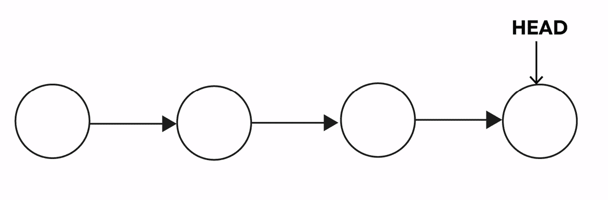

图 8.1 – 非常基本的修订序列

当存在分支（即有不同路径）或者我们需要回退到旧版本时，就会形成一个修订版依赖于比它更早的修订版的情况，此时图会变成一个有向树。在这个树中，每个点可能有多于一个的后续点。这会创建多个端点，代表没有更多更改的修订版（每个分支上的“最新修订版”）。理论上，这个树可能没有首选端点（“主要”最新修订版），但通常会选择一个端点作为**HEAD**。如果一个新修订版基于**HEAD**，它要么成为新的**HEAD**，要么开始一个新的**BRANCH**：

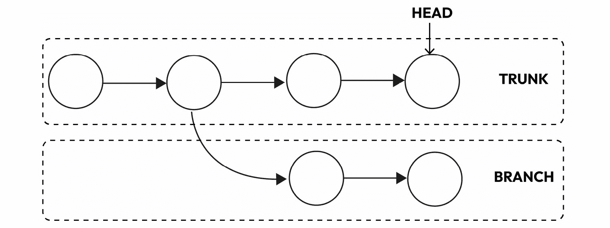

图 8.2 – 从主干分支

从起点到**HEAD**的修订版列表，在图论中称为主干或主线，形成了一个简单的直线图。然而，如果一个修订版可以基于多个之前的修订版（当一个点可以有多个父节点时），它就被称为**MERGE**。这是版本控制中比较复杂的一部分。这通常发生在不同分支（通常是两个）发生更改时，这些更改被合并到一个包含两组更改的分支中。如果这些更改重叠，在没有人工帮助或重写的情况下合并它们可能很困难，甚至不可能（这些情况被称为**冲突**）：

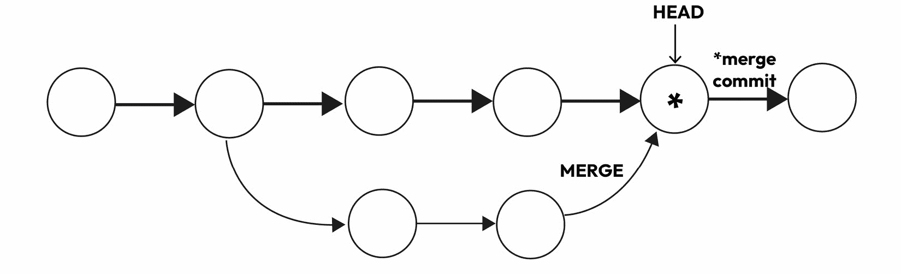

图 8.3 – 将分支合并到主干（创建了一个合并提交）

当发生合并时，图不再是一个树，因为点可以有多个父节点。相反，它变成了一个有根的**有向无环图**（**DAG**）。这个图“按定义”没有循环，因为父节点总是存在于过去，它有根，因为它有一个由第一个提交给出的起始节点，它是定向的，因为您只能按给定方向导航（我们可以说时间的方向）而无法反向导航。如果有主干，从分支到合并就像是对树的“外部”添加。分支中的更改被捆绑成一个补丁，并应用到主干**HEAD**上，创建一个新版本，而不直接提及分支，并保持树结构。因此，尽管实际关系构成了一个 DAG，但您可以将它视为一个带有合并的树，而主干本身是一条直线。

除了执行**MERGE**操作外，代码版本控制系统还提供了执行所谓的**rebase**选项。这个动作将整个新更改分支移至主分支的最新点开始。它包括主分支中的所有最近更改。然而，与执行**MERGE**提交不同，rebase 通过为分支中的每个原始提交创建全新的提交来重写项目历史。简单来说，就像是您将整个分支“附加”到主分支的末尾：

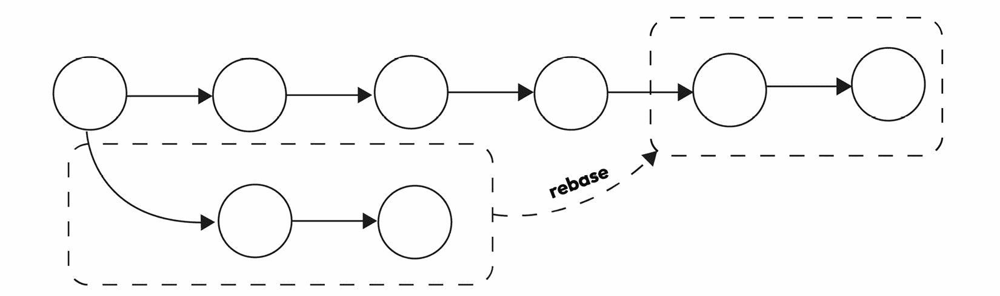

图 8.4 – Rebase 操作

Rebasing 有一个很大的优点，因为它可以使您的项目历史更干净。它是通过删除 git merge 经常创建的额外合并提交来做到这一点的。此外，rebase 创建了一个完全直线型项目历史，允许您从最新功能追溯到项目的起始点，没有任何分叉路径。

既然我们已经从一般层面了解了版本控制系统的工作原理，现在是时候看看三种主要类型在以前是如何工作的，以及它们现在是如何工作的了。

## 本地版本控制系统

尽管这种方法相当古老，但它已经不再使用，尤其是在专业环境中——我甚至没有见证过它的使用。然而，作为版本控制系统的初始示例，提一下它是值得的，这样我们可以将其与现代实践进行对比。

在过去，一种常见的版本控制方法是将文件复制到一个单独的目录中，有时带有时间戳以进行细致的记录。尽管这种方法很简单，但它容易出错，用户很容易失去对当前目录的跟踪，并做出无意中的修改或覆盖。为了解决这些问题，程序员开发了具有简单数据库的本地版本控制系统，以记录受版本控制文件所做的更改。

下面是一个本地版本控制系统的示例：

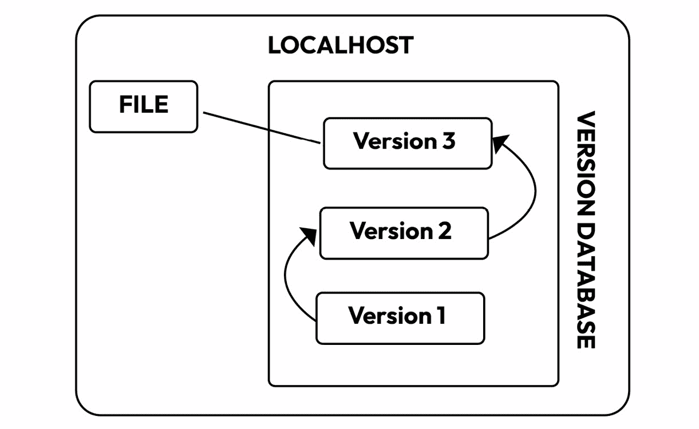

图 8.5 – 本地版本控制系统

这类最受欢迎的工具之一是 RCS，它已经存在一段时间了；它也分布在 macOS 的 Developer Kit 中。

## 集中式版本控制系统

为了解决使用不同系统的开发者之间的协作挑战，创建了如 CVS 或 Subversion 之类的**集中式版本控制系统**（**CVCSs**）。这些系统将所有版本化的文件存储在中央服务器上，允许多个用户访问和检索文件：

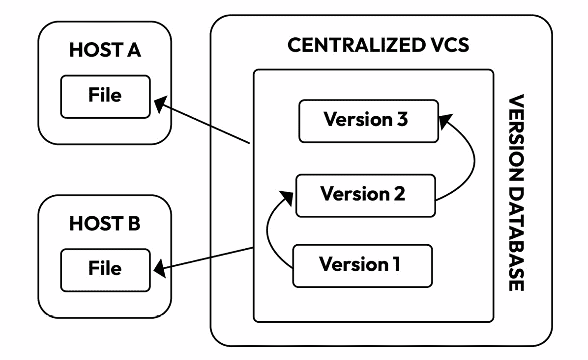

图 8.6 – 一个 CVCS 架构

虽然这种方法促进了项目的协调和管理，但它有一个主要的缺点——集中式服务器是单一故障点。如果它崩溃，协作和文件保存将变得不可能，数据丢失风险会危及整个项目历史。这种限制导致了今天 VCSs 的演变。

## 分布式 VCS

**分布式版本控制系统**（**DVCS**）是一种允许多个用户在拥有整个项目仓库的本地副本的同时工作的版本控制系统。在分布式版本控制系统中，每个用户都有项目历史的完整副本，可以在本地副本上独立进行更改。这些更改可以无缝跟踪、合并和与他人共享。

最著名的分布式版本控制系统之一是**Git**。Git 允许开发者离线工作，对本地仓库进行提交，然后在准备就绪时将他们的更改与中央仓库或其他团队成员的仓库同步。以下是一个分布式版本控制系统（DVCS）的架构图：

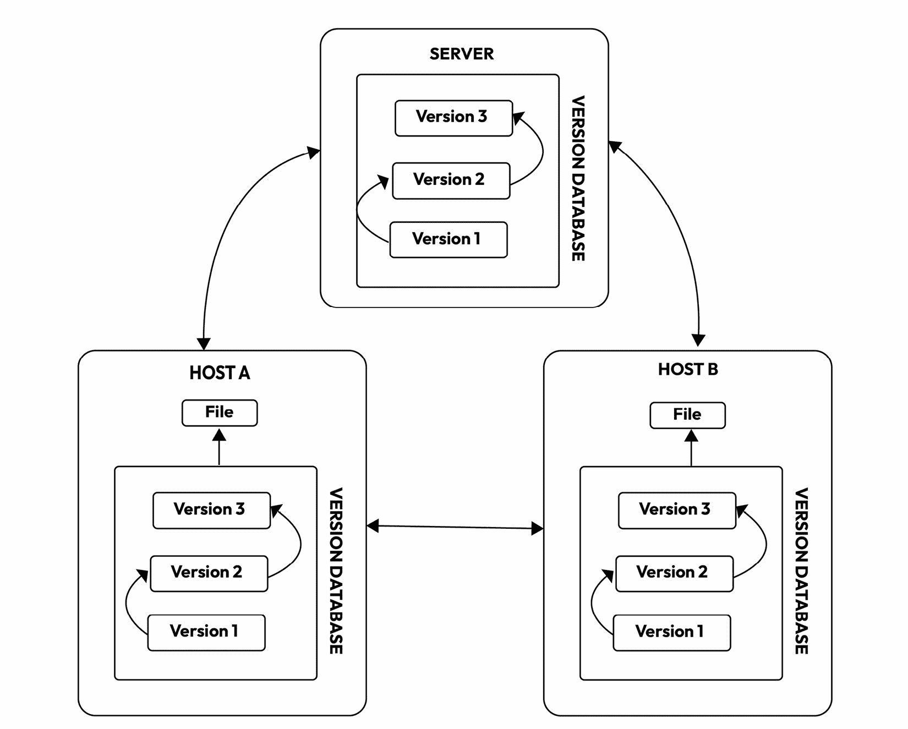

图 8.7 – 一个分布式 VCS 架构

分布式版本控制系统提供了几个优点，例如增加了灵活性、改善了协作，以及更好地处理地理上分布的团队的项目。每个贡献者都有项目历史的完整副本，这提供了冗余，并使得数据丢失的可能性更小。此外，DVCS 系统允许进行更多的分支和合并操作，使得管理同一项目上的并发工作变得更加容易。

## 分支策略

为了保持代码库的有序性和流畅的工作流程，遵循所谓的**分支策略**是一个好主意。

分支就像是开发者为构建新功能或修复软件项目中的问题而设立的独立工作区。我们注意到，当工作完成时，分支可以与主代码合并。这种分离有助于你避免混淆更改，并使纠正错误变得更加容易。如果每个人都在自己的分支上工作，那么就不应该有人打乱他人的工作。

分支策略是软件团队在使用版本控制系统（VCSs）编写、组合和部署代码时所采用的一种计划。它就像一套规则，告诉开发者如何与共享代码一起工作。

这种策略至关重要，因为它保持了事物的有序性，并防止了当许多开发者同时工作时出现的问题。如果没有它，当每个人都试图同时添加他们的更改时，可能会出现冲突。这将减缓代码准备就绪的过程，并导致一定程度的挫败感！

通过遵循分支策略，开发者可以协作工作而不会引起问题。它允许团队同时处理不同的事情，并更快地发布代码，冲突更少。这全部关于有一个明确的流程来对代码进行更改；当然，你可以设置自己的分支模型，但多年来已经有一系列模型变得相当成功。我们即将展示的模型将仅使用分布式版本控制系统（Distributed VCSs），因为它们是目前唯一仍在使用的系统。

### 主干开发

**主干开发**是一种工作方式，其中所有开发者都直接在代码的主要部分进行更改，我们称之为**主干**。这是代码中准备用于项目的部分。鼓励开发者经常保存他们的工作，并使用特殊技术来管理尚未准备好的更改。

我们还专注于自动化测试，这意味着计算机会持续检查代码是否运行良好。我们这样做是为了确保我们做出的任何更改在使用于项目之前都经过了彻底的测试。

有时，如果一项任务耗时较长，开发者可能会从主代码中创建一个单独的分支，在那里进行更改，完成后将这些更改合并回主部分。但在主干开发中，主要思想是尽可能少地使用单独的分支，并让每个人大部分时间都在代码的主部分上一起工作。以下图表示了一个非常简单的提交序列（由一条单一的线性路径构成的图）在一个单独的分支上完成的：

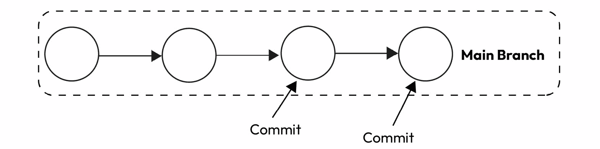

图 8.8 – 在主干开发中，每个提交都是在主分支上完成的

下面是主干分支模型如何详细工作的说明：

1.  **在主代码中工作**：而不是创建单独的分支，直接在**MAIN**（主干）分支上工作。

1.  **进行小而频繁的更新**：对代码进行小而规律的改变。这使得检查更容易，并减少了问题的可能性。

1.  **使用持续集成（CI**）：频繁地合并和测试代码，以尽早发现问题，防止冲突，并保持代码准备就绪以发布。

1.  **经常合并更改**：定期将你的更改合并回主代码，保持其最新状态，并降低冲突的可能性。

初看之下，这似乎并不糟糕。有一些优点——例如，它鼓励团队合作和快速反馈（可能会有合并冲突或失败的测试），有助于及早发现问题并快速修复，加快添加新功能，通过让每个人在一个分支上工作来保持代码的整洁，并降低处理多个分支的复杂性。当与**测试驱动开发**（**TDD**）和**持续集成/持续部署**（**CI/CD**）管道一起应用时，你可以保证代码仍然正确工作。在特定情况下，这可以是一个有效的方法。

但有一个很大的缺点：这个模型不可扩展，因为它可能不适合大型团队或复杂项目。如果主代码出问题，一切都会受到影响。此外，我们需要强大的自动化测试和 CI。正如我之前提到的，如果满足某些条件（实际上，这些条件应该始终得到实施），它可以是一个有效的替代方案。

让我们看看一些不同之处。

### 功能分支

**功能分支**是一种广泛使用的方法，为特定的功能或代码更改创建一个新的分支。这允许开发者在不干扰**MAIN**分支的情况下单独工作。一旦功能完成，就可以通过拉取请求将其合并回**MAIN**分支。

什么是拉取请求？

**拉取请求**是版本控制系统（如 Git）中用来提议对代码库进行更改的一种机制。它是一个将功能分支中做出的更改合并到主分支或目标分支的请求。这个过程通常涉及开发者创建一个分支，进行更改，将这些更改推送到远程仓库，然后提交一个拉取请求供他人审查。拉取请求允许团队成员在更改合并到主代码库之前进行讨论、审查和测试，有助于维护代码质量和软件开发项目的协作。更多内容请参阅*进一步阅读*部分。

这个请求允许其他团队成员检查更改，并在将功能添加到**MAIN**分支之前提出调整或改进：

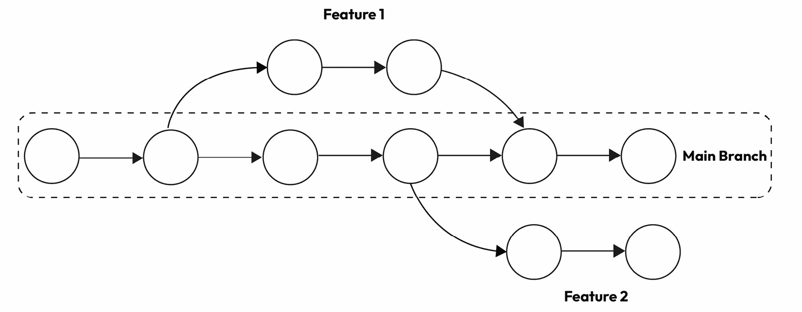

图 8.9 - 在功能分支中，每个新功能都在一个专门的分支上开发

再次，让我们详细看看工作流程：

1.  **设置功能分支**：对于你正在处理的每个任务，创建一个专门的分支。这些分支都应该源自**MAIN**分支。

1.  **开发功能**：将你的功能实现到**Feature**分支，并按需多次提交。这个分支必须只包含与该特定功能相关的提交，不能包含其他内容（当我说是其他内容时，我的意思是其他内容：记住，这个更改集有一天会直接进入生产——你不想把事情搞混）。

1.  **发起拉取请求**：当你的开发完成，你已经测试了一切，并且对此满意时，你可以创建一个拉取请求，将你的更改合并到 **MAIN** 分支。

1.  **审查和批准**：其他开发者会检查这些变更，他们可能会给出批准或建议一些修改（基本上，他们可以开始对话）。这样，潜在的问题和错误可以在代码成为 **MAIN** 分支的一部分之前被发现。

1.  **合并功能分支**：现在你的功能已经实现，并且拉取请求已经经过审查并获得批准，**Feature** 分支可以合并回 **MAIN** 分支。

1.  **整理**：删除 **Feature** 分支。

如你所见，我们略微提高了将 **MAIN** 分支保持尽可能干净复杂度。主要目标是保持 **MAIN** 分支上的稳定版本，同时支持并发功能开发。一般来说，代码可以很好地组织并测试（直到所有测试通过，不得将代码合并到 **MAIN** 分支）。变更跟踪得到改善。使用这种策略，我们可以在工作流程中插入代码审查（见下一节）。

另一方面，当我们管理和更新多个分支时，新的挑战出现了，由于漫长的审查，合并更改到 **MAIN** 分支可能会出现潜在的延迟。当然，拥有多个分支可能会产生冲突。

现在，让我们看看一个非常、非常流行的分支策略。

### GitFlow

**GitFlow** 是一种在 Git 中管理分支的方法。它主要使用两个长期存在的分支，**MAIN** 和 **DEVELOP**，这两个分支贯穿整个项目的生命周期。它还使用一些短期分支，如 **FEATURE**、**RELEASE** 和 **HOTFIX**。这些分支在需要时创建，一旦完成工作就会删除。

**MAIN** 分支持有稳定、可用的代码，而 **DEVELOP** 分支是所有活跃开发发生的地方。**FEATURE** 分支用于开发新功能或变更，**RELEASE** 分支有助于为新版本做准备，而 **HOTFIX** 分支用于快速修复生产代码中的关键问题。

GitFlow 在一开始可能有点难以理解。在 **MAIN** 分支上，我们有稳定版本，而在 **DEVELOP** 分支上，我们有“下一个”版本。每个 **FEATURE** 分支都承载着一个正在开发的具体功能：

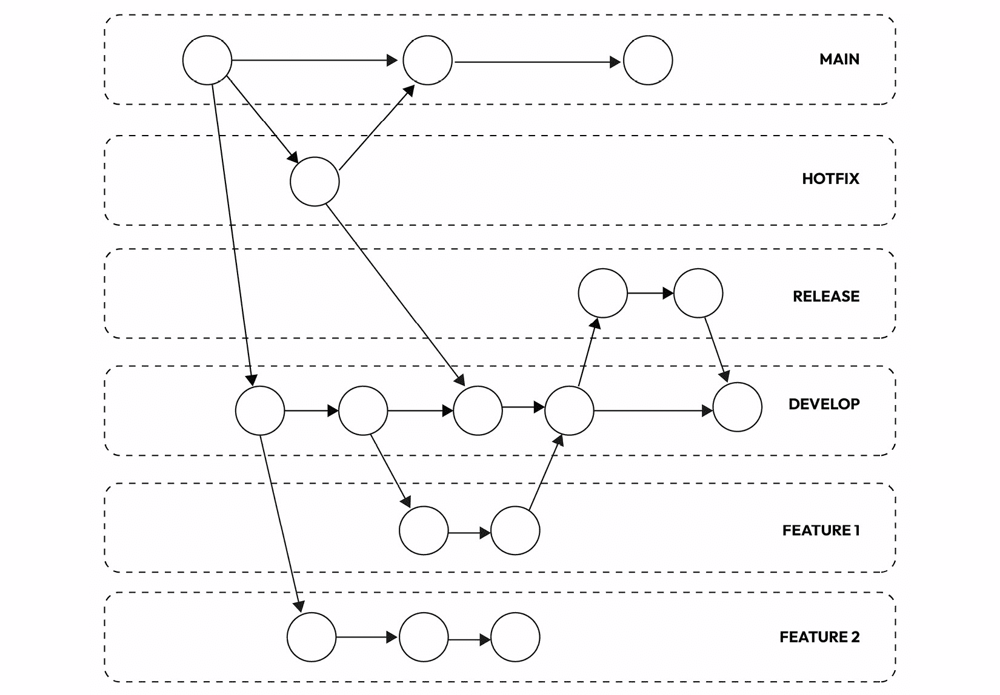

图 8.10 – GitFlow 架构

这是详细的流程：

1.  开始在一个名为 `develop` 的分支上工作。使用这个分支进行当前的开发；这个分支必须从 `main` 分支创建。

1.  然后，当你开始处理新事物（或修复错误）时，创建 `feature` 分支；这些分支必须从 `develop` 分支开始创建。

1.  当你完成对功能的修改后，只需将你的功能分支合并到 `develop`。

1.  到了准备新发布的时候，从`develop`分支创建一个`release`分支。赋予一个清晰且描述性的名称，包括版本号，例如“release/1.0。”进行深度测试以识别和解决任何错误，确保其生产就绪。

1.  当发布准备就绪时，将其与主分支合并，并标记版本号。使用拉取请求让其他团队成员检查和批准代码。

1.  重新开始。一旦发布完成，回到`develop`分支，然后从一个新的`feature`分支开始。

    由于主分支中的某些问题，可能会出现一些关键问题；在这种情况下，我们希望遵循更快的程序，而不是冒险部署我们仍在开发的功能。

1.  从主分支创建一个 hotfix 分支。这个分支对于快速修复生产代码中的重要问题或错误至关重要，这些错误不能等待下一个发布。它就像一个优先级通道，用于修复错误。

1.  一旦 hotfix 完成并经过测试，将其合并到`develop`和主分支，以确保修复对持续开发和生产代码都有效。

这种方法为代码变更管理提供了一种结构化的方法，将持续开发与稳定发布分开，并促进使用短期存在的**FEATURE**、**RELEASE**和**HOTFIX**分支。代码审查和测试也更为便利。最终，GitFlow 提供了一个可预测的开发流程。

另一方面，这无疑比其他分支策略更复杂。此外，它可能导致分支数量增加（即使是真正的小功能或问题，你也必须创建一个分支）；因此，合并冲突的可能性增加。很明显，GitFlow 需要一定的纪律和对流程的遵守，有些人可能会认为它过于规定或缺乏灵活性。

总结来说，没有哪种分支模型是完美的。分析你的需求，选择一个；没有人说它不能是我们刚才提出的模型的混合。例如，我经常看到**HOTFIX**直接合并到**MAIN**分支，有时根据修复的复杂性，会打开一个**HOTFIX**分支。此外，考虑合并通常很耗时：不仅合并本身在出现冲突时耗时，而且通常合并还需要新的构建。如果你的构建速度慢，将分支合并到**MAIN**分支可能会花费时间。

## 最佳实践

虽然这可能听起来像是一项简单的任务，几乎就像在云端保存文件以防电脑被盗一样，但管理文件和项目版本是提高项目管理效率的另一个关键方面。从经验来看，不要低估这个问题；这是区分关心与否的人的一个因素。以下是我们想分享的一些技巧；像往常一样，这些都是相当灵活的，基于我们的经验。

将频繁且尽早提交您的作品成为一种习惯。通过这样做，您确保每个提交都捕获一组特定的相关更改。保持您的提交小而专注，针对单个任务或功能。然而，请记住不要提交未完成的工作，因为这可能会破坏代码库的稳定性并产生问题（黄金法则：不要在主分支上破坏构建！）。相反，将您的工作分解成更小的、逻辑上合理的块，并在完成每个部分时提交它们（或者如果您觉得那样合适，可以使用功能标志）。这种做法有助于保持干净和可靠的版本历史，使跟踪项目的演变和与团队有效协作变得更加容易。

在提交更改之前，始终运行您的代码测试。测试有助于确保提交不仅按预期工作，而且不会向代码库引入任何未预料到的问题或错误（黄金法则：不要在主分支上破坏构建！是的，我知道我已经说过）。这一步骤至关重要，因为与您的同事共享未经测试的提交可能会导致混淆、项目中断以及后续的大量额外工作。通过在提交之前严格测试您的更改，您不仅保护了项目的稳定性，而且展示了您对质量和开发团队内协作的承诺。这是一种明智的做法，有助于保持顺畅和高效的流程，在同事之间建立信任，并减少后期进行大量调试或故障排除的需求。记住，经过良好测试的提交是对项目的宝贵贡献。

在编写提交信息时，目标是要清晰和简洁。摘要应该是对您更改本质的简要但信息丰富的概述，强调其意图以及它们如何与代码的先前状态区分开来。除了撰写良好的摘要外，还应考虑在提交信息的正文中提供您更改的更详细描述。这有助于其他开发人员，甚至您未来的自己，理解修改的上下文和重要性。另一个有价值的做法是将您的代码更改链接到相关的工作项或问题，增强可追溯性和项目管理。通过将您的提交与特定的任务或票据关联起来，您创建了一个更组织化和透明的系统，用于跟踪您工作的进度。例如，对于 Jira 用户（Jira 是一个非常受欢迎的问题跟踪器）来说，一个常见的做法是在提交信息中包含问题 ID。最终，您的提交信息在您的开发团队内部是一个至关重要的沟通工具。一个结构良好的信息确保您的贡献容易被理解和集成到项目的开发历史中，促进协作并保持您工作记录的清晰。

最后一条建议：当管理敏感信息，如密码时，必须非常谨慎。避免无意中泄露生产密码，并采用安全存储的替代方法。一种推荐的方法是利用专门的系统，如 Vault，它提供了一个安全且集中的存储库来管理敏感凭证。通过避免直接提交生产密码并选择这样的专用系统，你可以提高数据处理实践的整体安全性。这种主动的方法不仅降低了意外泄露的风险，而且还确保了一个更强大和可扩展的解决方案来保护关键的认证信息。

# 代码格式化和风格

这里是我们工作的一部分，可能看起来很基础，但没有人谈论它...除非出了问题！根据我的经验，我认为这是开发者们有不同的看法的地方，也许不是完全不同，但毕竟，我们是精确的人，我们在安排代码的方式上都有自己的小习惯。尽管这看起来可能并不重要，但正确地格式化代码是非常重要的。

代码格式化意味着以整洁和有序的方式安排你的计算机程序。这就像确保你的写作遵循特定的规则，以便易于阅读和理解。当你格式化代码时，你会决定诸如行间距、在哪里放置花括号以及如何命名事物等问题。这使得你的代码更易于阅读、一致，并且更容易处理。

在 Java 中安排代码时，有许多规则和习惯需要遵循，但据我们看来，这也很直观，几乎就像是我们软件工程师的一种自然技能。我们敢打赌，即使没有讨论，我们也都知道在以下两个代码片段中我们更喜欢哪一个。这是第一个：

```java
public class Main {
    public static void main(String[] args) {
        System.out.println("Hello there!");
    }
}
```

这是第二点：

```java
public class Main {
public static void main(String[] args) {
System.out.println("Hello there!");
}
}
```

我们认为我们都更喜欢第一个片段，这是因为第二个片段缺少适当的缩进，这是我们格式化代码的第一个和最重要的方面。然而，无论风格如何，整个团队都需要坚持相同的标准，这意味着一套我们都期望每个人遵循的内部规则。需要为每个影响代码格式的方面制定规则；让我们看看主要的几个。

## 缩进

我们使用缩进来帮助我们浏览文件的结构。如果你这么想，Java 源文件是一个元素层次结构：我们有一个整个文件，然后是其中的类。在类内部，有方法，在方法内部，我们有块，以此类推，包括`if`语句、循环等。为了帮助我们导航所有这些，我们使用缩进。没有缩进，即使是简单的方法也难以理解。正如我们之前提到的，代码是为了让机器运行，同时也是为了让人类理解：

```java
public void isEven
        (Integer number) {if (number 
    % 2 == 0) {System.out
        .println("Even number");
    } else {System.out.println("Odd number");}}
```

如果方法没有正确缩进，理解这段非常简单的代码需要更长的时间。这段代码根据给定的数字是偶数还是奇数打印一个字符串。如果这段代码正确缩进，理解这个方法将会更快：

```java
public void isEven(Integer number) {
    if (number % 2 == 0) {
        System.out.println("Even number");
    } else {
        System.out.println("Odd number");
    }
}
```

与缩进相关的主要有两个方面：何时换行以及将缩进代码向右移动多少。例如，你可以选择使用制表符或四个空格来缩进代码，或者你喜欢的任何方式，只要每个人都遵循相同的风格。

存在一些广泛使用的标准和约定，例如 **Oracle 的 Java 代码约定** 和 **Google Java 风格指南**（这两者都在*进一步阅读*部分提到）。第一个建议使用四个空格进行缩进，而第二个建议使用两个。正如我之前提到的，重要的是团队中的每个人都使用相同的规则集。

## 花括号和空格

花括号在 Java 中在界定代码块中起着至关重要的作用。最普遍使用的花括号风格是**真正的唯一花括号风格**（**1TBS**）和**Allman 风格**。

在 1TBS 中，开花括号放在行尾，闭花括号放在新行上，缩进以与开行对齐，如下所示：

```java
if (number % 2 == 0) {
    System.out.println("Even number");
} else {
    System.out.println("Odd number");
}
```

在 Allman 风格中，开闭花括号都位于各自的行上，保持与起始行的相同缩进级别：

```java
public void isEven(Integer number) {
    if (number % 2 == 0)
    {
        System.out.println("Even number");
    } else
    {
        System.out.println("Odd number");
    }
}
```

无论你选择哪种风格，在整个代码库中一致地应用它至关重要。此外，始终在运算符周围包含空格以提高可读性：

```java
int x = y + z;
```

Google 和 Oracle 都使用 1TBS。Robert Martin 的*Clean Code*也建议这样做。就其价值而言，我们也建议这样做！

## 行长度和换行

对于代码行长的一个简单指南是保持它们在 80 到 100 个字符之间（Oracle 说 80，Google 说 100）。有趣的事实：代码行 80 个字符的限制可以追溯到 Herman Hollerith，他赢得了处理 1890 年美国人口普查的合同。他使用 80 列穿孔卡片来处理数据。他的公司后来发展成为 IBM。

通过保持你的行在 80 到 100 个字符之间，你的代码将在不同的屏幕尺寸和分辨率上易于阅读。如果一行太长，你可以根据以下示例将其拆分为多行：

+   当你在方法调用中有很多由逗号分隔的项目时，你可以在逗号后断行：

    ```java
    String carFeaturesFormatted = String.format("Make: %s, Model: %s, Version: %s, Price: %s", 
            make, model, version, price);
    ```

+   如果你有一个长的数学表达式，你可以在运算符之前断行：

    ```java
    int totalPrice = priceFare1 * factor1 
            + priceFare2 * factor2 
            + priceFare3 * factor3;
    ```

+   当你有一个长的条件时，你可以这样换行：

    ```java
    if (cond1 && someMethod(argument1, argument2, argument3) 
            || cond2 && anotherMethod(argument4, argument5)) { 
        // code 
    }
    ```

    由于 `&&` 运算符的优先级高于 `||` 运算符，换行符对齐符合这种逻辑，使得代码更易于阅读。

+   对于长字符串连接，你可以这样换行：

    ```java
    String message = "Dear " + name + ",\n"
            + "Thank you for your subscription to " + newsLetterName + ".\n"
            + "The price of your subscription was " + price + ".\n"
            + "Regards,\n"
            + "The Newsletter Team";
    ```

    然而，请注意，在 Java 17 中，字符串格式化和文本块的组合应该允许我们绕过这个问题。**文本块**是指一种语言特性，允许你以更易于阅读和维护的方式定义多行字符串。这是一种在不使用繁琐的连接或转义字符的情况下嵌入文本块的方法。例如：

    ```java
    String textBlock = """
        This is a
        multiline
        text block.
        """;
    ```

+   当使用 Lambda 表达式时，你可以将包裹的行与开头分隔符对齐，如下所示：

    ```java
    catalogue.stream()
            .filter(film -> film.getGenre().equals("Sci-Fi")
                    && film.getLength() > 180)
            .forEach(item -> System.out.println(item.getTitle()));
    ```

    如 Google 风格指南所述，你永远不应该在 Lambda 表达式的箭头旁边拆分一行，除非 Lambda 的主体只是一个单独的、无括号的表达式；那时，你可以在箭头后面放置一个换行符。

## 注释和文档

你可以用三种方式对 Java 代码进行注释：

+   使用 Javadoc 注释 (`/** ... */`) 来描述类、接口、方法和字段（这些有时被称为文档注释）

+   使用单行注释 (`//`) 来提供简短的解释、澄清或标记 TODO（有时被称为实现注释）

+   使用块注释 (`/* ... */`) 来提供更详细的解释，尤其是在解释复杂的算法时

Google Java 风格指南有一个专门的部分来描述 Javadoc 的注释，因为它们是最重要的。文档（Javadoc）对于解释如何使用你的代码至关重要，这就是为什么在编写它时必须严格……因为你是在编写它，对吧？

既然我们已经讨论了代码中注释应该采取的形式，让我谈谈注释的内容。用于生成 Javadoc 的注释无疑是至关重要的。它们不解释代码是如何工作的，而是解释方法的特性。它们澄清了关于参数和抛出异常的情况的任何具体细节。

然而，我经常看到注释被误用。首先，注释掉被认为是不必要的代码并不是一个好的做法。如果代码是不必要的，请删除它。如果你担心出错，请记住版本控制系统（VCSs）就像一个安全网，允许你以最小的努力恢复已删除的代码。

有时，我会遇到与实现相关的注释。对于特别复杂且难以理解的代码，注释可能会有所帮助。然而，它永远不应该被视为清理代码以使其更易于理解的替代品。如果代码写得不好，不要以为通过添加注释就能修复它。重写代码。此外，这样的注释在方法逻辑发生变化时通常不会更新。方法做了一件事，但注释说的是另一件事，导致混淆。

我觉得不太有用的其他类型注释，除了少数例外，是臭名昭著的`TODO`和`FIXME`。如果你知道你需要修复某些东西，就立即修复它。如果你不能立即完成，就在你的任务管理系统中（例如，Jira）记录这个任务，然后继续。在代码中放置`FIXME`只会增加混淆。当有人在未来两年看到这个`FIXME`时，他们会想，“为什么还没有修复？也许它并不重要。”对于`TODO`也是同样的道理。

总结来说，我们建议你在代码中尽可能少地写注释。相反，专注于解释你为什么做出特定的选择，以及导致你选择这条路径而不是另一条路径的原因。正如罗伯特·马丁在*Clean Code*中所说，你必须解释你的意图。

## 命名约定

命名约定在增强程序理解力和提高代码可读性方面发挥着至关重要的作用。它们作为一套指南，遵循这些指南可以使代码更易于访问和理解。这些约定不仅有助于可读性，还传达了关于标识符目的的重要信息。这种额外的上下文有助于开发者理解标识符的作用，无论是代表常量、包、类还是代码中的其他实体。这些约定是有效代码沟通的重要工具，可以显著帮助理解和维护软件系统。

谷歌和甲骨文的约定都为命名各种组件定义了深入细致的规则，并且它们有许多交集：

+   谷歌的风格指南规定，标识符由 ASCII 字母、数字以及偶尔的下划线组成，这由`\w+`正则表达式指定。在标识符名称中不使用特殊的前缀或后缀，如`model_`、`cModel`和`c_name`。

+   `UpperCamelCase`，意味着每个单词的首字母都大写。类名通常与事物相关，通常是名词，例如`Student`或`ImmutableList`。接口名称也可以是名词或名词短语，例如`Set`，或者有时可能是形容词或形容词短语，例如`Serializable`。当涉及到命名注解类型时，并没有特定的规则或广泛接受的约定。谷歌的风格指南还规定，测试类的名称以`Test`结尾。如果一个测试类只覆盖一个类，它将采用那个类的名称，并在末尾添加`Test`。

+   `lowerCamelCase`，其中第一个字母小写，后续单词首字母大写，例如`sendMessage`或`stop`。方法名称通常与动作或方法执行的操作相关，它们类似于动词或短语，例如`sendNotification`或`initialize`。谷歌的风格指南还规定，`JUnit`测试中的方法名称可以使用下划线来分隔名称的不同部分。每个部分也以`lowerCamelCase`编写——例如，`publishPost_translateToUserLanguage`。命名测试方法没有唯一正确的方法，因此在这里你有一定的灵活性。

+   `UPPER_SNAKE_CASE`，意味着它们全部大写，单词之间用一个单下划线分隔。常量就像代码中的不变值。它们以`static final`字段的形式表示，这意味着一旦设置就永远不会改变。这些常量是深度不可变的，意味着它们不能以任何方式修改，并且没有引起任何明显副作用的方法。常量的例子包括简单的数据类型，如数字、文本（字符串）、不可变值类型，甚至设置为`null`的东西。但关键是：如果这个值有任何可以改变或随时间不同观察的地方，它就不是常量（你可能已经猜到了）。

+   `lowerCamelCase`，其中第一个字母小写，后续单词首字母大写。在公共方法中命名参数时，尽可能避免使用单字符名称是一种良好的实践。正如罗伯特·马丁的《*Clean Code*》所述，使用更具描述性的名称使其他人更容易理解参数的目的（想想给一个参数命名为`x`）。

+   `lowerCamelCase`。即使局部变量被声明为`final`并且保持不变，它也不被视为常量，因此，不应像常量那样命名。

## 自动化工具

我们无法想象每次编写代码时都手动实现所有这些规则。嗯，曾经有过这样做的时候，但即使我还不老到能看到那个时代！幸运的是，我们有自动工具可供使用，它们在各个层面上帮助我们。

例如，**集成开发环境**（**IDEs**）在支持代码格式化方面发挥着重要作用，它们通过提供工具和功能来帮助开发者遵守编码标准并自动格式化代码。IDEs 通过执行自动缩进来简化代码格式化——也就是说，自动缩进代码块——这使得代码更容易阅读和理解其结构。缩进可以根据项目的编码标准进行自定义。此外，大多数 IDE 允许开发者定义和自定义代码风格偏好。这些偏好包括缩进、括号放置、换行和命名约定的设置。开发者可以根据项目的或组织的编码标准调整这些设置。IDEs 自带或可自定义的代码格式化器会根据定义的代码风格偏好自动格式化代码。这些格式化器确保代码始终遵循既定的标准。

但别担心，你不必设置 IDE 格式化设置的所有细节；其中大部分——尤其是最常用的——都有机会导出所谓的**代码风格格式化器**。你只需要发现你的 IDE 是如何做到的（或者直接谷歌一下），导出你的文件，并确保团队中的每个人都使用该文件，将其导入到他们的 IDE 中。当你通过相对命令或快捷键在 IDE 中格式化代码时，代码风格对每个人来说都是相同的……当然，是使用相同 IDE 的每个人。是的，因为这些代码风格是针对每个 IDE 的；NetBeans 的与 Eclipse 的不同。

对于这个问题，有许多解决方案。例如，你可以尝试手动编辑你的导出代码风格文件（它始终是一个文本文件），使其适应目标 IDE；然而，我不建议你这样做。一个可能的解决方案是使用跨 IDE 工具，一个对每个人来说本质上都是相同的工具。例如，有一个名为**CodeConfig**（[`editorconfig.org`](https://editorconfig.org)）的工具，它允许你配置代码风格，并且可以在许多不同的 IDE 上安装（许多，如 IntelliJ，原生支持它）。或者，你也可以将问题转移到其他地方。

如果你正在处理 Java 项目，你可能会使用 Gradle 或 Maven 等构建自动化工具。这些工具允许你编译代码，以及其他事情，并且通常简化了整个开发周期。正如你所知，这些工具有各种插件可用。其中一些直接修改代码本身——在这本书中，我们看到了 Lombok 和 MapStruct 等示例。

一些插件旨在检查你的代码是否存在任何与代码风格相关的问题。其中最著名的是 Checkstyle。Apache Maven Checkstyle Plugin（参见*进一步阅读*部分）将 Checkstyle 工具集成到你的 Maven 构建过程中，以强制执行 Java 源代码的编码风格和标准。Checkstyle 是一个开源的静态代码分析工具，它将你的 Java 代码与一组预定义的编码约定和风格规则进行比较。你可以在 Checkstyle 配置文件中定义你的编码风格规则和偏好，通常命名为`checkstyle.xml`。此文件指定了你想要强制执行的编码标准，例如命名约定、缩进和格式化规则。然后，在项目的`pom.xml`文件中配置 Apache Maven Checkstyle Plugin。你指定要使用的 Checkstyle 规则文件和其他设置。当你运行 Maven 构建（例如，通过`mvn clean install`）时，Apache Maven Checkstyle Plugin 作为构建过程的一部分执行。它扫描你的 Java 源代码文件，查找违反定义的编码标准的情况。如果 Checkstyle 检测到任何违规，它将生成一个报告，列出代码中找到的问题。此报告可以以各种格式查看，例如 HTML 或 XML。你可以配置插件，如果发现违规，则使构建失败或生成警告报告而不使构建失败。选择取决于你的项目需求。Apache Maven Checkstyle Plugin 有助于了解你可能遇到的问题概述，但它不会为你修复这些问题。

一些插件处理代码格式化。通过将这些插件集成到你的开发过程中，你可以确保每次构建时代码都会自动格式化，无需手动干预。你可以使用的 Maven 插件是**maven-formatter-plugin**（[`code.revelc.net/formatter-maven-plugin`](https://code.revelc.net/formatter-maven-plugin)），默认情况下支持“Eclipse 风格”，但可以配置为任何代码风格。我们还没有消除“文件传输”步骤的复杂性，但我们已经将代码格式化集成到我们的开发周期中。但我们还可以更聪明一些。

在软件公司中，GitLab 或 Jenkins 等 CI/CD 工具现在非常普遍。如果你对这个概念还不太熟悉，CI/CD 管道是一个自动化的工作流程，它简化了软件开发和交付过程。它从 CI 开始，开发者经常将他们的代码更改合并到一个共享的仓库中。执行自动构建、测试和代码分析以确保代码质量和早期识别问题。**持续交付**（**CD**）紧随 CI 之后，涉及将代码更改部署到预发布或生产环境。进行额外的测试和质量检查以模拟生产条件。测试成功后，代码可以自动部署到生产环境。

当涉及到代码的格式化和样式时，你可以设置一个自动系统来检查代码的编写方式。每次将新的代码片段推送到仓库时，这个自动系统都会检查代码是否遵循格式化规则。根据我们如何设置这个系统，它可能只是一个简单的检查，告诉我们代码是否编写正确，或者它可能更加严格，如果存在严重问题则会停止进程（尽管这种情况很少发生）。此外，这个系统还可以做一些非常有帮助的事情：它可以修复编写不良的代码，使其遵循我们团队或公司的共享规则。在实践中，这个系统会“重新提交”相同的代码片段，但这次它们是格式化正确的。这意味着我们可能再也不必担心手动修复代码了。

最后一点补充：以相同的方式格式化代码也很重要，可以减少合并冲突和意外的代码提交。让我们想象一下，开发者 A 使用`CodeStyleA`，而开发者 B 使用`CodeStyleB`（正如预期的那样）。开发者 A 在类内部进行了一些小的更改，比如说一个五行的方法。由于他们勤奋，他们使用他们的 IDE 对整个类进行了代码格式化。由于开发者 A 使用他们个性化的`CodeStyleA`，他们可能会无意中提交其他部分的代码，而这些代码并不是更改的重点。这导致了一些被开发者 A 更改的行，但以某种方式，这些行本不应该被更改。另一方面，开发者 B 正在对同一个类进行更改，但位置不同。当他们需要推送他们的代码时，他们发现开发者 A 更改了相同的行，但这仅仅是因为开发者 A*错误地格式化了*代码。这可能看起来像是一个边缘情况，但这种情况并不罕见——我见过很多次。这绝对不是灾难，但这是可以通过一点小心就能节省的时间。

现在我们已经讨论了代码版本控制和样式，让我们谈谈一个不能过分强调的实践。

# 代码审查

**代码审查**，通常也称为**同行评审**，是开发者日常工作中一个非常强大的工具。我们几乎可以说它们是基本的，但事实是，在特定条件下，可以选择是否执行它们，然而，如果没有执行，则必须实施其他方法。但让我们按顺序来，试着理解什么是代码审查。

代码审查可以以略微不同的形式实施，但它通常包括将一段代码提交给一个或多个没有编写该代码的开发者；这些人通常被称为“审查者”。例如，如果你负责某个任务并开发了相关的代码，在将其部署到生产环境（或者通常在将你的功能分支合并到主分支之前，取决于你的“框架”）之前，你的代码会由某个其他队友进行审查，而这个队友没有编写该代码的任何一行。目的是不是评判，其好处是巨大的。

首先，这是一种质量保证。它允许开发者捕捉并纠正代码中的缺陷、错误和漏洞，在代码到达最终用户之前。通过在开发早期阶段发现问题，代码审查显著降低了在开发后期或部署后修复这些问题的成本和努力。

除了捕捉错误之外，代码审查还可以揭示代码中的设计缺陷和不效率。通过在代码审查期间讨论和提出改进建议，开发者可以完善软件的架构，使其更健壮和可扩展。

可能更重要的是——但这是有争议的——是知识共享。代码审查是所有团队成员的学习机会。它促进了知识共享和导师制，经验丰富的开发者可以指导经验不足的同事。这种协作方面在开发团队中培养了一种持续学习和改进的文化。

代码审查确保代码遵循一致的编码风格并遵循项目的编码指南。这种一致性使得代码库更易于维护和理解，尤其是在多个开发者共同参与同一项目时。记住，只有当团队中的每个人都认为代码是干净的，你的代码才算干净！

然后是我最喜欢的一个方面：代码审查鼓励开发团队内部的有效沟通。开发者会就代码进行讨论，这可能导致对项目目标和要求的更好理解，从而形成一个更协调和团结的团队。在我看来，这也鼓励了一种反馈文化，这在公司和团队中至关重要；这是我们学会有效沟通反馈的时刻，更重要的是，这是我们学会接受反馈的时刻，欣赏它所代表的一切——那就是，它是我们职业成长的礼物。相信那些“摸不着边际”的感觉——代码审查是最能学到东西的时刻之一。

如果你为代码审查设定一些规则，甚至可以说是观察的界限：我们是寻找低效之处，还是试图让代码更简洁，是在寻找错误，还是所有这些都要做？没问题，只要达成一致并设定期望。保持代码审查会议简短而精炼。决定对团队有效的方法，比如可能坚持不超过 1 小时或一次审查超过 200 行代码的规则。这有助于保持工作效率。

尽可能多地使用工具和自动化。例如，GitHub 这样的工具帮助我们进行代码审查，具有比较不同版本代码、写评论等功能。静态代码分析的自动工具，在前面的章节中已经提到，如果集成到管道中，例如，可以避免最常见的错误，如导入的组织、代码格式化等。

再次强调，人为因素是至关重要的。在提供反馈时尽量保持建设性，在接收反馈时尽量“开放心态”；这不是一场竞赛，而是平等之间的合作。目标必须只能是实现一个共同的结果，并且一起实现。代码审查应该是一个建设性的过程，而不是一场指责游戏。使用礼貌的语言并提供改进建议，而不是批评作者。目标是提高代码质量，而不是让开发者失去动力。确保团队中的每个人，无论是新手还是经验丰富，都参与代码审查。这有助于新成员了解代码，并允许他们的工作由经验丰富的开发者检查。这样，工作量可以平衡，当有人缺席或离开团队时，管理起来也更容易。

有时，指派一个调解员或主要开发者来促进代码审查过程可能是保持其有效性的关键要素。他们作为引导力量，确保审查讨论保持高效并按计划进行。调解员的职责包括构建审查流程、明确作者和审查者的期望、调解讨论以及平衡反馈。他们还在优先处理问题、记录结果和指导经验不足的开发者方面发挥着至关重要的作用。

说实话，代码审查也有一些缺点——这就是为什么它们有时不被技术不熟练的管理者看好。

审查过程有可能延长发布软件更新所需的时间。这种延迟发生是因为审查者和作者必须合作解决问题，这可能很耗时。此外，由于他们现有的工作负载，审查者可能无法加快审查过程。然而，这种障碍可以通过使用配备自动化测试功能的代码审查工具来缓解。这些工具有效地识别常见错误，从而释放出宝贵的开发者时间，可以将这些时间重新分配给解决更复杂的软件工程挑战。

开发者经常发现自己手头的工作量很大，而代码审查的需求可能会分散他们的注意力，使他们无法立即关注其他关键任务。这种分散注意力的情况为团队成员带来了困境，他们必须在完成手头的工作或暂停工作以进行代码审查之间做出选择。在任何情况下，组织内部的工作都会被推迟。为了缓解这个问题，团队成员可以实施一些策略，例如审查者轮换制度或维护一份领域专家名单，这些专家可以分担审查负担。这些措施可以防止任何单个开发者被大量的审查请求压垮。

当开发者被分配审查大量代码更改的任务时，审查过程往往会消耗大量时间。评估大量代码更改可能特别具有挑战性，并且审查员可能会感到有必要加快进程以满足截止日期，这可能会损害反馈的质量。解决这一挑战的有效方法是增量代码开发实践。这种方法允许审查员多次检查较小的代码段，而不是一次性处理大量的代码更改。这不仅提高了审查质量，还简化了整个过程。

代码审查有不同的类型，我们将按有效性顺序列出，从我们认为最不有效的那一种开始。

## 电子邮件传递

**电子邮件传递**是处理小问题和少量代码的常见方式。你可以通过发送电子邮件或使用代码工具来完成这项工作。在电子邮件传递中，对代码进行更改的人会向需要检查它的人发送电子邮件。这就像从别人的肩膀后面看他们的屏幕一样，使用起来相当简单。你不需要很多培训，可以立即开始。当然，把“电子邮件”想成“直接给某人的消息……”我的意思是，现在谁还用电子邮件与队友沟通？！当然，它也可以是 Slack 消息，或者 GitLab 上的“合并请求”……任何东西都可以。

使用电子邮件传递的优点包括设置简单、远程和异步审查的可能性，以及在某些代码管理系统中的自动审查。

然而，电子邮件传递存在一些缺点，例如收集必要文件所需的时间、在电子邮件线程中跟踪和跟进对话的困难、缺乏明确的审查截止日期、对更改是否实施的不确定性，以及衡量其有效性的挑战。坦白说，我只在“文献中”看到过这种做法；我从未见过它发生。

## 代码审查自动化工具

团队有时会使用自动化工具来节省时间并确保他们交付高质量的代码。这些工具可以自动收集和显示代码更改，通过注释简化反馈，甚至可以帮助使用**静态应用程序安全测试**（**SAST**）来查找和修复漏洞。

将这些工具辅助的审查视为对其他审查方法的宝贵补充。它们有助于维护编码标准、识别漏洞、高效收集数据，并简化审查过程。然而，一些团队可能会倾向于完全依赖这些工具，并跳过让团队成员参与代码审查。将这些工具视为过程的增强而不是替代品至关重要。

工具辅助的审查可以简化数据收集和指标，并让开发者能够专注于他们的工作。也有一些缺点，这依赖于开发者管理和维护工具的需求——一些工具往往非常昂贵，并不能完全消除人工审查的必要性。

## 面对面（或远程）团队合作审查

在这些审查中，两位开发者一起工作，要么面对面，要么通过在线共享屏幕。一位开发者是编写代码变更的作者，另一位是审查者。作者解释他们所做的变更以及为什么选择那些解决方案。审查者提问并给出建议，有点像团队成员在结对时一起工作。作者可以在审查期间进行小的修改，并记录较大的修复以供以后处理。

优势相当直接：面对面会议（有时也称为肩并肩审查）很容易安排和完成，当然，也可以远程进行。它们比结对编程（我们稍后会深入探讨）更快。

然而，可能会发生的情况是，审查者可能并不那么熟悉代码；在这种情况下，需要大量的时间来解释背景和代码的所有细节——或者，更糟糕的是，审查可能会草率完成，比必要的更快。在这种情况下，可能会缺乏客观性；如果不了解背景（基本上，所有待审查的代码都“雨点般”地落在审查者头上），就无法确保所有必要的实现都已完成。总的来说，理解代码的表现情况很棘手。

现在，我们正在接近我们认为最有效的审查技术，尽管它并不完全是一种审查技术。结对编程远不止于此。

# 结对编程

将结对编程仅仅视为一种代码审查技术可能过于简单，但这只是起点。

**结对编程**是一种软件开发技术，要求每个功能都由一对程序员共同创建，他们在同一工作站上工作（同时，也可以考虑通过共享屏幕远程完成）。一个人编写代码，被称为驾驶员；另一个人，即导航员，在代码编写的同时对所写的每一行进行即时修订。驾驶员专注于实现细节，而导航员则从更广阔的角度审视代码，并帮助解决问题。

这是一种非常强大的技术，具有许多优点和——不可避免地——一些缺点。让我们来了解它们。

## 优势

软件质量得到提升：程序员被引导将他们的不同经验结合起来，带来不同的观点和不同的方法。结对程序员在整个开发过程中紧密合作，实时讨论设计决策、代码结构和潜在改进。有两双眼睛审视代码可以导致代码更干净、错误更少、解决方案更稳健。最好的是，导航员可以在出现错误时捕捉到并提出改进建议。两个大脑一起工作通常会导致更具创造性和有效的问题解决。程序员可以互相激发想法，探索不同的解决方案。由于代码是实时审查的，因此更容易在问题成为大问题之前发现并纠正，从而减少调试和维护的工作量。

另一个直接的优势是知识共享。结对编程有助于在团队成员之间（甚至在不同团队之间，他们共同工作以带来各自的知识）分配知识和专业技能。这是一种将技能和最佳实践从经验更丰富的开发者转移到经验较少的开发者的有效方式。结对编程可能比任何知识共享会议都更有力。

此外，还需要考虑团队建设和团队内部沟通的整体提升。通过紧密合作，你可以磨练在日常工作与他人交流中所需的那些软技能，也许甚至包括你的反馈文化。

此外，结对编程提高了专注力——它通过最小化干扰显著提高了专注力。在“驾驶员”和“导航员”之间的共同责任促进了专注的心态，减少了分心的可能性。这种协作方法确保了持续的代码审查和实时沟通，创造了一个两个人都积极参与问题解决的环境。本质上，结对编程不仅阻止了干扰，而且积极地培养了一个专注和高效的开发氛围。当远程进行结对编程时，可能会有所变化，但不会太多。

需要考虑的一个因素是两位程序员的资历水平，无论是总体上还是针对具体任务。例如，将两位经验丰富的开发者配对可能是提高生产力的正确选择。由两位新手开发者组成的配对不太可能发生，尽管它可能会带来一些问题，鉴于我缺乏所谓的“榜样”。无论如何，这总比两位新手程序员独立工作要好。专家-新手配对是最常见的；这种配对可以促进新想法的引入，因为经验较少的个人通常更倾向于质疑既定做法。同时，专家在要求阐明既定方法的同时，也被鼓励重新评估它们。然而，在这种配对动态中，感到受威胁的新手可能会成为被动的观察者，犹豫不决地不愿积极参与。同样，某些专家可能缺乏促进新手有效参与所需的耐心。有些人将这种现象称为“观摩大师”。

## 缺点

第一个缺点——可能是最明显的一个，也是你的技术盲经理可能会争论的一个——就是结对编程意味着两个人做一个人的工作。如果这不是真的（我们之前已经看到了结对编程的所有优点和特殊性，其中角色是不同的，同时进行多项工作），那么结对编程确实是资源密集型的，因为有两个程序员负责同一项任务。在一个开发者永远不够用来做所有工作的世界里，这可能是一个需要解决的问题。

不可否认的是，代码将需要更长的时间才能完成；如果两个人负责同一项任务，显然“忙碌”的任务在绝对数量上会更少。在非常紧张的截止日期的情况下，这可能会成为一个问题。

因此，平衡两位程序员的资历水平会更好，这样就不会造成“观摩大师”的情况或对初级资源的过度指导。

在我们看来，结对编程需要适当调节。并非所有任务都适合结对编程。让我们想象一个没有太多附加价值、从任何角度看都不复杂的重复性任务——它只是非常耗时。可能驾驶员可以提供的附加价值非常小；在这种情况下，我们认为，选择经典的“延迟”代码审查过程会更好。

此外，结对编程可能并不适合所有人：有些人合不来，或者有些人更喜欢独立工作。在这种情况下，最好不要强迫这种做法，或者从短会话开始（比如说，一个小时左右）。

在我的职业生涯中，我大量使用了结对编程，并且必须指出，有时一些同事并不觉得适合结对编程，尤其是在这种实践的时间比例大于个人编程的背景下。有些人更喜欢独自工作，可能自由探索，只跟随他们思想的逻辑线索，也许稍后才会与队友会合。在这些情况下，我们愿意给出的谦卑建议是不要强迫使用结对编程，或者在任何情况下，在团队层面达成一致——尽管这可能微不足道，我认为这是在这种情况下唯一可行的方法。

在*进一步阅读*部分可以找到一篇关于结对编程成本和收益的非常有趣的论文。

## 结对编程的风格

结对编程很难。你必须非常专注，尤其是——我可以说——在导航员的角色上。结对编程可能既累人又满足。通常，大多数程序员每天只能有效地结对大约 5 到 6 小时。因此，安排休息和定期更换搭档很重要。你可以用很多方法来管理你的结对；在接下来的章节中，我们将看到其中的一些。

### 驾驶员和导航员

这是经典的结对编程风格。**驾驶员**是控制键盘的个人，专注于完成当前的小任务，同时暂时将更广泛的问题放在一边。他们被鼓励在执行时大声说出他们的行动。**导航员**，在驾驶员操作键盘时被视为观察者，实时评估代码，提供指导，并传达他们的想法。导航员保持对更大问题和潜在错误的意识，记录下出现的前瞻性下一步行动或障碍。

典型的流程通常遵循以下步骤：

1.  从一个定义良好、最好是小的任务开始。

1.  在一次中就达成一个单一、可管理的目标共识。例如，这可以由一个单元测试来定义。

1.  定期交换角色和键盘。这种共享的积极参与保持了能量水平并增强了理解。什么是“定期”？我们很快就会看到。

1.  在导航员的角色中，避免陷入编码的即时战术细节，因为驾驶员专注于这些。你的责任是退后一步，用中长期思考来补充你搭档的战术方法。在便利贴上记下即将到来的任务、潜在的障碍和想法。在完成当前的小目标后讨论它们，以避免打断驾驶员的工作流程。

### Ping-pong 结对

**ping-pong 结对**技术与 TDD 紧密相关，当你有一个可以以测试驱动方式处理的明确任务时尤其有效：

1.  “Ping”：开发者 A 通过创建一个失败的测试来启动。

1.  “Pong”：开发者 B 通过编写使测试通过的必要代码来回应。

1.  开发者 B 随后发起下一次“ping”，这涉及到创建下一个失败的测试。

1.  在每次“pong”之后，通常的做法是共同重构代码。这一步骤与我们在前几章中遇到的“红-绿-重构”方法相一致。

### 强风格结对

**强风格结对**是一种通过紧密合作来帮助人们学习的方法。它就像一个导师在教新手。

主要规则是，“在你电脑上做任何事情之前，先和某人谈谈。”在这个方法中，经验丰富的人通常会指导经验不足的人。重要的是学习者必须信任老师，并且不必担心他们一开始是否理解一切。在尝试过之后，可以提问和讨论。

这种方法有点像有人在你的肩膀上监督你，但它对教学非常有用。它最适合开始新事物，但你不应过度使用它。目标是让学习者随着时间的推移变得更加独立。那时你就知道教学已经成功了。

## 时间管理

在结对编程中管理你的时间很重要；决定一个人应该作为驾驶员多久，以及他们应该作为领航员多久，这极大地改变了开发者在使用结对编程时的体验。一个非常著名的技术——但我必须说，使用得很少——是**番茄工作法**。

这种方法可以与大多数提到的结对方法相结合，有助于保持专注。结对编程可能会很累，所以有提示进行休息和角色切换是有益的。

番茄工作法是一种由弗朗西斯科·奇里洛在 20 世纪 80 年代末开发的时间管理方法。它旨在帮助人们提高生产力和保持专注。对于所有非意大利语使用者来说：“*番茄钟*”意味着“*番茄*”，它指的是一个简单的番茄形状的厨房计时器。

这就是这种技术的工作原理：

1.  **设定计时器**：选择一个你想要工作的任务。设定一个 25 分钟的计时器，这被称为一个“番茄钟”。在这段时间里，你承诺全神贯注地专注于这个任务。

1.  **集中精力工作**：当计时器运行时，专注于你的任务，不要分心，比如查看手机或电子邮件。我并不是说你也应该忽略来自你妻子的电话，但强烈建议；用这本书作为借口。

1.  **短暂休息**：当 25 分钟后计时器响起时，进行短暂的 5 分钟休息。利用这段时间放松、伸展或做一些与工作无关的事情。这是对你专注努力的短暂奖励。

1.  **重复**：短暂的休息后，回到另一个 25 分钟的番茄钟会话。继续重复这些工作和短暂休息的周期。

1.  **较长的休息时间**：完成四个意图图会话（总计 2 小时的工作）后，进行 15-30 分钟的较长时间休息。利用这段时间来充电并规划你的下一个任务。

意图图技术的目的是利用专注、集中工作的好处，同时防止过度劳累。它鼓励你将工作分解成更小、更易管理的块，并内置休息时间。这种方法可以帮助提高时间管理，减少拖延，并提高整体生产力。它特别适用于需要深度专注的任务，不仅仅是编程；我们认为它应该在学校里教授。

意图图技术可以用来管理结对编程的会话；每当一个意图图结束时，驾驶员和领航员交换角色。你决定这个技术是好还是太“僵化”。这些以及其他所有只是一些建议——找到合适的工作规模和节奏取决于你。

# 文档

当我们谈论文档时，我们可以谈论很多内容。一般来说，术语*文档*指的是创建和维护描述软件项目各个方面的书面记录和材料的过程。这种文档具有多重目的，对于软件系统的成功开发、维护和理解至关重要。

简而言之，这意味着在软件开发中我们可以有不同的文档类型——一些非常技术性，而另一些则不那么技术性。

## 需求

**需求文档**是定义软件应该是什么的地方。它就像软件的建筑蓝图。

软件开发中的需求文档就像是为新软件编写详细的愿望清单或指令集，说明软件应该做什么。这是一种精确定义和描述软件需要实现的内容以及它应该如何表现的方法。这份文档概述了软件应具备的功能、功能和特性，以满足用户或企业的需求。

这份文档至关重要，因为它作为软件开发者的指南。它帮助他们理解客户或利益相关者设定的期望和目标。把它想象成一个蓝图，详细说明了软件将在其中设计、构建和测试的基础和边界。需求文档就像绘制一张地图，显示了构建满足特定需求和按预期运行的正确软件的路径。

需求文档是在收集和分析阶段之后的阶段。我建议您参考*进一步阅读*部分以获取更深入的信息。一旦收集完毕，需求通常不会简单地写成一份冗长正式的文本文档。根据我们的经验，更常见的情况是使用电子表格或专用工具。如果使用电子表格，每个需求通常由一行表示，而需求的每个属性，如 ID、描述、优先级、报告人等，则由一列表示。相同的信息，以及更多内容，通过“问题跟踪”软件（如 Jira 或 Redmine）进行管理。需求文档随后成为存储在这些工具中的信息集合——问题。它在敏捷开发框架中广泛使用。

## 架构文档

**架构文档**，也称为**软件架构描述**，是一种独特的设计文档形式。如果设计文档直接来自代码，那么架构文档就是向前迈出的一步（有人说它是从第一个，也就是代码开始的第三阶导数）。这些文档包含的信息很少是针对代码本身的；实现细节必须保持分离。它们不解释如何编写特定的函数或为什么特定的函数被设计成这样。相反，它们概述了导致创建此类函数的一般需求和原因。一份精心制作的架构文档在细节上简洁但解释丰富——我还会说，它还包含丰富的图像和图表。它可能会提供对较低级别设计的建议，但将实际探索和权衡研究委托给其他文档。

架构文档可能是你的团队新成员首先阅读的内容。这就是我们说它至关重要的原因之一：软件架构文档帮助项目中的不同人员对系统的工作方式有一个共同的理解。

记录你的架构的一种方式是典型的做法：在白板上画一堆盒子，并用箭头和线条将它们连接起来！或者...还有一种更结构化的方法，称为**C4**。

C4 方法，也称为**C4 模型**，是一种用于可视化和记录软件架构的框架。它由 Simon Brown 创建，旨在提供一种清晰简洁的方式来表示和传达软件系统的架构。**C4**代表**上下文**、**容器**、**组件**和**代码**，这是该模型中的四个抽象级别：

1.  **上下文图**（**C1**）：这是最高级别，提供了整个系统的概览，显示了它与外部实体和系统的交互。它有助于确定系统的边界及其在更广泛生态系统中的位置。

1.  **容器图**（**C2**）：下一级别，容器图关注系统中的高级构建块。它表示容器，如 Web 服务器、数据库、移动应用等，并显示它们之间的交互。

1.  **组件图**（**C3**）：在容器之下，组件图深入到每个容器的内部结构，将它们分解为单个组件或服务。这一级别提供了更多关于每个容器内部工作方式的细节。

1.  **代码**（**C4**）：在最低级别，你有实际的源代码，其中记录了各个组件的详细信息。这一级别包括类图、代码片段和其他细粒度细节。

C4 方法是一种创建视觉表示层次结构以描述和理解软件系统架构的方式。它有助于简化复杂系统，使得软件设计和开发中的沟通和协作更加容易。

深入探讨这种方法会超出本书的范围，所以我建议您访问官方 C4 网站。在*进一步阅读*部分提供了一个链接。

## 技术文档

**技术文档**涵盖了大量的内容，甚至包括架构文档。但在这个案例中，我想指出一种特定的文档。它涉及到细节，比如代码、模块、API、微服务和其他低级内容。它比你在架构文档中通常找到的更详细。

文档可以有多种形状和大小，从复杂的设计文档到简单的 README 文件。格式选择取决于所描述的具体产品、系统或服务。无论形式如何，技术文档的主要目标是帮助开发者解决问题，而无需他们进行额外的研究。

即使它经常被忽视，技术文档至关重要；不幸的是，它也非常难以完成且耗时。当时间紧迫时，它往往是首先被忽视的东西。“我们会做的”而你永远不会去做。因此，我们的建议是将文档的编写纳入你的日常工作；换句话说，在你的软件开发生命周期中。例如，你可以同意一个“完成定义”（一个清单或一系列标准，用于确定任务或项目何时被认为完成并达到所需的质量标准），其中包括文档。

你应该注意各种类型的文档。

+   **SDK 文档**：SDK 文档提供了将新软件集成到现有应用程序中的说明。它涵盖了软件的使用、功能以及与其他应用程序的交互，对于开发者增强应用功能来说是必不可少的。

+   **源代码文档**：源代码文档包括代码示例，以指导开发人员使用软件。重点在于解释必要的部分，而不是代码中的所有内容。

+   **发布说明**：发布说明是技术文档，详细说明了新产品发布中的更改，如新功能、错误修复和已知问题。开发人员和测试人员使用它们来了解新内容。

+   **知识库文档**：此文档包含开发人员可用于软件开发和维护的知识。它涵盖了工具、语言、方法、设计原则、如何指南、故障排除和常见问题解答，促进了软件开发中的知识共享和效率。

+   **API 文档**：API 文档解释了程序接口的功能，提供了关于方法、参数以及 API 返回内容的详细信息。它可能以教程或指南的形式出现，帮助开发人员理解和使用 API。

我们想推荐一些工具，可以帮助您改进 API 文档并自动化它——至少部分如此。

### Swagger

第一个非常普遍，被称为**Swagger**。Swagger 是一个开源框架和一系列工具，使您能够设计、构建和记录 RESTful Web 服务。它提供了一种以标准化和机器可读的格式描述和记录 API 功能的方法，通常使用 JSON 或 YAML。

Swagger 提供了几个关键的好处，除了文档本身之外：它还可以在多种编程语言中生成客户端和服务器代码，从而减少与 API 集成的努力。一个非常实用的功能是它包括用于测试和调试 API 的工具，这使得识别和解决问题更加容易。最后但同样重要的是，Swagger 使用**OpenAPI 规范**（以前称为**Swagger 规范**），这是一个广泛采用的标准，用于描述 RESTful API。这促进了不同系统和开发者之间的一致性和互操作性。

您如何将 Swagger 集成到您的应用程序中？这很简单，尤其是如果您正在使用 Spring Boot。假设您正在使用 Maven，您只需在 POM 文件中添加几个依赖项。如果您也在使用**Spring Boot 3**，那么只需要一个：

```java
<dependency>
    <groupId>org.springdoc</groupId>
    <artifactId>springdoc-openapi-starter-webmvc-ui</artifactId>
    <version>2.2.0</version>
</dependency>
```

在其他情况下，您可能需要添加一些其他依赖项和一些配置。没有什么困难的，也没有什么长的。您将在“**进一步阅读**”部分找到一个出色的教程。

然后？什么都没有——就这样！现在，假设我们有一个用 Java 编写的“经典”REST 控制器，类似于这样：

```java
@RestController
public class EmployeeController {
    //fields and constructors...
    @GetMapping("/employees")
    Collection<Employee> findAll() {
        return repository.findAll();
    }
    @PostMapping("/")
    public ResponseEntity<Employee> create(@RequestBody CreateEmployee employee) {
        Employee createdEmployee = repository.create(employee);
        URI uri = buildResourceUri(createdEmployee);
        return ResponseEntity.created(uri)
        .body(createdEmployee);
    }
    // buildResourceUri method implementation...
}
```

如您从 `@RestController` 注解中可以假设的那样，这个类将其公开方法公开为公开 API。第一个返回员工列表且不接受任何输入参数（它不处理 HTTP 状态，也不处理分页...这只是个例子！）；第二个用于插入新员工，它有一个由 `Employee` 类定义的主体。Swagger 可以理解所有这些，并自动生成符合 OpenAPI 标准的文档。下面的截图只是由 Swagger 生成的巨大 JSON 的一部分，以符合 OpenAPI 标准：

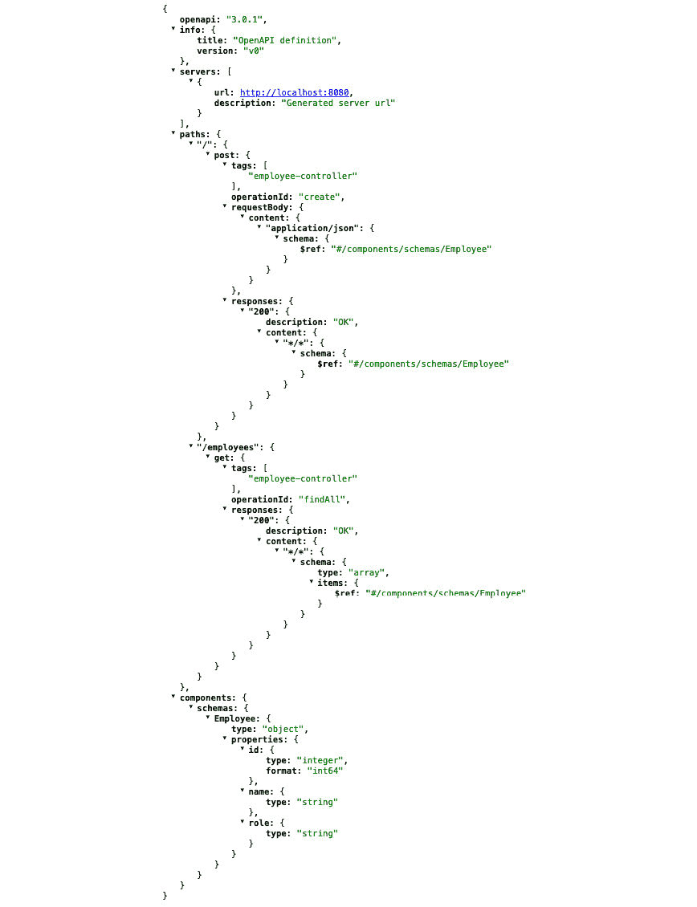

图 8.11 – Swagger 生成的巨大 JSON

这个 JSON 故意留有未完成的部分，因为它对人类大脑来说是不易理解的。幸运的是，Swagger 通过一个用户界面介入，解释了所有这些混乱，并给我们提供了一个美丽的网页。类似于这样：

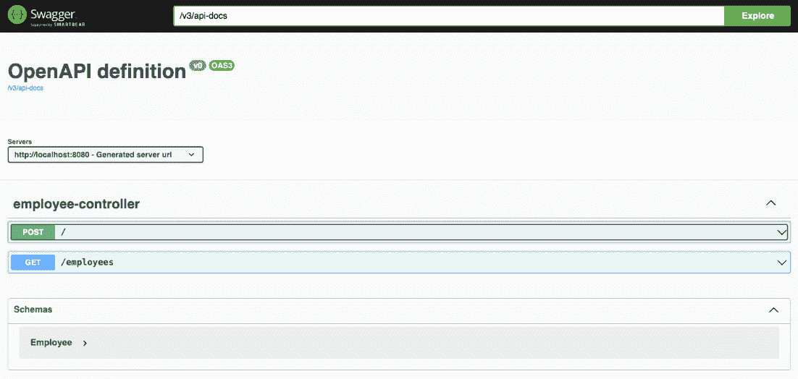

图 8.12 – 由 swagger-ui 暴露的两个非常基本的端点

这是它的基本版本。通过点击单个端点（即那些彩色框中的文字，例如 **/employees**），您将获得其详细信息，并且您可以尝试使用它：

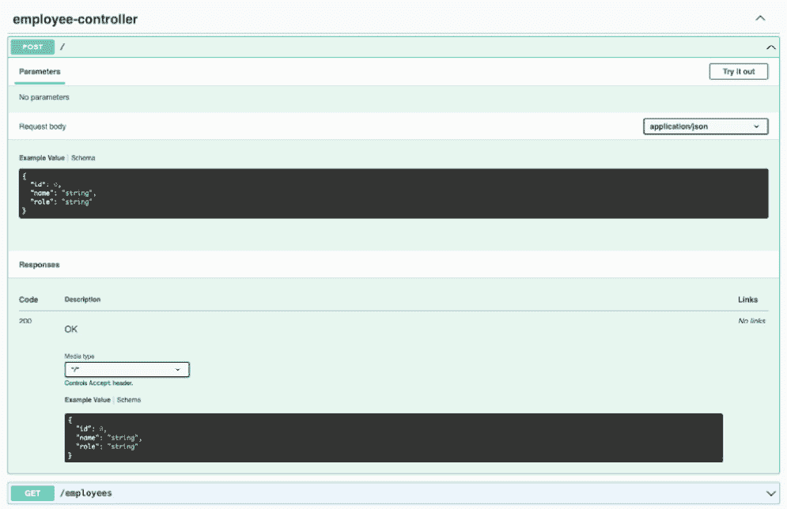

图 8.13 – 通过点击单个方法，将显示更多详细信息

使用 Swagger 注解，您可以详细说明您的 API 文档，喜欢多少都可以。在创建新员工的 `POST` 方法中，您可以看到一个 `CreateEmployee` 类型的参数，它代表了 `POST` 调用的主体。该类的字段可以像这样注解：

```java
@Schema(name = "Employee name", example = "John Doe", required = true)
private final String name;
@Schema(name = "Employee role", example = "Software engineer", required = true)
private final String role;
```

Swagger 将生成以下输出：

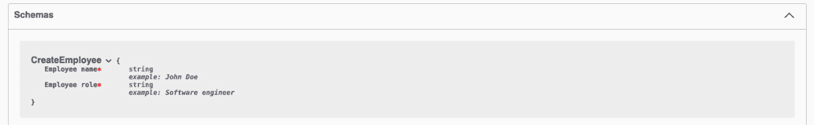

图 8.14 – 由 swagger-ui 渲染的请求体详细信息

像 Swagger 这样的工具，凭借其用户界面，以最小的努力保证了巨大的价值。保持您的文档更新也应该是更简单的，因为所有东西——代码及其文档——都在一个地方。

### Spring REST Docs

我建议用于记录您的 (`REST`) API 的第二个工具被称为 **Spring REST Docs**。Spring REST Docs 是 Spring 框架的一部分，这是一个用于构建基于 Java 的企业应用的流行框架。具体来说，Spring REST Docs 是用于记录使用 Spring 开发的 RESTful API 的一个扩展。它通过利用在 Spring 框架中编写的测试，帮助开发者创建准确且一致的文档，用于他们的 RESTful 网络服务。

Spring REST Docs 通常是这样工作的：

1.  开发者使用 Spring 框架的测试工具为他们的 REST API 端点编写测试。这些测试可以包括 HTTP 请求和响应。

1.  Spring REST Docs 处理这些测试，并根据测试结果生成文档。它可以生成各种格式的文档，如 AsciiDoc、Markdown 或 HTML。这是一件非常酷的事情：在代码发生变化的情况下，文档可以保持更新。

1.  生成的文档可以包含在 API 文档中，这使得其他开发人员或消费者更容易理解如何有效地使用 API。

Spring REST Docs 在那些维护准确和最新 API 文档至关重要的项目中特别有用。通过使用实际测试来生成文档，它确保了文档能够准确反映 API 的行为。这种方法促进了代码与其文档之间的一致性，并帮助开发者和消费者更好地理解如何与 API 交互。

## 文档的良好实践

编写和维护文档是基本且困难的。正确地做这件事并不常见——根本不常见！——而且这将把你的团队提升到下一个层次。以下是一些基于我们的经验和错误的建议。

### 将文档融入开发流程

软件团队跳过文档的一个常见原因是他们总是在等待那个完美的时刻，那时他们有大量的空闲时间。但让我们面对现实——在软件的快节奏世界中，那个时刻很少会随着所有新的项目和计划出现在地平线上。

因此，这里有一个技巧：让文档成为你设计过程的一个自然部分。把它看作是整个交易的一部分的关键步骤，而不是你后来挤进去的额外任务。当然，这可能会增加一点时间，但当你需要处理或扩展系统时，这些额外的努力将得到回报。此外，你的团队将准备好像专业人士一样应对那些意外的曲线球。

### 编写全面的文档

为你的软件架构编写全面的文档是确保系统无缝维护和扩展的绝对必需品。这种文档作为一项宝贵的资源，尤其是在你的工程团队的关键成员离职时，可以保护关键知识不被丢失。此外，它简化了将有关系统的重要信息传达给各种利益相关者的过程。

虽然有人可能会争论代码本身就足以作为文档（实际上，我会同意这一点，但只有在“代码”这个词前加上形容词“好的”），但承认全面的文档为决策提供了无价的环境，并且对技术和非技术利益相关者都是可访问的。

### 更新的文档

维护最新的文档至关重要，因为过时的文档可能导致与没有文档相同的问题。准确反映系统当前状态的文档对于确保明智的决策和防止在更新或更改过程中引用过时信息造成的重大错误至关重要。

### 为特定受众量身定制的文档

定制软件架构文档以适应特定受众是必要的。并非所有利益相关者都有相同的信息需求，试图将所有细节放入单一文档中可能会阻碍信息的查找。甚至可能使个人完全放弃使用文档。

为了确保文档的有效性，为预期受众提供适当级别的背景信息至关重要。例如，商业高管可能不需要深入的技术和代码细节，而工程师如果没有这些技术细节的访问，可能会发现难以履行他们的职责。

我们可以给您提供世界上所有的建议，并指导您走向所有可能的最佳实践，但遗憾的是，我们必须承认，这些良好的习惯有时对非技术人士来说并不受欢迎。在下一节中，我们将就此进行讨论。

# 现实的一剂猛药

我们所讨论的各个方面，以及许多其他方面，将帮助您在日常工作中添加活动，使您的代码、项目和您的工作变得更好。通过将这些内容纳入您的开发周期，也许从项目的开始阶段就纳入，无疑将更容易在这方面保持勤奋。

然而，我们必须告诉您一些不可否认的事实——有时，这些实践可能会在技术娴熟和非技术人士之间引起分歧。我们注意到，对于工作组织方式，尤其是任务方面，往往存在非常不同的看法。当然，即使是代码质量的概念，对于不习惯编写代码的某些经理或合作伙伴来说，可能根本无关紧要。但让我们一步一步来。

例如，管理层可能会将结对编程视为资源密集型，因为它需要两个开发者共同完成同一项任务，这可能会增加劳动力成本。这也可能是因为目标从长远来看更具争议性。然而，管理层通常优先考虑短期项目目标，如按时完成任务和立即交付成果，这可能不符合结对编程的协作性质。结对编程的好处，如提高代码质量和减少缺陷，通常在长期内显现。然而，这些好处可能不会立即被管理层看到，这可能导致怀疑。一般来说，也可能存在简单的缺乏熟悉度：一些管理者可能不熟悉这种实践，并且可能对不充分理解的流程持谨慎态度。此外，引入结对编程可能会扰乱组织内既定的工作流程，导致管理层的抵制。

文档也受到一些这种感知恐惧的影响。为什么停止记录已经有效的东西呢？为什么不继续进行另一项任务呢？一些管理者可能不完全理解文档在减少错误、增强协作和简化新团队成员入职方面的重要性。这种缺乏理解可能导致低估其价值。此外，一些管理者可能认为在文档上花费的时间本可以用于更多的编码或直接的项目工作，这可能导致开发者资源的低效利用。

在两者之间，我必须说，结对编程是遇到更多阻力的一种实践，至少从我的角度来看。我们在这章中讨论的所有实践都很重要，但相处融洽也是至关重要的！尝试引入所有这些实践或至少其中的一些部分；尝试适应，尝试优先排序。为了解决担忧，开发人员和管理层可以通过开放沟通来解释结对编程、文档等长期优势，以及它们如何提高代码质量和项目质量、减少缺陷和增强知识共享。他们还可以讨论它如何导致更快的问题解决和开发过程中的整体效率。管理层可以努力在项目的短期需求和这些实践的长期利益之间取得平衡。

# 了解你在做什么的重要性

在本章这个更加非正式的部分，我们想要提供关于你每天做的事情的最后一条建议。这不仅仅是一个技术提示；更像是朋友的一些建议，这是我希望在我开始职业生涯时有人告诉我的。

当你在一个项目、任务或其他任何事情上工作时，始终牢记你选择做它的原因。问问自己，“我为什么要做这件事？”这不仅仅是为了保持动力；其中还有更多。

首先，这有助于你避免感觉自己像是在键盘上随机敲击的猴子。这也有助于你理解你的工作是如何贡献于项目或公司的开发的。为你的工作设定清晰的目标，无论是短期、中期还是长期，都能让你专注于任务，不会被其他事情分散注意力。如果你的工作有一个特定的目的，甚至更好的是，如果你相信这个目的，你的生产力将会提高，你的工作也会做得更好。

知道你为什么做某事，并理解其背后的目的，将导致更好的决策。面对怀疑或不确定性时，心中有一个明确的目标将指导你的选择，并防止未来的失望。当我们为即将到来的里程碑和我们的最终目标制定了具体行动的详细计划时，每个决策似乎都完美地吻合。

你将不得不做出的一个决定包括在项目中对任务进行优先级排序。你应该先做哪件事？与它将产生的价值相比，哪个任务会花费更多时间？好吧，如果你知道你在做什么——换句话说，如果你有一个明确的目标——这可能会帮助你做出决策，并为项目完成设定一条更顺畅的道路。

如果你知道你的目标，你也许也能理解你离实现它还有多远。换句话说，知道你的“为什么”有助于你衡量你的进度。想象一下一个团队或开发者，他们只是被告知去做某事，完全脱离了上下文，比如“写一个方法，给定这个输入返回这个输出”——我认为这种情况在毕业后很少发生，但让我们假设它确实发生了。这个人根本不知道他们的工作是如何贡献的，以及他们在通往最终目标的道路上处于什么位置。这个人会做得更差。

在一本关于重构的书中，提到理解事物背后的“为什么”对于编写更好的代码以及在必要时更有效地重构代码非常重要。将做某事的原因写下来，也许是在复杂代码旁边的注释中，可以帮助开发者更高效地重写代码。这，连同良好的测试覆盖率和我们在前几章中讨论的所有内容，极大地有助于理解当前代码以及任何潜在的重新编写工作。

提出问题，并不断问自己和其他人。如果你处于一个经理或合作伙伴在任务优先级排序上指导你的位置——例如，如果你在一个涉及产品所有者的框架内工作——总是问为什么选择一件事而不是另一件事。它将带来什么好处？它将花费公司多少成本，又能为公司赚取多少？是否有数据支持这个决定？我并不是说要开始一场战争，绝对不是，但总是试图在这个意义上“挑战”你的同事。

# 摘要

在本章中，我们试图为您提供一些关于引入小而重要的变化以极大提升你工作的建议。我们探讨了如何对你的代码进行版本控制，并提出了社区多年来发现有效的某些分支模型。代码版本控制很重要，但让我们版本化漂亮的代码！我们讨论了代码审查如何有帮助以及如何将其融入你的日常工作。我们专门用一节来讨论一种特定的代码审查形式，即结对编程。我们还深入探讨了文档，区分了各种类型并提供指导，特别是对于 REST API 的技术文档。最后，我们讨论了这些实践在现实世界中的实施，有时可能会遇到阻力，尤其是在中等或小型公司中。

在下一章中，我们将退后一步，讨论这些不同元素之间是如何相互沟通的。我们将讨论最佳实践，识别问题（坏味道），并提供一些关于重构你架构的建议。

# 进一步阅读

+   *《极限编程之道：拥抱变化》*，由 Kent Beck 和 Addison-Weasley 所著

+   关于结对编程：[`martinfowler.com/articles/on-pair-programming.html`](https://martinfowler.com/articles/on-pair-programming.html)

+   Llewellyn 的强风格配对：[`llewellynfalco.blogspot.com/2014/06/llewellyns-strong-style-pairing.html`](https://llewellynfalco.blogspot.com/2014/06/llewellyns-strong-style-pairing.html)

+   *结对编程的成本与收益*，由 A. Cockburn 和 L. Williams 所著：[`collaboration.csc.ncsu.edu/laurie/Papers/XPSardinia.PDF`](https://collaboration.csc.ncsu.edu/laurie/Papers/XPSardinia.PDF)

+   适用于想要使用番茄工作法的远程团队的优秀工具：[`cuckoo.team/`](https://cuckoo.team/)

+   *Pull Request*，Martin Fowler 的文章：[`martinfowler.com/bliki/PullRequest.html`](https://martinfowler.com/bliki/PullRequest.html)

+   GitFlow 原始帖子：[`nvie.com/posts/a-successful-git-branching-model/`](https://nvie.com/posts/a-successful-git-branching-model/)

+   如何编写好的提交信息：[`www.freecodecamp.org/news/how-to-write-better-git-commit-messages/`](https://www.freecodecamp.org/news/how-to-write-better-git-commit-messages/)

+   Google Java 风格指南：[`google.github.io/styleguide/javaguide.html`](https://google.github.io/styleguide/javaguide.html)

+   Oracle Java 约定：[`www.oracle.com/technetwork/java/codeconventions-150003.pdf`](https://www.oracle.com/technetwork/java/codeconventions-150003.pdf)

+   关于注释和格式化，Robert C. Martin 的《Clean Code》第四章和第五章

+   Apache Maven Checkstyle 插件的介绍：[`www.baeldung.com/checkstyle-java`](https://www.baeldung.com/checkstyle-java)

+   关于收集、记录和管理软件需求的内容：Giuseppe Bonocore 的《Java 实践软件架构》中的第*2*章，Packt

+   用于可视化软件架构的 C4 模型([`c4model.com/`](https://c4model.com/))以及 Giuseppe Bonocore 的《Java 实践软件架构》，第*1*章，Packt

+   Baeldung 提供的 Swagger 设置教程：[`www.baeldung.com/swagger-2-documentation-for-spring-rest-api`](https://www.baeldung.com/swagger-2-documentation-for-spring-rest-api)

+   Spring REST 文档：[`docs.spring.io/spring-restdocs/docs/current/reference/htmlsingle/`](https://docs.spring.io/spring-restdocs/docs/current/reference/htmlsingle/)
