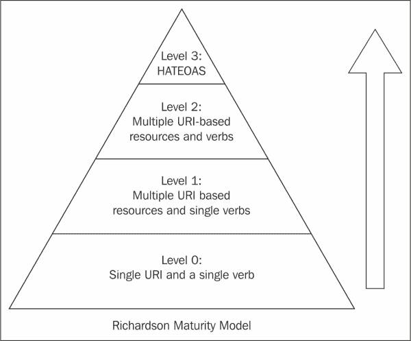
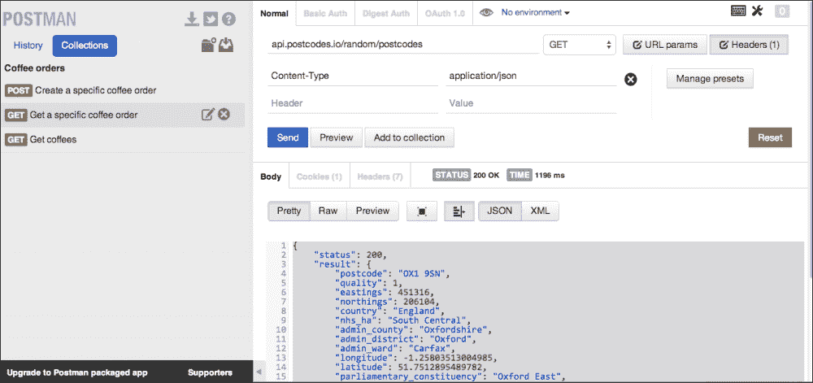

# 第一章：REST - 从哪里开始

传统 SOA 格式的 Web 服务已经存在很长时间，用于实现应用程序之间的异构通信。支持这种通信的一种方式是使用**简单对象访问协议**（**SOAP**）/**Web 服务描述语言**（**WSDL**）方法。SOAP/WSDL 是一种基于 XML 的标准，在服务之间存在严格的合同时运行良好。我们现在处于分布式服务的时代，Web、移动客户端以及其他服务（内部或外部）可以利用不同供应商和开源平台提供的 API。这种要求强调了分布式服务之间信息交换的需求，以及可预测、健壮、明确定义的接口。

HTTP 1.1 在 RFC 2616 中定义，并且被广泛用作分布式协作超媒体信息系统的标准协议。**表述状态转移**（**REST**）受到 HTTP 的启发，可以在任何使用 HTTP 的地方使用。本章将介绍 RESTful 服务设计的基础知识，并展示如何基于标准 Java API 生成和消费 RESTful 服务。

本章涵盖以下主题。

+   REST 介绍

+   安全性和幂等性

+   构建 RESTful 服务的设计原则

+   RESTful 服务的 Java 标准 API

+   设计 RESTful 服务的最佳实践

# REST 介绍

REST 是一种符合 Web 标准的架构风格，例如使用 HTTP 动词和 URI。它受以下原则约束：

+   所有资源都由 URI 标识

+   所有资源都可以有多种表示

+   所有资源都可以通过标准 HTTP 方法进行访问/修改/创建/删除

+   服务器上没有状态信息

## REST 和无状态性

REST 受**无状态性**原则约束。客户端到服务器的每个请求必须具有理解请求的所有细节。这有助于提高请求的可见性、可靠性和可扩展性。

**可见性**得到改善，因为监视请求的系统不必查看超出一个请求以获取详细信息。**可靠性**得到改善，因为在部分故障的情况下不需要检查点/恢复。**可扩展性**得到改善，因为服务器可以处理的请求数量增加，因为服务器不负责存储任何状态。

### 注

Roy Fielding 关于 REST 架构风格的论文详细介绍了 REST 的无状态性。请访问[`www.ics.uci.edu/~fielding/pubs/dissertation/rest_arch_style.htm`](http://www.ics.uci.edu/~fielding/pubs/dissertation/rest_arch_style.htm)获取更多信息。

通过对 REST 的基础知识进行初步介绍，我们将在下一节中介绍不同的成熟度级别以及 REST 在其中的位置。

# Richardson 成熟度模型

**Richardson 成熟度模型**是由 Leonard Richardson 开发的模型。它从资源、动词和超媒体控制的角度讨论了 REST 的基础知识。成熟度模型的起点是使用 HTTP 层作为传输。如下图所示：



## 0 级 - 远程过程调用

0 级包含将数据作为**普通旧 XML**（**POX**）发送的 SOAP 或 XML-RPC。只使用`POST`方法。这是构建具有单个`POST`方法的 SOA 应用程序的最原始方式，并使用 XML 在服务之间进行通信。

## 1 级 - REST 资源

1 级使用`POST`方法，而不是使用函数和传递参数，而是使用 REST URI。因此，它仍然只使用一个 HTTP 方法。它比 0 级更好，因为它将复杂功能分解为多个资源，并使用一个`POST`方法在服务之间进行通信。

## 2 级 - 更多的 HTTP 动词

Level 2 使用其他 HTTP 动词，如`GET`、`HEAD`、`DELETE`和`PUT`，以及`POST`方法。 Level 2 是 REST 的真正用例，它倡导根据 HTTP 请求方法使用不同的动词，系统可以具有多个资源。

## Level 3 – HATEOAS

**超媒体作为应用状态的引擎**（**HATEOAS**）是 Richardson 模型的最成熟级别。对客户端请求的响应包含超媒体控件，这可以帮助客户端决定下一步可以采取什么行动。 Level 3 鼓励易于发现，并使响应易于自我解释。关于 HATEOAS 是否真正符合 RESTful 存在争议，因为表示包含了除了描述资源之外的更多信息。我们将展示一些平台如 PayPal 如何在其 API 的一部分中实现 HATEOAS 的详细信息在第五章，“高级设计原则”中。

下一节涵盖了安全性和幂等性，这是处理 RESTful 服务时的两个重要术语。

# 安全性和幂等性

下一节将详细讨论什么是安全和幂等方法。

## 安全方法

安全方法是不会改变服务器状态的方法。例如，`GET /v1/coffees/orders/1234`是一个安全方法。

### 注意

安全方法可以被缓存。`GET`和`HEAD`是安全方法。

`PUT`方法不安全，因为它会在服务器上创建或修改资源。`POST`方法由于相同的原因也不安全。`DELETE`方法不安全，因为它会删除服务器上的资源。

## 幂等方法

幂等方法是一种无论调用多少次都会产生相同结果的方法。

### 注意

`GET`方法是幂等的，因为对`GET`资源的多次调用将始终返回相同的响应。

`PUT`方法是幂等的，多次调用`PUT`方法将更新相同的资源并且不会改变结果。

`POST`不是幂等的，多次调用`POST`方法可能会产生不同的结果，并且会导致创建新资源。`DELETE`是幂等的，因为一旦资源被删除，它就消失了，多次调用该方法不会改变结果。

# 构建 RESTful 服务的设计原则

以下是设计、开发和测试 RESTful 服务的过程。我们将在本章中详细介绍每个过程：

+   识别资源 URI

此过程涉及决定名词将代表您的资源。

+   识别资源支持的方法

此过程涉及使用各种 HTTP 方法进行 CRUD 操作。

+   识别资源支持的不同表示

此步骤涉及选择资源表示应该是 JSON、XML、HTML 还是纯文本。

+   使用 JAX-RS API 实现 RESTful 服务

API 需要基于 JAX-RS 规范实现

+   部署 RESTful 服务

将服务部署在诸如 Tomcat、Glassfish 和 WildFly 之类的应用容器上。示例展示了如何创建 WAR 文件并在 Glassfish 4.0 上部署，它可以与任何符合 JavaEE 7 标准的容器一起使用。

+   测试 RESTful 服务

编写客户端 API 以测试服务，或使用 curl 或基于浏览器的工具来测试 REST 请求。

## 识别资源 URI

RESTful 资源由资源 URI 标识。由于使用 URI 来标识资源，REST 是可扩展的。

以下表格显示了示例 URI，可以表示系统中的不同资源：

| URI | URI 的描述 |
| --- | --- |
| `/v1/library/books` | 用于表示图书馆中的一组图书资源 |
| `/v1/library/books/isbn/12345678` | 用于表示由其 ISBN“12345678”标识的单本书 |
| `/v1/coffees` | 用于表示咖啡店出售的所有咖啡 |
| `/v1/coffees/orders` | 这用于表示所有已订购的咖啡 |
| `/v1/coffees/orders/123` | 这用于表示由“123”标识的咖啡订单 |
| `/v1/users/1235` | 这用于表示系统中由“1235”标识的用户 |
| `/v1/users/5034/books` | 这用于表示由“5034”标识的用户的所有书籍 |

所有前面的示例都显示了一个清晰可读的模式，客户端可以解释。所有这些资源都可以有多个表示。在前面的表中显示的这些资源示例可以由 JSON、XML、HTML 或纯文本表示，并且可以通过 HTTP 方法`GET`、`PUT`、`POST`和`DELETE`进行操作。

## 识别资源支持的方法

HTTP 动词占据了统一接口约束的主要部分，该约束定义了动词识别的操作与基于名词的 REST 资源之间的关联。

以下表格总结了 HTTP 方法和对资源采取的操作的描述，以图书馆中书籍集合的简单示例为例。

| HTTP 方法 | 资源 URI | 描述 |
| --- | --- | --- |
| `GET` | `/library/books` | 这获取书籍列表 |
| `GET` | `/library/books/isbn/12345678` | 这获取由 ISBN“12345678”标识的书籍 |
| `POST` | `/library/books` | 这创建一个新的书籍订单 |
| `DELETE` | `/library/books/isbn/12345678` | 这将删除由 ISBN“12345678”标识的书籍 |
| `PUT` | `/library/books/isbn/12345678` | 这将更新由 ISBN“12345678”标识的特定书籍 |
| `PATCH` | `/library/books/isbn/12345678` | 这可用于对由 ISBN“12345678”标识的书籍进行部分更新 |

下一节将介绍每个 HTTP 动词在 REST 上下文中的语义。

### HTTP 动词和 REST

HTTP 动词告诉服务器如何处理作为 URL 一部分发送的数据。

#### 获取

`GET`方法是 HTTP 的最简单动词，它使我们能够访问资源。每当客户端在浏览器中点击 URL 时，它会向 URL 指定的地址发送`GET`请求。`GET`是安全和幂等的。`GET`请求被缓存。`GET`请求中可以使用查询参数。

例如，检索所有活动用户的简单`GET`请求如下所示：

```java
curl http://api.foo.com/v1/users/12345?active=true
```

#### POST

`POST`用于创建资源。`POST`请求既不是幂等的，也不是安全的。多次调用`POST`请求可以创建多个资源。

如果存在缓存条目，`POST`请求应该使缓存条目无效。不鼓励在`POST`请求中使用查询参数。

例如，创建用户的`POST`请求可以如下所示：

```java
curl –X POST  -d'{"name":"John Doe","username":"jdoe", "phone":"412-344-5644"}' http://api.foo.com/v1/users
```

#### 放置

`PUT`用于更新资源。`PUT`是幂等的，但不安全。多次调用`PUT`请求应该通过更新资源产生相同的结果。

如果存在缓存条目，`PUT`请求应该使缓存条目无效。

例如，更新用户的`PUT`请求可以如下所示：

```java
curl –X PUT  -d'{ "phone":"413-344-5644"}'
http://api.foo.com/v1/users
```

#### DELETE

`DELETE`用于删除资源。`DELETE`是幂等的，但不安全。这是幂等的，因为根据 RFC 2616，N > 0 请求的副作用与单个请求相同。这意味着一旦资源被删除，多次调用`DELETE`将获得相同的响应。

例如，删除用户的请求可以如下所示：

```java
curl –X DELETE http://foo.api.com/v1/users/1234
```

#### 头

`HEAD`类似于`GET`请求。不同之处在于只返回 HTTP 标头，不返回内容。`HEAD`是幂等和安全的。

例如，使用 curl 发送`HEAD`请求的请求如下所示：

```java
curl –X HEAD http://foo.api.com/v1/users
```

### 提示

在尝试使用`GET`请求获取大型表示之前，发送`HEAD`请求以查看资源是否已更改可能很有用。

### PUT 与 POST

根据 RFC，`PUT`和`POST`之间的区别在于请求 URI。由`POST`标识的 URI 定义将处理`POST`请求的实体。`PUT`请求中的 URI 包括请求中的实体。

因此，`POST /v1/coffees/orders`表示创建一个新资源并返回一个标识符来描述该资源。相反，`PUT /v1/coffees/orders/1234`表示更新由`"1234"`标识的资源（如果存在）；否则创建一个新订单并使用`orders/1234` URI 来标识它。

### 注意

`PUT`和`POST`都可以用于创建或更新方法。方法的使用取决于期望从方法获得的幂等行为以及用于标识资源的位置。

下一节将介绍如何识别资源的不同表示形式。

## 识别资源的不同表示形式

RESTful 资源是抽象实体，需要在与客户端通信之前被序列化为表示。资源的常见表示可以是 XML、JSON、HTML 或纯文本。资源可以根据客户端的处理能力向客户端提供表示。客户端可以指定它偏好的语言和媒体类型。这被称为**内容协商**。第二章，“资源设计”，详细介绍了内容协商主题。

## 实现 API

现在我们对设计 RESTful 资源和将 HTTP 动词与资源上的操作关联有了一些了解，我们将介绍实现 API 和构建 RESTful 服务所需的内容。本节将涵盖以下主题：

+   用于 RESTful 服务的 Java API（JAX-RS）

### 用于 RESTful 服务的 Java API（JAX-RS）

用于 RESTful 服务的 Java API 提供了用于构建和开发基于 REST 架构风格的应用程序的可移植 API。使用 JAX-RS，Java POJO 可以作为 RESTful web 资源公开，这些资源独立于底层技术，并使用基于注释的简单 API。

JAX-RS 2.0 是规范的最新版本，与其前身 JAX-RS 1.0 相比，在以下领域特别是具有更新的功能：

+   Bean 验证支持

+   客户端 API 支持

+   异步调用支持

Jersey 是 JAX-RS 规范的实现。

我们将在随后的章节中详细介绍所有这些主题。我们正在演示一个简单的咖啡店示例，您可以在其中创建一个名为`CoffeesResource`的 REST 资源，该资源可以执行以下操作：

+   提供已下订单的详细信息

+   创建新订单

+   获取特定订单的详细信息

要创建一个 RESTful 资源，我们从一个名为`CoffeesResource`的 POJO 开始。以下是 JAX-RS 资源的示例：

```java
@Path("v1/coffees")
public class CoffeesResource {

    @GET
    @Path("orders")
    @Produces(MediaType.APPLICATION_JSON)
    public List<Coffee> getCoffeeList( ){
      //Implementation goes here

    }
```

1.  如前面的代码所示，我们创建了一个名为`CoffeesResource`的小型 POJO。我们使用`@Path("v1/coffees")`对类进行注释，该注释标识了该类为请求提供服务的 URI 路径。

1.  接下来，我们定义了一个名为`getCoffeeList()`的方法。该方法具有以下注释：

+   `@GET`：这表示被注释的方法代表一个 HTTP `GET`请求。

+   `@PATH`：在此示例中，`GET`请求`v1/coffees/orders`将由`getCoffeeList()`方法处理。

+   `@Produces`：这定义了此资源生成的媒体类型。在我们之前的片段中，我们定义了`MediaType.APPLICATION_JSON`，其值为`application/json`。

1.  另一种创建订单的方法如下：

```java
    @POST
    @Consumes(MediaType.APPLICATION_JSON)
    @Produces(MediaType.APPLICATION_JSON)
    @ValidateOnExecution
    public Response addCoffee(@Valid Coffee coffee) {
    //Implementation goes here
    }
```

对于创建订单的第二种方法，我们定义了一个名为`addCoffee()`的方法。该方法具有以下注释：

+   `@POST`：这表示被注释的方法代表 HTTP `POST`请求。

+   `@Consumes`：这定义了此资源消耗的媒体类型。在我们之前的片段中，我们定义了`MediaType.APPLICATION_JSON`，其值为`application/json`。

+   `@Produces`：这定义了此资源生成的媒体类型。在我们之前的片段中，我们定义了`MediaType.APPLICATION_JSON`，其值为`application/json`。

+   `@ValidateOnExecution`：这指定了应在执行时验证其参数或返回值的方法。有关`@ValidateOnExecution`和`@Valid`注释的更多详细信息将在第三章*安全性和可追溯性*中介绍。

因此，我们看到了一个简单示例，说明了将简单的 POJO 转换为 REST 资源有多么容易。现在，我们将介绍`Application`子类，该子类将定义 JAX-RS 应用程序的组件，包括元数据。

以下是名为`CoffeeApplication`的示例`Application`子类的代码：

```java
@ApplicationPath("/")
public class CoffeeApplication extends Application {

    @Override
    public Set<Class<?>> getClasses() {
        Set<Class<?>> classes = new HashSet<Class<?>>();
        classes.add(CoffeesResource.class);
        return classes;
    }
```

如前面的代码片段所示，`getClasses()`方法已被重写，并且我们将`CoffeesResource`类添加到`Application`子类中。`Application`类可以是 WAR 文件中的`WEB-INF/classes`或`WEB-INF/lib`的一部分。

## 部署 RESTful 服务

一旦我们创建了资源并将元信息添加到 Application 子类中，下一步就是构建 WAR 文件。WAR 文件可以部署在任何 servlet 容器上。

示例的源代码作为本书的可下载捆绑包的一部分提供，其中将详细介绍部署和运行示例的步骤。

## 测试 RESTful 服务

然后，我们可以使用 JAX-RS 2.0 提供的 Client API 功能来访问资源。

本节将涵盖以下主题：

+   JAX-RS 2.0 的 Client API

+   使用 curl 或名为 Postman 的基于浏览器的扩展访问 RESTful 资源

### JAX-RS 2.0 的 Client API

JAX-RS 2.0 为访问 RESTful 资源提供了更新的 Client API。客户端 API 的入口点是`javax.ws.rs.client.Client`。

使用 JAX-RS 2.0 中新引入的 Client API，可以访问端点如下：

```java
Client client = ClientFactory.newClient();
WebTarget target = client.target("http://. . ./coffees/orders");
String response = target.request().get(String.class);
```

如前面的代码片段所示，使用`ClientFactory.newClient()`方法获取了客户端的默认实例。使用`target`方法，我们创建了一个`WebTarget`对象。然后使用这些目标对象通过添加方法和查询参数来准备请求。

在这些 API 之前，我们访问 REST 资源的方式是这样的：

```java
URL url = new URL("http://. . ./coffees/orders");
HttpURLConnection conn = (HttpURLConnection) url.openConnection();
conn.setRequestMethod("GET");
conn.setDoInput(true);
conn.setDoOutput(false);
BufferedReader br = new BufferedReader(new InputStreamReader(conn.getInputStream()));
String line;
while ((line = br.readLine()) != null) {
    //. . .
}
```

因此，我们可以看到 JAX-RS 2.0 客户端 API 支持已经改进，以避免使用`HTTPURLConnection`，而是使用流畅的客户端 API。

如果请求是`POST`请求：

```java
Client client = ClientBuilder.newClient();
Coffee coffee = new Coffee(...);
WebTarget myResource = client.target("http://foo.com/v1/coffees");
myResource.request(MediaType.APPLICATION_XML) .post(Entity.xml(coffee), Coffee.class);
```

`WebTarget.request()`方法返回一个`javax.ws.rs.client.InvocationBuilder`，它使用`post()`方法来调用 HTTP `POST`请求。`post()`方法使用`Coffee`实例的实体，并指定媒体类型为`"APPLICATION_XML"`。

`MessageBodyReaderWriter`实现已在客户端中注册。有关`MessageBodyReader`和`MessageBodyWriter`的更多信息将在第二章*资源设计*中介绍。

以下表格总结了到目前为止我们所涵盖的一些主要 JAX-RS 类/注释。

| 注释名称 | 描述 |
| --- | --- |
| `javax.ws.rs.Path` | 这标识了资源为方法提供的 URI 路径 |
| `javax.ws.rs.ApplicationPath` | 这被`Application`的子类用作应用程序中所有资源提供的所有 URI 的基本 URI |
| `javax.ws.rs.Produces` | 这定义了资源可以生成的媒体类型 |
| `javax.ws.rs.Consumes` | 这定义了资源可以消耗的媒体类型 |
| `javax.ws.rs.client.Client` | 这定义了客户端请求的入口点 |
| `javax.ws.rs.client.WebTarget` | 这定义了由 URI 标识的资源目标 |

### 注意

客户端是帮助简化客户端通信基础设施的重量级对象。因此，建议在应用程序中仅构建少量客户端实例，因为初始化和处理客户端实例可能是一个相当昂贵的操作。此外，必须在处理之前正确关闭客户端实例，以避免资源泄漏。

### 访问 RESTful 资源

以下部分涵盖了客户端可以访问和测试 REST 资源的不同方式。

#### cURL

cURL 是一个用于测试 REST API 的流行命令行工具。cURL 库和 cURL 命令使用户能够创建请求，将其放在管道上，并探索响应。以下是一些用于一些基本功能的`curl`请求的示例：

| curl 请求 | 描述 |
| --- | --- |
| `curl http://api.foo.com/v1/coffees/1` | 这是一个简单的`GET`请求 |
| `curl -H "foo:bar" http://api.foo.com/v1/coffees` | 这是一个使用`-H`添加请求头的`curl`请求的示例 |
| `curl -i http://api.foo.com/v1/coffees/1` | 这是一个使用`-i`查看响应头的`curl`命令的示例 |
| `curl –X POST -d'{"name":"John Doe","username":"jdoe", "phone":"412-344-5644"} http://api.foo.com/v1/users` | 这是一个用于创建用户的`POST`方法的`curl`请求的示例 |

尽管 cURL 非常强大，但有很多选项需要记住和使用。有时，使用基于浏览器的工具来开发 REST API，如 Postman 或高级 REST 客户端，会有所帮助。

#### Postman

Chrome 浏览器上的 Postman 是一个非常好的测试和开发 REST API 的工具。它具有用于呈现数据的 JSON 和 XML 查看器。它还可以允许预览 HTTP 1.1 请求，重播，并组织请求以供将来使用。Postman 与浏览器共享相同的环境，也可以显示浏览器 cookie。

Postman 相对于 cURL 的优势在于有一个很好的用户界面，可以输入参数，用户不需要处理命令或脚本。还支持各种授权方案，如基本用户认证和摘要访问认证。

以下是一张截图，显示了如何在 Postman 中发送查询：



如前面的截图所示，我们看到了 Postman 应用程序。测试 Postman 的一个简单方法是从 Chrome 启动 Postman 应用程序。

然后，选择 HTTP 方法`GET`并粘贴`api.postcodes.io/random/postcodes` URL。（PostCodes 是一个基于地理数据的免费开源服务。）

您将看到一个 JSON 响应，类似于这样：

```java
{
    "status": 200,
    "result": {
        "postcode": "OX1 9SN",
        "quality": 1,
        "eastings": 451316,
        "northings": 206104,
        "country": "England",
        "nhs_ha": "South Central",
        "admin_county": "Oxfordshire",
        "admin_district": "Oxford",
        "admin_ward": "Carfax",
…}
}
```

### 提示

**下载示例代码**

您可以从您在[`www.packtpub.com`](http://www.packtpub.com)购买的 Packt 图书的帐户中下载示例代码文件。如果您在其他地方购买了本书，您可以访问[`www.packtpub.com/support`](http://www.packtpub.com/support)并注册，以便直接通过电子邮件接收文件。

在前面截图的左侧窗格中有不同的查询，这些查询已经根据本书中的各种示例添加到了一个集合中，例如获取所有咖啡订单，获取特定订单，创建订单等等。您也可以类似地创建自定义查询集合。

### 注意

要了解更多详情，请访问[`www.getpostman.com/`](http://www.getpostman.com/)。

#### 其他工具

以下是一些在处理 REST 资源时非常有用的其他工具。

##### 高级 REST 客户端

高级 REST 客户端是另一个基于 Google WebToolkit 的 Chrome 扩展，允许用户测试和开发 REST API。

##### JSONLint

JSONLint 是一个简单的在线验证器，可确保 JSON 有效。在发送 JSON 数据作为请求的一部分时，验证数据格式是否符合 JSON 规范是有用的。在这种情况下，客户端可以使用 JSONLint 验证输入。要了解更多详情，请访问[`jsonlint.com/`](http://jsonlint.com/)。

# 设计资源时的最佳实践

以下部分突出显示了设计 RESTful 资源时的一些最佳实践：

+   API 开发者应该使用名词来理解和浏览资源，使用 HTTP 方法和动词，例如，/user/1234/books 比/user/1234/getBook URI 更好。

+   在 URI 中使用关联来标识子资源。例如，要获取用户 1234 的书籍 5678 的作者，使用以下 URI：`/user/1234/books/5678/authors`。

+   对于特定的变化，使用查询参数。例如，要获取所有具有 10 条评论的书籍，使用`/user/1234/books?reviews_counts=10`。

+   如果可能，允许部分响应作为查询参数的一部分。例如，在获取用户的姓名和年龄时，客户端可以指定`?fields`作为查询参数，并使用`/users/1234?fields=name,age` URI 指定应该由服务器在响应中发送的字段列表。

+   在客户端没有指定感兴趣的格式时，为响应的输出格式设置默认值。大多数 API 开发人员选择将 JSON 作为默认响应 MIME 类型发送。

+   使用 camelCase 或使用`_`作为属性名称。

+   支持标准 API 以获取计数，例如`users/1234/books/count`，以便客户端可以了解响应中可以期望多少对象。

这也将帮助客户端进行分页查询。关于分页的更多细节将在第五章中涵盖，*高级设计原则*。

+   支持漂亮打印选项，`users/1234?pretty_print`。另外，不缓存带有漂亮打印查询参数的查询是一个良好的实践。

+   尽量详细地避免啰嗦。这是因为如果服务器在响应中没有提供足够的细节，客户端需要进行更多的调用以获取额外的细节。这不仅浪费了网络资源，还会影响客户端的速率限制。关于速率限制的更多细节在第五章中有所涵盖，*高级设计原则*。

# 推荐阅读

以下链接可能对查看更多细节有用：

+   **RFC 2616**：[`www.w3.org/Protocols/rfc2616/rfc2616-sec3.html`](http://www.w3.org/Protocols/rfc2616/rfc2616-sec3.html)

+   **Richardson 成熟度模型**：[`www.crummy.com/writing/speaking/2008-QCon/act3.html`](http://www.crummy.com/writing/speaking/2008-QCon/act3.html)

+   **JAX-RS 的 Jersey 实现**：[`jersey.java.net/`](https://jersey.java.net/)

+   **InspectB.in**: [`inspectb.in/`](http://inspectb.in/)

+   **Postman**：[`www.getpostman.com/`](http://www.getpostman.com/)

+   **高级 REST 客户端**：[`code.google.com/p/chrome-rest-client/`](https://code.google.com/p/chrome-rest-client/)

# 摘要

在本章中，我们介绍了 REST、CRUD API 的基础知识以及如何设计 RESTful 资源。我们使用了基于 JAX-RS 2.0 的注解来表示 HTTP 方法，以及可以用于定位资源的客户端 API。此外，我们还总结了设计 RESTful 服务时的最佳实践。

下一章将更深入地探讨这里涵盖的概念。我们还将涵盖诸如内容协商、JAX-RS 2.0 中的实体提供者、错误处理、版本控制方案和 REST 中的响应代码等主题。我们将探讨服务器可以使用流式传输或分块传输向客户端发送响应的技术。
