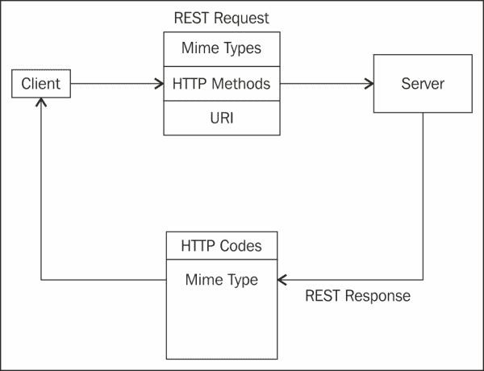

# 第二章：资源设计

第一章，“REST - 起源”，介绍了 REST 的基础知识以及在设计 RESTful 资源时的最佳实践。本章将继续讨论请求响应模式的理解，如何处理资源的不同表示，API 版本控制的不同策略，以及如何使用标准 HTTP 代码来处理 REST 响应。本章的子章节将涵盖以下主题：

+   REST 响应模式

+   内容协商

+   实体提供程序和不同的表示

+   API 版本控制

+   响应代码和 REST 模式

我们还将介绍用于序列化和反序列化请求和响应实体的自定义实体提供程序，以及流式传输和分块等其他方法。

# REST 响应模式

在前一章中，我们看到了如何使用与域相关的数据来创建可读的 URI，使用不同的 CRUD 功能的 HTTP 方法，并使用标准化的 MIME 类型和 HTTP 响应代码在客户端和服务器之间传输数据。

以下是显示标准 REST 请求/响应模式的图表：



如前图所示，客户端发出 REST 请求，其中包括标准的 HTTP 方法、MIME 类型和目标 URI。服务器处理请求并发送回一个响应，其中包括标准的 HTTP 响应代码和 MIME 类型。我们之前介绍了 HTTP 方法以及如何使用 JAX-RS 注释。还列举了设计资源 URI 的最佳实践。在本章中，我们将介绍常用的 HTTP 响应代码以及如何处理不同的 MIME 类型。

# 内容协商

内容协商意味着在同一 URI 中允许资源的不同表示，以便客户端可以选择最适合它们的表示。

|   | *“HTTP 有几种机制来进行‘内容协商’-在有多个表示可用时选择给定响应的最佳表示的过程。”* |   |
| --- | --- | --- |
|   | --*RFC 2616, Fielding et al.* |

内容协商有不同的模式。具体如下：

+   使用 HTTP 头

+   使用 URL 模式

## 使用 HTTP 头进行内容协商

当客户端发送请求以创建或更新资源时，应从客户端传输某种有效负载到端点。此外，生成响应时，有效负载可以发送回客户端。这些有效负载由 HTTP 请求和响应实体处理，这些实体作为 HTTP 消息正文的一部分发送。

实体通常通过请求发送，通常用于 HTTP `POST` 和 `PUT` 方法，或者在 HTTP 方法的响应中返回。Content-Type HTTP 头用于指示服务器发送的实体的 MIME 类型。常见的内容类型示例包括`"text/plain"`、`"application/xml"`、`"text/html"`、`"application/json"`、`"image/gif"`和`"image/jpeg"`。

客户端可以向服务器发出请求，并在`Accept`HTTP 头的一部分中指定它可以处理的媒体类型以及其首选顺序。客户端还可以在`"Accept-Language"`头的一部分中指定它希望响应的语言。如果请求中没有`Accept`头，则服务器可以发送它选择的表示。

JAX-RS 规范提供了标准注释来支持内容协商。这些是`javax.ws.rs.Produces`和`javax.ws.rs.Consumes`注释。以下代码段显示了资源方法中`@Produces`注释的示例：

```java
    @GET
    @Path("orders")
    @Produces(MediaType.APPLICATION_JSON)
    public List<Coffee> getCoffeeList(){
        return CoffeeService.getCoffeeList();

    }
```

`getCoffeeList()`方法返回咖啡列表，并用`@Produces(MediaType.APPLICATION_JSON)`进行注释。`@Produces`注释用于指定资源可以发送给客户端的 MIME 类型，并将其与客户端的`Accept`头进行匹配。

此方法将产生如下响应：

```java
X-Powered-By: Servlet/3.1 JSP/2.3 (GlassFish Server Open Source Edition  4.0  Java/Oracle Corporation/1.7)
Server: GlassFish Server Open Source Edition  4.0 
Content-Type: application/json
Date: Thu, 31 Jul 2014 15:25:17 GMT
Content-Length: 268
{
    "coffees": [
        {
            "Id": 10,
            "Name": "Cappuchino",
            "Price": 3.82,
            "Type": "Iced",
            "Size": "Medium"
        },
        {
            "Id": 11,
            "Name": "Americano",
            "Price": 3.42,
            "Type": "Brewed",
            "Size": "Large"
        }
    ]
}
```

在资源中，如果没有方法能够生成客户端请求的 MIME 类型，JAX-RS 运行时会返回 HTTP `406 Not Acceptable`错误。

以下代码片段显示了一个使用`@Consumes`注解的资源方法：

```java
    @POST
    @Consumes(MediaType.APPLICATION_JSON)
    @Produces(MediaType.APPLICATION_JSON)
    public Response addCoffee(Coffee coffee) {
        // Implementation here
    }
```

`@Consumes`注解指定了资源可以消费的媒体类型。当客户端发出请求时，JAX-RS 会找到所有与路径匹配的方法，然后根据客户端发送的内容类型调用方法。

如果资源无法消费客户端请求的 MIME 类型，JAX-RS 运行时会返回 HTTP `415 ("Unsupported Media Type")`错误。

可以在`@Produces`或`@Consumes`注解中指定多个 MIME 类型，如`@Produces(MediaType.APPLICATION_JSON, MediaType.APPLICATION_XML)`。

除了对静态内容协商的支持，JAX-RS 还包含使用`javax.ws.rs.core.Variant`类和`javax.ws.rs.core.Request`对象的运行时内容协商支持。在 JAX-RS 规范中，`Variant`对象是媒体类型、内容语言和内容编码以及 ETags、最后修改的标头和其他先决条件的组合。`Variant`对象定义了服务器支持的资源表示。`Variant.VariantListBuilder`类用于构建表示变体列表。

以下代码片段显示了如何创建资源表示变体列表：

```java
List<Variant>  variants = Variant.mediatypes("application/xml", "application/json").build();
```

代码片段调用了`VariantListBuilder`类的`build`方法。`Request.selectVariant`方法接受`Variant`对象列表，并根据客户端的`Accept`标头选择其中一个，如下面的代码片段所示：

```java
@GET
public Response getCoffee(@Context Request r) { 
    List<Variant> vs = ...;
    Variant v = r.selectVariant(vs);
    if (v == null) {
        return Response.notAcceptable(vs).build();
    } else {
        Coffee coffee = ..//select the representation based on v
        return Response.ok(coffee, v);
    }
}
```

## 基于 URL 模式的内容协商

一些 API 采用的内容协商的另一种方法是根据 URL 中资源的扩展名发送资源表示。例如，客户端可以使用`http://foo.api.com/v2/library/books.xml`或`http://foo.api.com/v2/library/books.json`来请求详细信息。服务器有不同的方法来处理这两个 URI。然而，这两者都是同一资源的表示。

```java
@Path("/v1/books/")
public class BookResource {
    @Path("{resourceID}.xml")
    @GET 
    public Response getBookInXML(@PathParam("resourceID") String resourceID) {
        //Return Response with entity in XML 
             }

    @Path("{resourceID}.json")
    @GET
    public Response getBookInJSON(@PathParam("resourceID") String resourceID) {
        //Return Response with entity in JSON
    }
}
```

如前面的代码片段所示，定义了两个方法：`getBookInXML()`和`getBookInJSON()`，响应是根据 URL 路径返回的。

### 提示

使用 HTTP 内容协商`Accept`标头是一个很好的做法。使用标头进行内容协商可以清晰地将 IT 关注点与业务分开。使用`Accept`标头进行内容协商的另一个优势是只有一个资源方法适用于所有不同的表示形式。

以下部分介绍了如何使用 JAX-RS 中的实体提供程序将资源序列化和反序列化为不同的表示形式。

# 实体提供程序和不同的表示形式

在前面的示例中，我们将从 URI 路径片段和请求的查询参数中提取的文字参数传递给资源方法。然而，有时我们希望在请求主体中传递有效负载，例如`POST`请求。JAX-RS 提供了两个可用的接口：一个用于处理入站实体表示到 Java 反序列化的`javax.ws.rs.ext.MessageBodyReader`，另一个用于处理出站实体 Java 到表示序列化的`javax.ws.rs.ext.MessageBodyWriter`。

`MessageBodyReader`将实体从消息主体表示反序列化为 Java 类。`MessageBodyWriter`将 Java 类序列化为特定表示格式。

以下表格显示了需要实现的方法：

| MessageBodyReader 的方法 | 描述 |
| --- | --- |
| `isReadable()` | 用于检查`MessageBodyReader`类是否支持从流到 Java 类型的转换 |
| `readFrom()` | 用于从`InputStream`类中读取类型 |

如表所示，`MessageBodyReader`实现类的`isReadable()`方法用于检查`MessageBodyReader`是否能处理指定的输入。当调用`MessageBodyReader`类的`readFrom()`方法时，它可以将输入流转换为 Java POJO。

下表显示了必须实现的`MessageBodyWriter`方法以及每个方法的简要描述：

| MessageBodyWriter 方法 | 描述 |
| --- | --- |
| `isWritable()` | 用于检查`MessageBodyWriter`类是否支持从指定的 Java 类型进行转换 |
| `getSize()` | 用于检查字节的长度，如果大小已知则返回长度，否则返回-1 |
| `writeTo()` | 用于从一种类型写入流 |

`MessageBodyWriter`实现类的`isWritable()`方法用于检查`MessageBodyWriter`类是否能处理指定的输入。当调用`MessageBodyWriter`的`writeTo()`方法时，它可以将 Java POJO 转换为输出流。本书的下载包中的示例展示了如何使用`MessageBodyReader`和`MessageBodyWriter`。

然而，还有一些轻量级的实现，如`StreamingOutput`和`ChunkingOutput`类，接下来的部分将介绍 JAX-RS 的 Jersey 实现已经支持基本格式，如文本、JSON 和 XML。

## StreamingOutput

`javax.ws.rs.core.StreamingOutput`类是一个回调，可以在应用程序希望流式传输输出时实现以发送响应中的实体。`StreamingOutput`类是`javax.ws.rs.ext.MessageBodyWriter`类的轻量级替代品。

以下是一个示例代码，展示了如何在响应的一部分中使用`StreamingOutput`：

```java
    @GET
    @Produces(MediaType.TEXT_PLAIN)
    @Path("/orders/{id}")
    public Response streamExample(@PathParam("id") int id) {
        final Coffee coffee = CoffeeService.getCoffee(id);
        StreamingOutput stream = new StreamingOutput() {
            @Override
            public void write(OutputStream os) throws IOException,
                    WebApplicationException {
                Writer writer = new BufferedWriter(new OutputStreamWriter(os));
                writer.write(coffee.toString());
                writer.flush();
            }
        };
        return Response.ok(stream).build();
    }
```

如前面的片段所示，`StreamingOutput`类的`write()`方法已被重写以写入输出流。`StreamingOutput`在以流的方式流式传输二进制数据时非常有用。要了解更多详情，请查看作为下载包的一部分提供的示例代码。

## ChunkedOutput

使用 JAX-RS 的 Jersey 实现，服务器可以使用`org.glassfish.jersey.server.ChunkedOutput`类在可用时立即以块的形式向客户端发送响应，而无需等待其他块也变为可用。`size`对象的值为-1 将在响应的`Content-Length`头中发送，以指示响应将被分块。在客户端，它将知道响应将被分块，因此它将单独读取每个响应的块并处理它，并等待更多块在同一连接上到来。服务器将继续发送响应块，直到在发送最后一个块后关闭连接并完成响应处理。

以下是一个示例代码，展示了如何使用`ChunkedOutput`：

```java
    @GET
    @Produces(MediaType.TEXT_PLAIN)
    @Path("/orders/{id}/chunk")
    public ChunkedOutput<String> chunkExample(final @PathParam("id") int id) {
        final ChunkedOutput<String> output = new ChunkedOutput<String>(String.class);

        new Thread() {
            @Override
            public void run() {
                try {
                    output.write("foo");
                    output.write("bar");
                    output.write("test");
                } catch (IOException e) {
                   e.printStackTrace();
                } finally {
                    try {
                        output.close();
                    } catch (IOException e) {
                        e.printStackTrace();
                    }
                }
            }
        }.start();
        return output;

    }
}
```

如片段所示，`chunkExample`方法返回一个`ChunkedOutput`对象。

在客户端，`org.glassfish.jersey.client.ChunkedInput`可用于接收以“类型化”块接收消息。这种数据类型对于从大型或连续数据输入流中消耗部分响应非常有用。以下片段显示了客户端如何从`ChunkedInput`类中读取：

```java
ChunkedInput<String> input = target().path("..").request().get(new GenericType<ChunkedInput<String>>() {
        });
while ((chunk = chunkedInput.read()) != null) {
    //Do something
}
```

### 注意

**ChunkedOutput 和 StreamingOutput 之间的区别**

`ChunkedOutput`是 Jersey 提供的内部类。它允许服务器在不关闭客户端连接的情况下发送数据的*块*。它使用一系列方便的调用`ChunkedOutput.write`方法，该方法接受 POJO 和媒体类型输入，然后使用 JAX-RS 的`MessageBodyWriter`类将 POJO 转换为字节。`ChunkedOutput`的写入是非阻塞的。

`StreamingOutput`是一个低级别的 JAX-RS API，直接使用字节。服务器必须实现`StreamingOutput`，并且其`write(OutputStream)`方法将被 JAX-RS 运行时调用一次，并且调用是阻塞的。

## Jersey 和 JSON 支持

Jersey 在处理 JSON 表示时提供了以下支持方法。

### 基于 POJO 的 JSON 绑定支持

基于 POJO 的 JSON 绑定支持非常通用，允许从任何 Java 对象映射到 JSON。这是通过 Jackson 的`org.codehaus.jackson.map.ObjectMapper`实例完成的。例如，要在`Coffee`对象中读取 JSON，我们使用以下方式：

```java
ObjectMapper objectMapper = new ObjectMapper();
Coffee coffee = objectMapper.readValue(jsonData, Coffee.class);
```

有关更多详细信息，请查看[`jersey.java.net/documentation/1.18/json.html`](https://jersey.java.net/documentation/1.18/json.html)。

### 基于 JAXB 的 JSON 绑定支持

如果资源可以生成和消耗 XML 或 JSON，则基于 JAXB 的 JSON 绑定支持非常有用。要实现这一点，可以使用`@XMLRootElement`注释一个简单的 POJO，如下面的代码所示：

```java
@XMLRootElement
public class Coffee {
    private String type;
    private String size;
}
```

使用前面的 JAXB bean 从资源方法生成 JSON 数据格式就像使用以下方式一样简单：

```java
 @GET
 @Produces("application/json")
 public Coffee getCoffee() { 
     //Implementation goes here
}
```

`Produces`注解将负责将`Coffee`资源转换为 JSON 表示。

### 低级 JSON 解析和处理支持

这最适用于使用`JSONArray`和`JSONObject`获得对 JSON 格式的精细控制，以创建 JSON 表示。这里的优势在于应用程序开发人员将完全控制所生成和使用的 JSON 格式。以下是使用`JSONArray`的示例代码：

```java
JsonObject myObject = Json.createObjectBuilder()
        .add("name", "Mocha")
        .add("size", "Large")
        .build();
```

另一方面，处理数据模型对象可能会更加复杂。例如，以下代码显示了拉取解析编程模型如何与 JSONParser 一起工作：

```java
JsonParser parser = Json.createParser(…)
Event event = parser.next(); // START_OBJECT
event = parser.next(); //END OBJECT
```

下一节将介绍如何对 API 进行版本控制，以便它可以随着时间的推移而发展，并确保客户端应用程序的基本功能不会因服务器端 API 版本更改而中断。

# API 版本控制

对于应用程序的演变，URI 设计应该有一些约束来识别版本。很难预见应用程序生命周期中将发生变化的所有资源。API 版本控制的目标是定义资源端点和寻址方案，并将版本与其关联。API 开发人员必须确保 HTTP 动词的语义和状态代码在版本更改时可以继续工作而无需人工干预。在应用程序的生命周期内，版本将会发展，API 可能需要被弃用。对于 API 的旧版本的请求可以重定向到最新的代码路径，或者可以使用适当的错误代码来指示 API 已过时。

可以有不同的方法来对 API 进行版本控制。这些方法如下：

+   在 URI 本身中指定版本

+   在请求查询参数中指定版本

+   在`Accept`标头中指定版本

所有这些都可以正常工作。下一节将详细介绍方法并突出每种方法的优缺点。

## URI 中的版本方法

在这种方法中，版本是服务器公开的资源的 URI 的一部分。

例如，在以下 URL 中，作为资源路径的一部分公开了“v2”版本：

`http://api.foo.com/v2/coffees/1234`

此外，API 开发人员可以提供一个路径，默认为最新版本的 API。因此，以下请求 URI 应该表现相同：

+   `http://api.foo.com/coffees/1234`

+   `http://api.foo.com/v2/coffees/1234`

这表示 v2 是最新的 API 版本。如果客户端指向旧版本，则应通知他们使用以下 HTTP 代码进行重定向以使用新版本：

+   `301 Moved permanently`：这表示具有请求的 URI 的资源已永久移动到另一个 URI。此状态代码可用于指示旧的或不受支持的 API 版本，通知 API 客户端资源 URI 已被资源永久替换。

+   `302 Found`：这表示所请求的资源暂时位于另一个位置，而所请求的 URI 可能仍然受支持。

## 作为请求查询参数的一部分的版本

使用 API 版本的另一种方式是将版本发送到请求参数中。资源方法可以根据请求中发送的版本选择代码流程。例如，在`http://api.foo.com/coffees/1234?version=v2` URL 中，v2 已被指定为查询参数`?version=v2`的一部分。

这种格式的缺点是响应可能无法被缓存。此外，资源实现的源代码将根据查询参数中的版本而有不同的流程，这并不直观或易于维护。

### 注意

有关缓存最佳实践的更多详细信息将在第四章中进行介绍，*性能设计*。

相比之下，如果 URI 包含版本信息，那么它会更清晰、更易读。此外，URI 的版本可能有一个标准的生命周期，在此之后，对于旧版本的所有请求都会重定向到最新版本。

### 注意

Facebook、Twitter 和 Stripe API 都将版本作为 URI 的一部分。Facebook API 在发布后两年内使版本不可用。如果客户端进行未版本化的调用，服务器将默认使用 Facebook API 的最早可用版本。

Twitter API 提供了六个月的时间来完全从 v1.0 过渡到 v1.1。

有关这些 API 的更多详细信息将在附录中找到。

## 在`Accept`头中指定版本

一些 API 更喜欢将版本作为`Accept`头的一部分。例如，看一下以下代码片段：

```java
Accept: application/vnd.foo-v1+json
```

在上面的片段中，`vnd`代表特定于供应商的 MIME 类型。这会移除 URL 的版本，并且受到一些 API 开发者的青睐。

### 注意

GitHub API 建议您明确发送`Accept`头，如下所示：

```java
Accept: application/vnd.github.v3+json
```

有关更多详细信息，请查看[`developer.github.com/v3/media/`](https://developer.github.com/v3/media/)。

下一节将介绍应该发送给客户端的标准 HTTP 响应代码。

# 响应代码和 REST 模式

HTTP 提供了可以针对每个请求返回的标准化响应代码。以下表格总结了基于 CRUD API 的 REST 响应模式。根据使用的操作以及是否将内容作为响应的一部分发送，会有细微的差异：

| 组 | 响应代码 | 描述 |
| --- | --- | --- |
| 成功 2XX | `200 OK` | 这可以用于使用`PUT`、`POST`或`DELETE`进行`create`、`update`或`delete`操作。这会作为响应的一部分返回内容。 |
|   | `201 Created` | 这可以用于使用`PUT`创建资源时。它必须包含资源的`Location`头。 |
|   | `204 No Content` | 这可以用于`DELETE`、`POST`或`PUT`操作。响应中不返回任何内容。 |
|   | `202 Accepted` | 这会在处理尚未完成时稍后发送响应。这用于异步操作。这还应返回一个`Location`头，可以指定客户端可以监视请求的位置。 |
| 重定向 3XX | `301 Permanent` | 这可以用于显示所有请求都被重定向到新位置。 |
|   | `302 Found` | 这可以用于显示资源已经存在且有效。 |
| 客户端错误 4XX | `401 Unauthorized` | 这用于显示基于凭据无法处理请求。 |
|   | `404 Not Found` | 这用于显示资源未找到。最好的做法是对未经认证的请求返回`404 Not Found`错误，以防止信息泄漏。 |
|   | `406 Not Acceptable` | 这可以用于当资源无法生成客户端指定的 MIME 类型时。当`Accept`头中指定的 MIME 类型与使用`@Produces`注释的资源方法/类中的任何媒体类型不匹配时，就会发生这种情况。 |
|   | `415 不支持的媒体类型` | 当客户端发送无法被资源消耗的媒体类型时可以使用。当`Content-Type`标头中指定的 MIME 类型与`@Consumes`注释的资源方法/类中的任何媒体类型不匹配时会发生这种情况。 |
| 服务器错误 5XX | `500 内部服务器错误` | 当没有特定细节可用时，这是一个通用的内部服务器错误消息。 |
|   | `503 服务不可用` | 当服务器正在维护或太忙无法处理请求时可以使用。 |

JAX-RS 定义了一个`javax.ws.rs.core.Response`类，该类具有使用`javax.ws.rs.core.Response.ResponseBuilder`创建实例的静态方法：

```java
@POST
 Response addCoffee(...) {
   Coffee coffee = ...
   URI coffeeId = UriBuilder.fromResource(Coffee.class)...
   return Response.created(coffeeId).build();
 }
```

上述代码片段显示了一个`addCoffee()`方法，该方法使用`Response.created()`方法返回`201 已创建`响应。有关其他响应方法的更多详细信息，请查看[`jersey.java.net/apidocs/latest/jersey/javax/ws/rs/core/Response.html`](https://jersey.java.net/apidocs/latest/jersey/javax/ws/rs/core/Response.html)。

# 推荐阅读

+   [`jersey.java.net/documentation/latest/representations.html`](https://jersey.java.net/documentation/latest/representations.html)：Jersey 内容协商的文档

+   [`docs.jboss.org/resteasy/docs/2.2.1.GA/userguide/html/JAX-RS_Content_Negotiation.html`](http://docs.jboss.org/resteasy/docs/2.2.1.GA/userguide/html/JAX-RS_Content_Negotiation.html)：RESTEasy 和基于 URL 的内容协商

+   [`dev.twitter.com/docs/api/1.1/overview`](https://dev.twitter.com/docs/api/1.1/overview)：Twitter REST API 和版本控制策略

+   [`developers.facebook.com/docs/apps/versions`](https://developers.facebook.com/docs/apps/versions)：Facebook API 和版本控制

# 摘要

在本章中，我们涵盖了内容协商、API 版本控制和 REST 响应代码等主题。本章的一个主要要点是要理解支持同一资源的各种表示形式有多么重要，以便客户端可以为其情况选择合适的表示形式。我们涵盖了流式传输和分块输出之间的差异，以及它们如何作为轻量级选项与自定义实体提供者（如`MessageBodyReader`和`MessageBodyWriter`）一起使用。我们看到了一些公司在其解决方案中使用版本控制的案例研究，以及在各种主题中散布的最佳实践和设计原则。

下一章将涵盖 REST 编程模型中的高级细节，如安全性、可追溯性和验证。
