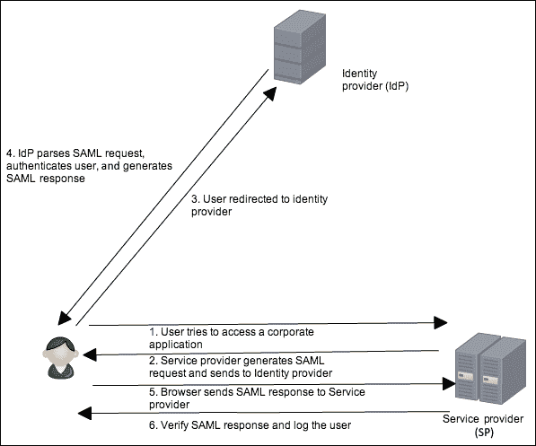
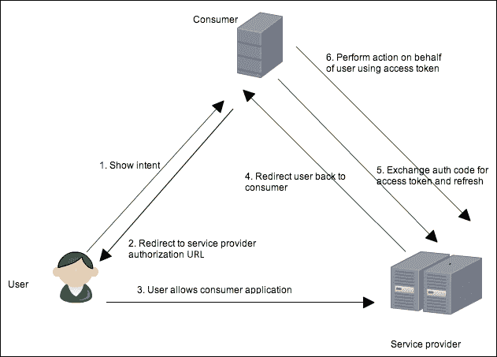
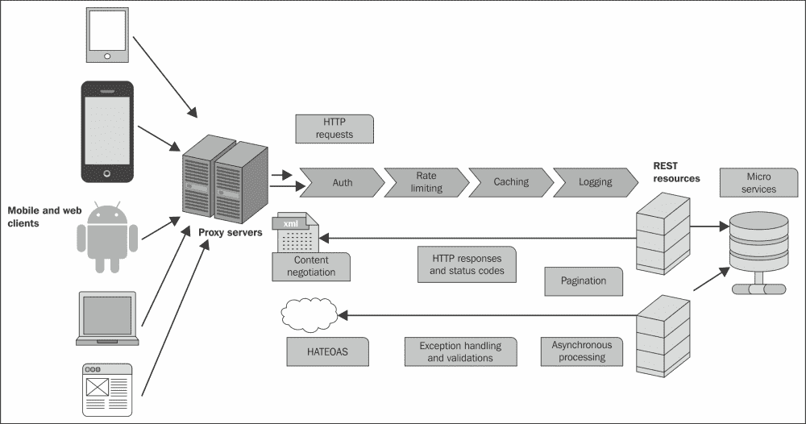

# 第三章：安全性和可追溯性

在开放平台时代，开发人员可以构建应用程序，这些应用程序可以很容易地并快速地与平台的业务周期解耦。这种基于 API 的架构实现了敏捷开发、更容易的采用、普及和规模化，并与企业内外的应用程序集成。应用程序的最重要考虑因素之一是处理安全性。构建应用程序的开发人员不应该关心用户的凭据。此外，还可以有其他客户端使用 REST 服务，包括但不限于浏览器和移动应用程序到其他服务。客户端可以代表其他用户执行操作，并且必须经过授权才能代表他们执行操作，而无需用户共享用户名和密码。这就是 OAuth 2.0 规范的作用所在。

构建分布式应用程序时需要考虑的另一个重要方面是可追溯性，这将涉及记录与请求相关的数据，以进行调试，这些请求在涵盖多个微服务的环境中可能是地理分布的，并且处理成千上万的请求。必须记录对 REST 资源的请求和状态代码，以帮助调试生产中的问题，并且还可以作为审计跟踪。本章将涵盖 REST 编程模型中安全性和可追溯性的高级细节。涵盖的主题如下：

+   记录 REST API

+   RESTful 服务的异常处理

+   验证模式

+   联合身份

+   SAML 2.0

+   OAuth 2.0

+   OpenID Connect

本章将总结构建可扩展、高性能的 RESTful 服务所需的各种构建块。

# 记录 REST API

复杂的分布式应用程序可能会引入许多故障点。问题很难找到和修复，因此延迟了事件响应并造成了昂贵的升级。应用程序开发人员和管理员可能无法直接访问他们所需的机器数据。

记录是构建 RESTful 服务的一个非常重要的方面，特别是在调试运行各种微服务的分布式节点中出现生产问题的情况下。它有助于链接构成应用程序或业务服务的各个组件之间的事件或事务。完整的日志序列可以帮助重现在生产系统中发生的事件过程。此外，日志还可以帮助索引、聚合、切片数据、分析请求模式，并提供大量潜在有用的信息。

以下代码涵盖了如何编写一个简单的日志记录过滤器，可以与 REST 资源集成。该过滤器将记录与请求相关的数据，如时间戳、查询字符串和输入：

```java
@WebFilter(filterName = "LoggingFilter",
        urlPatterns = {"/*"}
)
public class LoggingFilter implements Filter {
    static final Logger logger = Logger.getLogger(LoggingFilter.class);
    @Override
    public void doFilter(ServletRequest servletRequest, ServletResponse servletResponse,
            FilterChain filterChain) throws IOException, ServletException {

        HttpServletRequest httpServletRequest = (HttpServletRequest) servletRequest;

logger.info("request" +httpServletRequest.getPathInfo().toString());
        filterChain.doFilter(servletRequest, servletResponse);

    }
```

`LoggingFilter`类是一个简单的过滤器，实现了`javax.servlet.Filter`接口。记录器将记录所有带有请求路径和输入的消息。示例使用 Apache Log4j 设置日志记录。

### 注意

有关 Apache Log4J 的更多详细信息，请查看[`logging.apache.org/log4j/2.x/`](http://logging.apache.org/log4j/2.x/)。

然后可以从分布式日志服务器应用程序（例如 Splunk ([`www.splunk.com/`](http://www.splunk.com/)）中收集和挖掘这些日志，这可以为开发人员提供有关生产中故障或性能问题的信息和根本原因分析。在我们的咖啡店类比中，一个例子是处理咖啡订单时出现问题。如果请求细节被记录在 Splunk 等分布式日志服务器应用程序中，开发人员可以根据时间查询，并查看客户端尝试发送的内容以及请求失败的原因。

下一节将涵盖许多在记录 REST API 时要牢记的最佳实践。

## 记录 REST API 的最佳实践

在大规模分布式环境中，日志数据可能是开发人员用于调试问题的唯一信息。如果审计和日志记录做得好，可以极大地帮助解决此类生产问题，并重放出问题发生前的步骤序列。以下部分列出了一些用于理解系统行为和性能等问题的日志记录最佳实践。

### 在服务日志中包括详细的一致模式

记录模式至少应包括以下内容是一个良好的实践：

+   日期和当前时间

+   记录级别

+   线程的名称

+   简单的记录器名称

+   详细的消息

### 混淆敏感数据

在生产日志中掩盖或混淆敏感数据非常重要，以保护泄露机密和关键客户信息的风险。密码混淆器可以在日志过滤器中使用，它将从日志中掩盖密码、信用卡号等。**个人可识别信息**（**PII**是指可以单独使用或与其他信息一起用于识别个人的信息。PII 的例子可以是一个人的姓名、电子邮件、信用卡号等。表示 PII 的数据应该使用各种技术进行掩盖，如替换、洗牌、加密等技术。

### 注意

更多详情，请查看[`en.wikipedia.org/wiki/Data_masking`](http://en.wikipedia.org/wiki/Data_masking)。

### 识别调用者或发起者作为日志的一部分

在日志中标识调用者是一个良好的实践。API 可能被各种客户端调用，例如移动端、Web 端或其他服务。添加一种方式来识别调用者可能有助于调试问题，以防问题特定于某个客户端。

### 默认情况下不记录有效负载

具有可配置选项以记录有效负载，以便默认情况下不记录任何有效负载。这将确保对于处理敏感数据的资源，在默认情况下不会记录有效负载。

### 识别与请求相关的元信息

每个请求都应该有一些关于执行请求所花费的时间、请求的状态和请求的大小的细节。这将有助于识别延迟问题以及可能出现的大消息的其他性能问题。

### 将日志系统与监控系统绑定

确保日志中的数据也可以与监控系统绑定，后者可以在后台收集与 SLA 指标和其他统计数据相关的数据。

### 注意

**各种平台上分布式环境中日志框架的案例研究**

Facebook 开发了一个名为 Scribe 的自制解决方案，它是一个用于聚合流式日志数据的服务器。它可以处理全球分布的服务器每天大量的请求。服务器发送数据，可以进行处理、诊断、索引、汇总或聚合。Scribe 被设计为可以扩展到非常大量的节点。它被设计为能够经受住网络和节点故障的考验。系统中的每个节点都运行着一个 scribe 服务器。它被配置为聚合消息，并将它们发送到一个更大的组中的中央 scribe 服务器。如果中央 scribe 服务器宕机，消息将被写入本地磁盘上的文件，并在中央服务器恢复时发送。更多详情，请查看[`github.com/facebookarchive/scribe`](https://github.com/facebookarchive/scribe)。

Dapper 是谷歌的跟踪系统，它从成千上万的请求中采样数据，并提供足够的信息来跟踪数据。跟踪数据被收集在本地日志文件中，然后被拉入谷歌的 BigTable 数据库。谷歌发现对于常见情况采样足够的信息可以帮助跟踪细节。更多详情，请查看[`research.google.com/pubs/pub36356.html`](http://research.google.com/pubs/pub36356.html)。

接下来的部分将介绍如何验证 REST API 请求和/或响应实体。

# 验证 RESTful 服务

在暴露 REST 或基于 HTTP 的服务 API 时，验证 API 的行为是否正确以及暴露的数据格式是否按预期结构化是很重要的。例如，验证 RESTful 服务的输入，例如作为请求体发送的电子邮件，必须符合标准，负载中必须存在某些值，邮政编码必须遵循特定格式等。这可以通过 RESTful 服务的验证来完成。

JAX-RS 支持 Bean 验证来验证 JAX-RS 资源类。这种支持包括：

+   向资源方法参数添加约束注释

+   确保在将实体作为参数传递时实体数据有效

以下是包含`@Valid`注释的`CoffeesResource`类的代码片段：

```java
    @POST
    @Consumes(MediaType.APPLICATION_JSON)
    @Produces(MediaType.APPLICATION_JSON)
    @ValidateOnExecution
    public Response addCoffee(@Valid Coffee coffee) {
        …
            }
```

`javax.validation.executable.ValidateOnExecution`注释可以帮助指定哪个方法或构造函数应在执行时验证其参数和返回值。请求体上的`javax.validation.Valid`注释将确保`Coffee`对象将符合 POJO 中指定的规则。

以下是`Coffee` POJO 的代码片段：

```java
@XmlRootElement
public class Coffee {

    @VerifyValue(Type.class)
    private String type;

    @VerifyValue(Size.class)
    private String size;

    @NotNull
    private String name;
    // getters and setters
}
```

字段名具有`javax.validation.constrains.NotNull`注释，强制要求订单中的咖啡名称不能为空。同样，我们在示例中定义了自定义注释，它将验证类型和大小，并检查请求体中的值是否遵循正确的格式。

例如，`Size`可以是以下值之一：`Small`，`Medium`，`Large`或`ExtraLarge`：

```java
public enum Size {
    Small("S"), Medium("M"), Large("L"), ExtraLarge("XL");
    private String value;
}
```

`@VerifyValue(Size.class)`注释是在可下载示例中定义的自定义注释。

## 验证异常处理和响应代码

以下表格提供了在抛出各种与验证相关的异常时返回的响应代码的快速摘要。错误代码的类型取决于抛出的异常以及验证是在 HTTP 方法的请求还是响应上执行的。

| 返回的 HTTP 响应代码 | 异常类型 |
| --- | --- |
| `500 内部服务器错误` | 当验证方法返回类型时抛出`javax.validation.ValidationException`或`ValidationException`的任何子类，包括`ConstraintValidationException`时返回此错误代码 |
| `400 错误` | 当在验证方法中抛出`ConstraintViolationException`以及所有其他情况时 |

接下来的部分涵盖了 API 开发人员如何抛出特定于应用程序的异常，并根据异常映射 HTTP 错误代码。

# RESTful 服务的错误处理

在构建 RESTful API 时，需要抛出特定于应用程序的异常，并提供包含这些异常详细信息的特定 HTTP 响应。接下来的部分将介绍如何处理用户定义的异常并将它们映射到 HTTP 响应和状态代码。`javax.ws.rs.ext.ExceptionMapper`类是自定义的、应用程序提供的组件，它捕获抛出的应用程序异常并编写特定的 HTTP 响应。异常映射器类使用`@Provider`注释进行标注。

以下代码片段显示了如何构建自定义异常映射器：

```java
    @GET
    @Produces(MediaType.APPLICATION_JSON)
    @Path("/orders/{id}")
    public Response getCoffee(@PathParam("id") int id) {
        Coffee coffee =  CoffeeService.getCoffee(id);
        if (coffee == null)
            throw new CoffeeNotFoundException("No coffee found for order " + id);
        return Response.ok(coffee).type(MediaType.APPLICATION_JSON_TYPE).build();
    }
```

如前面的代码片段所示，`getCoffees()`方法返回一个带有指定路径参数的`Coffee`对象。如果找不到指定 ID 的咖啡，则代码会抛出`CoffeeNotFoundException`。

以下是`ExceptionMapper`类实现的代码：

```java
@Provider
public class MyExceptionMapper implements ExceptionMapper<Exception> {

    public Response toResponse(Exception e) {
        ResourceError resourceError = new ResourceError();

        String error = "Service encountered an internal error";
        if (e instanceof CoffeeNotFoundException) {
            resourceError.setCode(Response.Status.NOT_FOUND.getStatusCode());
            resourceError.setMessage(e.getMessage());

            return Response.status(Response.Status.NOT_FOUND).entity(resourceError)
                    .type(MediaType.APPLICATION_JSON_TYPE)
                    .build();
        }
        return Response.status(503).entity(resourceError).type(MediaType.APPLICATION_JSON_TYPE)
                .build();
    }
}
```

前面的代码显示了`ExceptionMapper`的实现，其`toResponse()`方法已被覆盖。代码检查抛出的异常是否是`CoffeeNotFoundException`的实例，然后返回一个实体类型为`ResourceError`的响应。

`ResourceError`类是一个使用`@XMLRootElement`注释的 POJO，并作为响应的一部分发送：

```java
@XmlRootElement
public class ResourceError {

    private int code;
    private String message;
    //getters and setters
…}
```

您可以将示例作为可下载包的一部分运行，输出如下：

```java
HTTP/1.1 404 Not Found
X-Powered-By: Servlet/3.1 JSP/2.3 (GlassFish Server Open Source Edition  4.0  Java/Oracle Corporation/1.7)
Server: GlassFish Server Open Source Edition 4.0
Content-Type: application/json
Content-Length: 54

{"code":404,"message":"No coffee found for order 100"}
```

# 认证和授权

过去，组织需要一种方式来统一企业用户的身份验证。单点登录是一个解决方案，可以在企业的不同应用程序中保持一个用户名和密码的存储库。

随着面向服务的架构的发展，组织需要一种方式，使合作伙伴和其他服务可以使用 API，并且需要一种简化各种应用程序和平台之间登录过程的方式。随着社交媒体的发展，各种平台开放，API 和生态系统建立了大量应用程序和大量设备使用 Twitter、Facebook 和 LinkedIn 等平台。

因此，将认证和授权功能与消费应用程序解耦变得越来越重要。此外，并非每个应用程序都必须知道用户的凭据。接下来的部分将涵盖 SAML 2.0 和 OAuth 2.0，作为简化登录和增加安全性的联合身份的一部分。

子节将枚举以下主题：

+   SAML

+   OAuth

+   刷新令牌与访问令牌

+   Jersey 和 OAuth 2.0

+   何时使用 SAML 或 OAuth？

+   OpenID Connect

## 什么是认证？

认证是建立和传达操作浏览器或本机应用程序的人是他/她声称的人的过程。

### SAML

**安全断言标记语言**（**SAML**）是一个标准，包括配置文件、绑定和构造，以实现**单点登录**（**SSO**）、联合和身份管理。

SAML 2.0 规范提供了 Web 浏览器 SSO 配置文件，定义了如何实现 Web 应用程序的单点登录。它定义了三个角色：

+   **主体**：这通常是用户想要验证自己的身份的地方

+   **身份提供者**（**IdP**）：这是能够验证最终用户身份的实体

+   **服务提供者**（**SP**）：这是希望使用身份提供者验证最终用户身份的实体

以下流程显示了 SAML 的一个简单示例。比如，员工想要访问企业旅行网站。企业旅行应用程序将请求与员工关联的身份提供者来验证他的身份，然后为他采取行动。



流程解释如下：

1.  用户访问企业应用程序，比如旅行应用程序。

1.  旅行应用程序将生成一个 SAML 请求，并将用户重定向到雇主的**身份提供者**（**IdP**）。

1.  用户被重定向到雇主的身份提供者以获取 SAML 认证断言。

1.  IdP 解析 SAML 请求，对用户进行身份验证，并生成 SAML 响应。

1.  浏览器将 SAML 响应发送到旅行应用程序。

1.  收到访问令牌后，企业旅行应用程序随后能够通过在 HTTP 请求的标头中传递令牌来访问 Web 资源。访问令牌充当一个会话令牌，封装了旅行应用程序代表用户的事实。

SAML 具有用于 Web 浏览器、SSO、SOAP 和 WS-Security 的绑定规范，但没有正式的 REST API 绑定。

下一节涵盖了 OAuth，这已被 Twitter、Facebook 和 Google 等平台广泛使用于授权。

## 什么是授权？

授权是检查请求者是否有权限执行所请求操作的过程。

### OAuth

OAuth 代表**开放授权**，为用户授权应用程序访问其与账户相关的数据提供了一种方式，而不需要提供用户名和密码。

在客户端/服务器身份验证中，客户端使用其凭据访问服务器上的资源。服务器不在乎请求是来自客户端还是客户端是否为其他实体请求资源。实体可以是另一个应用程序或另一个人，因此客户端不是在访问自己的资源，而是在访问另一个用户的资源。请求访问受保护且需要身份验证的资源的任何人都必须得到资源所有者的授权。OAuth 是一种打开 Twitter、Facebook、Google+、GitHub 等公司的 REST API 以及建立在其之上的众多第三方应用程序的方法。OAuth 2.0 完全依赖于 SSL。

OAuth 请求中的步数指涉及的参与方数量。客户端、服务器和资源所有者都参与的流程表示 3-legged OAuth。当客户端代表自己行事时，它被称为 2-legged OAuth。

OAuth 通过访问令牌实现此功能。访问令牌就像提供有限功能的代客泊车钥匙，可以在有限的时间内访问。令牌的寿命有限，从几小时到几天不等。以下图表显示了 OAuth 的流程：



上述图表显示了授权代码授予流程。

在这个例子中，用户在服务提供商网站上有他的照片，比如 Flickr。现在，用户需要调用打印服务来打印他的照片，例如 Snapfish，这是一个消费者应用程序。用户可以使用 OAuth 允许打印服务在有限的时间内访问他的照片，而不是将他的用户名和密码分享给消费者应用程序。

因此，在我们的示例中，有三个角色，如下所述：

+   **用户或资源所有者**：用户是希望打印他的照片的资源所有者

+   **消费者应用程序或客户端**：这是打印服务应用程序，将代表用户行事

+   **服务提供商或服务器**：服务提供商是将存储用户照片的资源服务器

有了这个例子，我们可以看到 OAuth 舞蹈中涉及的步骤：

1.  用户希望允许应用程序代表他执行任务。在我们的例子中，任务是打印照片，这些照片在服务器上使用消费者应用程序。

1.  消费者应用程序将用户重定向到服务提供商的授权 URL。

在这里，提供者显示一个网页，询问用户是否可以授予应用程序读取和更新其数据的访问权限。

1.  用户同意通过打印服务消费者应用程序授予应用程序访问权限。

1.  服务提供商将用户重定向回应用程序（通过重定向 URI），将授权代码作为参数传递。

1.  应用程序将授权代码交换为访问授权。服务提供商向应用程序发放访问授权。授权包括访问令牌和刷新令牌。

1.  现在连接建立，消费者应用程序现在可以获取对服务 API 的引用，并代表用户调用提供者。因此，打印服务现在可以从服务提供商的网站访问用户的照片。

### 注意

OAuth 的优势在于，由于使用访问令牌而不是实际凭据，受损的应用程序不会造成太多混乱。 SAML 承载流实际上与之前介绍的经典 OAuth 3-leg 流非常相似。但是，与将用户的浏览器重定向到授权服务器不同，服务提供商与身份提供商合作以获得简单的身份验证断言。服务提供商应用程序为用户交换 SAML 承载断言，而不是交换授权代码。

## OAuth 2.0 和 OAuth 1.0 之间的区别

OAuth 2.0 规范清楚地阐述了如何完全在浏览器中使用 JavaScript 使用 OAuth，而没有安全地存储令牌的方法。这还在高层次上解释了如何在手机上或甚至在根本没有网络浏览器的设备上使用 OAuth，涵盖了对智能手机和传统计算设备上的*应用程序*和*本机应用程序*的交互，以及网站。

OAuth 2.0 定义了以下三种类型的配置文件：

+   Web 应用程序（在这种情况下，客户端密码存储在服务器上，并且使用访问令牌。）

+   Web 浏览器客户端（在这种情况下，不信任 OAuth 凭据；一些提供商不会发布客户端密钥。一个例子是浏览器中的 JavaScript。）

+   本机应用程序（在这种情况下，生成的访问令牌或刷新令牌可以提供可接受的保护级别。一个例子包括移动应用程序。）

OAuth 2.0 不需要加密，使用的是 HTTPS 而不是 HMAC。此外，OAuth 2.0 允许限制访问令牌的生命周期。

### 授权授予

授权授予是代表资源所有者或用户授权的凭据，允许客户端访问其受保护的资源以获取访问令牌。OAuth 2.0 规范定义了四种授权类型，如下所示：

+   授权码授予

+   隐式授予

+   资源所有者密码凭据授予

+   客户端凭据授予

此外，OAuth 2.0 还定义了用于定义其他类型的可扩展机制。

## 刷新令牌与访问令牌

刷新令牌是用于获取访问令牌的凭据。当当前访问令牌无效或过期时，刷新令牌用于获取访问令牌。发放刷新令牌是服务器自行决定的可选项。

与访问令牌不同，刷新令牌仅用于与授权服务器一起使用，永远不会发送到资源服务器以访问资源。

### Jersey 和 OAuth 2.0

尽管 OAuth 2.0 被各个企业广泛使用，但 OAuth 2.0 RFC 是在其基础上构建解决方案的框架。在 RFC 中有许多灰色地带，规范留给实施者。在没有必需的令牌类型、令牌过期协议或令牌大小的具体指导的领域存在犹豫。

### 注意

阅读此页面以获取更多详细信息：

[`hueniverse.com/2012/07/26/oauth-2-0-and-the-road-to-hell/`](http://hueniverse.com/2012/07/26/oauth-2-0-and-the-road-to-hell/)

目前，Jersey 对 OAuth 2.0 的支持仅限于客户端。OAuth 2.0 规范定义了许多扩展点，由服务提供商来实现这些细节。此外，OAuth 2.0 定义了多个授权流程。授权码授予流程是 Jersey 目前支持的流程，其他流程都不受支持。有关更多详细信息，请查看[`jersey.java.net/documentation/latest/security.html`](https://jersey.java.net/documentation/latest/security.html)。

## REST API 中 OAuth 的最佳实践

以下部分列出了服务提供商实施 OAuth 2.0 可以遵循的一些最佳实践。

### 限制访问令牌的生命周期

协议参数`expires_in`允许授权服务器限制访问令牌的生命周期，并将此信息传递给客户端。此机制可用于发行短期令牌。

### 支持在授权服务器中提供刷新令牌

刷新令牌可以与短期访问令牌一起发送，以授予对资源的更长时间访问，而无需涉及用户授权。这提供了一个优势，即资源服务器和授权服务器可能不是同一实体。例如，在分布式环境中，刷新令牌总是在授权服务器上交换。

### 使用 SSL 和加密

OAuth 2.0 严重依赖于 HTTPS。这将使框架更简单但不太安全。

以下表格提供了何时使用 SAML 和何时使用 OAuth 的快速摘要。

| 场景 | SAML | OAuth |
| --- | --- | --- |
| 如果参与方之一是企业 | 使用 SAML |   |
| 如果应用程序需要为某些资源提供临时访问权限 |   | 使用 OAuth |
| 如果应用程序需要自定义身份提供者 | 使用 SAML |   |
| 如果应用程序有移动设备访问 |   | 使用 OAuth |
| 如果应用程序对传输没有限制，例如 SOAP 和 JMS | 使用 SAML |   |

## OpenID Connect

OpenID 基金会正在进行 OpenID Connect 的工作。OpenID Connect 是建立在 OAuth 2.0 之上的简单的基于 REST 和 JSON 的可互操作协议。它比 SAML 更简单，易于维护，并覆盖了从社交网络到商业应用程序再到高度安全的政府应用程序的各种安全级别。OpenID Connect 和 OAuth 是身份验证和授权的未来。有关更多详细信息，请访问[`openid.net/connect/`](http://openid.net/connect/)。

### 注意

**使用 OAuth 2.0 和 OpenID Connect 的公司案例**

Google+登录是建立在 OAuth 2.0 和 OpenID Connect 协议之上的。它支持空中安装、社交功能，并在标准化的 OpenID Connect 登录流程之上提供登录小部件。

接下来的部分将总结到目前为止我们在构建 RESTful 服务时涵盖的各种组件。

# REST 架构组件

接下来的部分将涵盖在构建 RESTful API 时必须考虑的各种组件。所有这些将在本书的各个部分中进行介绍。我们还将介绍在设计和开发 REST API 时要避免的各种陷阱的最佳实践。REST 架构组件如下图所示：



从上图中可以看到，REST 服务可以从各种客户端和运行在不同平台和设备上的应用程序中消耗，例如移动设备和 Web 浏览器。

这些请求通过代理服务器发送。如前图所示，可以将图中的 REST 架构组件链接在一起。例如，可以有一个过滤器链，包括**Auth**、**速率限制**、**缓存**和**日志记录**相关的过滤器。这将负责对用户进行身份验证，检查来自客户端的请求是否在速率限制内，然后是一个缓存过滤器，可以检查请求是否可以从缓存中提供。接下来是一个日志记录过滤器，可以记录请求的详细信息。

在响应端，可以进行**分页**，以确保服务器发送结果的子集。此外，服务器可以进行**异步处理**，从而提高响应能力和规模。响应中可以包含链接，处理 HATEOAS。

这些是我们迄今为止涵盖的一些 REST 架构组件：

+   使用 HTTP 请求使用 HTTP 动词来使用 REST API 进行统一接口约束

+   内容协商，在存在多个表示可用时选择响应的表示

+   日志记录以提供可追溯性以分析和调试问题

+   异常处理以使用 HTTP 代码发送特定于应用程序的异常

+   使用 OAuth 2.0 进行身份验证和授权，以便为其他应用程序提供访问控制，并在用户无需发送其凭据的情况下执行操作

+   验证以向客户端发送详细的带有错误代码的消息，以及对请求中收到的输入进行验证

接下来的几章将重点介绍高级主题以及以下模块的最佳实践。我们将提供代码片段，以展示如何使用 JAX-RS 实现这些功能。

+   速率限制以确保服务器不会因来自单个客户端的太多请求而负担过重

+   缓存以提高应用程序的响应能力

+   异步处理，使服务器可以异步地向客户端发送响应

+   微服务将单片服务分解为细粒度服务

+   HATEOAS 通过在响应中返回链接列表来改善可用性、可理解性和可导航性

+   分页，允许客户端指定感兴趣的数据集中的项目

我们还将介绍主要平台，如 Facebook、Google、GitHub 和 PayPal 是如何在其 REST API 中采用这些解决方案的。

# 推荐阅读

以下链接可能对获取与本章主题相关的额外信息有用：

+   [`developers.google.com/oauthplayground/`](https://developers.google.com/oauthplayground/)：Google OAuth playground 用于创建和测试签名请求

+   [`hueniverse.com/2012/07/26/oauth-2-0-and-the-road-to-hell/`](http://hueniverse.com/2012/07/26/oauth-2-0-and-the-road-to-hell/)：OAuth 2.0 和通往地狱之路

+   [`developers.google.com/accounts/docs/OAuth2Login`](https://developers.google.com/accounts/docs/OAuth2Login)：Google 账户身份验证和授权

+   [`github.com/facebookarchive/scribe`](https://github.com/facebookarchive/scribe)：Facebook 的 Scribe 日志服务器

+   [`static.googleusercontent.com/media/research.google.com/en/us/pubs/archive/36356.pdf`](http://static.googleusercontent.com/media/research.google.com/en/us/pubs/archive/36356.pdf)：Google Dapper 大规模分布式跟踪架构

# 总结

本章以对记录 RESTful API 进行简要介绍开始，关键原则是认识到记录请求的重要性以及记录的最佳实践，包括安全合规性。我们学习了如何使用 Bean Validation 验证 JAX-RS 2.0 资源。在本章中，我们还看到了如何为特定应用程序情况编写通用异常映射器。

我们讨论了联合身份在当前互联混合系统、协议和设备时代的必要性。我们讨论了 SAML 和 OAuth 2.0 之间的相似之处，以及 3-legged OAuth 和 OAuth 的最佳实践。

下一章将介绍诸如缓存模式和异步 REST API 以提高性能和可伸缩性，然后更详细地了解如何使用 HTTP Patch 和更新 JSON Patch 执行部分更新。
