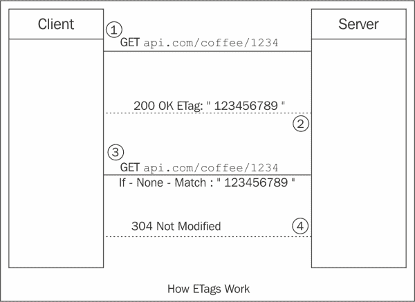
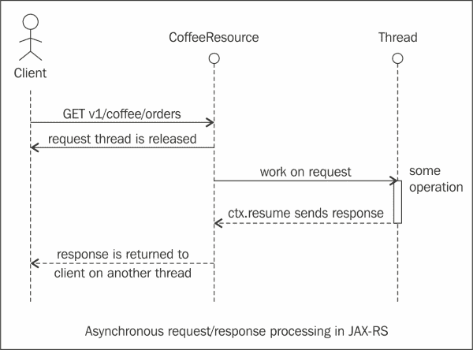

# 第四章：性能设计

REST 是一种符合 Web 架构设计的架构风格，需要正确设计和实现，以便利用可扩展的 Web。本章涵盖了与性能相关的高级设计原则，每个开发人员在构建 RESTful 服务时都必须了解。

本章涵盖的主题包括以下内容：

+   缓存原则

+   REST 中的异步和长时间运行的作业

+   HTTP PATCH 和部分更新

我们将详细介绍不同的 HTTP 缓存头，并学习如何发送条件请求，以查看新内容或缓存内容是否需要返回。然后，我们将展示如何使用 JAX-RS 来实现缓存。

此外，我们将介绍 Facebook API 如何使用 ETags 进行缓存。接下来，我们将介绍如何使用 JAX-RS 进行异步请求响应处理以及最佳实践。最后，我们将介绍 HTTP PATCH 方法，并学习如何实现部分更新以及部分更新的常见实践。

本章包含了不同的代码片段，但展示这些片段在实际中的完整示例包含在本书的源代码下载包中。

# 缓存原则

在本节中，我们将介绍设计 RESTful 服务时涉及的不同编程原则。我们将涵盖的一个领域是缓存。缓存涉及将与请求相关的响应信息存储在临时存储中，以特定时间段内。这确保了服务器在未来不需要处理这些请求时，可以从缓存中满足响应。

缓存条目可以在特定时间间隔后失效。缓存条目也可以在缓存中的对象发生变化时失效，例如，当某个 API 修改或删除资源时。

缓存有许多好处。缓存有助于减少延迟并提高应用程序的响应速度。它有助于减少服务器需要处理的请求数量，因此服务器能够处理更多的请求，客户端将更快地获得响应。

通常，诸如图像、JavaScript 文件和样式表等资源都可以被相当大地缓存。此外，建议缓存可能需要在后端进行密集计算的响应。

## 缓存细节

接下来的部分涵盖了与缓存相关的主题。使缓存有效工作的关键是使用 HTTP 缓存头，指定资源的有效时间以及上次更改的时间。

## 缓存头的类型

下一节将介绍缓存头的类型，然后是每种缓存头的示例。以下是头部的类型：

+   强缓存头

+   弱缓存头

### 强缓存头

强缓存头指定了缓存资源的有效时间，浏览器在此期间不需要发送任何更多的`GET`请求。`Expires`和`Cache-Control max-age`是强缓存头。

### 弱缓存头

弱缓存头帮助浏览器决定是否需要通过发出条件`GET`请求从缓存中获取项目。`Last-Modified`和`ETag`是弱缓存头的示例。

### Expires 和 Cache-Control - max-age

`Expires`和`Cache-Control`头指定了浏览器可以在不检查更新版本的情况下使用缓存资源的时间段。如果设置了这些头部，直到到期日期或达到最大年龄为止，新资源将不会被获取。`Expires`头部接受一个日期，指定资源失效的时间。而`max-age`属性则指定资源在下载后的有效时间。

## 缓存控制头和指令

在**HTTP 1.1**中，`Cache-Control`头指定了资源的缓存行为以及资源可以被缓存的最大年龄。以下表格显示了`Cache-Control`头的不同指令：

| 指令 | 意义 |
| --- | --- |
| `private` | 当使用此指令时，浏览器可以缓存对象，但代理和内容交付网络不能 |
| `public` | 当使用此指令时，浏览器、代理和内容交付网络可以缓存对象 |
| `no-cache` | 当使用此指令时，对象将不被缓存 |
| `no-store` | 当使用此选项时，对象可以被缓存在内存中，但不应存储在磁盘上 |
| `max-age` | 表示资源有效的时间 |

以下是带有`Cache-Control HTTP/1.1`头的响应的示例：

```java
HTTP/1.1 200 OK Content-Type: application/json
Cache-Control: private, max-age=86400
Last-Modified: Thur, 01 Apr 2014 11:30 PST
```

前面的响应具有`Cache-Control`头，指令为`private`，`max-age`设置为 24 小时或 86400 秒。

一旦资源基于`max-age`或`Expires`头无效，客户端可以再次请求资源或发送条件`GET`请求，只有在资源发生更改时才获取资源。这可以通过较弱的缓存头来实现：如下一节所示的`Last-Modified`和 ETag 头。

### Last-Modified 和 ETag

这些头使浏览器能够检查资源自上次`GET`请求以来是否发生了更改。在`Last-Modified`头中，有一个与资源修改相关的日期。在 ETag 头中，可以有任何唯一标识资源的值（如哈希）。然而，这些头允许浏览器通过发出条件`GET`请求有效地更新其缓存资源。条件`GET`请求只有在服务器上的资源发生更改时才会返回完整的响应。这确保条件`GET`请求的延迟低于完整的`GET`请求。

## Cache-Control 头和 REST API

以下代码显示了如何向 JAX-RS 响应添加`Cache-Control`头。该示例可作为本书可下载源代码包的一部分。

```java
@Path("v1/coffees")
public class CoffeesResource {

    @GET
    @Path("{order}")
    @Produces(MediaType.APPLICATION_XML)
    @NotNull(message = "Coffee does not exist for the order id requested")
    public Response getCoffee(@PathParam("order") int order) {
        Coffee coffee = CoffeeService.getCoffee(order);
        CacheControl cacheControl = new CacheControl();
        cacheControl.setMaxAge(3600);
        cacheControl.setPrivate(true);
        Response.ResponseBuilder responseBuilder = Response.ok(coffee);
        responseBuilder.cacheControl(cacheControl);
        return responseBuilder.build();

    }
```

JAX-RS 有一个`javax.ws.rs.core.Cache-Control`类，它是`HTTP/1.1 Cache-Control`头的抽象。`cacheControl`对象上的`setMaxAge()`方法对应于`max-age`指令，`setPrivate(true)`对应于`private`指令。响应是使用`responseBuilder.build()`方法构建的。`cacheControl`对象被添加到`getCoffee()`方法返回的`Response`对象中。

以下是此应用程序生成的带有头的响应：

```java
curl -i http://localhost:8080/caching/v1/coffees/1
HTTP/1.1 200 OK
X-Powered-By: Servlet/3.1 JSP/2.3 (GlassFish Server Open Source Edition  4.0  Java/Oracle Corporation/1.7)
Server: GlassFish Server Open Source Edition  4.0 
Cache-Control: private, no-transform, max-age=3600
Content-Type: application/xml
Date: Thu, 03 Apr 2014 06:07:14 GMT
Content-Length: 143

<?xml version="1.0" encoding="UTF-8" standalone="yes"?>
<coffee>
<name>Mocha</name>
<order>1</order>
<size>Small</size>
<type>Chocolate</type>
</coffee>
```

## ETags

HTTP 定义了一个强大的缓存机制，其中包括以下头部： 

+   `ETag`头

+   `If-Modified-Since`头

+   `304 Not Modified`响应代码

#### ETags 工作原理

以下部分深入介绍了 ETags 的一些基础知识。以下图表更好地展示了这一点：



让我们来看看与 ETags 相关的每个过程：

1.  客户端向[`api.com/coffee/1234`](http://api.com/coffee/1234) REST 资源发送一个`GET`请求。

1.  服务器发送一个带有**ETag**值的**200 OK**，例如，"**123456789"**。

1.  过一段时间，客户端发送另一个带有`If-None-Match: "123456789"`头的`GET`请求到[api.com/coffee/1234](http://api.com/coffee/1234) REST 资源。

1.  服务器检查资源的 MD5 哈希是否未被修改，然后发送一个没有响应主体的`304 Not-Modified`响应。

如果资源已更改，将发送 200 OK 作为响应。此外，作为响应的一部分，服务器还发送了一个新的 ETag。

### ETag 头和 REST API

以下代码显示了如何向 JAX-RS 响应添加`ETag`头：

```java
    @GET
    @Path("/etag/{order}")
    @Produces(MediaType.APPLICATION_JSON)
    @NotNull(message = "Coffee does not exist for the order id requested")
    public Response getCoffeeWithEtag(@PathParam("order") int order,
                                      @Context Request request
    ) {
        Coffee coffee = CoffeeService.getCoffee(order);
        EntityTag et = new EntityTag(
 "123456789");
        Response.ResponseBuilder responseBuilder  = request.evaluatePreconditions(et);
        if (responseBuilder != null) {
            responseBuilder.build();
        }
        responseBuilder = Response.ok(coffee);
        return responseBuilder.tag(et).build();
```

在上述代码片段中，使用资源的哈希创建了`javax.ws.core.EntityTag`对象的实例，为简单起见，我们使用了"123456789"。

`request,evalautePreconditions` 方法检查 `EntityTag et` 对象的值。如果满足先决条件，它将返回一个带有 `200 OK` 的响应。

然后，`EntityTag` 对象 `et` 与响应一起发送，该响应由 `getCoffeeWithETag` 方法返回。有关更多详细信息，请参考书籍源代码包中提供的示例。

### ETags 的类型

强验证 ETag 匹配表示两个资源的内容是逐字节相同的，并且所有其他实体字段（例如 Content-Language）也没有更改。

弱验证 ETag 匹配仅表示两个资源在语义上是等价的，并且可以使用缓存的副本。

缓存有助于减少客户端发出的请求次数。它还有助于通过条件 `GET` 请求和 ETags、`IF-None-Match` 头和 `304-Not Modified` 响应来减少完整响应的数量，从而节省带宽和计算时间。

### 提示

在 HTTP 响应中指定 `Expires` 或 `Cache-Control max-age` 以及两者中的一个 `Last-Modified` 和 ETag 头是一个很好的做法。同时发送 `Expires` 和 `Cache-Control max-age` 是多余的。同样，发送 `Last-Modified` 和 ETag 也是多余的。

## Facebook REST API 和 ETags

Facebook 营销 API 支持 Graph API 上的 ETags。当消费者进行 Graph API 调用时，响应头包括一个 ETag，其值是在 API 调用返回的数据的哈希值。下次消费者进行相同的 API 调用时，他可以在请求头中包含从第一步保存的 ETag 值的 `If-None-Match` 请求头。如果数据没有更改，响应状态码将是 `304 - Not Modified`，并且不返回数据。

如果服务器端的数据自上次查询以来发生了变化，则数据将像往常一样返回，并附带一个新的 ETag。这个新的 ETag 值可以用于后续调用。有关更多详细信息，请查看 [`developers.facebook.com`](http://developers.facebook.com)。

### RESTEasy 和缓存

RESTEasy 是 JBoss 项目，提供各种框架来帮助构建 RESTful web 服务和 RESTful Java 应用程序。RESTEasy 可以在任何 servlet 容器中运行，但与 JBoss 应用服务器有更紧密的集成。

RESTEasy 提供了一个 JAX-RS 的扩展，允许在成功的 `GET` 请求上自动设置 `Cache-Control` 头。

它还提供了一个服务器端的本地内存缓存，可以位于 JAX-RS 服务的前面。如果 JAX-RS 资源方法设置了 `Cache-Control` 头，则它会自动缓存来自 HTTP GET JAX-RS 调用的编组响应。

当 `HTTP GET` 请求到达时，RESTEasy 服务器缓存将检查 URI 是否存储在缓存中。如果是，则返回已经编组的响应，而不调用 JAX-RS 方法。

有关更多信息，请查看 [`www.jboss.org/resteasy`](http://www.jboss.org/resteasy)。

### 提示

**在服务器端进行缓存时的提示**

对于 `PUT` 或 `POST` 请求，使缓存条目无效。不要缓存具有查询参数的请求，因为一旦查询参数值发生变化，来自服务器的缓存响应可能无效。

# REST 中的异步和长时间运行的作业

在开发 RESTful API 中的一个常见模式是处理异步和长时间运行的作业。API 开发人员需要创建可能需要相当长时间的资源。他们不能让客户端等待 API 完成。

考虑在咖啡店订购咖啡。订单详细信息存储在队列中，当咖啡师有空时，他会处理您的订单。在那之前，您会收到一张收据确认您的订单，但实际的咖啡稍后到达。

异步资源处理遵循相同的原则。异步资源意味着资源不能立即创建。也许它将被放置在一个处理资源实际创建的任务/消息队列中，或者类似的东西。

考虑以下在我们示例中订购一杯小咖啡的请求：

```java
POST v1/coffees/order HTTP 1.1 with body
<coffee>
  <size> SMALL</coffee>
  <name>EXPRESSO</name>
  <price>3.50</price>
<coffee>
```

响应可以发送回以下内容：

```java
HTTP/1.1 202 Accepted
Location: /order/12345
```

响应发送一个`202 Accepted`头。`Location`头可以提供有关咖啡资源的详细信息。

## 异步请求和响应处理

异步处理包含在 JAX-RS 2.0 的客户端和服务器端 API 中，以促进客户端和服务器组件之间的异步交互。以下列表显示了添加到服务器端和客户端的新接口和类，以支持此功能：

+   服务器端：

+   `AsyncResponse`：这是一个可注入的 JAX-RS 异步响应，提供了异步服务器端响应处理的手段

+   `@Suspended`：`@Suspended`注解指示容器应在辅助线程中进行 HTTP 请求处理

+   `CompletionCallback`：这是一个接收请求处理完成事件的请求处理回调

+   `ConnectionCallback`：这是一个接收与连接相关的异步响应生命周期事件的异步请求处理生命周期回调

+   客户端端：

+   `InvocationCallback`：这是一个可以实现的回调，用于接收调用处理的异步处理事件

+   `Future`：这允许客户端轮询异步操作的完成情况，或者阻塞并等待它

### 注意

Java SE 5 中引入的`Future`接口提供了两种不同的机制来获取异步操作的结果：首先是通过调用`Future.get(…)`变体来阻塞直到结果可用或超时发生，第二种方式是通过调用`isDone()`和`isCancelled()`来检查完成情况，这些是返回`Future`当前状态的布尔方法。有关更多详细信息，请查看[`docs.oracle.com/javase/1.5.0/docs/api/java/util/concurrent/Future.html`](http://docs.oracle.com/javase/1.5.0/docs/api/java/util/concurrent/Future.html)。

以下图表显示了 JAX-RS 中的异步请求/响应处理：



客户端发出对`CoffeeResource`上异步方法的请求。`CoffeeResource`类创建一个新线程，可以进行一些密集的操作，然后发送响应。同时，请求线程被释放，可以处理其他请求。当处理操作的线程完成处理时，将响应返回给客户端。

以下示例代码显示了如何使用 JAX-RS 2.0 API 开发异步资源：

```java
@Path("/coffees")
@Stateless
public class CoffeeResource {   
  @Context private ExecutionContext ctx;
  @GET @Produce("application/json")
  @Asynchronous
  public void order() {
        Executors.newSingleThreadExecutor().submit( new Runnable() {
         public void run() { 
              Thread.sleep(10000);     
              ctx.resume("Hello async world! Coffee Order is 1234");
          } });
ctx.suspend();
return;
  }
}
```

`CoffeesResource`类是一个无状态会话 bean，其中有一个名为`order()`的方法。该方法带有`@Asynchronous`注解，将以“发出并忘记”的方式工作。当客户端通过`order()`方法的资源路径请求资源时，会生成一个新线程来处理准备请求的响应。线程被提交给执行程序执行，处理客户端请求的线程被释放（通过`ctx.suspend`）以处理其他传入的请求。

当为准备响应创建的工作线程完成准备响应时，它调用`ctx.resume`方法，让容器知道响应已准备好发送回客户端。如果在`ctx.suspend`方法之前调用了`ctx.resume`方法（工作线程在执行到达`ctx.suspend`方法之前已准备好结果），则会忽略暂停，并且结果将发送到客户端。

可以使用以下代码片段中显示的`@Suspended`注解来实现相同的功能：

```java
@Path("/coffees")
@Stateless
public class CoffeeResource {
@GET @Produce("application/json")
@Asynchronous
  public void order(@Suspended AsyncResponse ar) {
    final String result = prepareResponse();
    ar.resume(result)
  }
}
```

使用`@Suspended`注解更清晰，因为这不涉及使用`ExecutionContext`变量来指示容器在工作线程完成时暂停然后恢复通信线程，即在这种情况下的`prepareResponse()`方法。消耗异步资源的客户端代码可以使用回调机制或在代码级别进行轮询。以下代码显示了如何通过`Future`接口进行轮询：

```java
Future<Coffee> future = client.target("/coffees")
               .request()
               .async()
               .get(Coffee.class);
try {
   Coffee coffee = future.get(30, TimeUnit.SECONDS);
} catch (TimeoutException ex) {
  System.err.println("Timeout occurred");
}
```

代码从形成对`Coffee`资源的请求开始。它使用`javax.ws.rs.client.Client`实例调用`target()`方法，该方法为`Coffee`资源创建一个`javax.ws.rs.client.WebTarget`实例。`Future.get(…)`方法会阻塞，直到从服务器收到响应或达到 30 秒的超时时间。

另一个用于异步客户端的 API 是使用`javax.ws.rs.client.InvocationCallback`实例，这是一个可以实现以获取调用的异步事件的回调。有关更多详细信息，请查看[`jax-rs-spec.java.net/nonav/2.0/apidocs/javax/ws/rs/client/InvocationCallback.html`](https://jax-rs-spec.java.net/nonav/2.0/apidocs/javax/ws/rs/
client/InvocationCallback.html)。

# 异步资源最佳实践

下一节列出了在处理异步 RESTful 资源时的最佳实践。

## 发送 202 Accepted 消息

对于异步请求/响应，API 应该返回一个`202 Accepted`消息，以表明请求是有效的，资源可能在时间上是可用的，即使只有几秒钟。`202 Accepted`表示请求已被接受处理，资源将很快可用。`202 Accepted`消息应指定`Location`头，客户端可以使用它来知道资源创建后将在哪里可用。如果响应不立即可用，API 不应返回`201 Created`消息。

## 设置队列中对象的过期时间

API 开发人员应该在队列中的一定时间后使对象过期。这样可以确保队列对象不会随着时间的推移而积累，并且会定期清除。

## 使用消息队列来处理任务异步

API 开发人员应考虑使用消息队列来进行异步操作，以便消息被放置在队列中，直到接收者接收到它们。**高级消息队列协议**（**AMQP**）是一种标准，它能够可靠和安全地路由、排队、发布和订阅消息。有关更多详细信息，请查看[`en.wikipedia.org/wiki/Advanced_Message_Queuing_Protocol`](http://en.wikipedia.org/wiki/Advanced_Message_Queuing_Protocol)上的高级消息队列协议。

例如，当调用异步资源方法时，使用消息队列发送消息，并根据消息和事件异步处理不同的任务。

在我们的示例中，如果下订单咖啡，可以使用 RabbitMQ（[`www.rabbitmq.com/`](http://www.rabbitmq.com/)）发送消息来触发`COMPLETED`事件。订单完成后，详细信息可以移至库存系统。

下一节涵盖了 RESTful 服务的另一个重要细节，即进行部分更新。

# HTTP PATCH 和部分更新

API 开发人员常见的问题是实现部分更新。当客户端发送一个请求，必须改变资源状态的一部分时，就会出现这种情况。例如，想象一下，有一个 JSON 表示您的`Coffee`资源的代码片段如下所示：

```java
{
 "id": 1,
 "name": "Mocha"
 "size": "Small",
 "type": "Latte",
 "status":"PROCESSING"
}
```

一旦订单完成，状态需要从`"PROCESSING"`更改为`"COMPLETED"`。

在 RPC 风格的 API 中，可以通过添加以下方法来处理这个问题：

```java
GET myservice/rpc/coffeeOrder/setOrderStatus?completed=true&coffeeId=1234
```

在 REST 情况下使用`PUT`方法，需要发送所有这样的数据，这将浪费带宽和内存。

```java
PUT /coffee/orders/1234
{
 "id": 1,
 "name": "Mocha"
 "size": "Small", 
 "type": "Latte", 
 "status": "COMPLETED"
}
```

为了避免在进行小的更新时发送整个数据，另一个解决方案是使用`PATCH`进行部分更新：

```java
PATCH /coffee/orders/1234
{
"status": "COMPLETED"
}
```

然而，并非所有的 Web 服务器和客户端都会提供对`PATCH`的支持，因此人们一直在支持使用`POST`和`PUT`进行部分更新：

```java
POST /coffee/orders/1234
{
"status": "COMPLETED"
}
```

使用`PUT`进行部分更新：

```java
PUT /coffee/orders/1234
{
"status": "COMPLETED"
}
```

总之，使用`PUT`或`POST`进行部分更新都是可以接受的。Facebook API 使用`POST`来更新部分资源。使用部分`PUT`将更符合我们实现 RESTful 资源和方法的方式，作为 CRUD 操作。

要实现对`PATCH`方法的支持，可以在 JAX-RS 中添加注释：

```java
  @Target({ElementType.METHOD})@Retention(RetentionPolicy.RUNTIME)@HttpMethod("PATCH")public @interface PATCH {}
```

上面的片段显示了如何将`javax.ws.rs.HTTPMethod`的注释与名称“`PATCH`”相关联。一旦创建了这个注释，那么`@PATCH`注释就可以用于任何 JAX-RS 资源方法。

# JSON Patch

JSON Patch 是 RFC 6902 的一部分。它是一个旨在允许对 JSON 文档执行操作的标准。JSON Patch 可以与`HTTP PATCH`方法一起使用。它对于提供 JSON 文档的部分更新非常有用。媒体类型`"application/json-patch+json"`用于识别此类补丁文档。

它包括以下成员：

+   `op`：这标识要在文档上执行的操作。可接受的值为`"add"`、`"replace"`、`"move"`、`"remove"`、`"copy"`或`"test"`。任何其他值都是错误的。

+   `path`：这是表示 JSON 文档中位置的 JSON 指针。

+   `value`：这表示要在 JSON 文档中替换的值。

`move`操作需要一个`"from"`成员，用于标识要从中移动值的目标文档中的位置。

这是一个 JSON Patch 文档的示例，发送在`HTTP PATCH`请求中：

```java
PATCH /coffee/orders/1234 HTTP/1.1
Host: api.foo.com
Content-Length: 100
Content-Type: application/json-patch

[
  {"op":"replace", "path": "/status", "value": "COMPLETED"}
]
```

上述请求显示了如何使用 JSON Patch 来替换由资源`coffee/orders/1234`标识的咖啡订单的状态。操作，即上面片段中的`"op"`，是`"replace"`，它将值`"COMPLETED"`设置为 JSON 表示中状态对象的值。

JSON Patch 对于单页应用程序、实时协作、离线数据更改非常有用，也可以用于需要在大型文档中进行小型更新的应用程序。有关更多详细信息，请查看[`jsonpatchjs.com/`](http://jsonpatchjs.com/)，这是`JSON Patch.(RFC 6902)`和`JSON Pointer.(RFC 6901)`的实现，采用 MIT 许可证。

# 推荐阅读

以下部分列出了与本章涵盖的主题相关的一些在线资源，可能对复习有用：

+   RESTEasy: [`resteasy.jboss.org/`](http://resteasy.jboss.org/)

+   Couchbase: [`www.couchbase.com/`](http://www.couchbase.com/)

+   Facebook Graph API Explorer: [`developers.facebook.com/`](https://developers.facebook.com/)

+   RabbitMQ: [`www.rabbitmq.com/`](https://www.rabbitmq.com/)

+   JSON Patch RFC 6902: [`tools.ietf.org/html/rfc6902`](http://tools.ietf.org/html/rfc6902)

+   JSON Pointer RFC 6901: [`tools.ietf.org/html/rfc6901`](http://tools.ietf.org/html/rfc6901)

# 摘要

本章涵盖了缓存的基本概念，演示了不同的 HTTP 缓存头，如`Cache-Control`，`Expires`等。我们还看到了头部是如何工作的，以及 ETags 和`Last-Modified`头部如何用于条件`GET`请求以提高性能。我们介绍了缓存的最佳实践，RESTEasy 如何支持服务器端缓存，以及 Facebook API 如何使用 ETags。本章讨论了异步 RESTful 资源以及在使用异步 API 时的最佳实践。我们介绍了 HTTP Patch 和 JSON Patch（RFC 6902）以及部分更新。

下一章将涉及每个构建 RESTful 服务的开发人员都应该了解的高级主题，涉及常用模式和最佳实践，如速率限制、响应分页和 REST 资源的国际化。它还将涵盖其他主题，如 HATEOAS、REST 及其可扩展性。
