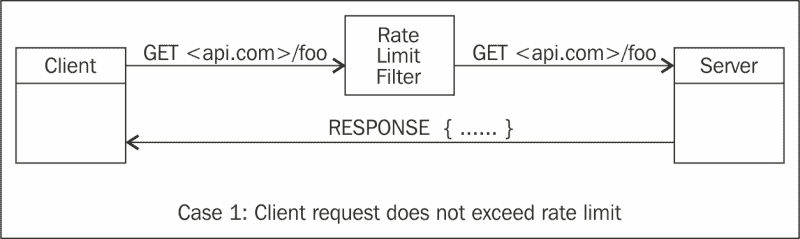
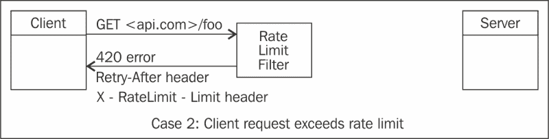

# 第五章：高级设计原则

本章涵盖了每个开发人员在设计 RESTful 服务时必须了解的高级设计原则。它还提供了务实的见解，为开发人员提供足够的信息来构建具有 REST API 的复杂应用程序。

本章将涵盖以下主题：

+   速率限制模式

+   响应分页

+   国际化和本地化

+   REST 的可插拔性和可扩展性

+   REST API 开发人员的其他主题

本章包含了不同的代码片段，但展示这些片段的完整示例作为书籍源代码下载包的一部分包含在内。

与之前的章节一样，我们将尝试覆盖读者所需的最低限度的细节，以便为其提供对本质上复杂的主题的扎实的一般理解，同时还提供足够的技术细节，以便读者能够轻松地立即开始工作。

# 速率限制模式

速率限制涉及限制客户端可以发出的请求数量。客户端可以根据其用于请求的访问令牌进行识别，如第三章中所述，*安全性和可追溯性*。另一种客户端可以被识别的方式是客户端的 IP 地址。

为了防止滥用服务器，API 必须实施节流或速率限制技术。基于客户端，速率限制应用程序可以决定是否允许请求通过。

服务器可以决定每个客户端的自然速率限制应该是多少，例如，每小时 500 个请求。客户端通过 API 调用向服务器发出请求。服务器检查请求计数是否在限制范围内。如果请求计数在限制范围内，则请求通过并且计数增加给客户端。如果客户端请求计数超过限制，服务器可以抛出 429 错误。

服务器可以选择包含一个`Retry-After`头部，指示客户端在可以发送下一个请求之前应等待多长时间。

应用程序的每个请求可以受到两种不同的节流的影响：具有访问令牌和没有访问令牌的请求。具有访问令牌的应用程序的请求配额可以与没有访问令牌的应用程序的请求配额不同。

以下是`HTTP 429 Too Many Requests`错误代码的详细信息。

### 注意

**429 Too Many Requests (RFC 6585)**

用户在一定时间内发送了太多请求。这是为了与速率限制方案一起使用。

`429 Too Many Requests`错误的响应可能包括一个`Retry-After`头部，指示客户端需要等待多长时间才能发出新的请求。以下是一个示例代码片段：

```java
HTTP/1.1 429 Too Many Requests
Content-Type: text/html
Retry-After: 3600
 <html>
       <head>
   <title>Too Many Requests</title>
   </head>
 <body>
 <h1>Too many Requests</h1>
       <p>100 requests per hour to this Web site per logged in use allowed.</p>
   </body>
   </html>
```

前面的 HTTP 响应示例设置了`Retry-After`头部为 3600 秒，以指示客户端可以稍后重试。此外，服务器可以发送一个`X-RateLimit-Remaining`头部，指示此客户端还有多少待处理的请求。

现在我们对速率限制有了一些想法，以及速率限制错误和`Retry-After`和`X-RateLimit-Remaining`头部的工作原理，让我们通过 JAX-RS 编写代码。

*项目的布局*部分中的以下代码显示了如何在 JAX-RS 中实现一个简单的速率限制过滤器。

## 项目的布局

项目的目录布局遵循标准的 Maven 结构，简要解释如下表。此示例生成一个 WAR 文件，可以部署在任何符合 Java EE 7 标准的应用服务器上，如 GlassFish 4.0。

此示例演示了一个简单的咖啡店服务，客户可以查询他们下的特定订单。

| 源代码 | 描述 |
| --- | --- |
| `src/main/java` | 此目录包含咖啡店应用程序所需的所有源代码 |

`CoffeeResource`类是一个简单的 JAX-RS 资源，如下所示：

```java
@Path("v1/coffees")
public class CoffeesResource {
    @GET
    @Path("{order}")
    @Produces(MediaType.APPLICATION_XML)
    @NotNull(message="Coffee does not exist for the order id requested")
    public Coffee getCoffee(@PathParam("order") int order) {
        return CoffeeService.getCoffee(order);
    }
}
```

项目中有一个`CoffeeResource`类，用于获取有关咖啡订单的详细信息。`getCoffee`方法返回一个包含订单详细信息的`Coffee`对象。

为了强制执行速率限制，我们将添加一个`RateLimiter`类，它是一个简单的 servlet 过滤器，如下图所示。

`RateLimiter`类将检查客户端的 IP 地址，并检查客户端发出的请求是否超过限制。以下图表详细描述了示例中涵盖的速率限制功能：



前面的图表显示了客户端向[`api.com/foo`](http://api.com/foo)发出`GET`请求。**速率限制过滤器**根据 IP 地址检查客户端的访问计数。由于客户端未超过速率限制，请求被转发到服务器。服务器可以返回 JSON、XML 或文本响应。

以下图表显示客户端向[`api.com/foo`](http://api.com/foo)发出`GET`请求。**速率限制过滤器**根据 IP 地址检查客户端的访问计数。由于客户端超过了速率限制，请求未转发到服务器，并且速率限制器在 HTTP 响应中返回`429 Too Many Requests`错误代码。



## 对速率限制示例的详细查看

要使用 JAX-RS 实现速率限制器，我们需要实现一个`Filter`类。如下代码片段所示：

```java
@WebFilter(filterName = "RateLimiter",
        urlPatterns = {"/*"}
        )
public class RateLimiter implements Filter {
    private static final int REQ_LIMIT = 3;
    private static final int TIME_LIMIT = 600000;
    private static AccessCounter accessCounter = AccessCounter.getInstance();
}
```

前面的代码片段显示了`javax.servlet.annotation`包的`WebFilter`接口的实现。`@WebFilter`注解表示这个类是应用程序的过滤器。

`@WebFilter`注解必须在注解中具有至少一个`urlPatterns`或`value`属性。

`REQ_LIMIT`常量代表在一段时间内可以发出的请求数量。`TIME_LIMIT`常量代表速率限制的时间持续时间，之后客户端可以接受新请求。

为简单起见，示例中的限制值较小。在实际场景中，限制可以是，例如，每分钟 60 个请求或每天 1,000 个请求。如果请求计数达到限制，`Retry-After`头将指示客户端在服务器处理下一个请求之前必须等待的时间。

为了跟踪与客户端关联的请求计数，我们创建了一个名为`AccessCounter`的类。以下是`AccessCounter`类的代码。`AccessCounter`类是一个带有`@Singleton`注解的`Singleton`类。它存储了一个包含 IP 地址作为键和与客户端相关的数据（称为`AccessData`）作为值的`ConcurrentHashMap`类。

```java
@Singleton
public class AccessCounter {

    private static AccessCounter accessCounter;

    private static ConcurrentHashMap<String,AccessData> accessDetails = new ConcurrentHashMap<String, AccessData>();
}
```

`AccessData`类负责存储客户端的详细信息，例如请求的数量以及上次请求是何时。它是一个简单的**普通旧 Java 对象**（**POJO**），如下代码片段所示：

```java
public class AccessData {
    private long lastUpdated;
    private AtomicInteger count;

    public long getLastUpdated() {
        return lastUpdated;
    }

    public void setLastUpdated(long lastUpdated) {
        this.lastUpdated = lastUpdated;
    }

    public AtomicInteger getCount() {
        return count;
    }

    public void setCount(AtomicInteger count) {
        this.count = count;
    }

 …
```

如前面的代码片段所示，`AccessData`类有一个名为`count`的字段和一个名为`lastUpdated`的字段。每当新请求到达时，计数会递增，并且`lastUpdated`字段设置为当前时间。

`RateLimiter`类的`doFilter()`方法在以下代码片段中使用：

```java
@Override
    public void doFilter(ServletRequest servletRequest, ServletResponse servletResponse,
                         FilterChain filterChain) throws IOException, ServletException {

        HttpServletRequest httpServletRequest = (HttpServletRequest) servletRequest;
        HttpServletResponse httpServletResponse = (HttpServletResponse) servletResponse;

        String ipAddress = getIpAddress(httpServletRequest);
        if (accessCounter.contains(ipAddress)) {
            if (!requestLimitExceeded(ipAddress)) {
                accessCounter.increment(ipAddress);
                accessCounter.getAccessDetails(ipAddress).setLastUpdated(System.currentTimeMillis());

            } else {

                httpServletResponse.addIntHeader("Retry-After",TIME_LIMIT);
                httpServletResponse.sendError(429);

            }
        } else {
            accessCounter.add(ipAddress);

        }
        filterChain.doFilter(servletRequest, servletResponse)

    }
```

前面的代码显示了`javax.servlet.Filter`类的`doFilter()`方法，在`RateLimiter`实现中被重写。在这个方法中，首先确定客户端的 IP 地址。

如果`accessCounter`类包含 IP 地址，则在`requestLimitExceeded()`方法中将检查请求限制是否已超过。

如果速率限制已超过，则`Retry-After`标头将与`429 Too Many Requests`错误一起发送到`httpServletResponse`。如果同一客户端发出了新请求，并且大于`TIME_LIMIT`值，则计数器将重置为 0，并且可以再次处理来自客户端的请求。

以下是可以在响应中发送回客户端的速率限制标头：

+   `X-RateLimit-Limit`：客户端在特定时间段内可以发出的最大请求数

+   `X-RateLimit-Remaining`：当前速率限制窗口中剩余的请求数

本书附带了一个详细的示例。在将示例部署到应用程序服务器后，客户端可以进行多个请求以获取咖啡订单的详细信息。

为了简单起见，我们已经将速率限制设置为 3，时间限制设置为 10 分钟。以下是一个示例`curl`请求：

```java
curl -i http://localhost:8080/ratelimiting/v1/coffees/1
HTTP/1.1 200 OK
X-Powered-By: Servlet/3.1 JSP/2.3 (GlassFish Server Open Source Edition  4.0  Java/Oracle Corporation/1.7)
Server: GlassFish Server Open Source Edition  4.0 
Content-Type: application/json
Date: Mon, 23 Jun 2014 23:27:34 GMT
Content-Length: 57

{
 "name":"Mocha",
 "order":1,
 "size":"Small",
 "type":"Brewed"
}

```

一旦超过速率限制，您将看到`429`错误：

```java
curl -i http://localhost:8080/ratelimiting/v1/coffees/1
HTTP/1.1 429 CUSTOM
X-Powered-By: Servlet/3.1 JSP/2.3 (GlassFish Server Open Source Edition  4.0  Java/Oracle Corporation/1.7)
Server: GlassFish Server Open Source Edition  4.0 
Retry-After: 600000
Content-Language: 
Content-Type: text/html
Date: Mon, 23 Jun 2014 23:29:04 GMT
Content-Length: 1098

```

### 提示

此示例显示了如何构建自定义过滤器以实现速率限制。另一个选择是使用名为**Repose**的开源项目，它是一个可扩展且广泛的速率限制实现。 Repose 是一个开源的 HTTP 代理服务，提供速率限制、客户端认证、版本控制等功能。有关更多详细信息，请查看[`openrepose.org/`](http://openrepose.org/)。

在下一节中，我们将讨论在使用 REST API 时必须遵循的最佳实践。

## 避免达到速率限制的最佳实践

以下是在使用 REST API 时避免达到速率限制的最佳实践。

### 缓存

在服务器端缓存 API 响应可以帮助避免达到速率限制。设置合理的到期时间间隔可确保数据库不会因查询而受到影响，并且如果资源未更改，则可以从缓存发送响应。例如，从 Twitter 获取的推文的应用程序可以缓存来自 Twitter API 的响应或使用 Twitter 流 API（在下一节中介绍）。理想情况下，API 消费者不应该每分钟进行相同的请求。这通常是一种带宽浪费，因为在大多数情况下将返回完全相同的结果。

### 不要在循环中发出调用

不在循环中发出调用是一个好习惯。服务器 API 应设计得尽可能详细，并通过在响应中发送尽可能多的细节来帮助客户端。这确保了消费者可以在一个 API 操作中获取一组对象，而不是在循环中获取单个对象。

### 记录请求

在客户端使用日志记录以查看客户端发出了多少请求是一个好习惯。观察日志将帮助客户端分析哪些是不冗余的查询，这些查询会增加速率限制并且可以被消除。

### 避免轮询

此外，消费者不应该轮询更改。客户端可以使用 WebHooks（[`en.wikipedia.org/wiki/Webhook`](http://en.wikipedia.org/wiki/Webhook)）或推送通知（[`en.wikipedia.org/wiki/Push_technology`](http://en.wikipedia.org/wiki/Push_technology)）来接收通知，而不是轮询以查看内容是否已更改。有关 WebHooks 的更多详细信息将在第六章中给出，*新兴标准和 REST 的未来*。

### 支持流式 API

API 开发人员可以支持流式 API。这可以帮助客户端避免达到速率限制。Twitter 提供的一组流式 API 为开发人员提供了低延迟访问 Twitter 全球推文数据流的机会。流式客户端不需要承担与轮询 REST 端点相关的开销，并且将收到指示已发生推文和其他事件的消息。

一旦应用程序建立到流式端点的连接，它们将收到推文的订阅，而不必担心轮询或 REST API 速率限制。

### 注意

**Twitter REST API 速率限制案例研究**

Twitter 每小时对未经身份验证的客户端的请求限制为 150 次。

基于 OAuth 的调用允许每小时基于请求中的访问令牌进行 350 次请求。

超出搜索 API 的速率限制的应用程序将收到 HTTP 420 响应代码。最佳做法是注意此错误条件，并遵守返回的 Retry-After 头。Retry-After 头的值是客户端应该在再次请求数据之前等待的秒数。如果客户端发送的请求超过每小时允许的数量，客户端将收到 420 Enhance Your Calm 错误。

### 提示

**420 Enhance Your Calm (Twitter)**

这不是 HTTP 标准的一部分，但在 Twitter 搜索和趋势 API 被限制时返回。应用程序最好实现`429 Too Many Requests`响应代码。

# 响应分页

REST API 被从 Web 到移动客户端的其他系统使用，因此，返回多个项目的响应应该分页，每页包含一定数量的项目。这就是所谓的响应分页。除了响应之外，最好还添加一些关于对象总数、页面总数和指向下一组结果的链接的附加元数据。消费者可以指定页面索引来查询结果以及每页的结果数。

在客户端未指定每页结果数的情况下，实施和记录每页结果数的默认设置是一种推荐做法。例如，GitHub 的 REST API 将默认页面大小设置为 30 条记录，最多为 100 条，并对客户端查询 API 的次数设置了速率限制。如果 API 有默认页面大小，那么查询字符串可以只指定页面索引。

以下部分涵盖了可以使用的不同类型的分页技术。API 开发人员可以根据其用例选择实现一个或多个这些技术。

## 分页类型

以下是可以使用的不同分页技术：

+   基于偏移量的分页

+   基于时间的分页

+   基于游标的分页

### 基于偏移量的分页

基于偏移量的分页是客户端希望按页码和每页结果数指定结果的情况。例如，如果客户端想要查询所有已借阅的书籍的详细信息，或者已订购的咖啡，他们可以发送以下查询请求：

```java
GET v1/coffees/orders?page=1&limit=50
```

以下表格详细说明了基于偏移量的分页将包括哪些查询参数：

| 查询参数 | 描述 |
| --- | --- |
| `page` | 这指定要返回的页面 |
| `limit` | 这指定了响应中可以包含的每页最大结果数 |

### 基于时间的分页

当客户端想要查询特定时间范围内的一组结果时，将使用基于时间的分页技术。

例如，要获取在特定时间范围内订购的咖啡列表，客户端可以发送以下查询：

```java
GET v1/coffees/orders?since=140358321&until=143087472
```

以下表格详细说明了基于时间的分页将包括哪些查询参数：

| 查询参数 | 描述 |
| --- | --- |
| `until:` | 这是指向时间范围结束的 Unix 时间戳 |
| `since` | 这是指向时间范围开始的 Unix 时间戳 |
| `limit` | 这指定了响应中可以包含的每页最大结果数 |

### 基于游标的分页

基于游标的分页是一种技术，其中结果通过游标分隔成页面，并且可以使用响应中提供的下一个和上一个游标向前和向后导航结果。

基于游标的分页 API 避免在分页请求之间添加额外资源的情况下返回重复记录。这是因为游标参数是一个指针，指示从哪里恢复结果，用于后续调用。

#### Twitter 和基于游标的分页

以下是 Twitter 如何使用基于游标的分页的示例。获取拥有大量关注者的用户的 ID 的查询可以进行分页，并以以下格式返回：

```java
{
    "ids": [
        385752029, 
        602890434, 
        ...
        333181469, 
        333165023
    ],
    "next_cursor": 1374004777531007833, 
    "next_cursor_str": "1374004777531007833", 
    "previous_cursor": 0, 
    "previous_cursor_str": "0"
}
```

`next_cursor` 值可以传递给下一个查询，以获取下一组结果：

```java
GET https://api.twitter.com/1.1/followers/ids.json?screen_name=someone &cursor=1374004777531007833
```

使用 `next_cursor` 和 `previous_cursor` 值，可以轻松在结果集之间导航。

现在我们已经介绍了不同的分页技术，让我们详细介绍一个示例。以下示例显示了如何使用 JAX-RS 实现简单的基于偏移量的分页技术。

## 项目的布局

项目的目录布局遵循标准的 Maven 结构，以下表格简要解释了这一点。

所使用的示例是咖啡店服务的示例，可以查询到目前为止所有下的订单。

| 源代码 | 描述 |
| --- | --- |
| `src/main/java` | 此目录包含咖啡店应用程序所需的所有源代码 |

这是 `CoffeeResource` 类：

```java
@Path("v1/coffees")
public class CoffeesResource {
    @GET
    @Path("orders")
    @Produces(MediaType.APPLICATION_JSON)
    public List<Coffee> getCoffeeList( 
@QueryParam("page")  @DefaultValue("1") int page,
                                       @QueryParam("limit") @DefaultValue("10") int limit ) {
        return CoffeeService.getCoffeeList( page, limit);

    }
}
```

`getCoffeeList()` 方法接受两个 `QueryParam` 值：`page` 和 `limit`。`page QueryParam` 值对应于页面索引，`limit` 对应于每页的结果数。`@DefaultValue` 注释指定了如果查询参数不存在可以使用的默认值。

以下是运行示例时的输出。`metadata` 元素包含 `totalCount` 值的详细信息，即记录的总数。此外，还有 `JSONArray` 的 `links` 属性，其中包含诸如 `self`（当前页面）和 `next`（获取更多结果的下一个链接）等详细信息。

```java
{
    "metadata": {
        "resultsPerPage": 10,
        "totalCount": 100,
        "links": [
            {
                "self": "/orders?page=1&limit=10"
            },
            {
                "next": "/orders?page=2&limit=10"
            }
        ]
    },
    "coffees": [
        {
            "Id": 10,
            "Name": "Expresso",
            "Price": 2.77,
            "Type": "Hot",
            "Size": "Large"
        },
        {
            "Id": 11,
            "Name": "Cappuchino",
            "Price": 0.14,
            "Type": "Brewed",
            "Size": "Large"
        },
…..
       ……
    ]
}
```

示例与本书可下载的源代码包捆绑在一起。

### 提示

在 REST API 中，为分页包含每页结果数的默认值始终是一个好习惯。此外，建议 API 开发人员在响应中添加元数据，以便 API 的消费者可以轻松获取附加信息，以获取下一组结果。

# 国际化和本地化

通常，服务需要在全球环境中运行，并且响应需要根据国家和语言环境进行定制。本地化参数可以在以下字段之一中指定：

+   HTTP 头

+   查询参数

+   REST 响应的内容

语言协商类似于内容协商；HTTP 头 `Accept-Language` 可以根据 ISO-3166 国家代码的任何两字母首字母取不同的语言代码（[`www.iso.org/iso/country_codes.htm)`](http://www.iso.org/iso/country_codes.htm)）。`Content-Language` 头类似于 `Content-Type` 头，可以指定响应的语言。

例如，以下是在客户端发送的请求的响应中发送的 `Content-Language` 头：

```java
HTTP/1.1 200 OK
X-Powered-By: Servlet/3.1 JSP/2.3 (GlassFish Server Open Source Edition  4.0  Java/Oracle Corporation/1.7)
Server: GlassFish Server Open Source Edition  4.0 
Content-Language: en
Content-Type: text/html
Date: Mon, 23 Jun 2014 23:29:04 GMT
Content-Length: 1098
```

前面的响应将 `Content-Language` 设置为 `en` 作为响应的一部分。

JAX-RS 支持使用 `javax.ws.rs.core.Variant` 类和 `Request` 对象进行运行时内容协商。`Variant` 类可以包含媒体类型、语言和编码。`Variant.VariantListBuilder` 类用于构建表示变体的列表。

以下代码片段显示了如何创建资源表示变体的列表：

```java
List<Variant> variantList = 
    Variant.
      .languages("en", "fr").build();
```

前面的代码片段调用了 `VariantListBuilder` 类的 `build` 方法，语言为 `"en"` 和 `"fr"`。

查询参数可以包括特定于语言环境的信息，以便服务器可以以该语言返回信息。

以下是一个示例：

```java
GET v1/books?locale=fr
```

此查询显示了一个示例，其中将在查询参数中包含区域设置以获取图书的详细信息。此外，REST 响应的内容可以包含特定于国家/地区的细节，如货币代码，以及基于请求中发送的 HTTP 标头或查询参数的其他细节。

# 其他主题

以下部分涵盖了一些杂项主题的细节，如 HATEOAS 和 REST 中的可扩展性。

## HATEOAS

**超媒体作为应用状态的引擎**（**HATEOAS**）是 REST 应用程序架构的一个约束。

超媒体驱动的 API 通过在服务器发送的响应中提供超媒体链接，提供有关可用 API 和消费者可以采取的相应操作的详细信息。

例如，包含名称和 ISBN 等数据的 REST 资源的图书表示如下所示：

```java
{ 
   "Name":" Developing RESTful Services with JAX-RS 2.0,
            WebSockets, and JSON",
   "ISBN": "1782178120"
}
```

HATEOAS 实现将返回以下内容：

```java
{
    "Name":" Developing RESTful Services with JAX-RS 2.0, 
             WebSockets, and JSON",
    "ISBN": "1782178120"
    "links": [
       {
        "rel": "self",
        "href": "http://packt.com/books/123456789"
       }
    ]
}
```

在前面的示例中，`links`元素具有`rel`和`href` JSON 对象。

在这个例子中，`rel`属性是一个自引用的超链接。更复杂的系统可能包括其他关系。例如，图书订单可能具有`"rel":"customer"`关系，将图书订单链接到其客户。`href`是一个完整的 URL，唯一定义资源。

HATEOAS 的优势在于它帮助客户端开发人员探索协议。链接为客户端开发人员提供了关于可能的下一步操作的提示。虽然没有超媒体控件的标准，但建议遵循 ATOM RFC（4287）。

### 注意

根据 Richardson 成熟度模型，HATEOAS 被认为是 REST 的最终级别。这意味着每个链接都被假定实现标准的 REST 动词`GET`、`POST`、`PUT`和`DELETE`。使用`links`元素添加详细信息，如前面代码片段所示，可以为客户端提供导航服务和采取下一步操作所需的信息。

## PayPal REST API 和 HATEOAS

PayPal REST API 提供 HATEOAS 支持，因此每个响应都包含一组链接，可以帮助消费者决定下一步要采取的操作。

例如，PayPal REST API 的示例响应包括以下代码中显示的 JSON 对象：

```java
{
    "href": "https://www.sandbox.paypal.com/webscr?cmd=_express-checkout&token=EC-60U79048BN7719609",
    "rel": "approval_url",
    "method": "REDIRECT"
  },
  {
    "href": "https://api.sandbox.paypal.com/v1/payments/payment/PAY-6RV70583SB702805EKEYSZ6Y/execute",
    "rel": "execute",
    "method": "POST"
  }
```

属性的简要描述如下。

+   `href`：这包含可用于未来 REST API 调用的 URL 的信息

+   `rel`：此链接显示它与先前的 REST API 调用相关

+   `method`：显示用于 REST API 调用的方法

### 注意

有关更多详细信息，请查看[`developer.paypal.com/docs/integration/direct/paypal-rest-payment-hateoas-links/`](https://developer.paypal.com/docs/integration/direct/paypal-rest-payment-hateoas-links/)。

## REST 和可扩展性

基于设计风格的约束的 RESTful 应用程序在时间上更具可扩展性和可维护性。基于设计风格的 RESTful 应用程序更易于理解和使用，主要是因为它们的简单性。它们也更可预测，因为一切都是关于资源。此外，与需要解析复杂 WSDL 文档才能开始理解发生了什么的 XML-RPC 应用程序相比，RESTful 应用程序更易于使用。

## REST API 的其他主题

以下部分列出了对 REST 开发人员可能有用的其他主题。我们已经在早期章节中涵盖了从设计 RESTful 服务、错误处理、验证、身份验证和缓存到速率限制的主题。本节重点介绍了其他实用工具，以赋予 REST API 开发人员更好的测试和文档编制能力。

## 测试 RESTful 服务

拥有一组自动化测试总是有效的，可以验证服务器发送的响应。用于构建 RESTful 服务的自动化测试的一个框架是 REST Assured。

REST Assured 是用于轻松测试 RESTful 服务的 Java DSL。它支持`GET`、`PUT`、`POST`、`HEAD`、`OPTIONS`和`PATCH`，可以用于验证服务器发送的响应。

以下是一个获取咖啡订单并验证响应中返回的 ID 的示例：

```java
    get("order").
    then().assertThat().
    body("coffee.id",equalTo(5));
```

在上面的片段中，我们调用获取咖啡订单并验证`coffee.id`值为 5。

REST Assured 支持轻松指定和验证参数、标头、Cookie 和主体，也支持将 Java 对象与 JSON 和 XML 相互映射。有关更多详细信息，您可以查看[`code.google.com/p/rest-assured/`](https://code.google.com/p/rest-assured/)。

### 记录 RESTful 服务

为消费者构建 RESTful 服务时，无论他们来自同一企业还是来自外部应用程序或移动客户端，提供文档都是一个良好的实践。以下部分涵盖了一些为 RESTful 服务提供良好文档的框架。

Swagger 是一个用于描述、生成、消费和可视化 RESTful web 服务的框架实现。方法、参数和模型的文档紧密集成到服务器代码中。Swagger 是与语言无关的，Scala、Java 和 HTML5 的实现都可用。

有关如何将 Swagger 添加到 REST API 的教程可在以下网址找到：

[`github.com/wordnik/swagger-core/wiki/Adding-Swagger-to-your-API`](https://github.com/wordnik/swagger-core/wiki/Adding-Swagger-to-your-API)

# 推荐阅读

以下链接涉及本章涵盖的一些主题，对于审查和获取详细信息将会很有用：

+   [`dev.twitter.com/docs`](https://dev.twitter.com/docs): Twitter API 文档

+   [`dev.twitter.com/console`](https://dev.twitter.com/console): Twitter 开发者控制台

+   [`dev.twitter.com/docs/rate-limiting/1.1`](https://dev.twitter.com/docs/rate-limiting/1.1): Twitter API 在 v1.1 中的速率限制

+   [`dev.twitter.com/docs/misc/cursoring`](https://dev.twitter.com/docs/misc/cursoring): Twitter API 和游标

+   [`dev.twitter.com/docs/api/streaming`](https://dev.twitter.com/docs/api/streaming): Twitter 流 API

+   [`developers.facebook.com/docs/reference/ads-api/api-rate-limiting/`](https://developers.facebook.com/docs/reference/ads-api/api-rate-limiting/): Facebook API 速率限制

+   [`developer.github.com/v3/rate_limit/`](https://developer.github.com/v3/rate_limit/): GitHub API 速率限制

+   [`developers.facebook.com/docs/opengraph/guides/internationalization/`](https://developers.facebook.com/docs/opengraph/guides/internationalization/): Facebook 本地化

# 摘要

本章涵盖了每个 RESTful API 开发人员都应该了解的高级主题。一开始，我们看到了速率限制示例，演示了如何强制执行节流，以便服务器不会被 API 调用淹没。我们还看到了 Twitter、GitHub 和 Facebook API 如何执行速率限制。我们涵盖了不同的分页技术和基本分页示例以及最佳实践。然后，我们转向国际化和其他杂项主题。最后，我们涵盖了 HATEOAS 以及它如何成为 REST API、REST 和可扩展性主题的下一个级别。

下一章将涵盖其他新兴标准，如 WebSockets、WebHooks 以及 REST 在不断发展的 Web 标准中的作用。
