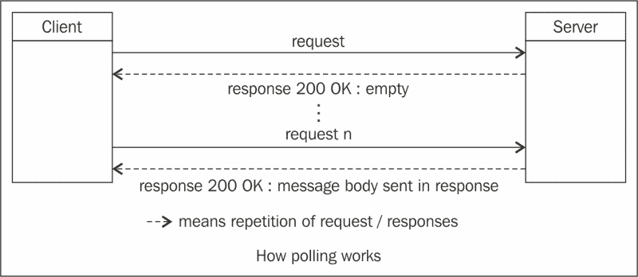
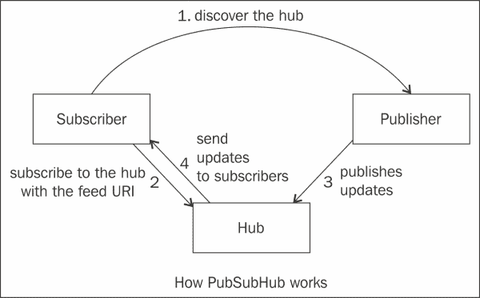
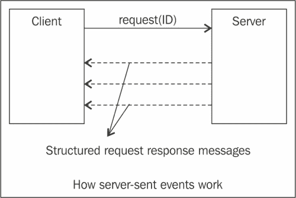
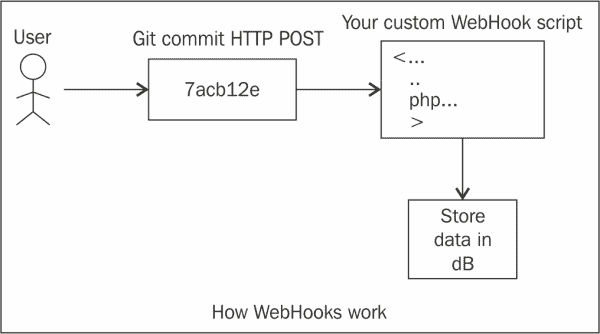
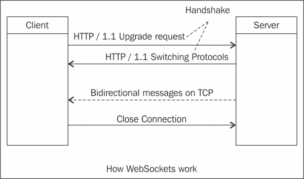

# 第六章：新兴标准和 REST 的未来

本章涵盖了新兴和发展中的技术，将增强 RESTful 服务的功能，并提供对 REST 的未来以及其他实时 API 支持者的一些看法。我们将涵盖一些实时 API，并看看它们如何帮助解决轮询等旧方式的问题。鉴于 Twitter、Facebook 和 Stripe 等平台的普遍流行，它们采用了一种范式转变，因此提供了实时 API，以在事件发生时向客户端提供信息，这并不奇怪。

本章将涵盖以下主题：

+   实时 API

+   轮询

+   WebHooks

+   WebSockets

+   额外的实时 API 支持者，包括以下内容：

+   PubSubHubbub

+   服务器发送事件

+   XMPP

+   XMPP 上的 BOSH

+   使用 WebHooks 和 WebSockets 的公司案例

+   WebHooks 和 WebSockets 的比较

+   REST 和微服务

我们将从定义实时 API 的含义开始，然后讨论轮询及其缺点。接下来，我们将详细介绍广泛用于异步实时通信的不同模型。最后，我们将详细阐述 WebHooks 和 WebSockets 的务实方法。

# 实时 API

在我们的情境中，实时 API 帮助 API 消费者在事件发生时接收他们感兴趣的事件。实时更新的一个例子是当有人在 Facebook 上发布链接，或者你在 Twitter 上关注的人发表关于某个话题的推文。另一个实时 API 的例子是在股价变化发生时接收股价变化的信息。

# 轮询

轮询是从产生事件和更新流的数据源获取数据的最传统方式。客户端定期发出请求，如果有响应，服务器就会发送数据。如果服务器没有要发送的数据，就会返回空响应。以下图表显示了连续轮询的工作原理：



轮询带来了诸多缺点，比如在服务器没有更新时对请求返回空响应，这导致了带宽和处理时间的浪费。低频率的轮询会导致客户端错过接近更新发生时间的更新，而过于频繁的轮询也会导致资源浪费，同时还会面临服务器施加的速率限制。

为了消除轮询的这些缺点，我们将涵盖以下主题：

+   PuSH 模型-PubSubHubbub

+   流模型

## PuSH 模型-PubSubHubbub

PuSH 是基于发布/订阅协议的简单主题，基于 ATOM/RSS。它的目标是将原子源转换为实时数据，并消除影响源的消费者的轮询。订阅者在主题上注册他们的兴趣，原始发布者告诉感兴趣的订阅者有新的内容。

为了分发发布和内容分发的任务，有一个**Hub**的概念，可以委托发送内容给订阅者。以下图表描述了 PubSubHubbub 模型：



让我们看看这个模型是如何工作的：

1.  **Subscriber**通过从**Publisher**获取 feed 来发现**Hub**。

1.  一旦**Hub**被发现，**Subscriber**就会订阅**Hub**感兴趣的 feed URI。

1.  现在，当**Publisher**有更新要发送时，它会让**Hub**获取更新。

1.  **Hub**然后将更新发送给所有发布者。

这种模型的优势在于，发布者不必担心向所有订阅者发送更新。另一方面，订阅者有一个优势，即他们可以在事件发生时从 hub 获取更新，而无需不断地轮询发布者。

在接下来的章节中讨论的**WebHooks**范例使用了这个协议。

## 流模型

异步通信的流模型涉及保持通道打开并在数据发生时发送数据。在这种情况下，需要保持套接字连接打开。

### 服务器发送事件

**服务器发送事件**（**SSE**）是基于流模型的技术，其中浏览器通过 HTTP 连接自动从服务器获取更新。W3C 已将服务器发送事件 EventSource API 作为 HTML5 的一部分进行了标准化。

使用 SSE，客户端使用`"text/eventstream"` MimeType 向服务器发起请求。一旦进行了初始握手，服务器可以在事件发生时不断向客户端发送事件。这些事件是从服务器发送到客户端的纯文本消息。它们可以是客户端侧的事件监听器可以消耗的数据，事件监听器可以解释并对接收到的事件做出反应。

SSE 定义了从服务器发送到客户端的事件的消息格式。消息格式由一系列以换行符分隔的纯文本行组成。携带消息主体或数据的行以`data:`开头，以`\n\n`结尾，如下面的代码片段所示：

```java
data: My message \n\n
```

携带一些**服务质量**（**QoS**）指令的行（例如`retry`和`id`）以 QoS 属性名称开头，后跟`:`，然后是 QoS 属性的值。标准格式使得可以开发围绕 SSE 的通用库，以使软件开发更加容易。

以下图表显示了 SSE 的工作原理：



如图所示，客户端订阅了一个事件源。服务器会在事件发生时不断发送更新。

此外，服务器可以将 ID 与整个消息关联并发送，如下面的代码片段所示：

```java
id: 12345\n
data: Message1\n
data: Message 2\n\n
```

前面的代码片段显示了如何发送带有事件 ID 和数据的多行消息，最后一行以两个`\n\n`字符结尾。

设置一个 ID 让客户端能够跟踪最后触发的事件，这样如果与服务器的连接断开，客户端发送的新请求中会设置一个特殊的 HTTP 头(`Last-Event-ID`)。

接下来的部分将介绍如何将 ID 与 SSE 关联，SSE 在连接丢失和重试时的工作原理，以及如何将事件名称与 SSE 关联。

#### 将 ID 与事件关联

每个 SSE 消息都可以有一个消息标识符，可以用于各种目的，例如跟踪客户端接收到的消息，并为其保留一个检查点。当消息 ID 在 SSE 中使用时，客户端可以将最后的消息 ID 作为连接参数之一提供，以指示服务器从特定消息开始恢复。当然，服务器端代码应该实现一个适当的过程，以从客户端请求的消息 ID 恢复通信。

以下代码片段显示了带有 ID 的 SSE 消息的示例：

```java
id: 123 \n
data: This is a single line event \n\n
```

#### 在连接失败的情况下重试

Firefox、Chrome、Opera 和 Safari 支持服务器发送事件。如果浏览器和服务器之间出现连接丢失，浏览器可以尝试重新连接到服务器。服务器可以配置一个重试指令，以允许客户端进行重试。重试间隔的默认值为 3 秒。服务器可以发送一个重试事件来增加重试间隔到 5 秒，如下所示：

```java
retry: 5000\n
data: This is a single line data\n\n
```

#### 将事件名称与事件关联

另一个 SSE 指令是事件名称。每个事件源可以生成多种类型的事件，客户端可以根据订阅的事件类型决定如何消费每种事件类型。以下代码片段显示了`name`事件指令如何融入消息中：

```java
event: bookavailable\n
data: {"name" : "Game of Thrones"}\n\n
event: newbookadded\n
data: {"name" :"Storm of Swords"}\n\n
```

### 服务器发送事件和 JavaScript

被认为是 JavaScript 开发人员在客户端中 SSE 的基础 API 是`EventSource`接口。`EventSource`接口包含相当多的函数和属性，但最重要的函数列在下表中：

| 函数名 | 描述 |
| --- | --- |
| `addEventListener` | 此函数添加事件监听器，以处理基于事件类型的传入事件。 |
| `removeEventListener` | 此函数移除已注册的监听器。 |
| `onmessage` | 当消息到达时调用此函数。使用`onmessage`方法时，没有自定义事件处理可用。监听器管理自定义事件处理。 |
| `onerror` | 当连接出现问题时调用此函数。 |
| `onopen` | 当连接打开时调用此函数。 |
| `onclose` | 当连接关闭时调用此函数。 |

以下代码片段显示了如何订阅一个来源省略的不同事件类型。代码片段假定传入的消息是 JSON 格式的消息。例如，有一个应用程序可以在某个存储中有新书可用时向用户流式传输更新。`'bookavailable'`监听器使用简单的 JSON 解析器来解析传入的 JSON。

然后，它将用此来更新 GUI，而`'newbookadded'`监听器使用恢复函数来过滤并选择性处理 JSON 对。

```java
var source = new EventSource('books');
source.addEventListener('bookavailable', function(e) {
  var data = JSON.parse(e.data);
  // use data to update some GUI element...
}, false);

source.addEventListener('newbookadded', function(e) {
  var data = JSON.parse(e.data, function (key, value) {
    var type;
    if (value && typeof value === 'string') {
return "String value is: "+value;
    }
    return value;
```

### 服务器发送事件和 Jersey

SSE 不是标准 JAX-RS 规范的一部分。然而，在 JAX-RS 的 Jersey 实现中支持它们。更多细节请查看[`jersey.java.net/documentation/latest/sse.html`](https://jersey.java.net/documentation/latest/sse.html)。

# WebHooks

**WebHooks**是一种用户定义的自定义 HTTP 回调形式。在 WebHook 模型中，客户端提供事件生成器的端点，事件生成器可以向其*发布*事件。当事件发布到端点时，对此类事件感兴趣的客户端应用程序可以采取适当的操作。WebHooks 的一个例子是使用 GIT post-receive hook 触发 Hudson 作业等事件。

为了确认订阅者正常接收到 WebHook，订阅者的端点应返回`200 OK HTTP`状态码。事件生成器将忽略请求正文和除状态外的任何其他请求标头。任何 200 范围之外的响应代码，包括 3xx 代码，都将表示他们未收到 WebHook，并且 API 可能会重试发送 HTTP `POST`请求。

GitHub 生成的 WebHooks 事件传递了有关存储库中活动的信息负载。WebHooks 可以触发多种不同的操作。例如，消费者可能在进行提交时、复制存储库时或创建问题时请求信息负载。

以下图表描述了 WebHooks 如何与 GitHub 或 GitLab 一起工作：



让我们看看 WebHooks 是如何工作的：

1.  用户进行**Git**推送。

1.  消费者与 GitHub 注册的事件对象有一个自定义的 WebHook URL。例如，当发生事件时，比如进行提交时，GitHub 服务将使用**POST**消息将有关提交的信息负载发送到消费者提供的端点。

1.  然后，消费应用程序可以将数据存储在**dB**中，或者执行其他操作，比如触发持续集成构建。

### 注意

一些流行的 WebHooks 案例研究

Twilio 使用 WebHooks 发送短信。GitHub 使用 WebHooks 发送存储库更改通知，以及可选的一些负载。

PayPal 使用**即时付款通知**（**IPN**），这是一种自动通知商家与 PayPal 交易相关事件的消息服务，它基于 WebHooks。

Facebook 的实时 API 使用 WebHooks，并基于**PubSubHubbub**（**PuSH**）。

如前所述，如果一个 API 没有提供 WebHooks 形式的通知，其消费者将不得不不断轮询数据，这不仅效率低下，而且不是实时的。

## WebSockets

WebSocket 协议是一种在单个 TCP 连接上提供全双工通信通道的协议。

WebSocket 协议是一种独立的基于 TCP 的协议，它与 HTTP 的唯一关系是，切换到 WebSockets 的握手被 HTTP 服务器解释为`Upgrade`请求。

它提供了在客户端（例如 Web 浏览器）和端点之间进行全双工、实时通信的选项，而无需不断建立连接或密集轮询资源。WebSockets 广泛用于社交动态、多人游戏、协作编辑等领域。

以下行显示了 WebSocket 协议握手的示例，从`Upgrade`请求开始：

```java
GET /text HTTP/1.1\r\n Upgrade: WebSocket\r\n Connection: Upgrade\r\n Host: www.websocket.org\r\n …\r\n 
HTTP/1.1 101 WebSocket Protocol Handshake\r\n 
Upgrade: WebSocket\r\n 
Connection: Upgrade\r\n 
…\r\n
```

下图显示了一个握手的示例，使用了`HTTP/1.1 Upgrade`请求和`HTTP/1.1 Switching Protocols`响应：



一旦客户端和服务器之间建立了连接，使用`Upgrade`请求和`HTTP/1.1`响应，WebSocket 数据帧（二进制或文本）可以在客户端和服务器之间双向发送。

WebSockets 数据最小帧为 2 字节；与 HTTP 头部传输相比，这大大减少了开销。

下面是使用 JavaScript WebSockets API 的一个非常基本的示例：

```java
//Constructionof the WebSocket object
var websocket = new WebSocket("coffee"); 
//Setting the message event Function
websocket.onmessage = function(evt) { 
onMessageFunc(evt)
};
//onMessageFunc which when a message arrives is invoked.
function onMessageFunc (evt) { 
//Perform some GUI update depending the message content
}
//Sending a message to the server
websocket.send("coffee.selected.id=1020"); 
//Setting an event listener for the event type "open".
addEventListener('open', function(e){
        onOpenFunc(evt)});

//Close the connection.
websocket.close();
```

以下表格将详细描述 WebSockets 功能和各种函数：

| 函数名 | 描述 |
| --- | --- |
| `send` | 这个函数可以用来向服务器指定的 URL 发送消息。 |
| `onopen` | 当连接创建时，将调用此函数。`onopen`函数处理`open`事件类型。 |
| `onmessage` | 当新消息到达时，将调用`onmessage`函数来处理`message`事件。 |
| `onclose` | 当连接被关闭时，将调用此函数。`onclose`方法处理`close`事件类型。 |
| `onerror` | 当通信通道发生错误时，将调用此函数来处理`error`事件。 |
| `close` | 这个函数用于关闭通信套接字并结束客户端和服务器之间的交互。 |

### 注意

**流行的 WebSockets 案例研究**

德州扑克是最早大规模利用 WebSockets 连接的游戏之一。在德州扑克 HTML5 中使用 WebSockets 可以提供流畅、高速的游戏体验，允许在移动网络上实现同步体验。根据连接的不同，游戏加载和刷新几乎立即完成。

# 额外的实时 API 支持者

还有一些常用的实时或几乎实时通信协议和 API，它们大多数在浏览器之外使用。其中一些协议和 API 将在接下来的部分中描述。

## XMPP

XMPP 协议是为满足文本消息和互联网聊天导向解决方案的要求而开发的。XMPP 的基本通信模型是客户端到服务器、服务器到服务器、服务器到客户端。为了支持这一点，它定义了基于 XML 消息的客户端到服务器协议和服务器到服务器协议，直接通过 TCP 编码和传输。

XMPP 是一种成熟的协议，在不同语言和平台上有许多实现。与 XMPP 相关的主要缺点是长轮询和开放套接字来处理入站和出站通信。

## XMPP 上的 BOSH

**同步 HTTP 上的双向流**（**BOSH**）在 XEP-0124 中规定了在 HTTP 上进行 XMPP 的标准方式。对于客户端发起的协议，客户端简单地在 HTTP 上发送 XMPP 数据包，对于服务器发起的协议，服务器使用长轮询，连接在预定的时间内保持打开状态。

BOSH 的主要优势在于它提供了使用 Web 浏览器作为 XMPP 客户端的可能性，利用了 BOSH 的任何 JavaScript 实现。Emite、JSJaC 和 xmpp4js 是一些支持 BOSH 的库。

# WebHooks、WebSockets 和服务器发送事件之间的比较

与 WebSockets 不同，SSE 是通过 HTTP 发送的。SSE 仅提供了从服务器到客户端的事件单向通信，并不像 WebSockets 那样支持全双工通信。SSE 具有自动重试连接的能力；它们还具有可以与消息关联的事件 ID，以提供**服务质量**（**QoS**）功能。WebSockets 规范不支持这些功能。

另一方面，WebSockets 支持全双工通信，减少了延迟并有助于提高吞吐量，因为它们在 HTTP 上进行了初始握手，然后消息在端点之间通过 TCP 传输。

与前面提到的两种协议相比，WebHooks 的准入门槛较低，并为应用程序和服务提供了一种简单的集成方式。这使得能够通过 HTTP 请求使一组松散耦合的云服务相互连接和交换。

下表比较和对比了 WebHooks、WebSockets 和 SSE 在不同领域的情况：

| 标准 | WebHooks | WebSockets | 服务器发送事件 |
| --- | --- | --- | --- |
| 异步实时通信支持 | 是 | 是 | 是 |
| 回调 URL 注册 | 是 | 否 | 否 |
| 长期开放连接 | 否 | 是 | 是 |
| 双向 | 否 | 是 | 否 |
| 错误处理 | 否 | 是 | 是 |
| 易于支持和实现 | 是 | 需要浏览器和代理服务器支持 | 是 |
| 需要回退到轮询 | 否 | 是 | 否 |

接下来的部分将介绍高可用云应用程序如何向基于微服务的架构迈进。

# REST 和微服务

随着微服务架构的出现，SOA 的梦想已经成为现实，微服务架构将单片应用程序分解为一组细粒度服务。我们现在将看一下微服务相对于单片服务的不同优势。

## 简单性

许多开发人员发现，与使用更复杂的传统企业相比，使用轻量级 API 服务构建相同的应用程序更具弹性、可扩展性和可维护性。这种风格就是基于微服务的架构。这与诸如 CORBA 和 RMI 的传统 RPC 方法或 SOAP 等庞大的 Web 服务协议的方法形成对比。

## 问题的隔离

在单片应用程序中，服务的所有组件都加载在单个应用程序构件（WAR、EAR 或 JAR 文件）中，该构件部署在单个 JVM 上。这意味着如果应用程序或应用程序服务器崩溃，将导致所有服务的失败。

然而，使用微服务架构，服务可以是独立的 WAR/EAR 文件。服务可以通过 REST 和 JSON 或 XML 相互通信。在微服务架构中，另一种服务之间通信的方式是使用 AMQP/Rabbit MQ 等消息协议。

## 扩展和缩减

对于单片服务，部署的应用程序文件中并非所有服务都需要进行扩展，但它们都被迫遵循在部署级别制定的相同扩展和缩减规则。

使用微服务架构，可以通过较小的服务构建应用程序，这些服务可以独立部署和扩展。这导致了一种对故障具有弹性、可扩展和灵活的架构，可以从特性定义阶段快速开发、构建和部署服务，直到生产阶段。

## 能力的清晰分离

在微服务架构中，这些服务可以根据业务能力进行组织。例如，库存服务可以与计费服务分开，而计费服务可以与运输服务分开。如果其中一个服务失败，其他服务仍然可以继续提供请求，正如*问题隔离*部分所述。

## 语言独立性

微服务架构的另一个优势是，这些服务是使用简单易用的 REST/JSON API 构建的，可以轻松被其他语言或框架（如 PHP、Ruby-On-Rails、Python 和 node.js）消费。

亚马逊和 Netflix 是微服务架构的先驱之一。eBay 开源了 Turmeric，这是一个全面的、基于策略驱动的 SOA 平台，可用于开发、部署、保护、运行和监控 SOA 服务和消费者。

# 推荐阅读

以下是一些额外资源的链接，感兴趣的读者可以查看，以更全面地了解本章提到的用例：

+   [`stripe.com/docs/webhooks`](https://stripe.com/docs/webhooks)：WebHooks 支持

+   [`github.com/sockjs`](https://github.com/sockjs)：GitHub SockJs

+   [`developer.github.com/webhooks/testing/`](https://developer.github.com/webhooks/testing/)：GitHub WebHooks

+   [`www.twilio.com/platform/webhooks`](http://www.twilio.com/platform/webhooks)：Twilio WebHooks

+   [`xmpp4js.sourceforge.net/`](http://xmpp4js.sourceforge.net/)：XMPP4JS BOSH 库

+   [`code.google.com/p/emite/`](https://code.google.com/p/emite/)：Emite BOSH 库

# 总结

在本章中，我们涵盖了 WebHooks、SSEs、WebSockets 等高级主题，以及它们在本章中的使用场景和方式。本章的主要收获之一是要理解提供实时 API 的重要性，以避免与重复轮询相关的低效。我们看到了一些公司在其解决方案中同时使用 WebHooks 和 WebSockets 的案例研究。我们在整本书的各个章节中看到了不同的最佳实践和设计原则；作为总结，本章对 REST 和异步通信的未来提供了实质性的介绍。社交数据的大量增加有可能成为发展语义网络的重要推动力，这将使代理能够代表我们执行非平凡的操作，并使用我们讨论过的各种模式进行实时更新。

此外，我们看到高可用云应用程序往往会转向网络化组件模型，应用程序会被分解为可以使用微服务架构独立部署和扩展的*微*服务。要了解更多关于构建 RESTful 服务的详细信息，请查看书籍*Developing RESTful Services with JAX-RS2.0, WebSockets, and JSON*，作者 Bhakti Mehta 和 Masoud Kalali，出版社 Packt Publishing。
