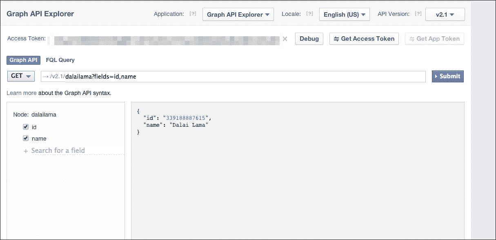

# 附录 A. 附录

在这个社交网络、云计算和移动应用的时代，人们希望与他人保持联系，发表意见，协作构建应用程序，分享输入并提出问题。从[`www.statisticbrain.com/twitter-statistics/`](http://www.statisticbrain.com/twitter-statistics/)中提到的数据可以看出，Twitter 拥有大约 650 万用户，每天有 5800 万条推文。同样，Facebook 的统计数据也令人震惊：13 亿用户使其成为社交网络平台的核心。多年来，GitHub 已经发展成为默认的社交编码平台。因此，Twitter、Facebook 和 GitHub 是最广泛使用的构建应用程序、挖掘数据以及构建与分析相关信息的平台之一。

前几章涵盖了构建 RESTful 服务、添加性能、缓存、安全性以及 RESTful 服务的扩展等主题，本章将重点介绍一些流行的 REST 平台以及它们如何与之前章节中涵盖的不同模式相结合，作为它们的 API 基础设施的一部分。

本章将涵盖以下主题：

+   GitHub REST API 概述

+   Facebook Open Graph API 概述

+   Twitter REST API 概述

# GitHub REST API 概述

GitHub 已经成为极其流行的社交协作编码平台，用于构建代码以及为其他存储库做出贡献。开发人员使用它来创建、构建和部署软件，使用范围从个人项目到各种企业使用它作为其流程的一部分。GitHub 在其服务的 API 文档中有详尽的文档，网址为[`developer.github.com/v3/`](https://developer.github.com/v3/)。

以下部分详细介绍了 GitHub 如何处理我们在之前章节中涵盖的所有不同模式。

## 从 GitHub 获取详细信息

以下命令显示了如何使用未经身份验证的 cURL 命令来获取用户的数据，获取存储库的详细信息等。

以下命令获取`javaee-samples`用户的详细信息：

```java
curl https://api.github.com/users/javaee-samples
{
 "login": "javaee-samples",
 "id": 6052086,
 "avatar_url": "https://avatars.githubusercontent.com/u/6052086?",
 "gravatar_id": null,
 "url": "https://api.github.com/users/javaee-samples",
 "html_url": "https://github.com/javaee-samples",
 "followers_url": "https://api.github.com/users/javaee-samples/followers",
 "following_url": "https://api.github.com/users/javaee-samples/following{/other_user}",
 "gists_url": "https://api.github.com/users/javaee-samples/gists{/gist_id}",
 "starred_url": "https://api.github.com/users/javaee-samples/starred{/owner}{/repo}",
 "subscriptions_url": "https://api.github.com/users/javaee-samples/subscriptions",
 "organizations_url": "https://api.github.com/users/javaee-samples/orgs",
 "repos_url": "https://api.github.com/users/javaee-samples/repos",
 "events_url": "https://api.github.com/users/javaee-samples/events{/privacy}",
 "received_events_url": "https://api.github.com/users/javaee-samples/received_events",
 "type": "Organization",
 "site_admin": false,
 "name": "JavaEE Samples",
 "company": null,
 "blog": "https://arungupta.ci.cloudbees.com/",
 "location": null,
 "email": null,
 "hireable": false,
 "bio": null,
 "public_repos": 11,
 "public_gists": 0,
 "followers": 0,
 "following": 0,
 "created_at": "2013-11-27T17:17:00Z",
 "updated_at": "2014-07-03T16:17:51Z"

```

### 注意

如前述命令所示，前述响应中有不同的 URL，可用于获取关注者、提交等详细信息。这种呈现 URL 的方式与我们在本书早期使用`links`、`href`、`rel`等方式介绍的 HATEOAS 示例不同。这显示了不同平台选择不同方式提供连接服务的方式，这是不言自明的。

要获取用户的存储库并进行分页，可以使用如下查询：

```java
curl https://api.github.com/users/javaee-samples/repos?page=1&per_page=10
…..

```

GitHub API 使用 OAuth2 来对用户进行身份验证。所有使用 GitHub API 的开发人员都需要注册他们的应用程序。注册的应用程序会被分配一个唯一的客户端 ID 和客户端密钥。

有关为用户获取经过身份验证的请求的更多详细信息，请查看[`developer.github.com/v3/oauth/`](https://developer.github.com/v3/oauth/)。

## 动词和资源操作

以下表格涵盖了 GitHub API 如何使用动词来执行特定资源的操作：

| 动词 | 描述 |
| --- | --- |
| `HEAD` | 用于获取 HTTP 头信息 |
| `GET` | 用于检索资源，比如用户详细信息 |
| `POST` | 用于创建资源，比如合并拉取请求 |
| `PATCH` | 用于对资源进行部分更新 |
| `PUT` | 用于替换资源，比如更新用户 |
| `DELETE` | 用于删除资源，比如将用户移除为协作者 |

## 版本控制

GitHub API 在其 URI 中使用版本 v3。API 的默认版本可能会在将来更改。如果客户端依赖于特定版本，他们建议明确发送一个`Accept`头，如下所示：

```java
Accept: application/vnd.github.v3+json
```

## 错误处理

如第二章中所述，*资源设计*，客户端错误由`400 错误`代码表示。GitHub 使用类似的约定来表示错误。

如果使用 API 的客户端发送无效的 JSON，则会返回`400 Bad Request`响应给客户端。如果使用 API 的客户端在请求体中漏掉了字段，则会返回`422 Unprocessable Entity`响应给客户端。

## 速率限制

GitHub API 还支持速率限制，以防止服务器因某些恶意客户端的过多请求而导致失败。对于使用**基本身份验证**或**OAuth**的请求，客户端每小时最多可以发出 5,000 个请求。对于未经身份验证的请求，客户端每小时的速率限制为 60 个请求。GitHub 使用**X-RateLimit-Limit**、**X-RateLimit-Remaining**和**X-RateLimit-Reset**头来告知速率限制的状态。

因此，我们已经介绍了 GitHub API 的细节，介绍了他们选择如何实现本书中迄今为止介绍的一些 REST 原则。下一节将介绍 Facebook Open Graph REST API，涵盖版本控制、错误处理、速率限制等主题。

# Facebook Graph API 概述

Facebook Graph API 是从 Facebook 数据中获取信息的一种方式。使用 HTTP REST API，客户端可以执行各种任务，如查询数据、发布更新和图片、获取相册和创建相册、获取节点的点赞数、获取评论等。下一节将介绍如何访问 Facebook Graph API。

### 注意

在 Web 上，Facebook 使用 OAuth 2.0 协议的变体进行身份验证和授权。原生的 Facebook 应用程序用于 iOS 和 Android。

要使用 Facebook API，客户端需要获取一个访问令牌来使用 OAuth 2.0。以下步骤显示了如何创建应用程序 ID 和密钥，然后获取访问令牌来执行对 Facebook 数据的查询：

1.  前往[developers.facebook.com/apps](http://developers.facebook.com/apps)。您可以创建一个新的应用程序。创建应用程序后，您将被分配应用程序 ID 和密钥，如下面的屏幕截图所示：

1.  一旦您获得了应用程序 ID 和密钥，就可以获取访问令牌并执行对 Facebook 数据的查询。

### 注意

Facebook 有一个特殊的`/me`端点，对应于正在使用访问令牌的用户。要获取用户的照片，请求可以如下所示：

`GET /graph.facebook.com/me/photos`

1.  要发布消息，用户可以调用如下简单的 API：

```java
      POST /graph.facebook.com/me/feed?message="foo"
       &access_token="…."
```

1.  要使用 Graph Explorer 获取您的 ID、名称和照片的详细信息，查询如下：

```java
https://developers.facebook.com/tools/explorer?method=GET&path=me%3Ffields=id,name
```

1.  下面的屏幕截图显示了一个 Graph API Explorer 查询，节点为`dalailama`。点击 ID 可以查看节点的更多详细信息。

因此，我们看到如何使用 Graph API Explorer 应用程序来构建社交图中节点的查询。我们可以通过各种字段（如 ID 和名称）进行查询，并尝试使用`GET`、`POST`或`DELETE`等方法。

## 动词和资源操作

下表总结了 Facebook Graph API 中常用的动词：

| 动词 | 描述 |
| --- | --- |
| `GET` | 用于检索资源，如动态、相册、帖子等 |
| `POST` | 用于创建资源，如动态、帖子、相册等 |
| `PUT` | 用于替换资源 |
| `DELETE` | 用于删除资源 |

### 提示

一个重要的观察是，Facebook Graph API 使用`POST`而不是`PUT`来更新资源。

## 版本控制

Graph API 目前使用的是 2014 年 8 月 7 日发布的 2.1 版本。客户端可以在请求 URL 中指定版本。如果客户端没有指定版本，Facebook Open Graph API 将默认使用最新可用的版本。每个版本保证在 2 年内可用，之后如果客户端使用旧版本进行任何调用，它们将被重定向到 API 的最新版本。

## 错误处理

以下片段显示了失败的 API 请求的错误响应：

```java
    {
       "error": {
         "message": "Message describing the error",
         "type": "OAuthException",
         "code": 190 ,
        "error_subcode": 460
       }
     }
```

如前面的代码所示，错误消息中有称为`code`和`error_subcode`的 JSON 对象，可用于找出问题所在以及恢复操作。在这种情况下，`code`的值是`190`，这是一个`OAuthException`值，而`error_subcode`值为`460`，表示密码可能已更改，因此`access_token`无效。

## 速率限制

Facebook Graph API 根据使用 API 的实体是用户、应用程序还是广告，具有不同的速率限制政策。当用户的调用超过限制时，用户将被阻止 30 分钟。有关更多详细信息，请查看[`developers.facebook.com/docs/reference/ads-api/api-rate-limiting/`](https://developers.facebook.com/docs/reference/ads-api/api-rate-limiting/)。下一节将介绍 Twitter REST API 的详细信息。

# Twitter API 概述

Twitter API 具有 REST API 和 Streaming API，允许开发人员访问核心数据，如时间线、状态数据、用户信息等。

Twitter 使用三步 OAuth 进行请求。

### 注意

**Twitter API 中 OAuth 的重要方面**

客户端应用程序不需要存储登录 ID 和密码。应用程序发送代表用户的访问令牌，而不是使用用户凭据的每个请求。

为了成功完成请求，`POST`变量、查询参数和请求的 URL 始终保持不变。

用户决定哪些应用程序可以代表他，并随时可以取消授权。

每个请求的唯一标识符（`oauth_nonce`标识符）防止重放相同的请求，以防它被窥探。

对于向 Twitter 发送请求，大多数开发人员可能会发现初始设置有点令人困惑。[`blog.twitter.com/2011/improved-oauth-10a-experience`](https://blog.twitter.com/2011/improved-oauth-10a-experience)的文章显示了如何创建应用程序、生成密钥以及使用 OAuth 工具生成请求。

以下是 Twitter 中 OAuth 工具生成的请求示例，显示了获取`twitterapi`句柄状态的查询：

### 注意

Twitter API 不支持未经身份验证的请求，并且具有非常严格的速率限制政策。

```java
curl --get 'https://api.twitter.com/1.1/statuses/user_timeline.json' --data 'screen_name=twitterapi' --header 'Authorization: OAuth oauth_consumer_key="w2444553d23cWKnuxrlvnsjWWQ", oauth_nonce="dhg2222324b268a887cdd900009ge4a7346", oauth_signature="Dqwe2jru1NWgdFIKm9cOvQhghmdP4c%3D", oauth_signature_method="HMAC-SHA1", oauth_timestamp="1404519549", oauth_token="456356j901-A880LMupyw4iCnVAm24t33HmnuGOCuNzABhg5QJ3SN8Y", oauth_version="1.0"'—verbose.

```

这会产生如下输出：

```java
GET /1.1/statuses/user_timeline.json?screen_name=twitterapi HTTP/1.1
Host: api.twitter.com
Accept: */*
 HTTP/1.1 200 OK
…
"url":"http:\/\/t.co\/78pYTvWfJd","entities":{"url":{"urls":[{"url":"http:\/\/t.co\/78pYTvWfJd","expanded_url":"http:\/\/dev.twitter.com","display_url":"dev.twitter.com","indices":[0,22]}]},"description":{"urls":[]}},"protected":false,"followers_count":2224114,"friends_count":48,"listed_count":12772,"created_at":"Wed May 23 06:01:13 +0000 2007","favourites_count":26,"utc_offset":-25200,"time_zone":"Pacific Time (US & Canada)","geo_enabled":true,"verified":true,"statuses_count":3511,"lang":"en","contributors_enabled":false,"is_translator":false,"is_translation_enabled":false,"profile_background_color":"C0DEED","profile_background_image_url":"http:\/\/pbs.twimg.com\/profile_background_images\/656927849\/miyt9dpjz77sc0w3d4vj….

```

## 动词和资源操作

以下表格总结了 Twitter REST API 中常用的动词：

| 动词 | 描述 |
| --- | --- |
| `GET` | 用于检索资源，如用户、关注者、收藏夹、订阅者等。 |
| `POST` | 用于创建资源，如用户、关注者、收藏夹、订阅者等。 |
| `POST`与动词`update` | 用于替换资源。例如，要更新友谊关系，URL 将是`POST friendships/update`。 |
| `POST`与动词`destroy` | 用于删除资源，如删除直接消息、取消关注某人等。例如，URL 将是`POST direct_messages/destroy`。 |

## 版本控制

Twitter API 的当前版本是 1.1。它仅支持 JSON，不再支持 XML、RSS 或 Atom。使用 Twitter API 版本 1.1，所有客户端都需要使用 OAuth 进行身份验证以进行查询。Twitter API 版本 1.0 已被弃用，有 6 个月的时间窗口来迁移到新版本。

## 错误处理

Twitter API 在对 REST API 的响应中返回标准的 HTTP 错误代码。成功时返回`200 OK`。当没有数据返回时返回`304 Not Modified`，当认证凭据丢失或不正确时返回`401 Not Authorized`，当出现故障并需要发布到论坛时返回`500 Internal Server Error`等等。除了详细的错误消息，Twitter API 还生成可机器读取的错误代码。例如，响应中的错误代码`32`意味着服务器无法对用户进行身份验证。更多详情，请查看[`dev.twitter.com/docs/error-codes-responses`](https://dev.twitter.com/docs/error-codes-responses)。

# 推荐阅读

以下部分提供了一些链接，可能对您有所帮助：

+   Facebook 工具：[`developers.facebook.com/tools/`](https://developers.facebook.com/tools/)

+   Twurl（为 Twitter 启用 OAuth 的 cURL）：[`github.com/twitter/twurl`](https://github.com/twitter/twurl)

+   GitHub API 文档：[`developer.github.com/v3/`](https://developer.github.com/v3/)

+   Twitter API 文档：[`dev.twitter.com/docs/api/1.1`](https://dev.twitter.com/docs/api/1.1)

+   Stripe API 文档：[`stripe.com/docs/api`](https://stripe.com/docs/api)

# 摘要

本附录是一份由流行平台（如 GitHub、Facebook 和 Twitter）实施的 API 的简要集合，以及它们处理各种 REST 模式的方法。尽管用户可以通过 REST API 的数据做出多种可能性，但这些框架之间的共同点是使用 REST 和 JSON。这些平台的 REST API 由 Web 和移动客户端使用。本附录涵盖了这些平台如何处理版本控制、动词、错误处理，以及基于 OAuth 2.0 对请求进行认证和授权。

本书从 REST 的基础知识和如何构建自己的 RESTful 服务开始。从那时起，我们涵盖了各种主题以及构建可扩展和高性能的 REST 服务的技巧和最佳实践。我们还参考了各种库和工具，以改进 REST 服务的测试和文档，以及实时 API 的新兴标准。我们还涵盖了使用 WebSockets、WebHooks 以及 REST 的未来的案例研究。

我们希望我们的这一努力能帮助您更好地理解、学习、设计和开发未来的 REST API。
