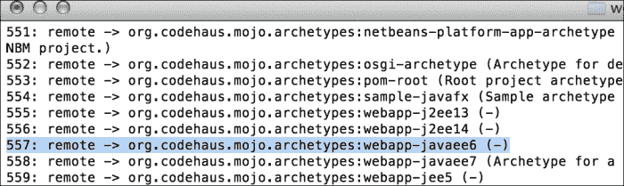
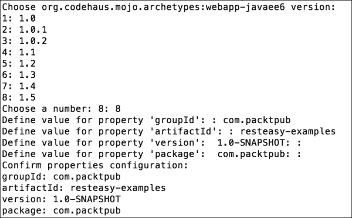
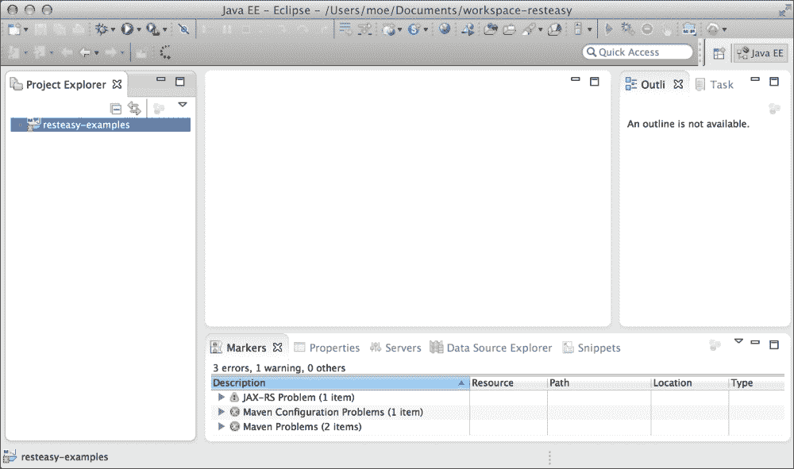
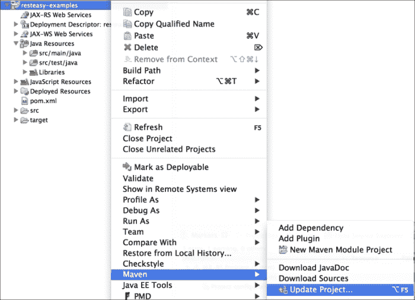
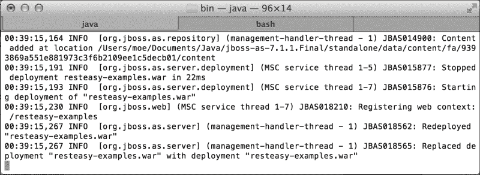
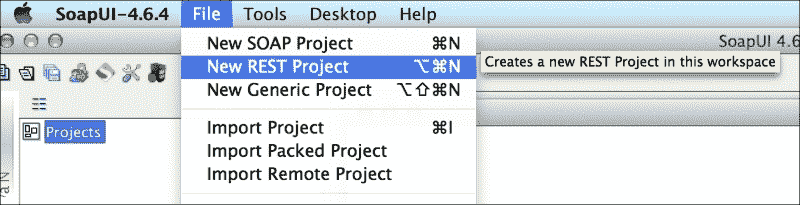
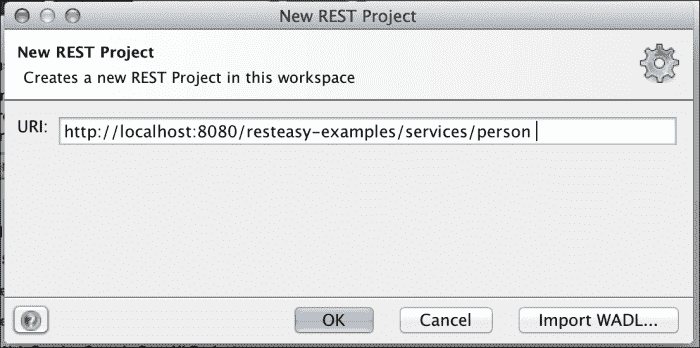
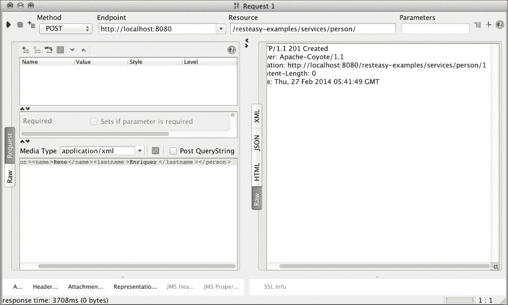
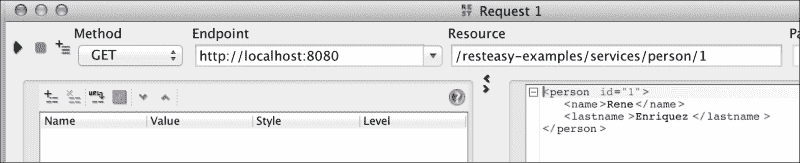

# 第一章：设置环境

我们诚挚地欢迎您来到我们旅程的第一章。让我们给您一个关于您将在这里实现的想法。阅读完本章后，您将拥有设置开发环境以处理 RESTful Web 服务所需的基本和激动人心的知识。然后，您将熟悉与其相关的一个非常基本的项目的开发。此外，在最后，您将非常清楚地了解如何使用 RESTful Web 服务创建应用程序以及如何实现这一点。本章将为您提供使用这种类型的 Web 服务的信息，以一种非常简单和全面的方式。

在本章中，我们将涵盖以下主题：

+   安装开发环境

+   创建我们的第一个 RESTful Web 服务应用程序

+   测试 RESTful Web 服务

# 下载工具

首先，我们必须获取我们的工作工具，以便投入编码。这里指定的工具在全世界范围内使用，但您可以自由选择您的工具。记住，“工具不会使艺术家”。无论您使用 Windows、MAC OS X 还是 Linux；每个操作系统都有可用的工具。

让我们简要解释一下每个工具的用途。我们将使用 Eclipse 作为我们的 IDE 来开发示例，JBoss AS 7.1.1.Final 作为我们的应用服务器，Maven 来自动化构建过程，并使用 SoapUI 作为测试我们将创建的 Web 服务功能的工具。此外，我们建议您安装最新版本的 JDK，即 JDK 1.7.x。为了帮助，我们已经获取并包含了一些链接，您需要使用这些链接来获取实现第一个示例所需的软件。每个链接都会为您提供有关每个工具的更多信息，如果您还不了解它们，这可能会对您有所帮助。

## 下载链接

必须下载以下工具：

+   Eclipse IDE for Java EE Developers 4.3（[`www.eclipse.org/downloads/`](http://www.eclipse.org/downloads/)）

+   JBoss AS 7.1.1 Final（[`www.jboss.org/jbossas/downloads/`](http://www.jboss.org/jbossas/downloads/)）

+   Apache Maven 3.1.1 或更高版本（[`maven.apache.org/download.cgi`](http://maven.apache.org/download.cgi)）

+   SoapUI 4.6 或更高版本（[`www.soapui.org/`](http://www.soapui.org/)）

+   JDK 1.7.x（[`www.oracle.com/technetwork/java/javase/downloads/jdk7-downloads-1880260.html`](http://www.oracle.com/technetwork/java/javase/downloads/jdk7-downloads-1880260.html)）

# 创建基本项目

为了使构建我们的示例项目的过程更容易，我们将使用 Maven。这个神奇的软件将在眨眼之间创建一个基本项目，我们的项目可以很容易地编译和打包，而不依赖于特定的 IDE。

Maven 使用原型来创建特定类型的项目。原型是预先创建的项目模板；它们允许我们创建各种应用程序，从 Java 桌面应用程序到多模块项目，其中 EAR 可以包含多个工件，如 JAR 和 WAR。它的主要目标是通过提供演示 Maven 许多功能的示例项目，尽快让用户上手运行。如果您想了解更多关于 Maven 的信息，可以访问[`maven.apache.org/`](http://maven.apache.org/)。

然而，我们在这里描述的信息足以继续前进。我们将使用原型来创建一个基本项目；如果我们想更具体，我们将使用原型来创建一个带有 Java 的 Web 应用程序。为此，我们将在终端中输入以下命令行：

```java
mvn archetype:generate

```

当我们在终端中执行这个命令行时，我们将获得 Maven 仓库中所有可用的原型。因此，让我们寻找我们需要的原型，以便创建我们的 Web 应用程序；它的名称是`webapp-javaee6`，属于`org.codehaus.mojo.archetypes`组。此外，我们可以使用一个代表其 ID 的数字进行搜索；这个数字是`557`，如下面的屏幕截图所示。我们建议您按名称搜索，因为数字可能会改变，因为以后可能会添加其他原型：



将会出现几个问题；我们必须为每个问题提供相应的信息。Maven 将使用这些信息来创建我们之前选择的原型，如下面的屏幕截图所示：



您可能已经注意到，每个问题都要求您定义一个属性，每个属性的解释如下：

+   `groupId`：此属性表示公司的域名倒序；这样我们就可以识别出代码的所有者是哪家公司

+   `artifactId`：此属性表示项目的名称

+   `version`：此属性表示项目的版本

+   `package`：此属性表示要添加类的基本包名称

类名和包名共同构成了类的全名。这个全名允许以独特的方式识别类名。有时，当有几个具有相同名称的类时，包名有助于识别它属于哪个库。

下一步是将项目放入 Eclipse 的工作空间；为此，我们必须通过**文件** | **导入** | **Maven** | **现有的 Maven 项目**来将我们的项目导入 Eclipse。

我们应该在 IDE 中看到项目，如下面的屏幕截图所示：



在继续之前，让我们解决`pom.xml`文件中出现的问题。

下面代码中显示的错误与来自 Eclipse 和 Maven 集成的错误有关。为了解决这个问题，我们必须在`<build>`标签之后添加`<pluginManagement>`标签。

`pom.xml`文件应该如下所示：

```java
<project  
  xsi:schemaLocation="http://maven.apache.org/POM/4.0.0 http://maven.apache.org/xsd/maven-4.0.0.xsd">
  <modelVersion>4.0.0</modelVersion>

  <groupId>com.packtpub</groupId>
  <artifactId>resteasy-examples</artifactId>
  <version>1.0-SNAPSHOT</version>
  <packaging>war</packaging>

  . . .

  <build>
 <pluginManagement>
      <plugins>
        <plugin>
          . . .
        </plugin>
      </plugins>
 </pluginManagement>
  </build>

</project>
```

### 提示

**下载示例代码**

您可以从您在[`www.packtpub.com`](http://www.packtpub.com)购买的所有 Packt 图书的帐户中下载示例代码文件。如果您在其他地方购买了这本书，您可以访问[`www.packtpub.com/support`](http://www.packtpub.com/support)并注册，文件将直接发送到您的邮箱。此外，我们强烈建议从 GitHub 上获取可在[`github.com/restful-java-web-services-security`](https://github.com/restful-java-web-services-security)上获得的源代码。

这将修复错误，现在我们只需要更新项目中 Maven 的配置，如下面的屏幕截图所示：



刷新项目后，错误应该消失，因为当我们更新 Maven 的配置时，实际上是在更新我们项目的依赖项，比如缺少的库。通过这样做，我们将把它们包含在我们的项目中，错误将消失。

在`src/main/webapp`路径下，让我们创建`WEB-INF`文件夹。

现在，在`WEB-INF`文件夹中，我们将创建一个名为`web.xml`的新文件，内容如下：

```java
<?xml version="1.0" encoding="UTF-8"?>
<web-app version="3.0" 

  xsi:schemaLocation="http://java.sun.com/xml/ns/javaee 
  http://java.sun.com/xml/ns/javaee/web-app_3_0.xsd">
</web-app>
```

当您保护您的应用程序时，这个文件非常有用；这一次，我们将在没有任何配置的情况下创建它。目前，`/WEB-INF`文件夹和`web.xml`文件只定义了 Web 应用程序的结构。

# 第一个功能示例

现在我们的开发环境已经设置好了，是时候动手写第一个 RESTful web 服务了。由于我们使用的是 JBoss，让我们使用 JAX-RS 的 RESTEasy 实现。我们将开发一个非常简单的示例；假设您想要实现一个保存和搜索人员信息的服务。

首先，我们创建一个简单的`Person`领域类，它使用 JAXB 注解。JAXB 在 XML 和 Java 之间进行对象的编组/解组。在这个例子中，我们将把这些实例存储在内存缓存中，而不是数据库中。在 JEE 中，这通常表示关系数据库中的一个表，每个实体实例对应该表中的一行，如下面的代码所示：

```java
package com.packtpub.resteasy.entities;

import javax.xml.bind.annotation.XmlAccessType;
import javax.xml.bind.annotation.XmlAccessorType;
import javax.xml.bind.annotation.XmlAttribute;
import javax.xml.bind.annotation.XmlElement;
import javax.xml.bind.annotation.XmlRootElement;

@XmlRootElement(name = "person")
@XmlAccessorType(XmlAccessType.FIELD)
public class Person {

  @XmlAttribute
  protected int id;

  @XmlElement
  protected String name;

  @XmlElement
  protected String lastname;

  public int getId() {
    return id;
  }

  public void setId(int id) {
    this.id = id;
  }

  public String getName() {
    return name;
  }

  public void setName(String name) {
    this.name = name;
  }

  public String getLastname() {
    return lastname;
  }

  public void setLastname(String lastname) {
    this.lastname = lastname;
  }

}
```

接下来，我们在`com.packtpub.resteasy.services`包中创建一个名为`PersonService`的新类。这个类将有两个方法；一个用于注册新的人员，另一个用于按 ID 搜索人员。这个类将使用内存映射缓存来存储人员。

该服务将有以下实现：

```java
package com.packtpub.resteasy.services;

import java.net.URI;
import java.util.HashMap;
import java.util.Map;

import javax.ws.rs.Consumes;
import javax.ws.rs.GET;
import javax.ws.rs.POST;
import javax.ws.rs.Path;
import javax.ws.rs.PathParam;
import javax.ws.rs.Produces;
import javax.ws.rs.WebApplicationException;
import javax.ws.rs.core.Response;

import com.packtpub.resteasy.entities.Person;

@Path("/person")
public class PersonService {
  private Map<Integer, Person> dataInMemory;
  public PersonService() {
    dataInMemory = new HashMap<Integer, Person>();
  }

  @POST
  @Consumes("application/xml")
  public Response savePerson(Person person) {
    int id = dataInMemory.size() + 1;
    person.setId(id);
    dataInMemory.put(id, person);
    return Response.created(URI.create("/person/" + id)).build();
  }

  @GET
  @Path("{id}")
  @Produces("application/xml")
  public Person findById(@PathParam("id") int id) {
    Person person = dataInMemory.get(id);
    if (person == null) {
      throw new WebApplicationException(Response.Status.NOT_FOUND);
    }
    return person;
  }
}
```

`@Path`注解定义了 URL 中的路径，该路径将在此类中编写的功能中可用。用`@Post`注解的方法表示应该进行 HTTP POST 请求。此外，它用`@Consumes`注解，并使用`application`/`xml`值；这意味着 POST 请求将以 XML 格式的字符串执行，其中包含要保存的人员的信息。另一方面，要通过 ID 查找一个人，你必须进行 HTTP GET 请求。URL 必须以与方法上的`@Path`注解指示的方式指示 ID。`@Produces`注解表示我们将以 XML 格式获得响应。最后，请注意，参数 ID，如`@Path`注解中所示，被用作方法的参数，使用`@PathParam`注解。

最后，我们编写一个类，它将扩展`Application`类，并将我们刚刚创建的服务设置为单例。这样，信息在每个请求中不会丢失，我们将把它保存在内存中，如下所示：

```java
package com.packtpub.resteasy.services;

import java.util.HashSet;
import java.util.Set;

import javax.ws.rs.ApplicationPath;
import javax.ws.rs.core.Application;

@ApplicationPath("/services")
public class MyRestEasyApplication extends Application {

  private Set<Object> services;

  public MyRestEasyApplication() {
    services = new HashSet<Object>();
    services.add(new PersonService());
  }

  @Override
  public Set<Object> getSingletons() {
    return services;
  }
}
```

请注意，由于我们使用 JAXB 映射了我们的实体，我们的方法在 XML 格式中消耗和产生信息。

为了在 JBoss 中部署我们的应用程序，我们应该在`pom.xml`文件中添加一个依赖项。这个依赖项必须引用 JBoss 插件。我们必须更改`pom.xml`中生成的构件名称。默认值是`artifactId`文件，后跟版本；例如，`resteasy-examples-1.0-snapshot.war`。我们将设置它，所以我们将只使用`artifactId`文件；在这种情况下，`resteasy-examples.war`。所有这些配置必须包含、修改和实现在`pom.xml`中，如下面的 XML 代码所示：

```java
  <build>
 <finalName>${artifactId}</finalName>
    <pluginManagement>
      <plugins>
        <plugin>
          <groupId>org.jboss.as.plugins</groupId>
          <artifactId>jboss-as-maven-plugin</artifactId>
          <version>7.5.Final</version>
          <configuration>
            <jbossHome>/pathtojboss/jboss-as-7.1.1.Final</jbossHome>
          </configuration>
        </plugin>
        ...
        </plugin>
      </plugins>
    </pluginManagement>
  </build>
```

您应该更改`jbossHome`属性的值为您的 JBoss 安装路径。之后，我们将使用命令终端；前往项目目录，并输入`mvn jboss-as:run`。如果在执行命令后对代码进行任何更改，则应使用以下命令以查看更改：

```java
mvn jboss-as:redeploy

```

Run 和 redeploy 是这个插件的目标。如果您想了解有关此插件的更多目标，请访问[`docs.jboss.org/jbossas/7/plugins/maven/latest/`](https://docs.jboss.org/jbossas/7/plugins/maven/latest/)。这将再次编译所有项目类；然后将其打包以创建`.war`文件。最后，修改将部署到服务器上。如果一切正常，我们应该在终端看到一条消息，说明部署已成功完成，如下面的截图所示：



本章的源代码可在 GitHub 的以下位置找到：

[`github.com/restful-java-web-services-security/source-code/tree/master/chapter01`](https://github.com/restful-java-web-services-security/source-code/tree/master/chapter01)

## 测试示例 Web 服务

此时，我们将测试我们刚刚创建的功能。我们将使用 SoapUI 作为我们的测试工具；确保您使用最新版本，或者至少是 4.6.x 或更高版本，因为这个版本提供了更多功能来测试 RESTful Web 服务。让我们从执行以下步骤开始：

1.  从主菜单开始，让我们通过导航到**文件** | **新建 REST 项目**来创建一个新的 REST 项目，如下面的屏幕截图所示：

1.  设置我们服务的 URI，如下所示：

1.  之后，让我们使用工作区的`POST`方法创建一个新的人。在**媒体类型**字段中，选择**application/xml**，并使用包含信息的 XML 字符串进行请求，如下文所示：

```java
<person><name>Rene</name><lastname>Enriquez</lastname></person>
```

1.  当我们点击**播放**按钮时，我们应该得到一个答案，其中显示了创建的资源 URI（超链接"`http://localhost:8080/resteasy-examples/services/person/1`"），如下面的屏幕截图所示：

1.  如果我们在 SoapUI 的**资源**文本框中更改 URI 并使用`GET`方法，它将显示我们刚刚输入的数据，如下面的屏幕截图所示：

恭喜！我们已经开发了我们的第一个功能性的 RESTful Web 服务，具有两个功能。第一个是将人们的信息保存在内存中，第二个是通过 ID 检索人们的信息。

### 注意

如果重新启动 JBoss 或重新部署应用程序，所有数据将丢失。在搜索人员信息之前，您必须先保存数据。

# 总结

在本章中，我们创建了我们的第一个功能性应用程序——类似于*hello world*示例，但具有更接近真实世界的功能。

在本章中，我们涵盖的基本部分是熟悉我们将使用的工具。在后面的章节中，我们将假设这些概念已经清楚。例如，当使用 SoapUI 时，我们将逐步向前推进，因为这是一个将简化我们将要开发的功能测试任务的工具。这样，我们就可以避免为 Web 服务客户端编写代码的任务。

现在我们准备好审查下一章，其中包含 Java 提供的一些安全模型。我们将了解每一个模型，并学习如何实现它们。
