# 第二章：保护 Web 服务的重要性

看看你，你已经到了第二章；恭喜！这一章非常重要，因为它与软件中隐含的概念相关，即**安全性**。这非常重要，因为软件被公司和像我们这样的人使用。有时，我们通过软件共享非常重要和机密的信息，这就是为什么这个主题对每个人都如此重要。

在本章中，我们将带您了解与计算机系统安全管理相关的基本方面。

我们将探索和实施不同的安全机制以及可以使用它们的场景。

此外，您将学习如何使用协议分析器。这将使我们能够演示攻击如何执行以及攻击达到目标时的影响，本例中是我们的信息。此外，您将能够想象更多的选项来在 Web 服务中实施安全性。

由于一切都需要实践，您将通过一个简单的代码示例了解认证和授权之间的区别。准备好迎接一个有趣且有用的主题。

在本章中，我们将涵盖以下内容：

+   理解安全管理的重要性

+   探索和实施不同的安全机制

+   使用协议分析器拦截请求

+   理解认证和授权之间的区别

# 安全性的重要性

在设计应用程序时，安全管理是需要考虑的主要方面之一。

无论如何，组织的功能或信息都不能对所有用户完全开放而没有任何限制。考虑一个人力资源管理应用程序的情况，它允许您查询员工的工资，例如：如果公司经理需要了解其员工的工资，这并不是什么重要的事情。然而，在同样的情境中，想象一下其中一名员工想要了解其同事的工资；如果对这些信息的访问完全开放，可能会在工资不同的员工之间产生问题。

更为关键的例子可能是银行 XYZ 每当客户或第三方使用 ATM 向其账户之一存款时都会增加银行余额。IT 经理设想这种功能可能会很普遍，并决定将其实施为 Web 服务。目前，此功能仅限于登录到使用此 Web 服务的应用程序的银行用户。假设 IT 经理对未来的设想成真，并且现在需要从 ATM 进行此功能；提出这一要求迅速表明此功能已实施，并且可以通过调用 Web 服务来使用。到目前为止，可能没有安全漏洞，因为 ATM 可能具有控制访问的安全系统，因此操作系统对 Web 服务功能的访问也间接受到控制。

现在，想象一下，公司 ABC 想要一个类似的功能，以增加其员工银行账户中的余额，以表彰其对公司的某种贡献。Web 服务的功能会发生什么变化？您认为您可以再次信任处理自己安全方案的应用程序来控制对其功能的访问吗？即使我们信任这种机制，如果请求被嗅探器拦截会怎么样？那么，任何知道如何执行请求的人都可以增加余额。这些问题在回答时以相当合乎逻辑的方式得到了解答。因此，这些场景现在听起来相当合乎逻辑，因此，认证用户以访问此功能的是 Web 服务，并且应该在任何情况下都信任其管理方案安全系统。无论调用是来自组织本身还是来自外部机构，都必须存在安全控制，以暴露像我们刚刚概述的这样的敏感功能。

在通过 Web 服务共享现有信息或功能时，众所周知，我们不依赖于编程语言、架构或系统平台进行交互。这使我们具有灵活性，并使我们免于重写现有功能。此外，我们应该了解这些功能对数据机密性的影响，因为我们将与实体或系统共享信息和/或功能。这样，我们可以实现业务目标，并确保入侵者无法阅读我们的信息；甚至更糟的是，未经授权的第三方可以访问我们的服务所暴露的功能。因此，对它们的访问必须进行严格分析，并且我们暴露的服务必须得到正确的保障。

# 安全管理选项

Java 提供了一些安全管理选项。现在，我们将解释其中一些，并演示如何实现它们。所有认证方法实际上都基于客户端向服务器传递凭据。有几种方法可以执行这一点，包括：

+   基本认证

+   摘要认证

+   客户端证书认证

+   使用 API 密钥

使用 Java 构建的应用程序的安全管理，包括具有 RESTful Web 服务的应用程序，始终依赖于 JAAS。

Java 身份验证和授权服务（JAAS）是 Java 平台企业版的一部分。因此，它是处理 Java 应用程序安全性的默认标准；它允许您实现授权，并允许对应用程序进行身份验证控制，以保护属于应用程序的资源。如果您想了解更多关于 JAAS 的信息，可以查看以下链接：

[`docs.oracle.com/javase/7/docs/technotes/guides/security/jaas/tutorials/GeneralAcnOnly.html`](http://docs.oracle.com/javase/7/docs/technotes/guides/security/jaas/tutorials/GeneralAcnOnly.html)

如果您不想使用 JAAS，当然可以创建我们自己的实现来处理安全性，但这将很困难。那么，为什么不通过实现这项有用的技术来节省时间、精力和平静呢？建议尽可能使用标准实现。在我们的开发练习中，我们将使用 JAAS 来进行前三种认证方法。

## 授权和认证

当您使用这些术语时，很容易感到困惑，但在安全系统方法中，它们具有不同的含义。为了澄清这些术语，我们将在本节中对它们进行解释。

### 认证

简而言之，这个术语指的是*您是谁*。这是识别用户的过程，通常通过他们的*用户名*和*密码*。当我们使用这个概念时，我们试图确保用户的身份，并验证用户声称的身份。此外，这与用户的访问权限无关。

安全研究已经指定了一系列应该验证的因素，以实现积极的身份验证。这个清单包含三个元素，通常使用其中两个是很常见的，但最好使用全部。这些元素包括：

+   **知识因素**：这个元素意味着用户**知道**的东西，例如密码、口令或个人识别号码（PIN）。另一个例子是挑战响应，用户必须回答问题，软件令牌或作为软件令牌的电话。

+   **所有权因素**：这是用户*拥有*的东西，例如手环（在物理身份验证的情况下）、身份证、安全令牌或带有内置硬件令牌的手机。

+   **固有因素**：这是用户*是*或*做*的东西，例如指纹或视网膜图案、DNA 序列、签名、面部、声音、独特的生物电信号或其他生物识别标识符。

### 授权

简而言之，这个术语指的是*您可以做什么*。这是给用户权限做或拥有某些东西的过程。当我们谈论软件时，我们有一个系统管理员负责定义用户被允许访问的系统以及使用权限（例如访问哪些文件目录，访问期限，分配的存储空间等）。

授权通常被视为系统管理员设置权限的初始设置，以及在用户获取访问权限时检查已经设置的权限值。

## 访问控制

身份验证和授权的一个非常常见的用途是访问控制。一个计算机系统只能被授权用户使用，必须试图检测和拒绝未经授权的用户。访问由坚持身份验证过程来控制，以建立用户的身份并赋予特定身份的特权。让我们举一些涉及不同场景中身份验证的访问控制的例子，例如：

+   当承包商第一次到达房屋进行工作时要求身份证照片

+   实施验证码作为验证用户是人类而不是计算机程序的一种方式

+   在使用像手机这样的电信网络设备获得的**一次性密码**（**OTP**）作为身份验证密码/PIN 时

+   一个计算机程序使用盲凭证来验证另一个程序

+   当您用护照进入一个国家时

+   当您登录计算机时

+   当一个服务使用确认电子邮件来验证电子邮件地址的所有权

+   使用互联网银行系统

+   当您从 ATM 取款时

有时，便利性会与访问检查的严格性相抵触。例如，一个小额交易通常不需要经过认证人的签名作为交易授权的证明。

然而，安全专家认为不可能绝对确定用户的身份。只能应用一系列测试，如果通过，就被先前声明为确认身份的最低要求。问题在于如何确定哪些测试足够；这取决于公司来确定这个集合。

### 传输层安全

在这一部分，我们强调了 TLS 的一些主要特点：

+   它的前身是**安全套接字层**（**SSL**）

+   这是一个加密协议

+   它提供了互联网上的安全通信

+   它通过 X.509 证书（非对称加密）对对方进行身份验证

+   它允许客户端-服务器应用程序在网络上进行通信，并防止窃听和篡改

+   TLS 通常实现在传输层协议之上

+   它封装了特定于应用程序的协议，如 HTTP、FTP、SMTP、NNTP 和 XMPP

+   应该委托使用 TLS，特别是在执行凭据、更新、删除和任何类型的价值交易时

+   TLS 在现代硬件上的开销非常低，延迟略有增加，但这为最终用户提供了更多的安全性

## 通过提供用户凭据进行基本身份验证

可能，基本身份验证是所有类型应用程序中最常用的技术之一。在用户获得应用程序功能之前，会要求用户输入用户名和密码。两者都经过验证，以验证凭据是否正确（它们属于应用用户）。我们 99%确定您至少曾经执行过这种技术，也许是通过自定义机制，或者如果您使用了 JEE 平台，可能是通过 JAAS。这种控制被称为**基本身份验证**。

这种安全实现的主要问题是凭据以明文方式从客户端传播到服务器。这样，任何嗅探器都可以读取网络上传送的数据包。我们将考虑一个使用名为 Wireshark 的工具的示例；它是一个协议分析器，将显示这个问题。有关安装，我们可以转到链接[`www.wireshark.org/download.html`](http://www.wireshark.org/download.html)。

安装非常基本（一路点击“下一步”）。因此，我们不会展示这些步骤的截图。

现在，我们将修改第一章中的项目，*设置环境*，在该项目中，用户尝试调用 Web 服务的任何功能。用户将被要求输入用户名和密码；一旦这些验证通过，用户将可以访问 Web 服务功能。

为了有一个可工作的示例，让我们启动我们的应用服务器 JBoss AS 7；然后，转到`bin`目录并执行文件`add-user.bat`（对于 UNIX 用户是`.sh`文件）。最后，我们将创建一个新用户，如下所示：

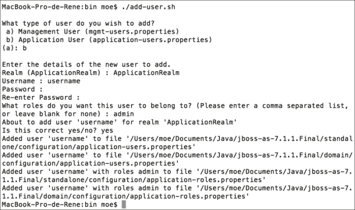

这里最重要的是，您应该在第一个问题中选择“应用用户”并为其分配“管理员”角色。这将与`web.xml`文件中定义的信息相匹配，稍后在我们应用程序内实现安全性时将进行解释。结果，我们将在`JBOSS_HOME/standalone/configuration/application - users.properties`文件中拥有一个新用户。

JBoss 已经设置了一个名为`other`的默认安全域；此域使用我们前面提到的文件中存储的信息进行身份验证。现在，我们将配置应用程序以在`resteasy-examples`项目的`WEB-INF`文件夹中使用此安全域。让我们创建一个名为`jboss-web.xml`的文件，其中包含以下内容：

```java
<?xml version="1.0" encoding="UTF-8"?>
<jboss-web>
  <security-domain>other</security-domain>
</jboss-web>
```

好了，让我们配置文件`web.xml`以聚合安全约束。在下面的代码块中，您将看到应添加的内容。

```java
<?xml version="1.0" encoding="UTF-8"?>
<web-app version="3.0" 

  xsi:schemaLocation="http://java.sun.com/xml/ns/javaee 
  http://java.sun.com/xml/ns/javaee/web-app_3_0.xsd">
 <!-- Roles -->
 <security-role>
 <description>Any rol </description>
 <role-name>*</role-name>
 </security-role>

 <!-- Resource / Role Mapping -->
 <security-constraint>
 <display-name>Area secured</display-name>
 <web-resource-collection>
 <web-resource-name>protected_resources</web-resource-name>
 <url-pattern>/services/*</url-pattern>
 <http-method>GET</http-method>
 <http-method>POST</http-method>
 </web-resource-collection>
 <auth-constraint>
 <description>User with any role</description>
 <role-name>*</role-name>
 </auth-constraint>
 </security-constraint>

 <login-config>
 <auth-method>BASIC</auth-method>
 </login-config>
</web-app>
```

从终端，让我们转到`resteasy-examples`项目的主文件夹，并执行`mvn jboss-as:redeploy`。现在，我们将测试我们的 Web 服务，就像我们在第一章中所做的那样，*设置环境*，使用 SOAP UI。我们将使用`POST`方法向 URL`http://localhost:8080/resteasy-examples/services/person/`发出请求，并使用以下 XML：

```java
<person><name>Rene</name><lastname>Enriquez</lastname></person>
```

我们得到以下响应：

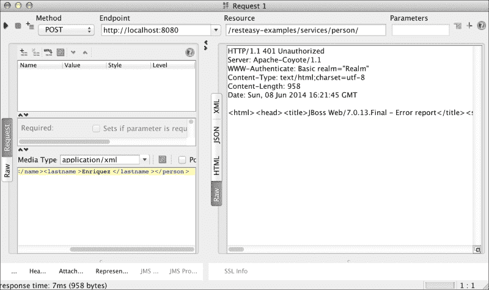

SOAP UI 向我们显示了 HTTP 401 错误，这意味着请求未经授权。这是因为我们在没有向服务器提供凭据的情况下执行了请求。为了做到这一点，我们必须点击 SOAP UI 左下角的(**…**)按钮，并输入我们刚刚创建的用户凭据，如下截图所示：

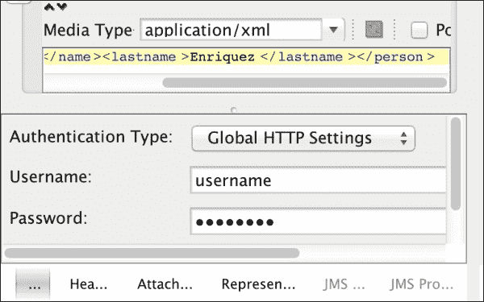

现在是启用我们的流量分析器的时候了。让我们启动 Wireshark，并设置它来分析环回地址内的流量。从**主**菜单，导航到**捕获** | **接口**。

勾选**lo0**选项，如下截图所示，然后点击**开始**按钮。这样，所有通过地址 127.0.0.1 或其等效的本地主机的流量都将被拦截进行分析。

此外，在“过滤器”字段中，我们将输入`http`，以拦截 HTTP 请求和响应，如后面的截图所示：

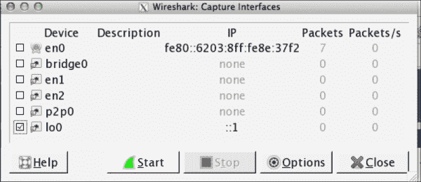

看一下以下截图：

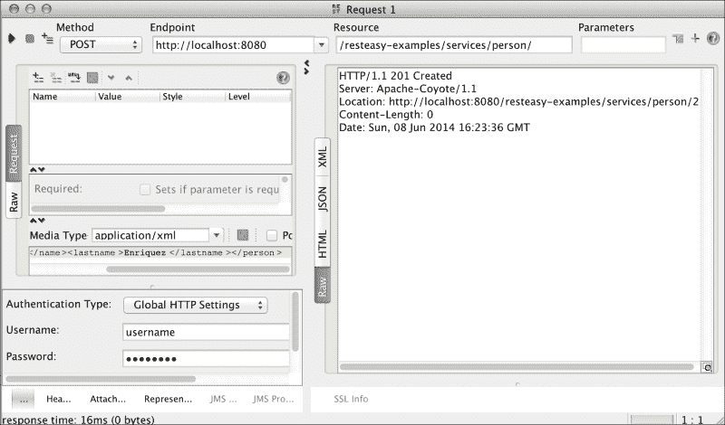

完成这一步后，我们将从 SOAP UI 执行请求操作。再次，SOAP UI 向我们显示了一个 HTTP 201 消息；这次，请求成功处理。您可以在 Wireshark 中看到以下信息列：

+   **编号**：这一栏以唯一方式标识了请求或响应

+   **时间**：这一栏标识了执行操作所需的时间

+   **源**：这一栏标识了请求/响应的发起地址

+   **目的地**：这一栏标识了执行 HTTP 请求/响应的目标 IP 地址

+   **协议**：这一栏标识了请求/响应所执行的协议

+   **长度**：这一栏标识了请求/响应的长度

+   **信息**：这一栏标识了与请求/响应相关的信息

现在，是时候在 Wireshark 上观察信息流量了，如下所示：

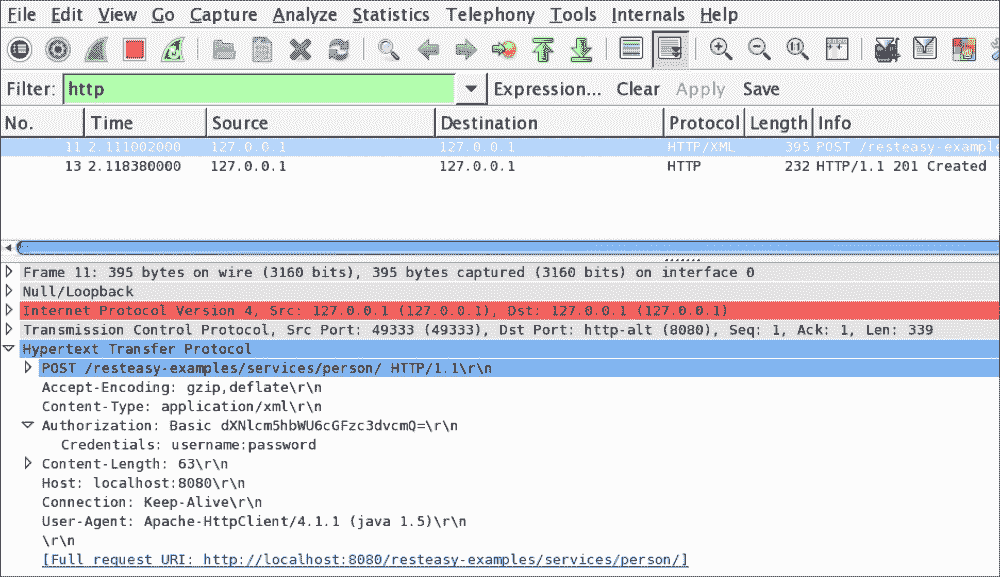

注意 Wireshark 如何显示我们正在使用 HTTP 协议执行 POST（信息）操作，使用 XML 字符串（协议）发送到目标地址`127.0.0.1`（目的地）。此外，您可以读取用户名和密码。因此，这种方法对安全实施来说并不是很安全，因为任何人都可以访问这些信息并进行网络钓鱼攻击。

您可以在以下 URL 找到本章的源代码：

[`github.com/restful-java-web-services-security/source-code/tree/master/chapter02/basic-authentication`](https://github.com/restful-java-web-services-security/source-code/tree/master/chapter02/basic-authentication)

## 摘要访问认证

这种认证方法利用哈希函数对用户输入的密码进行加密，然后再发送到服务器。显然，这比基本认证方法要安全得多，基本认证方法中，用户的密码以明文形式传输，任何拦截它的人都可以轻易读取。为了克服这些缺点，摘要 md5 认证对用户名、应用安全领域和密码的值进行组合，并应用一个函数。结果，我们得到一个加密字符串，几乎无法被入侵者解释。

为了更好地理解这个过程，我们将向您展示一个简单的解释，摘自维基百科。

### 一个带解释的例子

*以下示例最初在 RFC 2617 中给出，这里扩展显示了每个请求和响应所期望的完整文本。请注意，此处仅涵盖了`auth`（身份验证）保护代码——在撰写本文时，已知只有 Opera 和 Konqueror 网络浏览器支持`auth-int`（带完整性保护的身份验证）。尽管规范提到了 HTTP 版本 1.1，但该方案可以成功地添加到版本 1.0 服务器，如下所示。*

*此典型交易包括以下步骤：*

*客户端请求需要身份验证的页面，但未提供用户名和密码。通常，这是因为用户只是输入了地址或者点击了页面链接。*

*服务器以 401“未经授权”的响应代码做出响应，提供身份验证领域和一个名为`nonce`的随机生成的一次性值。*

*此时，浏览器将向用户呈现身份验证领域（通常是正在访问的计算机或系统的描述）并提示输入用户名和密码。用户可以决定在这一点上取消。*

*一旦提供了用户名和密码，客户端会重新发送相同的请求，但会添加一个包含响应代码的身份验证标头。*

*在这个例子中，服务器接受了身份验证并返回了页面。如果用户名无效和/或密码不正确，服务器可能会返回*401*响应代码，客户端将再次提示用户。*

### 注意

客户端可能已经具有所需的用户名和密码，而无需提示用户，例如，如果它们以前已被 Web 浏览器存储。

如果您想了解更多关于这种机制的信息，可以访问维基百科，查看完整文章，链接如下[`en.wikipedia.org/wiki/Digest_access_authentication`](http://en.wikipedia.org/wiki/Digest_access_authentication)。

您还可以阅读规范 RFC 2617，该规范可在[`www.ietf.org/rfc/rfc2617.txt`](https://www.ietf.org/rfc/rfc2617.txt)上找到。

现在，让我们在我们的示例中测试这种机制。

为了开始，我们必须确保环境变量`JAVA_HOME`已经设置并添加到`PATH`变量中。因此，您可以通过在终端中输入以下命令来确定：

```java
java -version

```

这将显示以下截图中显示的信息：

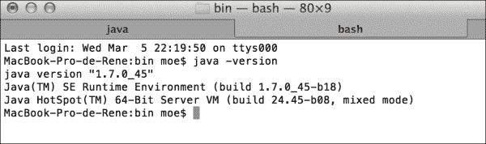

这个命令显示了我们 PC 上安装的 Java 版本。如果您获得的是错误而不是之前的输出，您应该创建环境变量`JAVA_HOME`，将其添加到`PATH`变量中，并重复验证。

现在，为了执行我们之前解释的内容，我们需要为我们的示例用户生成一个密码。我们必须使用我们之前讨论的参数——用户名、领域和密码来生成密码。让我们从终端进入`JBOSS_HOME/modules/org/picketbox/main/`目录，并输入以下内容：

`java -cp picketbox-4.0.7.Final.jar org.jboss.security.auth.callback.RFC2617Digest username MyRealmName password`

我们将获得以下结果：

```java
RFC2617 A1 hash: 8355c2bc1aab3025c8522bd53639c168

```

通过这个过程，我们获得了加密密码，并在我们的密码存储文件（`JBOSS_HOME/standalone/configuration/application-users.properties`文件）中使用它。我们必须替换文件中的密码，并且它将用于用户`username`。我们必须替换它，因为旧密码不包含应用程序的领域名称信息。作为替代方案，您可以使用文件`add-user.sh`创建一个新用户；您只需在被请求时提供领域信息。

为了使我们的应用程序工作，我们只需要在`web.xml`文件中进行一点修改。我们必须修改`auth-method`标签，将值`FORM`更改为`DIGEST`，并以以下方式设置应用程序领域名称：

```java
<login-config>

  <auth-method>DIGEST</auth-method>

  <realm-name>MyRealmName</realm-name>  
</login-config>
```

现在，让我们在 JBoss 中创建一个新的安全域，以便我们可以管理`DIGEST`身份验证机制。在`JBOSS_HOME/standalone/configuration/standalone.xml`文件的`<security-domains>`部分中，让我们添加以下条目：

```java
<security-domain name="domainDigest" cache-type="default"> <authentication>
    <login-module code="UsersRoles" flag="required"> <module-option name="usersProperties" value="${jboss.server.config.dir}/application-users.properties"/> <module-option name="rolesProperties" value="${jboss.server.config.dir}/application-roles.properties"/> <module-option name="hashAlgorithm" value="MD5"/> <module-option name="hashEncoding" value="RFC2617"/>
      <module-option name="hashUserPassword" value="false"/>
      <module-option name="hashStorePassword" value="true"/>
      <module-option name="passwordIsA1Hash" value="true"/> 
      <module-option name="storeDigestCallback" value="org.jboss.security.auth.callback.RFC2617Digest"/> </login-module>
  </authentication>
</security-domain>
```

最后，在应用程序中，更改文件`jboss-web.xml`中的安全域名称，如下面的代码所示：

```java
<?xml version="1.0" encoding="UTF-8"?>
<jboss-web>
  <security-domain>java:/jaas/domainDigest</security-domain>
</jboss-web>
```

我们将在`web.xml`文件中将身份验证方法从`BASIC`更改为`DIGEST`。此外，我们将输入安全域的名称。所有这些更改必须以以下方式应用于`login-config`标签：

```java
<login-config>
  <auth-method>DIGEST</auth-method>
  <realm-name>MyRealmName</realm-name
</login-config>
```

现在，重新启动应用服务器并在 JBoss 上重新部署应用程序。为此，在终端命令行中执行以下命令：

```java
mvn jboss-as:redeploy
```

让我们通过 Wireshark 启用流量捕获，并使用 SOAP UI 再次测试 Web 服务。首先，我们应该将`Authentication Type`字段从全局 HTTP 设置更改为**SPNEGO/Kerberos**。一个非常有用的技巧是告诉 SOAP UI 不要使用基本身份验证方法。一旦我们执行请求，Wireshark 将告诉我们以下截图中显示的消息：

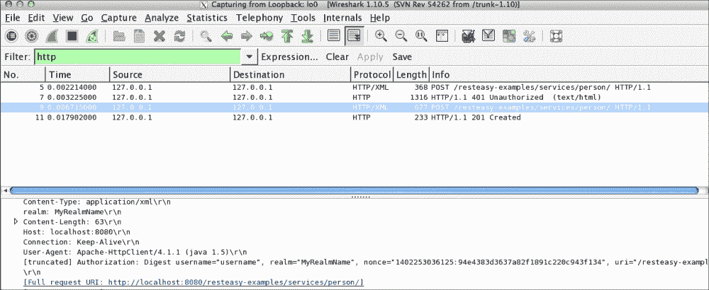

正如屏幕截图所示，让我们首先确认在此身份验证方法中执行了前面描述的所有步骤。让我们使用 Wireshark 中的**No**字段进行跟踪：

在第 5 步中，执行请求。

在第 7 步中，服务器返回带有生成的`nonce`值的错误消息代码 HTTP 401。`nonce`值有助于避免重放攻击。

在第 9 步中，再次执行请求。这次，所需的身份验证信息包括，并且所有这些信息都以与我们之前描述的相同的方式进行加密。

最后，在第 11 步中，我们获得了响应，告诉我们请求已成功执行。

正如您所注意到的，这是一种更安全的身份验证方法，主要用于如果您不想通过 TLS/SSL 加密进行完整传输安全的开销。

您可以在以下 URL 找到本章的源代码：

[`github.com/restful-java-web-services-security/source-code/tree/master/chapter02/digest-authentication`](https://github.com/restful-java-web-services-security/source-code/tree/master/chapter02/digest-authentication)

## 通过证书进行身份验证

这是一种机制，通过该机制，在服务器和客户端之间建立了信任协议，通过证书进行。它们必须由一个旨在确保用于身份验证的证书是合法的机构签署，这就是所谓的 CA。

让我们想象一个使用这种安全机制的应用程序。当客户端尝试访问受保护的资源时，它不是提供用户名或密码，而是向服务器呈现证书。这是包含用户信息用于身份验证的证书；换句话说，除了唯一的私钥-公钥对之外，还包括凭据。服务器通过 CA 确定用户是否合法。然后，它验证用户是否有权访问资源。此外，您应该知道，此身份验证机制必须使用 HTTPS 作为通信协议，因为我们没有安全通道，任何人都可以窃取客户端的身份。

现在，我们将展示如何在我们的例子中执行此操作。

在我们的例子中，我们把自己变成了 CA；它们通常是 VERISIGN 或其他公司。然而，由于我们想要为您节省金钱，我们将以这种方式进行。我们需要的第一件事是 CA 的密钥（也就是我们自己），我们将为应用服务器和用户签署证书。由于本书的目的是解释这种方法的工作原理，而不是如何生成证书，我们不会包括生成证书所需的所有步骤，但我们会在 GitHub 上的以下链接中包含它们：

[`github.com/restful-java-web-services-security/source-code/tree/master/chapter02/client-cert-authentication`](https://github.com/restful-java-web-services-security/source-code/tree/master/chapter02/client-cert-authentication)

好的，让我们开始。首先，将`server.keystore`和`server.trutstore`文件复制到文件夹目录`JBOSS_HOME/standalone/configuration/`中。您可以使用以下链接从 GitHub 下载这些文件：

[`github.com/restful-java-web-services-security/source-code/tree/master/chapter02/client-cert-authentication/certificates`](https://github.com/restful-java-web-services-security/source-code/tree/master/chapter02/client-cert-authentication/certificates)

现在，正如我们之前提到的，此安全机制要求我们的应用程序服务器使用 HTTPS 作为通信协议。因此，我们必须启用 HTTPS。让我们在`standalone.xml`文件中添加一个连接器；查找以下行：

```java
<connector name="http"
```

添加以下代码块：

```java
<connector name="https" protocol="HTTP/1.1" scheme="https" socket-binding="https" secure="true">
  <ssl password="changeit" 
certificate-key-file="${jboss.server.config.dir}/server.keystore" 
verify-client="want" 
ca-certificate-file="${jboss.server.config.dir}/server.truststore"/>

</connector>
```

接下来，我们添加安全域，如下所示：

```java
<security-domain name="RequireCertificateDomain">
                    <authentication>
    <login-module code="CertificateRoles" flag="required">
                            <module-option name="securityDomain" value="RequireCertificateDomain"/>
                            <module-option name="verifier" value="org.jboss.security.auth.certs.AnyCertVerifier"/>
                            <module-option name="usersProperties" value="${jboss.server.config.dir}/my-users.properties"/>
                            <module-option name="rolesProperties" value="${jboss.server.config.dir}/my-roles.properties"/>
                        </login-module>
  </authentication>
  <jsse keystore-password="changeit" keystore-url="file:${jboss.server.config.dir}/server.keystore" 
                        truststore-password="changeit" truststore-url="file:${jboss.server.config.dir}/server.truststore"/>
                </security-domain>
```

正如您所看到的，我们需要两个文件：`my-users.properties`和`my-roles.properties`；两者都为空，并位于`JBOSS_HOME/standalone/configuration`路径中。

我们将以以下方式在`web.xml`文件中添加`<user-data-constraint>`标签：

```java
<security-constraint>
...<user-data-constraint>

  <transport-guarantee>CONFIDENTIAL</transport-guarantee>
  </user-data-constraint>
</security-constraint>
```

然后，更改身份验证方法为`CLIENT-CERT`，如下所示：

```java
  <login-config>
    <auth-method>CLIENT-CERT</auth-method>
  </login-config>
```

最后，在`jboss-web.xml`文件中以以下方式更改安全域：

```java
<?xml version="1.0" encoding="UTF-8"?>
<jboss-web>
  <security-domain>RequireCertificateDomain</security-domain>
</jboss-web>
```

现在，重新启动应用程序服务器，并使用以下命令使用 Maven 重新部署应用程序：

```java
mvn jboss-as:redeploy
```

为了测试这种身份验证方法，我们首先必须在 SOAP UI 中执行一些配置。首先，让我们转到安装目录，找到文件`vmoptions.txt`，并添加以下行：

```java
-Dsun.security.ssl.allowUnsafeRenegotiation=true

```

现在，我们将更改 SOAP UI 的 SSL 设置。为此，您必须从主菜单中导航到**文件** | **首选项**。

从弹出窗口中，选择**SSL 设置**选项卡，并输入以下截图中显示的值：

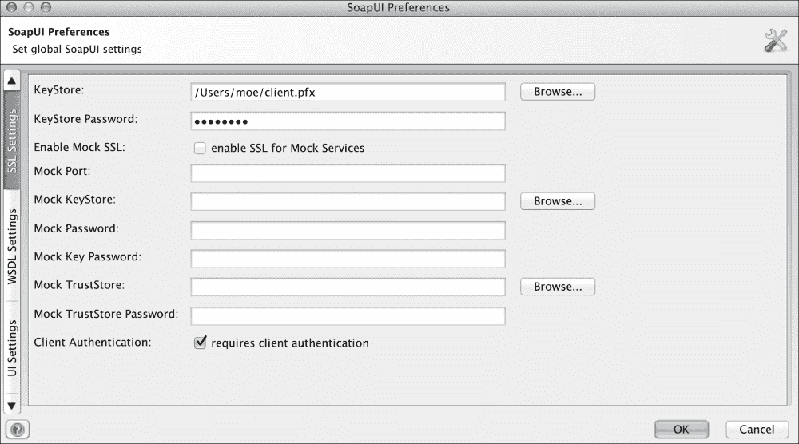

**KeyStore**是您应该复制`.pfx`文件的位置。请注意**KeyStore 密码**为`changeit`，并选中**需要客户端身份验证**选项。

现在，我们将测试刚刚进行的修改；因此，让我们启用流量分析器，并再次使用 SOAP UI 执行请求。Wireshark 将显示以下截图中显示的信息：

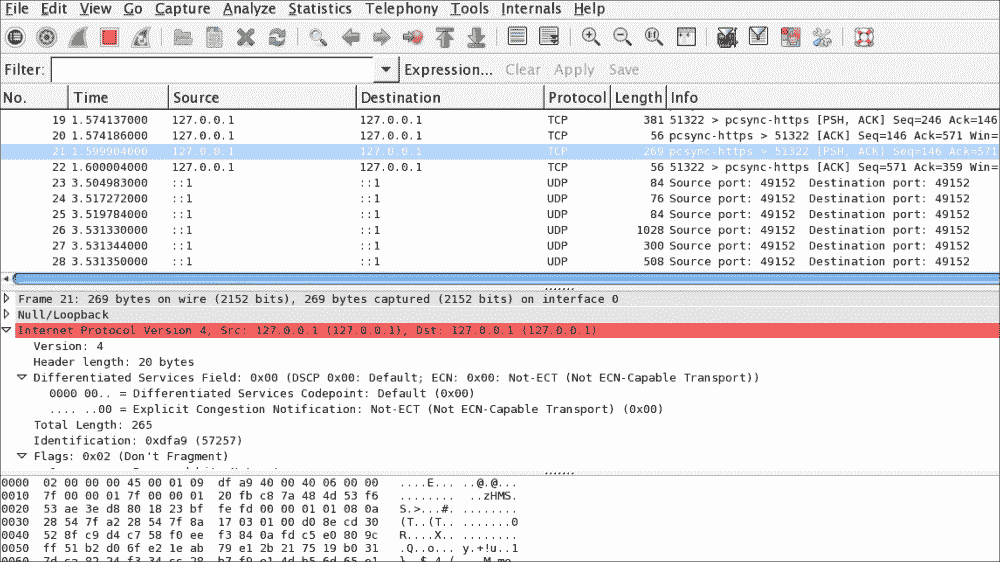

正如您所看到的，所有信息都是加密的，无法解释。因此，如果数据包被传输并在网络中被拦截，信息不会容易受到攻击。

您可以在以下 URL 的 GitHub 上找到此部分的源代码：

[`github.com/restful-java-web-services-security/source-code/tree/master/chapter02/client-cert-authentication/resteasy-examples`](https://github.com/restful-java-web-services-security/source-code/tree/master/chapter02/client-cert-authentication/resteasy-examples)

# API 密钥

随着云计算的出现，很容易想到与云中许多其他应用程序集成的应用程序。现在，很容易看到应用程序如何与 Flickr、Facebook、Twitter、Tumblr 等进行交互。

为了启用这些集成，已开发了一种使用 API 密钥的新身份验证机制。当我们需要从另一个应用程序进行身份验证但不想访问另一个应用程序中托管的私人用户数据时，主要使用此身份验证方法。相反，如果您想访问此信息，必须使用 OAuth。如果您对此感兴趣，不用担心，我们将在本书的后面学习这项奇妙的技术。

我们想要了解 API 密钥的工作原理，所以让我们以 Flickr 为例。这里重要的是要理解 API 密钥的工作原理，因为相同的概念可以应用于谷歌、Facebook 等公司。对于不熟悉 Flickr 的人来说，它是一个云端应用，我们可以在其中存储照片、图像、截图或类似文件。

要开始使用这种身份验证模型，我们首先获得一个 API 密钥；在我们的 Flickr 示例中，您可以使用以下链接来做到这一点：

[`www.flickr.com/services/developer/api/`](https://www.flickr.com/services/developer/api/)

当我们请求我们的 API 密钥时，我们被要求输入我们将创建的应用程序的名称，并使用 API 密钥。一旦我们输入所请求的信息并提交，Flickr 将向我们提供一对值；它们是一个秘钥和一个密钥。两者都显示在以下截图中：

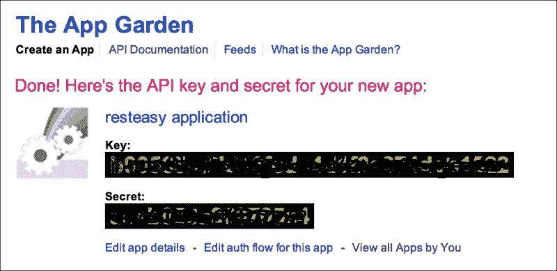

我们创建的每个应用程序都是 Flickr App Garden 的一部分。App Garden 只是由所有 Flickr 成员创建的所有应用程序的集合。

请记住，当创建 API 密钥时，我们有意接受提供者的某些使用条款。这些条款清楚地详细说明了我们可以做什么和不能做什么；例如，Flickr 说：

*a. 你应该：*

*遵守 Flickr 社区准则[www.flickr.com/guidelines.gne](http://www.flickr.com/guidelines.gne)，Flickr 使用条款[`www.flickr.com/terms.gne`](http://www.flickr.com/terms.gne)，以及 Yahoo!服务条款[`docs.yahoo.com/info/terms/`](http://docs.yahoo.com/info/terms/)。*

*…*

*b. 你不应该：*

*使用 Flickr API 来为任何试图复制或替代 Flickr.com 基本用户体验的应用程序*

*…*

因此，通过要求用户接受使用条款，API 密钥提供者防止了对其 API 的滥用使用。因此，如果有人开始不尊重协议，提供者将撤回 API 密钥。Flickr 有一系列我们可以在应用程序中使用的方法；我们将尝试其中一个来展示它们是如何工作的：

`flickr.photos.getRecent`方法列出了在 Flickr 中发布的所有最新照片，我们可以按照以下方式调用它：

`https://www.flickr.com/services/rest?method=flickr.photos.getRecent&;&api+key=[your_api_key_from_flicker]`

让我们使用之前生成的密钥，并让我们使用浏览器执行请求如下：

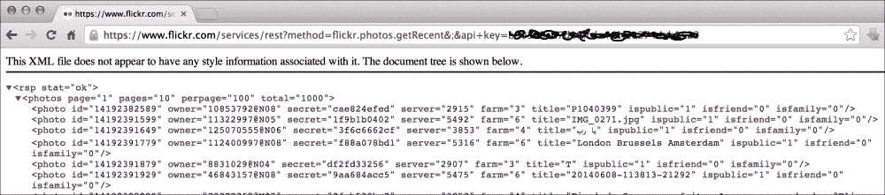

首先注意信息是如何通过安全通道（HTTPS）传输的。然后，在接收请求时，Flickr 通过读取属于用户的 API 密钥的秘钥来对用户进行身份验证。一旦这些验证成功，服务器将响应传递给客户端。因此，我们获得了最近在 Flickr 中发布的所有照片的响应。正如您将注意到的那样，通过这种方式，您可以轻松地使用提供者的 API 创建应用程序。此外，提供者将允许您进行身份验证，访问公共信息，并负责跟踪您使用 API 密钥进行的调用量或 API 调用次数，以验证使用是否符合协议。

# 总结

在本章中，我们介绍了所有可能的身份验证模型。我们将在下一章中使用它们，并将它们应用到我们刚刚创建的 Web 服务功能中。

即使您在任何示例中遇到问题，您也可以继续下一章。为了让您更好地理解，我们将逐步深入地介绍如何利用每个可用的身份验证模型。

正如您意识到的那样，选择正确的安全管理非常重要，否则信息将被暴露并且很容易被第三方拦截和使用。

最后，在本章中，我们回顾了身份验证和授权之间的区别。这两个概念都非常重要，在安全术语的背景下绝对不可忽视。

现在，我们会请你加入我们，继续前进并保护我们的网络服务。
