# 第三章：使用 RESTEasy 进行安全管理

欢迎来到第三章。我们希望您能和我们一起享受并学习。在本章中，您将更深入地了解安全管理。您还将学习一些更高级的安全概念。

使用 RESTful Web 服务构建的应用程序中的安全管理可以比我们在上一章中审查的更加细粒度。如果我们考虑认证和授权主题，我们描述了前者；授权被搁置了。这是因为我们希望在本章中慢慢地并且在非常详细的层面上处理它。

本章涵盖的主题包括：

+   将认证和授权相关的安全限制实施到应用程序中。

+   实施细粒度安全

+   使用注释来获得对资源访问控制的更细粒度控制

# 细粒度和粗粒度安全

我们可以管理两个级别的安全：**细粒度**和**粗粒度**。

当我们在安全的上下文中提到粗粒度这个术语时，我们指的是通常在应用程序的高级别处理的安全系统。在第二章中的示例，*保护 Web 服务的重要性*，其中任何角色的用户都可以使用服务，是粗粒度的完美例子，因为粗粒度选项是在安全限制允许用户访问而不必担心角色或关于经过身份验证的用户更具体的功能的情况下使用的。这意味着为了系统允许访问功能，我们只需验证用户身份；换句话说，它对用户进行了认证。然而，在现实生活中，仅仅拥有应用程序的经过身份验证的用户是不够的。还需要用户被授权使用某些功能。我们可以使用细粒度控制来实现这一点。验证用户被分配的权限以访问功能意味着使用授权控制。

为了以实际方式演示这些概念，我们将利用我们在上一章中创建的应用程序。您可以在 GitHub 上的以下 URL 中访问源代码，在基本认证部分下：

[`github.com/restful-java-web-services-security/source-code/tree/master/chapter02/basic-authentication`](https://github.com/restful-java-web-services-security/source-code/tree/master/chapter02/basic-authentication)

让我们开始吧；假设我们只希望具有`管理员`角色的用户能够使用我们应用程序中的功能。首先要做的事情是更改`web.xml`文件并添加约束，如下所示。请注意，更改如何以粗体显示：

```java
<?xml version="1.0" encoding="UTF-8"?>
<web-app version="3.0" 

  xsi:schemaLocation="http://java.sun.com/xml/ns/javaee 
  http://java.sun.com/xml/ns/javaee/web-app_3_0.xsd">

  <security-role>
 <description>Application roles</description>
 <role-name>administrator</role-name>
  </security-role>
  <security-constraint>
    <display-name>Area secured</display-name>
    <web-resource-collection>
      <web-resource-name>protected_resources</web-resource-name>
      <url-pattern>/services/*</url-pattern>
    </web-resource-collection>
    <auth-constraint>
 <description>User with administrator role</description>
 <role-name>administrator</role-name>
    </auth-constraint>
  </security-constraint>
  <login-config>
    <auth-method>BASIC</auth-method>
  </login-config>
</web-app>
```

现在，让我们尝试使用我们刚刚创建的用户（`用户名`）进行请求。当您收到`403 Forbidden`错误时，您会感到惊讶。

请注意，如果您尝试使用无效凭据进行请求，您将收到错误`HTTP/1.1 401 Unauthorized`。错误非常明显；访问未经授权。这意味着我们发送了无效的凭据，因此用户无法被认证。我们刚刚收到的错误是`HTTP/1.1 403 Forbidden`，这表明用户已成功登录但未被授权使用他们需要的功能。这在下面的截图中有所展示：

细粒度和粗粒度安全

现在，让我们使用`JBOSS_HOME/standalone/bin/adduser.sh`文件创建一个具有`管理员`角色的新用户。按照以下截图中显示的信息输入请求的信息：

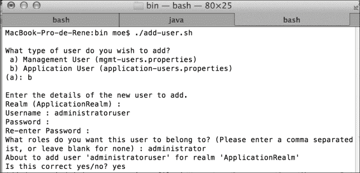

当我们在 SoapUI 中更改凭据时，请求的结果是成功的，如下截图所示：

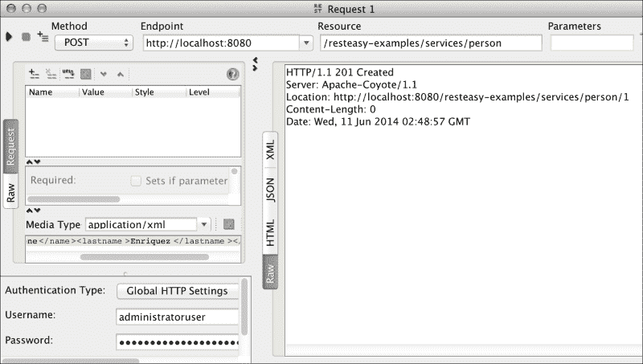

正如您所看到的，我们使用了额外的控制，只限制了分配了`administrator`角色的经过身份验证的用户；他们能够使用 Web 服务功能。在管理真实世界应用程序的安全性时，使用这种控制是非常常见的。由于我们实施了更详细的控制级别，平台为我们提供了实施更细粒度控制的机会，这正是我们将立即看到的。

## 保护 HTTP 方法

JAAS 的一个好处是，我们甚至可以在 HTTP 方法的级别上进行控制。因此，我们可以实施安全控制，只允许具有特定角色的用户根据我们的方便使用特定方法；例如，一个角色保存信息，另一个删除信息，其他角色读取信息，依此类推。

为了实施这些控制，我们需要了解应用程序中 HTTP 方法的功能。在我们的示例中，我们已经知道为了保存信息，应用程序总是使用`HTTP POST`方法。同样，当我们想要读取信息时，应用程序使用`HTTP GET`方法。因此，我们将修改我们的示例，以便只有具有`administrator`角色的用户能够使用`savePerson`（`HTTP POST`）方法。与此同时，只有具有`reader`角色的用户才能使用`findById`（`HTTP GET`）方法读取信息。

为了实现这一目标，我们将修改我们的`web.xml`文件如下：

```java
<?xml version="1.0" encoding="UTF-8"?>
<web-app version="3.0" 

xsi:schemaLocation="http://java.sun.com/xml/ns/javaee 
  http://java.sun.com/xml/ns/javaee/web-app_3_0.xsd">
  <!-- Roles -->
  <security-role>
    <description>Role for save information</description>
    <role-name>administrator</role-name>
  </security-role>
  <security-role>
    <description>Role for read information</description>
    <role-name>reader</role-name>
  </security-role>

  <!-- Resource / Role Mapping -->
  <security-constraint>
    <display-name>Administrator area</display-name>
    <web-resource-collection>
  <web-resource-name>protected_resources</web-resource-name>
      <url-pattern>/services/*</url-pattern>
      <http-method>POST</http-method>
    </web-resource-collection>
    <auth-constraint>
    <description>User with administrator role</description>
      <role-name>administrator</role-name>
    </auth-constraint>
  </security-constraint>
  <security-constraint>
    <display-name>Reader area</display-name>
    <web-resource-collection>
  <web-resource-name>protected_resources</web-resource-name>
      <url-pattern>/services/*</url-pattern>
      <http-method>GET</http-method>
    </web-resource-collection>
    <auth-constraint>
      <description>User with reader role</description>
      <role-name>reader</role-name>
    </auth-constraint>
  </security-constraint>

  <login-config>
    <auth-method>BASIC</auth-method>
  </login-config>
</web-app>
```

在继续之前，我们必须使用`JBOSS_HOME/standalone/bin/adduser.sh`脚本创建一个具有`reader`角色的新用户（`readeruser`）。

现在，让我们使用 SoapUI 测试角色和其权限。

### HTTP 方法 - POST

我们将使用一个没有所需权限的角色来测试`POST`方法。您将看到权限错误消息。

角色：读者

使用此角色时，不允许此方法。在以下截图中进行了演示：

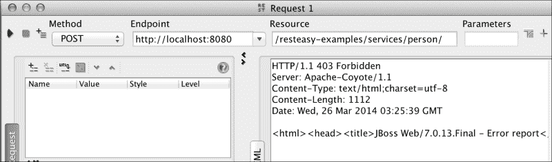

角色：管理员

使用此角色，您可以成功执行该方法。在以下截图中进行了演示：

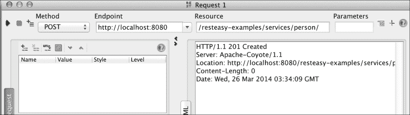

### HTTP 方法 - GET

现在，我们将使用具有所需权限的用户来使用 GET 方法。执行应该成功。

角色：读者

现在，使用此角色执行成功。在以下截图中进行了演示：

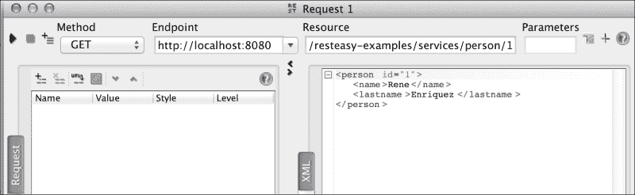

角色：管理员

管理员角色无法访问此方法。在以下截图中进行了演示：

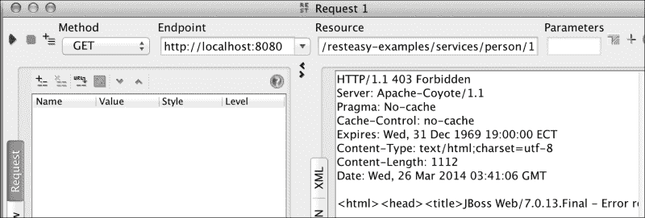

对 URL 模式可以使用相同的角色考虑。在我们的示例中，我们对`/services/*`模式应用了限制。但是，您可以在更深层次上应用它，例如`/services/person/*`。我们的意思是，如果我们有另一个服务暴露在 URL`/services/other-service/`下，我们可以设置一个角色可以访问路径`/services/person/*`下的服务，并在路径`/services/other-service/*`下实现不同级别的访问。这个例子非常简单，是作为读者的基本示例提出的。

应用所有更改后，我们在`web.xml`文件中设置了所有方法的安全性。然而，我们必须问自己一个问题；那些未被包括的方法会发生什么？

OWASP（开放 Web 应用程序安全项目）是一个致力于发现和修复软件安全漏洞的非营利组织，他们撰写了一篇关于此的论文，标题如下：

*通过 HTTP 动词篡改绕过 Web 身份验证和授权：如何无意中允许攻击者完全访问您的 Web 应用程序。*

如果您想查看完整的文档，可以通过访问以下链接进行：

[`dl.packetstormsecurity.net/papers/web/Bypassing_VBAAC_with_HTTP_Verb_Tampering.pdf`](http://dl.packetstormsecurity.net/papers/web/Bypassing_VBAAC_with_HTTP_Verb_Tampering.pdf)

OWASP 在前面提到的文件中描述的是简单的。它显示了如果我们不采取某些预防措施，JEE 在`web.xml`配置文件中暴露了潜在的安全漏洞，因为文件中未列出的所有方法都可以无限制地使用。这意味着在应用程序中未经身份验证的用户可以调用任何其他 HTTP 方法。

OWASP 在早期的文章中陈述了以下内容：

*不幸的是，几乎所有这种机制的实现都以意想不到的和不安全的方式运行。它们允许任何未列出的方法，而不是拒绝规则中未指定的方法。具有讽刺意味的是，通过在规则中列出特定方法，开发人员实际上允许了比他们预期的更多的访问权限。*

为了更好地理解这一点，让我们用一个类比来说明。

假设您有一个写书的网络应用程序，处理两种角色——一种是作者，他们能够写书的页面，另一种是评论者，他们只能阅读书籍并添加带有评论的注释。现在，假设一个用户因错误而最终获得了您应用程序的 URL。这个用户没有任何凭据可以提供，显而易见的是，这个用户甚至不应该能够访问应用程序。然而，OWASP 所展示的问题是，它实际上使未经身份验证的用户能够访问具有足够权限执行任何操作的应用程序，例如删除书籍，而不是做出明显的事情。

让我们举一个例子来看看这种不便，然后我们将实施 OWASP 的建议来解决它。

让我们在`PersonService`类中创建一个新的方法；这次我们将使用`web.xml`文件中未列出的方法之一。最常用的方法之一是`HTTP DELETE`；它的功能是使用其 ID 从内存中删除存储的条目。这将在 URL 中将记录的 ID 作为参数传递，因此请求的 URL 将如下所示：

`http://localhost:8080/resteasy-examples/services/person/[ID]`

方法的实现应该如下所示：

```java
@DELETE
@Path("{id}")
public Response delete(@PathParam("id") int id) {
  Person person = dataInMemory.get(id);
if (person == null) {
  // There is no person with this ID
throw new WebApplicationException(Response.Status.NOT_FOUND);
  }
  dataInMemory.remove(id);
  return Response.status(Status.GONE).build();
}
```

为了测试这种方法，我们必须首先通过 SoapUI 创建一对寄存器，还要使用`HTTP POST`方法和以下字符串：

```java
<person><name>Rene</name><lastname>Enriquez</lastname></person>
```

现在，在 SoapUI 中选择`DELETE`方法，删除我们用于身份验证的凭据信息，并使用其中一个项目 ID 执行请求，如下面的屏幕截图所示：

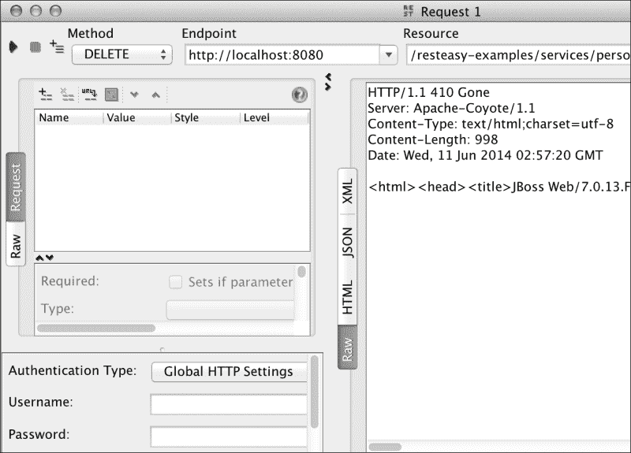

正如您所看到的，该项目已被删除，服务器返回消息`HTTP/1.1 410 Gone`。这表明资源不再可用。正如您所注意到的，当我们没有指定此方法默认应该受到保护时，它被标记为可用。在我们的情况下，任何用户都可以删除我们的应用程序资源，而无需进行身份验证。

为了克服这一缺点，OWASP 建议在`web.xml`文件中添加另一个安全约束。这个新的安全约束不应该在自身列出任何 HTTP 方法，这意味着拒绝所有 HTTP 方法的访问，如下面的代码所示：

```java
<security-constraint>
  <display-name>For any user</display-name>
  <web-resource-collection>
  <web-resource-name>protected_resources</web-resource-name>
    <url-pattern>/services/*</url-pattern>
  </web-resource-collection>
  <auth-constraint>
    <description>User with any role</description>
    <role-name>*</role-name>
  </auth-constraint>
</security-constraint> 
```

此外，我们还必须添加一个新的角色，以确定应用程序中的经过身份验证的用户，如下面的代码所示：

```java
<security-role>
    <description>Any role</description>
    <role-name>*</role-name>
  </security-role>
```

现在，我们从 SoapUI 运行请求，我们可以看到错误消息`HTTP/1.1 401 Unauthorized`。这表明您无法执行请求，因为用户尚未经过身份验证，这反过来意味着未经身份验证的用户无法使用`DELETE`或任何其他方法。

## 通过注释实现细粒度安全性

`web.xml`文件，允许所有安全设置的文件，不是实现细粒度安全的唯一方式；平台还提供了使用注解进行安全检查的可能性。为此，根据您的需求，可以选择以下三个选项：

+   `@RolesAllowed`

+   `@DenyAll`

+   `@PermitAll`

### `@RolesAllowed`注解

`@RolesAllowed`注解可以应用在方法或类级别。使用此注解，您可以定义一组允许使用被注解资源的角色。作为参数注解，让我们写下所有允许的角色。对于本例，我们将修改我们的`web.xml`文件如下：

```java
<?xml version="1.0" encoding="UTF-8"?>
<web-app version="3.0" 

xsi:schemaLocation="http://java.sun.com/xml/ns/javaee 
  http://java.sun.com/xml/ns/javaee/web-app_3_0.xsd">
  <!-- Roles -->
 <context-param>
 <param-name>resteasy.role.based.security</param-name>
 <param-value>true</param-value>
 </context-param>
  <security-role>
    <description>Any role</description>
    <role-name>*</role-name>
  </security-role>
  <!-- Resource / Role Mapping -->
  <security-constraint>
  <display-name>Area for authenticated users</display-name>
    <web-resource-collection>
  <web-resource-name>protected_resources</web-resource-name>
      <url-pattern>/services/*</url-pattern>
    </web-resource-collection>
    <auth-constraint>
      <description>User with any role</description>
      <role-name>*</role-name>
    </auth-constraint>
  </security-constraint>
  <login-config>
    <auth-method>BASIC</auth-method>
  </login-config>
</web-app>
```

在`PersonService`类中，让我们在每个方法上使用注解，指定我们希望能够执行该方法的角色，如下所示：

```java
  @RolesAllowed({ "reader", "administrator" })
  @POST
  @Consumes("application/xml")
  public Response savePerson(Person person) {...

  @RolesAllowed({ "administrator" })
  @GET
  @Path("{id}")
  @Produces("application/xml")
  public Person findById(@PathParam("id") int id) {...
```

现在是时候通过 SoapUI 进行测试了。

#### savePerson 方法

现在，我们将使用管理员角色测试`PersonService`类的`savePerson`方法，如下截图所示：

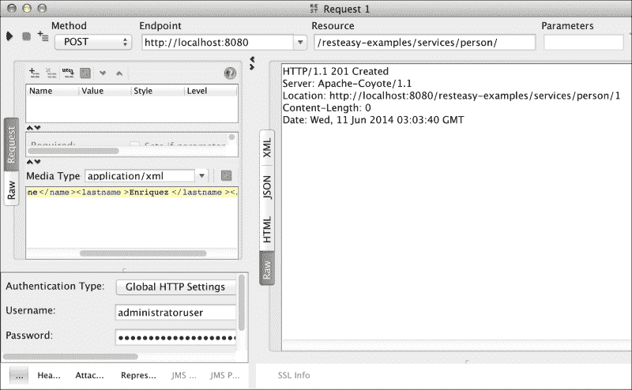

执行成功，如前面的截图所示。原因是因为我们在`@RolesAllowed`注解中包含了两个角色。此外，我们将使用`reader`角色测试执行，以使其成功，如下截图所示：

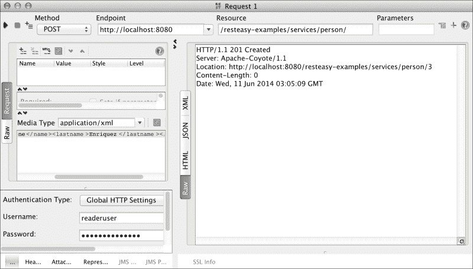

如您所见，当我们使用`@RolesAllowed`注解时，我们授予特定角色的权限。对于此方法，我们使用了`administrator`和`reader`。

#### findById 方法

现在，我们将使用`administrator`角色测试`findById`方法，如下截图所示：

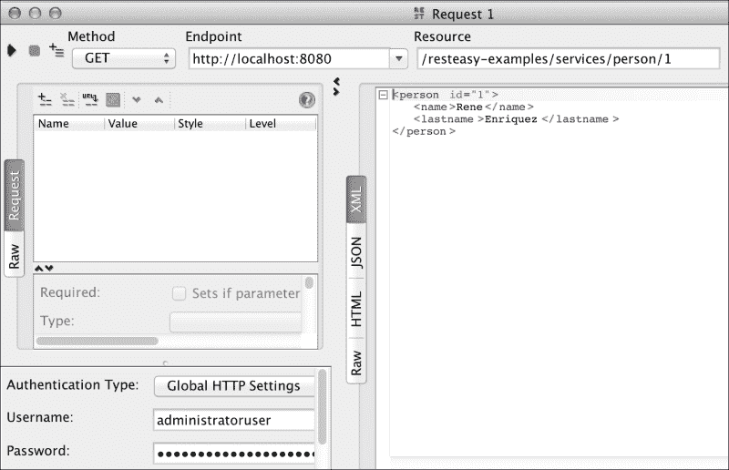

截图显示执行成功，因为`@RolesAllowed`注解包含了 admin。由于我们没有包含`reader`角色，下一次执行不应被授权。让我们立即测试，如下截图所示：

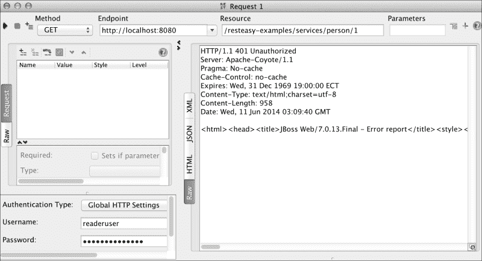

再次，我们使用`@RolesAllowed`注解在方法级别授予权限，但这次我们只指定了一个角色，即`administrator`。

本章的所有源代码都可以在以下网址找到：

[`github.com/restful-java-web-services-security/source-code/tree/master/chapter03`](https://github.com/restful-java-web-services-security/source-code/tree/master/chapter03)

### `@DenyAll`注解

`@DenyAll`注解允许我们定义无论用户是否经过身份验证或角色是否与用户相关，都无法调用的操作。规范将此注解定义如下：

*指定不允许安全角色调用指定的方法 - 即这些方法应该在 J2EE 容器中被排除在执行之外。*

### `@PermitAll`注解

当我们使用`@PermitAll`注解时，我们告诉容器，被注解的资源（方法或类的所有方法）可以被已登录到应用程序的任何用户调用。这意味着只需要用户经过身份验证；不需要分配任何特定的角色。

从这三个注解中，无疑最常用的是第一个（`@RolesAllowed`）；其他两个并不经常使用，因为`@PermitAll`可以很容易地在`web.xml`文件中替代，而`@DenyAll`只能在少数情况下使用。

## 细粒度安全的编程实现

除了提供我们已经看到的安全管理选项外，RESTEasy 还提供了另一种用于访问控制的机制。

在 Web 服务的操作中，您可以向方法添加额外的参数。这允许访问安全上下文，而不会改变客户端调用方法的方式或方法执行的操作。参数必须以以下方式包含：

```java
@GET...
@Consumes("text/xml")
public returnType methodName(@Context SecurityContext secContext, …) {...
```

假设在我们的示例中，在`savePerson`方法中，我们想要访问此功能。我们需要做的唯一更改如下所示。

之前，该方法只使用一个参数，如下所示的代码：

```java
@POST
@Consumes("application/xml")
public Response savePerson(Person person) {
  int id = dataInMemory.size() + 1;
  person.setId(id);
  dataInMemory.put(id, person);
  return Response.created(URI.create("/person/" + id)).build();
}
```

现在，该方法有另一个参数，如下所示的代码：

```java
@POST
@Consumes("application/xml")
public Response savePerson(@Context SecurityContext secContext, Person person) {
  int id = dataInMemory.size() + 1;
  person.setId(id);
  dataInMemory.put(id, person);
  return Response.created(URI.create("/person/" + id)).build();
}
```

接口`javax.ws.rs.core.SecurityContext`提供了以下三个有趣的功能：

+   `isUserInRole()`

+   `getUserPrincipal()`

+   `isSecure()`

方法`isUserInRole()`的功能类似于注解`@RolesAllowed`；其目标是进行检查，以确定已登录的用户是否属于指定的角色，如下所示：

```java
@POST
@Consumes("application/xml")
public Response savePerson(@Context SecurityContext secContext, Person person) {
  boolean isInDesiredRole = 	secContext.isUserInRole ("NameOfDesiredRole");
  int id = dataInMemory.size() + 1;
  person.setId(id);
  dataInMemory.put(id, person);
  return Response.created(URI.create("/person/" + id)).build();
}
```

`getUserPrincipal()`方法获取应用程序中的主要用户，换句话说，已登录的用户。通过此用户，您可以获取代表它的用户名等信息；这在您想要生成审计跟踪的场景中总是很有用。

最后，方法`isSecure()`确定调用是否通过安全的通信方式进行，例如您是否使用了 HTTPS。

正如您所知，HTTP 和 HTTPS 是用于交换信息的协议；前者通常用于共享非敏感信息，而后者通常用于共享敏感信息并且需要安全通道时。

让我们想象一下 ABC 银行的网站，特别是首页，它显示了关于服务和与银行业务相关的信息，可以使用 HTTP 进行管理。我们不能使用 HTTP 协议管理处理账户信息或资金转账的网页；这是因为信息没有受到保护。通过 HTTPS 协议，我们可以加密信息；当信息被 Wireshark 等流量分析器拦截时，它无法被解释。

通过对项目应用更改以启用 HTTPS，可以测试此功能，我们在第二章*保护 Web 服务的重要性*中向您展示了这一点。

当您使用 HTTP 调用此方法时，结果将为 false，但当您使用 HTTPS 调用相同的方法时，结果将为 true。

这三种方法在我们想要实现细粒度安全检查时非常有用。例如，当我们想要实现审计时，我们可以确定某个操作是否使用了诸如 HTTPS 之类的传输安全协议；此外，我们还可以发现执行该操作的用户的信息。

# 总结

在实现应用程序安全时，我们可能有各种需求。在本章中，我们看到了 JAX-RS 如何提供处理安全性的机制，从一个相当基本的模型（粗粒度）开始，到一个更精细的模型（细粒度），在后者中，您可以执行更彻底的控制，包括编程控制和通过配置文件进行的控制。

当然，始终建议将这些检查保存在诸如`web.xml`之类的配置文件中。由于您将控件集中在一个地方，这样做有助于维护。当安全性在源代码级别处理时，情况并非如此，因为当有许多类是项目的一部分时，如果需要对当前功能进行某种修改，任务就会变得复杂。

现在，您应该为下一章做准备，我们将讨论 OAuth。这是一个非常令人兴奋的话题，因为这个协议在互联网应用程序中被广泛接受和使用。世界范围内的明星公司，如谷歌、Twitter 和 Facebook 等，都非常成功地使用了它。
