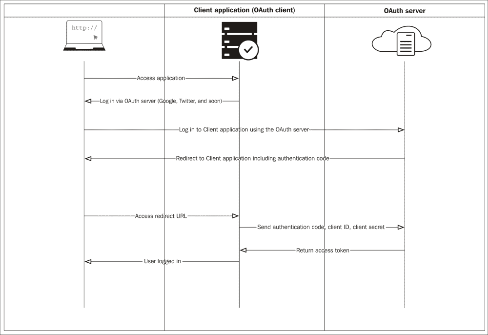
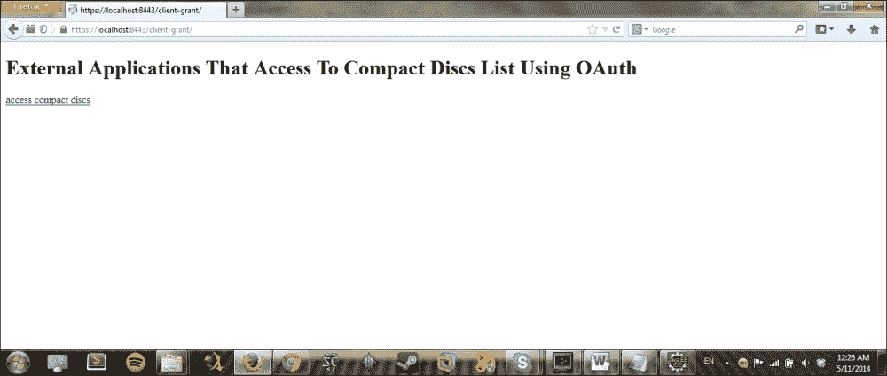
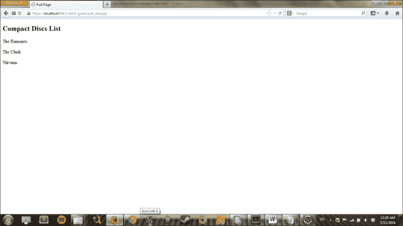
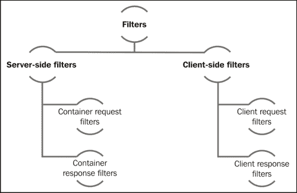

# 第四章：RESTEasy Skeleton Key

欢迎来到第四章！我们希望您喜欢这本书，更重要的是，学习和理解我们所传达和教授的内容。现在是时候向前迈进，沉浸在新的章节中了。

阅读完本章后，您将具备设计、实施和聚合额外安全级别到您的 RESTEasy 应用程序的知识，所有这些都使用 OAuth 和 RESTEasy Skeleton Key 以及这些技术的一些其他特定要求，比如设置一个 OAuth 服务器。您将通过应用程序的实际和描述性示例进行学习，就像我们在之前的章节中所做的那样；我们不会只停留在理论上，而是会实施应用程序并解释实现 OAuth 的特定方法和类。

在本章中，您将学习以下主题：

+   OAuth 和 RESTEasy

+   用于安全管理的 SSO 配置

+   访问令牌

+   自定义过滤器

+   用于测试的 Web 服务客户端

正如您可能已经经历过的那样，如果您在一个或多个社交网络上有账户，许多这些社交网络允许您在它们之间共享信息或在所有社交网络上发布内容。这表明应用程序需要共享信息，还需要使用其他应用程序中的资源。在这个例子中，可能是您的账户或联系人列表。这涉及到敏感信息，因此需要进行保护。此外，对资源的有限权限意味着第三方应用程序只能读取您的联系人列表。这为应用程序之间提供了一个非常重要、有吸引力和有用的功能，即代表用户使用资源的能力。当然，您可能会问后者如何授权使用？好吧，本章将向您展示。所以，让我们开始吧！

# OAuth 协议

这是一个开放协议，允许您从一个站点（服务提供者）向另一个站点（消费者）授予对您的私人资源的安全授权，而无需共享您的身份。

一个实际的例子是当您授权一个网站或应用程序使用您手机或社交网络中的联系人列表。

# OAuth 和 RESTEasy Skeleton Key

在本节中，我们将回顾一些与 OAuth 作为身份验证框架、RESTEasy Skeleton Key 以及它们如何一起工作相关的概念。您将了解这些技术的一些特性，并通过一些代码实际示例来动手实践。

## RESTEasy Skeleton Key 是什么？

RESTEasy Skeleton Key 为浏览器和 JAX-RS 客户端提供了一种统一的方式来进行安全保护。这允许在应用程序和服务网络中以安全和可扩展的方式执行和转发请求，而无需在每次出现请求时与中央身份验证服务器进行交互。

## OAuth 2.0 身份验证框架

这使第三方应用程序或服务能够代表资源所有者访问 HTTP 资源。它还防止第三方应用程序或服务与所有者的凭据联系。这是通过通过浏览器发放访问令牌并使用直接授权来实现的。

简而言之，通过这两个概念的解释，现在是时候描述它们之间的关系了。RESTEasy Skeleton Key 是一个 OAuth 2.0 实现，它使用 JBoss AS 7 安全基础设施来保护 Web 应用程序和 RESTful 服务。

这意味着您可以将 Web 应用程序转换为 OAuth 2.0 访问令牌提供程序，并且还可以将 JBoss AS 7 安全域转换为中央身份验证和授权服务器，应用程序和服务可以相互交互。

以下图表更好地描述了这个过程：



### 主要特点

我们希望帮助您了解这些技术并澄清它们的用途；这就是为什么我们将列出它们的一些主要特点。使用 OAuth 2.0 和 RESTEasy Skeleton Key，您可以执行以下功能：

+   将基于 servlet-form-auth 的 Web 应用程序转换为 OAuth 2.0 提供程序。

+   通过中央身份验证服务器提供分布式**单点登录**（**SSO**），以便一次登录并以安全方式访问在域中配置的任何基于浏览器的应用程序。

+   只使用一个链接并注销所有已配置 SSO 的分布式应用程序。

+   使 Web 应用程序使用访问令牌与远程 RESTful 服务进行交互。

+   使用 OAuth 2.0 签署访问令牌，并稍后使用这些令牌访问域中配置的任何服务。令牌具有身份和角色映射，因为令牌是数字签名的，所以没有必要在每次出现请求时过载中央身份验证服务器。

您可以在[`docs.jboss.org/resteasy/docs/3.0-beta-2/userguide/html/oauth2.html`](http://docs.jboss.org/resteasy/docs/3.0-beta-2/userguide/html/oauth2.html)找到有关这些主题的更多信息。

我们将讨论最重要的部分，但这对您可能有用。

## OAuth2 实施

我们刚刚回顾了本章中将要处理的一些主要概念，但这还不够。我们必须实施一个描述性示例，以便完全理解这些主题。

### 在 JBoss 中更新 RESTEasy 模块

为了不干扰您的 JBoss 配置或其他任何东西，我们将使用另一个全新的 JBoss 实例。我们必须更新一些与 RESTEasy 相关的模块。我们可以很容易地做到这一点。让我们访问链接[`resteasy.jboss.org/`](http://resteasy.jboss.org/)；在右侧，您会找到一个标题为**Useful Links**的面板，其中包含一个下载链接。单击它访问另一个页面，该页面上有一堆下载链接。在本例中，我们使用 3.0.7.Final 版本。下载这个版本以继续。

下载并解压缩后，您会找到另一个名为`resteasy-jboss-modules-3.0.7.Final`的`.zip`文件；该文件包含一些将更新您的 JBoss 模块的 JAR 文件。因此，请解压缩它，将所有文件夹复制到`JBOSS_HOME/modules/`，并替换所有匹配项。还有最后一步：我们必须更新 JBoss 中 JAR 文件的版本，并修改模块 XML，以将`org.apache.httpcomponents`设置为使用`httpclient-4.2.1.jar`、`httpcore-4.2.1.jar`和`httpmime-4.2.1.jar`，因为当前最新版本是 4.3.4，这也可以正常工作。因此，请复制这些 JAR 文件，并在`JBOSS_HOME/modules/org/apache`文件夹中的`module.xml`文件中更新版本。现在，我们已经更新了 RESTEasy 的模块。

### 在 JBoss 中设置配置

为了让我们的 JBoss 为示例做好下一步准备，我们必须转到[`github.com/restful-java-web-services-security/source-code/tree/master/chapter04`](https://github.com/restful-java-web-services-security/source-code/tree/master/chapter04)并下载`chapter04`示例 zip 文件。解压缩后，您会找到一个名为`configuration`的文件夹。该文件夹包含设置我们的 JBoss 配置所需的文件。因此，请复制这些文件并替换位于`JBOSS_HOME/standalone/configuration`的 JBoss 中的配置文件夹。

### 实施 OAuth 客户端

为了开发这个示例，我们调查了一个非常有用的示例并将其应用到一个新项目中。这个示例由几个项目组成；每个项目将生成一个 WAR 文件。这个示例的目的是演示 OAuth 的工作原理，并解释您可以在技术层面上实现这项技术的方式。因此，我们将模拟几件事情，以创建我们可以应用这个实现的环境。完整的代码可以从以下链接下载：

[`github.com/restful-java-web-services-security/source-code/tree/master/chapter04/oauth2-as7-example`](https://github.com/restful-java-web-services-security/source-code/tree/master/chapter04/oauth2-as7-example)

#### oauth-client 项目

首先，我们将创建`oauth-client` webapp 项目。您可以使用我们在之前章节中使用过的 Maven 命令，也可以使用 Eclipse IDE 来执行此操作。

之后，让我们添加一些依赖项以实现我们的客户端。这些依赖项适用于所有项目。转到`pom.xml`文件，并确保在`<dependencies>`标签内添加以下依赖项：

```java
       <dependency>
            <groupId>org.jboss.spec.javax.servlet</groupId>
            <artifactId>jboss-servlet-api_3.0_spec</artifactId>
            <version>1.0.1.Final</version>
            <scope>provided</scope>
        </dependency>
        <dependency>
            <groupId>org.jboss.resteasy</groupId>
            <artifactId>resteasy-client</artifactId>
            <version>3.0.6.Final</version>
            <scope>provided</scope>
        </dependency>
        <dependency>
            <groupId>org.jboss.resteasy</groupId>
            <artifactId>skeleton-key-core</artifactId>
            <version>3.0.6.Final</version>
            <scope>provided</scope>
        </dependency>
```

让我们首先创建包`com.packtpub.resteasy.example.oauth`。然后，创建类`public class Loader implements ServletContextListener`，它实现`ServletContextListener`，因为我们将加载密钥库并初始化上下文。

让我们在我们的类中添加一个字段`private ServletOAuthClient oauthClient`，它将代表我们的 OAuth 客户端对象。

然后，让我们创建以下代码片段中显示的方法：

```java
private static KeyStore loadKeyStore(String filename, String password) throws Exception 
{
KeyStore keyStore = KeyStore.getInstance(KeyStore.getDefaultType());
File keyStoreFile = new File(filename);
FileInputStream keyStoreStream = new FileInputStream(keyStoreFile);
    keyStore.load(keyStoreStream, password.toCharArray());
    keyStoreStream.close();
    return keyStore; 
}
```

此方法接收两个参数，文件名和密码，并创建`KeyStore`对象。它还从接收的文件名创建一个`FileInputStream`对象，以便可以使用它来加载`KeyStore`对象，并使用以 char 数组形式接收的密码。

之后，由于我们的类实现了`ServletContextListener`接口，我们必须重写一些方法。要重写的第一个方法是`contextInitialized`。让我们按照以下方式进行：

```java
@Override
 public void contextInitialized(ServletContextEvent sce) {
  String truststoreKSPath = "${jboss.server.config.dir}/client-truststore.ts";
  String truststoreKSPassword = "changeit";
  truststoreKSPath = EnvUtil.replace(truststoreKSPath);
  try {
   KeyStore truststoreKS = loadKeyStore(truststoreKSPath, 
     truststoreKSPassword);
   oauthClient = new ServletOAuthClient();
   oauthClient.setTruststore(truststoreKS);
   oauthClient.setClientId("third-party");
   oauthClient.setPassword("changeit");
   oauthClient.setAuthUrl("https://localhost:8443/oauth-server/login.jsp");
   oauthClient.setCodeUrl("https://localhost:8443/oauth-server/
     j_oauth_resolve_access_code");
   oauthClient.start();
   sce.getServletContext().setAttribute(ServletOAuthClient.class.getName(), oauthClient);
  } catch (Exception e) {
   throw new RuntimeException(e);
  }

 }
```

通过这种方法，我们将实现几件事情。正如您所看到的，我们设置了两个内部变量；一个设置为我们`client-truststore.ts`文件的路径，另一个设置为密码。确保将文件粘贴到我们在变量中指定的路径中（`JBOSS_HOME/standalone/configuration`）。

之后，我们使用在变量中指定的路径和密码加载`KeyStore`对象，通过这样获得另一个`KeyStore`对象。

现在，是时候实例化和设置我们的 OAuth 客户端对象的属性了。在前面的代码中，我们设置了以下属性：`trustStore`、`clientId`、`password`、`authUrl`和`codeUrl`。

最后，我们创建客户端以从代码中获取访问令牌。为了实现这一点，我们使用`start()`方法。同时，我们使用刚刚创建的 OAuth 客户端对象设置 servlet OAuth 客户端属性。

为了完成我们的 OAuth 客户端，我们需要重写第二个名为`public void contextDestroyed(ServletContextEvent sce)`的方法，如下所示：

```java
@Override
  public void contextDestroyed(ServletContextEvent sce) {
    oauthClient.stop();
  }
```

当 servlet 上下文即将关闭、我们的应用程序重新部署等情况时，将执行此方法。该方法关闭客户端实例及其所有关联资源。

我们为示例实现了我们的 OAuth 客户端。我们需要另一个资源。这一次，我们将创建一个作为我们紧凑光盘商店数据库客户端的类。因此，让我们命名为`CompactDiscsDatabaseClient`，并编写以下两个方法：

+   `public static void redirect(HttpServletRequest request, HttpServletResponse response)`

+   `public static List<String> getCompactDiscs(HttpServletRequest request)`

因此，让我们开始实现第一个方法。该方法的说明如下：

```java
public static void redirect(HttpServletRequest request, HttpServletResponse response) {
ServletOAuthClient oAuthClient = (ServletOAuthClient) request.getServletContext().getAttribute(ServletOAuthClient.class.getName());
    try {
oAuthClient.redirectRelative("discList.jsp", request, response);
    } catch (IOException e) {
      throw new RuntimeException(e);
    }
  }
```

在前面的方法中，我们从请求中获取的`ServletContext`中获取了`ServletOAuthClient`对象；servlet OAuth 客户端作为名为`ServletOAuthClient`的属性存在于 servlet 上下文中。请记住，在我们创建的第一个类中，我们在 servlet 上下文中设置了此属性。

最后，通过`redirectRelative (String relativePath, HttpServletRequest request, HttpServletResponse response)`方法开始获取访问令牌，将浏览器重定向到认证服务器。

现在，让我们继续下一个加载光盘的方法。以下代码表示该方法：

```java
public static List<String> getCompactDiscs(HttpServletRequest request) {

ServletOAuthClient oAuthClient = (ServletOAuthClient) request.getServletContext().getAttribute(
        ServletOAuthClient.class.getName());

ResteasyClient rsClient = new 
ResteasyClientBuilder().trustStore(oAuthClient.getTruststore()).hostnameVerification(ResteasyClientBuilder.HostnameVerificationPolicy.ANY).build();

String urlDiscs = "https://localhost:8443/store/discs";
  try {
String bearerToken = "Bearer" + oAuthClient.getBearerToken(request);

Response response = rsClient.target(urlDiscs).request().header(HttpHeaders.AUTHORIZATION, bearerToken)
          .get();
    return response.readEntity(new GenericType<List<String>>() {
	      });
    } finally {
      rsClient.close();
    }
}
```

让我们检查一下我们在这里有什么。在前面的`getCompactDiscs()`方法中，我们创建了一个`ServletOAuthClient`对象，负责启动通过将浏览器重定向到认证服务器来获取访问令牌的过程。再次，我们从请求中获取`ServletContext`对象的属性。然后，我们使用`ResteasyClientBuilder()`的新实例创建一个`ResteasyClient`对象；这个类是创建客户端的抽象，并允许 SSL 配置。

然后，我们使用`trustStore()`方法设置客户端信任库。这个调用将返回一个`KeyStore`对象并设置客户端信任库。之后，我们调用`hostnameVerification()`方法，该方法设置用于验证主机名的 SSL 策略。最后，使用`build()`方法，我们使用先前在此客户端构建器中指定的整个配置构建一个新的客户端实例。这将返回一个`ResteasyClient`实例。

让我们继续创建一个内部变量，用于保存我们将设置为目标资源的资源的 URL。此外，我们将创建另一个内部变量来保存作为字符串的持有者令牌。这个字符串将由来自 servlet OAuth 客户端和请求的持有者令牌后面跟着的单词`Bearer`组成。

现在，为了创建响应，我们将使用刚刚创建的 servlet OAuth 客户端。让我们使用变量`urlDiscs`作为参数，并通过`target()`方法创建一个新的 web 资源目标。之后，使用`request()`方法，我们设置一个请求到刚刚设置的目标 web 资源。

最后，我们通过调用`header()`方法添加一个头，该方法将接收两个参数：第一个参数表示头的名称，第二个参数是头的值。之后，我们调用`HTTP GET`方法进行当前请求。

只是为了澄清，`HttpHeaders.AUTHORIZATION`常量代表特定情况下用户想要与服务器进行身份验证时的头字段。它通过在请求中添加授权请求头字段来实现。另一方面，授权字段值由包含用户在请求的资源领域中的身份验证信息的凭据组成。

创建响应对象后，我们使用`readEntity()`方法将消息实体输入流读取为指定 Java 类型的实例。通过这样做，我们用我们的紧凑光盘示例列表填充列表，以便在网页上呈现。这意味着我们访问了资源。

如果您想探索一下我们刚刚在描述的代码块中使用的内容，这里有一些链接作为参考。您可以查看它们，扩展您的知识，并获取有关`RestEasyClient`和`RestEasyClientBuilder`的更多详细信息：

+   [`www.w3.org/Protocols/rfc2616/rfc2616-sec14.html`](http://www.w3.org/Protocols/rfc2616/rfc2616-sec14.html)

+   [`docs.jboss.org/resteasy/docs/3.0.2.Final/javadocs/org/jboss/resteasy/client/jaxrs/ResteasyClient.html`](http://docs.jboss.org/resteasy/docs/3.0.2.Final/javadocs/org/jboss/resteasy/client/jaxrs/ResteasyClient.html)

+   [`docs.jboss.org/resteasy/docs/3.0.1.Final/javadocs/org/jboss/resteasy/client/jaxrs/ResteasyClientBuilder.html#truststore`](http://docs.jboss.org/resteasy/docs/3.0.1.Final/javadocs/org/jboss/resteasy/client/jaxrs/ResteasyClientBuilder.html#truststore)

#### discstore 项目

我们接下来要创建的项目是`discstore`项目；创建项目的步骤与上一个相同，您可以使用 Maven 命令或 Eclipse IDE。

在这个项目中，我们将创建一个类来创建紧凑光盘的列表。这个类非常简单，它使用了一些在前几章中已经讨论过的注解。这个类的名称将是`CompactDiscService`，它只有一个带有几个注解的方法。让我们从代码开始，然后在代码块后面添加一个简短的描述：

```java
@Path("discs")
public class CompactDiscService {
  @GET
 @Produces("application/json")
  public List<String> getCompactDiscs() {
    ArrayList<String> compactDiscList = new ArrayList<String>();
    compactDiscList.add("The Ramones");
    compactDiscList.add("The Clash");
    compactDiscList.add("Nirvana");
    return compactDiscList;
  }
}
```

正如你所看到的，`getCompactDiscs()`方法负责创建一个字符串列表，其中每个项目将表示为一个紧凑光盘，因为这是一个我们将添加三个项目的示例。

`@Produces`注解用于指定 MIME 媒体类型，如果应用在方法级别，这些注解将覆盖类级别的`@Produces`注解。`@GET`注解，正如你已经知道的，代表 HTTP 方法`GET`。同时，`@Path`注解将帮助我们将类设置为资源，它的名称将是`discs`。

所有后端都已经实现；现在我们需要开发一些其他资源，以便让我们的示例运行。记得我们在上面的类中指定了一些网页吗？那就是我们现在要实现的。

#### oauth-server 项目

与以前一样，为了创建这个项目，你可以使用 Maven 命令或 Eclipse IDE。

为了启动这个应用程序，我们必须创建`jboss-web.xml`文件，内容如下：

```java
<jboss-web>
    <security-domain>java:/jaas/commerce</security-domain>
    <valve>
        <class-name>org.jboss.resteasy.skeleton.key.as7.OAuthAuthenticationServerValve</class-name>
    </valve>
</jboss-web>
```

最后一件事：我们必须创建一个 JSON 文件，目的是在这个服务器上拥有我们的证书和安全配置。我们将把它命名为`resteasy-oauth`。正如你所看到的，这个文件并不复杂；它是一组属性和值。通过这个文件，我们指定了密钥库和密码，信任库路径等。这个文件将位于这个项目的`WEBINF`文件夹中。

```java
{
   "realm" : "commerce",
   "admin-role" : "admin",
   "login-role" : "login",
   "oauth-client-role" : "oauth",
   "wildcard-role" : "*",
   "realm-keystore" : "${jboss.server.config.dir}/realm.jks",
   "realm-key-alias" : "commerce",
   "realm-keystore-password" : "changeit",
   "realm-private-key-password" : "changeit",
   "truststore" : "${jboss.server.config.dir}/client-truststore.ts",
   "truststore-password" : "changeit",
   "resources" : [
      "https://localhost:8443/oauth-client",
      "https://localhost:8443/discstore/"
   ]
}
```

#### webapp/WEB-INF/ jboss-deployment-structure.xml

我们必须在所有项目中配置这个文件，因为我们更新了 JBoss AS 实例的一些模块。在这个文件中，我们必须指定我们的应用程序与 JBoss 的一些模块的依赖关系。然后，我们需要使用`<dependencies>`标签内的`<module>`标签清楚地设置它们，如下所示：

```java
<jboss-deployment-structure>
    <deployment>
        <!-- This allows you to define additional dependencies, it is the same as using the Dependencies: manifest attribute -->
        <dependencies>
            <module name="org.jboss.resteasy.resteasy-jaxrs" services="import"/>
            <module name="org.jboss.resteasy.resteasy-jackson-provider" services="import"/>
            <module name="org.jboss.resteasy.skeleton-key" />
        </dependencies>
    </deployment>
</jboss-deployment-structure>
```

#### 运行应用程序

我们已经解释了每个项目的主要部分，为了运行和测试应用程序，你可以从[`github.com/restful-java-web-services-security/source-code/tree/master/chapter04`](https://github.com/restful-java-web-services-security/source-code/tree/master/chapter04)下载本章的示例文件夹。下载 ZIP 文件后，解压缩，你会发现一个名为`OAuthExample`的文件夹。在这个文件夹中，有我们的三个项目。你可以复制它们并粘贴到你的工作区，并使用 Eclipse 导入这些项目。

我们已经在`configuration`文件夹中提供了密钥库、证书和信任库文件，你在设置 JBoss`configuration`时刚刚粘贴了进去。为了确保应用程序正常运行，你可以按照`configuration`文件夹中名为`keystoreCommands`的`.txt`文件中的说明更新这些文件。

为了启动我们的应用程序，我们必须部署它。所以，打开一个终端。让我们进入`JBOSS_HOME/bin`并以独立模式启动 JBoss；这意味着如果你在 Windows 上执行`standalone.bat`，如果你在 Linux 上执行`./standalone.sh`。然后，打开一个终端并进入工作区中我们应用程序的文件夹。我们必须执行以下命令：在我们创建的三个项目`discstore`、`oauth-client`和`oauth-server`中，分别执行`mvn clean install`和`mvn jboss-as:deploy`。

我们在`discstore`项目中创建了一个特殊的类。这个类包含一个`void main`方法，我们通过这个类测试我们的应用程序。我们把它命名为`OAuthClientTest`。这个类的代码如下：

```java
public class OauthClientTest {

  public static void main(String[] args) throws Exception {

    String truststorePath = "C:/Users/Andres/jboss/2do_jboss/jboss-as-7.1.1.Final/standalone/configuration/client-truststore.ts";
    String truststorePassword = "changeit";
    truststorePath = EnvUtil.replace(truststorePath);

    KeyStore truststore = loadKeyStore(truststorePath, truststorePassword);

         ResteasyClient client = new ResteasyClientBuilder()
                .disableTrustManager().trustStore(truststore).build();

    Form form = new Form().param("grant_type", "client_credentials");
    ResteasyWebTarget target = client.target("https://localhost:8443/oauth-server/j_oauth_token_grant");
    target.register(new BasicAuthentication("andres", "andres"));

    AccessTokenResponse tokenResponse = target.request().post(Entity.form(form), AccessTokenResponse.class);
    Response response = client.target("https://localhost:8443/discstore/discs")
        .request()
        .header(HttpHeaders.AUTHORIZATION,
            "Bearer " + tokenResponse.getToken()).get();
    try {
      String xml = response.readEntity(String.class);
      System.out.println(xml);
    } finally {
      client.close();
    }

  }
```

我们将首先解释前面的代码，首先，我们有两个变量，`truststorePath`和`truststorePassword`。第一个引用了我们的 JBoss 配置文件夹中`client-truststore.ts`文件的路径。您应该更改这个变量的值，以使此测试工作，因此请放置您的配置文件夹的路径。之后，通过我们已经解释的方法`loadKeyStore()`，我们使用前面的变量加载 KeyStore，并将这个值分配给一个名为`truststore`的`KeyStore`对象。从`truststore`，我们创建了名为`client`的`RestEasyClient`对象。

现在，我们将以编程方式获取访问令牌，因此我们可以通过使用 HTTPS 调用简单地从 auth-server 请求访问令牌。然后我们必须使用基本身份验证来识别我们的用户；结果，我们将获得该用户的签名访问令牌。

因此，我们对 auth-server 的上下文根执行简单的`POST`，在目标 URL 的末尾加上`j_oauth_token_grant`，因为当我们使用该 URL 和基本身份验证时，我们将为特定用户获取访问令牌。

之后，我们获得了访问令牌，这是一个简单的字符串。为了调用受持有者令牌身份验证保护的服务，我们必须构建一个字符串，由您的`HTTPS`请求的授权标头加上字符串`Bearer`和最后的访问令牌字符串组成。这将返回响应对象，因此我们可以读取它并像在测试中那样打印它。在控制台中，您将看到如下截图中显示的紧凑光盘列表：

运行应用程序

# 安全管理的 SSO 配置

SSO 是一种身份验证机制。它允许用户只需输入一次凭据即可访问多个系统或应用程序。我们认为您这些天更经常经历这种情况，因为我们生活在一个社交网络时代，大多数这些服务都让我们使用彼此的凭据来访问多个服务。

在讨论了 SSO 的一些概念之后，让我们尝试并实现这种机制。为了实现这一点，我们将使用 JBoss 7 应用服务器和我们之前的项目`secure-demo`。

作为对这个实现的简要介绍，我们想告诉您，我们将使用两个文件；一个文件属于 JBoss，另一个文件属于我们的应用程序。

属于 JBoss 的文件是`standalone.xml`。我们将向该文件添加一些行。在以下代码行中，让我们在`virtual-server`定义中添加 SSO 元素：

```java
<subsystem  default-virtual-server="default-host" native="false">
            <connector name="http" protocol="HTTP/1.1" scheme="http" socket-binding="http"/>
            <virtual-server name="default-host" enable-welcome-root="true">
                <alias name="localhost"/>
                <sso domain="localhost" reauthenticate="false"/>
            </virtual-server>
</subsystem>
```

`reauthenticate`属性允许我们确定每个请求是否需要重新对`securityReal`进行重新身份验证。默认值为`false`。

我们必须编辑的下一个文件是我们的应用程序中的`jboss-web.xml`。此外，我们需要向该文件添加一些代码行。这些代码行将声明将管理 SSO 的阀门。换句话说，每个请求都将通过此阀门，如下面的代码所示：

```java
<jboss-web>
    <security-domain>java:/jaas/other </security-domain>
          <valve>
        <class-name>org.apache.catalina.authenticator.SingleSignOn</class-name>
    </valve>
</jboss-web>
```

以防您忘记或删除它，我们在前几章中设置了一个安全域。以下代码块必须存在于`standalone.xml`文件中：

```java
<security-domain name="other" cache-type="default">
    <authentication>
      <login-module code="Remoting" flag="optional">
<module-option name="password-stacking"  value="useFirstPass"/>
      </login-module>
      <login-module code="RealmUsersRoles" flag="required">
<module-option name="usersProperties" value="${jboss.server.config.dir}/application-users.properties"/>
<module-option name="rolesProperties" value="${jboss.server.config.dir}/application-roles.properties"/>
<module-option name="realm" value="ApplicationRealm"/>
<module-option name="password-stacking" value="useFirstPass"/>
      </login-module>
     </authentication>
</security-domain>
```

由于我们正在使用`secure-demo`示例，这是我们必须修改的所有内容，以配置 SSO。

为了测试这种机制，我们需要另一个应用程序。我们必须复制我们刚刚在`secure-demo`示例中进行的配置。

当我们在其中一个中输入凭据时，我们不再需要在其他中输入凭据，因为我们已经应用了 SSO。我们将在两个应用程序中进行身份验证。

# 通过基本身份验证获取 OAuth 令牌

现在，让我们探索并实现一个使用令牌的简短示例。为了构建这个示例，我们将创建一个类。这个类，就像前面的示例一样，将模拟一个数据库客户端。它将具有相同的方法`getCompactDiscs()`，但是这次我们将修改这个示例中的内部函数。此外，这次它不会接收任何参数。

好了，让我们开始吧！首先，在类中创建两个静态字符串字段。第一个字段将保存 auth-server 中的认证 URL。另一个字段将有显示紧凑光盘列表的 URL；您可以重用之前示例中相同的网页。然后，您的变量应该如下所示：

```java
private static String urlAuth = "https://localhost:8443/auth-server /j_oauth_token_grant";
private static String urlDiscs = "https://localhost:8443/discstore/discs";
```

之后，让我们创建获取紧凑光盘列表的方法。以下代码片段向您展示了方法的执行方式：

```java
public static List<String> getCompactDiscs() {
  ResteasyClient rsClient = new ResteasyClientBuilder().disableTrustManager().build();
    Form form = new Form().param("grant_type", "client_credentials");
  ResteasyWebTarget resourceTarget = rsClient.target(urlAuth);
    resourceTarget.register(new BasicAuthentication("andres", "andres"));
  AccessTokenResponse accessToken = resourceTarget.request().post(Entity.form(form), AccessTokenResponse.class);
    try {
      String bearerToken = "Bearer " + accessToken.getToken();
      Response response = rsClient.target(urlDiscs).request().header(HttpHeaders.AUTHORIZATION, bearerToken).get();
      return response.readEntity(new GenericType<List<String>>() {
      });
    } finally {
      rsClient.close();
    }
  }
```

现在是时候检查我们刚刚做了什么。首先，我们创建了一个`ResteasyClient`对象。如果您注意到了，我们使用了一些东西来禁用信任管理和主机名验证。这个调用的结果是关闭服务器证书验证，允许中间人攻击。因此，请谨慎使用此功能。

之后，我们创建了一个`form`对象并传入一些参数。这些参数通过`param()`方法传入，分别表示参数名和参数值。这意味着我们指定了应用程序请求的授权类型，这将是`client_credentials`。

然后，就像我们之前在之前的示例中所做的那样，让我们创建一个 RESTEasy web 目标，将目标对准显示紧凑光盘列表的 URL。请记住，这个 URL 是我们之前创建的一个静态字段中设置的。这个 web 目标将是我们将要访问的`resourceTarget`对象。

当我们使用`register()`方法并传入一个`BasicAuthentication`对象时，我们注册了一个自定义的 JAX-RS 组件实例，以在可配置的上下文范围内被实例化和使用。

接下来，通过对我们的 web 目标执行请求，创建`AccessTokenResponse`类。然后，在同一行中，我们执行一个 post 请求，以便同步发送实体和我们想要获取的响应类型。`Entity.form()`方法从我们之前创建的`form`对象中创建`application/x-www-form-urlencoded`实体。现在，这将返回一个`AccessTokenResponse`对象；我们使用这个对象通过在令牌的开头添加`Bearer`一词来构建令牌。

最后，通过执行对`urlDiscs`变量中设置的 URL 的请求，让我们创建响应对象。我们应该使用`ResteasyClient`对象来对准这个资源，然后执行请求，并使用`HttpHeaders.AUTHORIZATION`将头字段设置为使用变量`bearerToken`中设置的`bearer`令牌。这样，我们就可以访问目标资源；在这种情况下，我们可以看到信息。

由于我们继续使用相同的应用业务，我们可以重用之前示例中的网页。确保在您的示例中，与之前示例中相同的路径中，包含网页`index.html`和`discsList.jsp`。我们还将使用`jboss-deployment-structure.xml`文件中设置的配置，因为我们使用相同的模块依赖关系。

我们的`web.xml`文件应该比之前的示例看起来更简单，可能是这样的：

```java
<?xml version="1.0" encoding="UTF-8"?>
<web-app 

      xsi:schemaLocation="http://java.sun.com/xml/ns/javaee http://java.sun.com/xml/ns/javaee/web-app_3_0.xsd"
      version="3.0">
    <security-constraint>
        <web-resource-collection>
            <url-pattern>/*</url-pattern>
        </web-resource-collection>
        <user-data-constraint>
            <transport-guarantee>CONFIDENTIAL</transport-guarantee>
        </user-data-constraint>
    </security-constraint>
</web-app>
```

## 运行应用程序

您可以从[`github.com/restful-java-web-services-security/source-code/tree/master/chapter04`](https://github.com/restful-java-web-services-security/source-code/tree/master/chapter04)下载完整的代码和配置。解压文件，里面会有一个名为`token-grant`的文件夹。您必须使用相同的命令部署这个项目。作为要求，您必须部署`oauth-server`、`oauth-client`和`discstore`这些项目。

现在是运行我们的应用程序的时候了。让我们执行在之前示例中 OAuth 示例中所做的步骤。之后，我们必须打开我们喜欢的浏览器，输入 URL`https://localhost:8443/token-grant/`。这将引导我们到以下网页：



嗯，正如你所注意到的，我们重复使用了同一个网页，只是为了这些例子的目的。然而，有一个小区别；当调用不同的网页时，你可以查看我们刚刚解释的核心。这将执行一个令牌，通过这个令牌，我们将执行一个请求，以访问我们想要访问的数据。结果，我们将在网页中读取我们的紧凑光盘列表，如下面的屏幕截图所示：



最终结果是能够在网页中呈现光盘列表。然而，不要忘记发生了什么；我们只是使用请求、基本身份验证和一个表单获得了访问令牌响应。有了访问令牌响应，我们可以创建响应并呈现具有相应授权的数据。

# 自定义过滤器

简要介绍一下，JAX-RS 2.0 有两种不同的拦截概念：过滤器和拦截器。

拦截器是拦截 EJB 方法调用的组件。它们可以用于审计和记录 EJB 被访问的时间。这是本书不包括的一个主题，但如果你感到好奇，想要了解更多，我们给你以下链接作为参考，这样你就可以查找：

+   [`docs.oracle.com/javaee/6/tutorial/doc/gkigq.html`](http://docs.oracle.com/javaee/6/tutorial/doc/gkigq.html)

+   [`www.javacodegeeks.com/2013/07/java-ee-ejb-interceptors-tutorial-and-example.html`](http://www.javacodegeeks.com/2013/07/java-ee-ejb-interceptors-tutorial-and-example.html)

过滤器主要用于更改或处理传入和传出的请求或响应头。它们可以在请求和响应处理之前和之后执行。

此外，JAX-RS 2.0 为我们提供了两类过滤器：服务器端过滤器和客户端端过滤器。以下图表向我们展示了这个概念的更好分类：



## 服务器端过滤器

当我们在服务器端时，这些过滤器有另一种分类；容器请求过滤器在调用 JAX-RS 资源方法之前执行。此外，我们还有容器响应过滤器；你可能已经猜到，它们在调用 JAX-RS 资源方法之后执行。然而，这并不是结束；容器请求过滤器还有另一种分类：预匹配和后匹配。

您可以通过`@PreMatching`注解指定一个预匹配容器请求过滤器，这意味着过滤器将在与传入的 HTTP 请求匹配 JAX-RS 资源方法之前执行。

容器请求过滤器可以通过执行`abortWith (Response)`方法来中止请求。如果过滤器实现了自定义身份验证协议，它可能希望中止请求。

一旦资源类方法被执行，JAX-RS 将运行所有容器响应过滤器。这些过滤器允许您在它被编组并发送到客户端之前修改传出响应。

## 客户端过滤器

正如我们已经告诉过你的，客户端端也有过滤器，与服务器端过滤器类似，它们也有两种类型的过滤器：客户端请求过滤器和客户端响应过滤器。客户端请求过滤器在将 HTTP 请求发送到服务器之前执行。另一方面，客户端响应过滤器在从服务器接收响应后执行，但在组装响应主体之前执行。

客户端请求过滤器也能够中止请求，并在不经过服务器的情况下提供响应。客户端响应过滤器能够在将响应主体组装之前修改响应对象。

## 过滤器的示例用法

在看了一些关于这个主题的必要理论之后，现在是时候让你亲自动手了。现在，我们将实现一个例子，以支持我们的新理论知识。所以，让我们开始吧！

我们将实现一个拦截器，它将根据请求中发送的用户名和密码验证用户的访问权限。您可以从以下链接下载这个示例的完整代码：

[`github.com/restful-java-web-services-security/source-code/tree/master/chapter04`](https://github.com/restful-java-web-services-security/source-code/tree/master/chapter04)

我们有我们的紧凑碟商店的主题。因此，以下类将代表我们的服务，并且它将具有按名称查找紧凑碟和更新紧凑碟信息的功能。这里使用的注解已经在前一章中学习过，所以您可能会发现以下代码易于理解：

```java
 @Path("/compactDisc-service")
public class CompactDiscService {
  @PermitAll
 @GET
 @Path("/compactDiscs/{name}")
  public Response getCompactDiscByName(@PathParam("name") String name, @Context Request request) {
    Response.ResponseBuilder rb = Response.ok(CompactDiscDatabase.getCompactDiscByName(name));
    return rb.build();
  }

  @RolesAllowed("ADMIN")
 @PUT
 @Path("/compactDiscs/{name}")
  public Response updatePriceByDiscName(@PathParam("name") String name) {
    // Update the User resource
    CompactDiscDatabase.updateCompactDisc(name, 10.5);
    return Response.status(200).build();
  }
}
```

正如您所看到的，我们只创建了两个方法，一个用于按名称检索紧凑碟，另一个用于更新紧凑碟的价格。注解让我们知道方法`getCompactDiscByName()`可以被所有人访问和执行；与此同时，方法`updatePriceByDiscName()`只能被具有`ADMIN`角色的用户访问和执行。

如果您注意到前面的代码中，我们使用了类`CompactDiscDatabase`，它模拟了一个数据库。我们在之前的示例中应用了相同的技术。由于它运行得非常好，让我们再做一次。这个类没有任何特殊的代码。您可以从以下代码中了解到这一点：

```java
public class CompactDiscDatabase {
  public static HashMap<String, CompactDisc> compactDiscs = new HashMap<String, CompactDisc>();

  static {
    CompactDisc ramonesCD = new CompactDisc();
    ramonesCD.setDiscName("Ramones Anthology");
    ramonesCD.setBandName("The Ramones");
    ramonesCD.setPrice(15.0);

    Calendar calendar = Calendar.getInstance();
    calendar.set(1980, 10, 22);
    Date realeaseDate = calendar.getTime();
    ramonesCD.setReleaseDate(realeaseDate);
    compactDiscs.put("Ramones Anthology", ramonesCD);

  }

  public static CompactDisc getCompactDiscByName(String name) {
    return compactDiscs.get(name);
  }

  public static void updateCompactDisc(String name, double newPrice) {
    CompactDisc cd = compactDiscs.get(name);
    cd.setPrice(newPrice);
  }
}
```

这里没有什么复杂的；我们只是创建了一个映射并放置了一个条目。这个条目是一个紧凑碟对象，正如您所看到的。我们有两个静态方法，将模拟查询——一个 SELECT 语句和一个 UPDATE 语句。

现在，让我们检查我们的`CompactDisc`类，如下所示的代码：

```java
@XmlAccessorType(XmlAccessType.NONE)
@XmlRootElement(name = "compactDisc")
public class CompactDisc implements Serializable {
  private static final long serialVersionUID = 1L;

  @XmlElement(name = "discName")
  private String discName;

  @XmlElement(name = "bandName")
  private String bandName;

  @XmlElement(name = "releaseDate")
  private Date releaseDate;

  @XmlElement(name = "price")
  private double price;
//getters and setters
}
```

在这个类中，我们只设置了代表常见紧凑碟属性的字段。注解`@XmlElement`用于将属性映射到从属性名称派生的 XML 元素。

现在，是时候实现过滤器了。我们将在这个简短的介绍之后展示代码，解释我们所做的事情，并解释实现中使用的一些技术概念。准备好了吗？我们开始吧！

由于这个类的代码有点长，我们将把它分开，并在每个代码块后包含一个简短的描述，如下所示：

```java
@Provider
public class SecurityFilter implements javax.ws.rs.container.ContainerRequestFilter {

  private static final String ADMIN = "ADMIN";
  private static final String RESOURCE_METHOD_INVOKER = "org.jboss.resteasy.core.ResourceMethodInvoker";
  private static final String AUTHORIZATION_PROPERTY = "Authorization";
  private static final String AUTHENTICATION_SCHEME = "Basic";
  private static final ServerResponse ACCESS_DENIED = new ServerResponse("Access denied for this resource", 401,
      new Headers<Object>());
  private static final ServerResponse ACCESS_FORBIDDEN = new ServerResponse("Nobody can access this resource", 403,
      new Headers<Object>());
```

让我们来看看这段代码。为了实现一个过滤器，第一步是注解`@Provider`。当我们在类级别放置这个注解时，我们将该类设置为过滤器。我们的类名是`SecurityFilter`，正如您所看到的，它实现了接口`ContainerRequestFilter`。如果您记得的话，这个过滤器将在服务器端执行，并在资源方法被调用之前执行。

在我们的类主体开始时，我们设置了一些稍后将使用的常量。`AUTHORIZATION_PROPERTY`常量只代表一个属性的名称，`RESOURCE_METHOD_INVOKER`常量也是如此。`AUTHENTICATION_SCHEME`常量只代表一个字符串。`ACCESS_DENIED`和`ACCESS_FORBIDDEN`常量代表两种不同的服务器响应对象，以便在请求被拒绝或用户没有足够权限时通知用户其请求的结果。

由于我们实现了接口`ContainerRequestFilter`，我们必须重写`filter()`方法。就是在这个方法中，我们将根据执行请求的用户来放置我们的逻辑，以便过滤请求。

让我们开始。作为第一步，我们使用常量`RESOURCE_METHOD_INVOKER`获取请求的方法。之后，我们将拥有一个`ResourceMethodInvoker`对象，然后是`Method`对象，如下所示：

```java
@Override
public void filter(ContainerRequestContext requestContext) {
    ResourceMethodInvoker methodInvoker = (ResourceMethodInvoker) requestContext
        .getProperty(RESOURCE_METHOD_INVOKER);
    Method method = methodInvoker.getMethod();
```

接下来，我们将对`method`执行一些简单的验证。我们将检查方法是否带有`@PermitAll`注解。如果没有，那么方法继续执行，我们将检查它是否带有`@DenyAll`注解。如果方法带有`DenyAll`注解，那么我们将中止请求，包括常量`ACCESS_FORBIDDEN`，如下所示的代码：

```java
// Access allowed for all
    if (!method.isAnnotationPresent(PermitAll.class)) {
      // Access denied for all
      if (method.isAnnotationPresent(DenyAll.class)) {
        requestContext.abortWith(ACCESS_FORBIDDEN);
        return;
      }
```

现在，我们必须获取用户名和密码。我们必须首先获取请求的头，并将其放入一个映射中。然后，我们使用`常量 AUTHORIZATION_PROPERTY`作为键获取授权字符串列表。这个列表将告诉我们用户是否有足够的权限。因此，我们检查列表是否为空或为 null；如果进入`if()`块，我们将中止请求，包括常量`ACCESS_DENIED`，如下面的代码所示：

```java
      final MultivaluedMap<String, String> headersMap = requestContext.getHeaders();

      final List<String> authorizationList = headersMap.get(AUTHORIZATION_PROPERTY);

      if (authorizationList == null || authorizationList.isEmpty()) {
        requestContext.abortWith(ACCESS_DENIED);
        return;
      }
```

这个列表的第一个元素是编码后的用户名和密码字符串。因此，我们执行替换并消除常量`AUTHENTICATION_SCHEME`中包含的字符串。然后，我们使用`Base64.decodeBase64`解码器对其进行解码，并通过`StringTokenizer`获取分开的用户名和密码。让我们看一下下面的代码：

```java
 final String encodedUserPassword = authorizationList.get(0).replaceFirst(AUTHENTICATION_SCHEME + " ", "");

      String usernameAndPassword = new String(Base64.decodeBase64(encodedUserPassword));

      // Split username and password tokens
      final StringTokenizer tokenizer = new StringTokenizer(usernameAndPassword, ":");
      final String userName = tokenizer.nextToken();
      final String password = tokenizer.nextToken();
```

现在是时候评估和检查用户是否有足够的权限了。首先，让我们检查`method`是否具有`@RolesAllowed`注解；如果有，我们使用`method`对象获取允许的角色集合。最后，我们检查常量`ADMIN`是否包含在此列表中。如果没有，请求将被中止，并且`ACCESS_DENIED`将再次包含在其中，如下面的代码所示：

```java
      // Verify user access
 if (method.isAnnotationPresent(RolesAllowed.class)) {
 RolesAllowed rolesAnnotation = method.getAnnotation(RolesAllowed.class);
        Set<String> rolesSet = new HashSet<String>(Arrays.asList(rolesAnnotation.value()));

        // Is user valid?
        if (!isUserAllowed(userName, password, rolesSet)) {
        requestContext.abortWith(ACCESS_DENIED);
          return;
        }
      }
    }
  }

  private boolean isUserAllowed(final String username, final String password, final Set<String> rolesSet) {
    boolean isAllowed = false;

    if (rolesSet.contains(ADMIN)) {
      isAllowed = true;
    }
    return isAllowed;
  }
}
```

# 总结

在这一章中，我们研究并实施了一种最有用和必要的技术，目的是共享和保护我们的信息。如今，应用程序之间的相互作用大大增加，因为它们希望满足客户、用户等的要求，而在此过程中既不损害数据的安全性也不损害数据的完整性。

在这一章中，我们研究了几种技术，用于保护、限制和授权第三方应用程序使用我们的资源，从 OAuth 2.0 认证、单点登录、过滤器和令牌的简要但描述性概念开始。

通过一个实际的例子和真实的代码，您可以看到如何授予第三方应用程序对特定资源的权限，以便共享信息并保持对其的控制。此外，我们检查并使用特定代码来实现最近使用的技术之一，特别是在社交网络世界中使用的单点登录。现在，您可以将这些概念和技术付诸实践，以便构建应用程序相互交互，选择要共享的资源，要用作单点登录的应用程序以及基于用户和角色的资源使用进行过滤。
