# 第五章：消息的数字签名和加密

由于许多系统相互交互以实现其业务目标，我们经常感到有义务与他人提供的服务进行交互。此外，当安全需求起着重要作用时，我们必须验证我们收到的信息是否来自我们预期的发送者，并且没有被篡改。数字签名将在这里发挥重要作用，并帮助我们满足这种需求。

此外，有时我们可能需要加密消息正文，以防止被未经授权的人拦截后阅读。在这里，我们可以利用安全/多用途互联网邮件扩展，或者 S/MIME 标准，它在电子邮件世界中常用于公钥([`en.wikipedia.org/wiki/Public_key`](http://en.wikipedia.org/wiki/Public_key))、加密([`en.wikipedia.org/wiki/Encryption`](http://en.wikipedia.org/wiki/Encryption))和 MIME 数据([`en.wikipedia.org/wiki/MIME`](http://en.wikipedia.org/wiki/MIME))的签名([`en.wikipedia.org/wiki/Digital_signature`](http://en.wikipedia.org/wiki/Digital_signature))，并且还提供了适应 HTTP 协议的能力，允许我们在 RESTful Web 服务上使用它。

在这一章中，我们将学习以下内容：

+   签署消息

+   验证签名

+   使用 S/MIME 加密消息正文

# 数字签名

数字签名，如今，是一种广泛使用的机制。它们主要用于签署数字文件和发布电子发票等用途。

使用它们的好处包括以下内容：

+   它们允许接收者获取签名者的身份。

+   它们提供了验证发送的信息是否自签名者签名以来未被篡改的能力。

为了通过 RESTful Web 服务电子签署我们将交换的信息，我们将使用已知的身份验证机制**DomainKeys Identified Mail**（**DKIM**），它允许我们使用 DOSETA 规范规定的规则对消息进行标头装饰。这种身份验证机制主要用于电子邮件身份验证；然而，它也适用于其他协议，如 HTTP，正因为这个事实，我们可以将其与 RESTful Web 服务集成。因此，我们将向我们的消息中注入元数据以进行签名，这些签名可以被希望消费的人验证。

此时，我们将构建一个示例，展示如何签署一条消息，然后分解其每个部分以了解其操作。

如果您愿意，可以使用以下 GitHub 链接下载源代码：

[`github.com/restful-java-web-services-security/source-code/tree/master/chapter05/signatures`](https://github.com/restful-java-web-services-security/source-code/tree/master/chapter05/signatures)

否则，我们将在接下来的页面中进行解释。让我们从创建一个新项目开始。打开终端并输入以下内容：

```java
mvn archetype:generate -DgroupId=com.packtpub -DartifactId=signatures -DarchetypeArtifactId=webapp-javaee6 -DarchetypeGroupId=org.codehaus.mojo.archetypes

```

当它要求您输入版本时，请将默认值`1.0-SNAPSHOT`更改为`1.0`

现在，我们将生成允许我们加密消息并将其放置在应用程序类路径中的密钥。为此，我们将首先将项目导入 Eclipse IDE，然后在项目中创建一个文件夹，将我们想要生成的密钥放入其中。在 Eclipse 中，右键单击名为`signatures`的新项目，然后选择**New** | **Source folder**选项。

在**Folder name**字段中，我们将输入`src/main/resources`，然后按**Finish**按钮。

现在，让我们从命令行进入此目录并执行以下指令：

```java
keytool -genkeypair -alias demo._domainKey.packtpub.com -keyalg RSA -keysize 1024 -keystore demo.jks

```

现在，我们应该为 KeyStore 和用于签署消息的密钥输入密码。当它要求您输入密码时，请输入`changeit`，这是我们在本书的示例中一直在使用的相同密码。然后，我们输入如下屏幕截图中显示的请求信息：

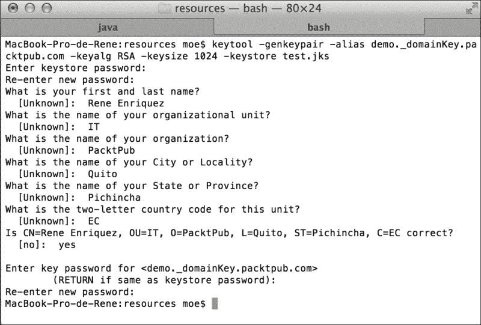

现在，我们将实现一些源代码来签署消息。我们首先需要向`pom.xml`文件添加所需的依赖项。

首先，添加我们获取构件的 JBoss 存储库，如下面的代码所示：

```java
<repositories>
  <repository>
    <id>jboss</id>
    <url>http://repository.jboss.org/maven2</url>
  </repository>
</repositories>
```

现在，让我们添加所有需要签署消息的依赖项，如下所示：

```java
  <dependencies>
    <dependency>
      <groupId>org.jboss.resteasy</groupId>
      <artifactId>resteasy-jaxrs</artifactId>
      <version>3.0.6.Final</version>
    </dependency>
    <dependency>
      <groupId>org.jboss.resteasy</groupId>
      <artifactId>resteasy-crypto</artifactId>
      <version>3.0.6.Final</version>
    </dependency>
  </dependencies>
```

为了避免类路径中的重复类，我们应该删除以下依赖项：

```java
    <dependency>
      <groupId>javax</groupId>
      <artifactId>javaee-web-api</artifactId>
      <version>6.0</version>
      <scope>provided</scope>
    </dependency>
```

## 更新 RESTEasy JAR 文件

由于我们使用 3.0.6.Final 版本来编译项目，需要更新 JBoss 中的现有版本。因此，我们将转到 URL [`sourceforge.net/projects/resteasy/files/Resteasy%20JAX-RS/`](http://sourceforge.net/projects/resteasy/files/Resteasy%20JAX-RS/) 并下载我们刚刚描述的版本。

当我们解压`.zip`文件时，我们会找到一个名为`resteasy-jboss-modules-3.0.6.Final.zip`的文件。让我们也解压这个文件，然后将其所有内容粘贴到我们的目录`JBOSS_HOME/modules`中。鉴于 RESTEasy 模块具有依赖关系，我们也必须更新它们。因此，在更新 RESTEasy 模块之后，我们应该更新模块`org.apache.httpcomponents`。让我们转到目录`JBOSS_HOME/modules/org/apache/httpcomponents`并更新以下构件：

+   `httpclient-4.1.2.jar` 到 `httpclient-4.2.1.jar`

+   `httpcore-4.1.4.jar` 到 `httpcore-4.2.1.jar`

此外，我们修改`module.xml`文件，因为 JAR 文件的名称不同，如下所示：

```java
<?xml version="1.0" encoding="UTF-8"?>

<!--
 ...
  -->

<module  name="org.apache.httpcomponents">
    <properties>
        <property name="jboss.api" value="private"/>
    </properties>

    <resources>
 <resource-root path="httpclient-4.2.1.jar"/>
 <resource-root path="httpcore-4.2.1.jar"/>
        <resource-root path="httpmime-4.1.2.jar"/>
        <!-- Insert resources here -->
    </resources>

    <dependencies>
        <module name="javax.api"/>
        <module name="org.apache.commons.codec"/>
        <module name="org.apache.commons.logging"/>
        <module name="org.apache.james.mime4j"/>
    </dependencies>
</module>
```

## 应用数字签名

现在我们已经拥有编译项目所需的一切，我们将创建一个非常简单的操作并应用签名。为了实现这一点，让我们在源代码包`com.packtpub.resteasy.services`中创建一个名为`SignedService`的类，如下面的屏幕截图所示：

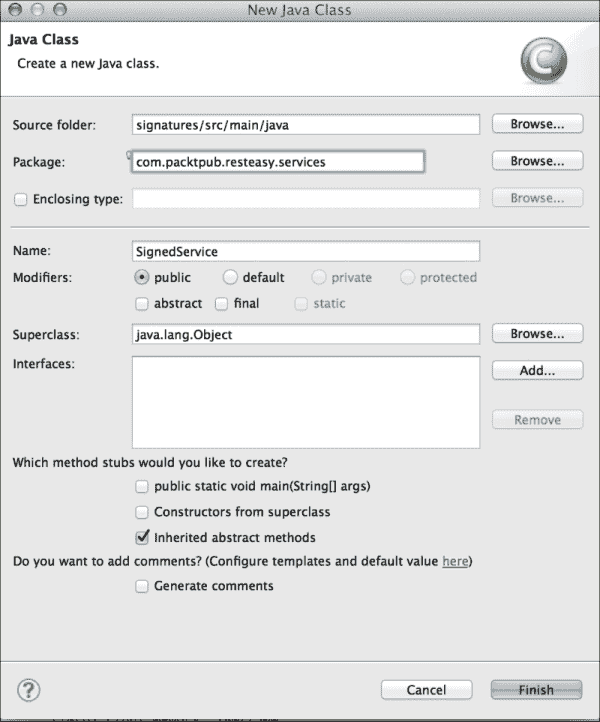

要签署消息，我们从 KeyStore 中取出一个密钥并使用它。我们可以通过它们的别名和它们所属的域以唯一的方式标识密钥。例如，对于密钥`demo._domainKey.packtpub.com`，别名是`demo`，它所属的域是密钥`packtpub.com`。鉴于我们可以在 KeyStore 中找到几个密钥，RESTEasy 提供了使用注解`@Signed`来选择我们想要的密钥的能力。

让我们向类添加下面突出显示的方法，并观察注解的工作方式：

```java
  @POST
  @Produces("text/plain")
 @Signed(selector = "demo", domain = "packtpub.com")
  public String sign(String input) {
    System.out.println("Aplyng signature " + input);
    return "signed " + input;
  }
```

以下图更好地展示了如何选择密钥来签署消息：

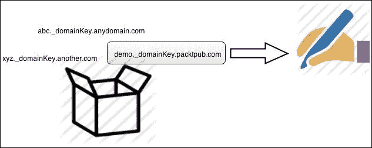

现在，我们将定义我们的签名资源将可用的路径，因此让我们如下注释类：

```java
import javax.ws.rs.Consumes;
import javax.ws.rs.POST;
import javax.ws.rs.Path;

import org.jboss.resteasy.annotations.security.doseta.Signed;

@Path("/signed")
public class SignedService {
...
```

为了使应用程序正常工作，我们将提供信息，以便它可以应用适当的签名。

首先，在文件夹`src/main/webapp`中，我们将创建一个带有空`web.xml`文件的`WEB-INF`文件夹。

让我们从`web.xml`文件开始，它应该如下所示：

```java
<?xml version="1.0" encoding="UTF-8"?>
<web-app version="3.0" 

  xsi:schemaLocation="http://java.sun.com/xml/ns/javaee 
  http://java.sun.com/xml/ns/javaee/web-app_3_0.xsd">

  <display-name>signatures</display-name>

</web-app>
```

现在，我们要做的第一件事是告诉我们的应用程序我们要签名的资源是什么，即包含我们要签名的方法的类。为此，让我们使用参数`resteasy.resources`配置相应的完整类名，如下所示：

```java
<context-param>
<param-name>resteasy.resources</param-name>
<param-value>com.packtpub.resteasy.services.SignedResource</param-value>
</context-param>
```

接下来，我们将告知我们的应用程序我们应用签名的密钥的位置（我们之前创建的`.jks`文件）。为此，我们有两个可用的上下文参数，`resteasy.doseta.keystore.classpath`和`resteasy.keystore.filename`。让我们使用第一个参数，使我们的文件看起来像下面这样：

```java
<context-param>
<param-name>resteasy.doseta.keystore.classpath</param-name>
<param-value>demo.jks</param-value>
</context-param>
```

您记得，当创建密钥时，我们被要求为 KeyStore 设置密码。我们将使用参数`resteasy.doseta.keystore.password`告诉我们的应用程序这是什么。让我们添加以下内容：

```java
  <context-param>
    <param-name>resteasy.doseta.keystore.password</param-name>
    <param-value>changeit</param-value>
  </context-param>
```

为了创建 KeyStore，我们将从中提取允许我们签署消息的密钥，我们必须添加以下参数：

```java
<context-param>
  <param-name>resteasy.context.objects</param-name>
  <param-value>org.jboss.resteasy.security.doseta.KeyRepository : org.jboss.resteasy.security.doseta.ConfiguredDosetaKeyRepository</param-value>
</context-param>
```

最后，我们应该添加 RESTEasy servlet，如下所示：

```java
  <servlet>
    <servlet-name>Resteasy</servlet-name>
    <servlet-class>org.jboss.resteasy.plugins.server.servlet.HttpServletDispatcher</servlet-class>
  </servlet>
  <servlet-mapping>
    <servlet-name>Resteasy</servlet-name>
    <url-pattern>/*</url-pattern>
  </servlet-mapping>
```

在这里，我们展示了一旦您添加了所有必需的信息后，`web.xml`文件应该是什么样子：

```java
<?xml version="1.0" encoding="UTF-8"?>
<web-app version="3.0" 

  xsi:schemaLocation="http://java.sun.com/xml/ns/javaee 
  http://java.sun.com/xml/ns/javaee/web-app_3_0.xsd">
<web-app>
  <display-name>signatures</display-name>
  <context-param>
    <param-name>resteasy.resources</param-name>
    <param-value>com.packtpub.resteasy.services.SignedService</param-value>
  </context-param>
  <context-param>
    <param-name>resteasy.doseta.keystore.classpath</param-name>
    <param-value>demo.jks</param-value>
  </context-param>
  <context-param>
    <param-name>resteasy.doseta.keystore.password</param-name>
    <param-value>changeit</param-value>
  </context-param>
  <context-param>
    <param-name>resteasy.context.objects</param-name>
    <param-value>org.jboss.resteasy.security.doseta.KeyRepository : org.jboss.resteasy.security.doseta.ConfiguredDosetaKeyRepository</param-value>
  </context-param>
  <servlet>
    <servlet-name>Resteasy</servlet-name>
    <servlet-class>org.jboss.resteasy.plugins.server.servlet.HttpServletDispatcher</servlet-class>
  </servlet>
  <servlet-mapping>
    <servlet-name>Resteasy</servlet-name>
    <url-pattern>/*</url-pattern>
  </servlet-mapping>
</web-app>
```

现在，通过执行以下命令生成 WAR 文件：

```java
mvn install

```

之后，我们将复制生成的构件到 JBoss 部署目录中。

## 测试功能

现在，打开 SoapUI 并测试 Web 服务是否按预期运行，如下截图所示：

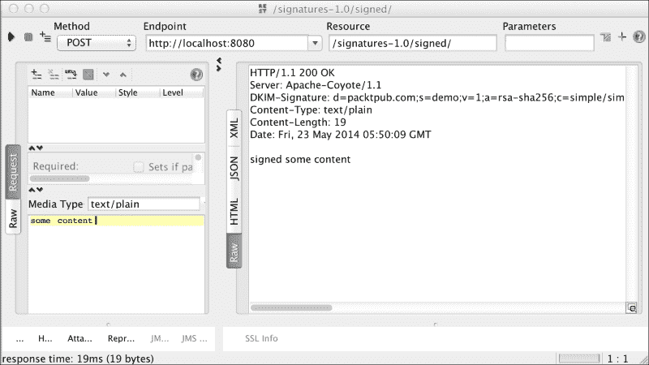

如您在响应中所见，我们获得了用于签署消息的`DKIM-Signature`头。此头的完整内容如下：

```java
DKIM-Signature: d=packtpub.com;s=demo;v=1;a=rsa-sha256;c=simple/simple;bh=lc+ECoAqpQCB4ItWLUomBv34m3F9G0pkIBAI8Z/yWcQ=;b=AlJY6iiCtdCnHrJa+Of9aRgBXeIp7V7cEG7eyUp0CRbD9wjFodbQGRQjhfwDgd1WIBzVLIWelTdI85BlGl3ACNcMLBjPv2iBBjo+78e/9HcYs81YNlPRAAj6jzymA/+jkmpTVcthWaEEyoPJJBAI5FvP33zH7etfkFaGX+bwer0=
```

对于我们来说，从整个字符串中重要的是以下内容：

+   `d=`：这是域，是我们实现方法时指定的值。

+   `a=`：这是 RESTEasy 用于签署消息的算法。在这种情况下，我们使用 RSA，因为这是到目前为止框架支持的唯一算法。

其他参数并不是很重要，它们只是对签名消息的必要性。

现在，为了验证签名的真实性，我们将创建一个类，从中进行验证。

我们将使用 JUnit；因此，首先在`pom.xml`文件中添加相应的依赖项，如下代码片段所示：

```java
    <dependency>
      <groupId>junit</groupId>
      <artifactId>junit</artifactId>
      <version>4.8.2</version>
      <scope>test</scope>
    </dependency>
```

现在，让我们创建一个名为`scr/test/java`的新源文件夹，并在其中创建一个名为`com.packtpub.resteasy.services.test`的包。在该包中，让我们使用以下内容创建`SignedServiceTest`类：

```java
import javax.ws.rs.client.Entity; 
import javax.ws.rs.client.Invocation; 
import javax.ws.rs.client.WebTarget; 
import javax.ws.rs.core.Response;  
import junit.framework.Assert;  
import org.jboss.resteasy.client.jaxrs.ResteasyClient; 
import org.jboss.resteasy.client.jaxrs.ResteasyClientBuilder; 
import org.jboss.resteasy.security.doseta.DosetaKeyRepository; 
import org.jboss.resteasy.security.doseta.Verification; 
import org.jboss.resteasy.security.doseta.Verifier; 
import org.junit.Test;

public class SignedServiceTest {

  @Test
  public void testVerification() {
    // Keys repository
    DosetaKeyRepository repository = new DosetaKeyRepository();
    repository.setKeyStorePath("demo.jks");
    repository.setKeyStorePassword("changeit");
    repository.start();
    // Building the client
  ResteasyClient client = new ResteasyClientBuilder().build();
    Verifier verifier = new Verifier();
    Verification verification = verifier.addNew();
    verification.setRepository(repository);
    WebTarget target = client
             .target(
      "http://localhost:8080/signatures-1.0/signed");
    Invocation.Builder request = target.request();
    request.property(Verifier.class.getName(), verifier);
    // Invocation to RESTful web service
    Response response = request.post(Entity.text("Rene"));
    // Status 200 OK
    Assert.assertEquals(200, response.getStatus());
    System.out.println(response.readEntity(String.class));
    response.close();
    client.close();
  }
}
```

如果一切顺利，我们将看到一个绿色的条作为我们测试的结果，如下截图所示：

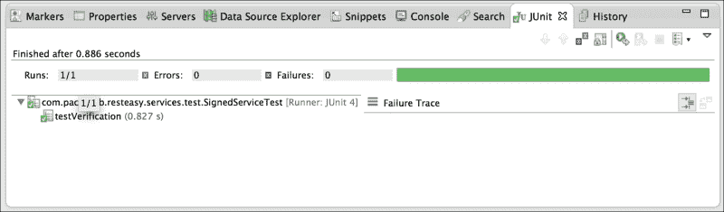

## 使用注释验证签名

验证资源是否签名的更简单方法是使用注释。当您有必须满足的签名流程时，可以主要使用此解决方案。

例如，假设 Packt Publishing 公司的员工有一个系统，他们可以通过该系统申请增加计算机的 RAM。为了将这些请求视为有效，它们必须由提出请求的人签名。我们的意思是，我们只需要请求被签名才能被视为有效，如下图所示：

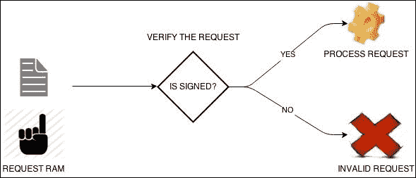

对于这个示例，我们将在我们的`SignedService`类中添加两个方法；第一个方法将允许我们发送请求，如下所示：

```java
  @POST
  @Path("ram")
  @Signed(selector = "demo", domain = "packtpub.com")
  @Consumes("text/plain")
  public String requestRam(int numberOfGB) {
    return numberOfGB + "-GB";
  }
```

为了满足业务需求，我们将使用`@Verify`注释，在其中我们可以对签名添加限制。目前，我们只需要验证请求是否已签名。

以下是老板用来批准或拒绝向员工 PC 增加内存的所有复杂逻辑的方法：

```java
@Verify
@POST
@Path("verifier")
@Produces("text/plain")
public String processRequestRam (String input) {
  int numberOfGbRequested = Integer.valueOf(input.split("-")[0]);
  if (numberOfGbRequested > 4) {
    return "deny";
  } else {
    return "accepted";
  }
}
```

现在，让我们在 JBoss 上部署应用程序，并使用 SoapUI 进行测试。正如我们已经提到的，请求必须签名才能被处理。因此，首先向`processRequestRam`方法发出未签名的请求，如下截图所示：

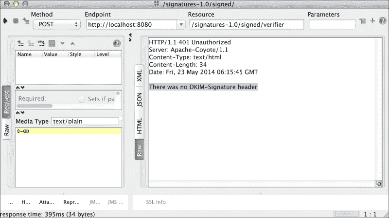

应用程序被处理的关键是它来自公司域，即`packtpub.com`。随后，老板对申请进行严格分析，并作出裁决，确定申请是否被批准或拒绝。

对于这个示例，我们将删除之前创建的方法，并在我们的`SignedService`类中添加两个方法；第一个方法将允许我们发送请求，如下所示：

```java
@POST
@Signed(selector = "demo", domain = "packtpub.com")
@Consumes("text/plain")
public Response requestRAM(int numberOfGB) {
  return Response.seeOther(
    URI.create("/signed/" + "GB:" + numberOfGB)).build();
}
```

输出清楚地显示了错误。请求无法处理，因为没有包含用于验证签名的`DKIM-Signature`头信息。这意味着头信息不在那里，因为它们之前没有被签名。

为了成功处理请求，我们将调用一个签署请求的 Web 服务。我们将添加带有签名信息的头信息，并再次调用`processRequestRam`方法。

让我们从调用`requestRam`操作开始，如下截图所示：

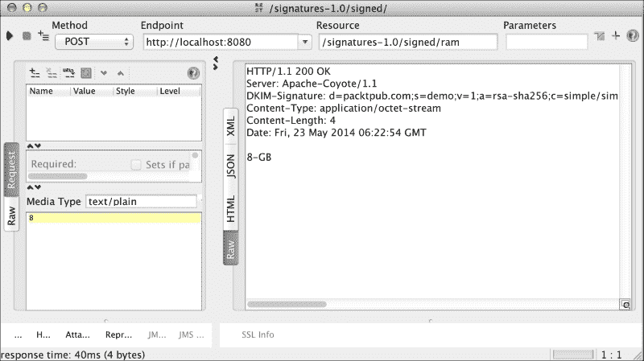

作为此回调的结果，我们将获得以下值：

```java
DKIM-Signature: d=packtpub.com;s=demo;v=1;a=rsa-sha256;c=simple/simple;bh=uA6n2udZlWdx+ouwCEeeyM6Q48KH0EWa2MnfBwMP+vM=;b=T0drw9QWud7rs1w//5384hs8GCatJKzmljIhgiTrHWdVx/IhCVl915yycchN+hQ+ljUaS6bPtLYo/ZNspcv2LtAe/tKTPpng4RWlr52k0TqnV3XX2KvJ7kBOpEU2Rg6f6lBOJT5v+o0iV05ObagfzKDfQ9o09WpZjQKcBG+/xvE=

RESPONSE: 8 GB
```

让我们继续前进！现在，我们将使用这些值来发出请求。从 SoapUI，让我们调用`processRequestRam`操作，并关注请求编辑器的左下角区域；有一个选项说**头信息**。让我们选择这个选项，然后点击**+**符号。现在，我们必须输入`DKIM-Signature`头信息，并放入相应的值。还要记得发送`8-GB`请求参数，这是在调用`requestRam`操作后得到的响应，如下截图所示：

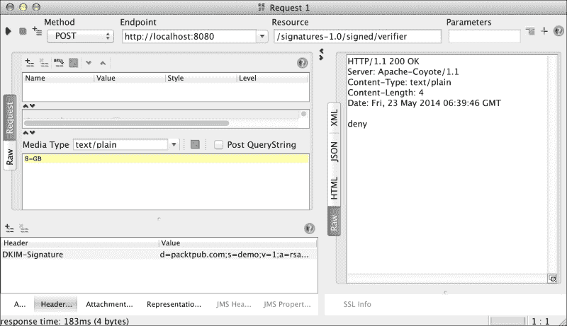

正如我们所看到的，请求已成功处理，但老板拒绝了内存增加。现在，我们指出数字签名允许我们验证信息在签名后未被更改。假设恶意软件拦截了响应，而不是`8-GB`，它提供了值`12-GB`。让我们根据数字签名的理论在 SoapUI 中发出此请求。这个请求不应该有效；然而，我们必须检查：

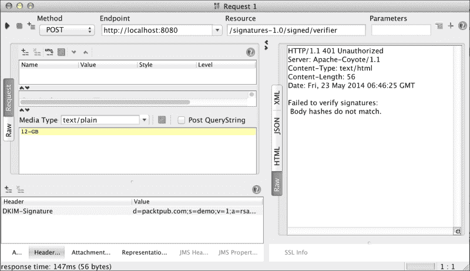

错误消息清楚地指示消息主体已被更改，因此请求未被处理，并且我们收到了`HTTP 401 未经授权`的消息。这证实了之前关于签名消息完整性的说法。

然而，RESTEasy 允许我们做的不仅仅是验证消息是否已被签名。我们可以验证签名者是否属于特定域。在我们的示例中，只有来自`packtpub.com`域的签名才被视为有效。为了执行这种类型的控制，我们将进行以下更改：

```java
@Verify(identifierName = "d", identifierValue = "packtpub.com")
@POST
@Path("verifier")
@Produces("text/plain")
public String processRequestRam(String input) {
  int numberOfGbRequested = Integer.valueOf(input.split("-")[0]);
  if (numberOfGbRequested > 4) {
    return "deny";
  } else {
    return "accepted";
  }
}
```

让我们在 JBoss 中部署应用程序，并再次从 SoapUI 执行请求：

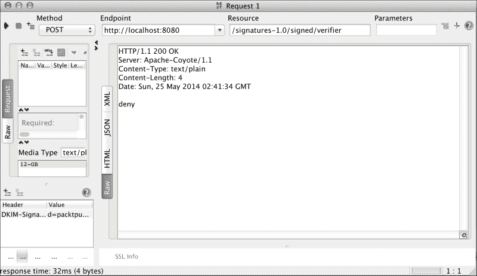

现在，让我们强制出现故障。我们将假设有效消息只有那些来自`itpacktpub.com`域的签名。因此，让我们应用以下更改：

```java
@Verify(identifierName = "d", identifierValue = "itpacktpub.com")
@POST
@Path("verifier")
@Produces("text/plain")
public String processRequestRam(String input) {
  int numberOfGbRequested = Integer.valueOf(input.split("-")[0]);
  if (numberOfGbRequested > 4) {
    return "deny";
  } else {
    return "accepted";
  }
}
```

让我们再次在 JBoss 中部署应用程序，并从 SoapUI 执行请求：

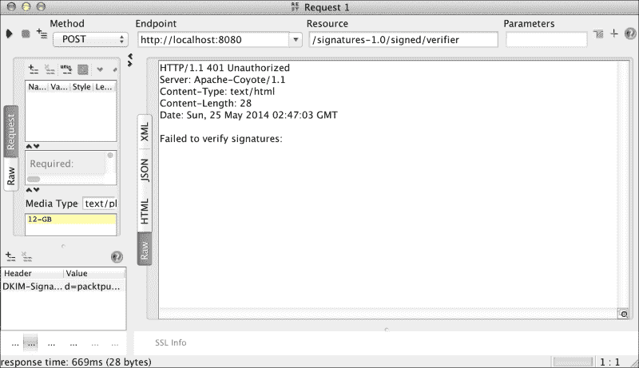

正如我们所预期的，这次请求失败了。显然，这是因为无法验证签名，因为消息是用`packtpub.com`域而不是我们在`processRequestRam`操作中设置的`itpacktpub.com`域签名的。

突然间，你想知道为什么标识名称的值是`d`。正如我们之前提到的，字母`d`代表域。RESTEasy 文档对头信息中的每个参数进行了更详细的解释。在这里，我们向您展示了与此主题相关的 JBoss 文档的一个示例：

*以下是一个示例 DKIM-Signature 头信息可能看起来像的样子：*

*DKIM-Signature: v=1;*

*a=rsa-sha256;*

*d=example.com;*

*s=burke;*

*c=simple/simple;*

*h=Content-Type;*

*x=0023423111111;*

*bh=2342322111;*

*b=M232234=*

*如您所见，它是一组由`;`分隔的名称值对。虽然了解头信息的结构并不是非常重要，但这里解释了每个参数：*

*v: 协议版本。始终为 1。*

*a: 用于哈希和签署消息的算法。目前，RESTEasy 仅支持 RSA 签名和 SHA256 哈希算法。*

*d: 签名者的域。这用于识别签名者以及发现用于验证签名的公钥。*

*s: 域的选择器。也用于识别签名者和发现公钥。*

*c: 规范算法。目前只支持 simple/simple。基本上，这允许你在计算哈希之前转换消息正文。*

*h: 分号分隔的标题列表，包括在签名计算中。*

*x: 签名何时过期。这是自纪元以来以秒为单位的时间的数字长值。允许签名者控制已签名消息的签名何时过期。*

*t: 签名的时间戳。自纪元以来以秒为单位的数字长值。允许验证器控制签名何时过期。*

*bh: 消息正文的 Base64 编码哈希。*

*b: Base64 编码的签名。*

现在我们有了这些信息，很明显可以假设，如果你想检查签名者，而不是使用字母`d`，我们必须使用字母`s`，而不是`packtpub.com`，我们将使用`demo`。一旦你应用了这些更改，我们的代码应该如下所示：

```java
@Verify(identifierName = "s", identifierValue = "demo")
@POST
@Path("verifier")
@Produces("text/plain")
public String processRequestRam(String input) {
  int numberOfGbRequested = Integer.valueOf(input.split("-")[0]);
  if (numberOfGbRequested > 4) {
    return "deny";
  } else {
    return "accepted";
  }
}

```

此外，如果你想验证签名者的名称和域，你必须进行轻微的更改。这次，我们将使用`@Verifications`注解；这个注解接收一个`@Verify`注解的数组作为参数，这允许我们执行我们之前描述的操作。在这种情况下，我们应该使用`@Verify`注解添加两个控件，我们的代码应该如下所示：

```java
@Verifications({ 
@Verify(identifierName = "s", identifierValue = "demo"),
@Verify(identifierName = "d", identifierValue = "packtpub.com") })
@POST
@Path("verifier")
@Produces("text/plain")
public String processRequestRam(String input) {
  int numberOfGbRequested = Integer.valueOf(input.split("-")[0]);
  if (numberOfGbRequested > 4) {
    return "deny";
  } else {
    return "accepted";
  }
}
```

一旦我们应用了这些更改，我们可以使用 SoapUI 执行一个请求。我们应该得到一个成功的执行结果，如下面的截图所示：

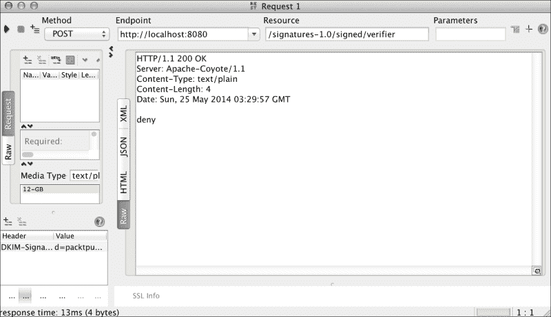

# 消息正文加密

在上一章中，我们看到了如何使用 HTTPS 加密完整的 HTTP 消息。现在，我们将解释如何只加密消息正文以及每个过程之间的区别。我们首先构建一个简单的例子，然后，当我们执行我们实现的相应测试时，我们将了解它是如何工作的。

为了不破坏我们之前的项目，我们将构建一个新的项目。为此，我们将在终端中执行以下命令：

```java
mvn archetype:generate -DgroupId=com.packtpub -DartifactId=encryption -DarchetypeArtifactId=webapp-javaee6 -DarchetypeGroupId=org.codehaus.mojo.archetypes

```

正如在本章前面所看到的，当你被要求一个版本时，将`1.0-SNAPSHOT`的默认值更改为`1.0`。

当然，如果你愿意，你可以从以下 URL 从 GitHub 下载所有源代码：

[`github.com/restful-java-web-services-security/source-code/tree/master/chapter05/encryption`](https://github.com/restful-java-web-services-security/source-code/tree/master/chapter05/encryption)

现在，让我们将项目导入 Eclipse，在`pom.xml`文件中删除现有的默认依赖，并添加依赖于`resteasy-jaxrs`和`resteasy-crypto`的构件。

`dependencies`部分应该如下所示：

```java
  <dependencies>
    <dependency>
      <groupId>org.jboss.resteasy</groupId>
      <artifactId>resteasy-jaxrs</artifactId>
      <version>3.0.6.Final</version>
      <scope>provided</scope>
    </dependency>
    <dependency>
      <groupId>org.jboss.resteasy</groupId>
      <artifactId>resteasy-crypto</artifactId>
      <version>3.0.6.Final</version>
    </dependency>
  </dependencies>
```

现在，让我们在`com.packtpub`包内创建`EncryptedService`类。在这个类中，我们将创建一个非常简单的操作，如下所示：

```java
package com.packtpub;

import javax.ws.rs.GET;
import javax.ws.rs.Path;

@Path("/encrypted")
public class EncryptedService {

  @GET
  public String gretting() {
    return "Hello world";
  }
}
```

为了注册我们应用程序的服务，让我们创建`EncryptedApplication`类，如下所示：

```java
package com.packtpub;

import java.util.HashSet;
import java.util.Set;

import javax.ws.rs.ApplicationPath;
import javax.ws.rs.core.Application;

@ApplicationPath("/services")
public class EncryptedApplication extends Application {

  private Set<Object> resources = new HashSet<Object>();

  public EncryptedApplication() throws Exception {
    resources.add(new EncryptedService());
  }

  @Override
  public Set<Object> getSingletons() {
    return resources;
  }
}
```

## 测试功能

之后，我们的应用程序应该准备就绪。所以，让我们从 SoapUI 执行一个测试，使用 Wireshark 观察流量，如下面的截图所示：

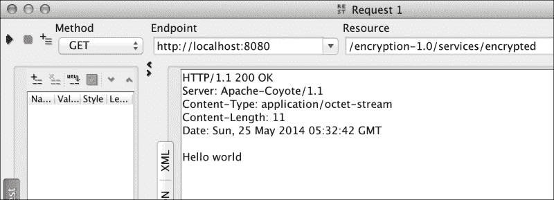

Wireshark 向我们展示了以下内容：

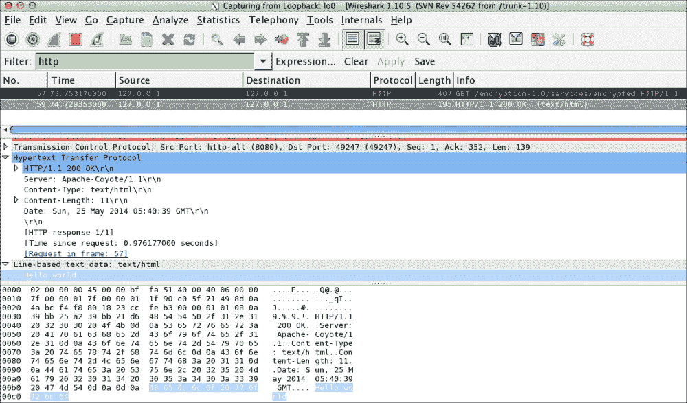

正如我们所看到的，流量分析器显示了所有信息是如何直接传输的，以及它是如何轻松解释的。现在，让我们在 JBoss 上启用 HTTPS，以展示整个消息是如何加密的。

## 使用 HTTPS 启用服务器

所以，首先我们必须创建一个证书 KeyStore。我们可以通过在终端上执行以下命令来实现这一点：

```java
keytool -genkey -alias tomcat -keyalg RSA

```

当它要求你输入密码时，你应该使用`changeit`，因为我们已经在本书中使用过它。

现在，我们查看`JBOSS_HOME/standalone/configuration/standalone.xml`文件，找到包含`<connector name="http"`的行，并添加以下内容：

```java
<connector name="https" protocol="HTTP/1.1" scheme="https" 
socket-binding="https" secure="true">
  <ssl/>
</connector>
```

一旦您进行了这些更改，我们将重新启动应用服务器，部署应用程序并编辑请求。这一次，我们将使用端口 8443 和 HTTPS 协议。因此，URL 应该如下所示：

`https://localhost:8443/encryption-1.0/services/encrypted`

让我们使用 SoapUI 执行请求；我们的流量分析器现在将向我们显示以下结果：

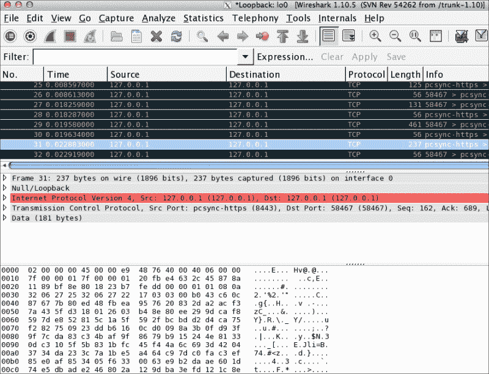

正如我们所预期的那样，这一次，分析器非常清楚地显示出所有信息都已加密。

在我们的示例中，我们现在将在 JBoss 中禁用 HTTPS。为此，我们必须删除之前添加的连接器。现在，我们将使用 S/MIME 来仅加密响应的消息体。首先，让我们检查一些概念，这些概念将帮助我们理解它是如何工作的。

S/MIME 来源于安全 MIME。MIME 代表多用途互联网邮件扩展，它不仅帮助我们发送诸如“Hello world”之类的消息，还可以发送更有趣的内容，如视频、音频等。MIME 与 SMTP 和 HTTP 等电子邮件协议一起工作。这有助于我们处理 RESTful S/MIME 网络服务。另一方面，MIME 为我们提供以下功能：

+   消息加密

+   验证发送消息的用户的身份

+   验证消息的信息完整性的能力

鉴于 S/MIME 与证书一起工作，这是保存消息发送者信息的地方。当接收者收到消息时，他们观察消息的所有公共部分。然后可以使用密钥解密消息，并访问其内容。如果您想进一步了解 S/MIME，我们建议您访问链接[`datatracker.ietf.org/wg/smime/charter/`](http://datatracker.ietf.org/wg/smime/charter/)。

让我们首先进行一些更改。首先，我们将在应用程序中创建源文件夹`src/main/resources`；在此目录中，我们将放置加密消息所需的资源。

然后，我们使用`openssl`生成证书，转到我们刚刚从控制台创建的目录，并在终端上的命令行中运行以下命令：

```java
openssl req -x509 -nodes -days 365 -newkey rsa:1024 -keyout demokey.pem -out democert.pem

```

现在，我们必须输入如下截图中显示的请求信息：

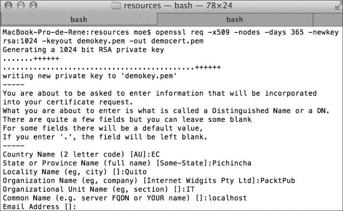

这将生成两个文件：`demokey.pem`是私钥，`democert.pem`是我们将用于加密消息体的证书。为了表示已签名的响应，RESTEasy 使用`EnvelopedOutput`对象。在下图中，我们向您展示了 RESTEasy 如何加密消息：

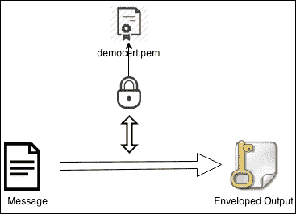

因此，我们必须替换`EncryptedService`类中`gretting()`方法的返回类型。让我们将字符串更改为`EnvelopedOutput`，并使用我们之前生成的证书加密消息体。应用这些更改后，我们的方法应该如下所示：

```java
@GET
public EnvelopedOutput gretting() throws Exception {
  InputStream certPem = Thread.currentThread()
                       .getContextClassLoader()
                       .getResourceAsStream("democert.pem");
  X509Certificate myX509Certificate = PemUtils.
      decodeCertificate(certPem)
  EnvelopedOutput output = new 
    EnvelopedOutput("Hello world", MediaType.TEXT_PLAIN);
  output.setCertificate(myX509Certificate);
  return output;
}
```

让我们在`pom.xml`文件中进行一些更改。我们将以以下方式修改`dependencies`部分：

```java
  <dependencies>
    <dependency>
      <groupId>junit</groupId>
      <artifactId>junit</artifactId>
      <version>4.8.1</version>
    </dependency>
    <dependency>
      <groupId>org.jboss.resteasy</groupId>
      <artifactId>resteasy-jaxrs</artifactId>
      <version>3.0.6.Final</version>
      <scope>provided</scope>
    </dependency>
    <dependency>
      <groupId>org.jboss.resteasy</groupId>
      <artifactId>resteasy-jaxb-provider</artifactId>
      <version>3.0.6.Final</version>
      <scope>provided</scope>
    </dependency>
    <dependency>
      <groupId>org.jboss.resteasy</groupId>
      <artifactId>resteasy-crypto</artifactId>
      <version>3.0.6.Final</version>
    </dependency>
  </dependencies>
```

请注意我们如何更改了`resteasy-jaxrs`和`resteasy-jaxb-provider`构件的范围；这是为了在加密消息时避免重复类。由于这些构件是应用服务器内的模块，因此需要指示我们要加载它们。为此，我们将修改`pom.xml`文件中`maven-war-plugin`插件部分，如下所示：

```java
<plugin>
  <groupId>org.apache.maven.plugins</groupId>
  <artifactId>maven-war-plugin</artifactId>
  <configuration>
    <failOnMissingWebXml>false</failOnMissingWebXml>
    <archive>
      <manifestEntries>
        <Dependencies>org.jboss.resteasy.resteasy-jaxb-provider export, org.jboss.resteasy.resteasy-jaxrs export</Dependencies>
      </manifestEntries>
    </archive>
  </configuration>
</plugin>
```

由于 JBoss 版本 7 是基于模块的应用服务器，默认情况下在启动时只激活了少数模块。如果要访问其他模块，则需要明确指出这些依赖关系。这可以通过`MANIFEST.MF`文件或创建一个名为`jboss-deployment-structure.xml`的文件来完成。

在这种情况下，我们将使用`maven-war-`插件选择第一个文件，以指示所需的依赖关系。

### 测试功能

现在，让我们再次从 SoapUI 向 URL `http://localhost:8080/encryption-1.0/services/encrypted` 发送请求。

这次，我们将得到以下截图中显示的响应：

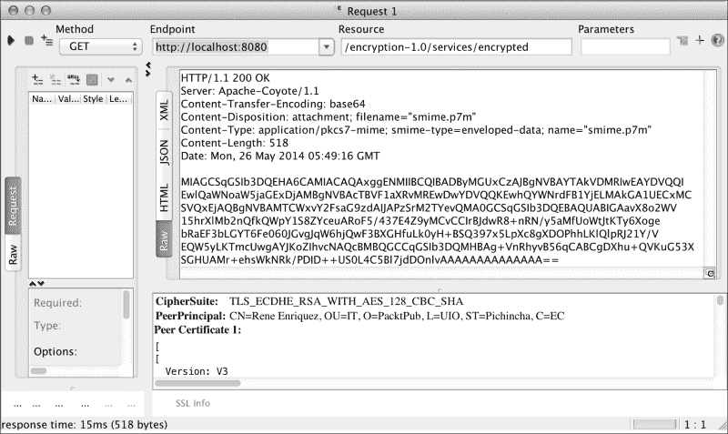

接下来，我们将从流量分析器中看到以下内容：

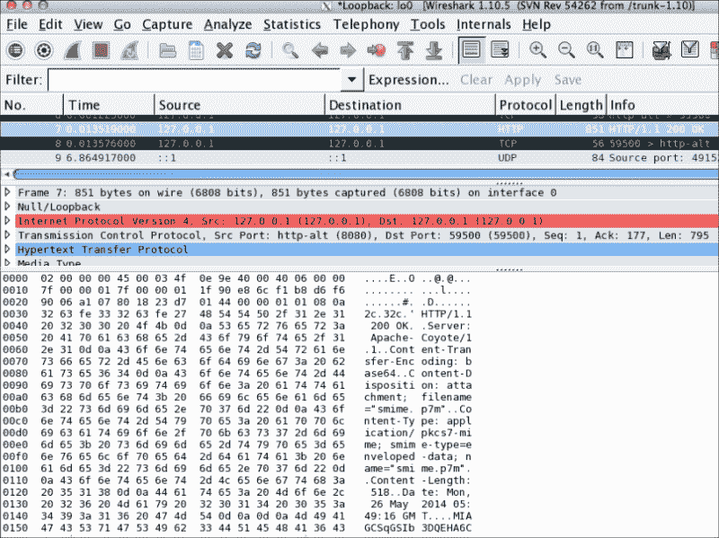

正如我们所看到的，它向我们展示了与 SoapUI 响应非常相似的内容。要解密内容，需要我们拥有私钥和证书。通过这两个资源，我们可以获得`EnvelopedInput`对象，并从中获取消息，如下图所示：

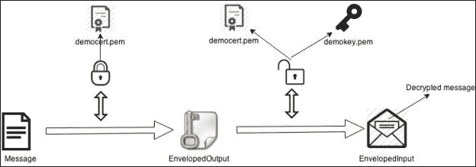

这将通过单元测试中的以下代码进行演示。然而，在继续之前，我们想要展示，当使用 S/MIME 加密消息时，头部仍然可读，但消息正文完全加密。因此，如果我们没有资源，信息就会过时，无法被解释。

现在，我们将编写一个允许我们读取消息正文的类。为此，我们将创建一个名为`src/main/test`的新源文件夹。

在这个文件夹中，让我们创建名为`com.packtpub.EncryptedServiceTest`的类，内容如下：

```java
package com.packtpub;

import java.security.PrivateKey;
import java.security.cert.X509Certificate;

import javax.ws.rs.client.Client;
import javax.ws.rs.client.WebTarget;

import junit.framework.Assert;

import org.jboss.resteasy.client.jaxrs.ResteasyClientBuilder;
import org.jboss.resteasy.security.PemUtils;
import org.jboss.resteasy.security.smime.EnvelopedInput;
import org.junit.Test;

public class EncryptedServiceTest {

  @Test
  public void testEncryptedGet() throws Exception {
    // LOADING THE CERTIFICATE
    X509Certificate myX509Certificate = PemUtils.decodeCertificate(
        Thread
        .currentThread().getContextClassLoader()
        .getResourceAsStream("democert.pem"));
    // LOADING THE KEY
    PrivateKey myPrivateKey = PemUtils.decodePrivateKey(Thread
        .currentThread().getContextClassLoader()
        .getResourceAsStream("demokey.pem"));
    // CREATING A CLIENT FOR THE WEB SERVICE
    Client client = new ResteasyClientBuilder().build();
    WebTarget target = client.target(
      "http://localhost:8080/encryption-1.0/services/encrypted"
    );
    // RETRIEVING THE RESULT OF METHOD EXECUTION
    EnvelopedInput<?> input = target.request().
            get(EnvelopedInput.class);
    Assert.assertEquals("Hello world",
        input.getEntity(String.class, 
        myPrivateKey, myX509Certificate));
    client.close();
  }

}
```

请注意，我们需要私钥和证书来解密消息，以获取包含消息`Hello world`的字符串形成的实体。

当我们运行这个单元测试时，如果一切顺利，我们应该会得到一个绿色的条形图。这表明，使用之前的资源（私钥和证书）解密消息后，得到了预期的消息。

# 总结

在本章中，我们使用数字签名，并学习了如何在 RESTful web 服务中使用它们。如今，数字签名经常被使用，因为它们保证了消息的完整性，信息在从发送者到接收者的传输过程中不会被 compromise。我们已经知道信息在传输过程中可能会被修改，但当您验证签名的信息时，接收者可以注意到并采取他/她认为合适的行动。例如，他们可以发送另一个请求，以避免使用损坏的信息。在本章末尾，我们使用了消息正文加密，并看到了使用这些加密和 HTTPS 之间的区别。最后，我们看到了接收者如何使用密钥来解密消息正文，以根据他们的需求使用信息。
