# 第九章：行为设计模式 – 第二部分

行为设计模式组相对较大。在前一章中，我们研究了行为设计模式的第一部分，并了解了它们的目的。正如我们已经知道的，这些模式用于处理计算机程序中的行为和对象通信的建模。

在本章中，我们将继续从 Scala 的角度研究不同的行为设计模式。我们将探讨以下主题：

+   迭代器

+   中介者

+   备忘录

+   观察者

+   状态

+   模板方法

+   访问者

本章我们将要讨论的设计模式可能不像我们之前看到的一些模式那样与函数式编程相关。它们可能看起来像是 Java 设计模式的 Scala 实现，实际上也是如此。然而，这并不意味着它们是不必要的，由于 Scala 的混合特性，它们仍然很重要。

如前几章一样，我们将遵循相同的结构，给出模式定义，展示类图和代码示例，并讨论特定设计模式的优缺点。

# 迭代器设计模式

我们在软件项目中经常使用迭代器。当我们遍历列表或遍历集合或映射的项目时，我们使用**迭代器**。

迭代器设计模式提供了一种以顺序方式访问聚合对象（集合）元素的方法，而不暴露项目底层的表示。

当使用迭代器设计模式时，开发者不需要知道底层是链表、数组、树还是哈希表。

# 示例类图

使用迭代器设计模式，我们可以创建自己的对象，使其充当集合，并在循环中使用它们。在 Java 中，有一个名为`Iterator`的接口，我们可以为此目的实现它。在 Scala 中，我们可以混入`Iterator`特质并实现其`hasNext`和`next`方法。

对于类图和示例，让我们有一个**ClassRoom**类，它将支持遍历所有学生的 foreach 循环。以下图表显示了我们的类图：

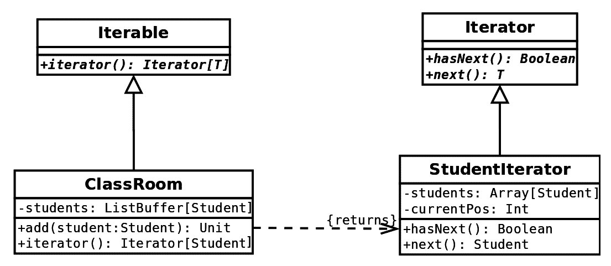

我们决定让我们的**ClassRoom**类实现**Iterable**，它应该返回一个**迭代器**，并在方法调用时返回迭代器的新实例。迭代器设计模式在图表的右侧表示。图表的其余部分是我们为了使与我们的类一起工作更简单而做的事情。

# 代码示例

让我们看看实现前面图表的代码。首先，`Student`类只是一个看起来如下所示的 case 类：

```java
case class Student(name: String, age: Int)
```

我们已经在`StudentIterator`类中实现了标准的 Scala `Iterator`特质。以下是实现代码：

```java
class StudentIterator(students: Array[Student]) extends Iterator[Student] {
  var currentPos = 0

  override def hasNext: Boolean = currentPos < students.size

  override def next(): Student = {
    val result = students(currentPos)
    currentPos = currentPos + 1
    result
  }
}
```

关于迭代器，有一件事需要知道，它们只能单向工作，你不能回退。这就是为什么我们简单地使用一个`currentPos`变量来记住我们在迭代中的位置。在这里我们使用了一个可变变量，这与 Scala 的原则相悖；然而，这只是一个例子，并不太关键。在实践中，你可能会结合数据结构使用迭代器设计模式，而不是这种形式。我们选择迭代器的底层结构为`Array`的原因是数组的索引访问是常数，这将提高大型集合的性能并使我们的实现简单。

前面的代码足以展示迭代器设计模式。其余的代码在这里是为了帮助我们展示它如何被使用。让我们看看`ClassRoom`类：

```java
import scala.collection.mutable.ListBuffer

class ClassRoom extends Iterable[Student] {
  val students: ListBuffer[Student] = ListBuffer[Student]()

  def add(student: Student): Unit = {
    student +=: students
  }

  override def iterator: Iterator[Student] = new StudentIterator(students.toArray)
}
```

在前面的代码中，我们混入了`Iterable`特质并实现了它的`iterator`方法。我们返回我们的`StudentIterator`。

我们创建了一个自定义迭代器仅作为一个例子。然而，在现实中，你只需在`ClassRoom`类中实现`Iterable`并返回底层集合（在这种情况下是学生）的迭代器。

让我们看看一个使用我们的`ClassRoom`类的例子：

```java
object ClassRoomExample {
  def main(args: Array[String]): Unit = {
    val classRoom = new ClassRoom
    classRoom.add(Student("Ivan", 26))
    classRoom.add(Student("Maria", 26))
    classRoom.add(Student("John", 25))
    classRoom.foreach(println)
  }
}
```

我们混入`Iterable`特质的事实使我们能够在`ClassRoom`类型的对象上使用`foreach`、`map`、`flatMap`等许多其他操作。以下截图显示了我们的示例输出：

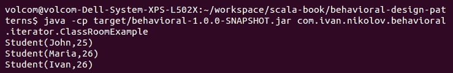

正如你在本例中可以看到的，我们的`ClassRoom`类的用户对持有我们的`Student`对象的数据结构一无所知。我们可以在任何时候替换它（我们甚至可以从数据库中获取学生的数据），只要我们的类中还有`Iterable`特质，整个代码就会继续工作。

# 它有什么好处

迭代器设计模式在软件工程中经常被使用。它可能是最常用的设计模式之一，每个人都听说过它。它几乎与所有可以想到的集合一起使用，它很简单，并允许我们隐藏复合对象内部组织的细节。

# 它有什么不好

我们实现的一个明显的缺点，这显示了迭代器设计模式可能存在的问题，是在并行代码中的使用。如果另一个线程向原始集合中添加或删除对象会发生什么？我们的迭代器将不会反映这一点，并且可能由于缺乏同步而导致问题。使迭代器能够处理多线程环境不是一个简单的任务。

# 中介设计模式

现实世界的软件项目通常包含大量不同的类。这有助于分配复杂性和逻辑，使得每个类只做一件特定的事情，简单而不是许多复杂任务。然而，这要求类以某种方式相互通信，以实现某些特定功能，但保持松散耦合原则可能成为一个挑战。

中介设计模式的目的在于定义一个对象，该对象封装了一组其他对象如何相互交互，以促进松散耦合，并允许我们独立地改变类交互。

中介设计模式定义了一个特定的对象，称为 **中介**，它使其他对象能够相互通信，而不是直接这样做。这减少了它们之间的依赖性，使得程序在未来易于更改和维护，并且可以正确地进行测试。

# 示例类图

让我们想象我们正在为学校构建一个系统，其中每个学生可以参加多个课程，每个课程由多个学生参加。我们可能希望有一个功能，可以通知特定课程的所有学生该课程已被取消，或者我们可能希望轻松地添加或从课程中删除用户。我们可以冲动地开始编写我们的代码，并将课程列表作为 `student` 类的一部分，以及 `group` 类中的学生列表。然而，这样我们的对象将变得相互关联，并且实际上不可重用。这正是中介模式的好用例。

让我们看看我们的类图：

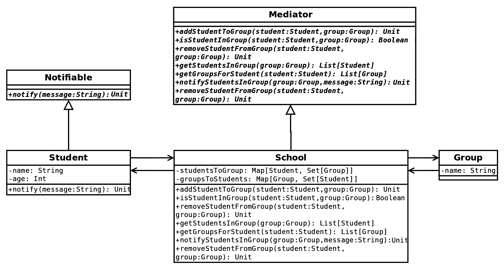

如您从前面的图中可以看到，学校是中介，它包含有关用户到组和组到用户的信息。它管理这些实体之间的交互，并允许我们使我们的 **学生** 和 **组** 类可重用，并且彼此独立。

我们已经给出了学生和课程的示例；然而，这可以很容易地应用于任何多对多关系——软件中的权限组、出租车系统、空中交通管制系统等等。

# 代码示例

现在我们已经展示了我们的类图，让我们来看看示例的源代码。首先，让我们看看我们有的模型类：

```java
trait Notifiable {
  def notify(message: String)
}

case class Student(name: String, age: Int) extends Notifiable {
  override def notify(message: String): Unit = {
    System.out.println(s"Student $name was notified with message:
    '$message'.")
  }
}

case class Group(name: String)
```

在前面的代码中，`Notifiable` 特性在当前示例中不是必需的；然而，例如，如果我们添加教师，那么在需要向同一组中的所有人发送通知的情况下，它将是有用的。前一个代码中的类可以有自己的独立功能。

我们的 `Mediator` 特性有以下定义：

```java
trait Mediator {
  def addStudentToGroup(student: Student, group: Group)

  def isStudentInGroup(student: Student, group: Group): Boolean

  def removeStudentFromGroup(student: Student, group: Group)

  def getStudentsInGroup(group: Group): List[Student]

  def getGroupsForStudent(student: Student): List[Group]

  def notifyStudentsInGroup(group: Group, message: String)
}
```

如您所见，前面的代码定义了允许学生和组之间交互的方法。这些方法的实现如下：

```java
import scala.collection.mutable.Map
import scala.collection.mutable.Set

class School extends Mediator {
  val studentsToGroups: Map[Student, Set[Group]] = Map()
  val groupsToStudents: Map[Group, Set[Student]] = Map()

  override def addStudentToGroup(student: Student, group: Group): Unit = {
    studentsToGroups.getOrElseUpdate(student, Set()) += group
    groupsToStudents.getOrElseUpdate(group, Set()) += student
  }

  override def isStudentInGroup(student: Student, group: Group): Boolean =
    groupsToStudents.getOrElse(group, Set()).contains(student) &&
      studentsToGroups.getOrElse(student, Set()).contains(group)

  override def getStudentsInGroup(group: Group): List[Student] =
    groupsToStudents.getOrElse(group, Set()).toList

  override def getGroupsForStudent(student: Student): List[Group] = studentsToGroups.getOrElse(student, Set()).toList

  override def notifyStudentsInGroup(group: Group, message: String): Unit = {
    groupsToStudents.getOrElse(group, Set()).foreach(_.notify(message))
  }

  override def removeStudentFromGroup(student: Student, group: Group): Unit = {
    studentsToGroups.getOrElse(student, Set()) -= group
    groupsToStudents.getOrElse(group, Set()) -= student
  }
}
```

`School`是我们应用程序将使用的事实上的中介者。正如你所看到的，它确实做了中介者设计模式应该做的事情——防止对象直接相互引用，并在内部定义它们的交互。以下代码展示了使用我们的`School`类的应用程序：

```java
object SchoolExample {
  def main(args: Array[String]): Unit = {
    val school = new School
    // create students
    val student1 = Student("Ivan", 26)
    val student2 = Student("Maria", 26)
    val student3 = Student("John", 25)
    // create groups
    val group1 = Group("Scala design patterns")
    val group2 = Group("Databases")
    val group3 = Group("Cloud computing")
    school.addStudentToGroup(student1, group1)
    school.addStudentToGroup(student1, group2)
    school.addStudentToGroup(student1, group3)
    school.addStudentToGroup(student2, group1)
    school.addStudentToGroup(student2, group3)
    school.addStudentToGroup(student3, group1)
    school.addStudentToGroup(student3, group2)
    // notify
    school.notifyStudentsInGroup(group1, "Design patterns in Scala
    are amazing!")
    // see groups
    System.out.println(s"$student3 is in groups:
     ${school.getGroupsForStudent(student3)}")
    // remove from group
    school.removeStudentFromGroup(student3, group2)
    System.out.println(s"$student3 is in groups:
     ${school.getGroupsForStudent(student3)}")
    // see students in group
    System.out.println(s"Students in $group1 are 
     ${school.getStudentsInGroup(group1)}")
  }
}
```

上述示例应用程序非常简单——它创建了`Student`和`Group`类型的对象，并使用中介者对象将它们连接起来，使它们能够交互。示例的输出如下：

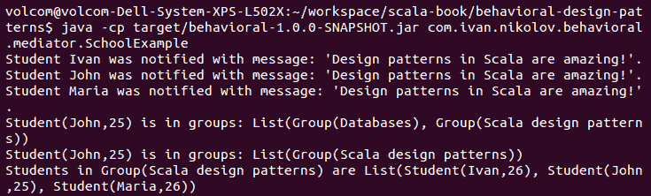

如输出所示，我们的代码确实做了预期的事情，并且成功地将应用程序中的概念保持为松散耦合。

# 它的好处

中介者设计模式对于在应用程序中保持类之间的耦合松散很有用。它有助于实现简单性和可维护性，同时仍然允许我们模拟应用程序中对象之间的复杂交互。

# 它不是那么好的地方

在使用中介者设计模式时可能的一个陷阱是将许多不同的交互功能放在一个类中。随着时间的发展，中介者往往会变得更加复杂，这将使得改变或理解我们的应用程序能做什么变得很困难。此外，如果我们实际上有更多必须相互交互的类，这也会立即影响中介者。

# 记忆体设计模式

根据我们正在编写的软件，我们可能需要能够将对象的状态恢复到其先前的状态。

记忆体设计模式的目的是为了提供执行撤销操作的能力，以便将对象恢复到先前的状态。

原始的记忆体设计模式是通过三个主要对象实现的：

+   `Originator`: 我们希望能够恢复其状态的对象

+   `Caretaker`: 触发对`originator`对象进行更改的对象，并在需要时使用`memento`对象进行回滚

+   `Memento`: 带有原始对象实际状态的对象，可以用来恢复到先前的某个状态

重要的是要知道，`memento`对象只能由原始对象处理。看护者和所有其他类只能存储它，不能做其他事情。

# 示例类图

记忆体设计模式的一个经典例子是文本编辑器。我们可以随时撤销所做的任何更改。我们将在类图和示例中展示类似的内容。

以下是一个类图：

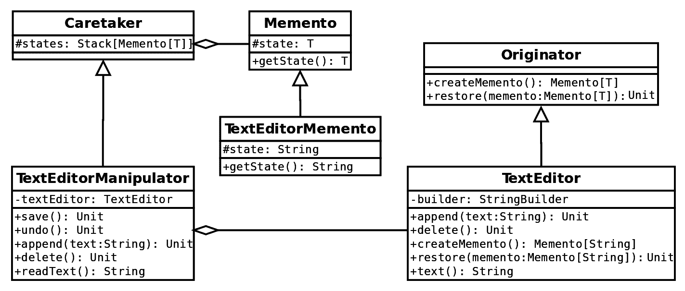

正如您在前面的图中可以看到，我们的保管者是**TextEditorManipulator**。它在每次操作时都会自动将状态保存在状态栈中。**TextEditor**实现了**Originator**，并创建了一个`memento`对象，并从其中恢复。最后，**TextEditorMemento**是我们文本编辑器将用来保存状态的具象`memento`对象。我们的状态只是编辑器中当前文本的字符串表示。

# 代码示例

在本小节中，我们将逐行分析文本编辑器代码，并看看备忘录设计模式如何在 Scala 中实现。

首先，让我们看看`Caretaker`、`Memento`和`Originator`特质：

```java
trait Memento[T] {
  protected val state: T

  def getState(): T = state
}

trait Caretaker[T] {
  val states: mutable.Stack[Memento[T]] = mutable.Stack[Memento[T]]()
}

trait Originator[T] {
  def createMemento: Memento[T]

  def restore(memento: Memento[T])
}
```

我们使用了泛型，这使得我们可以在需要实现备忘录设计模式时多次重用这些特质。现在，让我们看看我们应用中必要的特质的特定实现：

```java
class TextEditor extends Originator[String] {
  private var builder: StringBuilder = new StringBuilder

  def append(text: String): Unit = {
    builder.append(text)
  }

  def delete(): Unit = {
    if (builder.nonEmpty) {
      builder.deleteCharAt(builder.length - 1)
    }
  }

  override def createMemento: Memento[String] = new TextEditorMemento(builder.toString)

  override def restore(memento: Memento[String]): Unit = {
    this.builder = new StringBuilder(memento.getState())
  }

  def text(): String = builder.toString

  private class TextEditorMemento(val state: String) extends Memento[String]
}
```

前面的代码显示了实际的`Originator`实现以及`Memento`实现。通常，将备忘录类创建为私有于创建和从类中恢复的对象，这就是我们为什么这样做的原因。这样做的原因是，原始者应该是唯一知道如何创建和从`memento`对象中恢复，以及如何读取其状态的人。

最后，让我们来看看`Caretaker`的实现：

```java
class TextEditorManipulator extends Caretaker[String] {
  private val textEditor = new TextEditor

  def save(): Unit = {
    states.push(textEditor.createMemento)
  }

  def undo(): Unit = {
    if (states.nonEmpty) {
      textEditor.restore(states.pop())
    }
  }

  def append(text: String): Unit = {
    save()
    textEditor.append(text)
  }

  def delete(): Unit = {
    save()
    textEditor.delete()
  }

  def readText(): String = textEditor.text()
}
```

在我们的实现中，保管者公开了用于操作`originator`对象的方法。在每次操作之前，我们将状态保存到栈中，以便在将来需要时能够回滚。

现在我们已经看到了我们示例的所有代码，让我们看看一个使用它的应用：

```java
object TextEditorExample {
  def main(args: Array[String]): Unit = {
    val textEditorManipulator = new TextEditorManipulator
    textEditorManipulator.append("This is a chapter about memento.")
    System.out.println(s"The text is:
    '${textEditorManipulator.readText()}'")
    // delete 2 characters
    System.out.println("Deleting 2 characters...")
    textEditorManipulator.delete()
    textEditorManipulator.delete()
    // see the text
    System.out.println(s"The text is:
     '${textEditorManipulator.readText()}'")
    // undo
    System.out.println("Undoing...")
    textEditorManipulator.undo()
    System.out.println(s"The text is:
     '${textEditorManipulator.readText()}'")
    // undo again
    System.out.println("Undoing...")
    textEditorManipulator.undo()
    System.out.println(s"The text is: 
     '${textEditorManipulator.readText()}'")
  }
}
```

在前面的代码中，我们只是手动向我们的文本编辑器添加了一些文本，删除了一些字符，然后撤销了删除操作。下面的截图显示了此示例的输出：

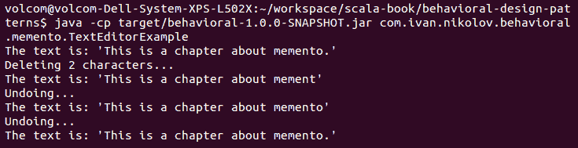

我们应用程序设计中可能需要改进的一个可能问题是`states`栈——我们没有绝对的限制，如果有很多更改，它可能会变得很大。在真实的文本编辑器中，我们不能无限回退，这个栈限制在一定的操作数内。另一个性能问题可能是我们在每次操作中都调用内部`StringBuilder`的`toString`方法。然而，传递实际的`StringBuilder`可能会对应用程序产生不良影响，因为更改将影响所有构建器的引用。

# 它的优点

备忘录设计模式对于想要支持可撤销状态的应用程序非常有用。在我们的例子中，我们使用了一个状态栈；然而，这并不是必需的——某些应用程序可能只需要保存最后一次操作。

# 它的缺点

开发者在使用备忘录设计模式时应小心。如果可能，他们应该尝试将状态保存在值对象中，因为如果传递了一个可变类型，它将通过引用被更改，这会导致不希望的结果。开发者还应小心允许更改可撤销的时间跨度，因为保存的操作越多，所需的内存就越多。最后，Scala 是不可变的，备忘录设计模式并不总是与语言哲学相一致。

# 观察者设计模式

有时，某些对象对另一个对象的状态变化感兴趣，并希望在发生这种情况时执行一些特定的操作。一个常见的例子是，每当你在应用程序中点击一个按钮时；其他对象订阅点击事件并执行一些操作。观察者设计模式帮助我们实现这一点。

观察者设计模式的目的是有这样一个对象（称为**subject**），它通过调用它们的方法之一自动通知所有观察者任何状态变化。

观察者设计模式在大多数 GUI 工具包中都有应用。它也是 MVC 架构模式的一部分，其中视图是一个观察者。Java 甚至自带了`Observable`类和`Observer`接口。

# 示例类图

对于类图，让我们关注以下示例——我们有一个网站，有帖子，人们可以订阅以在添加新评论时收到通知。以下图表显示了如何使用观察者模式表示类似的东西：

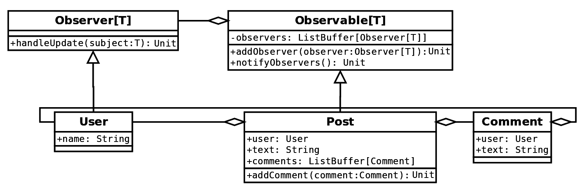

**Post**类是我们的可观察对象，它具有**User**类型的观察者，每当帖子发生变化时（在我们的例子中，当添加评论时）都会收到通知。

注意，前面的场景只是一个例子。在现实中，订阅可以在数据库中完成，人们会收到电子邮件通知。然而，如果我们谈论的是你在网站上的一些通知，那么这个例子是有效的。

在示例中，观察者模式可以被（并且可能应该被）Scala 中使用 Akka 和 actor 的响应式编程所取代。这样，我们可以实现更好的可伸缩性，并实现一个适当的异步发布-订阅系统。

在以下子节中，我们将查看代表前面图表的代码。

# 代码示例

现在，让我们通过所有代表前面图表的代码。首先，让我们看看`Observer`接口。我们决定将其作为一个可以混合到任何类中的特质：

```java
trait Observer[T] {
  def handleUpdate(subject: T)
}
```

这非常简单。接下来，我们将看看`Observable`类。它是一个可以混合使用的特质，可以使类变得可观察：

```java
trait Observable[T] {
  this: T =>
  private val observers = ListBuffer[Observer[T]]()

  def addObserver(observer: Observer[T]): Unit = {
    observers.+=:(observer)
  }

  def notifyObservers(): Unit = {
    observers.foreach(_.handleUpdate(this))
  }
}
```

在前面的代码中，我们使用了自类型以确保我们限制`Observable`特质的混合方式。这确保了参数化类型将与我们要混合的对象的类型相同。

我们对`Observer`接口的实现将是我们的`User`类。它有以下代码：

```java
case class User(name: String) extends Observer[Post] {
  override def handleUpdate(subject: Post): Unit = {
    System.out.println(s"Hey, I'm ${name}. The post got some new comments: ${subject.comments}")
  }
}
```

它就像实现一个方法并与更改的`Post`主题进行交互一样简单。

`Comment`类只是一个简单的模型类，没有特别之处：

```java
case class Comment(user: User, text: String)
```

`Post`类将是`Observable`。每当添加评论时，这个类将通知所有已注册的观察者。代码如下：

```java
case class Post(user: User, text: String) extends Observable[Post] {
  val comments = ListBuffer[Comment]()

  def addComment(comment: Comment): Unit = {
    comments.+=:(comment)
    notifyObservers()
  }
}
```

所有的前述代码片段实现了我们的观察者设计模式。在示例中看到它是如何工作的很有趣。以下代码块展示了我们的类如何一起使用：

```java
object PostExample extends LazyLogging {
  def main(args: Array[String]): Unit = {
    val userIvan = User("Ivan")
    val userMaria = User("Maria")
    val userJohn = User("John")
    logger.info("Create a post")
    val post = Post(userIvan, "This is a post about the observer
     design pattern")
    logger.info("Add a comment")
    post.addComment(Comment(userIvan, "I hope you like the post!"))
    logger.info("John and Maria subscribe to the comments.")
    post.addObserver(userJohn)
    post.addObserver(userMaria)
    logger.info("Add a comment")
    post.addComment(Comment(userIvan, "Why are you so quiet? Do you
     like it?"))
    logger.info("Add a comment")
    post.addComment(Comment(userMaria, "It is amazing! Thanks!"))
  }
}
```

我们应用程序的输出如下所示：

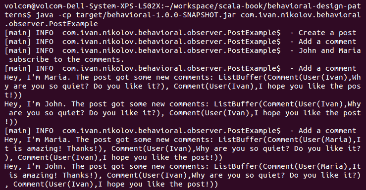

正如您在前面的屏幕截图中看到的，观察者设计模式很容易实现。正如我们之前提到的，更好的方法是将响应式编程用于使事物异步和更具可扩展性。它也将更加函数式。我们将在本书的后续章节中看到一个如何使用 Akka 实现的例子。

# 它适用于什么

观察者设计模式易于实现，并允许我们在运行时添加新的观察者或删除旧的观察者。它有助于解耦逻辑和通信，从而产生一些只有一个责任的优秀类。

# 它不适用于什么

在使用 Scala 的函数式编程中，人们可能会更倾向于使用 Akka 并创建一个发布-订阅设计。此外，在观察者设计模式中，对象引用被保存在主题的观察者集合中，这可能导致在应用程序或主题对象的生命周期中发生内存泄漏或不必要的分配。最后，就像任何其他设计模式一样，观察者设计模式应该仅在必要时使用。否则，我们可能会无端地使我们的应用程序变得复杂。

# 状态设计模式

状态设计模式实际上与我们之前章节中看到的策略设计模式非常相似。

状态设计模式的目的允许我们根据对象的内部状态选择不同的行为。

基本上，状态设计模式和策略设计模式之间的区别来自以下两个点：

+   策略设计模式是关于*如何*执行一个动作的。它通常是一个算法，它产生的结果与其他算法相同。

+   状态设计模式是关于*什么*动作被执行的。根据状态的不同，一个对象可能执行不同的操作。

实现状态设计模式也与策略设计模式的实现非常相似。

# 示例类图

想象一个媒体播放器。大多数媒体播放器都有一个播放按钮——当我们激活它时，它通常会改变其外观并变成暂停按钮。现在点击暂停按钮也会执行不同的操作——它暂停播放并恢复为播放按钮。这是一个很好的状态设计模式候选，其中根据播放器所处的状态，会发生不同的操作。

以下类图显示了实现播放和暂停按钮所需的功能的类：

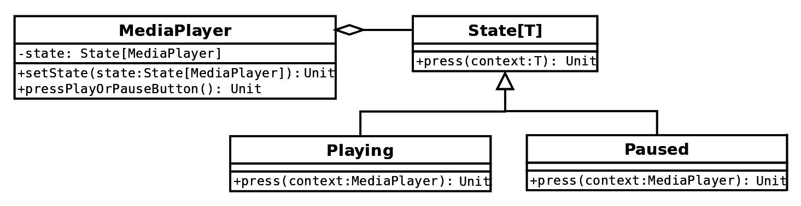

我们的**播放**和**暂停**实现将状态设置为相反的状态，并使我们的播放器功能正常。使用状态设计模式也使我们的代码更加优雅——我们当然可以使用 if 语句，并根据值执行不同的操作。然而，当有多个状态时，它很容易失控。

# 代码示例

让我们看看我们之前展示的类图的代码。首先，让我们看看`State`特质：

```java
trait State[T] {
  def press(context: T)
}
```

它非常简单，允许扩展类实现`press`方法。根据我们的类图，我们有两种实现：

```java
class Playing extends State[MediaPlayer] {
  override def press(context: MediaPlayer): Unit = {
    System.out.println("Pressing pause.")
    context.setState(new Paused)
  }
}

class Paused extends State[MediaPlayer] {
  override def press(context: MediaPlayer): Unit = {
    System.out.println("Pressing play.")
    context.setState(new Playing)
  }
}
```

我们使它们变得简单，它们只打印一条相关消息，然后改变当前状态为相反的状态。

我们定义了一个`MediaPlayer`类，其外观如下：

```java
case class MediaPlayer() {
  private var state: State[MediaPlayer] = new Paused

  def pressPlayOrPauseButton(): Unit = {
    state.press(this)
  }

  def setState(state: State[MediaPlayer]): Unit = {
    this.state = state
  }
}
```

这真的是我们需要的所有东西。现在，我们可以在以下应用中使用我们的媒体播放器：

```java
object MediaPlayerExample {
  def main(args: Array[String]): Unit = {
    val player = MediaPlayer()
    player.pressPlayOrPauseButton()
    player.pressPlayOrPauseButton()
    player.pressPlayOrPauseButton()
    player.pressPlayOrPauseButton()
  }
}
```

如果我们运行前面的代码，我们将看到以下输出：

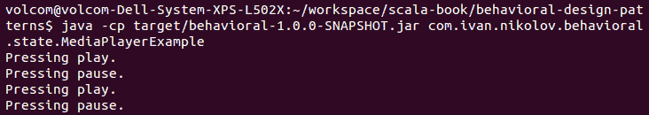

如示例输出所示，每次按钮按下时都会改变状态，并执行不同的操作，我们使用不同的打印消息来展示这一点。

对我们应用程序的一个可能的改进是使状态对象成为单例。正如你所看到的，它们总是相同的，所以实际上没有必要每次都创建新的。

# 它适用于什么

状态设计模式对于使代码可读和消除条件语句非常有用。

# 它不适用于什么

状态设计模式没有重大缺点。开发者应该注意的一点是对象状态变化引起的副作用。

# 模板方法设计模式

有时候当我们实现一些算法或算法族时，我们定义一个共同的骨架。然后，不同的实现处理骨架中每个方法的特定细节。模板方法设计模式使我们能够实现我们之前提到的。

模板方法设计模式的目的是通过模板方法将算法步骤推迟到子类。

模板方法设计模式在面向对象编程中似乎非常自然。每当使用多态时，这实际上代表了设计模式本身。通常，模板方法是通过抽象方法实现的。

# 示例类图

模板方法设计模式适合实现框架。这里典型的事情是算法通常执行相同的步骤集合，然后不同的客户端以不同的方式实现这些步骤。你可以想出各种可能的使用案例。

对于我们的示例，让我们假设我们想要编写一个应用程序，该程序将从数据源读取一些数据，解析它，并查找是否存在满足某些条件的对象并返回它。如果我们仔细想想，我们有以下主要操作：

+   读取数据

+   解析数据

+   搜索满足条件的项目

+   如果需要，请清理任何资源

以下图表显示了我们的代码的类图：

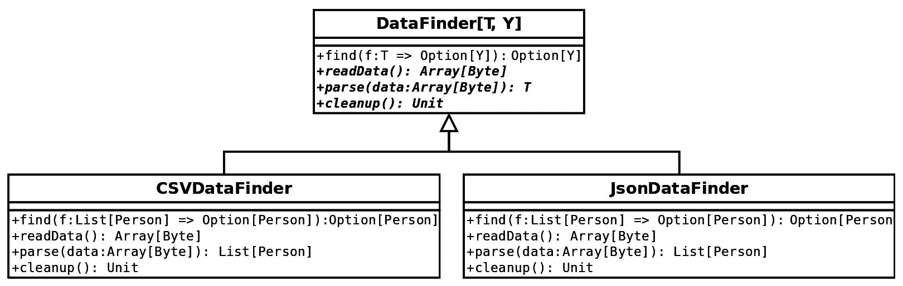

我们使用了一个之前展示过的示例——从文件中读取关于人的数据。然而，这里我们使用它来查找满足过滤函数的人的数据。使用模板方法设计模式，我们可以从服务器、数据库或任何想到的地方读取不同格式的文件中的人的列表。通过多态，我们的应用程序确保调用正确的方法，并且一切运行正常。

# 代码示例

让我们查看代表前面图表的代码，并看看它做了什么。首先，我们的`Person`模型类：

```java
case class Person(name: String, age: Int, address: String)
```

这没有什么特别的。现在，让我们继续到有趣的部分——`DataFinder`类：

```java
abstract class DataFinder[T, Y] {
  def find(f: T => Option[Y]): Option[Y] =
    try {
      val data = readData()
      val parsed = parse(data)
      f(parsed)
    } finally {
      cleanup()
    }

  def readData(): Array[Byte]

  def parse(data: Array[Byte]): T

  def cleanup()
}
```

我们使用了泛型，以便使这个类适用于各种类型。正如您在前面的代码中所看到的，`DataFinder`类的三个方法没有实现，但它们仍然在`find`方法中被引用。后者是实际的模板方法，而抽象方法将在扩展`DataFinder`的不同类中实现。

对于我们的示例，我们提供了两种不同的实现，一个是针对 JSON 的，另一个是针对 CSV 文件的。JSON 查找器如下所示：

```java
import org.json4s.{StringInput, DefaultFormats}
import org.json4s.jackson.JsonMethods

class JsonDataFinder extends DataFinder[List[Person], Person] {
  implicit val formats = DefaultFormats

  override def readData(): Array[Byte] = {
    val stream = this.getClass.getResourceAsStream("people.json")
    Stream.continually(stream.read).takeWhile(_ != -1).map(_.toByte).toArray
  }

  override def cleanup(): Unit = {
    System.out.println("Reading json: nothing to do.")
  }

  override def parse(data: Array[Byte]): List[Person] =
    JsonMethods.parse(StringInput(new String(data, "UTF-8"))).extract[List[Person]]
}
```

CSV 查找器有以下代码：

```java
import com.github.tototoshi.csv.CSVReader

class CSVDataFinder extends DataFinder[List[Person], Person] {
  override def readData(): Array[Byte] = {
    val stream = this.getClass.getResourceAsStream("people.csv")
    Stream.continually(stream.read).takeWhile(_ != -1).map(_.toByte).toArray
  }

  override def cleanup(): Unit = {
    System.out.println("Reading csv: nothing to do.")
  }

  override def parse(data: Array[Byte]): List[Person] =
    CSVReader.open(new InputStreamReader(new ByteArrayInputStream(data))).all().map {
      case List(name, age, address) => Person(name, age.toInt, address)
    }
}
```

无论何时我们使用它，根据我们拥有的特定实例，`find`方法将通过多态调用正确的实现。通过扩展`DataFinder`类，可以添加新的格式和数据源。

使用我们的数据查找器现在很简单：

```java
object DataFinderExample {
  def main(args: Array[String]): Unit = {
    val jsonDataFinder: DataFinder[List[Person], Person] = new JsonDataFinder
    val csvDataFinder: DataFinder[List[Person], Person] = new CSVDataFinder
    System.out.println(s"Find a person with name Ivan in the json:
     ${jsonDataFinder.find(_.find(_.name == "Ivan"))}")
    System.out.println(s"Find a person with name James in the json:
     ${jsonDataFinder.find(_.find(_.name == "James"))}")
    System.out.println(s"Find a person with name Maria in the csv:
     ${csvDataFinder.find(_.find(_.name == "Maria"))}")
    System.out.println(s"Find a person with name Alice in the csv:
     ${csvDataFinder.find(_.find(_.name == "Alice"))}")
  }
}
```

我们提供了一些示例数据文件。CSV 文件的内容如下：

```java
Ivan,26,London
Maria,23,Edinburgh
John,36,New York
Anna,24,Moscow
```

以下数据是针对 JSON 文件的：

```java
[
  {
    "name": "Ivan",
    "age": 26,
    "address": "London"
  },
  {
    "name": "Maria",
    "age": 23,
    "address": "Edinburgh"
  },
  {
    "name": "John",
    "age": 36,
    "address": "New York"
  },
  {
    "name": "Anna",
    "age": 24,
    "address": "Moscow"
  }
]
```

将前面的示例运行在这些数据集上会产生以下输出：

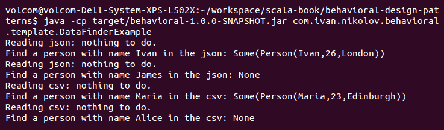

我们示例中的代码使用了一个抽象类。这在某种程度上使其有些限制，因为我们只能扩展一个类。然而，将抽象类更改为特性和将其混合到类中是非常直接的。

# 它的优点是什么

正如你所见，每当我们在算法结构相同且提供不同实现的情况下，我们都可以使用模板方法设计模式。这对于创建框架来说是一个非常合适的匹配。

# 它不适用的情况

当我们使用模板方法设计模式实现的框架变得很大时，简单地扩展一个巨大的类并实现其中的一些方法会变得更加困难。在这些情况下，将接口传递给构造函数并在骨架中使用它可能是一个更好的主意（策略设计模式）。

# 访问者设计模式

有些应用程序在设计时，并不是所有可能的使用案例都是已知的。可能会有新的应用程序功能时不时地出现，为了实现它们，可能需要进行一些重构。

访问者设计模式帮助我们在不修改现有对象结构的情况下添加新的操作。

这有助于我们分别设计我们的结构，然后使用访问者设计模式在顶部添加功能。

另一个可以使用访问者模式的情况是，如果我们正在构建一个包含许多不同类型节点的大对象结构，这些节点支持不同的操作。而不是创建一个具有所有操作的基础节点，只有少数具体节点实现了这些操作，或者使用类型转换，我们可以创建访问者，在需要的地方添加我们需要的功能。

# 示例类图

初始时，当开发者看到访问者设计模式时，似乎它可以很容易地通过多态来替换，并且可以依赖于类的动态类型。然而，如果我们有一个庞大的类型层次结构呢？在这种情况下，每一个变化都将不得不改变一个接口，这将导致一大堆类的改变，等等。

对于我们的类图和示例，让我们假设我们正在编写一个文本编辑器，并且我们有文档。我们希望能够以至少两种数据格式保存每个文档，但可能会有新的格式出现。以下图显示了使用访问者设计模式的我们的应用程序的类图：

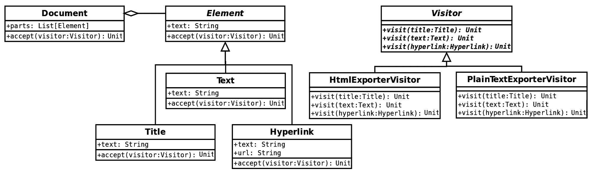

正如前一个图所示，我们有两个看似不相关的层次结构。左侧代表我们的文档——每个文档只是一个不同元素的列表。所有这些元素都是**Element**抽象类的子类，它有一个`accept`方法，用于接受一个**Visitor**。右侧，我们有访问者层次结构——我们的每个访问者都将混入`Visitor`特质，其中包含为我们的文档元素每个都重写的`visit`方法。

访问者模式的工作方式是，根据需要执行的操作创建一个`Visitor`实例，然后将其传递给`Document`的`accept`方法。这样，我们可以非常容易地添加额外的功能（在我们的例子中是不同的格式），并且额外的功能不会涉及对模型的任何更改。

# 代码示例

让我们逐步查看实现前一个示例的访问者设计模式的代码。首先，我们有文档的模型以及所有可以构建它的元素：

```java
abstract class Element(val text: String) {
  def accept(visitor: Visitor)
}

class Title(text: String) extends Element(text) {
  override def accept(visitor: Visitor): Unit = {
    visitor.visit(this)
  }
}

class Text(text: String) extends Element(text) {
  override def accept(visitor: Visitor): Unit = {
    visitor.visit(this)
  }
}

class Hyperlink(text: String, val url: String) extends Element(text) {
  override def accept(visitor: Visitor): Unit = {
    visitor.visit(this)
  }
}

class Document(parts: List[Element]) {
  def accept(visitor: Visitor): Unit = {
    parts.foreach(p => p.accept(visitor))
  }
}
```

上述代码没有什么特别之处，只是对不同文档元素进行简单子类化，以及`Document`类及其包含的元素进行组合。这里的重要方法是`accept`。它接受一个访问者，由于特质的类型已知，我们可以传递不同的访问者实现。在所有情况下，它都会调用访问者的`visit`方法，并将当前实例作为参数传递。

现在，让我们看看另一边——`Visitor`特质及其实现。`Visitor`特质看起来就像这样简单：

```java
trait Visitor {
  def visit(title: Title)
  def visit(text: Text)
  def visit(hyperlink: Hyperlink)
}
```

在这种情况下，它具有具有不同具体元素类型的`visit`方法的重载。在上述代码中，访问者和元素允许我们使用**双重分派**来确定哪些调用将被执行。

现在，让我们看看具体的`Visitor`实现。第一个是`HtmlExporterVisitor`：

```java
class HtmlExporterVisitor extends Visitor {
  val line = System.getProperty("line.separator")
  val builder = new StringBuilder

  def getHtml(): String = builder.toString

  override def visit(title: Title): Unit = {
    builder.append(s"<h1>${title.text}</h1>").append(line)
  }

  override def visit(text: Text): Unit = {
    builder.append(s"<p>${text.text}</p>").append(line)
  }

  override def visit(hyperlink: Hyperlink): Unit = {
    builder.append(s"""<a href=\"${hyperlink.url}\">${hyperlink.text}</a>""").append(line)
  }
}
```

它简单地根据获取到的`Element`类型提供不同的实现。没有条件语句，只有重载。

如果我们想以纯文本格式保存我们拥有的文档，我们可以使用`PlainTextExporterVisitor`：

```java
class PlainTextExporterVisitor extends Visitor {
  val line = System.getProperty("line.separator")
  val builder = new StringBuilder

  def getText(): String = builder.toString

  override def visit(title: Title): Unit = {
    builder.append(title.text).append(line)
  }

  override def visit(text: Text): Unit = {
    builder.append(text.text).append(line)
  }

  override def visit(hyperlink: Hyperlink): Unit = {
    builder.append(s"${hyperlink.text} (${hyperlink.url})").append(line)
  }
}
```

在有了访问者和文档结构之后，将一切连接起来相当直接：

```java
object VisitorExample {
  def main(args: Array[String]): Unit = {
    val document = new Document(
      List(
        new Title("The Visitor Pattern Example"),
        new Text("The visitor pattern helps us add extra functionality
         without changing the classes."),
        new Hyperlink("Go check it online!", "https://www.google.com/"),
        new Text("Thanks!")
      )
    )
    val htmlExporter = new HtmlExporterVisitor
    val plainTextExporter = new PlainTextExporterVisitor
    System.out.println(s"Export to html:")
    document.accept(htmlExporter)
    System.out.println(htmlExporter.getHtml())
    System.out.println(s"Export to plain:")
    document.accept(plainTextExporter)
    System.out.println(plainTextExporter.getText())
  }
}
```

上述示例展示了如何使用我们实现的两个访问者。我们的程序输出如下截图所示：

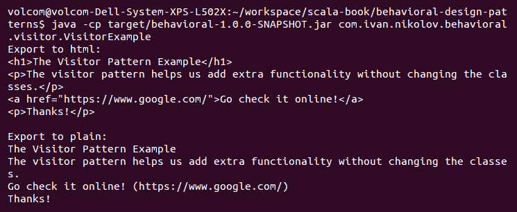

如您所见，使用访问者很简单。在我们的例子中，添加新的访问者和新的格式甚至更容易。我们只需要创建一个实现了所有访问者方法的类，并使用它。

# Scala 风格的访问者设计模式

就像我们之前看到的许多其他设计模式一样，访问者设计模式可以用一种更简洁、更接近 Scala 的方式表示。在 Scala 中实现访问者的方式与策略设计模式相同——将函数传递给`accept`方法。此外，我们还可以使用模式匹配而不是在`Visitor`特质中拥有多个不同的`visit`方法。

在本小节中，我们将展示改进步骤。让我们从后者开始。

首先，我们需要将模型类转换为 case 类，以便能够在模式匹配中使用它们：

```java
abstract class Element(text: String) {
  def accept(visitor: Visitor)
}

case class Title(text: String) extends Element(text) {
  override def accept(visitor: Visitor): Unit = {
    visitor.visit(this)
  }
}

case class Text(text: String) extends Element(text) {
  override def accept(visitor: Visitor): Unit = {
    visitor.visit(this)
  }
}

case class Hyperlink(text: String, val url: String) extends Element(text) {
  override def accept(visitor: Visitor): Unit = {
    visitor.visit(this)
  }
}

class Document(parts: List[Element]) {
  def accept(visitor: Visitor): Unit = {
    parts.foreach(p => p.accept(visitor))
  }
}
```

然后，我们将我们的`Visitor`特质更改为以下内容：

```java
trait Visitor {
  def visit(element: Element)
}
```

由于我们将使用模式匹配，我们只需要一个方法来实现它。最后，我们可以将我们的访问者实现如下：

```java
class HtmlExporterVisitor extends Visitor {
  val line = System.getProperty("line.separator")
  val builder = new StringBuilder

  def getHtml(): String = builder.toString

  override def visit(element: Element): Unit = {
    element match {
      case Title(text) =>
        builder.append(s"<h1>${text}</h1>").append(line)
      case Text(text) =>
        builder.append(s"<p>${text}</p>").append(line)
      case Hyperlink(text, url) =>
        builder.append(s"""<a href=\"${url}\">${text}</a>""").append(line)
    }
  }
}

class PlainTextExporterVisitor extends Visitor {
  val line = System.getProperty("line.separator")
  val builder = new StringBuilder

  def getText(): String = builder.toString

  override def visit(element: Element): Unit = {
    element match {
      case Title(text) =>
        builder.append(text).append(line)
      case Text(text) =>
        builder.append(text).append(line)
      case Hyperlink(text, url) =>
        builder.append(s"${text} (${url})").append(line)
    }
  }
}
```

模式匹配类似于 Java 中的 `instanceOf` 检查；然而，它是 Scala 的一个强大特性，并且相当常用。因此，我们的示例无需任何更改，输出将与之前相同。

接下来，我们将展示如何我们可以传递函数而不是访问者对象。我们将传递函数的事实意味着现在，我们可以将我们的模型更改为以下形式：

```java
abstract class Element(text: String) {
  def accept(visitor: Element => Unit): Unit = {
    visitor(this)
  }
}

case class Title(text: String) extends Element(text)

case class Text(text: String) extends Element(text)

case class Hyperlink(text: String, val url: String) extends Element(text)

class Document(parts: List[Element]) {
  def accept(visitor: Element => Unit): Unit = {
    parts.foreach(p => p.accept(visitor))
  }
}
```

我们将 `accept` 方法实现移至基类 `Element`（也可以表示为特质）中，并在其中简单地调用了作为参数传递的函数。由于我们将传递函数，我们可以去掉 `Visitor` 特质及其实现。我们现在所拥有的就是以下示例：

```java
object VisitorExample {
  val line = System.getProperty("line.separator")

  def htmlExporterVisitor(builder: StringBuilder): Element => Unit = {
      case Title(text) =>
        builder.append(s"<h1>${text}</h1>").append(line)
      case Text(text) =>
        builder.append(s"<p>${text}</p>").append(line)
      case Hyperlink(text, url) => builder.append(s"""<a href=\"${url}\">${text}</a>""").append(line)
    }

  def plainTextExporterVisitor(builder: StringBuilder): Element => Unit = {
      case Title(text) => builder.append(text).append(line)
      case Text(text) => builder.append(text).append(line)
      case Hyperlink(text, url) => builder.append(s"${text} (${url})").append(line)
    }

  def main(args: Array[String]): Unit = {
    val document = new Document(
      List(
        Title("The Visitor Pattern Example"),
        Text("The visitor pattern helps us add extra functionality
         without changing the classes."),
        Hyperlink("Go check it online!", "https://www.google.com/"),
        Text("Thanks!")
      )
    )
    val html = new StringBuilder
    System.out.println(s"Export to html:")
    document.accept(htmlExporterVisitor(html))
    System.out.println(html.toString())
    val plain = new StringBuilder
    System.out.println(s"Export to plain:")
    document.accept(plainTextExporterVisitor(plain))
    System.out.println(plain.toString())
  }
}
```

我们将访问者功能移至 `VisitorExample` 对象的组成部分中。在初始示例中，我们有一个 `StringBuilder` 作为访问者类的一部分。我们使用了柯里化函数以便能够在这里传递。将这些函数传递给 `Document` 结构是直截了当的。再次强调，这里的输出将与示例的先前版本完全相同。然而，我们可以看到我们节省了多少代码和样板类。

# 它擅长什么

访问者设计模式非常适合具有大型对象层次结构的应用程序，其中添加新功能将涉及大量重构。每当我们需要能够对对象层次结构执行多种不同操作，并且更改对象类可能有问题时，访问者设计模式是一个有用的替代方案。

# 它不擅长什么

正如你在我们示例的初始版本中所见，访问者设计模式可能会很庞大，包含相当多的样板代码。此外，如果某些组件未设计为支持该模式，如果我们不允许更改原始代码，我们实际上无法使用它。

# 摘要

在本章中，我们介绍了行为设计模式的第二组。你现在熟悉了迭代器、调解者、备忘录、观察者、状态、模板方法和访问者设计模式。你可能觉得这些纯粹是面向对象的设计模式，与函数式编程关系不大，你是对的。然而，由于 Scala 的混合性质，它们仍然与 Scala 相关，了解它们以及何时使用它们是很重要的。

本章中的一些设计模式相当常用，可以在许多项目中看到，而其他一些则相对较少见，且特定于某些用例。这些模式，结合你在前几章中学到的所有其他模式，可以一起使用，以构建优雅且强大的现实世界问题的解决方案。

在下一章中，我们将深入探讨函数式编程理论。我们将介绍一些高级概念，这些概念将展示 Scala 以及一般函数式编程语言是多么强大。
