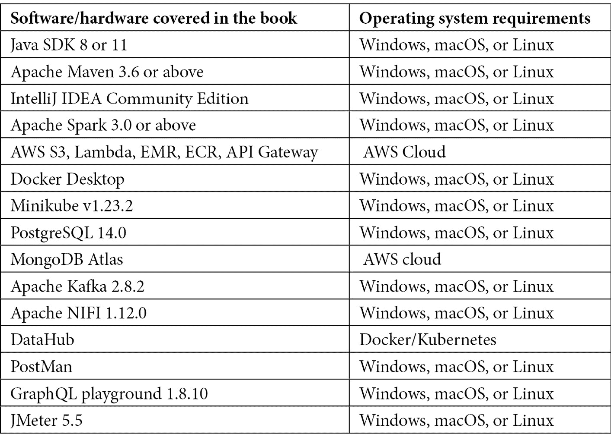

# 前言

当我开始写这本书时，我回顾了自己在架构和开发数据工程解决方案、有效地交付和运行这些解决方案以及在许多公司构建和管理可扩展和健壮的数据管道方面的经验，并问自己——*我能分享哪些最有用的事情来帮助有志或初学的数据架构师、数据工程师或 Java 开发者成为数据架构师专家？* 这本书反映了我在日常工作中所做的工作，即设计、开发和维护针对不同数据工程问题的可扩展、健壮和成本效益的解决方案。

Java 架构模式和工具使架构师能够开发可靠、可扩展和安全的工程解决方案，用于收集、处理、管理和发布数据。有许多书籍和在线资料讨论了数据架构的一般概念。还有其他一系列书籍和在线资料专注于并深入探讨了技术栈。虽然这些资料为架构师提供了必要知识，但它们通常缺乏关于架构师如何实际处理数据工程问题以及如何通过逻辑推理创建最适合的架构的细节。在这本书中，我尝试通过一些技术手段，使数据架构师能够以问题为导向，创建有效的解决方案。

在这本书中，我将带您踏上学习数据工程基础以及如何使用这些基础知识来分析和提出数据工程问题解决方案的旅程。我还讨论了初学者架构师如何选择正确的技术栈来实现解决方案。我还涉及了这些解决方案的数据安全和治理问题。

架构师面临的一个挑战是，做事情的方式总是不止一种。我们还讨论了如何衡量不同的架构选择，以及您如何使用数据驱动技术正确选择最适合的替代方案。

# 本书面向对象

《可扩展数据架构》是为具有至少一些后端系统或数据工程解决方案工作知识的 Java 开发者、数据工程师和有志成为数据架构师的人编写的。本书假设您至少有一些 Java 的工作知识，并了解 Java 的基本概念。这本书将帮助您成长为一名成功的基于 Java 的数据架构师。

数据架构师和副架构师会发现这本书有助于磨练他们的技能并在工作中脱颖而出。非 Java 后端开发者或数据工程师也可以使用本书的概念。然而，他们可能难以理解解决方案的代码和实现。

# 本书涵盖内容

*第一章*，《现代数据架构基础》，是对数据工程、数据工程的基本概念以及 Java 数据架构师在数据工程中所扮演角色的简要介绍。

*第二章*, *数据存储和数据库*，简要讨论了各种数据类型、存储格式、数据格式和数据库，并讨论了何时使用它们。

*第三章*, *确定合适的数据平台*，概述了各种用于部署数据管道的平台，以及如何选择正确的平台。

*第四章*, *ETL 数据加载 - 数据仓库中的批量数据摄取解决方案*，讨论了如何使用 Spring Batch 和 Java 来处理、分析和构建一个有效的批量数据摄取解决方案。

*第五章*, *构建批量处理管道*，讨论了如何使用 S3、Apache Spark（Java）、AWS **弹性映射减少**（**EMR**）和 AWS Athena 在 AWS 中构建和实现一个数据分析管道，以用于大数据场景。

*第六章*, *构建实时处理管道*，提供了构建实时流解决方案的步骤指南，用于使用 Java、Kafka 和相关技术预测贷款申请的风险类别。

*第七章*, *核心架构设计模式*，讨论了用于解决数据工程问题的各种常见架构模式以及何时使用它们。

*第八章*, *启用数据安全和治理*，介绍了数据治理，并讨论了如何通过实际案例应用它。同时也简要提到了数据安全的话题。

*第九章*, *将 MongoDB 数据作为服务公开*，提供了如何构建数据作为服务以使用 REST API 公开 MongoDB 数据的分步指南。

*第十章*, *使用 GraphQL 的联邦和可扩展 DaaS*，讨论了 GraphQL 是什么，各种 GraphQL 模式，以及如何使用 GraphQL 发布数据。

*第十一章*, *衡量性能和基准测试您的应用程序*，概述了性能工程，如何衡量性能和创建基准，以及如何优化性能。

*第十二章*, *评估、推荐和展示您的解决方案*，讨论了如何在各种架构中选择最适合的替代方案，以及如何有效地展示推荐的架构。

# 为了充分利用这本书

预期您具备 Core Java 和 Maven 的知识，以便充分利用本书。对于*第五章**，构建批处理管道架构*，希望您对 Apache Spark 有基本了解。对于*第六章**，构建实时处理管道架构*，希望您对 Kafka 有基本了解。此外，对 MongoDB 有基本了解对于理解第 6、9 和 10 章的实现也是有益的。



您可以通过确保安装 Java SDK、Maven 和 IntelliJ IDEA Community Edition 来设置您的本地环境。您可以使用以下链接进行安装：

+   JDK 安装指南：[`docs.oracle.com/en/java/javase/11/install/overview-jdk-installation.xhtml#GUID-8677A77F-231A-40F7-98B9-1FD0B48C346A`](https://docs.oracle.com/en/java/javase/11/install/overview-jdk-installation.xhtml#GUID-8677A77F-231A-40F7-98B9-1FD0B48C346A)

+   Maven 安装指南：[`maven.apache.org/install.xhtml`](https://maven.apache.org/install.xhtml)

+   IntelliJ IDEA 安装指南：[`www.jetbrains.com/help/idea/installation-guide.xhtml`](https://www.jetbrains.com/help/idea/installation-guide.xhtml)

如果您正在使用这本书的数字版，我们建议您亲自输入代码或从书的 GitHub 仓库（下一节中提供链接）获取代码。这样做将帮助您避免与代码复制粘贴相关的任何潜在错误。

# 下载示例代码文件

您可以从 GitHub 下载本书的示例代码文件：[`github.com/PacktPublishing/Scalable-Data-Architecture-with-Java`](https://github.com/PacktPublishing/Scalable-Data-Architecture-with-Java)。如果代码有更新，它将在 GitHub 仓库中更新。

我们还从我们丰富的图书和视频目录中提供了其他代码包，可在[`github.com/PacktPublishing/`](https://github.com/PacktPublishing/)找到。查看它们吧！

# 下载彩色图像

我们还提供了一份包含本书中使用的截图和图表彩色图像的 PDF 文件。您可以从这里下载：[`packt.link/feLcH`](https://packt.link/feLcH)。

# 使用的约定

本书使用了多种文本约定。

文本中的代码：表示文本中的代码单词、数据库表名、文件夹名、文件名、文件扩展名、路径名、虚拟 URL、用户输入和 Twitter 昵称。以下是一个示例：“因此，`KStream` bean 被创建为一个`KStream<String,String>`的实例。”

```java
A block of code is set as follows:
public interface Transformer<K, V, R> {
    void init(ProcessorContext var1);
    R transform(K var1, V var2);
    void close();
}
```

任何命令行输入或输出都按照以下方式编写：

```java
bin/connect-standalone.sh config/connect-standalone.properties connect-riskcalc-mongodb-sink.properties
```

**粗体**：表示新术语、重要单词或您在屏幕上看到的单词。例如，菜单或对话框中的单词以粗体显示。以下是一个示例：“在这里，点击**构建数据库**按钮以创建一个新的数据库实例。”

小贴士或重要提示

看起来像这样。

# 联系我们

我们欢迎读者反馈。

**一般反馈**：如果您对本书的任何方面有疑问，请通过电子邮件发送至 customercare@packtpub.com，并在邮件主题中提及书名。

**勘误**：尽管我们已经尽最大努力确保内容的准确性，但错误仍然可能发生。如果您在本书中发现任何错误，我们将不胜感激，如果您能向我们报告，我们将非常感谢。请访问[www.packtpub.com/support/errata](http://www.packtpub.com/support/errata)并填写表格。

**盗版**：如果您在互联网上发现我们作品的任何非法副本，我们将不胜感激，如果您能提供位置地址或网站名称，我们将非常感谢。请通过 copyright@packt.com 与我们联系，并提供材料的链接。

如果您有兴趣成为作者：如果您在某个领域有专业知识，并且您有兴趣撰写或为书籍做出贡献，请访问[authors.packtpub.com](http://authors.packtpub.com)。

# 分享您的想法

一旦您阅读了*使用 Java 的可伸缩数据架构*，我们非常乐意听听您的想法！请点击此处直接进入此书的亚马逊评论页面并分享您的反馈。

您的审阅对我们和科技社区都非常重要，并将帮助我们确保提供高质量的内容。

# 第一部分 – 数据系统基础

在本节中，您将了解各种类型的数据工程问题和数据架构师在解决问题中的作用。您还将学习构建解决方案所需的数据格式、存储、数据库和数据平台的基础知识。

本节包括以下章节：

+   *第一章**，现代数据架构基础*

+   *第二章**，数据存储和数据库*

+   *第三章**，识别合适的数据平台*
