# 第十二章：评估、推荐和展示您的解决方案

我们从数据工程的基础知识开始，学习了各种解决数据摄取和数据发布问题的方法。我们了解了各种架构模式，以及解决方案的治理和安全。在前一章中，我们讨论了如何实现性能工程以及如何为我们的解决方案创建性能基准。

到目前为止，我们已经掌握了构建高效、可扩展和优化的数据工程解决方案的多种技能。然而，正如在*第一章*中“*Java 数据架构师的责任和挑战*”部分所讨论的，数据架构师扮演着多个角色。在执行角色中，数据架构师成为业务和技术之间的桥梁，能够与相关利益相关者有效地、轻松地沟通。架构师的工作不仅是要创造解决方案，还要向高管和领导层（包括职能和技术）展示并推销他们的想法。在本章中，我们将关注如何推荐和展示解决方案。

在本章中，我们将从讨论基础设施和人力资源估算开始。作为数据架构师，我们需要推荐解决方案。为此，我们将讨论如何创建一个决策矩阵来评估我们的解决方案并比较不同的替代方案。然后，我们将学习如何有效地使用决策图来选择最佳架构替代方案。最后，我们将了解一些基本技巧和窍门，以有效地展示解决方案。

在本章中，我们将涵盖以下主要主题：

+   创建成本和资源估算

+   创建架构决策矩阵

+   数据驱动架构决策以降低风险

+   展示解决方案和建议

# 创建成本和资源估算

在本节中，我们将讨论我们应用以创建估算的各种考虑因素、方法和技巧。我们将简要讨论基础设施估算和人力资源估算。基础设施估算与容量规划密切相关。因此，我们将从容量规划开始讨论。

## 存储和计算容量规划

要创建基础设施估算，你必须找出数据存储需求（RAM、硬盘、卷等）和计算需求（应具备的 CPU/vCPU 数量和核心数）。确定存储和计算需求的过程称为容量规划。我们将首先学习在执行容量规划时需要考虑的因素。

### 执行容量规划时需要考虑的因素

在创建容量计划时，需要考虑以下各种因素：

+   **输入数据速率**：根据应用类型，需要考虑数据速率。例如，对于实时或准实时应用，在规划存储和计算能力时，应考虑峰值数据速率。对于基于批处理的应用，应考虑中值数据速率或平均数据速率。如果批处理作业每天运行，建议在容量规划中使用中值数据速率。中值数据速率比平均数据速率更受欢迎，因为中值数据速率基于数据速率的密集分布。因此，它表示最频繁记录的数据速率的中点。因此，中值值永远不会受到任何异常值的影响。另一方面，平均数据速率在一段时间内找到所有数据速率的平均值，包括一些异常的高或低数据速率。

+   **数据复制和 RAID 配置**：复制确保了高可用性和数据局部性。由于它将数据复制到多个节点、系统或分区，因此在规划存储容量时，我们必须考虑复制因子。例如，如果使用复制因子 3 存储 5GB 的数据，这意味着它在不同的系统中存储了两个副本，以及原始消息。因此，存储 5GB 数据的总存储需求是 15GB。复制因子常被误认为是 RAID。虽然复制因子通过数据局部性确保了高可用性，但 RAID 通过在存储阵列层确保冗余，在物理存储级别确保数据安全。对于关键任务用例，在规划存储容量时，建议同时考虑复制和 RAID。

+   **数据保留**：另一个重要因素是数据保留。数据保留是指数据在删除之前需要在存储中保留的时间。这起着重要作用，因为它决定了为了积累目的需要多少存储。在云中，另一个需要考虑的因素是存档需求。数据是否需要存档？如果是这样，何时应该存档？

初始阶段，数据可能被频繁访问。然后，它可能被不频繁访问，公司可能希望将数据存储在存档区域以供长期审计和报告需求。这种场景可以通过在云中使用特定的策略来处理以节省资金。例如，我们可以使用 S3 智能分层，它根据访问频率自动将数据从 S3 标准访问层发送到 S3 不频繁访问层，再到 S3 Glacier 层。这降低了**运营成本**（**OpEx**）成本，因为当你将数据从标准访问层移动到 Glacier 层时，你可以节省很多。

+   **数据平台类型**：您是否在本地或公共云上运行应用程序也很重要。在规划本地部署时，容量规划应考虑最大所需容量。但如果您正在规划云部署，建议采用中值容量需求，并为峰值负载配置自动扩展。由于云提供了即时扩展的选项，以及仅为您使用的部分付费，因此启动处理常规数据量所需的资源是有意义的。

+   **数据增长**：您还必须考虑数据的增长率。基于各种因素，增长率可能会有所不同。考虑到数据工程管道通常是长期投资，因此考虑增长率非常重要。

+   **共享模式下的并行执行**：我们必须考虑的其他因素之一是共享资源及其对并发执行的影响。例如，如果我们知道在集群上可能同时运行 10 个平均负载约为 100 GB 的作业，这将帮助我们正确估计大数据集群的资源需求。同样，为了估计 Kubernetes 集群的资源需求，我们应该了解将同时运行的最大 Pod 数量。这将有助于确定您想要启动的物理机器和虚拟机的数量和大小。

通过这些，我们已经了解了在进行存储和计算容量规划时需要考虑的各种因素。在下一节中，我们将探讨这些因素如何帮助进行容量规划。

### 将这些考虑因素应用于计算容量

在本节中，我们将讨论一些例子，说明上述因素如何被巧妙地用于计算容量。以下是一些用例：

+   **示例 1**：假设我们需要为本地数据中心中的大数据集群制定容量计划。在这里，输入数据速率是每秒 *R* 条记录，每条记录是 *B* 字节。一天的存储需求（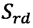）可以通过将 *R* 乘以 *B*，然后将结果乘以 86,400 秒来计算。然而，这个计算不包括复制或 RAID 因素。我们必须将复制因子（在这里，*RF*）以及由于 RAID 配置（RAID 0 的过载因子为 1，RAID 5 为 1.5，RAID 10 为 2）的过载因子（在这里，*OF*）乘以它。因此，计算一天存储需求的公式如下：

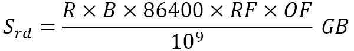

但实际容量需求可能超过这个数值。如果需要保留数据 7 天，我们将通过将 7 乘以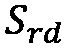来得到所需的总存储量。现在，让我们看看增长因子如何影响容量规划。根据技术栈、数据量、数据访问以及读取模式和频率，我们可以设置总内存和计算能力。假设计算出的存储容量为，内存为，计算能力为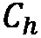，**每秒输入/输出操作数**（**IOPS**）为。此外，假设年增长率为*g*。因此，下一年度的最终资源需求如下：

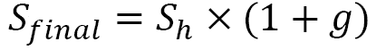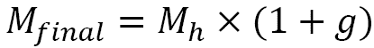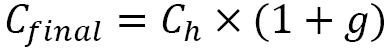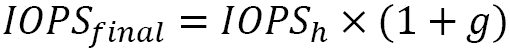

在这个例子中，我们看到了我们的因素是如何帮助确定 Hadoop 大数据集群的规模的。硬件**资本支出**（**CapEx**）代表了一笔重大的前期投资，并需要持续的操作支出（OpEx），因此需要在这两者之间取得平衡，以实现更好的总拥有成本（TOC）。在下一个例子中，我们将探讨如何为实时负载确定 Kafka 集群的规模。

+   **示例 2**：在这个例子中，我们试图预测一个每秒接收 100 条消息的 Kafka 集群的容量，保留期为 1 周，平均消息大小为 10 KB。此外，所有主题的副本因子均为 3。在这里，一个 Kafka 集群包含两个主集群——一个 Kafka 集群和一个 zookeeper 集群。对于生产中的 zookeeper 集群，应使用双核或更高 CPU，并配备 16 至 24 GB 的内存。对于 zookeeper 节点，500 GB 至 1 TB 的磁盘空间应该足够。对于 Kafka 代理节点，我们应该运行具有 12 个节点以上的多核服务器，并支持超线程。Kafka 代理的正常内存需求通常在 24 至 32 GB 之间。现在，让我们计算代理的存储需求。以下公式有助于计算每个节点的存储需求：

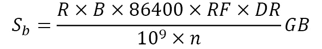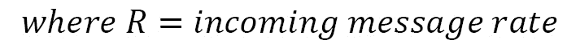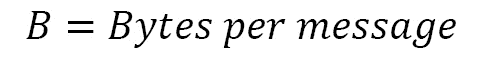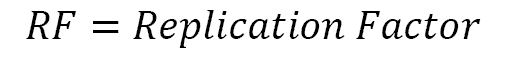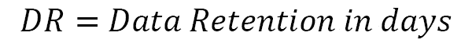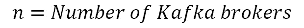

将此公式应用于我们的例子，我们得到每个代理的存储需求为 604 GB。

通过这些例子，我们看到了如何应用各种因素来预测解决方案的容量需求。这有助于为业务创建详细的 CapEx 和 OpEx 估算。

现在我们已经了解了如何计算基础设施估算，我们将讨论如何估算执行项目的人力资源相关成本和时间。

## 努力和时间线估算

除了架构师必须处理的各项责任外，努力和时间估算对于数据架构师来说也是一个重要的责任。通常，架构师负责在项目实施初期创建一个高级估算。考虑到大多数团队遵循敏捷软件开发方法，详细的努力估算是在实施阶段由敏捷团队完成的。以下活动需要完成以创建良好的估算：

+   **创建任务和依赖关系图**：首先，为了创建估算，我们必须分析解决方案并将其划分为高级开发和质量保证任务。在创建高级任务列表时，我们还应考虑所有性能工程任务。然后，我们必须创建一个依赖关系任务列表，该列表将指定特定任务是否依赖于另一个任务（或多个任务）。以下表格显示了创建任务和依赖关系列表的一种格式：

| **任务编号** | **任务名称** | **依赖关系** |
| --- | --- | --- |
| 1 | 创建 Git 用户注册和主仓库 |  |
| 2 | 在 PC 上创建本地仓库 | 任务 1 |
| 3 | 创建一个简单的 Hello World，其输出将在 Java 中以印地语显示 |  |
| 4 | 创建 R2 |  |
| 5 | 审查 R2 的代码 | 任务 4 |
| 6 | 推送 R2 的代码 | 任务 2 和任务 5 |
| 7 | 创建 R2 的数据模型 |  |
| 8 | 创建 R3-b 的数据模型 |  |
| 9 | 审查 R3-b 的数据模型 | 任务 8 |
| 10 | 推送 R3-b 的数据模型 | 任务 1 和任务 8 |

图 12.1 – 示例任务和依赖关系列表

在前一个表中，请注意任务 2 依赖于任务 1，同样，任务 6 依赖于任务 2 和任务 5。注意我们如何通过添加依赖关系列来表示这种依赖关系。这个依赖关系矩阵帮助我们理解风险和依赖关系。它还帮助我们了解各种任务如何并行运行。这有助于为各种功能发布创建路线图。

+   **根据任务复杂度分类**：架构师必须做的事情之一是将任务分类为以下三个类别之一：高复杂度、中等复杂度和低复杂度。然而，对于一些特殊情况，可以定义更细粒度的复杂度级别。

+   **根据技术分类**：另一个有助于估算的分类是技术。这是因为基于 Spark 的任务的复杂任务可能不同于基于 DataStage 的任务的复杂任务。因此，需要投入的平均工作量不仅取决于复杂性，还取决于技术。

+   **创建任务的预估时间**：要创建时间预估，首先，我们必须创建一个地图，其中包括特定技术组合和复杂性的时间消耗，如果是一项技术任务的话。如果是一项分析任务，我们必须创建一个任务时间与其复杂性的映射。例如，一个 Spark 作业的复杂任务可能需要 8 人天来完成，而一个 Informatica 作业的复杂任务可能需要 5 人天来完成。基于这样的映射，我们可以估算完成项目所需的总时间，以人天或人时为单位。对于一些敏捷项目，这种努力可以通过点系统来估算。例如，一个复杂分析任务可能需要 5 点努力。

+   **创建总努力预估**：基于之前的预估，我们可以通过将所有单个任务的努力相加来计算总努力。

+   **在预估中添加缓冲**：正如书中《实用程序员》（Hunt 等，1999 年）所提到的，我们应该记住：“与其说是建造，软件更像园艺——它比混凝土更有机。你不断地监控花园的健康状况，并根据需要做出调整（土壤、植物、布局）。”由于开发任何应用程序或数据管道都是有机的，我们必须在我们的预估中添加缓冲，以便在项目计划中容纳任何有机变化。

+   **创建产品路线图和发布时间表**：基于总预估、依赖项、风险和预期的交付范围，我们可以创建路线图和时间表。理解预期的交付时间表对于确保我们能够进行适当的人力资源加载，并在业务所期望的时间范围内交付项目至关重要。话虽如此，很多时候，业务对交付时间表有不合实际的期望。这是架构师（在项目经理和产品所有者的帮助下）的工作，向业务沟通和证明预估，以便技术和业务团队能在交付时间表上达成共识。

+   **在预估旁边列出所有风险和依赖项**：在创建预估时，列出所有风险、依赖项和假设非常重要，这样所有利益相关者都能了解正在交付的内容以及交付解决方案所涉及的风险。

现在我们已经学会了如何创建和记录深思熟虑的努力预估，我们必须找出解决方案的总交付或开发成本。要做到这一点，我们必须进行人力资源加载。人力资源加载是一个过程，通过这个过程我们确定需要多少具有特定技能的开发者、测试人员和分析师才能在约定的时间内交付项目。找到具有特定角色的合适人员组合是交付解决方案的关键。然后，我们根据角色、人口统计和技术分配一个特定的每小时成本。

然后，我们考虑一个角色或资源所需的小时数，并将其乘以分配的费率，以得出项目的人力资源总成本。通过汇总每种资源的总成本，我们可以找到总开发成本（或劳动力成本；不包括任何基础设施或许可费用）。

通过这样，我们已经学会了如何创建成本和资源估算以实施解决方案。在这本书的早期，我们学习了如何为各种类型的数据工程问题开发不同的架构。我们还学习了如何进行性能测试和基准测试。

在本节中，我们学习了如何创建成本和资源估算以实施解决方案。*有没有一种方法可以将所有这些信息结合起来，以推荐最合适的解决方案？* 在现实场景中，每个数据工程问题都可以通过多个架构解决方案来解决。*我们如何知道哪个是最合适的解决方案？有没有一种逻辑方法来确定最合适的解决方案？* 让我们来看看。

# 创建架构决策矩阵

关于数据工程，架构决策矩阵是一个帮助架构师以清晰和客观的方式评估不同架构方法的工具。决策矩阵是一个概述了制定架构决策的各种期望标准的网格。这个工具根据每个标准的得分对不同的架构替代方案进行排名。决策矩阵被其他决策过程所使用。例如，决策矩阵被业务分析师用来分析和评估他们的选项。

决策矩阵，也称为 Pugh 矩阵、决策网格或网格分析，可以用于许多类型的决策过程。然而，它最适合于我们必须在多个替代方案中选择一个选项的场景。由于我们必须为推荐选择一个架构，因此使用决策矩阵得出结论是有意义的。现在，让我们讨论创建用于架构决策的决策矩阵的逐步指南。创建决策矩阵的步骤如下：

1.  **头脑风暴并最终确定各种标准**：为了创建一个可以用于架构评估的决策矩阵，重要的是要头脑风暴并最终确定决策所依赖的各种标准。在这个头脑风暴会议中，重要的是要涉及领导和业务高管作为利益相关者。如果你是来自服务公司的架构师，正在为客户开发解决方案，那么涉及客户方的架构师也很重要。这一步骤非常重要，因为各种标准和它们的优先级有助于在一系列架构替代方案中缩小我们的最终推荐。

1.  **创建矩阵表**：接下来，我们应该创建决策矩阵表，其中每一行代表一个特定的标准，而每一列代表一个特定的建筑替代方案。这些是帮助我们确定当前用例中架构适用性的选定标准集。以下图表显示了表格的外观：

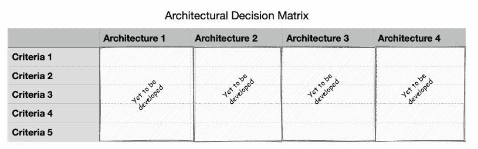

图 12.2 – 创建决策矩阵表

1.  **分配排名或刻度**：现在，我们必须为每个架构的标准分配排名或刻度。排名或刻度是一个相对度量，刻度越高，越符合标准。以下图表显示了如何根据各种标准将刻度分配给不同的架构：

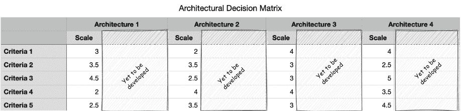

图 12.3 – 为每个架构与每个标准分配刻度值

如我们所见，每个架构相对于每个标准在 1 到 5 的相对刻度上分配了不同的刻度值。在这里，5 是给定标准的可能最高匹配度，而 1 是给定标准的可能最低匹配度。在这个例子中，*架构 1*在*刻度*方面的得分是*3*，*架构 2*的得分是*2*，而*架构 3*和*架构 4*在*标准 1*方面的得分是*4*。因此，*架构 3*和*架构 4*在*标准 1*方面是最合适的。

1.  **分配权重**：接下来，我们必须为每个标准分配权重。这将有助于确定各种标准的优先级。以下图表显示了如何将权重分配给每个架构与每个标准：

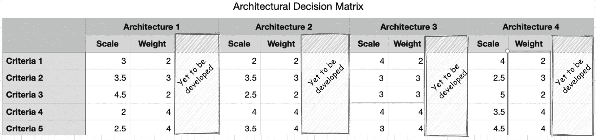

图 12.4 – 为每个标准分配权重

如我们所见，分配给每个标准的权重与架构无关。这为每个标准赋予了一个优先级。因此，最理想的标准获得最高的优先级。权重越高，优先级越高。在这个例子中，*标准 1*和*标准 2*的优先级最低，优先级得分为*2*，而*标准 4*和*标准 5*的优先级最高，优先级得分为*4*。

1.  **计算得分**：每个架构针对一个标准的个别得分是通过将刻度值乘以标准的权重来计算的。架构的总可取性得分是通过将每个标准的所有得分相加来计算的。以下图表显示了这样的决策矩阵的外观：

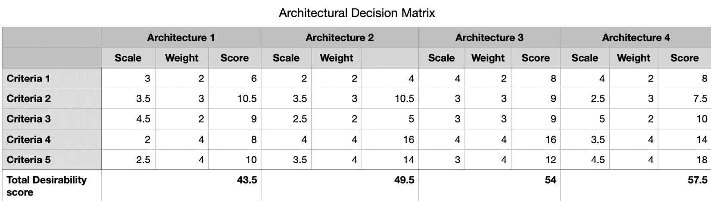

图 12.5 – 建筑决策完成决策矩阵的示例

如我们所见，*架构 4*看起来是最吸引人的解决方案，因为它具有最高的总吸引力得分*57.5*，而*架构 1*是最不吸引人的，得分为*43.5*。

在本节中，我们学习了如何创建决策矩阵。现在的问题是，*总吸引力得分是否总是足以推荐一个架构？* 在下一节中，我们将学习如何通过使用我们之前学到的技术进一步评估架构。

# 数据驱动的架构决策以减轻风险

决策矩阵帮助我们评估架构的吸引力。然而，并不总是需要选择具有最高吸引力得分的架构选项。有时，每个标准都需要有一个最低阈值得分，架构才能被选中。这种场景可以通过蜘蛛图来处理。

蜘蛛图，也称为雷达图，通常用于显示跨多个维度的数据。每个维度由一个轴表示。通常，维度是量化的，并归一化以匹配特定的范围。然后，每个选项与所有维度相对比，以创建一个封闭的多边形结构，如下面的图表所示：

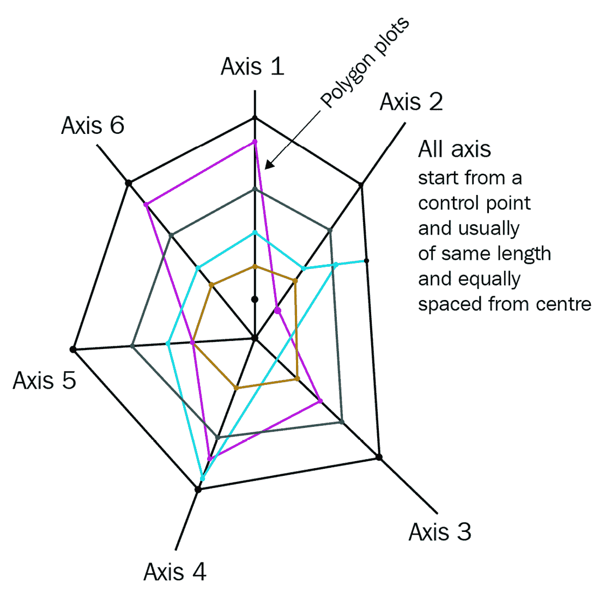

图 12.6 – 蜘蛛图或雷达图

在我们的案例中，每个用于做出架构决策的标准都可以被视为一个维度。此外，每个架构替代方案都在雷达图上绘制为图表。让我们看看*图 12.5*中显示的决策矩阵的使用案例。以下图表显示了相同使用案例的雷达图：

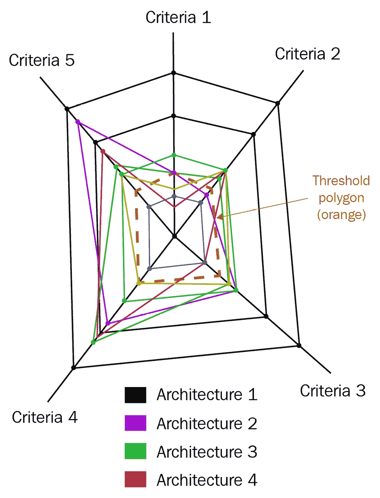

图 12.7 – 之前讨论的示例场景的雷达图

如我们所见，每个轴代表一个标准，如*标准 1*、*标准 2*等。每个标准总共有 25 分，沿着其轴分为五个相等的部分。每个标准的划分标记与相邻标准的划分标记相连，形成一个对称的五边形蜘蛛网。每个标准的最高得分是 25 分，因为它是最大规模值（5）和最高权重（5）的乘积。我们还创建了一个阈值多边形，如前图中虚线所示。这是通过连接每个标准的阈值标记（在这种情况下，得分为 8 分）来创建的。一个最优解是这样一个多边形，要么比阈值多边形大，要么等于阈值多边形。最优解的所有标准都应该比每个标准的阈值得分得分更高。

如前图所示，我们每个标准的阈值分数是 8。根据架构的每个标准的分数，我们绘制多边形图。在这里，*架构 1*的图是蓝色，*架构 2*是粉色，*架构 3*是绿色，*架构 4*是紫色。根据这些图，我们可以看到，在这个用例中，只有*架构 3*是最优的。尽管*架构 4*的总期望分数大于*架构 3*，但它没有满足每个标准至少有 8 分的最小阈值条件，因为它在*标准 2*中只得了 7.5 分。此外，如果*架构 3*的每个标准的分数都大于或等于阈值分数。因此，*架构 3*是此用例的最佳选择。

评估决策矩阵以找到最优化解决方案的另一种方法是使用决策树。**决策树**是决策支持工具，它使用树形模型来提问，并根据这些问题的答案对结果进行分类或剪枝。通常，叶节点表示类别或决策。以下图显示了使用蜘蛛/雷达图评估我们刚才讨论的场景的决策树示例：

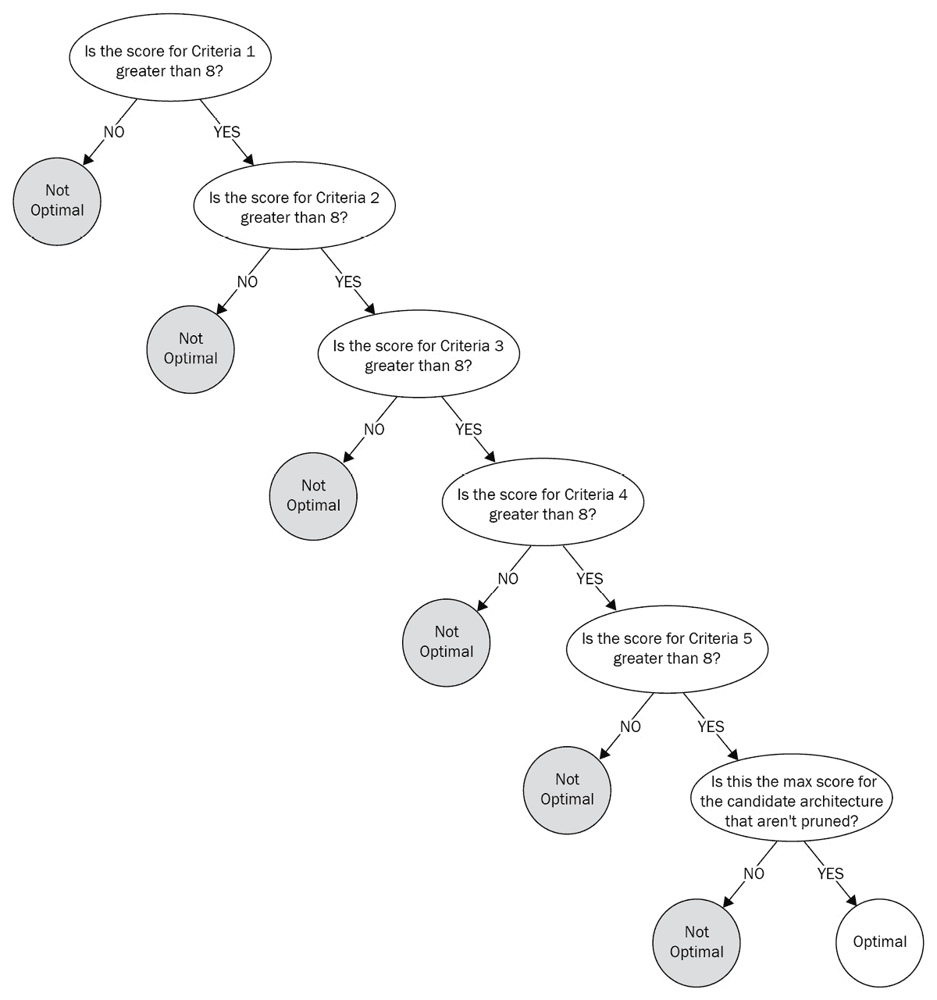

图 12.8 – 评估架构替代方案的决策树

如我们所见，我们可以根据决策矩阵中之前记录的分数创建一个决策树，以找到最优化解决方案。在这里，我们提出的问题例如*标准 1 的分数是否大于 8？*，*标准 2 的分数是否大于 8？*等等。根据答案，我们在该级别剪枝掉非优化解决方案。最后，我们问，*这是候选架构的最大分数，并且不能被剪枝吗？*这个问题的答案帮助我们确定最优化解决方案。

在本节中，我们学习了如何使用数据驱动的方法来寻找和评估问题的最优化解决方案。现在，建筑师的任务是将解决方案作为建议展示出来。在下一节中，我们将讨论如何有效地展示你的解决方案的指南。

# 展示解决方案和建议

作为一名架构师，你的工作并不仅仅是在基于问题、平台、标准和优先级创建和评估最优化架构替代方案后结束。作为商业和技术之间的桥梁，架构师还负责有效地传达解决方案并推荐最优化替代方案。根据你的项目和业务类型，你可能需要说服利益相关者投资解决方案。以下是一些有助于你展示解决方案并更有效地说服利益相关者的指南：

+   **在演示之前进行演示**: 如果可能的话，尽早与客户或最终客户接触，并向他们展示你正在考虑的可能解决方案。同时，告诉他们评估每个解决方案需要多少时间。在开发架构的过程中，保持他们的参与和知情。如果利益相关者参与过程并保持知情，这对双方都是双赢的局面。利益相关者会感到他们是解决方案的一部分，并且有足够的时间理解或预测实施解决方案的任何影响。另一方面，架构师会获得关于优先级和标准的持续反馈，这有助于他们制定一个经过充分研究的决策矩阵。一个更准确的决策矩阵最终有助于架构师做出最期望的推荐。

+   **了解你的受众并确保他们出席**: 虽然这对任何演示都适用，但在展示解决方案之前了解受众非常重要。了解他们是否来自业务、执行领导层或技术方面。同时，考虑是否有任何外部团队或供应商参与也很重要。了解你受众的人口统计信息将帮助你定制演示，使其与他们的工作相关。如果是一个混合受众，确保你为所有不同的受众群体都有相关的内容。同时，邀请所有重要的利益相关者也很重要，以确保你的解决方案能够触及每一个目标受众。

+   **展示解决方案的投资回报率 (ROI)**: 通常，在解决方案的演示中会有高层领导、执行人员和业务负责人出席。对他们来说，了解解决方案如何产生或节省美元非常重要。这可能意味着解决方案将创造额外的收入来源，或者它可能只是像降低总拥有成本或降低开发成本这样微不足道的事情。为了展示解决方案的 ROI，你可以包括解决方案是否为顾客体验或产品接受度增加了任何价值。一个好的数据架构师应该仔细思考并找出解决方案如何为业务增加价值。

+   **通过比较替代方案进行推荐**: 虽然我们作为架构师通常会推荐一个架构，但展示所有替代架构及其优缺点是一个好的做法。然后，我们必须确定最合适的架构。展示我们为什么选择那个架构也是一个好主意。

+   **使用他们的语言使演示更出色**: 每个公司和业务都有自己的语言。由于许多利益相关者来自业务方面，所以在演示时适应组织内部流行的通用语言会更好。这确保了受众能够轻松理解我们所展示的内容，并能将点联系起来。

+   **注意上下文**：对于演示文稿来说，上下文也很重要。根据受众，你的演示文稿应该定制化，以便在技术内容与业务内容之间保持正确的平衡。

+   **确保你的演示文稿具有视觉吸引力和相关性**：图表比文字更能说明问题。演示文稿必须包含清晰、相关且自解释的图表。避免在演示文稿中使用过多的文字。一个视觉上吸引人的演示文稿更容易解释，并使各种利益相关者对演示文稿保持兴趣。

在本节中，我们讨论了几种以简洁、有效和有影响力方式向利益相关者展示解决方案的技巧和窍门。除了开发和架构解决方案外，我们还了解如何有效地评估、推荐和展示解决方案。现在，让我们总结一下本章所学的内容。

# 摘要

我们本章一开始学习了如何规划和估算基础设施资源。然后，我们讨论了如何进行工作量估算、如何配置人力资源以及如何计算总开发成本。通过这样做，我们学习了如何创建架构决策矩阵以及如何在不同架构之间进行数据驱动的比较。接着，我们深入探讨了我们可以使用决策矩阵通过蜘蛛/雷达图或决策树来评估最优化解决方案的不同方法。最后，我们讨论了一些指导原则和技巧，以更有效和有影响力地向各种商业利益相关者展示优化后的解决方案。

恭喜你——你已经完成了这本书的所有 12 章，在这本书中，你学习了关于 Java 数据架构师角色的所有内容，数据工程的基础知识，如何为各种数据工程问题构建解决方案，各种架构模式，数据治理和安全，以及性能工程和优化。在本章的最后，你学习了如何使用数据驱动技术选择最适合的架构，以及如何向高管层展示它。我希望你已经学到了很多，这将有助于你作为成功的数据架构师发展你的职业生涯，并帮助你在你当前的角色中成长。
