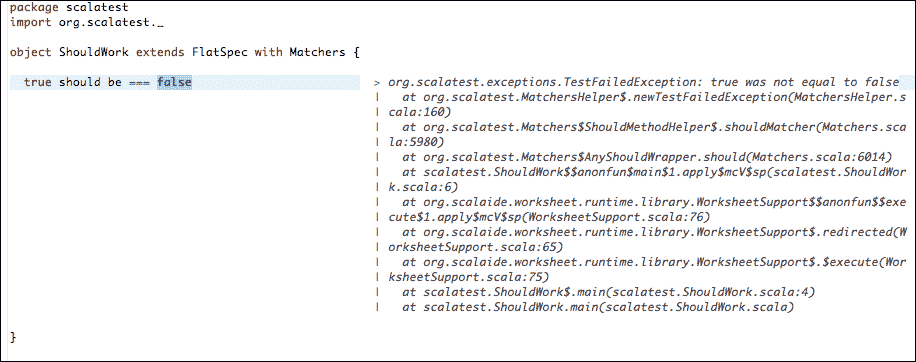
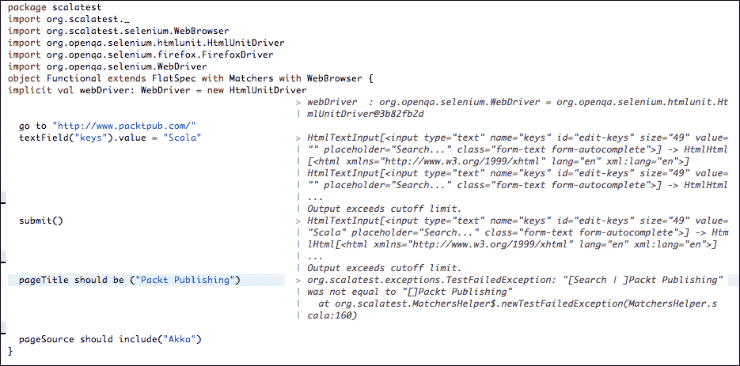

# 第四章. 测试工具

无论你使用哪种编程语言，都应该非常小心地进行测试，因为测试不仅以一致的方式记录了你的代码，而且对于重构和维护活动，如修复错误，也将大有裨益。

Scala 生态系统在很大程度上遵循 Java 在所有级别的测试趋势，但也有一些不同之处。在许多地方，我们会看到 Scala 正在使用 **DSLs**（**领域特定** **语言**），这使得测试代码非常易于阅读和理解。实际上，测试可以是介绍 Scala 时一个很好的起点，逐步从现有的 Java 项目迁移过来。

在本章中，我们将通过一些代码示例介绍一些主要的测试工具及其用法。我们已经在 第三章 中编写了一个微型的 JUnit 风格的测试，即 *理解 Scala 生态系统*，因此我们将从这里开始，专注于属于 **行为驱动开发**（**BDD**）的 BDD 风格测试。BDD 对所使用的任何技术栈都是中立的，在过去的几年中，它已成为在 Gherkin 语言（它是 cucumber 框架的一部分，并在 [`cukes.info/gherkin.html`](http://cukes.info/gherkin.html) 中解释）中编写清晰规范的一个合规选择，说明代码应该如何表现。在 Java 和许多其他语言中已经使用，这种风格的测试通常更容易理解和维护，因为它们更接近于普通英语。它们更接近于 BDD 的真正采用，旨在使业务分析师能够以结构化的方式编写测试规范，程序可以理解和实现。它们通常代表唯一的文档；因此，保持它们最新并与领域紧密相关非常重要。

Scala 主要提供了两个框架来编写测试，**ScalaTest** ([www.scalatest.org](http://www.scalatest.org)) 和 **Specs2** ([etorreborre.github.io/specs2/](http://etorreborre.github.io/specs2/))。由于它们彼此之间非常相似，我们只将介绍 ScalaTest，并对感兴趣的读者说明如何通过查看 Specs2 文档来了解它们之间的差异。此外，我们还将探讨使用 **ScalaCheck** 框架（[www.scalacheck.org](http://www.scalacheck.org)）进行的基于属性的自动化测试。

# 使用 ScalaTest 编写测试

为了能够快速开始可视化使用 ScalaTest 可以编写的某些测试，我们可以利用前一章中介绍的类型安全激活器（Typesafe Activator）中的 `test-patterns-scala` 模板。它包含了一系列示例，主要针对 ScalaTest 框架。

设置`test-patterns-scala`激活器项目只需要你前往我们之前安装 Typesafe Activator 的目录，然后，通过`> activator ui`命令启动 GUI，或者输入`> activator new`来创建一个新项目，并在提示时选择适当的模板。

模板项目已经包含了`sbteclipse`插件；因此，你只需在项目的根目录中通过命令提示符输入，就可以生成与 Eclipse 相关的文件，如下所示：

```java
> activator eclipse

```

一旦成功创建了 Eclipse 项目，你可以通过选择**文件** | **导入...** | **通用** | **现有项目**将其导入到你的 IDE 工作区。作为前一章的提醒，你也可以为 IntelliJ 或其他 IDE 创建项目文件，因为 Typesafe Activator 只是 SBT 的一个定制版本。

你可以查看`src/test/scala`中的各种测试用例。由于一些测试使用了我们尚未覆盖的框架，如 Akka、Spray 或 Slick，我们将暂时跳过这些测试，专注于最直接的测试。

在其最简单形式中，一个`ScalaTest`类（顺便说一下，它也可能测试 Java 代码，而不仅仅是 Scala 代码）可以通过扩展`org.scalatest.FunSuite`来声明。每个测试都表示为一个函数值，这已在`Test01.scala`类中实现，如下所示：

```java
package scalatest
import org.scalatest.FunSuite

class Test01 extends FunSuite {
  test("Very Basic") {
    assert(1 == 1)
  }
  test("Another Very Basic") {
    assert("Hello World" == "Hello World")
  }
}
```

要仅执行这个单个测试类，你应该在命令提示符中输入以下命令：

```java
> activator
> test-only <full name of the class to execute>

```

在我们的情况下，这个命令将是以下这样：

```java
> test-only scalatest.Test01   (or scalatest.Test01.scala)
[info] Test01:
[info] - Very Basic (38 milliseconds)
[info] - Another Very Basic (0 milliseconds)
[info] ScalaTest
[info] Run completed in 912 milliseconds.
[info] Total number of tests run: 2
[info] Suites: completed 1, aborted 0
[info] Tests: succeeded 2, failed 0, canceled 0, ignored 0, pending 0
[info] All tests passed.
[info] Passed: Total 2, Failed 0, Errors 0, Passed 2
[success] Total time: 9 s, completed Nov 11, 2013 6:12:14 PM

```

在`test-patterns-scala`项目下的`src/test/scala/scalatest/Test02.scala`中给出的示例非常相似，但使用`===`而不是`==`会在测试失败时提供额外的信息。如下所示：

```java
class Test02 extends FunSuite {
 test("pass") {
 assert("abc" === "abc")
 }
 test("fail and show diff") {
 assert("abc" === "abcd") // provide reporting info
 }
}

```

再次运行测试可以通过输入以下命令来完成：

```java
> test-only scalatest.Test02
[info] Test02:
[info] - pass (15 milliseconds)
[info] - fail and show diff *** FAILED *** (6 milliseconds)
[info]   "abc[]" did not equal "abc[d]" (Test02.scala:10)
[info] …
[info] *** 1 TEST FAILED ***
[error] Failed: Total 2, Failed 1, Errors 0, Passed 1

```

在修复失败的测试之前，这次我们可以在连续模式下执行测试，使用`test-only`前的`~`字符（从激活器提示符中），如下所示：

```java
>~test-only scalatest.Test02

```

连续模式会在每次编辑并保存`Test02`类时，让 SBT 重新运行`test-only`命令。SBT 的这个特性可以通过在后台运行测试或程序而不需要显式编写命令，为你节省大量时间。在第一次执行`Test02`时，你可以看到一些红色文本，指示`"abc[]" 不等于 "abc[d]" (Test02.scala:10)`。

一旦你更正了`abdc`字符串并保存文件，SBT 将自动在后台重新执行测试，你可以看到文本变成绿色。

连续模式也适用于其他 SBT 命令，如`~run`或`~test`。

`Test03`展示了如何期望或捕获异常：

```java
class Test03 extends FunSuite {
  test("Exception expected, does not fire, FAIL") {
    val msg = "hello"
    intercept[IndexOutOfBoundsException] {
      msg.charAt(0)
    }
  }
  test("Exception expected, fires, PASS") {
    val msg = "hello"
    intercept[IndexOutOfBoundsException] {
      msg.charAt(-1)
    }
  }
}
```

第一个场景失败，因为它期望一个`IndexOutOfBoundsException`，但代码确实返回了一个有效的`h`，即`hello`字符串索引为 0 的字符。

为了能够将 ScalaTest 测试套件作为 JUnit 测试套件运行（例如，在 IDE 中运行或在 Maven 中构建的现有基于 JUnit 的项目中扩展，或者向构建服务器报告时），我们可以使用可用的`JUnitRunner`类以及`@RunWith`注解，如下面的示例所示：

```java
import org.junit.runner.RunWith
import org.scalatest.junit.JUnitRunner
import org.scalatest.FunSuite
@RunWith(classOf[JUnitRunner])
class MyTestSuite extends FunSuite {
  // ...
}
```

## BDD 风格的测试

`Test06`是另一种风格的测试示例，即 BDD。简而言之，你几乎用纯英文指定某种用户故事来描述你想要测试的场景的行为。这可以在以下代码中看到：

```java
class Test06 extends FeatureSpec with GivenWhenThen {

  feature("The user can pop an element off the top of the stack") 
  {
info("As a programmer")
  info("I want to be able to pop items off the stack")
  info("So that I can get them in last-in-first-out order")

  scenario("pop is invoked on a non-empty stack") {

    given("a non-empty stack")
    val stack = new Stack[Int]
    stack.push(1)
    stack.push(2)
    val oldSize = stack.size

  when("when pop is invoked on the stack")
  val result = stack.pop()

  then("the most recently pushed element should be returned")
  assert(result === 2)

  and("the stack should have one less item than before")
  assert(stack.size === oldSize - 1)
  }

  scenario("pop is invoked on an empty stack") {

    given("an empty stack")
    val emptyStack = new Stack[Int]

    when("when pop is invoked on the stack")
    then("NoSuchElementException should be thrown")
    intercept[NoSuchElementException] {
    emptyStack.pop()
    }

  and("the stack should still be empty")
  assert(emptyStack.isEmpty)
  }
}
}
```

BDD 风格的测试比 JUnit 测试具有更高的抽象层次，更适合集成和验收测试以及文档，对于了解该领域的知识的人来说。你只需要扩展`FeatureSpec`类，可选地使用`GivenWhenThen`特质，来描述验收需求。有关 BDD 风格测试的更多详细信息，请参阅[`en.wikipedia.org/wiki/Behavior-driven_development`](http://en.wikipedia.org/wiki/Behavior-driven_development)。我们在这里只想说明，在 Scala 中可以编写 BDD 风格的测试，但我们不会进一步深入它们的细节，因为它们在 Java 和其他编程语言中已经得到了大量文档记录。

ScalaTest 提供了一个方便的 DSL，可以以接近纯英文的方式编写断言。`org.scalatest.matchers.Matchers`特质包含许多可能的断言，你应该查看其 ScalaDoc 文档以查看许多使用示例。`Test07.scala`表达了一个非常简单的匹配器，如下面的代码所示：

```java
package scalatest

import org.scalatest._
import org.scalatest.Matchers

class Test07 extends FlatSpec with Matchers {
"This test" should "pass" in {
    true should be === true
  }
}
```

### 注意

虽然是用 ScalaTest 的 2.0 版本构建的，但 activator 项目中的原始示例使用的是现在已弃用的`org.scalatest.matchers.ShouldMatchers`特质；前面的代码示例实现了相同的行为，但更加更新。

让我们使用 Scala 工作表编写一些更多的断言。右键单击包含所有之前审查过的测试文件的`scalatest`包，然后选择**new** | **Scala Worksheet**。我们将把这个工作表命名为`ShouldWork`。然后我们可以通过扩展带有`Matchers`特质的`FlatSpec`规范来编写和评估匹配器，如下面的代码所示：

```java
package scalatest
import org.scalatest._
object ShouldWork extends FlatSpec with Matchers {

  true should be === true

}
```

保存此工作表不会产生任何输出，因为匹配器通过了测试。然而，尝试通过将一个`true`改为`false`来让它失败。这在上面的代码中显示：

```java
package scalatest
import org.scalatest._

object ShouldWork extends FlatSpec with Matchers {

  true should be === false

}
```

这次，我们在评估过程中得到了完整的堆栈跟踪，如下面的屏幕截图所示：



我们可以开始评估更多的`should`匹配器，如以下代码所示：

```java
package scalatest
import org.scalatest._

object ShouldMatchers extends FlatSpec with Matchers {

  true should be === true

  List(1,2,3,4) should have length(4)

  List.empty should be (Nil)

  Map(1->"Value 1", 2->"Value 2") should contain key (2)
  Map(1->"Java", 2->"Scala") should contain value ("Scala")

  Map(1->"Java", 2->"Scala") get 1 should be (Some("Java"))

  Map(1->"Java", 2->"Scala") should (contain key (2) and not contain value ("Clojure"))

  3 should (be > (0) and be <= (5))

  new java.io.File(".") should (exist)
}
```

当我们遇到测试失败时，工作表的评估就会停止。因此，我们必须修复它才能在测试中继续前进。这与我们之前使用 SBT 的`test`命令运行整个测试套件是相同的，如下面的代码所示：

```java
object ShouldMatchers extends FlatSpec with Matchers {

"Hello" should be ("Hello")

"Hello" should (equal ("Hej")
               or equal ("Hell")) //> org.scalatest.exceptions.TestFailedException:

"Hello" should not be ("Hello")
}
```

在上一个例子中，最后一个语句（与第一个语句相反）应该失败；然而，它没有被评估。

## 功能测试

ScalaTest 与 Selenium（它是用于自动化浏览器测试的工具，可在[www.seleniumhq.org](http://www.seleniumhq.org)找到）很好地集成，通过提供完整的 DSL，使得编写功能测试变得简单直接。`Test08`是这种集成的明显例子：

```java
class Test08 extends FlatSpec with Matchers with WebBrowser {

  implicit val webDriver: WebDriver = new HtmlUnitDriver
go to "http://www.amazon.com"
click on "twotabsearchtextbox"
textField("twotabsearchtextbox").value = "Scala"
submit()
pageTitle should be ("Amazon.com: Scala")
pageSource should include("Scala Cookbook: Recipes")
}
```

让我们尝试直接在工作表中运行类似的调用。由于工作表会对每个语句评估提供反馈，因此它们非常适合直接识别问题，例如，如果链接、按钮或内容没有按预期找到。

只需在已存在的`ShouldWork`工作表旁边创建另一个名为**Functional**的工作表。右键单击`scalatest`包，然后选择**New** | **Scala Worksheet**。

工作表可以按照以下方式填写：

```java
package scalatest
import org.scalatest._
import org.scalatest.selenium.WebBrowser
import org.openqa.selenium.htmlunit.HtmlUnitDriver
import org.openqa.selenium.firefox.FirefoxDriver
import org.openqa.selenium.WebDriver
object Functional extends FlatSpec with Matchers with WebBrowser {
implicit val webDriver: WebDriver = new HtmlUnitDriver
  go to "http://www.packtpub.com/"
  textField("keys").value = "Scala"
  submit()
  pageTitle should be ("Search | Packt Publishing")
  pageSource should include("Akka")
}
```

在保存操作（*Ctrl* + *S*）后，工作表将被评估，并且可能为每个语句显示一些输出信息，除了最后两个带有`should`匹配器的语句，因为它们应该评估为`true`。

尝试将`("Search | Packt Publishing")`更改为不同的值，例如`Results`或仅仅是`Packt Publishing`，并注意控制台输出提供了关于不匹配内容的有用信息。这在上面的屏幕截图中有展示：



这个功能测试只是触及了可能性的表面。由于我们使用的是 Java Selenium 库，在 Scala 中，你可以继承 Java 中可用的 Selenium 框架的力量。

## 使用 ScalaMock 进行模拟

模拟是一种可以在不需要所有依赖项都到位的情况下测试代码的技术。Java 在编写测试时提供了几个用于模拟对象的框架。最著名的是 JMock、EasyMock 和 Mockito。随着 Scala 语言引入了新元素，如特性和函数，基于 Java 的模拟框架就不够用了，这就是 ScalaMock（[www.scalamock.org](http://www.scalamock.org)）发挥作用的地方。

ScalaMock 是一个本地的 Scala 模拟框架，通常用于 ScalaTest（或 Specs2）中，通过在 SBT（`build.sbt`）文件中导入以下依赖项：

```java
libraryDependencies +="org.scalamock" %% "scalamock-scalatest-support" % "3.0.1" % "test"
```

在 Specs2 中，需要导入以下依赖项：

```java
libraryDependencies +=
"org.scalamock" %% "scalamock-specs2-support" % "3.0.1" % "test"
```

自从 Scala 版本 2.10 发布以来，ScalaMock 已经被重写，ScalaMock 版本 3.*x*是我们将通过模拟特例的示例简要介绍的版本。

让我们先定义我们将要测试的代码。它是一个微型的货币转换器（可在[`www.luketebbs.com/?p=58`](http://www.luketebbs.com/?p=58)找到），从欧洲中央银行获取货币汇率。检索和解析货币汇率 XML 文件只需几行代码，如下所示：

```java
trait Currency {
  lazy val rates : Map[String,BigDecimal] = {
  val exchangeRates =
    "http://www.ecb.europa.eu/stats/eurofxref/eurofxref-daily.xml"
  for (
    elem <- xml.XML.load(exchangeRates)\"Cube"\"Cube"\"Cube")
  yield
    (elem\"@currency").text -> BigDecimal((elem\"@rate").text)
  }.toMap ++ MapString,BigDecimal

  def convert(amount:BigDecimal,from:String,to:String) =
    amount / rates(from) * rates(to)
}
```

在这个例子中，货币汇率是通过 `xml.XML.load` 方法从 URL 中获取的。由于 XML 是 Scala 标准库的一部分，这里不需要导入。`load` 方法解析并返回 XML 汇率作为一个不可变的 `Elem` 类型结构，`Elem` 是一个表示 XML 元素的案例类。这在下述代码中显示：

```java
<gesmes:Envelope 
>
  <gesmes:subject>Reference rates</gesmes:subject>
    <gesmes:Sender>
      <gesmes:name>European Central Bank</gesmes:name>
    </gesmes:Sender>
    <Cube>
      <Cube time="2013-11-15">
      <Cube currency="USD" rate="1.3460"/>
      <Cube currency="JPY" rate="134.99"/>
      <Cube currency="BGN" rate="1.9558"/>
      <Cube currency="CZK" rate="27.155"/>
      <Cube currency="DKK" rate="7.4588"/>
      <Cube currency="GBP" rate="0.83770"/>
           ...
         ...
    </Cube>
  </Cube>
</gesmes:Envelope>
```

从这个 XML 文档中访问货币汇率列表是通过 XPath 表达式在 Cube 节点内部导航完成的，因此有 `xml.XML.load(exchangeRates) \ "Cube" \ "Cube" \ "Cube"` 表达式。需要一个单行 for 推导（我们在上一章中引入的 `for (…)` `yield (…)` 构造）来遍历货币汇率，并返回一个 `key -> value` 对的集合，在我们的情况下，键将是一个表示货币名称的字符串，而 `value` 将是一个表示汇率的 BigDecimal 值。注意信息是如何从 `<Cube currency="USD" rate="1.3460"/>` 中提取的，通过写入 `(elem \ "@currency").text` 来捕获货币属性，以及 `(elem \ "@rate").text` 来分别捕获汇率。后者将通过从给定的字符串创建一个新的 `BigDecimal` 值来进一步处理。

最后，我们得到一个包含所有货币及其汇率的 `Map[String, BigDecimal]`。我们将 EUR（欧元）货币的映射添加到这个值中，它将代表参考汇率之一；这就是为什么我们使用 `++` 运算符合并两个映射，即我们刚刚创建的映射与只包含一个 `key -> value` 元素的新的映射一起。

在模拟之前，让我们使用 ScalaTest 和 `FlatSpec` 以及 `Matchers` 编写一个常规测试。我们将利用我们的 `Converter` 特质，将其集成到以下 `MoneyService` 类中：

```java
package se.chap4

class MoneyService(converter:Converter ) {

  def sendMoneyToSweden(amount:BigDecimal,from:String): BigDecimal = {
    val convertedAmount = converter.convert(amount,from,"SEK")
    println(s" $convertedAmount SEK are on their way...")
    convertedAmount
  }

  def sendMoneyToSwedenViaEngland(amount:BigDecimal,from:String): BigDecimal = {
    val englishAmount = converter.convert(amount,from,"GBP")
    println(s" $englishAmount GBP are on their way...")
    val swedishAmount = converter.convert(englishAmount,"GBP","SEK")
    println(s" $swedishAmount SEK are on their way...")
    swedishAmount
  }
}
```

从 `MoneyService` 类派生出的一个可能的测试规范如下：

```java
package se.chap4

import org.scalatest._
import org.junit.runner.RunWith
import org.scalatest.junit.JUnitRunner

@RunWith(classOf[JUnitRunner])
class MoneyServiceTest extends FlatSpec with Matchers {

"Sending money to Sweden" should "convert into SEK" in {
    val moneyService = 
      new MoneyService(new ECBConverter)
    val amount = 200
    val from = "EUR"
    val result = moneyService.sendMoneyToSweden(amount, from)
    result.toInt should (be > (1700) and be <= (1800))
  }

"Sending money to Sweden via England" should "convert into GBP then SEK" in {
    val moneyService = 
      new MoneyService(new ECBConverter)
    val amount = 200
    val from = "EUR"
    val result = moneyService.sendMoneyToSwedenViaEngland(amount, from)
    result.toInt should (be > (1700) and be <= (1800))
  }
}
```

为了能够实例化 `Converter` 特质，我们使用在 `Converter.scala` 文件中定义的 `ECBConverter` 类，如下所示：

```java
class ECBConverter extends Converter
```

如果我们从 SBT 命令提示符或直接在 Eclipse 中（作为 JUnit）执行测试，我们会得到以下输出：

```java
> test
[info] Compiling 1 Scala source to /Users/thomas/projects/internal/HttpSamples/target/scala-2.10/test-classes...
 1792.2600 SEK are on their way...
 167.70000 GBP are on their way...
 1792.2600 SEK are on their way...
[info] MoneyServiceTest:
[info] Sending money to Sweden
[info] - should convert into SEK
[info] Sending money to Sweden via England
[info] - should convert into GBP then SEK
[info] Passed: : Total 2, Failed 0, Errors 0, Passed 2, Skipped 0
[success] Total time: 1 s, completed

```

如果我们从其中检索货币汇率的 URL 并非总是可用，或者如果某一天货币汇率变动很大，导致转换后的金额不在断言 `should (be > (1700) and be <= (1800))` 给定的区间内，那么我们的测试可能会失败。在这种情况下，在我们的测试中对转换器进行模拟似乎是合适的，并且可以按照以下方式完成：

```java
package se.chap4

import org.scalatest._
import org.junit.runner.RunWith
import org.scalatest.junit.JUnitRunner
import org.scalamock.scalatest.MockFactory

@RunWith(classOf[JUnitRunner])
class MockMoneyServiceTest extends FlatSpec with MockFactory with Matchers {

"Sending money to Sweden" should "convert into SEK" in {

    val converter = mock[Converter]
    val moneyService = new MoneyService(converter)

    (converter.convert _).expects(BigDecimal("200"),"EUR","SEK").returning(BigDecimal(1750))

    val amount = 200
    val from = "EUR"
    val result = moneyService.sendMoneyToSweden(amount, from)
    result.toInt should be (1750)
  }
}
```

`expects` 方法包含了当我们的代码应该调用 `convert` 方法时我们期望的参数，而返回方法包含了用预期输出代替实际返回结果的预期值。

ScalaMock 在如何应用模拟代码方面有许多变体，并计划在未来的版本中使用 **Macros** 来增强模拟语法。简而言之，Macros 是在编译期间由编译器调用的函数。这是 Scala 从 2.10 版本开始添加的一个实验性功能，它使得开发者能够访问编译器 API 并对 **AST**（**抽象语法树**）应用转换，即程序的树形表示。Macros 不在本书的范围之内，但它们在代码生成和领域特定语言（DSLs）方面非常有用。它们的用法将改进 ScalaMock 语法；例如，你可以在 `inSequence {… }` 或 `inAnyOrder {… }` 代码块中，或者在这些块的嵌套组合中应用你的模拟期望，正如它们在文档中所展示的，该文档可在 [scalamock.org](http://scalamock.org) 上找到。ScalaMock 还支持类似于 Mockito 的风格，使用 **记录-然后-验证** 循环而不是我们一直使用的 **期望-首先** 风格。

# 使用 ScalaCheck 进行测试

拥有一个完整且一致的测试套件，该套件由单元测试、集成测试或功能测试组成，这对于确保软件开发的整体质量至关重要。然而，有时这样的套件是不够的。在测试特定数据结构时，常常会遇到有太多可能值需要测试的情况，这意味着有大量的模拟或测试数据生成。自动基于属性的测试是 ScalaCheck 的目标，这是一个受 Haskell 启发的 Scala 库，它允许生成（或多或少随机地）测试数据来验证你正在测试的代码的一些属性。这个库可以应用于 Scala 项目，也可以应用于 Java 项目。

要快速开始使用 ScalaCheck，你可以在 `build.sbt` 文件中包含适当的库，就像我们之前经常做的那样。这如下所示：

```java
resolver += Resolver.sonatypeRepo("releases")

libraryDependencies ++= Seq(
"org.scalacheck" %% "scalacheck" % "1.11.0" % "test")

```

从 SBT 提示符中，你可以输入 `reload` 而不是退出并重新启动 SBT，以获取构建文件的新版本，然后输入 `update` 来获取新的依赖项。一旦完成，你也可以输入 `eclipse` 来更新你的项目，以便依赖项成为你的类路径的一部分，并且编辑器将识别 ScalaCheck 类。

让我们先运行由 [www.scalacheck.org](http://www.scalacheck.org) 上的 **快速入门** 页面提出的 `StringSpecification` 测试：

```java
import org.scalacheck.Properties
import org.scalacheck.Prop.forAll

object StringSpecification extends Properties("String") {

  property("startsWith") = forAll { (a: String, b: String) =>
    (a+b).startsWith(a)
  }

  property("concatenate") = forAll { (a: String, b: String) =>
    (a+b).length > a.length && (a+b).length > b.length
  }

  property("substring") = forAll { (a: String, b: String, c: String) =>
    (a+b+c).substring(a.length, a.length+b.length) == b
  }

}
```

在此代码片段中，ScalaCheck（随机）生成了一组字符串并验证了属性的正确性；第一个是直接的；它应该验证将两个字符串`a`和`b`相加应该产生以`a`开头的字符串。这个测试听起来可能很明显会通过，无论字符串的值是什么，但第二个属性验证两个字符串连接的长度并不总是正确的；将`a`和`b`都喂以空值`""`是一个反例，表明该属性没有被验证。我们可以通过以下方式通过 SBT 运行测试来展示这一点：

```java
> test-only se.chap4.StringSpecification
[info] + String.startsWith: OK, passed 100 tests.
[info] ! String.concatenate: Falsified after 0 passed tests.
[info] > ARG_0: ""
[info] > ARG_1: ""
[info] + String.substring: OK, passed 100 tests.
[error] Failed: : Total 3, Failed 1, Errors 0, Passed 2, Skipped 0
[error] Failed tests:
[error] 	se.chap4.StringSpecification
[error] (test:test-only) sbt.TestsFailedException: Tests unsuccessful
[error] Total time: 1 s, completed Nov 19, 2013 4:30:37 PM
>

```

ScalaCheck 方便地输出了一个反例，`ARG_0: ""`和`ARG_1: ""`，这导致测试失败。

我们可以在比字符串更复杂的对象上添加更多测试。让我们在我们的测试套件中添加一个新的测试类，命名为`ConverterSpecification`，以测试我们在*使用 ScalaMock 进行模拟*部分中创建的`Converter`：

```java
package se.chap4

import org.scalacheck._
import Arbitrary._
import Gen._
import Prop.forAll

object ConverterSpecification extends Properties("Converter") with Converter {

  val currencies = Gen.oneOf("EUR","GBP","SEK","JPY")

  lazy val conversions: Gen[(BigDecimal,String,String)] = for {
    amt <- arbitrary[Int] suchThat {_ >= 0}
    from <- currencies
    to <- currencies
  } yield (amt,from,to)

  property("Conversion to same value") = forAll(currencies) { c:String =>
    val amount = BigDecimal(200)
    val convertedAmount = convert(amount,c,c)
    convertedAmount == amount
  }

  property("Various currencies") = forAll(conversions) { c =>
    val convertedAmount = convert(c._1,c._2,c._3)
    convertedAmount >= 0
  }
}
```

如果我们在 SBT 中运行测试，将显示以下输出：

```java
> ~test-only se.chap4.ConverterSpecification
[info] + Converter.Conversion to same value: OK, passed 100 tests.
[info] + Converter.Various currencies: OK, passed 100 tests.
[info] Passed: : Total 2, Failed 0, Errors 0, Passed 2, Skipped 0
[success] Total time: 1 s, completed Nov 19, 2013 9:40:40 PM
1\. Waiting for source changes... (press enter to interrupt)

```

在这个规范中，我们添加了两个特定的生成器；第一个名为`currencies`的生成器只能生成来自我们想要测试的有效货币列表的几个字符串，否则随机生成的字符串会产生不属于`Map`的字符串。让我们将无效项`"DUMMY"`添加到生成的列表中，以验证测试是否失败：

```java
val currencies = Gen.oneOf("EUR","GBP","SEK","JPY","DUMMY")
```

保存后，测试会自动重新运行，因为我们指定了`test-only`前的`~`符号。如下所示：

```java
[info] ! Converter.Conversion to same value: Exception raised on property evaluation.
[info] > ARG_0: "DUMMY"
[info] > Exception: java.util.NoSuchElementException: key not found: DUMMY
[info] ! Converter.Various currencies: Exception raised on property evaluation.
[info] > ARG_0: (1,,)
[info] > ARG_0_ORIGINAL: (1,DUMMY,SEK)
[info] > Exception: java.util.NoSuchElementException: key not found: 
[error] Error: Total 2, Failed 0, Errors 2, Passed 0, Skipped 0
[error] Error during tests:
[error] 	se.chap4.ConverterSpecification
[error] (test:test-only) sbt.TestsFailedException: Tests unsuccessful
[error] Total time: 1 s, completed Nov 19, 2013 9:48:36 PM
2\. Waiting for source changes... (press enter to interrupt)

```

第二个名为`conversions`的生成器展示了如何构建一个更复杂的生成器，该生成器利用了 for 推导式的强大功能。特别是，请注意`suchThat {_ >= 0}`过滤方法确保任意选择的整数具有正值。此生成器返回一个包含所有必要值的`Tuple3`三元组，用于测试`Converter.convert`方法。

# 摘要

在本章中，我们介绍了 Scala 中可用的主要测试框架，这些框架在很大程度上继承了丰富的 Java 生态系统。此外，通过 ScalaCheck 应用属性测试，我们探索了提高测试质量的新方法。为了进一步提高软件质量，感兴趣的读者可以查看[`www.scala-sbt.org/`](http://www.scala-sbt.org/)网站上列出的其他 SBT 插件，特别是`scalastyle-sbt-plugin`用于检查编码风格或各种代码覆盖率插件。在下一章中，我们将深入探讨庞大的 Web 开发领域，并利用 Scala 语言的力量使门户和 Web 应用的开发变得高效且有趣。
