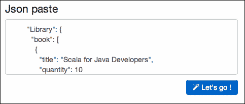
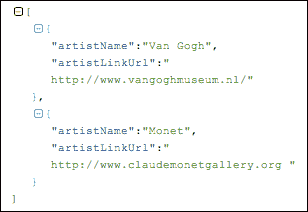
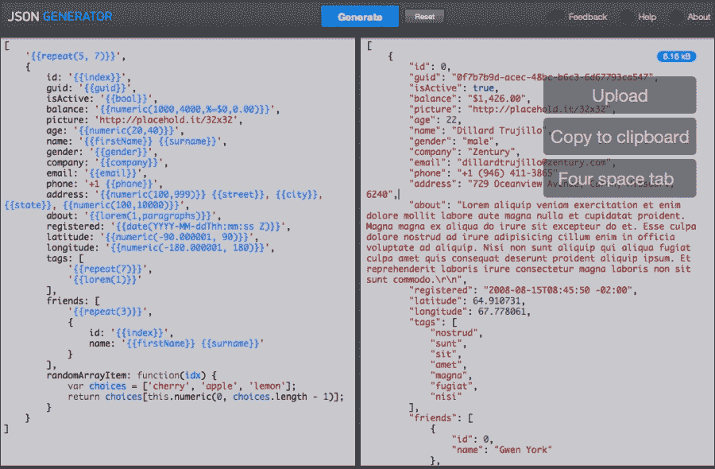
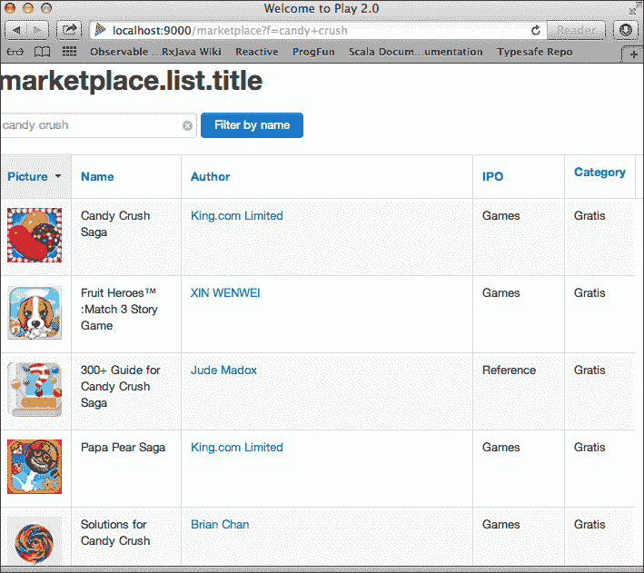

# 第七章. 使用集成和 Web 服务

由于技术堆栈不断演变，在开发商业软件时需要考虑的一个大领域是系统之间的集成。Web 的灵活性和可扩展性使得基于 HTTP 构建的服务以松散耦合的方式集成系统的数量激增。此外，为了能够通过防火墙和额外的安全机制导航到可通过这些机制访问的安全网络，HTTP 模型越来越受欢迎。在本章中，我们将介绍如何在通过 Web 服务或 REST 服务交换消息（如 XML 和 JSON 格式）时涉及 Scala。特别是，我们将考虑通过 Play 框架运行此类服务。

在本章中，我们将介绍以下主题：

+   从 XML 模式生成数据绑定，以及从它们的 WSDL 描述中生成 SOAP Web 服务类

+   在 Scala 和特别是在 Play 框架的上下文中操作 XML 和 JSON

+   从 Play 调用其他 REST Web 服务，并验证和显示其响应

# 在 Scala 中绑定 XML 数据

即使由于 JSON 日益流行，XML 最近从无处不在的位置有所下降，但两种格式都将继续被大量用于结构化数据。

在 Java 中，使用 JAXB 库创建能够序列化和反序列化 XML 数据以及通过 API 构建 XML 文档的类的做法很常见。

以类似的方式，Scala 可用的`scalaxb`库可以生成用于处理 XML 和 Web 服务的帮助类。例如，让我们考虑一个小型的 XML 模式`Bookstore.xsd`，它定义了作为书店一部分的一组书籍，如下所示：

```java
<?xml version="1.0" encoding="UTF-8"?>
<xsd:schema 
            targetNamespace="http://www.books.org"

            elementFormDefault="qualified">
    <xsd:element name="book_store">
        <xsd:complexType>
            <xsd:sequence>
                <xsd:element name="book" type="book_type" 
                             minOccurs="1" maxOccurs="unbounded"/>
            </xsd:sequence>
        </xsd:complexType>
    </xsd:element>
    <xsd:complexType name="book_type">
         <xsd:sequence>
             <xsd:element name="title" type="xsd:string"/>
             <xsd:element name="author" type="xsd:string"/>
             <xsd:element name="date" minOccurs="0" type="xsd:string"/>
             <xsd:element name="publisher" type="xsd:string"/>
         </xsd:sequence>
         <xsd:attribute name="ISBN" type="xsd:string"/>
     </xsd:complexType>
</xsd:schema>
```

一本书通常由其标题、作者、出版日期和 ISBN 号码定义，如下面的示例所示：

```java
<book ISBN="9781933499185">
  <title>Madame Bovary</title>
  <author>Gustave Flaubert</author>
  <date>1857</date>
  <publisher>Fonolibro</publisher>
</book>
```

有几种方式可以在[www.scalaxb.org](http://www.scalaxb.org)网站上运行`scalaxb`，要么直接作为命令行工具，通过 SBT 或 Maven 的插件，或者作为托管在`heroku`上的 Web API。由于我们到目前为止基本上使用了 SBT 并且应该对它感到舒适，让我们使用 SBT 插件来创建绑定。

首先，通过在新终端窗口中运行以下命令创建一个名为`wssample`的新 SBT 项目：

```java
> mkdir wssample
> cd wssample
> sbt
> set name:="wssample"
> session save
> 

```

现在我们需要在`project/`目录下的`plugins.sbt`文件中添加`scalaxb`插件依赖（同时我们还将添加`sbteclipse`插件，它使我们能够从 SBT 项目生成 Eclipse 项目）。生成的`plugins.sbt`文件将类似于以下代码：

```java
addSbtPlugin("com.typesafe.sbteclipse" % "sbteclipse-plugin" % "2.4.0")

addSbtPlugin("org.scalaxb" % "sbt-scalaxb" % "1.1.2")

resolvers += Resolver.sonatypeRepo("public")
```

此外，我们还需要稍微修改`build.sbt`文件，以特别包括一个在用 SBT 编译时将生成`scalaxb` XML 绑定的命令。生成的`build.sbt`文件将类似于以下代码：

```java
import ScalaxbKeys._

name:="wssample"

scalaVersion:="2.10.2"

scalaxbSettings

libraryDependencies += "net.databinder.dispatch" %% "dispatch-core" % "0.11.0"

libraryDependencies += "org.scalatest" %% "scalatest" % "2.0.M7" % "test"

sourceGenerators in Compile <+= scalaxb in Compile

packageName in scalaxb in Compile := "se.wssample"
```

将之前显示的 `Bookstore.xsd` 架构添加到在项目中创建的新 `src/main/xsd` 目录中。从现在起，每次你调用 SBT 命令 `> compile`，`scalaxb` 都将在 `target/scala-2.10/src_managed` 目录下生成一些 Scala 类（在 `build.sbt` 文件中指定的包中，即 `se.wssample`），除非没有进行更改。例如，在我们的小型示例中，`scalaxb` 生成以下案例类：

```java
package se.wssample

case class Book_store(book: se.wssample.Book_type*)

case class Book_type(title: String,
  author: String,
  date: Option[String] = None,
  publisher: String,
  ISBN: Option[String] = None)
```

注意第一个案例类声明末尾的 `*`，它用于指定可变参数（即不确定数量的参数，因此这里的 `Book_store` 构造函数可以接受多个 `Book_type` 实例）。一个展示如何使用生成的代码解析 XML 文档的测试类示例在 `BookstoreSpec.scala` 类中如下所示：

```java
package se.wssample

import org.scalatest._
import org.scalatest.matchers.Matchers

class BookstoreSpec extends FlatSpec with Matchers {
  "This bookstore" should "contain 3 books" in {

    val bookstore =
    <book_store >
        <book ISBN="9781933499185">
            <title>Madame Bovary</title>
            <author>Gustave Flaubert</author>
            <date>1857</date>
            <publisher>Fonolibro</publisher>
        </book>
        <book ISBN="9782070411207">
            <title>Le malade imaginaire</title>
            <author>Moliere</author>
            <date>1673</date>
            <publisher>Gallimard</publisher>
        </book>
        <book ISBN="1475066511">
            <title>Fables</title>
            <author>Jean de La Fontaine</author>
            <date>1678</date>
            <publisher>CreateSpace</publisher>
        </book>
    </book_store>

    val bookstoreInstance = scalaxb.fromXMLBook_store

    println("bookstoreInstance: "+ bookstoreInstance.book)

    bookstoreInstance.book.length should be === 3
  }
}
```

当调用 `> sbt test` 命令时，此测试的预期输出如下：

```java
bookstoreInstance: List(Book_type(Madame Bovary,Gustave Flaubert,Some(1857),Fonolibro,Some(9781933499185)), Book_type(Le malade imaginaire,Molière,Some(1673),Gallimard,Some(9782070411207)), Book_type(Fables,Jean de La Fontaine,Some(1678),CreateSpace,Some(1475066511)))
[info] BookstoreSpec:
[info] This bookstore
[info] - should contain 3 books
[info] Passed: : Total 1, Failed 0, Errors 0, Passed 1, Skipped 0
[success] Total time: 4 s

```

## 从 SOAP Web 服务运行 scalaxb

由于 `scalaxb` 支持 **Web 服务描述语言**（**WSDL**），我们还可以生成完整的 Web 服务 API，而不仅仅是与 XML 数据相关的类。为了实现此功能，我们只需将我们的 WSDL 服务描述文件复制到 `src/main/wsdl`。所有具有 `.wsdl` 扩展名的文件将在编译时由 `scalaxb` 插件处理，它将创建以下三种类型的输出：

+   专门针对你应用程序的服务 API。

+   专门针对 SOAP 协议的类。

+   负责通过 HTTP 将 SOAP 消息发送到端点 URL 的类。`scalaxb` 使用我们在 第三章 中介绍的调度库，即 *理解 Scala 生态系统*。这就是为什么我们将它添加到 `build.sbt` 文件中的依赖项中。

让我们以一个在线 SOAP Web 服务为例，来说明如何从 WSDL 描述中使用 `scalaxb`。[www.webservicex.net](http://www.webservicex.net) 是一个包含各种市场细分中许多不同此类 Web 服务样本的网站。在这里，我们将关注他们的股票报价服务，该服务返回由股票符号给出的报价。API 非常简单，因为它只包含一个请求方法，`getQuote`，并且返回的数据量有限。你可能想尝试任何其他可用的服务（稍后，因为你可以将多个 WSDL 文件放在同一个项目中）。它的 WSDL 描述看起来类似于以下代码：

```java
<?xml version="1.0" encoding="utf-8"?>
<wsdl:definitions … // headers > 
  <wsdl:types>
    <s:schema elementFormDefault="qualified" targetNamespace="http://www.webserviceX.NET/">
      <s:element name="GetQuote">
        <s:complexType>
          <s:sequence>
            <s:element minOccurs="0" maxOccurs="1" name="symbol" type="s:string" />
          </s:sequence>
        </s:complexType>
      </s:element>
      <s:element name="GetQuoteResponse">
        <s:complexType>
          <s:sequence>
            <s:element minOccurs="0" maxOccurs="1" name="GetQuoteResult" type="s:string" />
          </s:sequence>
        </s:complexType>
      </s:element>
      <s:element name="string" nillable="true" type="s:string" />
    </s:schema>
  </wsdl:types>
  <wsdl:message name="GetQuoteSoapIn">
    <wsdl:part name="parameters" element="tns:GetQuote" />
  </wsdl:message>
  <wsdl:message name="GetQuoteSoapOut">
    <wsdl:part name="parameters" element="tns:GetQuoteResponse" />
  </wsdl:message>
  ...
```

WSDL 文件的第一部分包含 XML 模式的描述。第二部分定义了各种 Web 服务操作如下：

```java
  <wsdl:portType name="StockQuoteSoap">
    <wsdl:operation name="GetQuote">
      <wsdl:documentation >Get Stock quote for a company Symbol</wsdl:documentation>
      <wsdl:input message="tns:GetQuoteSoapIn" />
      <wsdl:output message="tns:GetQuoteSoapOut" />
    </wsdl:operation>
  </wsdl:portType>
  <wsdl:portType name="StockQuoteHttpGet">
    <wsdl:operation name="GetQuote">
      <wsdl:documentation >Get Stock quote for a company Symbol</wsdl:documentation>
      <wsdl:input message="tns:GetQuoteHttpGetIn" />
      <wsdl:output message="tns:GetQuoteHttpGetOut" />
    </wsdl:operation>
  </wsdl:portType>

  <wsdl:binding name="StockQuoteSoap12" type="tns:StockQuoteSoap">
    <soap12:binding transport="http://schemas.xmlsoap.org/soap/http" />
    <wsdl:operation name="GetQuote">
      <soap12:operation soapAction="http://www.webserviceX.NET/GetQuote" style="document" />
      <wsdl:input>
        <soap12:body use="literal" />
      </wsdl:input>
      <wsdl:output>
        <soap12:body use="literal" />
      </wsdl:output>
    </wsdl:operation>
  </wsdl:binding>
  ...
```

最后，WSDL 文件的最后一部分定义了 Web 服务操作与物理 URL 之间的耦合：

```java
  <wsdl:service name="StockQuote">
    …
    <wsdl:port name="StockQuoteSoap12" binding="tns:StockQuoteSoap12">
      <soap12:address location="http://www.webservicex.net/stockquote.asmx" />
    </wsdl:port>
    …
  </wsdl:service>
</wsdl:definitions>
```

如你所见，WSDL 文件通常相当冗长，但由 `scalaxb` 生成的结果 Scala 合约简化为以下一个方法特质：

```java
// Generated by <a href="http://scalaxb.org/">scalaxb</a>.
package se.wssample

trait StockQuoteSoap {
  def getQuote(symbol: Option[String]): Either[scalaxb.Fault[Any], se.wssample.GetQuoteResponse]
}
```

注意结果类型是如何优雅地封装在`Either`类中的，该类代表两种可能类型之一`Left`和`Right`的值，其中`Right`对象对应于服务的成功调用，而`Left`对象在失败情况下包含`scalaxb.Fault`值，正如我们在第二章，*代码集成*中简要描述的那样。

由于与 SOAP 协议相关的生成类以及与 HTTP 调度相关的类并不特定于我们正在定义的服务，因此它们可以被重用，因此它们已经被生成为可堆叠的特性，包括数据类型和接口、SOAP 绑定和完整的 SOAP 客户端。以下`StockQuoteSpec.scala`测试示例给出了这些特性的典型使用场景，以调用 SOAP 网络服务：

```java
package se.wssample

import org.scalatest._
import org.scalatest.matchers.Matchers
import scala.xml.{ XML, PrettyPrinter }

class StockQuoteSpec extends FlatSpec with Matchers {
  "Getting a quote for Apple" should "give appropriate data" in {

    val pp = new PrettyPrinter(80, 2)

    val service = 
      (new se.wssample.StockQuoteSoap12Bindings 
        with scalaxb.SoapClients 
        with scalaxb.DispatchHttpClients {}).service

    val stockquote = service.getQuote(Some("AAPL"))

    stockquote match {
      case Left(err) => fail("Problem with stockquote invocation")
      case Right(success) => success.GetQuoteResult match {
        case None => println("No info returned for that quote")
        case Some(x) => {
          println("Stockquote: "+pp.format(XML.loadString(x)))
          x should startWith ("<StockQuotes><Stock><Symbol>AAPL</Symbol>")
        }
      }
    }
  }
}
```

在这个例子中，一旦我们实例化了服务，我们只需调用 API 方法`service.getQuote(Some("AAPL"))`来检索 AAPL 符号（苹果公司）的股票报价。然后我们对结果进行模式匹配，从服务返回的`Either`对象中提取 XML 数据。最后，由于检索到的数据是以 XML 字符串的形式给出的，我们解析它并格式化它以便更好地阅读。我们可以使用以下代码执行测试以查看结果：

```java
> sbt
> test-only se.wssample.StockQuoteSpec
Stockquote: <StockQuotes>
 <Stock>
 <Symbol>AAPL</Symbol>
 <Last>553.13</Last>
 <Date>1/2/2014</Date>
 <Time>4:00pm</Time>
 <Change>-7.89</Change>
 <Open>555.68</Open>
 <High>557.03</High>
 <Low>552.021</Low>
 <Volume>8388321</Volume>
 <MktCap>497.7B</MktCap>
 <PreviousClose>561.02</PreviousClose>
 <PercentageChange>-1.41%</PercentageChange>
 <AnnRange>385.10 - 575.14</AnnRange>
 <Earns>39.75</Earns>
 <P-E>14.11</P-E>
 <Name>Apple Inc.</Name>
 </Stock>
</StockQuotes>
[info] StockQuoteSpec:
[info] Getting a quote for Apple
[info] - should give appropriate data
[info] Passed: : Total 1, Failed 0, Errors 0, Passed 1, Skipped 0
[success] Total time: 3 s

```

# 处理 XML 和 JSON

XML 和 JSON 是结构化可以在系统部分之间交换的数据的占主导地位的格式，例如后端-前端或外部系统之间。在 Scala 中，Scala 库中提供了一些内置支持来操作这两种格式。

## 操作 XML

在本章以及第三章，*理解 Scala 生态系统*中，我们之前也简要地看到了，当使用 HTTP 时，XML 文档可以作为字面量创建，并以多种方式转换。例如，如果我们从 Play 项目根目录中键入`> play console`来启动 REPL，我们就可以开始对 XML 进行实验：

```java
scala> val books =
 <Library>
 <book title="Programming in Scala" quantity="15" price="30.00" />
 <book title="Scala for Java Developers" quantity="10" price="25.50" />
 </Library>
books: scala.xml.Elem = 
<Library>
 <book title="Programming in Scala" quantity="15" price="30.00"/>
 <book title="Scala for Java Developers" quantity="10" price="25.50"/>
</Library>

```

`books`变量是`Elem`类型，它代表一个 XML 结构。我们不仅可以直接编写 XML 字面量，还可以使用实用方法通过解析文件或解析字符串来构建 XML `Elem`，如下所示：

```java
scala> import scala.xml._
scala> val sameBooks = XML.loadString("""
 <Library>
 <book title="Programming in Scala" quantity="15" price="30.00"/>
 <book title="Scala for Java Developers" quantity="10" price="25.50"/>
 </Library>
 """)
sameBooks: scala.xml.Elem = 
<Library>
<book price="30.00" quantity="15" title="Programming in Scala"/>
<book price="25.50" quantity="10" title="Scala for Java Developers"/>
</Library>

```

在前面的命令中使用的三引号允许我们表达一个预格式化的字符串，其中字符被转义（例如，正则字符串中的`"`将被记为`\"`）。

例如，处理这样的 XML 结构可能包括计算书籍的总价。这个操作可以通过 Scala 的`for comprehension`实现，以下代码展示了如何实现：

```java
scala> val total = (for {
 book <- books \ "book"
 price = ( book \ "@price").text.toDouble
 quantity = ( book \ "@quantity").text.toInt
 } yield price * quantity).sum
total: Double = 705.0

```

在处理与各种外部系统的集成时，检索和转换 XML 结构是经常发生的事情。通过 XPath 表达式访问我们之前所做的那样访问各种 XML 标签非常方便，并产生简洁且可读的代码。从 Excel 以 CSV 数据形式导出的信息程序化地创建 XML 也是一个常见的操作，可以按以下方式实现：

```java
scala> val books = 
 <Library>
 { List("Programming in Scala,15,30.00","Scala for Java Developers,10,25.50") map { row => row split "," } map { b => <book title={b(0)} quantity={b(1)} price={b(2)} /> }}
 </Library>
books: scala.xml.Elem = 
<Library>
 <book title="Programming in Scala" quantity="15" price="30.00"/><book title="Scala for Java Developers" quantity="10" price="25.50"/>
</Library>

```

## 操作 JSON

Scala 库支持 JSON，你只需要导入适当的库。以下是一些 REPL 用法的示例：

```java
scala> import scala.util.parsing.json._
import scala.util.parsing.json._
scala> val result = JSON.parseFull("""
 {
 "Library": {
 "book": [
 {
 "title": "Scala for Java Developers",
 "quantity": 10
 },
 {
 "title": "Programming Scala",
 "quantity": 20
 }
 ]
 }
 }
 """)
result: Option[Any] = Some(Map(Library -> Map(book -> List(Map(title -> Scala for Java Developers, quantity -> 10.0), Map(title -> Programming Scala, quantity -> 20.0)))))

```

任何有效的 JSON 消息都可以转换成由 `Maps` 和 `Lists` 构成的结构。然而，通常我们希望创建有意义的类，即从 JSON 消息中表达业务领域。可在 [`json2caseclass.cleverapps.io`](http://json2caseclass.cleverapps.io) 提供的在线服务正好做到这一点；它是一个方便的 JSON 到 Scala case class 转换器。例如，我们可以将我们前面的 JSON 消息复制到 **Json 粘贴** 文本区域，然后点击 **Let's go!** 按钮来尝试它，如下面的截图所示：



转换器产生以下输出：

```java
case class Book(title:String, quantity:Double)
case class Library(book:List[Book])
case class R00tJsonObject(Library:Library)

```

在我们已经在 第一章 中介绍过的 case classes 的非常有趣的功能中，*在项目中交互式编程* 是一个用于模式匹配的分解机制。一旦 JSON 消息被反序列化为 case classes，我们就可以使用这个机制来操作它们，如下面的命令序列所示：

```java
scala> case class Book(title:String, quantity:Double)
defined class Book
scala> val book1 = Book("Scala for Java Developers",10)
book1: Book = Book(Scala for Java Developers,10.0)
scala> val book2 = Book("Effective Java",12)
book2: Book = Book(Effective Java,12.0)
scala> val books = List(book1,book2)
books: List[Book] = List(Book(Scala for Java Developers,10.0), Book(Effective Java,12.0))

```

首先，我们定义了两个书籍实例并将它们放入一个列表中。

```java
scala> def bookAboutScala(book:Book) = book match {
 case Book(a,_) if a contains "Scala" => Some(book)
 case _ => None
 }
bookAboutScala: (book: Book)Option[Book]

```

之前定义的方法在 `Book` 构造函数上执行模式匹配，该构造函数还包含一个守卫（即 `if` 条件）。由于我们不使用第二个构造函数参数，所以我们用一个下划线代替了创建匿名变量。在之前定义的两个书籍实例上调用此方法将显示以下结果：

```java
scala> bookAboutScala(book1)
res0: Option[Book] = Some(Book(Scala for Java Developers,10.0))
scala> bookAboutScala(book2)
res1: Option[Book] = None

```

我们可以将 case class 模式匹配与其他模式混合使用。例如，让我们定义以下正则表达式（注意三引号的使用以及使用 `.r` 来指定它是一个正则表达式）：

```java
scala> val regex = """(.*)(Scala|Java)(.*)""".r
regex: scala.util.matching.Regex = (.*)(Scala|Java)(.*)

```

此正则表达式将匹配包含 Scala 或 Java 的任何字符串。

```java
scala> def whatIs(that:Any) = that match {
 case Book(t,_) if (t contains "Scala") =>
 s"${t} is a book about Scala"
 case Book(_,_) => s"$that is a book "
 case regex(_,word,_) => s"$that is something about ${word}"
 case head::tail => s"$that is a list of books"
 case _ => "You tell me !"
 }
whatIs: (that: Any)String

```

我们现在可以在多个不同的输入上尝试这个方法并观察结果：

```java
scala> whatIs(book1)
res2: String = Scala for Java Developers is a book about Scala
scala> whatIs(book2)
res3: String = "Book(Effective Java,12.0) is a book "
scala> whatIs(books)
res4: String = List(Book(Scala for Java Developers,10.0), Book(Effective Java,12.0)) is a list of books
scala> whatIs("Scala pattern matching")
res5: String = Scala pattern matching is something about Scala
scala> whatIs("Love")
res6: String = You tell me !

```

## 使用 Play JSON

除了 Scala 库的默认实现之外，还有许多其他库可以用来操作 JSON。除了建立在已知 Java 库（如 Jerkson，建立在 Jackson 之上）和其他已知实现（如 sjson、json4s 或 Argonaut，面向函数式编程）之上的库之外，许多 Web 框架也创建了它们自己的，包括 lift-json、spray-json 或 play-json。由于在这本书中我们主要介绍 Play 框架来构建 Web 应用程序，我们将重点关注 play-json 实现。请注意，play-json 也可以作为独立程序运行，因为它只包含一个 jar 文件，没有其他对 Play 的依赖。从 Play 项目内部运行 REPL 控制台已经包含了 play-json 依赖项，因此我们可以在控制台终端窗口中直接进行实验。

### 注意

如果你想在一个不同于 Play 控制台（例如，一个常规的 SBT 项目或 Typesafe activator 项目）的 REPL 中运行以下示例，那么你将不得不将以下依赖项添加到你的 `build.sbt` 文件中：

```java
libraryDependencies += "com.typesafe.play" %% "play-json" % "2.2.1"

```

```java
scala> import play.api.libs.json._
import play.api.libs.json._ 
scala> val books = Json.parse("""
 {
 "Library": {
 "book": [
 {
 "title": "Scala for Java Developers",
 "quantity": 10
 },
 {
 "title": "Programming Scala",
 "quantity": 20
 }
 ]
 }
 }
 """)
books: play.api.libs.json.JsValue = {"Library":{"book":[{"title":"Scala for Java Developers","quantity":10},{"title":"Programming Scala","quantity":20}]}}

```

`JsValue` 类型是 play-json 中包含的其他 JSON 数据类型的超类型，如下所示：

+   使用 `JsNull` 来表示 null 值

+   `JsString`、`JsBoolean` 和 `JsNumber` 分别用来描述字符串、布尔值和数字：数字包括 short、int、long、float、double 和 BigDecimal，如以下命令所示：

    ```java
    scala> val sfjd = JsString("Scala for Java Developers")
    sfjd: play.api.libs.json.JsString = "Scala for Java Developers"
    scala> val qty = JsNumber(10)
    qty: play.api.libs.json.JsNumber = 10

    ```

+   `JsObject` 表示一组名称/值对，如下所示：

    ```java
    scala> val book1 = JsObject(Seq("title"->sfjd,"quantity"->qty))
    book1: play.api.libs.json.JsObject = {"title":"Scala for Java Developers","quantity":10}
    scala> val book2 = JsObject(Seq("title"->JsString("Programming in Scala"),"quantity"->JsNumber(15)))
    book2: play.api.libs.json.JsObject = {"title":"Programming in Scala","quantity":15}

    ```

+   `JsArray` 表示任何 JSON 值类型的序列（可以是异构的，即不同类型）：

    ```java
    scala> val array = 
     JsArray(Seq(JsString("a"),JsNumber(2),JsBoolean(true)))
    array: play.api.libs.json.JsArray = ["a",2,true]

    ```

从程序上讲，创建一个与我们的书籍列表等价的 JSON **抽象** **语法树**（**AST**）可以表达如下：

```java
scala> val books = JsObject(Seq(
 "books" -> JsArray(Seq(book1,book2))
 ))
books: play.api.libs.json.JsObject = {"books":[{"title":"Scala for Java Developers","quantity":10},{"title":"Programming in Scala","quantity":15}]}

```

Play 最近增强以在创建我们刚刚描述的 JSON 结构时提供稍微简单的语法。构建相同 JSON 对象的替代语法如下所示：

```java
scala> val booksAsJson = Json.obj(
 "books" -> Json.arr(
 Json.obj(
 "title" -> "Scala for Java Developers",
 "quantity" -> 10 
 ),
 Json.obj(
 "title" -> "Programming in Scala",
 "quantity" -> 15 
 )
 )
 )
booksAsJson: play.api.libs.json.JsObject = {"books":[{"title":"Scala for Java Developers","quantity":10},{"title":"Programming in Scala","quantity":15}]}

```

将 JsObject 序列化为其字符串表示形式可以通过以下语句实现：

```java
scala> val booksAsString = Json.stringify(booksAsJson)
booksAsString: String = {"books":[{"title":"Scala for Java Developers","quantity":10},{"title":"Programming in Scala","quantity":15}]}

```

最后，由于 `JsObject` 对象代表一个树结构，你可以通过使用 XPath 表达式在树中导航，以检索各种元素，例如以下示例用于访问我们书籍的标题：

```java
scala> val titles = booksAsJson \ "books" \\ "title"
titles: Seq[play.api.libs.json.JsValue] = ArrayBuffer("Scala for Java Developers", "Programming in Scala")

```

由于返回类型是 `JsValue` 对象的序列，将它们转换为 Scala 类型可能很有用，`.as[…]` 方法将方便地实现这一点：

```java
scala> titles.toList.map(x=>x.as[String])
res8: List[String] = List(Scala for Java Developers, Programming in Scala)

```

# 使用 XML 和 JSON 处理 Play 请求

现在我们已经熟悉了 JSON 和 XML 格式，我们可以开始使用它们来处理 Play 项目中的 HTTP 请求和响应。

为了展示这些行为，我们将调用一个在线网络服务，即 iTunes 媒体库，它可在 [`www.apple.com/itunes/affiliates/resources/documentation/itunes-store-web-service-search-api.html`](http://www.apple.com/itunes/affiliates/resources/documentation/itunes-store-web-service-search-api.html) 获取并得到文档说明。

它在搜索调用时返回 JSON 消息。例如，我们可以使用以下 URL 和参数调用 API：

[`itunes.apple.com/search?term=angry+birds&country=se&entity=software`](https://itunes.apple.com/search?term=angry+birds&country=se&entity=software)

参数过滤器会过滤掉与 *愤怒的小鸟* 有关的图书馆中的每一项，而实体参数仅保留软件项。我们还应用了一个额外的过滤器，以查询仅限于瑞典的应用商店。

### 注意

如果你还没有在 `build.sbt` 文件中添加，你可能需要在此处添加 dispatch 依赖项，就像我们在第三章“理解 Scala 生态系统”中处理 HTTP 时所做的那样：

```java
libraryDependencies += "net.databinder.dispatch" %% "dispatch-core" % "0.11.0"

```

```java
scala> import dispatch._
import dispatch._
scala> import Defaults._
import Defaults._
scala> val request = url("https://itunes.apple.com/search")
request: dispatch.Req = Req(<function1>)

```

我们 GET 方法调用中将包含的参数可以用 Scala `Map` 中的 `(key,value)` 元组来表示：

```java
scala> val params = Map("term" -> "angry birds", "country" -> "se", "entity" -> "software")
params: scala.collection.immutable.Map[String,String] = Map(term -> angry birds, country -> se, entity -> software)
scala> val result = Http( request <<? params OK as.String).either
result: dispatch.Future[Either[Throwable,String]] = scala.concurrent.impl.Promise$DefaultPromise@7a707f7c

```

在这种情况下，结果类型是 `Future[Either[Throwable,String]]`，这意味着我们可以通过模式匹配提取成功的调用以及失败的执行，如下所示：

```java
scala> val response = result() match {
 case Right(content)=> "Answer: "+ content
 case Left(StatusCode(404))=> "404 Not Found"
 case Left(x) => x.printStackTrace()
 }
response: Any = 
"Answer: 

{
 "resultCount":50,
 "results": [
{"kind":"software", "features":["gameCenter"], 
"supportedDevices":["iPhone5s", "iPad23G", "iPadThirdGen", "iPodTouchThirdGen", "iPadFourthGen4G", "iPhone4S", "iPad3G", "iPhone5", "iPadWifi", "iPhone5c", "iPad2Wifi", "iPadMini", "iPadThirdGen4G", "iPodTouchourthGen", "iPhone4", "iPadFourthGen", "iPhone-3GS", "iPodTouchFifthGen", "iPadMini4G"], "isGameCenterEnabled":true, "artistViewUrl":"https://itunes.apple.com/se/artist/rovio-entertainment-ltd/id298910979?uo=4", "artworkUrl60":"http://a336.phobos.apple.com/us/r30/Purple2/v4/6c/20/98/6c2098f0-f572-46bb-f7bd-e4528fe31db8/Icon.png", 
"screenshotUrls":["http://a2.mzstatic.com/eu/r30/Purple/v4/c0/eb/59/c0eb597b-a3d6-c9af-32a7-f107994a595c/screen1136x1136.jpeg", "http://a4.mzst... 

```

## 使用 JSON 模拟 Play 响应

当你需要将你的服务与你不拥有或直到在生产环境中部署它们才可用的外部系统集成时，测试发送和接收的消息交互可能会很麻烦。避免调用真实服务的一个有效方法是使用模拟消息来替换它，即硬编码的响应，这将缩短真实的交互，特别是如果你需要将测试作为自动化过程的一部分运行（例如，作为 Jenkins 作业的每日运行）。从 Play 控制器内部返回一个简单的 JSON 消息非常直接，如下例所示：

```java
package controllers

import play.api.mvc._
import play.api.libs.json._
import views._

object MockMarketplaceController extends Controller {

  case class AppStoreSearch(artistName: String, artistLinkUrl: String)
  implicit val appStoreSearchFormat = Json.format[AppStoreSearch]

  def mockSearch() = Action {
    val result = List(AppStoreSearch("Van Gogh", " http://www.vangoghmuseum.nl/"), AppStoreSearch("Monet", " http://www.claudemonetgallery.org "))
    Ok(Json.toJson(result))
  }
}
```

涉及 Reads、Writes 和 Format 的 `Json.format[. . .]` 声明将在我们调用网络服务时在本节稍后解释，因此我们可以暂时跳过讨论这部分内容。

要尝试这个控制器，你可以创建一个新的 Play 项目，或者，就像我们在上一章第六章的最后一节“数据库访问和 ORM 的未来”中所做的那样，只需将此控制器添加到我们从现有数据库生成的应用程序中。你还需要在 `conf/` 目录下的 `route` 文件中添加一个路由，如下所示：

```java
GET /mocksearch  controllers.MockMarketplaceController.mockSearch
```

一旦应用程序运行，在浏览器中访问 `http://localhost:9000/mocksearch` URL 将返回以下模拟 JSON 消息：



另一种方便的方法是使用在线服务来获取一个 JSON 测试消息，你可以用它来模拟响应，该服务位于 [`json-generator.appspot.com`](http://json-generator.appspot.com)。它包含一个 JSON 生成器，我们可以通过简单地点击 **生成** 按钮直接使用它。默认情况下，它将在浏览器窗口右侧的面板中生成一个包含随机数据的 JSON 示例，但遵循左侧面板中定义的结构，如下面的截图所示：



你可以点击 **复制到** **剪贴板** 按钮并将生成的模拟消息直接粘贴到 Play 控制器的响应中。

## 从 Play 调用 Web 服务

在上一节中，为了快速实验 App Store 搜索 API，我们使用了 `dispatch` 库；我们已经在 第三章 中介绍了这个库，*理解 Scala 生态系统*。Play 提供了自己的 HTTP 库，以便与其他在线 Web 服务交互。它也是在 Java `AsyncHttpClient` 库([`github.com/AsyncHttpClient/async-http-client`](https://github.com/AsyncHttpClient/async-http-client))之上构建的，就像 `dispatch` 一样。

在我们深入到从 Play 控制器调用 REST Web 服务之前，让我们先在 REPL 中对 Play Web 服务进行一点实验。在一个终端窗口中，要么创建一个新的 Play 项目，要么进入我们之前章节中使用的项目的根目录。一旦输入了 `> play console` 命令后获得 Scala 提示符，输入以下命令：

```java
scala> import play.api.libs.ws._
import play.api.libs.ws._
scala> import scala.concurrent.Future
import scala.concurrent.Future

```

由于我们将异步调用 Web 服务，我们需要一个执行上下文来处理 `Future` 临时占位符：

```java
scala> implicit val context = scala.concurrent.ExecutionContext.Implicits.global
context: scala.concurrent.ExecutionContextExecutor = scala.concurrent.impl.ExecutionContextImpl@44d8bd53

```

现在，我们可以定义一个需要调用的服务 URL。这里，我们将使用一个简单的 Web 服务，该服务根据以下签名返回作为参数的网站的地理位置：

```java
http://freegeoip.net/{format}/{site}
```

格式参数可以是 `json` 或 `xml`，而 `site` 将是对网站的引用：

```java
scala> val url = "http://freegeoip.net/json/www.google.com"
url: String = http://freegeoip.net/json/www.google.com
scala> val futureResult: Future[String] = WS.url(url).get().map {
 response =>
 (response.json \ "region_name").as[String]
 }
futureResult: scala.concurrent.Future[String] = scala.concurrent.impl.Promise$DefaultPromise@e4bc0ba
scala> futureResult.onComplete(println)
Success(California)

```

如我们之前在 第三章 中所见，*理解 Scala 生态系统*，当使用 `dispatch` 库时，`Future` 是一个包含异步计算结果的占位符，并且可以处于两种状态之一，即 `完成` 或 `未完成`。这里，我们希望在结果可用时打印结果。

我们只从响应中提取了 `region_name` 项；整个 JSON 文档如下：

```java
{
    "ip":"173.194.64.106",
    "country_code":"US",
    "country_name":"United States",
    "region_code":"CA",
    "region_name":"California",
    "city":"Mountain View",
    "zipcode":"94043",
    "latitude":37.4192,
    "longitude":-122.0574,
    "metro_code":"807",
    "areacode":"650"
}
```

如果我们想封装响应的一部分，可以通过创建一个 `case` 类来实现，如下所示：

```java
scala> case class Location(latitude:Double, longitude:Double, region:String, country:String)
defined class Location

```

`play-json`库包括基于`JsPath`的`Reads`/`Writes`/`Format`组合器的支持，以便可以在运行时进行验证。如果您对使用这些组合器的所有细节感兴趣，您可能想阅读以下博客：[`mandubian.com/2012/09/08/unveiling-play-2-dot-1-json-api-part1-jspath-reads-combinators/`](http://mandubian.com/2012/09/08/unveiling-play-2-dot-1-json-api-part1-jspath-reads-combinators/)。

```java
scala> import play.api.libs.json._
import play.api.libs.json._
scala> import play.api.libs.functional.syntax._
import play.api.libs.functional.syntax._
scala> implicit val locationReads: Reads[Location] = (
 (__ \ "latitude").read[Double] and
 (__ \ "longitude").read[Double] and
 (__ \ "region_name").read[String] and
 (__ \ "country").read[String]
 )(Location.apply _)
locationReads: play.api.libs.json.Reads[Location] = play.api.libs.json.Reads$$anon$8@4a13875b
locationReads: play.api.libs.json.Reads[Location] = play.api.libs.json.Reads$$anon$8@5430c881

```

现在，在 JSON 响应上调用验证方法将验证我们接收到的数据是否格式正确且具有可接受值。

```java
scala> val futureResult: Future[JsResult[Location]] = WS.url(url).get().map {
 response => response.json.validate[Location]
 }
futureResult: scala.concurrent.Future[play.api.libs.json.JsResult[Location]] = scala.concurrent.impl.Promise$DefaultPromise@3168c842

scala> futureResult.onComplete(println)
Success(JsError(List((/country,List(ValidationError(error.path.missing,WrappedArray()))))))

```

之前的`JsError`对象展示了验证失败的情况；它检测到响应中未找到`country`元素。实际上，正确的拼写应该是`country_name`而不是`country`，我们可以在`locationReads`声明中更正这一点。这次验证通过了，我们得到的是我们期望的包含纬度和经度信息的`JsSuccess`对象：

```java
scala> implicit val locationReads: Reads[Location] = (
 (__ \ "latitude").read[Double] and
 (__ \ "longitude").read[Double] and
 (__ \ "region_name").read[String] and
 (__ \ "country_name").read[String]
 )(Location.apply _)
locationReads: play.api.libs.json.Reads[Location] = play.api.libs.json.Reads$$anon$8@70aab9ed
scala> val futureResult: Future[JsResult[Location]] = WS.url(url).get().map {
 response => response.json.validate[Location]
 }
futureResult: scala.concurrent.Future[play.api.libs.json.JsResult[Location]] = scala.concurrent.impl.Promise$DefaultPromise@361c5860
scala> futureResult.onComplete(println)
scala> Success(JsSuccess(Location(37.4192,-122.0574,California,United States),))

```

现在，让我们创建一个示例控制器，该控制器调用网络服务从 App Store 检索一些数据：

```java
package controllers

import play.api._
import play.api.mvc._
import play.api.libs.ws.WS
import scala.concurrent.ExecutionContext.Implicits.global
import play.api.libs.json._
import play.api.libs.functional.syntax._
import scala.concurrent.Future
import views._
import models._

object MarketplaceController extends Controller {

  val pageSize = 10
  val appStoreUrl = "https://itunes.apple.com/search"

  def list(page: Int, orderBy: Int, filter: String = "*") = Action.async { implicit request =>
    val futureWSResponse =
      WS.url(appStoreUrl)
        .withQueryString("term" -> filter, "country" -> "se", "entity" -> "software")
        .get()

      futureWSResponse map { resp =>
        val json = resp.json
        val jsResult = json.validate[AppResult]
        jsResult.map {
          case AppResult(count, res) =>
            Ok(html.marketplace.list(
              Page(res,
                page,
                offset = pageSize * page,
                count),
              orderBy,
              filter))
        }.recoverTotal {
          e => BadRequest("Detected error:" + JsError.toFlatJson(e))
        }
      } 
  }
}
```

在这里，通过在`WS`类上调用方法来展示对网络服务的调用，首先调用`url`方法给出 URL，然后调用`withQueryString`方法，输入参数以`key->value`对的序列给出。请注意，返回类型是`Future`，这意味着我们的网络服务是异步的。`recoverTotal`接受一个函数，在处理错误后会返回默认值。`json.validate[AppResult]`这一行使 JSON 响应与这里指定的`AppResult`对象进行验证（作为`app/models/`文件夹中`Marketplace.scala`文件的一部分）：

```java
package models

import play.api.libs.json._
import play.api.libs.functional.syntax._

case class AppInfo(id: Long, name: String, author: String, authorUrl:String,
    category: String, picture: String, formattedPrice: String, price: Double)
object AppInfo {
  implicit val appInfoFormat = (
    (__ \ "trackId").format[Long] and
    (__ \ "trackName").format[String] and
    (__ \ "artistName").format[String] and
    (__ \ "artistViewUrl").format[String] and
    (__ \ "primaryGenreName").format[String] and
    (__ \ "artworkUrl60").format[String] and
    (__ \ "formattedPrice").format[String] and
    (__ \ "price").format[Double])(AppInfo.apply, unlift(AppInfo.unapply))
}

case class AppResult(resultCount: Int, results: Array[AppInfo])
object AppResult {
  implicit val appResultFormat = (
    (__ \ "resultCount").format[Int] and
    (__ \\ "results").format[Array[AppInfo]])(AppResult.apply, unlift(AppResult.unapply))
}
```

`AppResult`和`AppInfo`案例类被创建出来，用于封装我们关心的服务元素。正如您在首次尝试 API 时可能看到的，大多数对 App Store 的搜索查询都会返回大量元素，其中大部分我们可能不需要。这就是为什么，我们可以使用一些 Scala 语法糖和组合器，在运行时验证 JSON 响应并直接提取感兴趣的元素。在尝试这个网络服务调用之前，我们只需要在`conf/`目录下的`routes`文件中添加所需的路由，如下面的代码所示：

```java
GET /marketplace  controllers.MarketplaceController.list(p:Int ?= 0, s:Int ?= 2, f ?= "*")
```

最后，在通过网络浏览器启动应用程序之前，我们还需要在`MarketplaceController.scala`文件中提到的示例视图，该视图在`views/marketplace/`目录下的`list.scala.html`文件中创建，并在几个部分中展示如下代码：

```java
@(currentPage: Page[AppInfo], currentOrderBy: Int, currentFilter:
String)(implicit flash: play.api.mvc.Flash)
...
@main("Welcome to Play 2.0") {

<h1>@Messages("marketplace.list.title", currentPage.total)</h1>

@flash.get("success").map { message =>
<div class="alert-message warning">
  <strong>Done!</strong> @message
</div>
}
<div id="actions">

  @helper.form(action=routes.MarketplaceController.list()) { <input
    type="search" id="searchbox" name="f" value="@currentFilter"
    placeholder="Filter by name..."> <input type="submit"
    id="searchsubmit" value="Filter by name" class="btn primary">
  }
</div>
...
```

视图的第一个部分仅包含用于导航的辅助方法，其生成方式与我们在第六章中用于 CRUD 示例生成的相同，即*数据库访问和 ORM 的未来*。视图的第二部分包括我们从网络服务中检索到的 JSON 元素：

```java
...
@Option(currentPage.items).filterNot(_.isEmpty).map { entities =>
<table class="computers zebra-striped">
  <thead>
    <tr>
      @header(2, "Picture") 
      @header(4, "Name") 
      @header(5, "Author")
      @header(6, "IPO")     
      @header(7, "Category") 
      @header(8, "Price")
    </tr>
  </thead>
  <tbody>
    @entities.map{ entity =>
    <tr>
      <td>
        
      </td>
      <td>@entity.name</td>
      <td><a href="@entity.authorUrl" class="new-btn btn-back">@entity.author</a></td>
      <td>@entity.category</td>
      <td>@entity.formattedPrice</td>
    </tr>
    }
  </tbody>
</table>
...
```

视图的第三部分和最后一部分是处理分页：

```java
...
<div id="pagination" class="pagination">
  <ul>
    @currentPage.prev.map { page =>
    <li class="prev"><a href="@link(page)">&larr; Previous</a></li>
    }.getOrElse {
    <li class="prev disabled"><a>&larr; Previous</a></li> }
    <li class="current"><a>Displaying @(currentPage.offset + 1)
        to @(currentPage.offset + entities.size) of @currentPage.total</a></li>
    @currentPage.next.map { page =>
    <li class="next"><a href="@link(page)">Next &rarr;</a></li>
    }.getOrElse {
    <li class="next disabled"><a>Next &rarr;</a></li> }
  </ul>
</div>
}.getOrElse {
<div class="well">
  <em>Nothing to display</em>
</div>
} }
```

一旦我们使用 `> play run` 重新启动 Play 应用程序并通过（通过网页浏览器）访问我们的本地 `http://localhost:9000/marketplace?f=candy+crush` URL（该 URL 包含来自应用商店的默认搜索，其中 `f` 参数代表 `filter`），我们将获得一个类似于以下截图的页面：



# 摘要

在本章中，我们看到了一些关于如何在 Scala 中操作 XML 和 JSON 格式以及如何通过 Web 服务连接到其他系统的示例。在 XML 的情况下，我们还介绍了如何从 WSDL 描述中生成 SOAP 绑定以及 Scala 类来封装 XML 模式中包含的 XML 领域。Play 框架中的 Web 服务是异步运行的，这意味着调用者在他继续进行其他有用处理（例如服务其他请求）之前不需要等待答案返回。在下一章中，我们将更精确地研究这种异步调用的概念。它基于 `Future` 和 `Promise` 的概念，这些概念也在 Java 世界中兴起，用于处理并发代码的执行。特别是，我们将通过 Akka 框架，这是一个开源工具包和运行时，它简化了并发应用程序的构建。Akka 是由 Scala 设计和编写的，包含 Scala 和 Java API，是 Play 框架基础设施的基础，使 Play 框架成为在多核架构上运行可扩展 Web 应用的理想选择。
