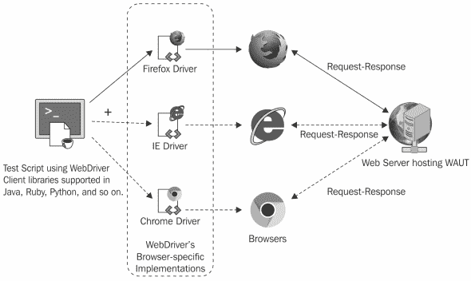
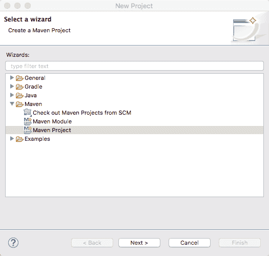
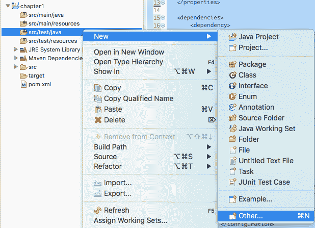
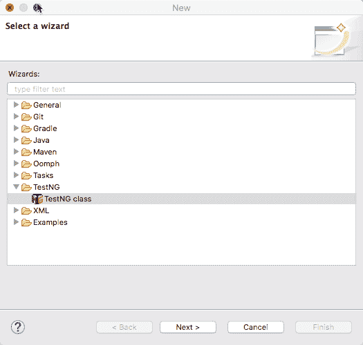
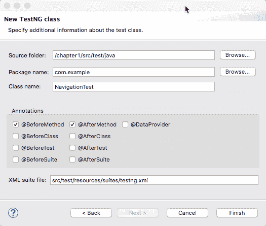
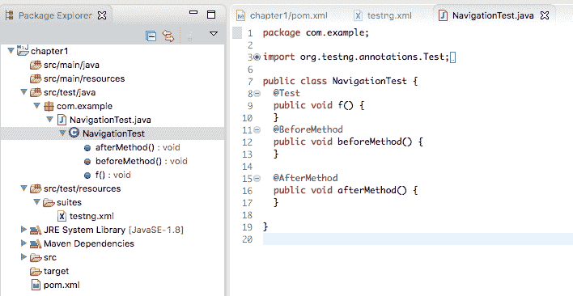
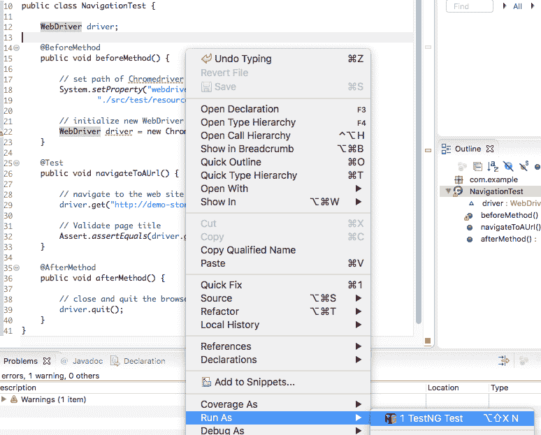
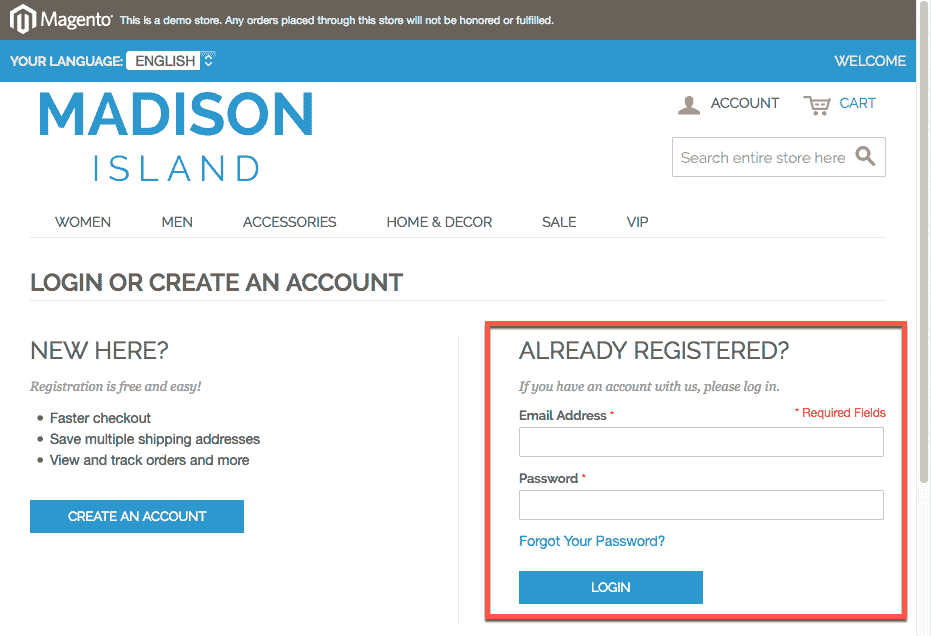
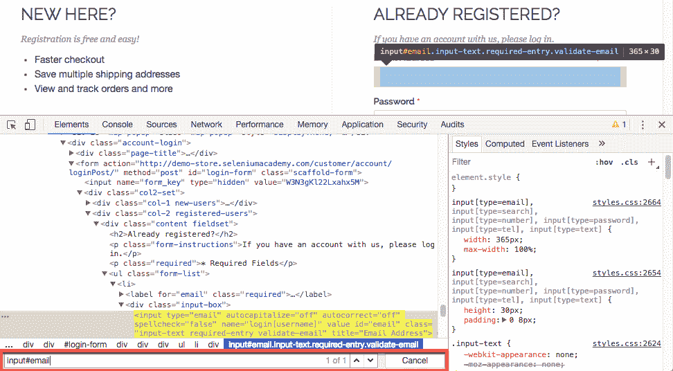

# 第一章：介绍 WebDriver 和 WebElements

在本章中，我们将简要介绍 Selenium，其各种组件，如 Appium，然后转向网页的基本组件，包括各种类型的 WebElements。我们将学习在网页上定位 WebElements 的不同方法，并在它们上执行各种用户操作。本章将涵盖以下主题：

+   Selenium 测试工具的各种组件

+   使用 Maven 和 TestNG 在 Eclipse 中设置项目

+   在网页上定位 WebElements

+   可以在 WebElements 上执行的操作

Selenium 是一套广泛使用的工具，用于自动化浏览器。它主要用于测试应用程序，但其用途不仅限于测试。它还可以用于执行屏幕抓取和在浏览器窗口中自动化重复性任务。Selenium 支持在所有主要浏览器上自动化，包括 Google Chrome、Mozilla Firefox、Microsoft Internet Explorer 和 Edge、Apple Safari 和 Opera。Selenium 3.0 现已成为 W3C 标准，并得到主要浏览器供应商的支持。

# Selenium 测试工具

Selenium 3.0 提供了三个重要的工具：Selenium WebDriver、Selenium 服务器和 Selenium IDE。每个工具都提供创建、调试和运行在支持的浏览器和操作系统上的测试的功能。让我们详细探讨每个工具。

# Selenium WebDriver

Selenium WebDriver 是 Selenium RC（远程控制）的继任者，Selenium RC 已被官方弃用。Selenium WebDriver 使用 JSON-Wire 协议（也称为客户端 API）接受命令，并将它们发送到由特定驱动程序类（如 ChromeDriver、FirefoxDriver 或 IEDriver）启动的浏览器。这是通过浏览器特定的浏览器驱动程序实现的。它按照以下顺序工作：

1.  驱动程序监听来自 Selenium 的命令

1.  它将这些命令转换为浏览器的原生 API

1.  驱动程序接收原生命令的结果，并将结果发送回 Selenium：



我们可以使用 Selenium WebDriver 执行以下操作：

+   创建健壮的基于浏览器的回归自动化

+   在许多浏览器和平台上扩展和分发脚本

+   使用您喜欢的编程语言创建脚本

Selenium WebDriver 提供了一组特定于语言的绑定（客户端库），用于驱动浏览器。WebDriver 提供了一套更好的 API，通过其实现类似于面向对象编程，以满足大多数开发者的期望。WebDriver 正在一段时间内积极开发，您可以看到许多与 Web 以及移动应用程序的先进交互。

Selenium 客户端 API 是一种特定于语言的 Selenium 库，它为 Java、C#、Python、Ruby 和 JavaScript 等编程语言提供了一致的 Selenium API。这些语言绑定允许测试启动 WebDriver 会话并与浏览器或 Selenium 服务器通信。

# Selenium 服务器

Selenium Server 允许我们在远程机器上运行的浏览器实例以及并行运行测试，从而将测试负载分散到多台机器上。我们可以创建一个 Selenium Grid，其中一个服务器作为 Hub 运行，管理节点池。我们可以配置我们的测试以连接到 Hub，然后 Hub 获取一个空闲节点，该节点与我们需要运行测试的浏览器相匹配。Hub 有一个节点列表，提供对浏览器实例的访问，并允许测试像负载均衡器一样使用这些实例。Selenium Grid 通过集中管理不同类型的浏览器、它们的版本和操作系统配置，使我们能够在多台机器上并行执行测试。

# Selenium IDE

Selenium IDE 是一个 Firefox 插件，允许用户记录、编辑、调试和回放以 *Selenese* 格式捕获的测试，该格式是在 Selenium 核心版本中引入的。它还为我们提供了将这些测试转换为 Selenium RC 或 Selenium WebDriver 格式的功能。我们可以使用 Selenium IDE 执行以下操作：

+   使用记录和回放创建快速简单的脚本，或者将它们用于探索性测试

+   创建脚本以辅助自动化辅助的探索性测试

+   创建宏以在 Web 页面上执行重复性任务

当 Firefox 55 从 XPI 格式迁移到 WebExtension 格式后，Selenium IDE for Firefox 停止了工作，并且目前不再维护。

# Selenium 2 和 Selenium 3 之间的差异

在我们进一步深入了解 Selenium 3 之前，让我们了解 Selenium 2 和 Selenium 之间的差异。

# 处理浏览器

由于 Selenium WebDriver 已被接受为 W3C 标准，Selenium 3 对浏览器实现带来了一系列变化。现在，所有主要的浏览器厂商都支持 WebDriver 规范，并提供了必要的功能，包括浏览器。例如，微软推出了 EdgeDriver，苹果支持 SafariDriver 实现。我们将在本书的后面看到一些这些变化。

# 拥有更好的 API

由于 W3C 标准的 WebDriver 携带了一套更好的 API，这些 API 通过类似于面向对象编程的实现来满足大多数开发者的期望。

# 拥有开发者支持和高级功能

WebDriver 正在积极开发中，并且现在根据 W3C 规范由浏览器厂商支持；您可以看到许多与 Web 以及移动应用程序的先进交互，例如文件处理和触摸 API。

# 使用 Appium 测试移动应用程序

在 Selenium 3 中引入的主要差异之一是引入了 `Appium` 项目。Selenium 2 中作为其一部分的移动测试功能现在已移动到名为 Appium 的独立项目中。

`Appium` 是一个开源的移动自动化框架，用于使用 JSON-Wire 协议在 iOS 和 Android 平台上测试原生、混合和 Web 移动应用程序。`Appium` 替换了 Selenium 2 中的 iPhoneDriver 和 AndroidDriver API，这些 API 用于测试移动 Web 应用程序。

`Appium` 允许使用和扩展现有的 Selenium WebDriver 框架来构建移动测试。因为它使用 Selenium WebDriver 来驱动测试，所以我们可以使用任何编程语言为 Selenium 客户端库创建测试。

# 使用 Java 在 Eclipse 中设置 Maven 和 TestNG 项目

Selenium WebDriver 是一个帮助您自动化浏览器的库。然而，当用于测试和构建测试框架或用于非测试目的的浏览器自动化时，需要更多。您需要一个集成开发环境（**IDE**）或代码编辑器来创建一个新的 Java 项目，并添加 Selenium WebDriver 和其他依赖项以构建测试框架。

在 Java 开发社区中，Eclipse 是一个广泛使用的 IDE，以及 IntelliJ IDEA 和 NetBeans。Eclipse 为 Selenium WebDriver 测试开发提供了一个功能丰富的环境。

与 Eclipse 一起，Apache Maven 提供了对测试项目生命周期的管理支持。Maven 用于定义项目结构、依赖项、构建和测试管理。

我们可以使用 Eclipse 和 Maven 从单个窗口构建我们的 Selenium WebDriver 测试框架。使用 Maven 的另一个重要好处是，我们可以通过配置 pom.xml 文件来获取所有 Selenium 库文件及其依赖项。在构建项目时，Maven 会自动从存储库下载必要的文件。

在本节中，我们将学习如何配置 Eclipse 和 Maven 以进行 Selenium WebDriver 测试开发。本书中的大部分代码都是在 Eclipse 和 Maven 中开发的。

您需要 Eclipse 和 Maven 来设置测试开发环境。从 [`maven.apache.org/download.html`](http://maven.apache.org/download.html) 下载并设置 Maven。遵循 Maven 下载页面上的说明（请参阅页面上的安装说明部分）。

从 [`eclipse.org/downloads/`](https://eclipse.org/downloads/) 下载并设置 Eclipse Java 开发者 IDE。

与 Eclipse 和 Maven 一起，我们还将使用 TestNG 作为项目的测试框架。TestNG 库将帮助我们定义测试用例、测试设置和断言。我们需要通过 Eclipse Marketplace 安装 TestNG 插件。

让我们按照以下步骤配置 Eclipse 和 Maven 以使用 Selenium WebDriver 开发测试：

1.  启动 Eclipse IDE。

1.  通过选择 Eclipse 主菜单中的“文件 | 新建 | 其他”来创建一个新项目。

1.  在“新建”对话框中，选择 Maven | Maven 项目，如图所示，然后点击“下一步”：



1.  新建 Maven 项目对话框将显示。选择创建简单项目（跳过存档选择）复选框，然后点击下一步按钮，如图所示：


1.  在新建 Maven 项目对话框中，在组 ID：文本框中输入 ***com.example***，在工件 ID：文本框中输入 ***chapter1***。您还可以添加一个名称和描述。点击完成按钮，如图所示：


1.  Eclipse 将创建一个与以下截图所示结构（在包资源管理器中）相似的 ***chapter1*** 项目：


1.  从包资源管理器中选择 pom.xml。这将打开编辑器区域中的 pom.xml 文件，并打开 **概览** 选项卡。选择紧邻概览选项卡的 **pom.xml** 选项卡，如图所示：


1.  在以下代码片段中添加 Selenium WebDriver 和 TestNG 依赖项，并将其添加到 pom.xml 中的 `project` 节之间：

```java
<properties>
 <java.version>1.8</java.version>
 <selenium.version>3.13.0</selenium.version>
 <testng.version>6.13.1</testng.version>
 <maven.compiler.version>3.7.0</maven.compiler.version> </properties>

<dependencies>
 <dependency>
 <groupId>org.seleniumhq.selenium</groupId>
 <artifactId>selenium-java</artifactId>
 <version>${selenium.version}</version>
 </dependency>
 <dependency>
 <groupId>org.testng</groupId>
 <artifactId>testng</artifactId>
 <version>${testng.version}</version>
 </dependency>
</dependencies>

<build>
 <plugins>
 <plugin>
 <groupId>org.apache.maven.plugins</groupId>
 <artifactId>maven-compiler-plugin</artifactId>
 <version>${maven.compiler.version}</version>
 <configuration>
 <source>${java.version}</source>
 <target>${java.version}</target>
 </configuration>
 </plugin>
 </plugins>
</build>
```

1.  在包资源管理器中选择 ***src/test/java***，然后右键单击以显示菜单。选择新建 | 其他，如图所示：



1.  从选择向导对话框中选择 TestNG | TestNG 类，如图所示：



1.  在新建 TestNG 类对话框中，在源文件夹：字段中输入 ***/chapter1/src/test/java***。在包名：字段中输入 com.example。在类名：字段中输入 NavigationTest。选择 @BeforeMethod 和 @AfterMethod 复选框，并在 XML 测试套件文件：字段中添加 `src/test/resources/suites/testng.xml`。点击完成按钮：



1.  这将在 com.example 包中创建一个名为 ***NavigationTest.java*** 的类，其中包含 `@Test`、`@BeforeMethod` 和 `@AfterMethod` 等 TestNG 注解，以及 `beforeMethod` 和 `afterMethod` 方法：



1.  使用以下代码修改 `NavigationTest` 类：

```java
package com.example;
import org.openqa.selenium.WebDriver;
import org.openqa.selenium.chrome.ChromeDriver;
import org.testng.Assert;
import org.testng.annotations.*;

public class NavigationTest {

    WebDriver driver;

    @BeforeMethod
    public void beforeMethod() {

        // set path of Chromedriver executable
        System.setProperty("webdriver.chrome.driver",
                "./src/test/resources/drivers/chromedriver");

        // initialize new WebDriver session
        driver = new ChromeDriver();
    }

    @Test
    public void navigateToAUrl() {
        // navigate to the web site
        driver.get("http://demo-store.seleniumacademy.com/");
        // Validate page title
        Assert.assertEquals(driver.getTitle(), "Madison Island");
    }
    @AfterMethod
    public void afterMethod() {

        // close and quit the browser
        driver.quit();
    }
}
```

在前面的代码中，我们向 `NavigationTest` 类中添加了三个方法。我们还声明了一个 `WebDriver driver;` 实例变量，我们将在测试中稍后使用它来启动浏览器并导航到网站。

`beforeMethod()` 方法，它被 `@BeforeMethod` TestNG 注解标记，将在测试方法之前执行。它将设置 Google Chrome 所需的 *chromedriver* 可执行文件的路径。然后，它将使用 `ChromeDriver()` 类实例化 driver 变量。这将启动屏幕上的一个新的 Google Chrome 窗口。

下一个方法`navigateToAUrl()`使用`@Test`注解，是测试方法。我们将通过传递应用程序的 URL 调用 WebDriver 接口的`get()`方法。这将导航到浏览器中的网站。我们将通过调用 TestNG 的`Assert.assertEquals`方法和 WebDriver 接口的`getTitle()`方法来检查页面标题。

最后，`afterMethod()`方法使用`@AfterMethod` TestNG 注解，将在浏览器窗口关闭。

我们需要从[`sites.google.com/a/chromium.org/chromedriver/downloads`](https://sites.google.com/a/chromium.org/chromedriver/downloads)下载并复制 chromedriver 可执行文件。根据您计算机上安装的 Google Chrome 浏览器版本以及操作系统下载适当的版本。将可执行文件复制到`/src/test/resources/drivers`文件夹中。

要运行测试，在代码编辑器中右键单击，并选择“运行”|“TestNG 测试”，如下面的截图所示：



这将启动一个新的 Google Chrome 浏览器窗口并导航到网站。测试将验证页面标题，并在测试结束时关闭浏览器窗口。TestNG 插件将在 Eclipse 中显示结果：


您可以从[`www.packtpub.com`](http://www.packtpub.com)的账户下载您购买的所有 Packt 书籍的示例代码文件。如果您在其他地方购买了这本书，您可以访问 http://www.packtpub.com/support 并注册，以便将文件直接通过电子邮件发送给您。示例代码也托管在[`github.com/PacktPublishing/Selenium-WebDriver-3-Practical-Guide-Second-Edition`](https://github.com/PacktPublishing/Selenium-WebDriver-3-Practical-Guide-Second-Edition)

# WebElements

一个网页由许多不同类型的 HTML 元素组成，如链接、文本框、下拉按钮、主体、标签和表单。在 WebDriver 的上下文中，这些元素被称为 WebElements。这些网页上的元素共同实现了用户功能。例如，让我们看看一个网站登录页面的 HTML 代码：

```java
<html>
<body>
    <form id="loginForm">
        <label>Enter Username: </label>
        <input type="text" name="Username"/>
        <label>Enter Password: </label>
        <input type="password" name="Password"/>
        <input type="submit"/>
    </form>
    <a href="forgotPassword.html">Forgot Password ?</a>
</body>
</html>
```

在前面的 HTML 代码中，有不同类型的 WebElements，如`<html>`、`<body>`、`<form>`、`<label>`、`<input>`和`<a>`，它们共同构成了一个网页，为用户提供登录功能。让我们分析以下 WebElement：

```java
<label>Enter Username: </label>
```

在这里，`<label>`是 WebElement 标签的开始标签。`Enter Username:`是`label`元素上的文本。最后，`</label>`是结束标签，表示 WebElement 的结束。

同样，取另一个 WebElement：

```java
<input type="text" name="Username"/>
```

在前面的代码中，`type`和`name`是具有`text`和`Username`值的`input` WebElement 的属性。

使用 Selenium 进行 UI 自动化主要涉及在网页上定位这些 Web 元素并对其执行用户操作。在本章的剩余部分，我们将使用各种方法来定位 Web 元素并在其上执行相关的用户操作。

# 使用 WebDriver 定位 Web 元素

让我们从自动化演示应用程序首页的搜索功能开始这一节，[`demo-store.seleniumacademy.com/`](http://demo-store.seleniumacademy.com/)，这涉及到导航到首页，在文本框中输入搜索文本，并执行搜索。代码如下：

```java
import org.openqa.selenium.By;
import org.openqa.selenium.WebDriver;
import org.openqa.selenium.WebElement;
import org.openqa.selenium.chrome.ChromeDriver;
import org.testng.annotations.AfterMethod;
import org.testng.annotations.BeforeMethod;
import org.testng.annotations.Test;

import static org.assertj.core.api.AssertionsForClassTypes.assertThat;

public class SearchTest {

    WebDriver driver;

    @BeforeMethod
    public void setup() {
        System.setProperty("webdriver.chrome.driver",
                "./src/test/resources/drivers/chromedriver");
        driver = new ChromeDriver();
        driver.get("http://demo-store.seleniumacademy.com/");
    }

    @Test
    public void searchProduct() {
        // find search box and enter search string
        WebElement searchBox = driver.findElement(By.name("q"));
        searchBox.sendKeys("Phones");
        WebElement searchButton = 
 driver.findElement(By.className("search-button"));
        searchButton.click();
        assertThat(driver.getTitle())
                .isEqualTo("Search results for: 'Phones'");
    }

    @AfterMethod
    public void tearDown() {
        driver.quit();
    }
}
```

如您所见，有三个新的内容被突出显示，如下所示：

```java
WebElement searchBox = driver.findElement(By.name("q"));
```

它们是`findElement()`方法、`By.name()`方法和`WebElement`接口。`findElement()`和`By()`方法指示 WebDriver 在网页上定位一个`WebElement`，一旦找到，`findElement()`方法就返回该元素的`WebElement`实例。使用`WebElement`接口中声明的方 法在返回的`WebElement`上执行操作，如点击和输入，这些将在下一节详细讨论。

# `findElement`方法

在 UI 自动化中，在执行任何用户操作之前，定位元素是第一步。WebDriver 的`findElement()`方法是在网页上定位元素的一种便捷方式。根据 WebDriver 的 Javadoc（[`selenium.googlecode.com/git/docs/api/java/index.html`](http://seleniumhq.github.io/selenium/docs/api/java/index.html)），方法的声明如下：

```java
WebElement findElement(By by)
```

因此，`findElement()`方法的输入参数是`By`实例。`By`实例是一个定位`WebElement`的机制。有八种不同的方式可以在网页上定位一个`WebElement`。我们将在本章后面看到这八种方法。

`findElement()`方法的返回类型是表示网页实际 HTML 元素或组件的`WebElement`实例。该方法返回第一个满足定位机制条件的`WebElement`。从那时起，此`WebElement`实例将作为该组件的句柄。测试脚本开发者可以通过使用返回的`WebElement`实例来对该组件采取适当的操作。

如果 WebDriver 找不到元素，它将抛出一个名为`NoSuchElementException`的运行时异常，调用类或方法应该处理它。

# `findElements`方法

对于在网页上查找符合相同定位条件的多元素，可以使用`findElements()`方法。它返回一个包含给定定位机制找到的 Web 元素的列表。`findElements()`方法的声明如下：

```java
java.util.List findElements(By by)
```

输入参数与 `findElement()` 方法相同，它是一个 `By` 类的实例。区别在于返回类型。在这里，如果没有找到元素，则返回一个空列表；如果有多个 WebElements 满足定位机制，则将它们全部以列表形式返回给调用者。

# 使用开发者工具检查元素

在我们开始探索如何在页面上查找元素以及使用什么定位机制之前，我们需要查看页面的 HTML 代码，以了解文档对象模型（**DOM**）树，页面显示的元素定义了哪些属性或属性，以及应用程序如何从 JavaScript 或 AJAX 调用。浏览器使用为页面编写的 HTML 代码在浏览器窗口中渲染视觉元素。它使用其他资源，包括 JavaScript、CSS 和图像，来决定这些元素的外观、感觉和行为。

这里是演示应用程序的登录页面示例以及用于在浏览器中渲染此页面的 HTML 代码，如图所示：



我们需要能够以结构化和易于理解的方式显示页面 HTML 代码的工具。现在几乎所有的浏览器都提供了开发者工具来检查页面结构和相关资源。

# 使用 Mozilla Firefox 检查页面和元素

新版本的 Mozilla Firefox 提供了内置的方式来检查页面和元素。要检查页面上的元素，将鼠标移至所需的元素上，右键单击以打开弹出菜单。选择**检查元素**选项，如图所示：


这将显示带有 HTML 代码的检查器选项卡，以树形格式显示，并突出显示所选元素，如图所示：


使用检查器，我们还可以使用检查器部分显示的搜索框验证 XPath 或 CSS 选择器。只需输入 XPath 或 CSS 选择器，检查器就会突出显示匹配表达式的元素，如图所示：


开发者工具还提供了各种其他调试功能。它还会为元素生成 XPath 和 CSS 选择器。为此，在树中选择所需的元素，右键单击，然后从弹出菜单中选择复制 > XPath 或复制 > CSS 路径选项，如图所示：


这将把建议的 XPath 或 CSS 选择器值粘贴到剪贴板，以便稍后与 `findElement()` 方法一起使用。

# 使用开发者工具在 Google Chrome 中检查页面和元素

与 Mozilla Firefox 类似，Google Chrome 也提供了一个内置功能来检查页面和元素。我们可以将鼠标移至页面上的所需元素上，右键单击以打开弹出菜单，然后选择“检查元素”选项。这将打开浏览器中的开发者工具，显示类似于 Firefox 的信息，如下面的截图所示：


与 Firefox 类似，我们也可以在 Google Chrome 开发者工具中测试 XPath 和 CSS 选择器。在“元素”选项卡中按*Ctrl + F*（在 Mac 上使用*Command + F*）。这将显示一个搜索框。只需输入*XPath*或*CSS Selector*，匹配的元素将在树中突出显示，如下面的截图所示：



Chrome 开发者工具还提供了一个功能，您可以通过在树中右键单击所需的元素并从弹出菜单中选择“复制 XPath”选项来获取元素的 XPath。

与 Mozilla Firefox 和 Google Chrome 类似，您将在任何主要浏览器中找到类似的开发者工具，包括 Microsoft Internet Explorer 和 Edge。

浏览器开发者工具在测试脚本开发过程中非常有用。这些工具将帮助您找到需要交互的元素的定位细节。这些工具解析页面代码，并以分层树的形式显示信息。

网页上的 WebElements 可能不具有所有声明的属性。选择用于在网页上唯一标识 WebElements 的属性是测试脚本开发者的责任，以便进行自动化。

# 使用 By 定位机制

By 是传递给`findElement()`方法或`findElements()`方法以获取网页上的相应 WebElement（s）的定位机制。有八种不同的定位机制；也就是说，有八种不同的方式来识别

网页上的一个 HTML 元素。它们可以通过 ID、Name、ClassName、TagName、LinkText、PartialLinkText、XPath 和 CSS Selector 来定位。

# By.id()方法

在网页上，每个元素都通过一个 ID 属性来唯一标识，这个属性是可选的。ID 可以由网络应用的开发者手动分配，或者由应用动态生成。动态生成的 ID 可以在每次页面刷新或一段时间内更改。现在，考虑搜索框的 HTML 代码：

```java
<input id="search" type="search" name="q" value="" class="input-text required-entry" maxlength="128" placeholder="Search entire store here..." autocomplete="off">
```

在前面的代码中，搜索框的`id`属性值是`search`。

让我们看看如何使用 ID 属性作为定位机制来找到搜索框：

```java
@Test
public void byIdLocatorExample() {
    WebElement searchBox = driver.findElement(By.id("search"));
    searchBox.sendKeys("Bags");
    searchBox.submit();
    assertThat(driver.getTitle())
            .isEqualTo("Search results for: 'Bags'");
}
```

在前面的代码中，我们使用了`By.id()`方法和搜索框的`id`属性值来找到元素。

在这里，尝试使用`By.id`标识符，并使用名称值（即`q`）而不是`id`值（即`search`）。将第三行修改如下：

```java
WebElement searchBox = driver.findElement(By.id("q")); 
```

测试脚本将无法抛出异常，如下所示：

```java
Exception in thread "main" org.openqa.selenium.NoSuchElementException: Unable to locate element: {"method":"id","selector":"q"}
```

WebDriver 无法通过 `id` 值为 `q` 的元素找到元素。因此，它抛出一个异常，表示 `NoSuchElementException`。

# By.name() 方法

如前所述，网页上的每个元素都有许多属性。名称是其中之一。例如，搜索框的 HTML 代码如下：

```java
<input id="search" type="search" name="q" value="" class="input-text required-entry" maxlength="128" placeholder="Search entire store here..." autocomplete="off">
```

在这里，`name` 是搜索框的许多属性之一，其值是 `q`。如果我们想在测试脚本中识别这个搜索框并为其设置值，代码将如下所示：

```java
@Test
public void searchProduct() {
    // find search box and enter search string
    WebElement searchBox = driver.findElement(By.name("q"));
    searchBox.sendKeys("Phones");
    searchBox.submit();
    assertThat(driver.getTitle())
            .isEqualTo("Search results for: 'Phones'");
}
```

如果你观察第四行，这里使用的定位机制是 `By.name`，名称是 `q`。那么，我们从哪里得到这个名称的呢？如前所述，是浏览器开发者工具帮助我们获取按钮的名称。启动开发者工具并使用检查元素小部件来获取元素的属性。

# By.className() 方法

在我们讨论 `className()` 方法之前，我们必须稍微谈谈样式和 CSS。网页上的每个 HTML 元素通常由网页开发者或设计师进行样式设计。每个元素都进行样式设计并不是强制性的，但它们通常是为了使页面对最终用户更具吸引力。

因此，为了将样式应用于一个元素，它们可以直接在元素标签中声明，或者放置在一个名为 CSS 文件的单独文件中，并使用 `class` 属性在元素中引用。例如，按钮的样式属性可以在 CSS 文件中声明如下：

```java
.buttonStyle{
    width: 50px;
    height: 50px;
    border-radius: 50%;
    margin: 0% 2%;
}
```

现在，这个样式可以应用于网页中的按钮元素，如下所示：

```java
<button name="sampleBtnName" id="sampleBtnId" class="buttonStyle">I'm Button</button>
```

因此，`buttonStyle` 被用作按钮元素的 `class` 属性的值，并继承 CSS 文件中声明的所有样式。现在，让我们在我们的主页上尝试这个。我们将尝试使用其类名来识别搜索按钮并点击它。

首先，为了获取搜索按钮的类名，正如我们所知，我们将使用开发者工具来获取它。获取后，将定位机制更改为 `By.className` 并在其中指定类属性值。相应的代码如下：

```java
@Test
public void byClassNameLocatorExample() {
    WebElement searchBox = driver.findElement(By.id("search"));
    searchBox.sendKeys("Electronics");
    WebElement searchButton = 
            driver.findElement(By.className("search-button"));
    searchButton.click();
    assertThat(driver.getTitle())
            .isEqualTo("Search results for: 'Electronics'");
}
```

在前面的代码中，我们通过传递类属性值给 `By.className` 定位机制来使用了 `By.className` 定位机制。

有时，一个元素可能为 `class` 属性指定了多个值。例如，以下 HTML 片段中搜索按钮的 `class` 属性指定了 `*button*` 和 `*search-button*` 值：

```java
<button type="submit" title="Search" class="button search-button"><span><span>Search</span></span></button>
```

我们必须使用 `By.className` 方法中的一个 `class` 属性的值。在这种情况下，我们可以使用 `*button*` 或 `*search-button*`， whichever 唯一标识了该元素。

# By.linkText() 方法

如其名所示，`By.linkText`定位机制只能用来识别 HTML 链接。在我们开始讨论如何使用 WebDriver 通过链接文本来识别链接元素之前，让我们看看 HTML 链接元素的样子。HTML 链接元素在网页上使用`<a>`标签表示，这是锚标签的缩写。一个典型的锚标签看起来像这样：

```java
<a href="http://demo-store.seleniumacademy.com/customer/account/" title="My Account">My Account</a>
```

在这里，`href`是链接到另一个页面，当你点击链接时，你的网络浏览器会带你到那里。所以，浏览器渲染的前面的 HTML 代码看起来像这样：


这个**MY ACCOUNT**是链接文本。因此，`By.linkText`定位机制使用这个文本在锚标签上识别 WebElement。代码看起来是这样的：

```java
@Test
public void byLinkTextLocatorExample() {
    WebElement myAccountLink = 
            driver.findElement(By.linkText("MY ACCOUNT"));
    myAccountLink.click();
    assertThat(driver.getTitle())
            .isEqualTo("Customer Login");
}
```

在这里，使用`By.linkText`定位机制来识别**MY ACCOUNT**链接。

`linkText`和`partialLinkText`方法是区分大小写的。

# `By.partialLinkText()`方法

`By.partialLinkText`定位机制是`By.linkText`定位器的扩展。如果你不确定整个链接文本或者只想使用链接文本的一部分，你可以使用这个定位器来识别链接元素。所以，让我们修改之前的例子，只使用链接的部分文本；在这种情况下，我们将使用网站页脚中的隐私政策链接中的“隐私”：


代码看起来是这样的：

```java
@Test
public void byPartialLinkTextLocatorExample() {
    WebElement orderAndReturns = 
            driver.findElement(By.partialLinkText("PRIVACY"));
    orderAndReturns.click();
    assertThat(driver.getTitle())
            .isEqualTo("Privacy Policy");
}
```

如果存在多个链接，其文本包含*隐私*，会发生什么？这是一个关于`findElement()`方法的问题，而不是定位器的问题。记得我们之前讨论`findElement()`方法时，它只会返回它遇到的第一个 WebElement。如果你想找到所有包含*隐私*的链接文本的 WebElement，请使用`findElements()`方法，它将返回所有这些元素的列表。

如果你认为你需要所有满足定位机制条件的 WebElement，请使用 WebDriver 的`findElements()`方法。

# `By.tagName()`方法

通过标签名定位元素与之前看到的定位机制略有不同。例如，在主页上，如果你搜索带有`button`标签名的元素，它将导致多个 WebElement，因为主页上有九个按钮。所以，在尝试使用标签名定位元素时，始终建议使用`findElements()`方法而不是`findElement()`方法。

让我们看看当搜索主页上存在的链接数量时，代码看起来是什么样的：

```java
@Test
public void byTagNameLocatorExample() {

    // get all links from the Home page
    List<WebElement> links = driver.findElements(By.tagName("a"));

    System.out.println("Found links:" + links.size());

    // print links which have text using Java 8 Streams API
    links.stream()
            .filter(elem -> elem.getText().length() > 0)
            .forEach(elem -> System.out.println(elem.getText()));
}
```

在前面的代码中，我们使用了 `By.tagName` 定位机制和 `findElements()` 方法，它返回所有链接的列表，即页面上定义的 `a` 锚标签。在第五行，我们打印了列表的大小，然后只打印了提供文本的链接文本。我们使用 Java 8 Stream API 通过调用 `getText()` 方法来过滤元素列表并输出文本值。这将生成以下输出：

```java
Found links:88
 ACCOUNT
 CART
 WOMEN
 ...
```

# By.xpath() 方法

WebDriver 使用 **XPath** 来识别网页上的 WebElement。在我们看到它是如何做到这一点之前，让我们快速看一下 XPath 的语法。XPath 是 XML 路径的简称，是用于搜索 XML 文档的查询语言。我们网页的 HTML 也是 XML 文档的一种形式。因此，为了在 HTML 页面上识别元素，我们需要使用特定的 XPath 语法：

+   根元素被标识为 `//`。

+   要识别所有 div 元素，语法将是 `//div`。

+   要识别位于 div 元素内的链接标签，语法将是 `//div/a`。

+   要识别所有具有标签的元素，我们使用 `*`。语法将是 `//div/*`。

+   要识别从根向下三级的所有 div 元素，我们可以使用 `//*/*/div`。

+   要识别特定元素，我们使用这些元素的属性值，例如 `//*/div/a[@id='attrValue']`，这将返回锚点元素。该元素位于根元素内部的 `div` 元素中，并且具有 `id` 值为 `attrValue`。

因此，我们需要将 XPath 表达式传递给 `By.xpath` 定位机制，使其能够识别我们的目标元素。

现在，让我们看看代码示例和 WebDriver 如何使用这个 XPath 来识别元素：

```java
@Test
public void byXPathLocatorExample() {
    WebElement searchBox = 
            driver.findElement(By.xpath("//*[@id='search']"));
    searchBox.sendKeys("Bags");
    searchBox.submit();
    assertThat(driver.getTitle())
            .isEqualTo("Search results for: 'Bags'");
}
```

在前面的代码中，我们正在使用 `By.xpath` 定位机制并将 WebElement 的 XPath 传递给它。

使用 XPath 的一个缺点是它在时间上代价很高。对于要识别的每个元素，WebDriver 实际上都会扫描整个页面，这非常耗时，并且过多地在测试脚本中使用 XPath 会使执行速度变得非常慢。

# By.cssSelector() 方法

`By.cssSelector()` 方法在用法上与 `By.xpath()` 方法类似，但不同之处在于它比 `By.xpath` 定位机制略快。以下是一些常用的语法来识别元素：

+   要识别具有 `#flrs` ID 的 div 元素，我们使用 `#flrs` 语法

+   要识别子锚点元素，我们使用 `#flrs > a` 语法，这将返回链接元素

+   要识别具有其属性的锚点元素，我们使用 `#flrs > a[a[href="/intl/en/about.html"]]` 语法

让我们尝试修改之前的代码，该代码使用 XPath 定位机制，改为使用 `cssSelector` 机制：

```java
@Test
public void byCssSelectorLocatorExample() {
    WebElement searchBox = 
            driver.findElement(By.cssSelector("#search"));
    searchBox.sendKeys("Bags");
    searchBox.submit();
    assertThat(driver.getTitle())
            .isEqualTo("Search results for: 'Bags'");
}
```

前面的代码使用了 `By.cssSelector` 定位机制，它使用搜索框的 css 选择器 `ID`。

让我们来看一个稍微复杂一点的例子。我们将尝试在主页上识别“关于我们”：

```java
@Test
public void byCssSelectorLocatorComplexExample() {

    WebElement aboutUs =
            driver.findElement(By
                    .cssSelector("a[href*='/about-magento-demo-store/']"));

    aboutUs.click();

    assertThat(driver.getTitle())
            .isEqualTo("About Us");
}
```

之前的代码使用了`cssSelector()`方法来查找通过其`href`属性标识的锚元素。

# 与 WebElement 交互

在上一节中，我们看到了如何通过不同的定位方法在网页上定位 WebElement。在这里，我们将看到可以对 WebElement 执行的所有不同用户操作。不同的 WebElement 将具有不同的操作。例如，在一个文本框元素中，我们可以输入一些文本或者清除已经输入的文本。同样，对于按钮，我们可以点击它，获取它的尺寸等，但我们不能在按钮中输入文本，对于链接，我们也不能在它中输入文本。所以，尽管所有操作都列在了一个 WebElement 接口中，但使用目标元素支持的操作是测试脚本开发者的责任。如果我们尝试在 WebElement 上执行错误操作，我们不会看到任何异常或错误抛出，也不会看到任何操作被执行；WebDriver 会静默忽略这些操作。

现在，让我们通过查看它们的 Javadocs 和代码示例来逐个了解这些操作。

# 获取元素属性和属性值

在本节中，我们将学习从 WebElement 接口检索值和属性的各种方法。

# `getAttribute()`方法

`getAttribute`方法可以在所有 WebElement 上执行。记住，我们在 WebElements 部分看到了 WebElement 的属性。HTML 属性是 HTML 元素的修饰符。它们通常是出现在元素起始标签中的键值对。例如：

```java
  <label name="Username" id="uname">Enter Username: </label>
```

在之前的代码中，`name`和`id`是属性或属性键，而`Username`和`uname`是属性值。

`getAttribute()`方法的 API 语法如下：

```java
java.lang.String getAttribute(java.lang.String name)
```

在之前的代码中，输入参数是`String`，它是属性的名字。返回类型同样是`String`，它是属性值。

现在让我们看看如何使用 WebDriver 获取一个 WebElement 的所有属性。在这里，我们将使用示例应用程序中的搜索框。这个元素看起来是这样的：

```java
<input id="search" type="search" name="q" value="" class="input-text required-entry" maxlength="128" placeholder="Search entire store here..." autocomplete="off">
```

我们将使用 WebDriver 列出这个 WebElement 的所有属性。相应的代码如下：

```java
@Test
public void elementGetAttributesExample() {
    WebElement searchBox = driver.findElement(By.name("q"));
    System.out.println("Name of the box is: "
            + searchBox.getAttribute("name"));
    System.out.println("Id of the box is: " + searchBox.getAttribute("id"));
    System.out.println("Class of the box is: "
            + searchBox.getAttribute("class"));
    System.out.println("Placeholder of the box is: "
            + searchBox.getAttribute("placeholder"));
}
```

在之前的代码中，最后四行代码使用了`getAttribute()`方法来获取 WebElement 搜索框的`name`、`id`、`class`和`placeholder`属性的属性值。之前代码的输出将是以下内容：

```java
 Name of the box is: q
 Id of the box is: search
 Class of the box is: input-text required-entry
 Placeholder of the box is: Search entire store here...
```

回到上一节的`By.tagName()`方法，如果通过定位机制`By.tagName`搜索的结果超过一个，你可以使用`getAttribute()`方法进一步过滤结果并到达你确切想要的目标元素。

# `getText()`方法

`getText` 方法可以从所有 WebElement 中调用。如果元素上包含任何文本，它将返回可见文本，否则将返回空值。`getText()` 方法的 API 语法如下：

```java
java.lang.String getText()
```

上述方法没有输入参数，但如果 WebElement 中有任何可见的 `innerText` 字符串，它将返回该字符串，否则将返回空字符串。

以下代码示例用于获取示例应用程序首页上存在的站点通知元素上的文本：

```java
@Test
public void elementGetTextExample() {
    WebElement siteNotice = driver.findElement(By
            .className("global-site-notice"));

    System.out.println("Complete text is: "
            + siteNotice.getText());
}
```

上述代码使用 `getText()` 方法获取站点通知元素上的文本，它返回以下内容：

```java
Complete text is: This is a demo store. Any orders placed through this store will not be honored or fulfilled.
```

# `getCssValue()` 方法

`getCssValue` 方法可以在所有 WebElement 上调用。此方法用于从 WebElement 中获取 CSS 属性值。CSS 属性可以是 `font-family`、`background-color`、`color` 等。当您想通过测试脚本验证应用于 WebElement 的 CSS 样式时，这非常有用。`getCssValue()` 方法的 API 语法如下：

```java
java.lang.String getCssValue(java.lang.String propertyName)
```

在上述代码中，输入参数是 CSS 属性名称的字符串值，返回类型是分配给该属性名称的值。

以下是从搜索框检索文本 `font-family` 的代码示例：

```java
@Test
public void elementGetCssValueExample() {
    WebElement searchBox = driver.findElement(By.name("q"));
    System.out.println("Font of the box is: "
            + searchBox.getCssValue("font-family"));
}
```

上述代码使用 `getCssValue()` 方法查找搜索框中可见文本的 `font-family`，方法输出如下：

```java
Font of the box is: Raleway, "Helvetica Neue", Verdana, Arial, sans-serif
```

# `getLocation()` 方法

`getLocation` 方法可以在所有 WebElement 上执行。这用于获取元素在网页上渲染的相对位置。这个位置是相对于网页的左上角计算的，其中 (x, y) 坐标假定为 (0, 0)。如果您的测试脚本尝试验证网页布局，此方法将非常有用。

`getLocation()` 方法的 API 语法如下：

```java
Point getLocation()
```

上述方法显然不需要任何输入参数，但返回类型是一个包含元素 (x, y) 坐标的 `Point` 类。

以下代码用于检索搜索框的位置：

```java
WebElement searchBox = driver.findElement(By.name("q"));
System.out.println("Location of the box is: "
        + searchBox.getLocation());
```

上述代码的输出是搜索框的 (x, y) 位置，如下截图所示：

```java
Location of the box is: (873, 136)
```

# `getSize()` 方法

`getSize` 方法也可以在所有可见的 HTML 组件上调用。它将返回渲染的 WebElement 的宽度和高度。`getSize()` 方法的 API 语法如下：

```java
Dimension getSize()
```

上述方法不接收任何输入参数，返回类型是一个名为 `Dimension` 的类实例。该类包含目标 WebElement 的宽度和高度。以下代码用于获取搜索框的宽度和高度：

```java
WebElement searchBox = driver.findElement(By.name("q"));
System.out.println("Size of the box is: "
        + searchBox.getSize());
```

上述代码的输出是搜索框的宽度和高度，如下截图所示：

```java
Size of the box is: (281, 40) 
```

# `getTagName()` 方法

`getTagName` 方法可以从所有 WebElements 中调用。这将返回 WebElements 的 HTML 标签名。例如，在以下 HTML 代码中，按钮是 HTML 元素的标签名：

```java
<button id="gbqfba" class="gbqfba" name="btnK" aria-label="Google Search">
```

在前面的代码中，按钮是 HTML 元素的标签名。

`getTagName()` 方法的 API 语法如下：

```java
java.lang.String getTagName()
```

前面方法的返回类型是 `String`，它返回目标元素的标签名。

以下代码返回搜索按钮的标签名：

```java
@Test
public void elementGetTagNameExample() {
    WebElement searchButton = driver.findElement(By.className("search-button"));
    System.out.println("Html tag of the button is: "
            + searchButton.getTagName());
}
```

前面的代码使用了 `getTagName()` 方法来获取搜索按钮元素的标签名。代码的输出符合预期：

```java
Html tag of the button is: button
```

# 对 WebElements 执行操作

在上一节中，我们看到了如何检索 WebElements 的值或属性。在本节中，我们将看到如何对 WebElements 执行操作，这是自动化中最关键的部分。让我们探索 WebElement 接口中的各种方法。

# sendKeys() 方法

`sendKeys` 操作适用于 `textbox` 或 `textarea` HTML 元素。这是用来在文本框中输入文本的。这会模拟用户的键盘输入，将文本输入到 WebElements 中，就像用户自己输入一样。`sendKeys()` 方法的 API 语法如下：

```java
void sendKeys(java.lang.CharSequence...keysToSend)
```

前面方法的输入参数是 `CharSequence` 类型的文本，该文本需要输入到元素中。此方法不返回任何内容。现在，让我们通过一个代码示例来看看如何使用 `sendKeys()` 方法在搜索框中输入搜索文本：

```java
@Test
public void elementSendKeysExample() {
    WebElement searchBox = driver.findElement(By.name("q"));
    searchBox.sendKeys("Phones");
    searchBox.submit();
    assertThat(driver.getTitle())
            .isEqualTo("Search results for: 'Phones'");
}
```

在前面的代码中，`sendKeys()` 方法用于在网页的文本框元素中输入所需的文本。这就是我们处理普通键的方式，但如果你想要输入一些特殊键，例如 *退格键、回车键、制表键* 或 *Shift 键*，我们需要使用 WebDriver 的一个特殊枚举类，名为 `Keys`。使用 `Keys` 枚举，你可以在输入到 WebElement 时模拟许多特殊键。

现在让我们看看一些代码示例，它使用 *Shift* 键在搜索框中输入大写文本：

```java
@Test
public void elementSendKeysCompositeExample() {
    WebElement searchBox = driver.findElement(By.name("q"));
    searchBox.sendKeys(Keys.chord(Keys.SHIFT,"phones"));
    searchBox.submit();
    assertThat(driver.getTitle())
            .isEqualTo("Search results for: 'PHONES'");
}
```

在前面的代码中，使用了 `Keys` 枚举中的 `chord()` 方法来输入键，同时指定的文本作为输入被赋予文本框。在你的环境中尝试这个操作，以查看所有输入的文本都变为大写。

# clear() 方法

clear 操作类似于 `sendKeys()` 方法，适用于 `textbox` 和 `textarea` 元素。这是用来清除使用 `sendKeys()` 方法输入到 WebElement 中的文本。这可以通过使用 `Keys.BACK_SPACE` 枚举实现，但 WebDriver 已经为我们提供了一个清除文本的显式方法。`clear()` 方法的 API 语法如下：

```java
void clear()
```

此方法不接收任何输入也不返回任何输出。它只是简单地在对目标文本输入元素上执行。

现在，让我们看看如何清除搜索框中输入的文本。相应的代码示例如下：

```java
@Test
public void elementClearExample() {
    WebElement searchBox = driver.findElement(By.name("q"));
    searchBox.sendKeys(Keys.chord(Keys.SHIFT,"phones"));
    searchBox.clear();
}
```

我们使用了 WebElement 的 `clear()` 方法在将 `phones` 输入到搜索框后清除文本。

# `submit()` 方法

`submit()` 动作可以在 `Form` 或 `Form` 元素内的元素上执行。这用于将网页表单提交到托管 web 应用的服务器。`submit()` 方法的 API 语法如下：

```java
void submit()
```

前面的方法不接收任何输入参数，也不返回任何内容。但是，当这个方法在一个不在表单内的 WebElement 上执行时，会抛出 `NoSuchElementException`。

现在，让我们通过一个代码示例来提交搜索页面上的表单：

```java
@Test
public void elementSubmitExample() {
    WebElement searchBox = driver.findElement(By.name("q"));
    searchBox.sendKeys(Keys.chord(Keys.SHIFT,"phones"));
    searchBox.submit();
}
```

在前面的代码中，接近结尾的部分是使用 `submit()` 方法将搜索表单提交到应用服务器的位置。现在，尝试在一个元素上执行 `submit()` 方法，比如关于链接，它不是任何表单的一部分。我们应该看到抛出了 `NoSuchElementException`。所以，当你使用 `submit()` 方法在 WebElement 上时，请确保它是 `Form` 元素的一部分。

# 检查 WebElement 状态

在前面的章节中，我们看到了如何检索值和执行 WebElements 的操作。现在，我们将看到如何检查 WebElement 的状态。我们将探索检查 WebElement 是否在浏览器窗口中显示、是否可编辑的方法，以及如果 WebElement 是单选按钮或复选框，我们可以确定它是选中还是未选中。让我们看看如何使用 WebElement 接口中的可用方法。

# `isDisplayed()` 方法

`isDisplayed` 动作用于验证网页上的元素是否显示，并且可以在所有 WebElements 上执行。`isDisplayed()` 方法的 API 语法如下：

```java
boolean isDisplayed()
```

前面的方法返回一个 `Boolean` 值，指定目标元素是否在网页上显示。以下是对 Search 框是否显示的验证代码，在这种情况下显然应该返回 true：

```java
@Test
public void elementStateExample() {
    WebElement searchBox = driver.findElement(By.name("q"));
    System.out.println("Search box is displayed: "
            + searchBox.isDisplayed());
}
```

前面的代码使用 `isDisplayed()` 方法来确定元素是否在网页上显示。前面的代码对 Search 框返回 `true`：

```java
Search box is displayed: true
```

# `isEnabled()` 方法

`isEnabled` 动作用于验证网页上的元素是否启用，并且可以在所有 WebElements 上执行。`isEnabled()` 方法的 API 语法如下：

```java
boolean isEnabled()
```

前面的方法返回一个 `Boolean` 值，指定目标元素是否在网页上启用。以下是对 Search 框是否启用的验证代码，在这种情况下显然应该返回 true：

```java
@Test
public void elementStateExample() {
    WebElement searchBox = driver.findElement(By.name("q"));
    System.out.println("Search box is enabled: "
            + searchBox.isEnabled());
}
```

前面的代码使用 `isEnabled()` 方法来确定元素是否在网页上启用。前面的代码对 Search 框返回 `true`：

```java
Search box is enabled: true 
```

# `isSelected()` 方法

如果网页上的元素被选中，`isSelected` 方法返回一个 `boolean` 值，并且只能在单选按钮、选择框中的选项和复选框 WebElement 上执行。在其他元素上执行时，它将返回 false。`isSelected()` 方法的 API 语法如下：

```java
boolean isSelected()
```

上述方法返回一个 `Boolean` 值，指定目标元素是否在网页上被选中。以下代码用于验证搜索框是否在搜索页面上被选中：

```java
@Test
public void elementStateExample() {
    WebElement searchBox = driver.findElement(By.name("q"));
    System.out.println("Search box is selected: "
            + searchBox.isSelected());
}
```

上述代码使用了 `isSelected()` 方法。对于搜索框，它返回 false，因为这不是单选按钮、选择框中的选项或复选框。上述代码对搜索框返回 `false`：

```java
Search box is selected: false
```

要选择复选框或单选按钮，我们需要调用 `WebElement.click()` 方法，它切换元素的状态。我们可以使用 `isSelected()` 方法来查看它是否被选中。

# 摘要

在本章中，我们简要概述了 Selenium 测试工具，以及 WebDriver 和 WebElement 的架构。我们学习了如何使用 Eclipse、Maven 和 TestNG 设置测试开发环境。这将为我们使用 Selenium 构建测试框架奠定基础。然后，我们看到了如何定位元素，以及可以对它们执行的操作。这是自动化 Web 应用程序时最重要的方面。在本章中，我们使用了 ChromeDriver 来运行我们的测试。在下一章中，我们将学习如何配置和运行 Mozilla Firefox、Microsoft IE 和 Edge 以及 Apple Safari 上的测试。

# 问题

1.  对或错：Selenium 是一个浏览器自动化库。

1.  Selenium 提供了哪些不同类型的定位机制？

1.  对或错：使用 `getAttribute()` 方法，我们也可以读取 CSS 属性吗？

1.  在一个 WebElement 上可以执行哪些操作？

1.  我们如何确定复选框是被勾选还是未勾选？

# 更多信息

您可以查看以下链接，获取本章涵盖主题的更多信息：

+   在 [`www.w3.org/TR/webdriver/`](https://www.w3.org/TR/webdriver/) 阅读 WebDriver 规范。

+   在 Mark Collin 的《精通 Selenium WebDriver》一书中，了解更多关于在 *第一章，创建更快的反馈循环* 中使用 TestNG 和 Maven 的信息。

+   在 Unmesh Gundecha 的《Selenium 测试工具食谱》第 2 版中，了解更多关于元素交互的信息，包括 *第二章，查找元素* 和 *第三章，与元素协作*。
