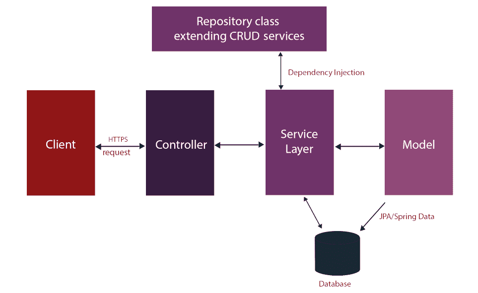
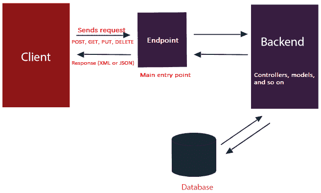
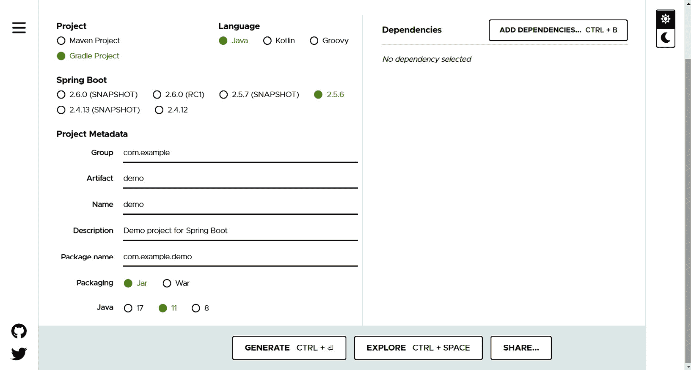
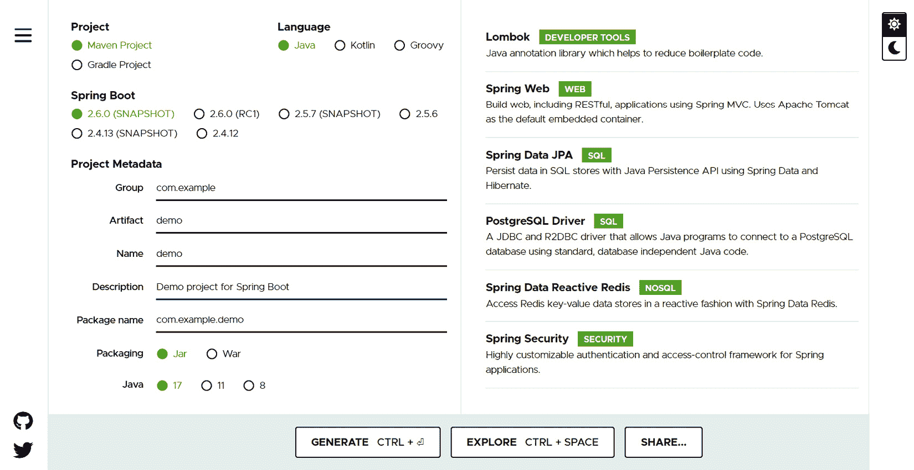
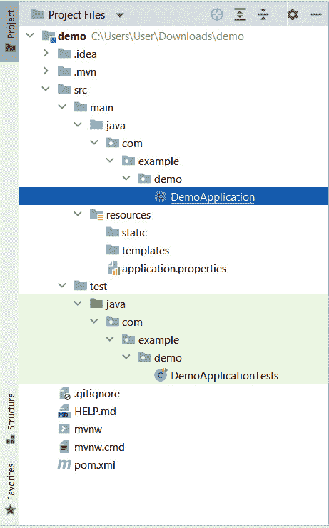
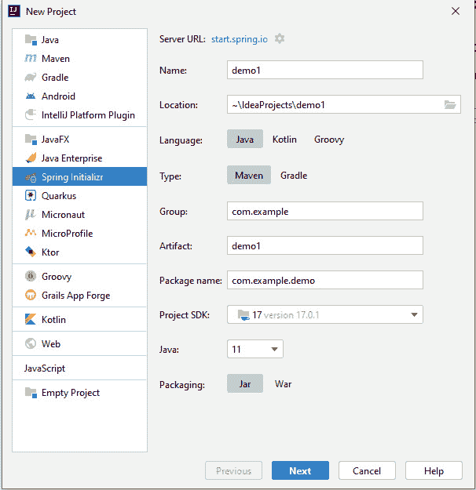

# 第三章：进入 Spring Boot

在上一章中，你学习了如何使用 Java 和你的 Angular 应用程序设置你的开发环境来开发你的 REST API。我们还安装了 SDKMAN! 来管理多个版本的 Java，一个 REST 客户端来测试 API 而不使用第三方工具，Angular DevTools 来调试你的 Angular 应用程序，以及 Git 用于代码版本控制和协作。

本章将教你 Spring Boot 的概念。我们将深入探讨 Spring Boot 的基础和我们需要学习的开发后端应用程序的基本知识。我们还将学习如何使用 Spring Initializr 创建 Spring Boot 项目。

本章将涵盖以下主题：

+   理解 Spring Boot

+   使用 Spring Initializr

+   依赖注入

+   Bean 和注解

# 技术要求

完成本章你需要以下内容：

+   **用于构建后端**：JetBrains 的 IntelliJ IDEA 和 Java 17 SDK

+   **用于生成 Java 项目**：Spring Initializr

注意

由于这里的大部分主题都是理论，并包含一些示例代码，因此第 1 到 4 章将不会有存储库目录。实际的应用程序项目将从 *w*，*使用 Spring 构建 API* 开始。

# 理解 Spring Boot

我们已经在 *第一章* 中讨论了 Spring 的概述，*Spring Boot 和 Angular – 大图景*。在本节中，我们将更深入地了解 Spring Boot 的基本概念，以便构建你的后端应用程序，但首先，让我们回顾一下 Spring Boot 是什么以及它的显著优势。

**Spring Boot** 是来自 Pivotal 的开源微框架。它是一个面向企业级开发者的框架，用于在 **Java 虚拟机**（**JVMs**）上创建独立应用程序。它的主要重点是缩短你的代码长度，以便你更容易运行应用程序。

该框架扩展了 Spring 框架，允许以更有见地的方来配置你的应用程序。此外，它还内置了自动配置功能，可以根据你的设置配置 Spring 框架和第三方包。

这里是 Spring Boot 的显著优势：

+   **自动配置**：当配置你的 Spring Boot 应用程序时，它会下载运行应用程序所需的所有依赖项。

+   **有见地的方法**：Spring Boot 使用一种基于应用程序需求的有见地的方法来安装依赖项。手动配置被移除，因为它添加了应用程序所需的包。

+   **Spring starters**：我们可以在初始化过程中选择一系列的启动依赖项来定义应用程序预期的需求。一个例子是 Spring Web，它允许我们初始化一个基于 Spring 的 Web 应用程序。

现在，我们已经了解了 Spring Boot 及其优势。接下来，让我们讨论 Spring Boot 的架构。

## Spring Boot 架构

Spring Boot 由不同的层和类组成，用于处理后端中的数据和逻辑。以下是其四个层及其用途：

1.  **表示/显示层**：表示层负责将 JSON 参数解释为对象。这一层是上层，也负责处理身份验证和 HTTP 请求。在完成 JSON 转换和身份验证后，我们现在将转向业务层。

1.  **业务层**：正如其名所示，业务层处理应用程序中的所有业务逻辑。它由执行授权和额外验证的服务类组成。

1.  **持久层**：持久层主要负责将对象从数据库行转换为存储逻辑，以插入数据。

1.  **数据库层**：数据库层执行 **创建、读取、更新和删除**（**CRUD**）操作。该层可以由多个数据库组成。

Spring Boot 架构依赖于 Spring 框架。该框架使用其所有功能，例如 Spring `DAOimpl` 类。

现在，让我们讨论 Spring Boot 流程架构，我们将看到数据如何在应用程序内部处理。

## Spring Boot 流程架构

Spring Boot 流程架构将解释 HTTP 请求的处理方式和层之间的通信方式。流程由控制器、服务层、数据库和模型组成。为了更好地理解，让我们看一下以下图表。



图 3.1 – Spring Boot 流程架构

在 Spring Boot 流程架构中，首先发生的是客户端向控制器发送一个请求（一个 HTTPS 请求）。控制器映射请求并决定如何处理它。接下来，它调用服务层，在那里执行所有业务逻辑，并从存储库类中获取操作所需的额外依赖项。服务层还负责对表示为模型的数据执行逻辑，并将由 JPA 用于插入数据库。

我们已经学习了 Spring Boot 架构的流程。现在，我们将讨论 **表示状态转换**（**REST**）及其概念。

## 理解 REST

在我们开始构建我们的后端应用程序之前，我们必须首先了解 REST 的概念，因为这是我们为后端应用客户端应用程序可消费而将应用的主要架构方法。

REST 是一种旨在使网络服务更有效的网络服务。它允许通过 **统一资源标识符**（**URI**）直接访问应用程序，并提供 XML 或 JSON 格式的资源，使其更加灵活。

URI 是两个应用程序之间通信的地方。将其视为后端和前端通信的桥梁。客户端（前端）请求一个资源，并以 XML 或 JSON 格式返回一个响应。请求资源使用以下 HTTP 方法：

+   `GET`：这用于获取和读取资源。

+   `POST`：这会创建一个新的资源。

+   `PUT`：这会更新现有资源。

+   `DELETE`：这会删除一个资源。

让我们用一个简单的现实世界示例（一个博客应用程序）来举例，其中我们使用 HTTP 方法通过提供的端点访问资源：

+   `GET /user/{id}/blogs`：这会获取特定用户的博客列表。

+   `POST /user/{id}/blog`：这为特定用户创建一个博客。

+   `PATCH /user/{id}/blog/{blog_id}`：这会更新特定用户的一个现有博客。

+   `DELETE /user/{id}/blog/{blog_id}`：这会删除特定用户的一个现有博客。

在前面的示例中，我们使用 HTTP 方法和端点请求资源。端点在响应体中以 XML 或 JSON 的形式返回一个对象。REST 还支持标准状态码，这将定义我们的请求是否成功。以下是一些常用状态码的列表：

+   `200`：请求成功的状态

+   `201`：表示一个对象已成功创建

+   `400`：表示一个错误的请求——通常发生在请求体无效时

+   `401`：未经授权访问资源

+   `404`：表示资源未找到

+   `500`：表示内部服务器错误

状态码是客户端应用程序在 HTTP 调用后将要执行的有用指示，概述了我们可以如何使用 REST 在客户端和服务器通信中。



图 3.2 – 客户端和服务器应用程序之间的通信

在本节中，我们学习了 Spring Boot 的概念和架构。我们还现在知道了 REST 的理念以及它是如何提供后端解决方案的。在下一节中，我们将使用 Spring Initializr 生成我们的新 Spring Boot 项目。

# 使用 Spring Initializr

本节将解释**Spring Initializr**是什么以及如何配置和启动我们的项目。Spring Initializr 是一个可以即时生成 Spring Boot 项目的 Web 应用程序。Spring Initializr 将配置构建文件，包含运行我们的项目所需的依赖项，仅关注应用程序中的代码。Spring Initializr 通过侧边的**Spring Boot CLI**帮助我们配置应用程序，使得设置项目更加容易。Spring Initializr 生成一个更传统的 Java 结构。

有几种方法可以使用 Spring Initializr：

+   通过基于 Web 的界面

+   通过 IntelliJ IDEA

我们将讨论生成我们的 Spring Boot 应用程序的不同方法。

## 基于 Web 的界面

使用 Spring Initializr 的第一种方式是通过基于 Web 的界面。应用程序可以通过 [`start.spring.io`](https://start.spring.io) 访问。一旦打开链接，您将看到以下表单：



图 3.3 – Spring Initializr

表单将要求您提供一些关于您项目的基本信息。第一个问题是，*您在 Maven 和 Gradle 之间如何选择来构建您的项目？* 应用程序还需要有关您将使用哪种语言、工件名称、项目名称和要使用的包名称以及构建应用程序时将使用的 JDK 版本的信息。

现在，在界面的右侧，您将看到 **添加依赖项** 按钮。**添加依赖项** 功能是 Spring Initializr 最重要的功能之一，因为它将允许我们根据项目的需求选择依赖项。例如，如果我们需要一个具有 JPA 访问的数据库，我们应该添加 Spring Data JPA。

因此，我们在以下示例中添加了 **Lombok**、**Spring Web**、**Spring Data JPA**、**PostgreSQL 驱动程序** 和 **Spring Data Reactive Redis**。我们将在构建示例应用程序的过程中讨论每个依赖项。



图 3.4 – 使用依赖项生成 Spring Boot

在前面的示例中，我们可以看到我们已经在我们的项目中添加了所需的依赖项。最后一步是通过点击 **生成** 按钮来生成我们的应用程序；这将下载一个包含我们的应用程序的 zip 文件。在生成项目之前，我们可以点击 **探索** 按钮来检查我们的项目结构和验证配置。

成功下载生成的 Spring Boot 应用程序后，我们将解压文件，现在我们可以使用我们选择的 IDE 打开 Spring Boot 项目。最后，我们准备好编写代码了，但首先，让我们看看 Spring Initializr 生成的项目结构。



图 3.5 – 生成的 Spring Boot 应用程序

从生成的项目中我们可以看到，其中包含的应用程序代码并不多。然而，项目包括以下内容：

+   `DemoApplication.java`：一个包含应用程序启动 `main()` 函数的类

+   `DemoApplicationTests.java`：一个空的 JUnit 测试类，用于单元测试

+   `Pom.xml`：一个包含应用程序所需依赖项的 Maven 构建规范

+   `Application.properties`：一个用于添加配置属性的属性文件

我们可以在生成的项目中看到包括空目录，例如 `static` 文件夹；这很重要，因为这个文件夹用于放置 CSS 和 JavaScript 等静态内容文件。

我们已经成功使用网络界面生成了我们的 Spring Boot 项目。现在，我们将直接在 IntelliJ IDEA 中使用 Spring Initializr。

## 通过 IntelliJ IDEA

另一种生成我们的 Spring Boot 项目的办法是直接在 IntelliJ IDEA 中使用 Spring Initializr；请注意，这仅在 IntelliJ 的 Ultimate 版本中可用。如果你使用的是 Community 版本，你可以在以下链接中安装 Spring Assistant：[`plugins.jetbrains.com/plugin/10229-spring-assistant`](https://plugins.jetbrains.com/plugin/10229-spring-assistant)。这将添加一个 Spring Assistant 选项来生成你的 Spring Boot 项目。

执行以下步骤：

1.  在打开 IntelliJ IDEA 并开始生成项目时选择 **新建项目**，这将打开一个新模态窗口。

1.  选择 **Spring Initializr**，这将打开一个与 Spring Initializr 相同的网络界面表单。

1.  它将要求提供诸如项目名称、将要使用的语言、工件名称以及用于构建项目的 SDK 版本等详细信息：



图 3.6 – 使用 IntelliJ IDEA 与 Spring Initializr 的表单

我们可以在前面的图中看到，我们已经为我们的项目填写了所有必要的详细信息。

1.  点击 **下一步** 按钮将带我们转到 **依赖项** 选择页面。我们将选择用于 Spring Boot 开发的依赖项，这些依赖项与我们在 Sprint Initializr 界面中输入的相同。

1.  在成功检查依赖项后，点击 **完成**，我们的 Spring Boot 应用程序配置完成。最后，我们准备好编写代码。

我们已经通过 Spring Initializr 网络界面和内置的 IntelliJ IDEA 成功生成了 Spring Boot 应用程序。在下一节中，我们将学习 Spring Boot 中最重要且最常用的概念之一——依赖注入。

# 依赖注入

我们已经成功生成了自己的 Spring Boot 项目，现在，我们将开始学习 Spring 的概念，其中最重要的概念之一是我们需要理解的 **依赖注入**。随着我们使用 Spring Boot 开发后端，我们将在整个开发过程中主要使用依赖注入，因为这使我们的 Java 程序模块化，并使实现之间的切换更加容易。

依赖注入是面向对象编程语言的一个基本特性，但首先，让我们讨论一下控制反转的概念，这正是依赖注入试图实现的目标。

## 控制反转

**控制反转**（**IoC**）是面向对象编程语言中使用的模式。IoC 是反转程序流程的概念，它用于解耦应用程序中的组件，使代码可重用且模块化。因此，IoC 设计模式将为我们提供一种将自定义类注入到应用程序中其他类的方法。

注入的类将在我们应用程序的不同部分实例化。我们不是让我们的类决定其实现或进行代码修复，而是允许依赖注入改变类的流程、性能和代码，具体取决于情况。因此，IoC 主要提供灵活性和模块化，但也为设计应用程序提供了其他几个优点：

+   控制对象的生命周期，我们可以将一些对象定义为单例，而一些对象可以有它们的实例。

+   由于代码减少了可重用组件，这使得应用程序更容易维护。

+   组件的测试更加容易管理，因为我们可以隔离组件并模拟它们的依赖项，而不覆盖将不包括在单元测试中的其他代码。

我们已经了解了 IoC 模式及其在开发应用程序中的优势。现在，我们将使用依赖注入，这允许我们实现这种模式。

## 依赖注入的基本原理

我们已经讨论了 IoC 的工作原理，它是通过允许实现通过向对象提供依赖项来决定的。因此，这个想法主要是**依赖注入**。我们允许对象或类接受其他依赖项，这些依赖项可以提供不同类的实现，而无需再次编写它们，使我们的代码更加灵活和可重用。依赖注入可以通过不同的方式实现，以下是一些实现方法。

### 基于构造器的依赖注入

**基于构造器的依赖注入**可以通过创建一个具有构造函数的对象类来实现，该构造函数的参数类型表示我们可以设置的依赖项。

让我们看一下以下代码示例：

```java
package com.springexample;
/* Class for Student */
public class Student {
   private Grades grades;
   public Student(grades: Grades) {
      this.grades = grades;
   }
   public void retrieveGrades() {
      grades.getGrades();
   }
}
```

在前面的示例中，`Student`类有一个构造函数`public Student() {}`，它接受一个类型为`Grades`的参数。构造函数允许我们在`Student`中注入一个`Grades`对象，使得`Grades`对象的所有实现都可以在`Student`对象中访问。现在，我们已经访问了`Student`中的`getGrades()`方法。要使用`Student`对象，我们将执行以下示例：

```java
package com.springexample;
import org.springframework.context.ApplicationContext;
import org.springframework.context.support.ClassPathXmlApplicationContext;
public class Main {
   public static void main(String[] args) {
      ApplicationContext context =
        new  ClassPathXmlApplicationContext("Beans.xml");
      Student student =
        (Student) context.getBean("student");
      student.retrieveGrades();
   }
}
```

在前面的示例中，我们可以看到我们在主类中通过获取`Beans.xml`文件中的 Bean 来实例化一个新的学生。`Beans.xml`文件是我们基于构造器注入的主要配置文件，我们将在这里定义我们的 Bean 及其依赖项。

让我们看看以下示例，了解`Beans.xml`的格式：

```java
<?xml version = "1.0" encoding = "UTF-8"?>
<beans xmlns =
   "http://www.springframework.org/schema/beans"
   xmlns:xsi = "http://www.w3.org/2001/XMLSchema-instance"
   xsi:schemaLocation =
     "http://www.springframework.org/schema/beans
      http://www.springframework.org/schema/beans/
      spring-beans-3.0.xsd">
   <!-- Definition for student bean -->
   <bean id = "student"
     class = "com.springexample.Student">
     <constructor-arg ref = "grades"/>
   </bean>
   <!-- Definition for grades bean -->
   <bean id = "grades"
     class ="com.springexample.Grades"></bean>
</beans>
```

在前面的示例中，我们已经将`Student`和`Grades`对象定义为 Bean。唯一的区别是`Student`对象有一个`constructor-arg`属性，它引用了成绩；这表明我们正在将`Grades`对象注入到我们的`Student`对象中。

我们已经通过使用`Beans.xml`配置实现了基于构造器的依赖注入。我们还可以直接在我们的代码中使用注解来配置我们的 Bean 及其依赖项。

让我们看看如何使用注解配置 bean 和依赖关系的以下示例：

```java
@Configuration
public class AppConfig
{
   @Bean
   public Student student() {
       return new Student(grades());
    }
   @Bean
   public Grades grades() {
      return new Grades();
    }
}
```

在前面的示例中，我们可以看到我们没有使用 XML，而是使用了注解来识别我们的 bean 和配置。例如，`@Configuration`注解表示`AppConfig`类是 bean 定义的来源，而`@Bean`注解定义了我们的应用程序中的 bean。随着我们继续本章，我们将深入讨论注解和 bean。

我们已经成功地学习了如何通过使用`Bean.xml`和注解来实现基于构造函数的依赖注入。现在，让我们继续到基于 setter 的依赖注入的实现。

### 基于 setter 的依赖注入

当容器调用我们的类的 setter 方法时，可以实现依赖项的注入。因此，我们不会为类创建构造函数，而是创建一个设置对象依赖项的功能。

让我们看看一个基本的代码示例：

```java
package com.springexample;
/* Class for Student */
public class Student {
   private Grades grades;
   public void setGrades(grades: Grades) {
      this.grades = grades;
   }
   public Grades getGrades() {
      return grades;
   }
   public void retrieveGrades() {
      grades.getGrades();
   }
}
```

在前面的示例中，我们可以看到我们创建了一个名为`setGrades()`的 setter 方法，它接受一个`Grades`对象，其主要功能是为`grades`依赖项设置一个值。

我们不是使用带参数的构造函数，而是使用 setter 来将我们的依赖项注入到我们的对象中。

要使用`Student`对象，让我们看看以下示例：

```java
package com.springexample;
import org.springframework.context.ApplicationContext;
import org.springframework.context.support.ClassPathXmlApplicationContext;
public class Main {
   public static void main(String[] args) {
      ApplicationContext context = new
        ClassPathXmlApplicationContext("Beans.xml");
      Student student =
        (Student) context.getBean("student");
      student.retrieveGrades();
   }
}
```

在前面的示例中，我们可以看到它与使用 setter-based 对象和 constructor-based 对象的方式相同。这里的区别在于我们在`Bean.xml`中如何配置我们的 bean。

让我们看看 setter-based 依赖注入的`Beans.xml`示例：

```java
<?xml version = "1.0" encoding = "UTF-8"?>
<beans xmlns =
   "http://www.springframework.org/schema/beans"
   xmlns:xsi = "http://www.w3.org/2001/XMLSchema-instance"
   xsi:schemaLocation =
     "http://www.springframework.org/schema/beans
      http://www.springframework.org/schema/beans/
      spring-beans-3.0.xsd">
   <!-- Definition for student bean -->
   <bean id = "student"
     class =   "com.springexample.Student">
     <property name="grades" ref = "grades"/>
   </bean>
   <!-- Definition for grades bean -->
   <bean id = "grades"
     class ="com.springexample.Grades"></bean>
</beans>
```

在前面的示例中，我们在`Beans.xml`、`Student`和`Grades`对象中配置了 bean。这里唯一的区别在于我们声明依赖项的方式。我们使用`property`标签而不是`constructor-arg`来定义我们的依赖项。

我们已经成功地使用 setter-based 依赖注入创建了我们的对象，现在，我们将讨论基于字段的依赖注入。

### 基于字段的依赖注入

如其名所示，`@Autowired`注解用于注入。

让我们看看以下将依赖项注入字段的示例：

```java
package com.springexample;
/* Class for Student */
public class Student {
   @Autowired
   private Grades grades;
}
```

在前面的示例代码中，我们没有创建构造函数或 setter 方法来注入我们的依赖项。相反，我们只使用了`@Autowired`注解来注入`Grades`对象。

从表面上看，基于字段的注入可能很简洁，我们的代码中只有注解，方法更少，但我们的`@Autowired`依赖项背后发生了许多事情。例如，它使用反射来注入比构造函数和基于 setter 的注入成本更高的依赖项；它还违反了**单一职责原则**。我们可以在字段中直接添加更多依赖项而无需警告。

我们已经学习了依赖注入的基础知识以及在我们 Java 应用程序中实现它的不同方式。现在，我们将讨论 Spring 中注解和 bean 的概念及其重要性。

# 注解与 bean

**注解与 bean** 是开发 Spring 应用程序的基本组成部分。它们被认为是 Spring 的构建块，使我们的代码更简洁、易于维护。

**Spring 注解**用于定义不同类型的 bean。它们只是标记我们代码的一种元数据形式，提供信息。相反，**bean** 是实例化和创建的对象，可以被其他 bean 注入。我们将在这个部分继续讨论。

## 注解类型

Spring 中的注解根据其功能被分为不同的类型。以下是根据其各自类别分组的注解。

### 核心注解

`org.springframework.beans.factory.annotation` 和 `org.springframework.context.annotation` 包。以下是一个核心注解列表：

+   `@Required`：这个注解应用于 bean 的设置方法，意味着在配置时必须注入依赖。否则，将抛出 `BeanInitializationException`。让我们看看如何使用 `@Required` 注解的以下示例：

    ```java
    public class Car
    ```

    ```java
    {
    ```

    ```java
    private String brand;
    ```

    ```java
    @Required
    ```

    ```java
          public void setBrand(String brand)
    ```

    ```java
          {
    ```

    ```java
            this.brand = brand;
    ```

    ```java
    }
    ```

    ```java
         public Integer getBrand()
    ```

    ```java
         {
    ```

    ```java
           return brand;
    ```

    ```java
         }
    ```

    ```java
    }
    ```

在前面的示例中，我们可以看到 `setBrand()` 方法被注解为 `@Required`；这表示在初始化时必须填充品牌。

+   `@Autowired`：我们在依赖注入（DI）中多次遇到了 `@Autowired` 注解，这主要用于在不使用构造函数和设置方法的情况下注入依赖。让我们看看如何使用 `@Autowired` 注解的以下示例：

    ```java
    package com.springexample;
    ```

    ```java
    public class Car {
    ```

    ```java
       @Autowired
    ```

    ```java
       private Brand brand;
    ```

    ```java
    }
    ```

在前面的示例中，我们可以看到 `@Autowired` 直接应用于字段。这是因为注解使用反射来注入依赖，涉及的过程比构造函数和设置方法更多。

+   `@ComponentScan`：这个注解是一个类级别的注解，用来指示我们想要扫描的包。`@ComponentScan` 可以接受关于要扫描的特定包的参数，如果不提供任何参数，将允许当前包及其所有子包。让我们看看如何使用 `@ComponentScan` 的以下示例：

    ```java
    @Configuration
    ```

    ```java
    @ComponentScan
    ```

    ```java
    public class SpringApp
    ```

    ```java
      {
    ```

    ```java
       private static ApplicationContext
    ```

    ```java
         applicationContext;
    ```

    ```java
       @Bean
    ```

    ```java
       public SpringBean springBean()
    ```

    ```java
       {
    ```

    ```java
          return new SpringBean();
    ```

    ```java
       }
    ```

    ```java
       public static void main(String[] args) {
    ```

    ```java
         applicationContext = new
    ```

    ```java
           AnnotationConfigApplicationContext(
    ```

    ```java
            SpringComponentScanApp.class);
    ```

    ```java
      }
    ```

    ```java
    }
    ```

在前面的示例中，我们可以看到 `@ComponentScan` 注解被应用于 Spring 的 `App` 类，通常与 `@Configuration` 注解一起实现。假设 `SpringApp` 位于 `com.example.spring.app` 包下；这将扫描该包及其子包，如果存在现有的 bean。

+   `@ComponentScan`：这个注解也是一个类级别的注解，用来指示一个类是 Spring 容器在运行时将处理的 bean 定义源。让我们看看如何使用 `@ComponentScan` 注解的以下示例：

    ```java
    @Configuration
    ```

    ```java
    public class SpringApp {
    ```

    ```java
        @Bean(name="demoBean")
    ```

    ```java
        public DemoBean service()
    ```

    ```java
        {
    ```

    ```java
        }
    ```

    ```java
    }
    ```

在前面的示例中，我们可以看到 `@Configuration` 注解被应用于 `SpringApp` 类，这表示 `SpringApp` 将是 bean 的来源。

+   `@Bean`：这个注解是一个方法级注解，用于告诉方法生成一个 bean。让我们看看以下如何使用 `@Bean` 注解的示例：

    ```java
    @Configuration
    ```

    ```java
    public class AppConfig {
    ```

    ```java
        @Bean
    ```

    ```java
        public BeanExample beanExample() {
    ```

    ```java
            return new BeanExampleImlp();
    ```

    ```java
        }
    ```

    ```java
    }
    ```

在前面的示例中，`@Bean` 注解被应用于 `beanExample` 方法。一旦 `JavaConfig` 遇到该方法，它将被执行并将返回值注册为 `BeanFactory` 中的一个 bean，如果没有指定名称，则名称将与方法名称相同。

`@Bean` 注解也可以在 Spring XML 中配置，等效的配置如下：

```java
<beans>
    <bean name="transferService"
      class="com.acme.TransferServiceImpl"/>
</beans>
```

### 类型注解

**类型注解**主要用于在应用程序上下文中动态创建 Spring bean。以下是一系列类型注解的列表：

+   `@Component`：这是主要的类型注解。与 `@Bean` 注解一样，`@Component` 注解用于定义一个 bean 或 Spring 组件。两者的区别在于 `@Component` 应用在类级别，而 `@Bean` 应用在方法级别。

另一个区别是，如果类位于 Spring 容器外部，`@Component` 类不能用来创建 bean，而我们可以使用 `@Bean` 注解即使在类位于 Spring 容器外部的情况下也能创建 bean。让我们看看以下如何使用 `@Component` 注解的示例：

```java
@Component
public class Car
{
.......
}
```

我们可以在前面的示例中看到，`@Component` 注解被应用于 `Car` 类。这意味着这将创建一个运行时的 `car` bean。我们还需要记住，`@Component` 注解不能与 `@Configuration` 注解一起使用。

+   `@Service`：这个注解用于服务层，表示一个类用于执行业务逻辑、进行计算和调用外部 API。`@Service` 是一种 `@Component` 注解。

+   `@Repository`：这个注解用于直接访问数据库的类。这是一个表示执行数据访问对象角色的类的指示。

+   `@Controller`：这些注解用于 Spring 控制器类。它也是一种 `@Component` 注解，用于 Spring MVC 和使用 `@RequestMapping` 注解的方法，后者用于 REST。

### Spring Boot 注解

这些注解是专门为 Spring Boot 创建的，这主要是几个注解的组合。以下是一系列 Spring Boot 注解的列表：

+   `@EnableAutoConfiguration`：这个注解用于自动配置类路径中存在的 bean，然后配置它以运行方法。这个注解现在很少使用，因为 `@SpringBootApplication` 已经在 Spring 1.2.0 中发布。

+   `@SpringBootApplication`：这个注解是 `@EnableAutoConfiguration`、`@ComponentsScan` 和 `@Configuration` 的组合。

### REST 注解

这些是用于创建端点、指定 HTTP 请求和序列化返回对象的专用注解。以下列表显示了不同的 REST 注解：

+   `@RequestMapping`: 这用于创建端点和映射网络请求。注解可以在类或方法中使用。

+   `@GetMapping`: 这将映射 HTTP `GET`请求，用于获取数据，并且它与`@RequestMapping(method = RequestMethod.GET)`等价。

+   `@PostMapping`: 这将映射 HTTP `POST`请求，用于创建数据，并且它与`@RequestMapping(method = RequestMethod.POST)`等价。

+   `@PostMapping`: 这将映射 HTTP `PUT`请求，用于更新数据，并且它与`@RequestMapping(method = RequestMethod.PUT)`等价。

+   `@DeleteMapping`: 这将映射 HTTP `PUT`请求，用于删除数据，并且它与`@RequestMapping(method = RequestMethod.DELETE)`等价。

+   `@DeleteMapping`: 这将映射 HTTP `PATCH`请求，用于对数据进行部分更新，并且它与`@RequestMapping(method = RequestMethod.PATCH)`等价。

+   `@RequestBody`: 这用于将 HTTP 请求绑定到方法参数中的对象。Spring 框架将参数的 HTTP 请求体与`@RequestBody`注解绑定。

+   `@ResponseBody`: 这将方法的返回值附加到响应体上。该注解表示返回对象应该被序列化为 JSON 或 XML 格式。

+   `@PathVariable`: 这用于从 URI 中获取值。在方法中可以定义多个`@PathVariable`实例。

+   `@RequestParam`: 这用于从 URL 中获取查询参数。

+   `@RequestHeader`: 这用于提取关于传入 HTTP 请求头部的详细信息。我们在方法参数中使用这个注解。

+   `@RestController`: 这是`@Controller`和`@ResponseBody`注解的组合。这个注解的重要性在于它防止了在每个方法上使用`@ResponseBody`注解。

我们已经了解了不同类型的注解及其在 Spring 中的应用。现在，我们将在下一节讨论并理解 Spring 应用程序中 bean 的实际定义和重要性。

## 理解 bean

我们在上一节已经多次遇到了 bean。我们学习了如何使用`@Bean`和`@Component`注解创建和初始化 bean，但主要问题是，*bean 在 Spring 应用程序中的主要用途是什么？*

**bean**是 Spring 框架的核心概念，我们需要理解它。了解其目的和功能对于有效地使用 Spring 框架至关重要。

在 Spring 中定义 bean，它是一个由 Spring IoC 容器管理的对象，构成了应用程序的骨干。这些是我们主要用来处理数据和注入依赖以创建多个实现的对象。为了更好地理解，让我们看看一些 bean 的例子。

假设我们有一个名为`Car`的域类：

```java
public class Car
{
  private Brand brand;
  public Car (Brand brand)
  {
  this.brand = brand;
  }
}
```

在示例中，我们可以看到汽车需要一个`Brand`依赖。`Brand`类有如下代码：

```java
public class Brand
{
  private String name;
  private int year;
  public Address(String name, int year)
  {
     this.name = name;
     this.year = year;
  }
}
```

典型的做法是在创建新的`Car`类实例时创建一个新的`Brand`类实例，并将其作为参数传递。这种方法可以正常工作，但当有多个类时可能会引起问题。因此，更好的做法是，对象不是自己构建依赖项，而是可以从 IoC 容器中以 bean 的形式检索它们的依赖项。

因此，我们只需要使用注解或 XML 配置 bean 和依赖项，以标识特定对象所需的依赖项。让我们将前面的示例转换为 bean：

```java
@Component
public class Car
{
 . . . .
}
```

我们将使用`@Component`注解来标注`Car`类，以将其识别为`Bean`：

```java
@Configuration
@ComponentScan(basePackageClasses = Car.class)
public class Config
{
  @Bean
  public Brand getBrand() {
   return new Brand("Toyota", 2021);
  }
}
```

接下来，我们需要做的是创建一个配置类。在前面的示例中，我们已经使用`@Configuration`和`@ComponentScan`注解来标注这个类，以标识这是一个配置类；这将生成一个类型为`Brand`的`Bean`，配置了`Brand`类作为`Bean`。我们只需要从应用程序上下文中拉取 bean，依赖项已经注入：

```java
ApplicationContext context = new AnnotationConfigApplicationContext(Config.class);
Car car = context.getBean("car", Car.class);
// execute function
car.getName()
car.getYear()
```

在前面的示例代码中，我们可以看到我们已经从应用程序上下文中提取了`Car`对象。因此，我们可以自动使用`Brand`依赖项的 getter 方法；这意味着 IoC 容器管理着 bean 及其依赖项。

# 摘要

通过这种方式，我们已经到达了本章的结尾。让我们回顾一下你学到的宝贵知识。你已经学习了 Spring Boot 的基础知识、其架构和 REST 的基本知识。你还学习了如何使用 Spring Initializr 创建自己的 Spring Boot 项目。

依赖注入允许对象或类接受其他依赖项，这些依赖项可以实现不同的类，而无需再次编写它们。注解定义了不同类型的 bean；它们只是标记我们的代码以提供信息的一种元数据形式。

最后，bean 是 Spring IoC 容器管理的应用程序的骨架对象。

在下一章中，我们将学习如何设置数据库并使用 Spring Data JPA。
