# 第四章：设置数据库和 Spring Data JPA

在上一章中，您学习了 Spring Boot 的基本知识，以开发我们的后端应用程序，例如依赖注入、bean 和注解。此外，我们现在知道如何使用 Spring Initializr 创建 Spring Boot 项目。

本章将教授您如何通过添加 PSQL 容器和 PostgreSQL 依赖项以及使用**Java 持久化** **API**（**JPA**）来访问数据，将您的 Spring Boot 应用程序连接到数据库。

本章将涵盖以下主题：

+   使用 PSQL 容器连接到数据库

+   Spring Data JPA

+   添加 Spring Data JPA 和 PostgreSQL 依赖项

+   连接到数据库

# 技术要求

完成本章所需的内容如下：

+   **PostgreSQL**：[`www.postgresql.org/download/windows/`](https://www.postgresql.org/download/windows/)

+   **pgAdmin**：[`www.pgadmin.org/download/`](https://www.pgadmin.org/download/)

+   **Docker**：[`docs.docker.com/get-docker/`](https://docs.docker.com/get-docker/)

# 使用 PSQL 容器连接到数据库

本节将教授我们如何通过使用传统方法、安装程序或通过 Docker 容器在我们的终端中设置和配置我们的 PostgreSQL。但首先，让我们讨论一下 PostgreSQL 是什么以及它的优势是什么。

## PostgreSQL

**PostgreSQL**是一个开源的对象关系型数据库系统，使用 SQL 语言来存储和处理复杂和大量工作负载。PostgreSQL 还支持*SQL（关系型）*和*JSON（非关系型）*查询。由于其灵活性和丰富的功能，它通常用作地理空间和分析应用程序的主要数据存储。其社区已经持续改进并支持它超过 20 年，为数据库系统添加更多功能和可靠性。

PostgreSQL 的灵活性意味着它在开发应用程序中得到了广泛应用。以下是一些日常用例：

+   **科学数据**：研究项目在存储数据方面可能要求较高，这需要有效且高效的处理。PostgreSQL 提供了分析功能和强大的 SQL 引擎，可以处理大量数据。

+   **金融行业**：PostgreSQL 因其分析能力和易于与数学软件（如 MATLAB 和 R）集成而用于金融公司。

+   **Web 应用程序**：PostgreSQL 也广泛应用于 Web 应用程序中，因为现在的应用程序需要处理数千条数据。它与现代 Web 框架（如 Node.js、Hibernate PHP 和 Django）兼容。

+   **政府 GIS 数据**：PostgreSQL 提供如 PostGIS 等扩展，提供处理几何数据的功能。

### PostgreSQL 的功能

下面是 PostgreSQL 提供的一些功能列表：

+   **兼容多种数据类型**：PostgreSQL 兼容多种数据类型：

    +   **结构化**：数组、日期和时间、**通用唯一识别码**（**UUIDs**）和范围

    +   **自定义**：自定义类型和组合

    +   **原语**：字符串、整数、数值和布尔值

    +   **几何**：多边形、圆、线和点

    +   **文档**：XML、JSON/JSONB 和键值

+   **支持 SQL 的不同功能**：它提供了 SQL 的各种功能，如下所示：

    +   多种索引，如 B 树和表达式

    +   SQL 子查询

    +   复杂 SQL 查询

    +   **多版本并发控制**（**MVCC**）：

        +   表分区

+   `UNIQUE`

+   `NOT NULL`

+   **安全数据库**：它遵循标准安全协议，包括以下内容：

    +   身份验证，如**轻量级目录访问协议**（**LDAP**）、SCRAM-SHA-256 和**安全支持提供程序**接口（**SSPI**）

    +   支持列和行级安全*   **高度可扩展**：它提供了几个功能，使其可修改，如下所示：

    +   JSON/SQL 路径表达式

    +   存储过程和函数

    +   与外部数据包装器的兼容性

现在我们已经了解了 PostgreSQL 的功能和用例，让我们继续在我们的终端上安装它。

## 安装 PostgreSQL

我们有两种方法可以在开发终端上设置我们的 PostgreSQL。两种方法如下：

+   **传统方法**：直接从 PostgreSQL 网站下载安装程序。

+   **Docker 容器上的 PostgreSQL**：直接将我们的应用程序连接到容器。

### 传统方法 – 在 Windows、macOS 和 Linux 上安装

PostgreSQL 主要是在类 Unix 平台上开发的。然而，它被设计成可移植的，可以在 Windows 和 macOS 平台上安装。

我们需要采取的第一步是通过此 URL 下载 PostgreSQL 安装程序：[`www.enterprisedb.com/downloads/postgres-postgresql-downloads`](https://www.enterprisedb.com/downloads/postgres-postgresql-downloads)。

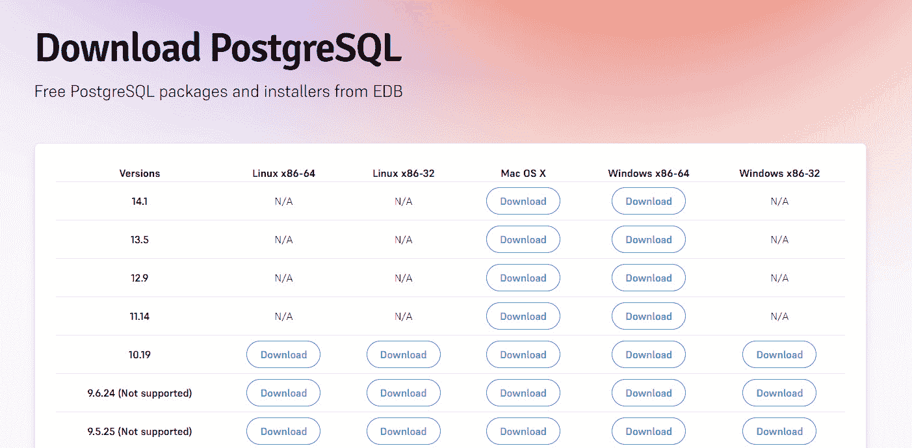

图 4.1 – PostgreSQL 安装

三个操作系统的步骤相同，我们只需要配置一些设置：

1.  点击最新版本（**14.1**）并下载安装程序，具体取决于您的操作系统。

1.  成功下载后，打开安装程序，点击**下一步**，并指定 PostgreSQL 的安装路径：

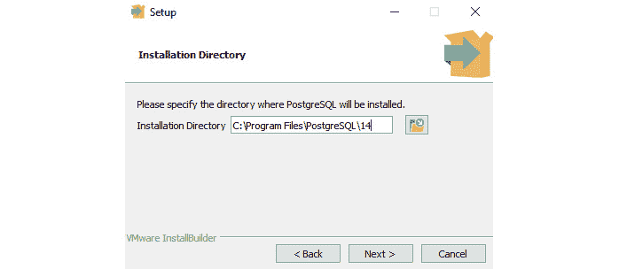

图 4.2 – PostgreSQL 安装程序（指定安装路径）

在前面的示例中，我们选择了默认的安装路径。再次点击**下一步**，这将询问我们想要安装哪些组件。我们选择的组件如下：

+   **PostgreSQL 服务器**：安装我们的数据库将运行的服务器

+   **pgAdmin 4**：一个用于与数据库交互的 GUI 管理工具

+   **Stack Builder**：一个 GUI，允许我们下载和安装与 PostgreSQL 兼容的驱动程序

+   **命令行工具**：提供使用命令行工具与 PostgreSQL 交互：

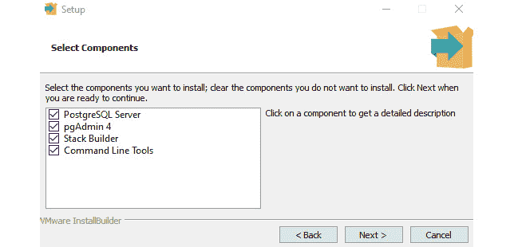

图 4.3 – PostgreSQL 安装程序（选择所需组件）

在前面的示例中，我们已经检查了所有组件，因为我们将在整个开发过程中需要它们。

1.  再次点击 **下一步**，您将被要求指定存储数据的目录：

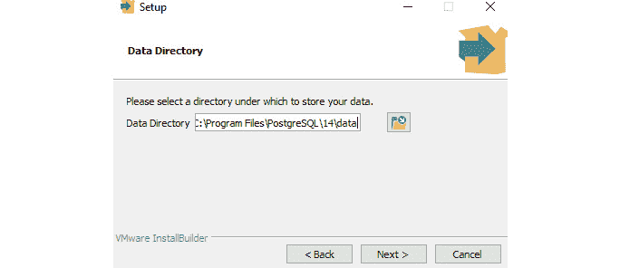

图 4.4 – PostgreSQL 安装程序（选择数据目录）

在前面的示例中，我们可以看到默认路径与 PostgreSQL 安装的位置相同，并且它已经创建了一个名为 `data` 的新文件夹。建议您使用默认路径。

1.  点击 `postgres`）。

1.  点击 `postgres` 数据库。

1.  再次点击 **下一步**，现在您将被询问数据库集群应使用哪个区域设置：

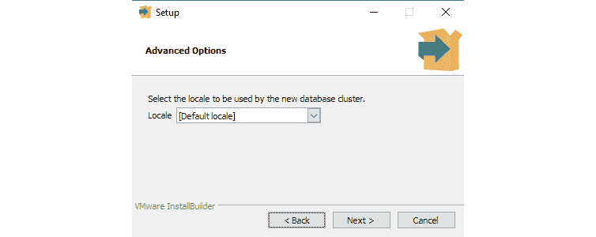

图 4.5 – PostgreSQL 安装程序（选择数据库集群的区域设置）

在前面的示例中，我们已经选择了 **[默认区域设置]** 作为我们的数据库区域设置。

1.  再次点击 **下一步**，这将显示我们已配置的所有设置；在继续之前，请确保所有细节都是正确的。

1.  审查后，点击 **下一步**，现在将在我们的终端中安装 PostgreSQL。

安装完成后，我们可以通过检查当前安装的版本来验证 PostgreSQL 是否已成功安装。

1.  要做到这一点，请打开 `服务器`、`端口`、`数据库`、`用户名` 和 `密码`。

1.  由于我们已经使用了默认设置，我们可以按 *Enter* 键直到密码确认。在成功验证我们的密码后，执行 `select version()` 命令以显示当前安装的 PostgreSQL：

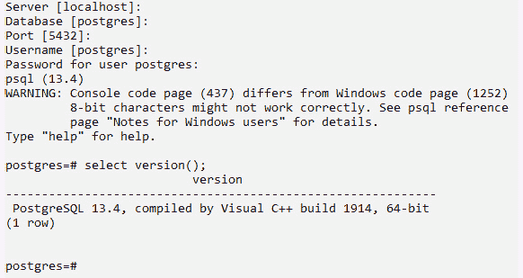

图 4.6 – PostgreSQL 安装程序（显示 PostgreSQL 的版本）

在前面的示例中，我们可以看到我们已经成功在我们的终端上安装了 **PostgreSQL** 版本 **13.4**。

现在，让我们学习如何使用 Docker 安装和配置 PostgreSQL。

### Docker 容器中的 PostgreSQL

我们已经使用传统安装程序在我们的终端上安装了 PostgreSQL；现在，我们将学习如何使用 Docker 配置 PostgreSQL。这种方法将帮助我们跳过配置 PostgreSQL 的复杂步骤，以便我们从开发开始，并提供数据库管理的 GUI：

1.  您需要做的第一步是在您的终端上安装 Docker。您可以在以下链接安装 Docker：[`docs.docker.com/get-docker/`](https://docs.docker.com/get-docker/)。有关 Docker 的系统要求和安装步骤的文档，您可以参考此链接：https://docs.dockerocker.com/desktop/windows/install/。

1.  在成功安装 Docker 后，打开 Docker Desktop 并在终端上启动 Docker。然后，打开您的命令行并执行以下命令：

    ```java
    Docker run --name postgresql-container -p 5434:5434 -e POSTGRES_PASSWORD=pass -d postgres
    ```

上述命令将从 `Docker-hub` 拉取 PSQL。命令中的 `postgresql-container` 部分可以替换，因为这是一个我们可以定义的容器名称。`POSTGRES_PASSWORD` 参数是 `postgres` 管理员的密码，我们也可以配置它。

1.  执行命令后，我们可以通过执行 `Docker ps -a` 命令或查看 Docker Desktop 来验证新创建的容器，以检查正在运行的容器列表：

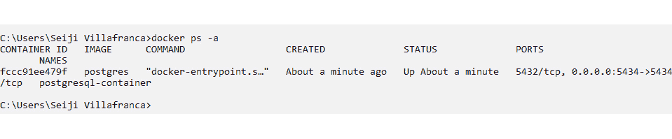

图 4.7 – 使用 Docker 安装 PostgreSQL

在前面的示例中，我们已执行 `Docker ps -a` 命令，我们可以看到我们的 PostgreSQL 镜像已被拉取：

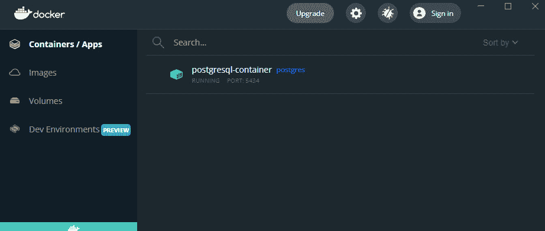

图 4.8 – 使用 Docker 安装 PostgreSQL（在 Docker Desktop 中查看容器）

1.  我们还可以在 Docker Desktop 中查看拉取的 `postgresql-container` 并在我们的终端中验证其状态。

我们已成功使用 Docker 配置了 PostgreSQL。我们可以通过创建一个新的服务器并使用我们的终端 IP 地址和端口来连接到我们的 `pgAdmin`。

我们已在终端中配置了 PostgreSQL 数据库。现在，我们将了解 Spring Data JPA 及其在开发 Spring 应用程序中的重要性。

# Spring Data JPA

**Spring Data JPA**（**Java 持久层 API**）是广泛使用的规范，用于管理 Java 应用程序中的关系数据。它有助于开发 Spring，因为它通过不实现读写操作来减少样板代码。它还处理了基于 JDBC 的数据库访问和对象关系映射的复杂过程。

在讨论 Spring Data JPA 之前，让我们讨论其明显的优势以及为什么它通常在 Spring 开发中被广泛使用。

## Spring Data JPA 的优势

以下为 Spring Data JPA 的优势：

+   **无代码仓库**：Spring Data JPA 推崇 *无代码* 仓库，这意味着我们不需要编写仓库模式，这会生成大量重复的代码。它提供了一组接口，我们可以使用这些接口来扩展我们的类，以应用数据特定的实现。

例如，在我们的应用程序中有一个 `BlogRepository` 类；当我们用 `CrudRepository<Blog, Long>` 接口扩展它时，它将具有以下功能的方法：

+   持久化、更新和删除一个或多个博客实体

+   通过主键查找一个或多个博客

+   计算所有博客

+   验证单个博客是否存在

使用 Spring Data JPA 提供的接口扩展仓库包括所有数据相关的方法，这使我们能够更多地关注业务逻辑。

+   **样板代码减少**: Spring Data JPA 提供了内置的实现方法。正如第一项优点所述，我们只需要关注业务逻辑，不再需要编写接口下的读写操作，这也可以防止人为错误，因为所有实现都已经为我们注册。

+   `findBy`，Spring 将解析名称并创建一个查询：

    ```java
    public interface BlogRepository extends   CrudRepository<Blog, Long> {
    ```

    ```java
    Blog findByAuthor(String author);
    ```

    ```java
    }
    ```

在前面的示例中，我们创建了一个`findByAuthor()`方法，这将允许 Spring 生成一个查询并将参数设置为绑定参数值。一旦我们调用该方法，它将执行查询。

## Spring Data JPA 提供的仓库

Spring Data JPA 提供了提供不同数据相关实现方法的仓库。以下是一些仓库：

+   `CrudRepository`: 提供基本操作（创建、读取、更新、删除）的接口仓库。

+   `PagingAndSortingRepository`: 扩展`CrudRepostiory`并添加一个名为`findAll`的方法，该方法可以排序结果并以分页方式检索。

+   `JpaRepository`: 添加特定的 JPA 方法，并具有`CrudRepository`和`PagingAndSortingRepository`的所有功能。它还添加了如`flush()`这样的方法，该方法刷新持久化上下文，以及`deleteInBatch()`，该方法可以批量删除记录。

我们已经了解了我们可以与 Spring Data JPA 一起使用的不同仓库。现在我们将看看 Spring Boot 上的 Spring Data JPA。

## Spring Boot 上的 Spring Data JPA

为了在我们的应用程序中实现 Spring Data JPA，我们需要以下组件：

+   `Entity`: 这是一个简单的类，用于定义我们的模型。它将被用作 JPA 实体，并带有主键生成。

例如，我们将通过创建一个普通的类并添加`@Entity`注解来创建一个`Villain`实体，以表示`Villain`类是一个 JPA 实体。该实体将被用作扩展我们的仓库的类型：

```java
@Entity
public class Villain {
  @Id
  @GeneratedValue(strategy = GenerationType.AUTO,
                  generator   = "UUID")
  @Column(nullable = false, updatable = false)
  private UUID id;
  @NotNull(message = "First Name is required")
  private String firstName;
  private String lastName;
  private String house;
  private String knownAs;
}
```

我们可以在前面的示例中看到，我们的`Villain`类被注解为`@Entity`，表示它是一个 JPA 实体。我们还定义了一个`UUID`类型的`id`字段，并用`@Id`注解标注，表示这是主键，以及`@GeneratedValue`，其中我们指定这是使用`strategy = GenerationType`自动生成的。`AUTO`和生成的 ID 应该是`UUID`类型，使用`generator = "UUID"`。

+   `Repository`: 这是一个接口，我们需要用它来扩展 JPA 仓库，以便实体具有内置操作。

在前面的示例中，我们有一个`Villain`实体。为了实现 CRUD 操作，我们将创建一个`VillainRepository`接口，并使用`CrudRepository`扩展它，类型为`Villain`和`UUID`：

```java
@Repository
public interface VillainRepository extends CrudRepository<Villain, UUID> {
  // custom composite repository here
}
```

+   `服务`: 这是我们将使用我们创建的仓库的地方。我们可以使用`@Autowired`注解注入仓库并调用 JPA 和自定义方法：

    ```java
    @Service
    ```

    ```java
    public class VillainService {
    ```

    ```java
    private final VillainRepository villainRepository;
    ```

    ```java
    @Autowired
    ```

    ```java
    public VillainService (VillainRepository villainRepository) {
    ```

    ```java
      this. villainRepository = villainRepository;
    ```

    ```java
    }
    ```

    ```java
      public Iterable<Villain> findAllVillains() {
    ```

    ```java
        return villainRepository.findAll();
    ```

    ```java
      }
    ```

    ```java
      public Villain findVillainById(UUID id) {
    ```

    ```java
        return findOrThrow(id);
    ```

    ```java
      }
    ```

在前面的示例中，我们可以看到我们使用`@Autowired`注解在`VillainService`中注入了`VillainRepository`。

让我们继续使用相同的文件进行以下方法的操作：

```java
public void removeVillainById(UUID id) {
    villainRepository.deleteById(id);
  }
  public Villain addVillain(Villain villain) {
    return villainRepository.save(villain);
  }
  public void updateVillain(UUID id, Villain villain) {
    findOrThrow(id);
    villainRepository.save(villain);
  }
  private Villain findOrThrow(final UUID id) {
    return villainRepository
      .findById(id)
      .orElseThrow(
        () -> new NotFoundException("Villain by id " +
          id + " was not found")
      );
  }
}
```

我们还通过使用内置的 JPA 实现创建了方法，例如`save()`、`deleteById()`、`findAll()`和`findById()`，这些方法可以在`CrudRepository`接口中找到。现在，服务可以被注入到我们的控制器或其他服务中以使用这些方法。

我们现在已经了解了 Spring Data JPA、其优势以及 Spring JPA 上的实现概述。在下一节中，我们将学习如何将 Spring Data JPA 和 PostgreSQL 依赖项添加到我们的 Spring Boot 应用程序中。

# 添加 Spring Data JPA 和 PostgreSQL 依赖项

本节将向我们的应用程序添加 Spring Data JPA、PostgreSQL 和其他有价值的依赖项。我们将使用 Spring Initializr 和一个现有的 Spring Boot 项目添加这些依赖项。

## 使用 Spring Initializr 添加

使用 Spring Initializr 创建 Spring Boot 应用程序后添加依赖项很简单。我们只需要在生成项目之前在 Initializr 上选择依赖项：

1.  首件事是访问[`start.spring.io/`](https://start.spring.io/)或您的 IntelliJ IDEA（对于 Ultimate 用户）以打开 Spring Initializr（关于*使用 Spring Initializr*部分的回顾，请参阅*第三章*，*进入* *Spring Boot*）。

1.  选择您的项目是否将使用 Maven 或 Gradle，并设置所需的配置，包括**组**、**工件**、**名称**、**描述**、**包名**、**打包方式**和项目的**Java**版本。

1.  接下来，点击右上角的**添加依赖**并选择以下依赖项：

    +   **Spring Data JPA**：这个依赖项用于添加用于内置数据存储相关实现的 Spring Data JPA。

    +   **H2 数据库**：这是一个支持 JDBC API 和 R2DBC 访问的内存数据库，通常用于单元测试

    +   **PostgreSQL 驱动程序**：这是一个 JDBC 和 R2DBC 驱动程序，它将允许 Java 应用程序连接到 PostgreSQL 数据库：

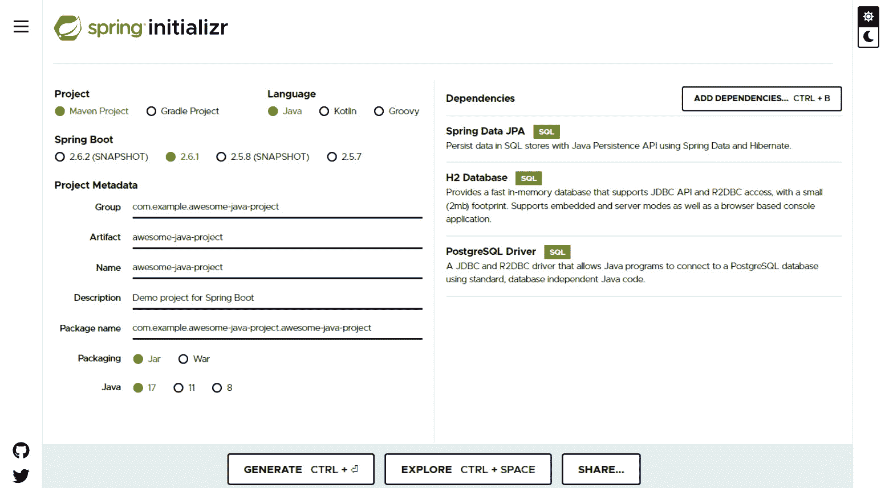

图 4.9 – 在 Spring Initializr 中添加依赖项

在成功添加依赖项后，我们可以看到我们的依赖项已经列出。

1.  点击**生成**，这将下载我们已生成的项目。

1.  解压 ZIP 文件并在您的 IDE 中打开项目。如果您使用 Maven 开发项目，请在`src`文件夹中打开`pom.xml`文件，或者如果您使用的是`build.gradle`，它也位于`src`文件夹中：

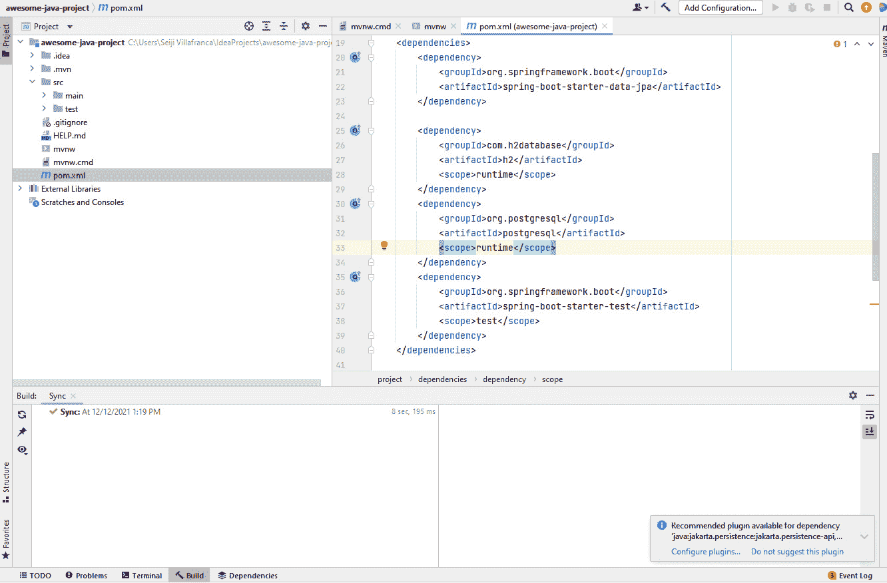

图 4.10 – Spring Boot 应用程序（pom.xml 的视图）

在前面的示例中，我们可以看到 Spring Boot 应用程序是用 Maven 生成的，我们可以看到我们的`pom.xml`文件已经包含了我们在 Spring Initializr 中添加的依赖项：

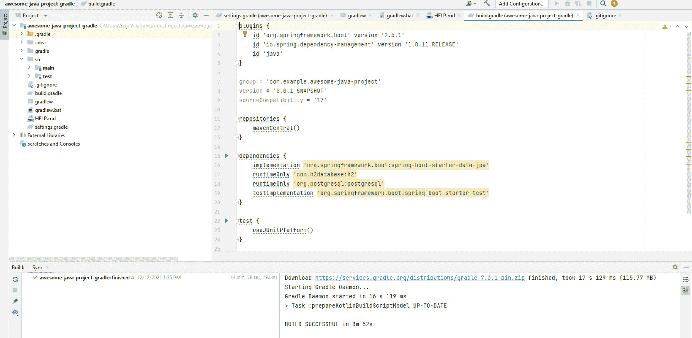

图 4.11 – Spring Boot 应用程序（build.gradle 的视图）

现在，在前面的示例中，Spring Boot 应用程序是用 Gradle 生成的，我们可以看到依赖项列表已经添加到`build.gradle`文件下。

我们现在将向现有 Spring Boot 应用程序添加依赖项。

## 添加现有项目

在前面的示例中，我们添加了依赖项以使用 Spring Initializr 生成我们的 Spring Boot 应用程序。现在，我们将向现有应用程序添加依赖项。向现有 Spring 应用程序添加依赖项很简单；我们只需要修改`pom.xml`（Maven）或`build.gradle`（Gradle）文件。

要使用 Maven 安装 Spring Data JPA、H2 数据库和 PostgreSQL 驱动程序，我们将以 XML 形式添加依赖项，如下所示：

```java
<dependencies>
   <dependency>
      <groupId>org.springframework.boot</groupId>
      <artifactId>spring-boot-starter-data-jpa</artifactId>
   </dependency>
   <dependency>
      <groupId>com.h2database</groupId>
      <artifactId>h2</artifactId>
      <scope>runtime</scope>
   </dependency>
   <dependency>
      <groupId>org.postgresql</groupId>
      <artifactId>postgresql</artifactId>
      <scope>runtime</scope>
   </dependency>
   <dependency>
      <groupId>org.springframework.boot</groupId>
      <artifactId>spring-boot-starter-test</artifactId>
      <scope>test</scope>
   </dependency>
</dependencies>
```

对于使用 Gradle 的 Spring 应用程序，我们将按以下方式添加依赖项：

```java
dependencies {
   implementation 'org.springframework.boot:spring-boot-
   starter-data-jpa'
   runtimeOnly 'com.h2database:h2'
   runtimeOnly 'org.postgresql:postgresql'
}
```

IntelliJ 将自动识别添加的依赖项并为项目安装它们，我们可以成功构建并即时运行 Spring Boot 应用程序。

我们已经学习了如何将 Spring Data JPA 和 PostgreSQL 驱动程序添加到我们的 Spring Boot 应用程序中。在下一节中，我们将学习如何将我们的 Spring Boot 应用程序连接到我们的 PostgreSQL 数据库。

# 连接到数据库

我们已经配置了我们的 PostgreSQL 数据库，并使用所需的依赖项初始化了 Spring Boot 应用程序。现在，我们将学习如何将我们的 PostgreSQL 连接到我们的应用程序。我们可以通过两种方式连接到我们的数据库 – 第一种是使用 Spring JDBC，另一种是 Spring Data JPA。Spring Data JPA 是连接到我们的数据库最方便的方式，但我们将在本节中演示这两种方法。

## 配置数据库属性

我们需要做的第一件事是在我们的 Spring Boot 应用程序中配置数据库属性。我们需要通过在`application.properties`文件中添加以下源代码来指定数据库的服务器 URL、管理员用户名和密码：

```java
spring.datasource.url=jdbc:postgresql://localhost:5432/springDB
spring.datasource.username=postgres
spring.datasource.password=password
```

在前面的示例中，我们可以看到我们已经为我们的 PostgreSQL 配置了基本的连接设置。URL 上的`springDB`将是 PostgreSQL 中数据库的名称，它应该已经存在于我们的服务器上。

## 使用 Spring JDBC 进行连接

连接到数据库的第一种方法是使用 Spring JDBC。我们将为我们的应用程序添加一个额外的依赖项以使用此方法。

要添加 JDBC，我们将以下代码添加到我们的`pom.xml`（Maven）或`build.gradle`（Gradle）文件中：

```java
<dependency>
    <groupId>org.springframework.boot</groupId>
    <artifactId>spring-boot-starter-jdbc</artifactId>
</dependency>
```

在成功添加 JDBC 依赖项后，我们现在可以使用`JdbcTemplate`在我们的应用程序中执行查询：

```java
import org.springframework.beans.factory.annotation.Autowired;
import org.springframework.boot.SpringApplication;
import org.springframework.boot.autoconfigure.SpringBootApplication;
import org.springframework.jdbc.core.JdbcTemplate;
@SpringBootApplication
public class AwesomeJavaProject  {
    @Autowired
    private JdbcTemplate jdbcTemplate;
    public static void main(String[] args) {
        SpringApplication.run(AwesomeJavaProject .class,
                              args);
    }
    @Override
    public void run(String... args) throws Exception {
        String sql = "INSERT INTO blog (title, author,
          body) VALUES ("+ "'Awesome Java Project',
                        'Seiji Villafranca', 'This is an
                         awesome blog for java')";
        int rows = jdbcTemplate.update(sql);
    }
}
```

在前面的示例中，我们可以在我们的应用程序中执行数据库语句，如`INSERT`，并调用`update()`方法来修改数据库中的数据。

## 使用 Spring Data JPA 进行连接

第二种方法是使用 Spring Data JPA 插件。我们需要采取的第一步是向`application.properties`文件添加额外的详细信息：

```java
spring.jpa.hibernate.ddl-auto=update
spring.jpa.show-sql=true
spring.jpa.properties.hibernate.dialect=org.hibernate.dialect.PostgreSQLDialect
spring.jpa.properties.hibernate.format_sql=true
```

在添加了新的设置之后，我们现在可以在我们的应用程序中为特定的表创建`Entity`和`Repository` – 例如，我们有一个`Blog`表：

```java
package net.codejava;
import javax.persistence.*;
@Entity
@Table(name = "blog")
public class Blog {
    @Id
    @GeneratedValue(strategy = GenerationType.IDENTITY)
    private Integer id;
    private String title;
    private String body;
    private String author;
}
```

在前面的示例中，我们创建了一个`Blog`类，并用`@Entity`和`@Table`注解来表示这是一个与我们的数据库表相连的对象：

```java
package net.codejava;
import org.springframework.data.JPA.repository.JpaRepository;
public interface BlogRepository extends JpaRepository<Blog, Integer> {
}
```

在创建我们的实体之后，我们为博客创建了存储库，该存储库可以由 JPA 提供的存储库扩展。现在，`BlogRepository`可以被注入到我们的服务或控制器中，以读取、添加、修改或删除数据库中的数据。

# 摘要

这就结束了本章的内容。让我们回顾一下你学到的宝贵知识。你学习了如何使用安装程序或 Docker 容器在你的本地机器上设置 PostgreSQL。

你还了解了 Spring Boot 中 Spring Data JPA 的概念和优势，以及如何将其添加到你的应用程序中，这对于创建具有 CRUD 功能的服务的代码量较少非常有帮助。

最后但同样重要的是，你学习了如何使用 JDBC 和 Spring Data JPA 将你的 Spring Boot 应用程序与 PostgreSQL 数据库连接起来。

在下一章中，我们将学习如何启动我们的服务器，如何在代码中添加控制器、模型和服务，以及关于 Redis 缓存的介绍。
