# 第七章：健康监控和数据可视化

在本章中，我们将涵盖以下食谱：

+   编写自定义健康指标

+   配置管理上下文

+   发射指标

+   通过 JMX 监控 Spring Boot

+   通过 SSHd Shell 管理 Spring Boot 并编写自定义远程 Shell 命令

+   将微米级指标与 Graphite 集成

+   将微米级指标与 Dashing 集成

# 简介

在上一章中，你学习了一些高效打包应用程序并使其准备就绪以进行部署的技术，我们还探讨了提供环境配置而无需更改代码的多种技术。随着部署和配置问题的解决，最后一个（但同样重要）的步骤是确保我们对应用程序在生产环境中的运行有完整的可见性、监控和管理控制，因为它暴露在客户（滥用）的恶劣环境中。

正如飞行员不喜欢盲目飞行一样，开发者如果看不到他们辛勤工作的应用程序在生产中的表现，也不会感到兴奋。我们希望在任何给定时间，都能了解 CPU 的利用率如何，我们消耗了多少内存，我们的数据库连接是否正常可用，在任何给定时间间隔内使用系统的客户数量等等。我们不仅想知道所有这些信息，还希望能够通过漂亮的图表、图形和可视化仪表板来查看它们。这些对于在大屏幕等离子显示器上进行监控以及给老板留下深刻印象非常有用，以便表明你一切尽在掌握之中。

本章将帮助你学习必要的技巧来增强我们的应用程序，以便暴露自定义指标、健康状态等，以及如何从我们的应用程序中获取监控数据，并将其存储在 Graphite 中进行历史参考，或者使用这些数据通过 Dashing 和 Grafana 框架创建实时监控仪表板。我们还将探讨使用强大的 CRaSH 框架集成连接到运行实例并执行各种管理任务的能力。

# 编写自定义健康指标

了解生产环境中运行的应用程序的状态，尤其是在大规模分布式系统中，这和拥有自动化测试和部署等事物一样（如果不是更重要的话）重要。在当今快节奏的 IT 世界中，我们真的无法承受太多的停机时间，因此我们需要随时掌握应用程序的健康状况信息，以便在第一时间采取行动。如果至关重要的数据库连接出现问题，我们希望立即看到并能够迅速解决问题；客户不会在等待很长时间后才去其他网站。

我们将在前一章结束时的状态继续工作在我们的 `BookPub` 应用程序中。在这个菜谱中，我们将添加必要的 Spring Boot starters 以启用我们应用程序的监控和仪表化，甚至将编写我们自己的健康指标。

# 如何操作...

1.  我们需要做的第一件事是在我们的 `build.gradle` 文件中添加对 Spring Boot Actuator starter 的依赖项，内容如下：

```java
dependencies { 
    ... 
    compile("org.springframework.boot:spring-boot-starter-
    data-rest") 
    // compile("org.springframework.boot:spring-boot-starter-
    jetty") //   
    Need to use Jetty instead of Tomcat 
    compile("org.springframework.boot:spring-boot-starter- 
    actuator") 
    compile project(':db-count-starter') 
    ... 
} 
```

1.  仅添加此依赖项就已经使我们能够访问 Spring 管理的 `/actuator/*` 端点，例如 `/env`、`/info`、`/metrics` 和 `/health`（尽管它们默认是禁用的，除非在 `application.properties` 文件中配置了 `management.endpoints.web.exposure.include=*` 属性）。因此，让我们通过执行 `./gradlew clean bootRun` 命令来启动我们的应用程序，然后我们可以通过打开浏览器并访问 `http://localhost:8080/actuator/health` 来访问新可用的 `/health` 端点，以便查看新端点的实际操作，如下面的截图所示：

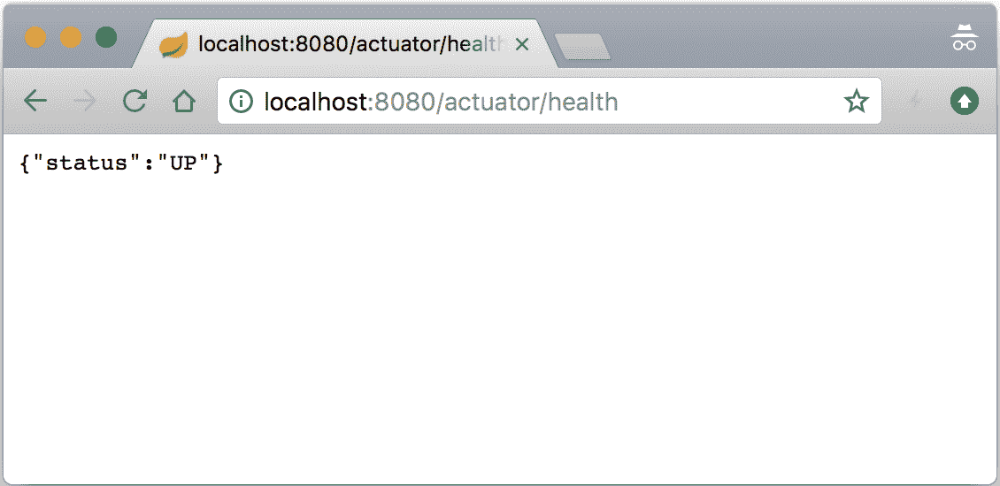

1.  要获取我们应用程序健康状态的更多详细信息，让我们配置它以显示详细的健康输出，通过向 `application.properties` 文件添加 `management.endpoint.health.show-details=always` 属性并重新启动我们的应用程序。现在，当我们通过浏览器访问 `http://localhost:8080/actuator/health` 时，我们应该看到类似于以下截图的内容：

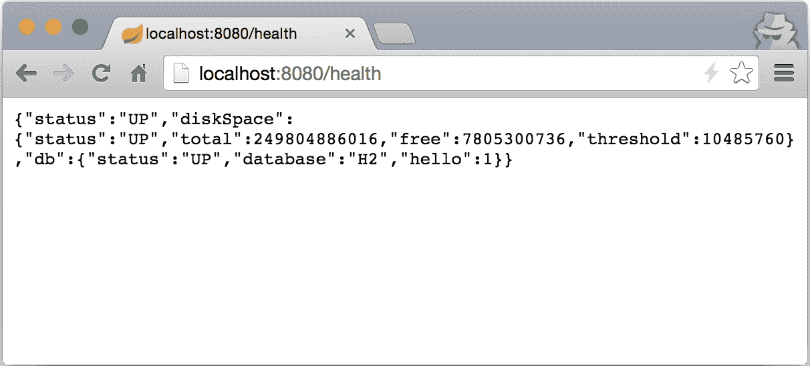

1.  在添加了 `actuator` 依赖项并详细配置了 `/health` 端点后，我们现在可以在我们的应用程序上添加和执行所有类型的监控功能。让我们继续操作，通过向位于我们项目根目录的 `build.gradle` 文件中添加以下内容的指令来填充 `/info` 端点：

```java
springBoot { 
    buildInfo { 
        properties { 
            additional = [ 
                'description' : project.description 
            ] 
        } 
    } 
} 

```

1.  接下来，我们将在我们项目的根目录下创建一个名为 `gradle.properties` 的新属性文件，其内容如下：

```java
version=0.0.1-SNAPSHOT 
description=BookPub Catalog Application
```

1.  我们还将向位于项目根目录的 `settings.gradle` 文件中添加 `rootProject.name='BookPub-ch7'`。

1.  现在，让我们通过执行 `./gradlew clean bootRun` 来启动我们的应用程序，然后我们可以通过打开浏览器并访问 `http://localhost:8080/actuator/info` 来访问新可用的 `/info` 端点，以查看新端点的实际操作，如下所示：

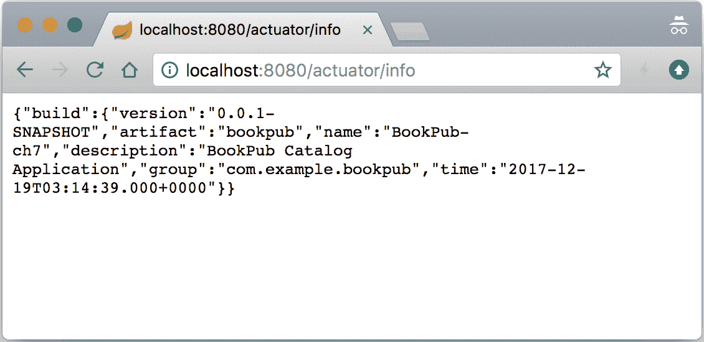

1.  既然我们已经掌握了事情的工作原理，让我们继续创建我们的自定义健康指标，它将通过`/health`端点访问，以便报告每个存储库条目的计数状态。如果它们大于或等于零，我们认为是`UP`，否则我们并不真正清楚发生了什么。显然，如果发生了异常，我们将报告`DOWN`。让我们首先将位于项目根目录下的`db-count-starter/src/main/java/com/example/bookpubstarter/dbcount`目录中的`DbCountRunner.java`文件中的`getRepositoryName(...)`方法可见性从`private`更改为`protected`。

1.  接下来，我们将在项目根目录下的`db-count-starter`目录中的`build.gradle`文件中添加相同的依赖项`compile("org.springframework.boot:spring-boot-starter-actuator")`。

1.  现在，我们将在项目根目录下的`db-count-starter/src/main/java/com/example/bookpubstarter/dbcount`目录中创建一个名为`DbCountHealthIndicator.java`的新文件，其内容如下：

```java
public class DbCountHealthIndicator implements HealthIndicator { 
    private CrudRepository repository; 

    public DbCountHealthIndicator(CrudRepository repository) { 
        this.repository = repository; 
    } 

    @Override 
    public Health health() { 
        try { 
            long count = repository.count(); 
            if (count >= 0) { 
                return Health.up().withDetail("count", 
                count).build(); 
            } else { 
                return Health.unknown().withDetail("count",  
                count).build(); 
            } 
        } catch (Exception e) { 
            return Health.down(e).build(); 
        } 
    } 
} 
```

1.  接下来，我们将修改位于项目根目录下的`db-count starter/src/main/java/com/example/bookpubstarter/dbcount`目录中的`EnableDbCounting.java`文件，其内容如下：

```java
@Import({DbCountAutoConfiguration.class, 
        HealthIndicatorAutoConfiguration.class})
```

1.  最后，为了自动注册我们的`HealthIndicator`类，我们将在项目根目录下的`db-count-starter/src/main/java/com/example/bookpubstarter/dbcount`目录中的`DbCountAutoConfiguration.java`文件中添加以下内容：

```java
@Autowired 
private HealthAggregator healthAggregator; 
@Bean 
public HealthIndicator dbCountHealthIndicator(Collection<CrudRepository> repositories) { 
    CompositeHealthIndicator compositeHealthIndicator = new 
      CompositeHealthIndicator(healthAggregator); 
    for (CrudRepository repository : repositories) { 
        String name = DbCountRunner.getRepositoryName
         (repository.getClass()); 
        compositeHealthIndicator.addHealthIndicator(name, new  
          DbCountHealthIndicator(repository)); 
    } 
    return compositeHealthIndicator; 
} 
```

1.  因此，让我们通过执行`./gradlew clean bootRun`命令来启动我们的应用程序，然后我们可以通过打开浏览器并访问`http://localhost:8080/actuator/health`来查看我们的新`HealthIndicator`类在行动中的效果，如下所示：

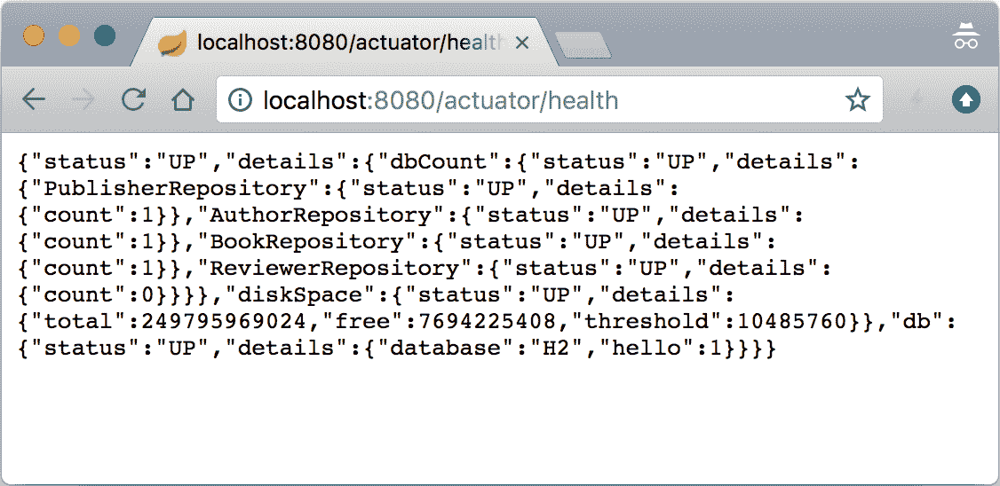

# 它是如何工作的...

Spring Boot Actuator starter 添加了多个重要功能，这些功能可以让我们深入了解应用程序的运行状态。该库包含多个自动配置，这些配置添加并配置了各种端点以访问应用程序的运行监控数据和健康状态。这些端点都共享一个公共上下文路径：`/actuator`。要公开除`/info`和`/health`之外的其他端点，我们需要通过设置`management.endpoints.web.exposure.include=*`属性来显式公开它们。当该值设置为`*`时，它将公开所有端点。以下端点可供我们深入了解应用程序的运行状态和配置：

+   `/env`: 此端点使我们能够查询应用程序通过环境实现可以访问的所有环境变量，这是我们之前看到的。当您需要调试特定问题并想知道任何给定配置属性的值时，它非常有用。如果我们通过访问 `http://localhost:8080/actuator/env` 端点，我们将看到多个不同的配置部分，例如，类路径资源 `[tomcat.https.properties]`、`applicationConfig: [classpath:/application.properties]`、`commonsConfig`、`systemEnvironment`、`systemProperties` 以及其他。它们都代表环境中的一个单独的 `PropertySource` 实例实现，根据它们在层次结构中的位置，可能或可能不被用于在运行时提供值解析。要找出用于解析特定值的确切条目，例如，对于 `book.count.rate` 属性，我们可以通过访问 `http://localhost:8080/actuator/env/book.counter.rate` URL 来查询它。默认情况下，我们应该得到 10,000 作为结果，除非当然，通过系统环境或命令行参数设置了不同的值作为覆盖。如果您真的想深入了解代码，`EnvironmentEndpoint` 类负责处理此功能背后的逻辑。

+   `/configprops`: 此端点向您展示了各种配置属性对象的设置，例如我们的 `WebConfiguration.TomcatSslConnectorProperties` 启动器。它与 `/env` 端点略有不同，因为它提供了对配置对象绑定的洞察。如果我们打开浏览器访问 `http://localhost:8080/actuator/configprops` 并搜索 `custom.tomcat.https`，我们将看到用于配置 `TomcatSslConnector` 的配置属性对象的条目，该对象由 Spring Boot 自动填充并为我们绑定。

+   `/conditions`: 此端点作为我们在第四章“编写自定义 Spring Boot 启动器”中看到的自动配置报告的基于网络的类似物。这样，我们可以随时使用浏览器获取报告，而无需启动应用程序并使用特定的标志来打印它。

+   `/beans`: 此端点旨在列出由 Spring Boot 创建并可在应用程序上下文中使用的所有 bean。

+   `/mappings`: 此端点公开了应用程序支持的所有 URL 映射列表以及 `HandlerMapping` bean 实现的引用。这对于回答特定 URL 将被路由到何处的问题非常有用。尝试访问 `http://localhost:8080/actuator/mappings` 以查看应用程序可以处理的所有路由列表。

+   `/threaddump`: 这个端点允许从运行中的应用程序中提取线程转储信息。当尝试诊断潜在的线程死锁时，它非常有用。

+   `/heapdump`: 这个端点与 `/dump` 类似，但不同的是它产生堆转储信息。

+   `/info`: 这个端点显示了我们所添加的基本描述和应用程序信息，我们已经看到了它的实际应用，因此现在应该对我们来说很熟悉。构建工具中的良好支持使我们能够配置额外的或替换 `build.gradle` 配置中的现有值，然后这些值将被传播以由 `/info` 端点消费。此外，在访问 `/info` 端点时，任何以 `info.` 开头的 `application.properties` 文件中定义的属性都将显示出来，所以您绝对不仅限于 `build.gradle` 配置。配置此特定端点以返回相关信息在构建各种自动化发现和监控工具时非常有帮助，因为它是一种以漂亮的 JSON RESTful API 形式公开应用程序特定信息的好方法。

+   `/actuator`: 这个端点以 **超文本应用语言**（**HAL**）风格的 JSON 格式列表提供了所有可用执行器端点的链接。

+   `/health`: 这个端点提供了有关应用程序总体健康状况以及各个组件的详细分解和健康状况的信息。

+   `/metrics`: 这个端点提供了由指标子系统发出的所有各种数据点的概述。您可以通过在浏览器中访问 `http://localhost:8080/actuator/metrics` URL 来实验它。我们将在下一道菜中更详细地介绍这一点。

既然我们已经了解了 Spring Boot Actuator 为我们提供了哪些一般性信息，我们就可以继续查看我们如何使自定义 `HealthIndicator` 类工作以及 Spring Boot 中的整个健康监控系统是如何工作的细节。

正如您所看到的，使基本的 `HealthIndicator` 接口工作非常简单；我们只需创建一个实现类，当调用 `health()` 方法时，它将返回一个 `Health` 对象。您只需将 `HealthIndicator` 类的实例作为 `@Bean` 暴露出来，Spring Boot 就会将其拾取并添加到 `/health` 端点。

在我们的情况下，我们更进一步，因为我们必须处理为每个`CrudRepository`实例创建`HealthIndicator`的需求。为了实现这一点，我们创建了一个`CompositeHealthIndicator`的实例，并向其中添加了每个`CrudRepository`的所有`DbHealthIndicator`实例。然后我们将这个实例作为`@Bean`返回，这就是 Spring Boot 用来表示健康状态的方式。作为一个组合体，它保留了内部层次结构，正如从表示健康状态的返回 JSON 数据中可以明显看出。我们还添加了一些额外的数据元素，以提供入口计数以及每个特定存储库的名称，这样我们就可以区分它们。

看着代码，你可能想知道：我们连接的这个`HealthAggregator`实例是什么？我们需要`HealthAggregator`实例的原因是`CompositeHealthIndicator`需要知道如何决定所有嵌套`HeathIndicators`的内部组合是否代表整体良好的或不良的健康状态。想象一下，所有存储库都返回`UP`，只有一个返回`DOWN`。这意味着什么？组合指标整体健康吗？或者它也应该报告`DOWN`，因为有一个内部存储库有问题？

默认情况下，Spring Boot 已经创建并使用了一个`HealthAggregator`的实例，所以我们只是自动注入并在我们用例中使用了它。我们确实必须显式添加`HealthIndicatorAutoConfiguration`和`MetricsDropwizardAutoConfiguration`类的导入，以满足`DataJpaTest`和`WebMvcTest`切片测试期间的 bean 依赖关系，因为那些只部分实例化了上下文，并且缺少了 actuator 自动配置。

尽管默认实现是一个`OrderedHealthAggregator`的实例，它只是收集所有内部状态响应，并从`DOWN`、`OUT_OF_SERVICE`、`UP`和`UNKNOWN`中选择优先级最低的，但这并不总是必须这样。例如，如果组合指标由冗余服务连接的指标组成，只要至少有一个连接是健康的，你的组合结果可以是`UP`。创建自定义`HealthAggregator`接口非常简单；你所要做的就是要么扩展`AbstractHealthAggregator`，要么实现`HealthAggregator`接口本身。

# 配置管理上下文

Spring Boot Actuator 默认在主应用程序上下文中创建了一组管理端点和支持 bean，这些端点在配置的 HTTP 端口`server.port`上可用。然而，由于安全或隔离的原因，我们可能希望将主应用程序上下文与管理上下文分开，或者在不同的端口上公开管理端点。

Spring Boot 为我们提供了一个配置独立子应用程序上下文的能力，该上下文将继承主应用程序上下文的所有内容，但允许定义仅对管理功能可用的 bean。同样，对于在不同的端口上公开端点或使用不同的连接器安全性的方式，主应用程序可以使用 SSL，而管理端点可以使用纯 HTTP 进行访问。

# 如何实现...

让我们假设，出于某种原因，我们想要将我们的 JSON 转换器更改为使用`SNAKE_CASE`（所有单词之间用下划线分隔的小写字母）输出字段名称。

1.  首先，让我们创建一个名为`ManagementConfiguration.java`的类，该类包含我们的管理上下文配置，位于项目根目录`src/main/java/com/example/bookpub`目录下，并包含以下内容：

```java
@ManagementContextConfiguration 
public class ManagementConfiguration  
       implements WebMvcConfigurer { 
  @Override 
  public void configureMessageConverters( 
              List<HttpMessageConverter<?>> converters) { 
    HttpMessageConverter c = new 
     MappingJackson2HttpMessageConverter( 
        Jackson2ObjectMapperBuilder.json(). 
        propertyNamingStrategy(PropertyNamingStrategy.SNAKE_CAS). 
        build() 
        ); 
    converters.add(c); 
  } 
} 
```

1.  我们还需要将此类添加到位于项目根目录`src/main/resources/META-INF`目录下的`spring.factories`文件中，并添加以下内容：

```java
org.springframework.boot.actuate.autoconfigure.web.ManagementContextConfiguration=com.example.bookpub.ManagementConfiguration 
```

1.  为了避免我们的配置被主应用程序上下文的组件扫描检测到，我们需要通过在项目根目录`src/main/java/com/example/bookpub`目录下的`BookPubApplication.java`文件中添加以下内容来排除它：

```java
@ComponentScan(excludeFilters =  
    @ComponentScan.Filter( 
        type = FilterType.ANNOTATION,  
        classes = ManagementContextConfiguration.class 
    ) 
) 
```

1.  要有一个独立的管理上下文，我们需要使用不同的端口来启动它，因此让我们修改位于项目根目录`src/main/resources`目录下的`application.properties`文件，并添加以下内容：

```java
management.server.port=8081 
management.endpoints.web.exposure.include=*
```

1.  最后，让我们通过执行`./gradlew clean bootRun`来启动我们的应用程序，然后我们可以通过打开浏览器并访问`http://localhost:8081/actuator/threaddump`端点来查看我们的新配置生效。返回的 JSON 的字段名称都应该全部是小写，并且单词应该使用下划线分隔，或者称为`SNAKE_CASE`。或者，通过访问`http://localhost:8080/books/978-1-78528-415-1`端点，我们应该继续看到`LOWER_CAMEL_CASE`格式的 JSON 字段名称。

# 它是如何工作的...

Spring Boot 认识到存在许多原因，它需要能够为管理端点和其他执行器组件的工作方式提供单独的配置，这与主应用程序不同。这种配置的第一级可以通过设置大量以`management.*`开头的直观属性来实现。我们已经使用了一个这样的属性，即`management.server.port`，来设置管理接口的端口号为`8081`。我们还可以设置诸如 SSL 配置、安全设置或网络 IP 接口地址等，以便将监听器绑定到。我们还有能力通过设置相应的属性来配置每个单独的`actuator`端点，这些属性以`management.endpoint.<name>.*`开头，并具有各种设置，具体取决于特定端点的目标。

由于安全原因，各种管理端点暴露的数据，尤其是来自敏感端点（如`/health`、`/env`等）的数据，可能对外部恶意人员非常有价值。为了防止这种情况发生，Spring Boot 为我们提供了配置端点是否通过`management.endpoint.<name>.enabled=false`可用的能力。我们可以通过设置适当的`management.endpoint<name>.enabled=false`属性来指定我们想要禁用的单个端点，或者使用`management.endpoints.web.exposure.exclude=<name>`来告诉 Spring Boot 是否应该启用此端点，但不要通过 WEB HTTP API 访问方法暴露。

或者，我们可以设置`management.server.port=-1`来禁用这些端点的 HTTP 暴露，或者使用不同的端口号，以便管理端点和实时服务在不同的端口上。如果我们只想通过 localhost 访问，我们可以通过配置`management.server.address=127.0.0.1`来防止外部访问。甚至可以将上下文 URL 路径配置为其他路径，例如通过`management.server.context-path=/admin`配置为`/admin`。这样，要访问`/health`端点，我们将访问`http://127.0.0.1/admin/health`而不是默认的`/actuator`上下文路径。这在你想要通过防火墙规则控制和限制访问时可能很有用，因此你只需添加一个过滤器来阻止外部访问所有应用程序的`/admin/*`。随着 Spring Security 的添加，还可以配置身份验证，要求用户登录才能访问端点。

在使用属性控制行为不足以应对的情况中，Spring Boot 提供了一种机制，通过使用 `spring.factories` 和相应的 `ManagementContextConfiguration` 注解来提供替代应用程序上下文配置。这使得我们能够告知 Spring Boot 在创建管理上下文时应自动加载哪些配置。此注解的预期用途是将配置保存在一个独立的、可共享的依赖库中，位于主应用程序代码之外。

在我们的示例中，因为我们将其放在相同的代码库中（为了简单起见），我们不得不进行额外的一步，并在 `BookPubApplication.java` 文件中定义排除过滤器，在设置主应用程序时排除 `ManagementContextConfiguration` 类的组件扫描。我们必须这样做的原因很简单——如果我们查看 `ManagementContextConfiguration` 注解的定义，我们会看到它是一个带有内部 `@Configuration` 注解的元注解。这意味着当我们的主应用程序正在配置时，组件扫描将自动检测应用程序代码的类路径树中所有带有 `@Configuration` 注解的类，并且因此，它将所有标记为 `ManagementContextConfiguration` 的配置放入主上下文中。我们已经通过排除过滤器避免了这种情况。或者，更好的方法是使用不同的包层次结构将这些配置放在一个单独的库中，这将防止组件扫描捕获它们，但由于 `spring.factories` 中为 `org.springframework.boot.actuate.autoconfigure.web.ManagementContextConfiguration` 的条目，自动配置仍然有效，因为它告诉 Spring Boot 自动将这些配置添加到管理上下文中。

为了使管理上下文与主应用程序分离，有必要配置它使用 `management.server.port` 属性在单独的端口上运行。如果没有此设置，所有对象都将使用共享的应用程序上下文。

# 发射指标

之前的配方概述了 Spring Boot Actuators 提供的功能。我们玩转了不同的管理端点，如 `/info` 和 `/health`，甚至创建了自己的健康指标以添加到默认集合中。然而，除了健康状态之外，作为开发人员和运维人员，我们还想能够持续查看和监控许多其他内容，仅仅知道链路是功能性的还不够。我们还想看到打开会话的数量、对应用程序的并发请求、延迟等。在本配方中，你将了解 Spring Boot 的指标报告功能，以及如何添加我们自己的指标和一些快速简单的方式来可视化它们。

# 准备工作

为了更好地可视化指标，我们将使用一个位于 [`github.com/codecentric/spring-boot-admin`](https://github.com/codecentric/spring-boot-admin) 的优秀开源项目 `spring-boot-admin`。它提供了一个简单的 Web UI，在 Spring Boot Actuators 之上，以提供更美观的各种数据视图。

我们将根据 [`github.com/codecentric/spring-boot-admin#server-application`](https://github.com/codecentric/spring-boot-admin#server-application) 中的说明，在 Gradle 中创建一个简单的管理应用程序。执行以下简单步骤：

1.  访问 [start.spring.io](http://start.spring.io) 并创建一个新的应用程序模板，以下字段如下：

+   生成一个：Gradle 项目

+   使用：Java

+   Spring Boot：2.0.0 (SNAPSHOT)

+   组：`org.sample.admin`

+   工件：`spring-boot-admin-web`

+   名称：`Spring Boot Admin Web`

+   描述：`Spring Boot Admin Web 应用程序`

+   包名：`org.sample.admin`

+   打包：Jar

+   Java 版本：8

1.  在“搜索依赖项”下选择 Actuator 选项

1.  点击“生成项目”快捷键 alt + 下载应用程序模板存档

1.  从您选择的目录中提取内容

1.  在提取的目录中，执行 `gradle wrapper` 命令行以生成 gradlew 脚本

1.  在 `build.gradle` 文件中，将以下依赖项添加到 `dependencies` 块中：

```java
compile("de.codecentric:spring-boot-admin-server:2.0.0-SNAPSHOT") 
compile("de.codecentric:spring-boot-admin-server-ui:2.0.0-SNAPSHOT ") 
```

1.  我们还需要更新 `repositories` 块，以引用使用 `snapshots` 存储库（截至编写时，SBA 尚未发布）：

```java
maven { url "https://oss.sonatype.org/content/repositories/snapshots/" } 
```

1.  打开位于 `src/main/java/spring-boot-admin-web` 目录下的 `SpringBootAdminWebApplication.java` 文件，并将以下注解添加到 `SpringBootAdminWebApplication` 类中：

```java
@SpringBootApplication 
@EnableAdminServer 
public class SpringBootAdminWebApplication { 

  public static void main(String[] args) { 
    SpringApplication.run( 
                      SpringBootAdminWebApplication.class, 
                      args); 
  } 
} 
```

1.  打开位于 `src/main/resources` 目录下的 `application.properties` 文件，并添加以下设置：

```java
server.port: 8090 
spring.application.name: Spring Boot Admin Web 
spring.cloud.config.enabled: false 
spring.jackson.serialization.indent_output: true
```

1.  现在我们已经准备好通过运行 `./gradlew bootRun` 来启动 Admin Web 控制台，并在浏览器中打开 `http://localhost:8090` 以查看以下输出：

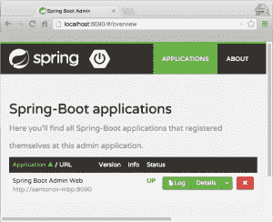

# 如何做...

1.  随着 **Admin Web** 的运行，我们现在可以开始向我们的 `BookPub` 应用程序添加各种指标。让我们像在 `HealthIndicators` 中做的那样，公开我们的数据存储库的相同信息，但这次我们将公开计数数据作为指标。我们将在 `db-count-starter` 子项目中继续添加代码。因此，让我们在项目根目录下的 `db-count-starter/src/main/java/com/example/bookpubstarter/dbcount` 目录中创建一个名为 `DbCountMetrics.java` 的新文件，并添加以下内容：

```java
public class DbCountMetrics implements MeterBinder { 
    private Collection<CrudRepository> repositories; 

    public DbCountMetrics(Collection<CrudRepository> repositories) 
    { 
        this.repositories = repositories; 
    } 

    @Override 
    public void bindTo(MeterRegistry registry) { 
        for (CrudRepository repository : repositories) { 
            String name = DbCountRunner.getRepositoryName
              (repository.getClass()); 
            String metricName = "counter.datasource."  
                              + name; 
            Gauge.builder(metricName, repository, 
                          CrudRepository::count) 
                 .tags("name", name) 
                 .description("The number of entries in "  
                             + name + "repository") 
                 .register(registry); 
        } 
    } 
} 
```

1.  接下来，为了自动注册 `DbCountMetrics`，我们将在项目根目录下的 `db-count-starter/src/main/java/com/example/bookpubstarter/dbcount` 目录中的 `DbCountAutoConfiguration.java` 文件中添加以下内容：

```java
@Bean 
public DbCountMetrics
  dbCountMetrics(Collection<CrudRepository> repositories) { 
    return new DbCountMetrics(repositories); 
} 
```

1.  为了使线程转储在 Spring Boot Admin UI 中正确显示，我们需要将我们的 JSON 转换器从 `SNAKE_CASE` 更改为 `LOWER_CAMEL_CASE`，通过更改位于我们项目根目录 `src/main/java/com/example/bookpub` 目录中的 `ManagementConfiguration.java` 文件，内容如下：

```java
propertyNamingStrategy( 
    PropertyNamingStrategy.LOWER_CAMEL_CASE 
)
```

1.  因此，让我们通过执行 `./gradlew clean bootRun` 来启动我们的应用程序，然后我们可以通过打开浏览器并访问 `http://localhost:8081/actuator/metrics` 来访问 `/metrics` 端点，以查看我们添加到现有指标列表中的新 `DbCountMetrics` 类，如下所示：

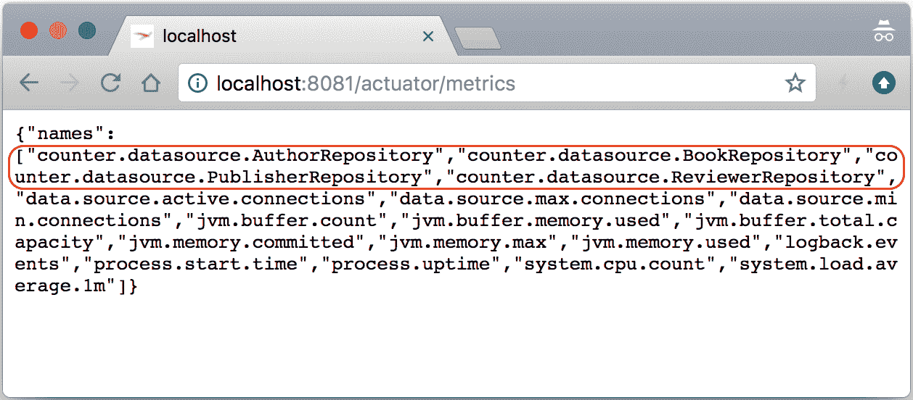

1.  我们下一步要做的是让我们的应用程序出现在我们之前创建的 Spring Boot Admin Web 中。为了实现这一点，我们需要在我们的项目根目录的 `build.gradle` 文件中添加对 `compile("de.codecentric:spring-boot-admin-starter-client:2.0.0-SNAPSHOT")` 库的依赖。

1.  此外，位于我们项目根目录 `src/main/resources` 目录中的 `application.properties` 需要添加以下条目：

```java
spring.application.name=BookPub Catalog Application 
server.port=8080 
spring.boot.admin.client.url=http://localhost:8090
```

1.  再次，让我们通过执行 `./gradlew clean bootRun` 来启动我们的应用程序，如果我们现在通过将浏览器指向 `http://localhost:8090` 访问 Spring Boot Admin Web，我们应该在我们的应用程序列表中看到一个名为 `BookPub Catalog Application` 的新条目。如果我们点击右侧的详细信息按钮并滚动到健康部分，我们将看到我们的自定义健康指标以及其他以更美观的层次结构条目形式报告的指标，如下所示：

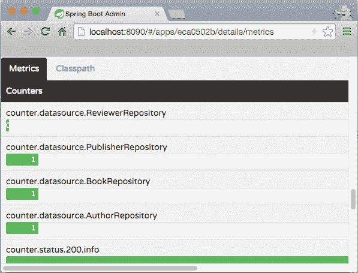

# 它是如何工作的...

在我们深入了解创建和发布指标细节之前，让我们简单谈谈 Spring Boot Admin Web。它是一个简单的网页图形用户界面，在后台使用与我们在前一个菜谱中了解的 Spring Boot Actuator 相同的端点。当我们点击 Admin Web 中的各种链接时，数据从应用程序中提取出来，并以图形化的方式展示——没有魔法！

除了添加客户端库依赖项之外，我们只需配置几个属性，就可以让我们的应用程序连接并注册到 Admin Web：

+   `spring.application.name=BookPub Catalog Application`：此配置指定了我们选择使用的应用程序名称。也可以使用在 `gradle.properties` 中定义的描述属性值，通过 Gradle 的资源处理任务来实现。Admin Web 在显示应用程序列表时使用此值。

+   `spring.boot.admin.client.url=http://localhost:8090`: 这配置了 Admin Web 应用程序的位置，以便我们的应用程序知道如何注册自己。由于我们运行在端口`8080`上，我们选择将 Admin Web 配置为监听端口`8090`，但可以选择任何所需的端口。您可以通过访问[`codecentric.github.io/spring-boot-admin/current/`](https://codecentric.github.io/spring-boot-admin/current/)来查看更多配置选项。

如果我们还想通过 UI 启用日志级别控制，我们需要将 Jolokia JMX 库添加到我们的`compile("org.jolokia:jolokia-core:+")`构建依赖中，并在项目根目录的`src/main/resources`目录中添加一个`logback.xml`文件，内容如下：

```java
<configuration> 
  <include 
     resource="org/springframework/boot/logging/logback/base.xml"/> 
  <jmxConfigurator/>  
</configuration> 
```

Spring Boot 中的度量设施非常强大且可扩展，提供了多种不同的方法来发布和消费度量。从 Spring Boot 2.0 开始，底层使用`Micrometer.io`库提供了一个非常全面的监控解决方案。Spring Boot 默认配置了一些数据度量，用于监控系统资源，如堆内存、线程计数、系统运行时间等，以及数据库使用情况和 HTTP 会话计数。MVC 端点也被度量以测量请求延迟，该延迟以毫秒为单位，以及每个端点请求状态的计数器。

通过 Spring Boot 在运行时提供的`MeterRegistry`实现，发出各种度量，如度量、计数器、计时器等。该注册器可以轻松地自动装配到任何 Spring 管理的对象中，并用于发布度量。

例如，我们可以轻松地计算特定方法被调用的次数。我们只需要在创建对象期间自动装配`MeterRegistry`的实例，并在方法的开始处放置以下行：

```java
meterRegistry.counter("objectName.methodName.invoked").increment();
```

每次方法被调用时，特定的度量计数将增加。

这种方法将给我们计数，但如果我们想测量延迟或其他任意值，我们需要使用`Gauge`来提交我们的度量。为了测量我们的方法执行所需的时间，我们可以在方法开始时使用`MeterRegistry`记录时间：

```java
long start = System.currentTimeMillis();
```

然后，我们在代码和返回之前再次捕获时间：

```java
long end = System.currentTimeMillis();.
```

然后，我们将发出度量`meterRegistry.gauge("objectName.methodName.latency", end - start);`，这将更新最后。使用`gauge`进行计时是非常基础的，而`MeterRegistry`实际上提供了一种专门的度量类型——Timer。例如，Timer 度量提供了包装可运行或可调用的 lambda 表达式并自动计时执行的能力。使用 Timer 而不是`Gauge`的另一个好处是，Timer 度量会保留事件计数以及每次发生的延迟。

`MeterRegistry`实现涵盖了大多数简单用例，并且在我们自己代码中操作并且有灵活性将其添加到所需位置时非常方便。然而，情况并不总是如此，在这些情况下，我们将需要通过创建`MeterBinder`的自定义实现来包装我们想要监控的任何内容。在我们的情况下，我们将使用它来公开数据库中每个存储库的计数，因为我们不能在`CrudRepository`代理实现中插入任何监控代码。

当`MeterRegistry`实现没有足够的灵活性时，例如，当需要将对象包装在像`Gauge`这样的仪表中时，大多数仪表实现都提供了流畅的构建器以获得更多灵活性。在我们的例子中，为了包装存储库指标，我们使用了一个`Gauge`流畅构建器来构建`Gauge`：

```java
Gauge.builder(metricName, repository, CrudRepository::count)
```

主要构建方法接受以下三个参数：

+   `metricName`: 这指定了用于唯一标识此指标的名字。

+   `repository`: 这提供了一个对象，我们可以在其上调用方法，该方法应返回一个数值，该数值是`gauge`将报告的。

+   `CrudRepository::count`: 这是应该调用`repository`对象的方法，以获取当前条目数。

这使我们能够构建灵活的包装器，因为我们所需要做的只是提供一个对象，该对象将公开必要的数值，以及一个函数引用，该函数引用应在实例上调用以在`gauge`评估期间获取该值。

用于导出仪表的`MeterBinder`接口定义了一个方法，

`void bindTo(MeterRegistry);`，实现者需要根据确切监控的内容进行编码。实现类需要以`@Bean`的形式公开，它将在应用程序初始化期间自动被拾取和处理。假设确实使用提供的`MeterRegistry`实现注册了创建的`Meter`实例，通常是通过调用`.builder(...).register(registry)`来终止流畅构建器的链，那么指标将通过`MetricsEndpoint`公开，每次调用`/metrics`操作器时，都会公开注册到注册表的仪表。

重要的是要提到，我们已经在主应用程序上下文中创建了`MeterBinder`和`HealthIndicator`豆子，而不是在管理上下文中。原因是尽管数据是通过管理端点公开的，但端点豆子，如`MetricsEndpoint`，是在主应用程序上下文中定义的，因此期望所有其他自动装配的依赖关系也在这里定义。

这种方法很安全，因为为了获取信息，需要通过 `WebMvcEndpointHandlerMapping` 实现外观，它在管理上下文中创建，并使用主应用程序上下文中的代理端点。查看 `MetricsEndpoint` 类和相应的 `@Endpoint` 注解以了解详细信息。

# 通过 JMX 监控 Spring Boot

在当今这个时代，RESTful HTTP JSON 服务是访问数据的事实标准方式，但这并不是唯一的方式。另一种相当流行且常见的管理实时系统的方式是通过 JMX。好消息是 Spring Boot 已经提供了与通过 HTTP 相同级别的支持来暴露管理端点。实际上，这些确实是相同的端点；它们只是被 MBean 容器包装起来。

在本配方中，我们将探讨如何通过 JMX 获取与通过 HTTP 相同的信息，以及如何通过 Jolokia JMX 库使用 HTTP 暴露一些由第三方库提供的 MBeans。

# 准备工作

如果您还没有为之前的配方添加 Jolokia JMX 库，那么请将 `compile("org.jolokia:jolokia-core:+")` 构建依赖项添加到我们的构建中，并将 `management.jolokia.enabled=true` 属性添加到 `application.properties` 文件中，因为我们需要它们来通过 HTTP 暴露 MBeans。

# 如何操作...

1.  在添加 Jolokia JMX 依赖项后，我们只需要通过执行 `./gradlew clean bootRun` 来构建和启动我们的应用程序，现在我们可以简单地启动 jConsole 来查看在 `org.springframework.boot` 域下暴露的各种端点：

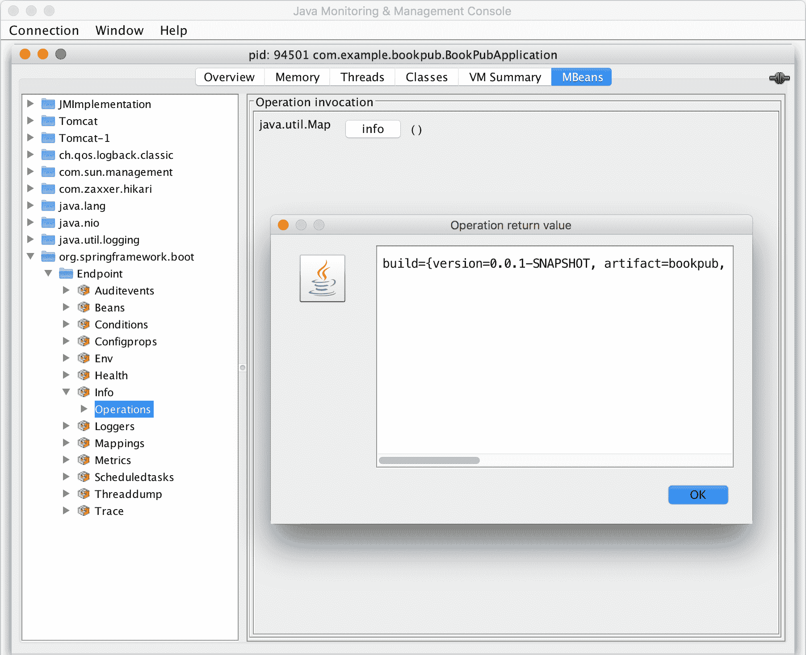

1.  将 Jolokia JMX 库添加到类路径后，Spring Boot 还启用了通过 `/jolokia` 端点使用 HTTP API 访问所有已注册的 MBeans。为了找出我们的 Tomcat HTTP 端口 `8080` 连接器的 `maxThreads` 设置，我们可以通过选择 `Tomcat:type=ThreadPool,name="http-nio-8080"` MBean 上的 `maxThreads` 属性来使用 jConsole 查找它，以获取 `200` 的值，或者我们可以使用 Jolokia JMX HTTP，通过打开浏览器并访问 `http://localhost:8081/actuator/jolokia/read/Tomcat:type=ThreadPool,name=%22http-nio-8080%22/maxThreads` 来获取以下 JSON 响应：

```java
{"request": 
  {"mbean":"Tomcat:name="http-nio-8080",type=ThreadPool", 
   "attribute":"maxThreads", 
   "type":"read" 
  }, 
 "value":200,"timestamp":1436740537,"status":200}
```

# 它是如何工作的...

默认情况下，当 Spring Boot Actuator 添加到应用程序中时，会自带所有端点和管理服务启用。这包括 JMX 访问。如果出于某种原因，有人想通过 JMX 禁露特定的端点，这可以通过添加 `management.endpoints.jmx.exclude=<id>` 来轻松配置；或者为了禁用所有 Spring MBeans 的导出，我们可以在 `application.properties` 中配置 `spring.jmx.enabled=false` 设置。

类路径中 Jolokia 库的存在触发了 Spring Boot 的`JolokiaManagementContextConfiguration`，这将自动配置接受`/jolokia`操作路径请求的`ServletRegistrationBean`。也可以通过`management.endpoint.jolokia.config.*`属性集设置各种 Jolokia 特定的配置选项。完整的列表可在[`jolokia.org/reference/html/agents.html#agent-war-init-params`](https://jolokia.org/reference/html/agents.html#agent-war-init-params)找到。如果你想使用 Jolokia，但想手动设置它，我们可以通过在`application.properties`中配置`management.endpoint.jolokia.enabled=false`属性设置来告诉 Spring Boot 忽略其存在。

# 通过 SSHd Shell 管理 Spring Boot 和编写自定义远程 Shell 命令

你们中的一些人可能正在回忆那些美好的旧时光，那时所有的管理都是通过直接在机器上使用 SSH 完成的，那时一个人拥有完全的灵活性和控制权，或者甚至使用 SSH 连接到管理端口，直接对运行中的应用程序应用所需的任何更改。尽管 Spring Boot 在 2.0 版本中移除了与 CRaSH Java Shell 的本地集成，但有一个开源项目，`sshd-shell-spring-boot`，它恢复了这种能力。

对于这个配方，我们将使用我们在本章早期创建的健康指示器和管理端点。我们将通过 SSH 控制台访问公开相同的功能。

# 如何做到这一点...

1.  让 SSHd Shell 工作起来的第一步是在我们的`build.gradle`文件中添加必要的依赖启动项，如下所示：

```java
dependencies { 
    ... 
    compile("org.springframework.boot:spring-boot-starter-actuator") 
    compile("io.github.anand1st:sshd-shell-spring-boot-starter:3.2.1") 
    compile("de.codecentric:spring-boot-admin-starter-client:2.0.0-SNAPSHOT") 
    compile("org.jolokia:jolokia-core:+") 
    ... 
} 
```

1.  我们还需要显式地启用它，通过在项目根目录下的`src/main/resources`目录中的`application.properties`文件中设置以下属性，需要增强以下条目：

```java
sshd.shell.enabled=true 
management.endpoint.shutdown.enabled=true
```

1.  现在，让我们通过执行`./gradlew clean bootRun`来启动我们的应用程序，然后通过执行`ssh -p 8022 admin@localhost`来通过 SSH 连接到它。

1.  我们将被提示输入密码，所以让我们在应用程序启动日志中找到自动生成的哈希密钥，它看起来如下：

```java
********** User password not set. Use following password to login: 
8f20cf10-7d67-42ac-99e4-3a4a77ca6c5f ********** 
```

1.  如果密码输入正确，我们将看到以下欢迎提示：

```java
Enter 'help' for a list of supported commands 
app> 
```

1.  接下来，我们将通过输入`health`来调用我们现有的`/health`端点，我们应该得到以下结果：

```java
    {
      "status" : "UP",
      "details" : {
        "dbCount" : {
          "status" : "UP",
          "details" : {
            "ReviewerRepository" : {
              ...
            },
            "PublisherRepository" : {
              ...
            },
            "AuthorRepository" : {
              ...
            },
            "BookRepository" : {
              ...
            }
          }
        },
        "diskSpace" : {
          "status" : "UP",
          "details" : {
            "total" : 249795969024,
            "free" : 14219882496,
            "threshold" : 10485760
          }
        },
        "db" : {
          "status" : "UP", 
          "details" : { "database" : "H2", "hello" : 1 }
        }
      }
    }

```

1.  输入`help`将显示所有现有命令的列表，这样你可以尝试一些命令来查看它们的功能，然后我们将继续添加我们自己的 SSHd Shell 命令，这将使我们能够通过命令行添加新的发布者到系统中。

1.  在我们项目的根目录下的`src/main/java/com/example/bookpub/command`中创建一个名为`commands`的新目录。

1.  在我们项目的根目录下的`src/main/java/com/example/bookpub/command`目录中添加一个名为`Publishers.java`的文件，内容如下：

```java
package com.example.bookpub.command;

import com.example.bookpub.entity.Publisher;
import com.example.bookpub.repository.PublisherRepository;
import org.springframework.beans.factory.annotation.Autowired;
import org.springframework.stereotype.Component;
import sshd.shell.springboot.autoconfiguration.SshdShellCommand;
import sshd.shell.springboot.console.ConsoleIO;

import java.util.HashMap;
import java.util.Map;

@Component
@SshdShellCommand(value = "publishers", description = "Publisher management. Type 'publishers' for supported subcommands")
public class PublishersCommand {
    @Autowired
    private PublisherRepository repository;

    @SshdShellCommand(value = "list", description = "List of publishers")
    public String list(String _arg_) {
        List list = new ArrayList();

        repository.findAll().forEach(publisher ->
            list.add(publisher);
        );

        return ConsoleIO.asJson(list);
    }

    @SshdShellCommand(value = "add", description = "Add a new publisher. Usage: publishers add <name>")
    public String add(String name) {
        Publisher publisher = new Publisher(name);
        try {
            publisher = repository.save(publisher);
            return ConsoleIO.asJson(publisher);
        } catch (Exception e) {
            return String.format("Unable to add new publisher named %s%n%s", name, e.getMessage());
        }
    }

    @SshdShellCommand(value = "remove", description = "Remove existing publisher. Usage: publishers remove <id>")
    public String remove(String id) {
        try {
            repository.deleteById(Long.parseLong(id));
            return ConsoleIO.asJson(String.format("Removed publisher %s", id));
        } catch (Exception e) {
            return String.format("Unable to remove publisher with id %s%n%s", id, e.getMessage());
        }
    }
} 

```

1.  在构建了命令之后，现在让我们通过执行`./gradlew clean bootRun`来启动我们的应用程序，然后通过执行`ssh -p 8022 admin@localhost`通过 SSH 连接到它，并使用生成的密码散列登录。

1.  当我们输入发布者时，我们会看到所有可能的命令列表，如下所示：

```java
app> publishers 
Supported subcommand for publishers 
add       Add a new publisher. Usage: publishers add <name> 
list      List of publishers 
remove    Remove existing publisher. Usage: publishers remove <id>
```

1.  让我们通过输入`publishers add Fictitious Books`来添加一个发布者，我们应该看到以下消息：

```java
{ 
  "id" : 2, 
  "name" : "Fictitious Books" 
} 
```

1.  如果我们现在输入`publishers list`，我们将获得所有书籍的列表：

```java
[ { 
  "id" : 1, 
  "name" : "Packt" 
}, { 
  "id" : 2, 
  "name" : "Fictitious Books" 
} ] 
```

1.  移除发布者是一个简单的命令`publishers remove 2`，它应该响应`"Removed publisher 2"`消息。

1.  为了确认发布者确实已经删除，执行`publishers list`，我们应该看到以下输出：

```java
[ { 
  "id" : 1, 
  "name" : "Packt" 
} ] 
```

# 它是如何工作的...

Spring Boot 与 SSHd Shell 的集成提供了许多开箱即用的命令。我们可以调用通过 HTTP 和 JMX 向我们开放的相同管理端点。我们可以获取 JVM 信息，更改日志配置，甚至与 JMX 服务器和所有注册的 MBeans 进行交互。所有可能性的列表非常令人印象深刻，功能非常丰富，所以我肯定会建议您通过访问[`github.com/anand1st/sshd-shell-spring-boot`](https://github.com/anand1st/sshd-shell-spring-boot)来阅读 SSHd Shell 的参考文档。

在 Spring Boot 中，预期任何注解了`@SshdShellCommand`的类都将自动被拾取并注册为 SSHd Shell 命令。注解属性值转换为主命令名称。在我们的例子中，我们将类注解属性值字段设置为`publishers`，这成为了 SSH Shell 控制台中的顶级命令名称。

如果命令包含子命令，例如在我们的发布者命令示例中，那么，类中同样注解了`@SshdShellCommand`的方法将被注册为子命令。如果一个类只有一个方法，它将自动成为给定类中唯一的命令，当输入命令名称时执行。如果我们想在类命令中放置多个子命令，就像我们处理发布者一样，每个转换为命令的方法都需要注解`@SshdShellCommand`。

目前，SSHd Shell 框架有一个限制，只能将一个属性参数传递给命令，但正在进行工作以扩展该功能。在此期间，建议使用 JSON 有效载荷与命令进行通信，作为输入或输出。

注解上可用的以下属性：

+   `value`：此属性定义了命令或子命令名称。尽管方法名称不需要与命令名称匹配，但将两者保持同步以使代码更易读是一个好习惯。

+   `description`：此属性定义了在调用 `help` 命令时显示的文本。这是一个与用户沟通如何使用命令、它接受哪些输入等的好地方。在 Shell 中提供尽可能多的描述和文档是一个好主意，这样用户就可以清楚地了解需要发生什么以及如何调用命令。手册页面很棒，所以请保持文档质量上乘。

+   `roles`：此属性使我们能够定义对执行给定命令的权限的安全约束。如果也使用了 Spring Security，SSHd Shell 提供了配置自定义或特定 `AuthenticationProvider` 的能力，用于处理用户身份验证和角色绑定。例如，连接到公司的 LDAP 服务器并允许开发者使用他们的常规凭证，同时根据特定组织的需要配置不同的角色访问控制将变得非常容易。

可以通过使用帮助命令或输入顶级命令的名称来查询每个命令的用法。

虽然 SSHd Shell 内置了许多命令，但我们可以轻松地添加自定义命令，利用标准的 Spring / Spring Boot 编程风格，通过使用 `@Autowired` 和 `@Component` 注解来获取在应用启动生命周期中自动配置的必要依赖。

SSHd Shell 还提供了一种很好的功能，允许使用通过管道符号 (`|`) 调用的后处理器。当前的支持允许输出高亮 `| h packt`，这将突出显示输出中的单词 `packt`，或者通过电子邮件发送响应输出 `| m my@email.com`，这将把命令的响应发送到指定的电子邮件地址，前提是 **Spring Mail** 也已配置并可用。

如果我们能够将不同的命令链接在一起，就像在 Linux 中那样，这将非常棒，有助于在信息量变得过于庞大时处理输出和过滤必要的数据。想象一下，我们的出版商列表命令返回的不是 `2`，而是 `2000` 个出版商。从这个列表中，我们想要找到以 `Pa` 开头的那些。

即使 SSHd Shell 并未提供此类功能作为默认选项，但它确实允许我们通过定义扩展 `BaseUserInputProcessor` 类的 bean 来实现自己的后处理器。让我们创建一个提供对过滤 JSON 响应的支持的后处理器，类似于 `jq` 命令行工具的工作方式。

要实现这一点，让我们在项目根目录的 `src/main/java/com/example/bookpub/command` 目录中创建另一个名为 `JsonPathUserInputProcessor.java` 的类，其内容如下：

```java
@Component 
@Order(3) 
public class JsonPathUserInputProcessor 
             extends BaseUserInputProcessor { 

    private final Pattern pattern = Pattern.compile("[\w\W]+\s?\|\s?jq (.+)"); 

    @Override 
    public Optional<UsageInfo> getUsageInfo() { 
        return Optional.of(new UsageInfo(Arrays.<UsageInfo.Row>asList( 
                new UsageInfo.Row("jq <arg>", "JSON Path Query <arg> in response output of command execution"), 
                new UsageInfo.Row("", "Example usage: help | jq $.<name>")))); 
    } 

    @Override 
    public Pattern getPattern() { 
        return pattern; 
    } 

    @Override 
    public void processUserInput(String userInput) throws   
      InterruptedException, ShellException{ 
        String[] part = splitAndValidateCommand(userInput, "\|", 2); 
        Matcher matcher = pattern.matcher(userInput); 
        Assert.isTrue(matcher.find(), "Unexpected error"); 
        String jsonQuery = matcher.group(1).trim(); 
        try { 
            String output = processCommands(part[0]); 
            Object response = JsonPath.read(output, jsonQuery); 
            ConsoleIO.writeJsonOutput(response); 
        } catch (Exception e) { 
            ConsoleIO.writeOutput(String.format("Unable to process 
            query %s%n%s", jsonQuery, e.getMessage())); 
        } 
    } 
} 
```

使用管道功能，我们可以轻松地将 `publishers list` 命令与 `jq` 命令链接起来：

```java
publishers list | jq $..[?(@.name =~ /Pa.*/i)]
```

在我们的示例中，这应该只返回一条记录，如下所示：

```java
[ {
    "id" : 1,
    "name" : "Packt"
} ]
```

虽然它不是完整的管道功能，但输入处理器的使用允许添加诸如排序、过滤和显示渲染等功能，这为模块化和重用常见行为提供了更多灵活性。

SSHd Shell Spring Boot 集成提供了一些配置选项，允许我们禁用组件、配置身份验证设置以及指定用户名、密码，甚至密钥证书。例如，如果我们想使用特定的用户名和密码，我们可以通过配置以下属性来实现：

```java
sshd.shell.username=remote
sshd.shell.password=shell

```

在现实世界的企业环境中，更常见的是使用共享密钥进行受限访问，这些可以通过`sshd.shell.publicKeyFile=<key path>`或`sshd.shell.hostKeyFile=<key path>`属性进行配置。或者，正如之前已经提到的，使用自定义的`AuthenticationProvider`实现与 Spring Security 结合使用，可以将身份验证机制集成到公司的身份验证系统中。

# 将 Micrometer 指标与 Graphite 集成

在本章的早期部分，你学习了 Spring Boot 提供的监控能力。我们看到了编写自定义`HealthIndicators`、创建指标以及使用`MeterRegistry`来发射数据的示例。简单的 Spring Boot Admin Web 框架为我们提供了一些很好的图形用户界面来可视化数据，但这些指标都是即时的，没有长期保留和历史访问。无法观察趋势、检测基准线的偏差以及将今天与上周进行比较并不是一个好的策略，尤其是对于企业级复杂系统来说。我们都希望能够访问过去几周甚至几个月的时间序列数据，并在出现意外情况时设置警报和阈值。

这个配方将向我们介绍一个惊人的时间序列图形工具：Graphite。Graphite 是一个两部分的系统。它为数值时间序列数据提供存储，并提供一个服务以按需图形或以 JSON 流的形式公开这些数据。你将学习如何将 Spring 的 Micrometer 监控框架与 Graphite 集成和配置，以便将 Spring Boot 应用程序的监控数据发送到 Graphite，并稍微玩一下 Graphite 来可视化我们所收集的不同统计数据。

# 准备工作

Graphite 是一个用 Python 编写的应用程序，因此能够在几乎任何支持 Python 及其库的系统上运行。在给定的系统上安装 Graphite 有多种方式，从从源代码编译，使用`pip`，到为各种 Linux 发行版预构建的 RPM。

对于所有不同的安装策略，请查看 Graphite 文档在[`graphite.readthedocs.org/en/latest/install.html`](http://graphite.readthedocs.org/en/latest/install.html)。OS X 用户可以阅读位于[`gist.github.com/relaxdiego/7539911`](https://gist.github.com/relaxdiego/7539911)的一个非常好的分步指南。

为了本菜谱的目的，我们将使用一个包含 Graphite 及其对应 Grafana 的预制 Docker 容器。虽然有许多预制的 Docker 镜像包含 Graphite 和 Grafana 的组合，但我们将使用来自[`registry.hub.docker.com/u/alexmercer/graphite-grafana/`](https://registry.hub.docker.com/u/alexmercer/graphite-grafana/)的一个，因为它包含所有正确的配置，这将使我们能够快速开始：

1.  第一步将是下载所需的 Docker 容器镜像。我们将通过执行`docker pull alexmercer/graphite-grafana`来完成此操作。容器大小约为 500 MB；因此，下载可能需要几分钟，具体取决于你的连接速度。

1.  Graphite 和 Grafana 都将它们的数据存储在数据库文件中。我们需要创建外部目录，这些目录将位于容器外部，并且我们将通过 Docker 数据卷将它们连接到一个正在运行的实例。

    +   在你的系统中的任何位置创建一个 Graphite 数据目录，例如，在`<user_home>/data/graphite`。

    +   在`<user_home>/data/grafana`创建一个 Grafana 数据目录。

1.  在这个容器中，Graphite 数据将存储在`/var/lib/graphite/storage/whisper`，而 Grafana 将数据存储在`/usr/share/grafana/data`。因此，我们将使用这些路径作为启动容器时的内部卷挂载目标。

1.  通过执行`docker run -v <user_home>/data/graphite:/var/lib/graphite/storage/whisper -v <user_home>/data/grafana:/usr/share/grafana/data -p 2003:2003 -p 3000:3000 -p 8888:80 -d alexmercer/graphite-grafana`来运行容器。

    +   在 Docker 中，`-v`选项配置卷挂载绑定。在我们的示例中，我们将外部`<user_home>/data/graphite`目录配置为与容器中`/var/lib/graphite/storage/whisper`目录引用相同。同样适用于`<user_home>/data/grafana`映射。我们甚至可以在`<user_home>/data/graphite`或`data/grafana`目录中查看它们包含的子目录和文件。

    +   `-p`选项配置端口映射，类似于目录卷。在我们的示例中，我们将以下三个不同的端口映射为从容器外部可访问的内部端口，这些端口绑定到各种服务：

        `2003:2003`：这个端口映射将 Graphite 数据流监听器（称为**Carbon-Cache Line Receiver**）外部化，我们将连接到它以发送指标数据。

        `3000:3000`: 这个端口映射将 Grafana Web 仪表板 UI 外部化，我们将使用它来在 Graphite 数据上创建可视化仪表板。

        `8888:80`: 这个端口映射将 Graphite Web UI 外部化。尽管它运行在容器中的端口 `80` 上，但在我们的开发机器上，端口 `80` 很可能没有开放；因此，最好将其映射到其他一些更高的端口号，例如在我们的情况下，`8080` 或 `8888`，因为 `8080` 已经被我们的 `BookPub` 应用程序占用。

1.  如果一切按计划进行，Graphite 和 Grafana 应该已经启动并运行，因此我们可以通过将浏览器指向 `http://localhost:8888` 来访问 Graphite，并应该看到以下输出：

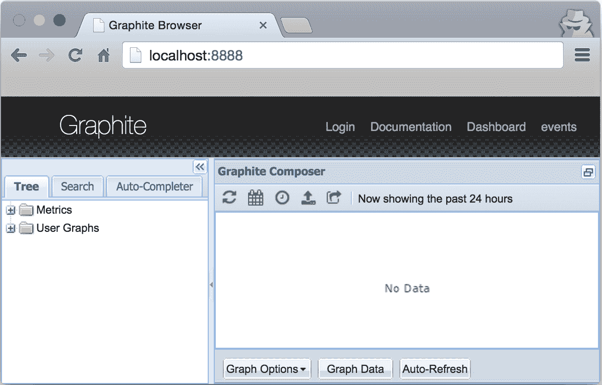

1.  要查看 Grafana，将浏览器指向 `http://localhost:3000` 以查看以下输出：

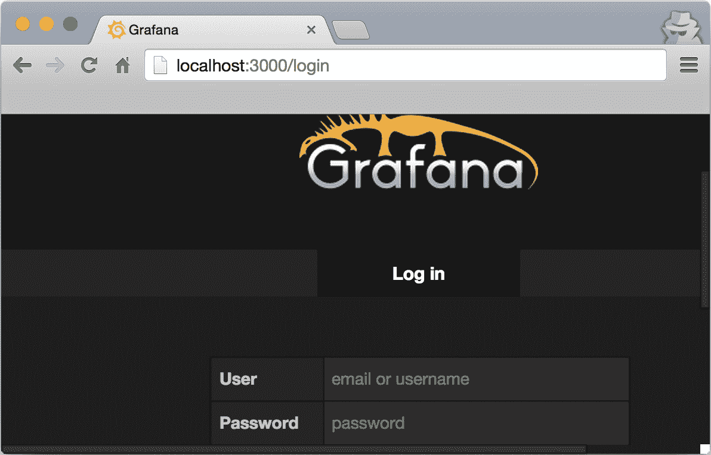

1.  Grafana 的默认登录名和密码是 `admin`/`admin`，可以通过 Web UI 管理员进行更改。

对于使用 boot2docker 的 OS X 用户，IP 地址不会是 `localhost`，而是 boot2docker IP 调用的结果。

1.  一旦我们进入 Grafana，我们需要将我们的 Graphite 实例作为 `DataSource` 添加，因此点击图标，转到数据源，并添加一个 `Type Graphite, Url http://localhost:80, Access` 的新源代理：

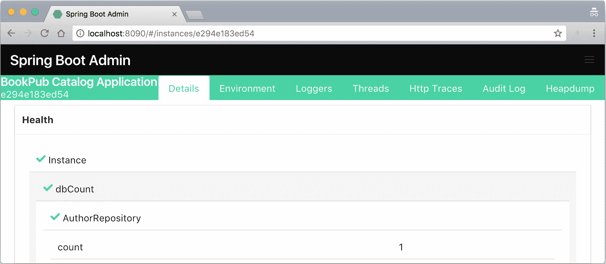

# 如何做到这一点...

随着 Graphite 和 Grafana 的启动和运行，我们现在可以开始配置我们的应用程序，以便将指标发送到端口 `2003` 上的 Graphite 监听器。为此，我们将使用 Codahale/Dropwizard 指标库，该库完全由 Spring Boot 支持，因此需要最少的配置：

1.  我们的第一件事是添加必要的库依赖。在 `build.gradle` 文件中扩展依赖块，添加以下内容：

```java
compile("io.micrometer:micrometer-registry-graphite:latest.release") 
```

1.  在项目根目录的 `src/main/java/com/example/bookpub` 目录中创建一个名为 `MonitoringConfiguration.java` 的文件，并包含以下内容：

```java
@Configuration 
@ConditionalOnClass(GraphiteMeterRegistry.class) 
public class MonitoringConfiguration { 

    private static final Pattern blacklistedChars = 
                         Pattern.compile("[{}(),=\[\]/]"); 

    @Bean 
    public MeterRegistryCustomizer<GraphiteMeterRegistry>  
                              meterRegistryCustomizer() { 
        return registry -> { 
           registry.config() 
             .namingConvention(namingConvention()); 
        }; 
    } 

    @Bean 
    public HierarchicalNameMapper hierarchicalNameMapper(){ 
        return (id, convention) -> { 
            String prefix = "bookpub.app."; 
            String tags = ""; 

            if (id.getTags().iterator().hasNext()) { 
                tags = "."  
                        + id.getConventionTags(convention) 
                        .stream() 
                        .map(t -> t.getKey() + "."  
                                                + t.getValue() 
                        ) 
                        .map(nameSegment ->  
                                 nameSegment.replace(" ", "_") 
                        ) 
                        .collect(Collectors.joining(".")); 
            } 

            return prefix  
                   + id.getConventionName(convention)  
                   + tags; 
        }; 
    } 

    @Bean 
    public NamingConvention namingConvention() { 
        return new NamingConvention() { 
            @Override 
            public String name(String name,  
                               Meter.Type type,  
                               String baseUnit) { 
                return format(name); 
            } 

            @Override 
            public String tagKey(String key) { 
                return format(key); 
            } 

            @Override 
            public String tagValue(String value) { 
                return format(value); 
            } 

            private String format(String name) { 
                String sanitized = 
                   Normalizer.normalize(name, 
                                    Normalizer.Form.NFKD); 
                // Changes to the original  
                // GraphiteNamingConvention to use "dot"  
                // instead of "camelCase" 
                sanitized =  
                   NamingConvention.dot.tagKey(sanitized); 

                return blacklistedChars 
                           .matcher(sanitized) 
                           .replaceAll("_"); 
            } 
        }; 
    } 
} 
```

1.  我们还需要将我们的 Graphite 实例的配置属性设置添加到项目根目录下的 `src/main/resources` 目录中的 `application.properties` 文件中：

```java
management.metrics.export.graphite.enabled=true 
management.metrics.export.graphite.host=localhost 
management.metrics.export.graphite.port=2003 
management.metrics.export.graphite.protocol=plaintext 
management.metrics.export.graphite.rate-units=seconds 
management.metrics.export.graphite.duration-units=milliseconds 
management.metrics.export.graphite.step=1m 
```

1.  现在，让我们通过执行 `./gradlew clean bootRun` 来构建和运行我们的应用程序，如果我们正确配置了所有内容，它应该可以无问题启动。

1.  应用程序运行起来后，我们应该开始看到一些数据被添加到指标下的树中，这些数据来自 Graphite 和 `bookpub` 数据节点。为了增加一些现实感，让我们打开浏览器并加载一个书 URL，`http://localhost:8080/books/978-1-78528-415-1/`，几十次以生成一些指标。

1.  让我们继续查看 Graphite 中的某些指标，并将数据时间范围设置为 15 分钟，以便获得一些近距离的图表，这些图表将类似于以下截图：

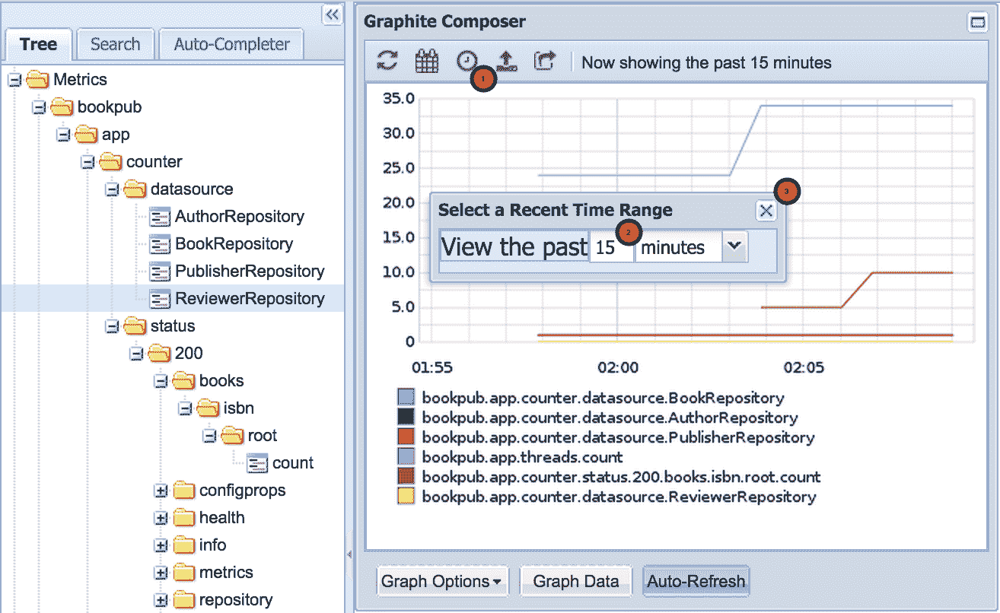

1.  我们还可以通过创建一个新的仪表板并添加一个 Graph 面板来使用这些数据在 Grafana 中创建一些看起来很酷的仪表板，如下截图所示：

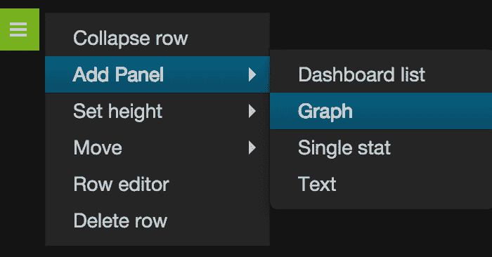

1.  新创建的 Graph 面板将看起来像这样：

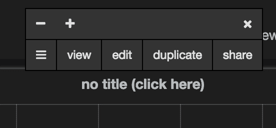

1.  点击无标题（点击此处）标签，选择编辑，并在文本字段中输入指标名称 `bookpub.app.http.server.requests.exception.None.method.GET.status.200.uri._books__isbn_.count`，如下截图所示：


1.  点击仪表板将退出编辑模式。

想要获取更详细的教程，请访问 [`docs.grafana.org/guides/gettingstarted/`](http://docs.grafana.org/guides/gettingstarted/).

# 它是如何工作的...

要启用通过 Graphite 导出指标，我们添加了对 `io.micrometer:micrometer-registry-graphite` 库的额外依赖。然而，在底层，它依赖于 Dropwizard 指标库来提供 Graphite 集成，因此它将在我们的 `build` 文件中添加以下新依赖项：

+   `io.dropwizard.metrics:metrics-core`: 这个依赖项添加了基本的 Dropwizard 功能，`MetricsRegistry`，常见的 API 接口和基类。这是使 Dropwizard 运作并集成到 Spring Boot 以处理指标所需的最小配置。

+   `io.dropwizard.metrics:metrics-graphite`: 这增加了对 `GraphiteReporter` 的支持，并且配置 Dropwizard 将它收集的监控数据发送到我们的 Graphite 实例是必需的。

为了保持事物的整洁和良好的分离，我们创建了一个单独的配置类，其中包含所有与监控相关的豆子和设置：`MonitoringConfiguration`。在这个类中，我们配置了三个 `@Bean` 实例：一个定制的 `MeterRegistryCustomizer` 实现来定制 `GraphiteMeterRegistry` 实例，`HigherarchicalNameMapper` 和与其一起的 `NamingConvention`。

我们必须创建自己的定制的理由有两点。我们希望遵守经典的 Graphite 指标命名方案，该方案使用点（`.`）符号来分隔层次结构中的指标名称。不幸的是，由于任何原因，Micrometer Graphite 实现选择了使用 `camelCase` 压缩符号，这使得像 `counter.datasource.BookRepository` 这样的指标名称被转换成 `counterDatasourceBookRepository`，以便在 Graphite 中显示。这样的长名称，没有层次树，当存在许多指标时，在 Graphite UI 中进行搜索和发现变得非常困难。此外，所有指标都被放置在根（`/`）树下，而没有创建一个专门的应用程序文件夹，这也导致了可读性和使用性的下降。我们在 `HigherarchicalNameMapper` 实例中添加了代码，将应用程序前缀添加到所有导出到 Graphite 的指标上，这样它们都会被放入 `subtree: /bookpub/app/*.`：

```java
String prefix = "bookpub.app."; 
... 
return prefix + id.getConventionName(convention) + tags; 
```

`NamingConvention` 提供了关于如何将特定的度量名称、键、值和标签转换为适当的 Graphite 变体的精确配置。在 `format(String name)` 方法中，我们声明我们想要使用点（`.`）分隔元素，通过 `NamingConvention.dot` 实现来执行。

`management.metrics.export.graphite` 属性组定义了如何将数据发送到 Graphite 实例。我们配置它每分钟这样做一次，将所有时间间隔，如延迟测量，转换为毫秒，以及所有变量速率，如某些时间框架内的请求数量，转换为秒。大多数这些值都有 Graphite 提供的默认配置设置，但如果需要，可以更改。

注意，我们使用了 `@ConditionalOnClass` 注解来指示我们只想在 Micrometer Graphite 提供的类 `GraphiteMeterRegistry.class` 存在于类路径上时应用此 `@Configuration`。这是必要的，以避免在测试期间尝试实例化 Graphite bean，因为在测试环境中可能没有运行并可供使用的 Graphite 实例。

如您从 Graphite UI 可用的指标中可以看到，有许多指标是开箱即用的。其中一些值得注意的是关于 JVM 和 OS 指标，它们将内存和线程指标暴露在内存和线程数据节点中的其他数据中。它们可以在 Graphite 树中的 `Metrics/bookpub/app/jvm`、`Metrics/bookpub/app/process` 或 `Metrics/bookpub/app/system` 中找到。

Micrometer 核心库提供了一系列用于额外系统指标的度量绑定器。如果需要导出诸如线程或执行器信息之类的数据，或查看文件描述符，可以通过简单地声明一个返回 `new JvmThreadMetrics()` 或 `new FileDescriptorMetrics()` 等的方法来导出额外的 bean。

运行的应用程序将收集所有注册到 `MeterRegistry` 的指标以及每个配置的导出器（在我们的案例中，`GraphiteMeterRegistry`）在定时间隔内向其目的地报告所有这些指标。适当的导出器实现运行在单独的 `ThreadPool` 中，因此不在主应用程序线程之外，也不会干扰它们。然而，如果度量实现内部使用某些 `ThreadLocal` 数据，则应记住这一点，因为这些数据对导出器不可用。

# 将 Micrometer 指标与 Dashing 集成

之前的配方让我们窥见了如何在应用程序运行时收集各种指标。我们还看到了将此数据可视化为一系列历史趋势图的能力是多么强大。

虽然 Grafana 和 Graphite 提供了非常强大的功能，可以以图表的形式操作数据，构建充满阈值、应用数据函数等复杂仪表板，但有时我们想要更简单、更易读、更具有小部件风格的东西。这正是 Dashing 提供的仪表板体验。

**Dashing** 是由 Shopify 开发的一个流行的仪表板框架，用 Ruby/Sinatra 编写。它为您提供了创建由不同类型的仪表板小部件组成的仪表板的能力。我们可以有图表、仪表、列表、数值或纯文本来显示信息。

在这个菜谱中，我们将安装 Dashing 框架，学习如何创建仪表板，直接从应用程序发送和消费报告数据以及从 Graphite 获取数据，并使用 Dashing API 将数据推送到 Dashing 实例。

# 准备工作

为了让 Dashing 运行，我们需要有一个安装了 Ruby 1.9+ 和 RubyGems 的环境。

通常，Ruby 应该在 Linux 和 OS X 的任何常见发行版上可用。如果您正在运行 Windows，我建议使用 [`rubyinstaller.org`](http://rubyinstaller.org) 来获取安装包。

一旦您有了这样的环境，我们将安装 Dashing 并创建一个新的仪表板应用程序供我们使用，如下所示：

1.  安装 Dashing 非常简单；只需执行 gem install dashing 命令即可在您的系统上安装 Dashing RubyGems。

1.  RubyGem 成功安装后，我们将通过在希望创建仪表板应用程序的目录中执行 dashing new `bookpub_dashboard` 命令来创建名为 `bookpub_dashboard` 的新仪表板。

1.  一旦生成了仪表板应用程序，请转到 `bookpub_dashboard` 目录并执行 `bundle` 命令来安装所需的依赖项 gems。

1.  在 gems bundle 安装完成后，我们可以通过执行 `dashing start` 命令来启动仪表板应用程序，然后通过浏览器访问 `http://localhost:3030` 来查看以下结果：


# 如何操作...

如果您仔细查看我们闪亮的新仪表板的 URL，您会发现它实际上说的是 `http://localhost:3030/sample` 并显示一个自动生成的示例仪表板。我们将使用这个示例仪表板来做出一些更改，以便直接显示我们应用程序的一些指标以及从 Graphite 数据 API 端点获取一些原始指标。

为了演示如何将来自 `/actuator/metrics` 端点的应用程序数据连接起来，以便在 Dashing 仪表板中显示，我们将更改 `Buzzwords` 小部件以显示我们数据存储库的计数，如下所示：

1.  在开始之前，我们需要将 `'httparty', '>= 0.13.3'` 钩子添加到位于 `bookpub_dashboard` 目录的 `Gemfile` 文件中，这将使我们能够使用 HTTP 客户端从 HTTP 端点提取监控指标。

1.  添加钩子后，再次运行 `bundle` 命令以安装新添加的钩子。

1.  接下来，我们需要修改位于 `bookpub_dashboard/dashboards` 目录的 `sample.erb` 仪表板定义，将 `<div data-id="buzzwords" data-view="List" data-unordered="true" data-title="Buzzwords" data-moreinfo="# of times said around the office"></div>` 替换为 `<div data-id="repositories" data-view="List" data-unordered="true" data-title="Repositories Count" data-moreinfo="# of entries in data repositories"></div>`。

1.  替换小部件后，我们将在 `bookpub_dashboard/jobs` 目录中创建一个名为 `repo_counters.rb` 的新数据提供作业文件，其内容如下：

```java
require 'httparty' 

repos = ['AuthorRepository', 'ReviewerRepository', 'BookRepository', 'PublisherRepository'] 

SCHEDULER.every '10s' do 
  data = JSON.parse(HTTParty.get("http://localhost:8081/metrics").body) 
  repo_counts = [] 

  repos.each do |repo| 
    current_count = data["counter.datasource.#{repo}"] 
    repo_counts << { label: repo, value: current_count } 
  end 

  send_event('repositories', { items: repo_counts }) 
end 
```

1.  在所有代码更改到位后，让我们通过执行 `dashing start` 命令来启动我们的仪表板。在浏览器中转到 `http://localhost:3030/sample`，以查看显示如下图标的新小部件：

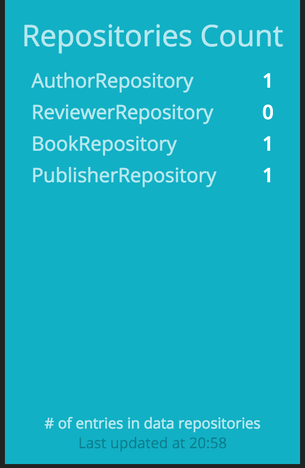

1.  如果我们使用远程 Shell 登录到应用程序，就像我们在本章前面所做的那样，并添加一个发布者，我们会看到仪表板上的计数器增加。

1.  将数据推送到仪表板的另一种方法是使用它们的 RESTful API。让我们通过执行 `curl -d '{ "auth_token": "YOUR_AUTH_TOKEN", "text": "My RESTful dashboard update!" }' http://localhost:3030/widgets/welcome` 来更新左上角的文本小部件中的文本。

1.  如果一切正常，我们应该在“Hello”标题下看到文本更新为我们的新值，`My RESTful dashboard update!`。

1.  在运行多个相同类型应用程序实例的环境中，直接从每个节点拉取数据可能不是一个好主意，尤其是如果它们非常动态，可以随意来去。建议您从更静态且更知名的位置获取数据，例如 Graphite 实例。为了演示易变的数据指标，我们将消耗 `Eden`、`Survivor` 和 `OldGen` 空间的内存池数据，而不是显示收敛、协同和估值图仪表板。我们将首先替换位于 `bookpub_dashboard/jobs` 目录的 `sample.rb` 作业文件的内容，如下所示：

```java
require 'httparty' 
require 'date' 

eden_key = "bookpub.app.jvm.memory.used.area.heap.id.PS_Eden_Space" 
survivor_key = "bookpub.app.jvm.memory.used.area.heap.id.PS_Survivor_Space" 
oldgen_key = "bookpub.app.jvm.memory.used.area.heap.id.PS_Old_Gen" 

SCHEDULER.every '60s' do 
  data = JSON.parse(HTTParty.get("http://localhost:8888/render/?from=-11minutes&target=#{eden_key}&target=#{survivor_key}&target=#{oldgen_key}&format=json&maxDataPoints=11").body) 

  data.each do |metric| 
    target = metric["target"] 
    # Remove the last data point, which typically has empty value 
    data_points = metric["datapoints"][0...-1] 
    if target == eden_key 
      points = [] 
      data_points.each_with_index do |entry, idx| 
        value = entry[0] rescue 0 
        points << { x: entry[1], y: value.round(0)} 
      end 
      send_event('heap_eden', points: points) 
    elsif target == survivor_key 
      current_survivor = data_points.last[0] rescue 0 
      current_survivor = current_survivor / 1048576 
      send_event("heap_survivor", { value: 
                   current_survivor.round(2)}) 
    elsif target == oldgen_key 
      current_oldgen = data_points.last[0] rescue 0 
      last_oldgen = data_points[-2][0] rescue 0 
      send_event("heap_oldgen", { 
                   current: current_oldgen.round(2), 
                   last: last_oldgen.round(2)
                 }) 
    end 
  end 
end 
```

1.  在位于 `bookpub_dashboard/dashboards` 目录的 `sample.erb` 模板中，我们将用以下替代方案替换 Synergy、估值和收敛图：

+   `<div data-id="synergy" data-view="Meter" data-title="Synergy" data-min="0" data-max="100"></div>` 被替换为 `<div data-id="heap_survivor" data-view="Meter" data-title="Heap: Survivor" data-min="0" data-max="100" data-moreinfo="In megabytes"></div>`

+   `<div data-id="valuation" data-view="Number" data-title="Current Valuation" data-moreinfo="In billions" data-prefix="$"></div>`被替换为`<div data-id="heap_oldgen" data-view="Number" data-title="Heap: OldGen" data-moreinfo="In bytes" ></div>`

+   `<div data-id="convergence" data-view="Graph" data-title="Convergence" style="background-color:#ff9618"></div>`被替换为`<div data-id="heap_eden" data-view="Graph" data-title="Heap: Eden" style="background-color:#ff9618" data-moreinfo="In bytes"></div>`

1.  在所有更改完成后，我们可以重新启动仪表板应用程序，并在浏览器中重新加载`http://localhost:3030`以查看以下结果：

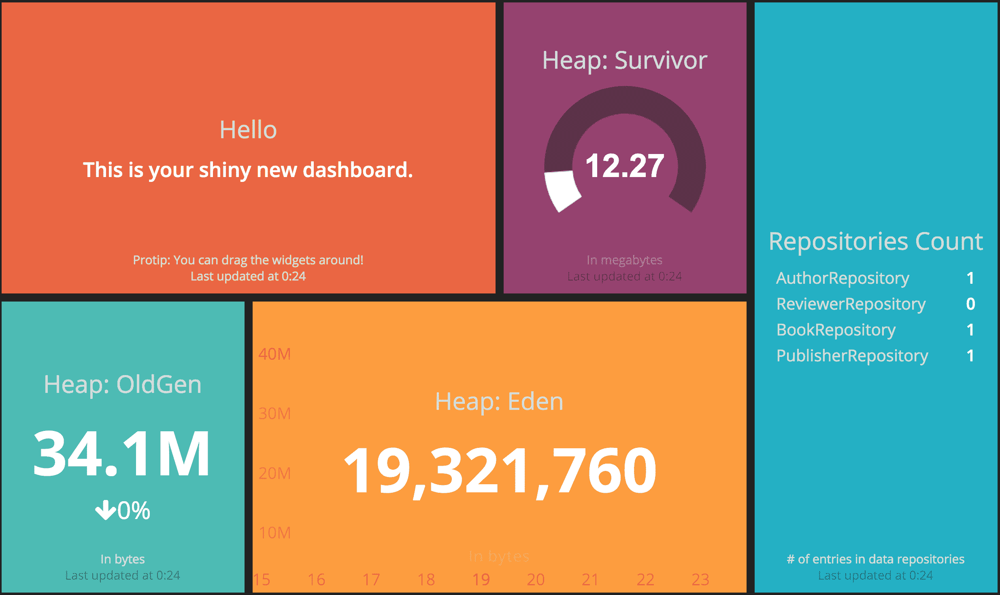

# 它是如何工作的...

在这个菜谱中，我们看到了如何直接从我们的应用程序中提取数据，并通过 Graphite，使用 Dashing 仪表板进行渲染，以及直接使用他们的 RESTful API 将信息推送到 Dashing。一次看到某物总比听七次要好，这一点在尝试获取代表系统在运行时行为的整体关键指标，并能够快速对数据进行操作时尤为正确。

虽然不深入探讨 Dashing 的内部结构，但仍然有必要提及一些关于数据如何进入 Dashing 的事情。这可以通过以下两种方式发生：

+   **计划任务**：这是用来从外部源提取数据

+   **RESTful API**：这是用来从外部将数据推送到 Dashing

计划任务定义在生成的仪表板应用程序的`jobs`目录中。每个文件都包含一段用`SCHEDULER.every`块包裹的 ruby 代码，它计算数据点并将新数据发送到适当的部件以进行更新。

在我们的菜谱中，我们创建了一个名为`repo_counters.rb`的新任务，我们使用了`httparty`库来直接调用我们的应用程序实例的`/actuator/metrics/#{name}`端点，并提取了每个预定义存储库的计数器。在遍历指标时，我们创建了一个`repo_counts`集合，其中包含每个存储库的数据，包括标签显示和值计数。生成的集合以`event: send_event('repositories', { items: repo_counts })`的形式发送到存储库小部件以进行更新。

我们配置了这个任务每 10 秒执行一次，但如果数据变化率不是非常频繁，这个数字可以改为几分钟甚至几小时。每次调度程序运行我们的任务时，存储库小部件都会通过客户端 WebSocket 通信以新数据更新。在`dashboards/sample.erb`中查找，我们可以使用`data-id="repositories"`找到小部件的定义。

除了添加我们自己的新任务外，我们还修改了现有的`sample.rb`任务，使用 Graphite 的 RESTful API 从 Graphite 获取数据，以填充不同类型的控件，以便显示内存堆数据。因为我们不是直接从应用程序实例中获取数据，所以将代码放在同一个任务中是个好主意，因为任务可能有不同的时间间隔——在我们的案例中，确实如此。由于我们每分钟只向 Graphite 发送一次数据，所以没有必要比这更频繁地获取数据。

要从 Graphite 获取数据，我们使用了以下 API 调用：

```java
/render/?from=-11minutes&target= bookpub.app.jvm.memory.used.area.heap.id.PS_Eden_Space &target= bookpub.app.jvm.memory.used.area.heap.id.PS_Survivor_Space &target= bookpub.app.jvm.memory.used.area.heap.id.PS_Old_Gen &format=json&maxDataPoints=11

```

看看前面代码片段中提到的以下参数：

+   `target`：此参数是一个重复的值，定义了我们想要检索的所有不同指标列表。

+   `from`：此参数指定时间范围；在我们的案例中，我们要求回退 11 分钟的数据。

+   `format`：此参数配置所需的输出格式。我们选择了 JSON，但还有许多其他格式。请参阅[`graphite.readthedocs.org/en/latest/render_api.html#format`](http://graphite.readthedocs.org/en/latest/render_api.html#format)。

+   `maxDataPoints`：此参数表示我们想要获取的条目数量。

我们要求 11 个条目而不是 10 个条目的原因是因为短范围请求的最后一条记录，这些请求只包含几分钟，有时会返回为空。我们只使用前 10 个条目并忽略最近的条目，以避免奇怪的数据可视化。

遍历目标数据，我们将填充适当的控件，例如`heap_eden`、`heap_survivor`和`heap_oldgen`，并使用它们指定的数据，如下所示：

+   `heap_eden`：这是一个`Graph`控件，如`sample.erb`模板中定义的`data-view="Graph"`属性，因此它需要一个包含`x`和`y`值的点集合作为数据输入。`x`值代表时间戳，它方便地由 Graphite 返回，并由 Graph 控件自动转换为分钟显示值。`y`值代表以字节为单位的内存池利用率。由于 Graphite 的值是十进制数的形式，我们需要将其转换为整数，以便看起来更好。

+   `heap_survivor`：这是一个`Meter`控件，如`sample.erb`模板中定义的`data-view="Meter"`属性，因此它需要一个在模板配置的范围内的简单数值作为数据输入。在我们的案例中，范围设置为`data-min="0" data-max="100"`属性。尽管我们选择将数字四舍五入到两位小数，但它可能只是一个整数，因为对于仪表盘显示来说足够精确。你也会注意到在`sample.rb`内部，我们将原始值（以字节为单位）转换为兆字节，以便更好地阅读——`current_survivor = current_survivor / 1048576`。

+   `heap_oldgen`: 这是一个`Number`小部件，如`sample.erb`模板中以`data-view="Number"`属性的形式定义的，因此它需要一个当前值的数据输入，以及可选的最后一个值；在这种情况下，将显示百分比变化以及变化方向。由于我们获取了最后 10 个条目，我们在检索当前值和最后一个值时没有问题，因此我们可以轻松满足这一要求。

在这个菜谱中，我们还通过尝试使用`curl`命令来更新欢迎小部件的值来实验了 Dashing 的 RESTful API。这是一个推送操作，可以在没有公开数据 API 的情况下使用，但你有能力创建某种脚本或代码来将数据发送到 Dashing。为了实现这一点，我们使用了以下命令：`curl -d '{ "auth_token": "YOUR_AUTH_TOKEN", "text": "My RESTful dashboard update!" }' http://localhost:3030/widgets/welcome`。

Dashing API 接受 JSON 格式的数据，通过 POST 请求发送，该请求包含以下参数，这些参数对于小部件以及作为 URL 路径一部分的 widget ID 是必需的：

+   `auth_token`: 这允许安全地更新数据，并且可以在仪表盘根目录下的`config.ru`文件中进行配置。

+   `text`: 这是一个正在被更改的`widget`属性。由于我们正在更新一个`Text`小部件，如`sample.erb`模板中定义的，以`data-view="Text"`属性的形式，我们需要发送文本以更新。

+   `/widgets/<widget id>`: 这个 URL 路径标识了更新目标的具体小部件。`id`对应于`sample.erb`模板中的声明。在我们的例子中，它看起来像`data-id="welcome"`。

各种小部件的定义也可以被操作，社区已经创建了一个非常丰富的小部件集合，可在[`github.com/Shopify/dashing/wiki/Additional-Widgets`](https://github.com/Shopify/dashing/wiki/Additional-Widgets)找到。这些小部件将被安装到仪表盘的`widgets`目录中，可以通过简单地运行`dashing install <GIST>`来安装，其中`GIST`是 GitHub Gist 条目的哈希值。

与我们的`sample.erb`模板类似，仪表盘模板文件也可以被修改，以创建每个特定仪表盘的所需布局以及多个仪表盘模板，这些模板可以被轮换或直接手动加载。

每个仪表盘代表一个网格，各种小部件被放置在其中。每个小部件由一个带有适当配置属性的`<div>`条目定义，并且应该嵌套在`<li>`网格元素中。我们可以使用数据元素属性来控制每个小部件在网格中的位置，如下所示：

+   `data-row`: 这代表小部件应该放置的行号。

+   `data-col`: 这代表小部件应该放置的列号。

+   `data-sizex`：这定义了小部件在水平方向上跨越的列数

+   `data-sizey`：这定义了小部件在垂直方向上跨越的行数

现有的小部件可以被修改以改变它们的视觉和感觉效果，同时扩展它们的功能；因此，我们能够拥有的信息显示类型是无限的。你绝对应该查看[`dashing.io`](http://dashing.io)以获取更多详细信息。
