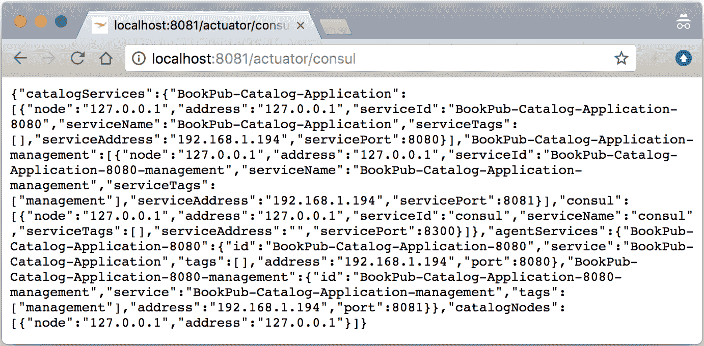
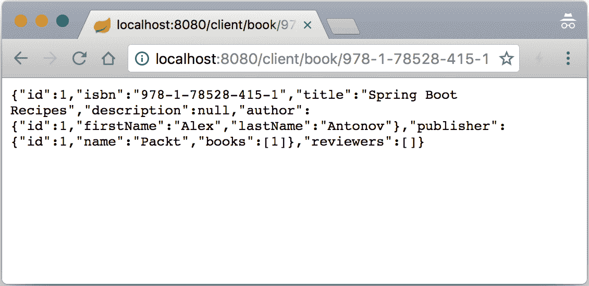
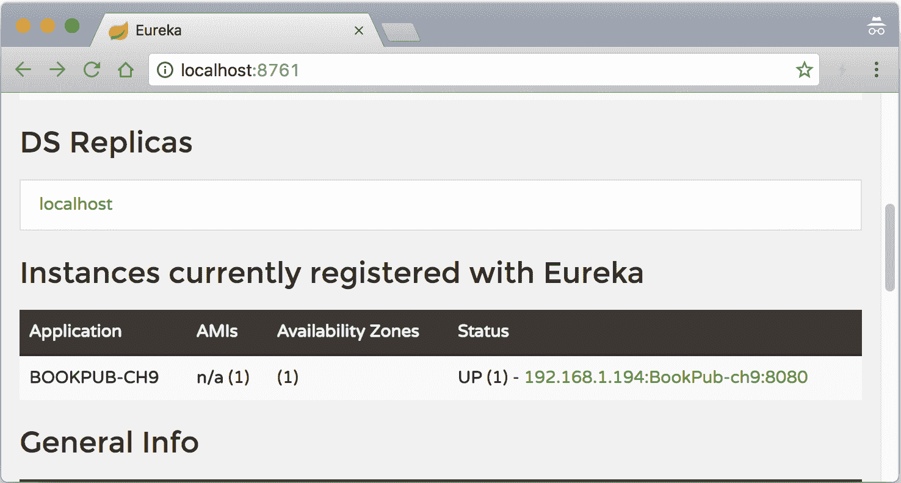
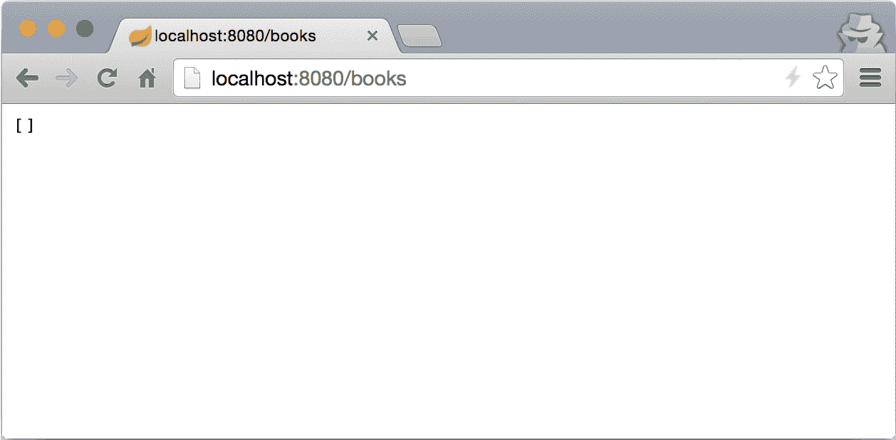
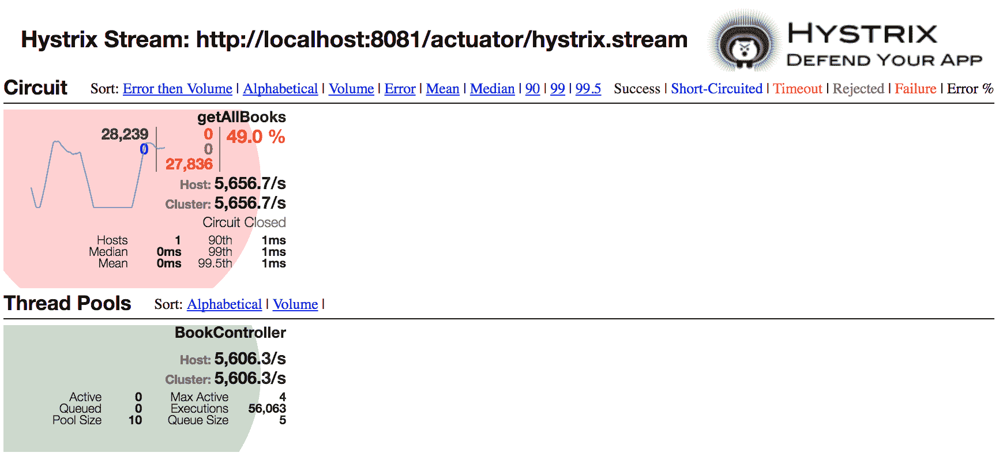

# 第九章：Spring Cloud

在本章中，我们将学习以下主题：

+   Spring Cloud 入门

+   使用 Spring Cloud Consul 进行服务发现

+   使用 Spring Cloud Netflix—Feign

+   使用 Spring Cloud Netflix—Eureka 进行服务发现

+   使用 Spring Cloud Netflix—Hystrix

# 简介

在整本书中，我们学习了如何创建应用程序、配置 RESTful 服务、进行测试、集成指标和其他管理组件，以及处理打包和部署等。现在，是时候看看应用程序之外的世界——无处不在的云环境了。

在本章中，我们将探讨如何使应用程序适合云环境，如何处理在云中运行的分布式应用程序的动态特性，如何使我们的应用程序对世界可见，如何发现其他服务端点，如何调用它们，以及如何处理各种错误条件。

# Spring Cloud 入门

Spring Cloud 项目家族为 Spring Boot 提供了各种框架的集成扩展，这些框架提供了分布式服务发现、配置、路由、服务调用等功能。通过使用统一的 API，我们可以将这些概念添加到我们的应用程序中，并在需要时灵活地更改具体实现，而无需对代码库进行重大修改。

# 如何操作...

我们将首先通过将它们添加到主构建配置中，增强我们的`BookPub`项目的基础 Spring Cloud 模块：

1.  将以下内容添加到项目根目录下的`build.gradle`文件中：

```java
... 
apply plugin: 'docker' 

dependencyManagement { 
    imports { 
        mavenBom 'org.springframework.cloud:spring-cloud-dependencies:Finchley.BUILD-SNAPSHOT' 
    } 
} 

jar { 
    baseName = 'bookpub' 
    version = '0.0.1-SNAPSHOT' 
} 

... 

dependencies { 
    ... 
    compile("org.springframework.boot:spring-boot-devtools") 
    compile("org.springframework.cloud:spring-cloud-context") 
    compile("org.springframework.cloud:spring-cloud-commons") 
    runtime("com.h2database:h2") 
    ... 
}
```

1.  通过运行`./gradlew clean bootRun`启动应用程序

1.  应用程序启动后，即使看起来没有发生任何新的事情，如果我们打开浏览器到`http://localhost:8081/actuator/env`（环境的管理端点），我们将看到新的属性源出现：

```java
{ 
  "name": "springCloudClientHostInfo", 
  "properties": { 
    "spring.cloud.client.hostname": { 
      "value": "127.0.0.1" 
    }, 
    "spring.cloud.client.ip-address": { 
      "value": "127.0.0.1" 
    } 
  } 
} 
```

1.  在项目根目录下的`src/main/resources`目录下创建一个`bootstrap.properties`文件，内容如下（此时应在`application.properties`文件中相应地注释掉相同的属性）：

```java
spring.application.name=BookPub-ch9 
```

1.  通过运行`./gradlew clean bootRun`启动应用程序

1.  应用程序启动后，打开我们的浏览器到`http://localhost:8081/env`，我们将看到新的属性源出现：

```java
{ 
  "name": "applicationConfig: [classpath:/bootstrap.properties]", 
  "properties": { 
    "spring.application.name": { 
      "value": "BookPub-ch9", 
      "origin": "class path resource [bootstrap.properties]:1:25" 
    } 
  } 
}
```

# 它是如何工作的...

在我们深入探讨事物的工作原理之前，让我们回顾一下我们对项目所做的更改。第一步是增强`build.gradle`构建配置，通过导入 Spring Cloud 发布列车的一个**物料清单**（**BOM**）声明——`mavenBom 'org.springframework.cloud:spring-cloud-dependencies: Finchley.BUILD-SNAPSHOT'`。虽然我们可以选择性地导入显式定义的`spring-cloud-context`和`spring-cloud-commons`库的版本，但通过依赖打包的 BOM，我们可以确保我们将使用经过相互兼容性测试的不同组件的正确版本。

在特定发布列车中包含的每个 Spring Cloud 模块的特定版本可以在[`cloud.spring.io/`](http://cloud.spring.io/)中查看。

我们首先添加了对`spring-cloud-context`和`spring-cloud-commons`库的依赖，以展示 Spring Cloud 提供的基本通用设施，然后再深入到特定启动器集成，例如`spring-cloud-netflix`或`spring-cloud-consul`。这些基本库提供了一个接口和通用功能的基础，这些功能被用于构建所有不同的特定云集成。以下是它们的目的：

+   `spring-cloud-commons`：这个库提供了一系列共享的通用接口和基类，定义了服务发现、服务路由、负载均衡、断路器、功能能力和一些基本配置的概念。例如，这就是自动配置环境为`springCloudClientHostInfo`属性源的库。

+   `spring-cloud-context`：这是负责引导和配置各种集成的基础，例如特定的服务发现实现如 Consul，或特定的断路器实现如**Hystrix**。这是通过创建一个隔离的引导应用程序上下文来实现的，该上下文负责在主应用程序启动之前加载和配置所有组件。

引导应用程序上下文在应用程序启动周期早期创建，并且它由一个单独的文件配置——`bootstrap.properties`（也支持 YAML 变体）。由于在云中运行的应用程序通常依赖于许多外部配置源、服务查找等，引导上下文的目的就是配置这些功能并从外部获取所有必要的配置。

为了清楚地将应用程序配置与 Bootstrap 分开，我们将描述应用程序的内容、配置外部配置或其他环境变量（如服务发现调用位置）放入`bootstrap.properties`而不是`application.properties`。在我们的示例中，我们将`spring.application.name`配置放入`bootstrap.properties`，因为该信息将在 Bootstrap 阶段需要；它可以用于从远程配置存储中查找配置。

由于 Bootstrap 应用程序上下文确实是一个真实的 Spring 应用程序上下文，因此两者之间存在父子关系，其中 Bootstrap 应用程序上下文成为 Spring Boot 应用程序上下文的父级。这意味着 Bootstrap 上下文中定义的所有 bean 和属性源都可以在应用程序上下文中使用。

当 Spring Cloud 添加到应用程序中时，它会自动提供特定 Spring Cloud 模块（如 Spring Cloud Consul）的集成框架，通过现在众所周知的`spring.factories`配置声明进行插入。`spring-cloud-commons`内部提供的注解，即`@SpringCloudApplication`、`@EnableDiscoveryClient`、`@EnableCircuitBreaker`，以及由`spring-cloud-context`库提供的`@BootstrapConfiguraion`和`PropertySourceLocator`接口，旨在定义用于自配置特定组件（如 Consul 这样的发现客户端、Hystrix 这样的断路器或 ZooKeeper 这样的远程配置源）的集成点。

让我们详细检查这些内容：

+   `@SpringCloudApplication`: 这个注解类似于`@SpringBootApplication`，本质上是一个元注解，除了它还包装了`@EnableDiscoveryClient`和`@EnableCircuitBreaker`注解，并且还用`@SpringBootApplication`进行了元注解。当您想在应用程序中启用发现客户端和断路器功能时，使用此注解是一个好主意。

+   `@EnableDiscoveryClient`: 这个注解用于指示 Spring Cloud 应该初始化提供的发现客户端以进行服务注册，具体取决于包含的集成库，例如 Consul、Eureka、ZooKeeper 等。

+   `@EnableCircuitBreaker`: 这个注解用于指示 Spring Cloud 应该根据特定集成库的依赖初始化断路器功能，例如 Hystrix。

+   `PropertySourceLocator`: 集成库使用此接口来实现从提供的数据存储中提取远程配置的特定功能。每个提供加载远程配置能力的集成模块都会注册一个实现此类型的 bean，该 bean 公开一个由集成支持的`PropertySource`实现。

+   `@BootstrapConfiguration`: 这个注解类似于`@ManagementContextConfiguration`注解，并且（主要）是一个标记注解，旨在识别`spring.factories`描述符中的关键部分，以指示在 Spring Cloud Bootstrap 过程中应该加载哪些配置类，并使其成为 Bootstrap 应用程序上下文的一部分。这些配置在启动时由`BootstrapApplicationListener`读取并初始化指定的配置。通常，这就是配置类被配置的地方，这些类定义并暴露实现`PropertySourceLocator`的 bean。

# 使用 Spring Cloud Consul 进行服务发现

在分布式计算的世界中，服务成为可丢弃的商品是非常常见的。服务的典型生命周期可能是几天，甚至可能只有几个小时，一个实例由于任何原因崩溃，然后几秒钟后自动启动一个新实例，这种情况并不罕见。当应用程序的状态如此短暂时，维护一个静态连接的架构就变得非常困难，因为服务知道它们依赖的服务确切位置，而拓扑结构总是在变化。

为了帮助解决这个问题，服务发现层就派上用场了，它维护着集中式和分布式的服务注册状态，随时准备根据需求提供最新的信息。应用程序在启动时会注册自己，提供有关其位置的信息，以及可能有关其能力、服务水平、健康检查状态等信息。

在本书的早期部分，在第六章第六章，*应用程序打包和部署*中，我们介绍了 Consul，并使用它进行外部应用程序配置消费。在本食谱中，我们将进一步探讨 Consul 的功能，并学习如何使用`spring-cloud-consul`模块自动将我们的应用程序注册到 Consul 中。

# 如何实现...

查看以下步骤以设置服务发现：

1.  通过修改位于我们项目根目录下的`build.gradle`文件，将`spring-cloud-commons`和`spring-cloud-context`模块替换为`spring-cloud-starter-consul-all`，内容如下：

```java
... 

dependencies { 
    ... 
    compile("io.dropwizard.metrics:metrics-graphite:3.1.0") 
    compile("org.springframework.boot:spring-boot-devtools") 
    //compile("org.springframework.cloud:spring-cloud-context") 
    //compile("org.springframework.cloud:spring-cloud-commons") 
    compile("org.springframework.cloud:spring-cloud-starter-consul-all") 
    runtime("com.h2database:h2") 
    ... 
} 
... 
```

1.  在添加了 Consul 依赖项后，我们将通过修改位于项目根目录下的`src/main/java/com/example/bookpub`目录中的`BookPubApplication.java`文件，使我们的应用程序在启动时自动注册到本地代理，内容如下：

```java
... 
@EnableScheduling 
@EnableDbCounting 
@EnableDiscoveryClient 
public class BookPubApplication { 
    ... 
}
```

1.  由于 Consul 已成功安装，如第六章第六章中*设置 Consul*食谱中所述的步骤，我们应该能够通过运行`consul agent -server -bootstrap-expect 1 -data-dir /tmp/consul`来启动它，并且我们的终端窗口应该显示以下输出：

```java
==> Starting Consul agent... 
==> Starting Consul agent RPC... 
==> Consul agent running! 
           Version: 'v1.0.2' 
... 
```

1.  在 Consul 代理成功启动并运行后，我们将通过运行 `./gradlew clean bootRun` 来启动我们的应用程序。

1.  当我们查看启动日志滚动时，有几个有趣的条目表明应用程序正在与代理交互，因此请关注日志中的以下内容：

```java
... 
2017-12-26 --- b.c.PropertySourceBootstrapConfiguration : Located property source: CompositePropertySource [name='consul', propertySources=[ConsulPropertySource [name='config/BookPub-ch9/'], ConsulPropertySource [name='config/application/']]] 
... 
2017-12-26 --- o.s.c.consul.discovery.ConsulLifecycle   : Registering service with consul: NewService{id='BookPub-ch9-8080', name='BookPub-ch9', tags=[], address='<your_machine_name>', port=8080, check=Check{script='null', interval=10s, ttl=null, http=http://<your_machine_name>:8081/health, tcp=null, timeout=null}} 
2017-12-26 --- o.s.c.consul.discovery.ConsulLifecycle   : Registering service with consul: NewService{id='BookPub-ch9-8080-management', name='BookPub-ch9-management', tags=[management], address='://<your_machine_name>', port=8081, check=Check{script='null', interval=10s, ttl=null, http=http://chic02qv045g8wn:8081/health, tcp=null, timeout=null}} 
...
```

1.  为了验证我们的应用程序已注册并且与本地 Consul 代理进行通信，请在浏览器中打开 `http://localhost:8081/actuator/consul` 来查看 Consul 代理信息，如下面的截图所示：

# 它是如何工作的...

当我们将 `spring-cloud-starter-consul-all` 作为构建依赖项添加时，它会自动拉取所有必要的组件以启用应用程序的 Consul 功能。我们自动获得了 `spring-cloud-consul-binder`、`spring-cloud-consul-core`、`spring-cloud-consul-config` 和 `spring-cloud-consul-discovery` 工件添加到我们的类路径中。让我们来看看它们：

+   `spring-cloud-consul-core`: 此工件提供了基本的自动配置，以暴露通用的 `ConsulProperties`，以及如果启用了 Spring Boot Actuator 功能，则初始化和设置 `/consul` 管理端点。

+   `spring-cloud-consul-config`: 这提供了 `ConsulPropertySourceLocator` 的实现，在引导过程中使用，以配置 `ConsulPropertySource` bean，允许从 Consul 键值存储中消费远程配置。它还设置了一个 `ConfigWatch` 变更观察者，如果在应用程序运行时 Consul 键值存储中的配置键值发生变化，则会触发 `RefreshEvent` 到应用程序上下文。这允许在无需重新部署和重启应用程序的情况下重新加载配置属性。

+   `spring-cloud-consul-discovery`: 这提供了服务发现、服务注册和服务调用的所有功能和实现。

+   `spring-cloud-consul-binder`: 这提供了 Consul 事件功能与 Spring Cloud Stream 框架的集成，使其能够从 Consul 发送和接收事件，并在应用程序内对它们做出响应。虽然这超出了本章的范围，但可以从 [`cloud.spring.io/spring-cloud-stream/`](http://cloud.spring.io/spring-cloud-stream/) 获取更多信息。

当将 `spring-cloud-consul-config` 添加到类路径时，会自动注册 `ConsulPropertySource`，但对于 `spring-cloud-consul-discovery` 模块则不是这样。服务发现功能更为侵入性，因此需要开发人员额外一步确认，以表明确实需要它。这是通过在主应用程序类中添加 `@EnableDiscoveryClient` 注解来实现的；在我们的例子中是 `BookPubApplication`。

一旦添加了`@EnableDiscoveryClient`注解，Spring Cloud（更确切地说，是来自`spring-cloud-commons`模块的`EnableDiscoveryClientImportSelector`类）将扫描所有`spring.factories`文件以查找`org.springframework.cloud.client.discovery.EnableDiscoveryClient`键的存在，并将所有相关配置加载到主应用程序上下文中。如果我们查看位于`spring-cloud-consul-discovery` JAR 文件下的`META-INF/`目录中的`spring.factories`文件，我们将看到以下条目：

```java
# Discovery Client Configuration 
org.springframework.cloud.client.discovery.EnableDiscoveryClient=\ 
org.springframework.cloud.consul.discovery.ConsulDiscoveryClientConfiguration
```

这告诉我们，当启用发现客户端时，`ConsulDiscoveryClientConfiguration`将被消费，并且所有定义的 bean 都将添加到应用程序上下文中。

如果使用自定义服务发现机制，可以使用类似的方法。需要创建一个自定义配置类，公开`DiscoveryClient`接口的自定义实现，并在存档中包含的`spring.factories`文件中进行配置。一旦加载该 JAR，如果启用了发现客户端功能，配置将自动消费。

Spring Cloud Consul 库提供了非常细粒度的配置和选择所需功能的能力，如果不是所有功能都适用于特定用例。有关各种配置和使用选项的详细信息，请参阅[`cloud.spring.io/spring-cloud-consul/`](http://cloud.spring.io/spring-cloud-consul/)。

# 使用 Spring Cloud Netflix – Feign

在上一个菜谱中，我们探讨了如何为我们的应用程序启用服务发现能力，以便能够将我们的服务注册到世界上，以及了解其他服务存在的地方。这个菜谱将帮助我们更好地与这些信息互动，并消费这些服务，而无需显式编写任何处理服务发现及其相关问题的逻辑。

为了实现这个目标，我们将查看另一个由 Spring Cloud Netflix 模块家族提供的 Spring Cloud 集成——Netflix Feign。Feign 简化了将服务 API 调用绑定到相应的 HTTP API 对应方的过程。它提供了自动服务映射和发现，能够将 Java 类型转换为 HTTP 请求 URL 路径、参数和响应负载，以及错误处理。

为了简化，在这个菜谱中，我们将创建一个`Client`控制器，它将充当我们的`BookPub`应用程序服务的客户端，通过 Feign 注解的 Java 服务接口调用我们的 API，依赖 Consul 提供服务发现功能。

# 如何做到这一点...

1.  我们将首先将 Netflix Feign 模块依赖项添加到我们的项目中。让我们修改位于我们项目根目录的`build.gradle`文件，内容如下：

```java
dependencies { 
    ... 
    compile("org.springframework.cloud:spring-
    cloud-starter-consul-all") 
    compile("org.springframework.cloud:spring-
    cloud-starter-openfeign") 
    runtime("com.h2database:h2") 
    ... 
} 
```

1.  在添加了依赖项后，我们的下一步是创建一个 Java API 接口，描述我们想要如何定义与 `BookPub` 服务的交互。让我们在项目根目录下的 `src/main/java/com/example/bookpub` 目录中创建一个 `api` 包。

1.  在新创建的 `api` 包中，让我们创建一个名为 `BookPubClient.java` 的 API 类文件，其内容如下：

```java
package com.example.bookpub.api; 

import com.example.bookpub.entity.Book; 
import org.springframework.cloud.netflix.feign.FeignClient; 
import org.springframework.web.bind.annotation.PathVariable; 
import org.springframework.web.bind.annotation.RequestMapping; 
import org.springframework.web.bind.annotation.RequestMethod; 

@FeignClient("http://BookPub-ch9") 
public interface BookPubClient { 
    @RequestMapping(value = "/books/{isbn}",  
                    method = RequestMethod.GET) 
    public Book findBookByIsbn(@PathVariable("isbn") String isbn); 
}
```

1.  在我们定义了 API 之后，是时候告诉我们的应用程序我们想要启用 Feign 支持了。我们将通过修改项目根目录下的 `src/main/java/com/example/bookpub` 目录中的 `BookPubApplication.java` 文件来实现这一点，其内容如下：

```java
... 
@EnableDiscoveryClient 
@EnableFeignClients 
public class BookPubApplication {...} 
```

1.  最后，让我们在项目根目录下的 `src/main/java/com/example/bookpub/controllers` 目录中创建一个名为 `ClientController.java` 的新文件，以通过调用 `BookPubClient` 来创建客户端控制器，其内容如下：

```java
... 
@RestController 
@RequestMapping("/client") 
public class ClientController { 

    @Autowired 
    private BookPubClient client; 

    @RequestMapping(value = "/book/{isbn}",  
                    method = RequestMethod.GET) 
    public Book getBook(@PathVariable String isbn) { 
        return client.findBookByIsbn(isbn); 
    } 
} 
```

1.  一切设置和完成后，让我们通过执行 `./gradlew clean bootRun` 命令来启动应用程序。

确保 Consul 代理也在后台运行，否则服务注册将失败。

1.  一旦应用程序启动并运行，让我们在浏览器中打开 `http://localhost:8080/client/book/978-1-78528-415-1` 来查看 Consul 代理信息，如下所示：

1.  如果我们查看应用程序控制台日志，我们还将看到表示我们的 Feign 客户端已初始化并正常工作的条目。你应该看到类似以下内容：

```java
2017-12-26 --- c.n.u.concurrent.ShutdownEnabledTimer : Shutdown hook installed for: NFLoadBalancer-PingTimer-BookPub-ch9
2017-12-26 --- c.netflix.loadbalancer.BaseLoadBalancer : Client:BookPub-ch9 instantiated a LoadBalancer:DynamicServerListLoadBalancer:{NFLoadBalancer:name=BookPub-ch9,current list of Servers=[],Load balancer stats=Zone stats: {},Server stats: []}ServerList:null
2017-12-26 --- c.n.l.DynamicServerListLoadBalancer : Using serverListUpdater PollingServerListUpdater
 2017-12-26 --- c.netflix.config.ChainedDynamicProperty : Flipping property: BookPub-ch9.ribbon.ActiveConnectionsLimit to use NEXT property: niws.loadbalancer.availabilityFilteringRule.activeConnectionsLimit = 2147483647
 2017-12-26 --- c.n.l.DynamicServerListLoadBalancer : DynamicServerListLoadBalancer for client BookPub-ch9 initialized: DynamicServerListLoadBalancer:{NFLoadBalancer:name=BookPub-ch9,current list of Servers=[192.168.1.194:8080],Load balancer stats=Zone stats: {unknown=[Zone:unknown; Instance count:1; Active connections count: 0; Circuit breaker tripped count: 0; Active connections per server: 0.0;]
 },Server stats: [[Server:192.168.1.194:8080; Zone:UNKNOWN; Total Requests:0; Successive connection failure:0; Total blackout seconds:0; Last connection made:Wed Dec 31 18:00:00 CST 1969; First connection made: Wed Dec 31 18:00:00 CST 1969; Active Connections:0; total failure count in last (1000) msecs:0; average resp time:0.0; 90 percentile resp time:0.0; 95 percentile resp time:0.0; min resp time:0.0; max resp time:0.0; stddev resp time:0.0]
 ]}ServerList:ConsulServerList{serviceId='BookPub-ch9', tag=null}
```

1.  最后一件我们应该做的事情是让我们的测试与所有新添加的框架一起工作。因为 Spring Cloud 不会将自己添加到测试生命周期中，所以我们应该明确禁用在测试期间对由 Spring Cloud 库创建的 bean 的任何依赖。为此，让我们向项目根目录下的 `src/test/resources` 目录中的 `application.properties` 文件添加以下属性：

```java
spring.cloud.bus.enabled=false 
spring.cloud.consul.enabled=false 
spring.cloud.consul.discovery.enabled=false 
eureka.client.enabled=false 
autoconfigure.exclude=com.example.bookpub.
MonitoringConfiguration.class 
```

1.  我们还需要在 `src/test/java/com/example/bookpub` 目录下的 `JpaAuthorRepositoryTests.java` 和 `WebMvcBookControllerTests.java` 文件中添加一个对 `BookPubClient` 的 Mock 依赖，其内容如下：

```java
@MockBean 
private BookPubClient client; 
```

# 它是如何工作的...

与前一个配方中看到的情况类似，在主应用程序类 `BookPubApplication` 上使用 `@EnableFeignClients` 注解，明确告诉 Spring Cloud 它应该扫描所有带有 `@FeignClient` 注解的接口，并根据它们的定义创建服务客户端实现。`@EnableFeignClients` 注解在本质上与 `@ComponentScan` 注解相似，提供属性来控制要扫描哪些包以查找带有 `@FeignClient` 注解的类或显式列出应使用的 API 类。

默认情况下，所有 Feign 客户端实现都是使用在`FeignClientsConfiguration`类中定义的组件进行配置的，但可以通过`@EnableFeignClients`注解的`defaultConfiguration`属性提供替代配置类。

简而言之，每个带有`@FeignClient`注解的接口定义都会获得一个由 Java 动态代理对象组成的实现，该对象处理所有接口方法调用（通常使用`FeignInvocationHandler`来处理所有请求）。调用处理器负责做一些事情。

一旦调用任何方法，首先使用提供的发现客户端（在我们的例子中是`ConsulDiscoveryClient`）根据`@FeignClient`注解的`name`属性定位服务实例。在我们的例子中，我们已将`name`属性的值声明为`http://BookPub-ch9`，因此所有名称设置为`BookPub-ch9`的注册服务实例都将作为可能的候选返回。这个名称可以是服务名称本身，或者，正如我们在我们的例子中所做的那样，可以指定一个可选的协议。这是一个有用的功能，因为并非所有服务发现提供者都支持指定确切的服务调用方式，因此如果我们想使用 HTTPS 进行安全调用，我们可以明确指定协议以帮助 Feign 进行正确的调用。

注解上还有许多其他配置属性可用，例如，为了告诉 Feign 直接调用指定的 URL 而不是进行服务查找，有一个可以配置的`url`属性。

要查看可能的属性及其用例的完整列表，请访问[`cloud.spring.io/spring-cloud-netflix/single/spring-cloud-netflix.html#spring-cloud-feign`](https://cloud.spring.io/spring-cloud-netflix/single/spring-cloud-netflix.html#spring-cloud-feign)。

对于给定服务的实例列表，会被另一个 Netflix 库——Ribbon 提供的内部负载均衡器所包装。它使用指定的算法在服务实例之间进行轮询，并在发现客户端表示它们不健康时将不良实例从循环中移除。

要查看有关负载均衡规则和其他设置的配置选项的完整列表，请访问[`cloud.spring.io/spring-cloud-netflix/single/spring-cloud-netflix.html#spring-cloud-ribbon`](https://cloud.spring.io/spring-cloud-netflix/single/spring-cloud-netflix.html#spring-cloud-ribbon)。

当确定特定的实例后，会创建一个 HTTP 请求，使用标准的 Spring `HttpMessageConverter` bean 将方法参数转换为 HTTP 请求路径变量和查询参数。完成所有这些后，请求通过配置的 HTTP 客户端发送，并将响应转换为 API 接口上声明的返回类型，使用相同的转换器进行转换。

现在我们已经了解了`@FeignClient`注解是什么以及一旦 API 定义的方法被调用，幕后会发生什么，让我们看看如何注解应该转换为远程服务调用的接口方法。方便的是，并且是有意为之，我们可以使用与我们在`@Controller`注解的类中声明控制器映射时相同的注解。我们想要映射到远程服务的 API 接口中的每个方法都应该用`@RequestMapping`注解。`path`属性对应于我们想要调用的远程服务的 URL 路径。

在我们的示例中，我们想要调用`BookController.getBook(...)`方法，这对应于`/books/{isbn}`URL 路径。这正是我们为`path`属性设置的值，并确保我们在`findBookByIsbn(...)`方法中用`@PathVariable("isbn")`注解`isbn`参数，以将其链接到映射模板中的`{isbn}`占位符。

作为一般规则，`@RequestMapping`注解的功能与在控制器中使用时完全相同，只是配置与出站请求相关，而不是入站请求。当配置注解的`consumes`属性时，可能会特别令人困惑，即`consumes = "application/json"`，因为它表示远程端期望 JSON 作为负载的内容类型。

# 使用 Spring Cloud Netflix 进行服务发现 – Eureka

我们已经看到了如何使用 HashiCorp Consul 进行服务发现并将其集成到我们的应用程序中。这个配方将介绍一个替代方案，一个非常流行的来自 Netflix 的 Eureka 服务发现框架。Eureka 是由 Netflix 开发的，旨在帮助解决他们在 AWS 中 RESTful 服务的服务发现、健康检查和负载平衡问题。

与 Consul 不同，Eureka 专注于服务发现的任务，并不提供许多额外的功能，例如键值存储服务或事件传递。然而，它在所做的事情上非常出色，应该被视为一个可行的服务发现解决方案。

# 如何操作...

在我们添加 Eureka 到我们的应用程序的步骤之前，我们需要启动并运行 Eureka 服务本身。幸运的是，Spring Cloud 团队已经足够出色，提供了一个示例项目，使得创建 Eureka 服务器实例并运行它变得非常简单。让我们看看以下步骤：

1.  要启动并运行，请访问[`github.com/spring-cloud-samples/eureka`](https://github.com/spring-cloud-samples/eureka)并使用 git clone 命令`git@github.com:spring-cloud-samples/eureka.git`将仓库克隆到您的机器上。

1.  完成这些后，运行`./gradlew clean bootRun`以启动服务器：

1.  一旦服务器启动并运行，我们需要将以下依赖项添加到位于我们项目根目录的`build.gradle`文件中：

```java
//compile("org.springframework.cloud:spring-cloud-starter-consul-all") 
compile("org.springframework.cloud:spring-cloud-starter-feign") 
compile("org.springframework.cloud:spring-cloud-starter-eureka-client") 
```

1.  具有讽刺意味的是，我们此时只需执行 `./gradlew clean bootRun` 命令重新启动我们的应用程序。

确保 Eureka 服务器在后台运行，否则，尽管应用程序会启动，但 `BookPubClient` 调用将会失败。

1.  一旦应用程序启动并运行，让我们在浏览器中打开 `http://localhost:8080/client/book/978-1-78528-415-1`，我们应该看到与之前配方中完全相同的响应。

1.  只为了确认我们的应用程序确实已注册到 Eureka，我们可以在 `http://localhost:8761` URL 打开浏览器，我们应该在我们的服务列表下看到我们的服务：



# 它是如何工作的...

通过看似无力的改变，我们已经将一个服务发现提供者，Consul，切换为另一个，Eureka。表面上看起来变化不大，但实际上在底层做了很多工作。我们之所以能够如此轻松地做到这一点，是因为 `spring-cloud-commons` 和 `spring-cloud-context` 基础库提供的公共 API 集合。通过 `spring.factories` 描述符提供的自动模块加载支持，允许在初始化不同的服务发现提供者时进行透明替换。只要我们在 `BookPubApplication` 类上保留 `@EnableDiscoveryClient` 注解，Spring Cloud 就会承担繁重的工作，负责加载适当的自动配置文件并设置所有正确的豆（Beans）以使我们的应用程序能够与 Eureka 一起工作。

我们不得不在配方步骤的第一步就移除 Consul 依赖，这样做是为了消除 `DiscoveryClient` 实现的不确定性。如果不这样做，我们的应用程序上下文最终会包含 `DiscoveryClient` 接口的不同实现，这本身并不是什么坏事，除非 Spring Cloud 需要消除歧义并选择一个，而且可能不会选择我们想要的那个。

如果我们在 `build.gradle` 文件中留下 `spring-cloud-starter-consul-all` 依赖，并尝试运行应用程序，它将在启动时失败，并在日志中看到以下条目：

```java
WARN 5592 --- [  restartedMain] ConfigServletWebServerApplicationContext : Exception encountered during context initialization - cancelling refresh attempt: org.springframework.beans.factory.BeanCreationException: Error creating bean with name 'jmxMBeanExporter' defined in class path resource [org/springframework/boot/actuate/autoconfigure/endpoint/jmx/JmxEndpointAutoConfiguration.class]: Invocation of init method failed; nested exception is org.springframework.beans.factory.UnsatisfiedDependencyException: Error creating bean with name 'org.springframework.cloud.client.serviceregistry.ServiceRegistryAutoConfiguration$ServiceRegistryEndpointConfiguration': Unsatisfied dependency expressed through field 'registration'; nested exception is org.springframework.beans.factory.NoUniqueBeanDefinitionException: No qualifying bean of type 'org.springframework.cloud.client.serviceregistry.Registration' available: expected single matching bean but found 2: eurekaRegistration,consulRegistration  
```

如您从异常中可以看到，Spring 自动装配无法决定应该使用哪个服务注册表。这是因为 Eureka 和 Consul 都自动创建了一个 `Registration` 实例，而自动装配只需要一个。

由于只有一个注册表是硬性要求，因此最好不要配置多个发现客户端依赖库以避免错误。如果由于某种原因，多个库必须存在于类路径中，则应使用配置属性显式启用/禁用特定的客户端实现。例如，Consul 和 Eureka 都提供了配置来切换状态。如果我们更喜欢使用 Consul 提供服务发现功能，我们可以在 `application.properties` 中设置 `spring.cloud.consul.discovery.enabled=true` 和 `eureka.client.enabled=false`。

# 使用 Spring Cloud Netflix – Hystrix

在本章中，我们探讨了所有适用于在云环境中成功运行微服务应用的所有方面。我们学习了如何更好地集成到一个动态变化的生态系统，消费远程配置属性，注册服务，以及发现和调用其他服务。在本食谱中，我们将探讨在分布式、高度易变的云环境中操作的一个非常重要的方面——断路器。

我们将要探讨的断路器功能的具体实现是 Netflix Hystrix。它提供了一种非常强大且方便的方式来注释我们的服务调用，并处理诸如远程服务故障、队列备份、过载、超时等问题。通过在应用程序中实现断路器，开发人员可以确保如果特定的服务端点因请求过载或任何类型的故障而出现问题时，整体应用程序的稳定性。

# 如何做到这一点...

1.  要开始使用 Hystrix，我们需要将 `spring-cloud-starter-hystrix` 库添加到我们的项目中。让我们修改位于项目根目录下的 `build.gradle` 文件，内容如下：

```java
dependencies { 
    ... 
    compile("org.springframework.cloud:
     spring-cloud-starter-consul-all") 
    compile("org.springframework.cloud:
     spring-cloud-starter-openfeign") 
    compile("org.springframework.cloud:
     spring-cloud-starter-eureka-client") 
    compile("org.springframework.cloud:
     spring-cloud-starter-netflix-hystrix") 
    runtime("com.h2database:h2") 
    runtime("mysql:mysql-connector-java") 
    ... 
} 
```

1.  在添加 Hystrix 依赖项后，我们需要为我们的应用程序启用 Hystrix。类似于我们启用服务发现的方式，我们将通过修改位于项目根目录下的 `src/main/java/com/example/bookpub` 目录中的 `BookPubApplication.java` 文件来实现这一点。

```java
... 
@EnableDiscoveryClient 
@EnableFeignClients 
@EnableCircuitBreaker 
public class BookPubApplication {...}
```

1.  现在，让我们对位于项目根目录下的 `src/main/java/com/example/bookpub/controllers` 目录中的 `BookController.java` 文件进行一些修改：

```java
@RequestMapping(value = "", method = RequestMethod.GET) 
@HystrixCommand(fallbackMethod = "getEmptyBooksList") 
public Iterable<Book> getAllBooks() { 
    //return bookRepository.findAll(); 
    throw new RuntimeException("Books Service Not Available"); 
} 

public Iterable<Book> getEmptyBooksList() { 
    return Collections.emptyList(); 
} 
... 
```

1.  由于 Hystrix 的内部功能，我们还需要修改我们的实体模型，以便它们能够预加载关系关联。在项目根目录下的 `src/main/java/com/example/bookpub/entity` 目录中的 `Author.java`、`Book.java` 和 `Publisher.java` 文件，让我们进行以下修改：

+   在 `Author.java` 文件中，进行以下修改：

```java
@OneToMany(mappedBy = "author", fetch = FetchType.EAGER) 
private List<Book> books; 
```

+   在 `Book.java` 文件中，进行以下修改：

```java
@ManyToOne(fetch = FetchType.EAGER) 
private Author author; 

@ManyToOne(fetch = FetchType.EAGER) 
private Publisher publisher; 

@ManyToMany(fetch = FetchType.EAGER) 
private List<Reviewer> reviewers; 
```

+   在 `Publisher.java` 文件中，进行以下修改：

```java
@OneToMany(mappedBy = "publisher", fetch = FetchType.EAGER) 
private List<Book> books; 
```

1.  最后，我们准备好通过执行 `./gradlew clean bootRun` 命令来重新启动我们的应用程序。

1.  当应用程序启动后，让我们在浏览器中打开`http://localhost:8080/books`，我们应该看到一个空白的 JSON 列表作为结果：



# 它是如何工作的...

在这个配方中，我们在将 Hystrix 依赖库添加到我们的项目后做了三件事。因此，让我们详细查看每个步骤，以了解确切发生了什么：

+   `@EnableCircuitBreaker`注解与`@EnableDiscoveryClient`或`@EnableFeignClients`类似，它明确表示我们希望 Spring Cloud 从所有具有`org.springframework.cloud.client.circuitbreaker.EnableCircuitBreaker`键定义的库中加载适当的配置。

+   在 Hystrix 的情况下，它会加载`HystrixCircuitBreakerConfiguration`，这为在应用程序内启用 Hystrix 功能提供了必要的配置。它创建的一个 bean 是`HystrixCommandAspect`类。它的目的是检测所有被`@HystrixCommand`注解的方法，并将它们包装在一个处理程序中，以检测错误、超时和其他不良行为，并根据配置适当地处理它们。

+   这个由 Hystrix 库提供的`@HystrixCommand`注解旨在标记代表`Hystrix-guarded commands`的方法，即我们希望使用 Hystrix 来保护免受级联故障和过载的方法。这个注解有几个属性，可以根据期望的行为以多种不同的方式进行配置。

+   在我们的例子中，我们使用了最典型的属性——`fallbackMethod`，它允许我们配置一个具有匹配签名的替代方法，如果实际方法由于任何原因失败，则可以自动调用它。这是主要用例，它提供了使用合理的默认值来指定服务优雅降级的可能性，而不是将异常向上抛出。

+   我们使用它将失败的调用重定向到`getEmptyBooksList()`方法，该方法返回一个静态的空列表。这样，当实际的`getAllBooks()`方法失败时，我们可以优雅地降级并返回一个空集合，这作为响应 JSON 看起来很漂亮。在确实希望将特定类型的异常传播到堆栈上的情况下，我们可以使用`ignoreExceptions`属性显式配置这些，并将其设置为所需的异常类。

+   要配置特定命令的断路器行为，我们可以使用`commandProperties`或`threadPoolProperties`属性设置多个不同的选项。在那里，我们可以设置诸如执行超时、备份队列大小等许多其他设置。

要查看可用的完整属性列表，请参阅[`github.com/Netflix/Hystrix/tree/master/hystrix-contrib/hystrix-javanica#configuration`](https://github.com/Netflix/Hystrix/tree/master/hystrix-contrib/hystrix-javanica#configuration)。

最后要讨论的一件事是我们对实体模型所做的修改，将关系关联注解的`fetch`设置为`FetchType.EAGER`。我们之所以必须这样做，是因为 Hibernate 处理关联加载的方式。默认情况下，这些是使用`FetchType.LAZY`设置加载的，这意味着 Hibernate 只会建立关系，但数据的加载将不会发生在 getter 方法被调用之前。使用 Hystrix 时，默认情况下这可能会导致类似以下错误：

```java
failed to lazily initialize a collection of role: com.example.bookpub.entity.Book.reviewers, could not initialize proxy - no Session (through reference chain: com.example.bookpub.entity.Publisher["books"]->org.hibernate.collection.internal.PersistentBag[0]->com.example.bookpub.entity.Book["reviewers"])
```

这是因为 Hystrix 默认使用`ThreadPool`来执行方法调用，并且由于延迟加载的数据需要在调用时访问数据存储，Hibernate 需要存在一个活跃的会话来处理请求。由于 Hibernate 将会话存储在`ThreadLocal`中，因此在 Hystrix 在调用期间使用的池化执行线程中显然不存在。

一旦我们将获取方式改为懒加载，所有数据将在原始 Hibernate 线程中的仓库交互时加载。我们可以选择配置我们的`@HystrixCommand`注解以使用相同的执行线程，如下所示：

```java
commandProperties = { 
  @HystrixProperty(name="execution.isolation.strategy", 
                   value="SEMAPHORE") 
} 
```

虽然 Hystrix 强烈建议使用默认的`THREAD`策略，但在我们绝对需要驻留在相同的调用线程的情况下，`SEMAPHORE`可以帮助我们。

或者，我们可以在`application.properties`文件中使用`hystrix.command.default.execution.isolation.strategy=SEMAPHORE`设置相同的配置，或者如果我们只想为特定的`@HystrixCommand`进行配置，我们可以使用`commandKey`属性的值，默认情况下是该注解方法的名称，而不是属性名称的默认部分。对于我们的`BookController`方法的具体示例，配置键将看起来像`hystrix.command.getAllBooks.execution.isolation.strategy=SEMAPHORE`。这是由于 Spring Cloud-Netflix Archaius 桥的存在，它使得所有 Spring 环境属性对 Archaius 配置管理器可见，因此所有 Netflix 组件都可以访问。

Spring Cloud Hystrix 集成还提供了一个`/hystrix.stream`操作端点，该端点可以被 Hystrix 仪表板消费，用于可视化应用程序中所有断路器的状态。

为了快速启动仪表板，Spring Cloud 提供了一个示例应用程序，可以在[`github.com/spring-cloud-samples/hystrix-dashboard`](https://github.com/spring-cloud-samples/hystrix-dashboard)找到：



同样的流也可以输入到**Netflix Turbine Stream Aggregator**，可在[`github.com/Netflix/Turbine`](https://github.com/Netflix/Turbine)下载，用于跨多个实例的数据聚合，之后可以使用相同的仪表板进行可视化。

还可以使用`spring-cloud-starter-turbine`依赖库和`@EnableTurbine`注解在一个基本的 Spring Boot 应用中，类似于 Hystrix 仪表板示例。
