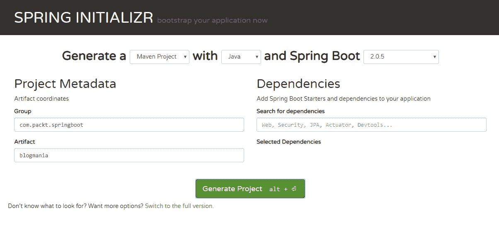
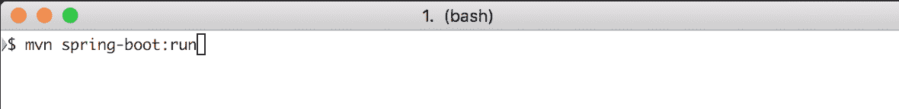
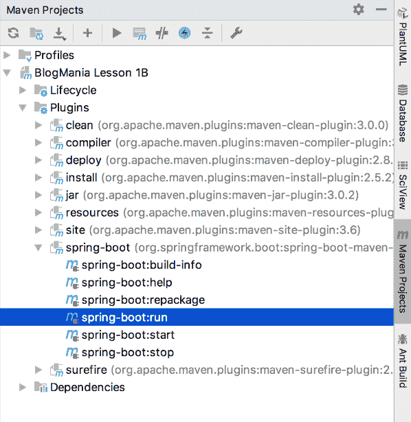
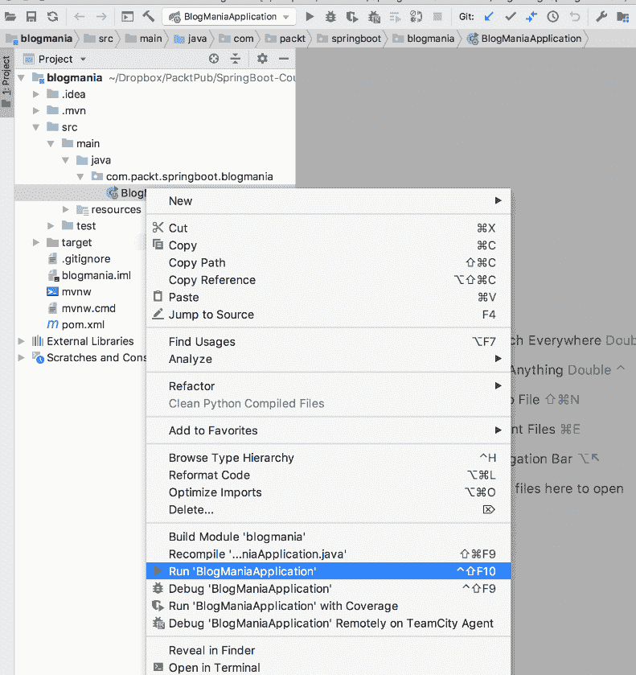
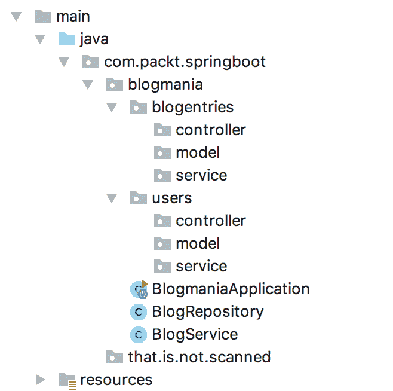
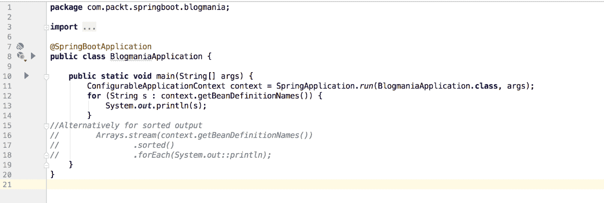
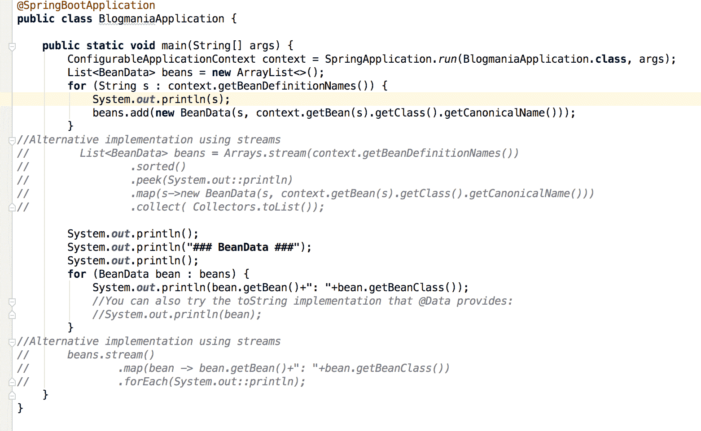

# 第一章：Spring 项目和框架

Spring 框架是一个成熟、企业级和开源的应用程序开发框架，它提供了一个灵活且现代的替代方案，用于官方的 Java EE 标准。

Spring Boot 是一种技术，它允许开发者基于 Spring 框架编写应用程序，同时通过提供约定优于配置和 Gradle 及 Maven 的依赖管理来依靠最佳实践，确保它们拥有所有库的兼容版本。这消除了在编写企业应用程序或服务时所需的大量任务。Spring Boot 还通过提供与其他框架的强大集成来解决重复和管道代码的问题。同时，当需要时，开发者可以偏离其精心设计的约定。

到本章结束时，你将能够：

+   描述 Spring 框架

+   构建并运行一个简单的项目

+   利用 Spring 的应用程序上下文

+   使用 Project Lombok 库

# Spring 框架简介

Spring 框架是一个开源的应用程序框架，可以被任何 Java 应用程序使用。它为 Java 平台提供了一个控制反转（IoC）容器。在本节中，我们将查看 Spring 项目的概述，并介绍 Spring 应用程序的基本构建块。你将了解 Spring 框架的历史、Spring 重点关注的关键原则、依赖注入和控制反转。最后，我们将探讨 Spring 生态系统。

# 简短的历史

**Spring 框架**是由 Rod Johnson 在 2003 年创建的，作为重型且缓慢的 J2EE 1.4 堆栈的替代品。该项目的当前负责人是 Pivotal Software，该公司雇佣了核心开发者并指导项目的开发。

框架本身是源代码，有大量的贡献者帮助开发各种模块。但我们会很快谈到这一点。

由于其专注于生产力，Spring 获得了大量的市场份额。Zeroturnaround 公司，一家创建 Java 开发工具的公司，在 2016 年进行了一项调查，其中 36% 的参与者希望将他们的项目转换为 Spring，而只有 14% 的人希望转换为 JEE。很难找到 JEE 与 Spring 的具体市场份额数据，但在 Java 开发者调查中，Spring 通常远超过 50%，而 JEE 则远低于这个比例。这一点也反映在职位列表中，Spring 多年来一直胜过 JEE。

Spring 被全球所有规模的公司使用。例如，Netflix 对他们使用 Spring 非常公开，他们甚至提供了 Spring Cloud 栈的大部分内容。

想要了解更多关于 Spring 框架版本的背景信息，你可以阅读[`github.com/spring-projects/spring-framework/wiki/Spring-Framework-Versions`](https://github.com/spring-projects/spring-framework/wiki/Spring-Framework-Versions)上的条目。

要了解 Spring 的使用情况，你还可以查看 [`stackshare.io/spring/in-stacks`](https://stackshare.io/spring/in-stacks)。

# Spring 核心原则

Spring 框架的开发基于几个原则，这些原则自其诞生以来一直是一致的：

+   **控制反转**和**依赖注入**构成了整个框架的核心。

+   **模块化**允许你插入不同的实现，例如日志框架模板引擎和内部代码，这为面向方面的编程创建了代理。

+   **可测试性**使整个项目成为可能，并旨在创建可测试的应用程序代码。

+   在许多方面为开发者提供了**便利**，使开发者无需过多干扰就能提高生产力。

# J2EE 痛点

在过去两年中，官方 J2EE 标准受到了开发者社区的很多批评。主要问题如下：

+   标准是由一个委员会制定的，这导致了许多难以使用的功能。

+   委员会缓慢地采用新技术，这导致许多项目在 J2EE 范围之外开发，以满足这些需求。

+   应用服务器非常昂贵，并且相对较慢地采用新标准。

+   在 J2EE 1.0 - 1.4 时代，需要编写的代码量非常高。

+   配置应用程序需要大量的 XML 文档。这要么导致错误，要么需要 IDE，以帮助保持一切同步。

+   由于“先规范”的方法，许多功能使用起来非常复杂，这导致了错误或让人们完全放弃某些功能。

# Spring 作为 J2EE 的替代品

Rod Johnson 想要改变 J2EE 强迫人们采取的编码方式，因此在许多方面故意采取了相反的做法：

+   与象牙塔方法相反，Spring 采用“先编码”的方式，这一方法后来也被 Java 社区和委员会所采纳。

+   Spring 非常模块化和可扩展，因此通常使用模块添加新技术，这些模块只是额外的 JAR 文件。

+   Spring 不想等待应用服务器添加功能，因此 Spring 应用包含了应用服务器或 servlet 容器未提供的一切。

+   与 J2EE 相比，Spring 总是具有更少的样板代码来实现相同的功能。这种优势现在不再那么相关，因为当前版本的 JavaEE 受 Spring 启发很大，并复制了许多其概念。

+   在最初，Spring 也使用 XML 进行其配置，因为那时被认为是最高水平。然而，当 Java 1.5 可用时，他们开始转向注解和基于 Java 的配置。

+   虽然获取一些 JavaEE 库的源代码仍然困难，但 Spring 总是提供了源 JAR 文件，并允许任何人在必要时查看精心设计的框架。

# 控制反转和依赖注入

**控制反转**（**IoC**）是一种定义应用程序在非常低级别上如何编写的范例。它基本上翻转了控制流，您的应用程序代码对由应用程序框架触发的事件做出反应。

这与**依赖倒置**（**DI**）模式重叠，它是依赖注入的更广泛版本。当您的应用程序使用依赖注入时，您不会自己创建重要类的实例；您让容器创建实例或提供现有的实例。特别是当使用接口时，您能够解耦应用程序的组件。这意味着您有部分之间没有直接依赖关系。

您的应用程序做出反应而不是严格控制一切的事实有助于解耦应用程序的各个部分。现在，您有依赖于框架而不是其其他部分的代码。这导致耦合度降低，因此代码更易于维护和测试。IoC 也被称为好莱坞原则，口号是“别叫我们，我们会叫你”，这完美地描述了它是什么。 

想要了解更多关于 Spring 框架的背景信息，您可以阅读"TheServerSide"网站上的文章，这是一个与 Java 和软件开发相关的大型网站，链接为[`www.theserverside.com/news/1321158/A-beginners-guide-to-Dependency-Injection`](http://www.theserverside.com/news/1321158/A-beginners-guide-to-Dependency-Injection)。

# 控制反转和依赖注入概述

请查看以下表格，它突出了主要概念：


想要了解更多关于上帝对象问题的背景信息，您可以阅读[`www.c-sharpcorner.com/article/godobject-a-code-smell/`](https://www.c-sharpcorner.com/article/godobject-a-code-smell/)上的条目。

# Spring 框架

典型 Spring 应用程序的构建块看起来像这样：

+   核心容器控制应用程序的生命周期，并包含应用程序上下文，其中包含由 Spring 管理的类的实例。

+   然后，有多个模块决定了您的应用程序中的控制流如何被触发。

+   例如：Spring MVC，它负责将请求分发到您通常编写的特殊类，这些类处理 HTTP 请求。

+   Spring 消息传递用于在系统之间处理和发送消息。

调度可以根据时间相关的事件执行方法。例如；您必须每天午夜执行清理任务。

+   Spring 集成能够通过文件传输查询或获取其他系统的数据以进行处理。

+   您的代码将从这些模块中被调用以实现其功能。

在您的代码执行期间或之后，您通常会准备需要存储在数据库中或返回给用户或调用者的数据。因此，Spring 应用程序的其他部分如下：

+   视图渲染器，它将准备好的数据渲染为 HTML 页面，例如。

+   **对象**（**非**）**序列化**是将传入或传出的数据转换为另一种形式的过程。这通常是转换为 XML 或 JSON，但也可能转换为其他格式。

+   根据你编写的应用程序类型，Spring 还提供了其他模块，以使软件开发更加容易。

# Spring 生态系统

Spring 的模块化在过去 15+年里导致了众多模块的创建。其中一些已经退役，但官方主页列出了 23 个主要项目，其中一些甚至有 5 到 10 个子项目。

这意味着，对于你想做的每一件事，有很大可能性存在一个 Spring 模块可以帮助你。因此，你可以专注于业务目标，而不是编写第 100 个消息传递框架或其他基础方面。当然，这也意味着很容易迷失在需要添加和配置的项目和依赖关系的海洋中。

这是在几年前人们谈论 Spring 时的一大担忧。它需要大量的配置，并且直到一切按预期工作，设置新项目需要很长时间。

# Spring Boot 特性

这就是 Spring Boot 冲进来拯救世界的时候。Spring Boot 是一个常规的 Spring 项目，旨在使开发体验更加愉快。这是通过大量依赖以下内容来实现的：

+   契约优于配置

+   自动检测功能

+   依赖管理以最小化寻找所有库兼容版本时的痛苦

重点在于提供生产就绪功能，而不进行任何代码生成。这使得你能够在几分钟内编写可以暴露给互联网的简单应用程序。

# 引导启动

在本节中，我们将通过使用名为**Spring Initializr**的 Spring 项目生成器来创建第一个 Spring Boot 项目。然后，我们将查看生成的代码并首次启动应用程序。

# Spring Initializr

Spring Initializr 项目始于 2013 年。如今，它支持 Java、Kotlin 或 Groovy 编写的 Maven 和 Gradle 项目。目前的目标平台是 JDK 7 至 9。生成器能够创建 Spring Boot 1.x 或 2.x 项目。

当你在 IDE 中使用 Spring Boot 项目的项目创建向导时，它很可能会使用`start.spring.io`，这是 Spring Initializr 的网站。IntelliJ 和 Eclipse 都内置了对生成器的支持。

# 创建第一个 Spring Initializr 项目

目标是使用 Spring Initializr 创建一个项目。在完成这部分内容后，你将生成一个简单的 Spring Boot 应用程序，可以作为进一步开发的起点。完成步骤如下：

1.  打开`start.spring.io`。

1.  创建一个简单的**Maven 项目**，使用**Java**和 Spring Boot **2.0.5**。

1.  输入以下详细信息：

+   +   组: `com.packt.springboot`

    +   艺术品: `blogmania`

看看下面的截图：



1.  下载并解压项目。

目前不要添加依赖项。但是，您可以点击页面底部的“切换到完整版本”链接以显示可用的依赖项数量。如果您喜欢，可以在完整版本中填写名称（**BlogMania**）和描述（**Self-hosted blogging made easy**）。

# 在 IDE 中检查项目

目标是按照顺序打开 IDE 并检查生成的项目的重要部分。通过本节，您将已导入并检查了新创建的 Spring Boot 应用程序。完成步骤如下：

1.  使用 IntelliJ IDE 打开项目。

+   1.  打开 IntelliJ。

    1.  使用菜单或启动屏幕以新项目的方式打开 `pom.xml`。

1.  在导入后，在左侧的项目面板中打开 `pom.xml`。查看文件中的以下片段：

+   1.  `<packaging>jar</packaging>`: 应用程序将被构建为 JAR 文件。Spring Boot 构建插件将创建剩余的资产以使其可执行。

    1.  `<parent> <groupId>org.springframework.boot</`

        `groupId> <artifactId>spring-boot-starter-parent</`

        `artifactId> … </parent>`: Spring Boot 应用程序通常将 spring-boot-starter-parent 配置为其父 POM，它为项目的构建过程提供了大量的预配置依赖项。

    1.  `<dependency> <groupId>org.springframework.boot</`

        `groupId> <artifactId>spring-boot-starter</artifactId></dependency>`: 唯一的真正依赖项是这个启动器，它将导入 Spring 框架和更多与 Spring Boot 相关的依赖项（总共 37 个，包括测试依赖项）。

+   1.  `<plugin> <groupId>org.springframework.boot</`

        `groupId> <artifactId>spring-boot-maven-plugin</`

        `artifactId> </plugin>`: 此构建插件负责创建可执行的 JAR 文件并将所有依赖项嵌入到这个单一文件中。

1.  打开 `src/main/java/BlogManiaApplication.java`。查看文件中的以下片段：

    1.  `@SpringBootApplication`: 这个注解将项目标记为 Spring Boot 应用程序，并告诉 Spring 这将是应用程序的主类。Spring Boot 会扫描类路径以查找 Beans 和其他感兴趣的类，默认情况下，它会扫描主应用程序类以下的每个包。

    1.  `public static void main(String[] args)`

        `{ SpringApplication.run(BlogManiaApplication.class, args); }`：这是当应用程序启动时 JVM 调用的主方法。`SpringApplication.run(...)` 初始化应用程序，并且一旦 Spring 上下文启动，方法调用就会终止。这意味着您可以在调用之后有代码。应用程序本身在 Spring 上下文关闭或由操作系统从外部终止时终止。访问 [`bit.ly/2x9gEUz`](https://bit.ly/2x9gEUz) 以获取 `BlogManiaApplication.java` 文件的代码。

# 使用不同选项运行项目

目标是检查运行项目的各种选项。通过本小节，您将在 IntelliJ 或使用 Maven 中启动新创建的 Spring Boot 应用程序。完成步骤如下：

运行应用程序有多种选择：

1.  在终端中：

    1.  转到项目目录。

    1.  执行以下命令：

```java
  mvnw spring-boot:run
```

看看下面的截图：



+   1.  执行以下命令：

1.  在支持 Maven 的 IDE 中：

    1.  转到 Maven 工具窗口。

    1.  打开 `BlogMania/Plugins/spring-boot`。

    1.  点击 `spring-boot:run`。

看看下面的截图：



1.  在使用标准 Java 功能的 IDE 中：

    1.  打开 `BlogManiaApplication.java`。

    1.  右键单击主方法并选择运行。

看看下面的截图：



1.  在 IntelliJ Ultimate 版本中，您还有一个 Spring **运行仪表板**，它提供了许多在 IDE 中启动和监控 Spring 应用程序的好功能。

    1.  这将启动应用程序，您将看到 Spring Boot 标签和一些在应用程序终止前的框架附加输出。

应用程序几乎立即终止，因为没有要执行的操作。"纯 Spring" 没有防止应用程序终止的主循环。例如，一旦添加了 Spring MVC 依赖项，应用程序将启动并等待请求，而不是立即停止。

访问 [`bit.ly/2x9gEUz`](https://bit.ly/2x9gEUz) 以获取 `BlogManiaApplication.java` 文件的代码。

# 应用程序上下文

在本节中，我们将探讨 Spring 的构建块，它们是如何被 Spring 发现的，以及如果需要，我们如何手动定义它们。

# Spring Bean

Spring Bean 本身只是一个简单的 Java 对象，但它是 Spring 应用程序中的核心构建块。其生命周期由 Spring IoC 容器管理。这意味着在其生命周期内，它由容器创建和控制。容器的主体接口称为 `BeanFactory`，它由 `ApplicationContext` 实现。

你可以通过将类声明为 Spring Bean 来使其成为 Spring Bean。这通常是通过向类中添加注解（如`@Component`）来完成的。Spring 将找到该类，创建实例，并根据你的配置进行配置。

# Spring Bean 类型

你可以使用许多注解来标记一个类为 Spring Bean。它们用于传达类的特殊含义。默认情况下，一些特殊类型可用，如`@Component`、`@Service`、`@Repository`和`@Controller`。

当你将这些注解放在一个类上时，它将被视为 Spring Bean，并在应用程序启动时创建一个实例。它的依赖关系将根据你的配置设置。

通常，你使用`@Service`或`@Component`注解在类上没有关系。这纯粹是装饰性的，有助于你更好地理解类应该做什么，因为它们之间存在语义差异。让我们回顾一下这些注解：

+   `@Controller`标记在 Web 应用程序上下文中的类，表示处理请求。这将在后面的章节中介绍。

+   `@Service`标记被认为是服务的类，这意味着它们通常为其他服务或控制器提供业务功能。

+   `@Repository`将一个类标记为一种数据提供者。例如，一个仓库通过从数据库、外部 Web 服务或类似的地方获取数据来提供数据访问。

+   `@Component`通常标记那些不适合其他类别的辅助类。

这些类型是多层架构的默认构建块。

# 探索 Spring Beans

目标是通过向其中添加一些 Beans 来增强你的第一个 Spring Boot 应用程序。通过本节，你已经看到了 Spring 上下文的作用，并看到了如何从主方法中访问 Spring 上下文。完成步骤如下：

1.  显示现有的 Beans。

1.  使用前面小节中导入的项目打开 IDE。

1.  打开`BlogmaniaApplication.java`文件。

1.  将`SpringApplication.run`的结果分配给一个名为 context 的变量。

1.  在下一行中，通过上下文对象的`getBeanDefinitionNames()`方法遍历所有定义的 Bean 名称，你可以访问这些 Bean 名称。

1.  通过执行主方法来运行应用程序。

前往[`bit.ly/2NaOkvJ`](https://bit.ly/2NaOkvJ)访问`BlogManiaApplication.java`文件的代码。

你可以看到默认创建的许多 Beans。其中之一是`blogmaniaApplication`。默认情况下，Beans 的命名与类名相同，以小写字母开头。

这就是它的样子：

```java
public static void main(String[] args) {
  ConfigurableApplicationContext context = SpringApplication.
run(BlogmaniaApplication.class, args);
  for (String s : context.getBeanDefinitionNames()) {
     System.out.println(s);
  }
}
```

1.  向上下文中添加新的 Beans。

1.  在与`BlogmaniaApplication.java`相同的包中创建一个名为`BlogService`的公共类。

1.  在与`BlogmaniaApplication.java`相同的包中创建一个名为`BlogRepository`的公共类。

1.  在`BlogRepository.java`的`public class …`之前添加`@Repository`。

1.  再次运行应用程序。

你会注意到有一个名为 `blogRepository` 的新 Bean，但没有名为 `blogService` 的 Bean，因为我们还没有将类标记为 Spring Bean。

# 配置类

声明 Spring Bean 的另一种方式是通过**配置类**。这些用于更复杂的 Bean，需要运行代码来初始化 Bean。例如，从某处读取配置或进行复杂的设置以满足依赖项。这也用于从不在你控制之下的类创建 Bean，因此你不能向它们添加注解。

你可以通过在配置类中有一个被 `@Bean` 注解的公共方法并返回你的类的一个实例来创建一个 Bean。

默认情况下，Bean 的名称将与方法的名称相同，而注解的类将默认生成一个以类名开头字母小写的 Bean 名称：

```java
@Configuration
class MyConfiguration{

   @Bean
   public Instant date(){
       return Instant.now();
   }
}
```

Spring 将确保无论你调用配置类中 `@Bean` 注解的方法多少次，它都会返回正确的 Bean 实例（在幕后，结果只计算一次）。

你也可以在任何 Java 类中使用 `@Bean` 定义一些内容，并将其放入上下文中。请注意，这些是“轻量级 Bean”，许多机制在这些 Bean 上可能不会工作。

# 类路径扫描

当人们说 Spring 做了魔法，他们通常指的是这个机制。默认情况下，Spring Boot 根据应用程序类所在的包来扫描类路径，或者更确切地说，是带有 `@SpringBootApplication` 注解的类。

例如，它会搜索已知的 stereotypes（注解）如 component、service 或 repository，或者搜索 factory 方法如 `@Bean` 方法。搜索覆盖了类路径，因此也会扫描添加到项目中的依赖项！

在这个例子中，`BlogmaniaApplication` 位于 `com.packt.springboot.blogmania` 包的文件夹中，因此会扫描该包及其所有子包。`com.packt.springboot.that` 及其以下的所有内容都不会被扫描。如果需要，你可以通过添加带有正确参数的 `@ComponentScan` 来修改默认行为，但大多数情况下，这通常是不必要的。

看看下面的截图：



如果你愿意，你可以创建一个配置类来定义一个 Bean，并对其进行操作。我们将在*第二章：构建 Spring 应用程序*中提供更多关于配置类的实际内容。

# 额外工具 – Lombok 项目

在本节中，你将认识到一些 Java 中的样板代码，并定义**Lombok 项目**如何帮助你。这是一个 Java 库，通过自动集成到你的编辑器中，以构建工具来改进你的 Java。

样板代码是为了实现目标而必须编写的代码。这种代码几乎总是相同，或者非常相似，以至于你希望不必编写它，因为它很明显。

# Java Bean

一个 Java Bean 必须遵循一定的模式才能被识别为 Java Bean。例如，所有属性都应该有 **Getters** 和 **Setters**（返回私有成员变量的值），尽管您可能省略 Setter，例如，当属性为只读时。这意味着对于只有 10 个字段的 data 类，您还必须编写 20 个方法，这些方法遵循正确的命名约定，仅存储或传递属性值。这是一个典型的样板代码示例。

# Java 类

我们已经看到 Java Beans 在其结构周围有一些仪式，但普通 Java 类也是如此。例如，equals()、`hashCode()` 和 `compareTo(...)` 方法需要遵循一组规则。

当一个类覆盖其中之一时，它需要确保其他两个在 Java 对象契约方面按预期工作。

当实例 A 和实例 B 相等时，它们的 `hashCode` 需要相同。当您违反此契约时，在使用 Sets、`HashMaps` 等时，在运行时会出现奇怪的错误。另外，有一个真正打印出您类内容的 `toString()` 方法，在调试和日志记录中非常有帮助。

# 示例类

一个示例类看起来像这样：

```java
public class BlogEntry {
   private int id;
   private String title;
   private List<String> tags = new ArrayList<>();
   private String text;
   private boolean visible = true;

   //[...]@Override

   public void setVisible(boolean visible) {
       this.visible = visible;
   }
}
```

您可以看到，对于五个简单的数据字段，这需要很多代码。整个类定义大约有 44 行代码。如果您喜欢，您可以在 IDE 中生成很多这样的代码，但最好根本不使用这些代码！

前往 [`bit.ly/2QrH8cT`](https://bit.ly/2QrH8cT) 访问示例类文件的完整代码。

# Project Lombok 来拯救

有一个名为 **Project Lombok** 的库，它根据注解生成代码。这使得开发 Java 软件变得更加容易。

Project Lombok 通过以下方式提供帮助：

+   Getters/Setters

+   `equals()`/`hashCode()`

+   构造器

+   静态日志记录器

+   构造器类

要将 Lombok 添加到您的项目中，您需要添加以下依赖项（版本由 Spring Boot 管理）：

```java
<dependency>
  <groupId>org.projectlombok</groupId>
  <artifactId>lombok</artifactId>
</dependency>
```

如果您将 Project Lombok 添加到您的项目中，您可能需要在您的 IDE 中启用称为 **注解处理** 的功能，并安装 Lombok 插件。这在插件目录中可用。

# Project Lombok 增强类

这里有一些具有相同功能的代码：

```java
@Data
public class BlogEntry {
   private int id;
   private String title;
   private List<String> tags = new ArrayList<>();
   private String text;
   private boolean visible = true;
}
```

`@Data` 注解组合了以下注解：

```java
@ToString:
```

生成一个打印所有字段的 `toString()` 方法

```java
@EqualsAndHashCode:
```

根据所有字段生成 `equals()` 和 `hashCode()`

```java
@Getter:
```

为所有字段生成 Getter 方法

```java
@Setter:
```

为所有非 final 或非 transient 字段生成 Setter 方法

```java
@RequiredArgsConstructor:
```

生成所有字段作为构造器的构造器，这些字段需要值（未初始化的 final 字段、非 null 字段等）

# 活动：Project Lombok 在行动

**目标**

要创建一个使用 Lombok 的类。您将把类命令和 Bean 的名称存储在您自己的数据结构中。

**场景**

您应该使用 Beans 项目重用 Blogmania 应用程序，并在 IDE 中打开它。

**完成步骤**

1.  在包含`Application`类的包中创建一个`BeanData`类，包含所需的私有 String 字段和注解。

看一下下面的截图：



1.  用每个 Bean 对应的相应数据填充数据结构和列表。

你可以使用`getBean`方法通过 Bean 名称从上下文中获取 Bean，例如。

1.  打印`BeanData`列表内容以获得所需的结果。

根据结果，你现在已经创建了一个只包含字段以及两个类级别注解的类，并且使用了由它生成的构造函数和获取器。现在，你再也不需要自己生成无聊的获取器、设置器等等了。

看一下下面的输出截图：



要了解详细步骤，请参阅本书末尾第 249 页的*解决方案*部分。

# 摘要

在本章中，你了解了 Spring 项目的历史以及为什么它被创建。你现在知道如何使用`start.spring.io`创建 Spring Boot 项目，以及如何启动它。还介绍了基本构建块和应用程序上下文。最后但同样重要的是，你看到了 Lombok 如何通过让你摆脱重复创建或编写相同代码来使你的生活变得更加轻松。

在下一章中，你将最终看到 Spring Beans 如何交互以及如何配置应用程序。
