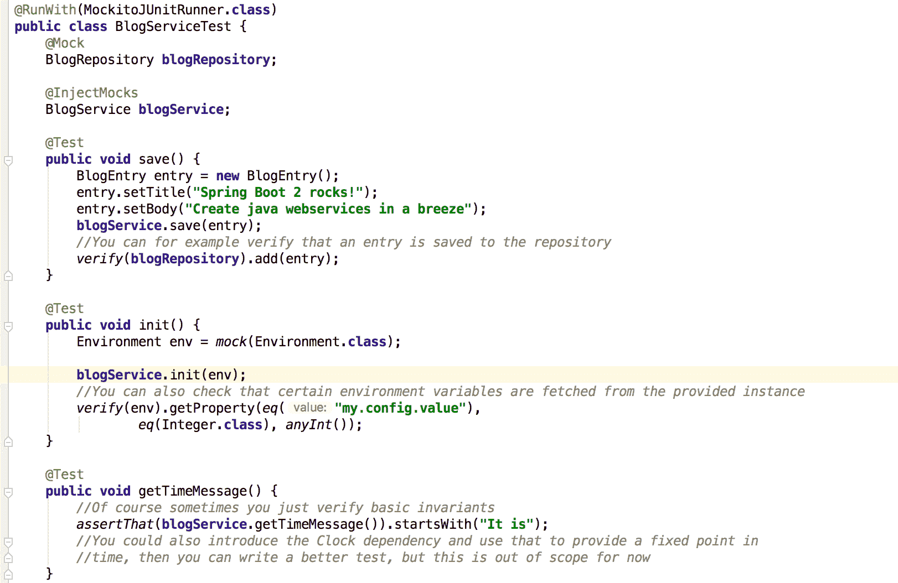

# 第三章：测试 Spring 应用程序

在本章中，我们将学习测试 Spring 应用程序的不同方法。本节将重点介绍单元测试以及它们与其他测试类型的不同之处。在研究了一些理论知识后，你可以继续阅读实践部分，在那里你应该开始独立编写简单的单元测试。

到本章结束时，你将能够：

+   为 Spring 应用程序创建单元测试

+   创建内部启动应用程序部分的集成测试

+   利用丰富的 Spring 工具集进行测试

+   分析不同的测试类型

# 应用单元测试

在前面的章节中，你看到了如何创建 Spring 应用程序以及如何在应用程序内部添加组件之间的依赖关系。

在本节中，你将了解如何将应用程序的类作为常规类或使用一些 Spring 支持的依赖项连接方式来测试。自己编写这些测试非常重要，这样你才能知道你所编写的代码是否有效。UI 测试有时由专门的 QA 部门编写。

通过使用这些虚假依赖，你可以模拟其他类的行为或验证依赖是否以正确的方式被调用。有关更多信息，特别是关于虚假依赖和模拟的内容，你可以查看马丁·福勒的文章，链接为[`martinfowler.com/articles/mocksArentStubs.html#TheDifferenceBetweenMocksAndStubs`](https://martinfowler.com/articles/mocksArentStubs.html#TheDifferenceBetweenMocksAndStubs)。

# 单元测试

在软件开发中，你可以编写多个测试层。单元测试是最基本的测试，它测试软件的小部分，通常运行非常快。它们对于验证你所编写的功能在基本层面上是否有效非常重要。

例如，考虑一个用于某些账簿应用程序中添加两个数字的方法。你想要确保这个方法能够处理各种错误和输入。这可以通过使用单元测试轻松完成。实际上没有设置，它们可以在短时间内测试很多内容。你甚至可以测试非常详细的事情，比如当你添加两个非常大的数字时整数溢出。

测试金字塔，突出了大多数测试应由单元测试组成：


# 测试类型 – 并列

测试术语没有固定的定义，但除了单元测试之外，还有两种常见的测试类型：集成测试和 UI 测试。根据项目不同，在这三种类型之间还有其他测试类型：

看一下以下表格，它突出了主要概念：


在编写测试时，请确保它们是可靠的。尽量避开随机数、基于时间的断言等。在可能或必要时，尽量提供一组固定的数字或您自己的“时钟”，以便您可以可靠地测试您的代码。没有什么比由于边缘情况（例如，日期变化或不可预见的随机数）而偶尔失败的测试更糟糕了。有一些输入生成器可以提供符合提供的一组要求的随机数据，但总的来说，我建议坚持使用可重复的、众所周知的（并且经过深思熟虑的）输入。

# 使用 Plain JUnits 编写单元测试

Spring Initializr 已经添加了测试依赖项，并为您创建了一个空白的测试类。我们将通过基于*Spring Boot 应用程序配置*的代码测试`BlogRepository`来向您展示如何编写单元测试。编写测试的最基本方式是仅使用 JUnit 并测试类本身。

要设置一系列博客条目，我们必须向`BlogRepository`类添加一个 setter，或者我们可以创建一个可以在测试中使用的构造函数。或者，我们可以简单地通过向`BlogRepository`添加`@AllArgsConstructor`注解来实现构造函数注入。当然，这个类非常简单，通常您不会使用内存中的列表作为数据源，所以这个例子有点人为地制造，以展示单元测试：

```java
public class BlogRepositoryJUnitTest {
   @Test
   public void testAdd(){
       ArrayList<BlogEntry> db = new ArrayList<>();
       BlogRepository repository = new BlogRepository(db);

       BlogEntry entry = new BlogEntry();
       repository.add(entry);

       assertThat(db).contains(entry);
   }
}
```

此测试创建了一个由我们控制的`ArrayList`实例的`BlogRepository`。然后，我们可以添加`BlogEntry`并验证它已被存储。我们正在使用来自`AssertJ`的`assertThat()`，这是一个非常棒的断言框架，它已经被 Spring 作为依赖项添加。

# 使用 Mockito 支持编写单元测试

默认情况下，Mockito，一个模拟框架，也包含在依赖项中，并且它还有一个很好的 Spring 集成。

您只需使用`@RunWith`注解添加运行器，然后可以将您想要测试的类定义为字段，并用`@InjectMocks`注解标记它。所有您想要使用的依赖项都可以通过`@Mock`注解添加。它们将在每个测试中重新创建，并包含类的模拟版本。在您的测试中，您可以使用`Mockito.when(...)`定义调用行为。您还可以验证例如，某些调用是否已使用给定的参数进行。这是通过使用`Mockito.verify(...)`方法完成的。注入的工作方式与 Spring 相同，因此当 Spring 能够自动装配依赖项时，Mockito 很可能也能做到：

```java
@RunWith(MockitoJUnitRunner.class)
public class BlogRepositorySpringTest {
   @Mock
   List<BlogEntry> db;
   @InjectMocks
   BlogRepository repository;

   @Test
   public void testAdd(){
       BlogEntry entry = new BlogEntry();
       repository.add(entry);
       Mockito.verify(db).add(eq(entry));
   }
}
```

有关 Mockito 的详细信息，请访问其网站[`site.mockito.org/`](http://site.mockito.org/)。

# 创建单元测试

目标是为类创建小的单元测试。现在你将为你自己的 `BlogService` 类编写单元测试。编写测试对于确保你的代码不仅现在能工作，而且在项目发展时也能继续工作非常重要。因此，在专业软件开发中，编写单元测试和其他测试类型非常重要。完成步骤如下：

1.  打开 IDE 和 `BlogMania` 应用程序进行本节。

看看这个截图：


1.  打开 `BlogService` 类，将光标放在类名上，然后按 Shift-CTRL-T，这将打开一个菜单以创建测试类。

1.  选择 JUnit 作为 `test-library`，在底部的框中选择保存方法，然后按 OK。IntelliJ 将创建并打开文件。

1.  为服务和其依赖项添加 Mockito 注解和字段。

1.  为 `BlogService` 的公共方法创建一个简单的测试。例如，检查条目是否已存储，某些方法是否在依赖项上被调用，或者输出是否以给定的字符串开头。

所有数据都存在，并且已经在 `BlogRepository` 上调用了 `add` 方法。博客的标题缺失，你期望抛出 `IllegalArgumentException`。你可以在测试方法中添加 try-catch 块，或者检查 `@Test` 注解，因为它有相应的属性。

前往 [`bit.ly/2p4Wc3C`](https://bit.ly/2p4Wc3C) 访问 `BlogServiceTest.java` 文件的代码。

前往 [`bit.ly/2NDu8SQ`](https://bit.ly/2NDu8SQ) 访问 `BlogmaniaApplicationTests.java` 文件的代码。

1.  添加另一个测试，检查在保存条目之前未设置日期时，是否已添加日期。

现在，你已经为 Spring 类创建了第一个简单的单元测试。

看看你的结果截图：


# 集成测试

在上一节中，你看到了如何使用单元测试测试 Spring 应用程序。

虽然这是测试应用程序的一种非常重要的方式，但应该用更多应用程序的基础设施和可能存在的周围服务来测试一些事情。你可能想测试你发送到数据库的 SQL 是否工作，或者当所有 Spring 的机制都就绪并激活时，你的 REST API 是否生成正确的 JSON 格式。

在本节中，你将创建不同类型的集成测试，并初步了解 Spring 的测试支持。

JUnit 有一个测试运行器的概念，它处理这个特定类中测试的执行方式。Mockito 使用它来在测试执行之前创建模拟实例。

要为 Spring 集成测试编写测试，你只需要将 `SpringRunner` 添加为 JUnit 测试运行器，并将 `@SpringBootTest` 注解添加到测试类中。这使 Spring 能够在测试中启动应用程序，并使其对你可用。

# `@SpringBootTest` 注解

看看这个示例代码：

```java
@RunWith(SpringRunner.class)
@SpringBootTest
public class BlogmaniaApplicationTests {
@Test
public void contextLoads() {
}
}
```

这个测试启动并仅用于检查你是否在配置 Spring 时犯了错误。原因是这只有在 Spring 上下文无法启动时才会失败，例如，由于缺少类或 Bean 定义。

集成测试通常比单元测试慢得多。尽量减少集成测试的数量。不要试图使用 ITs 测试每个方面。负测试应作为单元测试进行。尽量编写主要是“快乐路径”测试，以验证基本功能。当所有测试运行时间过长时，它们在开发过程中的反馈机制价值就会降低。

# 测试 Bean

当我们重新访问 `BlogRepositoryTest` 并将其重新创建为一个集成测试时，它看起来如下所示：

```java
@RunWith(SpringRunner.class)
@SpringBootTest
public class BlogRepositorySpringIntegrationTest {
   @Autowired
   List<BlogEntry> db;
   @Autowired
   BlogRepository repository;
   @Test
   public void testAdd() {
       BlogEntry entry = new BlogEntry();
       repository.add(entry);
       assertThat(db).contains(entry);
  }
}
```

如你所见，我们现在必须在 `db-bean` 中验证测试的结果，因为这样我们就无法验证 `BlogRepository` 上的调用。

这意味着我们必须手动检查调用是否产生了预期的效果。

然而，优势在于 Spring 提供的所有机制都到位了。因此，当有代理在 Bean 附近或 Bean 有特殊作用域时，例如，你可以使用这些测试来测试它。你也可以使用这些类型的测试来测试你的 Web 应用程序，但由于时间限制，这将在本书中不涉及。

Mockito 已经被 Spring 添加，这是有原因的。我们可以在测试中简单地模拟 Bean，并验证它们的调用或配置 Bean 调用的效果：

```java
@RunWith(SpringRunner.class)
@SpringBootTest
public class BlogRepositorySpringIntegrationMockTest {
   @MockBean
   List<BlogEntry> db;
   @Autowired
   BlogRepository repository;
   @Test
   public void testAdd() {
       BlogEntry entry = new BlogEntry();
       repository.add(entry);
       Mockito.verify(db).add(eq(entry));
   }
}
```

通过使用 `@MockBean` 标记列表，我们利用了 Spring 的 Mockito 支持。我们现在得到了完整的 Spring 上下文，但这个 Bean 已经被替换为模拟版本。我们可以根据测试需要对其进行配置。这是一个非常方便的功能，使我们能够轻松编写测试，否则这将非常复杂。

还有其他一些注解，如 `@SpyBean`，它将代理包装在原始 Bean 上，以便你可以验证是否执行了某些调用，同时保持旧功能完整。

# 配置测试上下文

当你只使用 `@SpringBootTest` 注解时，你会得到完整的 Spring 上下文。这并不总是你测试所需要的。在这种情况下，你可以为你的测试配置不同的 Spring：

```java
@RunWith(SpringRunner.class)
@SpringBootTest(
       properties = {"my.property=test","spring.application.
name=systemUnderTest"},
       classes = {BlogRepositorySpringIntegrationCfgTest.
TestConfigClass.class})
// […]
       public List<BlogEntry> db(){
           return new LinkedList<>();
       }
   }
}
```

前往 [`bit.ly/2NGKolQ`](https://bit.ly/2NGKolQ) 访问 *配置测试上下文代码示例* 的完整代码。

在这个例子中，我们正在为 Spring 上下文配置两个属性，并且阻止整个上下文启动。我们将 `TestConfigClass` 提供给 `@SpringBootTest` 注解，该注解将用于启动应用程序上下文。在这种情况下，我们只从服务包加载 Bean，并提供了我们自己的 `db-bean`，在这种情况下使用了一个 `LinkedList`。如果 `ComponentScan` 也添加了一个 `db-bean`，那么我们的本地 Bean 将覆盖扫描中的 Bean。正如你所看到的，这为你提供了很多修改和监控应用程序代码在测试时行为的方法。

# 活动：编写集成测试

**目标**

为了编写应用程序的集成测试。

**场景**

你应该重用本章中使用的项目，并在 IDE 中打开它。

**完成步骤**

1.  在自己的基础上创建一个新的集成测试类。

查看这个截图：



1.  为服务的方法创建各种测试。

1.  创建一个愉快的路径测试。

1.  为有趣的参数组合创建测试。

1.  修复服务代码。

对于那些高级用户：

创建以下类型的测试，查看它们，并分析它们的优缺点（省略你在 *步骤 2* 中创建的类型）：

+   没有使用 Mockito 的单元测试

+   使用 Mockito 的单元测试

+   没有模拟的集成测试

+   使用 `MockBeans` 的集成测试

+   使用 `SpyBeans` 的集成测试

前往 [`bit.ly/2MqhUZ4`](https://bit.ly/2MqhUZ4) 访问 `BlogService` 测试文件的代码。要参考详细的步骤，请查看本书末尾第 251 页的 *解决方案* 部分。

**结果**

通过访问 [`bit.ly/2MqhUZ4`](https://bit.ly/2MqhUZ4) 并转到源代码的 `com/packt/springboot/blogmania/blogentries/service/activity` 包，可以得到生成的代码。查看这个截图：


# 摘要

在本章中，你看到了如何测试 Spring 应用程序。你体验了单元测试的简单性和速度以及集成测试的表达力和强大功能。

在下一章中，我们将开始探讨 Web 应用程序开发，这样你就可以创建真正重要的应用程序。
