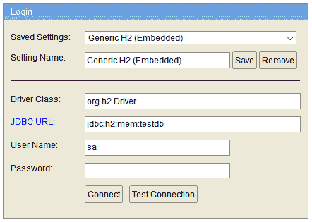
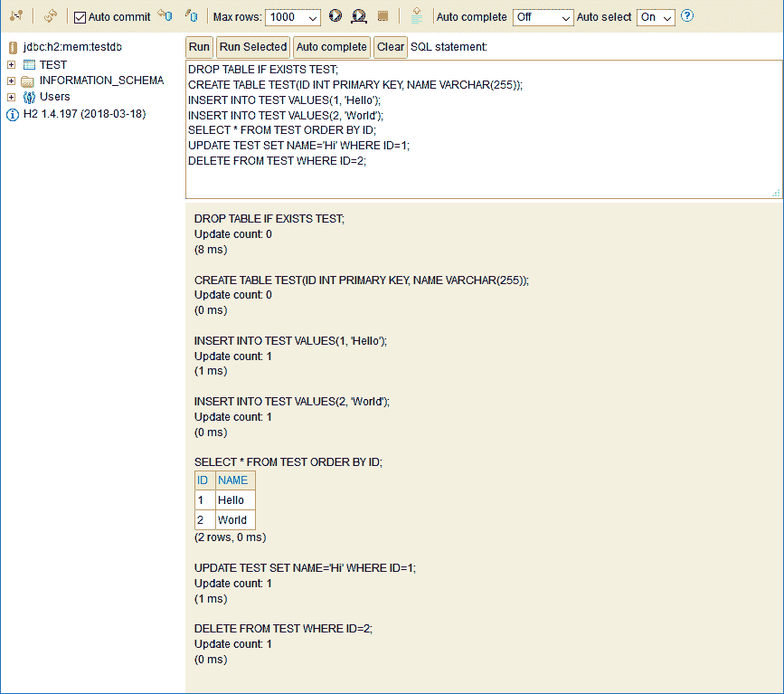
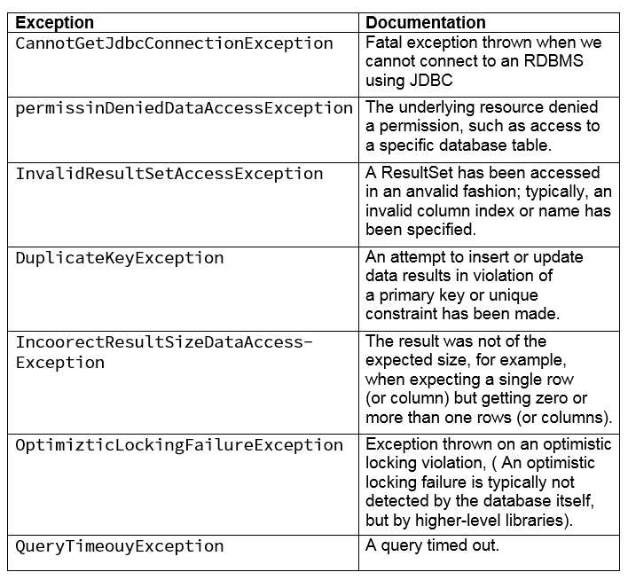
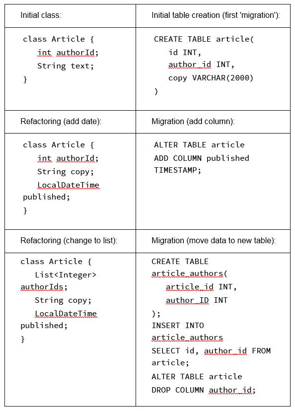
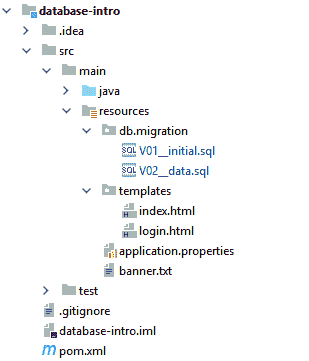
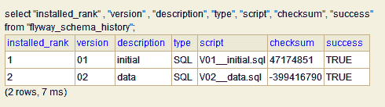
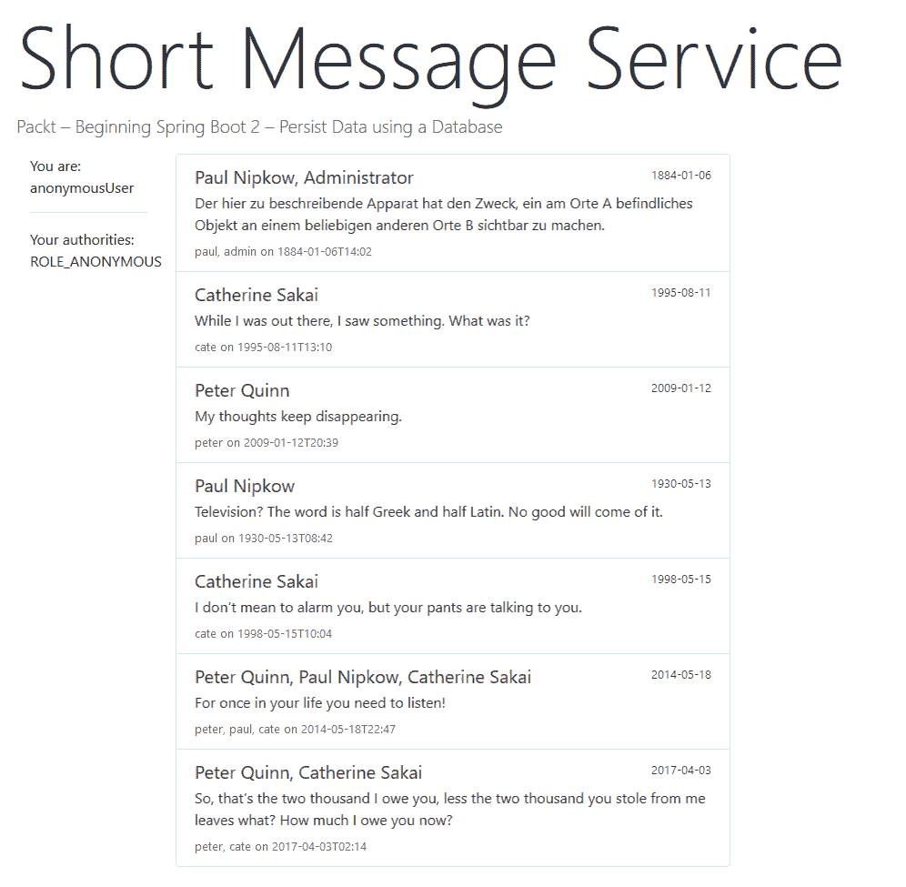

# 第九章：使用数据库持久化数据

在本章中，我们将探讨选择数据库管理系统。系统的选择取决于各种因素，例如可视化与报告、安全性、可扩展性和成本，仅举几例。还有各种类型的数据库，其中之一就是关系型数据库。这种数据库的设计方式使其能够识别存储信息中的关系。在大多数情况下，SQL 用于查询和维护关系型数据库系统。此外，我们还将学习如何在数据库中开发与你的应用程序相关的数据，并使用 Spring 实现数据访问。

到本章结束时，你将能够：

+   选择数据库管理系统

+   在数据库中开发与你的应用程序相关的数据

+   在 Spring 的帮助下实现数据访问

# 关系型数据库和 SQL

本书最后一章关于持久化，换句话说，就是使用数据库。

有些软件不需要存储任何状态。有些软件只是为了执行特定任务而启动；执行任务并返回结果；有些则位于其他组件之间，来回传递消息。然而，许多软件系统需要存储一些状态；它们被称为**持久化**状态。数据存储有不同的形式，但我们将关注在商业应用中最普遍的形式。

可能会有许多不同的答案。硬盘上的保存游戏文件一开始可能听起来不像是持久化，但它是一个非常有效的答案。重要的是要理解，大多数软件都需要一定量的存储，并且存储的形式差异很大。

# 关系型数据库管理系统（RDBMS）

**关系型数据库管理系统**（**RDBMS**），简称**RDBMS**，是能够存储关系型数据库中的数据的系统。严格来说，**数据库**仅指由系统管理的那些数据。在日常生活中，我们通常不区分这一点，而将这个**管理系统**称为**关系型数据库**，甚至只是数据库。

在不深入数据库理论的情况下，这里的“关系型”指的是 1970 年由爱德华·F·科德提出的关系代数。简而言之，这意味着我们以表格的形式存储数据，预先定义表格的列集（包括名称和类型），每个实体占据表格中的一行。这类数据库几乎总是使用查询语言 SQL 进行描述和查询；因此，它们有时被称为**SQL 数据库**。

关系代数的坚实基础语义是 RDBMS 中存储数据和查询此类数据的基础。数据库理论的奠基性工作可以在爱德华·F·科德 1970 年的作品《*大型共享数据银行的数据关系模型*》，《ACM 通讯》，第 13 卷（6）：377–387 中找到（[`doi.org/10.1145%2F362384.362685`](https://doi.org/10.1145%2F362384.362685))。

关于这个话题，有针对不同专业水平的许多优秀文章，可以在维基百科或大学网站上找到。即使你已经熟悉 SQL 数据库，阅读这些文章也是值得的。

关系型数据库是行业标准，拥有如 PostgreSQL 和 MySQL 等流行的开源软件，以及如 Oracle 和 MS SQL Server 等昂贵的企业级解决方案。它们是许多挑战的最佳解决方案，对于大多数其他情况来说，仍然是一个非常不错的解决方案，这也使得它们变得普遍。然而，对于许多特殊情况，它们被认为过于不灵活或过于缓慢。这导致了大量替代解决方案的出现，这些解决方案通常统称为**NoSQL**，以区别于更标准的 SQL 数据库。虽然速度或灵活性的提升伴随着一些成本，但它们并不是一个通用的替代品。尽管 Spring 对这些中的某些提供了支持，但本书的范围并不包括这些内容。

相反，我们将专注于 SQL 数据库，以及 Spring 在这些方面的出色支持。我们将看到如何连接到 RDBMS（甚至如何集成一个），如何随着我们的代码一起演进数据库，以及如何访问数据。特别是最后一个方面，我们将很快看到它是如何被简化的。但首先，我们需要一个 RDBMS 来连接。

# H2 嵌入式数据库

许多数据库系统都是重量级的，可以存储数 TB 的数据（或者对于某些系统来说，这就是它们占用的内存，它们可以存储 PB 级别的数据），它们内置了故障转移和备份策略，以及一个复杂的安全概念。有时，所有这些功能都过于复杂。

**H2**数据库特别之处在于它体积小，是用 Java 编写的，可以嵌入到你的程序中，并且可以将所有数据存储在内存中。是的，没错——它将全部在一个地方，并且会直接工作。如果需要，H2 可以用于生产系统，因为它速度快，支持大多数 SQL 功能。然而，通常它只会在开发期间使用。

让我们直接进入并在我们的项目中使用它！

# 利用 H2 控制台

这里的目的是嵌入内存中的 H2 数据库。你想要给你的应用程序添加持久性。由于你正在开发新应用程序，你需要一个游乐场，因此你决定不访问公司的企业数据库，而是从内存中的解决方案开始，当需要时可以替换为外部数据库。

在开始之前，从[`bit.ly/2qIrUEE`](https://bit.ly/2qIrUEE)提供的文件夹中找到 blogmania 应用程序。完成步骤如下：

1.  在 POM 中，在`<dependencies>`元素的一个方便位置，添加以下依赖项：

```java
<!-- Database access -->
<dependency>
   <groupId>org.springframework.boot</groupId>
   <artifactId>spring-boot-starter-jdbc</artifactId>
</dependency>
<dependency>
<groupId>com.h2database</groupId>
<artifactId>h2</artifactId>
<scope>runtime</scope>
</dependency>
```

在启动时，Spring Boot 会自动发现数据库，并使用注入的 DataSource beans 让你能够访问一个预配置的数据库实例。现在你需要的一切都在那里了！

然而，目前还没有太多可以看的东西。让我们转向另一个在开发过程中非常有用的功能：H2 控制台。这随 H2 数据库一起提供，并在 Spring Boot Devtools 可用时（在我们的应用程序中它们是可用的）启用。访问 [`bit.ly/2QpSiP0`](https://bit.ly/2QpSiP0) 以获取 `BlogmaniaApplication.java` 文件的完整代码。

1.  现在开始应用程序。将您的浏览器指向 `http://localhost:8080/h2-console`，然后——哇！——您现在看到的是 H2 控制台登录屏幕：



+   这个控制台可以用来访问任何 SQL 数据库。字段已预先填充了正确的值，以便进入嵌入的内存测试数据库，所以只需点击连接按钮。

+   下一个屏幕一开始可能会让人感到有些不知所措。为了帮助您开始，请在屏幕中间找到“示例 SQL 脚本”部分；当您点击它时，脚本将被复制到顶部的 SQL 语句窗口中。按下运行按钮以实际运行脚本：



+   您现在已创建了一个表，向其中添加了一些数据，并对其进行了更新！新表 TEST 将现在出现在左侧的树中。您可能想探索控制台，以便熟悉它。

正如您所见证的，现在有一个数据库可用于调试和查看。然而，对这个的深入了解超出了本书的范围。

不幸的是，控制台与 Spring Security 不兼容。因此，如果我们启用了它，我们就必须稍微放松一下访问权限。在安全配置中，您必须在 `WebSecurity` 方法中执行一个更改，以将 H2 控制台从安全循环中移除。该方法应如下所示：

```java
@Override
public void configure(WebSecurity web) {
   web
        .ignoring()
        .requestMatchers(PathRequest.toH2Console());
}
```

在进入生产之前，撤销这些更改是个好主意。

# SQL 的要点

SQL 是一种数据库语言，用于定义、创建、读取、更新和删除数据。这个缩写没有官方含义。然而，它通常被认为是 **结构化查询语言（Structured Query Language**）的缩写，有时发音为“sequel”，但这实际上是其前身的一个遗迹。

SQL 在表中处理数据。这些表有定义的列数，每列都有特定的类型。数据库系统是强类型的，甚至可以检查表中的值约束。SQL 中被称为 **数据定义语言（DDL**）的一部分负责声明和创建这些表。

语言的一部分，**数据操纵语言（DML**），负责处理数据。这两种子语言在逻辑上是分开的；它们在语法上有很多相似之处。

# DDL 表创建

我们在上一个练习中已经看到了该语言的实际应用。让我们更仔细地看看：

```java
CREATE TABLE test(id INT PRIMARY KEY, name VARCHAR(255));
```

这段 DDL 定义了一个名为 test 的表，包含两列：一列名为`id`，另一列名为`name`。`id`列的类型为 INT，可以存储整数值。另一方面，`name`列可以存储可变数量的字符串，最大长度为 255。

通常，我们会将所有 SQL 关键字写成大写。然而，这只是一个约定，SQL 对大小写不敏感。

虽然存在一些争议，但使用小写字母作为标识符的约定仍然很普遍。SQL 在这里也不区分大小写。

`id`列的目的是存储行的标识符。这也在数据库中被称为`key`。标识符应在表中是唯一的，添加 PRIMARY KEY 关键字将使数据库强制执行此约束。

大多数数据库可以强制使用指定的大小写来使用标识符。这可能会带来麻烦。

SQL 有很多标准化，但不幸的是，每个数据库都有自己的怪癖或扩展。例如，在 Oracle 中，用于存储字符字符串的正常类型称为 VARCHAR2，它不能存储空字符串，因为空字符串被处理得与特殊的 NULL 值相同。

# DML 数据操纵

相比之下，接下来的几行是 DML（数据操纵语言）并操作数据：

```java
INSERT INTO test VALUES(1, 'Hello');
INSERT INTO test VALUES(2, 'World');
SELECT * FROM test ORDER BY id;
UPDATE test SET name = 'Hi' WHERE id = 1;
DELETE FROM test WHERE id = 2;
```

这些行相当直观。请注意，SELECT 语句也可以有 WHERE 子句。这段简短的 SQL 足以让我们完成本章的剩余部分。

# 使用 JDBC 和 JdbcTemplate 从 Java 访问数据库

在我们实际访问数据之前，拥有一些可以操作的数据是很有用的。通常，数据是持久的，但在我们当前的设置中，每次应用程序启动时 H2 都会为空。在这种情况下，Spring Boot 提供在应用程序启动时执行某些 SQL 脚本的功能。

# 导入初始数据

第一份脚本称为`schema.sql`，包含用于我们应用程序中的 SQL 语句（DDL，数据定义语言），用于创建表（通常是 CREATE TABLE 语句）。第二份是`data.sql`，包含用于创建一些数据的 SQL 语句（DML，数据操纵语言）（通常是 INSERT 语句）。作为资源文件，它们位于`src/main/resources`文件夹中。本章的示例文件可以在[`bit.ly/2Dzb03G`](https://bit.ly/2Dzb03G)找到。

# 简单的 JDBC

JDBC 是使用 Java 访问关系数据库的标准接口。其缩写意为 Java Database Connectivity。该标准提供了一致的 API 来访问不同供应商的 RDBMS。包含实际低级实现的数据库驱动程序由供应商提供，而接口和常用类是 Java 运行时环境的一部分。

# 简单的 JDBC 示例

API 中大部分内容都很容易理解，并且有很好的文档。然而，使用起来相当繁琐。用户需要仔细查看数据库资源，如连接，如果未能正确关闭这些资源，可能会耗尽数据库配置的连接限制。所有这些都因使用了检查异常而变得复杂，即使在应用程序程序员无法处理失败的地方也是如此。考虑以下摘录（所有示例的完整代码可以在`JdbcDemonstratingRepository`类中找到）：

```java
Connection connection = null;
try {
  connection = dataSource.getConnection();
  Statement statement = null;

  try {
    // […] }
} catch (SQLException e) {
  log.error("Some SQL problem while getting connection", e);
} finally {
  if (connection != null) {
      // close connection and handle exception while closing
  }
}
```

前往[`bit.ly/2Qm2tnM`](https://bit.ly/2Qm2tnM)访问`JdbcDemonstratingRepository.java`文件的完整代码。这绝对不是我们想要编写代码的方式。它所做的只是检索一个数字！

# Java 7 以来的纯 JDBC

这段代码的大部分内容都与错误处理有关。复杂的查询需要对结果集进行更多的工作，但错误处理的量是相同的，因此比率会提高，但对于小查询，开销是无法容忍的。大多数人决定不在尽可能小的范围内捕获异常，从而牺牲了一部分错误报告的准确性。幸运的是，所有提到的类都实现了`AutoClosable`接口，这使得我们可以编写如下代码：

```java
try (Connection connection = dataSource.getConnection();
    Statement statement = connection.createStatement();
    ResultSet resultSet = statement.executeQuery(SQL_QUERY)) {
   resultSet.next();
   int result = resultSet.getInt(1);
   log.info("plainJdbcTryWithResources success {}", result);
} catch (SQLException e) {
   log.error("Some SQL problem, somewhere", e);
}
```

这对于简单的查询来说真的非常好，可以说是最好的了。try-with-resources 机制确保无论可能发生什么错误，所有资源都将被关闭。

关于可能出现的复杂性的讨论，您可以参考 StackOverflow 上的这个问题：[`stackoverflow.com/questions/8066501/how-should-i-use-try-with-resources-with-jdbc`](https://stackoverflow.com/questions/8066501/how-should-i-use-try-with-resources-with-jdbc)。

# 需要处理的 JDBC 资源

这些 JDBC 资源如下：

+   数据库连接。所有操作都在这个上下文中运行，并且建立连接时会产生网络流量（对于远程数据库）。如果需要，事务和回滚在连接级别上执行。

+   封装单个 SQL 语句的语句。

+   操作结果集的一组结果。通过网络传输此结果可能是在块和批次中进行的；结果可能很大（可能像你的整个数据库一样大），因此请确保正确处理。

# Spring 拯救——JdbcTemplate

`JdbcTemplate`类是 Spring JDBC 包中的核心类。它简化了 JDBC 的使用，并有助于避免常见错误。它可以为简单用例完成所有工作，并为更高级用例提供回调接口的扩展点。此外，它执行**异常转换**，其有用性将在本章后面讨论。

类名中包含单词**template**，通常理解得不是很好。它指的是**模板方法**设计模式，这是书中描述的 23 个著名模式之一（Gamma, Helm, Johnson, Vlissides；Addison-Wesley 1994；ISBN 0-201-63361-2）。

简而言之，JDBC（获取连接、创建语句……、关闭语句和返回连接）的完整工作流程是在`JdbcTemplate`中执行的。为了使行为更灵活，这个工作流程在`JdbcTemplate`用户可以选择提供的地方调用回调函数。

让我们看看数据库访问可以有多简单：

```java
int result = jdbcTemplate.queryForObject(SQL_QUERY, Integer.
class);
log.info("jdbcTemplateExample success {}", result);
```

是的，这确实是一行代码！

当然，这个例子被稍微剪裁了一下，以增强效果。尽管如此，即使是复杂场景，使用`JdbcTemplate`也比使用纯 JDBC 更容易处理。

# 详细说明：创建 JdbcTemplate

我们省略了如何获取`JdbcTemplate`实例以及可能出现的副作用。现在让我们来补充这一点。以下又是从同一个类中摘录的内容：

```java
@Slf4j
@Repository
@RequiredArgsConstructor
public class JdbcDemonstratingRepository {

  private static final String SQL_QUERY = "select 42 from dual";
  private final DataSource dataSource;

  public void jdbcTemplateExample() {
    JdbcTemplate jdbcTemplate = new JdbcTemplate(dataSource);
    Integer result = jdbcTemplate.queryForObject(
            SQL_QUERY, Integer.class);
    log.info("jdbcTemplateExample success {}", result);
  }
}
```

`@Repository`注解是一个 Spring 注解，它本身被`@Component`注解，并将这个类标记为 Spring Bean（我们已经在*第一章：Spring 项目和框架*）中见过）。这只是更语义化的版本，就像`@Service`注解一样。它将为使用 JPA 时的异常转换准备整个代码，但这超出了本书的范围。

Spring 会为我们连接一个`javax.sql.DataSource`实例。这不是一个 Spring 特定的类，但 Spring Boot 会自动为我们创建它，并在我们的简单配置中连接到我们的数据库，嵌入式 H2 实例。这样的`DataSource`只有一个目的：获取数据库连接。

然后，这个数据源被用来创建`JdbcTemplate`的一个实例。通常，我们会在构造函数中创建这个实例，并在整个类中重用它。它是线程安全的。可能需要进一步配置模板，但当默认值足够时，还有一个更简单的方法：只需自动装配全局的`JdbcTemplate` Bean（这是示例应用程序中其他仓库类所采取的方法）。

现在，我们已经有了 Spring JDBC 支持的中央工作马力的实例，可以执行简单的查询（稍后将会解释）。这是使用`JdbcTemplate`的最简单方法；对于更高级的需求，我们将很快探索大量的选项。但是，首先，让我们将注意力转向一个出现失败的情况。

# 异常转换

通常情况下，JDBC 在出现问题时会抛出 `SQLException` 层次结构中的检查型异常。关于检查型异常是否曾是 Java 中的好主意，一直存在很大的争议。如今，大多数人倾向于选择未检查的（或**运行时**）异常。Spring 的 `JdbcTemplate` 将这些转换为 `DataAccessException` 层次结构中的异常，这些异常是 Spring 特有的且未检查的。

作为额外的优势，这些异常与数据库技术无关。你也会为 JPA 或 NoSQL 数据库访问得到相同的一组异常。

`DataAccessException` 层次结构中的异常比 `SQLException` 层次结构中的异常更详细。以下表格列出了其中一些最重要的异常：



# 高级查询

在探索 `JdbcTemplate` 类时，我们会遇到许多方法，其中大多数都是重载的。一开始可能会感到不知所措，但其中确实存在某种多维度的顺序。我们已经看到了其最简单的 `queryForObject()` 方法，现在我们将查看一些重载版本。

首先，重要的是要注意，`queryForObject()` 在所有变体中都应该返回一个精确的对象。这意味着 SQL 必须返回一行，在基本版本中，我们已经看到了，只有一列。否则，它将抛出 `IncorrectResultSizeDataAccessException`。除非查询返回 SQL NULL，否则它不会返回 null。

到目前为止的示例都是基于一个简单的 SQL 查询，你可以在 `JdbcDemonstratingRepository: SELECT 42 FROM dual` 中找到这个查询。这个查询不包含任何变量部分，它将返回一个正好有一列整型的单行。首先，让我们通过引入变量来增加一些变化。

什么是**双重**？标准的 SQL SELECT 查询不仅需要值或列名（在 SELECT 后面直接），还需要一个表表达式来提取数据。许多数据库在这里非常宽容，你可以在选择常量值时省略 FROM 部分。

然而，其他 RDBMS，尤其是 Oracle，则非常严格。你必须在这里提供一个表，并注意常量将针对表中的每一行返回一次。为此，Oracle 提供了一个预定义的表，DUAL。它有一个名为 DUMMY 的列，定义为 VARCHAR2(1)，并包含一个值为 X 的行。其他 RDBMS 也采用了这种方法，正如你在 H2 中所看到的。

查询中的变量部分用一个问号标记，它代替一个 SQL 表达式。我们可以这样更改 SQL 查询：

```java
SELECT 42 + ? FROM dual
```

目意明确，但我们如何传递一个值给它？`queryForObject()`方法为此目的重载了一个`Object... args`参数，所以最简单的事情就是只需在调用末尾添加额外的值！（还有一个重载版本，它接受一个`Object[] args`参数，这源于在 Java 中引入可变参数之前。我们将忽略这个版本。）

```java
Integer result = jdbcTemplate.queryForObject(
       "SELECT 42 + ? FROM dual", Integer.class, 23);
```

# 其他结果类型

我们到目前为止的所有查询都包含一个`Integer.class`参数，用于将数据库结果映射到 Java 类型。大多数 SQL 类型映射到 Java 类型相当自然，并且有很大的灵活性；我们可以使用`BigDecimal.class`或甚至`double.class`。为了演示这一点，让我们查询数据库的当前时间：

```java
log.info("{}", jdbcTemplate.queryForObject(
       "SELECT now() FROM dual", Timestamp.class));
log.info("{}", jdbcTemplate.queryForObject(
       "SELECT now() FROM dual", LocalDateTime.class));
```

这很好地说明了我们可以使用`java.sql.Timestamp`，这是一个为了与 SQL 数据库驱动程序可能返回的值紧密匹配而创建的低级别类型，或者使用新的`Java 8 DateTime-API 类型 LocalDateTime`。这些转换由 Spring 方便地为我们执行！

# 返回多个值

如果结果集中有多个值，或者可能为零，最好请求一个结果列表，`JdbcTemplate`正好提供了这样的方法：

```java
log.info("{}", jdbcTemplate.queryForList(
       "SELECT fullname FROM author", String.class));
```

这将为我们获取数据库中所有作者的全名列表（记住它们是在`data.sql startup`脚本中导入的）：[管理员, 彼得·奎恩, 保罗·尼普科, 凯瑟琳·萨卡伊]。

剩下的限制是查询只能返回一个列转换为给定类型。下一步是同时查询多个列。

# 返回结构化数据

返回多个列的查询提出了如何在 Java 中表示这些列的问题。有两种方法可以解决这个问题——将数据作为映射返回或使用回调函数。对于一次性查询，映射方法非常方便：

```java
log.info("{}", jdbcTemplate.queryForMap(

      "SELECT username, fullname FROM author WHERE id = 1"));
```

结果是一个`Map<String, Object>`，在这个例子中包含`{USERNAME=admin, FULLNAME=管理员}`。（注意，H2 将列名全部返回为大写，即使它在查询中接受小写。）

获取列表的相应调用如下：

```java
log.info("{}", jdbcTemplate.queryForList(
       "SELECT username, fullname FROM author"));
```

注意，这里有一点不对称；要获取映射而不是单个对象，我们必须将`queryForObject()`改为`queryForMap()`，而要获取映射列表而不是单个对象列表，我们使用相同的`queryForList()`调用，但省略了预期的类型。

# 映射行

使用映射很简单，但我们更希望我们的应用程序使用适当的对象而不是这些映射。Spring 允许我们通过使用`RowMapper<T>`接口来参与将结果集中的每一行映射到列表元素的流程。此接口是泛型的；其类型参数决定了查询方法返回值的类型：

```java
RowMapper<Author> authorRowMapper = new RowMapper<Author>() {
  @Override
  public Author mapRow(ResultSet rs, int rowNum) throws
SQLException {
  return Author.builder()
          .username(rs.getString("username"))
          .fullName(rs.getString("fullname"))
          .build();
  }
};
log.info("{}", jdbcTemplate.query(
       "SELECT username, fullname FROM author", authorRowMapper));
```

# 映射行（简短）

幸运的是，`RowMapper<T>`始终是一个只有一个抽象方法的接口，这使得我们可以在 Java 8 中将其用作函数式接口。因此，前面的代码可以缩短为以下内容：

```java
log.info("{}", jdbcTemplate.query(
       "SELECT username, fullname FROM author",
       (rs, rowNum) -> Author.builder()
               .username(rs.getString("username"))
               .fullName(rs.getString("fullname"))
               .build()));
```

当然，在扩展版本中仅仅提及`RowMapper<Author>`也充当了一种文档；第二个版本既没有提及类型，也没有提及实际的映射。由于`query()`方法允许提供两个额外的回调：`RowCallbackHandler`和`ResultSetExtractor<T>`，这使得情况变得更糟。因此，请注意`rs`和`rowNum`这两个参数，以找到`RowMapper<T>`或将映射器存储在变量中。通常，以下可能是最易读的折衷方案：

```java
RowMapper<Author> authorRowMapper =
    (rs, rowNum) -> Author.builder()
        .username(rs.getString("username"))
        .fullName(rs.getString("fullname"))
        .build();
log.info("{}", jdbcTemplate.query(
        "SELECT username, fullname FROM author",

        authorRowMapper));
```

另一个需要注意的非常重要的事情是，`RowMapper<T>`应该直接将一行映射到一个对象。特别是，作者不应该在给定的 SQL `ResultSet`上调用`next()`。在许多情况下，这正是我们想要的。

# 高级映射：行跨

有时，`ResultSet`的多行将被映射到我们应用程序中的一个实体。这种技术在数据库入门应用程序的`AuthorRepository`中已被使用。我们为什么想要这样做呢？

作者可以拥有多个角色，将它们映射到关系数据库管理系统（RDBMS）中的表的方法是将实体拆分为两个表：一个用于作者本身，另一个用于角色。要按名称检索作者，有两种方法。

首先，通过名称从作者表中检索作者的行并查找 ID。然后，使用该 ID 从角色表中检索角色。这非常直接，但需要两次数据库访问。

我们可以使用 SQL JOIN 操作同时从作者和角色表中检索数据。对于一个只有一个角色的作者来说，这同样简单，但当作者有多个角色时，操作将多次返回作者数据。因此，我们需要前进结果集并去重。

第二种方法中由于数据重复而产生的开销通常小于两次往返数据库的开销。当然，对于我们的小型应用程序来说，所有这些优化都是不必要的，甚至对于大型应用程序来说也是如此。

在我们的仓库中，我们使用`ResultSetExtractor<Author>`来创建作者实例。与`RowMapper<T>`中的情况不同，`extractData(ResultSet rs)`方法只有一个参数，即结果集，并且可以按其希望的任何方式处理它。这更接近于手写的 JDBC 代码；特别是这次我们需要在`ResultSet`上调用`next()`来移动游标。

注意，在`RowMapper<T>`和`ResultSetExtractor<T>`中，我们不必担心异常，因为`JdbcTemplate`将接管异常转换。

# CRUD 操作

缩写**CRUD**让我们想起了我们通常执行的数据库操作类型。这四个字母代表**创建**（Create）、**读取**（Read）、**更新**（Update）和**删除**（Delete）。它们或多或少对应于 SQL 关键字`INSERT`、`SELECT`、`UPDATE`和`DELETE`。到目前为止，我们只覆盖了读取，所以我们现在转向其他三个。

读取与其他操作不同，因为它返回数据，而其他三个操作最多返回一个更新计数。从更广泛的角度来看，创建行和删除行也是对数据库的更新，因此`JdbcTemplate`中只有一个`update()`方法来满足所有这些需求——`update()`的使用非常直接：

```java
int updateCount = jdbcTemplate.update(
"INSERT INTO role(author_id, role) VALUES(4, 'ADMIN')");
log.info("{} rows updated", updateCount);
```

这个语句将通过在数据库中插入具有该值的行来添加一个用户角色。调用返回更新的行数，正如预期的那样，是 1 行。

`UPDATE`和`DELETE`的工作方式相同。

# 模式更新

只有短期运行的应用程序不需要更改。如果您有一个长期运行的应用程序，需求会随着时间的推移而变化。随着您需求的变化，您的应用程序也会变化。最终，您会发现您的数据模型也需要进化。

在这个后者的例子中，添加新表是不够的；我们还需要将现有数据从旧列迁移到新表，然后删除现在无用的旧列。

您需要确保您的代码和数据库保持兼容。使用我们迄今为止看到的方法来做这件事是困难的，并且容易出错。我们希望将模式（schema）和代码保持紧密，在同一个代码库中，并且不要告诉运维部门在部署期间执行某些步骤。对于非常简单的情况，我们只能使用`JdbcTemplate`上的`execute()`方法来执行模式更改。

有工具和库支持我们在这个任务中。有**Flyway**，我们稍后会看到，还有**Liquibase**。两者都可作为 Java 库和命令行工具使用。Liquibase 有很多功能，但正如经常发生的那样，它也相当复杂。许多用户发现他们不需要所有高级功能。一般的建议是坚持使用 Flyway，并将 Liquibase 放在心中，以防万一您发现您实际上需要更多。

# 使用 Flyway 进行数据库迁移

Flyway 通过将两者都保存在同一个地方，即您的源代码库，来帮助保持您的代码和数据库模式同步。我们的入门级应用程序有一种类似的东西，但相当简单——包含创建数据库模式的 SQL 的`schema.sql`文件是源代码的一部分。然而，这假设数据库是空的。对于与应用程序一起启动的内存数据库，这已经足够好了。

在大多数应用中，数据库中的数据将远远超出应用的运行时间；这实际上就是最初使用数据库管理系统（DBMS）的整个目的，假设一个空的数据库是不够的。当我们发布软件的新版本时，我们必须相应地更改数据库以匹配这个版本。实现这一点的非常有效的方法是在新应用实际读取任何数据之前，在第一次启动时运行这个更改。这种模式和数据的更改称为**迁移**。

看看 Java 和 SQL 是如何并肩发展的：



当然，我们需要跟踪哪些更改已经存在于数据库中。这就是 Flyway 介入的地方。每个必要的迁移，以保持数据库与应用同步，都与应用存储在一起，Flyway 会记住已经运行过的迁移，并且只会运行一次。

# 利用 Flyway

目标是利用 Flyway 进行模式迁移。你希望在应用中添加迁移你的模式。你想要这样做

为了在启动时自动执行，所以你决定使用 Flyway 和 Spring Boot 对它的出色支持。

在开始之前，定位到数据库简介应用[`bit.ly/2zeKkl7`](https://bit.ly/2zeKkl7)。完成步骤如下：

1.  在 POM 中，在`<dependencies>`元素内的一个方便位置（在其他两个数据库依赖项之后会很好），添加以下依赖项：

```java
<dependency>
    <groupId>org.flywaydb</groupId>
    <artifactId>flyway-core</artifactId>
</dependency>
```

1.  在`src/main/resources`文件夹中，创建一个新的文件夹，`db`。

这最简单的方法就是在 IntelliJ IDEA 中直接操作：在树中右键点击`resources`，然后选择新建目录。

在这个新创建的`db`文件夹中，创建一个新的文件夹，`migration`。这是 Flyway 默认期望数据库迁移的地方。

1.  将`schema.sql`和`data.sql`文件从`resources`文件夹移动到新的`db/migration`文件夹。

1.  将`schema.sql`重命名为`V01__initial.sql`，将`data.sql`重命名为`V02__data.sql`。

看看下面的截图：



可以通过按*Shift + F6*在 IntelliJ IDEA 中重命名。在两种情况下，重要的是两个下划线之前的前缀（以及`.sql`后缀），而名称的其余部分是信息性的。

1.  启动应用。它的行为和以前一样。

在日志中，你会找到以下行：

```java
Successfully validated 2 migrations (execution time 00:00.027s)
Creating Schema History table: "PUBLIC"."flyway_schema_history"
Current version of schema "PUBLIC": << Empty Schema >>
Migrating schema "PUBLIC" to version 01 - initial
Migrating schema "PUBLIC" to version 02 - data
Successfully applied 2 migrations to schema "PUBLIC" (…)
```

前往[`bit.ly/2NEFqG9`](https://bit.ly/2NEFqG9)访问`DatabaseIntroApplication.java`文件的代码。

# Flyway – 背后场景

应用启动时的日志行讲述了整个故事。Flyway 将所有迁移记录在一个名为`flyway_schema_history`的数据库表中。

如果你想查看模式历史表，可以在 H2 控制台中查看。请注意，实际上表的名字是`flyway_schema_history`，全部小写。要查看表中的所有内容，可以使用以下 SQL 语句：

```java
SELECT * FROM "flyway_schema_history"
```

对于所有列也是同样的道理：

```java
SELECT "installed_rank", "version", "description",
"type", "script", "checksum", "success"

FROM "flyway_schema_history"
```

结果将是以下内容：



如果表尚不存在，Flyway 将动态创建它，这就是我们使用仅内存数据库的每次启动会发生的情况。在这种情况下，当前模式的版本也将为空。

Flyway 在我们的类路径下找到所有位于`db.migration;`的迁移，在我们的例子中，有两个文件。所有迁移文件名都以版本号开头——一个大写字母 V 后跟一个数字，该数字可能被单个下划线或点分隔。双下划线将版本号与任意名称分隔开；这是可读的部分。Flyway 根据版本号的数值顺序排列迁移。前导零在之前的名称中仅用于在文件视图中进行正确的词法排序。

然后，Flyway 将执行所有尚未运行的迁移（在初始情况下是所有迁移）。Flyway 还会计算所有文件的总校验和。请记住，一旦应用了迁移，它将不会再次执行。更改它不会有任何效果，很可能是错误，因此如果任何校验和不匹配，Flyway 将拒绝继续。

# 非平凡迁移

到目前为止看到的迁移允许您在应用程序的生命周期内与 Java 源代码一起演变数据库模式。Flyway 有两个扩展允许我们处理异常情况。

有时，我们可能希望支持我们的代码库中的不同数据库系统，例如，用于测试的 H2 数据库和用于生产的 Oracle 数据库。大多数情况下我们可以使用相同的 SQL，但并不总是这样。在这种情况下，我们可以使用特定于供应商的 SQL。要使用它，我们需要配置迁移路径以包含供应商。在`application.properties`中的可能设置之一可以是这个：

`spring.flyway.locations=db/migration/{vendor},db/migration`

占位符`{vendor}`将被实际的数据库驱动程序替换。例如，当使用 MySQL 时，Flyway 将首先在`db/migration/mysql`中搜索，然后是`db/migration`。

另一种情况可能是迁移包括复杂的计算，这些计算仅使用 SQL 无法完成，或者使用 Java 更容易完成。对于这些情况，Flyway 也支持 Java 迁移。Spring Boot 使得使用这些迁移变得非常简单。我们只需创建扩展`BaseFlywayCallback`的 bean；可以使用`@Order`注解指定顺序。在 bean 内部，我们可以注入`Datasource`并使用`JdbcTemplate`，正如我们之前所看到的。

# Outlook – 高级数据库支持

为了总结，让我们最后看一下一些高级章节，这些章节在其他方面超出了本书的范围。

# 外部数据库

到目前为止，我们使用了内存数据库。Spring Boot 在幕后为我们做了很多工作。数据库管理系统被自动检测、启动，并且数据库连接自动建立。

这种设置非常适合探索数据库技术。它也可以用于生产环境。H2 是轻量级且快速的。它还可以配置为将所有数据实际保存到磁盘上。然后它将是持久的，只要那个文件存在。如果你只有一个客户端（你的应用程序），并且数据适合你的内存，H2 是一个可以考虑的选项。

生产就绪的数据库提供了大量其他功能。它们可以存储更多数据，它们可以分布式部署，具有故障转移和备份策略，安全性，多租户，等等。这些通常运行在自己的主机上。这让我们想到了如何从 Spring Boot 访问它们的问题。解决方案非常简单。我们只需要设置三个属性：URL、用户名和密码。以下是一个示例：

```java
spring.datasource.url=jdbc:mysql://localhost/test
spring.datasource.username=dbuser
spring.datasource.password=dbpass
```

# 连接池

对于大多数数据库来说，获取 JDBC 连接是一个相当慢的操作。它可能比查询本身还要长。为每个 JDBC 语句获取一个新的连接并不高效。然而，为许多语句使用一个连接需要非常仔细的资源管理。

解决这个挑战的标准技术是使用连接池，其中连接被存储在存储中以便稍后重用。存在许多这样的池实现。要使用一个，我们实际上什么都不用做！

当 Spring Boot 在类路径上时，它会自动使用 HikariCP 作为其连接池。由于 spring-boot-starter-jdbc 依赖于 HikariCP，它已经找到并使用合理的默认值进行了配置。

如果由于某种原因 HikariCP 不在类路径上，第一个回退将是 Tomcat 池的 `Datasource`，你也会在 Web 项目中找到它。实际上，在 Spring Boot 中不使用连接池是很困难的。

# 其他数据库技术 – JPA 和 Spring Data

JPA 是一个 Java 标准，用于访问数据库，它提供了一定程度的抽象。它自动或通过注解将 Java 类映射到数据库表，因此也被称为对象关系映射器，或 ORM。JPA 最著名的实现是 Hibernate，这两个术语有时可以互换使用（即使是不正确的）。

Spring Boot 通过 spring-boot-starter-data-jpa POM 支持这一点。除了正常的 JPA 功能外，这还包括 Spring Data，这是一个 Spring 子项目，允许我们通过仅创建接口来编写 DAO（或存储库）。这样的存储库可能看起来就像这样：

```java
public interface CityRepository extends Repository<City, Long> {
  List<City> findAll();
  City findByNameAndCountryAllIgnoringCase(
        String name, String country);
}
```

这个接口的**实现**将在启动时动态创建。JPA 并不是每个项目的最佳选择。

# 其他数据库技术 – jOOQ

使用 JDBC 访问数据库有一个严重的缺点——通过使用 SQL，我们将另一种语言嵌入到我们的 Java 程序中。这些语句在编译时不会被检查，并且它们不是类型安全的。

解决这个问题有几种方法。IntelliJ IDEA 在终极版中为嵌入式语言提供了很好的支持，但仅依赖 IDE 并不是一个好的方法。另一种选择是拥有一个查询数据库并从中生成反映数据库中表的 Java 类的工具。

jOOQ 就是这样一种产品，它直接由 Spring Boot 支持。它提供了一个始终以`DSLContext`类的对象开始的流畅 API。如果 jOOQ 在类路径上，Spring Boot 将自动创建这样的 DSLContext，并将其连接到您的全局`Datasource`作为 Spring Bean。我们只需将其连接到我们的一个 Bean，就可以这样使用：

```java
List<LocalDate> = dslContext.selectFrom(AUTHOR)
        .where(AUTHOR.DATE_OF_BIRTH.greaterThan(
                LocalDate.of(1980, Month.JANUARY, 1)))
        .fetch(AUTHOR.DATE_OF_BIRTH);
```

# 活动：创建一个显示多个作者的短信应用程序

**目标**

创建一个简短的消息列表，可以显示单篇文章的多个作者。

**先决条件**

我们在这个活动上建立了一个简单的消息应用程序，该应用程序在上一章中使用；为了简单起见，它去掉了登录功能。它已经有一个面向人类的前端。您可以在[`bit.ly/2BcfVW1`](https://bit.ly/2BcfVW1)找到源代码。

**场景**

您有一个需要发展的工作应用程序；现在消息可以有多位作者。我们需要对模式、现有数据、数据库访问和视图进行更改——我们将一次性涵盖很多内容！

**完成步骤**

1.  首先，在`ShortMessage`类中更改作者字段，并在创建消息时更改存储库。

1.  将 Thymeleaf 的`index.html`视图更改为接受多个作者。

1.  现在启动应用程序以验证一切是否如之前一样显示。

1.  添加一个新的 Flyway 迁移，您需要一个新表，因此从消息中复制数据，最后删除 ID 列。

1.  在`retrieveAll`方法的开头添加所需的代码，以使存储库与数据库兼容。

1.  使用从文章 ID 到作者的映射，更改第二个`jdbcTemplate`执行的查询和实现。

1.  现在启动应用程序以验证一切是否如之前一样显示。

1.  在另一个浏览器标签中使用 H2 控制台添加一些合著者，并在原始标签中重新加载后立即看到结果。

1.  创建一个新的迁移，`V04__coauthors.sql`，包含消息-作者链接。当您再次启动应用程序时，这些链接将可见，如本截图所示：



简短的消息列表可以显示单篇文章的多个作者。

前往[`bit.ly/2Mnhjaw`](https://bit.ly/2Mnhjaw)访问`DatabaseIntroApplicationTests.java`文件的代码。

前往[`bit.ly/2OiSCh4`](https://bit.ly/2OiSCh4)访问`DatabaseIntroApplication.java`文件的完整代码解决方案。

要参考详细步骤，请前往本书末尾的*解决方案*部分，第 263 页。

# 摘要

在 Spring Boot 书的最后一章中，我们的重点是应用程序处理的数据，特别是它们持久化的数据。对于许多类型的应用程序来说，将数据存储在数据库中至关重要。我们简要介绍了关系数据库，这是行业的动力源泉。Spring 使得访问这些数据库变得容易。你连接了一个轻量级的内存数据库，并看到了如何连接到生产数据库。然后，你使用 SQL 和 Spring 的支持类 `JdbcTemplate` 从该数据库查询数据。为了与应用程序代码一起演进数据库，你随后使用了 Flyway 迁移。

这本书到此结束。你已经学会了如何开发 Spring Boot 应用程序，如何开发由 Spring 应用程序支持的网页或向客户提供 REST API，以及如何与数据库交互。Spring Boot 和 Spring 项目还有更多可以提供的内容，而这个世界现在就在你的指尖。

# 书籍摘要

在这本书中，你了解了 Spring 应用程序的基本构建块，Spring 应用程序的创建，以及测试 Spring 应用程序。然后，我们分析了 MVC 模式，使用 Thymeleaf 显示和编辑数据，以及 RESTful API。最后，我们实现了基于数据库的 Web 应用程序安全性和数据持久化的基本原理。

感谢！

这里有一些智慧的结束语：

+   如果有疑问，请检查 [StackOverflow.com](https://stackoverflow.com/)！

+   阅读你所使用的框架或库的 Javadoc 或甚至源代码，这真的很有帮助！

+   使用开源框架，贡献补丁和错误报告，或者只是报告文档错误。
