# 第二章：使用 OAuth2 保护 Spring Boot 应用程序

**开放授权 2.0**（**OAuth 2.0**）是一个提供 Web 和移动应用程序安全授权的开放标准协议。它允许用户在不共享其凭据（如用户名和密码）的情况下，将一个网站（称为“资源服务器”）上的有限访问权限授予另一个网站或应用程序（称为“客户端”）。这意味着资源服务器永远不会看到用户的凭据。OAuth 2.0 被广泛用于启用**单点登录**（**SSO**）、访问第三方 API 和实现安全的授权机制。SSO 允许用户使用单个 ID 登录到多个相关但独立的独立应用程序。一旦登录到应用程序，用户就不需要重新输入凭据来访问其他应用程序。

**OpenID Connect**（**OIDC**）是一个建立在 OAuth 2.0 之上的开放标准，用于用户身份验证。它与 OAuth 2.0 一起使用，以实现用户数据的安全访问。一个例子是当应用程序允许您使用 Google 账户登录时。通常，它们可以请求访问您 Google 账户配置文件的部分内容或代表您与账户交互的权限。

在本章中，我们将学习如何部署一个基本的 Spring 授权服务器，我们将在本书的大多数食谱中使用它。然后，我们将了解保护应用程序最常见的情况，从 RESTful API 到 Web 应用程序。最后，我们将应用相同的概念，但使用两种流行的云解决方案：Google 账户用于用户身份验证和 Azure AD B2C 用于可扩展的端到端身份验证体验。

Spring Boot 为 OAuth2 和 OIDC 提供了极大的支持，无论使用的是哪种身份/授权服务器。它管理所有供应商实现的标准 OAuth2/OpenID 概念。

在本章中，我们将涵盖以下食谱：

+   设置 Spring 授权服务器

+   使用 OAuth2 保护 RESTful API

+   使用 OAuth2 和不同作用域保护 RESTful API

+   配置具有 OpenID 身份验证的 MVC 应用程序

+   使用 Google 账户登录

+   将 RESTful API 与云**身份****提供者**（**IdP**）集成

# 技术要求

本章具有与*第一章*相同的技术要求。因此，我们需要一个编辑器，例如 Visual Studio Code 或 IntelliJ，Java OpenJDK 21 或更高版本，以及一个执行 HTTP 请求的工具，例如`curl`或 Postman。

对于某些场景，您需要一个 Redis 服务器。在本地运行 Redis 服务器的最简单方法是使用 Docker。

对于*使用 Google 账户登录*食谱，您需要一个 Google 账户。

对于**将 RESTful API 与云身份提供者集成**食谱，我使用了 Azure Entra（以前称为 Azure Active Directory）作为身份验证提供者。您可以在[`azure.microsoft.com/free/search`](https://azure.microsoft.com/free/search/)上创建一个免费账户，并获得 200 美元的信用额度。

本章中将要演示的所有食谱都可以在以下位置找到：[`github.com/PacktPublishing/Spring-Boot-3.0-Cookbook/tree/main/chapter2`](https://github.com/PacktPublishing/Spring-Boot-3.0-Cookbook/tree/main/chapter2)

# 设置 Spring 授权服务器

Spring 授权服务器是 Spring 框架下的一个项目，它提供了创建授权服务器所需的组件。在本食谱中，你将部署一个非常简单的授权服务器，你将在本章的大部分食谱中使用它。在接下来的食谱中，你将继续定制这个服务器以实现每个练习的目标。

此服务器的配置仅用于演示目的。授权服务器在管理和授予对受保护资源的访问方面发挥着至关重要的作用。如果你计划在生产中使用它，我建议遵循[`docs.spring.io/spring-authorization-server/reference/overview.html`](https://docs.spring.io/spring-authorization-server/reference/overview.html)项目中的说明。无论如何，本书中我们将解释的原则已经调整为 OAuth2 规范和公认的实践。因此，你将能够将在这里学到的知识应用到任何其他授权服务器。

## 准备工作

要创建 Spring 授权服务器，我们将使用 Spring Initializr。您可以通过浏览器使用[`start.spring.io/`](https://start.spring.io/)打开此工具，或者如果您已经将其集成到代码编辑器中，也可以使用它。

我假设您对 OAuth2 有基本的了解。然而，我在**也见**部分添加了一些链接，如果您需要了解一些概念，这些链接可能很有用。

## 如何操作...

在本食谱中，我们将使用 Spring Initializr 创建一个 Spring 授权服务器，并进行非常基本的配置以创建应用程序注册。最后，我们将测试应用程序注册并分析结果。按照以下步骤操作：

1.  打开[`start.spring.io`](https://start.spring.io)，就像在*第一章*中创建 RESTful API 食谱时做的那样，并使用相同的参数，除了以下选项：

    +   对于 `footballauth`

    +   对于**依赖项**，选择**OAuth2 授权服务器**：

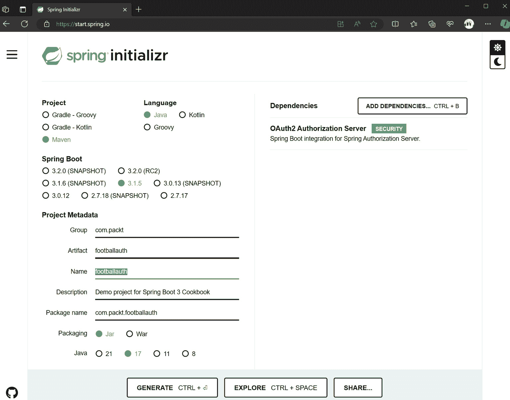

图 2.1：Spring 授权服务器的 Spring Initializr 选项

点击**生成**按钮下载项目，然后将内容解压缩到你的工作文件夹中。

1.  现在，我们需要配置授权服务器。为此，我们将在`resources`文件夹中创建一个`application.yml`文件，内容如下：

    ```java
    server:
      port: 9000
    spring:
      security:
        oauth2:
          authorizationserver:
            client:
              basic-client:
                registration:
                  client-id: "football"
                  client-secret: "{noop}SuperSecret"
                  client-authentication-methods:
                    - "client_secret_post"
                  authorization-grant-types:
                    - "client_credentials"
                  scopes:
                    - "football:read"
    ```

    我们刚刚定义了一个可以使用客户端凭证流进行认证的应用程序。

1.  现在，您可以执行您的授权服务器。您可以通过向 http://localhost:9000/.well-known/openid-configuration 发送请求来检索服务器的配置。如路径所示，这是一个众所周知的端点，所有 OAuth2 兼容的供应商都实现它以公开客户端应用程序的相关配置。大多数客户端库都可以仅从这个端点进行配置。

1.  为了验证其是否正常工作，我们可以执行我们客户端的认证。您可以通过执行以下`POST`请求并通过`curl`来完成此操作：

    ```java
    curl --location 'http://localhost:9000/oauth2/token' \
    --header 'Content-Type: application/x-www-form-urlencoded' \
    --data-urlencode 'grant_type=client_credentials' \
    --data-urlencode 'client_id=football' \
    --data-urlencode 'client_secret=SuperSecret' \
    --data-urlencode 'scope=football:read'
    ```

    您应该看到一个类似以下响应：

    ```java
    {"access_token":"eyJraWQiOiIyMWZkYzEyMy05NTZmLTQ5YWQtODU2 Zi1mNjAxNzc4NzAwMmQiLCJhbGciOiJSUzI1NiJ9.eyJzdWIiOiJiYXNp Yy1jbGllbnQiLCJhdWQiOiJiYXNpYy1jbGllbnQiL CJuYmYiOjE2OTk1NzIwNjcsInNjb3BlIjpbInByb2ZpbGUiXSwiaXNzIj oiaHR0cDovL2xvY2FsaG9zdDo5MDAwIiwiZXhwIjoxNjk5NTcyMzY3LCJ pYXQiOjE2OTk1NzIwNjd9.TavlnbirP_4zGH8WaJHrcCrNs5ZCnStqqiX Kc6pakfvQPviosGdgo9vunq4ogRZWYNjXOS5GYw0XlubSj0UDznnxSLyx 7tR7cEZJSQVHc6kffuozycJ_xl5yzw6_Kv_pJ4fP00b7pbHWO8ciZKUhmW -Pvt5TV8sMFY-uNzgsCtiN5EYdplMUfZdwHMy8yon3bUah8Py7RoAw1bIE ioGUEiK5XLDaE4yGdo8RyyBv4wj3mw6Bs8dcLspLKWXG5spXlZes6XCaSu 0ZXtLE09AgA_Gmq0kwmhWXgnpGKuCkhkXASyJXboQD9TR0y3yTn_aNeiuV MPzX4DQ7IaCKzgmaYg","scope":"profile","token_type":"Bearer","expires_in":299}
    ```

1.  现在，您可以复制`access_token`字段的值，在您的浏览器中打开[`jwt.ms`](https://jwt.ms)，并将该值粘贴到那里。在**解码令牌**标签页中，您可以查看令牌的解码形式；如果您点击**声明**标签页，您可以看到每个字段的解释：

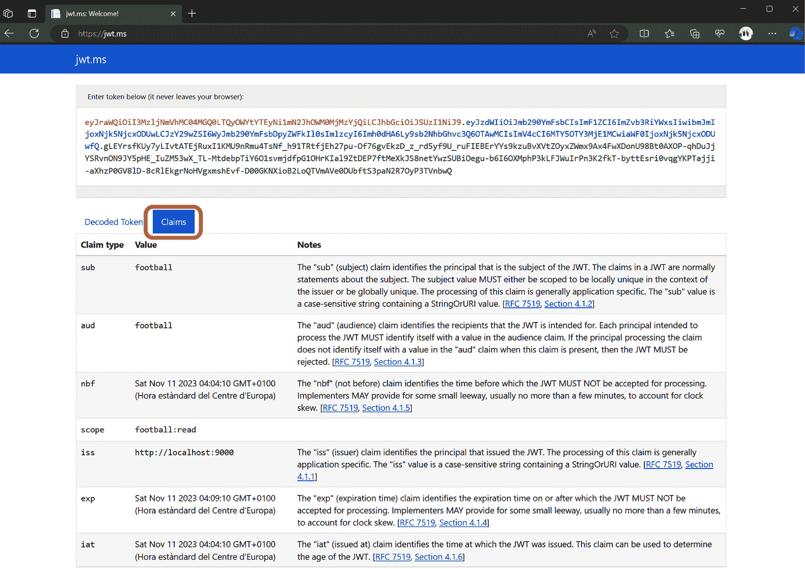

图 2.2：在 jwt.ms 中解码的 JWT 令牌

1.  恭喜——您已部署了 Spring 授权服务器，并成功配置了授权应用程序。

## 它是如何工作的...

Spring OAuth2 授权服务器包含创建授权服务器所需的所有组件。通过在`application.yml`中提供的配置，它创建了一个具有`client-id`值为`basic-client`的应用程序。让我们看看用于应用程序的参数以及它们是如何工作的：

+   `client-id`是我们创建的应用程序的标识符。在这种情况下，它是`football`。

+   `client-secret`是应用程序的密钥。通过在密钥中使用`{noop}`前缀，我们告诉 Spring Security 密码未加密，可以直接使用。

+   `client-authentication-methods`用于指定此应用程序如何进行认证。通过使用`client_secret_post`方法，我们可以确保客户端 ID 和密钥将以`POST`请求的形式发送。我们还可以配置其他方法，例如`client_secret_basic`，在这种情况下，客户端 ID 和密钥将以 HTTP 基本模式发送——即在 URL 中。

+   通过`authorization-grant-types`，我们指定了此应用程序允许的授权流。通过设置`client_credentials`，我们正在配置一个没有用户界面的应用程序，例如后台服务器应用程序。如果您有一个将与应用户交互的应用程序，您可以选择其他选项，例如`authorization_code`。

+   最后，通过`scopes`，我们正在配置此应用程序允许的作用域。在这种情况下，仅仅是`football:read`作用域。

Spring OAuth2 授权服务器将此配置保存在内存中。正如你可能猜到的，这只是为了演示和开发目的。在生产环境中，你需要持久化这些数据。Spring OAuth2 授权服务器为 JPA 存储库提供支持。

我们使用 **JWT MS** ([`jwt.ms`](https://jwt.ms)) 检查由我们的授权服务器签发的访问令牌。这个工具只是解码令牌并描述标准字段。还有一个名为 **JWT IO** ([`jwt.io`](https://jwt.io)) 的流行工具，它也允许你验证令牌，但它不会解释每个字段。

## 还有更多…

你可以遵循 Spring OAuth2 授权服务器项目的说明，使用 JPA 实现核心服务：[`docs.spring.io/spring-authorization-server/docs/current/reference/html/guides/how-to-jpa.html`](https://docs.spring.io/spring-authorization-server/docs/current/reference/html/guides/how-to-jpa.html)。

你可以使用 Spring Data JPA 支持的任何关系型数据库，例如 PostgreSQL，我们在 *第五章* 中使用过。

## 参见

在本章中，我们将管理许多 OAuth2 概念，如果你没有先前的知识，这可能很难理解。

例如，了解不同的令牌类型非常重要：

+   `access_token`：这包含授权服务器授予的所有授权信息，资源服务器将进行验证。

+   `id_token`：此令牌用于会话管理，通常在客户端应用程序中，例如用于自定义用户界面。

+   `refresh_token`：此令牌用于在即将过期时获取新的 `access_tokens` 和 `id_tokens`。`refresh_token` 被视为秘密，因为其有效期比其他令牌长，不仅可以用于获取已授权应用程序的新鲜令牌，还可以用于新的应用程序。因此，需要相应地保护此令牌。

我强烈建议熟悉基本的 OAuth2 流程及其主要目的：

+   **客户端** **凭证流**：

    这是 simplest 的流程，在本次食谱中使用过。它适用于无需用户交互的应用程序——例如，用于与其他应用程序通信的服务器应用程序。它们可以通过不同的方式认证，例如使用密钥，如本食谱中所示，证书或其他更复杂的技术。

+   **授权码** **授权流**：

    这是为了验证网页和移动应用程序。这是双因素认证流程，用户进行认证并允许应用程序访问请求的作用域。然后，认证端点会发放一个短期有效的代码，该代码应在令牌端点兑换以获取访问令牌。之后，应该对应用程序（而非用户）进行认证。根据认证方式的不同，此流程有两种变体：

    +   使用客户端 ID 和密钥。这适用于保密应用程序，例如那些可以保密的应用程序。这包括服务器应用程序。

    +   使用客户端 ID 和挑战，也称为 **证明密钥挑战交换** (**PKCE**)。这适用于公共应用程序，例如那些无法保密的应用程序，如移动应用程序，或者仅存在于浏览器中的应用程序，如 **单页应用程序** (**SPAs**)。

+   `refresh_token`。

还有更多流程，但这些都是本章将使用的基本流程。

# 使用 OAuth2 保护 RESTful API

保护资源 – 在这种情况下，一个 RESTful API – 是 OAuth 的核心功能。在 OAuth2 中，资源服务器将授权访问第三方服务器的权限委托给授权服务器。在本菜谱中，你将学习如何配置一个 RESTful API 应用程序，以便它可以授权由你的 Spring 授权服务器发出的请求。

我们将继续使用我们的足球数据管理示例。你将通过只允许授权服务器授权的客户端来保护你的 Football API。

## 准备工作

在本菜谱中，你将重用你在 *设置 Spring 授权服务器* 菜谱中创建的授权服务器。如果你还没有完成，你可以使用我准备好的授权服务器。你可以在本书的 GitHub 仓库中找到它，网址为 [`github.com/PacktPublishing/Spring-Boot-3.0-Cookbook`](https://github.com/PacktPublishing/Spring-Boot-3.0-Cookbook)，在 `chapter4/recipe4-2/start` 文件夹中。

## 如何操作...

在本菜谱中，你将创建一个新的 RESTful API，并使用之前菜谱中创建的客户端注册将其配置为 *资源服务器*。按照以下步骤操作：

1.  首先，使用 Spring Initializr ([`start.spring.io`](https://start.spring.io)) 创建一个 RESTful API。使用与你在 *第一章* 中 *创建 RESTful API* 菜单中相同的选项，但以下选项需要更改：

    +   对于 `footballresource`。

    +   对于 **依赖项**，选择 **Spring Web** 和 **Oauth2 资源服务器**：

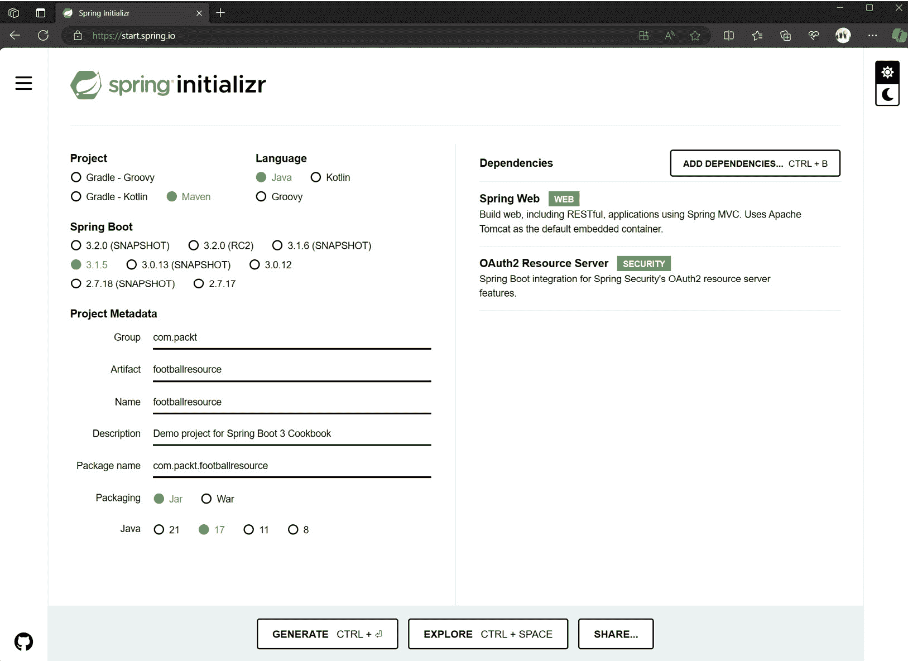

图 2.3：受保护 RESTful API 的 Spring Initializr 选项

点击 **GENERATE** 下载包含你的项目模板的 ZIP 文件。将其解压到你的工作文件夹中，并在代码编辑器中打开它。

1.  我们可以创建一个简单的 REST 控制器，其中包含一个返回球队列表的方法。为此，创建一个名为 `Football.java` 的类，并包含以下内容：

    ```java
    @RequestMapping("/football")
    @RestController
    public class FootballController {
        @GetMapping("/teams")
        public List<String> getTeams() {
            return List.of("Argentina", "Australia",
                           "Brazil");
        }
    }
    ```

    现在，让我们使用之前菜谱中创建的授权服务器来配置我们的应用程序以进行授权。为此，在 `resources` 文件夹中创建一个 `application.yml` 文件，并包含以下内容：

    ```java
    spring:
      security:
        oauth2:
          resourceserver:
            jwt:
              audiences:
              - football
    HTTP Error 401 Unauthorized error.
    ```

1.  我们首先需要从我们的授权服务器获取一个访问令牌。为此，你可以使用 `curl` 执行以下请求：

    ```java
    curl --location 'http://localhost:9000/oauth2/token' \
    --header 'Content-Type: application/x-www-form-urlencoded' \
    --data-urlencode 'grant_type=client_credentials' \
    --data-urlencode 'client_id=football' \
    --data-urlencode 'client_secret=SuperSecret' \
    --data-urlencode 'scope=football:read'
    ```

    响应将看起来像这样：

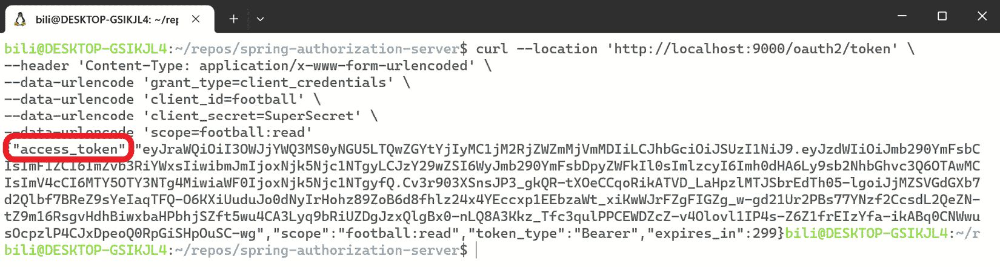

图 2.4：授权服务器签发的访问令牌

1.  复制访问令牌值并在下一个请求中使用它：

    ```java
    curl -H "Authorization: Bearer <access_token> with the value of the access token you obtained in the previous request, as shown in *Figure 2**.4*.Now, the resource server will return the expected result, along with a list of teams.
    ```

1.  现在，你有了由授权服务器签发的令牌保护的我们的 RESTful API。

## 它是如何工作的……

在这个简化的例子中，你看到了 OAuth2 中的授权是如何工作的。有一个授权服务器签发带有授权信息的令牌。然后资源服务器——我们的 RESTful API——检查令牌的有效性并应用提供的配置。授权服务器可以以不同的格式签发令牌，但最常见的是通过`.`)符号：

+   标头包含管理令牌所需的元数据。它使用 base64 进行编码。

+   负载包含实际数据和关于令牌的声明。它包含诸如过期时间、发行者和自定义声明等信息。它使用 base64 进行编码。

+   签名是通过使用编码的标头和编码的负载，以及一个密钥，并使用标头中指定的签名算法来对它们进行签名来创建的。签名用于验证令牌的**真实性**和**完整性**，以确保令牌是由授权服务器签发的，并且没有被其他人修改。

资源需要验证令牌的真实性和完整性。为此，它需要验证签名。授权服务器提供了一个端点，可以下载用于签名令牌的证书的公钥。因此，授权服务器首先需要知道该端点的位置。我们可以在`application.yml`文件中手动配置此信息，但幸运的是，Spring Resource Server 知道如何自动检索授权服务器所有相关信息。只需配置`issuer-uri`属性，它就知道如何检索其余信息。

几乎所有市场上的授权服务器，如果我们向发行者 URI 添加以下路径：`.well-known/openid-configuration`，都可以提供已知的`OpenId`端点。当资源服务器第一次需要验证 JWT 时，它会调用该端点——在我们的例子中，是`http://localhost:9000/.well-known/openid-configuration`——并检索它所需的所有信息，例如授权和令牌端点、**JSON Web Key Set**（**JWKS**）端点，该端点包含签名密钥，等等。JWKS 是授权服务器可以用来签名令牌的公钥。客户端可以下载这些密钥以验证 JWT 的签名。

既然我们已经知道了资源服务器如何验证令牌是由授权服务器签发的，我们就需要了解如何验证令牌是否针对我们的 RESTful API。在 `application.yml` 文件中，我们已经配置了 `audiences` 字段。这表示令牌有效的实体以及令牌旨在为谁或什么服务。`aud` 声明有助于确保 JWT 只被预期的接收者或资源服务器接受。`aud` 声明是 JWT 有效载荷的一部分。在我们的案例中，解码 base64 后的有效载荷看起来如下：

```java
{
  "sub": "football",
  "aud": "football",
  "nbf": 1699671850,
  "scope": [
    "football:read"
  ],
  "iss": "http://localhost:9000",
  "exp": 1699672150,
  "iat": 1699671850
}
```

只需设置 `issuer-uri` 和 `audiences`，我们就能确保只有由我们的授权服务器签发以及旨在为我们应用程序/受众签发的 JWT 会被接受。Spring 资源服务器执行其他标准检查，例如过期时间（`exp` 声明）和不可用之前（`nbf` 声明）。其他任何内容都会以 `HTTP 401 未授权` 错误被拒绝。在 *使用 OAuth2 和不同作用域保护 RESTful API* 的配方中，我们将学习如何使用其他声明来增强保护。

需要注意的是，从 Spring 资源服务器角度来看，客户端如何获取访问令牌并不重要，因为这个责任已经委托给了授权服务器。授权服务器可能需要根据访问的资源类型进行不同级别的验证。以下是一些验证的示例：

+   客户端 ID 和密钥，如本示例所示。

+   多因素认证。对于具有用户交互的应用程序，授权服务器可能认为用户名和密码不足以进行认证，并强制使用第二个认证因素，例如认证应用程序、证书等。

+   如果应用程序尝试访问特定的作用域，可能需要显式同意。我们经常在社交网络中看到这种情况，当第三方应用程序需要访问我们个人资料的部分内容或试图执行特殊操作，如代表我们发布时。

# 使用 OAuth2 和不同作用域保护 RESTful API

在前面的配方中，我们学习了如何保护我们的应用程序。在这个配方中，我们将学习如何应用更细粒度的安全措施。我们需要为应用程序应用不同级别的访问权限：一种通用的读取访问形式供我们的 RESTful API 的消费者使用，以及管理访问权限，以便我们可以更改数据。

为了将不同级别的访问应用于 API，我们将使用标准的 OAuth2 概念*范围*。在 OAuth 2.0 中，`scope`是一个参数，用于指定客户端应用程序从用户和授权服务器请求的访问级别和权限。它定义了客户端应用程序代表用户可以执行哪些操作或资源。范围有助于确保用户对其数据和资源授予访问权限的部分有所控制，并允许进行细粒度的访问控制。在具有用户交互的应用程序中，授予范围可能意味着用户明确同意。对于没有用户交互的应用程序，它可以配置为管理同意。

在我们的足球应用程序中，你将创建两个访问级别：一个用于只读访问，另一个用于管理访问。

## 准备就绪

在这个配方中，我们将重用*设置 Spring 授权服务器*配方中的认证服务器和我们在*使用 OAuth2 保护 RESTful API*配方中创建的资源服务器。如果你还没有完成这些配方，你可以在本书的 GitHub 存储库中找到工作版本，网址为[`github.com/PacktPublishing/Spring-Boot-3.0-Cookbook`](https://github.com/PacktPublishing/Spring-Boot-3.0-Cookbook)，在`chapter4/recipe4-3/start`文件夹中。

## 如何操作...

让我们在授权服务器中创建`football:read`和`football:admin`范围，并在资源服务器中应用管理它们的配置：

1.  你应该做的第一件事是确保在授权服务器中定义了范围。为此，请转到你在*设置 Spring 授权服务器*配方中创建的项目在`resources`文件夹中的`application.yml`文件。如果你使用了我提供的实现，如该配方中的*准备就绪*部分所述，你可以在`footballauth`文件夹中找到该项目。确保应用程序提到了`football:read`和`football:admin`范围。`application.yml`文件中的应用程序配置应如下所示：

    ```java
    spring:
      security:
        oauth2:
          authorizationserver:
            client:
              football:
                registration:
                  client-id: "football"
                  client-secret: "{noop}SuperSecret"
                  client-authentication-methods:
                    - "client_secret_post"
                  authorization-grant-types:
                    - "client_credentials"
                  scopes:
                    - "football:read"
    FootballController controller class, create a method named addTeam that’s mapped to a POST action:

    ```

    @PostMapping("/teams")

    public String addTeam(@RequestBody String teamName){

    返回`teamName + " added"`;

    }

    ```java

    You can do a more complex implementation, but for this exercise, we can keep this emulated implementation.
    ```

1.  现在，配置资源服务器，使其能够管理范围。为此，创建一个配置类，该类公开一个`SecurityFilterChain`bean：

    ```java
    @Configuration
    public class SecurityConfig {
        @Bean
        public SecurityFilterChain
        filterChain(HttpSecurity http) throws Exception {
            return http.authorizeHttpRequests(authorize ->
                authorize.requestMatchers(HttpMethod.GET,
                "/football/teams/**").hasAuthority(
                "SCOPE_football:read").requestMatchers(
                HttpMethod.POST, "/football/teams/**")
                .hasAuthority("SCOPE_football:admin")
                .anyRequest().authenticated())
                .oauth2ResourceServer(oauth2 ->
                oauth2.jwt(Customizer.withDefaults()))
                .build();
        }
    }
    ```

    注意，作为`SecurityFilterChain`的一部分，我们使用`HttpMethod`、请求路径和所需的权限，通过两种范围定义了几个`requestMatchers`。

1.  现在我们有了所需的配置，让我们运行应用程序并执行一些测试以验证其行为：

    1.  首先，从授权服务器获取访问令牌，请求仅`football:read`范围。你可以通过运行以下`curl`命令来执行请求：

    ```java
    curl --location 'http://localhost:9000/oauth2/token' \
    --header 'Content-Type: application/x-www-form-urlencoded' \
    --data-urlencode 'grant_type=client_credentials' \
    --data-urlencode 'client_id=football' \
    --data-urlencode 'client_secret=SuperSecret' \
    --data-urlencode '200.However, let’s say you try to perform the POST request to create a team:

    ```

    curl -H "Authorization: Bearer <access_token>" -H "Content-Type: application/text" --request POST --data 'Senegal' http://localhost:8080/football/teams -v

    ```java

    ```

关于 curl 的说明

注意，我们开始使用 `-v` 参数。它提供详细的响应，以便我们可以看到某些失败的原因。

它将返回 HTTP 403 禁止错误，详细信息如下：

```java
WWW-Authenticate: Bearer error="insufficient_scope", error_description="The request requires higher privileges than provided by the access token.", error_uri="https://tools.ietf.org/html/rfc6750#section-3.1"
```

1.  现在，让我们使用适当的范围检索另一个访问令牌：

```java
curl --location 'http://localhost:9000/oauth2/token' \
--header 'Content-Type: application/x-www-form-urlencoded' \
--data-urlencode 'grant_type=client_credentials' \
--data-urlencode 'client_id=football' \
--data-urlencode 'client_secret=SuperSecret' \
--data-urlencode 'scope=football:read football:admin'
```

注意，我们一次可以请求多个范围。

如果我们使用新的访问令牌执行创建球队的请求，我们会看到它按预期工作，并返回类似 `Senegal added` 的内容。

1.  这样，我们的应用程序就得到了保护，并且我们已经为我们的资源服务器应用了不同的保护级别。

## 它是如何工作的…

`SecurityFilterChain` bean 是一个用于配置拦截和处理传入 HTTP 请求的安全过滤器的组件。在这里，我们创建了一个 `SecurityFilterChain` bean，它查找两个匹配的模式：匹配 `/football/teams/**` 路径模式的 `GET` 请求和匹配相同路径模式的 `POST` 请求。`GET` 请求应该有 `SCOPE_football:read` 权限，而 `POST` 应该有 `SCOPE_football:admin` 权限。一旦配置了 `SecurityFilterChain`，它就会应用于所有传入的 HTTP 请求。然后，如果匹配模式的请求没有所需的范围，它将引发 `HTTP 403` `forbidden` 响应。

为什么使用 `SCOPE_` 前缀？这是由默认的 `JwtAuthenticationConverter` 创建的。该组件将 JWT 转换为 `Authentication` 对象。默认的 `JwtAuthenticationConverter` 由 Spring Security 连接，但您也可以注册自己的转换器，如果您想要不同的行为。

## 还有更多…

可以在 JWT 上执行更多验证。例如，验证请求的一种常见方式是检查其角色。

您可以通过注册 `SecurityFilterChain` bean 来验证请求的角色。假设您在授权服务器中定义了一个管理员角色。在这里，您可以在资源服务器中配置一个 `SecurityFilterChain` bean，以确保只有具有 `ADMIN` 角色的用户可以在 `football/teams` 路径上执行 `POST` 请求，如下所示：

```java
@Bean
public SecurityFilterChain filterChainRoles(HttpSecurity
http) throws Exception {
    return http.authorizeHttpRequests(authorize ->
    authorize.requestMatchers(HttpMethod.POST,
    "football/teams/**").hasRole("ADMIN")
    .anyRequest().authenticated())
    .oauth2ResourceServer(oauth2 ->
    oauth2.jwt(Customizer.withDefaults()))
    .build();
}
```

您可以进行其他检查以验证您的令牌。在这种情况下，您可以使用 `OAuth2TokenValidator`。例如，您可能想验证给定的声明是否存在于您的 JWT 中。为此，您可以创建一个实现 `OAuth2TokenValidator` 的类：

```java
class CustomClaimValidator implements
OAuth2TokenValidator<Jwt> {
    OAuth2Error error = new OAuth2Error("custom_code",
    "This feature is only for special football fans",
    null);
    @Override
    public OAuth2TokenValidatorResult validate(Jwt jwt) {
        if (jwt.getClaims().containsKey("specialFan")){
            return OAuth2TokenValidatorResult.success();
        }
        else{
            return
                OAuth2TokenValidatorResult.failure(error);
        }
    }
}
```

## 参见

我建议您查看 Spring OAuth2 资源服务器项目文档[`docs.spring.io/spring-security/reference/servlet/oauth2/resource-server/jwt.html`](https://docs.spring.io/spring-security/reference/servlet/oauth2/resource-server/jwt.html)，以获取更多详细信息。

# 使用 OpenID 身份验证配置 MVC 应用程序

我们想为我们的足球迷创建一个新的网络应用程序。为此，我们必须在用户访问应用程序时进行用户身份验证。我们将使用访问令牌来访问受保护的 RESTful API。

在这个食谱中，我们将学习如何使用 Spring OAuth2 Client 保护 MVC Web 应用程序并获取其他受保护资源的访问令牌。

如果您计划使用 SPA，您将需要为您目标环境寻找 OpenID 认证的库。

## 准备工作

对于这个食谱，您将重用您在*设置 Spring 授权服务器*食谱中创建的授权服务器应用程序以及您在*使用 OAuth2 和不同作用域保护 RESTful API*食谱中创建的应用程序。如果您还没有完成它们，我已经为这两个项目准备了可工作的版本。您可以在本书的 GitHub 存储库中找到它们，在`chapter4/recipe4-4/start`文件夹中。[`github.com/PacktPublishing/Spring-Boot-3.0-Cookbook`](https://github.com/PacktPublishing/Spring-Boot-3.0-Cookbook)

认证过程涉及一些重定向，并需要管理受保护应用程序的会话。我们将使用 Redis 来维护应用程序的会话。您可以在您的计算机上下载 Redis 并执行它，但正如我们在其他食谱中所做的那样，您可以在 Docker 上部署 Redis。为此，只需在您的终端中执行以下命令：

```java
docker run --name spring-cache -p 6379:6379 -d redis
```

此命令将下载 Redis 社区镜像，如果它尚未存在于您的计算机上，并将启动 Redis 服务器，使其在端口`6379`上监听，无需任何凭证。在生产环境中，您可能希望保护此服务，但在本食谱中，我们将为了简单起见保持它开放。

## 如何操作…

在这个食谱中，您将创建一个新的 Web 应用程序并将其与您在之前的食谱中创建的现有授权服务器和 RESTful API 集成。按照以下步骤操作：

1.  首先，您需要在授权服务器中创建客户端注册。为此，打开授权服务器`resources`文件夹中的`application.yml`文件——即您在*设置 Spring 授权服务器*食谱中创建的项目。添加新的客户端注册，如下所示：

    ```java
    spring:
      security:
        oauth2:
          authorizationserver:
            client:
              football-ui:
                registration:
                  client-id: "football-ui"
                  client-secret: "{noop}TheSecretSauce"
                  client-authentication-methods:
                    - "client_secret_basic"
                  authorization-grant-types:
                    - "authorization_code"
                    - "refresh_token"
                    - "client_credentials"
                  redirect-uris:
                    - "http://localhost:9080/login/oauth2/code/football-ui"
                  scopes:
                    - "openid"
                    - "profile"
                    - "football:read"
                    - "football:admin"
                require-authorization-consent: true
    ```

1.  由于我们想要对用户进行认证，您至少需要创建一个用户。为此，在授权服务器中的同一`application.yml`文件中添加以下配置：

    ```java
    User:
        name: "user"
        password: "password"
    ```

    `user`元素应与`oauth2`元素对齐。请记住，`.yml`文件中的缩进非常重要。您可以更改用户名和密码，并设置您想要的值。

    保持此配置，因为您将在 Web 应用程序中稍后使用它。

1.  现在，让我们为我们的 Web 应用程序创建一个新的 Spring Boot 应用程序。您可以使用*Spring Initializr*，就像您在*第一章*中创建 RESTful API 食谱中所做的那样，但更改以下选项：

    +   对于`footballui`

    +   对于**依赖项**，选择**Spring Web**、**Thymeleaf**、**Spring Session**、**Spring Data Redis (Access+Driver)**、**OAuth2 Client**和**OAuth2 Security**：

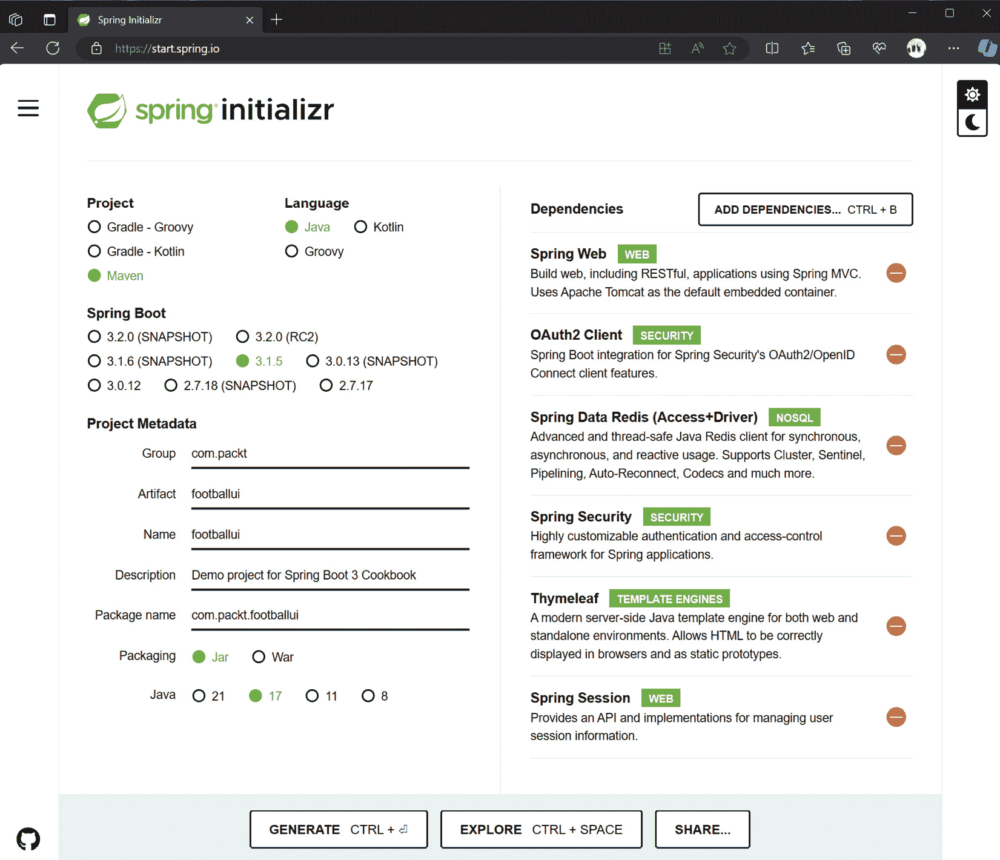

图 2.5：Web 应用程序的 Spring Initializr 选项

点击**生成**以将项目模板作为 ZIP 文件下载。在您的开发文件夹中解压缩文件，并在您首选的代码编辑器中打开它。

1.  `org.thymeleaf.extras: thymeleaf-extras-springsecurity6`之间存在已知的兼容性问题。为此，请打开项目的`pom.xml`文件，并添加以下依赖项：

    ```java
    <dependency>
        <groupId>org.thymeleaf.extras</groupId>
        <artifactId>thymeleaf-extras-springsecurity6
            </artifactId>
        <version>3.1.1.RELEASE</version>
    </dependency>
    ```

1.  让我们首先创建我们的 Web 页面。由于我们遵循`Controller`类，该类将填充模型并在视图中展示。视图是通过 Thymeleaf 模板引擎渲染的：

    1.  首先，创建名为`FootballController`的`Controller`类，并提供一个用于主页的简单方法：

    ```java
    @Controller
    public class FootballController {
        @GetMapping("/")
        public String home() {
            return "home";
        }
    }
    ```

    1.  此方法返回视图的名称。现在，我们需要创建视图。

    1.  对于视图，我们应该为 Thymeleaf 创建一个新的模板。默认模板位置是`resources/template`文件夹。在同一个文件夹中，创建一个名为`home.html`的文件，内容如下：

    ```java
    <!DOCTYPE HTML>
    <html>
    <head>
        <title>The great football app</title>
        <meta http-equiv="Content-Type"
            content="text/html; charset=UTF-8" />
    </head>
    <body>
        <p>Let's see <a href="/myself"> who you are </a>.
        You will need to login first!</p>
    </body>
    </html>
    ```

    这是一个非常基本的页面，但现在它包含了一个我们想要保护的链接。

1.  现在，我们必须配置应用程序，使其可以使用授权服务器进行身份验证，并强制所有页面（除了我们刚刚创建的首页）进行身份验证：

    1.  要将 Web 应用程序与授权服务器集成，请打开`resources`文件夹中的`application.yml`文件，并配置 OAuth2 客户端应用程序，如下所示：

    ```java
    spring:
      security:
        oauth2:
          client:
            registration:
              football-ui:
                client-id: "football-ui"
                client-secret: "TheSecretSauce"
                redirect-uri:
                  "{baseUrl}/login/oauth2/code/
                  {registrationId}"
                authorization-grant-type:
                  authorization_code
                scope:
                  openid,profile,football:read,
                  football:admin
            provider:
              football-ui:
    SecurityConfiguration and create a SecurityFilterChain bean:
    ```

```java
@Configuration
@EnableWebSecurity
public class SecurityConfiguration {
    @Bean
    public SecurityFilterChain
    defaultSecurityFilterChain(HttpSecurity http)
    throws Exception {
        http.authorizeHttpRequests(
            (authorize) -> authorize
            .requestMatchers("/").permitAll()
            .anyRequest().authenticated())
            .oauth2Login(Customizer.withDefaults());
        return http.build();
    }
}
```

使用此配置，您已保护了所有页面，除了根页面。因此，让我们创建其余的页面。

+   接下来，我们需要创建一个页面来显示用户信息。为此，在同一个`FootballController`控制器中，创建一个新的方法，如下所示：

    ```java
    @GetMapping("/myself")
    public String user(Model model,
    @AuthenticationPrincipal OidcUser oidcUser) {
        model.addAttribute("userName",
            oidcUser.getName());
        model.addAttribute("audience",
            oidcUser.getAudience());
        model.addAttribute("expiresAt",
            oidcUser.getExpiresAt());
        model.addAttribute("claims",
            oidcUser.getClaims());
        return "myself";
    }
    ```

    在这里，我们要求 Spring Boot 将`OidcUser`注入为方法参数，并创建一个我们将用于视图的名为`myself`的模型。

    现在，在`resources/templates`文件夹中创建一个名为`myself.html`的文件。将以下内容放入`<body>`中，以显示`Model`数据：

    ```java
    <body>
        <h1>This is what we can see in your OpenId
            data</h1>
        <p>Your username <span style="font-weight:bold"
            th:text="${userName}" />! </p>
        <p>Audience <span style="font-weight:bold"
            th:text="${audience}" />.</p>
        <p>Expires at <span style="font-weight:bold"
            th:text="${expiresAt}" />.</p>
        </div>
        <h2>Here all the claims</h2>
        <table>
            <tr th:each="claim: ${claims}">
                <td th:text="${claim.key}" />
                <td th:text="${claim.value}" />
            </tr>
        </table>
        <h2>Let's try to use your rights</h2>
        <a href="/teams">Teams</a>
    </body>
    ```

    如您所见，有一个链接到`/teams`。此链接将打开一个新的页面，显示团队。团队页面从您在*使用 OAuth2 和不同范围保护 RESTful API*配方中创建的 RESTful API 检索数据。

    +   让我们在`FootballController`中创建一个新的方法，以便我们可以获取团队。为此，您将使用 Spring Boot OAuth2 客户端获取访问令牌：

    ```java
    @GetMapping("/teams")
    public String teams(@RegisteredOAuth2AuthorizedClient("football-ui") OAuth2AuthorizedClient authorizedClient, Model model) {
        RestTemplate restTemplate = new RestTemplate();
        HttpHeaders headers = new HttpHeaders();
        headers.add(HttpHeaders.AUTHORIZATION,
            "Bearer " + authorizedClient.getAccessToken()
            .getTokenValue());
        HttpEntity<String> entity = new HttpEntity<>(null,
            headers);
        ResponseEntity<String> response =
            restTemplate.exchange(
            "http://localhost:8080/football/teams",
            HttpMethod.GET, entity, String.class);
        model.addAttribute("teams", response.getBody());
       return "teams";
    }
    ```

    您需要在`Authorization`头中传递访问令牌，前缀为`Bearer`字符串。

    +   要允许 Web 应用程序使用 RESTful API，您需要将`football-ui`，Web 应用程序受众，作为接受受众包括在内。为此，在您创建的*使用 OAuth2 和不同范围保护 RESTful API*配方中，打开`resources`文件夹中的`application.yml`文件，并将`football-ui`添加到`audiences`属性中。`application.yml`文件应如下所示：

    ```java
    spring:
      security:
        oauth2:
          resourceserver:
            jwt:
              audiences:
              - football
              - football-ui
              issuer-uri: http://localhost:9000
    ```

    +   在我们开始新的应用程序之前，还有一个重要的细节需要说明：我们需要配置 Redis。对于它，所需的唯一设置是`hostname`和`port`。为此，再次打开`football-ui`项目的`application.yml`文件，并设置以下配置：

    ```java
    spring:
      data:
        redis:
          host: localhost
          port: 6379
    ```

    +   最后要配置的设置是应用程序端口号。资源服务器已经使用端口号`8080`。为了避免端口冲突，我们需要更改`football-ui`项目的端口号。为此，在同一个`application.yml`文件中，添加以下设置：

    ```java
    server:
      port: 9080
    ```

    您可以设置任何尚未使用的端口号。请注意，这是授权服务器配置的一部分。如果您修改端口号，您需要修改授权服务器中的配置。

    +   现在，您可以运行应用程序。在您的浏览器中转到 http://localhost:9080：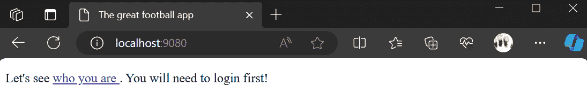

图 2.6：应用程序的主页

在这里，您将看到主页，这是唯一一个未受保护的路由。如果您点击**你是谁**链接，您将被重定向到授权服务器的登录页面：

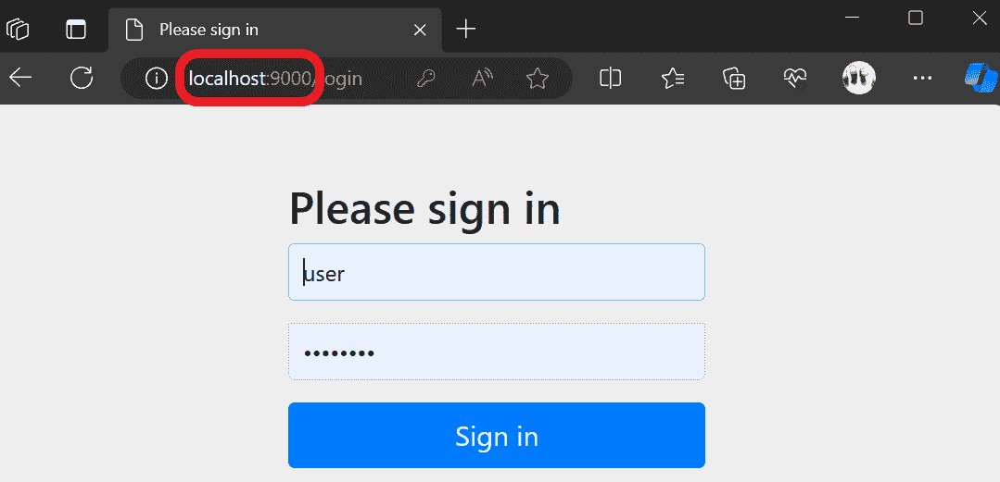

图 2.7：授权服务器的登录页面

应用您在*步骤 2*中配置的用户名和密码，然后点击**登录**按钮。您将被重定向到同意页面，在那里您应该允许应用程序请求的权限：

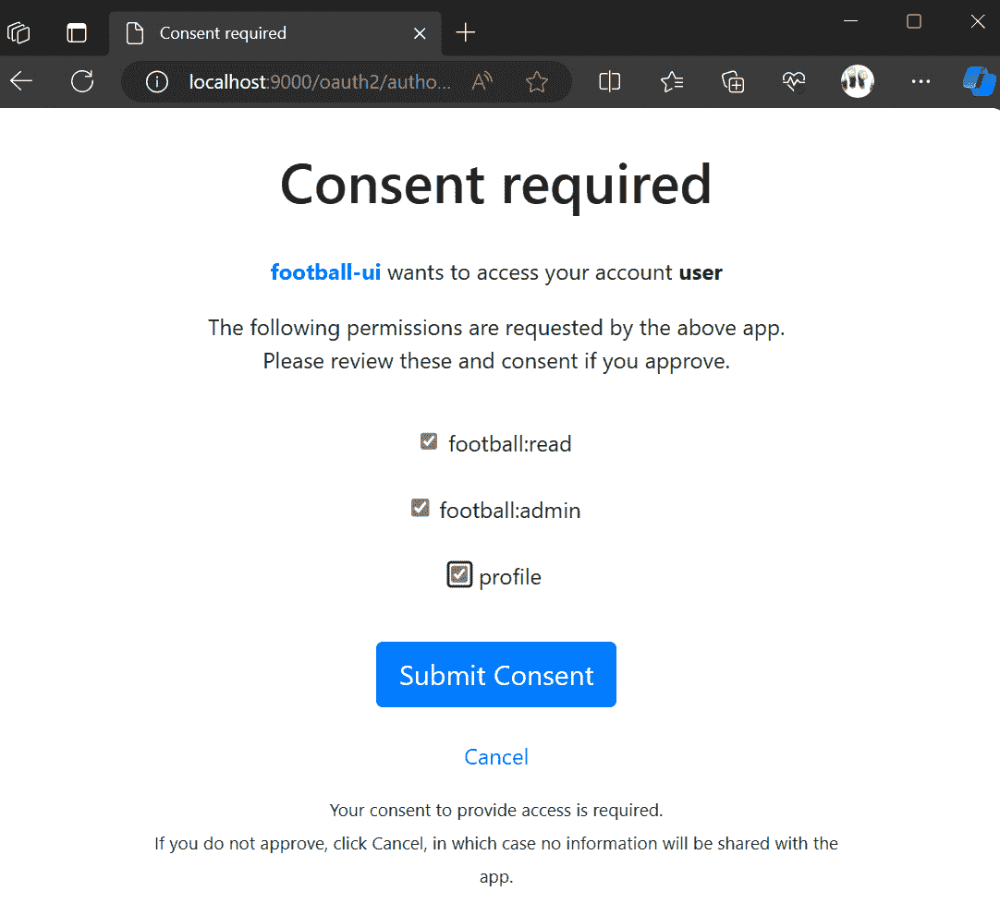

图 2.8：授权服务器中的同意页面

点击**提交同意**；您将被重定向到应用程序。OAuth 客户端应用程序将通过兑换由认证端点生成的访问代码来获取 ID 令牌、访问令牌和刷新令牌来完成此过程。这一过程对您来说是透明的，因为它由 OAuth2 客户端管理。

完成此操作后，您将返回到您创建的页面上的应用程序，以显示用户认证数据：

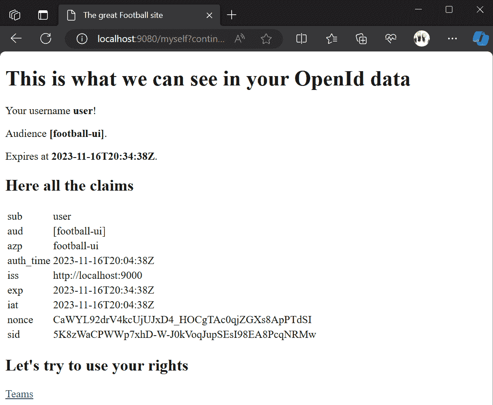

图 2.9：包含用户 OpenID 数据的应用程序页面

如果您点击`teams`数据：

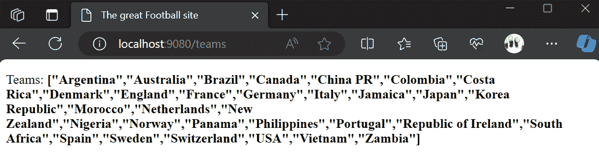

图 2.10：显示 RESTful API 数据的应用程序页面

通过这样，您的 Web 应用程序被 OpenID 保护，并且它可以调用另一个 OAuth2 受保护的资源。

## 它是如何工作的…

在这个项目中，您通过使用 OIDC 保护了您的 Web 应用程序。它是一种 OAuth 2.0 的扩展认证协议。它为用户提供了一种标准化的方式，使用他们在 IdP 的现有账户登录 Web 应用程序或移动应用程序。在我们的练习中，我们使用了授权服务器作为 IdP。

OIDC 服务器通常在`.well-known/openid-configuration`提供发现端点。如果没有提供，那么它可能被管理员有意隐藏。该端点提供了客户端应用程序进行认证所需的所有信息。在我们的应用程序中，我们使用了*授权代码授权流程*。它涉及几个步骤：

1.  首先，客户端应用程序将用户重定向到认证页面，请求应用程序使用所需的权限范围。

1.  然后，用户完成认证。根据授权服务器提供的功能，它可能使用复杂的机制来验证用户，例如证书、多个认证因素，甚至生物识别特征。

1.  如果用户已认证，授权服务器可能会根据客户端应用程序请求的权限范围要求用户同意或不需要。

1.  一旦认证，授权服务器将用户重定向到客户端应用程序，提供一个短暂的授权代码。然后，客户端应用程序将在令牌端点（由发现端点提供）兑换授权代码。授权服务器将返回包含已同意权限范围的令牌。用户未同意的权限范围将不会出现在颁发的令牌中。授权服务器返回以下令牌：

    +   包含会话信息的 ID 令牌。此令牌不应用于授权，仅用于认证目的。

    +   访问令牌包含授权信息，例如已同意的权限范围。如果应用程序需要权限范围，它应验证返回的权限范围并相应地管理它们。

    +   刷新令牌，用于在令牌过期前获取新令牌。

由于此过程中涉及许多重定向，客户端应用程序需要保持用户状态，因此需要会话管理。Spring 框架提供了一个方便的方法来使用 Redis 管理会话。

请记住，客户端应用程序在启动时需要访问发现端点。因此，请记住在客户端应用程序启动之前启动您的授权服务器。

在这个练习中，您已将根页面配置为唯一允许的无认证页面。要访问任何其他页面，都必须进行认证。因此，仅通过尝试导航到`/myself`或`/teams`，就会启动授权过程。

## 参见

许多现代应用程序都是 SPA（单页应用程序）。这类应用程序主要在浏览器中运行。此外，请注意，许多库实现了 OIDC（OpenID Connect）。我建议使用经过 OpenID 认证的库，因为它们已经过同行验证。

即使单页应用程序（SPA）越来越受欢迎，我还没有解释这种类型应用程序的认证，因为它与 Spring Boot 无关。然而，如果您有兴趣将 SPA 与 Spring 授权服务器集成，我建议您遵循 Spring OAuth2 授权服务器项目在 https://docs.spring.io/spring-authorization-server/docs/current/reference/html/guides/how-to-pkce.html 上的指南。

# 使用 Google 账户登录

您的足球应用程序有了新的需求：您的用户希望使用他们的 Gmail 账户登录到您的应用程序。

要实现此场景，您需要将您的授权服务器配置为 OAuth2 客户端，Google 账户作为其身份提供者（IdP）。您将学习如何在 Google Cloud 中创建 OAuth2 客户端 ID 并将其集成到您的应用程序中。

## 准备工作

对于这个食谱，您将重用您在 *设置 Spring 授权服务器* 和 *使用 OAuth2 和不同作用域保护 RESTful API* 食谱中创建的 Spring 授权服务器，以及您在 *配置具有 OpenID 认证的 MVC 应用程序* 食谱中创建的 Web 应用程序。MVC 应用程序将会话存储在 Redis 中。您可以在 Docker 中运行 Redis 服务器，如 *配置具有 OpenID 认证的 MVC 应用程序* 食谱中所述。

如果您尚未完成这些食谱，我已经准备了一个工作版本。您可以在本书的 GitHub 仓库 [`github.com/PacktPublishing/Spring-Boot-3.0-Cookbook`](https://github.com/PacktPublishing/Spring-Boot-3.0-Cookbook) 中的 `chapter4/recipe4-5/start` 文件夹中找到它们。

由于您将应用程序与 Google 账户集成，您需要一个 Google 账户。如果您还没有 Google 账户，您可以在 [`accounts.google.com`](https://accounts.google.com) 上创建一个。

## 如何操作…

让我们从在 Google 中创建一个 OAuth2 客户端开始，然后使用提供的配置来配置我们的授权服务器，以便它可以使用 Google 账户登录到您的应用程序：

1.  让我们从打开 Google Cloud 控制台 [`console.cloud.google.com/`](https://console.cloud.google.com/) 开始。您需要使用您的 Google 账户登录。一旦完成，您将看到 Google Cloud 主页：

    1.  首先，您需要创建一个项目：

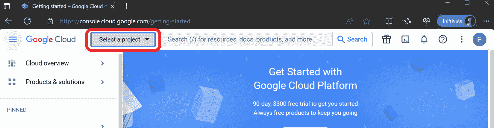

图 2.11：Google Cloud 主页

1.  要创建项目，请点击**选择** **项目**。

1.  在 **选择项目** 对话框中，点击 **新建项目**：

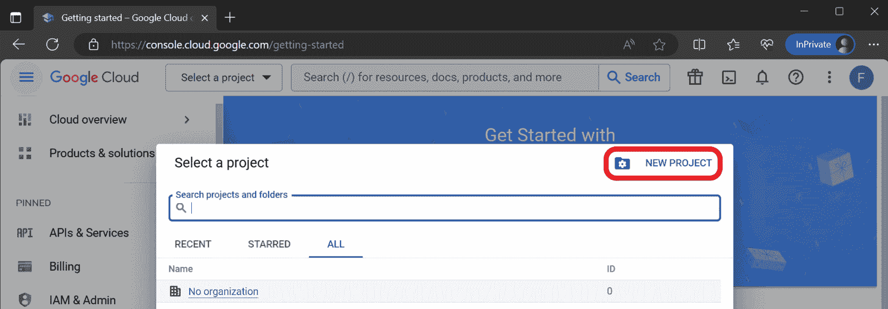

图 2.12：创建新项目

1.  命名项目 – 例如，`springboot3-cookbook`：

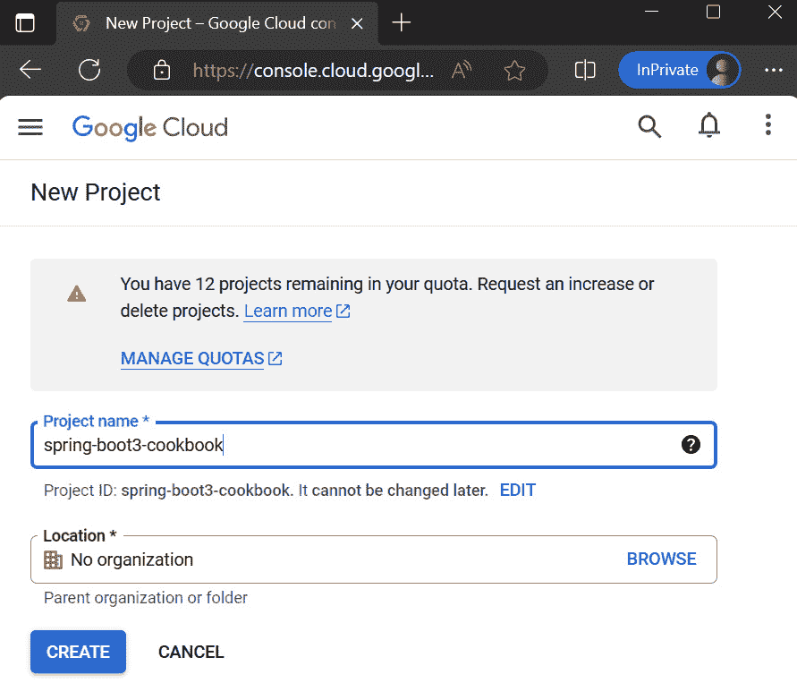

图 2.13：新建项目设置

1.  点击 **创建**。这个过程需要几分钟。完成后将出现通知。创建完成后，选择项目。

1.  现在我们有一个项目，让我们为我们的 Web 应用程序配置同意页面。为此，打开**APIs & Services**菜单并选择**凭据**：

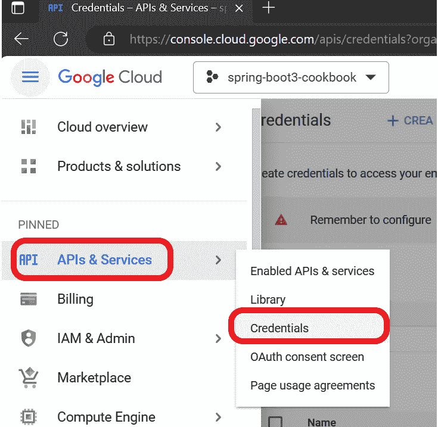

图 2.14：凭据菜单

在**凭据**页面上，您将看到一个创建应用程序同意页面的提醒：

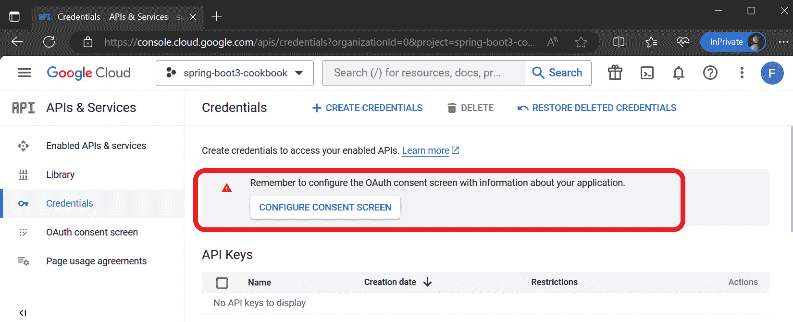

图 2.15：带有突出显示配置 OAuth 同意屏幕的凭据主页

点击**配置同意屏幕**按钮并按照说明配置同意页面。对于**用户类型**，选择**外部**并点击**创建**。

对于此类用户，应用程序将以测试模式启动。这意味着只有一些测试用户能够使用它。一旦您完成开发过程并且应用程序准备就绪，您就可以发布它。为此，您的网站必须经过验证。我们不会在这个菜谱中发布应用程序，但如果您计划在应用程序中使用它，您需要完成此步骤。

在选择**用户类型**为**外部**后，您必须完成以下四个步骤：

1.  首先，我们有**OAuth** **同意**屏幕：

    +   在这里，您应该配置应用程序的名称。例如，您可以将其设置为**Spring Boot 3 烹饪书**。

    +   您应该配置一个用户支持电子邮件地址。您可以使用与您的 Google 账户相同的电子邮件地址。

    +   您还应该配置开发者联系信息电子邮件。同样，您可以使用与您的 Google 账户相同的电子邮件地址。

    +   其余的参数是可选的。我们现在不需要配置它们。

1.  对于**更新选定的作用域**，点击**添加或删除作用域**并选择**openid**、**userinfo.email**和**userinfo.profile**：

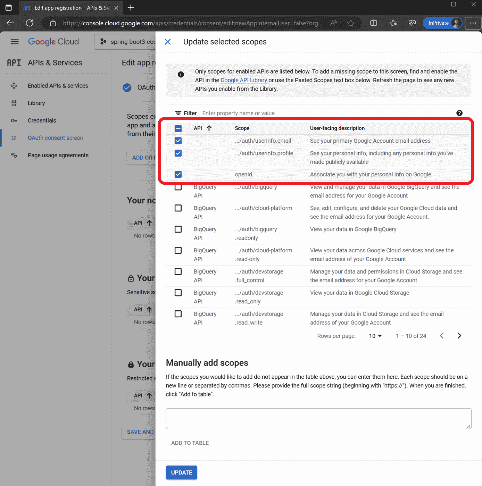

图 2.16：选择作用域

1.  然后，点击**更新**。

1.  在**测试用户**步骤中，点击**添加用户**以添加一些测试用户，他们将在应用程序发布之前能够访问应用程序。您可以添加不同的 Google 账户来测试应用程序。

1.  在**摘要**步骤中，您将看到您的同意屏幕的摘要。您可以点击**返回仪表板**以返回到**OAuth 同意****屏幕**页面。

1.  接下来，我们将创建客户端凭据。为此，再次导航到**凭据**页面，如图 *图 2**.17* 所示。一旦你进入**凭据**页面，点击**+ 创建凭据**并选择**OAuth** **客户端 ID**：

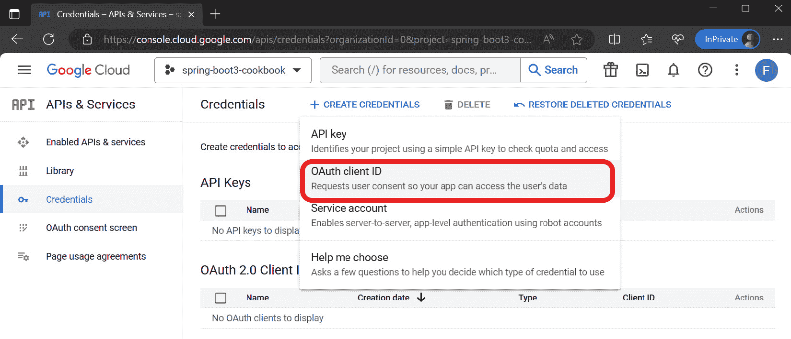

图 2.17：选择 OAuth 客户端 ID 凭据

+   对于**应用程序类型**，选择**Web 应用程序**

+   对于`football-gmail`

+   对于**授权重定向 URI**，添加 http://localhost:9000/login/oauth2/code/football-gmail：

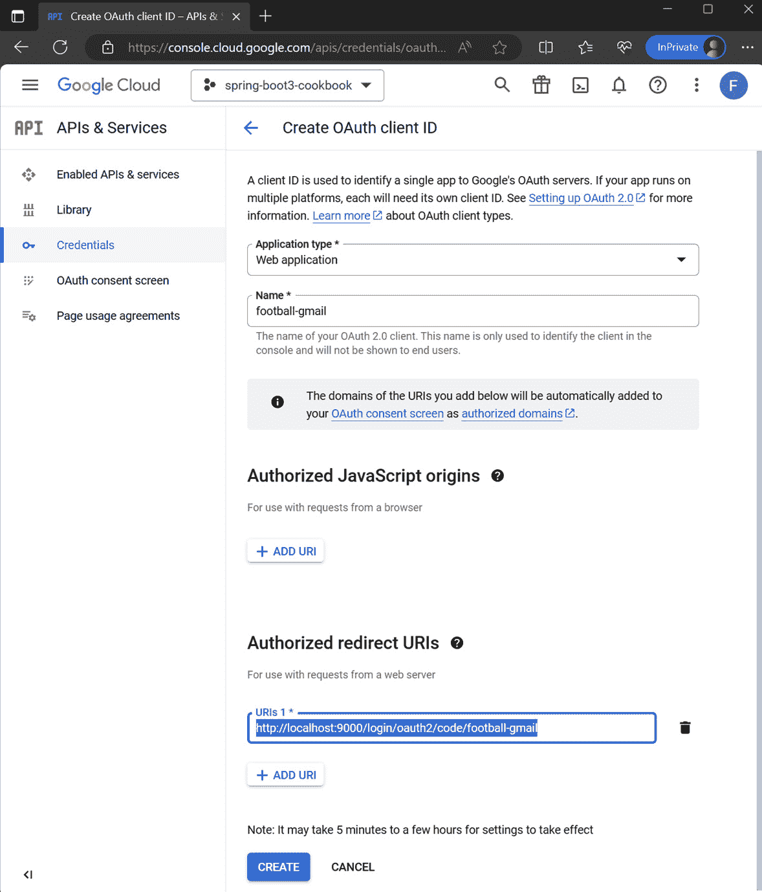

图 2.18：创建 OAuth 客户端 ID

点击**创建**。将出现一个对话框，告知你客户端已创建，并显示**客户端 ID**和**客户端密钥**详细信息。我们需要这些数据来配置授权服务器，所以请妥善保管：

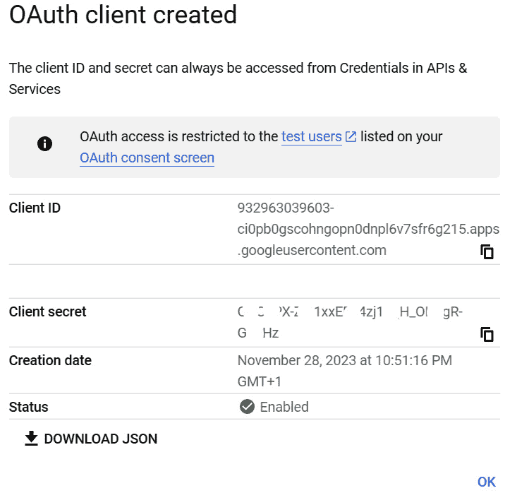

图 2.19：创建的 OAuth 客户端

有一个按钮可以下载包含配置的 JSON 文件。点击它并将 JSON 文件保存在安全的地方，因为它包含使用客户端所需的凭证。

1.  现在，我们可以配置 Spring OAuth2 授权服务器：

    1.  首先，我们需要添加 OAuth2 客户端依赖项。为此，打开`pom.xml`文件并添加以下依赖项：

    ```java
    <dependency>
        <groupId>org.springframework.boot</groupId>
        <artifactId>spring-boot-starter-oauth2-client
            </artifactId>
    </dependency>
    ```

    1.  接下来，打开`resources`文件夹中的`application.yml`文件，并添加 Google 的客户端配置：

    ```java
    spring
      security:
        oauth2:
          client:
            registration:
              football-gmail:
                client-id: "replace with your client id"
                client-secret: "replace with your secret"
                redirect-uri:
                  "{baseUrl}/login/oauth2/code/
                  {registrationId}"
                authorization-grant-type:
                  authorization_code
                scope: openid,profile,email
            provider:
              football-gmail:
                issuer-uri: https://accounts.google.com
                user-name-attribute: given_name
    ```

    1.  将`client-id`和`client-secret`字段替换为你在*步骤 2*中获得的值。

    1.  配置授权服务器的最后一步是定义安全检查的行为。为此，创建一个名为`SecurityConfig`的配置类：

    ```java
    @Configuration
    @EnableWebSecurity
    public class SecurityConfig {
    }
    ```

    1.  然后，添加一个`SecurityFilterChain`豆：

    ```java
    @Bean
    @Order(1)
    public SecurityFilterChain authorizationServerSecurityFilterChain(HttpSecurity http)
            throws Exception{
        OAuth2AuthorizationServerConfiguration
            .applyDefaultSecurity(http);
        http.getConfigurer(
            OAuth2AuthorizationServerConfigurer.class)
            .oidc(Customizer.withDefaults());
        http
            .exceptionHandling((exceptions) -> exceptions
                .defaultAuthenticationEntryPointFor(
                    new LoginUrlAuthenticationEntryPoint(
                        "/oauth2/authorization/
                        football-gmail"),
                    new MediaTypeRequestMatcher(
                        MediaType.TEXT_HTML)
                )
            )
            .oauth2ResourceServer((oauth2) ->
                oauth2.jwt(Customizer.withDefaults()));
        return http.build();
    }
    ```

    上一段代码配置了 Spring Security 使用 OAuth 2.0 和 OpenID Connect 1.0 进行身份验证，以及接受某些请求的 JWT 访问令牌。例如，它将接受提供 JWT 访问令牌以获取用户信息的请求。

    你还需要添加另一个`SecurityFilterChain`豆，但优先级较低。它将启动 OAuth2 登录过程，这意味着它将以客户端应用程序的身份启动身份验证，如`application.yml`文件中配置的那样：

    ```java
    @Bean
    @Order(2)
    public SecurityFilterChain
    defaultSecurityFilterChain(HttpSecurity http)
            throws Exception {
        http
            .authorizeHttpRequests((authorize) ->
                authorize
                .anyRequest().authenticated())
            .oauth2Login(Customizer.withDefaults());
        return http.build();
    }
    ```

    上一段代码配置了 Spring Security，要求对所有请求进行身份验证，并使用 OAuth 2.0 进行登录。

1.  通过这样，你的 OAuth2 授权服务器已经配置为要求使用 Google 账户进行身份验证。现在，你可以运行所有环境：

    +   运行你刚刚配置的授权服务器

    +   运行你在“使用不同*作用域*配置 OAuth2 保护 RESTful API”菜谱中创建的 RESTful API 服务器

    +   运行你在“使用 OpenID 身份验证配置 MVC 应用程序”菜谱中创建的 Web 应用程序

    当你导航到`http://localhost:9080/myself`时，你将需要使用 Google 账户进行登录：

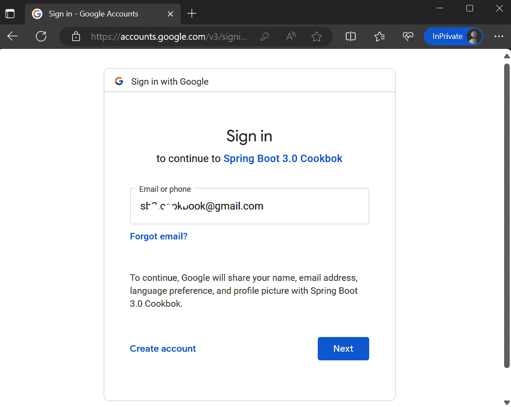

图 2.20：使用 Google 账户登录

登录后，你会看到应用程序是相同的。现在，你可以使用授权服务器颁发的声明来调用 RESTful API。

## 它是如何工作的…

由于我们仅使用 Google 进行登录委派，因此授权服务器不需要维护用户存储库，尽管它仍然负责发行令牌。这意味着当应用程序请求识别用户时，授权服务器将登录重定向到 Google。一旦返回，授权服务器将继续发行令牌。因此，您不需要更改 MVC Web 应用程序或 RESTful API 中的代码。

可以配置 MVC 应用程序，使其绕过授权服务器并直接登录到 Google 账户。您只需将 MVC Web 应用程序中的 OAuth2 客户端配置替换为在授权服务器中使用的客户端配置即可。然而，在这种情况下，您将无法使用 Google 发行的访问令牌来保护您的 RESTful API。这是因为 Google 访问令牌仅用于 Google 服务，并且它们不是标准的 JWT。

主要复杂性在于配置安全链，因为有许多选项可用。在`SecurityConfig`类中，有两个具有不同优先级的`Beans`。

`SecurityConfig`类定义了两个`SecurityFilterChain` bean。在这里，`SecurityFilterChain`实际上是 Spring Security 用于执行各种安全检查的过滤器链。链中的每个过滤器都有特定的角色，例如用户身份验证。

第一个`SecurityFilterChain` bean 的顺序设置为 1，这意味着它将是第一个被咨询的过滤器链。此过滤器链已配置为为 OAuth 2.0 授权服务器应用默认安全设置。它还通过`oidc(Customizer.withDefaults())`方法调用启用 OpenID Connect 1.0。

配置还指定，如果用户未经过身份验证，则应将其重定向到 OAuth 2.0 登录端点。这是通过使用具有 URL `/oauth2/authorization/football-gmail` 的`LoginUrlAuthenticationEntryPoint`来完成的。

过滤器链还配置为接受 JWT 访问令牌用于用户信息和/或客户端注册。这是通过使用`oauth2ResourceServer((oauth2) -> oauth2.jwt(Customizer.withDefaults()))`方法调用来完成的。

第二个`SecurityFilterChain` bean 的顺序设置为 2，这意味着如果第一个过滤器链没有处理请求，则会咨询它。`anyRequest().authenticated()` 方法链意味着任何请求都必须经过身份验证。

`oauth2Login(Customizer.withDefaults())` 方法调用配置应用程序使用 OAuth 2.0 进行身份验证。`Customizer.withDefaults()` 方法调用用于应用 OAuth 2.0 登录的默认配置。

## 参见

如您所见，在授权服务器中集成第三方身份验证只需配置 IdP 的客户端应用程序。因此，如果您需要与另一个社交提供者集成，您将需要获取客户端应用程序数据。

如果您想与 GitHub 集成，您可以在 https://github.com/settings/developers 页面上创建一个应用注册。

对于 Facebook，您可以在 https://developers.facebook.com/apps 开发者页面上创建您的应用程序。

# 将 RESTful API 与云身份提供者（IdP）集成

随着您的应用程序越来越受欢迎，您决定将身份验证委托给云身份提供者（IdP），因为它们提供了针对复杂威胁的高级保护。您决定使用 Azure AD B2C。此服务旨在面向公众的应用程序，允许客户登录和注册，以及自定义用户旅程、社交网络集成和其他有趣的功能。

在本配方中您将学习的内容可以应用于其他云身份提供者，例如 Okta、AWS Cognito、Google Firebase 以及许多其他。Spring Boot 提供了专门的启动器，可以进一步简化与身份提供者（IdP）集成的过程。

## 准备工作

在本配方中，我们将集成在 *使用 OpenID 身份验证配置 MVC 应用程序* 配方中准备的应用程序。如果您还没有完成该配方，我已准备了一个可在此书的 GitHub 仓库中找到的工作版本，该仓库位于 [`github.com/PacktPublishing/Spring-Boot-3.0-Cookbook`](https://github.com/PacktPublishing/Spring-Boot-3.0-Cookbook) 的 `chapter4/recipe4-6/start` 文件夹中。本配方还要求使用 Redis，如 *使用 OpenID 身份验证配置 MVC 应用程序* 配方中所述。在您的计算机上部署它的最简单方法是使用 Docker。

由于我们将与 Azure AD B2C 集成，您需要一个 Azure 订阅。如果您没有，您可以在 https://azure.microsoft.com/free 上创建一个免费账户。Azure AD B2C 提供了一个免费层，允许每月最多 50,000 活跃用户。

如果您没有 Azure AD B2C 租户，请在开始此配方之前按照[`learn.microsoft.com/azure/active-directory-b2c/tutorial-create-tenant`](https://learn.microsoft.com/azure/active-directory-b2c/tutorial-create-tenant)中的说明创建一个。

## 如何操作…

按照以下步骤构建与 Azure AD B2C 的顺畅登录/注册流程，并学习如何将其无缝连接到您的 Spring Boot 应用程序以进行大规模用户身份验证：

1.  您需要做的第一件事是在 Azure AD B2C 中创建一个应用注册。应用注册与您在之前配方中在 Spring Authorization Server 中创建的客户端注册相同。您可以在 **应用** **注册** 部分创建应用注册：

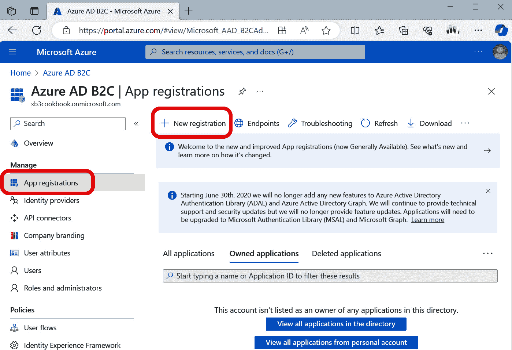

图 2.21：在 Azure AD B2C 中创建应用注册

1.  在 `Football UI` 上。

1.  对于 `http://localhost:9080/login/oauth/code` 作为重定向 UI 的值：

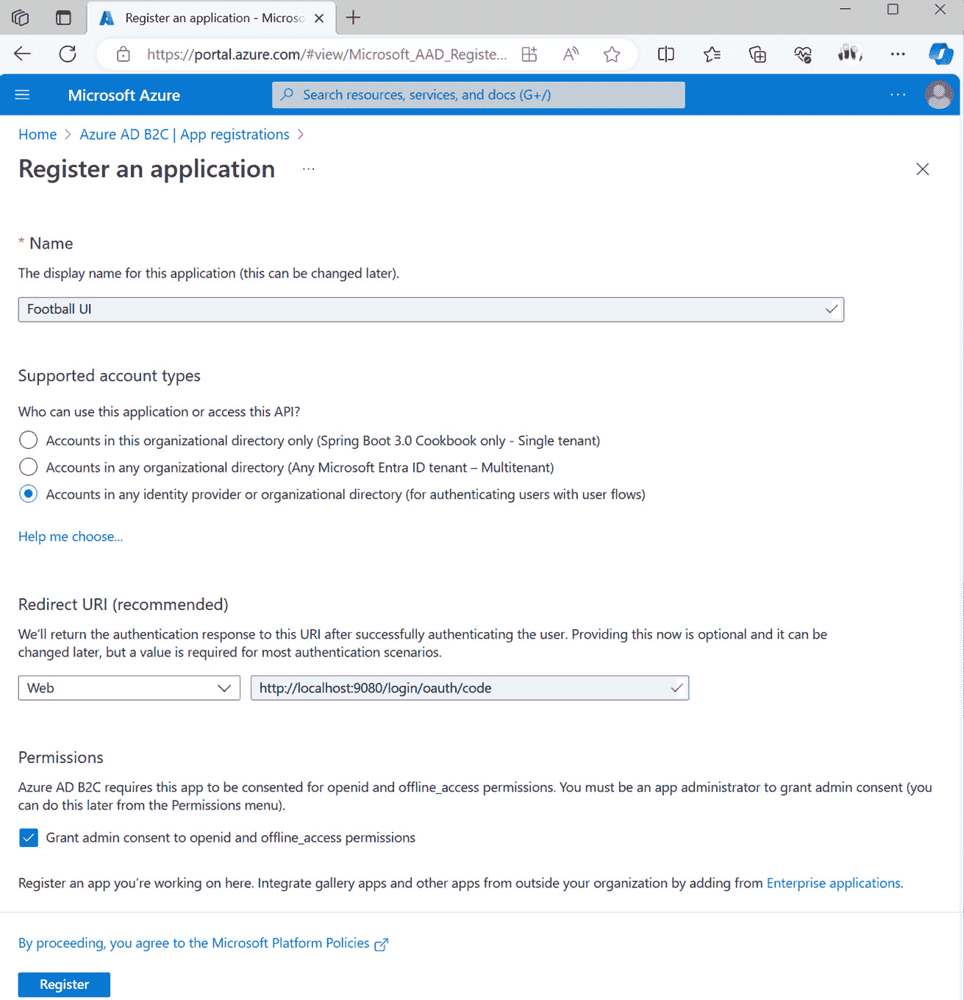

图 2.22：Azure AD B2C 中的应用注册选项

点击**注册**以继续应用程序注册过程。

1.  一旦创建了应用程序注册，你需要配置一个客户端秘密。你可以在你创建的应用程序注册的**证书和秘密**部分中这样做：

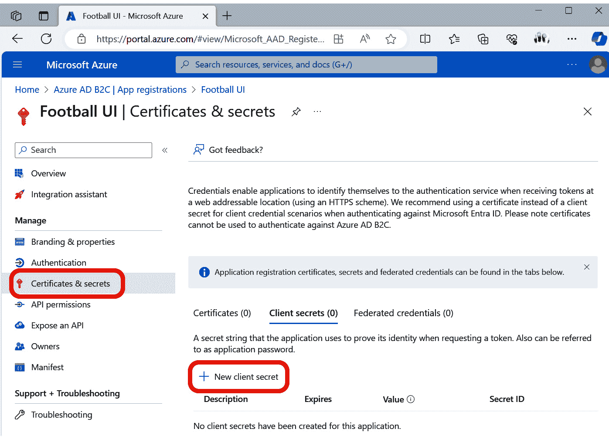

图 2.23：创建新的客户端秘密

1.  一旦你创建了秘密，Azure AD B2C 生成的秘密值将出现。你现在应该复制这个值，因为它将不再可用。请妥善保管，因为你稍后需要它。

1.  最后，我们必须创建一个用户流程。用户流程是一个配置策略，可以用来设置最终用户的认证体验。设置以下选项：

    +   对于 `SUSI`；这是一个代表“注册和登录”的缩写。

    +   对于**身份提供者**，选择**电子邮件注册**。

    +   对于**用户属性和令牌声明**，选择**给定名**和**姓氏**。对于这两个属性，勾选**收集属性**和**返回****声明**框。

    +   保持其余选项不变：

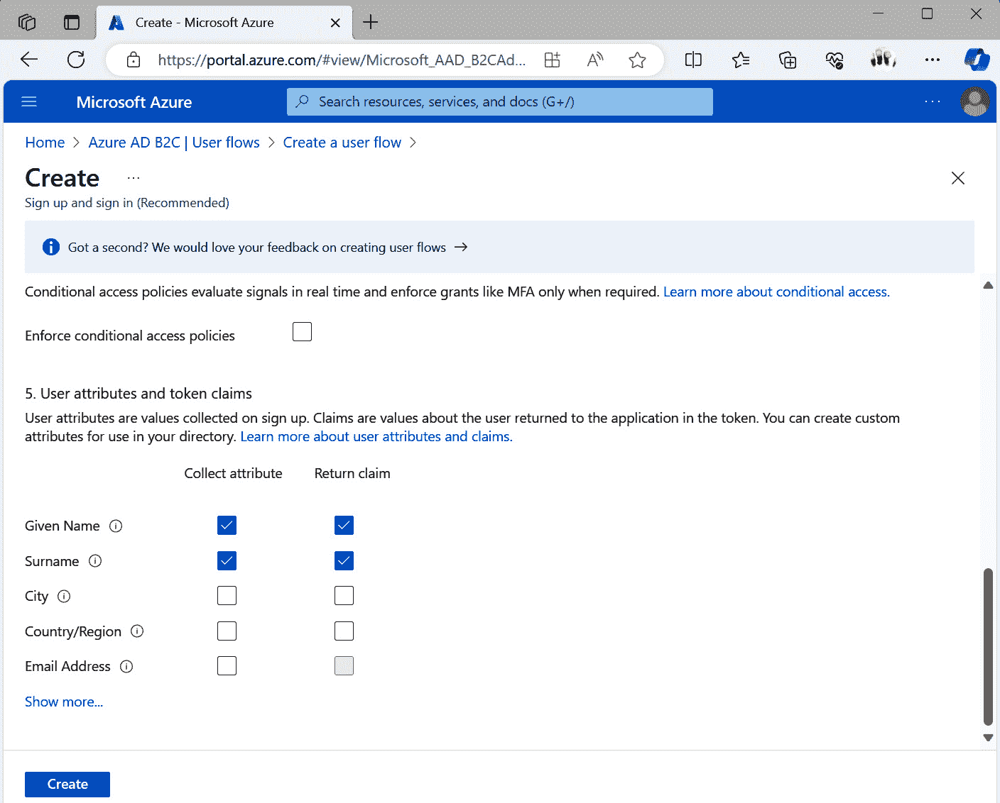

图 2.24：创建用户流程页面

点击**创建**以创建用户流程。

1.  现在，让我们配置我们的应用程序。首先，你需要添加适当的依赖项。为此，打开 Web 应用程序的 `pom.xml` 文件并添加 `org.springframework.boot:spring-boot-starter-oauth2-client` 依赖项：

    ```java
    <dependency>
       <groupId>org.springframework.boot</groupId>
       <artifactId>spring-boot-starter-oauth2-client
          </artifactId>
    </dependency>
    ```

1.  然后，你需要在 `resources` 文件夹中的 `application.yml` 文件中配置 Azure AD B2C 设置。用 B2C 设置替换 Oauth2 客户端设置。文件应如下所示：

    ```java
    server:
      port: 9080
    spring:
      cloud:
        azure:
          active-directory:
            b2c:
              enabled: true
              base-uri:
    https://sb3cookbook.b2clogin.com/
                  sb3cookbook.onmicrosoft.com/
              credential:
                client-id:
                  aa71b816-3d6e-4ee1-876b-83d5a60c4d84
    client-secret: '<the secret>'
              login-flow: sign-up-or-sign-in
    logout-success-url: http://localhost:9080
              user-flows:
                sign-up-or-sign-in: B2C_1_SUSI
              user-name-attribute-name: given_name
      data:
        redis:
          host: localhost
          port: 6379
    ```

    在 `client-secret` 字段中，设置你在*步骤 4*中保留的值。我建议将秘密值用引号括起来，因为秘密可能包含保留字符，这可能导致在处理 `application.yaml` 文件时出现意外的行为。

1.  要完成 OpenID 配置，允许用户使用 Azure AD B2C 登录你的应用程序，你需要通过应用 Azure AD OIDC 配置器来调整安全链。为此，通过在构造函数中添加 `AadB2cOidcLoginConfigurer` 允许 Bean 注入来修改 `SecurityConfiguration` 类，然后在现有的 `defaultSecurityFilterChain` 方法中使用它，如下所示：

    ```java
    private final AadB2cOidcLoginConfigurer configurer;
    public SecurityConfiguration(AadB2cOidcLoginConfigurer
    configurer) {
        this.configurer = configurer;
    }
    @Bean
    public SecurityFilterChain
    defaultSecurityFilterChain(HttpSecurity http) throws
    Exception {
        http
            .authorizeHttpRequests((authorize) ->
                authorize
                .requestMatchers("/").permitAll()
                .anyRequest().authenticated())
            .apply(configurer);
        return http.build();
    }
    ```

1.  到这一点，你可以运行你的 Web 应用程序并通过 Azure AD B2C 进行认证。然而，还有一件事待办，那就是用 Azure AD B2C 保护 RESTful API 服务器。

    为了解决这个问题，你可以修改依赖项。为此，打开 RESTful API 项目的 `pom.xml` 文件，并将 `org.springframework.boot:spring-boot-starter-oauth2-resource-server` 依赖项替换为 `com.azure.spring:spring-cloud-azure-starter-active-directory-b2c`：

    ```java
    <dependency>
      <groupId>com.azure.spring</groupId>
      <artifactId>spring-cloud-azure-starter-active-
        directory-b2c</artifactId>
    </dependency>
    ```

1.  现在，修改 `application.yml` 文件，以便它配置 Azure B2C 客户端注册：

    ```java
    spring:
      cloud:
        azure:
          active-directory:
            b2c:
              enabled: true
              profile:
                tenant-id:
                  b2b8f451-385b-4b9d-9268-244a8f05b32f
              credential:
                client-id:
                  aa71b816-3d6e-4ee1-876b-83d5a60c4d84
              base-uri: https://sb3cookbook.b2clogin.com
              user-flows:
                sign-up-or-sign-in: B2C_1_SISU
    ```

1.  现在，你可以运行 Web 应用程序和 RESTful 服务器，因为它们都受到 Azure AD B2C 的保护：

    1.  打开你的浏览器并导航到`http://localhost:8080/myself`。由于该方法受保护，你将被重定向到**Azure AD B2C 注册或登录**页面：

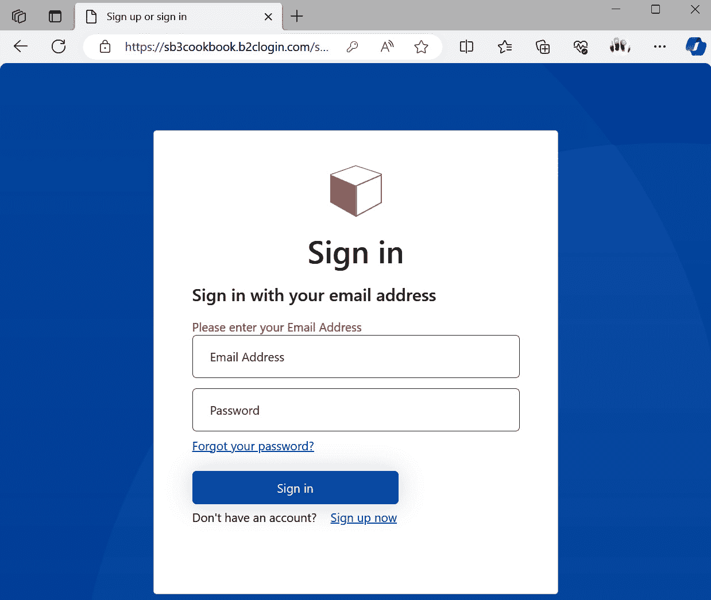

图 2.25：Azure AD B2C 默认的注册或登录页面

1.  如果你点击**立即注册**链接，你可以创建一个新用户：

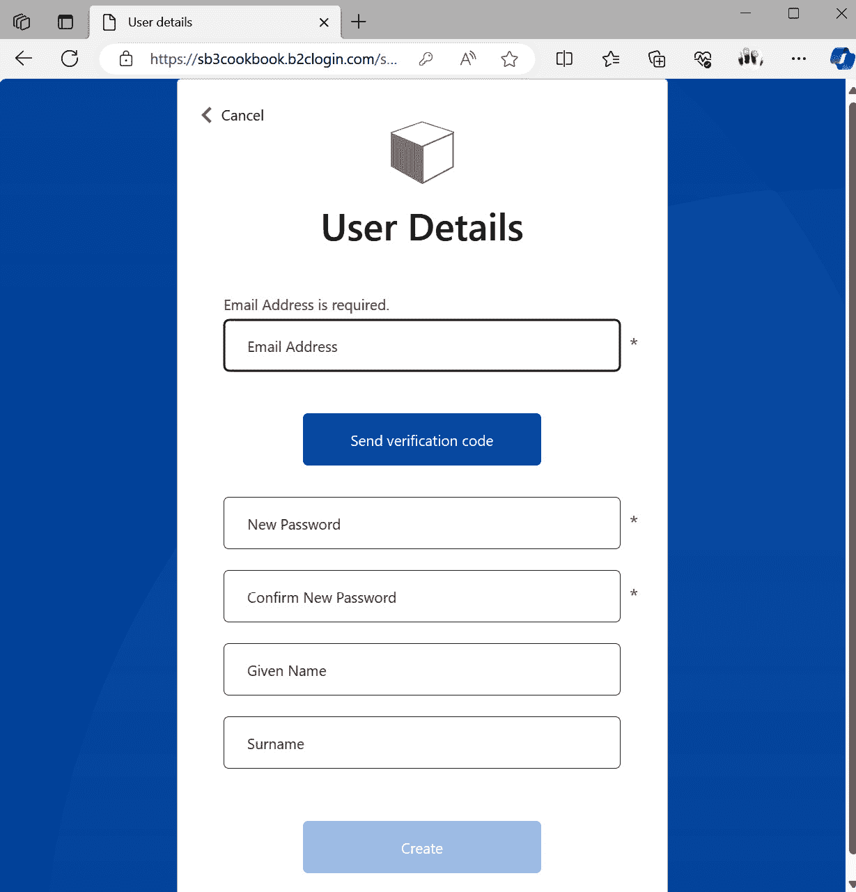

图 2.26：注册页面

1.  第一步是提供一个有效的电子邮件地址。一旦你完成这个步骤，点击**发送验证码**。你将收到一封包含验证码的电子邮件，你需要在页面上提供这个验证码。一旦验证成功，你就可以填写其余字段。

1.  当你返回到页面时，你会看到 Azure AD B2C 提供的声明：

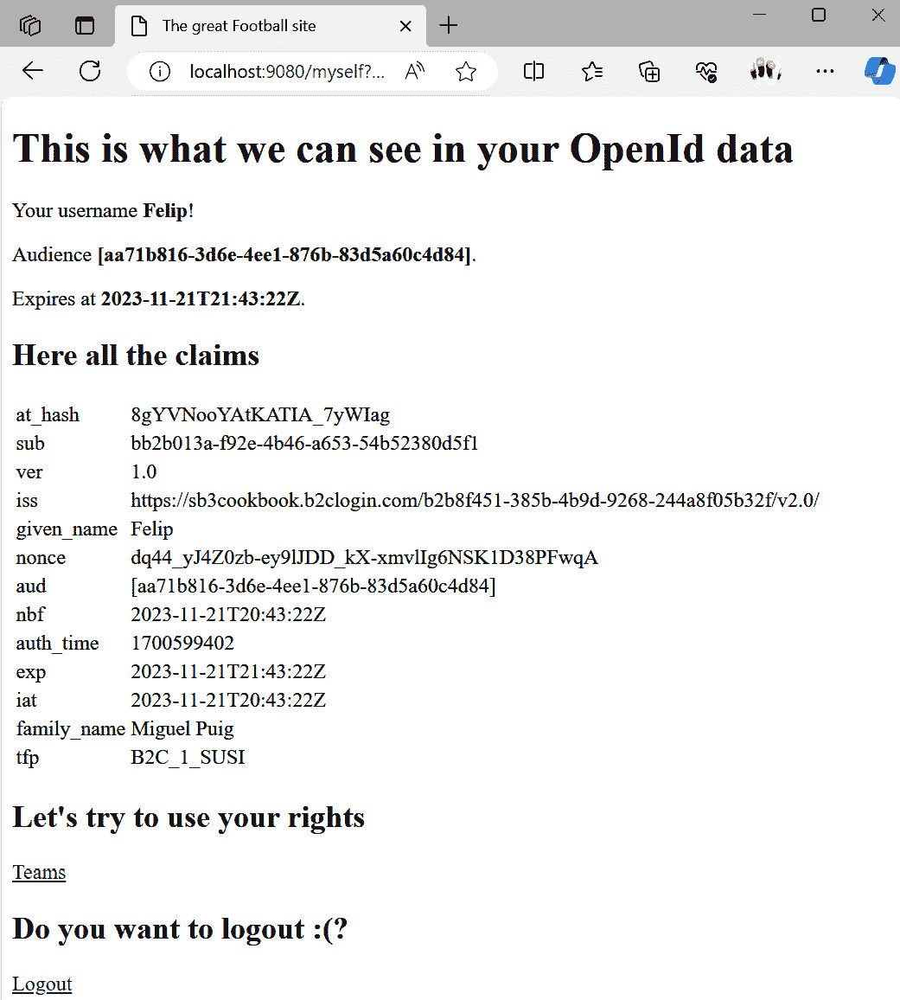

图 2.27：我们的网页显示了 Azure B2C 提供的声明

1.  如果你点击**团队**链接，你会看到与在*使用 OpenID 身份验证配置 MVC 应用程序*菜谱中看到相同的数据。

1.  如果你点击**注销**链接，你将被重定向到默认的注销页面：

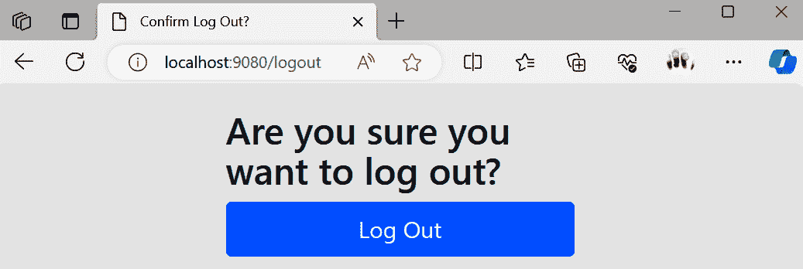

图 2.28：默认的注销页面

1.  最后，如果你点击**注销**按钮，你将被重定向到 Azure AD B2C 的注销端点。

## 它是如何工作的…

`com.azure.spring:spring-cloud-azure-starter-active-directory-b2c`依赖项包括我们在之前的菜谱中使用的 Spring OAuth2 客户端和 Spring OAuth2 资源启动器。在这些启动器之上，它还包括特定组件以适应 Azure AD B2C 特定的功能。例如，发现端点不能仅从发行者 URL 推断出来，因为它依赖于正在使用的 Azure AD B2C 策略。

Azure AD B2C 入门教程将 Azure 门户中使用的配置映射到`application.yml`文件上的配置。除此之外，应用程序不需要进行特定更改，因为它遵循 OAuth2 规范。

在 Azure AD B2C 中，我们定义了一个应用程序注册。这相当于 Spring Authorization Server 中的客户端概念。

Azure AD B2C 允许我们定义不同的策略，以便我们可以自定义用户体验。我们创建了一个使用默认设置的注册和登录流程的策略，但你也可以定义编辑个人资料或重置密码策略。其他有趣的特性包括定义自定义界面和集成其他身份提供者。例如，与谷歌账户、社交媒体提供者如 Facebook 和 Instagram 以及企业身份提供者如 Azure Entra 集成相当容易。

这个解决方案的主要优势之一是用户可以自己注册；他们不需要管理员为他们做这件事。

这个配方并不打算回顾 Azure AD B2C 的所有可能性——它已经提供，以帮助您了解如何将您的 Spring Boot 应用程序与 Azure AD B2C 集成。

## 还有更多...

一个有趣且可能更常见的场景是，当我们的 RESTful API 使用与 UI 应用程序不同的应用程序注册时。当我构建 RESTful API 时，我通常会考虑一件事：应该让多个客户端能够消费它。这适用于不同的场景，例如网页和移动版本，或者允许第三方应用程序消费一些 API。在这种情况下，您可以为您 RESTful API 创建一个专门的应用程序注册，并创建具有不同访问级别的不同应用程序角色。然后，您可以将相应的角色分配给消费者应用程序。

当您为 RESTful API 创建应用程序注册时，您可以通过打开清单并包括应用程序所需的角色来创建角色。例如，我们可以创建 `football.read` 角色以供一般消费者访问，以及 `football.admin` 角色以供管理访问。它看起来会是这样：

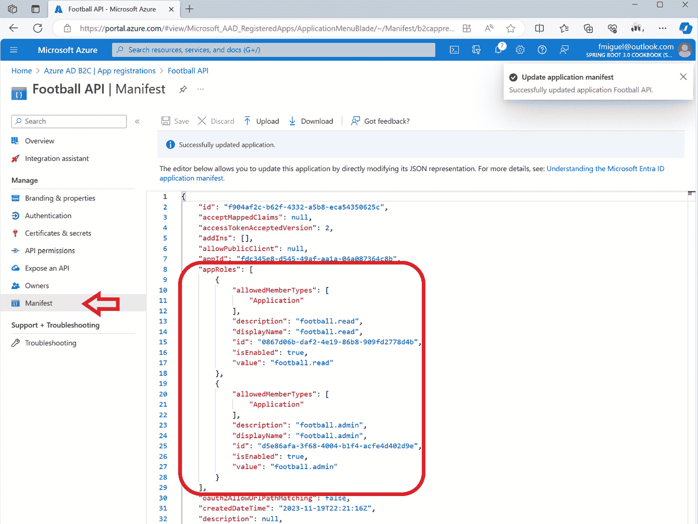

图 2.29：具有两个应用程序角色的应用程序注册清单

然后，在 RESTful 应用程序注册区域，转到 **暴露 API** 并分配一个 **应用程序 ID** **URI** 值：

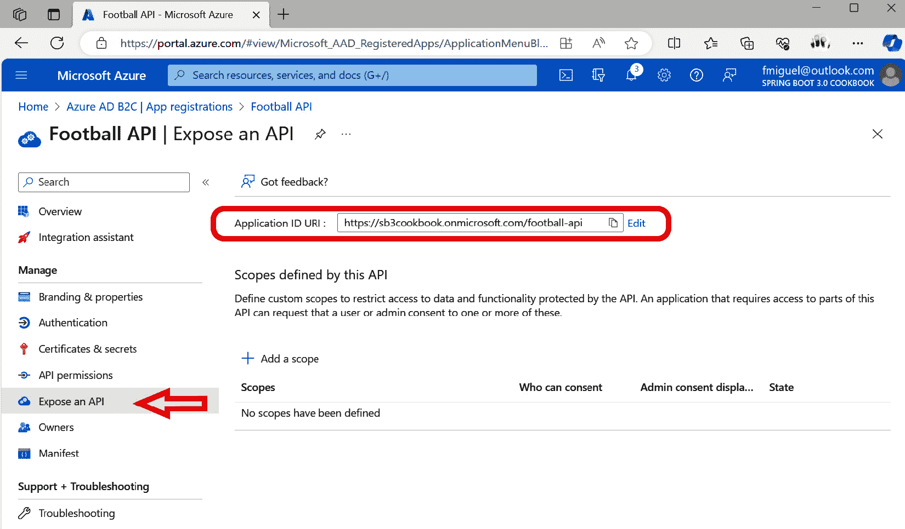

图 2.30：分配应用程序 ID URI 值

然后，我们可以为 RESTful API 分配权限。转到 **API 权限** 并分配 **应用程序权限**：

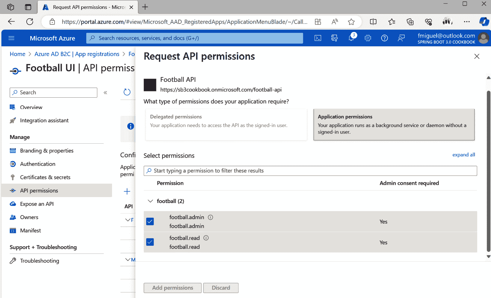

图 2.31：将应用程序权限分配给消费者应用程序

现在，RESTful API 有了自己的应用程序注册。这意味着您可以使用自己的受众来配置应用程序，而不是 UI 应用程序。要配置这一点，请转到 RESTful API 的 `application.yml` 文件，并将 `client-id` 属性更改为 RESTful API 应用程序注册的客户端 ID。

如果您想使用应用程序角色提供不同的访问级别，您将需要使用 Azure AD B2C 启动器中的 `AadJwtGrantedAuthoritiesConverter`。您可以在 `SecurityConfig` 类中注册该 Bean，如下所示：

```java
@Bean
public Converter<Jwt, Collection<GrantedAuthority>>
aadJwtGrantedAuthoritiesConverter() {
    return new AadJwtGrantedAuthoritiesConverter();
}
@Bean
public JwtAuthenticationConverter
aadJwtAuthenticationConverter() {
    JwtAuthenticationConverter converter = new
        JwtAuthenticationConverter();
        converter.setJwtGrantedAuthoritiesConverter(
            aadJwtGrantedAuthoritiesConverter());
    return converter;
}
```

默认情况下，Spring OAuth2 资源服务器仅转换 `scope` 声明，并且应用程序角色将包含在 `roles` 声明中。转换器为每个角色生成带有 `APPROLE_` 前缀的权限。因此，您可以使用这些权限来限制访问，如下所示：

```java
@Bean
public SecurityFilterChain filterChain(HttpSecurity http) throws Exception {
    return http
        .authorizeHttpRequests(authorize -> authorize
            .requestMatchers(HttpMethod.GET,
                "/football/teams/**").hasAnyAuthority(
                "APPROLE_football.read",
                "APPROLE_football.admin")
            .requestMatchers(HttpMethod.POST,
                "/football/teams/**").hasAnyAuthority(
                "APPROLE_football.admin")
            .anyRequest().authenticated())
        .oauth2ResourceServer(oauth2 ->
            oauth2.jwt(Customizer.withDefaults()))
        .build();
}
```

这就是具有应用程序角色的访问令牌的有效载荷看起来像：

```java
{
  «aud»: «fdc345e8-d545-49af-aa1a-04a087364c8b»,
  "iss": "https://login.microsoftonline.com/b2b8f451-385b-
    4b9d-9268-244a8f05b32f/v2.0",
  "iat": 1700518483,
  "nbf": 1700518483,
  "exp": 1700522383,
  "aio": "ASQA2/8VAAAAIXIjK+
    28DPOc4epV22pKGfqdRSnps2dtReyZY7MPhpk=",
  "azp": "aa71b816-3d6e-4ee1-876b-83d5a60c4d84",
  "azpacr": "1",
  "oid": "d88d83d6-421f-41e2-ba99-f49516fd439a",
  "rh": "0.ASQAUfS4sls4nUuSaCRKjwWzL-hFw_
    1F1a9JqhoEoIc2TIskAAA.",
  «roles»: [
    "football.read",
    "football.admin"
  ],
  "sub": "d88d83d6-421f-41e2-ba99-f49516fd439a",
  "tid": "b2b8f451-385b-4b9d-9268-244a8f05b32f",
  "uti": "JSxYHbHkpUS91mwBtxNaAA",
  "ver": "2.0"
}
```

通过这样做，只有允许的客户端应用程序才能消费 RESTful API。
